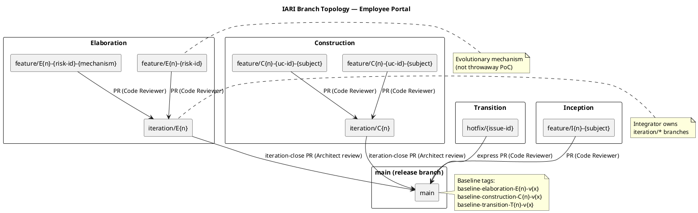
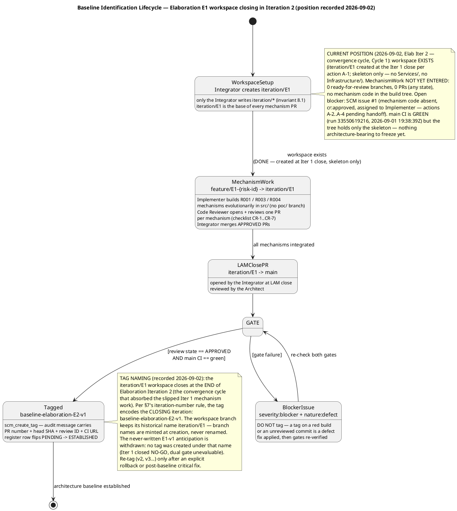
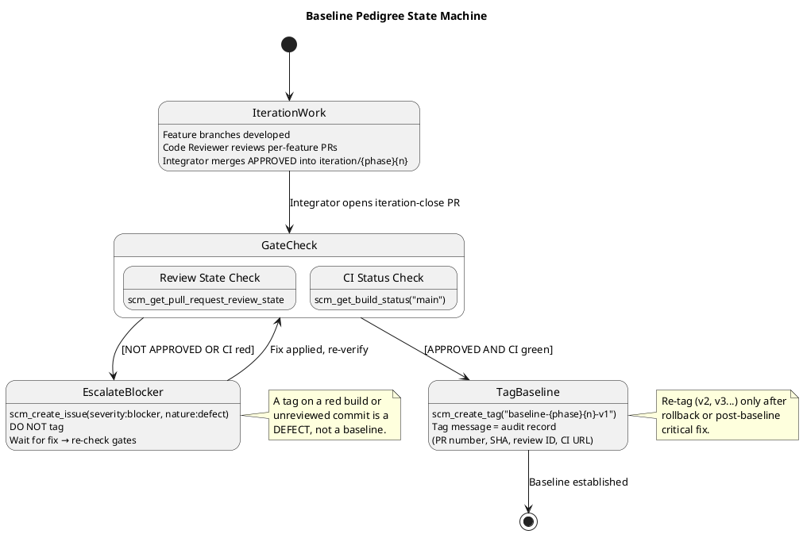
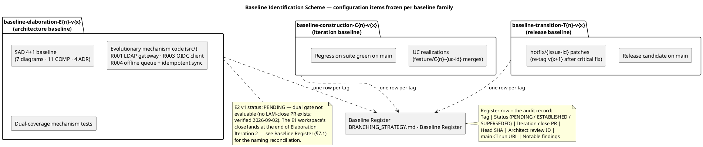

# Branching Strategy — Employee Portal

**Project:** Employee Portal (Cuba Corp)
**Phase:** Inception → Transition
**Current Phase:** Elaboration (Iteration 2 — convergence cycle)
**Maintainer:** Configuration Manager
**Last Updated:** 2026-09-02 (Elaboration Iter 2, Cycle 1 — position record refreshed to verified SCM state; E1-workspace close reconciled to tag `baseline-elaboration-E2-v1`; never-written E1-v1 register anticipation withdrawn)

---

## 1. Purpose

This document defines the canonical branching model, naming conventions, baseline
pedigree gates, and cross-phase invariants for the Employee Portal project. It is
**config-as-code** — it lives in the repository and is consumed by every role
(Integrator, Implementer, Code Reviewer, Architect, Configuration Manager).

Updates to this file go **direct to `main`** via `scm_commit_files`. No PR is opened
for this file — it is documentation, not source code, and gating it behind a Reviewer
would block downstream consumers from reading updated conventions.

---

## 2. Configuration Items

| CI Category | Examples | Versioning |
|---|---|---|
| Source code | `src/` (.NET 10, Razor Pages) | Git commits on feature/iteration branches |
| Artifacts (RUP) | Vision, UC Model, SAD, Design Model, Test Plans | `upsert_artifact` → SCM-tracked Markdown |
| Configuration | `docs/BRANCHING_STRATEGY.md`, CI workflows, `appsettings.json` | Direct commit to `main` (docs) or PR (config affecting runtime) |
| Test data | Test fixtures, seed scripts | Git-tracked on feature branches |
| Baselines | Tags `baseline-{phase}{n}-v{x}` | Immutable Git tags |

---

## 3. Branch Naming Conventions

| Pattern | Phase | Purpose |
|---|---|---|
| `feature/I{n}-{subject}` | Inception | Feasibility mechanism built evolutionarily in `src/` (rare; only if risk reduction requires code) |
| `feature/E{n}-{risk-id}[-{mechanism}]` | Elaboration | Evolutionary architectural mechanism (e.g., `feature/E1-R001-ldap-attribute-mapping`) |
| `iteration/E{n}` | Elaboration | Integration workspace per Elaboration iteration |
| `feature/C{n}-{uc-id}-{subject}` | Construction | UC realization (e.g., `feature/C1-UC-004-clock-in-out`) |
| `iteration/C{n}` | Construction | Integration workspace per Construction iteration |
| `hotfix/{issue-id}` | Transition | Hotfix from `main` (e.g., `hotfix/CR-015`) |
| `chore/{subject}` | Any | Non-functional repo maintenance (branching strategy, CI config, dependency bumps) |

**Non-conforming branches** are surfaced as SCM issues with labels
`severity:minor`, `nature:defect`, `naming-violation`. The Configuration Manager
does NOT auto-rename — the branch owner corrects the name.

---

## 4. Branch Topology

The diagram below shows the workspace hierarchy: feature branches → integration
branches → `main`, with the review/merge flow for each phase.

---

## 5. Per-Phase Branching Model

### 5.1 Inception (closed — LCO GO, Inception Iter 2)

- **Documentation only** — normally no implementation code.
- A feasibility mechanism, if genuinely required for risk reduction, is built
  **evolutionarily** in `src/` on `feature/I{n}-{subject}` (never throwaway).
- No baseline tags are written during Inception — architecture is not yet stable.
- RUP artifacts (Vision, UC Model, Supplementary Spec, SAD, Risk List, Iteration Plan)
  are the primary deliverables; they are persisted via `upsert_artifact` and tracked
  in SCM as Markdown.

### 5.2 Elaboration — Evolutionary Architectural Mechanism (Current Phase)

The architectural prototype is **evolutionary** — it becomes the Construction
baseline, not throwaway sample code.

- A technical risk is retired by **analysis** (the Software Architect reasons
  feasibility — no code) or by building the **real mechanism** in `src/` on
  `feature/E{n}-{risk-id}[-{mechanism}]` based on `iteration/E{n}`.
- The Architect records the decision as a process fact:
  `analysis-only` | `single-mechanism` | `candidates`.
- The Code Reviewer opens + reviews each mechanism PR (base `iteration/E{n}`) as
  production code.
- The Integrator merges the APPROVED mechanism into `iteration/E{n}`.
- For competing `candidates`, the Architect selects the winner and the Integrator
  closes the loser's PR per the recorded decision.
- At LAM (Late Elaboration close), the Integrator opens `iteration/E{n} → main`;
  the Architect reviews; the merge produces the Elaboration baseline.
- **There is no `samples/poc/` directory and no ephemeral `poc/*` branch.**

#### Baseline Identification Lifecycle — Elaboration E1 workspace (current position, recorded 2026-09-02)

### 5.3 Construction — Feature Branches

- UC realizations on `feature/C{n}-{uc-id}-{subject}` based on `iteration/C{n}`.
- The Code Reviewer reviews each feature PR.
- The Integrator merges APPROVED PRs into `iteration/C{n}`.
- At IOC (end of Construction iteration), the Integrator opens `iteration/C{n} → main`.
- The Architect reviews the iteration-close PR; the merge produces the Construction
  baseline.

### 5.4 Transition — Hotfixes

- `hotfix/{issue-id}` branched from `main`.
- Express review by the Code Reviewer.
- Merged to `main` with a patch baseline tag (`baseline-transition-T{n}-v{x+1}`).

---

## 6. Baseline Pedigree

A baseline tag is written **only** when two gates pass:

1. **Review gate:** `scm_get_pull_request_review_state` on the iteration-close PR
   returns `APPROVED` (Architect has signed off).
2. **CI gate:** `scm_get_build_status("main")` returns `green` **after** the merge.

Either gate fails → the Configuration Manager files an SCM issue
(`severity:blocker`, `nature:defect`) and **does NOT tag**.

---

## 7. Baseline Tag Naming

| Tag Pattern | Phase | Example |
|---|---|---|
| `baseline-elaboration-E{n}-v{x}` | Elaboration | `baseline-elaboration-E1-v1` |
| `baseline-construction-C{n}-v{x}` | Construction | `baseline-construction-C1-v1` |
| `baseline-transition-T{n}-v{x}` | Transition | `baseline-transition-T1-v1` |

- `{n}` = iteration number (integer, starting at 1).
- `{x}` = patch version (integer, starting at 1).
- Re-tag (`v2`, `v3`…) only after an explicit rollback or post-baseline critical fix.
- Normal iteration work targets the **next** iteration's tag, not a re-tag of the previous.

### Tag Message (Audit Record)

Every baseline tag message MUST contain:

- Iteration-close PR number and head commit SHA
- Architect approval review ID
- `main` CI run URL at tag time
- Notable findings (naming violations, deferred items, re-tag justifications)

### 7.1 Baseline Register — Baseline Identification Scheme

The register is the **authoritative identification record** of every baseline tag
(the CM plan's baseline identification scheme, per the Elaboration Iter 1 work order).
One row per tag, appended at iteration close by the Configuration Manager **after**
dual-gate verification. A row is never edited after its tag is written — a re-tag
(`v{x+1}`) appends a NEW row and flips the prior row's status to `SUPERSEDED`, with
the rollback justification recorded in the superseding row.

**Naming reconciliation (recorded 2026-09-02):** the `iteration/E1` workspace closes
at the end of **Elaboration Iteration 2** (the convergence cycle that absorbed the
Iteration 1 mechanism work after the NO-GO LCA verdict). Per the iteration-number
rule above, the tag encodes the **closing** iteration: `baseline-elaboration-E2-v1`.
The workspace branch keeps its historical name `iteration/E1` — branch names are
minted at creation and never renamed. The Iteration 1 anticipation of
`baseline-elaboration-E1-v1` is **withdrawn**: no tag was ever created under that
name (Iteration 1 closed NO-GO with zero PRs; the dual gate was unevaluable), so no
register row ever recorded an ESTABLISHED tag — replacing the anticipation row
violates no register discipline.

| Tag | Status | Iteration-close PR | Head SHA | Architect review ID | `main` CI run URL (tag time) | Notable findings |
|---|---|---|---|---|---|---|
| `baseline-elaboration-E2-v1` | **PENDING** — dual gate not yet evaluable | — (no `iteration/E1 → main` PR exists; verified 2026-09-02) | — | — | — (`main` CI green at 2026-09-01, run 33550619216 — pre-merge state, NOT tag-time evidence) | Open blocker: SCM issue #1 (R001/R003/R004 mechanism code absent from SCM; `cr:approved`, assigned to Implementer — actions A-2…A-4 pending handoff); 0 `ready-for-review` branches, 0 PRs (any state) |

**Status vocabulary:** `PENDING` (iteration in progress; gates not yet evaluable) →
`ESTABLISHED` (tag written on an APPROVED + CI-green commit) → `SUPERSEDED` (replaced
by `v{x+1}` after rollback or post-baseline critical fix — justification mandatory).

**Register discipline:** the Configuration Manager re-verifies both gates
(`scm_get_pull_request_review_state` + `scm_get_build_status("main")`) immediately
before every `scm_create_tag`, then flips the row to `ESTABLISHED` in the same
commit cycle. A register row claiming `ESTABLISHED` without both gate values
recorded is a defect.

### 7.2 Baseline Identification Content Map — what each baseline freezes

---

## 8. Cross-Phase Invariants

1. **Only the Integrator writes `iteration/*` and `main`.** No other role pushes
   directly to these branches.
2. **`ready-for-review` is the Implementer → Code Reviewer handoff label.** The
   Implementer labels a feature branch `ready-for-review`; the Code Reviewer lists
   branches with that label to find work.
3. **A baseline tag freezes only an APPROVED + CI-green commit.** No exceptions.
4. **No `poc/` branches or `samples/` directories.** All code is evolutionary and
   lives in `src/`.
5. **`docs/BRANCHING_STRATEGY.md` updates go direct to `main`** via
   `scm_commit_files` — no PR, no review label.
6. **CI triggers on all branch families** for both push and PR events.

---

## 9. Change Control Interface

The Change Control Manager (CCM) owns the Change Request state machine
(`cr:new` → `cr:approved` → `cr:complete`). The Configuration Manager does NOT
triage CRs or evaluate impact — that is the CCM's responsibility.

The Configuration Manager consumes CCM-triaged outcomes **indirectly** via the
branches and PRs they authorize:

- A `cr:approved` CR authorizes a feature branch (e.g., `feature/C2-UC-007-browse-news`).
- The Implementer creates the branch and implements the change.
- Normal review + merge flow applies.
- The Configuration Manager verifies naming compliance and gate integrity, not CR
  triage.

---

## 10. Escalation Procedures

| Condition | Action | Issue Labels |
|---|---|---|
| Iteration-close PR not APPROVED | File issue, do NOT tag | `severity:blocker`, `nature:defect` |
| `main` CI red after merge | File issue, do NOT tag | `severity:blocker`, `nature:defect` |
| Branch name violates convention | File issue, do NOT auto-rename | `severity:minor`, `nature:defect`, `naming-violation` |
| Re-tag without rollback justification | Reject re-tag, file issue | `severity:minor`, `nature:defect` |

---

## 11. Tooling

| Tool | Purpose |
|---|---|
| Git (SCM) | Version control, branching, tagging |
| CI/CD pipeline | Build + test on push and PR; status checked before baseline tagging |
| GitHub Issues | Change Requests (CCM), gate-failure escalations (CM), naming violations (CM) |
| Pull Requests | Code review gate; iteration-close PR carries Architect approval |
| Branch labels | `ready-for-review` handoff; cross-role coordination |

---

## 12. Project-Specific Context

- **Deployment:** Custom-built, single-node Windows Server (CON-008). No cloud.
- **Auth:** OIDC via existing Keycloak (CON-004). Portal is a client only.
- **Directory:** Live LDAP read from AD (CON-005, CON-006). No sync, no local copy.
- **DB:** PostgreSQL (CON-003). Stores only `uid → category` (CON-006).
- **Tech stack:** .NET 10 REST API + Razor Pages (CON-001, CON-002).
- **Key risks:** R001 (LDAP attribute gaps — HIGH), R002 (clocking adoption); Risk List
  entries R003 (OIDC), R004 (offline resilience), R010 (STK-004 deliverables).
- **Elaboration mechanism work (stakeholder decision, Elab Iter 1):** the PoC is
  produced in Elaboration and validated **empirically** — R001 against a disposable
  LDAP directory, R003 against a stub OIDC issuer, R004 direct — all evolutionary in
  `src/` on `feature/E1-{risk-id}` branches based on `iteration/E1`.
- **Elaboration test priority:** R001 > R003 > R004; first test cases target UC-001, UC-004, UC-010.
- **Three blocking deployment dependencies on STK-004:** server, LDAP, Keycloak client.

---

## Traceability

| Element | Traces From | Link Type | Traces To |
|---|---|---|---|
| BRANCHING_STRATEGY.md | CON-001, CON-002, CON-003, CON-004, CON-005, CON-006, CON-008 | DependsOn | All phase baselines |
| Branch naming conventions | RUP Ch.13 (Manage Baselines and Releases) | Refines | feature/*, iteration/*, hotfix/* branches |
| Baseline tag conventions | RUP Ch.13 | Refines | baseline-elaboration-*, baseline-construction-*, baseline-transition-* |
| Gate verification process | RUP Ch.13 | Refines | scm_get_pull_request_review_state, scm_get_build_status |
| Escalation procedures | RUP Ch.13 (CCB) | DependsOn | scm_create_issue |
| R001 (LDAP risk) | Declared risk | DependsOn | feature/E1-R001-* branch family |
| STK-004 (Infra Team) | Declared stakeholder | DependsOn | Deployment dependencies (server, LDAP, Keycloak client) |
| Baseline Register (§7.1) | RUP Ch.13; Elaboration Iter 1 work order (baseline identification scheme) | Refines | `baseline-elaboration-E2-v1` (PENDING — E1 workspace closes at end of Elab Iter 2); every future baseline tag |
| Baseline Identification Content Map (§7.2) | RUP Ch.13; SAD (4+1 baseline, COMP-001…011, ADR-001…004) | Refines | SAD, mechanism code (`src/`), regression suite, release candidates |
| E1 lifecycle diagram (§5.2) | BRANCHING_STRATEGY §5.2, §6; Review Record F-CR-E1-1 (current position); verified SCM state 2026-09-02 | Refines | `iteration/E1 → main` flow; `baseline-elaboration-E2-v1` (tag at the E1 workspace's close, end of Elab Iter 2) |
| CONTRIBUTING.md (branch-strategy section) | Review Record F-CR-E1-2 / A-5 (CM share — committed, verified 2026-09-02) | Implements | CR-1 citable rule baseline (branch/PR/merge matters) |
