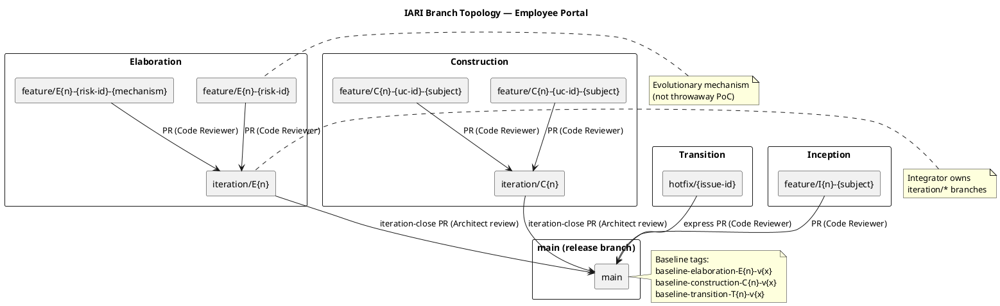
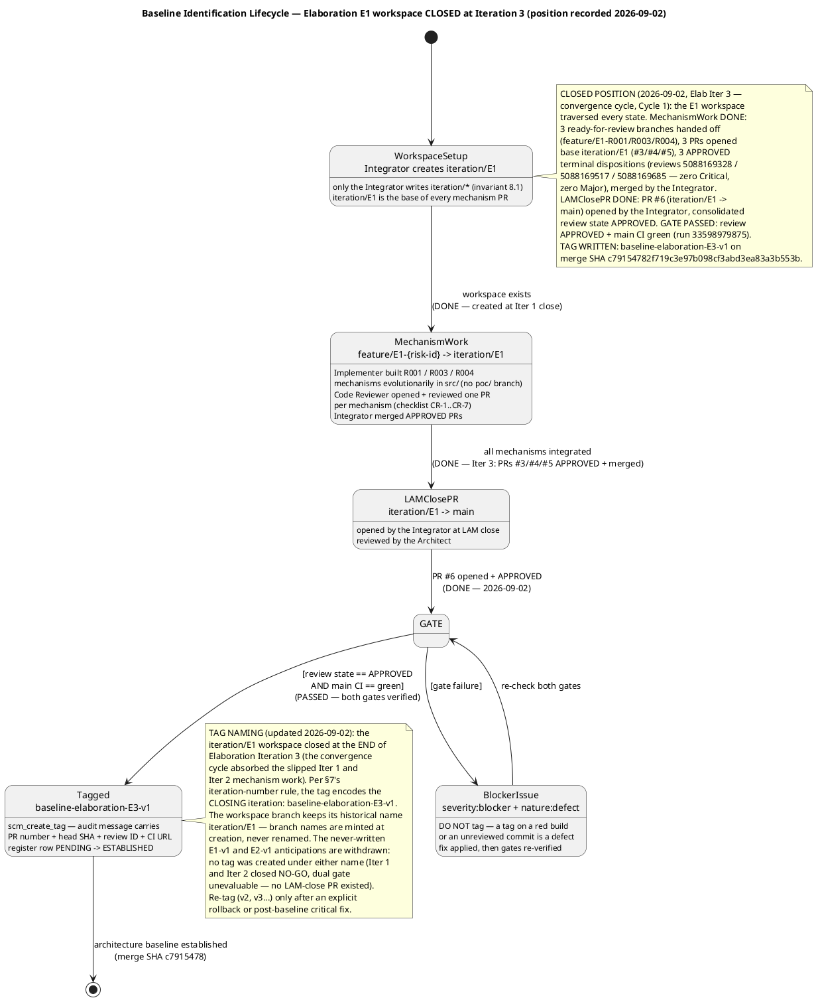
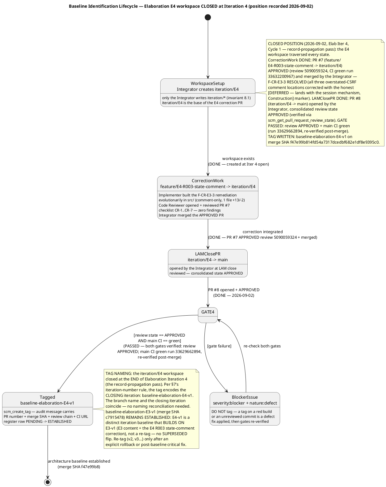
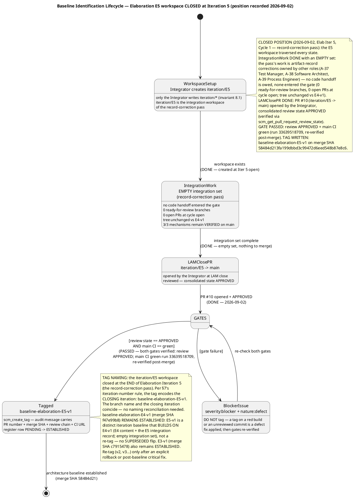
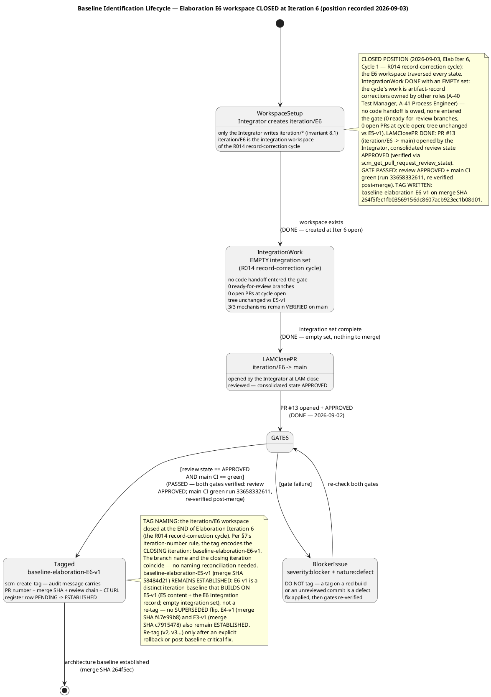
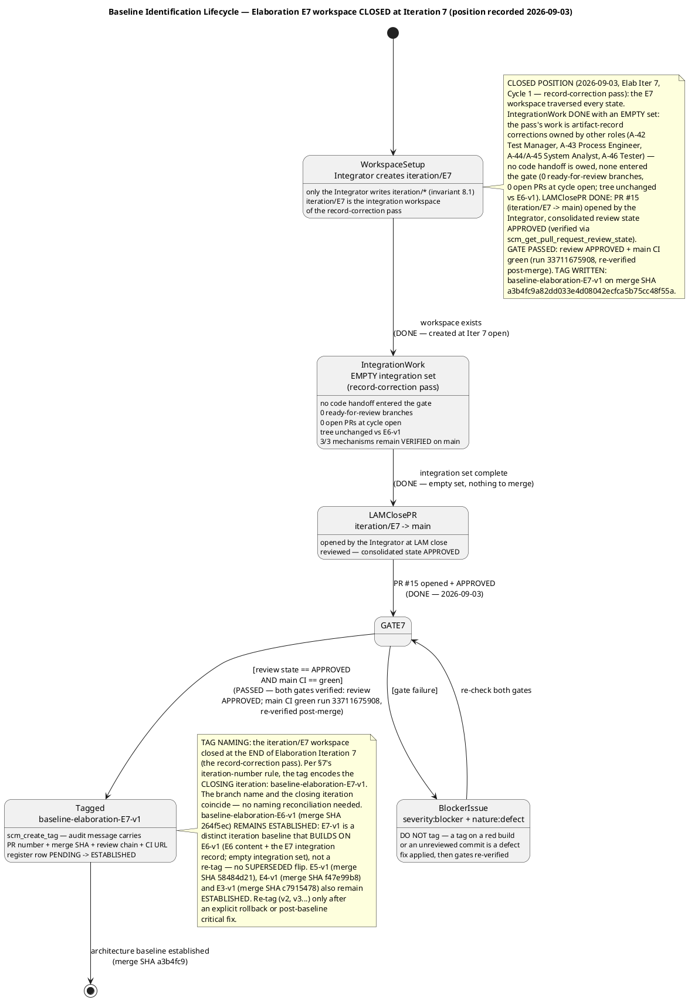
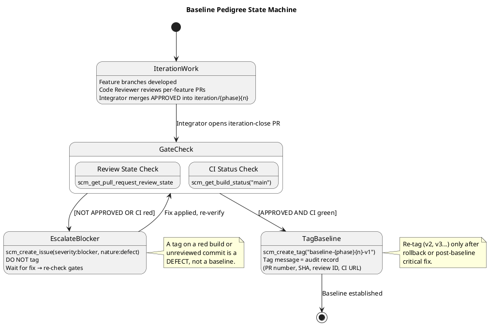
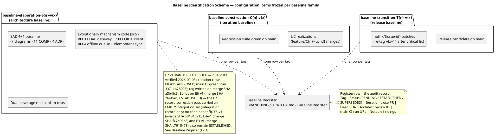

# Branching Strategy — Employee Portal

**Project:** Employee Portal (Cuba Corp)
**Phase:** Inception → Transition
**Current Phase:** Elaboration (Iteration 7 — record-correction pass)
**Maintainer:** Configuration Manager
**Last Updated:** 2026-09-03 (Elaboration Iter 7, Cycle 1 — E7 workspace CLOSED: iteration-close PR #15 merged to main (consolidated review APPROVED + main CI green, re-verified post-merge); tag `baseline-elaboration-E7-v1` written on merge SHA `a3b4fc9`; register row ESTABLISHED. E3-v1, E4-v1, E5-v1 and E6-v1 remain ESTABLISHED — E7-v1 is a distinct iteration baseline building on them, not a re-tag)

---

## 1. Purpose

This document defines the canonical branching model, naming conventions, baseline
pedigree gates, and cross-phase invariants for the Employee Portal project. It is
**config-as-code** — it lives in the repository and is consumed by every role
(Integrator, Implementer, Code Reviewer, Architect, Configuration Manager).

Updates to this file go **direct to `main`** via `scm_commit_files`. No PR is opened
for this file — it is documentation, not source code, and gating it behind a Reviewer
would block downstream consumers from reading updated conventions.

---

## 2. Configuration Items

| CI Category | Examples | Versioning |
|---|---|---|
| Source code | `src/` (.NET 10, Razor Pages) | Git commits on feature/iteration branches |
| Artifacts (RUP) | Vision, UC Model, SAD, Design Model, Test Plans | `upsert_artifact` → SCM-tracked Markdown |
| Configuration | `docs/BRANCHING_STRATEGY.md`, CI workflows, `appsettings.json` | Direct commit to `main` (docs) or PR (config affecting runtime) |
| Test data | Test fixtures, seed scripts | Git-tracked on feature branches |
| Baselines | Tags `baseline-{phase}{n}-v{x}` | Immutable Git tags |

---

## 3. Branch Naming Conventions

| Pattern | Phase | Purpose |
|---|---|---|
| `feature/I{n}-{subject}` | Inception | Feasibility mechanism built evolutionarily in `src/` (rare; only if risk reduction requires code) |
| `feature/E{n}-{risk-id}[-{mechanism}]` | Elaboration | Evolutionary architectural mechanism (e.g., `feature/E1-R001-ldap-attribute-mapping`) |
| `iteration/E{n}` | Elaboration | Integration workspace per Elaboration iteration |
| `feature/C{n}-{uc-id}-{subject}` | Construction | UC realization (e.g., `feature/C1-UC-004-clock-in-out`) |
| `iteration/C{n}` | Construction | Integration workspace per Construction iteration |
| `hotfix/{issue-id}` | Transition | Hotfix from `main` (e.g., `hotfix/CR-015`) |
| `chore/{subject}` | Any | Non-functional repo maintenance (branching strategy, CI config, dependency bumps) |

**Non-conforming branches** are surfaced as SCM issues with labels
`severity:minor`, `nature:defect`, `naming-violation`. The Configuration Manager
does NOT auto-rename — the branch owner corrects the name.

---

## 4. Branch Topology

The diagram below shows the workspace hierarchy: feature branches → integration
branches → `main`, with the review/merge flow for each phase.

---

## 5. Per-Phase Branching Model

### 5.1 Inception (closed — LCO GO, Inception Iter 2)

- **Documentation only** — normally no implementation code.
- A feasibility mechanism, if genuinely required for risk reduction, is built
  **evolutionarily** in `src/` on `feature/I{n}-{subject}` (never throwaway).
- No baseline tags are written during Inception — architecture is not yet stable.
- RUP artifacts (Vision, UC Model, Supplementary Spec, SAD, Risk List, Iteration Plan)
  are the primary deliverables; they are persisted via `upsert_artifact` and tracked
  in SCM as Markdown.

### 5.2 Elaboration — Evolutionary Architectural Mechanism (Current Phase)

The architectural prototype is **evolutionary** — it becomes the Construction
baseline, not throwaway sample code.

- A technical risk is retired by **analysis** (the Software Architect reasons
  feasibility — no code) or by building the **real mechanism** in `src/` on
  `feature/E{n}-{risk-id}[-{mechanism}]` based on `iteration/E{n}`.
- The Architect records the decision as a process fact:
  `analysis-only` | `single-mechanism` | `candidates`.
- The Code Reviewer opens + reviews each mechanism PR (base `iteration/E{n}`) as
  production code.
- The Integrator merges the APPROVED mechanism into `iteration/E{n}`.
- For competing `candidates`, the Architect selects the winner and the Integrator
  closes the loser's PR per the recorded decision.
- At LAM (Late Elaboration close), the Integrator opens `iteration/E{n} → main`;
  the Architect reviews; the merge produces the Elaboration baseline.
- **There is no `samples/poc/` directory and no ephemeral `poc/*` branch.**

#### Baseline Identification Lifecycle — Elaboration E1 workspace (CLOSED, recorded 2026-09-02)

#### Baseline Identification Lifecycle — Elaboration E4 workspace (CLOSED, recorded 2026-09-02)

#### Baseline Identification Lifecycle — Elaboration E5 workspace (CLOSED, recorded 2026-09-02)

#### Baseline Identification Lifecycle — Elaboration E6 workspace (CLOSED, recorded 2026-09-03)

#### Baseline Identification Lifecycle — Elaboration E7 workspace (CLOSED, recorded 2026-09-03)

### 5.3 Construction — Feature Branches

- UC realizations on `feature/C{n}-{uc-id}-{subject}` based on `iteration/C{n}`.
- The Code Reviewer reviews each feature PR.
- The Integrator merges APPROVED PRs into `iteration/C{n}`.
- At IOC (end of Construction iteration), the Integrator opens `iteration/C{n} → main`.
- The Architect reviews the iteration-close PR; the merge produces the Construction
  baseline.

### 5.4 Transition — Hotfixes

- `hotfix/{issue-id}` branched from `main`.
- Express review by the Code Reviewer.
- Merged to `main` with a patch baseline tag (`baseline-transition-T{n}-v{x+1}`).

---

## 6. Baseline Pedigree

A baseline tag is written **only** when two gates pass:

1. **Review gate:** `scm_get_pull_request_review_state` on the iteration-close PR
   returns `APPROVED` (Architect has signed off).
2. **CI gate:** `scm_get_build_status("main")` returns `green` **after** the merge.

Either gate fails → the Configuration Manager files an SCM issue
(`severity:blocker`, `nature:defect`) and **does NOT tag**.

---

## 7. Baseline Tag Naming

| Tag Pattern | Phase | Example |
|---|---|---|
| `baseline-elaboration-E{n}-v{x}` | Elaboration | `baseline-elaboration-E1-v1` |
| `baseline-construction-C{n}-v{x}` | Construction | `baseline-construction-C1-v1` |
| `baseline-transition-T{n}-v{x}` | Transition | `baseline-transition-T1-v1` |

- `{n}` = iteration number (integer, starting at 1).
- `{x}` = patch version (integer, starting at 1).
- Re-tag (`v2`, `v3`…) only after an explicit rollback or post-baseline critical fix.
- Normal iteration work targets the **next** iteration's tag, not a re-tag of the previous.

### Tag Message (Audit Record)

Every baseline tag message MUST contain:

- Iteration-close PR number and head commit SHA
- Architect approval review ID
- `main` CI run URL at tag time
- Notable findings (naming violations, deferred items, re-tag justifications)

### 7.1 Baseline Register — Baseline Identification Scheme

The register is the **authoritative identification record** of every baseline tag
(the CM plan's baseline identification scheme, per the Elaboration Iter 1 work order).
One row per tag, appended at iteration close by the Configuration Manager **after**
dual-gate verification. A row is never edited after its tag is written — a re-tag
(`v{x+1}`) appends a NEW row and flips the prior row's status to `SUPERSEDED`, with
the rollback justification recorded in the superseding row.

**Naming reconciliation (updated 2026-09-02, Elab Iter 3):** the `iteration/E1`
workspace closed at the end of **Elaboration Iteration 3** (the convergence cycle
that absorbed the Iteration 1 and Iteration 2 mechanism work after the NO-GO LCA
verdicts). Per the iteration-number rule above, the tag encodes the **closing**
iteration: `baseline-elaboration-E3-v1`. The workspace branch keeps its historical
name `iteration/E1` — branch names are minted at creation and never renamed. The
never-written `baseline-elaboration-E1-v1` and `baseline-elaboration-E2-v1`
anticipations are **withdrawn**: no tag was ever created under either name
(Iterations 1 and 2 closed NO-GO with no LAM-close PR; the dual gate was
unevaluable), so no register row ever recorded an ESTABLISHED tag under those
names — replacing the anticipation rows violates no register discipline.

**E4 position (recorded 2026-09-02, Elab Iter 4):** the `iteration/E4` workspace
closed at the end of **Elaboration Iteration 4** (the record-propagation pass); its
tag is `baseline-elaboration-E4-v1` — branch name and closing iteration coincide,
so no reconciliation is needed. `baseline-elaboration-E3-v1` **remains ESTABLISHED**:
E4-v1 is a distinct iteration baseline that **builds on** E3-v1 (E3 content plus
the E4 R003 state-comment correction), not a re-tag — no SUPERSEDED flip applies.

**E5 position (recorded 2026-09-02, Elab Iter 5):** the `iteration/E5` workspace
closed at the end of **Elaboration Iteration 5** (the record-correction pass); its
tag is `baseline-elaboration-E5-v1` — branch name and closing iteration coincide,
so no reconciliation is needed. `baseline-elaboration-E4-v1` **remains ESTABLISHED**:
E5-v1 is a distinct iteration baseline that **builds on** E4-v1 (E4 content plus
the E5 integration record; the integration set was EMPTY — no code handoff entered
the gate this pass), not a re-tag — no SUPERSEDED flip applies. E3-v1 likewise
remains ESTABLISHED.

**E6 position (recorded 2026-09-03, Elab Iter 6):** the `iteration/E6` workspace
closed at the end of **Elaboration Iteration 6** (the R014 record-correction cycle);
its tag is `baseline-elaboration-E6-v1` — branch name and closing iteration coincide,
so no reconciliation is needed. `baseline-elaboration-E5-v1` **remains ESTABLISHED**:
E6-v1 is a distinct iteration baseline that **builds on** E5-v1 (E5 content plus
the E6 integration record; the integration set was EMPTY — no code handoff entered
the gate this cycle), not a re-tag — no SUPERSEDED flip applies. E4-v1 and E3-v1
likewise remain ESTABLISHED.

**E7 position (recorded 2026-09-03, Elab Iter 7):** the `iteration/E7` workspace
closed at the end of **Elaboration Iteration 7** (the record-correction pass); its
tag is `baseline-elaboration-E7-v1` — branch name and closing iteration coincide,
so no reconciliation is needed. `baseline-elaboration-E6-v1` **remains ESTABLISHED**:
E7-v1 is a distinct iteration baseline that **builds on** E6-v1 (E6 content plus
the E7 integration record; the integration set was EMPTY — no code handoff entered
the gate this pass), not a re-tag — no SUPERSEDED flip applies. E5-v1, E4-v1 and
E3-v1 likewise remain ESTABLISHED.

| Tag | Status | Iteration-close PR | Head SHA | Architect review ID | `main` CI run URL (tag time) | Notable findings |
|---|---|---|---|---|---|---|
| `baseline-elaboration-E3-v1` | **ESTABLISHED** — tag written 2026-09-02 after dual-gate verification | #6 (`iteration/E1 → main`, merged 2026-09-02) | `c79154782f719c3e97b098cf3abd3ea83a3b553b` | PR #6 consolidated review state **APPROVED** (verified via `scm_get_pull_request_review_state`, 2026-09-02); per-mechanism approval chain (Code Reviewer, base `iteration/E1`): PR #3 R001 — review 5088169328, PR #4 R003 — review 5088169517, PR #5 R004 — review 5088169685 | run 33598979875 — https://api.github.com/repos/banense-test/employee-portal/actions/runs/33598979875/logs (completed 2026-09-02 06:29:05Z) | 3 Minor code-review findings open (F-CR-E3-1 interim INT-016 adapter deviation — DEFERRED to Construction Iter 1 per R008; F-CR-E3-2 INT-011 contract-table gap — Designer next pass; F-CR-E3-3 OIDC state-comment overstatement — Implementer next code touch): owned, non-blocking, phase-exit conditions per the stakeholder all-findings directive. SCM Issue #1 (severity:blocker, cr:approved): remediation evidence now in SCM (PRs #3/#4/#5 merged to `iteration/E1`; PR #6 merged to `main`) — CR state transition owned by the CCM. LCA evidence package (TC-001…TC-023 execution + PoC empirical results) remains open work owned by other roles — **this tag freezes the architecture baseline; it does NOT declare the LCA milestone achieved** |
| `baseline-elaboration-E4-v1` | **ESTABLISHED** — tag written 2026-09-02 after dual-gate verification | #8 (`iteration/E4 → main`, merged 2026-09-02) | `f47e99b814fd54a7317dcedbf682e1df8e9395c0` | PR #8 consolidated review state **APPROVED** (verified via `scm_get_pull_request_review_state`, 2026-09-02); correction approval chain (Code Reviewer, base `iteration/E4`): PR #7 R003 state-comment — review 5090059324, CI green run 33632200967 | run 33629662894 — https://api.github.com/repos/banense-test/employee-portal/actions/runs/33629662894/logs (completed 2026-09-02 12:25:01Z; re-verified post-merge) | F-CR-E3-3 RESOLVED in this baseline (PR #7 — all three overstated-CSRF comment locations corrected with the honest [DEFERRED — lands with the session mechanism, Construction] marker). F-CR-E3-1 (interim INT-016 adapter — PG adapter lands Construction Iter 1 per R008) and F-CR-E3-2 (INT-011 contract-table evolution — Designer next pass) remain open, Construction-scope/Designer-owned, non-Elaboration-blocking. Builds on `baseline-elaboration-E3-v1` (merge SHA `c7915478`) — distinct iteration baseline, not a re-tag. The 8 BLOCKED test cases are a recorded SCOPE decision — production AD and Keycloak integration belongs to Construction (R010), deferred, not missing (stakeholder framing directive, Iter 3). **This tag freezes the architecture baseline at E4 close; it does NOT declare the LCA milestone achieved** — phase-level sanction remains withheld per the stakeholder all-findings directive; the fresh sanction request fires at the R6 re-presentation with the evidence package |
| `baseline-elaboration-E5-v1` | **ESTABLISHED** — tag written 2026-09-02 after dual-gate verification | #10 (`iteration/E5 → main`, merged 2026-09-02) | `58484d213fa199dbbd3c99472d6eed548b87e8c6` | PR #10 consolidated review state **APPROVED** (verified via `scm_get_pull_request_review_state`, 2026-09-02); integration set EMPTY this pass — no per-mechanism PR chain (the 3/3 mechanisms remain VERIFIED on main from the E3/E4 approval chain: PR #3 R001 — review 5088169328, PR #4 R003 — review 5088169517, PR #5 R004 — review 5088169685, PR #7 R003 state-comment — review 5090059324) | run 33639518709 — https://api.github.com/repos/banense-test/employee-portal/actions/runs/33639518709/logs (completed 2026-09-02 14:04:14Z; re-verified post-merge) | EMPTY integration set — E5 is the record-correction pass; no code handoff entered the gate (0 ready-for-review branches, 0 open PRs at cycle open; tree unchanged vs E4-v1). Open record-propagation findings are artifact-record corrections owned by other roles (TES#F3 Major — A-37 Test Manager; PoC#F3 Minor — A-38 Software Architect; DC#F4 Minor — A-39 Process Engineer) — none is an SCM defect, none blocks this tag. F-CR-E3-1 (interim INT-016 adapter — PG adapter lands Construction Iter 1 per R008) and F-CR-E3-2 (INT-011 contract-table evolution — Designer next pass) remain open, Construction-scope/Designer-owned, non-Elaboration-blocking. Zero open SCM issues — Issues #1/#2/#9 all closed (cr:complete) on their verified evidence. The 8 BLOCKED test cases are a recorded SCOPE decision — production AD and Keycloak integration belongs to Construction (R010), deferred, not missing (stakeholder framing directive, Iter 3). Builds on `baseline-elaboration-E4-v1` (merge SHA `f47e99b8`) — distinct iteration baseline, not a re-tag. **This tag freezes the architecture baseline at E5 close; it does NOT declare the LCA milestone achieved** — phase-level sanction remains withheld per the stakeholder all-findings directive; the fresh sanction request fires at the R6 re-presentation with the evidence package |
| `baseline-elaboration-E6-v1` | **ESTABLISHED** — tag written 2026-09-03 after dual-gate verification | #13 (`iteration/E6 → main`, merged 2026-09-02) | `264f5fec1fb03569156dc8607acb923ec1b08d01` | PR #13 consolidated review state **APPROVED** (verified via `scm_get_pull_request_review_state`, 2026-09-03); integration set EMPTY this pass — no per-mechanism PR chain (the 3/3 mechanisms remain VERIFIED on main from the E3/E4 approval chain: PR #3 R001 — review 5088169328, PR #4 R003 — review 5088169517, PR #5 R004 — review 5088169685, PR #7 R003 state-comment — review 5090059324) | run 33658332611 — https://api.github.com/repos/banense-test/employee-portal/actions/runs/33658332611/logs (completed 2026-09-02 17:01:01Z; re-verified post-merge) | EMPTY integration set — E6 is the R014 record-correction cycle; no code handoff entered the gate (0 ready-for-review branches, 0 open PRs at cycle open; tree unchanged vs E5-v1). Open record-propagation findings are artifact-record corrections owned by other roles (TES#F4 Major — A-40 Test Manager; DC#F5 Minor — A-41 Process Engineer) — neither is an SCM defect, neither blocks this tag. F-CR-E3-2 (INT-011 contract-table evolution) CLOSED at Iter 6 on first-hand Design Model verification; F-CR-E3-1 (interim INT-016 adapter — PG adapter lands Construction Iter 1 per R008) remains open, Construction-scope, non-Elaboration-blocking. Zero open SCM issues — Issues #1/#2/#9 all closed (cr:complete) on their verified evidence. The 8 BLOCKED test cases are a recorded SCOPE decision — production AD and Keycloak integration belongs to Construction (R010), deferred, not missing (stakeholder framing directive, Iter 3). Builds on `baseline-elaboration-E5-v1` (merge SHA `58484d21`) — distinct iteration baseline, not a re-tag. **This tag freezes the architecture baseline at E6 close; it does NOT declare the LCA milestone achieved** — phase-level sanction remains withheld per the stakeholder all-findings directive; the fresh sanction request fires at the R6 re-presentation with the evidence package |
| `baseline-elaboration-E7-v1` | **ESTABLISHED** — tag written 2026-09-03 after dual-gate verification | #15 (`iteration/E7 → main`, merged 2026-09-03) | `a3b4fc9a82dd033e4d08042ecfca5b75cc48f55a` | PR #15 consolidated review state **APPROVED** (verified via `scm_get_pull_request_review_state`, 2026-09-03); integration set EMPTY this pass — no per-mechanism PR chain (the 3/3 mechanisms remain VERIFIED on main from the E3/E4 approval chain: PR #3 R001 — review 5088169328, PR #4 R003 — review 5088169517, PR #5 R004 — review 5088169685, PR #7 R003 state-comment — review 5090059324) | run 33711675908 — https://api.github.com/repos/banense-test/employee-portal/actions/runs/33711675908/logs (completed 2026-09-03 03:32:43Z; re-verified post-merge) | EMPTY integration set — E7 is the record-correction pass; no code handoff entered the gate (0 ready-for-review branches, 0 open PRs at cycle open; tree unchanged vs E6-v1). Open record-propagation findings are artifact-record corrections owned by other roles (TES#F5 — A-42 Test Manager; DC#F6 — A-43 Process Engineer; UCM#F1 — A-44 System Analyst; SUP#F1 — A-45 System Analyst; TC#F2 — A-46 Tester) — none is an SCM defect, none blocks this tag. F-CR-E3-1 (interim INT-016 adapter — PG adapter lands Construction Iter 1 per R008) remains open, Construction-scope, non-Elaboration-blocking. SCM Issue #14 (cr:approved, assigned:test-manager — CR vehicle for TES F4/A-40, remediation landed and ledger-closed at Iter 6) open pending its cr:complete transition — CCM-owned. The 8 BLOCKED test cases are a recorded SCOPE decision — production AD and Keycloak integration belongs to Construction (R010), deferred, not missing (stakeholder framing directive, Iter 3). Builds on `baseline-elaboration-E6-v1` (merge SHA `264f5ec`) — distinct iteration baseline, not a re-tag. **This tag freezes the architecture baseline at E7 close; it does NOT declare the LCA milestone achieved** — phase-level sanction remains withheld per the stakeholder all-findings directive; the fresh sanction request fires at the R6 re-presentation with the evidence package |

**Status vocabulary:** `PENDING` (iteration in progress; gates not yet evaluable) →
`ESTABLISHED` (tag written on an APPROVED + CI-green commit) → `SUPERSEDED`
(replaced by `v{x+1}` after rollback or post-baseline critical fix — justification
mandatory).

**Register discipline:** the Configuration Manager re-verifies both gates
(`scm_get_pull_request_review_state` + `scm_get_build_status("main")`) immediately
before every `scm_create_tag`, then flips the row to `ESTABLISHED` in the same
commit cycle. A register row claiming `ESTABLISHED` without both gate values
recorded is a defect.

### 7.2 Baseline Identification Content Map — what each baseline freezes

---

## 8. Cross-Phase Invariants

1. **Only the Integrator writes `iteration/*` and `main`.** No other role pushes
   directly to these branches.
2. **`ready-for-review` is the Implementer → Code Reviewer handoff label.** The
   Implementer labels a feature branch `ready-for-review`; the Code Reviewer lists
   branches with that label to find work.
3. **A baseline tag freezes only an APPROVED + CI-green commit.** No exceptions.
4. **No `poc/` branches or `samples/` directories.** All code is evolutionary and
   lives in `src/`.
5. **`docs/BRANCHING_STRATEGY.md` updates go direct to `main`** via
   `scm_commit_files` — no PR, no review label.
6. **CI triggers on all branch families** for both push and PR events.

---

## 9. Change Control Interface

The Change Control Manager (CCM) owns the Change Request state machine
(`cr:new` → `cr:approved` → `cr:complete`). The Configuration Manager does NOT
triage CRs or evaluate impact — that is the CCM's responsibility.

The Configuration Manager consumes CCM-triaged outcomes **indirectly** via the
branches and PRs they authorize:

- A `cr:approved` CR authorizes a feature branch (e.g., `feature/C2-UC-007-browse-news`).
- The Implementer creates the branch and implements the change.
- Normal review + merge flow applies.
- The Configuration Manager verifies naming compliance and gate integrity, not CR
  triage.

---

## 10. Escalation Procedures

| Condition | Action | Issue Labels |
|---|---|---|
| Iteration-close PR not APPROVED | File issue, do NOT tag | `severity:blocker`, `nature:defect` |
| `main` CI red after merge | File issue, do NOT tag | `severity:blocker`, `nature:defect` |
| Branch name violates convention | File issue, do NOT auto-rename | `severity:minor`, `nature:defect`, `naming-violation` |
| Re-tag without rollback justification | Reject re-tag, file issue | `severity:minor`, `nature:defect` |

---

## 11. Tooling

| Tool | Purpose |
|---|---|
| Git (SCM) | Version control, branching, tagging |
| CI/CD pipeline | Build + test on push and PR; status checked before baseline tagging |
| GitHub Issues | Change Requests (CCM), gate-failure escalations (CM), naming violations (CM) |
| Pull Requests | Code review gate; iteration-close PR carries Architect approval |
| Branch labels | `ready-for-review` handoff; cross-role coordination |

---

## 12. Project-Specific Context

- **Deployment:** Custom-built, single-node Windows Server (CON-008). No cloud.
- **Auth:** OIDC via existing Keycloak (CON-004). Portal is a client only.
- **Directory:** Live LDAP read from AD (CON-005, CON-006). No sync, no local copy.
- **DB:** PostgreSQL (CON-003). Stores only `uid → category` (CON-006).
- **Tech stack:** .NET 10 REST API + Razor Pages (CON-001, CON-002).
- **Key risks:** R001 (LDAP attribute gaps — HIGH), R002 (clocking adoption); Risk List
  entries R003 (OIDC), R004 (offline resilience), R010 (STK-004 deliverables).
- **Elaboration mechanism work (stakeholder decision, Elab Iter 1):** the PoC is
  produced in Elaboration and validated **empirically** — R001 against a disposable
  LDAP directory, R003 against a stub OIDC issuer, R004 direct — all evolutionary in
  `src/` on `feature/E1-{risk-id}` branches based on `iteration/E1`.
- **Elaboration test priority:** R001 > R003 > R004; first test cases target UC-001, UC-004, UC-010.
- **Three blocking deployment dependencies on STK-004:** server, LDAP, Keycloak client.
- **Architecture baseline (ESTABLISHED):** `baseline-elaboration-E7-v1` (2026-09-03) —
  the E3 baseline content (SAD 4+1 + R001/R003/R004 evolutionary mechanism code +
  dual-coverage mechanism tests, frozen at `baseline-elaboration-E3-v1`, merge SHA
  `c7915478`) plus the E4 R003 state-comment correction (PR #7, F-CR-E3-3 remediation,
  frozen at `baseline-elaboration-E4-v1`, merge SHA `f47e99b8`) plus the E5 integration
  record (empty integration set — record-correction pass, frozen at
  `baseline-elaboration-E5-v1`, merge SHA `58484d21`) plus the E6 integration record
  (empty integration set — R014 record-correction cycle, frozen at
  `baseline-elaboration-E6-v1`, merge SHA `264f5ec`) plus the E7 integration record
  (empty integration set — record-correction pass), frozen on merge SHA `a3b4fc9`
  after dual-gate verification (PR #15 APPROVED; main CI green run 33711675908).
  Construction feature branches build on this baseline.

---

## Traceability

| Element | Traces From | Link Type | Traces To |
|---|---|---|---|
| BRANCHING_STRATEGY.md | CON-001, CON-002, CON-003, CON-004, CON-005, CON-006, CON-008 | DependsOn | All phase baselines |
| Branch naming conventions | RUP Ch.13 (Manage Baselines and Releases) | Refines | feature/*, iteration/*, hotfix/* branches |
| Baseline tag conventions | RUP Ch.13 | Refines | baseline-elaboration-*, baseline-construction-*, baseline-transition-* |
| Gate verification process | RUP Ch.13 | Refines | scm_get_pull_request_review_state, scm_get_build_status |
| Escalation procedures | RUP Ch.13 (CCB) | DependsOn | scm_create_issue |
| R001 (LDAP risk) | Declared risk | DependsOn | feature/E1-R001-* branch family |
| STK-004 (Infra Team) | Declared stakeholder | DependsOn | Deployment dependencies (server, LDAP, Keycloak client) |
| Baseline Register (§7.1) | RUP Ch.13; Elaboration Iter 1 work order (baseline identification scheme) | Refines | `baseline-elaboration-E3-v1` (ESTABLISHED 2026-09-02 — E1 workspace closed at end of Elab Iter 3); `baseline-elaboration-E4-v1` (ESTABLISHED 2026-09-02 — E4 workspace closed at end of Elab Iter 4); `baseline-elaboration-E5-v1` (ESTABLISHED 2026-09-02 — E5 workspace closed at end of Elab Iter 5); `baseline-elaboration-E6-v1` (ESTABLISHED 2026-09-03 — E6 workspace closed at end of Elab Iter 6); `baseline-elaboration-E7-v1` (ESTABLISHED 2026-09-03 — E7 workspace closed at end of Elab Iter 7); every future baseline tag |
| Baseline Identification Content Map (§7.2) | RUP Ch.13; SAD (4+1 baseline, COMP-001…011, ADR-001…004) | Refines | SAD, mechanism code (`src/`), regression suite, release candidates |
| E1 lifecycle diagram (§5.2) | BRANCHING_STRATEGY §5.2, §6; Review Record F-CR-E1-1 (RESOLVED Iter 3 — 3 branches, 3 PRs, 3 APPROVED); verified SCM state 2026-09-02 | Refines | `iteration/E1 → main` flow (PR #6, merged 2026-09-02); `baseline-elaboration-E3-v1` (tag written 2026-09-02, merge SHA `c7915478`) |
| E4 lifecycle diagram (§5.2) | BRANCHING_STRATEGY §5.2, §6; Review Record Iter 4 code-review-lens record (PR #7 APPROVED review 5090059324; F-CR-E3-3 RESOLVED); verified SCM state 2026-09-02 (PR #8 merged, merge SHA `f47e99b8`) | Refines | `iteration/E4 → main` flow (PR #8, merged 2026-09-02); `baseline-elaboration-E4-v1` (tag written 2026-09-02, merge SHA `f47e99b8`) |
| E5 lifecycle diagram (§5.2) | BRANCHING_STRATEGY §5.2, §6; Review Record Iter 5 code-review-lens record (No-PRs-To-Review — 0 ready-for-review branches, 0 open PRs, main GREEN run 33639518709); verified SCM state 2026-09-02 (PR #10 merged, merge SHA `58484d21`) | Refines | `iteration/E5 → main` flow (PR #10, merged 2026-09-02); `baseline-elaboration-E5-v1` (tag written 2026-09-02, merge SHA `58484d21`) |
| E6 lifecycle diagram (§5.2) | BRANCHING_STRATEGY §5.2, §6; Review Record Iter 6 code-review-lens record (No-PRs-To-Review — 0 ready-for-review branches, 0 open PRs, main GREEN run 33658332611); verified SCM state 2026-09-03 (PR #13 merged, merge SHA `264f5ec`) | Refines | `iteration/E6 → main` flow (PR #13, merged 2026-09-02); `baseline-elaboration-E6-v1` (tag written 2026-09-03, merge SHA `264f5ec`) |
| E7 lifecycle diagram (§5.2) | BRANCHING_STRATEGY §5.2, §6; Elaboration Iter 7 work order (E7 close — PR #15 opened by the Integrator, consolidated review APPROVED); verified SCM state 2026-09-03 (PR #15 merged, merge SHA `a3b4fc9`) | Refines | `iteration/E7 → main` flow (PR #15, merged 2026-09-03); `baseline-elaboration-E7-v1` (tag written 2026-09-03, merge SHA `a3b4fc9`) |
| `baseline-elaboration-E4-v1` register row (§7.1) | RUP Ch.13; dual-gate verification record 2026-09-02 (PR #8 review state APPROVED via scm_get_pull_request_review_state; main CI green run 33629662894, re-verified post-merge) | Refines | Construction entry baseline; every future baseline tag |
| `baseline-elaboration-E5-v1` register row (§7.1) | RUP Ch.13; dual-gate verification record 2026-09-02 (PR #10 review state APPROVED via scm_get_pull_request_review_state; main CI green run 33639518709, re-verified post-merge) | Refines | Construction entry baseline; every future baseline tag |
| `baseline-elaboration-E6-v1` register row (§7.1) | RUP Ch.13; dual-gate verification record 2026-09-03 (PR #13 review state APPROVED via scm_get_pull_request_review_state; main CI green run 33658332611, re-verified post-merge) | Refines | Construction entry baseline; every future baseline tag |
| `baseline-elaboration-E7-v1` register row (§7.1) | RUP Ch.13; dual-gate verification record 2026-09-03 (PR #15 review state APPROVED via scm_get_pull_request_review_state; main CI green run 33711675908, re-verified post-merge) | Refines | Construction entry baseline; every future baseline tag |
| CONTRIBUTING.md (branch-strategy section) | Review Record F-CR-E1-2 / A-5 (CM share — committed, verified 2026-09-02) | Implements | CR-1 citable rule baseline (branch/PR/merge matters) |