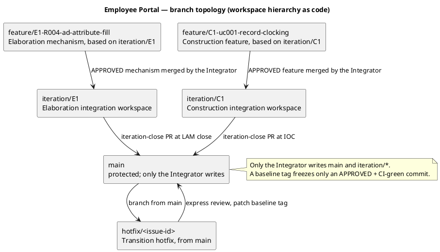
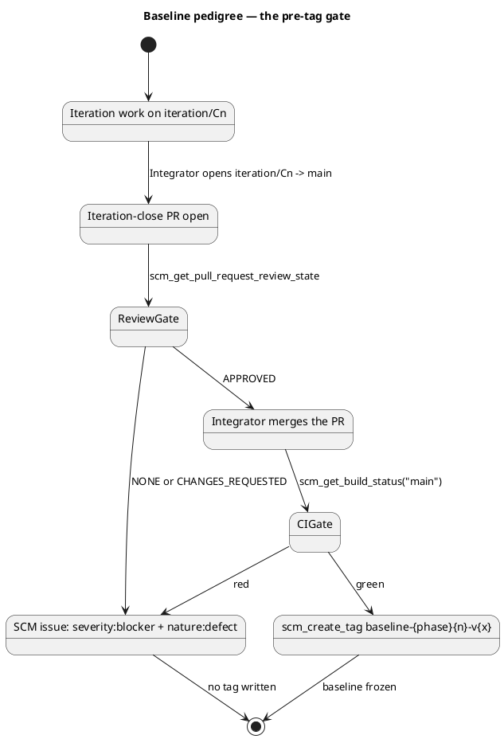
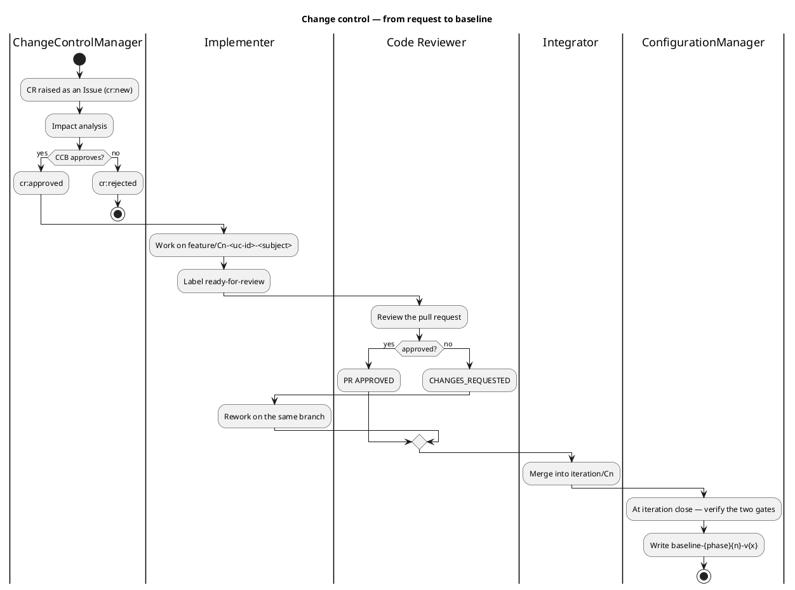

# Branching Strategy — Employee Portal

## Document Control
- Phase: Inception
- Status: Draft — published for the end-of-Inception milestone (NOT YET ACHIEVED)
- Milestone Target: end-of-Inception
- Owner: ConfigurationManager
- Last updated: 2026-09-29

## Purpose

This file is the project's configuration-management baseline: the branch topology, the naming
conventions, the baseline-tag rule and the change-control path. It is configuration-as-code —
committed directly to `main`, never opened as a pull request. It is the single authority for how
work is named, integrated and frozen; the Development Case references it and does not restate it.

This publication covers the canonical branching model for all four phases, the cross-phase
invariants and the pre-tag gate. Subsystem-aware refinement — a branch prefix per component
boundary — is deferred to Elaboration, when the Software Architecture Document's ten component
boundaries (COMP-001..COMP-010) are baselined against an executable prototype.

## Branch topology

```plantuml
@startuml
title Employee Portal — branch topology (workspace hierarchy as code)
skinparam componentStyle rectangle

component "main\nprotected; only the Integrator writes" as MAIN
component "iteration/E1\nElaboration integration workspace" as IE1
component "iteration/C1\nConstruction integration workspace" as IC1
component "feature/E1-R004-ad-attribute-fill\nElaboration mechanism, based on iteration/E1" as FE1
component "feature/C1-uc001-record-clocking\nConstruction feature, based on iteration/C1" as FC1
component "hotfix/<issue-id>\nTransition hotfix, from main" as HF

FE1 --> IE1 : APPROVED mechanism merged by the Integrator
FC1 --> IC1 : APPROVED feature merged by the Integrator
IE1 --> MAIN : iteration-close PR at LAM close
IC1 --> MAIN : iteration-close PR at IOC
MAIN --> HF : branch from main
HF --> MAIN : express review, patch baseline tag

note right of MAIN
  Only the Integrator writes main and iteration/*.
  A baseline tag freezes only an APPROVED + CI-green commit.
end note
@enduml
```

| Branch | Purpose | Created from | Written by | Merged by |
|---|---|---|---|---|
| `main` | The baseline. Every commit on it came from an APPROVED pull request and a green build. | — | Integrator only | — |
| `iteration/E<n>` | Elaboration integration workspace for iteration n. | `main` | Integrator only | Integrator, into `main` at LAM close |
| `iteration/C<n>` | Construction integration workspace for iteration n. | `main` | Integrator only | Integrator, into `main` at IOC |
| `feature/E<n>-<risk-id>[-<mechanism>]` | Elaboration evolutionary architectural mechanism — real code in `src/`, not throwaway sample code. | `iteration/E<n>` | Implementer | Integrator, into `iteration/E<n>` |
| `feature/C<n>-<uc-id>-<subject>` | Construction use-case realization. | `iteration/C<n>` | Implementer | Integrator, into `iteration/C<n>` |
| `hotfix/<issue-id>` | Transition hotfix. | `main` | Implementer | Integrator, into `main` |
| `chore/<subject>` | Non-functional repository maintenance — this file, CI configuration. | `main` | ConfigurationManager, Implementer | Integrator, into `main` |

**Inception.** Documentation only; normally no implementation code. A feasibility mechanism, if
genuinely required for risk reduction, is built evolutionarily in `src/` on
`feature/I<n>-<subject>` — never throwaway. No such mechanism is required this iteration: the
Development Case records the Architectural Proof-of-Concept trigger as NOT FIRED.

**Elaboration.** The architectural prototype is evolutionary — it becomes the Construction
baseline. A technical risk is retired by analysis (the SoftwareArchitect reasons feasibility, no
code) or by building the real mechanism in `src/` on `feature/E<n>-<risk-id>[-<mechanism>]` based
on `iteration/E<n>`. The Architect records the decision as a process fact (`analysis-only` |
`single-mechanism` | `candidates`). The Code Reviewer opens and reviews each mechanism PR (base
`iteration/E<n>`) as production code; the Integrator merges the APPROVED mechanism into
`iteration/E<n>`. For competing `candidates` the Architect selects the winner and the Integrator
closes the loser's PR per the recorded decision. At LAM close the Integrator opens
`iteration/E<n> → main`. There is no `samples/poc/` directory and no ephemeral `poc/*` branch.

**Construction.** Use-case realizations on `feature/C<n>-<uc-id>-<subject>` based on
`iteration/C<n>`; the Code Reviewer reviews, the Integrator merges APPROVED into `iteration/C<n>`
and opens `iteration/C<n> → main` at IOC.

**Transition.** `hotfix/<issue-id>` from `main`, express review, merge to `main` with a patch
baseline tag.

## Branch naming conventions

Naming is load-bearing: it is how a branch's phase, iteration and subject are read without
opening it. The canonical prefixes are `poc/` (not used on this project), `feature/`,
`iteration/`, `hotfix/` and `chore/`.

| Pattern | Phase | Example |
|---|---|---|
| `feature/I<n>-<subject>` | Inception feasibility mechanism (not required this iteration) | `feature/I1-feasibility-check` |
| `feature/E<n>-<risk-id>[-<mechanism>]` | Elaboration evolutionary mechanism | `feature/E1-R004-ad-attribute-fill` |
| `feature/C<n>-<uc-id>-<subject>` | Construction feature | `feature/C1-uc001-record-clocking` |
| `iteration/E<n>` | Elaboration integration workspace | `iteration/E1` |
| `iteration/C<n>` | Construction integration workspace | `iteration/C1` |
| `hotfix/<issue-id>` | Transition hotfix | `hotfix/14` |
| `chore/<subject>` | Repository maintenance | `chore/branching-strategy` |

A branch that does not match its pattern is surfaced as an SCM issue with `severity:minor` +
`nature:defect` + `naming-violation` labels. It is never auto-renamed: renaming rewrites history
that other roles may already reference.

## Baseline tags

| Tag | Phase | Written when |
|---|---|---|
| `baseline-elaboration-E<n>-v<x>` | Elaboration | At LAM close, after `iteration/E<n> → main` is APPROVED and `main` CI is green |
| `baseline-construction-C<n>-v<x>` | Construction | At IOC, after `iteration/C<n> → main` is APPROVED and `main` CI is green |
| `baseline-transition-T<n>-v<x>` | Transition | At release, after the release PR is APPROVED and `main` CI is green |

`<x>` starts at `1`. `v2`, `v3` and later are written only after an explicit rollback or a
post-baseline critical fix applied to the iteration branch. Routine iteration work targets the
NEXT iteration's tag, never a re-tag of the previous one.

**No baseline tag is written in Inception.** The architecture is not stable and no iteration-close
pull request exists. The first tag this project will write is `baseline-elaboration-E1-v1`.

## Baseline pedigree — the pre-tag gate

A tag is defensible only if both gates pass. Either gate failing produces an SCM issue and no tag.

```plantuml
@startuml
title Baseline pedigree — the pre-tag gate
[*] --> IterationWork
state "Iteration work on iteration/Cn" as IterationWork
IterationWork --> ClosePR : Integrator opens iteration/Cn -> main
state "Iteration-close PR open" as ClosePR
ClosePR --> ReviewGate : scm_get_pull_request_review_state
state ReviewGate <<choice>>
ReviewGate --> Blocked : NONE or CHANGES_REQUESTED
ReviewGate --> MergeGate : APPROVED
state "SCM issue: severity:blocker + nature:defect" as Blocked
Blocked --> [*] : no tag written
state "Integrator merges the PR" as MergeGate
MergeGate --> CIGate : scm_get_build_status("main")
state CIGate <<choice>>
CIGate --> Blocked : red
CIGate --> Tag : green
state "scm_create_tag baseline-{phase}{n}-v{x}" as Tag
Tag --> [*] : baseline frozen
@enduml
```

| Gate | Tool | Pass condition | Fail action |
|---|---|---|---|
| Review | `scm_get_pull_request_review_state` | `APPROVED` | Issue `severity:blocker` + `nature:defect`; no tag |
| Build | `scm_get_build_status("main")` | green, after the merge | Issue `severity:blocker` + `nature:defect`; no tag |

The tag message is the audit record. It carries the iteration-close PR number and head commit
SHA, the Architect approval review ID, the `main` CI run URL at tag time, and any notable finding
— a naming violation, a deferred item, a re-tag justification. A tag message that says only
`baseline` is not an audit record.

## Change control

Nothing enters the process without a Change Request approved by the Change Control Manager. The
declared scope is the ceiling: a new functional area, a new artifact outside the CORE + OPTIONAL
universe, or a change to a declared constraint requires a Change Request. The closed worker-category
list (CON-026) admits no fifth value without one.

```plantuml
@startuml
title Change control — from request to baseline
|ChangeControlManager|
start
:CR raised as an Issue (cr:new);
:Impact analysis;
if (CCB approves?) then (yes)
  :cr:approved;
else (no)
  :cr:rejected;
  stop
endif
|Implementer|
:Work on feature/Cn-<uc-id>-<subject>;
:Label ready-for-review;
|Code Reviewer|
:Review the pull request;
if (approved?) then (yes)
  :PR APPROVED;
else (no)
  :CHANGES_REQUESTED;
  |Implementer|
  :Rework on the same branch;
  |Code Reviewer|
endif
|Integrator|
:Merge into iteration/Cn;
|ConfigurationManager|
:At iteration close — verify the two gates;
:Write baseline-{phase}{n}-v{x};
stop
@enduml
```

**Boundary with the Change Control Manager.** The ChangeControlManager owns the Change Request
state machine (`cr:new` → `cr:approved` → `cr:complete`) and the CCB decisions. The
ConfigurationManager does not triage Change Requests and does not evaluate their impact; it
consumes the CCM-triaged outcomes through the branches and pull requests those decisions
authorize. A Change Request is an Issue, never a document.

**Cross-phase invariants.**

- Only the Integrator writes `iteration/*` and `main`. No other role pushes there.
- `ready-for-review` is the Implementer-to-Code-Reviewer handoff label. It creates no pull
  request; opening the pull request is the Code Reviewer's action.
- A baseline tag freezes only an APPROVED and CI-green commit.
- A pull request is merged only when its consolidated review state is `APPROVED`.

## Configuration items

| Configuration item | Identification | Home |
|---|---|---|
| Source code | `src/` — one project per component boundary (COMP-001..COMP-010) | `main`, via feature branches |
| Database schema migrations | migrations for the four persistent structures (Clocking, ClockingDay, NewsItem, WorkerCategoryLink, AuditEntry) | `main`, via feature branches |
| CI workflow | `.github/workflows/ci.yml` | Absent — authored in Elaboration |
| Branching strategy | `docs/BRANCHING_STRATEGY.md` | `main`, direct commit |
| UI design reference | `docs/inputs/employee-portal-design.html` (CON-041) | `main`, read-only authority for the visual layer |
| RUP artifacts | the 16 CORE artifacts plus the one triggered OPTIONAL (Deployment Model) | `main`, via the artifact service |
| Configuration values | placeholder OIDC issuer, client id, client secret, LDAP host, bind account and base DN (CON-038) | configuration, never the repository |

## Audit procedures

| Procedure | Trigger | Method |
|---|---|---|
| Pre-tag audit | Before every `scm_create_tag` | Both gates of the pre-tag gate above, called and recorded in the tag message |
| Naming-convention sweep | Each iteration close | `scm_list_branches_with_label`; a non-conforming branch yields an Issue `severity:minor` + `nature:defect` + `naming-violation` |
| Baseline integrity | On demand | A tag points to a commit whose iteration-close PR was APPROVED and whose post-merge `main` CI is green |
| Status accounting | Continuous | Dashboards query the branch, pull-request, tag and Issue graph directly. No status report artifact is produced. |

## Tooling

| Concern | Tool | Note |
|---|---|---|
| Repository and pull requests | Hosted SCM provider (CON-036) | The repository lives on the provider this workspace is configured with |
| Build and test | Hosted CI on that provider (CON-036) | CI never holds production data or credentials and never deploys — Infrastructure deploys (CON-039) |
| Branch, commit, PR, review state, build status, tag, issue, label | the `scm_*` tool set | The only mechanism by which this strategy is executed |
| CI workflow file | `.github/workflows/ci.yml` | Absent from the repository; authored in Elaboration by the ConfigurationManager with the Implementer (Development Case §Environment readiness) |
| Commit and branch conventions, coding standards | `CONTRIBUTING.md` | Absent from the repository; authored in Elaboration by the SoftwareArchitect with the Implementer. It carries the conventions this file defines. |
| Lint and static analysis | repository lint configuration | Absent from the repository; authored in Elaboration by the SoftwareArchitect with the Implementer |

## Traceability

| Element | Traces From | Link Type | Traces To |
|---|---|---|---|
| Branch topology | CON-036 | Refines | `main`, `iteration/E<n>`, `iteration/C<n>`, `feature/*`, `hotfix/*`, `chore/*` |
| Branch naming conventions | CON-036 | Refines | `CONTRIBUTING.md` |
| Baseline tag rule | CON-036 | Refines | `baseline-elaboration-E1-v1` |
| Pre-tag gate | CON-036 | Refines | `main` |
| Change control path | CON-026, CON-036 | Refines | Change Request, Review Record |
| Configuration items | CON-004, CON-028, CON-029, CON-030, CON-038, CON-041 | Refines | `src/`, `docs/inputs/employee-portal-design.html` |
| Tooling | CON-036, CON-039 | Refines | `.github/workflows/ci.yml`, `CONTRIBUTING.md` |
| Component boundaries referenced by the deferred refinement | COMP-001, COMP-002, COMP-003, COMP-004, COMP-005, COMP-006, COMP-007, COMP-008, COMP-009, COMP-010 | DependsOn | Software Architecture Document |
