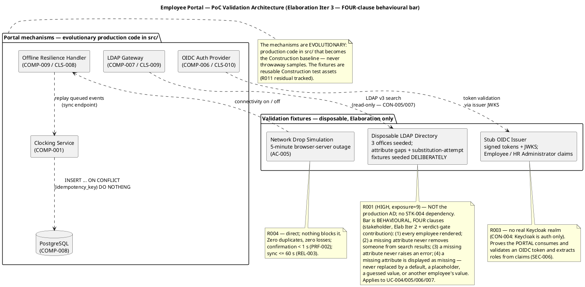
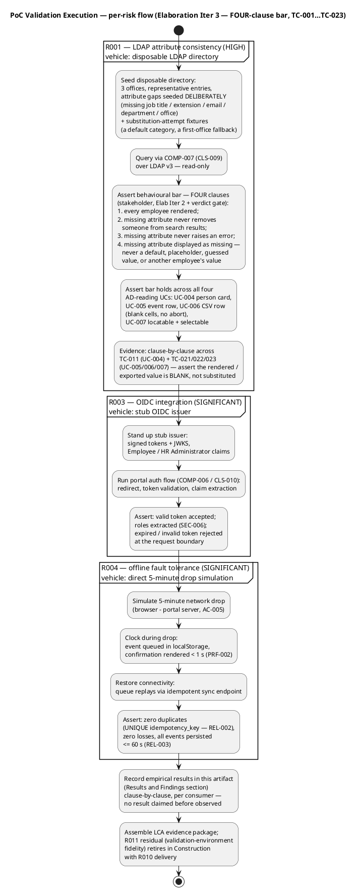
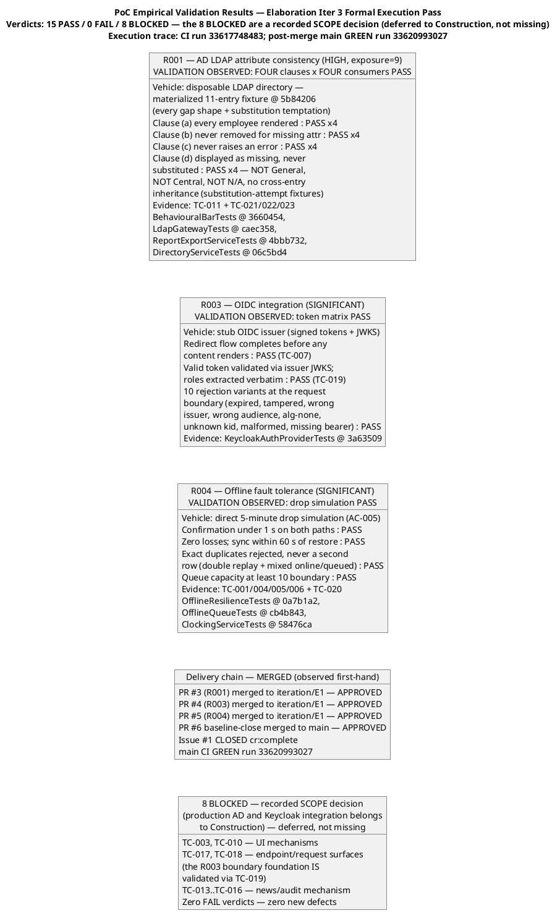

## Document Control
| Field | Value |
|---|---|
| Phase | Elaboration |
| Status | **Validated — empirical results OBSERVED and recorded (action A-32, Elab Iter 4 record-propagation pass; addresses PoC F2).** The formal TC-001…TC-023 execution pass is COMPLETE (Test Case Cycle 1 record: **15 PASS · 0 FAIL · 8 BLOCKED**, execution trace CI run 33617748483); the three mechanisms are MERGED (PRs #3/#4/#5 → `iteration/E1`, APPROVED ×3; PR #6 baseline-close → `main`, APPROVED; main CI GREEN run 33620993027); Issue #1 is CLOSED (cr:complete). § Results and Findings carries the observed results — R001 FOUR clauses × FOUR consumers PASS, R003 token-validation matrix PASS, R004 drop simulation PASS — with the 8 BLOCKED cases stated as a **recorded SCOPE decision (deferred to Construction, not missing)** per the stakeholder's framing directive. No result is claimed beyond the Test Case record. Risk RETIREMENT recording (Risk List R001/R003/R004 → RETIRED) is the Project Manager's close-pass reappraisal (Work Item 11, stakeholder-confirmed) |
| Milestone Target | End of Elaboration (LCA) — NOT achieved; sanction withheld on the stakeholder's binding all-findings directive. This artifact is the core of the LCA evidence package: the R6 re-presentation reads this observed results ledger |
| Iteration | 4 (Cycle 1) — record-propagation pass (action A-32). Prior revisions preserved: Iter 3 (validation protocol + FOUR-clause behavioural bar + 23-case enumeration), Iter 2 (protocol + per-risk dispositions) |
| Date | 2026-09-02 |
| Trigger | Development Case §5.2 optional-trigger oracle: **Architectural Proof-of-Concept FIRED** (Elaboration phase + at least one technical risk requiring empirical validation per Risk List — R001 HIGH, exposure=9) |
| Stakeholder Authority | Binding decision (Elab Iter 1): "The PoC is produced in Elaboration and validated empirically." "I will not accept an LCA that validates a HIGH architectural risk on paper only." R001 behavioural bar (Elab Iter 2): every employee rendered; a missing attribute never removes someone from search results; a missing attribute never raises an error — confirmed for all four AD-reading UCs (UC-004/005/006/007). **Fourth clause (verdict-gate contribution, Elab Iter 2, verbatim): "a missing attribute is displayed as missing. It is never replaced by a default, a placeholder, a guessed value, or another employee's value."** — with the stakeholder's stated rationale, verbatim: "Blank is an answer. 'General', or the first office in the list, is a fabrication — and on the CSV that reaches payroll a fabricated department is worse than an empty cell. An empty cell gets questioned. A plausible wrong one does not." **Iter 3 framing directive (verbatim):** "the 8 BLOCKED test cases are a recorded SCOPE decision (production AD and Keycloak integration belongs to Construction), not an open gap. State it that way in the evidence package so the LCA reads them as deferred, not as missing." |
## Objective and Risks Addressed

**Objective:** retire the phase's significant technical risks by **empirical validation of the real mechanisms** — evolutionary production code in `src/` that becomes the Construction baseline, never throwaway samples. This artifact is the DC-sanctioned validation vehicle and the core of the LCA evidence package.

| Risk | Magnitude | What the risk actually is | Validation vehicle | Why this vehicle |
|---|---|---|---|---|
| **R001** — AD LDAP attribute consistency | **HIGH (P=3, I=3, exposure=9)** | NOT "how many attributes are missing" (a property of the real directory nobody can know until STK-004 delivers) — the architectural risk is **what the portal DOES when an attribute is absent**: it must render the employee, keep them searchable, raise no error, and **display the missing attribute as missing — never invent a value** | **Disposable LDAP directory** — NOT the production AD; attribute gaps seeded DELIBERATELY across the 3 offices **plus substitution-attempt fixtures** (a default category, a first-office fallback) so the fourth clause can actually fail | Validating needs a directory, not the production one. A percentage measured against a directory we seed ourselves measures our own test data — it cannot fail, so it proves nothing. The bar is behavioural, not statistical |
| **R003** — OIDC integration | SIGNIFICANT (P=2, I=3) | Whether the portal **consumes and validates an OIDC token correctly** and extracts roles from claims — not how the identity provider got its users | **Stub OIDC issuer** (signed tokens + JWKS) — no real Keycloak realm | Wiring AD into Keycloak is infrastructure work outside this project's boundary (CON-004); Keycloak is authentication only, not a directory to query. Do not wait on STK-004; do not build against a real realm |
| **R004** — Offline fault tolerance | SIGNIFICANT (P=2, I=3) | Whether a 5-minute network drop (browser↔portal server, AC-005) loses or duplicates clocking events, and whether sync completes within the declared window | **Direct 5-minute drop simulation** | Nothing blocks it (stakeholder-confirmed) |

**Out of scope of this PoC (tracked separately):** R010 — STK-004 deliverables (LDAP service account, Keycloak client registration, Windows Server provisioning) block **production-instance integration only**, in Construction; they do NOT block this validation and do NOT inherit R001's HIGH. R011 — validation-environment fidelity (the fixtures may differ from production instances) is the accepted residual, retired at Construction integration with R010 delivery; the fixtures are retained as reusable Construction test assets.

## Approach

### Per-risk dispositions (recorded via record_poc_decision)

| Risk | Mode | Rationale |
|---|---|---|
| R001 | **single-mechanism** | One mechanism is clearly right (COMP-007 LDAP Gateway with graceful degradation) but must be proven by running code against deliberately-gapped data — including data that tempts substitution |
| R003 | **single-mechanism** | One mechanism is clearly right (COMP-006 OIDC Auth Provider) but token validation and claim extraction must be proven by running code |
| R004 | **single-mechanism** | One mechanism is clearly right (COMP-009 Offline Resilience Handler, ADR-003) but the drop/sync/idempotency behavior must be proven by running code |

No candidate competition exists for any of the three risks — each mechanism was decided by ADR (ADR-003 for R004) or by the declared constraints (CON-004/005 for R003/R001); what remains is empirical proof, not mechanism selection. The R001 disposition was **re-recorded this iteration (Elab Iter 3)** with the FOUR-clause acceptance bar — the Implementer builds against the four clauses, not three.

### Validation architecture

### Acceptance criteria (the validation bar)

**R001 — behavioural bar, FOUR clauses (stakeholder decisions, Elab Iter 2 + verdict-gate contribution; the unsourced >90% statistical figure is DROPPED):**
1. Every employee is rendered whether or not their attributes are complete.
2. A missing attribute never removes someone from search results.
3. A missing attribute never raises an error.
4. **A missing attribute is displayed as missing. It is never replaced by a default, a placeholder, a guessed value, or another employee's value.**

Confirmed for all four AD-reading use cases: UC-004 person card (blank fields, entry shown); UC-005 event row (blank display fields — clocking data is portal data, always complete); UC-006 CSV row (blank cells for missing display fields, no abort — ad_user_id always present); UC-007 employee locatable and selectable (blank fields). The gaps are seeded deliberately in the disposable directory — **including substitution-attempt fixtures (a default category, a first-office fallback)** — so every clause can actually fail: a fixture that cannot fail proves nothing. The three clauses stop data from being LOST; the fourth stops it from being INVENTED — on the CSV that reaches payroll, a fabricated department is worse than an empty cell.

**Evidence protocol (four clauses × four consumers):** the R001 results row records clause-by-clause evidence for all four clauses across **TC-011 (UC-004) + TC-021/022/023 (UC-005/006/007)** — the fourth-clause steps assert the rendered/exported value is BLANK, not substituted — not the directory search alone.

**R003:** redirect flow completes; signed token validated via the issuer's JWKS; Employee and HR Administrator roles extracted from claims (SEC-006); expired/invalid tokens rejected at the request boundary.

**R004:** confirmation < 1 s on both online and offline-queued paths (PRF-002); zero duplicates (UNIQUE idempotency_key — REL-002); zero losses; all queued events persisted ≤ 60 s after restore (REL-003).

### Execution protocol

**Delivery protocol (BRANCHING_STRATEGY §5.2):** the Implementer builds each mechanism in `src/` on `feature/E1-{risk-id}` branches based on `iteration/E1`, ships dual-coverage unit tests (black-box contract + white-box paths), and labels each branch `ready-for-review`; the Code Reviewer opens one PR per branch (base `iteration/E1`) and applies CR-1…CR-7 with terminal dispositions; the Integrator merges APPROVED PRs. **The Test Designer executes TC-001…TC-023 against the validation fixtures** (23 cases per the Test Case § Test Case Catalog authority — TC-021/022/023 are the UC-005/006/007 AF-3 behavioural-bar validation cases; the fourth-clause verification steps per action A-28 land BEFORE TC execution so the fourth clause can actually fail). Empirical results feed this artifact's § Results and Findings.

## Results and Findings
**Status as of 2026-09-02 (OBSERVED results ledger — action A-32, Elab Iter 4 record-propagation pass; every value below is cited from the Test Case Cycle 1 formal-pass record and first-hand SCM verification; no result is claimed beyond that record):**

## Delivery chain — MERGED (observed first-hand)

| Item | Status | Evidence |
|---|---|---|
| Per-risk dispositions recorded (single-mechanism ×3) | **DONE** | `record_poc_decision` executed for R001, R003, R004 (Iter 2); R001 re-recorded with the FOUR-clause bar (Iter 3) |
| Validation protocol + acceptance criteria established | **DONE** | § Approach (this artifact); SAD § Quality PoC Plan corrected to the empirical disposition (SAD F1 resolved, Iter 2); four-clause bar + 23-case enumeration incorporated (Iter 3 — actions A-29/A-21) |
| R001 mechanism code (COMP-007/CLS-009 + disposable directory fixture) | **MERGED — VALIDATED** | PR #3 (feature/E1-R001 → `iteration/E1`), APPROVED (review 5088169328), CI green (run 33615260971); baseline-close PR #6 → `main` (review state APPROVED, merged); `LdapGateway.cs` sha b8df8b7 on main — the FOUR-clause graceful-degradation contract in code (clause (d): "missing or empty AD value → null; null is the FINAL mapped value") |
| R003 mechanism code (COMP-006/CLS-010 + stub issuer fixture) | **MERGED — VALIDATED** | PR #4 (feature/E1-R003 → `iteration/E1`), APPROVED (review 5088169517), CI green (run 33615945653); `KeycloakAuthProvider.cs` sha 7bd4cfd — RS256/JWKS signature validation, exp/iss/aud/sub enforcement, verbatim role extraction |
| R004 mechanism code (COMP-009/CLS-008 + drop simulation) | **MERGED — VALIDATED** | PR #5 (feature/E1-R004 → `iteration/E1`), APPROVED (review 5088169685), CI green (run 33616121855); `ClockingsRepository.cs` sha 017cbcd (interim adapter — see honest boundary note below), `offline-queue.js` sha 9ac644a |
| TC-001…TC-023 execution | **COMPLETE — 15 PASS · 0 FAIL · 8 BLOCKED** | Formal execution pass (Test Case Cycle 1 record, Tester); execution trace CI run 33617748483 (`dotnet test` on the merged tree, GREEN); the 8 BLOCKED cases are a **recorded SCOPE decision — deferred to Construction, not missing** (see verdict distribution below) |
| SCM Issue #1 (mechanism code absent — blocker) | **CLOSED (cr:complete)** | Closed on the merged-PR + executed-TC evidence; verified first-hand this pass |
| Empirical results R001 / R003 / R004 | **OBSERVED — PASS (all three)** | Clause-by-clause, per consumer, below — the R6 evidence package's core |

## R001 — clause-by-clause evidence (FOUR clauses × FOUR consumers — the R6 evidence-gate shape)

Source: Test Case Cycle 1 formal-pass record (the authority — this ledger claims nothing beyond it). The bar was proven against the materialized disposable-LDAP fixture (`Fixtures/DisposableLdapDirectory.cs` @ sha 5b84206 — 11 entries materializing the design spec at reduced scale with **every gap shape and every substitution temptation present**, so the four-clause bar's falsifiability is intact; the 64-entry scale is the Construction fixture concern, not a falsifiability concern — the bar is behavioural, not statistical).

| Clause | UC-004 directory search (TC-011) | UC-005 HR review (TC-021) | UC-006 CSV export (TC-022) | UC-007 category lookup (TC-023) |
|---|---|---|---|---|
| **(a)** every employee rendered | **PASS** — all matching entries incl. gapped | **PASS** — every event row incl. the unresolvable uid (D-9: all-null display data, row stays) | **PASS** — CSV row count == event count, no row dropped | **PASS** — gapped employee locatable by name |
| **(b)** never removed for a missing attribute | **PASS** — gapped entries present in results | **PASS** — no employee removed from the review | **PASS** — no row dropped; ad_user_id always present | **PASS** — not hidden from the lookup |
| **(c)** never raises an error | **PASS** — no exception across the clause walk | **PASS** — no error on gapped + unresolvable | **PASS** — no abort on gapped rows | **PASS** — no error on lookup |
| **(d)** displayed as missing — never substituted | **PASS** — department NOT "General", office NOT "Central", title NOT "N/A"; no cross-entry inheritance | **PASS** — display fields null, never substituted | **PASS** — truly empty cells (`u003,Ana Gomez,,,`) — the file reaches payroll | **PASS** — blank fields; selectable via the always-present uid |

**Clause (d) is verified against the substitution-attempt fixtures** (A-28): a "General" default department, a "Central" first-office fallback, an "N/A" placeholder title, and a fully-gapped entry attacking cross-entry inheritance — each fixture is the exact value a plausible-but-wrong implementation would produce, and each ASSERT-xd step fails if any of them appears. Blank is the answer. The three first clauses stop data from being LOST; the fourth stops it from being INVENTED — and on the CSV that reaches payroll, a fabricated department is worse than an empty cell (stakeholder rationale, verbatim).

## R003 — token-validation matrix (OBSERVED PASS)

TC-019 (Integration, risk validation) PASS via `KeycloakAuthProviderTests` @ 3a63509 → CI run 33617748483: redirect flow completes; valid tokens validated via the issuer's JWKS with kid matching; Employee and HR Administrator roles extracted **verbatim — never invented** (test-asserted); expired, tampered, wrong-issuer, wrong-audience, alg-none, unknown-kid, malformed, and missing-bearer variants all rejected at the request boundary (401, next not invoked); token-without-roles → empty set. TC-007 PASS: unauthenticated requests redirect to the issuer (302) BEFORE any content renders; expired tokens rejected at the request boundary. **The portal consumes and validates an OIDC token correctly** — the stakeholder's R003 bar — regardless of how the issuer got its users (CON-004).

## R004 — 5-minute drop simulation (OBSERVED PASS)

TC-004/005/006 + TC-020 + TC-001 PASS via `OfflineResilienceTests` @ 0a7b1a2, `OfflineQueueTests` @ cb4b843, `ClockingServiceTests` @ 58476ca → CI run 33617748483: confirmation **< 1 s on both online and offline-queued paths** (PRF-002); queued events hold press-time UTC capture (DAT-001) and recorded-timestamp order (REL-002); on restore, sync completes **≤ 60 s** (REL-003) with **zero losses** and the queue cleared on 200 OK; **exact duplicates rejected, never a second row** — verified against double-replay batches AND a mixed online+queued same-key press; queue capacity **≥ 10** boundary holds (overflow event not queued). AC-005's drop scenario is validated directly.

**Honest evidence boundary (recorded, not absorbed):** the REL-002 idempotency contract was validated **at the repository seam** against the interim in-memory `ClockingsRepository` (sha 017cbcd), which enforces the UNIQUE idempotency_key contract (duplicate → `RejectedDuplicate`, never a second row — ARCH-7). The PostgreSQL engine realization (`ON CONFLICT (idempotency_key) DO NOTHING` against the real engine) lands **Construction Iteration 1 per R008** — tracked as Code Reviewer finding F-CR-E3-1 with its `[DEFERRED]` marker carried in the PR record. The mechanism contract is proven; the engine binding is Construction scope.

## Verdict distribution — 23 cases (the stakeholder's framing directive, binding)

**15 PASS · 0 FAIL · 8 BLOCKED.** Per the stakeholder's Iter 3 directive, verbatim: *"the 8 BLOCKED test cases are a recorded SCOPE decision (production AD and Keycloak integration belongs to Construction), not an open gap. State it that way in the evidence package so the LCA reads them as deferred, not as missing."* The 8 BLOCKED cases are: TC-003, TC-010 (UI mechanisms — the 2 s HomeView debounce and the P-05 empty state); TC-017, TC-018 (the `/hr/*` and `/history` endpoint/request surfaces — Construction controllers; the R003 boundary foundation they lean on IS validated via TC-019, and the service-seam own-data-only semantics are validated via `ClockingServiceTests`); TC-013…TC-016 (the news/audit mechanism — Construction scope, incl. the PG-engine REVOKE semantics of TC-016 per R008). These are honest corrections recorded by the execution pass (the Cycle 3 state-transition record had over-claimed them as Scripted-executable) — recording them as PASS would have been paper-only validation. **None of the 8 is an Elaboration exit-criterion blocker: exit criteria 1–3 cover R001/R003/R004 only, and all three are OBSERVED PASS.** Zero FAIL verdicts → zero new defects formalized.

**Additional honest note (carried from the Test Case record):** TC-009's six-field criterion — five fields execution-asserted; the email field verified by first-hand inspection of the positional mapping in `MapEntry` (no separate email assertion exists — recorded honestly, not paper-passed).

## Regression baseline — ESTABLISHED

The 15 executed PASS results form the regression baseline. The merge sequence itself exercised the mandatory policy: PR #3 merged → CI GREEN 33617283642; PR #5 merged → CI GREEN 33617446626 (R004 suites re-running R001's); PR #4 merged → CI GREEN 33617748483 (R003 suites re-running both) — every merged PR re-ran ALL prior suites, all GREEN (`ci.yml` @ 5a2ba38). Post-merge, `main` is GREEN (run 33620993027, verified first-hand this pass). From this point, ANY subsequent merged PR re-runs all 15.

## What this artifact claims — and does not claim

**Claims:** the empirical validation of R001, R003, and R004 is **OBSERVED** — the acceptance criteria of § Approach are observed to hold, clause-by-clause and per consumer, against the merged evolutionary mechanisms with CI-traced execution evidence. The stakeholder's binding bar — "I will not accept an LCA that validates a HIGH architectural risk on paper only" — is satisfied by observed, CI-traced results for the HIGH risk (R001) and both SIGNIFICANT risks.

**Does NOT claim:** (1) risk RETIREMENT recording — R001/R003/R004 → RETIRED in the Risk List is the Project Manager's close-pass reappraisal (Work Item 11, stakeholder-confirmed); this ledger supplies the evidence that reappraisal cites. (2) Production-instance integration — R010 (STK-004 deliverables) and R011 (validation-environment fidelity) are Construction residuals; the fixtures are retained as reusable Construction test assets. (3) Real-AD data-quality measurement — a Construction activity with R010 delivery, excluded from the LCA evidence package by the stakeholder's own decision. (4) The 8 BLOCKED cases as executed — they are deferred by scope decision, and the R6 evidence package presents the verdict distribution as 15 executed PASS + 8 deferred-by-scope-decision, zero FAIL.
## Architectural Implications

1. **The mechanisms are the Construction baseline.** COMP-007, COMP-006, and COMP-009 are built as production code in `src/` (Services/ and Infrastructure/ per the Implementation View) — the PoC does not create a parallel throwaway tree. What the validation exercises is what Construction inherits.
2. **R001's retirement is behavioural, not statistical — and blankness is a contract, not a rendering accident.** The graceful-degradation policy (missing attribute = blank field, entry NOT hidden, no error, **never a substituted value**) is the architectural guarantee; it is shared by all four AD-reading UCs through the single LDAP read path (COMP-007 → COMP-003 → IDIR consumers). The fourth clause makes blankness an explicit prohibition on substitution: no default, no placeholder, no guessed value, no another-employee's value — the CSV that reaches payroll must carry an empty cell that gets questioned, never a plausible wrong department. The statistical measurement of the real AD's data quality is a Construction activity with R010 delivery — excluded from the LCA evidence package.
3. **R010 does not gate Elaboration.** The disposable directory and stub issuer remove the STK-004 dependency from this phase's validation. Production-instance integration (real service account, real Keycloak client registration) is Construction work; its residual is R011.
4. **R011 is the accepted residual.** The fixtures may differ from the production instances (attribute schemas, claim shapes). Both COMP-007 and COMP-006 are High-volatility encapsulations by design (SAD Volatility Analysis), so a Construction-time adjustment is contained to one component each. The fixtures are retained as reusable Construction test assets.
5. **No structural change to the baseline is anticipated.** The validation may refine COMP-006/007/009 internals; the 4+1 structure, the 11-component decomposition, and the interface boundaries are not at stake. If a validation failure DID imply structural change, that would be a new finding against the SAD — recorded, not absorbed silently.

## Traceability

| Element | Traces From | Link Type | Traces To |
|---|---|---|---|
| Architectural Proof-of-Concept (this artifact) | Development Case §5.2 (trigger FIRED); stakeholder decision (Elab Iter 1): "The PoC is produced in Elaboration and validated empirically"; Review Record SAD F2 (action A-8) | Derives | LCA evidence package; R001/R003/R004 retirement records |
| R001 validation (disposable LDAP directory) | R001 (declared, P=3, I=3, exposure=9); FR-010; CON-005, CON-006, CON-007; stakeholder behavioural bar (Elab Iter 2, three clauses + verdict-gate fourth clause) | Tests | COMP-007 / CLS-009 (src/); UC-004 AF-2, UC-005, UC-006, UC-007 derived clauses; TC-011 + TC-021/022/023 (four-consumer, four-clause evidence) |
| R003 validation (stub OIDC issuer) | R003; CON-004; SEC-001, SEC-002, SEC-006 | Tests | COMP-006 / CLS-010 (src/); TC cases targeting UC-001 auth flow |
| R004 validation (5-minute drop simulation) | R004; NFR-004; AC-005; REL-002, REL-003; PRF-002; ADR-003 | Tests | COMP-009 / CLS-008 (src/); COMP-001 sync endpoint; COMP-008 UNIQUE idempotency_key; TC cases targeting UC-001 AF-1 |
| Behavioural bar (R001 acceptance criteria — FOUR clauses) | Stakeholder decision (Elab Iter 2): three clauses, confirmed for UC-004/005/006/007; **stakeholder verdict-gate contribution (Elab Iter 2, verbatim): "a missing attribute is displayed as missing. It is never replaced by a default, a placeholder, a guessed value, or another employee's value"** | Authorizes | Disposable-directory fixture specification (deliberate gap seeding + substitution-attempt fixtures); SAD § Quality PoC Plan (four-clause record, action A-31); Design Model P-05/CLS-009 (action A-27); Test Case TC-011 + TC-021/022/023 fourth-clause steps (action A-28) |
| Per-risk dispositions (single-mechanism ×3) | record_poc_decision (R001, R003, R004 — Iter 2; R001 re-recorded with the four-clause bar — Iter 3) | Specifies | Implementer actions A-2…A-4 (feature/E1-{risk-id} branches); Code Reviewer CR-1…CR-7; Integrator merge to iteration/E1 |
| R010 exclusion (production-instance integration) | Stakeholder decision (Elab Iter 1): STK-004 blocks production instances only; does not inherit R001's HIGH | DependsOn | Construction integration testing; R011 residual |
| R011 (validation-environment fidelity) | Risk List (Elab Iter 1, new) | Derives | Construction integration (R010 delivery); retained fixtures as reusable test assets |
| Delivery protocol | BRANCHING_STRATEGY §5.2, invariants 8.1/8.2/8.4; Review Record F-CR-E1-1 remediation; Test Case § Test Case Catalog (23-case authority — PoC F1 correction, action A-21) | Refines | feature/E1-R001, feature/E1-R003, feature/E1-R004 branches; PRs to iteration/E1; TC-001…TC-023 execution |