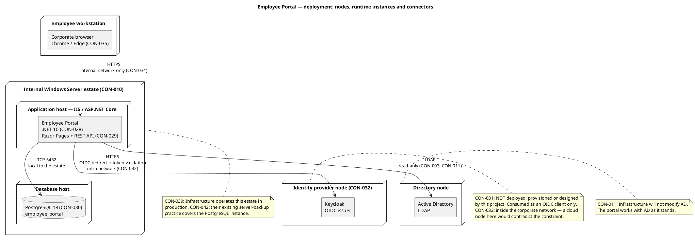

## Document Control

- Phase: Inception
- Status: Draft — candidate topology, under review for the end-of-Inception milestone
- Milestone Target: end-of-Inception (NOT YET ACHIEVED)
- Iteration: 1, Cycle 1
- Owner: DeploymentManager (Development Case §Roles and Ownership — fixed primary owner); SoftwareArchitect contributes the topology this iteration per the Work Order
- Last updated: 2026-09-29

## Deployment Topology

The portal is a single .NET application on the internal Windows Server estate, with PostgreSQL 18 on the same estate, consuming two internal systems it does not own. Four node roles, all inside the corporate network. No cloud node hosts any part of the portal at runtime.

### Node inventory

| Node | Node role | What is deployed there | Operated by | Declared by |
|---|---|---|---|---|
| Employee workstation | Client | The corporate browser — Chrome or Edge. No installed client, no service worker, no cached data. | The employee | CON-009, CON-035 |
| Internal Windows Server estate — application host | Application server | The Employee Portal: .NET 10 REST API and Razor Pages, hosted in IIS / ASP.NET Core. | Infrastructure | CON-010, CON-028, CON-029, CON-039 |
| Internal Windows Server estate — database host | Database server | PostgreSQL 18, database `employee_portal`. | Infrastructure | CON-030, CON-042 |
| Identity provider node | Identity provider | Keycloak, the OIDC issuer. **Not deployed, provisioned or designed by this project.** | Infrastructure | CON-031, CON-032 |
| Directory node | Directory | Active Directory, read over LDAP. **Never written to.** | Infrastructure | CON-003, CON-011 |

**Keycloak is an intra-network node, not a cloud node.** CON-032 is explicit: Keycloak runs inside the corporate network, the OIDC redirect is an intra-network call, nothing about login crosses the corporate boundary, and login keeps working with no internet link. A topology that places Keycloak in a cloud node contradicts the constraint and is wrong. The same applies to Active Directory.

**No cloud node hosts the portal at runtime.** CON-034 restricts access to the internal corporate network. The hosted SCM provider and its hosted CI (CON-036) are a development toolchain, not a runtime node: they build and test, never deploy, and never hold production data or credentials. They are therefore not part of this topology.

## Nodes and Connectors

| Connector | From | To | Protocol | Direction | Declared by |
|---|---|---|---|---|---|
| Portal access | Employee workstation | Application host | HTTPS | Inbound, internal network only | CON-034, CON-035 |
| Database access | Application host | Database host | TCP 5432 | Outbound, local to the estate | CON-030 |
| OIDC login | Application host | Identity provider node | HTTPS — redirect for login, validate the token, read roles from its claims | Outbound, intra-network | CON-001, CON-031, CON-032 |
| Directory read | Application host | Directory node | LDAP | Outbound, read-only | CON-003, CON-011 |
| Build and test | Hosted CI | — | — | **No deployment path.** CI never deploys; Infrastructure does. | CON-036, CON-039 |

### Runtime instances and their configuration

| Instance | Configuration source | Values | Declared by |
|---|---|---|---|
| Employee Portal application | Configuration, never code | OIDC issuer, client id, client secret, LDAP host, bind account, base DN — placeholder values in the repository, real values supplied by Infrastructure at deployment | CON-038 |
| PostgreSQL 18 | Infrastructure | Database `employee_portal`; installed by Infrastructure on the estate they already operate | CON-030 |
| Keycloak | Infrastructure | The portal's OIDC client is already registered and its credentials are with the development team | CON-002, CON-031 |

**No credential is held in code.** CON-038 requires the OIDC client and the LDAP connection to be configured with placeholder values held in configuration, with Infrastructure supplying the real values at deployment. CI never holds production data or credentials (CON-036).

### Availability and resilience at the node level

| Concern | Position | Declared by |
|---|---|---|
| Availability window | Monday to Friday 07:00–19:00, with fault tolerance within the corporate network. 24/7 is explicitly not required. | NFR-005 |
| Fault tolerance | A single application process on the internal estate. No load balancer, no second application node and no read replica is declared, and none is added. | NFR-005, NFR-001 |
| Client-side outage | A clocking press survives up to 5 minutes in the browser's localStorage and is retried. The directory and the news show a no-connection message; nothing is cached. | NFR-006, NFR-007 |
| Backups and restore | Infrastructure's existing server-backup practice already covers the PostgreSQL instance in restorable form, confirmed in writing with a verified restore test. No backup design, tooling or restore procedure is part of this project. | CON-042 |
| Post-launch operations | Infrastructure operates the portal in production — deployment, monitoring and patching — exactly as they already operate AD and Keycloak. The development team hands over at the end of Transition. | CON-039 |

## Environment Mapping

One runtime environment is declared. No separate staging or production topology is declared, and none is invented.

| Environment | Purpose | Nodes | Declared by |
|---|---|---|---|
| Internal corporate network | The only runtime environment. The portal is reachable from it and from nowhere else. | Employee workstation, application host, database host, identity provider node, directory node | CON-034, CON-009 |
| Development toolchain (not a runtime environment) | Build and test. Hosted SCM provider and its hosted CI. Never deploys, never holds production data or credentials. | Hosted SCM + hosted CI | CON-036 |
| Test stand-ins (not a runtime environment) | The team builds and tests against a test OIDC issuer and a test LDAP directory carrying the declared attributes, including entries whose job title or extension is empty. | Test OIDC issuer, test LDAP directory | CON-038 |

**Validation against the real Keycloak and the real AD is not a deployment activity of this project.** CON-038 places it with people — Infrastructure, with HR — and its feedback reaches the team before Elaboration closes. It is not team work to plan, and it is not a node this project deploys.

**No data migration.** The portal starts empty and records clockings from go-live onwards. The historical Excel sheets stay on the shared drive as a read-only archive and are not imported (CON-040). There is therefore no migration environment and no cutover step.

## Traceability

| Element | Traces From | Link Type | Traces To |
|---|---|---|---|
| Deployment Model | CON-010, CON-030, CON-032, CON-034 | Derives | Software Architecture Document |
| Node — Employee workstation | CON-009, CON-035 | Derives | Software Architecture Document |
| Node — Internal Windows Server estate (application host) | CON-010, CON-028, CON-029, CON-039 | Derives | Software Architecture Document |
| Node — Internal Windows Server estate (database host) | CON-030, CON-042 | Derives | Software Architecture Document |
| Node — Identity provider node (Keycloak) | CON-031, CON-032 | Derives | Software Architecture Document |
| Node — Directory node (Active Directory) | CON-003, CON-011 | Derives | Software Architecture Document |
| Connector — Portal access | CON-034, CON-035 | Derives | Software Architecture Document |
| Connector — OIDC login | CON-001, CON-031, CON-032 | Derives | Software Architecture Document |
| Connector — Directory read | CON-003, CON-011 | Derives | Software Architecture Document |
| Connector — Database access | CON-030 | Derives | Software Architecture Document |
| Environment — Internal corporate network | CON-034 | Derives | Software Architecture Document |
| Environment — Development toolchain | CON-036 | Derives | Software Architecture Document |
| Environment — Test stand-ins | CON-038 | Derives | Software Architecture Document |
| NFR-005 | NFR-005 | Refines | Deployment Model |
| NFR-006 | NFR-006 | Refines | Deployment Model |
| NFR-007 | NFR-007 | Refines | Deployment Model |
| CON-040 | CON-040 | Refines | Deployment Model |
| CON-042 | CON-042 | Refines | Deployment Model |

### Coverage — declared constraints bearing on deployment

| Constraint | Addressed in |
|---|---|
| CON-003, CON-011 — AD read-only, never modified | Node inventory, connector table |
| CON-009, CON-034, CON-035 — internal network only, corporate browser | Node inventory, environment mapping |
| CON-010, CON-028, CON-029, CON-039 — .NET application on the existing estate, operated by Infrastructure | Node inventory, availability and resilience |
| CON-030, CON-042 — PostgreSQL 18 on the same estate, covered by existing backups | Node inventory, availability and resilience |
| CON-031, CON-032 — Keycloak external to the project, intra-network node | Node inventory, topology note |
| CON-036 — CI never deploys, never holds production data or credentials | Connector table, environment mapping |
| CON-038 — placeholder configuration, stand-ins, human validation | Runtime instances, environment mapping |
| CON-040 — no data migration | Environment mapping |

### Open items

| Item | Status |
|---|---|
| Production node names, hostnames and ports | Not declared. Infrastructure supplies them at deployment; no value is invented here. |
| Monitoring and patching configuration | Infrastructure's, per CON-039. Not this project's to design. |
| Release Notes | Owned by the DeploymentManager; produced in a later phase. |

No `[SCOPE_QUESTION]` is open in this artifact. Every node, connector and environment traces to a declared constraint, and no node was introduced that the stakeholder did not declare.
