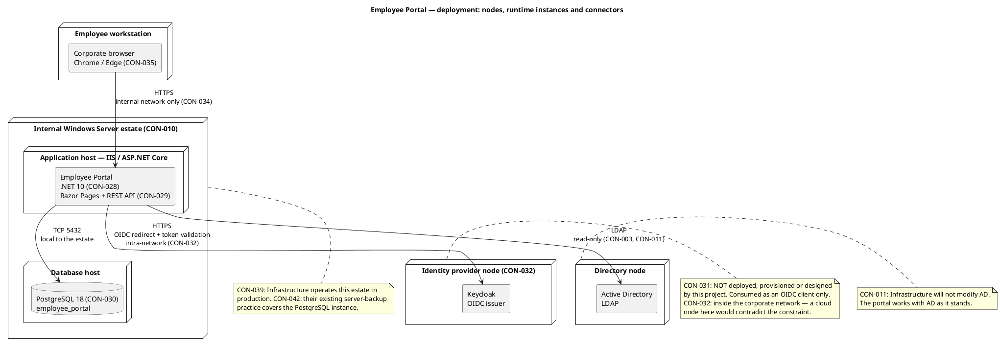
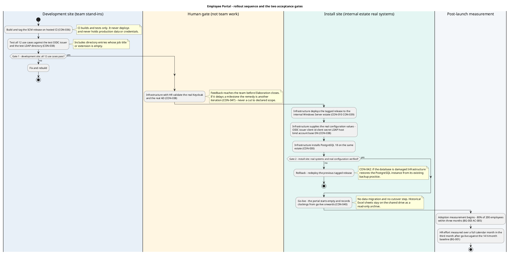
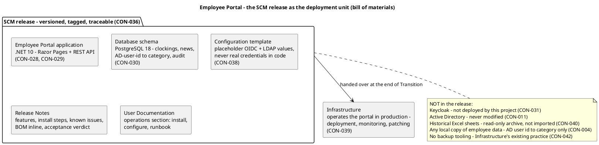

## Document Control

- Phase: Inception
- Status: Draft — candidate topology, under review for the end-of-Inception milestone
- Milestone Target: end-of-Inception (NOT YET ACHIEVED)
- Iteration: 1, Cycle 1
- Owner: DeploymentManager (Development Case §Roles and Ownership — fixed primary owner); SoftwareArchitect contributes the topology this iteration per the Work Order
- Last updated: 2026-09-29

## Deployment Topology
The portal is a single .NET application on the internal Windows Server estate, with PostgreSQL 18 on the same estate, consuming two internal systems it does not own. Four node roles, all inside the corporate network. No cloud node hosts any part of the portal at runtime.

### Node inventory

| Node | Node role | What is deployed there | Operated by | Declared by |
|---|---|---|---|---|
| Employee workstation | Client | The corporate browser — Chrome or Edge. No installed client, no service worker, no cached data. | The employee | CON-009, CON-035 |
| Internal Windows Server estate — application host | Application server | The Employee Portal: .NET 10 REST API and Razor Pages, hosted in IIS / ASP.NET Core. | Infrastructure | CON-010, CON-028, CON-029, CON-039 |
| Internal Windows Server estate — database host | Database server | PostgreSQL 18, database `employee_portal`. | Infrastructure | CON-030, CON-042 |
| Identity provider node | Identity provider | Keycloak, the OIDC issuer. **Not deployed, provisioned or designed by this project.** | Infrastructure | CON-031, CON-032 |
| Directory node | Directory | Active Directory, read over LDAP. **Never written to.** | Infrastructure | CON-003, CON-011 |

**Keycloak is an intra-network node, not a cloud node.** CON-032 is explicit: Keycloak runs inside the corporate network, the OIDC redirect is an intra-network call, nothing about login crosses the corporate boundary, and login keeps working with no internet link. A topology that places Keycloak in a cloud node contradicts the constraint and is wrong. The same applies to Active Directory.

**No cloud node hosts the portal at runtime.** CON-034 restricts access to the internal corporate network. The hosted SCM provider and its hosted CI (CON-036) are a development toolchain, not a runtime node: they build and test, never deploy, and never hold production data or credentials. They are therefore not part of this topology.

### Deployment mode and strategy

**Mode: custom-built.** The portal is built for one organization and deployed on the estate that organization already operates (CON-010), reachable only from the internal corporate network (CON-034) and operated by Infrastructure after handover (CON-039). There is no third party to distribute to and no download channel, so shrink-wrapped and downloadable are excluded by the declared constraints rather than by preference.

| Consequence of the mode | Position |
|---|---|
| No installer package, no distribution channel, no licensing or activation mechanism | The deployment unit is a tagged SCM release (CON-036) handed to Infrastructure, who deploy it (CON-039). |
| No auto-update mechanism | Infrastructure patches the application as it patches the rest of the estate (CON-039). |
| No user-facing release distribution | The 200 employees reach the portal through the corporate browser (CON-035); nothing is installed on a workstation. |
| No client-side footprint | No PWA, no service worker, no installable app, no client cache of the directory or the news (NFR-007). |

**Target user community.**

| Community | Who | What they do in the portal | Declared by |
|---|---|---|---|
| Employees | 200 people across 3 offices (STK-004) | Clock in and out, read news, search the directory, view their own clocking history | FR-001, FR-005, FR-009, CON-033 |
| HR Administrators | Members of the HR AD group (CON-033) | Publish, edit, unpublish and feature news; assign or clear a worker category; view all clockings; export the monthly CSV; correct or insert a clocking | FR-002, FR-003, FR-004, FR-006, FR-007, FR-008, FR-010, CON-013, CON-033 |

Every user is internal. There is no external user, no partner and no anonymous access (CON-034), and no native mobile app (declared exclusion). Authorization is the two declared levels taken from AD group membership (CON-033); worker category drives no access decision (CON-024).

**Constraints that shape the deployment strategy.**

| Constraint | Effect on the strategy |
|---|---|
| CON-031, CON-032 | Keycloak is not deployed, provisioned or designed by this project, and it is an intra-network node. The strategy plans no Keycloak work and no cloud node. |
| CON-011 | Active Directory is never modified. The strategy plans no AD change, no schema extension and no write path. |
| CON-038 | The application is configured with placeholder OIDC and LDAP values held in configuration, never in code. Infrastructure supplies the real values at deployment. The team builds and tests against stand-ins it controls. |
| CON-036 | CI builds and tests only. It never deploys and never holds production data or credentials. |
| CON-039 | Infrastructure deploys, monitors and patches the portal in production. The development team hands over at the end of Transition. |
| CON-040 | No data migration. The portal starts empty; the historical Excel sheets stay a read-only archive. There is no cutover step and no migration environment. |
| CON-042 | Backups are Infrastructure's existing server-backup practice, already covering the PostgreSQL instance in restorable form. No backup design, tooling or restore procedure is part of this project. |
| NFR-005 | The availability window is Monday to Friday 07:00–19:00 with fault tolerance inside the corporate network. No load balancer, no second application node and no read replica is planned. |

**Deployment-relevant risks.** No new risk is registered by this artifact. The risks that bear on deployment are already in the Risk List, and each is confronted at a named point in the rollout.

| Risk | How it bears on deployment | Where it is confronted |
|---|---|---|
| R001 | Adoption: employees keep their Excel and mass-email habits and the 80% target is missed. | Post-launch adoption measurement (BG-003, AC-005). |
| R004 | The LDAP attributes the directory reads may not be filled consistently across the 3 offices. | The human validation of the real AD (CON-038) and the install-site gate. |
| R005 | A page can drift from the mandatory UI reference and pass every functional test. | The development-site gate, where each implemented page is compared against `docs/inputs/employee-portal-design.html` (CON-041). |

**Not this project's to plan:** Keycloak deployment or provisioning (CON-031); any modification to Active Directory (CON-011); backup, restore or monitoring design (CON-042, CON-039); and the validation of the real Keycloak and AD, which CON-038 places with people — Infrastructure, with HR — and whose feedback reaches the team before Elaboration closes.

## Nodes and Connectors

| Connector | From | To | Protocol | Direction | Declared by |
|---|---|---|---|---|---|
| Portal access | Employee workstation | Application host | HTTPS | Inbound, internal network only | CON-034, CON-035 |
| Database access | Application host | Database host | TCP 5432 | Outbound, local to the estate | CON-030 |
| OIDC login | Application host | Identity provider node | HTTPS — redirect for login, validate the token, read roles from its claims | Outbound, intra-network | CON-001, CON-031, CON-032 |
| Directory read | Application host | Directory node | LDAP | Outbound, read-only | CON-003, CON-011 |
| Build and test | Hosted CI | — | — | **No deployment path.** CI never deploys; Infrastructure does. | CON-036, CON-039 |

### Runtime instances and their configuration

| Instance | Configuration source | Values | Declared by |
|---|---|---|---|
| Employee Portal application | Configuration, never code | OIDC issuer, client id, client secret, LDAP host, bind account, base DN — placeholder values in the repository, real values supplied by Infrastructure at deployment | CON-038 |
| PostgreSQL 18 | Infrastructure | Database `employee_portal`; installed by Infrastructure on the estate they already operate | CON-030 |
| Keycloak | Infrastructure | The portal's OIDC client is already registered and its credentials are with the development team | CON-002, CON-031 |

**No credential is held in code.** CON-038 requires the OIDC client and the LDAP connection to be configured with placeholder values held in configuration, with Infrastructure supplying the real values at deployment. CI never holds production data or credentials (CON-036).

### Availability and resilience at the node level

| Concern | Position | Declared by |
|---|---|---|
| Availability window | Monday to Friday 07:00–19:00, with fault tolerance within the corporate network. 24/7 is explicitly not required. | NFR-005 |
| Fault tolerance | A single application process on the internal estate. No load balancer, no second application node and no read replica is declared, and none is added. | NFR-005, NFR-001 |
| Client-side outage | A clocking press survives up to 5 minutes in the browser's localStorage and is retried. The directory and the news show a no-connection message; nothing is cached. | NFR-006, NFR-007 |
| Backups and restore | Infrastructure's existing server-backup practice already covers the PostgreSQL instance in restorable form, confirmed in writing with a verified restore test. No backup design, tooling or restore procedure is part of this project. | CON-042 |
| Post-launch operations | Infrastructure operates the portal in production — deployment, monitoring and patching — exactly as they already operate AD and Keycloak. The development team hands over at the end of Transition. | CON-039 |

## Environment Mapping
One runtime environment is declared. No separate staging or production topology is declared, and none is invented.

| Environment | Purpose | Nodes | Declared by |
|---|---|---|---|
| Internal corporate network | The only runtime environment. The portal is reachable from it and from nowhere else. | Employee workstation, application host, database host, identity provider node, directory node | CON-034, CON-009 |
| Development toolchain (not a runtime environment) | Build and test. Hosted SCM provider and its hosted CI. Never deploys, never holds production data or credentials. | Hosted SCM + hosted CI | CON-036 |
| Test stand-ins (not a runtime environment) | The team builds and tests against a test OIDC issuer and a test LDAP directory carrying the declared attributes, including entries whose job title or extension is empty. | Test OIDC issuer, test LDAP directory | CON-038 |

**Validation against the real Keycloak and the real AD is not a deployment activity of this project.** CON-038 places it with people — Infrastructure, with HR — and its feedback reaches the team before Elaboration closes. It is not team work to plan, and it is not a node this project deploys.

**No data migration.** The portal starts empty and records clockings from go-live onwards. The historical Excel sheets stay on the shared drive as a read-only archive and are not imported (CON-040). There is therefore no migration environment and no cutover step.

### Rollout approach

One runtime environment is declared, so the rollout is a single handover, not a staged promotion across environments. The sequence below is the whole rollout: build and test on the development site, human validation of the real external systems, then one install on the internal estate.

**Rollout is not phased by user group.** All 200 employees across the 3 offices get the portal at go-live. A pilot office would be a scope decision the stakeholder did not declare, and the declared adoption objective (BG-003) is measured across the whole population.

**The deployment unit is a tagged SCM release.** Versioned, tagged and traceable, built by hosted CI (CON-036) and handed to Infrastructure, who deploy it (CON-039). The release carries the application, the database schema, a configuration template with placeholder values, the Release Notes and the User Documentation. It does not carry Keycloak, Active Directory, the historical Excel sheets, any local copy of employee data, or backup tooling.

### Acceptance gates

Two gates, with distinct criteria and distinct owners. The development-site gate is the team's; the install-site gate is Infrastructure's. Neither substitutes for the other, and the second is a formality only if the first was done properly.

| Gate | Site | Criteria | Owner | Evidence |
|---|---|---|---|---|
| Gate 1 — development site | The team's environment, against the test OIDC issuer and the test LDAP directory (CON-038) | All 12 use cases pass; the clocking retry survives a simulated 5-minute outage (NFR-006, AC-006); the CSV export matches the declared columns, order and value formats (CON-007, CON-008); the at-most-one-featured invariant holds (CON-020); every implemented page matches `docs/inputs/employee-portal-design.html` (CON-041, R005); the directory renders entries whose job title or extension is empty | The development team | Test Evaluation Summary; the tagged release |
| Gate 2 — install site | The internal Windows Server estate, against the real Keycloak and the real AD | The application starts with the real configuration values Infrastructure supplies (CON-038); login succeeds through the real Keycloak and roles are read from its claims (CON-001, CON-033); the directory reads the real AD over LDAP and shows no write path (CON-003, CON-011); the database is reachable and the schema is applied (CON-030); the portal is reachable from the corporate network and from nowhere else (CON-034) | Infrastructure, with HR | The install-site verification record; the go-live decision |

**Gate 2 is a formality only if Gate 1 was real.** The declared acceptance criteria are verified at the install site as the employee experiences them — the full page load including the clocking page's script (AC-001), clocking without help (AC-002), publishing without technical assistance (AC-003), finding a colleague's phone or email in under 10 seconds (AC-004), and a clocking surviving a 5-minute outage (AC-006). AC-005 (80% adoption) is measured after go-live, not at a gate.

**The human validation of the real Keycloak and AD is not a gate this project owns.** CON-038 places it with people — Infrastructure, with HR — and its feedback reaches the team before Elaboration closes. It is not team work to plan. If it delays a milestone, the remedy is another iteration (CON-047), never a cut to declared scope.

### Rollback criteria

Rollback is redeployment of the previous tagged release. It is Infrastructure's action, on the estate they operate (CON-039).

| Trigger | Action | Declared by |
|---|---|---|
| Gate 2 fails on configuration or connectivity — the application cannot start, login fails, or the directory or database is unreachable | Redeploy the previous tagged release; Infrastructure corrects the configuration values and the install is retried | CON-038, CON-039 |
| The database is damaged during install | Infrastructure restores the PostgreSQL instance from its existing server-backup practice | CON-042 |
| A defect is found after go-live that makes a use case unusable | Redeploy the previous tagged release; the fix ships in the next tagged release | CON-036, CON-039 |

**Rollback is cheap and lossless at go-live, and that is a property of the declared scope, not a design choice.** The portal starts empty and records clockings from go-live onwards (CON-040), so there is no migrated data to reconcile and no cutover to reverse. The historical Excel sheets stay on the shared drive as a read-only archive and are untouched by any rollback.

**What rollback cannot undo.** Clockings recorded between go-live and the rollback decision are in the database. They are immutable (CON-014) and are never deleted by a rollback; the previous release does not read them, and they are recovered with the release that reads them. This is stated rather than designed around: the declared scope provides no reconciliation mechanism, and none is invented.

**No rollback of the external systems.** Keycloak and Active Directory are not deployed or modified by this project (CON-031, CON-011), so there is nothing of theirs to roll back.

## Traceability

| Element | Traces From | Link Type | Traces To |
|---|---|---|---|
| Deployment Model | CON-010, CON-030, CON-032, CON-034 | Derives | Software Architecture Document |
| Node — Employee workstation | CON-009, CON-035 | Derives | Software Architecture Document |
| Node — Internal Windows Server estate (application host) | CON-010, CON-028, CON-029, CON-039 | Derives | Software Architecture Document |
| Node — Internal Windows Server estate (database host) | CON-030, CON-042 | Derives | Software Architecture Document |
| Node — Identity provider node (Keycloak) | CON-031, CON-032 | Derives | Software Architecture Document |
| Node — Directory node (Active Directory) | CON-003, CON-011 | Derives | Software Architecture Document |
| Connector — Portal access | CON-034, CON-035 | Derives | Software Architecture Document |
| Connector — OIDC login | CON-001, CON-031, CON-032 | Derives | Software Architecture Document |
| Connector — Directory read | CON-003, CON-011 | Derives | Software Architecture Document |
| Connector — Database access | CON-030 | Derives | Software Architecture Document |
| Environment — Internal corporate network | CON-034 | Derives | Software Architecture Document |
| Environment — Development toolchain | CON-036 | Derives | Software Architecture Document |
| Environment — Test stand-ins | CON-038 | Derives | Software Architecture Document |
| NFR-005 | NFR-005 | Refines | Deployment Model |
| NFR-006 | NFR-006 | Refines | Deployment Model |
| NFR-007 | NFR-007 | Refines | Deployment Model |
| CON-040 | CON-040 | Refines | Deployment Model |
| CON-042 | CON-042 | Refines | Deployment Model |

### Coverage — declared constraints bearing on deployment

| Constraint | Addressed in |
|---|---|
| CON-003, CON-011 — AD read-only, never modified | Node inventory, connector table |
| CON-009, CON-034, CON-035 — internal network only, corporate browser | Node inventory, environment mapping |
| CON-010, CON-028, CON-029, CON-039 — .NET application on the existing estate, operated by Infrastructure | Node inventory, availability and resilience |
| CON-030, CON-042 — PostgreSQL 18 on the same estate, covered by existing backups | Node inventory, availability and resilience |
| CON-031, CON-032 — Keycloak external to the project, intra-network node | Node inventory, topology note |
| CON-036 — CI never deploys, never holds production data or credentials | Connector table, environment mapping |
| CON-038 — placeholder configuration, stand-ins, human validation | Runtime instances, environment mapping |
| CON-040 — no data migration | Environment mapping |

### Open items

| Item | Status |
|---|---|
| Production node names, hostnames and ports | Not declared. Infrastructure supplies them at deployment; no value is invented here. |
| Monitoring and patching configuration | Infrastructure's, per CON-039. Not this project's to design. |
| Release Notes | Owned by the DeploymentManager; produced in a later phase. |

No `[SCOPE_QUESTION]` is open in this artifact. Every node, connector and environment traces to a declared constraint, and no node was introduced that the stakeholder did not declare.
