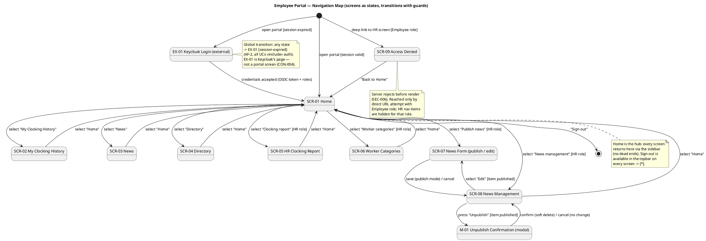

## Document Control

| Field | Value |
|---|---|
| Phase | Elaboration |
| Status | Draft |
| Milestone Target | End of Elaboration |
| Iteration | 1 (Cycle 1) |
| Initialized by | User Interface Designer — this iteration contributes the **Boundary Classes and Navigation Map** section (UI view classes, Navigation Map, UI Patterns). The remaining canonical sections (Design Overview, Domain Model, Use-Case Realizations, Design Packages and Classes, Interface Contracts, Persistent Data Classes, Capsules, Protocols and Signals) are owned by the Designer / Database Designer and are contributed by those roles. |
| Upstream inputs | Use-Case Model (UC-001–UC-010, UI Flow References); Supplementary Specification (USA-001–USA-009, SEC-006, PRF-002/003, REL-002/003); Software Architecture Document (COMP-001–COMP-009, interfaces ICLK/INEWS/IDIR/ICAT, ADR-001/003); design reference docs/inputs/employee-portal-design.html (CON-011) |

## Boundary Classes and Navigation Map

(User Interface Designer — Elaboration Iter 1. This section realizes the user-interface-specific parts of the use cases: the boundary classes the user operates, the formal navigation topology, and the UI patterns every implementer follows. Interaction flows per UC are in the Use-Case Model §Use-Case Specifications → UI Flow References; usability criteria are quantified in the Supplementary Specification §Usability.)

### Screen Registry

Every screen implements the mandatory design reference (CON-011 — docs/inputs/employee-portal-design.html): topbar (brand-900 #0B3D5C, user chip, Sign out), sidebar nav (role-aware), content cards (8 px radius, 1120 px container). The design reference's internal labels UC01/UC02/UC03 map to project UC-001/UC-003/UC-004 (project UC IDs follow the Use-Case Model).

| Screen | Name | Realizes (UC / FR) | Design reference source | Role visibility |
|---|---|---|---|---|
| SCR-01 | Home — clocking card + featured banner + history preview | UC-001 (FR-004), UC-003 (FR-007) | "Home: quick clocking + featured news" grid | All |
| SCR-02 | My Clocking History (current month) | UC-002 (FR-005) | "My clocking history" table | All |
| SCR-03 | News — featured banner + category chips + list | UC-003 (FR-007) | "News and announcements" section | All |
| SCR-04 | Directory — search bar + person cards | UC-004 (FR-010) | "Employee directory" section | All |
| SCR-05 | HR Clocking Report — filters + table + Export CSV | UC-005 (FR-001), UC-006 (FR-002) | "Clocking report" nav item + ghost-button style | HR only (SEC-006) |
| SCR-06 | Worker Categories — employee lookup + fixed category select | UC-007 (FR-003) | "Manage directory" nav item, relabeled (see reconciliation 1) | HR only (SEC-006) |
| SCR-07 | News Form (publish mode / edit mode) | UC-008 (FR-006), UC-009 (FR-008) | "Publish news" nav item + form pattern | HR only (SEC-006) |
| SCR-08 | News Management — list with status + actions | UC-009 (FR-008), UC-010 (FR-009) | Derived from news lifecycle (no direct mockup section) | HR only (SEC-006) |
| SCR-09 | Access Denied (inline error state) | SEC-006 (UC-005 EF-1, UC-009 EF-1) | Derived from role enforcement | Reached on role denial |
| M-01 | Unpublish confirmation modal | UC-010 (FR-009) | Derived from UC-010 step 5 (confirmation prompt) | HR only |
| EX-01 | Keycloak login | `<<include>>` auth, all UCs (AF-2) | External — Keycloak's page, not a portal screen (CON-004) | Unauthenticated |

### UI Boundary Classes

Boundary classes are named after screens (Razor Pages, CON-002) and depend ONLY on the subsystem interfaces published in the SAD Logical View (ICLK, INEWS, IDIR, ICAT) — no direct coupling to subsystem internals. Controllers carry the interaction logic the storyboards specify (button disable, 2 s ignore window, offline queue delegation, inline validation).

```plantuml
@startuml
title Employee Portal — UI Boundary Classes (Presentation Layer — CON-002)
skinparam classAttributeIconSize 0
skinparam fontSize 11
skinparam packageStyle rectangle

interface "IClockingService (COMP-001)" as ICLK
interface "INewsService (COMP-002)" as INEWS
interface "IDirectoryService (COMP-003)" as IDIR
interface "ICategoryService (COMP-004)" as ICAT

package "Clocking UI" {
  class "HomeView (SCR-01)" as HomeView <<view>>
  class "ClockingHistoryView (SCR-02)" as HistoryView <<view>>
  class "ClockingController" as ClockingCtl <<controller>>
}
package "News UI" {
  class "NewsView (SCR-03)" as NewsView <<view>>
  class "NewsFormView (SCR-07)" as NewsFormView <<view>>
  class "NewsManagementView (SCR-08, M-01)" as NewsMgmtView <<view>>
  class "NewsController" as NewsCtl <<controller>>
}
package "Directory UI" {
  class "DirectoryView (SCR-04)" as DirectoryView <<view>>
  class "DirectoryController" as DirectoryCtl <<controller>>
}
package "HR Admin UI" {
  class "ClockingReportView (SCR-05)" as ReportView <<view>>
  class "WorkerCategoriesView (SCR-06)" as CategoriesView <<view>>
  class "AccessDeniedView (SCR-09)" as DeniedView <<view>>
  class "CategoryController" as CategoryCtl <<controller>>
}

HomeView ..> ClockingCtl
HistoryView ..> ClockingCtl
ReportView ..> ClockingCtl
NewsView ..> NewsCtl
NewsFormView ..> NewsCtl
NewsMgmtView ..> NewsCtl
DirectoryView ..> DirectoryCtl
CategoriesView ..> CategoryCtl

ClockingCtl ..> ICLK
NewsCtl ..> INEWS
DirectoryCtl ..> IDIR
CategoryCtl ..> ICAT

note bottom of HomeView
  Status chip + status-aware button
  (green Clock In / red Clock Out),
  inline confirmation, featured
  banner, history preview.
  UC-001, UC-003.
end note

note bottom of ClockingCtl
  Records press timestamp (DAT-001),
  idempotency key; offline queue
  delegated to COMP-009 via COMP-001
  (ADR-003). AF-3: 2 s ignore window.
end note

note bottom of NewsMgmtView
  List with status; Unpublish offered
  on published items only (AF-2);
  M-01 confirmation modal (CON-012).
end note

note bottom of CategoriesView
  Employee lookup (AD display data,
  read-only) + FIXED category select
  (CON-013) - no category CRUD.
end note

note bottom of DeniedView
  Rendered when an Employee-role
  session attempts an HR screen
  (SEC-006). No data revealed.
end note

note right of ICLK
  Interfaces owned by the SAD
  (Logical View). Boundary classes
  depend on interfaces only —
  no direct coupling to subsystem
  internals (SAD cohesion rule).
end note
@enduml
```

### Navigation Map

Formal state machine: screens are states, user actions are transitions, guards are bracketed conditions. Verified for completeness — every screen is reachable, no dead ends (every screen returns to Home via the sidebar), terminal states are explicit (Sign out; session expiry is a global transition to EX-01).

**Navigation completeness verification:**
- **Reachability:** all 11 screens reachable — SCR-01 from `[*]`; SCR-02/03/04 from SCR-01 (Employee + HR); SCR-05/06/07/08 from SCR-01 `[HR role]`; SCR-07 additionally from SCR-08 `[item published]`; M-01 from SCR-08 `[item published]`; SCR-09 from `[*]` (deep link, Employee role); EX-01 from `[*]` `[session expired]`.
- **No dead ends:** every screen transitions back to SCR-01 (sidebar "Home"); SCR-09 offers "Back to Home"; M-01 resolves to SCR-08 on both confirm and cancel (AF-1).
- **Terminal states explicit:** Sign out → `[*]` (topbar, every screen); session expiry → EX-01 (global transition, AF-2).
- **Guards:** `[HR role]` on all HR-screen transitions (SEC-006 — server-enforced; hiding nav items is defense-in-depth, never the only barrier); `[item published]` on Unpublish/Edit (UC-009 AF-2, UC-010 AF-2); `[session valid/expired]` on entry (AF-2).

### UI Patterns

Coordination artifact for the Designer (view-class detailing), the Implementer (screen construction), and the Technical Writer (terminology). All patterns are drawn from the mandatory design reference (CON-011); nothing is invented beyond it.

**P-01 Interaction conventions**
- Primary action = filled button, brand-500 #1E7FB5, 40 px height (Search, Save, Publish). Clocking button is the exception: 52 px height — green ▶ "Clock In" (accent #17A398) or red ■ "Clock Out" (danger #C0392B), toggled by current status (FR-004; never both visible).
- Destructive/irreversible-feeling actions require a confirmation modal (M-01 pattern: question + consequence + Confirm/Cancel). Unpublish always states the record is retained (CON-012).
- Secondary actions = ghost button (white, 1 px line border): Export CSV, Cancel.
- Filters = chips (999 px radius, 30 px height): All / General / HR / IT / Events; active chip = brand-100 background. Selects for department/office filters.
- Every user action produces visible feedback < 1 s (PRF-002 for clocking; inline confirmation, validation highlight, or modal).

**P-02 Visual hierarchy**
- Topbar (brand-900) → sidebar nav (role-aware, active item brand-100) → content: page title 28 px, subtitle muted, cards (8 px radius, 1 px line border, soft shadow) on bg #F4F7FA, 1120 px container, 24 px gutters.
- Section headers: 12 px uppercase, muted, bottom border. Table headers: 12 px uppercase muted. Status values: chips/tags (present = accent-tinted, complete = ok tag).
- Featured news = warn-tinted banner (#FFF6E2→#FFFBF2 gradient, 4 px warn left border, ★) at the top of News and Home (FR-006/FR-007).

**P-03 Terminology (exact, from declared scope — never synonyms)**
- "Clock In" / "Clock Out" (FR-004). "Unpublish" — NEVER "Delete" or "Remove" (CON-012; no hard delete exists). "Worker categories" — NEVER "Manage directory" (CON-007; see reconciliation 1). Categories: General, HR, IT, Events (FR-006/FR-007). "Sign out". Directory fields: name, job title, department, office, email, extension (FR-010). UI language: English (design reference).

**P-04 Accessibility rules (USA-009 — from the design reference's accessibility declaration)**
- AA contrast on all text; visible focus indicators on every interactive element; interactive targets ≥ 40 px (clocking button 52 px); full keyboard operability of every screen; M-01 traps focus while open, Esc = Cancel; error states are text + highlight, never color alone.

**P-05 State patterns (consistent across all screens)**
- Empty state: friendly one-line message, no skeleton rows (UC-002 AF-1, UC-003 AF-1/AF-2, UC-004 AF-1, UC-005 AF-1).
- Unavailable state: inline "… temporarily unavailable" message in the content area, NO partial or cached data (UC-002 EF-1, UC-003 EF-1, UC-004 AF-3, UC-006 AF-2, UC-007 AF-2 — CON-006 forbids local fallback).
- Missing AD attribute: field shown blank, entry NOT hidden (UC-004 AF-2 — R001 graceful degradation).
- Role denial: SCR-09 inline state, no data revealed (SEC-006).
- Validation: inline field highlight + message on submit (UC-008 AF-1, UC-009 AF-1).

**P-06 Role-based UI (SEC-002/SEC-006)**
- Employee role sees: Home, Clock In/Out, My history, News, Directory. HR Administrator additionally sees: Publish news, News management, Clocking report, Worker categories (sidebar separator + role tag, per design reference).
- Hiding is presentation only — every HR screen enforces the role server-side before render (SCR-09 otherwise).

**P-07 Time display (USA-008 — stakeholder decision)**
- Every displayed clocking time renders in America/Havana local time (IANA, DST-aware): status chip ("Present since 08:02"), confirmation ("Clocked in at 08:58:12"), history tables, HR report. Raw UTC or server time is never shown to users; only the CSV export carries ISO-8601 with explicit offset (UC-006).

### Design-Reference Reconciliations (CON-011 — R007 mitigation)

1. **Sidebar item "Manage directory" → SCR-06 "Worker categories".** CON-007 forbids editing employee fields anywhere in the portal; the only HR management adjacent to the directory is worker category assignment (FR-003). The nav item keeps the reference's position, icon slot, and style; its label reads "Worker categories" (error prevention — a label promising directory management would mislead).
2. **"Export CSV (HR)" placement.** The mockup shows an HR-only export affordance on the personal history card; UC-006 step 1 places the export in the clocking review area. The control renders on SCR-05 in the reference's ghost-button style, HR role only; SCR-02 carries no export (FR-005 view-only, SEC-007).
3. **Mockup UC labels.** The reference's internal UC01/UC02/UC03 map to project UC-001/UC-003/UC-004 (Use-Case Model is the UC-ID authority — prevents recurrence of the LCO F1 UC-ID mismatch).

## Traceability

| Element | Traces From | Link Type | Traces To |
|---|---|---|---|
| SCR-01 Home | UC-001 (FR-004), UC-003 (FR-007), CON-011 | Derives | HomeView (CLS), ClockingController, ICLK, INEWS |
| SCR-02 My Clocking History | UC-002 (FR-005), SEC-007 | Derives | ClockingHistoryView, ClockingController, ICLK |
| SCR-03 News | UC-003 (FR-007), CON-011 | Derives | NewsView, NewsController, INEWS |
| SCR-04 Directory | UC-004 (FR-010), CON-005/CON-006, R001 | Derives | DirectoryView, DirectoryController, IDIR |
| SCR-05 HR Clocking Report | UC-005 (FR-001), UC-006 (FR-002), SEC-006, INT-005 | Derives | ClockingReportView, ClockingController, ICLK |
| SCR-06 Worker Categories | UC-007 (FR-003), CON-013, CON-006 | Derives | WorkerCategoriesView, CategoryController, ICAT |
| SCR-07 News Form | UC-008 (FR-006), UC-009 (FR-008), AC-002 | Derives | NewsFormView, NewsController, INEWS |
| SCR-08 News Management | UC-009 (FR-008), UC-010 (FR-009), CON-012 | Derives | NewsManagementView, NewsController, INEWS |
| SCR-09 Access Denied | SEC-006 (UC-005 EF-1, UC-009 EF-1) | Derives | AccessDeniedView |
| M-01 Unpublish modal | UC-010 step 5 (FR-009), CON-012 | Derives | NewsManagementView |
| EX-01 Keycloak login | CON-004, SEC-001 (all UCs `<<include>>` auth) | DependsOn | Keycloak (external — not a portal screen) |
| Navigation Map | UC-001–UC-010 flows, SEC-002/SEC-006 | Derives | All SCR-* screens; Use-Case Model UI Flow References |
| UI Patterns P-01…P-07 | CON-011, USA-001…USA-009, SEC-006, CON-012, CON-013, USA-008 (stakeholder decision) | Refines | Designer view classes; Implementer screens; Technical Writer terminology |
| Boundary classes (view/controller) | SAD COMP-001–COMP-004 interfaces (ICLK, INEWS, IDIR, ICAT), ADR-001 | Derives | SAD Logical View (Presentation Layer) |
| Design-reference reconciliations 1–3 | CON-011, CON-007, CON-012, UC-006 step 1, Use-Case Model (UC-ID authority) | Mitigates | R007 (UI fidelity risk) |