## Document Control
| Field | Value |
|---|---|
| Phase | Elaboration |
| Status | Draft |
| Milestone Target | End of Elaboration (LCA) |
| Iteration | 2 (Cycle 1) — convergence cycle |
| Contributions (Elab Iter 1) | **User Interface Designer** — §Boundary Classes and Navigation Map (screen registry SCR-01…SCR-09, M-01, EX-01; UI boundary classes; Navigation Map; UI Patterns P-01…P-07) — PRESERVED verbatim. **Designer** — §Design Overview, §Domain Model (analysis classes ACL-001…ACL-026 + attribution), §Use-Case Realizations (SEQ-001…SEQ-010), §Design Packages and Classes (CLS-001…CLS-027, state machines), §Interface Contracts (INT-006…INT-019), §Capsules omission note, §Traceability (merged) — this update. **Database Designer** — §Persistent Data Classes — CONTRIBUTED this iteration: physical schema (5 tables mapped from CLS-021…CLS-025, PostgreSQL per CON-003/ADR-002; CLS-026/027 transient, never persisted per CON-006), O/R mapping (identity strategy, loading policy, write policy per class), index strategy (7 indexes, each justified by PRF-001/002, REL-002/003, AUD-002/004), baseline migration V1 (idempotent DDL; append-only REVOKE on audit tables per DAT-002), performance baseline for critical access paths — this update. |
| Contributions (Elab Iter 2) | **User Interface Designer** — §Boundary Classes and Navigation Map EVOLVED (not recreated): P-05 extended with the stakeholder-confirmed R001 behavioural bar and its per-UC rendering contracts (UC-004 AF-2 directory cards / UC-005 AF-3 review table — every event row / UC-006 AF-3 CSV — blank cells, no abort / UC-007 AF-3 lookup — still locatable and selectable); **Salt wireframes added** for the two primary screens — SCR-01 Home (first-use affordance, USA-004) and SCR-04 Directory (10-second lookup, USA-003; renders the R001 blank-field contract); §Traceability UI rows extended (SB-05, wireframes, P-05 extension). **Designer** — §Use-Case Realizations EVOLVED (not recreated): SEQ-005/SEQ-006/SEQ-007 extended with the stakeholder-confirmed R001 behavioural bar AF-3 flows (UC-005 AF-3 — every event row rendered, blank display fields, employee not removed, no error; UC-006 AF-3 — every event row written, blank cells, no abort; UC-007 AF-3 — employee locatable and selectable with blank fields); §Design Overview extended with design decision D-9 (GetDisplayData map completeness over the requested uid set) and the Directory-query / Report-export mechanism rows updated to the confirmed bar; §Interface Contracts updated (INT-008 GetDisplayData, INT-010 ILdapGateway, INT-013 IReportExport postconditions); §Traceability Designer rows added; §Document Control updated in place — this update. §Domain Model, §Design Packages and Classes, §Persistent Data Classes (Database Designer), §Boundary Classes and Navigation Map (User Interface Designer), §Capsules — PRESERVED (zero findings on this artifact at the Elab Iter 1 LCA review; the bar adds no class and changes no signature). |
| Upstream inputs | Use-Case Model (UC-001…UC-010, all FULL, UI Flow References incl. SB-01…SB-05; UC-005/006/007 AF-3 flows stakeholder-confirmed); Supplementary Specification (SEC-001…007, AUD-001…005, DAT-001/002, USA-001…009, REL-001…004, PRF-001…003, SUP-004, DC-001…010, INT-001…005, STD-001…005; R001 Behavioural Bar — one contract, four consumers); Software Architecture Document (COMP-001…COMP-011, subsystem interfaces, ADR-001…004, timestamp convention: store UTC / display America/Havana / export ISO-8601 with explicit offset / payroll day = local calendar day); Review Record (zero open findings on the Design Model); stakeholder decisions (Elaboration Iter 2: R001 behavioural bar — behavioural, not statistical, prior >90% criterion dropped as invented; bar applies to all four AD-reading use cases — answer "Yes") |
| Optional artifacts | Data Model — [OMITTED: trigger not fired per Development Case §5.2 — re-verified via the trigger oracle this iteration (fired: false); data lives inline in this Design Model]. Architectural Proof-of-Concept — trigger FIRED, owned by the Software Architect (not a Designer artifact) |
## Design Overview
The Design Model translates the ten declared use cases (UC-001…UC-010) into collaborations of design classes **within** the Software Architecture Document's subsystem baseline (COMP-001…COMP-011, ADR-001…004). It is the single design model for the portal — every class, interface, realization, and state machine below belongs to it. The Implementer codes from this model; nothing is implemented that is not realized here.

### Design Decisions (Elaboration Iter 1: D-1…D-8; Elaboration Iter 2: D-9)

1. **Layering (ADR-001):** dependencies point DOWN only — Presentation (CLS-017…CLS-020) → Application services (CLS-001…CLS-007) → Infrastructure (CLS-008…CLS-016). Every cross-package reference is an interface, never a concrete class (SAD cohesion rule).
2. **Authentication at the request boundary (SAD Elaboration refinement):** the OIDC middleware (COMP-006 / CLS-010) authenticates and authorizes before a controller executes; controllers receive an `AuthenticatedUser` (uid + roles from claims) as a parameter. No service calls IAUTH — the per-service coupling of the Inception candidate is removed.
3. **Timestamp convention (stakeholder decision, Elab Iter 1) owned by one class:** CLS-007 TimeService is the single owner of "store UTC, display America/Havana (IANA, DST-aware), export ISO-8601 with explicit offset, payroll day = local calendar day". No other class converts time.
4. **Audit atomicity (DAT-002):** CLS-005 AuditService **stages** its entry via the audit repositories; the orchestrating service's single `SaveChanges()` commits the state change AND the audit entry in ONE transaction. A failed audit write rolls back the state change — no state change can exist without its trail entry.
5. **Soft delete (CON-012):** CLS-022 NewsItem has NO delete path — `Status: Published | Unpublished` only. Unpublished records are retained and audited; the state machine (§Design Packages and Classes) makes Unpublished terminal.
6. **Idempotent receiver (REL-002):** CLS-001 ClockingService.RecordEvent carries a client-generated idempotency key; the UNIQUE constraint in PostgreSQL (not application locking) is the duplicate-suppression point.
7. **No Employee entity (CON-006):** `EmployeeUid: string` references the AD user id everywhere; display data is resolved live from AD via CLS-009 LdapGateway. The portal stores no name, title, department, office, email, or extension.
8. **Timestamp capture at the boundary (DAT-001):** the HomeView page script captures `recordedAtUtc` (UTC) and the idempotency key at the moment of the button press — the SAME capture on the online and offline paths, so a queued event replays with its original recorded timestamp unchanged.
9. **R001 behavioural bar — one contract, four consumers (stakeholder decision, Elaboration Iter 2; bar reach stakeholder-confirmed — asked whether the bar applies to all four AD-reading use cases and not only the directory search, the stakeholder answered "Yes"):** the bar's three clauses — (a) every employee is rendered whether or not their attributes are complete; (b) a missing attribute never removes someone from results; (c) a missing attribute never raises an error — are realized as POSTCONDITIONS on the existing LDAP Query Mechanism classes. No new class, no signature change. CLS-009 LdapGateway maps missing attributes to null and never drops an entry (Search); CLS-003 DirectoryService.GetDisplayData returns a map **complete over the requested uid set** — a uid AD cannot resolve (e.g., a departed employee with clocking history) maps to an all-null `EmployeeDisplayData`, so clause (a) holds mechanically for UC-005/UC-006 without TryGetValue scattering across consumers; CLS-006 ReportExportService writes every event row with blank cells for missing display fields (ad_user_id resolves identity — CON-006); CLS-017/CLS-020 render blank display fields without removing the row/entry. AF-2 (AD unreachable) remains a distinct condition with a distinct contract (uid-only table for UC-005, abort for UC-006, blocked lookup for UC-007) — the bar does not waive it.

### Mechanism Resolution (Three-Level Chain)

Every analysis mechanism is resolved to a design mechanism (pattern + properties). Implementation mechanisms are named **only** where the stakeholder declared the technology.

| Analysis Mechanism | Design Mechanism (pattern + properties) | Implementation Mechanism (declared only) |
|---|---|---|
| Persistence | Repository + Unit-of-Work over a transactional relational store: CLS-011 PgPersistence owns the DbContext; per-aggregate repositories (CLS-012…CLS-016) behind INT-015…INT-019; audit writes share the caller's transaction (DAT-002); `idempotency_key` UNIQUE (REL-002) | PostgreSQL via EF Core + Npgsql 10.0.3 (CON-003, ADR-002) |
| Audit trail | Append-only entry objects (CLS-023, CLS-025) staged by CLS-005 AuditService, committed by the orchestrator in-transaction; `Snapshot` column versions every edit (AUD-002); no UPDATE/DELETE path exists (DAT-002) | PostgreSQL tables `news_audit` / `category_audit` (SAD §Data View) |
| Time convention | CLS-007 TimeService: capture UTC at button press (DAT-001); convert display to America/Havana; format export as ISO-8601 with the offset in force at event time; compute month boundaries as local calendar days | .NET 10 `TimeZoneInfo` (IANA zones) — declared stack CON-001 |
| Offline resilience | Client-side ordered queue (CLS-008 OfflineQueueClient, localStorage, capacity ≥ 10, ordered by recorded timestamp) + idempotent sync endpoint; UNIQUE key rejects exact duplicates; sync ≤ 60 s (REL-002/003) | Browser localStorage + PostgreSQL UNIQUE constraint (ADR-003) |
| Authentication | OIDC middleware at the request boundary; roles read from claims (SEC-002/006); services receive the authenticated identity as a parameter | Keycloak OIDC (CON-004 — external, portal is client only) |
| Directory query | CLS-009 LdapGateway: read-only LDAP v3 queries, 5 s hard timeout (PRF-003), graceful degradation — missing attributes are null, the entry is NOT hidden; **R001 behavioural bar (stakeholder-confirmed, Elab Iter 2): every employee rendered, no removal, no error — one contract, four consumers (UC-004/005/006/007)**; GetDisplayData map complete over the requested uid set (D-9); no local copy (CON-006) | Active Directory over LDAP v3 (CON-005, CON-007) |
| Report export | CLS-006 ReportExportService encapsulates CSV column set v1; month boundaries computed in America/Havana local time; aborts on AD unavailable — no partial file (UC-006 AF-2); missing display attributes → every event row written with blank cells, no abort (UC-006 AF-3 — R001 bar; ad_user_id resolves identity) | CSV per STD-003 |
| Category list | Fixed list loaded from external configuration at startup; no CRUD path exists anywhere in the portal (CON-013) | `worker-categories.json` (ADR-004) |

### Design Patterns Applied

| Pattern | Application | Rationale |
|---|---|---|
| Repository + Unit of Work | CLS-011 + CLS-012…CLS-016 behind INT-015…INT-019 | Single data-access seam; IPersistence fakeable in tests; transaction scope explicit (audit atomicity) |
| Facade | CLS-001…CLS-004 facade infrastructure for the Presentation layer | Controllers depend on 4 service interfaces, not on 5+ infrastructure interfaces |
| Soft Delete | CLS-022 NewsItem.Status | CON-012 — no hard delete; record retained for audit |
| Idempotent Receiver | CLS-001.RecordEvent(idempotencyKey) + UNIQUE constraint | REL-002 — offline replay never duplicates |
| Strategy (encapsulated query) | CLS-009 LdapGateway owns filter construction + attribute mapping | R001 volatility: query/fallback changes touch one class |
| GRASP Controller | CLS-017…CLS-020 receive system events, delegate to services | Non-UI owner of interaction logic (button disable, 2 s ignore window, queue delegation) |
| GRASP Information Expert | CLS-022 NewsItem validates and applies its own edits; CLS-021 ClockingEvent is immutable after capture | Validation next to the data it needs |
| Dependency Injection | Composition root (`Program.cs`) wires INT-006…INT-019 to implementations | Testability entry points below |

### Testability Entry Points

- **Every subsystem boundary is an interface** (INT-006…INT-019): the Implementer injects fakes for IPersistence, ILdapGateway, ITimeConvention, IAuditService in unit tests — no database, AD, or Keycloak required.
- **CLS-007 TimeService is injectable everywhere time is read** — tests fix the clock; DST-boundary behavior (USA-008) is testable without waiting for a clock change.
- **CLS-009 LdapGateway is fakeable** — R001 graceful-degradation tests (missing attributes → blank fields, entry not hidden) run without AD; the confirmed bar's three clauses (render / no removal / no error) are assertable against a fake ILdapGateway returning deliberately-gapped entries — the same fixture shape the R001 PoC uses against the disposable directory; the real-AD integration test waits on R010 (STK-004 service account).
- **CLS-005 AuditService is observable** — every state-changing operation's test asserts an append-only audit row committed in the same transaction (DAT-002).
- **CLS-008 OfflineQueueClient** is exercised by the AC-005 automated test (5-minute drop simulation) against the idempotent sync endpoint.
## Domain Model

### Analysis Classes (ACL-001…ACL-026)

Analysis classes per use case, stereotyped boundary / control / entity. Boundary classes are detailed by the User Interface Designer in §Boundary Classes and Navigation Map; the analysis view below fixes the complete responsibility map that the design classes realize.


```plantuml
@startuml
title Employee Portal — Analysis Classes (ACL-001…ACL-026) — Elaboration Iter 1
skinparam classAttributeIconSize 0
skinparam fontSize 10
skinparam packageStyle rectangle

package "Boundary (screens — detailed in §Boundary Classes and Navigation Map)" {
  class "ACL-001 HomeView (SCR-01)\nUC-001, UC-003" as B01 <<boundary>>
  class "ACL-002 ClockingHistoryView (SCR-02)\nUC-002" as B02 <<boundary>>
  class "ACL-003 NewsView (SCR-03)\nUC-003" as B03 <<boundary>>
  class "ACL-004 DirectoryView (SCR-04)\nUC-004" as B04 <<boundary>>
  class "ACL-005 ClockingReportView (SCR-05)\nUC-005, UC-006" as B05 <<boundary>>
  class "ACL-006 WorkerCategoriesView (SCR-06)\nUC-007" as B06 <<boundary>>
  class "ACL-007 NewsFormView (SCR-07)\nUC-008, UC-009" as B07 <<boundary>>
  class "ACL-008 NewsManagementView (SCR-08)\nUC-009, UC-010" as B08 <<boundary>>
  class "ACL-009 AccessDeniedView (SCR-09)\nUC-005 EF-1, UC-009 EF-1" as B09 <<boundary>>
}

package "Control" {
  class "ACL-010 ClockingController\nUC-001, UC-002, UC-005, UC-006" as C01 <<control>>
  class "ACL-011 NewsController\nUC-003, UC-008, UC-009, UC-010" as C02 <<control>>
  class "ACL-012 DirectoryController\nUC-004" as C03 <<control>>
  class "ACL-013 CategoryController\nUC-007" as C04 <<control>>
  class "ACL-014 ClockingHandler -> CLS-001\nUC-001, UC-002, UC-005" as C05 <<control>>
  class "ACL-015 NewsHandler -> CLS-002\nUC-003, UC-008, UC-009, UC-010" as C06 <<control>>
  class "ACL-016 DirectoryHandler -> CLS-003\nUC-004" as C07 <<control>>
  class "ACL-017 CategoryHandler -> CLS-004\nUC-007" as C08 <<control>>
  class "ACL-018 AuditHandler -> CLS-005\ncross-cutting (UC-007…UC-010)" as C09 <<control>>
  class "ACL-019 ReportHandler -> CLS-006\nUC-006" as C10 <<control>>
  class "ACL-020 TimeKeeper -> CLS-007\ncross-cutting (UC-001, UC-002, UC-005, UC-006)" as C11 <<control>>
}

package "Entity" {
  class "ACL-021 ClockingEvent -> CLS-021\nUC-001, UC-002, UC-005, UC-006" as E01 <<entity>>
  class "ACL-022 NewsItem -> CLS-022\nUC-003, UC-008, UC-009, UC-010" as E02 <<entity>>
  class "ACL-023 NewsAuditEntry -> CLS-023\nUC-008, UC-009, UC-010" as E03 <<entity>>
  class "ACL-024 WorkerCategory -> CLS-024\nUC-007" as E04 <<entity>>
  class "ACL-025 CategoryAuditEntry -> CLS-025\nUC-007" as E05 <<entity>>
  class "ACL-026 DirectoryEntry -> CLS-026\nUC-004, UC-005, UC-006, UC-007\n(transient — AD-sourced)" as E06 <<entity>>
}

B01 --> C01
B02 --> C01
B05 --> C01
B03 --> C02
B07 --> C02
B08 --> C02
B04 --> C03
B06 --> C04

C01 --> C05
C01 --> C10 : UC-006 export
C02 --> C06
C03 --> C07
C04 --> C08

C05 --> E01
C05 --> C11
C06 --> E02
C06 --> C09
C07 --> E06
C08 --> E04
C08 --> C09
C09 --> E03
C09 --> E05
C10 --> E01
C10 --> C11
C10 --> E06

note bottom of E06
  DirectoryEntry is transient: read
  from AD on demand, never persisted
  (CON-006). Missing attributes are
  null — the entry is NOT hidden (R001).
end note

note right of C09
  Audit is a cross-cutting mechanism
  (NFR-005), included from UC-007,
  UC-008, UC-009, UC-010 — never a
  standalone use case.
end note

note right of C11
  TimeKeeper owns the timestamp
  convention (stakeholder decision,
  Elab Iter 1): store UTC, display
  America/Havana, export ISO-8601
  with explicit offset, payroll
  day = local calendar day.
end note
@enduml
```

### Analysis-to-Design Attribution

Every analysis class maps to a design class or set of design classes — no analysis class disappears between models.

| Analysis Class | Stereotype | Realized By (design) | Notes |
|---|---|---|---|
| ACL-001…ACL-009 (views) | boundary | View classes — §Boundary Classes and Navigation Map (UI Designer) | Rendering only; interaction logic lives in controllers |
| ACL-010 ClockingController | control | CLS-017 ClockingController | GRASP Controller for clocking + report system events |
| ACL-011 NewsController | control | CLS-018 NewsController | News lifecycle system events |
| ACL-012 DirectoryController | control | CLS-019 DirectoryController | Directory search system events |
| ACL-013 CategoryController | control | CLS-020 CategoryController | Category assignment system events |
| ACL-014 ClockingHandler | control | CLS-001 ClockingService (COMP-001) | + CLS-008 OfflineQueueClient (AF-1 mechanism) |
| ACL-015 NewsHandler | control | CLS-002 NewsService (COMP-002) | Soft delete + audit delegation |
| ACL-016 DirectoryHandler | control | CLS-003 DirectoryService (COMP-003) | Delegates queries to CLS-009 LdapGateway |
| ACL-017 CategoryHandler | control | CLS-004 CategoryService (COMP-004) | Fixed list from worker-categories.json (ADR-004) |
| ACL-018 AuditHandler | control | CLS-005 AuditService (COMP-005) | Cross-cutting; staged append, orchestrator commits (DAT-002) |
| ACL-019 ReportHandler | control | CLS-006 ReportExportService (COMP-010) | CSV column set v1; local-time month boundaries |
| ACL-020 TimeKeeper | control | CLS-007 TimeService (COMP-011) | Single owner of the timestamp convention |
| ACL-021 ClockingEvent | entity | CLS-021 ClockingEvent | Immutable after capture (DAT-001) |
| ACL-022 NewsItem | entity | CLS-022 NewsItem | State machine in §Design Packages and Classes |
| ACL-023 NewsAuditEntry | entity | CLS-023 NewsAuditEntry | Append-only (DAT-002) |
| ACL-024 WorkerCategory | entity | CLS-024 WorkerCategory | Two data columns only (CON-006) |
| ACL-025 CategoryAuditEntry | entity | CLS-025 CategoryAuditEntry | old + new value (AUD-004) |
| ACL-026 DirectoryEntry | entity (transient) | CLS-026 DirectoryEntry | AD-sourced; never persisted |
| — (mechanism, not analysis class) | — | CLS-008…CLS-016, CLS-027 | Infrastructure design classes realizing the mechanisms resolved in §Design Overview |

### Domain Model (persistent entities + transient directory data)

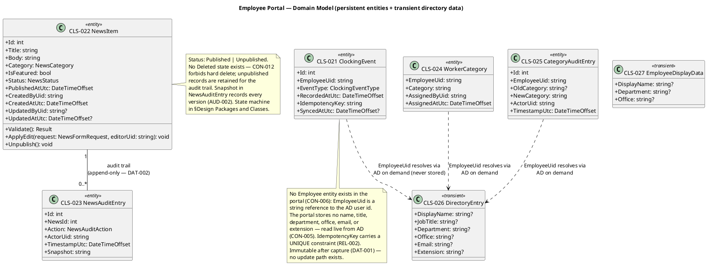
```plantuml
@startuml
title Employee Portal — Domain Model (persistent entities + transient directory data)
skinparam classAttributeIconSize 0
skinparam fontSize 11

class "CLS-021 ClockingEvent" as ClockingEvent <<entity>> {
  +Id: int
  +EmployeeUid: string
  +EventType: ClockingEventType
  +RecordedAtUtc: DateTimeOffset
  +IdempotencyKey: string
  +SyncedAtUtc: DateTimeOffset?
}

class "CLS-022 NewsItem" as NewsItem <<entity>> {
  +Id: int
  +Title: string
  +Body: string
  +Category: NewsCategory
  +IsFeatured: bool
  +Status: NewsStatus
  +PublishedAtUtc: DateTimeOffset
  +CreatedByUid: string
  +CreatedAtUtc: DateTimeOffset
  +UpdatedByUid: string?
  +UpdatedAtUtc: DateTimeOffset?
  +Validate(): Result
  +ApplyEdit(request: NewsFormRequest, editorUid: string): void
  +Unpublish(): void
}

class "CLS-023 NewsAuditEntry" as NewsAuditEntry <<entity>> {
  +Id: int
  +NewsId: int
  +Action: NewsAuditAction
  +ActorUid: string
  +TimestampUtc: DateTimeOffset
  +Snapshot: string
}

class "CLS-024 WorkerCategory" as WorkerCategory <<entity>> {
  +EmployeeUid: string
  +Category: string
  +AssignedByUid: string
  +AssignedAtUtc: DateTimeOffset
}

class "CLS-025 CategoryAuditEntry" as CategoryAuditEntry <<entity>> {
  +Id: int
  +EmployeeUid: string
  +OldCategory: string?
  +NewCategory: string
  +ActorUid: string
  +TimestampUtc: DateTimeOffset
}

class "CLS-026 DirectoryEntry" as DirectoryEntry <<transient>> {
  +DisplayName: string?
  +JobTitle: string?
  +Department: string?
  +Office: string?
  +Email: string?
  +Extension: string?
}

class "CLS-027 EmployeeDisplayData" as EmployeeDisplayData <<transient>> {
  +DisplayName: string?
  +Department: string?
  +Office: string?
}

NewsItem "1" -- "0..*" NewsAuditEntry : audit trail\n(append-only — DAT-002)
ClockingEvent ..> DirectoryEntry : EmployeeUid resolves via\nAD on demand (never stored)
WorkerCategory ..> DirectoryEntry : EmployeeUid resolves via\nAD on demand
CategoryAuditEntry ..> DirectoryEntry : EmployeeUid resolves via\nAD on demand

note bottom of ClockingEvent
  No Employee entity exists in the
  portal (CON-006): EmployeeUid is a
  string reference to the AD user id.
  The portal stores no name, title,
  department, office, email, or
  extension — read live from AD
  (CON-005). IdempotencyKey carries a
  UNIQUE constraint (REL-002).
  Immutable after capture (DAT-001) —
  no update path exists.
end note

note right of NewsItem
  Status: Published | Unpublished.
  No Deleted state exists — CON-012
  forbids hard delete; unpublished
  records are retained for the
  audit trail. Snapshot in
  NewsAuditEntry records every
  version (AUD-002). State machine
  in §Design Packages and Classes.
end note
@enduml
```

**No-Employee-entity rule (CON-006):** every table and every transient object references the AD user id as a string. `CLS-026 DirectoryEntry` (six corporate fields, FR-010) and `CLS-027 EmployeeDisplayData` (three display fields for HR views, UC-005/006/007) are read-only projections of AD — constructed by CLS-009 LdapGateway, never persisted, never cached beyond the request.

## Use-Case Realizations
One realization per declared use case — the collaboration of design objects that implements the flow of events. Main flow, alternative flows (AF), and exception flows (EF) are shown in each sequence diagram. Participant IDs reference the design classes in §Design Packages and Classes.

**Elaboration Iter 2 evolution (Designer — convergence cycle):** SEQ-005, SEQ-006, SEQ-007 extended with the **R001 behavioural bar AF-3 flows** (stakeholder decision, Elaboration Iter 2; bar reach stakeholder-confirmed — asked whether the bar applies to all four AD-reading use cases and not only the directory search, the stakeholder answered "Yes"). SEQ-001…SEQ-004, SEQ-008…SEQ-010 preserved exactly as reviewed at the Elaboration Iter 1 LCA review (zero findings).

| SEQ | Use Case | Participating design classes | Flows realized |
|---|---|---|---|
| SEQ-001 | UC-001 Clock In and Clock Out | CLS-017, CLS-001, CLS-007, CLS-008, CLS-011, CLS-012 | Main, AF-1 (offline queue + sync), AF-2 (session), AF-3 (2 s ignore) |
| SEQ-002 | UC-002 View Own Clocking History | CLS-017, CLS-001, CLS-007, CLS-011, CLS-012 | Main, AF-1 (empty), AF-2 (queued note), EF-1 (PG down) |
| SEQ-003 | UC-003 Browse News | CLS-018, CLS-002, CLS-013 | Main, AF-1 (empty category), AF-2 (no news), EF-1 (PG down) |
| SEQ-004 | UC-004 Search Employee Directory | CLS-019, CLS-003, CLS-009 | Main, AF-1 (no results), AF-2 (missing attrs — R001 bar), AF-3 (LDAP down) |
| SEQ-005 | UC-005 Review Employee Clockings | CLS-017, CLS-001, CLS-003, CLS-009, CLS-011 | Main, AF-1 (no match), AF-2 (AD down), **AF-3 (missing AD attributes — every event row rendered, R001 bar)**, EF-1 (role denial) |
| SEQ-006 | UC-006 Export Monthly Clocking Report | CLS-017, CLS-006, CLS-007, CLS-003, CLS-009, CLS-011 | Main, AF-1 (no data), AF-2 (AD down — abort), **AF-3 (missing AD attributes — blank cells, every row written, no abort — R001 bar)** |
| SEQ-007 | UC-007 Assign Worker Category | CLS-020, CLS-004, CLS-003, CLS-009, CLS-005, CLS-011 | Main, AF-1 (unchanged), AF-2 (AD down), **AF-3 (missing AD attributes — locatable and selectable — R001 bar)** |
| SEQ-008 | UC-008 Publish News | CLS-018, CLS-002, CLS-005, CLS-011 | Main, AF-1 (validation) |
| SEQ-009 | UC-009 Edit Published News | CLS-018, CLS-002, CLS-005, CLS-011 | Main, AF-1 (validation), AF-2 (concurrent unpublish), EF-1 (role denial) |
| SEQ-010 | UC-010 Unpublish News | CLS-018, CLS-002, CLS-005, CLS-011 | Main, AF-1 (cancel), AF-2 (already unpublished) |

### SEQ-001 — UC-001: Clock In and Clock Out (FR-004, NFR-002, NFR-004, AC-005, DAT-001)

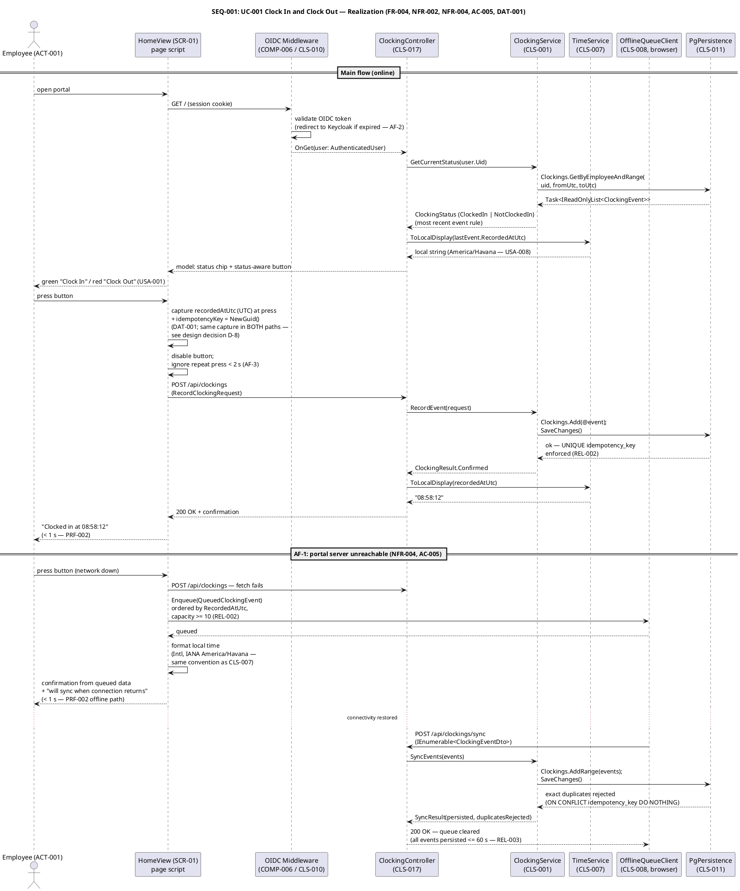
```plantuml
@startuml
title SEQ-001: UC-001 Clock In and Clock Out — Realization (FR-004, NFR-002, NFR-004, AC-005, DAT-001)

actor "Employee (ACT-001)" as EMP
participant "HomeView (SCR-01)\npage script" as VIEW
participant "OIDC Middleware\n(COMP-006 / CLS-010)" as MW
participant "ClockingController\n(CLS-017)" as CTL
participant "ClockingService\n(CLS-001)" as CLK
participant "TimeService\n(CLS-007)" as TIME
participant "OfflineQueueClient\n(CLS-008, browser)" as QUEUE
participant "PgPersistence\n(CLS-011)" as PG

== Main flow (online) ==
EMP -> VIEW : open portal
VIEW -> MW : GET / (session cookie)
MW -> MW : validate OIDC token\n(redirect to Keycloak if expired — AF-2)
MW --> CTL : OnGet(user: AuthenticatedUser)
CTL -> CLK : GetCurrentStatus(user.Uid)
CLK -> PG : Clockings.GetByEmployeeAndRange(\nuid, fromUtc, toUtc)
PG --> CLK : Task<IReadOnlyList<ClockingEvent>>
CLK --> CTL : ClockingStatus (ClockedIn | NotClockedIn)\n(most recent event rule)
CTL -> TIME : ToLocalDisplay(lastEvent.RecordedAtUtc)
TIME --> CTL : local string (America/Havana — USA-008)
CTL --> VIEW : model: status chip + status-aware button
VIEW --> EMP : green "Clock In" / red "Clock Out" (USA-001)

EMP -> VIEW : press button
VIEW -> VIEW : capture recordedAtUtc (UTC) at press\n+ idempotencyKey = NewGuid()\n(DAT-001; same capture in BOTH paths —\nsee design decision D-8)
VIEW -> VIEW : disable button;\nignore repeat press < 2 s (AF-3)
VIEW -> CTL : POST /api/clockings\n(RecordClockingRequest)
CTL -> CLK : RecordEvent(request)
CLK -> PG : Clockings.Add(@event);\nSaveChanges()
PG --> CLK : ok — UNIQUE idempotency_key\nenforced (REL-002)
CLK --> CTL : ClockingResult.Confirmed
CTL -> TIME : ToLocalDisplay(recordedAtUtc)
TIME --> CTL : "08:58:12"
CTL --> VIEW : 200 OK + confirmation
VIEW --> EMP : "Clocked in at 08:58:12"\n(< 1 s — PRF-002)

== AF-1: portal server unreachable (NFR-004, AC-005) ==
EMP -> VIEW : press button (network down)
VIEW -> CTL : POST /api/clockings — fetch fails
VIEW -> QUEUE : Enqueue(QueuedClockingEvent)\nordered by RecordedAtUtc,\ncapacity >= 10 (REL-002)
QUEUE --> VIEW : queued
VIEW -> VIEW : format local time\n(Intl, IANA America/Havana —\nsame convention as CLS-007)
VIEW --> EMP : confirmation from queued data\n+ "will sync when connection returns"\n(< 1 s — PRF-002 offline path)
... connectivity restored ...
QUEUE -> CTL : POST /api/clockings/sync\n(IEnumerable<ClockingEventDto>)
CTL -> CLK : SyncEvents(events)
CLK -> PG : Clockings.AddRange(events);\nSaveChanges()
PG --> CLK : exact duplicates rejected\n(ON CONFLICT idempotency_key DO NOTHING)
CLK --> CTL : SyncResult(persisted, duplicatesRejected)
CTL --> QUEUE : 200 OK — queue cleared\n(all events persisted <= 60 s — REL-003)
@enduml
```

### SEQ-002 — UC-002: View Own Clocking History (FR-005, SEC-007, USA-008)

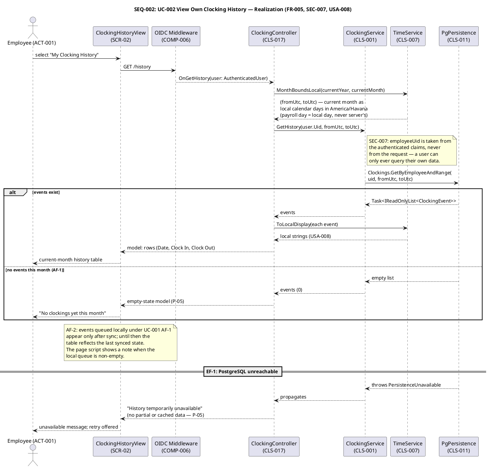
```plantuml
@startuml
title SEQ-002: UC-002 View Own Clocking History — Realization (FR-005, SEC-007, USA-008)

actor "Employee (ACT-001)" as EMP
participant "ClockingHistoryView\n(SCR-02)" as VIEW
participant "OIDC Middleware\n(COMP-006)" as MW
participant "ClockingController\n(CLS-017)" as CTL
participant "ClockingService\n(CLS-001)" as CLK
participant "TimeService\n(CLS-007)" as TIME
participant "PgPersistence\n(CLS-011)" as PG

EMP -> VIEW : select "My Clocking History"
VIEW -> MW : GET /history
MW --> CTL : OnGetHistory(user: AuthenticatedUser)
CTL -> TIME : MonthBoundsLocal(currentYear, currentMonth)
TIME --> CTL : (fromUtc, toUtc) — current month as\nlocal calendar days in America/Havana\n(payroll day = local day, never server's)
CTL -> CLK : GetHistory(user.Uid, fromUtc, toUtc)
note right of CLK
  SEC-007: employeeUid is taken from
  the authenticated claims, never
  from the request — a user can
  only ever query their own data.
end note
CLK -> PG : Clockings.GetByEmployeeAndRange(\nuid, fromUtc, toUtc)
alt events exist
  PG --> CLK : Task<IReadOnlyList<ClockingEvent>>
  CLK --> CTL : events
  CTL -> TIME : ToLocalDisplay(each event)
  TIME --> CTL : local strings (USA-008)
  CTL --> VIEW : model: rows (Date, Clock In, Clock Out)
  VIEW --> EMP : current-month history table
else no events this month (AF-1)
  PG --> CLK : empty list
  CLK --> CTL : events (0)
  CTL --> VIEW : empty-state model (P-05)
  VIEW --> EMP : "No clockings yet this month"
end
note over VIEW
  AF-2: events queued locally under UC-001 AF-1
  appear only after sync; until then the
  table reflects the last synced state.
  The page script shows a note when the
  local queue is non-empty.
end note
== EF-1: PostgreSQL unreachable ==
PG --> CLK : throws PersistenceUnavailable
CLK --> CTL : propagates
CTL --> VIEW : "History temporarily unavailable"\n(no partial or cached data — P-05)
VIEW --> EMP : unavailable message; retry offered
@enduml
```

### SEQ-003 — UC-003: Browse News (FR-007, USA-007)

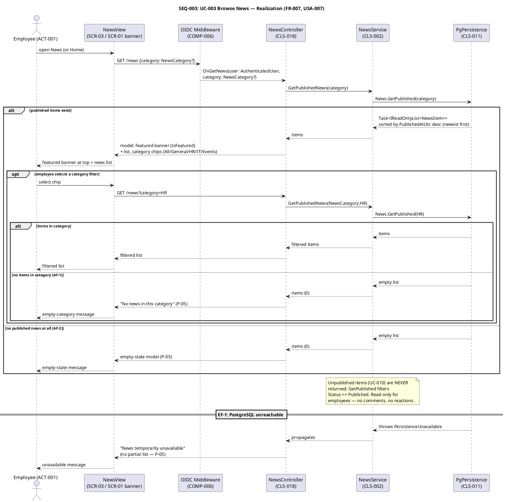
```plantuml
@startuml
title SEQ-003: UC-003 Browse News — Realization (FR-007, USA-007)

actor "Employee (ACT-001)" as EMP
participant "NewsView\n(SCR-03 / SCR-01 banner)" as VIEW
participant "OIDC Middleware\n(COMP-006)" as MW
participant "NewsController\n(CLS-018)" as CTL
participant "NewsService\n(CLS-002)" as NEWS
participant "PgPersistence\n(CLS-011)" as PG

EMP -> VIEW : open News (or Home)
VIEW -> MW : GET /news [category: NewsCategory?]
MW --> CTL : OnGetNews(user: AuthenticatedUser,\ncategory: NewsCategory?)
CTL -> NEWS : GetPublishedNews(category)
NEWS -> PG : News.GetPublished(category)
alt published items exist
  PG --> NEWS : Task<IReadOnlyList<NewsItem>>\nsorted by PublishedAtUtc desc (newest first)
  NEWS --> CTL : items
  CTL --> VIEW : model: featured banner (IsFeatured)\n+ list, category chips (All/General/HR/IT/Events)
  VIEW --> EMP : featured banner at top + news list
  opt employee selects a category filter
    EMP -> VIEW : select chip
    VIEW -> CTL : GET /news?category=HR
    CTL -> NEWS : GetPublishedNews(NewsCategory.HR)
    NEWS -> PG : News.GetPublished(HR)
    alt items in category
      PG --> NEWS : items
      NEWS --> CTL : filtered items
      CTL --> VIEW : filtered list
      VIEW --> EMP : filtered list
    else no items in category (AF-1)
      PG --> NEWS : empty list
      NEWS --> CTL : items (0)
      CTL --> VIEW : "No news in this category" (P-05)
      VIEW --> EMP : empty-category message
    end
  end
else no published news at all (AF-2)
  PG --> NEWS : empty list
  NEWS --> CTL : items (0)
  CTL --> VIEW : empty-state model (P-05)
  VIEW --> EMP : empty-state message
end
note over NEWS
  Unpublished items (UC-010) are NEVER
  returned: GetPublished filters
  Status == Published. Read-only for
  employees — no comments, no reactions.
end note
== EF-1: PostgreSQL unreachable ==
PG --> NEWS : throws PersistenceUnavailable
NEWS --> CTL : propagates
CTL --> VIEW : "News temporarily unavailable"\n(no partial list — P-05)
VIEW --> EMP : unavailable message
@enduml
```

### SEQ-004 — UC-004: Search Employee Directory (FR-010, R001, PRF-003, AC-003)

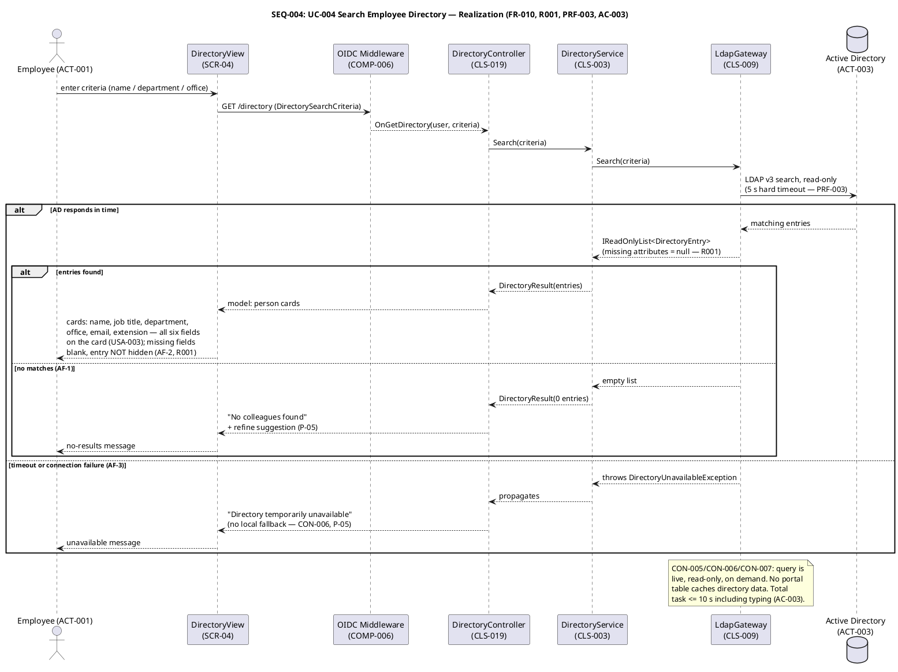
```plantuml
@startuml
title SEQ-004: UC-004 Search Employee Directory — Realization (FR-010, R001, PRF-003, AC-003)

actor "Employee (ACT-001)" as EMP
participant "DirectoryView\n(SCR-04)" as VIEW
participant "OIDC Middleware\n(COMP-006)" as MW
participant "DirectoryController\n(CLS-019)" as CTL
participant "DirectoryService\n(CLS-003)" as DIR
participant "LdapGateway\n(CLS-009)" as LDAP
database "Active Directory\n(ACT-003)" as AD

EMP -> VIEW : enter criteria (name / department / office)
VIEW -> MW : GET /directory (DirectorySearchCriteria)
MW --> CTL : OnGetDirectory(user, criteria)
CTL -> DIR : Search(criteria)
DIR -> LDAP : Search(criteria)
LDAP -> AD : LDAP v3 search, read-only\n(5 s hard timeout — PRF-003)
alt AD responds in time
  AD --> LDAP : matching entries
  LDAP --> DIR : IReadOnlyList<DirectoryEntry>\n(missing attributes = null — R001)
  alt entries found
    DIR --> CTL : DirectoryResult(entries)
    CTL --> VIEW : model: person cards
    VIEW --> EMP : cards: name, job title, department,\noffice, email, extension — all six fields\non the card (USA-003); missing fields\nblank, entry NOT hidden (AF-2, R001)
  else no matches (AF-1)
    LDAP --> DIR : empty list
    DIR --> CTL : DirectoryResult(0 entries)
    CTL --> VIEW : "No colleagues found"\n+ refine suggestion (P-05)
    VIEW --> EMP : no-results message
  end
else timeout or connection failure (AF-3)
  LDAP --> DIR : throws DirectoryUnavailableException
  DIR --> CTL : propagates
  CTL --> VIEW : "Directory temporarily unavailable"\n(no local fallback — CON-006, P-05)
  VIEW --> EMP : unavailable message
end
note over LDAP
  CON-005/CON-006/CON-007: query is
  live, read-only, on demand. No portal
  table caches directory data. Total
  task <= 10 s including typing (AC-003).
end note
@enduml
```

### SEQ-005 — UC-005: Review Employee Clockings (FR-001, SEC-006, CON-005/006, R001 behavioural bar)

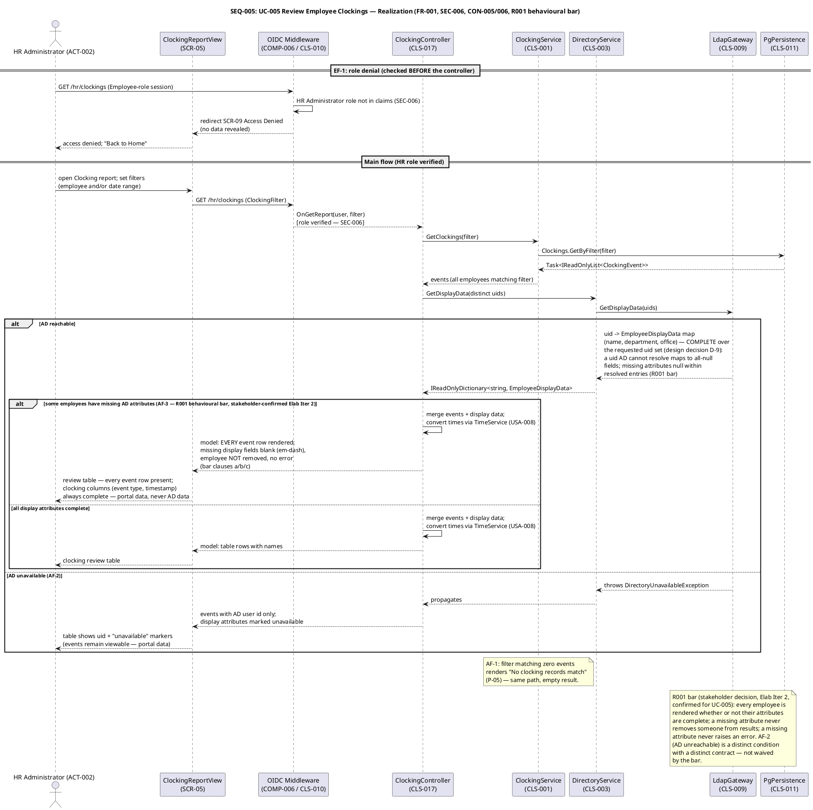
```plantuml
@startuml
title SEQ-005: UC-005 Review Employee Clockings — Realization (FR-001, SEC-006, CON-005/006, R001 behavioural bar)

actor "HR Administrator (ACT-002)" as HR
participant "ClockingReportView\n(SCR-05)" as VIEW
participant "OIDC Middleware\n(COMP-006 / CLS-010)" as MW
participant "ClockingController\n(CLS-017)" as CTL
participant "ClockingService\n(CLS-001)" as CLK
participant "DirectoryService\n(CLS-003)" as DIR
participant "LdapGateway\n(CLS-009)" as LDAP
participant "PgPersistence\n(CLS-011)" as PG

== EF-1: role denial (checked BEFORE the controller) ==
HR -> MW : GET /hr/clockings (Employee-role session)
MW -> MW : HR Administrator role not in claims (SEC-006)
MW --> VIEW : redirect SCR-09 Access Denied\n(no data revealed)
VIEW --> HR : access denied; "Back to Home"

== Main flow (HR role verified) ==
HR -> VIEW : open Clocking report; set filters\n(employee and/or date range)
VIEW -> MW : GET /hr/clockings (ClockingFilter)
MW --> CTL : OnGetReport(user, filter)\n[role verified — SEC-006]
CTL -> CLK : GetClockings(filter)
CLK -> PG : Clockings.GetByFilter(filter)
PG --> CLK : Task<IReadOnlyList<ClockingEvent>>
CLK --> CTL : events (all employees matching filter)
CTL -> DIR : GetDisplayData(distinct uids)
DIR -> LDAP : GetDisplayData(uids)
alt AD reachable
  LDAP --> DIR : uid -> EmployeeDisplayData map\n(name, department, office) — COMPLETE over\nthe requested uid set (design decision D-9):\na uid AD cannot resolve maps to all-null\nfields; missing attributes null within\nresolved entries (R001 bar)
  DIR --> CTL : IReadOnlyDictionary<string, EmployeeDisplayData>
  alt some employees have missing AD attributes (AF-3 — R001 behavioural bar, stakeholder-confirmed Elab Iter 2)
    CTL -> CTL : merge events + display data;\nconvert times via TimeService (USA-008)
    CTL --> VIEW : model: EVERY event row rendered;\nmissing display fields blank (em-dash),\nemployee NOT removed, no error\n(bar clauses a/b/c)
    VIEW --> HR : review table — every event row present;\nclocking columns (event type, timestamp)\nalways complete — portal data, never AD data
  else all display attributes complete
    CTL -> CTL : merge events + display data;\nconvert times via TimeService (USA-008)
    CTL --> VIEW : model: table rows with names
    VIEW --> HR : clocking review table
  end
else AD unavailable (AF-2)
  LDAP --> DIR : throws DirectoryUnavailableException
  DIR --> CTL : propagates
  CTL --> VIEW : events with AD user id only;\ndisplay attributes marked unavailable
  VIEW --> HR : table shows uid + "unavailable" markers\n(events remain viewable — portal data)
end
note over CLK
  AF-1: filter matching zero events
  renders "No clocking records match"
  (P-05) — same path, empty result.
end note
note over LDAP
  R001 bar (stakeholder decision, Elab Iter 2,
  confirmed for UC-005): every employee is
  rendered whether or not their attributes
  are complete; a missing attribute never
  removes someone from results; a missing
  attribute never raises an error. AF-2
  (AD unreachable) is a distinct condition
  with a distinct contract — not waived
  by the bar.
end note
@enduml
```

### SEQ-006 — UC-006: Export Monthly Clocking Report (FR-002, SEC-006, INT-005, STD-003, R001 behavioural bar)

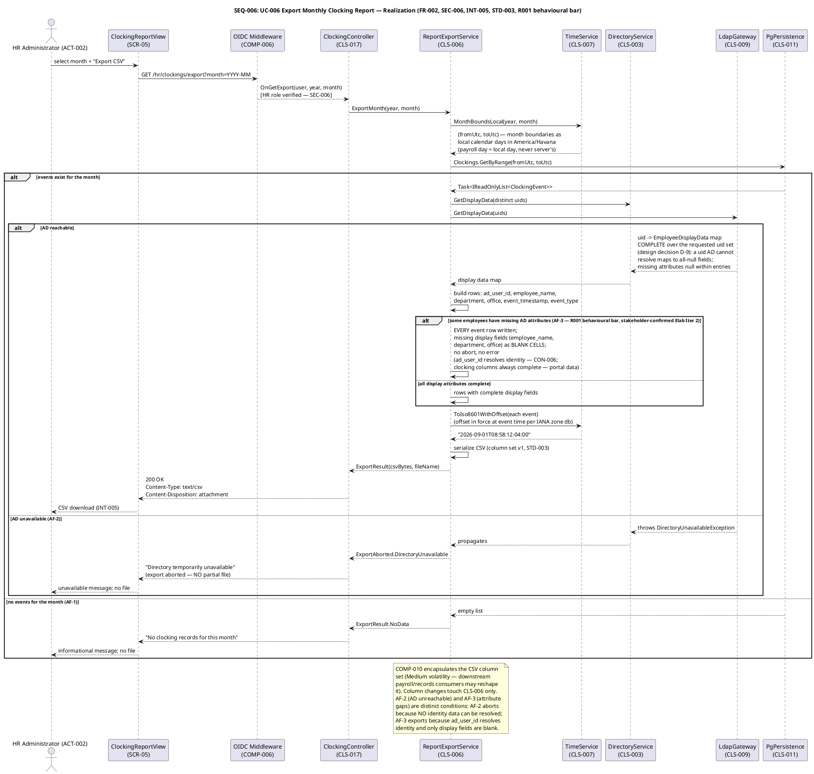
```plantuml
@startuml
title SEQ-006: UC-006 Export Monthly Clocking Report — Realization (FR-002, SEC-006, INT-005, STD-003, R001 behavioural bar)

actor "HR Administrator (ACT-002)" as HR
participant "ClockingReportView\n(SCR-05)" as VIEW
participant "OIDC Middleware\n(COMP-006)" as MW
participant "ClockingController\n(CLS-017)" as CTL
participant "ReportExportService\n(CLS-006)" as EXP
participant "TimeService\n(CLS-007)" as TIME
participant "DirectoryService\n(CLS-003)" as DIR
participant "LdapGateway\n(CLS-009)" as LDAP
participant "PgPersistence\n(CLS-011)" as PG

HR -> VIEW : select month + "Export CSV"
VIEW -> MW : GET /hr/clockings/export?month=YYYY-MM
MW --> CTL : OnGetExport(user, year, month)\n[HR role verified — SEC-006]
CTL -> EXP : ExportMonth(year, month)
EXP -> TIME : MonthBoundsLocal(year, month)
TIME --> EXP : (fromUtc, toUtc) — month boundaries as\nlocal calendar days in America/Havana\n(payroll day = local day, never server's)
EXP -> PG : Clockings.GetByRange(fromUtc, toUtc)
alt events exist for the month
  PG --> EXP : Task<IReadOnlyList<ClockingEvent>>
  EXP -> DIR : GetDisplayData(distinct uids)
  EXP -> LDAP : GetDisplayData(uids)
  alt AD reachable
    LDAP --> DIR : uid -> EmployeeDisplayData map\nCOMPLETE over the requested uid set\n(design decision D-9): a uid AD cannot\nresolve maps to all-null fields;\nmissing attributes null within entries
    DIR --> EXP : display data map
    EXP -> EXP : build rows: ad_user_id, employee_name,\ndepartment, office, event_timestamp, event_type
    alt some employees have missing AD attributes (AF-3 — R001 behavioural bar, stakeholder-confirmed Elab Iter 2)
      EXP -> EXP : EVERY event row written;\nmissing display fields (employee_name,\ndepartment, office) as BLANK CELLS;\nno abort, no error\n(ad_user_id resolves identity — CON-006;\nclocking columns always complete — portal data)
    else all display attributes complete
      EXP -> EXP : rows with complete display fields
    end
    EXP -> TIME : ToIso8601WithOffset(each event)\n(offset in force at event time per IANA zone db)
    TIME --> EXP : "2026-09-01T08:58:12-04:00"
    EXP -> EXP : serialize CSV (column set v1, STD-003)
    EXP --> CTL : ExportResult(csvBytes, fileName)
    CTL --> VIEW : 200 OK\nContent-Type: text/csv\nContent-Disposition: attachment
    VIEW --> HR : CSV download (INT-005)
  else AD unavailable (AF-2)
    LDAP --> DIR : throws DirectoryUnavailableException
    DIR --> EXP : propagates
    EXP --> CTL : ExportAborted.DirectoryUnavailable
    CTL --> VIEW : "Directory temporarily unavailable"\n(export aborted — NO partial file)
    VIEW --> HR : unavailable message; no file
  end
else no events for the month (AF-1)
  PG --> EXP : empty list
  EXP --> CTL : ExportResult.NoData
  CTL --> VIEW : "No clocking records for this month"
  VIEW --> HR : informational message; no file
end
note over EXP
  COMP-010 encapsulates the CSV column
  set (Medium volatility — downstream
  payroll/records consumers may reshape
  it). Column changes touch CLS-006 only.
  AF-2 (AD unreachable) and AF-3 (attribute
  gaps) are distinct conditions: AF-2 aborts
  because NO identity data can be resolved;
  AF-3 exports because ad_user_id resolves
  identity and only display fields are blank.
end note
@enduml
```

### SEQ-007 — UC-007: Assign Worker Category (FR-003, CON-006, CON-013, AUD-004, ADR-004, R001 behavioural bar)

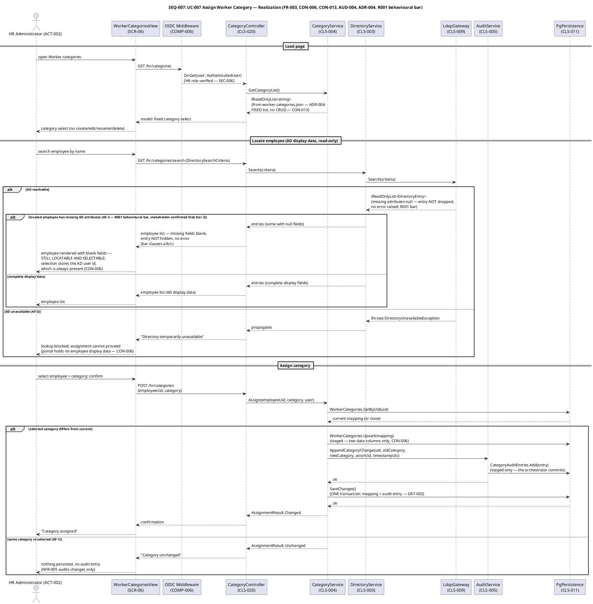
```plantuml
@startuml
title SEQ-007: UC-007 Assign Worker Category — Realization (FR-003, CON-006, CON-013, AUD-004, ADR-004, R001 behavioural bar)

actor "HR Administrator (ACT-002)" as HR
participant "WorkerCategoriesView\n(SCR-06)" as VIEW
participant "OIDC Middleware\n(COMP-006)" as MW
participant "CategoryController\n(CLS-020)" as CTL
participant "CategoryService\n(CLS-004)" as CAT
participant "DirectoryService\n(CLS-003)" as DIR
participant "LdapGateway\n(CLS-009)" as LDAP
participant "AuditService\n(CLS-005)" as AUD
participant "PgPersistence\n(CLS-011)" as PG

== Load page ==
HR -> VIEW : open Worker categories
VIEW -> MW : GET /hr/categories
MW --> CTL : OnGet(user: AuthenticatedUser)\n[HR role verified — SEC-006]
CTL -> CAT : GetCategoryList()
CAT --> CTL : IReadOnlyList<string>\n(from worker-categories.json — ADR-004;\nFIXED list, no CRUD — CON-013)
CTL --> VIEW : model: fixed category select
VIEW --> HR : category select (no create/edit/rename/delete)

== Locate employee (AD display data, read-only) ==
HR -> VIEW : search employee by name
VIEW -> CTL : GET /hr/categories/search (DirectorySearchCriteria)
CTL -> DIR : Search(criteria)
DIR -> LDAP : Search(criteria)
alt AD reachable
  LDAP --> DIR : IReadOnlyList<DirectoryEntry>\n(missing attributes null — entry NOT dropped,\nno error raised; R001 bar)
  alt located employee has missing AD attributes (AF-3 — R001 behavioural bar, stakeholder-confirmed Elab Iter 2)
    DIR --> CTL : entries (some with null fields)
    CTL --> VIEW : employee list — missing fields blank,\nentry NOT hidden, no error\n(bar clauses a/b/c)
    VIEW --> HR : employee rendered with blank fields —\nSTILL LOCATABLE AND SELECTABLE;\nselection stores the AD user id,\nwhich is always present (CON-006)
  else complete display data
    DIR --> CTL : entries (complete display fields)
    CTL --> VIEW : employee list (AD display data)
    VIEW --> HR : employee list
  end
else AD unavailable (AF-2)
  LDAP --> DIR : throws DirectoryUnavailableException
  DIR --> CTL : propagates
  CTL --> VIEW : "Directory temporarily unavailable"
  VIEW --> HR : lookup blocked; assignment cannot proceed\n(portal holds no employee display data — CON-006)
end

== Assign category ==
HR -> VIEW : select employee + category; confirm
VIEW -> CTL : POST /hr/categories\n(employeeUid, category)
CTL -> CAT : Assign(employeeUid, category, user)
CAT -> PG : WorkerCategories.GetByUid(uid)
PG --> CAT : current mapping (or none)
alt selected category differs from current
  CAT -> PG : WorkerCategories.Upsert(mapping)\n(staged — two data columns only, CON-006)
  CAT -> AUD : AppendCategoryChange(uid, oldCategory,\nnewCategory, actorUid, timestampUtc)
  AUD -> PG : CategoryAuditEntries.Add(entry)\n(staged only — the orchestrator commits)
  AUD --> CAT : ok
  CAT -> PG : SaveChanges()\n(ONE transaction: mapping + audit entry — DAT-002)
  PG --> CAT : ok
  CAT --> CTL : AssignmentResult.Changed
  CTL --> VIEW : confirmation
  VIEW --> HR : "Category assigned"
else same category re-selected (AF-1)
  CAT --> CTL : AssignmentResult.Unchanged
  CTL --> VIEW : "Category unchanged"
  VIEW --> HR : nothing persisted, no audit entry\n(NFR-005 audits changes only)
end
@enduml
```

### SEQ-008 — UC-008: Publish News (FR-006, SEC-006, AUD-001, AC-002)

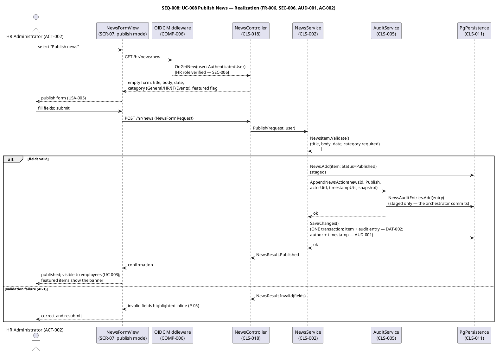
```plantuml
@startuml
title SEQ-008: UC-008 Publish News — Realization (FR-006, SEC-006, AUD-001, AC-002)

actor "HR Administrator (ACT-002)" as HR
participant "NewsFormView\n(SCR-07, publish mode)" as VIEW
participant "OIDC Middleware\n(COMP-006)" as MW
participant "NewsController\n(CLS-018)" as CTL
participant "NewsService\n(CLS-002)" as NEWS
participant "AuditService\n(CLS-005)" as AUD
participant "PgPersistence\n(CLS-011)" as PG

HR -> VIEW : select "Publish news"
VIEW -> MW : GET /hr/news/new
MW --> CTL : OnGetNew(user: AuthenticatedUser)\n[HR role verified — SEC-006]
CTL --> VIEW : empty form: title, body, date,\ncategory (General/HR/IT/Events), featured flag
VIEW --> HR : publish form (USA-005)
HR -> VIEW : fill fields; submit
VIEW -> CTL : POST /hr/news (NewsFormRequest)
CTL -> NEWS : Publish(request, user)
NEWS -> NEWS : NewsItem.Validate()\n(title, body, date, category required)
alt fields valid
  NEWS -> PG : News.Add(item: Status=Published)\n(staged)
  NEWS -> AUD : AppendNewsAction(newsId, Publish,\nactorUid, timestampUtc, snapshot)
  AUD -> PG : NewsAuditEntries.Add(entry)\n(staged only — the orchestrator commits)
  AUD --> NEWS : ok
  NEWS -> PG : SaveChanges()\n(ONE transaction: item + audit entry — DAT-002;\nauthor + timestamp — AUD-001)
  PG --> NEWS : ok
  NEWS --> CTL : NewsResult.Published
  CTL --> VIEW : confirmation
  VIEW --> HR : published; visible to employees (UC-003);\nfeatured items show the banner
else validation failure (AF-1)
  NEWS --> CTL : NewsResult.Invalid(fields)
  CTL --> VIEW : invalid fields highlighted inline (P-05)
  VIEW --> HR : correct and resubmit
end
@enduml
```

### SEQ-009 — UC-009: Edit Published News (FR-008, SEC-006, AUD-002, CON-012)

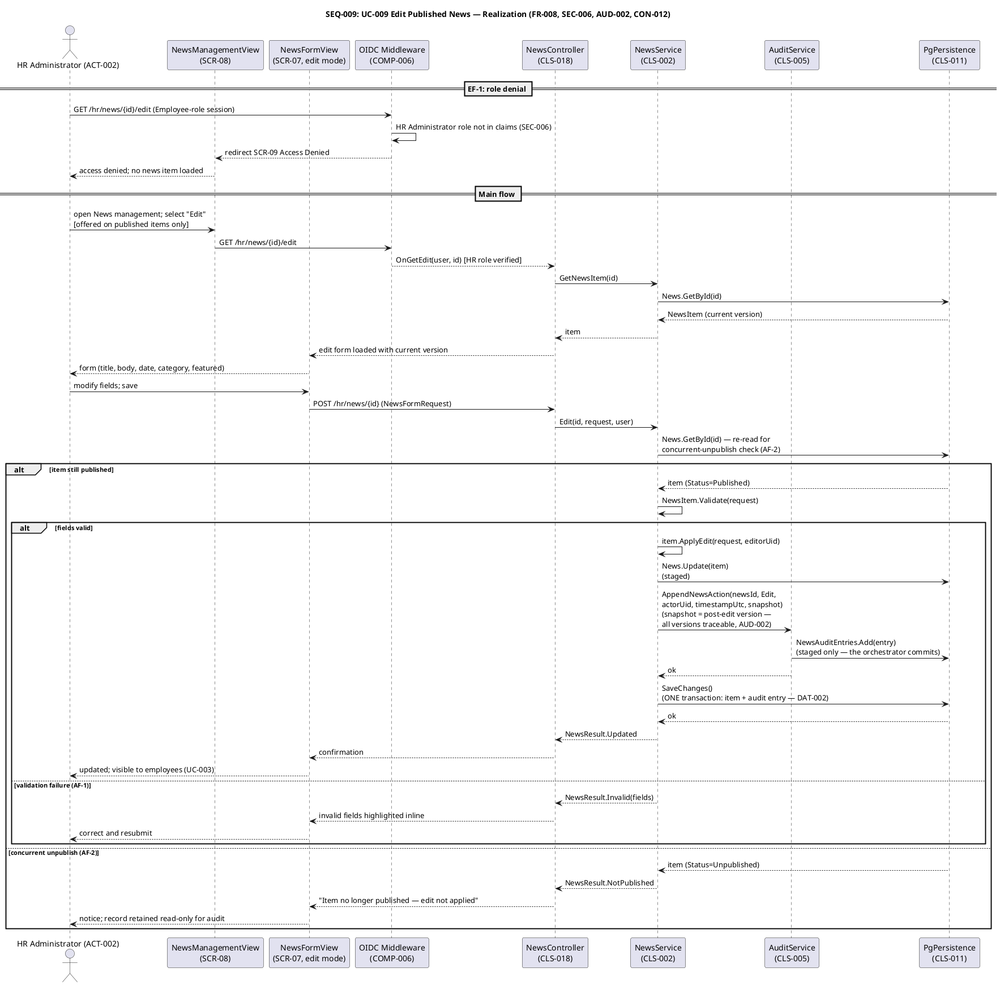
```plantuml
@startuml
title SEQ-009: UC-009 Edit Published News — Realization (FR-008, SEC-006, AUD-002, CON-012)

actor "HR Administrator (ACT-002)" as HR
participant "NewsManagementView\n(SCR-08)" as MGMT
participant "NewsFormView\n(SCR-07, edit mode)" as VIEW
participant "OIDC Middleware\n(COMP-006)" as MW
participant "NewsController\n(CLS-018)" as CTL
participant "NewsService\n(CLS-002)" as NEWS
participant "AuditService\n(CLS-005)" as AUD
participant "PgPersistence\n(CLS-011)" as PG

== EF-1: role denial ==
HR -> MW : GET /hr/news/{id}/edit (Employee-role session)
MW -> MW : HR Administrator role not in claims (SEC-006)
MW --> MGMT : redirect SCR-09 Access Denied
MGMT --> HR : access denied; no news item loaded

== Main flow ==
HR -> MGMT : open News management; select "Edit"\n[offered on published items only]
MGMT -> MW : GET /hr/news/{id}/edit
MW --> CTL : OnGetEdit(user, id) [HR role verified]
CTL -> NEWS : GetNewsItem(id)
NEWS -> PG : News.GetById(id)
PG --> NEWS : NewsItem (current version)
NEWS --> CTL : item
CTL --> VIEW : edit form loaded with current version
VIEW --> HR : form (title, body, date, category, featured)
HR -> VIEW : modify fields; save
VIEW -> CTL : POST /hr/news/{id} (NewsFormRequest)
CTL -> NEWS : Edit(id, request, user)
NEWS -> PG : News.GetById(id) — re-read for\nconcurrent-unpublish check (AF-2)
alt item still published
  PG --> NEWS : item (Status=Published)
  NEWS -> NEWS : NewsItem.Validate(request)
  alt fields valid
    NEWS -> NEWS : item.ApplyEdit(request, editorUid)
    NEWS -> PG : News.Update(item)\n(staged)
    NEWS -> AUD : AppendNewsAction(newsId, Edit,\nactorUid, timestampUtc, snapshot)\n(snapshot = post-edit version —\nall versions traceable, AUD-002)
    AUD -> PG : NewsAuditEntries.Add(entry)\n(staged only — the orchestrator commits)
    AUD --> NEWS : ok
    NEWS -> PG : SaveChanges()\n(ONE transaction: item + audit entry — DAT-002)
    PG --> NEWS : ok
    NEWS --> CTL : NewsResult.Updated
    CTL --> VIEW : confirmation
    VIEW --> HR : updated; visible to employees (UC-003)
  else validation failure (AF-1)
    NEWS --> CTL : NewsResult.Invalid(fields)
    CTL --> VIEW : invalid fields highlighted inline
    VIEW --> HR : correct and resubmit
  end
else concurrent unpublish (AF-2)
  PG --> NEWS : item (Status=Unpublished)
  NEWS --> CTL : NewsResult.NotPublished
  CTL --> VIEW : "Item no longer published — edit not applied"
  VIEW --> HR : notice; record retained read-only for audit
end
@enduml
```

### SEQ-010 — UC-010: Unpublish News (FR-009, SEC-006, AUD-003, CON-012)

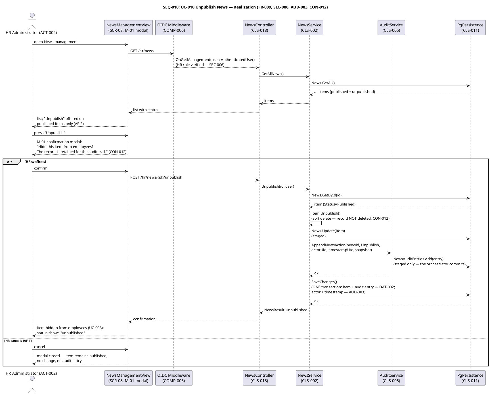
```plantuml
@startuml
title SEQ-010: UC-010 Unpublish News — Realization (FR-009, SEC-006, AUD-003, CON-012)

actor "HR Administrator (ACT-002)" as HR
participant "NewsManagementView\n(SCR-08, M-01 modal)" as VIEW
participant "OIDC Middleware\n(COMP-006)" as MW
participant "NewsController\n(CLS-018)" as CTL
participant "NewsService\n(CLS-002)" as NEWS
participant "AuditService\n(CLS-005)" as AUD
participant "PgPersistence\n(CLS-011)" as PG

HR -> VIEW : open News management
VIEW -> MW : GET /hr/news
MW --> CTL : OnGetManagement(user: AuthenticatedUser)\n[HR role verified — SEC-006]
CTL -> NEWS : GetAllNews()
NEWS -> PG : News.GetAll()
PG --> NEWS : all items (published + unpublished)
NEWS --> CTL : items
CTL --> VIEW : list with status
VIEW --> HR : list; "Unpublish" offered on\npublished items only (AF-2)

HR -> VIEW : press "Unpublish"
VIEW --> HR : M-01 confirmation modal:\n"Hide this item from employees?\nThe record is retained for the audit trail." (CON-012)
alt HR confirms
  HR -> VIEW : confirm
  VIEW -> CTL : POST /hr/news/{id}/unpublish
  CTL -> NEWS : Unpublish(id, user)
  NEWS -> PG : News.GetById(id)
  PG --> NEWS : item (Status=Published)
  NEWS -> NEWS : item.Unpublish()\n(soft delete — record NOT deleted, CON-012)
  NEWS -> PG : News.Update(item)\n(staged)
  NEWS -> AUD : AppendNewsAction(newsId, Unpublish,\nactorUid, timestampUtc, snapshot)
  AUD -> PG : NewsAuditEntries.Add(entry)\n(staged only — the orchestrator commits)
  AUD --> NEWS : ok
  NEWS -> PG : SaveChanges()\n(ONE transaction: item + audit entry — DAT-002;\nactor + timestamp — AUD-003)
  PG --> NEWS : ok
  NEWS --> CTL : NewsResult.Unpublished
  CTL --> VIEW : confirmation
  VIEW --> HR : item hidden from employees (UC-003);\nstatus shows "unpublished"
else HR cancels (AF-1)
  HR -> VIEW : cancel
  VIEW --> HR : modal closed — item remains published,\nno change, no audit entry
end
@enduml
```
## Design Packages and Classes

One design model, three packages inside the single deployable (ADR-001). Dependencies point DOWN only; every cross-package reference is an interface.

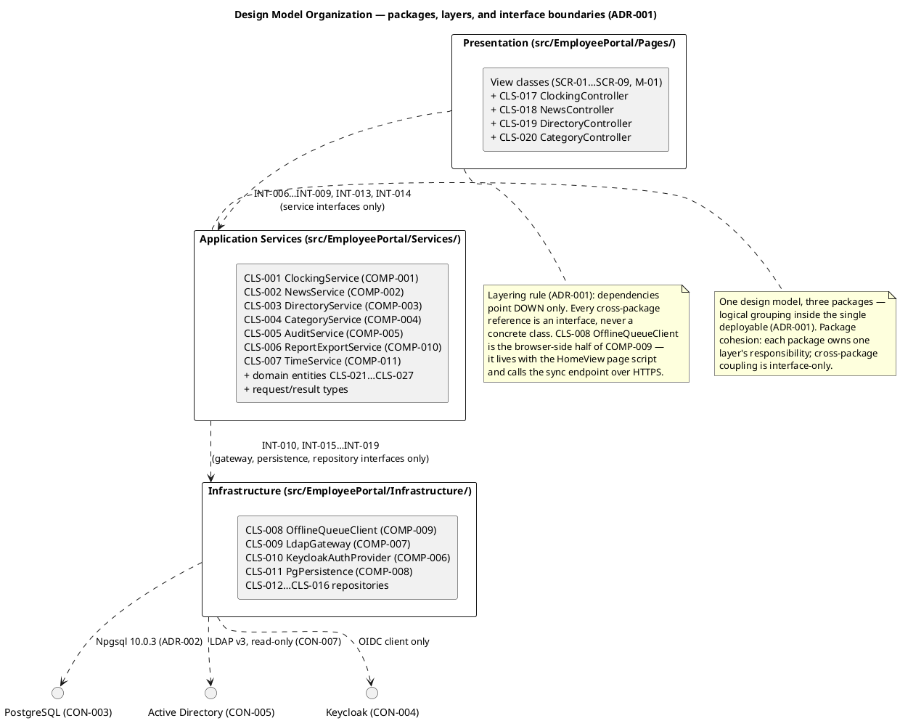
```plantuml
@startuml
title Design Model Organization — packages, layers, and interface boundaries (ADR-001)
skinparam packageStyle rectangle
skinparam fontSize 11

package "Presentation (src/EmployeePortal/Pages/)" as PRES {
  rectangle "View classes (SCR-01…SCR-09, M-01)\n+ CLS-017 ClockingController\n+ CLS-018 NewsController\n+ CLS-019 DirectoryController\n+ CLS-020 CategoryController" as PRESCLS
}

package "Application Services (src/EmployeePortal/Services/)" as APP {
  rectangle "CLS-001 ClockingService (COMP-001)\nCLS-002 NewsService (COMP-002)\nCLS-003 DirectoryService (COMP-003)\nCLS-004 CategoryService (COMP-004)\nCLS-005 AuditService (COMP-005)\nCLS-006 ReportExportService (COMP-010)\nCLS-007 TimeService (COMP-011)\n+ domain entities CLS-021…CLS-027\n+ request/result types" as APPCLS
}

package "Infrastructure (src/EmployeePortal/Infrastructure/)" as INFRA {
  rectangle "CLS-008 OfflineQueueClient (COMP-009)\nCLS-009 LdapGateway (COMP-007)\nCLS-010 KeycloakAuthProvider (COMP-006)\nCLS-011 PgPersistence (COMP-008)\nCLS-012…CLS-016 repositories" as INFRACLS
}

PRES ..> APP : INT-006…INT-009, INT-013, INT-014\n(service interfaces only)
APP ..> INFRA : INT-010, INT-015…INT-019\n(gateway, persistence, repository interfaces only)
INFRA ..> "PostgreSQL (CON-003)" : Npgsql 10.0.3 (ADR-002)
INFRA ..> "Active Directory (CON-005)" : LDAP v3, read-only (CON-007)
INFRA ..> "Keycloak (CON-004)" : OIDC client only

note bottom of PRES
  Layering rule (ADR-001): dependencies
  point DOWN only. Every cross-package
  reference is an interface, never a
  concrete class. CLS-008 OfflineQueueClient
  is the browser-side half of COMP-009 —
  it lives with the HomeView page script
  and calls the sync endpoint over HTTPS.
end note

note right of APP
  One design model, three packages —
  logical grouping inside the single
  deployable (ADR-001). Package
  cohesion: each package owns one
  layer's responsibility; cross-package
  coupling is interface-only.
end note
@enduml
```

### Package: Application Services (src/EmployeePortal/Services/) — CLS-001…CLS-007


```plantuml
@startuml
title Design Package: Application Services (src/EmployeePortal/Services/) — CLS-001…CLS-007
skinparam classAttributeIconSize 0
skinparam fontSize 10
skinparam packageStyle rectangle

package "Application Services (COMP-001…005, 010, 011)" {
  interface "INT-006 IClockingService" as ICLK {
    +GetCurrentStatus(employeeUid: string): Task<ClockingStatus>
    +RecordEvent(request: RecordClockingRequest): Task<ClockingResult>
    +SyncEvents(events: IEnumerable<ClockingEventDto>): Task<SyncResult>
    +GetHistory(employeeUid: string, fromUtc: DateTimeOffset, toUtc: DateTimeOffset): Task<IReadOnlyList<ClockingEvent>>
    +GetClockings(filter: ClockingFilter): Task<IReadOnlyList<ClockingEvent>>
  }
  class "CLS-001 ClockingService" as CLK {
    -clockings: IClockingsRepository
    -time: ITimeConvention
    +GetCurrentStatus(employeeUid: string): Task<ClockingStatus>
    +RecordEvent(request: RecordClockingRequest): Task<ClockingResult>
    +SyncEvents(events: IEnumerable<ClockingEventDto>): Task<SyncResult>
    +GetHistory(employeeUid: string, fromUtc: DateTimeOffset, toUtc: DateTimeOffset): Task<IReadOnlyList<ClockingEvent>>
    +GetClockings(filter: ClockingFilter): Task<IReadOnlyList<ClockingEvent>>
  }

  interface "INT-007 INewsService" as INEWS {
    +GetPublishedNews(category: NewsCategory?): Task<IReadOnlyList<NewsItem>>
    +GetAllNews(): Task<IReadOnlyList<NewsItem>>
    +GetNewsItem(id: int): Task<NewsItem>
    +Publish(request: NewsFormRequest, actor: AuthenticatedUser): Task<NewsResult>
    +Edit(id: int, request: NewsFormRequest, actor: AuthenticatedUser): Task<NewsResult>
    +Unpublish(id: int, actor: AuthenticatedUser): Task<NewsResult>
  }
  class "CLS-002 NewsService" as NEWS {
    -news: INewsRepository
    -audit: IAuditService
    +GetPublishedNews(category: NewsCategory?): Task<IReadOnlyList<NewsItem>>
    +GetAllNews(): Task<IReadOnlyList<NewsItem>>
    +GetNewsItem(id: int): Task<NewsItem>
    +Publish(request: NewsFormRequest, actor: AuthenticatedUser): Task<NewsResult>
    +Edit(id: int, request: NewsFormRequest, actor: AuthenticatedUser): Task<NewsResult>
    +Unpublish(id: int, actor: AuthenticatedUser): Task<NewsResult>
  }

  interface "INT-008 IDirectoryService" as IDIR {
    +Search(criteria: DirectorySearchCriteria): Task<DirectoryResult>
    +GetDisplayData(uids: IEnumerable<string>): Task<IReadOnlyDictionary<string, EmployeeDisplayData>>
  }
  class "CLS-003 DirectoryService" as DIR {
    -ldap: ILdapGateway
    +Search(criteria: DirectorySearchCriteria): Task<DirectoryResult>
    +GetDisplayData(uids: IEnumerable<string>): Task<IReadOnlyDictionary<string, EmployeeDisplayData>>
  }

  interface "INT-009 ICategoryService" as ICAT {
    +GetCategoryList(): IReadOnlyList<string>
    +Assign(employeeUid: string, category: string, actor: AuthenticatedUser): Task<AssignmentResult>
  }
  class "CLS-004 CategoryService" as CAT {
    -workerCategories: IWorkerCategoryRepository
    -audit: IAuditService
    -categoryList: IReadOnlyList<string>
    +GetCategoryList(): IReadOnlyList<string>
    +Assign(employeeUid: string, category: string, actor: AuthenticatedUser): Task<AssignmentResult>
  }

  interface "INT-012 IAuditService" as IAUD {
    +AppendNewsAction(newsId: int, action: NewsAuditAction, actorUid: string, timestampUtc: DateTimeOffset, snapshot: string): void
    +AppendCategoryChange(employeeUid: string, oldCategory: string?, newCategory: string, actorUid: string, timestampUtc: DateTimeOffset): void
  }
  class "CLS-005 AuditService" as AUD {
    -newsAudit: INewsAuditRepository
    -categoryAudit: ICategoryAuditRepository
    +AppendNewsAction(newsId: int, action: NewsAuditAction, actorUid: string, timestampUtc: DateTimeOffset, snapshot: string): void
    +AppendCategoryChange(employeeUid: string, oldCategory: string?, newCategory: string, actorUid: string, timestampUtc: DateTimeOffset): void
  }

  interface "INT-013 IReportExport" as IEXP {
    +ExportMonth(year: int, month: int): Task<ExportResult>
  }
  class "CLS-006 ReportExportService" as EXP {
    -clockings: IClockingsRepository
    -directory: IDirectoryService
    -time: ITimeConvention
    +ExportMonth(year: int, month: int): Task<ExportResult>
  }

  interface "INT-014 ITimeConvention" as ITIME {
    +NowUtc(): DateTimeOffset
    +ToLocalDisplay(timestampUtc: DateTimeOffset): string
    +ToIso8601WithOffset(timestampUtc: DateTimeOffset): string
    +MonthBoundsLocal(year: int, month: int): MonthBounds
  }
  class "CLS-007 TimeService" as TIME {
    +NowUtc(): DateTimeOffset
    +ToLocalDisplay(timestampUtc: DateTimeOffset): string
    +ToIso8601WithOffset(timestampUtc: DateTimeOffset): string
    +MonthBoundsLocal(year: int, month: int): MonthBounds
  }
}

CLK ..|> ICLK
NEWS ..|> INEWS
DIR ..|> IDIR
CAT ..|> ICAT
AUD ..|> IAUD
EXP ..|> IEXP
TIME ..|> ITIME

CLK ..> INT016 : uses
INT016 : INT-016 IClockingsRepository
NEWS ..> INT017 : uses
INT017 : INT-017 INewsRepository
CAT ..> INT018 : uses
INT018 : INT-018 IWorkerCategoryRepository
AUD ..> INT019 : uses
INT019 : INT-019 IAuditEntryRepository
CLK ..> ITIME
EXP ..> ITIME
EXP ..> IDIR
NEWS ..> IAUD
CAT ..> IAUD
DIR ..> INT010 : uses
INT010 : INT-010 ILdapGateway

note bottom of AUD
  AppendNewsAction / AppendCategoryChange
  STAGE the entry via the repositories;
  the orchestrating service's single
  SaveChanges() commits state change +
  audit entry in ONE transaction (DAT-002).
  No Update/Delete path exists on the
  audit repositories (append-only).
end note

note right of CAT
  categoryList is loaded ONCE from
  worker-categories.json at startup
  (ADR-004) — FIXED list, no CRUD
  (CON-013). Assign() validates the
  selected category against this list.
end note

note bottom of CLK
  SAD refinement: COMP-001's listed
  IAUD dependency is OMITTED — NFR-005
  scopes audit to news operations
  (AUD-001..003) and category changes
  (AUD-004); clocking events carry
  their own actor (EmployeeUid) and
  are immutable (DAT-001). Coupling
  reduction, no behavior change.
end note

note right of EXP
  SAD refinement: COMP-010's ILDAP
  dependency is realized transitively
  via IDirectoryService.GetDisplayData —
  display-data resolution exists once
  (COMP-003), not duplicated. Boundary
  remains interface-based.
end note
@enduml
```

### Package: Infrastructure (src/EmployeePortal/Infrastructure/) — CLS-008…CLS-016


```plantuml
@startuml
title Design Package: Infrastructure (src/EmployeePortal/Infrastructure/) — CLS-008…CLS-016
skinparam classAttributeIconSize 0
skinparam fontSize 10
skinparam packageStyle rectangle

package "Infrastructure (COMP-006…009)" {
  class "CLS-008 OfflineQueueClient\n(browser-side, COMP-009)" as QUEUE {
    +Enqueue(event: QueuedClockingEvent): void
    +GetQueued(): IReadOnlyList<QueuedClockingEvent>
    +Clear(): void
    +Sync(): Promise<SyncResult>
    -storage: localStorage
    -capacity: int = 10
  }

  interface "INT-010 ILdapGateway" as ILDAP {
    +Search(criteria: DirectorySearchCriteria): Task<IReadOnlyList<DirectoryEntry>>
    +GetDisplayData(uids: IEnumerable<string>): Task<IReadOnlyDictionary<string, EmployeeDisplayData>>
  }
  class "CLS-009 LdapGateway (COMP-007)" as LDAP {
    -connectionSettings: LdapConnectionSettings
    -timeout: TimeSpan = 5 s
    +Search(criteria: DirectorySearchCriteria): Task<IReadOnlyList<DirectoryEntry>>
    +GetDisplayData(uids: IEnumerable<string>): Task<IReadOnlyDictionary<string, EmployeeDisplayData>>
    -BuildFilter(criteria: DirectorySearchCriteria): string
    -MapEntry(result: LdapSearchResult): DirectoryEntry
  }

  interface "INT-011 IAuthProvider" as IAUTH {
    +ConfigureOidc(builder: WebApplicationBuilder, options: KeycloakClientOptions): void
    +GetAuthenticatedUser(context: HttpContext): AuthenticatedUser
  }
  class "CLS-010 KeycloakAuthProvider (COMP-006)" as AUTH {
    +ConfigureOidc(builder: WebApplicationBuilder, options: KeycloakClientOptions): void
    +GetAuthenticatedUser(context: HttpContext): AuthenticatedUser
    -MapRoles(claims: IEnumerable<Claim>): IReadOnlySet<string>
  }

  interface "INT-015 IPersistence" as IPERSIST {
    +SaveChanges(): Task
    +BeginTransaction(): IDbContextTransaction
  }
  class "CLS-011 PgPersistence (COMP-008)" as PG {
    -dbContext: PortalDbContext
    +SaveChanges(): Task
    +BeginTransaction(): IDbContextTransaction
  }

  interface "INT-016 IClockingsRepository" as ICLKREP {
    +Add(event: ClockingEvent): void
    +AddRange(events: IEnumerable<ClockingEvent>): void
    +GetByEmployeeAndRange(employeeUid: string, fromUtc: DateTimeOffset, toUtc: DateTimeOffset): Task<IReadOnlyList<ClockingEvent>>
    +GetByFilter(filter: ClockingFilter): Task<IReadOnlyList<ClockingEvent>>
    +GetByRange(fromUtc: DateTimeOffset, toUtc: DateTimeOffset): Task<IReadOnlyList<ClockingEvent>>
  }
  class "CLS-012 ClockingsRepository" as CLKREP {
    +Add(event: ClockingEvent): void
    +AddRange(events: IEnumerable<ClockingEvent>): void
    +GetByEmployeeAndRange(employeeUid: string, fromUtc: DateTimeOffset, toUtc: DateTimeOffset): Task<IReadOnlyList<ClockingEvent>>
    +GetByFilter(filter: ClockingFilter): Task<IReadOnlyList<ClockingEvent>>
    +GetByRange(fromUtc: DateTimeOffset, toUtc: DateTimeOffset): Task<IReadOnlyList<ClockingEvent>>
  }

  interface "INT-017 INewsRepository" as INEWSREP {
    +Add(item: NewsItem): void
    +GetById(id: int): Task<NewsItem?>
    +Update(item: NewsItem): void
    +GetPublished(category: NewsCategory?): Task<IReadOnlyList<NewsItem>>
    +GetAll(): Task<IReadOnlyList<NewsItem>>
  }
  class "CLS-013 NewsRepository" as NEWSREP {
    +Add(item: NewsItem): void
    +GetById(id: int): Task<NewsItem?>
    +Update(item: NewsItem): void
    +GetPublished(category: NewsCategory?): Task<IReadOnlyList<NewsItem>>
    +GetAll(): Task<IReadOnlyList<NewsItem>>
  }

  interface "INT-018 IWorkerCategoryRepository" as ICATREP {
    +GetByUid(employeeUid: string): Task<WorkerCategory?>
    +Upsert(mapping: WorkerCategory): void
  }
  class "CLS-014 WorkerCategoryRepository" as CATREP {
    +GetByUid(employeeUid: string): Task<WorkerCategory?>
    +Upsert(mapping: WorkerCategory): void
  }

  interface "INT-019 IAuditEntryRepository" as IAUDREP {
    +AddNewsEntry(entry: NewsAuditEntry): void
    +AddCategoryEntry(entry: CategoryAuditEntry): void
  }
  class "CLS-015 NewsAuditRepository" as NAUDREP {
    +AddNewsEntry(entry: NewsAuditEntry): void
  }
  class "CLS-016 CategoryAuditRepository" as CAUDREP {
    +AddCategoryEntry(entry: CategoryAuditEntry): void
  }
}

LDAP ..|> ILDAP
AUTH ..|> IAUTH
PG ..|> IPERSIST
CLKREP ..|> ICLKREP
NEWSREP ..|> INEWSREP
CATREP ..|> ICATREP
NAUDREP ..|> IAUDREP
CAUDREP ..|> IAUDREP

note bottom of LDAP
  Read-only LDAP v3 (CON-007); live
  query, no local copy (CON-006);
  5 s hard timeout (PRF-003);
  MapEntry leaves missing attributes
  null — entry NOT hidden (R001, AF-2).
  BuildFilter/MapEntry are the R001
  volatility point: query strategy
  changes touch this class only.
end note

note bottom of QUEUE
  Client half of COMP-009 (ADR-003):
  localStorage queue ordered by
  RecordedAtUtc (REL-002), capacity
  >= 10; replays via the idempotent
  sync endpoint on reconnect;
  clears on 200 OK (REL-003).
end note

note right of IAUDREP
  Append-only (DAT-002): the interface
  exposes Add only — no Update, no
  Delete. The compiler enforces the
  audit trail's immutability.
end note

note bottom of PG
  Owns the PortalDbContext (EF Core /
  Npgsql 10.0.3 — ADR-002). SaveChanges()
  is the single transaction boundary:
  staged repository changes + staged
  audit entries commit together.
  UNIQUE idempotency_key enforced by
  the clockings table (REL-002).
end note
@enduml
```

### Package: Presentation (src/EmployeePortal/Pages/) — CLS-017…CLS-020 + view classes


```plantuml
@startuml
title Design Package: Presentation (src/EmployeePortal/Pages/) — CLS-017…CLS-020 + view classes
skinparam classAttributeIconSize 0
skinparam fontSize 10
skinparam packageStyle rectangle

package "Presentation (Razor Pages — CON-002)" {
  class "CLS-017 ClockingController" as CLKCTL <<controller>> {
    -clocking: IClockingService
    -export: IReportExport
    -time: ITimeConvention
    +OnGet(user: AuthenticatedUser): HomeModel
    +OnPostClocking(user: AuthenticatedUser, request: RecordClockingRequest): IActionResult
    +OnPostSync(user: AuthenticatedUser, events: IEnumerable<ClockingEventDto>): IActionResult
    +OnGetHistory(user: AuthenticatedUser): HistoryModel
    +OnGetReport(user: AuthenticatedUser, filter: ClockingFilter): ReportModel
    +OnGetExport(user: AuthenticatedUser, year: int, month: int): IActionResult
  }
  class "CLS-018 NewsController" as NEWCTL <<controller>> {
    -news: INewsService
    +OnGetNews(user: AuthenticatedUser, category: NewsCategory?): NewsModel
    +OnGetManagement(user: AuthenticatedUser): ManagementModel
    +OnGetNew(user: AuthenticatedUser): NewsFormModel
    +OnGetEdit(user: AuthenticatedUser, id: int): NewsFormModel
    +OnPostNews(user: AuthenticatedUser, request: NewsFormRequest): IActionResult
    +OnPostEdit(user: AuthenticatedUser, id: int, request: NewsFormRequest): IActionResult
    +OnPostUnpublish(user: AuthenticatedUser, id: int): IActionResult
  }
  class "CLS-019 DirectoryController" as DIRCTL <<controller>> {
    -directory: IDirectoryService
    +OnGetDirectory(user: AuthenticatedUser, criteria: DirectorySearchCriteria): DirectoryModel
  }
  class "CLS-020 CategoryController" as CATCTL <<controller>> {
    -category: ICategoryService
    -directory: IDirectoryService
    +OnGet(user: AuthenticatedUser): CategoriesModel
    +OnGetSearch(user: AuthenticatedUser, criteria: DirectorySearchCriteria): IActionResult
    +OnPostAssign(user: AuthenticatedUser, employeeUid: string, category: string): IActionResult
  }

  class "HomeView (SCR-01)" as HOMEV <<view>>
  class "ClockingHistoryView (SCR-02)" as HISTV <<view>>
  class "NewsView (SCR-03)" as NEWSV <<view>>
  class "DirectoryView (SCR-04)" as DIRV <<view>>
  class "ClockingReportView (SCR-05)" as REPV <<view>>
  class "WorkerCategoriesView (SCR-06)" as CATV <<view>>
  class "NewsFormView (SCR-07)" as FORMV <<view>>
  class "NewsManagementView (SCR-08, M-01)" as MGMTV <<view>>
  class "AccessDeniedView (SCR-09)" as DENYV <<view>>
}

interface "INT-006 IClockingService" as ICLK
interface "INT-007 INewsService" as INEWS
interface "INT-008 IDirectoryService" as IDIR
interface "INT-009 ICategoryService" as ICAT
interface "INT-013 IReportExport" as IEXP
interface "INT-014 ITimeConvention" as ITIME

HOMEV ..> CLKCTL
HISTV ..> CLKCTL
REPV ..> CLKCTL
NEWSV ..> NEWCTL
FORMV ..> NEWCTL
MGMTV ..> NEWCTL
DIRV ..> DIRCTL
CATV ..> CATCTL

CLKCTL ..> ICLK
CLKCTL ..> IEXP
CLKCTL ..> ITIME
NEWCTL ..> INEWS
DIRCTL ..> IDIR
CATCTL ..> ICAT
CATCTL ..> IDIR

note bottom of CLKCTL
  GRASP Controller for clocking system
  events. The page script (HomeView)
  captures recordedAtUtc + idempotency
  key at press (DAT-001), disables the
  button, ignores repeat press < 2 s
  (AF-3), and delegates offline queueing
  to CLS-008. OnPostSync is the idempotent
  sync endpoint (ADR-003).
end note

note right of CATCTL
  OnGetSearch reuses IDirectoryService
  for employee lookup (AD display data,
  read-only — CON-007). The category
  select is FIXED (CON-013) — no CRUD.
end note

note bottom of DENYV
  Rendered by the OIDC middleware on
  role denial (SEC-006) — server rejects
  BEFORE the controller executes; no
  data is revealed.
end note
@enduml
```

### Shared Types (request / result / value objects)

| Type | Kind | Fields / Values | Used by |
|---|---|---|---|
| AuthenticatedUser | value | Uid: string; Roles: IReadOnlySet\<string\> | all controllers (from CLS-010) |
| RecordClockingRequest | request | EmployeeUid, EventType, RecordedAtUtc, IdempotencyKey | CLS-017 → CLS-001 |
| ClockingEventDto | request | EmployeeUid, EventType, RecordedAtUtc, IdempotencyKey | sync endpoint payload |
| QueuedClockingEvent | client value | as ClockingEventDto + EnqueuedAt | CLS-008 (localStorage) |
| ClockingFilter | request | EmployeeUid?, FromUtc, ToUtc | CLS-017 → CLS-001 (UC-005) |
| ClockingStatus | enum | ClockedIn, NotClockedIn | CLS-001 → CLS-017 |
| ClockingResult | enum | Confirmed, RejectedDuplicate | CLS-001 |
| SyncResult | value | Persisted: int; DuplicatesRejected: int | CLS-001 → CLS-008 |
| NewsFormRequest | request | Title, Body, Date, Category, IsFeatured | CLS-018 → CLS-002 (publish + edit share one shape) |
| NewsResult | enum | Published, Updated, Unpublished, Invalid(fields), NotPublished | CLS-002 |
| NewsCategory | enum | General, HR, IT, Events | CLS-022, filters |
| NewsStatus | enum | Published, Unpublished | CLS-022 (no Deleted — CON-012) |
| NewsAuditAction | enum | Publish, Edit, Unpublish | CLS-023 |
| ClockingEventType | enum | In, Out | CLS-021 |
| DirectorySearchCriteria | request | Name?, Department?, Office? | CLS-019/020 → CLS-003 |
| DirectoryResult | value | Entries: IReadOnlyList\<DirectoryEntry\> | CLS-003 |
| AssignmentResult | enum | Changed, Unchanged | CLS-004 |
| ExportResult | value | Success(CsvBytes, FileName) \| NoData \| Aborted.DirectoryUnavailable | CLS-006 |
| MonthBounds | value | FromUtc, ToUtc | CLS-007 |
| PersistenceUnavailable | exception | — | thrown by CLS-011 on DB failure |
| DirectoryUnavailableException | exception | — | thrown by CLS-009 on LDAP timeout/failure |

### State Machines (classes with 3+ lifecycle states / significant lifecycle)

**CLS-022 NewsItem** — the news lifecycle (FR-006/008/009, CON-012):

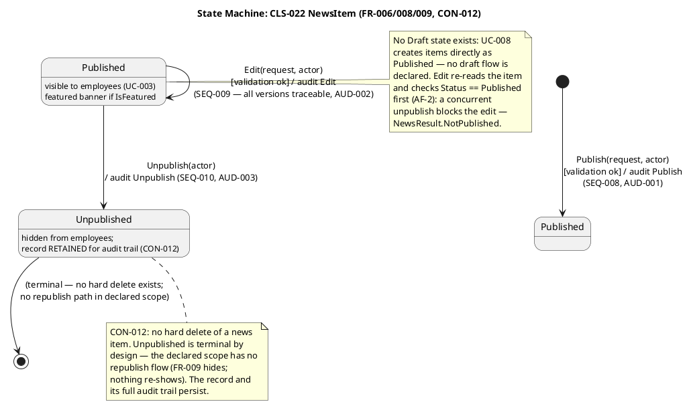
```plantuml
@startuml
title State Machine: CLS-022 NewsItem (FR-006/008/009, CON-012)

[*] --> Published : Publish(request, actor)\n[validation ok] / audit Publish\n(SEQ-008, AUD-001)

state "Published" as PUBLISHED {
  PUBLISHED : visible to employees (UC-003)\nfeatured banner if IsFeatured
}

state "Unpublished" as UNPUBLISHED {
  UNPUBLISHED : hidden from employees;\nrecord RETAINED for audit trail (CON-012)
}

PUBLISHED --> PUBLISHED : Edit(request, actor)\n[validation ok] / audit Edit\n(SEQ-009 — all versions traceable, AUD-002)
PUBLISHED --> UNPUBLISHED : Unpublish(actor)\n/ audit Unpublish (SEQ-010, AUD-003)
UNPUBLISHED --> [*] : (terminal — no hard delete exists;\nno republish path in declared scope)

note right of PUBLISHED
  No Draft state exists: UC-008
  creates items directly as
  Published — no draft flow is
  declared. Edit re-reads the item
  and checks Status == Published
  first (AF-2): a concurrent
  unpublish blocks the edit —
  NewsResult.NotPublished.
end note

note bottom of UNPUBLISHED
  CON-012: no hard delete of a news
  item. Unpublished is terminal by
  design — the declared scope has no
  republish flow (FR-009 hides;
  nothing re-shows). The record and
  its full audit trail persist.
end note
@enduml
```

**CLS-021 ClockingEvent** — the offline sync lifecycle (ADR-003, REL-002/003):

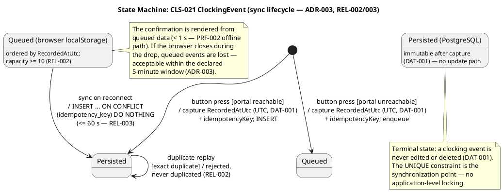
```plantuml
@startuml
title State Machine: CLS-021 ClockingEvent (sync lifecycle — ADR-003, REL-002/003)

[*] --> Persisted : button press [portal reachable]\n/ capture RecordedAtUtc (UTC, DAT-001)\n+ idempotencyKey; INSERT
[*] --> Queued : button press [portal unreachable]\n/ capture RecordedAtUtc (UTC, DAT-001)\n+ idempotencyKey; enqueue

state "Queued (browser localStorage)" as QUEUED {
  QUEUED : ordered by RecordedAtUtc;\ncapacity >= 10 (REL-002)
}

state "Persisted (PostgreSQL)" as PERSISTED {
  PERSISTED : immutable after capture\n(DAT-001) — no update path
}

QUEUED --> Persisted : sync on reconnect\n/ INSERT ... ON CONFLICT\n(idempotency_key) DO NOTHING\n(<= 60 s — REL-003)
Persisted --> Persisted : duplicate replay\n[exact duplicate] / rejected,\nnever duplicated (REL-002)

note right of QUEUED
  The confirmation is rendered from
  queued data (< 1 s — PRF-002 offline
  path). If the browser closes during
  the drop, queued events are lost —
  acceptable within the declared
  5-minute window (ADR-003).
end note

note bottom of PERSISTED
  Terminal state: a clocking event is
  never edited or deleted (DAT-001).
  The UNIQUE constraint is the
  synchronization point — no
  application-level locking.
end note
@enduml
```

### SAD Boundary Reconciliations (documented deviations — coupling reductions, not violations)

| SAD statement | Design realization | Justification |
|---|---|---|
| COMP-001 Clocking Service lists IAUD dependency | CLS-001 does NOT depend on IAuditService | NFR-005 scopes audit to news operations (AUD-001…003) and category changes (AUD-004). A clocking event carries its own actor (EmployeeUid) and is immutable (DAT-001) — there is nothing to audit beyond the event row itself. Coupling reduction; no behavior change. |
| COMP-010 Report Export Service lists ILDAP dependency | CLS-006 depends on IDirectoryService.GetDisplayData (INT-008), which internally uses ILDAP | Display-data resolution exists exactly once (COMP-003) instead of being duplicated in COMP-010. The boundary remains interface-based; the SAD's intent (AD-sourced display data, CON-005) is preserved. |
| COMP-009 Offline Resilience Handler "internal to COMP-001" | CLS-008 OfflineQueueClient is browser-side (localStorage), calling the sync endpoint (CLS-017.OnPostSync → CLS-001.SyncEvents); the server half is ClockingService.SyncEvents | Consistent with ADR-003 and the SAD Deployment View, which places the localStorage queue on the employee workstation node. "Internal to COMP-001" is realized as: the queue's only server counterpart is COMP-001's sync path. |

## Interface Contracts
Operation signatures with preconditions / postconditions for every subsystem-boundary interface. Interfaces INT-001…INT-005 (external system interfaces) are specified in the Supplementary Specification; INT-006…INT-019 are the portal's internal subsystem boundaries.

**Elaboration Iter 2 evolution (Designer):** INT-008 GetDisplayData, INT-010, and INT-013 postconditions extended with the R001 behavioural bar (stakeholder decision, Elaboration Iter 2; bar reach stakeholder-confirmed — answer "Yes"). All other rows preserved exactly as reviewed.

| ID | Interface | Operation | Precondition | Postcondition |
|---|---|---|---|---|
| INT-006 | IClockingService | GetCurrentStatus(employeeUid) | employeeUid non-empty; caller authenticated | Returns ClockedIn iff the employee's most recent persisted event is IN; offline-queued events not yet synced are not reflected |
| INT-006 | IClockingService | RecordEvent(request) | request.IdempotencyKey non-empty; request.RecordedAtUtc is the press-time UTC capture (DAT-001) | Exactly one event persisted, OR an event with the same idempotency key already exists and NO new row is created (idempotent — REL-002); UNIQUE constraint is the enforcement point |
| INT-006 | IClockingService | SyncEvents(events) | every event carries RecordedAtUtc + IdempotencyKey; caller authenticated | Every event either persisted or rejected as exact duplicate — zero losses, zero duplicates (REL-002); all persisted ≤ 60 s from restore (REL-003) |
| INT-006 | IClockingService | GetHistory(employeeUid, fromUtc, toUtc) | employeeUid equals the authenticated user's uid (SEC-007 — controller enforces from claims, never from request) | Returns only that employee's events within the range; range bounds are local calendar days converted by the caller via INT-014 |
| INT-006 | IClockingService | GetClockings(filter) | caller holds HR Administrator role (SEC-006 — enforced at the request boundary) | Returns events for all employees matching the filter |
| INT-007 | INewsService | GetPublishedNews(category?) | caller authenticated | Only Status=Published items, sorted PublishedAtUtc desc; unpublished items NEVER returned (UC-003) |
| INT-007 | INewsService | GetAllNews() / GetNewsItem(id) | caller holds HR Administrator role | All items including unpublished (management list) / the item or null |
| INT-007 | INewsService | Publish(request, actor) | request fields valid (title, body, date, category required) | Item persisted Status=Published AND audit entry (Publish, actorUid, timestampUtc, snapshot) staged; BOTH committed in ONE transaction (DAT-002, AUD-001); item visible to employees |
| INT-007 | INewsService | Edit(id, request, actor) | item exists AND Status=Published at save time (AF-2 re-read) | Updated item + audit entry (Edit, post-edit snapshot) in ONE transaction (AUD-002); if concurrently unpublished → NewsResult.NotPublished, NO change, NO audit entry |
| INT-007 | INewsService | Unpublish(id, actor) | item exists AND Status=Published | Status=Unpublished (record retained — CON-012) + audit entry (Unpublish) in ONE transaction (AUD-003); item hidden from employees |
| INT-008 | IDirectoryService | Search(criteria) | caller authenticated | Entries read LIVE from AD (CON-006); missing attributes null, entry NOT hidden (R001); throws DirectoryUnavailableException on timeout/failure — no local fallback (AF-3) |
| INT-008 | IDirectoryService | GetDisplayData(uids) | caller authenticated | Map uid → EmployeeDisplayData (name, department, office) **COMPLETE over the requested uid set (design decision D-9)**: every requested uid has a map entry — a uid AD cannot resolve maps to an all-null EmployeeDisplayData; missing attributes null within resolved entries — **R001 behavioural bar (stakeholder-confirmed, Elab Iter 2): every employee rendered, no removal, no error**; throws on AD unavailable |
| INT-009 | ICategoryService | GetCategoryList() | — | FIXED list from worker-categories.json (ADR-004); never mutated at runtime (CON-013) |
| INT-009 | ICategoryService | Assign(employeeUid, category, actor) | category ∈ fixed list; caller holds HR Administrator role | If category ≠ current: mapping upserted (two data columns — CON-006) + audit entry (old, new, actor, timestamp) in ONE transaction (AUD-004). If equal: NO change, NO audit entry (AF-1) |
| INT-010 | ILdapGateway | Search(criteria) / GetDisplayData(uids) | connection configured (R010 service account) | Read-only LDAP v3 (CON-007); 5 s hard timeout (PRF-003); missing attributes mapped null, entry NOT dropped, no error raised — **R001 behavioural bar (stakeholder-confirmed, Elab Iter 2): one contract, four consumers (UC-004/005/006/007)**; GetDisplayData map complete over the requested uid set (D-9) |
| INT-011 | IAuthProvider | ConfigureOidc(builder, options) | Keycloak client settings present in configuration | OIDC middleware registered at the request boundary; all pages require authentication (SEC-003); roles mapped from claims (SEC-002) |
| INT-011 | IAuthProvider | GetAuthenticatedUser(context) | — | AuthenticatedUser (Uid + Roles) or null if unauthenticated |
| INT-012 | IAuditService | AppendNewsAction(newsId, action, actorUid, timestampUtc, snapshot) | called within an active unit of work whose orchestrator will SaveChanges | Entry STAGED (not committed); append-only — no update/delete path exists (DAT-002) |
| INT-012 | IAuditService | AppendCategoryChange(employeeUid, oldCategory, newCategory, actorUid, timestampUtc) | as above | Entry staged; old + new value recorded (AUD-004) |
| INT-013 | IReportExport | ExportMonth(year, month) | caller holds HR Administrator role | Month boundaries computed as local calendar days in America/Havana (payroll day = local day); CSV column set v1 (ad_user_id, employee_name, department, office, event_timestamp ISO-8601 with explicit offset, event_type); **missing display attributes → EVERY event row written with blank cells, no abort (UC-006 AF-3 — R001 bar; ad_user_id resolves identity)**; ExportAborted.DirectoryUnavailable if AD unreachable — NO partial file (AF-2); NoData if no events (AF-1) |
| INT-014 | ITimeConvention | NowUtc() | — | Current UTC time (DAT-001 capture source) |
| INT-014 | ITimeConvention | ToLocalDisplay(timestampUtc) | — | America/Havana local time string, DST-aware (USA-008); raw UTC or server time is NEVER returned for display |
| INT-014 | ITimeConvention | ToIso8601WithOffset(timestampUtc) | — | "YYYY-MM-DDThh:mm:ss±hh:mm" with the offset in force at the event time per the IANA zone database |
| INT-014 | ITimeConvention | MonthBoundsLocal(year, month) | — | UTC bounds of the local calendar month in America/Havana (payroll day = local calendar day, never the server's) |
| INT-015 | IPersistence | SaveChanges() / BeginTransaction() | staged changes present | All staged changes (state + audit entries) committed in ONE transaction (DAT-002) |
| INT-016 | IClockingsRepository | Add / AddRange / GetByEmployeeAndRange / GetByFilter / GetByRange | — | Stages / queries; UNIQUE idempotency_key enforced at the database (REL-002); returned events are immutable |
| INT-017 | INewsRepository | Add / GetById / Update / GetPublished / GetAll | — | GetPublished filters Status=Published, sorted desc; Update stages only (commit via INT-015) |
| INT-018 | IWorkerCategoryRepository | GetByUid / Upsert | — | Two data columns only (CON-006); Upsert stages only |
| INT-019 | IAuditEntryRepository | AddNewsEntry / AddCategoryEntry | — | Add ONLY — the interface exposes no Update, no Delete (DAT-002); the compiler enforces the audit trail's immutability |
## Persistent Data Classes
**Database Designer contribution (Elaboration Iter 1).** The Development Case did not fire the Data Model trigger (§5.2: data lives inline in the Design Model) — this section IS the data model: physical schema, O/R mapping, index strategy, and baseline migration for the five persistent classes CLS-021…CLS-025. CLS-026 DirectoryEntry and CLS-027 EmployeeDisplayData are transient AD projections and are deliberately NOT mapped — **no table stores any AD attribute** (CON-006); `employee_uid` is an untyped string reference with no foreign key, resolved live via CLS-009 (CON-005).

### Persistence Mechanism Resolution (three-level chain)

| Level | Resolution |
|---|---|
| Analysis mechanism | Persistence — objects stored between sessions (SAD cross-cutting) |
| Design mechanism | Repository + Unit-of-Work over a transactional relational store (ADR-002): 3NF schema, append-only audit tables, idempotency via UNIQUE key, UTC `timestamptz` storage, audit writes share the orchestrator's transaction (DAT-002) |
| Implementation mechanism | **PostgreSQL** (declared — CON-003) via EF Core + Npgsql 10.0.3 (ADR-002). Engine is stakeholder-declared, so the chain reaches level (c); all DDL below targets PostgreSQL syntax |

### Physical Schema (PostgreSQL — CON-003, ADR-002)

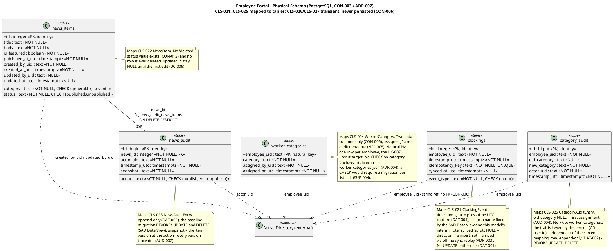
```plantuml
@startuml
title Employee Portal - Physical Schema (PostgreSQL, CON-003 / ADR-002)\nCLS-021..CLS-025 mapped to tables; CLS-026/CLS-027 transient, never persisted (CON-006)
skinparam classAttributeIconSize 0
skinparam fontSize 10
skinparam packageStyle rectangle

class "Active Directory (external)" as AD <<external>>

class "clockings" as T1 <<table>> {
  +id : integer <<PK, identity>>
  employee_uid : text <<NOT NULL>>
  event_type : text <<NOT NULL, CHECK (in,out)>>
  timestamp_utc : timestamptz <<NOT NULL>>
  idempotency_key : text <<NOT NULL, UNIQUE>>
  synced_at_utc : timestamptz <<NULL>>
}

class "news_items" as T2 <<table>> {
  +id : integer <<PK, identity>>
  title : text <<NOT NULL>>
  body : text <<NOT NULL>>
  category : text <<NOT NULL, CHECK (general,hr,it,events)>>
  is_featured : boolean <<NOT NULL>>
  status : text <<NOT NULL, CHECK (published,unpublished)>>
  published_at_utc : timestamptz <<NOT NULL>>
  created_by_uid : text <<NOT NULL>>
  created_at_utc : timestamptz <<NOT NULL>>
  updated_by_uid : text <<NULL>>
  updated_at_utc : timestamptz <<NULL>>
}

class "news_audit" as T3 <<table>> {
  +id : bigint <<PK, identity>>
  news_id : integer <<NOT NULL, FK>>
  action : text <<NOT NULL, CHECK (publish,edit,unpublish)>>
  actor_uid : text <<NOT NULL>>
  timestamp_utc : timestamptz <<NOT NULL>>
  snapshot : text <<NOT NULL>>
}

class "worker_categories" as T4 <<table>> {
  +employee_uid : text <<PK, natural key>>
  category : text <<NOT NULL>>
  assigned_by_uid : text <<NOT NULL>>
  assigned_at_utc : timestamptz <<NOT NULL>>
}

class "category_audit" as T5 <<table>> {
  +id : bigint <<PK, identity>>
  employee_uid : text <<NOT NULL>>
  old_category : text <<NULL>>
  new_category : text <<NOT NULL>>
  actor_uid : text <<NOT NULL>>
  timestamp_utc : timestamptz <<NOT NULL>>
}

T2 "1" -- "0..*" T3 : news_id\nfk_news_audit_news_items\nON DELETE RESTRICT

T1 ..> AD : employee_uid - string ref, no FK (CON-006)
T4 ..> AD : employee_uid
T5 ..> AD : employee_uid
T2 ..> AD : created_by_uid / updated_by_uid
T3 ..> AD : actor_uid

note bottom of T1
  Maps CLS-021 ClockingEvent.
  timestamp_utc = press-time UTC
  capture (DAT-001); column name fixed
  by the SAD Data View and this model's
  interim note. synced_at_utc NULL =
  direct online insert; set = arrived
  via offline sync replay (ADR-003).
  No UPDATE path exists (DAT-001).
end note

note right of T2
  Maps CLS-022 NewsItem. No 'deleted'
  status value exists (CON-012) and no
  row is ever deleted. updated_* stay
  NULL until the first edit (UC-009).
end note

note bottom of T3
  Maps CLS-023 NewsAuditEntry.
  Append-only (DAT-002): the baseline
  migration REVOKEs UPDATE and DELETE
  (SAD Data View). snapshot = the item
  version at the action - every version
  traceable (AUD-002).
end note

note right of T4
  Maps CLS-024 WorkerCategory. Two data
  columns only (CON-006); assigned_* are
  audit metadata (NFR-005). Natural PK:
  one row per employee, the UC-007
  upsert target. No CHECK on category -
  the fixed list lives in
  worker-categories.json (ADR-004); a
  CHECK would require a migration per
  list edit (SUP-004).
end note

note bottom of T5
  Maps CLS-025 CategoryAuditEntry.
  old_category NULL = first assignment
  (AUD-004). No FK to worker_categories:
  the trail is keyed by the person (AD
  user id), independent of the current
  mapping row. Append-only (DAT-002) -
  REVOKE UPDATE, DELETE.
end note
@enduml
```

**Schema decisions (what the diagram cannot carry):**

- **Normalization:** every table is in 3NF — no repeating groups, no partial or transitive dependencies. **No denormalization is applied**: at ~100K clocking rows/year (SAD sizing) and 200 users, no declared NFR justifies one; every read is served by an index below, not by duplication.
- **Naming convention:** `snake_case` throughout; constraint prefixes `pk_` / `uk_` / `fk_` / `ix_`. Table names are fixed by the SAD §Data View baseline (`clockings`, `news_items`, `news_audit`, `worker_categories`, `category_audit`) — `clockings` is the one plural name and is retained for SAD consistency; renaming it would be uncoordinated drift.
- **`timestamptz` everywhere** — the column type enforces instant semantics; the stored value is always UTC (stakeholder decision; DAT-001). Display conversion to America/Havana (CLS-007) and ISO-8601 offset export (CLS-006) happen at render time — a local time is never stored.
- **`worker_categories` has no CHECK on `category`** — the fixed list lives in `worker-categories.json` (ADR-004); a CHECK constraint would require a schema migration per list edit, violating SUP-004 (list changes without code deployment). CLS-004 validates assignments against the loaded list; the DB does not duplicate that rule.
- **`category_audit` has no FK to `worker_categories`** — the audit trail is keyed by the person (AD user id), not by the current mapping row; the trail must survive independently of the mapping (AUD-004).
- **`news_audit.news_id` → `news_items.id` ON DELETE RESTRICT** — no hard delete exists in the portal (CON-012); RESTRICT is defense-in-depth so no operational path can ever orphan or cascade-destroy a trail.

### O/R Mapping (EF Core + Npgsql 10.0.3 — ADR-002)

| Design class | Table | Identity strategy | Loading policy | Type conversions | Write policy |
|---|---|---|---|---|---|
| CLS-021 ClockingEvent | `clockings` | `GENERATED ALWAYS AS IDENTITY` — DB-generated, EF reads back after insert (`UseIdentityAlwaysColumn`) | Eager, explicit — repositories return materialized `IReadOnlyList`; no lazy loading, no navigation properties | `DateTimeOffset` → `timestamptz` (UTC); `ClockingEventType` enum → `text` via value converter, DB CHECK as second line | INSERT only (`Add`/`AddRange`, INT-016); **no UPDATE path** — immutability is DAT-001; sync uses `ON CONFLICT (idempotency_key) DO NOTHING` |
| CLS-022 NewsItem | `news_items` | `GENERATED ALWAYS AS IDENTITY` | Eager, explicit | `NewsCategory`/`NewsStatus` enums → `text` + CHECK; `DateTimeOffset` → `timestamptz` | INSERT + UPDATE (status/fields); **no DELETE** — soft delete via `status` (CON-012); concurrent unpublish handled by status re-read (SEQ-009 AF-2), not a version column |
| CLS-023 NewsAuditEntry | `news_audit` | `GENERATED ALWAYS AS IDENTITY` (`bigint` — append-only grows unbounded) | Eager, explicit | `NewsAuditAction` enum → `text` + CHECK; `snapshot` = serialized item version, `text` (format owned by CLS-005) | INSERT only; **UPDATE/DELETE revoked at the DB** (DAT-002) |
| CLS-024 WorkerCategory | `worker_categories` | Natural key `employee_uid` — one row per employee; no surrogate | Eager, explicit | `DateTimeOffset` → `timestamptz` | Upsert: `ON CONFLICT (employee_uid) DO UPDATE` (UC-007); no delete path declared |
| CLS-025 CategoryAuditEntry | `category_audit` | `GENERATED ALWAYS AS IDENTITY` (`bigint`) | Eager, explicit | `old_category` NULL = first assignment (AUD-004) | INSERT only; **UPDATE/DELETE revoked at the DB** (DAT-002) |
| CLS-026 DirectoryEntry, CLS-027 EmployeeDisplayData | — none | — | — | — | **Never persisted** (CON-006); constructed per-request by CLS-009 |

**Transaction policy (DAT-002):** CLS-011 `SaveChanges()` is the single commit boundary — a state change and its staged audit entry commit in ONE transaction; a failed audit write rolls back the state change. The audit repositories (INT-019) expose `Add` only — the compiler and the DB REVOKE enforce append-only together.

### Index Strategy and Performance Contract


```plantuml
@startuml
title Employee Portal - Index Strategy: every index justified by a declared access path
skinparam classAttributeIconSize 0
skinparam fontSize 10
skinparam packageStyle rectangle

package "Access paths - repository operations INT-016 to INT-019" {
  class "Q1 GetCurrentStatus - UC-001" as Q1 <<query>> {
    WHERE employee_uid, latest event
    ORDER BY timestamp_utc DESC LIMIT 1
    uses ix_clockings_employee_recorded
    budget PRF-002: under 1 s end to end
  }
  class "Q2 GetHistory - UC-002" as Q2 <<query>> {
    WHERE employee_uid AND timestamp_utc in month range
    uses ix_clockings_employee_recorded range scan
    budget PRF-001: under 3 s page load
  }
  class "Q3 GetByFilter - UC-005" as Q3 <<query>> {
    WHERE employee_uid and/or timestamp_utc range
    uses ix_clockings_employee_recorded or ix_clockings_timestamp
  }
  class "Q4 GetByRange - UC-006" as Q4 <<query>> {
    WHERE timestamp_utc in month range, all employees
    uses ix_clockings_timestamp range scan
    about 8 to 9K rows per month, streamed to CSV
  }
  class "Q5 SyncEvents - UC-001 AF-1" as Q5 <<query>> {
    INSERT ON CONFLICT idempotency_key DO NOTHING
    uses uk_clockings_idempotency_key
    budget REL-003: all persisted under 60 s
  }
  class "Q6 GetPublished - UC-003" as Q6 <<query>> {
    WHERE status published, ORDER BY published_at_utc DESC
    optional AND category filter
    uses ix_news_items_published or ix_news_items_category_published
    budget PRF-001: under 3 s page load
  }
  class "Q7 GetByUid and Upsert - UC-007" as Q7 <<query>> {
    WHERE employee_uid - primary key lookup
    INSERT ON CONFLICT employee_uid DO UPDATE
  }
  class "Q8 Audit reads - AUD-002 and AUD-004" as Q8 <<query>> {
    WHERE news_id ORDER BY timestamp_utc - item versions
    WHERE employee_uid ORDER BY timestamp_utc
    uses ix_news_audit_news, ix_category_audit_employee
  }
}

package "Tables - constraints and indexes" {
  class "clockings" as T1 <<table>> {
    pk_clockings on id
    uk_clockings_idempotency_key on idempotency_key
    --
    ix_clockings_employee_recorded on employee_uid, timestamp_utc
    ix_clockings_timestamp on timestamp_utc
  }
  class "news_items" as T2 <<table>> {
    pk_news_items on id
    --
    ix_news_items_published on published_at_utc, partial WHERE status published
    ix_news_items_category_published on category, published_at_utc, partial WHERE status published
  }
  class "news_audit" as T3 <<table>> {
    pk_news_audit on id
    --
    ix_news_audit_news on news_id, timestamp_utc
  }
  class "worker_categories" as T4 <<table>> {
    pk_worker_categories on employee_uid
  }
  class "category_audit" as T5 <<table>> {
    pk_category_audit on id
    --
    ix_category_audit_employee on employee_uid, timestamp_utc
  }
}

Q1 ..> T1
Q2 ..> T1
Q3 ..> T1
Q4 ..> T1
Q5 ..> T1
Q6 ..> T2
Q7 ..> T4
Q8 ..> T3
Q8 ..> T5

note bottom of T1
  No partitioning: about 100K rows per year
  (SAD sizing) is orders of magnitude
  below where partitioning pays; single
  node (CON-008), 200 users. Revisit only
  with measured evidence, never speculation.
end note

note right of T2
  Partial indexes (WHERE status published)
  stay minimal: unpublished rows, retained
  forever per CON-012, are excluded from
  the browse index. The management list
  GetAll reads a small table - no further
  index justified.
end note
@enduml
```

**Index justifications (each tied to a declared NFR):**

| Index | Serves | NFR / UC |
|---|---|---|
| `uk_clockings_idempotency_key` (UNIQUE) | Q5 duplicate suppression — the physical enforcement point of the REL-002 conflict policy; no application locking | REL-002, ADR-003, UC-001 AF-1 |
| `ix_clockings_employee_recorded` (employee_uid, timestamp_utc) | Q1 status lookup (LIMIT 1, index-ordered — no sort), Q2 month history, Q3 HR filter | PRF-002, PRF-001, UC-001/002/005 |
| `ix_clockings_timestamp` (timestamp_utc) | Q4 monthly export range scan across all employees | PRF-001, UC-006 |
| `ix_news_items_published` (partial) | Q6 browse, newest first | PRF-001, UC-003 |
| `ix_news_items_category_published` (partial, composite) | Q6 with category chip filter (leftmost-prefix: category, then date order) | PRF-001, UC-003 |
| `ix_news_audit_news` (news_id, timestamp_utc) | Q8 item version trail, chronological | AUD-002, NFR-005 |
| `ix_category_audit_employee` (employee_uid, timestamp_utc) | Q8 per-employee category change trail | AUD-004, NFR-005 |

No other index is justified: `worker_categories` is ≤ 200 rows (PK lookup suffices); `GetAllNews` (SCR-08) reads a small table sequentially; over-indexing would tax the write path for no declared requirement.

### Baseline Migration (V1) and Evolution Policy

The DDL below is the **authoritative baseline specification**. The Implementer applies it as the initial EF Core migration (Npgsql supports partial indexes via `HasFilter("status = 'published'")` and identity via `UseIdentityAlwaysColumn`); the generated schema must be equivalent to this DDL — column types, constraints, index predicates included.

```sql
-- Migration V1 — baseline schema (PostgreSQL, CON-003 / ADR-002)
-- Idempotent: IF NOT EXISTS guards make re-runs safe. Forward-only version sequence.

CREATE TABLE IF NOT EXISTS clockings (
    id              integer GENERATED ALWAYS AS IDENTITY PRIMARY KEY,
    employee_uid    text        NOT NULL,
    event_type      text        NOT NULL CHECK (event_type IN ('in', 'out')),
    timestamp_utc   timestamptz NOT NULL,
    idempotency_key text        NOT NULL,
    synced_at_utc   timestamptz NULL,
    CONSTRAINT uk_clockings_idempotency_key UNIQUE (idempotency_key)
);
CREATE INDEX IF NOT EXISTS ix_clockings_employee_recorded ON clockings (employee_uid, timestamp_utc);
CREATE INDEX IF NOT EXISTS ix_clockings_timestamp         ON clockings (timestamp_utc);

CREATE TABLE IF NOT EXISTS news_items (
    id               integer GENERATED ALWAYS AS IDENTITY PRIMARY KEY,
    title            text        NOT NULL,
    body             text        NOT NULL,
    category         text        NOT NULL CHECK (category IN ('general', 'hr', 'it', 'events')),
    is_featured      boolean     NOT NULL DEFAULT false,
    status           text        NOT NULL CHECK (status IN ('published', 'unpublished')),
    published_at_utc timestamptz NOT NULL,
    created_by_uid   text        NOT NULL,
    created_at_utc   timestamptz NOT NULL,
    updated_by_uid   text        NULL,
    updated_at_utc   timestamptz NULL
);
CREATE INDEX IF NOT EXISTS ix_news_items_published          ON news_items (published_at_utc)              WHERE status = 'published';
CREATE INDEX IF NOT EXISTS ix_news_items_category_published ON news_items (category, published_at_utc)   WHERE status = 'published';

CREATE TABLE IF NOT EXISTS news_audit (
    id            bigint GENERATED ALWAYS AS IDENTITY PRIMARY KEY,
    news_id       integer     NOT NULL REFERENCES news_items (id) ON DELETE RESTRICT,
    action        text        NOT NULL CHECK (action IN ('publish', 'edit', 'unpublish')),
    actor_uid     text        NOT NULL,
    timestamp_utc timestamptz NOT NULL,
    snapshot      text        NOT NULL
);
CREATE INDEX IF NOT EXISTS ix_news_audit_news ON news_audit (news_id, timestamp_utc);

CREATE TABLE IF NOT EXISTS worker_categories (
    employee_uid    text PRIMARY KEY,
    category        text        NOT NULL,
    assigned_by_uid text        NOT NULL,
    assigned_at_utc timestamptz NOT NULL
);

CREATE TABLE IF NOT EXISTS category_audit (
    id            bigint GENERATED ALWAYS AS IDENTITY PRIMARY KEY,
    employee_uid  text        NOT NULL,
    old_category  text        NULL,
    new_category  text        NOT NULL,
    actor_uid     text        NOT NULL,
    timestamp_utc timestamptz NOT NULL
);
CREATE INDEX IF NOT EXISTS ix_category_audit_employee ON category_audit (employee_uid, timestamp_utc);

-- Append-only enforcement (DAT-002 / NFR-005): the application role is granted
-- SELECT + INSERT only on the audit tables; UPDATE and DELETE are revoked.
-- The migration/owner role retains full rights for operational recovery only.
REVOKE UPDATE, DELETE ON news_audit     FROM PUBLIC;
REVOKE UPDATE, DELETE ON category_audit FROM PUBLIC;
```

**Evolution policy (schema stability — end-of-Elaboration baseline):**
- **V1 is the stable core.** Construction iterations may ADD tables; existing tables change only via a reviewed EF migration with a forward script and, where data-safe, a down-migration. Audit tables are never dropped and never lose their append-only REVOKE.
- **Rollback:** EF down-migrations revert structure where no data loss occurs; any change touching `clockings` or the audit tables requires a documented data-preservation step first.
- **No migration exists for a category-list change** — by design (ADR-004): the list is a JSON file, not schema.

### Performance Baseline (critical access paths)

| Path | Expected plan | Row estimate | Budget |
|---|---|---|---|
| Q1 status lookup (every Home load) | index scan `ix_clockings_employee_recorded`, LIMIT 1, no sort | 1 row | < 5 ms DB — PRF-002 (< 1 s end-to-end) |
| Q2 own month history | index range scan, employee prefix | ≤ ~40 rows/employee-month | PRF-001 (< 3 s page) |
| Q4 monthly CSV export | range scan `ix_clockings_timestamp`, streamed | ~8–9K rows/month (200 employees × ~2 events × ~21 workdays) | well inside PRF-001; REL-003 unaffected |
| Q5 sync replay (worst case) | 200 × unique-index probe + INSERT | ≤ 200 events | REL-003 (≤ 60 s) — trivially met |
| Q6 news browse | partial index scan, pre-ordered | tens of rows | PRF-001 (< 3 s page) |

Growth: `clockings` ~100K rows/year (SAD sizing) — years of headroom on a single node (CON-008) before any tactic beyond these indexes is warranted.

### Traceability (Database Designer contribution)

| Element | Traces From | Link Type | Traces To |
|---|---|---|---|
| `clockings` table | CLS-021, FR-004, FR-005, DAT-001, CON-003 | Derives | INT-016 (CLS-012); Q1–Q5 access paths |
| `news_items` table | CLS-022, FR-006, FR-007, FR-008, FR-009, CON-012 | Derives | INT-017 (CLS-013); Q6 access path |
| `news_audit` table | CLS-023, NFR-005, AUD-001, AUD-002, AUD-003, DAT-002 | Derives | INT-019 (CLS-015); Q8 access path |
| `worker_categories` table | CLS-024, FR-003, CON-006, ADR-004 | Derives | INT-018 (CLS-014); Q7 access path |
| `category_audit` table | CLS-025, NFR-005, AUD-004, DAT-002 | Derives | INT-019 (CLS-016); Q8 access path |
| `uk_clockings_idempotency_key` | REL-002, ADR-003, AC-005 | Realizes | Q5 sync duplicate suppression (UC-001 AF-1) |
| `ix_clockings_employee_recorded` | PRF-002, PRF-001, UC-001, UC-002, UC-005 | Realizes | Q1, Q2, Q3 |
| `ix_clockings_timestamp` | PRF-001, UC-006 | Realizes | Q4 monthly export |
| `ix_news_items_published`, `ix_news_items_category_published` | PRF-001, UC-003 | Realizes | Q6 browse + category filter |
| `ix_news_audit_news`, `ix_category_audit_employee` | NFR-005, AUD-002, AUD-004 | Realizes | Q8 audit reads |
| Append-only REVOKE (audit tables) | DAT-002, NFR-005 | Realizes | INT-019 Add-only interface (compiler + DB dual enforcement) |
| `timestamptz` UTC storage | DAT-001 + stakeholder decision (store UTC) | Realizes | CLS-007 display conversion; CLS-006 ISO-8601 offset export |
| Migration V1 (baseline DDL) | CON-003, ADR-002, R008 | Realizes | Implementer initial EF migration (Construction) |
| No-Employee-table rule | CON-005, CON-006, CON-007 | Derives | CLS-009 live LDAP resolution (R001 graceful degradation) |
## Boundary Classes and Navigation Map
(User Interface Designer — Elaboration Iter 1, evolved Iter 2 (convergence cycle). This section realizes the user-interface-specific parts of the use cases: the boundary classes the user operates, the formal navigation topology, and the UI patterns every implementer follows. Interaction flows per UC are in the Use-Case Model §Use-Case Specifications → UI Flow References; usability criteria are quantified in the Supplementary Specification §Usability.)

**Elaboration Iter 2 evolution (convergence cycle):** (1) **P-05 extended** — the missing-AD-attribute pattern now carries the stakeholder-confirmed R001 behavioural bar across ALL four AD-reading use cases (UC-004/005/006/007), each with its rendering contract; (2) **Salt wireframes added** for the two primary screens — SCR-01 Home (first-use affordance, USA-004) and SCR-04 Directory (10-second lookup, USA-003; the wireframe renders the R001 blank-field contract); (3) **design-reference verification (this revision)** — the authoritative source was read from the repository (docs/inputs/employee-portal-design.html, sha ba1cb26e): every token, component, and state cited in this section is confirmed present in the reference; the SCR-01 wireframe is completed with the reference's live clock element; **reconciliations 4 and 5** are added (directory-footer sync claim contradicts CON-006; hardcoded filter options are sample data, not specification); **P-02 carries a PENDING stakeholder decision** on the rendering contract when more than one news item is featured (escalated in-round this iteration). All other content is preserved exactly as reviewed at the Elaboration Iter 1 LCA review (zero findings on this artifact).

### Screen Registry

Every screen implements the mandatory design reference (CON-011 — docs/inputs/employee-portal-design.html): topbar (brand-900 #0B3D5C, user chip, Sign out), sidebar nav (role-aware), content cards (8 px radius, 1120 px container). The design reference's internal labels UC01/UC02/UC03 map to project UC-001/UC-003/UC-004 (project UC IDs follow the Use-Case Model).

| Screen | Name | Realizes (UC / FR) | Design reference source | Role visibility |
|---|---|---|---|---|
| SCR-01 | Home — clocking card + featured banner + history preview | UC-001 (FR-004), UC-003 (FR-007) | "Home: quick clocking + featured news" grid | All |
| SCR-02 | My Clocking History (current month) | UC-002 (FR-005) | "My clocking history" table | All |
| SCR-03 | News — featured banner + category chips + list | UC-003 (FR-007) | "News and announcements" section | All |
| SCR-04 | Directory — search bar + person cards | UC-004 (FR-010) | "Employee directory" section | All |
| SCR-05 | HR Clocking Report — filters + table + Export CSV | UC-005 (FR-001), UC-006 (FR-002) | "Clocking report" nav item + ghost-button style | HR only (SEC-006) |
| SCR-06 | Worker Categories — employee lookup + fixed category select | UC-007 (FR-003) | "Manage directory" nav item, relabeled (see reconciliation 1) | HR only (SEC-006) |
| SCR-07 | News Form (publish mode / edit mode) | UC-008 (FR-006), UC-009 (FR-008) | "Publish news" nav item + form pattern | HR only (SEC-006) |
| SCR-08 | News Management — list with status + actions | UC-009 (FR-008), UC-010 (FR-009) | Derived from news lifecycle (no direct mockup section) | HR only (SEC-006) |
| SCR-09 | Access Denied (inline error state) | SEC-006 (UC-005 EF-1, UC-009 EF-1) | Derived from role enforcement | Reached on role denial |
| M-01 | Unpublish confirmation modal | UC-010 (FR-009) | Derived from UC-010 step 5 (confirmation prompt) | HR only |
| EX-01 | Keycloak login | `<<include>>` auth, all UCs (AF-2) | External — Keycloak's page, not a portal screen (CON-004) | Unauthenticated |

### UI Boundary Classes

Boundary classes are named after screens (Razor Pages, CON-002) and depend ONLY on the subsystem interfaces published in the SAD Logical View (ICLK, INEWS, IDIR, ICAT) — no direct coupling to subsystem internals. Controllers carry the interaction logic the storyboards specify (button disable, 2 s ignore window, offline queue delegation, inline validation).

```plantuml
@startuml
title Employee Portal — UI Boundary Classes (Presentation Layer — CON-002)
skinparam classAttributeIconSize 0
skinparam fontSize 11
skinparam packageStyle rectangle

interface "IClockingService (COMP-001)" as ICLK
interface "INewsService (COMP-002)" as INEWS
interface "IDirectoryService (COMP-003)" as IDIR
interface "ICategoryService (COMP-004)" as ICAT

package "Clocking UI" {
  class "HomeView (SCR-01)" as HomeView <<view>>
  class "ClockingHistoryView (SCR-02)" as HistoryView <<view>>
  class "ClockingController" as ClockingCtl <<controller>>
}
package "News UI" {
  class "NewsView (SCR-03)" as NewsView <<view>>
  class "NewsFormView (SCR-07)" as NewsFormView <<view>>
  class "NewsManagementView (SCR-08, M-01)" as NewsMgmtView <<view>>
  class "NewsController" as NewsCtl <<controller>>
}
package "Directory UI" {
  class "DirectoryView (SCR-04)" as DirectoryView <<view>>
  class "DirectoryController" as DirectoryCtl <<controller>>
}
package "HR Admin UI" {
  class "ClockingReportView (SCR-05)" as ReportView <<view>>
  class "WorkerCategoriesView (SCR-06)" as CategoriesView <<view>>
  class "AccessDeniedView (SCR-09)" as DeniedView <<view>>
  class "CategoryController" as CategoryCtl <<controller>>
}

HomeView ..> ClockingCtl
HistoryView ..> ClockingCtl
ReportView ..> ClockingCtl
NewsView ..> NewsCtl
NewsFormView ..> NewsCtl
NewsMgmtView ..> NewsCtl
DirectoryView ..> DirectoryCtl
CategoriesView ..> CategoryCtl

ClockingCtl ..> ICLK
NewsCtl ..> INEWS
DirectoryCtl ..> IDIR
CategoryCtl ..> ICAT

note bottom of HomeView
  Status chip + status-aware button
  (green Clock In / red Clock Out),
  live clock element, inline
  confirmation, featured banner,
  history preview.
  UC-001, UC-003.
end note

note bottom of ClockingCtl
  Records press timestamp (DAT-001),
  idempotency key; offline queue
  delegated to COMP-009 via COMP-001
  (ADR-003). AF-3: 2 s ignore window.
end note

note bottom of NewsMgmtView
  List with status; Unpublish offered
  on published items only (AF-2);
  M-01 confirmation modal (CON-012).
end note

note bottom of CategoriesView
  Employee lookup (AD display data,
  read-only) + FIXED category select
  (CON-013) - no category CRUD.
end note

note bottom of DeniedView
  Rendered when an Employee-role
  session attempts an HR screen
  (SEC-006). No data revealed.
end note

note right of ICLK
  Interfaces owned by the SAD
  (Logical View). Boundary classes
  depend on interfaces only —
  no direct coupling to subsystem
  internals (SAD cohesion rule).
end note
@enduml
```

### Navigation Map

Formal state machine: screens are states, user actions are transitions, guards are bracketed conditions. Verified for completeness — every screen is reachable, no dead ends (every screen returns to Home via the sidebar), terminal states are explicit (Sign out; session expiry is a global transition to EX-01).

```plantuml
@startuml
title Employee Portal — Navigation Map (screens as states, transitions with guards)
state "SCR-01 Home" as SCR01
state "SCR-02 My Clocking History" as SCR02
state "SCR-03 News" as SCR03
state "SCR-04 Directory" as SCR04
state "SCR-05 HR Clocking Report" as SCR05
state "SCR-06 Worker Categories" as SCR06
state "SCR-07 News Form (publish / edit)" as SCR07
state "SCR-08 News Management" as SCR08
state "SCR-09 Access Denied" as SCR09
state "M-01 Unpublish Confirmation (modal)" as M01
state "EX-01 Keycloak Login (external)" as EX01

[*] --> SCR01 : open portal [session valid]
[*] --> EX01 : open portal [session expired]
[*] --> SCR09 : deep link to HR screen [Employee role]

EX01 --> SCR01 : credentials accepted (OIDC token + roles)

SCR01 --> SCR02 : select "My Clocking History"
SCR02 --> SCR01 : select "Home"
SCR01 --> SCR03 : select "News"
SCR03 --> SCR01 : select "Home"
SCR01 --> SCR04 : select "Directory"
SCR04 --> SCR01 : select "Home"

SCR01 --> SCR05 : select "Clocking report" [HR role]
SCR05 --> SCR01 : select "Home"
SCR01 --> SCR06 : select "Worker categories" [HR role]
SCR06 --> SCR01 : select "Home"
SCR01 --> SCR07 : select "Publish news" [HR role]
SCR01 --> SCR08 : select "News management" [HR role]
SCR08 --> SCR01 : select "Home"

SCR07 --> SCR08 : save (publish mode) / cancel
SCR08 --> SCR07 : select "Edit" [item published]
SCR08 --> M01 : press "Unpublish" [item published]
M01 --> SCR08 : confirm (soft delete) / cancel (no change)

SCR09 --> SCR01 : "Back to Home"

SCR01 --> [*] : "Sign out"

note bottom of SCR01
  Home is the hub: every screen
  returns here via the sidebar
  (no dead ends). Sign out is
  available in the topbar on
  every screen -> [*].
end note

note right of EX01
  Global transition: any state
  -> EX-01 [session expired]
  (AF-2, all UCs <<include>> auth).
  EX-01 is Keycloak's page —
  not a portal screen (CON-004).
end note

note bottom of SCR09
  Server rejects before render
  (SEC-006). Reached only by
  direct URL attempt with
  Employee role; HR nav items
  are hidden for that role.
end note
@enduml
```

**Navigation completeness verification:**
- **Reachability:** all 11 screens reachable — SCR-01 from `[*]`; SCR-02/03/04 from SCR-01 (Employee + HR); SCR-05/06/07/08 from SCR-01 `[HR role]`; SCR-07 additionally from SCR-08 `[item published]`; M-01 from SCR-08 `[item published]`; SCR-09 from `[*]` (deep link, Employee role); EX-01 from `[*]` `[session expired]`.
- **No dead ends:** every screen transitions back to SCR-01 (sidebar "Home"); SCR-09 offers "Back to Home"; M-01 resolves to SCR-08 on both confirm and cancel (AF-1).
- **Terminal states explicit:** Sign out → `[*]` (topbar, every screen); session expiry → EX-01 (global transition, AF-2).
- **Guards:** `[HR role]` on all HR-screen transitions (SEC-006 — server-enforced; hiding nav items is defense-in-depth, never the only barrier); `[item published]` on Unpublish/Edit (UC-009 AF-2, UC-010 AF-2); `[session valid/expired]` on entry (AF-2).

### Wireframes (Salt) — primary screens (Elaboration Iter 2)

The two primary screens carry the highest usability stakes: **SCR-01 Home** is the single primary affordance for first use (USA-004, AC-001, AC-004 — adoption risk R002) and **SCR-04 Directory** carries the 10-second lookup task (USA-003, AC-003) plus the R001 rendering contract. Both wireframes are drawn from the mandatory design reference (CON-011, verified against repository source sha ba1cb26e): topbar (brand-900, user chip, Sign out), sidebar nav (Employee-role view — HR items hidden per P-06), content cards. The Designer details the view classes behind them; the Implementer builds from them.

**SCR-01 Home** — clocked-in state shown (the button toggles green ▶ "Clock In" ↔ red ■ "Clock Out" by status, USA-001; never both visible):

```plantuml
@startsalt
{
{Employee Portal | Maria Gomez - Employee | [Sign out]}
--
{
{Home
My Clocking History
News
Directory}
|
{Home
Good morning, Maria
--
{{Clocking
--
Status: Present since 08:02
{08:14 | [■ Clock Out]}
Last event: Clocked in at 08:02:14}}
--
{{Featured news
--
★ IT Town Hall - Friday 15:00}}
--
{{My clocking history
--
Today: 08:02 in
[View full history]}}
}
}
}
@endsalt
```

Wireframe contract: status chip + status-aware button are the ONLY clocking controls (USA-002: ≤ 2 interactions from Home); the **live clock element** (reference `.now` — 40 px tabular numerals beside the button) renders the current local time and is presentational only — it is never a data field and never substitutes for the recorded timestamp shown in the confirmation; the confirmation renders inline on the card after press (< 1 s, PRF-002); all displayed times are America/Havana local (USA-008); featured banner uses the warn-tinted style (P-02); history preview links to SCR-02.

**SCR-04 Directory** — search results for "Gomez"; the second and third cards deliberately render the **R001 behavioural bar** (stakeholder-confirmed, Elaboration Iter 2): missing attributes render as blank values (em-dash placeholder), the entry is NOT hidden, no error is raised:

```plantuml
@startsalt
{
{Employee Portal | Maria Gomez - Employee | [Sign out]}
--
{
{Home
My Clocking History
News
Directory}
|
{Directory
Find a colleague
--
{"Gomez          " | ^All departments^ | ^All offices^ | [Search]}
--
{{Gomez, Ana
Job title: Financial Analyst
Department: Finance | Office: Central
Email: a.gomez@cubacorp.example | Ext: 2451}}
--
{{Gomez, Luis
Job title: —
Department: — | Office: Central
Email: l.gomez@cubacorp.example | Ext: —}}
--
{{Gomez, Marta
Job title: HR Generalist
Department: HR | Office: North
Email: m.gomez@cubacorp.example | Ext: —}}
}
}
}
@endsalt
```

Wireframe contract: all six corporate fields render ON the card — no detail view needed (USA-003); a missing attribute renders as an empty value ("—") while the field label remains visible, so the user sees the attribute exists but is unpopulated in AD — never "N/A", never an error, never a hidden card (R001 bar clauses a/b/c; UC-004 AF-2); the same blank-value convention applies to the SCR-05 review table and SCR-06 lookup (P-05). Empty results → "No colleagues found" + refine suggestion (UC-004 AF-1); LDAP failure → "Directory temporarily unavailable", no partial data (UC-004 AF-3, CON-006). Filter select options populate from AD on demand — never a hardcoded list (reconciliation 5).

### UI Patterns

Coordination artifact for the Designer (view-class detailing), the Implementer (screen construction), and the Technical Writer (terminology). All patterns are drawn from the mandatory design reference (CON-011, verified against repository source sha ba1cb26e); nothing is invented beyond it.

**P-01 Interaction conventions**
- Primary action = filled button, brand-500 #1E7FB5, 40 px height (Search, Save, Publish). Clocking button is the exception: 52 px height — green ▶ "Clock In" (accent #17A398) or red ■ "Clock Out" (danger #C0392B), toggled by current status (FR-004; never both visible).
- Destructive/irreversible-feeling actions require a confirmation modal (M-01 pattern: question + consequence + Confirm/Cancel). Unpublish always states the record is retained (CON-012).
- Secondary actions = ghost button (white, 1 px line border): Export CSV, Cancel.
- Filters = chips (999 px radius, 30 px height): All / General / HR / IT / Events; active chip = brand-100 background. Selects for department/office filters — options populated from AD on demand (reconciliation 5).
- Every user action produces visible feedback < 1 s (PRF-002 for clocking; inline confirmation, validation highlight, or modal).

**P-02 Visual hierarchy**
- Topbar (brand-900) → sidebar nav (role-aware, active item brand-100) → content: page title 28 px, subtitle muted, cards (8 px radius, 1 px line border, soft shadow) on bg #F4F7FA, 1120 px container, 24 px gutters.
- Section headers: 12 px uppercase, muted, bottom border. Table headers: 12 px uppercase muted. Status values: chips/tags (present = accent-tinted, complete = ok tag).
- Featured news = warn-tinted banner (#FFF6E2→#FFFBF2 gradient, 4 px warn left border, ★) at the top of News and Home (FR-006/FR-007). **Rendering contract when more than one item carries the featured flag: [PENDING — stakeholder decision requested this iteration (Elaboration Iter 2)].** The design reference shows a single banner; FR-006/FR-007 set no limit on how many items may be featured. Until the stakeholder decides, the Implementer must not invent a contract (neither stacking N banners nor silently showing only the newest). Question escalated in-round; the decision will be recorded here and in UC-008/UC-003 when answered.

**P-03 Terminology (exact, from declared scope — never synonyms)**
- "Clock In" / "Clock Out" (FR-004). "Unpublish" — NEVER "Delete" or "Remove" (CON-012; no hard delete exists). "Worker categories" — NEVER "Manage directory" (CON-007; see reconciliation 1). Categories: General, HR, IT, Events (FR-006/FR-007). "Sign out". Directory fields: name, job title, department, office, email, extension (FR-010). UI language: English (design reference).

**P-04 Accessibility rules (USA-009 — from the design reference's accessibility declaration)**
- AA contrast on all text; visible focus indicators on every interactive element; interactive targets ≥ 40 px (clocking button 52 px); full keyboard operability of every screen; M-01 traps focus while open, Esc = Cancel; error states are text + highlight, never color alone.

**P-05 State patterns (consistent across all screens)**
- Empty state: friendly one-line message, no skeleton rows (UC-002 AF-1, UC-003 AF-1/AF-2, UC-004 AF-1, UC-005 AF-1).
- Unavailable state: inline "… temporarily unavailable" message in the content area, NO partial or cached data (UC-002 EF-1, UC-003 EF-1, UC-004 AF-3, UC-006 AF-2, UC-007 AF-2 — CON-006 forbids local fallback).
- Missing AD attribute: field shown blank, entry NOT hidden, no error — the **R001 behavioural bar (stakeholder-confirmed, Elaboration Iter 2) applies to ALL four AD-reading use cases**, each with its rendering contract: **UC-004 AF-2** directory cards (all six fields on the card, blank values for gaps — SCR-04 wireframe); **UC-005 AF-3** review table (EVERY event row rendered — clocking columns are portal data and always complete; missing display fields blank); **UC-006 AF-3** CSV export (every event row written, missing display fields as blank cells, no abort — ad_user_id resolves identity); **UC-007 AF-3** category lookup (employee still locatable and selectable with blank fields). Blank renders as an empty value with the field label retained (em-dash placeholder on cards/tables) — never "N/A", never an error, never a hidden entry. Visualized in SB-05 (Use-Case Model).
- Role denial: SCR-09 inline state, no data revealed (SEC-006).
- Validation: inline field highlight + message on submit (UC-008 AF-1, UC-009 AF-1).

**P-06 Role-based UI (SEC-002/SEC-006)**
- Employee role sees: Home, Clock In/Out, My history, News, Directory. HR Administrator additionally sees: Publish news, News management, Clocking report, Worker categories (sidebar separator + role tag, per design reference).
- Hiding is presentation only — every HR screen enforces the role server-side before render (SCR-09 otherwise).

**P-07 Time display (USA-008 — stakeholder decision)**
- Every displayed clocking time renders in America/Havana local time (IANA, DST-aware): status chip ("Present since 08:02"), confirmation ("Clocked in at 08:58:12"), history tables, HR report. Raw UTC or server time is never shown to users; only the CSV export carries ISO-8601 with explicit offset (UC-006). The SCR-01 live clock element renders the current local time (presentational).

### Design-Reference Reconciliations (CON-011 — R007 mitigation)

1. **Sidebar item "Manage directory" → SCR-06 "Worker categories".** CON-007 forbids editing employee fields anywhere in the portal; the only HR management adjacent to the directory is worker category assignment (FR-003). The nav item keeps the reference's position, icon slot, and style; its label reads "Worker categories" (error prevention — a label promising directory management would mislead).
2. **"Export CSV (HR)" placement.** The mockup shows an HR-only export affordance on the personal history card; UC-006 step 1 places the export in the clocking review area. The control renders on SCR-05 in the reference's ghost-button style, HR role only; SCR-02 carries no export (FR-005 view-only, SEC-007).
3. **Mockup UC labels.** The reference's internal UC01/UC02/UC03 map to project UC-001/UC-003/UC-004 (Use-Case Model is the UC-ID authority — prevents recurrence of the LCO F1 UC-ID mismatch).
4. **Directory footer claim "HR keeps the data synchronized with Active Directory" (added Elaboration Iter 2, from the verified repository source).** CON-006 forbids exactly this mechanism: employee data is read from AD on demand, never copied into the portal's database — no sync job, no reconciliation, no conflict resolution. The reference's sentence is dropped from the implemented screen; the footer reads "Corporate data only — read live from Active Directory." The Implementer must not build a sync job from the reference's sentence, and the screen must not claim one exists.
5. **Hardcoded filter options in the reference's selects (added Elaboration Iter 2, from the verified repository source).** The reference's office select hardcodes Havana / Santiago / Villa Clara and the department select hardcodes Engineering / HR / IT. The declared input names no office locations and no department list; these values are sample data, not specification. The filter options populate from AD on demand (CON-005) — never a hardcoded list. (The reference's sample office names are NOT adopted as declared office locations; the stakeholder has confirmed the declared input names none.)
## Capsules, Protocols and Signals

[OMITTED — no capsule-based elements exist in this system. The portal is a request/response web application (ADR-001: layered monolith, single process); it contains no real-time capsules, no signal protocols, and no asynchronous message-passing elements. The only asynchronous behavior is the offline sync replay (CLS-008 → sync endpoint), which is an HTTP request/response exchange specified in SEQ-001 — not a signal protocol.]

## Traceability
| Element | Traces From | Link Type | Traces To |
|---|---|---|---|
| **Design classes (Designer — Elaboration Iter 1)** | | | |
| CLS-001 ClockingService | UC-001, UC-002, UC-005 (ACL-014), FR-004, FR-005, FR-001, DAT-001, REL-002 | Derives | INT-006; CLS-007, CLS-012; sync endpoint CLS-017.OnPostSync |
| CLS-002 NewsService | UC-003, UC-008, UC-009, UC-010 (ACL-015), FR-006/007/008/009, CON-012 | Derives | INT-007; CLS-005, CLS-013 |
| CLS-003 DirectoryService | UC-004 (ACL-016), FR-010, R001 + R001 behavioural bar (stakeholder-confirmed, Elab Iter 2 — GetDisplayData map completeness, D-9) | Derives | INT-008; CLS-009 |
| CLS-004 CategoryService | UC-007 (ACL-017), FR-003, CON-006, CON-013, ADR-004 | Derives | INT-009; CLS-005, CLS-014 |
| CLS-005 AuditService | NFR-005, AUD-001…004, DAT-002 (ACL-018) | Derives | INT-012; CLS-015, CLS-016 |
| CLS-006 ReportExportService | UC-006 (ACL-019), FR-002, INT-005, STD-003, UC-006 AF-3 (R001 behavioural bar, stakeholder-confirmed Elab Iter 2 — blank cells, every row written) | Derives | INT-013; CLS-003, CLS-007, CLS-012 |
| CLS-007 TimeService | DAT-001, USA-008 + stakeholder decisions (store UTC, America/Havana, ISO-8601 offset, local payroll day) (ACL-020) | Derives | INT-014; consumed by CLS-001, CLS-006, CLS-017 |
| CLS-008 OfflineQueueClient | NFR-004, AC-005, REL-002/003, ADR-003 | Derives | sync endpoint (CLS-017.OnPostSync → CLS-001.SyncEvents) |
| CLS-009 LdapGateway | CON-005, CON-006, CON-007, R001 + R001 behavioural bar (stakeholder-confirmed, Elab Iter 2 — one contract, four consumers), PRF-003 | Derives | INT-010; Active Directory (external) |
| CLS-010 KeycloakAuthProvider | CON-004, SEC-001/002/003/006, R003 | Derives | INT-011; Keycloak (external) |
| CLS-011 PgPersistence | CON-003, ADR-002, DAT-002 | Derives | INT-015; PostgreSQL (external) |
| CLS-012…CLS-016 repositories | CON-003, ADR-002, DAT-002, REL-002 | Derives | INT-016…INT-019 |
| CLS-017 ClockingController | UC-001, UC-002, UC-005, UC-006 (ACL-010), UC-005 AF-3 (R001 bar — renders every event row with blank display fields) | Derives | INT-006, INT-013, INT-014 |
| CLS-018 NewsController | UC-003, UC-008, UC-009, UC-010 (ACL-011) | Derives | INT-007 |
| CLS-019 DirectoryController | UC-004 (ACL-012) | Derives | INT-008 |
| CLS-020 CategoryController | UC-007 (ACL-013), UC-007 AF-3 (R001 bar — renders employee locatable/selectable with blank fields) | Derives | INT-009, INT-008 |
| CLS-021 ClockingEvent | UC-001/002/005/006 (ACL-021), DAT-001, REL-002 | Derives | clockings table (SAD Data View); sync state machine |
| CLS-022 NewsItem | UC-003/008/009/010 (ACL-022), CON-012 | Derives | news_items table; lifecycle state machine |
| CLS-023 NewsAuditEntry | AUD-001…003, DAT-002 (ACL-023) | Derives | news_audit table |
| CLS-024 WorkerCategory | UC-007 (ACL-024), CON-006 | Derives | worker_categories table |
| CLS-025 CategoryAuditEntry | AUD-004, DAT-002 (ACL-025) | Derives | category_audit table |
| CLS-026 DirectoryEntry | UC-004/005/006/007 (ACL-026), FR-010, CON-006 | Derives | transient — never persisted |
| CLS-027 EmployeeDisplayData | UC-005/006/007, CON-005 | Derives | transient — never persisted |
| **Use-case realizations (Designer)** | | | |
| SEQ-001 | UC-001 (FR-004) | Realizes | CLS-017, CLS-001, CLS-007, CLS-008, CLS-011, CLS-012 |
| SEQ-002 | UC-002 (FR-005) | Realizes | CLS-017, CLS-001, CLS-007, CLS-011, CLS-012 |
| SEQ-003 | UC-003 (FR-007) | Realizes | CLS-018, CLS-002, CLS-013 |
| SEQ-004 | UC-004 (FR-010) | Realizes | CLS-019, CLS-003, CLS-009 |
| SEQ-005 | UC-005 (FR-001) + UC-005 AF-3 (R001 behavioural bar, stakeholder-confirmed Elab Iter 2 — every event row rendered, blank display fields, no removal, no error) | Realizes | CLS-017, CLS-001, CLS-003, CLS-009, CLS-011 |
| SEQ-006 | UC-006 (FR-002) + UC-006 AF-3 (R001 behavioural bar, stakeholder-confirmed Elab Iter 2 — every event row written, blank cells, no abort) | Realizes | CLS-017, CLS-006, CLS-007, CLS-003, CLS-009, CLS-011 |
| SEQ-007 | UC-007 (FR-003) + UC-007 AF-3 (R001 behavioural bar, stakeholder-confirmed Elab Iter 2 — employee locatable and selectable with blank fields) | Realizes | CLS-020, CLS-004, CLS-003, CLS-009, CLS-005, CLS-011 |
| SEQ-008 | UC-008 (FR-006) | Realizes | CLS-018, CLS-002, CLS-005, CLS-011 |
| SEQ-009 | UC-009 (FR-008) | Realizes | CLS-018, CLS-002, CLS-005, CLS-011 |
| SEQ-010 | UC-010 (FR-009) | Realizes | CLS-018, CLS-002, CLS-005, CLS-011 |
| **Interfaces (Designer)** | | | |
| INT-006…INT-009 | SAD Logical View service interfaces (ICLK, INEWS, IDIR, ICAT) | Refines | CLS-001…CLS-004 implementations |
| INT-010, INT-011 | SAD Logical View infrastructure interfaces (ILDAP, IAUTH) | Refines | CLS-009, CLS-010 |
| INT-012, INT-013, INT-014 | SAD Logical View cross-cutting interfaces (IAUD, IEXPORT, ITIME) | Refines | CLS-005, CLS-006, CLS-007 |
| INT-015…INT-019 | SAD Logical View persistence interfaces (IPERSIST + repositories) | Refines | CLS-011…CLS-016 |
| **State machines (Designer)** | | | |
| NewsItem state machine | FR-006, FR-008, FR-009, CON-012 | Refines | CLS-022 |
| ClockingEvent state machine | ADR-003, REL-002, REL-003, DAT-001 | Refines | CLS-021, CLS-008 |
| **SAD boundary reconciliations (Designer)** | | | |
| COMP-001 IAUD omission | NFR-005 scope (AUD-001…004), DAT-001 | Refines | SAD Logical View (coupling reduction) |
| COMP-010 ILDAP via IDirectoryService | CON-005, CON-006 | Refines | SAD Logical View (single display-data path) |
| COMP-009 browser-side realization | ADR-003, SAD Deployment View | Refines | CLS-008 + CLS-001.SyncEvents |
| **Designer evolution (Elaboration Iter 2 — convergence cycle)** | | | |
| D-9 GetDisplayData map completeness | R001 behavioural bar (stakeholder decision, Elab Iter 2) + CON-006 — a uid AD cannot resolve maps to an all-null EmployeeDisplayData, so clause (a) holds mechanically for UC-005/UC-006 | Derives | INT-008 GetDisplayData, INT-010; SEQ-005, SEQ-006; R001 PoC (Architect, Work Item 7 — deliberately-seeded gaps) |
| INT-008 GetDisplayData postcondition extension | UC-005 AF-3, UC-006 AF-3 + R001 behavioural bar (stakeholder-confirmed Elab Iter 2 — answer "Yes") | Refines | CLS-003, CLS-009; R001 PoC (Architect, Work Item 7) |
| INT-010 postcondition extension | UC-004 AF-2, UC-005 AF-3, UC-006 AF-3, UC-007 AF-3 + R001 behavioural bar (stakeholder-confirmed Elab Iter 2 — one contract, four consumers) | Refines | CLS-009; R001 PoC (Architect, Work Item 7 — deliberately-seeded gaps); Test Case TC-011 (fixture re-seeded to include attribute gaps) |
| INT-013 postcondition extension | UC-006 AF-3 + R001 behavioural bar (stakeholder-confirmed Elab Iter 2) | Refines | CLS-006; STD-003 (CSV — blank cells on missing display attributes, every event row present) |
| **Boundary classes and navigation (User Interface Designer — Elaboration Iter 1, evolved Iter 2)** | | | |
| SCR-01 Home | UC-001 (FR-004), UC-003 (FR-007), CON-011 | Derives | HomeView (CLS), ClockingController, ICLK, INEWS |
| SCR-02 My Clocking History | UC-002 (FR-005), SEC-007 | Derives | ClockingHistoryView, ClockingController, ICLK |
| SCR-03 News | UC-003 (FR-007), CON-011 | Derives | NewsView, NewsController, INEWS |
| SCR-04 Directory | UC-004 (FR-010), CON-005/CON-006, R001 | Derives | DirectoryView, DirectoryController, IDIR |
| SCR-05 HR Clocking Report | UC-005 (FR-001), UC-006 (FR-002), SEC-006, INT-005 | Derives | ClockingReportView, ClockingController, ICLK |
| SCR-06 Worker Categories | UC-007 (FR-003), CON-013, CON-006 | Derives | WorkerCategoriesView, CategoryController, ICAT |
| SCR-07 News Form | UC-008 (FR-006), UC-009 (FR-008), AC-002 | Derives | NewsFormView, NewsController, INEWS |
| SCR-08 News Management | UC-009 (FR-008), UC-010 (FR-009), CON-012 | Derives | NewsManagementView, NewsController, INEWS |
| SCR-09 Access Denied | SEC-006 (UC-005 EF-1, UC-009 EF-1) | Derives | AccessDeniedView |
| M-01 Unpublish modal | UC-010 step 5 (FR-009), CON-012 | Derives | NewsManagementView |
| EX-01 Keycloak login | CON-004, SEC-001 (all UCs `<<include>>` auth) | DependsOn | Keycloak (external — not a portal screen) |
| Navigation Map | UC-001–UC-010 flows, SEC-002/SEC-006 | Derives | All SCR-* screens; Use-Case Model UI Flow References |
| UI Patterns P-01…P-07 | CON-011, USA-001…USA-009, SEC-006, CON-012, CON-013, USA-008 (stakeholder decision) | Refines | Designer view classes; Implementer screens; Technical Writer terminology |
| Boundary classes (view/controller) | SAD COMP-001–COMP-004 interfaces (ICLK, INEWS, IDIR, ICAT), ADR-001 | Derives | SAD Logical View (Presentation Layer) |
| Design-reference reconciliations 1–3 | CON-011, CON-007, CON-012, UC-006 step 1, Use-Case Model (UC-ID authority) | Mitigates | R007 (UI fidelity risk) |
| **UI evolution (User Interface Designer — Elaboration Iter 2, convergence cycle)** | | | |
| SB-05 storyboard (R001 bar on HR AD-reading screens) | UC-005 AF-3, UC-006 AF-3, UC-007 AF-3 + R001 behavioural bar (stakeholder decision, Elaboration Iter 2) + stakeholder confirmation (Elaboration Iter 2: asked whether the bar applies to all four AD-reading use cases, answer "Yes") | Refines | SCR-05, SCR-06; R001 PoC (Architect, Work Item 7 — deliberately-seeded gaps); P-05 (this artifact) |
| Salt wireframes SCR-01 Home / SCR-04 Directory | CON-011, USA-002, USA-003, USA-004, AC-001, AC-003, AC-004, UC-004 AF-2 (R001 bar) | Derives | HomeView, DirectoryView (view classes); Implementer screen construction; SB-01, SB-02 (Use-Case Model) |
| P-05 R001-bar extension (all four AD-reading UCs) | UC-004 AF-2, UC-005 AF-3, UC-006 AF-3, UC-007 AF-3 (stakeholder-confirmed, Elaboration Iter 2) | Refines | Designer view classes (blank-value rendering); Implementer screens; SB-05 (Use-Case Model) |
| **Persistent data classes (Database Designer — Elaboration Iter 1)** | | | |
| `clockings` table | CLS-021, FR-004, FR-005, DAT-001, CON-003 | Derives | INT-016 (CLS-012); Q1–Q5 access paths |
| `news_items` table | CLS-022, FR-006, FR-007, FR-008, FR-009, CON-012 | Derives | INT-017 (CLS-013); Q6 access path |
| `news_audit` table | CLS-023, NFR-005, AUD-001, AUD-002, AUD-003, DAT-002 | Derives | INT-019 (CLS-015); Q8 access path |
| `worker_categories` table | CLS-024, FR-003, CON-006, ADR-004 | Derives | INT-018 (CLS-014); Q7 access path |
| `category_audit` table | CLS-025, NFR-005, AUD-004, DAT-002 | Derives | INT-019 (CLS-016); Q8 access path |
| `uk_clockings_idempotency_key` | REL-002, ADR-003, AC-005 | Realizes | Q5 sync duplicate suppression (UC-001 AF-1) |
| `ix_clockings_employee_recorded` | PRF-002, PRF-001, UC-001, UC-002, UC-005 | Realizes | Q1, Q2, Q3 |
| `ix_clockings_timestamp` | PRF-001, UC-006 | Realizes | Q4 monthly export |
| `ix_news_items_published`, `ix_news_items_category_published` | PRF-001, UC-003 | Realizes | Q6 browse + category filter |
| `ix_news_audit_news`, `ix_category_audit_employee` | NFR-005, AUD-002, AUD-004 | Realizes | Q8 audit reads |
| Append-only REVOKE (audit tables) | DAT-002, NFR-005 | Realizes | INT-019 Add-only interface (compiler + DB dual enforcement) |
| `timestamptz` UTC storage | DAT-001 + stakeholder decision (store UTC) | Realizes | CLS-007 display conversion; CLS-006 ISO-8601 offset export |
| Migration V1 (baseline DDL) | CON-003, ADR-002, R008 | Realizes | Implementer initial EF migration (Construction) |
| No-Employee-table rule | CON-005, CON-006, CON-007 | Derives | CLS-009 live LDAP resolution (R001 graceful degradation) |
