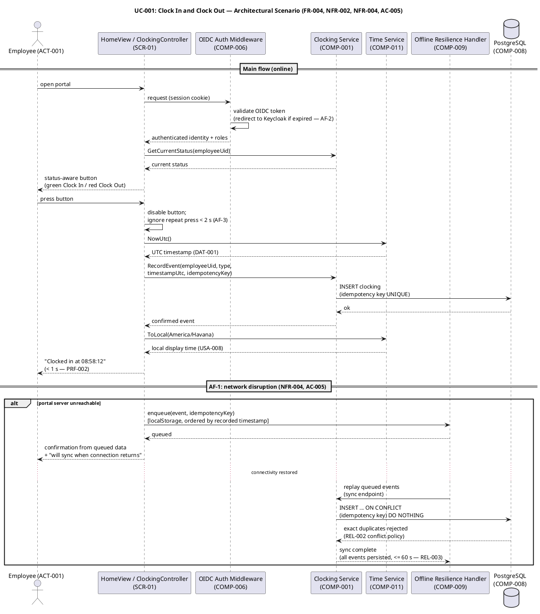
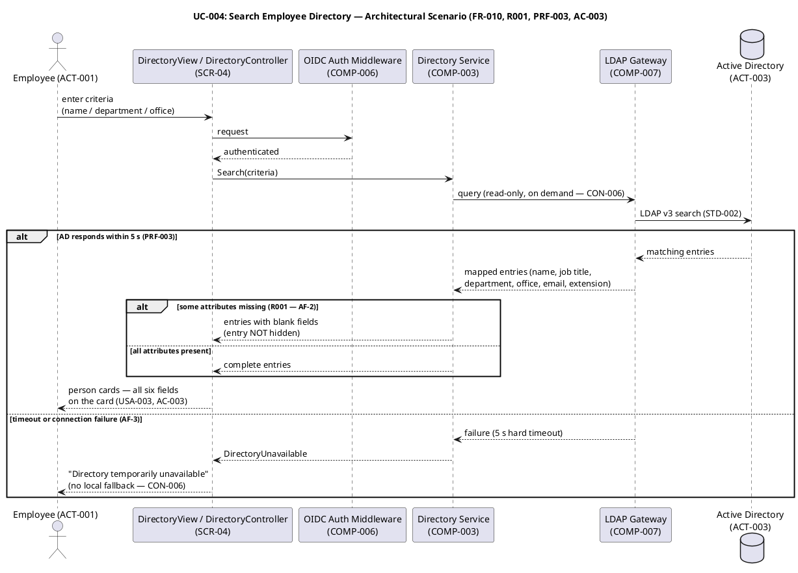
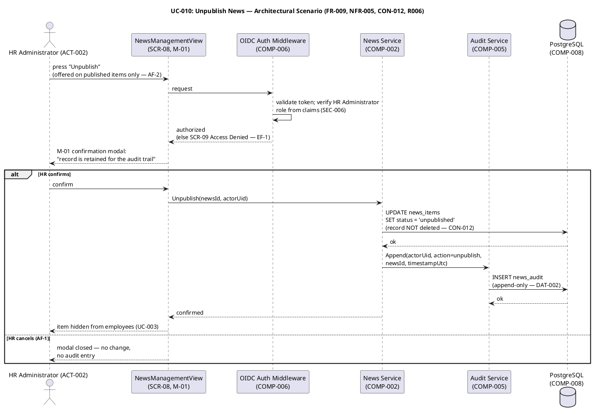
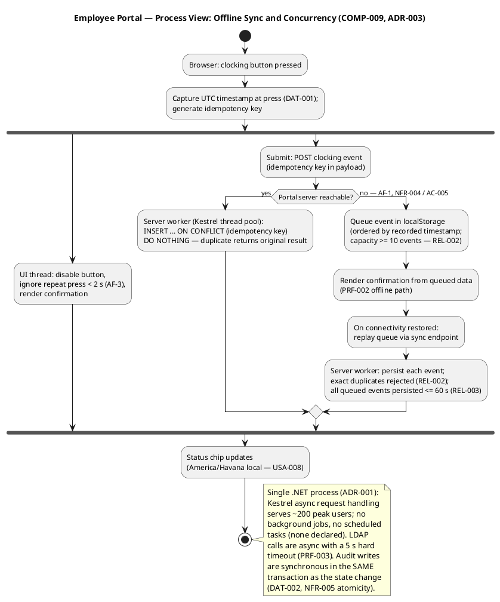
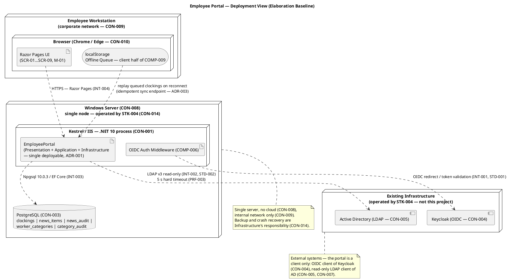
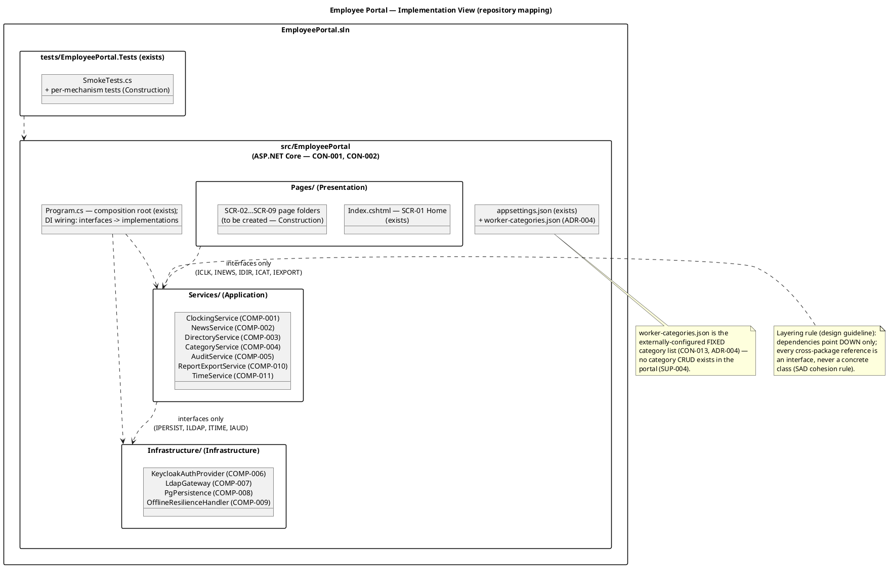

## Document Control
| Field | Value |
|---|---|
| Phase | Elaboration |
| Status | Draft — Elaboration Iter 2 (convergence cycle): SAD F1 and SAD F3 corrections applied; Architectural Proof-of-Concept artifact produced (SAD F2 record side); empirical validation executing this cycle |
| Milestone Target | End of Elaboration (LCA) — NOT achieved; re-presentation with evidence package pending |
| Iteration | 2 (Cycle 1) |
| Date | 2026-09-01 |
| Prior Version | Inception candidate (Approved at LCO — 0 findings) → Elaboration Iter 1 baseline (4+1 complete); EVOLVED, not recreated |
| Elaboration Changes (Iter 2) | **SAD F1 resolved:** §Quality PoC Plan rewritten to the EMPIRICAL disposition per the binding stakeholder decision ("The PoC is produced in Elaboration and validated empirically" — R001 disposable LDAP directory, R003 stub OIDC issuer, R004 direct); the superseded "trigger NOT fired / analysis-only / deferred to Construction" record is withdrawn; §External Dependencies re-scoped — R010 blocks production-instance integration only (Construction), does NOT block Elaboration exit, does NOT inherit R001's HIGH; LCA criterion 3 corrected to the empirical disposition. **R001 acceptance bar replaced:** the unsourced >90% statistical figure is DROPPED per stakeholder decision (Elab Iter 2) — the bar is now BEHAVIOURAL (every employee rendered; a missing attribute never removes someone from search results; never raises an error), confirmed for all four AD-reading UCs (UC-004/005/006/007). **SAD F3 resolved:** §Logical View component table and diagram reconciled with the Design Model's documented boundary reconciliations — COMP-001 no longer lists IAUD (NFR-005 scopes audit to news + category changes; clocking events immutable per DAT-001); COMP-010 resolves display data via IDIR (COMP-003, INT-008) instead of ILDAP. **Per-risk PoC dispositions recorded** via record_poc_decision (single-mechanism ×3). **Architectural Proof-of-Concept artifact produced** (DC-sanctioned, trigger FIRED) as the validation vehicle and LCA evidence-package core. Stack re-anchored against enterprise version policy — unchanged, PRESERVED (.NET 10 pin; Npgsql 10.0.3 latest stable, no policy pin) |
| Elaboration Changes (Iter 1, preserved) | Full 4+1 baseline established: Process, Implementation, and Use-Case views completed (were deferred in Inception); Logical View refined — COMP-010 Report Export Service and COMP-011 Time Service added (volatility gaps closed), authentication enforcement moved to the request boundary (middleware); timestamp convention incorporated (stakeholder decision, Elab Iter 1: store UTC, display America/Havana, export ISO-8601 with explicit offset, payroll day = local calendar day); ADR-004 added (worker category list = externally-configured JSON file, per UC-007 delegation); Data View refined (idempotency key, UTC storage, two-column worker_categories per CON-006) |
## Architectural Representation
This document is the **architectural baseline** for the Employee Portal — the Elaboration refinement of the Inception candidate. Per the 4+1 view model, every view is now represented by its primary diagram; prose supplements only what UML cannot express.

| View | Phase Coverage | Primary Diagram |
|---|---|---|
| Logical | **Baselined** — all subsystems, interfaces, layers | Component diagram (§ Logical View) |
| Process | **Baselined** — offline sync concurrency, request handling, audit atomicity | Activity diagram (§ Process View) |
| Deployment | **Baselined** — nodes, artifacts, external systems, client-side queue | Deployment diagram (§ Deployment View) |
| Implementation | **Baselined** — solution structure mapped to the actual repository | Package diagram (§ Implementation View) |
| Use-Case | **Baselined** — top 3 architecturally significant scenarios | 3 sequence diagrams (§ Use-Case View) |

**Diagram inventory (7):** component (Logical), activity (Process), deployment (Physical), package (Implementation), sequence ×3 (UC-001, UC-004, UC-010 — Use-Case view validation). Every view is exercised by at least one architecturally significant use-case scenario: UC-001 (clocking — offline resilience, idempotent persistence, time convention, OIDC), UC-004 (directory — LDAP, graceful degradation), UC-010 (unpublish — audit trail, soft delete). No view exists without a UC scenario exercising it.
## Architectural Goals and Constraints
### Declared Technology Stack (re-anchored, Elaboration Iter 1)

| Layer | Technology | Constraint | Version |
|---|---|---|---|
| Backend | .NET 10 with REST API | CON-001 | 10 (enterprise pin — unchanged) |
| Frontend | Razor Pages (server-rendered) | CON-002 | (framework-managed) |
| Database | PostgreSQL | CON-003 | (latest stable via Npgsql 10.0.3) |
| ORM | EF Core + Npgsql.EntityFrameworkCore.PostgreSQL | CON-001, CON-003 | 10.0.3 |
| Auth | Keycloak OIDC (existing, external) | CON-004 | (external — not our concern) |
| Directory | Active Directory over LDAP v3 | CON-005 | (external — read-only) |
| Hosting | Internal Windows Server (no cloud) | CON-008 | (Infrastructure-managed) |
| Access | Internal corporate network only | CON-009 | — |
| Browsers | Chrome, Edge (current versions) | CON-010 | — |

**Stack reconciliation (Elaboration Iter 1):** verified against the enterprise version policy and the NuGet registry — the .NET 10 framework pin is unchanged; Npgsql 10.0.3 is confirmed latest stable with no policy pin governing it; the EF Core PostgreSQL provider resolves to 10.0.3. No change from the Inception anchor — **PRESERVED**. R008 (PostgreSQL + .NET 10 compatibility) remains a build-time validation owned by the Implementer.

### Architectural Constraints (from Supplementary Specification)

| ID | Constraint | Impact on Architecture |
|---|---|---|
| DC-004 | Hosting: internal Windows Server, no cloud | Single-node deployment; no horizontal scaling needed for 200 users |
| DC-005 | Keycloak is external — OIDC client only | Auth is a thin adapter; no identity infrastructure in scope |
| DC-006 | AD data read on demand, no local copy | No sync job, no reconciliation, no stale-data risk; LDAP query is live |
| DC-007 | No write-back to AD | LDAP gateway is read-only by design |
| DC-009 | No hard delete of news items | Soft-delete pattern (status flag); records persist for audit |
| DC-010 | Worker category list is externally configured | Category list is a read-only lookup; no CRUD for categories in the portal (ADR-004 decides the mechanism) |

### Timestamp Convention (stakeholder decision — Elaboration Iter 1)

The stakeholder decided the clocking timestamp convention; it is an architectural constraint on every component that records, stores, displays, or exports a time. All 3 offices share the one timezone (stakeholder-confirmed).

| Facet | Decision | Architectural Owner |
|---|---|---|
| Storage | Every clocking timestamp stored in UTC | COMP-008 (schema), COMP-001 (write path) |
| Display | Office local timezone — **America/Havana** (IANA identifier, DST-aware); raw UTC or server time is never shown to users | COMP-011 Time Service (USA-008) |
| Export | ISO-8601 with explicit offset (YYYY-MM-DDThh:mm:ss±hh:mm; the offset in force at the event time per the IANA zone database) | COMP-010 Report Export Service (UC-006 column 5) |
| Payroll day | The local calendar day in America/Havana — never the server's; month boundaries for UC-006 computed in local time | COMP-010, COMP-011 |
| Capture | Timestamp fixed at the moment of the button press (DAT-001); queued events persist their recorded timestamp unchanged on sync | COMP-001, COMP-009 |

The convention is encapsulated in COMP-011 so that a future multi-zone reality changes one component, not the system.

### Quality Attribute Priorities (FURPS+)

| Attribute | Priority | Source | Architectural Tactic |
|---|---|---|---|
| Performance (page load <3s) | High | NFR-001, PRF-001 | Server-rendered Razor Pages (no SPA overhead); LDAP result caching with short TTL |
| Performance (clocking <1s) | High | NFR-002, PRF-002 | Idempotent clocking endpoint; offline queue for immediate user feedback (both paths < 1 s) |
| Reliability (offline tolerance) | High | NFR-004, AC-005, REL-002/003 | Client-side retry + server-side idempotent endpoint; local queue for clocking events |
| Security (OIDC auth) | High | CON-004, SEC-001/002/006 | Authentication enforced at the request boundary (middleware); role-based authorization from Keycloak claims |
| Auditability | High | NFR-005, AUD-001–004, DAT-002 | Cross-cutting audit service; every news operation and category change logged, append-only, atomic with the state change |
| Usability (10s directory lookup) | Medium | AC-003, USA-003 | LDAP query optimization (5 s hard timeout — PRF-003); graceful degradation for missing attributes (R001) |
| Availability (7:00–19:00 M–F) | Low | NFR-003, REL-001 | Single server sufficient; no HA needed for 200-user intranet |
| Data integrity (timestamp convention) | High | DAT-001, USA-008 | COMP-011 Time Service — single owner of UTC storage, America/Havana display, ISO-8601 offset export |
## Use-Case View
### Architecturally Significant Use Cases (Prioritized)

| Priority | UC | Name | Architectural Significance | Risk |
|---|---|---|---|---|
| 1 | UC-001 | Clock In and Clock Out | OIDC auth, time recording, offline tolerance (NFR-004), idempotent endpoint | R004 (SIGNIFICANT) |
| 2 | UC-004 | Search Employee Directory | LDAP integration, graceful degradation for missing attributes, query performance | R001 (HIGH), R005 (MODERATE) |
| 3 | UC-010 | Unpublish News | Soft-delete pattern, audit trail mechanism | R006 (MODERATE) |
| 4 | UC-008 | Publish News | Audit trail (author + timestamp), news lifecycle | R006 (MODERATE) |
| 5 | UC-007 | Assign Worker Category | AD user id → category persistence, audit trail for changes | R006 (MODERATE) |

**Sequencing rationale for Project Manager:** UC-001 is prioritized first because it exercises OIDC auth (R003), offline resilience (R004), PostgreSQL persistence, and the timestamp convention simultaneously — the highest-risk convergence point. UC-004 is second because R001 (LDAP attribute consistency) is the only HIGH-magnitude risk. UC-010 is third because it validates the audit trail mechanism and soft-delete pattern shared by all news operations. Elaboration test priority (per Test Evaluation Summary): UC-001, UC-004, UC-010.

### Volatility Analysis (Decompose by Change)

| Area of Change | Volatility | Encapsulated By | Rationale |
|---|---|---|---|
| Offline resilience strategy | High | COMP-009 Offline Resilience Handler | NFR-004/AC-005 mechanism; decided by ADR-003, thresholds quantified (REL-002/003) |
| LDAP query strategy | High | COMP-007 LDAP Gateway | R001: attribute availability varies across offices; query filters and fallback display may need adjustment |
| OIDC integration details | High | COMP-006 OIDC Auth Provider | R003: token validation, role-claim mapping may have Keycloak configuration nuances |
| Timestamp convention | Medium | COMP-011 Time Service | Stakeholder-decided (UTC / America/Havana / ISO-8601 offset); encapsulated so a future multi-zone reality changes one component |
| CSV export format | Medium | COMP-010 Report Export Service | UC-006 column set v1 is volatile — downstream payroll/records consumers may reshape it |
| Audit trail implementation | Medium | COMP-005 Audit Service | NFR-005 mechanism stable in intent; implementation detail may change |
| Category list source | Medium | COMP-004 Category Service + ADR-004 | CON-013: list is externally configured; mechanism DECIDED this iteration (ADR-004: JSON config file) |
| News lifecycle rules | Low | COMP-002 News Service | CON-012 (no hard delete) is stable; soft-delete + audit is a well-understood pattern |
| Clocking data model | Low | COMP-001 Clocking Service | Timestamp + employee id + in/out is a stable domain model |

**Elaboration refinement:** two volatility areas the Inception candidate left unencapsulated are now closed — the CSV export format (UC-006) is encapsulated by COMP-010, and the timestamp convention by COMP-011. The category list source (UC-007) is decided by ADR-004.

### Use-Case Realizations — Architecturally Significant Scenarios

The three scenarios below validate every 4+1 view: UC-001 exercises the offline resilience mechanism (COMP-009), idempotent persistence (COMP-008), the time convention (COMP-011), and OIDC auth (COMP-006); UC-004 exercises the LDAP gateway (COMP-007) and graceful degradation (R001); UC-010 exercises the audit mechanism (COMP-005) and soft-delete pattern (CON-012).

**UC-001 — Clock In and Clock Out (FR-004, NFR-002, NFR-004, AC-005):**

**UC-004 — Search Employee Directory (FR-010, R001, PRF-003, AC-003):**

**UC-010 — Unpublish News (FR-009, NFR-005, CON-012, R006):**

## Logical View
The baseline architecture is a **layered application** with **subsystem decomposition by area of change** — proportional to the declared scope: 200 users, single server, 10 FRs, 2 external integrations. No microservices, no message queues, no workflow engines (ADR-001).

### Layers

1. **Presentation Layer** (Razor Pages, CON-002): server-rendered pages for clocking, news browsing, directory search, and HR admin functions, plus the OIDC authentication middleware that guards every request. No SPA complexity.
2. **Application Layer** (.NET 10, CON-001): subsystem services implementing business logic. Each subsystem encapsulates one area of change.
3. **Infrastructure Layer**: adapters for external systems (Keycloak OIDC, AD LDAP, PostgreSQL) and cross-cutting mechanisms (offline resilience).

### Subsystem Decomposition (Elaboration baseline — 11 components; boundary reconciled with the Design Model, Elab Iter 2)

| Component | ID | Encapsulates | Interfaces | Dependencies |
|---|---|---|---|---|
| Clocking Service | COMP-001 | Clocking data model, time recording, idempotent endpoint | ICLK | IPERSIST, ITIME, COMP-009 |
| News Service | COMP-002 | News lifecycle (publish, edit, unpublish, browse), soft-delete | INEWS | IPERSIST, IAUD |
| Directory Service | COMP-003 | Directory search, LDAP query delegation, graceful degradation | IDIR | ILDAP |
| Category Service | COMP-004 | AD user id → category mapping, audit on change | ICAT | IPERSIST, IAUD |
| Audit Service | COMP-005 | Cross-cutting audit trail (who, what, when, before/after) | IAUD | IPERSIST |
| OIDC Auth Provider | COMP-006 | Token validation, role extraction from claims | IAUTH | Keycloak (external) |
| LDAP Gateway | COMP-007 | LDAP query construction, connection management, result mapping | ILDAP | AD (external) |
| PG Persistence | COMP-008 | Database access, EF Core / Npgsql, repository pattern | IPERSIST | PostgreSQL (external) |
| Offline Resilience Handler | COMP-009 | Client-side retry, local queue, sync-on-reconnect | (internal to COMP-001) | IPERSIST |
| Report Export Service | COMP-010 | CSV column set v1, ISO-8601 offset formatting, month boundaries in local time | IEXPORT | IPERSIST, IDIR (via COMP-003), ITIME |
| Time Service | COMP-011 | Timestamp convention: UTC storage, America/Havana display, offset export, payroll-day boundaries | ITIME | — |

**SAD–Design Model boundary reconciliation (Elab Iter 2 — closes SAD F3):** the Design Model documents two deliberate coupling reductions at subsystem boundaries; the SAD component table and diagram now agree with them:

1. **COMP-001 does NOT depend on IAUD.** NFR-005 scopes the mandatory audit trail to news operations (AUD-001…003) and worker category changes (AUD-004). Clocking events carry their own actor (the authenticated employee) and are immutable once recorded (DAT-001) — there is no state change to audit, so CLS-001 omits `IAuditService`. This is a coupling reduction, not a violation.
2. **COMP-010 does NOT depend on ILDAP.** The export resolves employee display data transitively via `IDirectoryService` (COMP-003, INT-008) — the same LDAP read path, one gateway, one graceful-degradation policy shared by UC-004/005/006/007. Direct ILDAP use by COMP-010 would duplicate the query path and the degradation policy.

### Elaboration refinements vs the Inception candidate

1. **COMP-010 Report Export Service (new, Iter 1)** — FR-002/UC-006 was never assigned to a component; the CSV column set is a declared Medium-volatility area (downstream payroll/records consumers may reshape it). Encapsulated so column changes do not ripple.
2. **COMP-011 Time Service (new, Iter 1)** — the stakeholder-decided timestamp convention (store UTC, display America/Havana, export ISO-8601 with explicit offset, payroll day = local calendar day) is an area of change designed to survive a future multi-zone reality; it is encapsulated in one component rather than scattered across every screen and service.
3. **Authentication enforcement moved to the request boundary (Iter 1)** — the OIDC middleware authenticates and authorizes at the request boundary; services receive the authenticated identity (claims) as a parameter. This removes per-service IAUTH coupling while keeping COMP-006 the single encapsulation of OIDC details (R003).

### Cohesion and Coupling Assessment

- **High cohesion:** each subsystem has a single clear purpose; each encapsulates exactly one area of change from the Volatility Analysis.
- **Low coupling:** all subsystem boundaries are defined by interfaces (ICLK, INEWS, IDIR, ICAT, IEXPORT, IAUD, ILDAP, IPERSIST, ITIME). No direct class-to-class dependencies across subsystem boundaries. Cross-cutting mechanisms (audit, time) are referenced via interfaces — correct for cross-cutting concerns, not a coupling violation.
- **No feature-named subsystems:** components encapsulate change areas (offline strategy, LDAP strategy, export format, time convention), not features.

```plantuml
@startuml
skinparam componentStyle rectangle
skinparam fontSize 11
title Employee Portal — Logical View (Elaboration Baseline, Iter 2 — boundary reconciliation applied)

package "Presentation Layer (Razor Pages — CON-002)" as PRES {
  component "Clocking Pages\n(SCR-01, SCR-02)" as CLK_P
  component "News Pages\n(SCR-03, SCR-07, SCR-08)" as NEWS_P
  component "Directory Pages\n(SCR-04)" as DIR_P
  component "HR Admin Pages\n(SCR-05, SCR-06)" as HR_P
  component "OIDC Auth Middleware" as MW
}

package "Application Layer (.NET 10 — CON-001)" as APP {
  component "Clocking Service\n(COMP-001)" as CLK_S
  component "News Service\n(COMP-002)" as NEWS_S
  component "Directory Service\n(COMP-003)" as DIR_S
  component "Category Service\n(COMP-004)" as CAT_S
  component "Audit Service\n(COMP-005)" as AUD_S
  component "Report Export Service\n(COMP-010)" as EXP_S
  component "Time Service\n(COMP-011)" as TIME_S
}

package "Infrastructure Layer" as INFRA {
  component "OIDC Auth Provider\n(COMP-006)" as AUTH
  component "LDAP Gateway\n(COMP-007)" as LDAP_GW
  component "PG Persistence\n(COMP-008)" as PG_P
  component "Offline Resilience Handler\n(COMP-009)" as OFFLINE
}

interface "IClockingService" as ICLK
interface "INewsService" as INEWS
interface "IDirectoryService" as IDIR
interface "ICategoryService" as ICAT
interface "IReportExport" as IEXPORT
interface "IAuditService" as IAUD
interface "IAuthProvider" as IAUTH
interface "ILdapGateway" as ILDAP
interface "IPersistence" as IPERSIST
interface "ITimeConvention" as ITIME

MW ..> IAUTH
CLK_P ..> ICLK
NEWS_P ..> INEWS
DIR_P ..> IDIR
HR_P ..> ICLK
HR_P ..> ICAT
HR_P ..> IEXPORT

CLK_S ..|> ICLK
NEWS_S ..|> INEWS
DIR_S ..|> IDIR
CAT_S ..|> ICAT
EXP_S ..|> IEXPORT
AUD_S ..|> IAUD
TIME_S ..|> ITIME

AUTH ..|> IAUTH
LDAP_GW ..|> ILDAP
PG_P ..|> IPERSIST

CLK_S ..> IPERSIST
NEWS_S ..> IPERSIST
CAT_S ..> IPERSIST
AUD_S ..> IPERSIST
EXP_S ..> IPERSIST
DIR_S ..> ILDAP
EXP_S ..> IDIR

NEWS_S ..> IAUD
CAT_S ..> IAUD

CLK_S ..> ITIME
EXP_S ..> ITIME
CLK_P ..> ITIME

CLK_S ..> OFFLINE
OFFLINE ..> IPERSIST

database "PostgreSQL (CON-003)" as PG <<external>>
component "Keycloak OIDC (CON-004)" as KC <<external>>
component "Active Directory LDAP (CON-005)" as AD <<external>>

PG_P ..> PG
AUTH ..> KC
LDAP_GW ..> AD

note right of TIME_S
  Encapsulates: timestamp convention
  (stakeholder decision, Elab Iter 1).
  Store UTC; display America/Havana
  (IANA, DST-aware); export ISO-8601
  with explicit offset; payroll day =
  local calendar day.
  Volatility: Medium
end note

note right of EXP_S
  Encapsulates: CSV column set v1
  (UC-006, Medium volatility).
  Resolves employee display data via
  IDIR (COMP-003) — INT-008.
  Aborts on AD unavailable (UC-006 AF-2).
end note

note right of OFFLINE
  Browser localStorage queue
  + idempotent sync endpoint
  (ADR-003). Volatility: High
end note

note bottom of AUTH
  Authentication enforced at request
  boundary (middleware); services
  receive authenticated identity
  (claims) - no per-service IAUTH calls.
end note

note bottom of CLK_S
  SAD-Design Model boundary
  reconciliation (Elab Iter 2, SAD F3):
  COMP-001 does NOT call IAUD —
  NFR-005 scopes audit to news
  operations (AUD-001..003) and
  category changes (AUD-004);
  clocking events carry their own
  actor and are immutable (DAT-001).
end note
@enduml
```

## Process View
The Employee Portal is a single-process web application for ~200 peak users. Concurrency is handled by .NET 10's async request pipeline; no background jobs or scheduled tasks exist (none declared). The architecturally significant runtime behavior is the **offline sync mechanism** (COMP-009, ADR-003) — the only place where control flow forks between user feedback and persistence — and the **audit atomicity rule** (DAT-002): every audit write is committed in the same database transaction as the state change it records, so no state change can exist without its trail entry.

**Process-view decisions:**
- **Single process, thread-pool concurrency** — no custom threads, no synchronization primitives beyond the database's own constraints. The idempotency key is a UNIQUE constraint in PostgreSQL, which is the synchronization point for duplicate suppression (REL-002 conflict policy) — not application-level locking.
- **Client-side queue is ordered by recorded timestamp, not arrival order** (REL-002) — replay preserves the employee's actual event sequence.
- **Audit atomicity** — COMP-005 writes are in-transaction with the caller's state change; a failed audit write rolls back the state change. This is the architectural guarantee behind NFR-005's "mandatory" traceability.
- **Fault tolerance scope** — the "network drop" (NFR-004) is between browser and portal server on the corporate LAN; the portal server itself is Infrastructure's responsibility (CON-014). The mechanism tolerates client-side drops only; server crash recovery is out of scope.
## Deployment View
The deployment is a **single-node topology** on an internal Windows Server — proportional to the declared scope: 200 users, 3 offices, no cloud, no external access. No load balancers, no clusters, no container orchestration.

### External Dependencies (R010 — Infrastructure Team; re-scoped per stakeholder decision, Elab Iter 2)

| Dependency | Provider | Needed By | Blocks |
|---|---|---|---|
| LDAP read access to AD (service account) | STK-004 (Infra) | COMP-007, UC-004, UC-005, UC-006, UC-007 | **Production-instance integration only (Construction)** — does NOT block Elaboration: R001 validates against the disposable LDAP directory |
| Keycloak client registration | STK-004 (Infra) | COMP-006, all UCs | **Production-instance integration only (Construction)** — does NOT block Elaboration: R003 validates against the stub OIDC issuer |
| Windows Server provisioning | STK-004 (Infra) | Deployment | Construction deployment |

Per the stakeholder decision (Elab Iter 1): what STK-004 genuinely blocks is integration with the specific production instances — a separate, smaller risk (R010, SIGNIFICANT) that does **NOT** inherit R001's HIGH and does not condition Elaboration exit on another team's ticket. The Project Manager owns the engagement; delivery aligns to early Construction integration testing. The residual risk that the validation fixtures differ from the production instances is R011 (validation-environment fidelity), retired at Construction integration; the disposable directory and stub issuer are retained as reusable test fixtures.

**Elaboration refinement vs the Inception candidate:** the browser node explicitly carries the **localStorage offline queue** (client half of COMP-009) — the deployment consequence of ADR-003 is that part of the system's state lives on the employee workstation, which is why the sync endpoint and idempotency key exist. The server node shows the single deployable process (ADR-001) with the auth middleware at its boundary.
## Implementation View
The subsystem decomposition maps to the **actual repository structure** (verified against the repo tree this iteration): a single solution `EmployeePortal.sln` with one application project `src/EmployeePortal` and one test project `tests/EmployeePortal.Tests`. The 11 components are **logical packages inside the single deployable** (ADR-001) — not separate projects, which would be over-engineering for this scale.

**Implementation-view decisions:**
- **Single project, logical packages** — `Pages/`, `Services/`, `Infrastructure/` map 1:1 to the three layers. The Implementer creates the `Services/` and `Infrastructure/` folders; `Pages/` already exists with SCR-01 (Index.cshtml).
- **Composition root** — `Program.cs` (exists) wires interfaces to implementations via .NET DI. No service locator, no manual construction.
- **Configuration** — `appsettings.json` (exists) carries connection strings and Keycloak client settings; `worker-categories.json` (ADR-004) carries the fixed category list, editable by Infrastructure/HR without a code deployment (SUP-004).
- **CI** — `.github/workflows/ci.yml` and `deploy.yml` exist (ConfigurationManager); the build gates every push to main.
- **Design guideline for the Implementer:** dependencies point DOWN only (Pages → Services → Infrastructure); every cross-package reference is an interface, never a concrete class.
## Data View
### Portal Database Schema (PostgreSQL — CON-003)

The portal database stores **only** what is not in Active Directory. Per CON-006, no employee data is copied — the portal stores only `AD user id → worker category` (two columns) plus operational data (clockings, news, audit entries).

| Table | Purpose | Key Columns | Source |
|---|---|---|---|
| clockings | Clock in/out events | id, employee_uid, event_type (in/out), **timestamp_utc**, **idempotency_key (UNIQUE)** | FR-004, FR-005, DAT-001, REL-002 |
| news_items | News articles with lifecycle | id, title, body, category, is_featured, status (published/unpublished), created_by, created_at | FR-006, FR-008, FR-009, CON-012 |
| news_audit | Audit trail for news operations | id, news_id, action (publish/edit/unpublish), actor_uid, timestamp_utc, snapshot | NFR-005, AUD-001–003, DAT-002 |
| worker_categories | AD user id → category mapping | **employee_uid, category** (two columns only), assigned_by, assigned_at | FR-003, CON-006 |
| category_audit | Audit trail for category changes | id, employee_uid, old_category, new_category, actor_uid, timestamp_utc | NFR-005, AUD-004 |

**Elaboration refinements vs the Inception candidate:**
1. **`timestamp_utc`** — every clocking timestamp is stored in UTC (stakeholder decision, Elab Iter 1). Display conversion to America/Havana happens at render time via COMP-011; export conversion to ISO-8601 with explicit offset happens in COMP-010. The stored value is never a local time.
2. **`idempotency_key (UNIQUE)`** — the physical enforcement of the REL-002 conflict policy: an exact duplicate submission (same key) is rejected by the database constraint, never duplicated. This is the synchronization point for the offline sync mechanism (ADR-003).
3. **`worker_categories` is two data columns** — `employee_uid` + `category` (plus audit metadata `assigned_by`/`assigned_at`). CON-006's "two columns" constraint governs the employee data stored; the audit columns exist because NFR-005 mandates auditing every category change. No other employee attribute is stored.
4. **Audit tables are append-only** (DAT-002) — no portal function updates or deletes an audit row; the schema grants no UPDATE/DELETE path on `news_audit` / `category_audit`.

**Note:** `employee_uid` in all tables references the AD user id. No employee name, title, department, or other AD attribute is stored in the portal database. Directory data is always read live from AD via LDAP (COMP-007); HR views (UC-005/006/007) resolve display names on demand (CON-005, CON-006).
## Size and Performance
| Metric | Target | Source | Architectural Tactic |
|---|---|---|---|
| Page load | < 3 s (95th percentile, working-hours load) | NFR-001, PRF-001 | Server-rendered Razor Pages; LDAP result caching (60 s TTL); no SPA bundle |
| Clocking operation | < 1 s from button press — on BOTH the online and offline-queued paths | NFR-002, PRF-002 | Idempotent endpoint; offline queue renders confirmation from queued data |
| Directory search | LDAP query hard timeout 5 s; end-to-end ≤ 10 s including typing | AC-003, PRF-003 | LDAP query optimization; result caching; graceful degradation for missing attributes |
| Offline sync | All queued events persisted ≤ 60 s after connectivity restored | AC-005, REL-003 | Replay via sync endpoint; idempotency key rejects duplicates |
| Concurrent users | ~200 peak | Scope (200 employees) | .NET 10 async request handling; single server sufficient |
| Data volume | Low (~100K clocking rows/year: 200 employees × ~2 events/day × 250 workdays) | Derived | PostgreSQL handles this trivially; no sharding or partitioning |

**Sizing note (two clocks, never summed):** the Inception phase cost 28 minutes of agent time and 1,347,939 tokens across 11 agent runs (recorded actuals). No Elaboration actuals exist yet — this iteration is the first. The Elaboration architecture work (this SAD baseline) is sized by the token budget of this iteration, recorded by the Project Manager in the next Iteration Assessment. No person-week figures are produced by this system.
## Quality
### PoC Plan — Risk Retirement Dispositions (EMPIRICAL — corrected per stakeholder decision, Elab Iter 2)

**Correction (Elaboration Iteration 2 — supersedes the Iter 1 record; closes SAD F1):** the Iter 1 version of this section stated the Development Case oracle reported the Architectural Proof-of-Concept trigger NOT fired, and retired R001/R003/R004 as "Analysis-only + designed mechanism" with empirical validation deferred to Construction, blocked on R010. That record was superseded twice over: the stakeholder decided — binding — "The PoC is produced in Elaboration and validated empirically" (R001 via a disposable LDAP directory, R003 via a stub OIDC issuer, R004 direct), and the corrected Development Case records the trigger **FIRED**. The per-risk dispositions are now recorded via `record_poc_decision` (mode: **single-mechanism** for R001/R003/R004 — the real evolutionary mechanism built in `src/`); the **Architectural Proof-of-Concept artifact** (DC-sanctioned, Architect-owned) is the validation vehicle and the core of the LCA evidence package.

| Risk | Magnitude | Retirement Mode | Mechanism (evolutionary production code in src/) | Validation Vehicle | Acceptance Criteria |
|---|---|---|---|---|---|
| R001 — LDAP attribute consistency | HIGH (P=3, I=3) | **single-mechanism — EMPIRICAL, this phase** | COMP-007 LDAP Gateway (CLS-009): graceful degradation — a missing attribute renders blank, the entry is NOT hidden | **Disposable LDAP directory** (NOT the production AD — no STK-004 dependency); attribute gaps seeded DELIBERATELY across the 3 offices | **Behavioural bar** (stakeholder decision, Elab Iter 2 — the unsourced >90% statistical figure is DROPPED): (1) every employee is rendered whether or not their attributes are complete; (2) a missing attribute never removes someone from search results; (3) a missing attribute never raises an error. Confirmed for all four AD-reading UCs: UC-004 person card (blank fields), UC-005 event row (blank display fields), UC-006 CSV row (blank cells, no abort), UC-007 employee locatable and selectable |
| R003 — OIDC integration | SIGNIFICANT (P=2, I=3) | **single-mechanism — EMPIRICAL, this phase** | COMP-006 OIDC Auth Provider (CLS-010): token validation, role extraction from claims — nothing more (CON-004) | **Stub OIDC issuer** (signed tokens + JWKS; no real Keycloak realm — Keycloak is authentication only, not a directory to query) | Redirect flow completes; signed token validated via the issuer's JWKS; Employee and HR Administrator roles extracted from claims (SEC-006); expired/invalid tokens rejected at the request boundary |
| R004 — Offline fault tolerance | SIGNIFICANT (P=2, I=3) | **single-mechanism — EMPIRICAL, this phase** | COMP-009 Offline Resilience Handler (CLS-008): localStorage queue + idempotent sync endpoint (ADR-003) | **Direct 5-minute network-drop simulation** (AC-005) — nothing blocks it | Confirmation < 1 s on both paths (PRF-002); zero duplicates (UNIQUE idempotency_key — REL-002); zero losses; all queued events persisted ≤ 60 s after restore (REL-003) |
| R005 — LDAP query performance | MODERATE | Monitor (unchanged) | 5 s hard timeout (PRF-003); 60 s TTL result cache held in reserve | Measured during R001 validation | Typical search end-to-end ≤ 10 s (AC-003); if exceeded, enable cache and re-test |
| R006 — Audit trail completeness | MODERATE | Analysis-only + designed mechanism (unchanged) | COMP-005 Audit Service: append-only (DAT-002), atomic with the state change | Integration test on UC-007/008/009/010 flows | Every publish/edit/unpublish/category change writes actor + timestamp; category changes record old + new value; no audit row is ever updated or deleted |
| R008 — PostgreSQL + .NET 10 compatibility | MODERATE | Build-time validation (unchanged) | COMP-008 PG Persistence (Npgsql 10.0.3 + EF Core) | Implementer CRUD + migration test | CRUD test against PostgreSQL succeeds; EF Core migrations run without errors |

**Rationale (empirical dispositions — stakeholder decision, Elab Iter 1):** R001 is not "how many attributes are missing" — that is a property of the real directory that nobody can know until STK-004 delivers, and a percentage measured against a directory we seed ourselves measures our own test data, so it proves nothing. The architectural risk is what the portal DOES when an attribute is absent — hence the bar is behavioural and the gaps are seeded deliberately in the disposable directory. R003 is proven against a stub issuer because wiring AD into Keycloak is infrastructure work outside this project's boundary; what the PoC must prove is that the portal consumes and validates an OIDC token correctly and extracts roles from claims. R004 is direct — nothing blocks it. What STK-004 genuinely blocks is integration with the specific production instances: a separate, smaller risk (R010) that does NOT inherit R001's HIGH, does not condition Elaboration exit on another team's ticket, and goes to Construction; its residual is R011 (validation-environment fidelity). The statistical measurement of the real AD's data quality belongs to Construction integration testing with R010 delivery — it is excluded from the LCA evidence package.

The mechanisms are **EVOLUTIONARY**: production code in `src/` that becomes the Construction baseline — never throwaway samples. The disposable directory and stub issuer are retained as reusable Construction test fixtures (R011).

### Architecture Decision Records

**ADR-001: Architectural Style — Layered Monolith** *(preserved from Inception; unchanged)*
- **Context:** internal web app, 200 users, single Windows Server; .NET 10 + Razor Pages declared (CON-001/002); no cloud (CON-008), internal only (CON-009).
- **Decision:** layered monolith — Presentation (Razor Pages + auth middleware), Application (subsystem services), Infrastructure (external adapters); single process, single deployable.
- **Alternatives:** microservices (rejected — zero benefit at this scale, pure operational overhead); hexagonal (partially adopted — interface-based subsystem boundaries follow ports-and-adapters for external systems, overall style stays layered).
- **Consequences:** simple deployment and debugging; decomposition needed only if scope grows far beyond declaration (YAGNI).

**ADR-002: Persistence — PostgreSQL with EF Core / Npgsql 10.0.3** *(preserved; version re-confirmed)*
- **Context:** CON-003 declares PostgreSQL; portal stores clockings, news, category mappings, audit entries; no employee data (CON-006).
- **Decision:** PostgreSQL via Npgsql 10.0.3 (latest stable, no policy pin — verified against registry and enterprise policy) + EF Core; repository pattern behind `IPersistence` (COMP-008).
- **Alternatives:** Dapper (rejected — EF Core migrations and change tracking reduce boilerplate; revisit only if profiling shows overhead); raw Npgsql (rejected — boilerplate for CRUD-heavy scope).
- **Consequences:** R008 validated at build time by the Implementer; fallback to Dapper if incompatibility appears.

**ADR-003: Offline Resilience — Client-Side Queue + Server-Side Idempotency** *(preserved; thresholds quantified)*
- **Context:** NFR-004/AC-005 require tolerating 5-minute network drops with sync on restore; the drop is between browser and portal server on the corporate LAN. Stakeholder confirmed the mechanism is architectural and in scope.
- **Decision:** (1) clocking button submits with a client-generated idempotency key; (2) on network failure the browser queues the event in localStorage (ordered by recorded timestamp, capacity ≥ 10 events — REL-002) and shows immediate confirmation from queued data; (3) on reconnect the queue replays via a sync endpoint; (4) the server persists with `ON CONFLICT (idempotency_key) DO NOTHING` — exact duplicates rejected, never duplicated; all events persisted ≤ 60 s after restore (REL-003).
- **Alternatives:** Service Worker + Background Sync (rejected — different paradigm for a server-rendered intranet app); full offline-first PWA (rejected — scope is 5-minute tolerance, not indefinite offline); server-side queue only (rejected — user needs < 1 s feedback, NFR-002).
- **Consequences:** if the browser is closed during a drop, queued events are lost — acceptable within the declared 5-minute working-hours window; validation is the direct AC-005 drop simulation (R004, this phase).

**ADR-004: Worker Category List Source — Externally-Configured JSON File** *(preserved from Elab Iter 1; unchanged)*
- **Context:** CON-013 — the category list is fixed and configured outside the application; no create/edit/rename/delete in the portal UI. SUP-004 — list changes must not require code deployment. The Use-Case Model delegates the mechanism choice to the Software Architect.
- **Decision:** the fixed category list lives in `worker-categories.json`, deployed alongside the application and read by COMP-004 at startup. Editing the file changes the list — no code deployment, no portal UI.
- **Alternatives:** (1) database table — rejected: invites CRUD management, which CON-013 forbids, and adds a migration per list change; (2) a section inside `appsettings.json` — rejected: mixes a business list into sensitive operational config; (3) environment variable — rejected: a list does not fit env-var shape and is invisible to non-technical editors.
- **Consequences:** COMP-004 reads the list from the file; the file is deployment configuration, not code; the Implementation View places it beside `appsettings.json`.

### LCA Review — Milestone Assessment (updated Elaboration Iter 2)

The Lifecycle Architecture Milestone is **NOT achieved** — the Iter 1 review (all lenses) returned NO-GO: sanction REFUSED by the stakeholder, with the binding directive to fix ALL findings including Minors before phase transition. This convergence cycle (Elaboration Iteration 2) closes the findings and re-presents LCA with the evidence package. Assessment against the six criteria:

| # | Criterion | Status | Evidence |
|---|---|---|---|
| 1 | Vision of the product stable | **YES** | All 10 UCs fully specified; stakeholder decisions incorporated with markers retired in place (offline mechanism, timestamp convention, America/Havana, R001 behavioural bar) |
| 2 | Architecture stable | **YES (baseline) — record corrections applied this iteration** | 4+1 views complete (7 diagrams); 11 components; interfaces at every boundary; 4 ADRs; stack re-anchored (unchanged). The Iter 1 review confirmed the baseline structurally sound; the open defects were record defects (superseded PoC disposition — corrected this iteration) and absent code evidence (convergence-cycle work), not structural flaws |
| 3 | Executable prototype shows major risks addressed | **IN PROGRESS — empirical validation executing this phase** | The Development Case FIRED the Architectural Proof-of-Concept trigger; the PoC is produced in Elaboration and validated empirically (stakeholder decision: "I will not accept an LCA that validates a HIGH architectural risk on paper only"). Vehicles: disposable LDAP directory (R001), stub OIDC issuer (R003), direct drop simulation (R004). Mechanism code delivery (Implementer, actions A-2…A-4) and TC-001…TC-020 execution are this cycle's remaining work; empirical results land in the Architectural Proof-of-Concept artifact. **Not yet met as of this writing** — no mechanism code in SCM (`iteration/E1` skeleton only, verified 2026-09-01) |
| 4 | Construction plan sufficiently detailed | **YES** | Iteration Plan assigns all 10 UCs to Construction iterations (UC IDs verified against Use-Case Model authority); mechanisms and interfaces ready for Designer/Implementer refinement |
| 5 | All stakeholders agree vision achievable | **REFUSED this cycle — re-presentation pending** | Stakeholder refused sanction at the Iter 1 LCA review; a fresh sanction request follows the convergence cycle with the evidence package and an empty findings ledger |
| 6 | Actual vs planned expenditure acceptable | **ON TRACK** | Inception actuals recorded (28 min agent time, 1,347,939 tokens, 11 runs); Elaboration actuals recorded at iteration assessment |

**Open architecture issues:** (1) R010 — STK-004 deliverables (LDAP service account, Keycloak client registration, Windows Server provisioning) block production-instance integration in Construction only; they do NOT block Elaboration exit and do not inherit R001's HIGH. (2) R011 — validation-environment fidelity: the disposable directory and stub issuer may differ from the production instances; the residual retires at Construction integration (R010 delivery); both fixtures are retained as reusable test assets. (3) The three mechanism validations execute this convergence cycle — their results may refine COMP-006/007/009 without changing the baseline's structure.
## ADRs

### ADR-001: Architectural Style — Layered Monolith

| Field | Value |
|---|---|
| Context | The Employee Portal is an internal web application for 200 users on a single Windows Server. The stakeholder declared .NET 10 with REST API (CON-001) and Razor Pages (CON-002). No cloud (CON-008), no external access (CON-009). |
| Decision | Adopt a **layered monolithic architecture** with three layers: Presentation (Razor Pages), Application (subsystem services), Infrastructure (external system adapters). The application is deployed as a single process on a single server. |
| Alternatives Considered | 1. **Microservices** — rejected: 200 users, single server, 10 FRs do not justify distributed systems complexity. Would introduce network calls, service discovery, and operational overhead with zero benefit at this scale. 2. **Hexagonal (Ports & Adapters)** — partially adopted: the interface-based subsystem boundaries (ICLK, INEWS, etc.) follow the ports-and-adapters principle for external system integration, but the overall style is layered for simplicity. |
| Trade-offs | **Pro:** Simple deployment, simple debugging, no distributed-systems complexity, easy to understand for a small team. **Con:** Cannot scale horizontally (not needed); subsystems share a process (acceptable for 200 users). |
| Consequences | If the system grows beyond declared scope (e.g., 10x users, new integrations), the monolith would need decomposition. This is acceptable — YAGNI for the declared scope. |

### ADR-002: Persistence — PostgreSQL with EF Core / Npgsql

| Field | Value |
|---|---|
| Context | CON-003 declares PostgreSQL as the database. The portal stores clockings, news items, worker category mappings, and audit entries. No employee data is stored (CON-006). |
| Decision | Use **PostgreSQL** accessed via **Npgsql 10.0.3** (latest stable, no policy pin) and **EF Core** as the ORM. Implement a repository pattern behind the `IPersistence` interface (COMP-008) to abstract data access. |
| Alternatives Considered | 1. **Dapper (micro-ORM)** — rejected for Inception candidate: EF Core provides change tracking and migration tooling that reduces boilerplate for a team of this size. Can be reconsidered if performance profiling shows EF Core overhead. 2. **Raw Npgsql** — rejected: too much boilerplate for the CRUD-heavy operations in this system. |
| Trade-offs | **Pro:** EF Core migrations, change tracking, LINQ queries reduce code volume. Npgsql 10.0.3 is the latest stable driver for .NET 10. **Con:** EF Core adds a learning curve and potential performance overhead for complex queries (not expected here — all queries are simple). |
| Consequences | R008 (PostgreSQL + .NET 10 compatibility) must be validated in Elaboration by running a basic CRUD test. If incompatibility is found, fall back to Dapper + raw Npgsql. |

### ADR-003: Offline Resilience — Client-Side Retry + Server-Side Idempotency

| Field | Value |
|---|---|
| Context | NFR-004 and AC-005 require the system to tolerate 5-minute network disruptions and sync data once connectivity is restored. The portal is a server-rendered Razor Pages web app on a single server — the "network drop" scenario is between the client browser and the portal server within the corporate network. The stakeholder confirmed this is an architectural concern, not a scope decision. |
| Decision | Implement a **client-side retry with server-side idempotent endpoint** pattern: (1) The clocking button submits via AJAX with a client-generated idempotency key. (2) If the network is down, the browser queues the request locally (localStorage) and shows immediate confirmation from the queued data. (3) When connectivity returns, the queued request is replayed. (4) The server endpoint is idempotent — a duplicate submission with the same idempotency key returns the original response instead of creating a duplicate record. |
| Alternatives Considered | 1. **Service Worker + Background Sync API** — more robust offline support, but adds complexity and browser compatibility concerns for a corporate intranet. Razor Pages (CON-002) is server-rendered; a service worker is a different paradigm. 2. **Full offline-first PWA** — rejected: the scope is "tolerate 5-minute drops," not "work offline indefinitely." A PWA would be over-engineering. 3. **Server-side queue only** — rejected: the user needs immediate feedback (NFR-002: <1s response), so the queue must be client-side. |
| Trade-offs | **Pro:** Simple, proportional to the 5-minute tolerance requirement. No service worker complexity. Immediate user feedback. **Con:** localStorage has size limits (sufficient for a few clocking events). If the browser is closed during a network drop, queued events are lost — acceptable for a 5-minute window during working hours. |
| Consequences | R004 (offline fault tolerance) must be validated in Elaboration with a PoC: simulate a 5-minute network drop, queue a clocking, reconnect, and verify sync without duplicates. The idempotency key mechanism must be designed in detail by the Designer. |

## Traceability
| Element | Traces From | Link Type | Traces To |
|---|---|---|---|
| COMP-001 (Clocking Service) | UC-001, FR-004, FR-005, DAT-001 | Derives | COMP-008, COMP-009, COMP-011 |
| COMP-002 (News Service) | UC-003, UC-008, UC-009, UC-010, FR-006, FR-007, FR-008, FR-009, CON-012 | Derives | COMP-008, COMP-005 |
| COMP-003 (Directory Service) | UC-004, FR-010, R001 | Derives | COMP-007 |
| COMP-004 (Category Service) | UC-007, FR-003, CON-006, CON-013 | Derives | COMP-008, COMP-005, ADR-004 |
| COMP-005 (Audit Service) | NFR-005, AUD-001–004, DAT-002 | Derives | COMP-008 |
| COMP-006 (OIDC Auth Provider) | CON-004, SEC-001, SEC-002, SEC-006, R003 | Derives | Keycloak (external); stub OIDC issuer (Elab Iter 2 validation fixture) |
| COMP-007 (LDAP Gateway) | CON-005, CON-006, CON-007, R001, R005, PRF-003 | Derives | Active Directory (external); disposable LDAP directory (Elab Iter 2 validation fixture) |
| COMP-008 (PG Persistence) | CON-003, DC-003, R008 | Derives | PostgreSQL (external) |
| COMP-009 (Offline Resilience Handler) | NFR-004, AC-005, REL-002, REL-003, R004 | Derives | COMP-008, COMP-001 |
| COMP-010 (Report Export Service) | UC-006, FR-002, INT-005, STD-003 | Derives | COMP-008, COMP-003 (via IDIR — INT-008), COMP-011 |
| COMP-011 (Time Service) | DAT-001, USA-008 + stakeholder decisions (Elab Iter 1): store UTC, display America/Havana, export ISO-8601 with explicit offset, payroll day = local calendar day | Derives | COMP-001, COMP-010, Presentation Layer |
| ADR-001 (Layered Monolith) | CON-001, CON-002, CON-008, CON-009 | Refines | All COMP-* |
| ADR-002 (PostgreSQL / EF Core / Npgsql 10.0.3) | CON-003, R008, enterprise version policy (re-anchored Elab Iter 1; unchanged Iter 2) | Refines | COMP-008 |
| ADR-003 (Offline Resilience) | NFR-004, AC-005, REL-002, REL-003, R004 | Refines | COMP-009, COMP-001 |
| ADR-004 (Category List JSON File) | CON-013, SUP-004, UC-007 (delegation) | Refines | COMP-004, Implementation View (worker-categories.json) |
| Deployment Topology | CON-008, CON-009, CON-010, CON-014, R010 | Refines | All COMP-*; STK-004 deliverables (production-instance integration, Construction only) |
| Data View (schema) | CON-006, FR-003, FR-004, FR-006, NFR-005, DAT-001, DAT-002, REL-002 | Derives | COMP-008 |
| Process View (offline sync, audit atomicity) | NFR-004, AC-005, REL-002, REL-003, DAT-002, PRF-002, PRF-003 | Derives | COMP-009, COMP-005, COMP-001 |
| Implementation View (repo mapping) | CON-001, CON-002, ADR-001, ADR-004 | Refines | src/EmployeePortal (Pages/, Services/, Infrastructure/), tests/EmployeePortal.Tests |
| Use-Case View (3 sequence diagrams) | UC-001, UC-004, UC-010 | Realizes | All 4+1 views (validation scenarios) |
| Timestamp Convention (§ Goals and Constraints) | DAT-001, USA-008 + stakeholder decisions (Elab Iter 1) | Authorizes | COMP-011, COMP-010, UC-006 event_timestamp column |
| PoC Plan (risk dispositions — EMPIRICAL, Elab Iter 2) | R001, R003, R004, R005, R006, R008, R010, R011 + stakeholder decisions (Elab Iter 1: "The PoC is produced in Elaboration and validated empirically"; Elab Iter 2: R001 behavioural bar, >90% figure dropped) | Mitigates | Architectural Proof-of-Concept artifact (validation vehicle, LCA evidence package); COMP-006, COMP-007, COMP-009, COMP-005, COMP-008; Construction integration testing (R010 delivery; R011 residual) |
| R001 behavioural bar (§ Quality PoC Plan) | Stakeholder decision (Elab Iter 2): every employee rendered; missing attribute never removes from search; never raises an error — confirmed for UC-004/005/006/007 | Authorizes | COMP-007 graceful degradation; UC-004 AF-2, UC-005, UC-006, UC-007 derived clauses; disposable-directory validation |
| SAD–Design Model boundary reconciliation (§ Logical View) | Design Model § SAD Boundary Reconciliations (COMP-001 IAUD omission; COMP-010 ILDAP via IDirectoryService); NFR-005 scope (AUD-001…004); DAT-001; INT-008 | Refines | COMP-001, COMP-010, COMP-003 (single LDAP read path shared by UC-004/005/006/007) |
| LCA Review (§ Quality) | LCA milestone criteria (RUP); Iter 1 review verdict (NO-GO, sanction refused, all-findings directive) | Refines | End-of-Elaboration milestone gate (re-presentation with evidence package) |
| Stack reconciliation | CON-001, CON-003, enterprise version policy (.NET 10 pin; Npgsql 10.0.3 latest stable, no policy pin) | DependsOn | COMP-008, Implementation Model (Implementer) |
