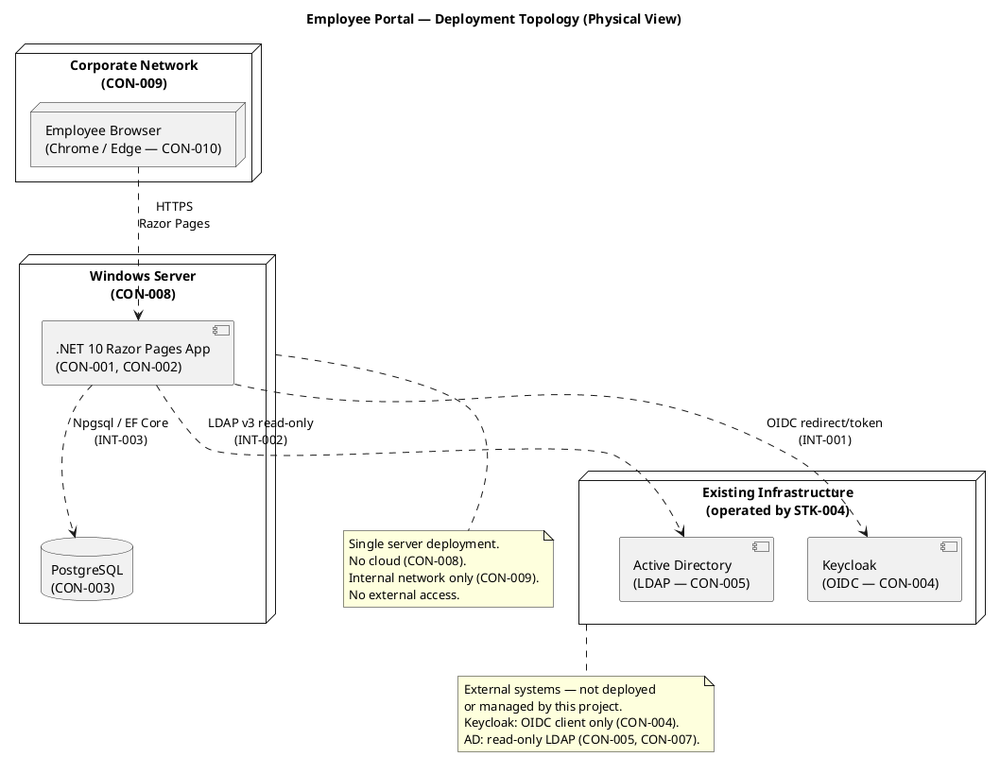

## Document Control
| Field | Value |
|---|---|
| Phase | Elaboration |
| Status | Draft — 4+1 baseline submitted for LCA review |
| Milestone Target | End of Elaboration (LCA) |
| Iteration | 1 (Cycle 1) |
| Date | 2026-09-01 |
| Prior Version | Inception candidate (Approved at LCO — 0 findings); EVOLVED, not recreated |
| Elaboration Changes | Full 4+1 baseline established: Process, Implementation, and Use-Case views completed (were deferred in Inception); Logical View refined — COMP-010 Report Export Service and COMP-011 Time Service added (volatility gaps closed), authentication enforcement moved to the request boundary (middleware); timestamp convention incorporated (stakeholder decision, Elab Iter 1: store UTC, display America/Havana, export ISO-8601 with explicit offset, payroll day = local calendar day); ADR-004 added (worker category list = externally-configured JSON file, per UC-007 delegation); stack re-anchored against enterprise version policy — unchanged, PRESERVED (Npgsql 10.0.3 confirmed latest stable); Data View refined (idempotency key, UTC storage, two-column worker_categories per CON-006); PoC plan corrected per Development Case oracle (Architectural Proof-of-Concept trigger NOT fired) with per-risk retirement dispositions; LCA Review assessment added (milestone NOT yet declared achieved) |
## Architectural Representation
This document is the **architectural baseline** for the Employee Portal — the Elaboration refinement of the Inception candidate. Per the 4+1 view model, every view is now represented by its primary diagram; prose supplements only what UML cannot express.

| View | Phase Coverage | Primary Diagram |
|---|---|---|
| Logical | **Baselined** — all subsystems, interfaces, layers | Component diagram (§ Logical View) |
| Process | **Baselined** — offline sync concurrency, request handling, audit atomicity | Activity diagram (§ Process View) |
| Deployment | **Baselined** — nodes, artifacts, external systems, client-side queue | Deployment diagram (§ Deployment View) |
| Implementation | **Baselined** — solution structure mapped to the actual repository | Package diagram (§ Implementation View) |
| Use-Case | **Baselined** — top 3 architecturally significant scenarios | 3 sequence diagrams (§ Use-Case View) |

**Diagram inventory (7):** component (Logical), activity (Process), deployment (Physical), package (Implementation), sequence ×3 (UC-001, UC-004, UC-010 — Use-Case view validation). Every view is exercised by at least one architecturally significant use-case scenario: UC-001 (clocking — offline resilience, idempotent persistence, time convention, OIDC), UC-004 (directory — LDAP, graceful degradation), UC-010 (unpublish — audit trail, soft delete). No view exists without a UC scenario exercising it.
## Architectural Goals and Constraints
### Declared Technology Stack (re-anchored, Elaboration Iter 1)

| Layer | Technology | Constraint | Version |
|---|---|---|---|
| Backend | .NET 10 with REST API | CON-001 | 10 (enterprise pin — unchanged) |
| Frontend | Razor Pages (server-rendered) | CON-002 | (framework-managed) |
| Database | PostgreSQL | CON-003 | (latest stable via Npgsql 10.0.3) |
| ORM | EF Core + Npgsql.EntityFrameworkCore.PostgreSQL | CON-001, CON-003 | 10.0.3 |
| Auth | Keycloak OIDC (existing, external) | CON-004 | (external — not our concern) |
| Directory | Active Directory over LDAP v3 | CON-005 | (external — read-only) |
| Hosting | Internal Windows Server (no cloud) | CON-008 | (Infrastructure-managed) |
| Access | Internal corporate network only | CON-009 | — |
| Browsers | Chrome, Edge (current versions) | CON-010 | — |

**Stack reconciliation (Elaboration Iter 1):** verified against the enterprise version policy and the NuGet registry — the .NET 10 framework pin is unchanged; Npgsql 10.0.3 is confirmed latest stable with no policy pin governing it; the EF Core PostgreSQL provider resolves to 10.0.3. No change from the Inception anchor — **PRESERVED**. R008 (PostgreSQL + .NET 10 compatibility) remains a build-time validation owned by the Implementer.

### Architectural Constraints (from Supplementary Specification)

| ID | Constraint | Impact on Architecture |
|---|---|---|
| DC-004 | Hosting: internal Windows Server, no cloud | Single-node deployment; no horizontal scaling needed for 200 users |
| DC-005 | Keycloak is external — OIDC client only | Auth is a thin adapter; no identity infrastructure in scope |
| DC-006 | AD data read on demand, no local copy | No sync job, no reconciliation, no stale-data risk; LDAP query is live |
| DC-007 | No write-back to AD | LDAP gateway is read-only by design |
| DC-009 | No hard delete of news items | Soft-delete pattern (status flag); records persist for audit |
| DC-010 | Worker category list is externally configured | Category list is a read-only lookup; no CRUD for categories in the portal (ADR-004 decides the mechanism) |

### Timestamp Convention (stakeholder decision — Elaboration Iter 1)

The stakeholder decided the clocking timestamp convention; it is an architectural constraint on every component that records, stores, displays, or exports a time. All 3 offices share the one timezone (stakeholder-confirmed).

| Facet | Decision | Architectural Owner |
|---|---|---|
| Storage | Every clocking timestamp stored in UTC | COMP-008 (schema), COMP-001 (write path) |
| Display | Office local timezone — **America/Havana** (IANA identifier, DST-aware); raw UTC or server time is never shown to users | COMP-011 Time Service (USA-008) |
| Export | ISO-8601 with explicit offset (YYYY-MM-DDThh:mm:ss±hh:mm; the offset in force at the event time per the IANA zone database) | COMP-010 Report Export Service (UC-006 column 5) |
| Payroll day | The local calendar day in America/Havana — never the server's; month boundaries for UC-006 computed in local time | COMP-010, COMP-011 |
| Capture | Timestamp fixed at the moment of the button press (DAT-001); queued events persist their recorded timestamp unchanged on sync | COMP-001, COMP-009 |

The convention is encapsulated in COMP-011 so that a future multi-zone reality changes one component, not the system.

### Quality Attribute Priorities (FURPS+)

| Attribute | Priority | Source | Architectural Tactic |
|---|---|---|---|
| Performance (page load <3s) | High | NFR-001, PRF-001 | Server-rendered Razor Pages (no SPA overhead); LDAP result caching with short TTL |
| Performance (clocking <1s) | High | NFR-002, PRF-002 | Idempotent clocking endpoint; offline queue for immediate user feedback (both paths < 1 s) |
| Reliability (offline tolerance) | High | NFR-004, AC-005, REL-002/003 | Client-side retry + server-side idempotent endpoint; local queue for clocking events |
| Security (OIDC auth) | High | CON-004, SEC-001/002/006 | Authentication enforced at the request boundary (middleware); role-based authorization from Keycloak claims |
| Auditability | High | NFR-005, AUD-001–004, DAT-002 | Cross-cutting audit service; every news operation and category change logged, append-only, atomic with the state change |
| Usability (10s directory lookup) | Medium | AC-003, USA-003 | LDAP query optimization (5 s hard timeout — PRF-003); graceful degradation for missing attributes (R001) |
| Availability (7:00–19:00 M–F) | Low | NFR-003, REL-001 | Single server sufficient; no HA needed for 200-user intranet |
| Data integrity (timestamp convention) | High | DAT-001, USA-008 | COMP-011 Time Service — single owner of UTC storage, America/Havana display, ISO-8601 offset export |
## Use-Case View

### Architecturally Significant Use Cases (Prioritized)

| Priority | UC | Name | Architectural Significance | Risk |
|---|---|---|---|---|
| 1 | UC-001 | Clock In and Clock Out | OIDC auth, time recording, offline tolerance (NFR-004), idempotent endpoint | R004 (SIGNIFICANT) |
| 2 | UC-004 | Search Employee Directory | LDAP integration, graceful degradation for missing attributes, query performance | R001 (HIGH), R005 (MODERATE) |
| 3 | UC-010 | Unpublish News | Soft-delete pattern, audit trail mechanism | R006 (MODERATE) |
| 4 | UC-008 | Publish News | Audit trail (author + timestamp), news lifecycle | R006 (MODERATE) |
| 5 | UC-007 | Assign Worker Category | AD user id → category persistence, audit trail for changes | R006 (MODERATE) |

**Sequencing rationale for Project Manager:** UC-001 is prioritized first because it exercises OIDC auth (R003), offline resilience (R004), and PostgreSQL persistence simultaneously — the highest-risk convergence point. UC-004 is second because R001 (LDAP attribute consistency) is the only HIGH-magnitude risk and must be validated via PoC in Elaboration. UC-010 is third because it validates the audit trail mechanism and soft-delete pattern shared by all news operations.

### Volatility Analysis (Decompose by Change)

| Area of Change | Volatility | Encapsulated By | Rationale |
|---|---|---|---|
| Offline resilience strategy | High | COMP-009 Offline Resilience Handler | NFR-004/AC-005 mechanism is architecturally unresolved; the queuing/sync approach may change after Elaboration PoC |
| LDAP query strategy | High | COMP-007 LDAP Gateway | R001 risk: attribute availability varies across offices; query filters and fallback display may need adjustment |
| OIDC integration details | High | COMP-006 OIDC Auth Provider | R003 risk: token validation, role-claim mapping may have Keycloak configuration nuances |
| Audit trail implementation | Medium | COMP-005 Audit Service | NFR-005 mechanism is stable in intent but implementation detail (DB triggers vs. application-level) may change |
| Category list source | Medium | COMP-004 Category Service | CON-013: list is externally configured; source mechanism may change (file, DB table, config service) |
| News lifecycle rules | Low | COMP-002 News Service | CON-012 (no hard delete) is stable; soft-delete + audit is a well-understood pattern |
| Clocking data model | Low | COMP-001 Clocking Service | Timestamp + employee id + in/out is a stable domain model |

## Logical View

The candidate architecture is a **layered application** with **subsystem decomposition by area of change**. This is proportional to the declared scope: 200 users, single server, 10 FRs, 2 external integrations. No microservices, no message queues, no workflow engines — those would be architecture by buzzword for a system of this scale.

### Layers

1. **Presentation Layer** (Razor Pages, CON-002): Server-rendered pages for clocking, news browsing, directory search, and HR admin functions. No SPA complexity.
2. **Application Layer** (.NET 10, CON-001): Subsystem services implementing business logic. Each subsystem encapsulates one area of change.
3. **Infrastructure Layer**: Adapters for external systems (Keycloak OIDC, AD LDAP, PostgreSQL) and cross-cutting mechanisms (offline resilience).

### Subsystem Decomposition

| Component | ID | Encapsulates | Interfaces | Dependencies |
|---|---|---|---|---|
| Clocking Service | COMP-001 | Clocking data model, time recording, idempotent endpoint | ICLK | IPERSIST, IAUTH, IAUD, COMP-009 |
| News Service | COMP-002 | News lifecycle (publish, edit, unpublish, browse), soft-delete | INEWS | IPERSIST, IAUTH, IAUD |
| Directory Service | COMP-003 | Directory search, LDAP query delegation, graceful degradation | IDIR | ILDAP, IAUTH |
| Category Service | COMP-004 | AD user id → category mapping, audit on change | ICAT | IPERSIST, IAUTH, IAUD |
| Audit Service | COMP-005 | Cross-cutting audit trail (who, what, when, before/after) | IAUD | IPERSIST |
| OIDC Auth Provider | COMP-006 | Token validation, role extraction from claims | IAUTH | Keycloak (external) |
| LDAP Gateway | COMP-007 | LDAP query construction, connection management, result mapping | ILDAP | AD (external) |
| PG Persistence | COMP-008 | Database access, EF Core / Npgsql, repository pattern | IPERSIST | PostgreSQL (external) |
| Offline Resilience Handler | COMP-009 | Client-side retry, local queue, sync-on-reconnect | (internal to COMP-001) | IPERSIST |

### Cohesion and Coupling Assessment

- **High cohesion**: Each subsystem has a single clear purpose (clocking, news, directory, category, audit).
- **Low coupling**: All subsystem boundaries are defined by interfaces (ICLK, INEWS, IDIR, ICAT, IAUD). No direct class-to-class dependencies across subsystem boundaries.
- **Cross-cutting concerns**: Auth (COMP-006) and Audit (COMP-005) are referenced by multiple subsystems via interfaces — this is correct for cross-cutting mechanisms, not a coupling violation.

```plantuml
@startuml
skinparam componentStyle rectangle
skinparam fontSize 11
title Employee Portal — Candidate Architecture (Logical View)

package "Presentation Layer\n(Razor Pages — CON-002)" as PRES {
  [Clocking Pages] as CLK_P
  [News Pages] as NEWS_P
  [Directory Pages] as DIR_P
  [HR Admin Pages] as HR_P
}

package "Application Layer\n(.NET 10 — CON-001)" as APP {
  component "Clocking Service\n(COMP-001)" as CLK_S
  component "News Service\n(COMP-002)" as NEWS_S
  component "Directory Service\n(COMP-003)" as DIR_S
  component "Category Service\n(COMP-004)" as CAT_S
  component "Audit Service\n(COMP-005)" as AUD_S
}

package "Infrastructure Layer" as INFRA {
  component "OIDC Auth Provider\n(COMP-006)" as AUTH
  component "LDAP Gateway\n(COMP-007)" as LDAP_GW
  component "PG Persistence\n(COMP-008)" as PG_P
  component "Offline Resilience\nHandler (COMP-009)" as OFFLINE
}

interface "IClockingService" as ICLK
interface "INewsService" as INEWS
interface "IDirectoryService" as IDIR
interface "ICategoryService" as ICAT
interface "IAuditService" as IAUD
interface "IAuthProvider" as IAUTH
interface "ILdapGateway" as ILDAP
interface "IPersistence" as IPERSIST

CLK_P ..> ICLK
NEWS_P ..> INEWS
DIR_P ..> IDIR
HR_P ..> ICLK
HR_P ..> ICAT

CLK_S --|> ICLK
NEWS_S --|> INEWS
DIR_S --|> IDIR
CAT_S --|> ICAT
AUD_S --|> IAUD

AUTH --|> IAUTH
LDAP_GW --|> ILDAP
PG_P --|> IPERSIST

CLK_S ..> IPERSIST
NEWS_S ..> IPERSIST
CAT_S ..> IPERSIST
AUD_S ..> IPERSIST
DIR_S ..> ILDAP

CLK_S ..> IAUD
NEWS_S ..> IAUD
CAT_S ..> IAUD

CLK_S ..> IAUTH
NEWS_S ..> IAUTH
DIR_S ..> IAUTH
CAT_S ..> IAUTH

CLK_S ..> OFFLINE
OFFLINE ..> IPERSIST

database "PostgreSQL\n(CON-003)" as PG <<external>>
component "Keycloak OIDC\n(CON-004)" as KC <<external>>
component "Active Directory LDAP\n(CON-005)" as AD <<external>>

PG_P ..> PG
AUTH ..> KC
LDAP_GW ..> AD

note right of CLK_S
  Encapsulates: offline resilience
  (R004, NFR-004)
  Volatility: High
end note

note right of DIR_S
  Encapsulates: LDAP query
  strategy, graceful degradation
  (R001, R005)
  Volatility: High
end note

note right of AUTH
  Encapsulates: OIDC token
  validation, role mapping
  (R003)
  Volatility: High
end note

note right of AUD_S
  Cross-cutting: audit trail
  (NFR-005)
  Volatility: Medium
end note

@enduml
```



## Process View

**Deferred to Elaboration.** The Employee Portal is a single-server web application for 200 concurrent users at peak. Concurrency concerns are minimal: .NET 10's built-in thread pool and async request handling are sufficient. The Process view will address the offline resilience handler's sync-on-reconnect behavior (COMP-009) and LDAP connection pooling (COMP-007) in Elaboration.

## Deployment View

The deployment is a **single-node topology** on an internal Windows Server. This is proportional to the declared scope: 200 users, 3 offices, no cloud, no external access. No load balancers, no clusters, no container orchestration — those would be over-engineering for this scale.



### External Dependencies (R010 — Infrastructure Team)

| Dependency | Provider | Needed By | Blocking? |
|---|---|---|---|
| LDAP read access to AD (service account) | STK-004 (Infra) | COMP-007, UC-004, UC-007 | Yes — blocks Elaboration PoC for R001 |
| Keycloak client registration | STK-004 (Infra) | COMP-006, all UCs | Yes — blocks auth integration |
| Windows Server provisioning | STK-004 (Infra) | Deployment | Yes — blocks Construction deployment |

These dependencies are owned by STK-004 (Infrastructure Team) per R010. The Project Manager should engage STK-004 early in Elaboration to secure these deliverables.

## Implementation View

**Deferred to Elaboration.** The Implementation view will map the subsystem decomposition to .NET 10 project structure (solution, projects, namespaces) once the architecture is baselined.

## Data View

### Portal Database Schema (PostgreSQL — CON-003)

The portal database stores **only** what is not in Active Directory. Per CON-006, no employee data is copied — the portal stores only `AD user id → worker category` (two columns) plus operational data (clockings, news, audit entries).

| Table | Purpose | Key Columns | Source |
|---|---|---|---|
| clockings | Clock in/out events | id, employee_uid, event_type (in/out), timestamp | FR-004, FR-005 |
| news_items | News articles with lifecycle | id, title, body, category, is_featured, status (published/unpublished), created_by, created_at | FR-006, FR-008, FR-009 |
| news_audit | Audit trail for news operations | id, news_id, action (publish/edit/unpublish), actor_uid, timestamp, snapshot | NFR-005, AUD-001–003 |
| worker_categories | AD user id → category mapping | employee_uid, category, assigned_by, assigned_at | FR-003, CON-006 |
| category_audit | Audit trail for category changes | id, employee_uid, old_category, new_category, actor_uid, timestamp | NFR-005, AUD-004 |

**Note:** The `employee_uid` column in all tables references the AD user id (e.g., sAMAccountName or objectGUID). No employee name, title, department, or other AD attribute is stored in the portal database. Directory data is always read live from AD via LDAP (COMP-007).

## Size and Performance

| Metric | Target | Source | Architectural Tactic |
|---|---|---|---|
| Page load | < 3 seconds | NFR-001 | Server-rendered Razor Pages; LDAP result caching (60s TTL); no SPA bundle |
| Clocking operation | < 1 second | NFR-002 | Idempotent endpoint; offline queue provides immediate user feedback |
| Directory search | < 10 seconds (including user interaction) | AC-003 | LDAP query optimization; result caching; graceful degradation for missing attributes |
| Concurrent users | ~200 peak | Scope (200 employees) | .NET 10 async request handling; single server sufficient |
| Data volume | Low (200 employees × ~2 clockings/day × 250 workdays = ~100K rows/year) | Derived | PostgreSQL handles this trivially; no sharding or partitioning needed |

## Quality
### PoC Plan for Elaboration

The following risks are architecturally significant and require empirical validation through a Proof-of-Concept in Elaboration. The PoC optional artifact trigger has not fired in Inception — it fires in Elaboration. This plan is documented here so the Project Manager can schedule PoC work in Elaboration Iteration 1.

| Risk ID | Risk | Magnitude | PoC Needed? | PoC Scope | Success Criteria |
|---|---|---|---|---|---|
| R001 | AD LDAP attribute consistency across 3 offices | HIGH | **Yes** | Query AD over LDAP from each of the 3 offices. Verify that job title, department, office, email, and extension attributes are populated for a sample of users per office. Identify which attributes are missing and define fallback display behavior. | All 5 corporate attributes (name, job title, department, office, email, extension) are populated for >90% of users in each office. Missing attributes are identified and graceful degradation behavior is defined. |
| R003 | OIDC integration with Keycloak | SIGNIFICANT | **Yes** | Register an OIDC client in Keycloak. Implement token validation and role-claim mapping in COMP-006. Test the full auth flow: redirect → login → token return → role extraction → authorized access. | Employee and HR Administrator roles are correctly extracted from Keycloak claims. Token validation works. Redirect flow completes without errors. |
| R004 | Offline fault tolerance (NFR-004, AC-005) | SIGNIFICANT | **Yes** | Implement the idempotent clocking endpoint with client-side retry and localStorage queue (ADR-003). Simulate a 5-minute network drop: queue a clocking event, reconnect, verify sync without duplicates. | Clocking event queued during network drop is synced to PostgreSQL on reconnect. No duplicate records created. User sees immediate confirmation from queued data. Idempotency key prevents duplicates on retry. |
| R005 | LDAP query performance | MODERATE | **No (monitor)** | If R001 PoC reveals slow queries, add a performance test. Otherwise, LDAP query performance for 200 users is expected to be well within the 3-second target. | Directory search completes in <2 seconds for typical queries. If exceeded, implement in-memory cache with 60s TTL. |
| R008 | PostgreSQL + .NET 10 compatibility | MODERATE | **No (validate during skeleton setup)** | Implementer validates Npgsql 10.0.3 + EF Core compatibility during project skeleton setup in Elaboration. Not a separate PoC — it is a build-time validation. | Basic CRUD test against PostgreSQL succeeds. EF Core migrations run without errors. |

### PoC Sequencing for Elaboration

```plantuml
@startuml
!theme plain
title Elaboration PoC Sequencing

start
:R001 PoC: LDAP attribute consistency
(Query AD from 3 offices);
note right: HIGH magnitude — first priority
:R003 PoC: OIDC integration
(Register client, test auth flow);
note right: SIGNIFICANT — second priority
:R004 PoC: Offline resilience
(Idempotent endpoint + queue + sync);
note right: SIGNIFICANT — third priority
:Validate R008: Npgsql + EF Core
(Basic CRUD test during skeleton);
note right: MODERATE — concurrent with PoCs
stop

note bottom
  R005 (LDAP performance) is monitored during R001 PoC.
  If queries are slow, add caching and re-test.
  No separate PoC needed unless R001 reveals a problem.
end note

@enduml
```

### PoC Dependencies on External Parties

| PoC | External Dependency | Provider | Action Needed |
|---|---|---|---|
| R001 (LDAP) | LDAP read access to AD (service account) | STK-004 (Infra) | Request service account with LDAP read permissions before Elaboration Iteration 1 |
| R003 (OIDC) | Keycloak client registration | STK-004 (Infra) | Request OIDC client registration with redirect URIs before Elaboration Iteration 1 |
| R004 (Offline) | None — internal to the portal | — | No external dependency |
| R008 (PG compatibility) | PostgreSQL instance | STK-004 (Infra) or local dev instance | Local dev instance sufficient for validation |

**Critical path:** R001 and R003 PoCs are blocked by STK-004 deliverables. The Project Manager must engage STK-004 at the start of Elaboration to secure LDAP access and Keycloak client registration. If STK-004 cannot deliver by Elaboration Iteration 1, mock LDAP and mock OIDC providers should be used for development, with integration deferred to early Construction (per R010 contingency).
## ADRs

### ADR-001: Architectural Style — Layered Monolith

| Field | Value |
|---|---|
| Context | The Employee Portal is an internal web application for 200 users on a single Windows Server. The stakeholder declared .NET 10 with REST API (CON-001) and Razor Pages (CON-002). No cloud (CON-008), no external access (CON-009). |
| Decision | Adopt a **layered monolithic architecture** with three layers: Presentation (Razor Pages), Application (subsystem services), Infrastructure (external system adapters). The application is deployed as a single process on a single server. |
| Alternatives Considered | 1. **Microservices** — rejected: 200 users, single server, 10 FRs do not justify distributed systems complexity. Would introduce network calls, service discovery, and operational overhead with zero benefit at this scale. 2. **Hexagonal (Ports & Adapters)** — partially adopted: the interface-based subsystem boundaries (ICLK, INEWS, etc.) follow the ports-and-adapters principle for external system integration, but the overall style is layered for simplicity. |
| Trade-offs | **Pro:** Simple deployment, simple debugging, no distributed-systems complexity, easy to understand for a small team. **Con:** Cannot scale horizontally (not needed); subsystems share a process (acceptable for 200 users). |
| Consequences | If the system grows beyond declared scope (e.g., 10x users, new integrations), the monolith would need decomposition. This is acceptable — YAGNI for the declared scope. |

### ADR-002: Persistence — PostgreSQL with EF Core / Npgsql

| Field | Value |
|---|---|
| Context | CON-003 declares PostgreSQL as the database. The portal stores clockings, news items, worker category mappings, and audit entries. No employee data is stored (CON-006). |
| Decision | Use **PostgreSQL** accessed via **Npgsql 10.0.3** (latest stable, no policy pin) and **EF Core** as the ORM. Implement a repository pattern behind the `IPersistence` interface (COMP-008) to abstract data access. |
| Alternatives Considered | 1. **Dapper (micro-ORM)** — rejected for Inception candidate: EF Core provides change tracking and migration tooling that reduces boilerplate for a team of this size. Can be reconsidered if performance profiling shows EF Core overhead. 2. **Raw Npgsql** — rejected: too much boilerplate for the CRUD-heavy operations in this system. |
| Trade-offs | **Pro:** EF Core migrations, change tracking, LINQ queries reduce code volume. Npgsql 10.0.3 is the latest stable driver for .NET 10. **Con:** EF Core adds a learning curve and potential performance overhead for complex queries (not expected here — all queries are simple). |
| Consequences | R008 (PostgreSQL + .NET 10 compatibility) must be validated in Elaboration by running a basic CRUD test. If incompatibility is found, fall back to Dapper + raw Npgsql. |

### ADR-003: Offline Resilience — Client-Side Retry + Server-Side Idempotency

| Field | Value |
|---|---|
| Context | NFR-004 and AC-005 require the system to tolerate 5-minute network disruptions and sync data once connectivity is restored. The portal is a server-rendered Razor Pages web app on a single server — the "network drop" scenario is between the client browser and the portal server within the corporate network. The stakeholder confirmed this is an architectural concern, not a scope decision. |
| Decision | Implement a **client-side retry with server-side idempotent endpoint** pattern: (1) The clocking button submits via AJAX with a client-generated idempotency key. (2) If the network is down, the browser queues the request locally (localStorage) and shows immediate confirmation from the queued data. (3) When connectivity returns, the queued request is replayed. (4) The server endpoint is idempotent — a duplicate submission with the same idempotency key returns the original response instead of creating a duplicate record. |
| Alternatives Considered | 1. **Service Worker + Background Sync API** — more robust offline support, but adds complexity and browser compatibility concerns for a corporate intranet. Razor Pages (CON-002) is server-rendered; a service worker is a different paradigm. 2. **Full offline-first PWA** — rejected: the scope is "tolerate 5-minute drops," not "work offline indefinitely." A PWA would be over-engineering. 3. **Server-side queue only** — rejected: the user needs immediate feedback (NFR-002: <1s response), so the queue must be client-side. |
| Trade-offs | **Pro:** Simple, proportional to the 5-minute tolerance requirement. No service worker complexity. Immediate user feedback. **Con:** localStorage has size limits (sufficient for a few clocking events). If the browser is closed during a network drop, queued events are lost — acceptable for a 5-minute window during working hours. |
| Consequences | R004 (offline fault tolerance) must be validated in Elaboration with a PoC: simulate a 5-minute network drop, queue a clocking, reconnect, and verify sync without duplicates. The idempotency key mechanism must be designed in detail by the Designer. |

## Traceability

| Element | Traces From | Link Type | Traces To |
|---|---|---|---|
| COMP-001 (Clocking Service) | UC-001, FR-004, FR-005 | Derives | COMP-008, COMP-009, COMP-005, COMP-006 |
| COMP-002 (News Service) | UC-003, UC-008, UC-009, UC-010, FR-006, FR-007, FR-008, FR-009 | Derives | COMP-008, COMP-005, COMP-006 |
| COMP-003 (Directory Service) | UC-004, FR-010 | Derives | COMP-007, COMP-006 |
| COMP-004 (Category Service) | UC-007, FR-003 | Derives | COMP-008, COMP-005, COMP-006 |
| COMP-005 (Audit Service) | NFR-005, AUD-001–004 | Derives | COMP-008 |
| COMP-006 (OIDC Auth Provider) | CON-004, SEC-001, SEC-002, R003 | Derives | Keycloak (external) |
| COMP-007 (LDAP Gateway) | CON-005, CON-006, CON-007, R001, R005 | Derives | Active Directory (external) |
| COMP-008 (PG Persistence) | CON-003, DC-003 | Derives | PostgreSQL (external) |
| COMP-009 (Offline Resilience Handler) | NFR-004, AC-005, R004 | Derives | COMP-008 |
| ADR-001 (Architectural Style) | CON-001, CON-002, CON-008, CON-009 | Refines | All COMP-* |
| ADR-002 (Persistence) | CON-003, R008 | Refines | COMP-008 |
| ADR-003 (Offline Resilience) | NFR-004, AC-005, R004 | Refines | COMP-009, COMP-001 |
| Deployment Topology | CON-008, CON-009, CON-010 | Refines | All COMP-* |
| Data View (schema) | CON-006, FR-003, FR-004, FR-006, NFR-005 | Derives | COMP-008 |
| Analysis Mechanisms | CON-003, CON-004, CON-005, NFR-001, NFR-002, NFR-004, NFR-005 | Refines | COMP-005–COMP-009 |