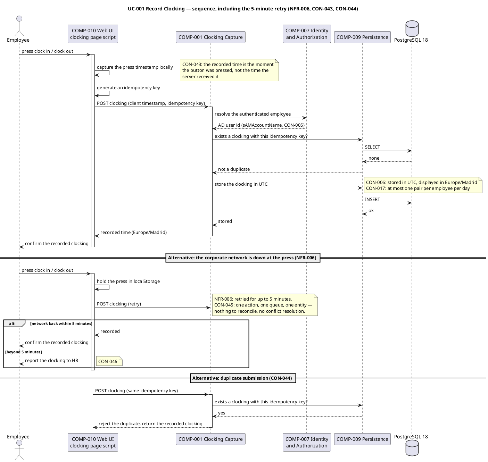
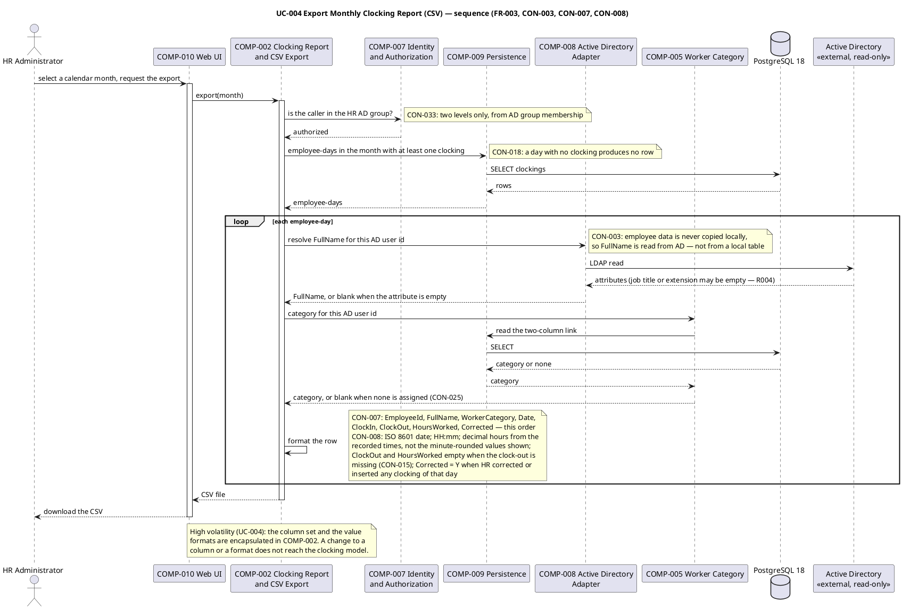
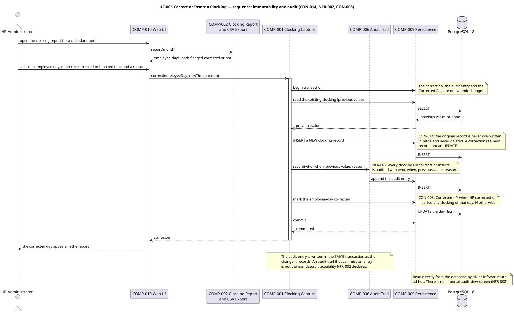
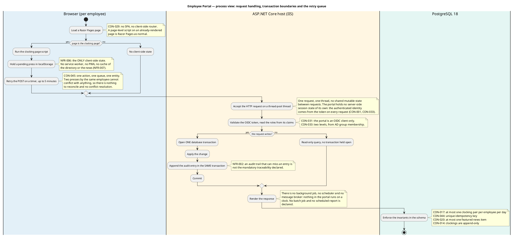
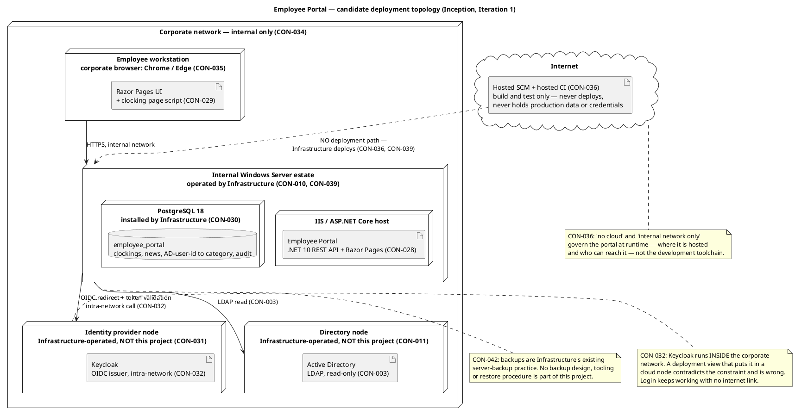

## Document Control

- Phase: Inception
- Status: Draft — candidate architecture, under review for the end-of-Inception milestone
- Milestone Target: end-of-Inception (NOT YET ACHIEVED)
- Iteration: 1, Cycle 1
- Owner: SoftwareArchitect
- Last updated: 2026-09-29

## Architectural Representation

This document is the architecture of the Employee Portal, expressed as UML views. Inception produces a **candidate** architecture: enough structure to surface the architectural risks and to let the Project Manager plan Elaboration. Elaboration baselines it against an executable prototype.

| 4+1 view | Diagram in this document | Status this iteration |
|---|---|---|
| Logical | Component diagram — layers, components, interfaces | Candidate — complete for the declared scope |
| Process | Activity diagram — request handling, transaction boundaries, retry queue | Candidate |
| Deployment | Deployment diagram — nodes and connectors | Candidate |
| Data | Class diagram — persistent structures and invariant homes | Candidate |
| Use-Case | Sequence diagrams — UC-001, UC-004, UC-005 | Candidate — the three architecturally significant scenarios |
| Implementation | No diagram this iteration | Deferred to Elaboration — the source layout follows the component boundaries below |

The architecture is **one** structure: every view above describes the same ten components. A component named in the Logical view appears in the Process view's transaction boundary, in the Deployment view's node, and in the Use-Case view's lifeline.

## Architectural Goals and Constraints

### Architecturally significant requirements (FURPS+ lens)

Only requirements with system-wide structural impact are listed. Everything else is design detail.

| Requirement | Architectural significance | Tactic |
|---|---|---|
| CON-003, CON-004, CON-011 — employee data read-only from AD, no local copy, only AD-user-id → category stored | Forces a **read-through** identity model: no local employee table, so every view that shows a person calls AD. This is the single most structural constraint in the project. | One adapter component (COMP-008) is the only reader of AD; a value object (DirectoryEntry) is assembled per request and never persisted |
| NFR-002 — mandatory audit trail, read directly from the database | Forces audit writes to be **transactional with the change they record**, and forces an append-only audit store | COMP-006 written in the same transaction as the change; no in-portal audit view |
| CON-014 — clockings immutable, never overwritten, never deleted | Forces **append-only** clocking storage; a correction is a new record, not an UPDATE | Clocking rows are insert-only; the day-level Corrected flag is derived state |
| CON-020 — at most one featured news item, wherever the change originates | An **invariant**, not a screen convention: it must hold on every write path | Enforced in COMP-003 and in the schema, not in the publish/edit form |
| CON-043, CON-044, NFR-006 — client timestamp, idempotency key, 5-minute client retry | Forces the clocking write path to be **idempotent** and to accept a client-supplied timestamp | Unique idempotency key; server accepts the client timestamp; retry queue lives in the browser only |
| NFR-003, NFR-004, AC-001 — page load < 3 s end to end, clocking < 1 s | Forces the AD read to be **bounded and cached per request**, never per row | One LDAP read per request, batched by the adapter; no per-row LDAP call |
| CON-032 — Keycloak is an intra-network node | A **deployment** decision, not a code decision | Deployment view places Keycloak inside the corporate network |
| CON-029 — Razor Pages, no SPA, but a page-level script is allowed | Forces the clocking retry to be **server-rendered page + one page script**, not a client application | COMP-010 renders pages; the retry queue is a page-level script on the clocking page only |
| CON-034, CON-035 — internal network only, Chrome and Edge | Removes any need for public-internet hardening, CDN or cross-origin design | Single-origin internal application |

### Architecture Decision Records

#### ADR-001 — Architectural style: layered application with interface-based boundaries

| Field | Content |
|---|---|
| Context | 12 use cases, 200 users, one database, one deployment node, a declared stack of .NET 10 / Razor Pages / PostgreSQL 18 (CON-028, CON-029, CON-030), and a declared deployment target of a single .NET application on the existing Windows Server estate (CON-010). |
| Decision | A **layered application** — presentation, application/domain, infrastructure — with every cross-layer call made through an interface. Ten components, each encapsulating one area of change. |
| Alternatives considered | (a) **Microservices** — rejected: one deployment node is declared (CON-010), Infrastructure has accepted operating *a .NET application*, and 200 users generate no scale that a single process cannot serve. It would add network failure modes to a system whose only declared resilience requirement is a 5-minute client retry. (b) **Event-driven / message-broker architecture** — rejected: nothing in the portal runs on a clock, no batch job and no scheduled report is declared, and CON-045 explicitly states there is nothing to reconcile. A broker would be infrastructure serving an undeclared requirement. (c) **Single project, no internal boundaries** — rejected: three use cases are High volatility (UC-004, UC-011, UC-012) and their behaviour must be encapsulated, not spread. |
| Trade-offs | A single process cannot be scaled horizontally per feature, and a fault in one component can affect the process. Accepted: NFR-005 requires availability only Mon–Fri 07:00–19:00 with fault tolerance *within the corporate network*, and NFR-001 declares no general scalability target. |
| Consequences | The component boundaries are the unit of change. A change to the CSV column set touches COMP-002 alone; a change to the worker-category list touches COMP-005 alone. The Design Model refines these ten components into classes; the Implementation View maps them to projects. |

#### ADR-002 — Persistence: one relational store, append-only where the domain requires it

| Field | Content |
|---|---|
| Context | PostgreSQL 18 is declared (CON-030), installed by Infrastructure on the estate they already operate. Clockings are immutable (CON-014); the audit trail is mandatory (NFR-002); the only local data about a person is a two-column link (CON-004). |
| Decision | A single PostgreSQL 18 database, reached through one persistence component (COMP-009) behind INT-009. Clocking and audit tables are **append-only**. The invariants that the domain declares are enforced in the schema as well as in the component: unique idempotency key (CON-044), at most one clocking pair per employee per day (CON-017), at most one featured news item (CON-020). |
| Alternatives considered | (a) **Event sourcing** — rejected: it would make the audit trail a by-product of the storage model rather than a declared requirement, and it adds a projection layer for a system with four small tables. (b) **A document store** — rejected: the export is a fixed-column relational report (CON-007) and the invariants are relational. (c) **Enforcing invariants only in application code** — rejected: CON-020 states the featuring invariant must hold *wherever the change comes from*, which a schema constraint guarantees and a single form does not. |
| Trade-offs | Schema constraints make some future change harder (a fifth worker category needs a migration as well as a code change). Accepted: CON-026 declares the list closed and requires a Change Request to change it, so a migration is the correct cost. |
| Consequences | The Data View below fixes the persistent structures. Corrections are INSERTs, never UPDATEs. The Corrected flag is derived from the presence of a correction record, so it cannot drift from the audit trail. |

#### ADR-003 — Identity and authorization: OIDC client, roles from token claims, two levels only

| Field | Content |
|---|---|
| Context | CON-001 requires corporate credentials via AD through Keycloak (OIDC). CON-031 makes the portal an OIDC client only — no realm design, no client provisioning, no Keycloak hosting. CON-033 declares exactly two authorization levels, from AD group membership. CON-032 places Keycloak inside the corporate network. |
| Decision | One component (COMP-007) owns the OIDC redirect, token validation and role extraction. The two levels are read from the token's claims on **every request**; the portal holds no server-side session state of its own. Authorization is a single check — member of the HR AD group, or not. |
| Alternatives considered | (a) **A role/permission matrix** — rejected: CON-033 declares there is no role matrix, no permission screen and no per-category rule. (b) **Reading AD group membership over LDAP per request** — rejected: the roles are already in the token claims (CON-031), and a second directory call per request would spend the NFR-003 page-load budget for nothing. (c) **Server-side session state** — rejected: it adds a state store and a session-expiry policy that no constraint declares. |
| Trade-offs | A token-claims-only model means a role change takes effect at the next token issuance, not instantly. Accepted: no constraint declares an immediate-revocation requirement, and the HR group changes rarely. |
| Consequences | Every use case includes MECH-01. The two-level check is the only authorization code in the system. Worker category is never read for an access decision (CON-024). |

#### ADR-004 — Employee data access: one adapter, read-through, never persisted

| Field | Content |
|---|---|
| Context | CON-003 makes directory data read-only from AD with no local copy; CON-004 limits the local table to AD user id → category; CON-011 states Infrastructure will not modify AD. Four use cases need employee identity — UC-003, UC-004, UC-011, UC-012 — not only the directory feature, because FullName is a declared export column (CON-007). R004 records that job title and extension may not be filled consistently across the three offices. |
| Decision | Exactly one component (COMP-008) reads Active Directory, behind INT-008. It returns a `DirectoryEntry` value object assembled per request and **never persisted**. An AD attribute that is empty is returned blank; the caller still produces its row. The category link is joined in memory, not in the directory. |
| Alternatives considered | (a) **A local employee cache or replica** — rejected outright: CON-003 and CON-004 forbid a local copy, a sync job, a reconciliation screen and conflict resolution. (b) **Reading AD directly from each use case** — rejected: it would spread the LDAP dependency across four components and make R004 a four-place problem. (c) **A nightly sync into a local table** — rejected: it is the synchronisation the scope excludes, and it would create the conflict resolution the scope forbids. |
| Trade-offs | Every request that shows a person pays an LDAP round trip, and the portal is only as available as AD. Accepted: AD is an existing corporate system Infrastructure operates (STK-003), its availability is explicitly not a risk of this project (CON-047), and the alternative is forbidden by the declared scope. |
| Consequences | R004 is contained in one component: an unevenly filled attribute shows as a blank field, and the fix is a data fix in AD, not a portal change. The adapter is the seam where the test LDAP stand-in (CON-038) is substituted. |

#### ADR-005 — Audit trail: append-only, written in the same transaction as the change

| Field | Content |
|---|---|
| Context | NFR-002 requires mandatory traceability for news publication, edits and unpublishing, for any change to a worker's category, and for every clocking HR corrects or inserts — with who, when, previous value and reason for corrections. It is read directly from the database; there is no in-portal audit view screen. |
| Decision | One component (COMP-006) appends audit entries. Every audited write appends its audit entry **inside the same database transaction** as the change it records. The audit table is append-only. |
| Alternatives considered | (a) **Application logging** — rejected: NFR-002 says the trail is read directly from the database, and a log file is not a queryable record with a previous value and a reason. (b) **Database triggers** — rejected: the *reason* is a user-supplied value that a trigger cannot see, and triggers would hide the audit from the code that must be reviewed against NFR-002. (c) **Audit written after the change commits** — rejected: a failure between the two writes would leave an unaudited change, which is precisely what mandatory traceability forbids. |
| Trade-offs | Every audited write pays a second INSERT in the same transaction, and the audit table grows without a retention policy. Accepted: NFR-002 mandates no retention period, and the volume is 200 employees. |
| Consequences | The audit trail cannot miss an entry for a change that committed. The five audited events are enumerated in the Data View. There is no in-portal audit view — HR or Infrastructure query the table. |

#### ADR-006 — Clocking capture: client timestamp, idempotency key, browser-side retry

| Field | Content |
|---|---|
| Context | CON-043 requires the recorded time to be the moment the button was pressed, not the time the server received it. CON-044 requires duplicate submissions to be rejected by an idempotency key. NFR-006 requires a clocking made during a network outage of up to 5 minutes not to be lost, held in localStorage and retried. CON-045 states the retry is one action, one queue, one entity with nothing to reconcile. CON-029 permits a page-level script on an already-rendered page. |
| Decision | The clocking page script captures the press timestamp and generates an idempotency key **before** the POST. The server accepts the client timestamp and rejects a duplicate key. The retry queue lives in the browser's localStorage and is the only client-side state in the portal. |
| Alternatives considered | (a) **Server-side timestamp** — rejected: CON-043 states it would make the audit trail record something that did not happen. (b) **A server-side retry queue or outbox** — rejected: the outage is on the client's network path, so a server-side queue never receives the press; and CON-045 declares there is nothing to reconcile. (c) **A service worker or PWA** — rejected: explicitly out of scope, and NFR-007 forbids caching the directory or the news. |
| Trade-offs | The server must trust a client-supplied timestamp, and a client clock that is wrong records a wrong time. Accepted: CON-043 is an explicit stakeholder decision that the audit trail must record the press, and the corporate estate's clocks are domain-managed. |
| Consequences | The clocking write path is idempotent and safe to retry. The retry is confined to the clocking page; the directory and the news show a no-connection message instead (NFR-007). |

### Analysis mechanisms

Each mechanism is stated as the **capability** it must provide and the **properties** it must hold. A product is named only where the stakeholder declared one.

| ID | Mechanism | Capability it must provide | Properties it must hold | Product (declared) | Realized by |
|---|---|---|---|---|---|
| MECH-01 | Authentication and authorization | Establish an authenticated session from corporate credentials and yield the caller's authorization level | OIDC authorization-code flow; token validated on every request; roles read from token claims; two levels only; no server-side session state; intra-network issuer | Keycloak (CON-001, CON-031) | COMP-007 |
| MECH-02 | Directory read | Return employee attributes for a set of AD user ids | Read-only; no write-back; no local copy; batched per request; an empty attribute returns blank rather than failing | Active Directory over LDAP (CON-003) | COMP-008 |
| MECH-03 | Audit trail | Append an immutable record of an audited change | Append-only; written in the same transaction as the change; carries actor, timestamp, subject, previous value and reason; queryable directly from the database | PostgreSQL 18 (CON-030) | COMP-006 |
| MECH-04 | Idempotent write | Make a repeated submission of the same action a no-op | A unique key per press; a duplicate is rejected and the original result returned | — | COMP-001 |
| MECH-05 | Client-side retry | Preserve a clocking press across a network outage of up to 5 minutes | Browser-local queue; bounded retry window; one action, one queue, one entity; clocking only | — | COMP-010 (page script) |
| MECH-06 | Persistence | Store and retrieve clockings, news items, the category link and audit entries | Relational; UTC storage with Europe/Madrid presentation; append-only where the domain requires; invariants enforced in the schema | PostgreSQL 18 (CON-030) | COMP-009 |
| MECH-07 | Report formatting | Render a fixed-column CSV report | Column set and order fixed; value formats fixed; timezone fixed; empty rather than zero for an unknown value | — | COMP-002 |

### Use-case prioritization for the Project Manager

Priority is **architectural significance** — risk, coverage and criticality — not business priority. Every use case is Must; this ordering decides what Elaboration builds first.

| Rank | UC | Why it ranks here | Architectural risk it retires |
|---|---|---|---|
| 1 | UC-001 Record Clocking | The only use case with a client-side mechanism (MECH-05), a client-supplied timestamp (CON-043) and an idempotency requirement (CON-044). It exercises the write path, the identity check and the persistence boundary at once. | Whether the retry and idempotency design actually holds under a real outage |
| 2 | UC-004 Export Monthly Clocking Report (CSV) | High volatility. It is the only use case that reads AD **and** the category link **and** formats a fixed-column report — it exercises MECH-02, MECH-06 and MECH-07 together, and it is where R004 lands. | Whether the read-through identity model meets the page-load budget when it must resolve a name per row |
| 3 | UC-011 Search Employee Directory | High volatility, and the use case R004 names directly. It is the widest AD read in the system. | Whether the directory survives unevenly filled AD attributes (R004) |
| 4 | UC-005 Correct or Insert a Clocking | The only use case that must write a new record, an audit entry and a derived flag atomically (CON-014, NFR-002, CON-008). | Whether the append-only clocking model and the transactional audit hold together |
| 5 | UC-012 Assign Worker Category | High volatility. The only write the portal makes about a person, and the only place the closed category list is validated. | Whether the two-column link model is sufficient |
| 6 | UC-010 Feature News Item | Carries the at-most-one invariant (CON-020) that must hold on every write path. | Whether the invariant is enforced where the change originates |
| 7 | UC-006 Read News | The main page — the page-load budget (NFR-003, AC-001) and the banner. | — |
| 8 | UC-003 View All Employee Clockings | The read path that shares the AD read with UC-004. | — |
| 9 | UC-007 Publish News Item | First audited write; establishes the audit pattern. | — |
| 10 | UC-008 Edit Published News Item | Reuses the publish path and the audit pattern. | — |
| 11 | UC-009 Unpublish News Item | Reuses the news write path; carries CON-021. | — |
| 12 | UC-002 View Own Clocking History | A filtered read of the clocking store; no new mechanism. | — |

**Elaboration recommendation.** Build ranks 1–5 as the architectural prototype: they cover all seven mechanisms, all three High-volatility areas and both Significant technical risks (R004, R005's verification seam). Ranks 6–12 reuse mechanisms already proven by then.

## Use-Case View

Three sequence diagrams validate the architecture against the scenarios that force its decisions. Each lifeline is a component from the Logical view; each message crosses an interface.

### UC-001 Record Clocking — the write path, the retry and idempotency

```plantuml
@startuml
title UC-001 Record Clocking — sequence, including the 5-minute retry (NFR-006, CON-043, CON-044)
skinparam sequenceMessageAlign left

actor "Employee" as EMP
participant "COMP-010 Web UI\nclocking page script" as UI
participant "COMP-001 Clocking Capture" as CAP
participant "COMP-007 Identity\nand Authorization" as ID
participant "COMP-009 Persistence" as REPO
database "PostgreSQL 18" as PG

EMP -> UI : press clock in / clock out
activate UI
UI -> UI : capture the press timestamp locally
note right
  CON-043: the recorded time is the moment
  the button was pressed, not the time the
  server received it
end note
UI -> UI : generate an idempotency key
UI -> CAP : POST clocking (client timestamp, idempotency key)
activate CAP
CAP -> ID : resolve the authenticated employee
ID --> CAP : AD user id (sAMAccountName, CON-005)
CAP -> REPO : exists a clocking with this idempotency key?
REPO -> PG : SELECT
PG --> REPO : none
REPO --> CAP : not a duplicate
CAP -> REPO : store the clocking in UTC
note right
  CON-006: stored in UTC, displayed in Europe/Madrid
  CON-017: at most one pair per employee per day
end note
REPO -> PG : INSERT
PG --> REPO : ok
REPO --> CAP : stored
CAP --> UI : recorded time (Europe/Madrid)
deactivate CAP
UI --> EMP : confirm the recorded clocking
deactivate UI

== Alternative: the corporate network is down at the press (NFR-006) ==

EMP -> UI : press clock in / clock out
activate UI
UI -> UI : hold the press in localStorage
UI -> CAP : POST clocking (retry)
note right
  NFR-006: retried for up to 5 minutes.
  CON-045: one action, one queue, one entity —
  nothing to reconcile, no conflict resolution.
end note
alt network back within 5 minutes
  CAP --> UI : recorded
  UI --> EMP : confirm the recorded clocking
else beyond 5 minutes
  UI --> EMP : report the clocking to HR
  note right
    CON-046
  end note
end
deactivate UI

== Alternative: duplicate submission (CON-044) ==

UI -> CAP : POST clocking (same idempotency key)
activate CAP
CAP -> REPO : exists a clocking with this idempotency key?
REPO --> CAP : yes
CAP --> UI : reject the duplicate, return the recorded clocking
deactivate CAP
@enduml
```

### UC-004 Export Monthly Clocking Report (CSV) — the read-through identity model

```plantuml
@startuml
title UC-004 Export Monthly Clocking Report (CSV) — sequence (FR-003, CON-003, CON-007, CON-008)
skinparam sequenceMessageAlign left

actor "HR Administrator" as HR
participant "COMP-010 Web UI" as UI
participant "COMP-002 Clocking Report\nand CSV Export" as EXP
participant "COMP-007 Identity\nand Authorization" as ID
participant "COMP-009 Persistence" as REPO
participant "COMP-008 Active Directory\nAdapter" as ADAPT
participant "COMP-005 Worker Category" as CAT
database "PostgreSQL 18" as PG
participant "Active Directory\n<<external, read-only>>" as AD

HR -> UI : select a calendar month, request the export
activate UI
UI -> EXP : export(month)
activate EXP
EXP -> ID : is the caller in the HR AD group?
note right
  CON-033: two levels only, from AD group membership
end note
ID --> EXP : authorized
EXP -> REPO : employee-days in the month with at least one clocking
note right
  CON-018: a day with no clocking produces no row
end note
REPO -> PG : SELECT clockings
PG --> REPO : rows
REPO --> EXP : employee-days
loop each employee-day
  EXP -> ADAPT : resolve FullName for this AD user id
  note right
    CON-003: employee data is never copied locally,
    so FullName is read from AD — not from a local table
  end note
  ADAPT -> AD : LDAP read
  AD --> ADAPT : attributes (job title or extension may be empty — R004)
  ADAPT --> EXP : FullName, or blank when the attribute is empty
  EXP -> CAT : category for this AD user id
  CAT -> REPO : read the two-column link
  REPO -> PG : SELECT
  PG --> REPO : category or none
  REPO --> CAT : category
  CAT --> EXP : category, or blank when none is assigned (CON-025)
  EXP -> EXP : format the row
  note right
    CON-007: EmployeeId, FullName, WorkerCategory, Date,
    ClockIn, ClockOut, HoursWorked, Corrected — this order
    CON-008: ISO 8601 date; HH:mm; decimal hours from the
    recorded times, not the minute-rounded values shown;
    ClockOut and HoursWorked empty when the clock-out is
    missing (CON-015); Corrected = Y when HR corrected or
    inserted any clocking of that day
  end note
end
EXP --> UI : CSV file
deactivate EXP
UI --> HR : download the CSV
deactivate UI

note over EXP
  High volatility (UC-004): the column set and the value
  formats are encapsulated in COMP-002. A change to a
  column or a format does not reach the clocking model.
end note
@enduml
```

### UC-005 Correct or Insert a Clocking — immutability and the transactional audit

```plantuml
@startuml
title UC-005 Correct or Insert a Clocking — sequence: immutability and audit (CON-014, NFR-002, CON-008)
skinparam sequenceMessageAlign left

actor "HR Administrator" as HR
participant "COMP-010 Web UI" as UI
participant "COMP-002 Clocking Report\nand CSV Export" as EXP
participant "COMP-001 Clocking Capture" as CAP
participant "COMP-006 Audit Trail" as AUD
participant "COMP-009 Persistence" as REPO
database "PostgreSQL 18" as PG

HR -> UI : open the clocking report for a calendar month
UI -> EXP : report(month)
EXP --> UI : employee-days, each flagged corrected or not
HR -> UI : select an employee-day, enter the corrected or inserted time and a reason
UI -> CAP : correct(employeeDay, newTime, reason)
activate CAP
CAP -> REPO : begin transaction
note right
  The correction, the audit entry and the
  Corrected flag are one atomic change.
end note
CAP -> REPO : read the existing clocking (previous value)
REPO -> PG : SELECT
PG --> REPO : previous value, or none
REPO --> CAP : previous value
CAP -> REPO : INSERT a NEW clocking record
note right
  CON-014: the original record is never overwritten
  in place and never deleted. A correction is a new
  record, not an UPDATE.
end note
REPO -> PG : INSERT
CAP -> AUD : record(who, when, previous value, reason)
note right
  NFR-002: every clocking HR corrects or inserts
  is audited with who, when, previous value, reason
end note
AUD -> REPO : append the audit entry
REPO -> PG : INSERT
CAP -> REPO : mark the employee-day corrected
note right
  CON-008: Corrected = Y when HR corrected or
  inserted any clocking of that day, N otherwise
end note
REPO -> PG : UPDATE the day flag
CAP -> REPO : commit
REPO --> CAP : committed
CAP --> UI : corrected
deactivate CAP
UI --> HR : the corrected day appears in the report

note over CAP, AUD
  The audit entry is written in the SAME transaction as the
  change it records. An audit trail that can miss an entry
  is not the mandatory traceability NFR-002 declares.
end note

note over PG
  Read directly from the database by HR or Infrastructure,
  ad hoc. There is no in-portal audit view screen (NFR-002).
end note
@enduml
```

## Logical View

Ten components in three layers. Every cross-layer call crosses an interface; no component reaches into another's internals. The decomposition is by **area of change**, not by feature: each component encapsulates one decision that is likely to change, and the three High-volatility use cases each own a component.

```plantuml
@startuml
title Employee Portal — candidate architecture: layers, components and interfaces (Inception, Iteration 1)
skinparam componentStyle rectangle
skinparam packageStyle rectangle

package "Presentation layer" {
  component "COMP-010 Web UI\nRazor Pages + clocking page script\nCON-029, CON-041" as COMP010
}

package "Application and domain layer" {
  component "COMP-001 Clocking Capture\nCON-017, CON-043, CON-044" as COMP001
  component "COMP-002 Clocking Report and CSV Export\nCON-007, CON-008" as COMP002
  component "COMP-003 News\nCON-019, CON-020, CON-021, CON-022, CON-023" as COMP003
  component "COMP-004 Directory Search\nFR-009, CON-024, CON-027" as COMP004
  component "COMP-005 Worker Category\nCON-004, CON-025, CON-026" as COMP005
}

package "Infrastructure layer — mechanisms" {
  component "COMP-006 Audit Trail\nNFR-002" as COMP006
  component "COMP-007 Identity and Authorization\nCON-001, CON-033" as COMP007
  component "COMP-008 Active Directory Adapter\nCON-003, CON-011" as COMP008
  component "COMP-009 Persistence\nCON-006, CON-030" as COMP009
}

component "Keycloak\n<<external, intra-network>>\nCON-031, CON-032" as KC
component "Active Directory\n<<external, read-only>>\nCON-003, CON-011" as AD
database "PostgreSQL 18\nCON-030" as PG

interface "IClockingService" as I1
interface "IClockingReport" as I2
interface "INewsService" as I3
interface "IDirectorySearch" as I4
interface "IWorkerCategory" as I5
interface "IAuditTrail" as I6
interface "IIdentityContext" as I7
interface "IEmployeeDirectory" as I8
interface "IRepository" as I9

COMP001 -- I1
COMP002 -- I2
COMP003 -- I3
COMP004 -- I4
COMP005 -- I5
COMP006 -- I6
COMP007 -- I7
COMP008 -- I8
COMP009 -- I9

COMP010 ..> I1
COMP010 ..> I2
COMP010 ..> I3
COMP010 ..> I4
COMP010 ..> I5
COMP010 ..> I7

COMP001 ..> I6
COMP001 ..> I9
COMP002 ..> I8
COMP002 ..> I5
COMP002 ..> I9
COMP003 ..> I6
COMP003 ..> I9
COMP004 ..> I8
COMP005 ..> I6
COMP005 ..> I8
COMP005 ..> I9
COMP006 ..> I9
COMP007 ..> I9
COMP007 ..> KC
COMP008 ..> AD
COMP009 ..> PG

note right of COMP008
  The ONLY component that reads Active Directory.
  Employee data has exactly one home (CON-003, CON-004):
  no local copy, no sync job, no reconciliation.
end note

note bottom of COMP002
  High volatility (UC-004): the column set and the value
  formats are encapsulated here, so a change to a column
  or a format never reaches the clocking model.
end note

note bottom of COMP004
  High volatility (UC-011): the searchable and displayed
  field set is isolated behind IEmployeeDirectory, which
  is where R004 (unevenly filled AD attributes) lands.
end note

note bottom of COMP005
  High volatility (UC-012): the closed four-value list
  (CON-026) and its validation live here, in one place.
end note
@enduml
```

### Components and their interfaces

| Component | Responsibility — the one decision it encapsulates | Interface | Depends on |
|---|---|---|---|
| COMP-001 Clocking Capture | How a press becomes a clocking: client timestamp, idempotency, one pair per day | INT-001 IClockingService | INT-006, INT-009 |
| COMP-002 Clocking Report and CSV Export | The report's column set and value formats — the High-volatility decision of UC-004 | INT-002 IClockingReport | INT-005, INT-008, INT-009 |
| COMP-003 News | The news lifecycle and the at-most-one-featured invariant, wherever the change originates | INT-003 INewsService | INT-006, INT-009 |
| COMP-004 Directory Search | The searchable and displayed field set — the High-volatility decision of UC-011 | INT-004 IDirectorySearch | INT-008 |
| COMP-005 Worker Category | The closed four-value category list and its validation — the High-volatility decision of UC-012 | INT-005 IWorkerCategory | INT-006, INT-008, INT-009 |
| COMP-006 Audit Trail | What an audited event is and that it is written with the change it records | INT-006 IAuditTrail | INT-009 |
| COMP-007 Identity and Authorization | How a caller is authenticated and which of the two levels they hold | INT-007 IIdentityContext | INT-009, Keycloak |
| COMP-008 Active Directory Adapter | How employee attributes are read, and what an empty attribute means | INT-008 IEmployeeDirectory | Active Directory |
| COMP-009 Persistence | How the four persistent structures are stored and which invariants the schema enforces | INT-009 IRepository | PostgreSQL 18 |
| COMP-010 Web UI | How a page is rendered and where the one page-level script lives | consumes INT-001..INT-005, INT-007 | — |

**Coupling check.** No component depends on more than three others. COMP-008 is the single point of contact with AD; COMP-009 the single point of contact with the database; COMP-007 the single point of contact with Keycloak. Each external system has exactly one adapter, so a change in how it is reached touches one component.

**Why these are not feature components.** The decomposition does not mirror the three functional areas. Clocking is split into COMP-001 (capture) and COMP-002 (report and export) because the export's column set and formats change for reasons that have nothing to do with how a clocking is recorded — UC-004 is High volatility and UC-001 is Low. Directory search (COMP-004) and category assignment (COMP-005) are separate because the searchable field set and the closed category list change independently. A single "Clocking Service" or "Directory Service" would couple a volatile decision to a stable one.

## Process View

The portal is a request-per-request web application. There is no background job, no scheduler and no message broker: nothing in the portal runs on a clock, and no batch job or scheduled report is declared. The only concurrency of interest is the client-side retry queue and the transaction boundary around audited writes.

```plantuml
@startuml
title Employee Portal — process view: request handling, transaction boundaries and the retry queue

|#E3F0F8|Browser (per employee)|
start
:Load a Razor Pages page;
note right
  CON-029: no SPA, no client-side router.
  A page-level script on an already-rendered
  page is Razor Pages as normal.
end note
if (page is the clocking page?) then (yes)
  :Run the clocking page script;
  :Hold a pending press in localStorage;
  note right
    NFR-006: the ONLY client-side state.
    No service worker, no PWA, no cache of
    the directory or the news (NFR-007).
  end note
  :Retry the POST on a timer, up to 5 minutes;
  note right
    CON-045: one action, one queue, one entity.
    Two presses by the same employee cannot
    conflict with anything, so there is nothing
    to reconcile and no conflict resolution.
  end note
else (no)
  :No client-side state;
endif

|#FFF6E2|ASP.NET Core host (IIS)|
:Accept the HTTP request on a thread-pool thread;
note right
  One request, one thread, no shared mutable state
  between requests. The portal holds no server-side
  session state of its own: the authenticated identity
  comes from the token on every request (CON-001, CON-033).
end note
:Validate the OIDC token, read the roles from its claims;
note right
  CON-031: the portal is an OIDC client only.
  CON-033: two levels, from AD group membership.
end note
if (the request writes?) then (yes)
  :Open ONE database transaction;
  :Apply the change;
  :Append the audit entry in the SAME transaction;
  note right
    NFR-002: an audit trail that can miss an entry is
    not the mandatory traceability declared.
  end note
  :Commit;
else (no)
  :Read-only query, no transaction held open;
endif
:Render the response;
note right
  There is no background job, no scheduler and no
  message broker: nothing in the portal runs on a
  clock. No batch job and no scheduled report is
  declared.
end note

|#E4F6F3|PostgreSQL 18|
:Enforce the invariants in the schema;
note right
  CON-017: at most one clocking pair per employee per day
  CON-044: unique idempotency key
  CON-020: at most one featured news item
  CON-014: clockings are append-only
end note
stop
@enduml
```

### Concurrency and fault tolerance

| Concern | Architectural position | Declared by |
|---|---|---|
| Concurrent clocking presses by the same employee | Serialised by the unique idempotency key and the one-pair-per-day constraint. The second press is rejected and returns the first result — there is nothing to reconcile. | CON-044, CON-017, CON-045 |
| Concurrent featuring changes | The at-most-one invariant is enforced in the schema, so two concurrent writes cannot both leave a featured item. | CON-020 |
| Concurrent corrections of the same employee-day | Each correction INSERTs a new record; the day flag is set, not toggled. Two corrections produce two audit entries and one corrected day. | CON-014, NFR-002 |
| Server-side session state | None. The identity is re-derived from the token on every request, so there is no session store to fail over and no session-expiry policy to invent. | CON-001, CON-033 |
| Fault tolerance within the corporate network | A single application process on the internal estate. NFR-005 requires availability Mon–Fri 07:00–19:00 with fault tolerance within the corporate network; 24/7 is explicitly not required. | NFR-005 |
| Network outage at the client | The clocking press survives up to 5 minutes in the browser. The directory and the news show a no-connection message; nothing is cached. | NFR-006, NFR-007 |
| Backups and restore | Infrastructure's existing server-backup practice covers the PostgreSQL instance. No backup design, tooling or restore procedure is part of this project. | CON-042 |

## Deployment View

Four node roles, all inside the corporate network. CON-032 is decisive: Keycloak is an intra-network node, and a deployment view that places it in a cloud node contradicts the constraint.

```plantuml
@startuml
title Employee Portal — candidate deployment topology (Inception, Iteration 1)
skinparam componentStyle rectangle

node "Corporate network — internal only (CON-034)" as CORP {

  node "Employee workstation\ncorporate browser: Chrome / Edge (CON-035)" as WS {
    artifact "Razor Pages UI\n+ clocking page script (CON-029)" as UIART
  }

  node "Internal Windows Server estate\noperated by Infrastructure (CON-010, CON-039)" as SRV {
    node "IIS / ASP.NET Core host" as HOST {
      artifact "Employee Portal\n.NET 10 REST API + Razor Pages (CON-028)" as APP
    }
    node "PostgreSQL 18\ninstalled by Infrastructure (CON-030)" as PG {
      database "employee_portal\nclockings, news, AD-user-id to category, audit" as DB
    }
  }

  node "Identity provider node\nInfrastructure-operated, NOT this project (CON-031)" as IDP {
    artifact "Keycloak\nOIDC issuer, intra-network (CON-032)" as KC
  }

  node "Directory node\nInfrastructure-operated, NOT this project (CON-011)" as DIR {
    artifact "Active Directory\nLDAP, read-only (CON-003)" as AD
  }
}

cloud "Internet" as NET {
  artifact "Hosted SCM + hosted CI (CON-036)\nbuild and test only — never deploys,\nnever holds production data or credentials" as CI
}

WS --> SRV : HTTPS, internal network
SRV --> IDP : OIDC redirect + token validation\nintra-network call (CON-032)
SRV --> DIR : LDAP read (CON-003)
CI ..> SRV : NO deployment path —\nInfrastructure deploys (CON-036, CON-039)

note right of IDP
  CON-032: Keycloak runs INSIDE the corporate
  network. A deployment view that puts it in a
  cloud node contradicts the constraint and is wrong.
  Login keeps working with no internet link.
end note

note bottom of NET
  CON-036: 'no cloud' and 'internal network only'
  govern the portal at runtime — where it is hosted
  and who can reach it — not the development toolchain.
end note

note bottom of SRV
  CON-042: backups are Infrastructure's existing
  server-backup practice. No backup design, tooling
  or restore procedure is part of this project.
end note
@enduml
```

| Node | What runs there | Operated by | Declared by |
|---|---|---|---|
| Employee workstation | The corporate browser — Chrome or Edge. No installed client, no service worker, no cached data. | The employee | CON-035, CON-009 |
| Internal Windows Server estate — application host | The Employee Portal: .NET 10 REST API and Razor Pages, hosted in IIS / ASP.NET Core. | Infrastructure | CON-010, CON-028, CON-029, CON-039 |
| Internal Windows Server estate — database | PostgreSQL 18, database `employee_portal`. | Infrastructure | CON-030, CON-042 |
| Identity provider node | Keycloak, the OIDC issuer. **Not deployed, provisioned or designed by this project** — consumed as an OIDC client only. | Infrastructure | CON-031, CON-032 |
| Directory node | Active Directory, read over LDAP. **Never written to.** | Infrastructure | CON-003, CON-011 |
| Hosted SCM + hosted CI | Build and test only. Never holds production data or credentials, never deploys. | The development team | CON-036 |

**Environment mapping.** One runtime environment is declared: the internal corporate network. No separate staging or production topology is declared, and none is invented. The development toolchain (hosted SCM and CI) is outside the runtime boundary by CON-036 — it is not a deployment environment for the portal.

**Deployment Model artifact.** The Deployment Model is a separate OPTIONAL artifact whose trigger has fired; its primary owner is the DeploymentManager (Development Case §Roles and Ownership), with the Software Architect as contributor. The Deployment View above is this document's contribution to it.

## Implementation View

No implementation diagram this iteration — the source layout follows the component boundaries and is fixed in Elaboration. The mapping is stated so the Implementer and the ConfigurationManager can plan it.

| Component | Source unit (Elaboration) | Declared technology |
|---|---|---|
| COMP-010 Web UI | Razor Pages project — pages and the clocking page script | Razor Pages, .NET 10 (CON-029) |
| COMP-001..COMP-005 | Application/domain project — one namespace per component | .NET 10 (CON-028) |
| COMP-006..COMP-009 | Infrastructure project — one namespace per component | .NET 10 (CON-028) |
| COMP-009 Persistence | Schema migrations for the four persistent structures | PostgreSQL 18 (CON-030) |

**Version policy — anchored.** The declared stack is pinned by the enterprise version policy and is not advanced past it. No NuGet, npm or PyPI package pin was declared, so no registry package version is resolved here.

| Ecosystem | Package / target | Pinned version | Source |
|---|---|---|---|
| framework | .NET | 10 | CON-028, version policy |
| framework | PostgreSQL | 18 (major pinned; patch level floats) | CON-030, version policy |
| — | Razor Pages | part of the .NET 10 target; no separate pin | CON-029 |
| — | Keycloak | not pinned — external system, neither deployed nor operated by this project | CON-031 |

**Tooling gaps carried into Elaboration** (recorded by the Development Case, not closed here): `CONTRIBUTING.md`, the lint configuration and the CI workflow file are absent from the repository. The SoftwareArchitect with the Implementer author the first two; the ConfigurationManager with the Implementer creates the third.

## Data View

Four persistent structures and three enumerations. The Data Model artifact is not triggered (fewer than 10 entities, no data migration — CON-040), so the data structures live here and in the Design Model.

```plantuml
@startuml
title Employee Portal — key design mechanisms: persistent structures and invariant homes (candidate)
skinparam classAttributeIconSize 0

package "Clocking (COMP-001, COMP-002)" {
  class "Clocking" as CLK <<entity>> {
    + Id : Guid
    + AdUserId : string
    + IdempotencyKey : string
    + PressedAtUtc : DateTime
    + Direction : ClockDirection
    + IsCorrection : bool
    + CorrectedBy : string
    + CorrectionReason : string
    + RecordedAtUtc : DateTime
  }
  class "ClockingDay" as DAY <<entity>> {
    + AdUserId : string
    + CalendarDate : DateOnly
    + IsCorrected : bool
  }
  enum "ClockDirection" as DIR {
    In
    Out
  }
}

package "News (COMP-003)" {
  class "NewsItem" as NEWS <<entity>> {
    + Id : Guid
    + Title : string
    + Body : string
    + NewsDate : DateOnly
    + Category : NewsCategory
    + IsFeatured : bool
    + IsPublished : bool
  }
  enum "NewsCategory" as NCAT {
    General
    HR
    IT
    Events
  }
}

package "Directory (COMP-004, COMP-005)" {
  class "WorkerCategoryLink" as LINK <<entity>> {
    + AdUserId : string
    + Category : WorkerCategory
  }
  enum "WorkerCategory" as WCAT {
    FullTime
    PartTime
    Contractor
    Intern
  }
  class "DirectoryEntry" as ENTRY <<value object>> {
    + AdUserId : string
    + FullName : string
    + JobTitle : string
    + Department : string
    + Office : string
    + Email : string
    + Extension : string
    + Category : WorkerCategory
  }
}

package "Audit (COMP-006)" {
  class "AuditEntry" as AUD <<entity>> {
    + Id : Guid
    + EventType : AuditEventType
    + ActorAdUserId : string
    + OccurredAtUtc : DateTime
    + SubjectRef : string
    + PreviousValue : string
    + Reason : string
  }
  enum "AuditEventType" as AET {
    NewsPublished
    NewsEdited
    NewsUnpublished
    CategoryChanged
    ClockingCorrected
  }
}

CLK "0..*" --> "1" DAY : belongs to
CLK --> "1" DIR
NEWS --> "1" NCAT
LINK --> "1" WCAT
ENTRY --> "0..1" WCAT
AUD --> "1" AET

note right of LINK
  CON-004: two columns and nothing else.
  The ONLY local data about a person.
  No sync, no reconciliation, no conflict.
end note

note right of ENTRY
  CON-003: never persisted. Assembled per request
  from the LDAP read plus the category link.
  An empty AD attribute is written blank (R004).
end note

note right of NEWS
  CON-020: at most one IsFeatured = true at any moment.
  Enforced in COMP-003 wherever the change originates —
  not in the form HR happens to use.
  CON-022: unpublish sets IsPublished = false; the row
  is never deleted.
end note

note right of CLK
  CON-014: append-only. A correction INSERTs a new row
  with IsCorrection = true; the original is never
  overwritten and never deleted.
  CON-044: IdempotencyKey is unique — a duplicate
  submission is rejected.
  CON-006: PressedAtUtc is UTC; display is Europe/Madrid.
end note

note bottom of AUD
  NFR-002: written in the same transaction as the change
  it records. Read directly from the database — there is
  no in-portal audit view screen.
end note
@enduml
```

| Structure | Purpose | Key invariants | Declared by |
|---|---|---|---|
| Clocking | One row per press, append-only. A correction is a new row, never an UPDATE. | Unique idempotency key; at most one pair per employee per calendar day; stored in UTC | CON-014, CON-044, CON-017, CON-006 |
| ClockingDay | The employee-day the export is keyed by, and the Corrected flag. | One row per employee per calendar day; `IsCorrected` is true when any correction exists for that day | CON-016, CON-018, CON-008 |
| NewsItem | The news record. Unpublish sets a flag; the row is never deleted. | At most one `IsFeatured = true` at any moment | CON-020, CON-022, CON-023 |
| WorkerCategoryLink | The only local data about a person: AD user id → category. | Two columns and nothing else; at most one category per AD user id; the category is one of four values or absent | CON-004, CON-025, CON-026 |
| AuditEntry | The mandatory traceability record. | Append-only; written in the same transaction as the change; carries actor, timestamp, subject, previous value and reason | NFR-002 |
| DirectoryEntry | A value object, **never persisted**. Assembled per request from the LDAP read plus the category link. | An empty AD attribute is returned blank; the caller still produces its row | CON-003, CON-027, R004 |

**No local copy of the employee.** The only table that mentions a person is `WorkerCategoryLink`, and it holds an AD user id and a category — nothing else. There is no employee table, no sync job, no reconciliation screen and no conflict to resolve (CON-003, CON-004).

## Size and Performance

| Requirement | Threshold | Architectural tactic | Declared by |
|---|---|---|---|
| NFR-003, AC-001 | Full page load under 3 s end to end, including the clocking page's script | Server-rendered Razor Pages with no client framework and no client-side router; one LDAP read per request, batched by COMP-008, never per row; no client cache to hydrate | NFR-003, AC-001, CON-029 |
| NFR-004 | Clocking operation under 1 s | The write path is one idempotency check and one INSERT; the identity comes from the token, not a second directory call; no server-side session lookup | NFR-004 |
| NFR-001 | 200 employees, 3 offices; no general scalability target declared | A single application process and a single database. No horizontal scaling, no cache tier, no read replica — none is declared and none is added. | NFR-001 |
| AC-004 | Find a colleague's phone/email in under 10 s | The directory search is a single indexed query plus one batched LDAP read; the seven declared fields are returned in one response | AC-004 |

**The page-load budget is the binding constraint on the AD read.** UC-004 must resolve a name per exported row, and UC-011 must resolve a name per search result. Both go through COMP-008, which batches the LDAP read for the whole result set rather than issuing one call per row. This is the architectural reason the adapter exists as a component rather than as a helper: it is the only place where the NFR-003 budget can be spent or wasted.

**No throughput, concurrency or resource-usage target is declared**, and none is invented. The declared population is 200 employees across 3 offices (STK-004).

## Quality

Each declared quality attribute is mapped to the architectural tactic that addresses it. An attribute with no tactic would be an unaddressed requirement.

| Attribute | Requirement | Architectural tactic | Component |
|---|---|---|---|
| Performance | NFR-003, NFR-004, AC-001 | Server-rendered pages; batched LDAP read; token-derived identity with no session store | COMP-010, COMP-008, COMP-007 |
| Reliability — audit | NFR-002 | Audit entry appended in the same transaction as the change; append-only audit table | COMP-006 |
| Reliability — availability | NFR-005 | Single process on the internal estate; availability window Mon–Fri 07:00–19:00; 24/7 explicitly not required | Deployment view |
| Reliability — clocking resilience | NFR-006, AC-006 | Browser-local retry queue bounded at 5 minutes; idempotent write path | COMP-010, COMP-001 |
| Usability — degradation | NFR-007 | No client cache of the directory or the news; a no-connection message instead | COMP-010 |
| Usability — visual layer | CON-041 | The mandatory design reference is the single authority for the visual layer; the UserInterfaceDesigner compares each page against it (R005) | COMP-010 |
| Security — authentication | CON-001, CON-031 | OIDC client only; token validated on every request; no server-side session state | COMP-007 |
| Security — authorization | CON-033 | Two levels from AD group membership, read from token claims; no role matrix, no per-category rule | COMP-007 |
| Security — data minimisation | CON-004, CON-027 | The only local data about a person is a two-column link; the directory shows corporate data only | COMP-005, COMP-004 |
| Security — credential handling | CON-038 | Placeholder configuration values, never in code; Infrastructure supplies the real values at deployment | COMP-007, COMP-008 |
| Security — network exposure | CON-034 | Internal corporate network only; no public endpoint | Deployment view |
| Functionality — export fidelity | CON-007, CON-008 | The column set and value formats are encapsulated in one component | COMP-002 |
| Functionality — immutability | CON-014 | Append-only clocking storage; a correction is a new record | COMP-001 |
| Functionality — featuring invariant | CON-020 | Enforced in the component and in the schema, wherever the change originates | COMP-003 |
| Supportability — operations | CON-039 | Infrastructure operates the portal; the development team hands over at the end of Transition | Deployment view |
| Supportability — backups | CON-042 | Infrastructure's existing server-backup practice; no backup design in this project | Deployment view |

### Top technical risks and candidate mitigations

The Risk List carries R001–R005. The architectural risks — the ones this document can act on — are R004 and R005; R001, R002 and R003 are adoption, data-quality and people risks whose mechanisms lie outside the architecture.

| Risk | Architectural exposure | Candidate mitigation in this architecture | PoC needed? |
|---|---|---|---|
| R004 — AD attributes unevenly filled across 3 offices | The directory, the clocking report and the CSV export all read AD. An empty attribute must not break a row. | COMP-008 is the single AD reader and returns blank for an empty attribute; UC-004 alternative flow A4 and UC-011 both handle it. The test LDAP stand-in carries entries with empty job title and extension (CON-038), so the path is exercised from the first directory-dependent use case. | No — the mechanism is a stand-in the team controls, not an empirical unknown |
| R005 — UI drift from the mandatory design reference | The visual layer has no automated check; a page can drift and pass every functional test. | The design reference is the single authority (CON-041); the UserInterfaceDesigner compares each page against it before the page is done. STK-001 accepted this treatment on 2026-09-28 and declined the alternative of a visual-regression check in CI. | No — the treatment is a review step, not a technical unknown |
| R002 — missing clock-outs | The correction path must be atomic and audited, or the Corrected flag and the audit trail drift apart. | UC-005 writes the correction, the audit entry and the day flag in one transaction; the Corrected flag is derived from the presence of a correction record. | No — the mechanism is fully specified by CON-008, CON-014 and NFR-002 |
| R001 — adoption | The clocking page is the employee's landing page and the only place a new clocking can be recorded (BG-002). | The clocking page is the entry point; AC-005 (80% complete a clocking with no training) is verified before go-live. | No — adoption is measured, not prototyped |
| R003 — single engineering contact | No architectural exposure. CON-038 removes the real Keycloak and the real AD from the team's critical path. | — | No |

**Architectural Proof-of-Concept — not produced.** The Development Case records the trigger as NOT FIRED: the §5.2 condition requires the Elaboration phase plus a technical risk needing empirical validation, and no risk in the Risk List is such a risk. R004 is resolved by the human validation of the real AD that CON-038 places outside team work; R005's treatment is a review step. No PoC plan is written, because a plan for a prototype that will not be built is a stub.

**The architecture is not yet validated.** This is a candidate architecture. It has not been built or tested. Elaboration baselines it through the architectural prototype recommended in the Use-Case View (ranks 1–5), which covers all seven mechanisms and both architectural risks.

## Traceability

| Element | Traces From | Link Type | Traces To |
|---|---|---|---|
| Software Architecture Document | UC-004, UC-011, UC-012, CON-028, CON-030 | Derives | Design Model, Deployment Model |
| COMP-001 Clocking Capture | UC-001, MECH-04, MECH-05, CON-017, CON-043, CON-044 | Derives | INT-001 |
| COMP-002 Clocking Report and CSV Export | UC-003, UC-004, UC-005, MECH-02, MECH-07, CON-007, CON-008 | Derives | INT-002 |
| COMP-003 News | UC-006, UC-007, UC-008, UC-009, UC-010, CON-019, CON-020, CON-021, CON-022 | Derives | INT-003 |
| COMP-004 Directory Search | UC-011, FR-009, MECH-02, CON-024, CON-027 | Derives | INT-004 |
| COMP-005 Worker Category | UC-012, FR-010, CON-004, CON-025, CON-026 | Derives | INT-005 |
| COMP-006 Audit Trail | MECH-03, NFR-002 | Derives | INT-006 |
| COMP-007 Identity and Authorization | MECH-01, CON-001, CON-031, CON-033 | Derives | INT-007 |
| COMP-008 Active Directory Adapter | MECH-02, CON-003, CON-011 | Derives | INT-008 |
| COMP-009 Persistence | MECH-06, CON-006, CON-030 | Derives | INT-009 |
| COMP-010 Web UI | UC-001, UC-006, UC-011, CON-029, CON-041 | Derives | INT-001, INT-002, INT-003, INT-004, INT-005, INT-007 |
| INT-001 IClockingService | COMP-001 | Specifies | Design Model |
| INT-002 IClockingReport | COMP-002 | Specifies | Design Model |
| INT-003 INewsService | COMP-003 | Specifies | Design Model |
| INT-004 IDirectorySearch | COMP-004 | Specifies | Design Model |
| INT-005 IWorkerCategory | COMP-005 | Specifies | Design Model |
| INT-006 IAuditTrail | COMP-006 | Specifies | Design Model |
| INT-007 IIdentityContext | COMP-007 | Specifies | Design Model |
| INT-008 IEmployeeDirectory | COMP-008 | Specifies | Design Model |
| INT-009 IRepository | COMP-009 | Specifies | Design Model |
| ADR-001 Architectural style | CON-010, CON-028, CON-029, CON-030 | Derives | COMP-001, COMP-002, COMP-003, COMP-004, COMP-005, COMP-006, COMP-007, COMP-008, COMP-009, COMP-010 |
| ADR-002 Persistence | CON-014, CON-017, CON-020, CON-030, CON-044, NFR-002 | Derives | COMP-009 |
| ADR-003 Identity and authorization | CON-001, CON-031, CON-032, CON-033 | Derives | COMP-007 |
| ADR-004 Employee data access | CON-003, CON-004, CON-011, R004 | Derives | COMP-008 |
| ADR-005 Audit trail | NFR-002 | Derives | COMP-006 |
| ADR-006 Clocking capture | CON-043, CON-044, CON-045, NFR-006, CON-029 | Derives | COMP-001, COMP-010 |
| R004 | CON-003, CON-038 | DependsOn | COMP-008 |
| R005 | CON-041, STK-001 | DependsOn | COMP-010 |

### Coverage — declared use cases

| UC | Component(s) that realize it |
|---|---|
| UC-001 Record Clocking | COMP-001, COMP-010 |
| UC-002 View Own Clocking History | COMP-001, COMP-010 |
| UC-003 View All Employee Clockings | COMP-002, COMP-008 |
| UC-004 Export Monthly Clocking Report (CSV) | COMP-002, COMP-005, COMP-008 |
| UC-005 Correct or Insert a Clocking | COMP-001, COMP-002, COMP-006 |
| UC-006 Read News | COMP-003, COMP-010 |
| UC-007 Publish News Item | COMP-003, COMP-006 |
| UC-008 Edit Published News Item | COMP-003, COMP-006 |
| UC-009 Unpublish News Item | COMP-003, COMP-006 |
| UC-010 Feature News Item | COMP-003 |
| UC-011 Search Employee Directory | COMP-004, COMP-008 |
| UC-012 Assign Worker Category | COMP-005, COMP-006, COMP-008 |

All twelve use cases are realized. All five cross-cutting mechanisms (MECH-01..MECH-05) have a component. All three High-volatility use cases (UC-004, UC-011, UC-012) own a dedicated component.

### Coverage — declared non-functional requirements

| NFR | Architectural tactic |
|---|---|
| NFR-001 | Single process, single database; no scaling tier added |
| NFR-002 | COMP-006, transactional append-only audit |
| NFR-003 | Server-rendered pages; batched LDAP read |
| NFR-004 | Single-write clocking path; token-derived identity |
| NFR-005 | Single process on the internal estate; declared availability window |
| NFR-006 | Browser-local retry queue; idempotent write path |
| NFR-007 | No client cache; no-connection message |

### Open items

| Item | Status |
|---|---|
| Implementation View diagram | Deferred to Elaboration — the source layout follows the component boundaries stated above |
| Architectural prototype | Elaboration — recommended scope is use-case ranks 1–5 |
| Deployment Model artifact | Owned by the DeploymentManager; this document contributes the Deployment View |
| `CONTRIBUTING.md`, lint configuration, CI workflow file | Absent from the repository; authored in Elaboration (Development Case §Environment readiness) |

No `[SCOPE_QUESTION]` is open in this artifact. Every component traces to a declared use case, mechanism or constraint, and no technology was introduced that the stakeholder did not declare.
