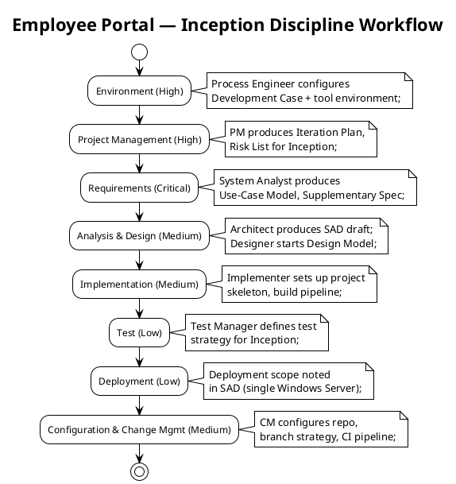
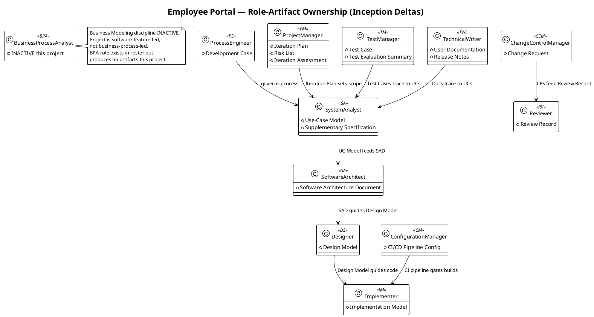

## Document Control

| Field | Value |
|---|---|
| Phase | Inception |
| Status | Draft |
| Milestone Target | End of Inception |
| Iteration | 2 (Cycle 1) |
| Date | 2026-09-01 |
| Prior Review | 0 findings on Development Case — artifact passed LCO review cleanly |
| Governance Re-recorded | DC §4 classification, optional triggers, version policy — all re-recorded iteration 2 |

## Tailoring Overview

This Development Case specifies project-specific **deltas** over the IARI DC baseline. The baseline defines 25 active roles, 16 CORE artifacts, 6 OPTIONAL artifacts, fixed ownership, and a canonical discipline-intensity matrix. This document declares only deviations; it never restates the baseline.

### Organization Assessment

| Factor | Finding |
|---|---|
| Agent role count | 25 roles per IARI baseline roster — all active except BPA (Business Modeling inactive) |
| Project type | Internal intranet web application for Cuba Corp (200 employees, 3 offices) |
| Complexity | Moderate — CRUD-centric portal with 10 functional requirements, 2 external integrations (AD/LDAP read-only, Keycloak OIDC), single-server deployment |
| Risk profile | R001 (AD LDAP attribute consistency, exposure=9 — HIGH), R002 (adoption resistance, exposure=6 — MEDIUM) |
| Process maturity | First RUP project for this organization; incremental rollout recommended |

### Tool Assessment

| Tool Category | Declared (from Constraints) | Status |
|---|---|---|
| Runtime / Framework | .NET 10 (CON-001) | Framework pin recorded |
| Frontend | Razor Pages, no SPA (CON-002) | Part of .NET 10 ecosystem |
| Database | PostgreSQL (CON-003) | Declared; no version pinned by stakeholder |
| Auth | Keycloak OIDC, pre-existing (CON-004) | External — not deployed by this project |
| Directory | Active Directory over LDAP, read-only (CON-005, CON-006) | External — read on demand, no sync |
| Hosting | Internal Windows Server (CON-008) | Single node, corporate network only |
| UI Design | Mandatory custom design at `docs/inputs/employee-portal-design.html` (CON-011) | Provided — authoritative for UI |
| Browsers | Chrome + Edge (CON-010) | Current versions |
| SCM / CI | Git-based repository with GitHub workflows | To be configured by ConfigurationManager |

### Gaps Identified

1. `CONTRIBUTING.md` — not yet created; discipline experts (Architect, Implementer, UI Designer) must author coding standards, design conventions, and UI guidelines during Elaboration S3 integration.
2. Lint configuration — not yet created; Implementer owns `.editorconfig` and analyzer rules.
3. CI/CD pipeline — not yet configured; ConfigurationManager owns `.github/workflows` setup.

## Disciplines and Intensity

Intensity per discipline/phase is **per the canonical IARI DC matrix** — confirmed, not reassigned.

| Discipline | Inception | Active? | Notes |
|---|---|---|---|
| Business Modeling | High | **INACTIVE** | Project is software-feature-led, not business-process-led (see §4 classification below) |
| Requirements | Critical | Yes | System Analyst produces Use-Case Model + Supplementary Specification |
| Analysis & Design | Medium | Yes | Architect drafts SAD; Designer starts Design Model |
| Implementation | Medium | Yes | Implementer sets up project skeleton + build pipeline |
| Test | Low | Yes | Test Manager defines test strategy |
| Deployment | Low | Yes | Single Windows Server — deployment noted in SAD |
| Configuration & Change Mgmt | Medium | Yes | CM configures repo, branch strategy, CI pipeline |
| Project Management | High | Yes | PM produces Iteration Plan + Risk List |
| Environment | High | Yes | Process Engineer configures Development Case (this document) |

**Business Modeling INACTIVE rationale:** The stakeholder declared 10 concrete functional requirements (FR-001 through FR-010) for a software replacement of manual tools (Excel, email, PDF directory). There is no business process reengineering, no business object model, and no workflow transformation. The project automates existing, well-understood manual workflows into a web application. Per DC §4 criteria, this project is **not business-process-led**.

## Artifacts and Templates

### CORE Artifacts (16) — All Confirmed

All 16 CORE artifacts from the IARI baseline are produced per their standard ownership and phase schedule. No CORE artifact is omitted. No ownership is reassigned.

| CORE Artifact | Primary Owner | Inception Activity |
|---|---|---|
| Vision | Business Process Analyst / System Analyst | Drafted from stakeholder declaration |
| Use-Case Model | System Analyst | Primary Inception deliverable |
| Supplementary Specification | System Analyst | NFRs from declared constraints |
| Software Architecture Document | Software Architect | Initial draft |
| Design Model | Designer | Started in Inception |
| Implementation Model | Implementer | Project skeleton setup |
| Test Case | Test Designer | Test strategy defined |
| Test Evaluation Summary | Test Manager | Deferred to Construction |
| User Documentation | Technical Writer | Deferred to Construction |
| Release Notes | Technical Writer | Deferred to Transition |
| Iteration Plan | Project Manager | Produced for Inception |
| Iteration Assessment | Project Manager | Produced at iteration end |
| Risk List | Project Manager | R001, R002 from declaration |
| Review Record | Reviewer | Produced at iteration review |
| Development Case | Process Engineer | This document |
| Change Request | ChangeControlManager | Construction onwards |

### OPTIONAL Artifacts (6) — Trigger Evaluation

| Optional Artifact | §5.2 Trigger Condition | Fired? | Justification |
|---|---|---|---|
| Glossary | Domain uses specialist vocabulary requiring stakeholder-validated definitions | **No** | Domain is standard HR/IT intranet — "clocking", "worker category", "OIDC", "LDAP" are well-understood terms; no regulated/medical/financial jargon |
| Architectural Proof-of-Concept | Elaboration phase + at least one technical risk requiring empirical validation | **No** | Inception phase — trigger requires Elaboration. R001 (AD LDAP attribute consistency) may justify a PoC in Elaboration; re-evaluate next iteration |
| Data Model | Data-centric system OR >10 entities OR data-migration in scope | **No** | ~4-5 entities (clockings, news, worker categories, audit entries). Not data-centric. No data migration. Data lives inline in Design Model |
| Deployment Model | Distributed / multi-node topology, OR multi-environment non-trivial | **No** | Single internal Windows Server (CON-008). Single node, corporate network only (CON-009). Deployment is a section in SAD |
| User-Interface Prototype | UX-critical OR UI complexity requiring stakeholder validation | **No** | CON-011 provides a mandatory, authoritative custom design at `docs/inputs/employee-portal-design.html`. The design already exists — a prototype would be redundant |
| Test Plan | Formal delivery / regulatory audit / contractual test reporting | **No** | Internal intranet app, no regulatory or contractual test reporting requirements. Iteration Plan defines per-iteration testing scope |

**Result: 0 of 6 OPTIONAL artifacts triggered.** All optional triggers will be re-evaluated each iteration per DC §5.2.

## Optional Artifact Triggers

Recorded via `record_optional_artifact_triggers`: `[]` (empty — no optional artifact triggers fired).

Re-evaluation schedule: every iteration. A trigger may newly fire via a Change Request or scope expansion. Specifically, **Architectural Proof-of-Concept** is a candidate for Elaboration if R001 (AD LDAP attribute consistency) remains unresolved.

## Roles and Ownership

The 25-role IARI baseline roster is confirmed unchanged. No roles are merged, added, or removed.

**Role with no artifact output this project:**
- **BusinessProcessAnalyst (BPA)** — Business Modeling discipline is INACTIVE. The BPA role exists in the roster but produces no artifacts. The Vision artifact is co-owned by System Analyst per baseline ownership rules.

**Key contributor relationships for this project:**

## Guidelines and Procedures

### Measurement Policy

IARI measures two quantities: **tokens consumed** and **elapsed time** (split into agent time and human queue time). This project applies them as follows:

| Metric | Decision It Enables | Who Reads It | When |
|---|---|---|---|
| Tokens consumed per discipline per iteration | Scope adjustment — if a discipline exceeds budget, PM trims scope for next iteration | Project Manager | End of each iteration |
| Agent time vs human queue time ratio | Process bottleneck identification — if human queue time dominates, Process Engineer adjusts review cadence or parallelism | Process Engineer | End of each iteration |
| Total tokens per phase | Cost-box compliance — iteration ends when exit criteria pass OR budget is spent | Project Manager, Process Engineer | Phase boundary |

No other metrics are tracked. Person-weeks, story points, and function points are not producible in this system and are never used.

### Tool Configuration References

| Configuration | Owner | File Path | Status |
|---|---|---|---|
| Coding standards | Implementer / Architect | `CONTRIBUTING.md` | **Gap — to be created in Elaboration** |
| Lint / analyzer rules | Implementer | `.editorconfig`, `Directory.Build.props` | **Gap — to be created in Elaboration** |
| CI/CD pipeline | ConfigurationManager | `.github/workflows/ci.yml` | **Gap — to be created in Elaboration** |
| UI design specification | UI Designer | `docs/inputs/employee-portal-design.html` | **Provided by stakeholder (CON-011)** |
| Branch strategy | ConfigurationManager | `CONTRIBUTING.md` (section) | **Gap — to be created in Elaboration** |

### Process Support

During active iterations, the Process Engineer serves as the process help desk:
- Process questions (which template, which artifact, which workflow step) are answered within the same iteration cycle.
- Blocking process issues are escalated immediately via `REQUIRES_USER_INPUT`.
- Tool configuration problems are logged and assigned to the owning discipline role.

### Incremental Rollout Plan

| Iteration | Disciplines Introduced | Rationale |
|---|---|---|
| Inception (this) | Environment, PM, Requirements, A&D (draft), Implementation (skeleton), Test (strategy), CM | Critical path: process + requirements + architecture must stabilize first |
| Elaboration | Full A&D, Test (detailed), CM (full CI) | Architecture risk resolution; R001 PoC candidate |
| Construction | Full Implementation, Test (execution), Deployment | Build and verify |
| Transition | Documentation, Release Notes, Deployment (final) | Deliver |

## Traceability

| Element | Traces From | Link Type | Traces To |
|---|---|---|---|
| Development Case (this) | IARI DC Baseline | Refines | All project artifacts (governs production) |
| Business Modeling INACTIVE | DC §4 classification | Derives | record_dc_classification(isBusinessProcessLed=false) |
| Optional triggers = [] | DC §5.2 trigger conditions | Derives | record_optional_artifact_triggers([]) |
| Framework pin .NET 10 | CON-001 | Derives | record_version_policy(framework, .NET, 10) |
| R001 (AD LDAP risk) | Declared risk R001 | Refines | Architectural Proof-of-Concept candidate (Elaboration) |
| R002 (adoption risk) | Declared risk R002 | Refines | Iteration Plan risk mitigation |
| UI design reference | CON-011 | Derives | UI Designer workflow (mandatory design) |
| CONTRIBUTING.md gap | Tool assessment | DependsOn | Implementer, Architect, UI Designer (Elaboration) |
| CI/CD pipeline gap | Tool assessment | DependsOn | ConfigurationManager (Elaboration) |