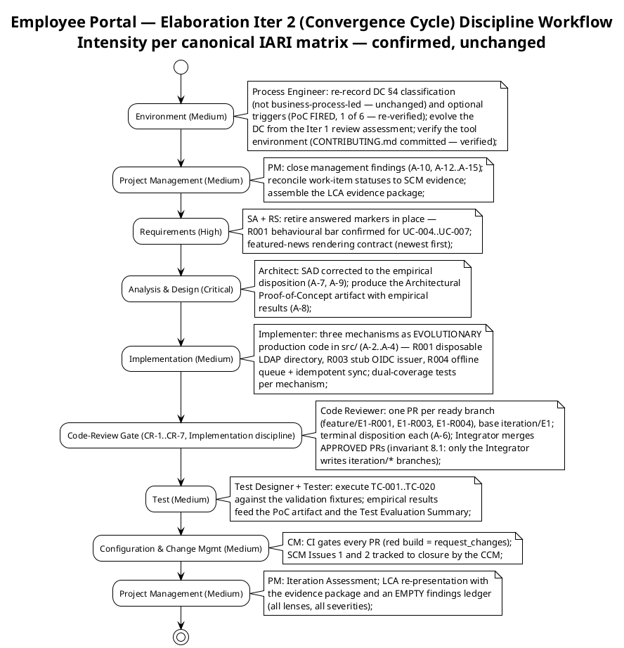
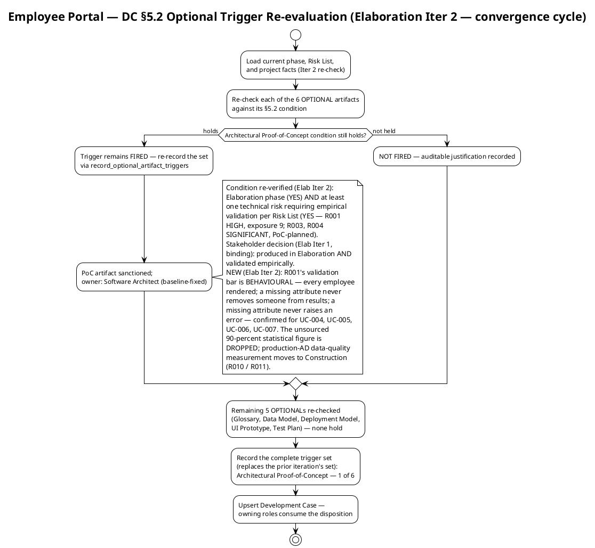
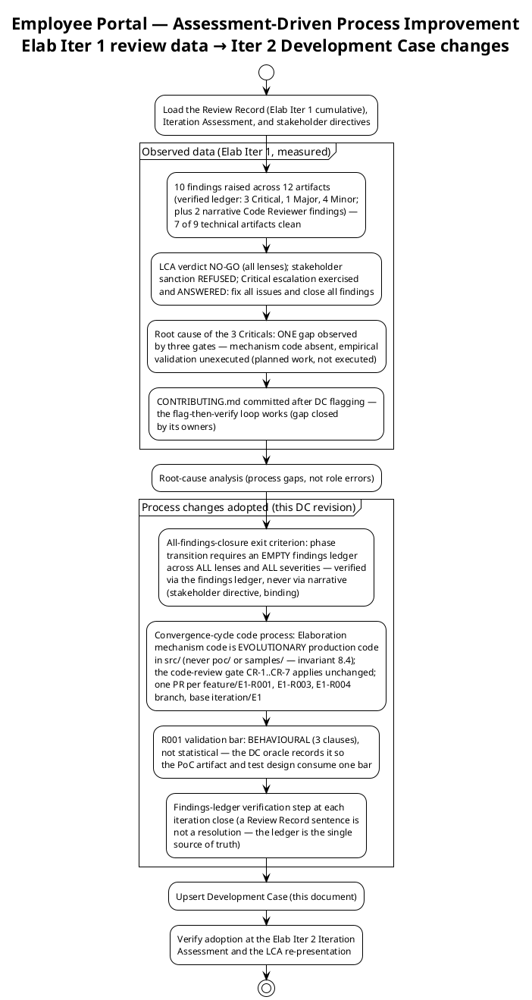

## Document Control

| Field | Value |
|---|---|
| Phase | Elaboration |
| Status | Draft — Elaboration Iter 2 (convergence cycle) evolution; submitted for LCA-track review |
| Milestone Target | End of Elaboration (LCA) — NOT yet achieved; this iteration closes the Iter 1 findings and assembles the evidence package for LCA re-presentation |
| Iteration | 2 (Cycle 1) |
| Date | 2026-09-02 |
| Prior Review | 0 findings on the Development Case across Inception (LCO: GO) and Elaboration Iter 1 (technical LCA lens: Approved, zero findings) — valid content preserved, evolved per the Iter 1 process assessment |
| Governance Re-recorded (Elab Iter 2) | DC §4 classification: unchanged — not business-process-led (re-recorded 2026-09-02). Version policy: unchanged — .NET 10 framework pin (CON-001); no new declared versions. Optional triggers: **unchanged — Architectural Proof-of-Concept FIRED** (1/6, re-verified; R001 validation bar now BEHAVIOURAL per stakeholder decision) |
| Stakeholder Decisions Incorporated (Elab Iter 2) | (1) R001 validation bar is behavioural, not statistical — the unsourced >90% figure is dropped; production-AD data-quality measurement moves to Construction. (2) The behavioural bar applies to all four AD-reading UCs (UC-004, UC-005, UC-006, UC-007). (3) Featured-news rendering contract: newest first. (4) Binding directive from the Iter 1 LCA review: fix ALL findings including Minors before phase transition — adopted as exit criterion 9 |

## Tailoring Overview

This Development Case specifies project-specific **deltas** over the IARI DC baseline. The baseline defines 25 active roles, 16 CORE artifacts, 6 OPTIONAL artifacts, fixed ownership, and a canonical discipline-intensity matrix. This document declares only deviations; it never restates the baseline.

### Organization Assessment (updated with measured Elaboration Iter 1 review experience)

| Factor | Finding |
|---|---|
| Agent role count | 25 roles per IARI baseline roster — all active except BPA (Business Modeling inactive) |
| Project type | Internal intranet web application for Cuba Corp (200 employees, 3 offices) |
| Complexity | Moderate — CRUD-centric portal with 10 FRs, 2 external integrations (AD/LDAP read-only, Keycloak OIDC), single-server deployment |
| Risk profile | R001 (HIGH, exposure=9) MITIGATING — empirical validation executing this convergence cycle; R003/R004 (SIGNIFICANT) MITIGATING; R010 re-scoped to Construction; R011 (validation-environment fidelity) added; R002/R005–R009 OPEN |
| Process maturity | First RUP project for this organization; Inception closed in 2 iterations (LCO GO); Elaboration Iter 1 reviewed NO-GO with 10 findings (verified ledger: 3 Critical, 1 Major, 4 Minor + 2 narrative Code Reviewer findings) — the convergence cycle is the first formal rework iteration |
| Elaboration Iter 1 review experience (measured) | 7 of 9 technical artifacts clean; defect concentration: SAD (3), Iteration Plan (3), Risk List (2), SCM state (2). Root cause of the 3 Criticals: ONE gap (mechanism code absent / empirical validation unexecuted) observed by three gates. Critical-escalation path exercised and ANSWERED in-round — the escalation discipline is proven end-to-end. Process changes adopted below (§ Guidelines, Assessment-Driven Improvements) |

### Tool Assessment (verified this iteration — S4)

| Tool Category | Declared (from Constraints) | Verified Status (2026-09-02) |
|---|---|---|
| Runtime / Framework | .NET 10 (CON-001) | Framework pin recorded; CI builds on .NET 10 (`ci.yml` verified) |
| Frontend | Razor Pages, no SPA (CON-002) | Part of .NET 10 ecosystem |
| Database | PostgreSQL (CON-003) | Declared; no version pinned by stakeholder; Npgsql 10.0.3 resolved by Software Architect against the registry |
| Auth | Keycloak OIDC, pre-existing (CON-004) | External — client registration pending STK-004 (R010); PoC validates against a stub issuer (no real realm) |
| Directory | Active Directory over LDAP, read-only (CON-005, CON-006) | External — service account pending STK-004 (R010); PoC validates against a disposable directory |
| Hosting | Internal Windows Server (CON-008) | Single node; provisioning pending STK-004 (R010) |
| UI Design | `docs/inputs/employee-portal-design.html` (CON-011) | Provided — mandatory and authoritative |
| Browsers | Chrome + Edge (CON-010) | Current versions |
| SCM / CI | Git-based repository, GitHub workflows | **`ci.yml` and `deploy.yml` VERIFIED** (see § Guidelines, Tool Configuration References) |
| Programming guidelines | `CONTRIBUTING.md` | **✅ COMMITTED** (verified via SCM, sha `6662813142160f6a660327f5d4a1700c036d099c`) — ARCH-1..ARCH-10 architectural rules, coding conventions, branch strategy, PR checklist; CR-1 now has a citable rule baseline |
| Branch strategy | `docs/BRANCHING_STRATEGY.md` | **✅ VERIFIED** (sha `dbe3d9f9b52575f7549bcdd04789efd7e38e9a16`) — invariants 8.1/8.2/8.4, baseline register, E1 lifecycle |

### Gaps Identified (re-verified 2026-09-02)

1. ~~`CONTRIBUTING.md`~~ — **CLOSED this iteration** (verified via SCM; sha above). The flag-then-verify loop worked: the Process Engineer flagged the gap in the Iter 1 DC, the owners (Implementer / Software Architect / ConfigurationManager) committed it, and this iteration verifies closure. SCM Issue #2's precondition is satisfied in the repository.
2. `.editorconfig` + `Directory.Build.props` — **still absent** (verified via SCM, 2026-09-02). Lint / analyzer rules owned by Implementer. Non-blocking for the convergence cycle (CR-1 cites CONTRIBUTING.md rules); flagged for the owner.
3. STK-004 deliverables (R010) — LDAP service account, Keycloak client registration, Windows Server provisioning. Per the stakeholder's decision (Elab Iter 1), these block only **integration with the specific production instances** — a separate, smaller risk tracked on its own and taken to Construction; they do NOT block the PoC's empirical validation, which runs against a disposable directory (R001) and a stub OIDC issuer (R003). Project Manager owns the engagement.

## Disciplines and Intensity

Intensity per discipline/phase is **per the canonical IARI DC matrix** — confirmed, not reassigned. No deviation is proposed; none is self-granted. Validation against the actual risk profile: R001 (HIGH) → Analysis & Design Critical in Elaboration is consistent with the canonical matrix — no stakeholder deviation request warranted.

**Inactive discipline (delta):** Business Modeling — INACTIVE. The stakeholder declared 10 concrete functional requirements (FR-001–FR-010) for a software replacement of manual tools (Excel, email, PDF directory). No business-process reengineering, no business object model, no workflow transformation. Per DC §4 criteria, this project is **not business-process-led** (re-recorded this iteration, 2026-09-02; verdict unchanged; independently verified by the Business Reviewer lens at the Iter 1 LCA review — BR-OK-INACTIVE).

**Active-discipline tailoring notes (Elaboration Iter 2 — convergence cycle):**

| Discipline | Tailoring Note |
|---|---|
| Requirements | Markers retired in place as stakeholder answers arrive: R001 behavioural bar confirmed for all four AD-reading UCs (UC-004 person card blank fields; UC-005 event row blank display fields; UC-006 CSV blank cells, no abort; UC-007 employee locatable and selectable); featured-news rendering contract = newest first (single banner, newest featured item) |
| Analysis & Design | SAD corrected to the empirical disposition (A-7) and Logical View dependencies reconciled with the Design Model (A-9); the Architectural Proof-of-Concept artifact carries EMPIRICAL results for R001/R003/R004 (A-8) — R001's bar is behavioural (3 clauses), not statistical; Design Model remains **co-owned** (Designer / DatabaseDesigner / UserInterfaceDesigner) — section-scoped upserts only |
| Implementation | **Convergence-cycle code process (corrected this iteration):** the three mechanisms are EVOLUTIONARY production code in `src/` (never a `poc/` branch or `samples/` directory — invariant 8.4) — R001 → COMP-007/CLS-009 against a disposable LDAP directory; R003 → COMP-006/CLS-010 against a stub OIDC issuer; R004 → COMP-009/CLS-008 offline queue + idempotent sync. Dual-coverage tests per mechanism (black-box contract + white-box paths). Branches `feature/E1-{risk-id}` from `iteration/E1`, labeled `ready-for-review`; the code-review gate CR-1..CR-7 applies unchanged — CI green is a hard gate, CR-1 cites CONTRIBUTING.md rules (now committed) |
| Test | TC-001..TC-020 executed against the validation fixtures (disposable LDAP directory, stub OIDC issuer, PG dev, drop simulation); empirical results feed the PoC artifact; regression of prior results each iteration |
| Deployment | Single-node topology baselined in SAD; deploy jobs deferred to Construction pending R010 |
| Configuration & Change Mgmt | CI verified green on main; branch families enforced in `ci.yml`; baseline register (`baseline-elaboration-E1-v1` PENDING — dual gate not yet evaluable); SCM Issues #1/#2 tracked to closure by the CCM |
| Project Management | Close management findings (A-10, A-12..A-15); reconcile Work Item 7–9 statuses to SCM evidence at iteration close; production-instance integration (STK-004) is a separate, smaller risk taken to Construction — tracked on its own, not inheriting R001's HIGH; budget from measured actuals |
| Environment | This document; trigger re-evaluation each iteration (mandatory — executed); tool environment verification (executed this iteration) |

## Artifacts and Templates

### CORE Artifacts (16) — All Confirmed

All 16 CORE artifacts are produced per their standard ownership and phase schedule. No CORE artifact is omitted; no ownership is reassigned. Primary ownership per IARI baseline — unchanged, not restated here. Elaboration Iter 2 (convergence cycle) activity mapping:

| CORE Artifact | Convergence-Cycle Activity |
|---|---|
| Vision | Preserved (Inception baseline; 0 findings) |
| Use-Case Model | Markers retired in place (behavioural bar UC-004..UC-007; featured-news contract) |
| Supplementary Specification | Thresholds consistent with the behavioural bar; the >90% statistical figure dropped from the R001 evidence chain |
| Software Architecture Document | Corrected to the empirical disposition (A-7); Logical View dependencies reconciled (A-9); LCA criterion 3 corrected |
| Design Model | Co-owned evolution: analysis/design + data + UI sections (section-scoped upserts only) |
| Implementation Model | Three mechanisms as evolutionary code in `src/` with dual-coverage tests (A-2..A-4) |
| Test Case | TC-001..TC-020 executed against the validation fixtures |
| Test Evaluation Summary | Empirical results recorded; honest verdicts |
| User Documentation | Deferred to Construction |
| Release Notes | Deferred to Transition |
| Iteration Plan | All-findings-closure exit criterion added (A-12); queue forecasts removed (A-13); statuses reconciled to SCM evidence (A-11) |
| Iteration Assessment | Convergence-cycle actuals recorded at close (PM) |
| Risk List | Trend column added (A-14); human-gate queue risk bounded (A-15); >90% criterion resolved per the behavioural-bar decision (A-10) |
| Review Record | Cumulative — convergence-cycle reviews R1..R6 append; findings closed by their emitting lenses |
| Development Case | This document (Elaboration Iter 2 evolution) |
| Change Request | Construction onwards (CCM); SCM Issues #1/#2 carry the live state machine |

### OPTIONAL Artifacts (6) — Trigger Evaluation (Elaboration Iter 2)

| Optional Artifact | §5.2 Trigger Condition | Fired? | Justification |
|---|---|---|---|
| Glossary | Domain uses specialist vocabulary requiring stakeholder-validated definitions | **No** | Standard HR/IT intranet vocabulary; no regulated/medical/financial jargon |
| Architectural Proof-of-Concept | Elaboration phase + at least one technical risk requiring empirical validation (per Risk List) | **YES — FIRED** | Elaboration + R001 (HIGH, P=3 I=3) requiring empirical validation; R003/R004 (SIGNIFICANT) PoC-planned. Condition genuinely holds — re-verified this iteration; see § Optional Artifact Triggers |
| Data Model | Data-centric system OR >10 entities OR data-migration in scope | **No** | ~5 tables (clockings, news_items, news_audit, worker_categories, category_audit); not data-centric; no migration; data lives inline in Design Model |
| Deployment Model | Distributed / multi-node topology, OR multi-environment non-trivial | **No** | Single internal Windows Server (CON-008), corporate network only (CON-009); deployment is a section in SAD |
| User-Interface Prototype | UX-critical OR UI complexity requiring stakeholder validation before implementation | **No** | CON-011 provides the mandatory, authoritative design; interaction design is carried by Use-Case Model storyboards + Design Model boundary classes/navigation map |
| Test Plan | Formal delivery / regulatory audit / contractual test reporting | **No** | Internal intranet app; no regulatory or contractual test reporting; per-iteration testing scope lives in the Iteration Plan |

**Result: 1 of 6 OPTIONAL artifacts triggered** (unchanged from Iter 1 — the whole set is re-evaluated every iteration; the PoC trigger's condition still genuinely holds).

## Optional Artifact Triggers

Recorded via `record_optional_artifact_triggers` (Elaboration Iter 2, 2026-09-02): `["Architectural Proof-of-Concept"]`. This replaces the prior iteration's set — the whole set is re-evaluated every iteration.

**PoC disposition (binding for downstream roles — updated with the Elab Iter 2 stakeholder decisions):** the Software Architect produces the Architectural Proof-of-Concept artifact carrying **empirical results** for R001 (disposable LDAP directory), R003 (stub OIDC issuer), and R004 (direct drop simulation). The mechanisms are the SAD's designed components (COMP-006 OIDC, COMP-007 LDAP, COMP-009 offline resilience) built as evolutionary production code in `src/`. Ownership is baseline-fixed (Software Architect) — this Development Case does not reassign it.

**R001 validation bar — BEHAVIOURAL, not statistical (stakeholder decision, Elab Iter 2; marker retired in place):** the stakeholder's decision, in their own words:

- *"You are right that the figure has no source. It is invented — drop it."*
- *"But look at what it would measure. You seed the disposable directory yourselves, so '>90% populated' measures our own test data, not the risk. It cannot fail, so it proves nothing."*
- *"R001 is not 'how many attributes are missing' — that is a property of the real directory and nobody can know it until STK-004 delivers. The architectural risk is what the portal DOES when an attribute is absent."*
- *"So the bar is behavioural, not statistical: every employee is rendered whether or not their attributes are complete; a missing attribute never removes someone from search results; a missing attribute never raises an error. Seed the gaps deliberately and prove those three hold."*
- *"The percentage belongs to a different activity: measuring the real AD's data quality once STK-004 delivers. Track it there, in Construction, and keep it out of the LCA evidence package."*

**Scope of the behavioural bar (stakeholder confirmation, Elab Iter 2):** the bar applies to **all four AD-reading use cases**, not only the directory search — UC-004 (person card: blank fields), UC-005 (HR clocking review: event row with blank display fields — clocking data is portal data, always complete), UC-006 (CSV export: every event row exported with blank cells for missing display fields, no abort — ad_user_id always present), UC-007 (worker category assignment: employee locatable and selectable with blank fields).

**Binding consequences:** (1) the PoC artifact's R001 evidence is the three behavioural clauses verified against the disposable directory with gaps seeded deliberately — a statistical population percentage is NOT LCA evidence; (2) the production-AD data-quality measurement is Construction integration work (R010/R011), excluded from the LCA evidence package; (3) the disposable directory and stub issuer are PoC scaffolding retained as reusable Construction test fixtures — they do not alter the declared architecture (ADR-001..004 unchanged).

Re-evaluation schedule: every iteration, mandatory. A trigger may newly fire via a Change Request or scope expansion; a fired trigger is re-verified against its condition (an auditable claim, checked at review).

## Roles and Ownership

The 25-role IARI baseline roster is confirmed unchanged. No roles are merged, added, or removed. Primary artifact ownership is baseline-fixed and not restated or reassigned here.

**Role with no artifact output this project:** BusinessProcessAnalyst (BPA) — Business Modeling discipline INACTIVE; the BPA role exists in the roster but produces no artifacts. The Vision artifact is co-owned by System Analyst per baseline ownership rules.

```plantuml
@startuml
!theme plain
title Employee Portal — Role-Artifact Responsibility Matrix (Elaboration Iter 2 convergence-cycle deltas)

skinparam classAttributeIconSize 0

package "Requirements (High)" {
  class SystemAnalyst <<SA>> {
    + Use-Case Model (UC-001..010, authority; markers retired in place)
  }
  class RequirementsSpecifier <<RS>> {
    + UC threshold quantification
  }
}

package "Analysis & Design (Critical)" {
  class SoftwareArchitect <<ARCH>> {
    + Software Architecture Document (corrected: A-7, A-9)
    + Architectural Proof-of-Concept (empirical results: A-8)
  }
  class Designer <<DS>> {
    + Design Model (analysis/design sections)
  }
  class UserInterfaceDesigner <<UID>> {
    + Design Model (UI sections)
  }
  class DatabaseDesigner <<DBD>> {
    + Design Model (data sections)
  }
}

package "Implementation (Medium)" {
  class Implementer <<IM>> {
    + Implementation Model
    + src/ mechanism code (A-2..A-4): R001 LdapGateway, R003 OIDC provider, R004 offline queue — evolutionary, dual-coverage tests
  }
  class Integrator <<INT>> {
    + iteration/E1 workspace (invariant 8.1)
    + merges APPROVED mechanism PRs
  }
  class CodeReviewer <<CR>> {
    + Review Record (code-review gate sections: PR dispositions, A-6)
  }
}

package "Test (Medium)" {
  class TestManager <<TM>> {
    + Test Evaluation Summary
  }
  class TestDesigner <<TD>> {
    + Test Case (TC-001..TC-020)
  }
  class Tester <<TST>> {
    + executes TC-001..TC-020 against validation fixtures
  }
}

package "Project Management (Medium)" {
  class ProjectManager <<PM>> {
    + Iteration Plan (A-11..A-13)
    + Risk List (A-10, A-14, A-15)
    + Iteration Assessment
  }
}

package "Environment (Medium)" {
  class ProcessEngineer <<PE>> {
    + Development Case (this document)
  }
}

package "Configuration & Change Mgmt (Medium)" {
  class ConfigurationManager <<CM>> {
    + .github/workflows/ci.yml, deploy.yml
    + docs/BRANCHING_STRATEGY.md
  }
  class ChangeControlManager <<CCM>> {
    + Change Request ledger (SCM Issues 1 and 2 tracked to closure)
  }
}

package "Review (convergence calendar R1-R6)" {
  class Reviewer <<RV>> {
    + Review Record (technical lens)
  }
  class ReviewCoordinator <<RC>> {
    + Review Record (consolidation; LCA entry gate)
  }
}

RequirementsSpecifier --> SystemAnalyst : quantifies UC thresholds
SystemAnalyst --> SoftwareArchitect : UC Model feeds the SAD
Implementer --> Integrator : labels feature/E1-R001, E1-R003,\nE1-R004 branches ready-for-review
Integrator --> CodeReviewer : PR base = iteration/E1\n(Code Reviewer owns the PR and its base)
CodeReviewer --> Implementer : terminal disposition\n(approve / request_changes)
CodeReviewer --> Reviewer : dispositions append to the\ncumulative Review Record
Tester --> TestDesigner : executes the designed cases
Tester --> SoftwareArchitect : empirical results feed\nthe PoC artifact (A-8)
ProjectManager --> SoftwareArchitect : R010 engagement\n(Construction only)
ProcessEngineer --> SoftwareArchitect : PoC trigger oracle\n(FIRED — content basis)
ConfigurationManager --> Implementer : CI gates every push
ChangeControlManager --> Reviewer : CRs feed the Review Record
ReviewCoordinator --> Reviewer : entry gate verified before\nLCA re-presentation

note bottom of SoftwareArchitect
  Convergence-cycle delta: the PoC
  artifact carries EMPIRICAL results
  for R001 / R003 / R004. R001's
  validation bar is BEHAVIOURAL
  (stakeholder decision, Elab Iter 2);
  the unsourced 90-percent statistical
  figure is dropped from the LCA
  evidence package.
end note

note right of Integrator
  Only the Integrator writes
  iteration/* branches
  (BRANCHING_STRATEGY 8.1).
end note
@enduml
```

**Co-ownership discipline (binding):** the Design Model is co-authored by Designer (analysis/design sections), DatabaseDesigner (data sections), and UserInterfaceDesigner (UI sections). Each owns ONLY their sections; every evolution uses section-scoped upserts. A full-document overwrite of a co-owned artifact destroys collaborator sections and is the worst failure in collaborative work.

## Guidelines and Procedures

### Elaboration Iteration 2 Entry Criteria (convergence cycle — verified met at iteration start)

| Criterion | Evidence |
|---|---|
| LCA Iter 1 review completed — verdict NO-GO recorded; phase auto-iterates into the already-planned Elab Iter 2 (BUILDING) | Review Record (Elab Iter 1): requiresIteration = TRUE |
| Critical-escalation DISCHARGED — stakeholder resolution received: fix all issues and close all findings | Review Record (Coordinator consolidation); binding on phase transition |
| Convergence action chain A-1..A-15 assigned with owners and iteration-relative deadlines | Review Record (Consolidated Finding Tracker) |
| `iteration/E1` integration workspace exists (A-1) | SCM (branch created; skeleton only — mechanism code is this cycle's work) |
| `CONTRIBUTING.md` committed (A-5 precondition for CR-1) | SCM (verified this iteration, sha `6662813…`) |

### Elaboration Exit Criteria (LCA) — the gate this phase works toward

| # | Criterion | DC Contribution |
|---|---|---|
| 1 | Product vision stable | All 10 UCs full-depth; stakeholder decisions recorded and markers retired in place (timestamp convention, America/Havana, offline mechanism, behavioural bar, featured-news contract) |
| 2 | Architecture stable | SAD 4+1 baseline; ADR-001..004 decided; SAD corrected to the empirical disposition (A-7) and dependencies reconciled (A-9) |
| 3 | Major risks addressed | **Architectural Proof-of-Concept (FIRED)** — produced in Elaboration AND validated empirically: R001 against a disposable directory with gaps seeded deliberately, judged against the **behavioural bar** (every employee rendered; a missing attribute never removes someone from results; a missing attribute never raises an error — confirmed for UC-004..UC-007); R003 against a stub OIDC issuer; R004 direct. No fabricated results; no statistical population percentage in the LCA evidence package. Production-instance integration is a separate, smaller risk taken to Construction — no LCA condition depends on STK-004 ticket closure |
| 4 | Construction plan sufficiently detailed | UC assignments cross-checked against Use-Case Model (F1 lesson); all-findings-closure criterion added to the plan (A-12) |
| 5 | Stakeholders agree vision achievable | LCA re-presentation sanction — the stakeholder's decision, never self-declared |
| 6 | Actual vs planned expenditure acceptable | Two clocks measured apart; never summed |
| 7 | **DC-specific:** every active discipline has a tailoring section in this Development Case | § Disciplines and Intensity + § Guidelines — met this iteration |
| 8 | **DC-specific:** tool environment passes verification | CI verified ✓; CONTRIBUTING.md committed ✓ (verified this iteration); `.editorconfig`/`Directory.Build.props` gaps explicitly deferred with rationale (non-blocking — CR-1 cites CONTRIBUTING.md) |
| 9 | **DC-specific (NEW — binding stakeholder directive):** findings ledger EMPTY across ALL review lenses and ALL severities (Critical, Major, Minor) before phase transition is sanctioned | Verified via the findings ledger (the single source of truth), never via narrative claims; each finding is closed by its emitting lens. Directive recorded verbatim by the stakeholder at the Iter 1 LCA review: fix all findings, including minors, before moving to the next phase |

### Assessment-Driven Process Improvements (adopted from measured Elaboration Iter 1 review data)

Each change is traceable to a specific observed defect with data (the 10-finding distribution, the triple-gate root cause, the CONTRIBUTING.md closure, the stakeholder's binding directive) — no speculative process change was adopted. Adoption is verified at the next Iteration Assessment.

### Measurement Policy

IARI measures two quantities: **tokens consumed** and **elapsed time** (split into agent time and human queue time). The two clocks are reported side by side and **never summed**. Person-weeks, story points, and function points are not producible in this system and are never used.

| Metric | Decision It Enables | Who Reads It | When |
|---|---|---|---|
| Tokens consumed per discipline per iteration | Scope adjustment — if a discipline exceeds budget, PM trims scope for next iteration | Project Manager | End of each iteration |
| Agent time vs human queue time ratio | Process bottleneck identification — if human queue time dominates, Process Engineer adjusts review cadence or parallelism | Process Engineer | End of each iteration |
| Total tokens per phase | Cost-box compliance — iteration ends when exit criteria pass OR budget is spent | Project Manager, Process Engineer | Phase boundary |

**Recorded phase actuals (Inception, closed):** 2 iterations, 28 min agent time, 0s stakeholder queue, 1,347,939 tokens, 11 agent runs, 10 artifacts (work-order recorded actuals). **Data-integrity note for the Project Manager:** the Iteration Assessment's cumulative figures (3,550,308 tokens; 1:52:46 agent time across both iterations) differ from the phase-level row above; the PM owns reconciling the two records at the next Iteration Assessment. Elaboration figures are recorded at phase close — none exist yet; no per-iteration velocity is quoted. **Human-gate planning rule (binding):** a human gate is a RISK, not an estimate — ceiling 14 days (then the process suspends; nothing is auto-filled), actual measured and reported apart, estimate NONE; bound it in the Risk List (A-15), never forecast it in the plan (A-13).

### Tool Configuration References (verified 2026-09-02)

| Configuration | Owner | File Path | Verified Status |
|---|---|---|---|
| CI pipeline | ConfigurationManager | `.github/workflows/ci.yml` | **✅ VERIFIED** — build + test jobs, .NET 10, triggers on `main`, `iteration/**`, `chore/**`, `feature/**`, `hotfix/**` (push + PR); green on main per Test Evaluation Summary |
| Deploy pipeline skeleton | ConfigurationManager | `.github/workflows/deploy.yml` | **✅ VERIFIED** — build/publish artifact; deploy-dev/deploy-production jobs correctly deferred to Construction pending R010 (two-gate model) |
| Programming guidelines | Implementer / Software Architect | `CONTRIBUTING.md` | **✅ COMMITTED** (verified via SCM, sha `6662813142160f6a660327f5d4a1700c036d099c`) — ARCH-1..ARCH-10 architectural rules (incl. ARCH-6 graceful degradation = the R001 behavioural bar), coding conventions, PR checklist; CR-1 rule baseline in place for the mechanism PRs |
| Branch strategy documentation | ConfigurationManager | `docs/BRANCHING_STRATEGY.md` | **✅ VERIFIED** (sha `dbe3d9f9b52575f7549bcdd04789efd7e38e9a16`) — branch topology, baseline register (`baseline-elaboration-E1-v1` PENDING), invariants 8.1/8.2/8.4; CONTRIBUTING.md carries the essentials section |
| Lint / analyzer rules | Implementer | `.editorconfig`, `Directory.Build.props` | **❌ GAP** — files absent (verified via SCM, 2026-09-02); flagged for owner; non-blocking for the convergence cycle (CR-1 cites CONTRIBUTING.md) |
| UI design specification | UserInterfaceDesigner | `docs/inputs/employee-portal-design.html` | **✅ Provided by stakeholder (CON-011)** — mandatory and authoritative |

Guideline content itself (coding standards, UI patterns, test conventions) is authored by the owning discipline experts in the files above — this Development Case references those files and does not duplicate their content. The remaining gap is a process-support item: the Process Engineer flags it; the owner closes it.

### Process Support

During active iterations, the Process Engineer serves as the process help desk:
- Process questions (which template, which artifact, which workflow step) are answered within the same iteration cycle.
- Blocking process issues are escalated immediately to the stakeholder via the input-emission channel (emission marker immediately followed by a minimal JSON array, on one line).
- Tool configuration problems are logged and assigned to the owning discipline role.
- **Question format (binding, from measured Inception lesson):** stakeholder-input payloads use minimal JSON — `question` / `type` / `isRequired` only. `options`, `recommendation`, and `reason` fields break the parser.
- **Emission discipline (binding, from the measured Iter 1 incident):** the emission marker string must NEVER appear in artifact prose, diagrams, or response narration — the parser scans every occurrence, and a marker not immediately followed by a valid JSON array invalidates the turn. The marker is written ONLY as an actual emission — marker immediately followed by the JSON array, nothing else on that line, no other bracketed construct between them.
- **Marker retirement (binding):** when the stakeholder answers a scope/derivation/assumption marker, the owning role retires the marker in the artifact itself, writing the stakeholder's literal values. Six markers have been retired this way (offline mechanism; timestamp convention; office local timezone = America/Havana; PoC empirical scope; R001 behavioural bar + its four-UC scope; featured-news rendering contract) — the discipline is proven and mandatory.

### Incremental Rollout Plan

| Iteration | Disciplines Introduced | Status |
|---|---|---|
| Inception | Environment, PM, Requirements, A&D (draft), Implementation (skeleton), Test (strategy), CM | **Complete** — LCO achieved |
| Elaboration Iter 1 | Full A&D (4+1 baseline), Test (detailed cases), CM (full CI verified) | **Complete** — reviewed NO-GO; findings feed the convergence cycle |
| Elaboration Iter 2 (this — convergence cycle) | Implementation code-review gate activated (CR-1..CR-7 on mechanism PRs); Test execution; empirical PoC validation | **In progress** |
| Construction | Full Implementation, Test (execution), Deployment, production-instance integration (STK-004) | Planned |
| Transition | Documentation, Release Notes, Deployment (final) | Planned |

## Traceability

| Element | Traces From | Link Type | Traces To |
|---|---|---|---|
| Development Case (this) | IARI DC Baseline | Refines | All project artifacts (governs production) |
| Business Modeling INACTIVE | DC §4 classification (re-recorded Elab Iter 2, verdict unchanged; BR lens verified BR-OK-INACTIVE) | Derives | record_dc_classification(isBusinessProcessLed=false) |
| PoC trigger FIRED | DC §5.2 condition + R001 (Risk List) + Elaboration phase | Derives | record_optional_artifact_triggers(["Architectural Proof-of-Concept"]); SoftwareArchitect (owner); SAD PoC plan (content basis) |
| PoC empirical scope (stakeholder decision, Elab Iter 1) | Stakeholder answer: the PoC is produced in Elaboration and validated empirically — R001 via disposable directory, R003 via stub OIDC issuer, R004 direct; production-instance integration tracked separately, taken to Construction | Authorizes | Architectural Proof-of-Concept (empirical results required); LCA exit criterion 3; Risk List (production-integration entry) |
| R001 behavioural bar (stakeholder decision, Elab Iter 2 — marker retired) | Stakeholder answer: the bar is behavioural, not statistical — every employee rendered; a missing attribute never removes someone from results; a missing attribute never raises an error; the unsourced >90% figure is dropped; production-AD data-quality measurement moves to Construction | Authorizes | Architectural Proof-of-Concept (R001 evidence = 3 behavioural clauses, gaps seeded deliberately); Test Case TC-011 fixture design; SAD §Quality; excludes statistical percentages from the LCA evidence package |
| Behavioural bar scope — four AD-reading UCs (stakeholder confirmation, Elab Iter 2) | Stakeholder answer: the bar applies to UC-004 (blank fields), UC-005 (blank display fields), UC-006 (blank CSV cells, no abort), UC-007 (locatable and selectable) | Authorizes | Use-Case Model (UC-004..UC-007 alternative flows); CONTRIBUTING.md ARCH-6; PoC artifact |
| Featured-news rendering contract (stakeholder decision, Elab Iter 2) | Stakeholder answer: newest first (single banner, newest featured item) on Home and News screens | Authorizes | Use-Case Model (UC-003, UC-008); Design Model UI sections |
| All-findings-closure exit criterion (criterion 9) | Stakeholder directive (Iter 1 LCA review, verbatim): fix all findings, including minors, before moving to the next phase; Review Record Iteration Plan F4 (Major, A-12) | Derives | Elaboration phase transition sanction; findings-ledger verification at each iteration close |
| Convergence-cycle code process (Implementation tailoring) | Stakeholder decision (empirical PoC); BRANCHING_STRATEGY §5.2, invariants 8.1/8.2/8.4; Review Record F-CR-E1-1 remediation (A-2..A-6); SCM Issue #1 | Derives | Implementer mechanism branches (feature/E1-R001, E1-R003, E1-R004); Code Reviewer PR dispositions; Integrator merges |
| Framework pin .NET 10 | CON-001 | Derives | record_version_policy(framework, .NET, 10) — unchanged this iteration; no new declared versions |
| Elaboration Iter 2 entry criteria | Review Record (Elab Iter 1: NO-GO, requiresIteration=TRUE; escalation discharged; A-1 done; A-5 done) | Refines | Convergence-cycle execution (actions A-1..A-15) |
| LCA exit criteria (1–9) | RUP LCA milestone criteria + SAD §LCA Review + stakeholder decisions (empirical PoC; behavioural bar; all-findings directive) | Refines | End-of-Elaboration milestone gate (re-presentation) |
| UC-ID cross-check gate | Review Record F1 (Major, resolved, Inception) + Iteration Assessment lesson 1 | Derives | All artifacts referencing UC IDs |
| Status-reconciliation step | Review Record F2 (Minor, resolved, Inception) + Iteration Plan F3 remediation (A-11) | Derives | Iteration Plan work items (reconciled to SCM evidence at iteration close) |
| Question format rule | Iteration Assessment lesson (stakeholder-input parser) | Derives | All stakeholder-input emissions |
| Emission discipline rule | Measured Iter 1 incident (invalidated turn; marker string in prose) | Derives | All stakeholder-input emissions; artifact authoring (no marker string in prose) |
| Marker-retirement discipline | Stakeholder decisions: offline mechanism, timestamp convention, America/Havana, PoC empirical scope, R001 behavioural bar (+ four-UC scope), featured-news contract | Authorizes | Use-Case Model, Supplementary Specification, SAD, this document (markers retired in-place) |
| CI verification | `.github/workflows/ci.yml` (SCM read) | DependsOn | Implementer, ConfigurationManager |
| Deploy skeleton verification | `.github/workflows/deploy.yml` (SCM read) | DependsOn | DeploymentManager (Construction), R010 |
| CONTRIBUTING.md closure | SCM read 2026-09-02 (sha `6662813…`); Review Record F-CR-E1-2 / SCM Issue #2 (A-5) | DependsOn | Code Reviewer CR-1 (citable rule baseline); first mechanism PR review |
| Branch strategy verification | `docs/BRANCHING_STRATEGY.md` (SCM read 2026-09-02, sha `dbe3d9f9…`) | DependsOn | Integrator, Implementer, Code Reviewer, ConfigurationManager |
| Lint gap (.editorconfig, Directory.Build.props) | Tool assessment (SCM read — not found, 2026-09-02) | DependsOn | Implementer (owner); non-blocking, explicitly deferred with rationale |
| R010 dependency (production instances only) | Risk List R010; SAD External Dependencies; stakeholder decision (Elab Iter 1) | DependsOn | ProjectManager (STK-004 engagement); Construction integration testing — NOT the PoC's empirical validation |
| Measurement actuals note | Work Order Measured Actuals + Iteration Assessment | Refines | ProjectManager (reconciliation at next Iteration Assessment) |
| Human-gate planning rule | IARI planning rule (gate = risk, not estimate; 14-day ceiling); Review Record Iteration Plan F5 / Risk List F1 (A-13, A-15) | Derives | Iteration Plan (no queue forecasts); Risk List (bounded gate-queue entry) |
| Co-ownership discipline | Design Model structure (Designer / DatabaseDesigner / UserInterfaceDesigner) | Refines | Design Model section-scoped upserts |