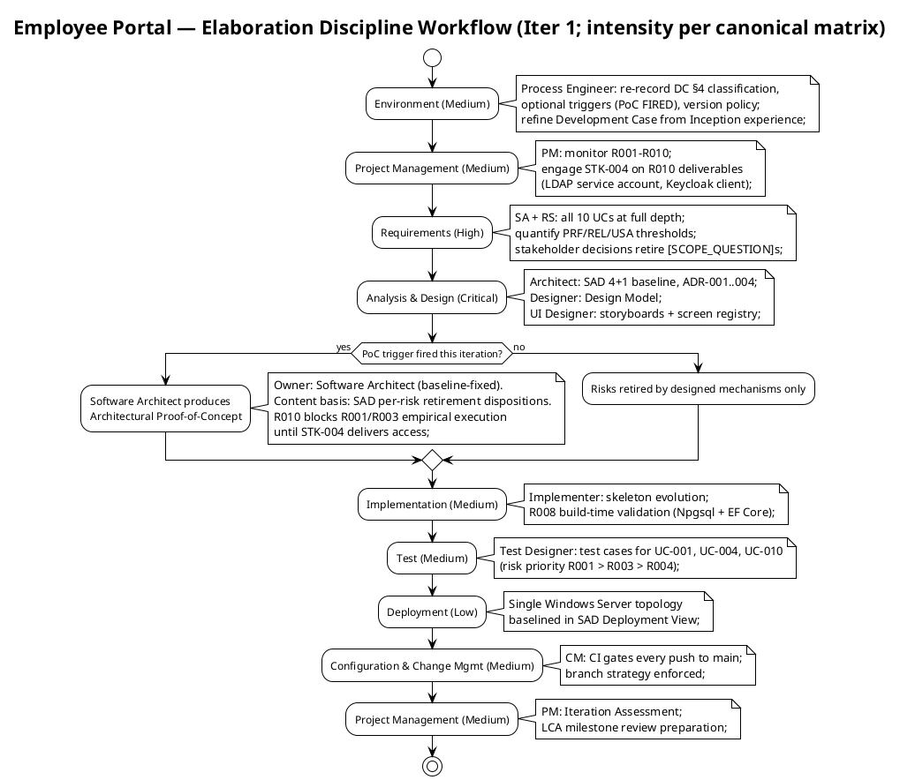
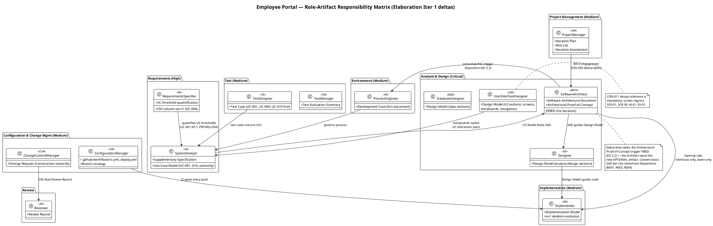
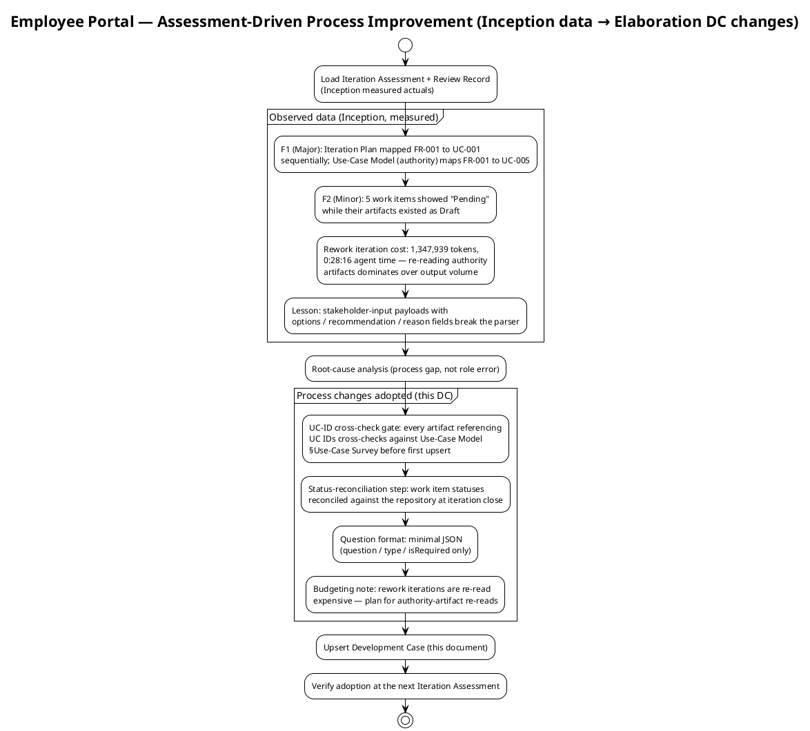

## Document Control

| Field | Value |
|---|---|
| Phase | Elaboration |
| Status | Draft — Elaboration evolution submitted for LCA-track review |
| Milestone Target | End of Elaboration (LCA) — NOT yet achieved; this iteration produces the baseline the milestone review will evaluate |
| Iteration | 1 (Cycle 1) |
| Date | 2026-09-01 |
| Prior Review | 0 findings on Development Case across both Inception iterations (LCO verdict: GO; stakeholder sanction granted) — valid content preserved, evolved for Elaboration |
| Governance Re-recorded (Elab Iter 1) | DC §4 classification: unchanged — not business-process-led. Version policy: unchanged — .NET 10 framework pin (CON-001). Optional triggers: **CHANGED — Architectural Proof-of-Concept FIRED** (0/6 → 1/6) |
| Open Question | PoC empirical scope under the R010 block — escalated to the stakeholder this iteration (see § Optional Artifact Triggers); blocks completion until answered |

## Tailoring Overview

This Development Case specifies project-specific **deltas** over the IARI DC baseline. The baseline defines 25 active roles, 16 CORE artifacts, 6 OPTIONAL artifacts, fixed ownership, and a canonical discipline-intensity matrix. This document declares only deviations; it never restates the baseline.

### Organization Assessment (updated with measured Inception experience)

| Factor | Finding |
|---|---|
| Agent role count | 25 roles per IARI baseline roster — all active except BPA (Business Modeling inactive) |
| Project type | Internal intranet web application for Cuba Corp (200 employees, 3 offices) |
| Complexity | Moderate — CRUD-centric portal with 10 FRs, 2 external integrations (AD/LDAP read-only, Keycloak OIDC), single-server deployment |
| Risk profile | R001 (HIGH, exposure=9); R002/R003/R004/R010 (SIGNIFICANT); R005–R009 (MODERATE) — 10 risks, all OPEN |
| Process maturity | First RUP project for this organization; Inception closed in 2 iterations (1 rework) with LCO achieved |
| Inception experience (measured) | 2 findings raised and resolved (1 Major UC-ID mismatch, 1 Minor stale statuses); rework iteration cost 1,347,939 tokens + 0:28:16 agent time; 3 stakeholder decisions retired [SCOPE_QUESTION]s in Elaboration Iter 1 — the escalation path is proven. Process changes adopted below (§ Guidelines, Assessment-Driven Improvements) |

### Tool Assessment (verified this iteration — S4)

| Tool Category | Declared (from Constraints) | Verified Status (2026-09-01) |
|---|---|---|
| Runtime / Framework | .NET 10 (CON-001) | Framework pin recorded; CI builds on .NET 10 (`ci.yml` verified) |
| Frontend | Razor Pages, no SPA (CON-002) | Part of .NET 10 ecosystem |
| Database | PostgreSQL (CON-003) | Declared; no version pinned by stakeholder; Npgsql 10.0.3 resolved by Software Architect against the registry |
| Auth | Keycloak OIDC, pre-existing (CON-004) | External — client registration pending STK-004 (R010) |
| Directory | Active Directory over LDAP, read-only (CON-005, CON-006) | External — service account pending STK-004 (R010) |
| Hosting | Internal Windows Server (CON-008) | Single node; provisioning pending STK-004 (R010) |
| UI Design | `docs/inputs/employee-portal-design.html` (CON-011) | Provided — mandatory and authoritative |
| Browsers | Chrome + Edge (CON-010) | Current versions |
| SCM / CI | Git-based repository, GitHub workflows | **`ci.yml` and `deploy.yml` VERIFIED** (see § Guidelines, Tool Configuration References) |

### Gaps Identified (re-verified 2026-09-01)

1. `CONTRIBUTING.md` — **still absent** (verified via SCM). Coding standards and branch-strategy documentation are owned by Implementer / Software Architect / ConfigurationManager. Branch conventions are already *enforced* by `ci.yml` triggers (`main`, `iteration/**`, `chore/**`, `feature/**`, `hotfix/**`), but the documenting section does not exist.
2. `.editorconfig` + `Directory.Build.props` — **still absent** (verified via SCM). Lint / analyzer rules owned by Implementer.
3. STK-004 deliverables (R010) — LDAP service account, Keycloak client registration, Windows Server provisioning. Blocks empirical execution of the R001/R003 PoC validations; Project Manager owns the engagement.

## Disciplines and Intensity

Intensity per discipline/phase is **per the canonical IARI DC matrix** — confirmed, not reassigned. No deviation is proposed; none is self-granted. Validation against the actual risk profile: R001 (HIGH) → Analysis & Design Critical in Elaboration is consistent with the canonical matrix — no stakeholder deviation request warranted.

**Inactive discipline (delta):** Business Modeling — INACTIVE. The stakeholder declared 10 concrete functional requirements (FR-001–FR-010) for a software replacement of manual tools (Excel, email, PDF directory). No business-process reengineering, no business object model, no workflow transformation. Per DC §4 criteria, this project is **not business-process-led** (re-recorded this iteration; verdict unchanged).



**Active-discipline tailoring notes (Elaboration):**

| Discipline | Tailoring Note |
|---|---|
| Requirements | All 10 UCs at full depth (Use-Case Model is the UC-ID authority); RS quantifies PRF/REL/USA thresholds; stakeholder decisions recorded this iteration retire markers in-place |
| Analysis & Design | SAD 4+1 baseline complete; Design Model is **co-owned** (Designer / DatabaseDesigner / UserInterfaceDesigner) — section-scoped upserts only; PoC artifact produced by Software Architect |
| Implementation | Skeleton evolution only; R008 (PostgreSQL + .NET 10) validated at build time; layering rule: dependencies point down, interfaces only |
| Test | Test cases target UC-001, UC-004, UC-010 first (risk priority); regression of prior results each iteration |
| Deployment | Single-node topology baselined in SAD; deploy jobs deferred to Construction pending R010 |
| Configuration & Change Mgmt | CI verified green on main; branch families enforced in `ci.yml` |
| Project Management | R010 engagement is critical path; budget from measured Inception actuals |
| Environment | This document; trigger re-evaluation each iteration (mandatory) |

## Artifacts and Templates

### CORE Artifacts (16) — All Confirmed

All 16 CORE artifacts are produced per their standard ownership and phase schedule. No CORE artifact is omitted; no ownership is reassigned. Primary ownership per IARI baseline — unchanged, not restated here. Elaboration-phase activity mapping:

| CORE Artifact | Elaboration Activity |
|---|---|
| Vision | Preserved (Inception baseline; 0 findings) |
| Use-Case Model | All 10 UCs full-depth + UI flow references (Elab Iter 1) |
| Supplementary Specification | Thresholds quantified; 3 stakeholder decisions incorporated |
| Software Architecture Document | 4+1 baseline; ADR-001..004; PoC plan corrected per DC oracle |
| Design Model | Co-owned evolution: analysis/design + data + UI sections |
| Implementation Model | Skeleton evolution; R008 build-time validation |
| Test Case | First cases: UC-001, UC-004, UC-010 |
| Test Evaluation Summary | Per-iteration test results (Construction execution) |
| User Documentation | Deferred to Construction |
| Release Notes | Deferred to Transition |
| Iteration Plan | Per-iteration plan (PM) |
| Iteration Assessment | Per-iteration assessment (PM) |
| Risk List | Monitored each iteration; R001–R010 all OPEN |
| Review Record | Per-iteration review (Reviewer) |
| Development Case | This document (Elaboration evolution) |
| Change Request | Construction onwards (CCM) |

### OPTIONAL Artifacts (6) — Trigger Evaluation (Elaboration Iter 1)

| Optional Artifact | §5.2 Trigger Condition | Fired? | Justification |
|---|---|---|---|
| Glossary | Domain uses specialist vocabulary requiring stakeholder-validated definitions | **No** | Standard HR/IT intranet vocabulary; no regulated/medical/financial jargon |
| Architectural Proof-of-Concept | Elaboration phase + at least one technical risk requiring empirical validation (per Risk List) | **YES — FIRED** | Elaboration Iter 1 + R001 (HIGH, P=3 I=3): the Risk List's declared mitigation is an Architectural PoC in Elaboration Iteration 1 ("if not tested early, the directory shows gaps"); R003/R004 (SIGNIFICANT) are PoC-planned. Condition genuinely holds — see § Optional Artifact Triggers |
| Data Model | Data-centric system OR >10 entities OR data-migration in scope | **No** | ~5 tables (clockings, news_items, news_audit, worker_categories, category_audit); not data-centric; no migration; data lives inline in Design Model |
| Deployment Model | Distributed / multi-node topology, OR multi-environment non-trivial | **No** | Single internal Windows Server (CON-008), corporate network only (CON-009); deployment is a section in SAD |
| User-Interface Prototype | UX-critical OR UI complexity requiring stakeholder validation before implementation | **No** | CON-011 provides the mandatory, authoritative design; interaction design is carried by Use-Case Model storyboards + Design Model boundary classes/navigation map |
| Test Plan | Formal delivery / regulatory audit / contractual test reporting | **No** | Internal intranet app; no regulatory or contractual test reporting; per-iteration testing scope lives in the Iteration Plan |

**Result: 1 of 6 OPTIONAL artifacts triggered** (Inception recorded 0/6 — the PoC trigger newly fires now that its phase condition holds; the Inception NOT-FIRED verdict was valid only because the trigger requires the Elaboration phase).

## Optional Artifact Triggers

Recorded via `record_optional_artifact_triggers` (Elaboration Iter 1): `["Architectural Proof-of-Concept"]`. This replaces the Inception set (`[]`) — the whole set is re-evaluated every iteration.

```plantuml
@startuml
!theme plain
title Employee Portal — DC §5.2 Optional Trigger Re-evaluation (Elaboration Iter 1)

start
:Load current phase, Risk List,
and project facts;
:Check each of the 6 OPTIONAL artifacts
against its §5.2 condition;
if (Architectural Proof-of-Concept condition holds?) then (holds)
  :FIRE the trigger — record the new trigger set
via record_optional_artifact_triggers;
  :PoC artifact sanctioned;
owner: Software Architect (baseline-fixed);
  note right
    Condition: Elaboration phase (YES — iter 1)
    AND at least one technical risk requiring
    empirical validation per Risk List.
    R001 (HIGH, P=3 I=3): declared mitigation
    is an Architectural PoC in Elaboration
    Iter 1 — "if not tested early, the
    directory shows gaps."
    R003, R004 (SIGNIFICANT): PoC-planned.
    R010 blocks R001/R003 empirical
    execution until STK-004 delivers.
  end note
else (not held)
  :NOT FIRED — auditable justification recorded;
endif
:Remaining 5 OPTIONALs re-checked
(Glossary, Data Model, Deployment Model,
UI Prototype, Test Plan) — none hold;
:Record the complete trigger set
(replaces the prior iteration's set);
:Upsert Development Case —
owning roles consume the disposition;
stop
@enduml
```

**PoC disposition reconciliation (binding for downstream roles):** the SAD's PoC plan (per-risk retirement dispositions: R001/R003/R004 analysis-only + designed mechanism) was written against the Inception trigger recording and explicitly deferred to this Development Case as oracle. With the trigger now FIRED, the **Software Architect produces the Architectural Proof-of-Concept artifact**; the SAD dispositions remain its content basis — the designed mechanisms (COMP-006 OIDC, COMP-007 LDAP, COMP-009 offline resilience) and their quantified acceptance criteria carry into the PoC unchanged. R010 (STK-004 deliverables) blocks empirical execution of the R001/R003 validations; the PoC must record this dependency explicitly rather than fabricating results. Ownership is baseline-fixed (Software Architect) — this Development Case does not reassign it.

**Open consequential question — asked this iteration; blocks completion until answered:** [SCOPE_QUESTION — PoC empirical scope under the R010 block: not declared in scope, but consequential for the Elaboration milestone's deliverable set and exit condition] The fired trigger sanctions the Architectural Proof-of-Concept, but the approved SAD was written under the not-fired assumption and positions empirical validation of R001/R003 as a Construction test activity blocked on STK-004 deliverables (R010 — no LDAP service account or Keycloak client registration confirmed by end of Elaboration Iteration 1; R010's declared trigger condition is therefore met). Whether the PoC is produced in Elaboration carrying the designed mechanisms and acceptance criteria with the R010 block documented and empirical validation deferred to Construction (confirming the SAD's approved position), or whether STK-004 delivery becomes a hard condition of Elaboration exit so that R001/R003 validate empirically before the LCA milestone, is a milestone-scope decision the stakeholder owns. Escalated to the stakeholder this iteration; the answer retires this marker in place, written with the stakeholder's literal words.

Re-evaluation schedule: every iteration, mandatory. A trigger may newly fire via a Change Request or scope expansion; a fired trigger is re-verified against its condition (an auditable claim, checked at review).

## Roles and Ownership

The 25-role IARI baseline roster is confirmed unchanged. No roles are merged, added, or removed. Primary artifact ownership is baseline-fixed and not restated or reassigned here.

**Role with no artifact output this project:** BusinessProcessAnalyst (BPA) — Business Modeling discipline INACTIVE; the BPA role exists in the roster but produces no artifacts. The Vision artifact is co-owned by System Analyst per baseline ownership rules.



**Co-ownership discipline (binding):** the Design Model is co-authored by Designer (analysis/design sections), DatabaseDesigner (data sections), and UserInterfaceDesigner (UI sections). Each owns ONLY their sections; every evolution uses section-scoped upserts. A full-document overwrite of a co-owned artifact destroys collaborator sections and is the worst failure in collaborative work.

## Guidelines and Procedures

### Elaboration Entry Criteria (verified met at phase start)

| Criterion | Evidence |
|---|---|
| LCO achieved — 0 open findings, stakeholder sanction granted, Review Coordinator confirmed | Review Record (Inception Iter 2): GO (APPROVED) |
| Scope baselined — 10 FRs → 10 UCs, Use-Case Model is UC-ID authority | Use-Case Model; Iteration Plan (F1 resolved) |
| Entry conditions monitored (advisory, not blockers) | STK-004 engagement for LDAP service account + Keycloak client registration (R010); R001/R003/R004 PoC scheduling — Project Manager owns |

### Elaboration Exit Criteria (LCA) — the gate this phase works toward

| # | Criterion | DC Contribution |
|---|---|---|
| 1 | Product vision stable | All 10 UCs full-depth; stakeholder decisions recorded (timestamp convention, offline mechanism) |
| 2 | Architecture stable | SAD 4+1 baseline; ADR-001..004 decided |
| 3 | Major risks addressed | **Architectural Proof-of-Concept (FIRED)** — R001/R003/R004 dispositions executed or R010 block documented; no fabricated results. Empirical scope of the R001/R003 validations under the R010 block is pending the stakeholder's answer to the open question in § Optional Artifact Triggers |
| 4 | Construction plan sufficiently detailed | UC assignments cross-checked against Use-Case Model (F1 lesson) |
| 5 | Stakeholders agree vision achievable | LCA review sanction — stakeholder's decision, never self-declared |
| 6 | Actual vs planned expenditure acceptable | Two clocks measured apart; never summed |
| 7 | **DC-specific:** every active discipline has a tailoring section in this Development Case | § Disciplines and Intensity + § Guidelines — met this iteration |
| 8 | **DC-specific:** tool environment passes verification | CI verified ✓; guideline gaps closed by owning roles or explicitly deferred with rationale |

### Assessment-Driven Process Improvements (adopted from measured Inception data)



Each change is traceable to a specific observed defect with data (F1, F2, rework cost, parser lesson) — no speculative process change was adopted. Adoption is verified at the next Iteration Assessment.

### Measurement Policy

IARI measures two quantities: **tokens consumed** and **elapsed time** (split into agent time and human queue time). The two clocks are reported side by side and **never summed**. Person-weeks, story points, and function points are not producible in this system and are never used.

| Metric | Decision It Enables | Who Reads It | When |
|---|---|---|---|
| Tokens consumed per discipline per iteration | Scope adjustment — if a discipline exceeds budget, PM trims scope for next iteration | Project Manager | End of each iteration |
| Agent time vs human queue time ratio | Process bottleneck identification — if human queue time dominates, Process Engineer adjusts review cadence or parallelism | Process Engineer | End of each iteration |
| Total tokens per phase | Cost-box compliance — iteration ends when exit criteria pass OR budget is spent | Project Manager, Process Engineer | Phase boundary |

**Recorded phase actuals (Inception, closed):** 2 iterations, 28 min agent time, 0s stakeholder queue, 1,347,939 tokens, 11 agent runs, 10 artifacts (work-order recorded actuals). **Data-integrity note for the Project Manager:** the Iteration Assessment's cumulative figures (3,550,308 tokens; 1:52:46 agent time across both iterations) differ from the phase-level row above; the PM owns reconciling the two records at the next Iteration Assessment. Elaboration figures are recorded at phase close — none exist yet; no per-iteration velocity is quoted.

### Tool Configuration References (verified 2026-09-01)

| Configuration | Owner | File Path | Verified Status |
|---|---|---|---|
| CI pipeline | ConfigurationManager | `.github/workflows/ci.yml` | **✅ VERIFIED** — build + test jobs, .NET 10, triggers on `main`, `iteration/**`, `chore/**`, `feature/**`, `hotfix/**` (push + PR); green on main per Test Evaluation Summary |
| Deploy pipeline skeleton | ConfigurationManager | `.github/workflows/deploy.yml` | **✅ VERIFIED** — build/publish artifact; deploy-dev/deploy-production jobs correctly deferred to Construction pending R010 (two-gate model) |
| Coding standards | Implementer / Software Architect | `CONTRIBUTING.md` | **❌ GAP** — file absent (verified via SCM); flagged for owners |
| Lint / analyzer rules | Implementer | `.editorconfig`, `Directory.Build.props` | **❌ GAP** — files absent (verified via SCM); flagged for owner |
| Branch strategy documentation | ConfigurationManager | `CONTRIBUTING.md` (section) | **❌ GAP** — conventions enforced in `ci.yml` triggers but not yet documented; flagged for owner |
| UI design specification | UserInterfaceDesigner | `docs/inputs/employee-portal-design.html` | **✅ Provided by stakeholder (CON-011)** — mandatory and authoritative |

Guideline content itself (coding standards, UI patterns, test conventions) is authored by the owning discipline experts in the files above — this Development Case references those files and does not duplicate their content. The three gaps are process-support items: the Process Engineer flags them; the owners close them.

### Process Support

During active iterations, the Process Engineer serves as the process help desk:
- Process questions (which template, which artifact, which workflow step) are answered within the same iteration cycle.
- Blocking process issues are escalated immediately to the stakeholder via the input-emission channel (emission marker immediately followed by a minimal JSON array, on one line).
- Tool configuration problems are logged and assigned to the owning discipline role.
- **Question format (binding, from measured Inception lesson):** stakeholder-input payloads use minimal JSON — `question` / `type` / `isRequired` only. `options`, `recommendation`, and `reason` fields break the parser.
- **Emission discipline (binding, from this iteration's measured incident):** the emission marker string must NEVER appear in artifact prose, diagrams, or response narration — the parser scans every occurrence, and a marker not immediately followed by a valid JSON array invalidates the turn. Observed this iteration: the marker string appeared three times in this document's prose (two Process Support bullets, one activity-diagram line) and in the completion narration; the turn was invalidated and the question had to be re-emitted. All occurrences are removed in this revision. The marker is written ONLY as an actual emission — marker immediately followed by the JSON array, nothing else on that line, no other bracketed construct between them.
- **Marker retirement (binding):** when the stakeholder answers a `[SCOPE_QUESTION]` / `[DERIVED]` / `[ASSUMPTION]`, the owning role retires the marker in the artifact itself, writing the stakeholder's literal values. Three markers were retired this way in Elaboration Iter 1 (offline mechanism; timestamp convention; office local timezone = America/Havana) — the discipline is proven and mandatory.

### Incremental Rollout Plan

| Iteration | Disciplines Introduced | Status |
|---|---|---|
| Inception | Environment, PM, Requirements, A&D (draft), Implementation (skeleton), Test (strategy), CM | **Complete** — LCO achieved |
| Elaboration (this) | Full A&D (4+1 baseline + PoC), Test (detailed cases), CM (full CI verified) | **In progress** — Iter 1 |
| Construction | Full Implementation, Test (execution), Deployment | Planned |
| Transition | Documentation, Release Notes, Deployment (final) | Planned |

## Traceability

| Element | Traces From | Link Type | Traces To |
|---|---|---|---|
| Development Case (this) | IARI DC Baseline | Refines | All project artifacts (governs production) |
| Business Modeling INACTIVE | DC §4 classification (re-recorded Elab Iter 1, verdict unchanged) | Derives | record_dc_classification(isBusinessProcessLed=false) |
| PoC trigger FIRED | DC §5.2 condition + R001 declared mitigation (Risk List) + Elaboration phase | Derives | record_optional_artifact_triggers(["Architectural Proof-of-Concept"]); SoftwareArchitect (owner); SAD PoC plan (content basis) |
| Framework pin .NET 10 | CON-001 | Derives | record_version_policy(framework, .NET, 10) |
| Elaboration entry criteria | Review Record (LCO disposition, stakeholder sanction) | Refines | Elaboration Iteration Plan |
| LCA exit criteria | RUP LCA milestone criteria + SAD §LCA Review | Refines | End-of-Elaboration milestone gate |
| Open question (PoC empirical scope under R010 block) | R010 trigger condition met (Risk List) + SAD PoC plan (Construction deferral) + fired PoC trigger | DependsOn | Stakeholder answer (pending — blocks completion); LCA exit criterion 3 |
| UC-ID cross-check gate | Review Record F1 (Major, resolved) + Iteration Assessment lesson 1 | Derives | All artifacts referencing UC IDs |
| Status-reconciliation step | Review Record F2 (Minor, resolved) + Iteration Assessment lesson 2 | Derives | Iteration Plan work items |
| Question format rule | Iteration Assessment lesson (stakeholder-input parser) | Derives | All stakeholder-input emissions |
| Emission discipline rule | This iteration's measured incident (invalidated turn; marker string in prose) | Derives | All stakeholder-input emissions; artifact authoring (no marker string in prose) |
| Marker-retirement discipline | Stakeholder decisions (Elab Iter 1): offline mechanism, timestamp convention, office timezone America/Havana | Authorizes | Use-Case Model, Supplementary Specification (markers retired in-place) |
| CI verification | `.github/workflows/ci.yml` (SCM read, 2026-09-01) | DependsOn | Implementer, ConfigurationManager |
| Deploy skeleton verification | `.github/workflows/deploy.yml` (SCM read, 2026-09-01) | DependsOn | DeploymentManager (Construction), R010 |
| Guideline gaps (CONTRIBUTING.md, .editorconfig, Directory.Build.props) | Tool assessment (SCM read — not found, 2026-09-01) | DependsOn | Implementer, SoftwareArchitect, ConfigurationManager |
| R010 dependency | Risk List R010; SAD External Dependencies | DependsOn | ProjectManager (STK-004 engagement); PoC empirical execution |
| Measurement actuals note | Work Order Measured Actuals + Iteration Assessment | Refines | ProjectManager (reconciliation at next Iteration Assessment) |
| Co-ownership discipline | Design Model structure (Designer / DatabaseDesigner / UserInterfaceDesigner) | Refines | Design Model section-scoped upserts |