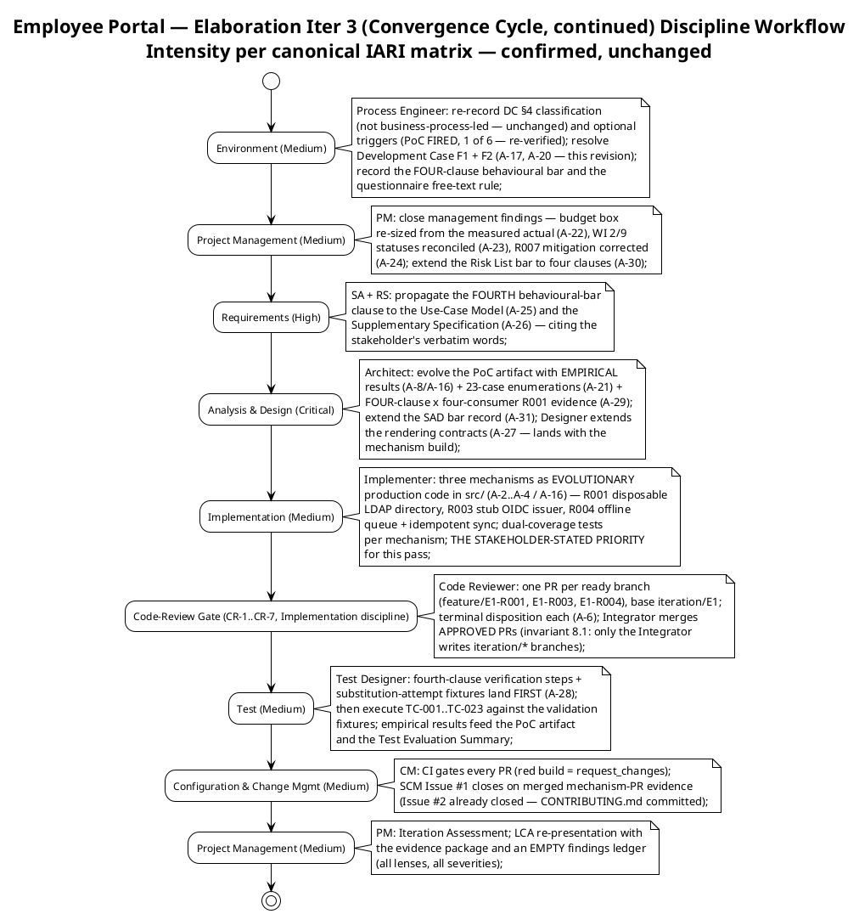
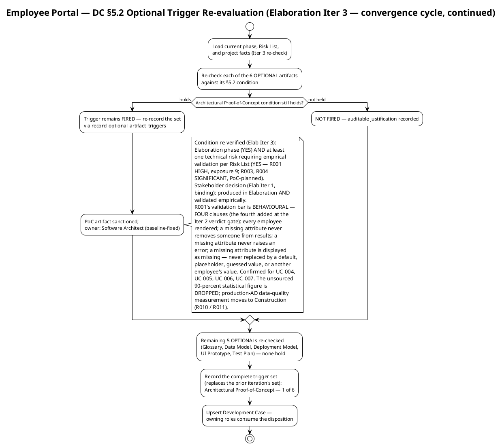
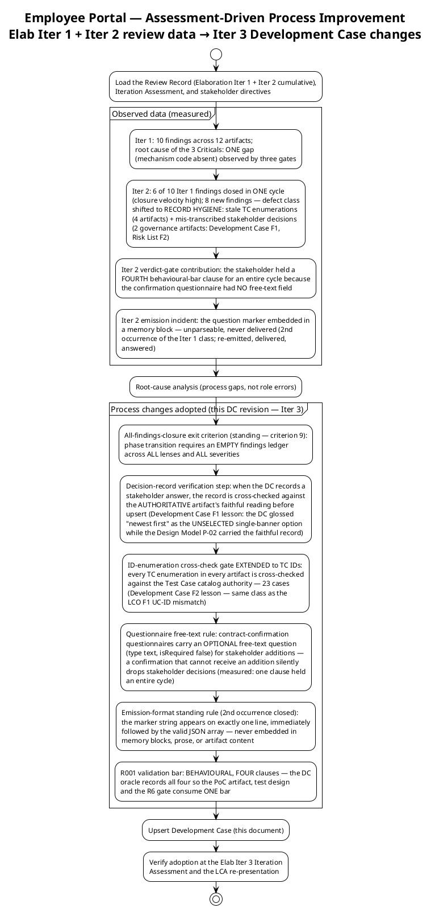

## Document Control

| Field | Value |
|---|---|
| Phase | Elaboration |
| Status | Draft — Elaboration Iter 3 (convergence cycle, continued) evolution; Development Case F1 (Major) and F2 (Minor) RESOLVED this revision (actions A-17, A-20); submitted for the LCA-track re-review |
| Milestone Target | End of Elaboration (LCA) — NOT yet achieved; this iteration continues the convergence cycle (code delivery chain A-16 + record corrections A-17..A-31) toward LCA re-presentation |
| Iteration | 3 (Cycle 1) |
| Date | 2026-09-02 |
| Prior Review | Inception (LCO: GO) and Elaboration Iter 1: zero findings on the Development Case. Elaboration Iter 2 (technical lens): **2 findings — F1 (Major, A-17): misrecorded featured-banner decision (the DC glossed the stakeholder's "newest first" answer as the UNSELECTED single-banner option in 3 locations, contradicting the Design Model P-02 faithful record); F2 (Minor, A-20): stale TC enumeration (20-case set in 5 locations vs the Test Case authority's 23 cases). Both RESOLVED this revision — every named location corrected; valid content otherwise preserved |
| Governance Re-recorded (Elab Iter 3) | DC §4 classification: unchanged — not business-process-led (re-recorded 2026-09-02 via record_dc_classification; 5 criteria cited). Version policy: unchanged — .NET 10 framework pin (CON-001); no new declared versions (re-recorded via record_version_policy). Optional triggers: **unchanged — Architectural Proof-of-Concept FIRED** (1/6, re-verified via record_optional_artifact_triggers; R001 validation bar now FOUR behavioural clauses per the Iter 2 verdict-gate stakeholder decision) |
| Stakeholder Decisions Incorporated (cumulative; Elab Iter 3 revision) | (1) R001 validation bar is behavioural, not statistical — the unsourced >90% figure is dropped; production-AD data-quality measurement moves to Construction. (2) The behavioural bar applies to all four AD-reading UCs (UC-004, UC-005, UC-006, UC-007). (3) Featured-news rendering contract: **featured banners STACK, ordered newest first — every featured item renders its own banner** (stakeholder answer "newest first" to the stack-vs-single question; faithful record per Design Model P-02 — ordering by the same date criterion as the FR-007 list; renders above the list on SCR-03 and above the history preview on SCR-01). **CORRECTED this revision (A-17):** the prior revision's "(single banner, newest featured item)" gloss described the option the stakeholder did NOT select and is removed from every location. (4) Binding directive from the Iter 1 LCA review: fix ALL findings including Minors before phase transition — adopted as exit criterion 9. (5) **NEW (Iter 2 verdict gate):** FOURTH behavioural-bar clause, verbatim: "a missing attribute is displayed as missing. It is never replaced by a default, a placeholder, a guessed value, or another employee's value." — added to all four AD-reading UCs; the R6 evidence gate requires FOUR-clause × four-consumer R001 evidence. (6) **NEW (Iter 2 verdict gate):** the Implementer's two-iteration code absence is stakeholder-attributed to a technical problem beyond its control; the code push is the stakeholder-stated priority for this pass (A-16 remains P0) |

## Tailoring Overview

This Development Case specifies project-specific **deltas** over the IARI DC baseline. The baseline defines 25 active roles, 16 CORE artifacts, 6 OPTIONAL artifacts, fixed ownership, and a canonical discipline-intensity matrix. This document declares only deviations; it never restates the baseline.

### Organization Assessment (updated with measured Elaboration Iter 1 + Iter 2 review experience)

| Factor | Finding |
|---|---|
| Agent role count | 25 roles per IARI baseline roster — all active except BPA (Business Modeling inactive) |
| Project type | Internal intranet web application for Cuba Corp (200 employees, 3 offices) |
| Complexity | Moderate — CRUD-centric portal with 10 FRs, 2 external integrations (AD/LDAP read-only, Keycloak OIDC), single-server deployment |
| Risk profile | R001 (HIGH, exposure=9) MITIGATING — trend IMPROVING (bar defined, build executing) but NOT RETIRED (zero code evidence); R003/R004 (SIGNIFICANT) MITIGATING; R010 re-scoped to Construction; R011 (validation-environment fidelity) added; R012 (human-gate queue) bounded; R002/R005–R009 OPEN |
| Process maturity | First RUP project for this organization; Inception closed in 2 iterations (LCO GO); Elab Iter 1 reviewed NO-GO (10 findings); Elab Iter 2 re-reviewed NO-GO CONFIRMED — **6 of 10 Iter 1 findings closed in one cycle** (closure velocity high), 8 new findings whose defect class SHIFTED to record hygiene: stale TC enumerations (4 artifacts) + mis-transcribed stakeholder decisions (2 governance artifacts, incl. this DC's F1). The one structural defect (absent code evidence) persists unchanged — tracked once per gate, remediated by ONE chain (A-16) |
| Elaboration review experience (measured, Iter 1 + Iter 2) | Iter 1: 7 of 9 technical artifacts clean; Critical-escalation path exercised and ANSWERED in-round. Iter 2: coverage held at 100% while the inventory grew to 13; recurrence concentrated on the one code-evidence defect; DRE still unmeasurable (TC-001..TC-023 all BLOCKED on Issue #1). Process changes adopted below (§ Guidelines, Assessment-Driven Improvements) |

### Tool Assessment (verified this iteration — S4)

| Tool Category | Declared (from Constraints) | Verified Status (2026-09-02, re-verified this iteration) |
|---|---|---|
| Runtime / Framework | .NET 10 (CON-001) | Framework pin recorded and re-recorded via record_version_policy; CI builds on .NET 10 (`ci.yml` verified Iter 2) |
| Frontend | Razor Pages, no SPA (CON-002) | Part of .NET 10 ecosystem |
| Database | PostgreSQL (CON-003) | Declared; no version pinned by stakeholder; Npgsql 10.0.3 resolved by Software Architect against the registry |
| Auth | Keycloak OIDC, pre-existing (CON-004) | External — client registration pending STK-004 (R010); PoC validates against a stub issuer (no real realm) |
| Directory | Active Directory over LDAP, read-only (CON-005, CON-006) | External — service account pending STK-004 (R010); PoC validates against a disposable directory |
| Hosting | Internal Windows Server (CON-008) | Single node; provisioning pending STK-004 (R010) |
| UI Design | `docs/inputs/employee-portal-design.html` (CON-011) | Provided — mandatory and authoritative |
| Browsers | Chrome + Edge (CON-010) | Current versions |
| SCM / CI | Git-based repository, GitHub workflows | `ci.yml` and `deploy.yml` VERIFIED (Iter 2; see § Guidelines, Tool Configuration References) |
| Programming guidelines | `CONTRIBUTING.md` | **✅ COMMITTED and RE-VERIFIED this iteration** (sha `6662813142160f6a660327f5d4a1700c036d099c`, unchanged; SCM Issue #2 CLOSED) — ARCH-1..ARCH-10 architectural rules, coding conventions, branch strategy, PR checklist; CR-1 has a citable rule baseline. **⚠ GAP FLAGGED for the Software Architect (owner): ARCH-6 carries only the THREE-clause behavioural bar — the FOURTH clause (a missing attribute is never replaced by a default, a placeholder, a guessed value, or another employee's value) must be added to ARCH-6 BEFORE the mechanism PRs are reviewed, so CR-1 can cite the four-clause contract the code must implement (A-27)** |
| Branch strategy | `docs/BRANCHING_STRATEGY.md` | **✅ VERIFIED** (sha `dbe3d9f9b52575f7549bcdd04789efd7e38e9a16`) — invariants 8.1/8.2/8.4, baseline register, E1 lifecycle |

### Gaps Identified (re-verified 2026-09-02, this iteration)

1. ~~`CONTRIBUTING.md`~~ — **CLOSED** (Iter 2; re-verified this iteration, sha above; SCM Issue #2 closed). The flag-then-verify loop worked: the Process Engineer flagged the gap in the Iter 1 DC, the owners committed it, and closure is verified. **Residual (NEW flag, this iteration):** ARCH-6 must be extended to the FOUR-clause bar (see Tool Assessment) — Software Architect owns the architectural rules; must land before the mechanism PR reviews.
2. `.editorconfig` + `Directory.Build.props` — **still absent** (verified via SCM, Iter 2). Lint / analyzer rules owned by Implementer. Non-blocking for the convergence cycle (CR-1 cites CONTRIBUTING.md rules); flagged for the owner.
3. STK-004 deliverables (R010) — LDAP service account, Keycloak client registration, Windows Server provisioning. Per the stakeholder's decision (Elab Iter 1), these block only **integration with the specific production instances** — a separate, smaller risk tracked on its own and taken to Construction; they do NOT block the PoC's empirical validation, which runs against a disposable directory (R001) and a stub OIDC issuer (R003). Project Manager owns the engagement.

## Disciplines and Intensity

Intensity per discipline/phase is **per the canonical IARI DC matrix** — confirmed, not reassigned. No deviation is proposed; none is self-granted. Validation against the actual risk profile: R001 (HIGH) → Analysis & Design Critical in Elaboration is consistent with the canonical matrix — no stakeholder deviation request warranted.

**Inactive discipline (delta):** Business Modeling — INACTIVE. The stakeholder declared 10 concrete functional requirements (FR-001–FR-010) for a software replacement of manual tools (Excel, email, PDF directory). No business-process reengineering, no business object model, no workflow transformation. Per DC §4 criteria, this project is **not business-process-led** (re-recorded this iteration, 2026-09-02; verdict unchanged; independently sustained by the Business Reviewer lens at the Iter 1 and Iter 2 LCA reviews — BR-OK-INACTIVE).

**Active-discipline tailoring notes (Elaboration Iter 3 — convergence cycle, continued):**

| Discipline | Tailoring Note |
|---|---|
| Requirements | Markers retired in place as stakeholder answers arrive: R001 behavioural bar confirmed for all four AD-reading UCs (UC-004 person card blank fields; UC-005 event row blank display fields; UC-006 CSV blank cells, no abort; UC-007 employee locatable and selectable) — **extended to FOUR clauses this iteration (A-25, A-26): a missing attribute is displayed as missing, never replaced by a default, a placeholder, a guessed value, or another employee's value**; featured-news rendering contract = **featured banners STACK, ordered newest first — every featured item renders its own banner** (faithful record per Design Model P-02; corrected this revision, A-17) |
| Analysis & Design | SAD corrected to the empirical disposition (A-7, done) and Logical View dependencies reconciled with the Design Model (A-9, done); the Architectural Proof-of-Concept artifact carries EMPIRICAL results for R001/R003/R004 (A-8/A-16) with the 23-case enumerations corrected (A-21) and FOUR-clause × four-consumer R001 evidence (A-29); the SAD §Quality bar record extends to four clauses (A-31); R001's bar is behavioural (4 clauses), not statistical; Design Model remains **co-owned** (Designer / DatabaseDesigner / UserInterfaceDesigner) — section-scoped upserts only; the four-consumer rendering contracts extend to the fourth clause (A-27 — lands with the mechanism build so the code implements four clauses) |
| Implementation | **Convergence-cycle code process (unchanged, stakeholder-prioritized this pass):** the three mechanisms are EVOLUTIONARY production code in `src/` (never a `poc/` branch or `samples/` directory — invariant 8.4) — R001 → COMP-007/CLS-009 against a disposable LDAP directory; R003 → COMP-006/CLS-010 against a stub OIDC issuer; R004 → COMP-009/CLS-008 offline queue + idempotent sync. Dual-coverage tests per mechanism (black-box contract + white-box paths). Branches `feature/E1-{risk-id}` from `iteration/E1`, labeled `ready-for-review`; the code-review gate CR-1..CR-7 applies unchanged — CI green is a hard gate, CR-1 cites CONTRIBUTING.md rules (committed; ARCH-6 fourth-clause extension flagged for the owner) |
| Test | TC-001..TC-023 (23 cases — Test Case catalog authority) executed against the validation fixtures (disposable LDAP directory, stub OIDC issuer, PG dev, drop simulation); the fourth-clause verification steps and substitution-attempt fixtures land BEFORE execution (A-28) so the fourth clause can actually fail; empirical results feed the PoC artifact; regression of prior results each iteration |
| Deployment | Single-node topology baselined in SAD; deploy jobs deferred to Construction pending R010 |
| Configuration & Change Mgmt | CI verified green on main; branch families enforced in `ci.yml`; baseline register (`baseline-elaboration-E1-v1` PENDING — dual gate not yet evaluable); SCM Issue #1 open (mechanism code — closes on merged-PR evidence), Issue #2 closed (CONTRIBUTING.md) |
| Project Management | Close management findings: budget box re-sized from the measured 12,523,281 iteration actual (A-22), WI 2/9 statuses reconciled to verified delivery (A-23), R007 mitigation corrected to the faithful featured-banner contract (A-24 — coordinated with this DC's A-17 so both governance artifacts record the identical contract), Risk List bar extended to four clauses (A-30); reconcile work-item statuses to SCM evidence at iteration close; production-instance integration (STK-004) is a separate, smaller risk taken to Construction — tracked on its own, not inheriting R001's HIGH; budget from measured actuals |
| Environment | This document; trigger re-evaluation each iteration (mandatory — executed); tool environment verification (executed this iteration — CONTRIBUTING.md re-verified; ARCH-6 fourth-clause gap flagged for the owner) |

## Artifacts and Templates

### CORE Artifacts (16) — All Confirmed

All 16 CORE artifacts are produced per their standard ownership and phase schedule. No CORE artifact is omitted; no ownership is reassigned. Primary ownership per IARI baseline — unchanged, not restated here. Elaboration Iter 3 (convergence cycle, continued) activity mapping:

| CORE Artifact | Convergence-Cycle Activity |
|---|---|
| Vision | Preserved (Inception baseline; 0 findings) |
| Use-Case Model | Fourth behavioural-bar clause propagated to UC-004 AF-2 and the UC-005/006/007 AF-3 flows, citing the stakeholder's verbatim words (A-25) |
| Supplementary Specification | R001 reliability contract extended from three to four clauses — four consumers unchanged (A-26); thresholds consistent with the behavioural bar; the >90% statistical figure dropped from the R001 evidence chain |
| Software Architecture Document | §Quality PoC Plan R001 bar record extended to four clauses (A-31); empirical disposition (A-7) and Logical View reconciliation (A-9) done and ledger-closed |
| Design Model | Co-owned evolution: four-consumer rendering contracts (P-05) and CLS-009 graceful-degradation contract extended to the fourth clause (A-27 — lands with the mechanism build); section-scoped upserts only |
| Implementation Model | Three mechanisms as evolutionary code in `src/` with dual-coverage tests (A-2..A-4 / A-16) — stakeholder-stated priority this pass |
| Test Case | TC-001..TC-023 (23 cases — authority set) executed against the validation fixtures; TC-011 + TC-021/022/023 extended with fourth-clause verification steps and substitution-attempt fixtures BEFORE execution (A-28) |
| Test Evaluation Summary | 23-case enumerations corrected (A-19); empirical results recorded; honest verdicts |
| User Documentation | Deferred to Construction |
| Release Notes | Deferred to Transition |
| Iteration Plan | Three stale TC enumerations updated to the 23-case set (A-18); budget box re-sized from the measured actual (A-22); WI 2/9 statuses reconciled (A-23); all-findings-closure exit criterion (A-12, done); queue forecasts removed (A-13, done) |
| Iteration Assessment | Convergence-cycle actuals recorded at close (PM) |
| Risk List | R007 mitigation corrected to the faithful featured-banner contract (A-24); R001 acceptance criteria extended to four clauses (A-30); trend column (A-14, done); human-gate queue bounded (A-15, done); >90% criterion resolved per the behavioural-bar decision (A-10, done) |
| Review Record | Cumulative — convergence-cycle reviews R1..R6 append; findings closed by their emitting lenses |
| Development Case | This document (Elaboration Iter 3 evolution — F1/F2 resolved: A-17, A-20) |
| Change Request | Construction onwards (CCM); SCM Issues #1 (open) / #2 (closed) carry the live state machine |

### OPTIONAL Artifacts (6) — Trigger Evaluation (Elaboration Iter 3)

| Optional Artifact | §5.2 Trigger Condition | Fired? | Justification |
|---|---|---|---|
| Glossary | Domain uses specialist vocabulary requiring stakeholder-validated definitions | **No** | Standard HR/IT intranet vocabulary; no regulated/medical/financial jargon |
| Architectural Proof-of-Concept | Elaboration phase + at least one technical risk requiring empirical validation (per Risk List) | **YES — FIRED** | Elaboration + R001 (HIGH, P=3 I=3) requiring empirical validation; R003/R004 (SIGNIFICANT) PoC-planned. Condition genuinely holds — re-verified this iteration; see § Optional Artifact Triggers |
| Data Model | Data-centric system OR >10 entities OR data-migration in scope | **No** | ~5 tables (clockings, news_items, news_audit, worker_categories, category_audit); not data-centric; no migration; data lives inline in Design Model |
| Deployment Model | Distributed / multi-node topology, OR multi-environment non-trivial | **No** | Single internal Windows Server (CON-008), corporate network only (CON-009); deployment is a section in SAD |
| User-Interface Prototype | UX-critical OR UI complexity requiring stakeholder validation before implementation | **No** | CON-011 provides the mandatory, authoritative design; interaction design is carried by Use-Case Model storyboards + Design Model boundary classes/navigation map |
| Test Plan | Formal delivery / regulatory audit / contractual test reporting | **No** | Internal intranet app; no regulatory or contractual test reporting; per-iteration testing scope lives in the Iteration Plan |

**Result: 1 of 6 OPTIONAL artifacts triggered** (unchanged from Iter 1 and Iter 2 — the whole set is re-evaluated every iteration; the PoC trigger's condition still genuinely holds).

## Optional Artifact Triggers

Recorded via `record_optional_artifact_triggers` (Elaboration Iter 3, 2026-09-02): `["Architectural Proof-of-Concept"]`. This replaces the prior iteration's set — the whole set is re-evaluated every iteration.

**PoC disposition (binding for downstream roles — updated with the Iter 2 verdict-gate stakeholder decision):** the Software Architect produces the Architectural Proof-of-Concept artifact carrying **empirical results** for R001 (disposable LDAP directory), R003 (stub OIDC issuer), and R004 (direct drop simulation). The mechanisms are the SAD's designed components (COMP-006 OIDC, COMP-007 LDAP, COMP-009 offline resilience) built as evolutionary production code in `src/`. Ownership is baseline-fixed (Software Architect) — this Development Case does not reassign it.

**R001 validation bar — BEHAVIOURAL, not statistical (stakeholder decisions, Elab Iter 2 + Iter 2 verdict gate; markers retired in place):** the stakeholder's decisions, in their own words:

- *"You are right that the figure has no source. It is invented — drop it."*
- *"But look at what it would measure. You seed the disposable directory yourselves, so '>90% populated' measures our own test data, not the risk. It cannot fail, so it proves nothing."*
- *"R001 is not 'how many attributes are missing' — that is a property of the real directory and nobody can know it until STK-004 delivers. The architectural risk is what the portal DOES when an attribute is absent."*
- *"So the bar is behavioural, not statistical: every employee is rendered whether or not their attributes are complete; a missing attribute never removes someone from search results; a missing attribute never raises an error. Seed the gaps deliberately and prove those three hold."*
- *"The percentage belongs to a different activity: measuring the real AD's data quality once STK-004 delivers. Track it there, in Construction, and keep it out of the LCA evidence package."*
- **Fourth clause (Iter 2 verdict gate, verbatim):** *"a missing attribute is displayed as missing. It is never replaced by a default, a placeholder, a guessed value, or another employee's value."* — with the stakeholder's stated rationale, verbatim: *"Blank is an answer. 'General', or the first office in the list, is a fabrication — and on the CSV that reaches payroll a fabricated department is worse than an empty cell. An empty cell gets questioned. A plausible wrong one does not."*

**Scope of the behavioural bar (stakeholder confirmation, Elab Iter 2):** the bar applies to **all four AD-reading use cases**, not only the directory search — UC-004 (person card: blank fields), UC-005 (HR clocking review: event row with blank display fields — clocking data is portal data, always complete), UC-006 (CSV export: every event row exported with blank cells for missing display fields, no abort — ad_user_id always present), UC-007 (worker category assignment: employee locatable and selectable with blank fields). The fourth clause applies to all four per the stakeholder's "Add a fourth clause to all four."

**Binding consequences:** (1) the PoC artifact's R001 evidence is the FOUR behavioural clauses verified against the disposable directory with gaps seeded deliberately — a statistical population percentage is NOT LCA evidence; (2) the production-AD data-quality measurement is Construction integration work (R010/R011), excluded from the LCA evidence package; (3) the disposable directory and stub issuer are PoC scaffolding retained as reusable Construction test fixtures — they do not alter the declared architecture (ADR-001..004 unchanged); (4) the R6 evidence gate requires FOUR-clause × four-consumer R001 evidence (TC-011 + TC-021/022/023, with the fourth-clause verification steps per A-28).

Re-evaluation schedule: every iteration, mandatory. A trigger may newly fire via a Change Request or scope expansion; a fired trigger is re-verified against its condition (an auditable claim, checked at review).

## Roles and Ownership

The 25-role IARI baseline roster is confirmed unchanged. No roles are merged, added, or removed. Primary artifact ownership is baseline-fixed and not restated or reassigned here.

**Role with no artifact output this project:** BusinessProcessAnalyst (BPA) — Business Modeling discipline INACTIVE; the BPA role exists in the roster but produces no artifacts. The Vision artifact is co-owned by System Analyst per baseline ownership rules.

```plantuml
@startuml
!theme plain
title Employee Portal — Role-Artifact Responsibility Matrix (Elaboration Iter 3 convergence-cycle deltas)

skinparam classAttributeIconSize 0

package "Requirements (High)" {
  class SystemAnalyst <<SA>> {
    + Use-Case Model (UC-001..010, authority;\nfourth-clause propagation: A-25)
  }
  class RequirementsSpecifier <<RS>> {
    + UC threshold quantification
  }
}

package "Analysis & Design (Critical)" {
  class SoftwareArchitect <<ARCH>> {
    + Software Architecture Document\n(§Quality bar record -> four clauses: A-31)
    + Architectural Proof-of-Concept\n(empirical results: A-8/A-16;\n23-case + four-clause evidence: A-21/A-29)
  }
  class Designer <<DS>> {
    + Design Model (analysis/design sections;\nfour-consumer contracts + fourth clause: A-27)
  }
  class UserInterfaceDesigner <<UID>> {
    + Design Model (UI sections)
  }
  class DatabaseDesigner <<DBD>> {
    + Design Model (data sections)
  }
}

package "Implementation (Medium)" {
  class Implementer <<IM>> {
    + Implementation Model
    + src/ mechanism code (A-2..A-4 / A-16):\nR001 LdapGateway, R003 OIDC provider,\nR004 offline queue — evolutionary,\ndual-coverage tests (stakeholder-stated\npriority this pass)
  }
  class Integrator <<INT>> {
    + iteration/E1 workspace (invariant 8.1)
    + merges APPROVED mechanism PRs
  }
  class CodeReviewer <<CR>> {
    + Review Record (code-review gate sections:\nPR dispositions, A-6)
  }
}

package "Test (Medium)" {
  class TestManager <<TM>> {
    + Test Evaluation Summary\n(23-case enumerations: A-19)
  }
  class TestDesigner <<TD>> {
    + Test Case (TC-001..TC-023 — 23-case\nauthority set; fourth-clause steps: A-28)
  }
  class Tester <<TST>> {
    + executes TC-001..TC-023 against\nvalidation fixtures
  }
}

package "Project Management (Medium)" {
  class ProjectManager <<PM>> {
    + Iteration Plan (A-18, A-22, A-23)
    + Risk List (A-24, A-30)
    + Iteration Assessment
  }
}

package "Environment (Medium)" {
  class ProcessEngineer <<PE>> {
    + Development Case (this document —\nF1/F2 resolved: A-17, A-20)
  }
}

package "Configuration & Change Mgmt (Medium)" {
  class ConfigurationManager <<CM>> {
    + .github/workflows/ci.yml, deploy.yml
    + docs/BRANCHING_STRATEGY.md
  }
  class ChangeControlManager <<CCM>> {
    + Change Request ledger (Issue #1 open —\nmechanism code; Issue #2 closed)
  }
}

package "Review (convergence calendar R1-R6)" {
  class Reviewer <<RV>> {
    + Review Record (technical lens)
  }
  class ReviewCoordinator <<RC>> {
    + Review Record (consolidation; LCA entry gate)
  }
}

RequirementsSpecifier --> SystemAnalyst : quantifies UC thresholds
SystemAnalyst --> SoftwareArchitect : UC Model feeds the SAD
Implementer --> Integrator : labels feature/E1-R001, E1-R003,\nE1-R004 branches ready-for-review
Integrator --> CodeReviewer : PR base = iteration/E1\n(Code Reviewer owns the PR and its base)
CodeReviewer --> Implementer : terminal disposition\n(approve / request_changes)
CodeReviewer --> Reviewer : dispositions append to the\ncumulative Review Record
Tester --> TestDesigner : executes the designed cases
Tester --> SoftwareArchitect : empirical results feed\nthe PoC artifact (A-8)
ProjectManager --> SoftwareArchitect : R010 engagement\n(Construction only)
ProcessEngineer --> SoftwareArchitect : PoC trigger oracle\n(FIRED — content basis)
ConfigurationManager --> Implementer : CI gates every push
ChangeControlManager --> Reviewer : CRs feed the Review Record
ReviewCoordinator --> Reviewer : entry gate verified before\nLCA re-presentation

note bottom of SoftwareArchitect
  Convergence-cycle delta: the PoC
  artifact carries EMPIRICAL results
  for R001 / R003 / R004. R001's
  validation bar is BEHAVIOURAL —
  FOUR clauses (the fourth added at
  the Iter 2 verdict gate: a missing
  attribute is displayed as missing,
  never replaced by a default,
  placeholder, guessed value, or
  another employee's value); the
  unsourced 90-percent statistical
  figure is dropped from the LCA
  evidence package.
end note

note right of Integrator
  Only the Integrator writes
  iteration/* branches
  (BRANCHING_STRATEGY 8.1).
end note
@enduml
```

**Co-ownership discipline (binding):** the Design Model is co-authored by Designer (analysis/design sections), DatabaseDesigner (data sections), and UserInterfaceDesigner (UI sections). Each owns ONLY their sections; every evolution uses section-scoped upserts. A full-document overwrite of a co-owned artifact destroys collaborator sections and is the worst failure in collaborative work.

## Guidelines and Procedures

### Elaboration Iteration 3 Entry Criteria (convergence cycle, continued — verified met at iteration start)

| Criterion | Evidence |
|---|---|
| LCA Iter 2 review completed — verdict NO-GO CONFIRMED; phase auto-iterates within the convergence cycle; contribution cycle CLOSED (final stakeholder confirmation received) | Review Record (Elab Iter 2): requiresIteration = TRUE |
| Consolidated action chain A-16..A-31 assigned with owners and dependency-ordered priorities (A-16 P0 — stakeholder-stated priority: the code push) | Review Record (Coordinator consolidated prioritization, Iter 2) |
| `iteration/E1` integration workspace exists (A-1) | SCM (branch exists; skeleton only — mechanism code is this cycle's work) |
| `CONTRIBUTING.md` committed (A-5 precondition for CR-1) | SCM (re-verified this iteration, sha `6662813…`; Issue #2 closed) |
| Development Case findings F1/F2 (A-17, A-20) | **Resolved this revision** — every named location corrected (featured-banner faithful contract; 23-case enumerations) |

### Elaboration Exit Criteria (LCA) — the gate this phase works toward

| # | Criterion | DC Contribution |
|---|---|---|
| 1 | Product vision stable | All 10 UCs full-depth; stakeholder decisions recorded and markers retired in place (timestamp convention, America/Havana, offline mechanism, FOUR-clause behavioural bar, featured-news contract — faithful record) |
| 2 | Architecture stable | SAD 4+1 baseline; ADR-001..004 decided; SAD corrected to the empirical disposition (A-7, done) and dependencies reconciled (A-9, done); §Quality bar record extended to four clauses (A-31) |
| 3 | Major risks addressed | **Architectural Proof-of-Concept (FIRED)** — produced in Elaboration AND validated empirically: R001 against a disposable directory with gaps seeded deliberately, judged against the **behavioural bar — FOUR clauses** ((a) every employee rendered whether or not their attributes are complete; (b) a missing attribute never removes someone from results; (c) a missing attribute never raises an error; (d) a missing attribute is displayed as missing — never replaced by a default, a placeholder, a guessed value, or another employee's value — confirmed for UC-004..UC-007); R003 against a stub OIDC issuer; R004 direct. No fabricated results; no statistical population percentage in the LCA evidence package. Production-instance integration is a separate, smaller risk taken to Construction — no LCA condition depends on STK-004 ticket closure |
| 4 | Construction plan sufficiently detailed | UC assignments cross-checked against Use-Case Model (F1 lesson); TC enumerations cross-checked against the Test Case catalog (23 cases — F2 lesson, this revision); all-findings-closure criterion in the plan (A-12, done); budget box re-sized from the measured actual (A-22) |
| 5 | Stakeholders agree vision achievable | LCA re-presentation sanction — the stakeholder's decision, never self-declared; fresh sanction request at R6 |
| 6 | Actual vs planned expenditure acceptable | Two clocks measured apart; never summed; budget boxes derived from measured actuals (A-22) |
| 7 | **DC-specific:** every active discipline has a tailoring section in this Development Case | § Disciplines and Intensity + § Guidelines — met this iteration |
| 8 | **DC-specific:** tool environment passes verification | CI verified ✓; CONTRIBUTING.md committed and re-verified ✓ (sha `6662813…`; Issue #2 closed); ARCH-6 fourth-clause extension flagged for the Software Architect (must land before the mechanism PR reviews); `.editorconfig`/`Directory.Build.props` gaps explicitly deferred with rationale (non-blocking — CR-1 cites CONTRIBUTING.md) |
| 9 | **DC-specific (binding stakeholder directive):** findings ledger EMPTY across ALL review lenses and ALL severities (Critical, Major, Minor) before phase transition is sanctioned | Verified via the findings ledger (the single source of truth), never via narrative claims; each finding is closed by its emitting lens. Directive recorded verbatim by the stakeholder at the Iter 1 LCA review: fix all findings, including minors, before moving to the next phase |

### Assessment-Driven Process Improvements (adopted from measured Elaboration Iter 1 + Iter 2 review data)

Each change is traceable to a specific observed defect with data (the Iter 1 10-finding distribution and triple-gate root cause; the Iter 2 closure velocity, record-hygiene defect class, questionnaire free-text gap, and emission incident; the CONTRIBUTING.md closure) — no speculative process change was adopted. Adoption is verified at the next Iteration Assessment.

### Measurement Policy

IARI measures two quantities: **tokens consumed** and **elapsed time** (split into agent time and human queue time). The two clocks are reported side by side and **never summed**. Person-weeks, story points, and function points are not producible in this system and are never used.

| Metric | Decision It Enables | Who Reads It | When |
|---|---|---|---|
| Tokens consumed per discipline per iteration | Scope adjustment — if a discipline exceeds budget, PM trims scope for next iteration | Project Manager | End of each iteration |
| Agent time vs human queue time ratio | Process bottleneck identification — if human queue time dominates, Process Engineer adjusts review cadence or parallelism | Process Engineer | End of each iteration |
| Total tokens per phase | Cost-box compliance — iteration ends when exit criteria pass OR budget is spent | Project Manager, Process Engineer | Phase boundary |

**Recorded phase actuals (Inception, closed):** 2 iterations, 28 min agent time, 0s stakeholder queue, 1,347,939 tokens, 11 agent runs, 10 artifacts (work-order recorded actuals). **Recorded iteration actual (Elab Iter 1, closed):** 12,523,281 tokens; 6:00:59 agent time; 0:35:14 stakeholder queue — never summed (Iteration Assessment). **Data-integrity note for the Project Manager:** the Iteration Assessment's cumulative figures (3,550,308 tokens; 1:52:46 agent time across both Inception iterations) differ from the phase-level row above; the PM owns reconciling the two records at the next Iteration Assessment. Elaboration phase figures are recorded at phase close; no per-iteration velocity is quoted. **Human-gate planning rule (binding):** a human gate is a RISK, not an estimate — ceiling 14 days (then the process suspends; nothing is auto-filled), actual measured and reported apart, estimate NONE; bound it in the Risk List (R012), never forecast it in the plan.

### Tool Configuration References (verified 2026-09-02; CONTRIBUTING.md re-verified this iteration)

| Configuration | Owner | File Path | Verified Status |
|---|---|---|---|
| CI pipeline | ConfigurationManager | `.github/workflows/ci.yml` | **✅ VERIFIED** (Iter 2) — build + test jobs, .NET 10, triggers on `main`, `iteration/**`, `chore/**`, `feature/**`, `hotfix/**` (push + PR); green on main per Test Evaluation Summary |
| Deploy pipeline skeleton | ConfigurationManager | `.github/workflows/deploy.yml` | **✅ VERIFIED** (Iter 2) — build/publish artifact; deploy-dev/deploy-production jobs correctly deferred to Construction pending R010 (two-gate model) |
| Programming guidelines | Implementer / Software Architect | `CONTRIBUTING.md` | **✅ COMMITTED, RE-VERIFIED this iteration** (sha `6662813142160f6a660327f5d4a1700c036d099c`; Issue #2 closed) — ARCH-1..ARCH-10 architectural rules, coding conventions, PR checklist; CR-1 rule baseline in place for the mechanism PRs. **⚠ ARCH-6 carries only the three-clause bar — the Software Architect must add the FOURTH clause (never replaced by a default, a placeholder, a guessed value, or another employee's value) BEFORE the mechanism PR reviews, so CR-1 cites the four-clause contract the code implements (A-27)** |
| Branch strategy documentation | ConfigurationManager | `docs/BRANCHING_STRATEGY.md` | **✅ VERIFIED** (sha `dbe3d9f9b52575f7549bcdd04789efd7e38e9a16`) — branch topology, baseline register (`baseline-elaboration-E1-v1` PENDING), invariants 8.1/8.2/8.4; CONTRIBUTING.md carries the essentials section |
| Lint / analyzer rules | Implementer | `.editorconfig`, `Directory.Build.props` | **❌ GAP** — files absent (verified via SCM, Iter 2); flagged for owner; non-blocking for the convergence cycle (CR-1 cites CONTRIBUTING.md) |
| UI design specification | UserInterfaceDesigner | `docs/inputs/employee-portal-design.html` | **✅ Provided by stakeholder (CON-011)** — mandatory and authoritative |

Guideline content itself (coding standards, UI patterns, test conventions) is authored by the owning discipline experts in the files above — this Development Case references those files and does not duplicate their content. The remaining gaps are process-support items: the Process Engineer flags them; the owners close them.

### Process Support

During active iterations, the Process Engineer serves as the process help desk:
- Process questions (which template, which artifact, which workflow step) are answered within the same iteration cycle.
- Blocking process issues are escalated immediately to the stakeholder via the input-emission channel (emission marker immediately followed by a minimal JSON array, on one line).
- Tool configuration problems are logged and assigned to the owning discipline role (this iteration: the ARCH-6 fourth-clause extension, flagged for the Software Architect).
- **Question format (binding, from measured Inception lesson):** stakeholder-input payloads use minimal JSON — `question` / `type` / `isRequired` only. `options`, `recommendation`, and `reason` fields break the parser.
- **Questionnaire free-text rule (binding, NEW this iteration — from the measured Iter 2 verdict-gate lesson):** contract-confirmation questionnaires MUST carry an OPTIONAL free-text question (type `text`, `isRequired` false) for stakeholder additions. Measured basis: the Iter 2 behavioural-bar confirmation was yes/no with no free-text field, and the stakeholder held the FOURTH behavioural-bar clause for an entire cycle with no field to deliver it in — a confirmation that cannot receive an addition silently drops stakeholder decisions.
- **Emission discipline (binding, standing rule — 2nd occurrence closed at Iter 2):** the emission marker string appears on exactly one line, immediately followed by the valid JSON array, and is never embedded in memory blocks, prose, or artifact content — the parser scans every occurrence, and a marker not immediately followed by a valid JSON array invalidates the turn. Two incidents of the same class occurred (Iter 1 escalation; Iter 2 verdict-gate contribution); both were withdrawn, re-emitted in valid format, delivered, and answered. The rule is now standing for all roles.
- **Marker retirement (binding):** when the stakeholder answers a scope/derivation/assumption marker, the owning role retires the marker in the artifact itself, writing the stakeholder's literal values. Seven decisions have been retired this way (offline mechanism; timestamp convention; office local timezone = America/Havana; PoC empirical scope; R001 behavioural bar + its four-UC scope; featured-news rendering contract — faithful record corrected this revision; FOURTH behavioural-bar clause) — the discipline is proven and mandatory.

### Incremental Rollout Plan

| Iteration | Disciplines Introduced | Status |
|---|---|---|
| Inception | Environment, PM, Requirements, A&D (draft), Implementation (skeleton), Test (strategy), CM | **Complete** — LCO achieved |
| Elaboration Iter 1 | Full A&D (4+1 baseline), Test (detailed cases), CM (full CI verified) | **Complete** — reviewed NO-GO; findings fed the convergence cycle |
| Elaboration Iter 2 | Implementation code-review gate activated (CR-1..CR-7 on mechanism PRs); Test execution; empirical PoC validation | **Complete** — reviewed NO-GO CONFIRMED; 6 findings closed, 8 new (record-hygiene class); findings feed Iter 3 |
| Elaboration Iter 3 (this — convergence cycle, continued) | Code delivery chain (A-16 — stakeholder-stated priority); fourth-clause propagation (A-25..A-31); record corrections (A-17..A-24 — DC F1/F2 resolved this revision) | **In progress** |
| Construction | Full Implementation, Test (execution), Deployment, production-instance integration (STK-004) | Planned |
| Transition | Documentation, Release Notes, Deployment (final) | Planned |

## Traceability

| Element | Traces From | Link Type | Traces To |
|---|---|---|---|
| Development Case (this) | IARI DC Baseline | Refines | All project artifacts (governs production) |
| Business Modeling INACTIVE | DC §4 classification (re-recorded Elab Iter 3, verdict unchanged; BR lens sustained BR-OK-INACTIVE at Iter 1 + Iter 2 LCA reviews) | Derives | record_dc_classification(isBusinessProcessLed=false) |
| PoC trigger FIRED | DC §5.2 condition + R001 (Risk List) + Elaboration phase | Derives | record_optional_artifact_triggers(["Architectural Proof-of-Concept"]); SoftwareArchitect (owner); SAD PoC plan (content basis) |
| PoC empirical scope (stakeholder decision, Elab Iter 1) | Stakeholder answer: the PoC is produced in Elaboration and validated empirically — R001 via disposable directory, R003 via stub OIDC issuer, R004 direct; production-instance integration tracked separately, taken to Construction | Authorizes | Architectural Proof-of-Concept (empirical results required); LCA exit criterion 3; Risk List (production-integration entry) |
| R001 behavioural bar — FOUR clauses (stakeholder decisions, Elab Iter 2 + Iter 2 verdict gate — markers retired) | Stakeholder answers: the bar is behavioural, not statistical — (a) every employee rendered; (b) a missing attribute never removes someone from results; (c) a missing attribute never raises an error; (d) a missing attribute is displayed as missing, never replaced by a default, a placeholder, a guessed value, or another employee's value; the unsourced >90% figure is dropped; production-AD data-quality measurement moves to Construction | Authorizes | Architectural Proof-of-Concept (R001 evidence = 4 behavioural clauses, gaps seeded deliberately; A-29); Test Case TC-011 + TC-021/022/023 (A-28); SAD §Quality (A-31); Risk List (A-30); excludes statistical percentages from the LCA evidence package; R6 evidence gate (FOUR-clause × four-consumer) |
| Behavioural bar scope — four AD-reading UCs (stakeholder confirmation, Elab Iter 2) | Stakeholder answer: the bar applies to UC-004 (blank fields), UC-005 (blank display fields), UC-006 (blank CSV cells, no abort), UC-007 (locatable and selectable) — fourth clause added to all four | Authorizes | Use-Case Model (UC-004..UC-007 alternative flows; A-25); Supplementary Specification (A-26); Design Model rendering contracts (A-27); CONTRIBUTING.md ARCH-6 (gap flagged for owner); PoC artifact |
| Featured-news rendering contract (stakeholder decision, Elab Iter 2 — CORRECTED this revision, A-17) | Stakeholder answer: "newest first" (to the stack-vs-single question) — faithful record per Design Model P-02: **featured banners STACK, ordered newest first — every featured item renders its own banner** (ordering by the same date criterion as the FR-007 list; renders above the list on SCR-03 and above the history preview on SCR-01); the prior "(single banner, newest featured item)" gloss described the UNSELECTED option and is removed | Authorizes | Use-Case Model (UC-003 step 4, UC-008 step 3); Design Model UI sections (P-02 — authoritative record); Risk List R007 mitigation (A-24 — coordinated so both governance artifacts record the identical contract) |
| Development Case F1 resolution (A-17, this revision) | Review Record (Reviewer lens, Elab Iter 2): DC F1 Major — misrecorded featured-banner decision in 3 locations (Document Control §(3); Requirements tailoring note; Traceability row) | Resolves | This document (all 3 locations corrected to the faithful contract); Reviewer lens (closure via resolve_artifact_finding when verified) |
| Development Case F2 resolution (A-20, this revision) | Review Record (Reviewer lens, Elab Iter 2): DC F2 Minor — stale TC enumeration (20-case set) in 5 locations (discipline workflow diagram; Test tailoring note; CORE artifacts table; role matrix TestDesigner + Tester) vs the Test Case catalog authority (23 cases) | Resolves | This document (all 5 locations corrected to TC-001..TC-023, cross-checked against the Test Case §Test Case Catalog); Reviewer lens (closure via resolve_artifact_finding when verified) |
| All-findings-closure exit criterion (criterion 9) | Stakeholder directive (Iter 1 LCA review, verbatim): fix all findings, including minors, before moving to the next phase; Review Record Iteration Plan F4 (Major, A-12 — done) | Derives | Elaboration phase transition sanction; findings-ledger verification at each iteration close |
| Convergence-cycle code process (Implementation tailoring) | Stakeholder decision (empirical PoC); stakeholder context (Iter 2 verdict gate: code push is the stated priority — absence attributed to a technical problem beyond the Implementer's control); BRANCHING_STRATEGY §5.2, invariants 8.1/8.2/8.4; Review Record F-CR-E1-1 remediation (A-2..A-6); SCM Issue #1 | Derives | Implementer mechanism branches (feature/E1-R001, E1-R003, E1-R004); Code Reviewer PR dispositions; Integrator merges |
| Framework pin .NET 10 | CON-001 | Derives | record_version_policy(framework, .NET, 10) — re-recorded this iteration; no new declared versions |
| Elaboration Iter 3 entry criteria | Review Record (Elab Iter 2: NO-GO CONFIRMED, requiresIteration=TRUE; contribution cycle closed; A-16..A-31 assigned; A-1 done; A-5 done + Issue #2 closed) | Refines | Convergence-cycle execution (actions A-16..A-31) |
| LCA exit criteria (1–9) | RUP LCA milestone criteria + SAD §LCA Review + stakeholder decisions (empirical PoC; FOUR-clause behavioural bar; all-findings directive) | Refines | End-of-Elaboration milestone gate (re-presentation at R6) |
| UC-ID cross-check gate | Review Record F1 (Major, resolved, Inception) + Iteration Assessment lesson 1 | Derives | All artifacts referencing UC IDs |
| TC-ID cross-check gate (NEW this revision) | Review Record Development Case F2 / Iteration Plan F3 / TES F1 / PoC F1 (Minor, Elab Iter 2 — one authority, four stale consumers) + Test Case §Test Case Catalog (23 cases) | Derives | All artifacts referencing TC IDs — cross-checked against the catalog before upsert (same discipline as the UC-ID gate) |
| Decision-record verification step (NEW this revision) | Review Record Development Case F1 + Risk List F2 (Major, Elab Iter 2 — one answer, two mis-transcriptions in governance artifacts) | Derives | Every DC stakeholder-decision record — cross-checked against the authoritative artifact's faithful reading before upsert |
| Status-reconciliation step | Review Record F2 (Minor, resolved, Inception) + Iteration Plan F3/F7 remediation (A-11, A-23) | Derives | Iteration Plan work items (reconciled to SCM evidence at iteration close — in both directions) |
| Question format rule | Iteration Assessment lesson (stakeholder-input parser) | Derives | All stakeholder-input emissions |
| Questionnaire free-text rule (NEW this revision) | Review Record process observation (Iter 2 verdict gate: the stakeholder held the fourth clause an entire cycle — no free-text field in the confirmation questionnaire) | Derives | All contract-confirmation questionnaires (optional free-text question for additions) |
| Emission discipline rule (standing; 2nd occurrence closed) | Measured Iter 1 + Iter 2 incidents (marker embedded in prose/memory block — unparseable, never delivered; withdrawn, re-emitted, delivered, answered both times) | Derives | All stakeholder-input emissions; artifact authoring (no marker string in prose) |
| Marker-retirement discipline | Stakeholder decisions: offline mechanism, timestamp convention, America/Havana, PoC empirical scope, R001 behavioural bar (+ four-UC scope), featured-news contract (faithful record), FOURTH behavioural-bar clause | Authorizes | Use-Case Model, Supplementary Specification, SAD, this document (markers retired in-place) |
| CI verification | `.github/workflows/ci.yml` (SCM read, Iter 2) | DependsOn | Implementer, ConfigurationManager |
| Deploy skeleton verification | `.github/workflows/deploy.yml` (SCM read, Iter 2) | DependsOn | DeploymentManager (Construction), R010 |
| CONTRIBUTING.md closure + re-verification | SCM reads (sha `6662813…`, Iter 2 + this iteration); Review Record F-CR-E1-2 / SCM Issue #2 (A-5 — closed) | DependsOn | Code Reviewer CR-1 (citable rule baseline); first mechanism PR review |
| ARCH-6 fourth-clause gap flag (NEW this iteration) | CONTRIBUTING.md ARCH-6 (three-clause bar) vs the FOUR-clause stakeholder decision (Iter 2 verdict gate) + A-27 (code implements four clauses) | DependsOn | Software Architect (owner — must extend ARCH-6 before the mechanism PR reviews so CR-1 cites the four-clause contract) |
| Branch strategy verification | `docs/BRANCHING_STRATEGY.md` (SCM read, sha `dbe3d9f9…`) | DependsOn | Integrator, Implementer, Code Reviewer, ConfigurationManager |
| Lint gap (.editorconfig, Directory.Build.props) | Tool assessment (SCM read — not found, Iter 2) | DependsOn | Implementer (owner); non-blocking, explicitly deferred with rationale |
| R010 dependency (production instances only) | Risk List R010; SAD External Dependencies; stakeholder decision (Elab Iter 1) | DependsOn | ProjectManager (STK-004 engagement); Construction integration testing — NOT the PoC's empirical validation |
| Measurement actuals note | Work Order Measured Actuals + Iteration Assessment (Elab Iter 1: 12,523,281 tokens; 6:00:59 agent; 0:35:14 queue) | Refines | ProjectManager (reconciliation at next Iteration Assessment; budget-box re-size A-22) |
| Human-gate planning rule | IARI planning rule (gate = risk, not estimate; 14-day ceiling); Review Record Iteration Plan F5 / Risk List F1 (A-13, A-15 — done); Risk List R012 | Derives | Iteration Plan (no queue forecasts); Risk List (bounded gate-queue entry) |
| Co-ownership discipline | Design Model structure (Designer / DatabaseDesigner / UserInterfaceDesigner) | Refines | Design Model section-scoped upserts |