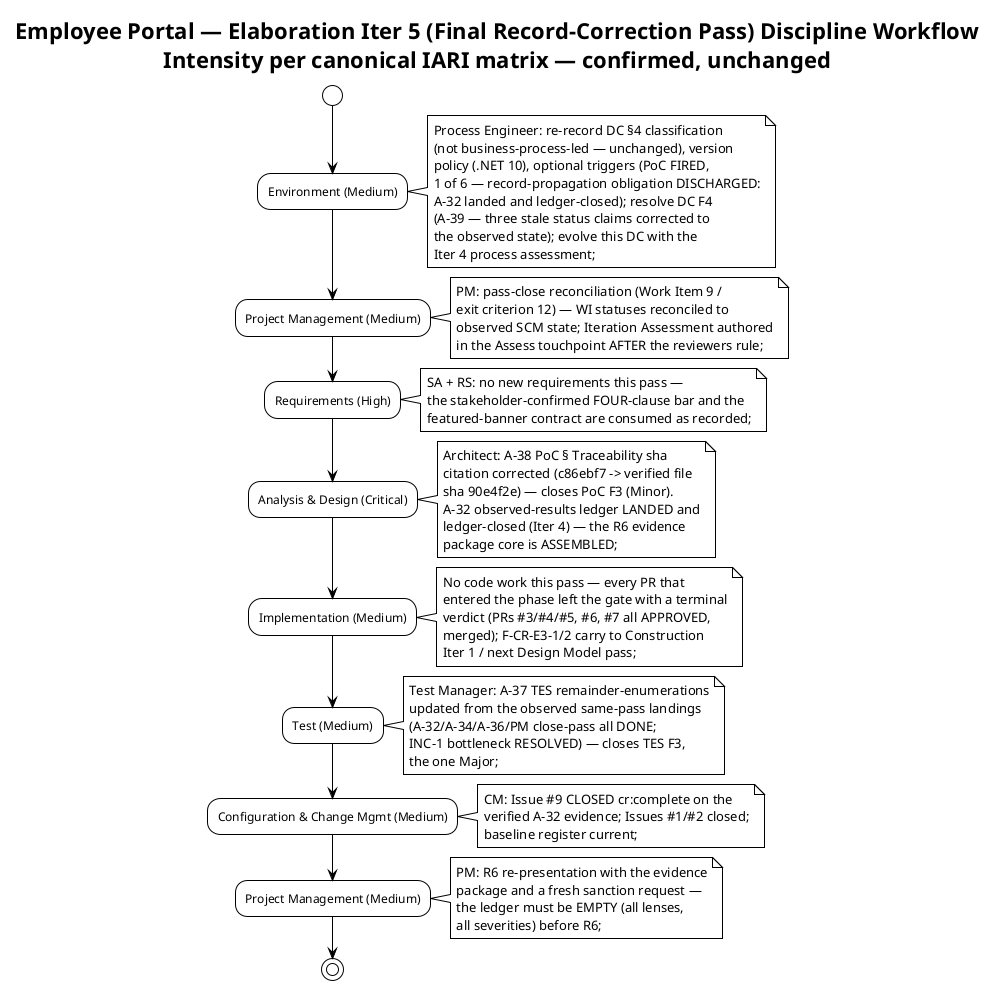
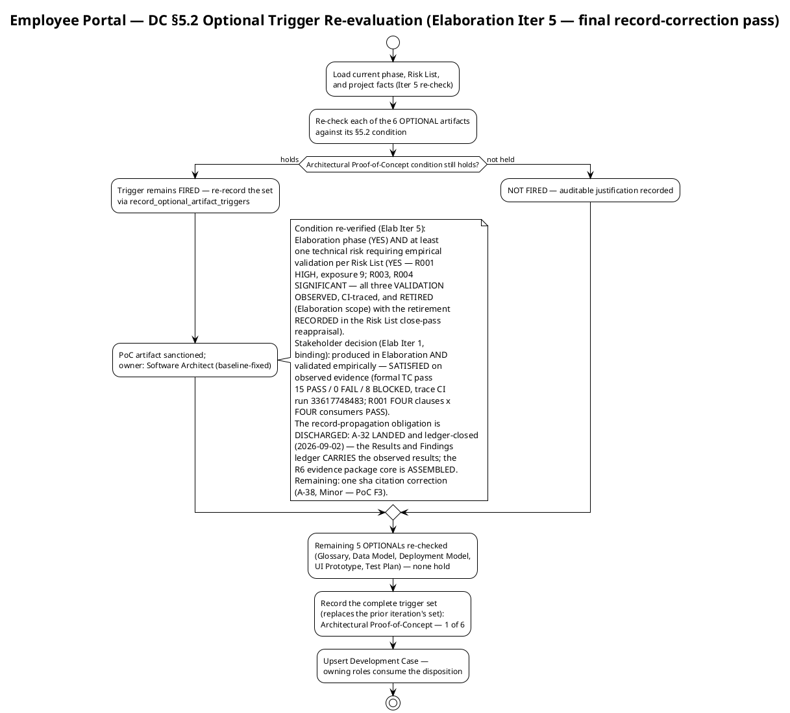
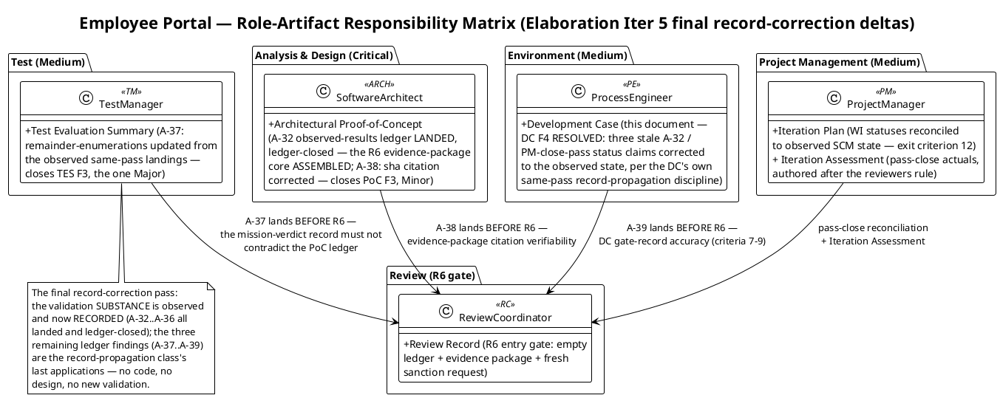
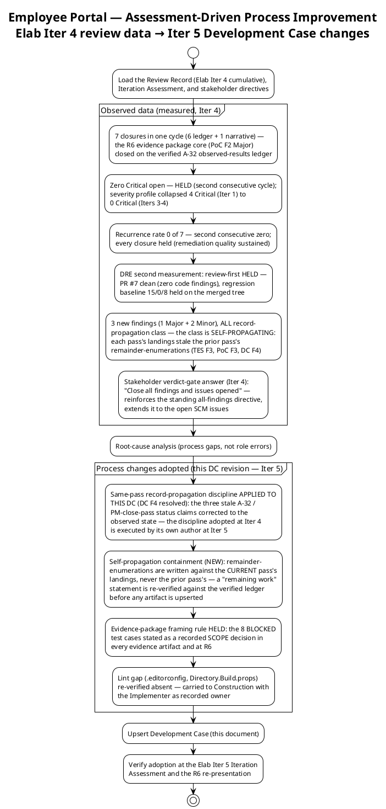

## Document Control
| Field | Value |
|---|---|
| Phase | Elaboration |
| Status | Draft — Elaboration Iter 6 (R014 record-correction cycle) evolution; **Development Case F5 (Minor) RESOLVED this revision (A-41 landed)**: the Milestone Target's stale enumeration (A-37/A-38 claimed remaining while both landed and ledger-closed at Iter 5) corrected to the observed state, with the remainder re-verified against the verified findings ledger before upsert, per this DC's own binding same-pass record-propagation discipline; closure owned by the emitting Reviewer lens; submitted for the R6-track review |
| Milestone Target | End of Elaboration (LCA) — NOT yet achieved; sanction still withheld per the stakeholder's binding all-findings directive (reinforced at the Iter 5 verdict gate, verbatim: "No, please fix all findings"). **The R6 evidence package is ASSEMBLED and internally consistent** — its core (the PoC observed-results ledger, A-32) landed and ledger-closed at Iter 4; the final record-correction pass delivered all three of its named corrections (A-37 TES remainder-enumerations, A-38 PoC sha citation, A-39 DC status claims — all landed and ledger-closed 2026-09-02; the two Work Order CRs DISCHARGED on that verification). **What remains, re-verified against the verified findings ledger before this upsert:** (1) A-40 — TES F4 (Major, Test Manager): five TES locations still enumerate A-38/A-39 as remaining while both landed and ledger-closed at Iter 5 — the R014 self-propagation class's successor instance; (2) this correction A-41 — DC F5 (Minor): the Milestone Target's own stale enumeration, resolved by this revision; (3) the PM pass-close reconciliation (Work Item 8 / exit criterion 8 — the Iteration Assessment authored after the reviewers rule); (4) the cr:complete transitions of SCM Issues #11/#12 (the CR vehicles for the landed A-37/A-38 remediations — owned by their assigned roles and the CCM); (5) the R6 gate itself — empty ledger + evidence package + fresh sanction request to STK-001. Plus 2 narrative-tracked Code Reviewer Minors (F-CR-E3-1/2) carried with their recorded Construction-scope dispositions per the stakeholder's framing directive |
| Iteration | 6 (Cycle 1) |
| Date | 2026-09-03 |
| Prior Review | Inception (LCO: GO) and Elaboration Iters 1–4: zero findings on the Development Case at Iter 1; F1 (Major, A-17) + F2 (Minor, A-20) raised at Iter 2, RESOLVED at Iter 3; F3 (Minor, A-36) raised at Iter 3, RESOLVED at Iter 4 (ARCH-6 gap flag closed on verification); F4 (Minor, A-39) raised at Iter 4, RESOLVED at Iter 5 (the three stale A-32/PM-close-pass status claims corrected to the observed state). Elaboration Iter 5 (technical lens): **1 finding — F5 (Minor, A-41): the Milestone Target enumerates A-37/A-38 as remaining while both landed and ledger-closed that same pass (only A-39 correctly marked resolved) — the R014 self-propagation class, second location. RESOLVED this revision** — the Milestone Target corrected to the observed state with the remainder re-verified against the verified findings ledger before upsert. Valid content otherwise preserved |
| Governance Re-recorded (Elab Iter 6) | DC §4 classification: unchanged — not business-process-led (re-recorded 2026-09-03 via record_dc_classification; 5 criteria cited; Business Reviewer lens sustained BR-OK-INACTIVE at five consecutive LCA-cycle reviews). Version policy: unchanged — .NET 10 framework pin (CON-001); no new declared versions (re-recorded via record_version_policy). Optional triggers: **unchanged — Architectural Proof-of-Concept FIRED** (1 of 6, re-verified via record_optional_artifact_triggers; the artifact's record-propagation obligation is DISCHARGED — A-32 landed and ledger-closed at Iter 4; the A-38 sha-citation correction landed and ledger-closed at Iter 5) |
| Stakeholder Decisions Incorporated (cumulative; Elab Iter 6 revision) | (1) R001 validation bar is behavioural, not statistical — the unsourced >90% figure is dropped; production-AD data-quality measurement moves to Construction. (2) The behavioural bar applies to all four AD-reading UCs (UC-004, UC-005, UC-006, UC-007). (3) Featured-news rendering contract: **featured banners STACK, ordered newest first — every featured item renders its own banner** (stakeholder answer "newest first"; faithful record per Design Model P-02). (4) Binding directive from the Iter 1 LCA review: fix ALL findings including Minors before phase transition — adopted as exit criterion 9. (5) FOURTH behavioural-bar clause, verbatim: "a missing attribute is displayed as missing. It is never replaced by a default, a placeholder, a guessed value, or another employee's value." — added to all four AD-reading UCs; the R6 evidence gate requires FOUR-clause × four-consumer R001 evidence. (6) The Implementer's two-iteration code absence was stakeholder-attributed to a technical problem beyond its control; the code push was the stated priority for Iter 3 — FULFILLED and verified (3 mechanisms merged, PRs #3/#4/#5 + #6 APPROVED, formal TC pass complete, Issue #1 closed). (7) Iter 3 R6-path confirmation: the stakeholder confirmed the path — record corrections, then the R6 re-presentation with the evidence package and a fresh sanction request — plus one binding framing directive, verbatim: "the 8 BLOCKED test cases are a recorded SCOPE decision (production AD and Keycloak integration belongs to Construction), not an open gap. State it that way in the evidence package so the LCA reads them as deferred, not as missing." (8) Iter 4 verdict gate: "Close all findings and issues opened" — reinforces the standing all-findings directive and extends it to the open SCM issues; Issue #9 (the PoC results-ledger CR) closed cr:complete on the verified A-32 evidence; Issues #1/#2 already closed. (9) **NEW (Iter 5 verdict gate):** "No, please fix all findings" — the "No" closes the contribution question (nothing to add for the next pass) and "please fix all findings" REINFORCES the standing all-findings directive for the R014 record-correction cycle's remainder (TES F4 → A-40; DC F5 → A-41; F-CR-E3-1/2 carried with their recorded Construction-scope dispositions); the answer adds NO new scope, NO correction, NO priority beyond the standing record |
## Tailoring Overview
This Development Case specifies project-specific **deltas** over the IARI DC baseline. The baseline defines 25 active roles, 16 CORE artifacts, 6 OPTIONAL artifacts, fixed ownership, and a canonical discipline-intensity matrix. This document declares only deviations; it never restates the baseline.

### Organization Assessment (updated with measured Elaboration Iter 1–4 review experience)

| Factor | Finding |
|---|---|
| Agent role count | 25 roles per IARI baseline roster — all active except BPA (Business Modeling inactive) |
| Project type | Internal intranet web application for Cuba Corp (200 employees, 3 offices) |
| Complexity | Moderate — CRUD-centric portal with 10 FRs, 2 external integrations (AD/LDAP read-only, Keycloak OIDC), single-server deployment |
| Risk profile | R001 (HIGH, exposure=9) — **RETIRED (Elaboration scope) on observed, CI-traced evidence; retirement RECORDED in the Risk List close-pass reappraisal** (four clauses × four consumers PASS; production-AD residual carried to R011, Construction); R003/R004 (SIGNIFICANT) — RETIRED (Elaboration scope), retirement recorded; R013 (code-delivery continuity) RESOLVED; R010 NARROWED — blocks production-instance integration only (Construction), obligation carried to Construction Iter 1 with its own trigger (F8 remediation verified and ledger-closed at Iter 4); R011 (validation-environment fidelity) carries the Construction residual; R012 (human-gate queue) bounded; R002/R005–R009 OPEN |
| Process maturity | First RUP project for this organization; Inception closed in 2 iterations (LCO GO); Elab Iter 1 NO-GO (10 findings); Iter 2 NO-GO CONFIRMED (6 closures, record-hygiene class); Iter 3 NO-GO CONFIRMED on the record-propagation remainder — the substantive blocker RETIRED, zero Critical open (first time), 12 closures; Iter 4 NO-GO CONFIRMED on the final record-correction remainder — **the R6 evidence package ASSEMBLED (A-32…A-36 all landed and ledger-closed); zero Critical HELD (second consecutive cycle); 7 closures; recurrence 0 of 7 (second consecutive zero); DRE second measurement: review-first HELD** (PR #7 clean, regression baseline 15/0/8 held on the merged tree) |
| Elaboration review experience (measured, Iters 1–4) | Defect class shifted three times: structural (Iter 1 — absent code) → record hygiene (Iter 2 — stale enumerations, mis-transcribed decisions) → record PROPAGATION (Iters 3–4 — records lagging observed delivery). The class is SELF-PROPAGATING: each pass's landings stale the prior pass's remainder-enumerations (Iter 4's 3 new findings — TES F3 Major, PoC F3/DC F4 Minor — are all this class). The DC's same-pass record-propagation discipline (adopted Iter 4) is the cure; its final applications are A-37…A-39, of which A-39 (this DC) is resolved this revision. Process changes adopted below (§ Guidelines, Assessment-Driven Improvements) |

### Tool Assessment (verified this iteration — S4)

| Tool Category | Declared (from Constraints) | Verified Status (2026-09-02, re-verified this iteration) |
|---|---|---|
| Runtime / Framework | .NET 10 (CON-001) | Framework pin recorded and re-recorded via record_version_policy; CI builds on .NET 10 (`ci.yml` verified Iter 2) |
| Frontend | Razor Pages, no SPA (CON-002) | Part of .NET 10 ecosystem |
| Database | PostgreSQL (CON-003) | Declared; no version pinned by stakeholder; Npgsql 10.0.3 resolved by Software Architect against the registry |
| Auth | Keycloak OIDC, pre-existing (CON-004) | External — client registration pending STK-004 (R010, Construction); R003 validated against a stub issuer (OBSERVED) |
| Directory | Active Directory over LDAP, read-only (CON-005, CON-006) | External — service account pending STK-004 (R010, Construction); R001 validated against a disposable directory (OBSERVED) |
| Hosting | Internal Windows Server (CON-008) | Single node; provisioning pending STK-004 (R010) |
| UI Design | `docs/inputs/employee-portal-design.html` (CON-011) | Provided — mandatory and authoritative |
| Browsers | Chrome + Edge (CON-010) | Current versions |
| SCM / CI | Git-based repository, GitHub workflows | `ci.yml` and `deploy.yml` VERIFIED (Iter 2); main CI GREEN post-PR-7 (run 33639518709, per Review Record Iter 4) |
| Programming guidelines | `CONTRIBUTING.md` | **✅ COMMITTED, RE-VERIFIED this iteration — ARCH-6 gap CLOSED (stays closed)** (sha `90e4f2e1b91bdb64082dcc9f75a4b32c3cc10f80`, unchanged from Iter 4): ARCH-1..ARCH-10 architectural rules with ARCH-6 carrying the FOUR-clause behavioural bar verbatim, coding conventions, branch strategy, PR checklist. CR-1 cites the four-clause contract the code implements |
| Branch strategy | `docs/BRANCHING_STRATEGY.md` | **✅ VERIFIED** (sha `dbe3d9f9b52575f7549bcdd04789efd7e38e9a16`) — invariants 8.1/8.2/8.4, baseline register, E1 lifecycle |

### Gaps Identified (re-verified 2026-09-02, this iteration)

1. ~~`CONTRIBUTING.md`~~ — **CLOSED** (Iter 2; Issue #2 closed). ~~ARCH-6 fourth-clause extension~~ — **CLOSED** (Iter 4; A-36 landed; verified sha `90e4f2e…`; re-verified unchanged this iteration). The flag-then-verify loop worked twice: the Process Engineer flagged each gap in the DC, the owners committed the correction, and closure is verified against the repository.
2. `.editorconfig` + `Directory.Build.props` — **still absent** (re-verified via SCM this iteration — both not found on main). Lint / analyzer rules owned by Implementer. Non-blocking for the final record-correction pass and for Construction entry (CR-1 cites CONTRIBUTING.md rules); flagged for the owner with explicit deferral rationale — carried to Construction Iter 1.
3. STK-004 deliverables (R010) — LDAP service account, Keycloak client registration, Windows Server provisioning. Per the stakeholder's decision (Elab Iter 1), these block only **integration with the specific production instances** — a separate, smaller risk tracked on its own and taken to Construction; they do NOT block the PoC's empirical validation (OBSERVED against the disposable directory and stub issuer). **Iteration Plan F8 RESOLVED at Iter 4**: the concrete blocker is recorded (no direct STK-004 channel exists in this runtime; the stakeholder questionnaire reaches STK-001 only), and the obligation is CARRIED to the Construction Iter 1 plan with R010's own trigger (request issued at Construction Iter 1 plan-build through the stakeholder-facing channel, STK-001 relaying to STK-004 per the Vision's engagement model).
## Disciplines and Intensity
Intensity per discipline/phase is **per the canonical IARI DC matrix** — confirmed, not reassigned. No deviation is proposed; none is self-granted. Validation against the actual risk profile: R001 (HIGH) → Analysis & Design Critical in Elaboration is consistent with the canonical matrix — no stakeholder deviation request warranted.

**Inactive discipline (delta):** Business Modeling — INACTIVE. The stakeholder declared 10 concrete functional requirements (FR-001–FR-010) for a software replacement of manual tools (Excel, email, PDF directory). No business-process reengineering, no business object model, no workflow transformation. Per DC §4 criteria, this project is **not business-process-led** (re-recorded this iteration, 2026-09-02; verdict unchanged; independently sustained by the Business Reviewer lens at the Iter 1–Iter 4 LCA reviews — BR-OK-INACTIVE, four consecutive verifications).

**Active-discipline tailoring notes (Elaboration Iter 5 — final record-correction pass):**

| Discipline | Tailoring Note |
|---|---|
| Requirements | No new requirements this pass. The stakeholder-confirmed contracts are consumed as recorded: FOUR-clause behavioural bar across UC-004..UC-007 (blank fields / blank display fields / blank CSV cells no abort / locatable and selectable — a missing attribute displayed as missing, never substituted); featured banners STACK, ordered newest first. Markers all retired in place |
| Analysis & Design | The PoC artifact's record-propagation obligation is DISCHARGED: the Results and Findings ledger CARRIES the OBSERVED results (A-32 — landed and ledger-closed at Iter 4; the R6 evidence-package core is ASSEMBLED). Remaining: A-38 — one sha citation in the PoC § Traceability row corrected to the verified file sha (`90e4f2e…`), closing PoC F3 (Minor). SAD preserved (criterion 3 current — A-33 done and ledger-closed). Design Model remains **co-owned** (Designer / DatabaseDesigner / UserInterfaceDesigner) — section-scoped upserts only |
| Implementation | No code work this pass — every PR that entered the phase left the gate with a terminal verdict (PRs #3/#4/#5 → iteration/E1, PR #6 → main, PR #7 → iteration/E4; all APPROVED, merged). The two remaining Code Reviewer Minors (F-CR-E3-1 — interim IClockingsRepository vs INT-016; F-CR-E3-2 — INT-011 contract-table evolution) are Construction-scope/Designer-owned remediations carried with recorded owners |
| Test | The formal TC-001..TC-023 execution pass is COMPLETE (15 PASS / 0 FAIL / 8 BLOCKED, trace CI run 33617748483; Iter 4 regression verification on PR #7 — baseline HELD). This pass: A-37 — the TES remainder-enumerations updated from the observed same-pass landings (A-32/A-34/A-36/PM close-pass all DONE; INC-1 bottleneck RESOLVED), closing TES F3 — the one Major. No new test design or execution |
| Deployment | Single-node topology baselined in SAD; deploy jobs deferred to Construction pending R010 |
| Configuration & Change Mgmt | Issue #9 (the PoC results-ledger CR) CLOSED cr:complete on the verified A-32 evidence; Issues #1/#2 closed; CI verified green on main (run 33639518709); baseline register current |
| Project Management | Pass-close reconciliation (Work Item 9 / exit criterion 12): work-item statuses reconciled to observed SCM state; Iteration Assessment authored in the Assess touchpoint AFTER the reviewers rule; R6 re-presentation with the evidence package and a fresh sanction request — the ledger must be EMPTY (all lenses, all severities) before R6 |
| Environment | This document; trigger re-evaluation each iteration (mandatory — executed); tool environment verification (executed this iteration — CONTRIBUTING.md re-verified with ARCH-6 four-clause, sha unchanged; lint gap re-verified absent); DC F4 resolved (A-39) |
## Artifacts and Templates
### CORE Artifacts (16) — All Confirmed

All 16 CORE artifacts are produced per their standard ownership and phase schedule. No CORE artifact is omitted; no ownership is reassigned. Primary ownership per IARI baseline — unchanged, not restated here. Elaboration Iter 5 (final record-correction pass) activity mapping:

| CORE Artifact | Final-Record-Correction-Pass Activity |
|---|---|
| Vision | Preserved (Inception baseline; 0 findings) |
| Use-Case Model | Preserved — fourth clause propagated (A-25, verified Iter 3); featured-banner stack visualized; zero findings at all four LCA reviews |
| Supplementary Specification | Preserved — four-clause reliability contract (A-26, verified Iter 3); zero findings |
| Software Architecture Document | Preserved — criterion 3 cites current repository state (A-33 — landed and ledger-closed Iter 4); empirical disposition (A-7) and Logical View reconciliation (A-9) done and ledger-closed |
| Design Model | Preserved — A-27 landed with the build (verified Iter 3: four-clause postconditions, CLS-009 contract, code implements four clauses); zero findings; F-CR-E3-2 (INT-011 contract-table evolution) remains Designer-owned, next Design Model pass |
| Implementation Model | Preserved — three mechanisms merged as evolutionary code with dual-coverage tests (A-2..A-4 / A-16, delivered and verified Iter 3); PR #7 state-comment remediation merged (Iter 4) |
| Test Case | Preserved — Document Control summary reconciled to the per-case record 15/0/8 (A-34 — landed and ledger-closed Iter 4); Iter 4 regression verification on PR #7 (baseline HELD) |
| Test Evaluation Summary | A-37 (this pass — the one Major): remainder-enumerations updated from the observed same-pass landings (A-32/A-34/A-36/PM close-pass all DONE; INC-1 bottleneck RESOLVED; Conclusions restated to the current remainder); the mission verdict itself ("VALIDATION SUBSTANCE ACHIEVED — OBSERVED") is correct and unchanged |
| User Documentation | Deferred to Construction |
| Release Notes | Deferred to Transition |
| Iteration Plan | Preserved — F8 RESOLVED and ledger-closed at Iter 4 (STK-004 obligation carried to Construction Iter 1 with R010's own trigger); WI statuses reconciled at pass close (exit criterion 12); budget box from measured actuals (A-22, done) |
| Iteration Assessment | Final-record-correction-pass actuals recorded at close (PM — authored in the Assess touchpoint after the reviewers rule) |
| Risk List | Preserved — close-pass reappraisal landed: R001/R003/R004 RETIRED on observed evidence; R013 RESOLVED; R010 NARROWED with the obligation relocated; four-clause bar (A-30, done); trend column (A-14, done); R012 bound (A-15, done) |
| Review Record | Cumulative — the R6 gate appends; findings closed by their emitting lenses |
| Development Case | This document (Elaboration Iter 5 evolution — F4 resolved: three stale status claims corrected to the observed state, A-39) |
| Change Request | Construction onwards (CCM); SCM Issues #1/#2/#9 all closed cr:complete |

### OPTIONAL Artifacts (6) — Trigger Evaluation (Elaboration Iter 5)

| Optional Artifact | §5.2 Trigger Condition | Fired? | Justification |
|---|---|---|---|
| Glossary | Domain uses specialist vocabulary requiring stakeholder-validated definitions | **No** | Standard HR/IT intranet vocabulary; no regulated/medical/financial jargon |
| Architectural Proof-of-Concept | Elaboration phase + at least one technical risk requiring empirical validation (per Risk List) | **YES — FIRED** | Elaboration + R001 (HIGH, P=3 I=3) + R003/R004 (SIGNIFICANT) requiring empirical validation — condition genuinely holds; validation OBSERVED (CI-traced) and the results RECORDED (A-32 landed and ledger-closed at Iter 4); the record-propagation obligation is DISCHARGED. See § Optional Artifact Triggers |
| Data Model | Data-centric system OR >10 entities OR data-migration in scope | **No** | ~5 tables (clockings, news_items, news_audit, worker_categories, category_audit); not data-centric; no migration; data lives inline in Design Model |
| Deployment Model | Distributed / multi-node topology, OR multi-environment non-trivial | **No** | Single internal Windows Server (CON-008), corporate network only (CON-009); deployment is a section in SAD |
| User-Interface Prototype | UX-critical OR UI complexity requiring stakeholder validation before implementation | **No** | CON-011 provides the mandatory, authoritative design; interaction design is carried by Use-Case Model storyboards + Design Model boundary classes/navigation map |
| Test Plan | Formal delivery / regulatory audit / contractual test reporting | **No** | Internal intranet app; no regulatory or contractual test reporting; per-iteration testing scope lives in the Iteration Plan |

**Result: 1 of 6 OPTIONAL artifacts triggered** (unchanged from Iters 1–4 — the whole set is re-evaluated every iteration; the PoC trigger's condition still genuinely holds).
## Optional Artifact Triggers
Recorded via `record_optional_artifact_triggers` (Elaboration Iter 5, 2026-09-02): `["Architectural Proof-of-Concept"]`. This replaces the prior iteration's set — the whole set is re-evaluated every iteration.

**PoC disposition (binding for downstream roles — updated with the observed Iter 4 state):** the Software Architect produces the Architectural Proof-of-Concept artifact carrying **empirical results** for R001 (disposable LDAP directory), R003 (stub OIDC issuer), and R004 (direct drop simulation). The mechanisms are the SAD's designed components (COMP-006 OIDC, COMP-007 LDAP, COMP-009 offline resilience) built as evolutionary production code in `src/` — **delivered and merged (PRs #3/#4/#5 → iteration/E1, PR #6 → main, all APPROVED)**. Ownership is baseline-fixed (Software Architect) — this Development Case does not reassign it. **The record-propagation obligation is DISCHARGED: the Results and Findings ledger CARRIES the OBSERVED results (A-32 — landed and ledger-closed 2026-09-02; the R6 evidence package core is ASSEMBLED)** — R001 clause-by-clause FOUR-clause × four-consumer evidence (TC-011 + TC-021/022/023, clause (d) verified against the substitution-attempt fixtures), the R003 token-validation matrix, the R004 drop simulation, the verdict distribution 15/0/8, the regression baseline, the MERGED delivery rows with PR numbers, and Issue #1's closure. The artifact's one remaining correction is the § Traceability sha citation (A-38, Minor — PoC F3). **Per the stakeholder's Iter 3 framing directive (binding): the 8 BLOCKED cases are stated in the evidence package as a recorded SCOPE decision — deferred to Construction, not missing.**

**R001 validation bar — BEHAVIOURAL, not statistical (stakeholder decisions, Elab Iter 2 + Iter 2 verdict gate; markers retired in place):** the stakeholder's decisions, in their own words:

- *"You are right that the figure has no source. It is invented — drop it."*
- *"But look at what it would measure. You seed the disposable directory yourselves, so '>90% populated' measures our own test data, not the risk. It cannot fail, so it proves nothing."*
- *"R001 is not 'how many attributes are missing' — that is a property of the real directory and nobody can know it until STK-004 delivers. The architectural risk is what the portal DOES when an attribute is absent."*
- *"So the bar is behavioural, not statistical: every employee is rendered whether or not their attributes are complete; a missing attribute never removes someone from search results; a missing attribute never raises an error. Seed the gaps deliberately and prove those three hold."*
- *"The percentage belongs to a different activity: measuring the real AD's data quality once STK-004 delivers. Track it there, in Construction, and keep it out of the LCA evidence package."*
- **Fourth clause (Iter 2 verdict gate, verbatim):** *"a missing attribute is displayed as missing. It is never replaced by a default, a placeholder, a guessed value, or another employee's value."* — with the stakeholder's stated rationale, verbatim: *"Blank is an answer. 'General', or the first office in the list, is a fabrication — and on the CSV that reaches payroll a fabricated department is worse than an empty cell. An empty cell gets questioned. A plausible wrong one does not."*

**Scope of the behavioural bar (stakeholder confirmation, Elab Iter 2):** the bar applies to **all four AD-reading use cases** — UC-004 (person card: blank fields), UC-005 (HR clocking review: event row with blank display fields — clocking data is portal data, always complete), UC-006 (CSV export: every event row exported with blank cells for missing display fields, no abort — ad_user_id always present), UC-007 (worker category assignment: employee locatable and selectable with blank fields). The fourth clause applies to all four per the stakeholder's "Add a fourth clause to all four."

**Binding consequences:** (1) the PoC artifact's R001 evidence is the FOUR behavioural clauses verified against the disposable directory with gaps seeded deliberately — a statistical population percentage is NOT LCA evidence; (2) the production-AD data-quality measurement is Construction integration work (R010/R011), excluded from the LCA evidence package; (3) the disposable directory and stub issuer are PoC scaffolding retained as reusable Construction test fixtures — they do not alter the declared architecture (ADR-001..004 unchanged); (4) the R6 evidence gate requires FOUR-clause × four-consumer R001 evidence (TC-011 + TC-021/022/023) — **SATISFIED on observed evidence, now RECORDED in the PoC results ledger (A-32)**; (5) the 8 BLOCKED test cases are presented as a recorded SCOPE decision — deferred to Construction, not missing (stakeholder framing directive, Iter 3).

Re-evaluation schedule: every iteration, mandatory. A trigger may newly fire via a Change Request or scope expansion; a fired trigger is re-verified against its condition (an auditable claim, checked at review).
## Roles and Ownership
The 25-role IARI baseline roster is confirmed unchanged. No roles are merged, added, or removed. Primary artifact ownership is baseline-fixed and not restated or reassigned here.

**Role with no artifact output this project:** BusinessProcessAnalyst (BPA) — Business Modeling discipline INACTIVE; the BPA role exists in the roster but produces no artifacts. The Vision artifact is co-owned by System Analyst per baseline ownership rules.

**Co-ownership discipline (binding):** the Design Model is co-authored by Designer (analysis/design sections), DatabaseDesigner (data sections), and UserInterfaceDesigner (UI sections). Each owns ONLY their sections; every evolution uses section-scoped upserts. A full-document overwrite of a co-owned artifact destroys collaborator sections and is the worst failure in collaborative work.
## Guidelines and Procedures
### Elaboration Iteration 5 Entry Criteria (final record-correction pass — verified met at iteration start)

| Criterion | Evidence |
|---|---|
| LCA Iter 4 review completed — verdict NO-GO CONFIRMED on the final record-correction remainder; the R6 evidence package ASSEMBLED (A-32…A-36 all landed and ledger-closed); zero Critical HELD (second consecutive cycle); phase auto-iterates; contribution cycle CLOSED ("Close all findings and issues opened") | Review Record (Elab Iter 4): requiresIteration = TRUE |
| Consolidated action chain A-37…A-39 + PM pass-close reconciliation assigned with owners and dependency-ordered priorities (P1 A-37 — the one Major) | Review Record (Coordinator consolidated disposition, Iter 4) |
| R6 path stakeholder-CONFIRMED ("Yes") with the BLOCKED-cases framing directive folded; Iter 4 verdict-gate answer folded ("Close all findings and issues opened" — reinforces the all-findings directive, extends it to the open SCM issues) | Review Record (Elab Iter 3 + Iter 4, folded answers) |
| Empirical validation OBSERVED and RECORDED: mechanisms merged (PRs #3/#4/#5 + #6, all APPROVED), formal TC pass COMPLETE (15/0/8, trace CI 33617748483), Issue #1 closed; PoC observed-results ledger LANDED and ledger-closed (A-32); Issue #9 closed cr:complete on that evidence | Review Record (Elab Iter 4, verified first-hand) |
| Development Case finding F4 (A-39) | **Resolved this revision** — the three stale A-32/PM-close-pass status claims corrected to the observed state, per this DC's own binding same-pass record-propagation discipline |

### Elaboration Exit Criteria (LCA) — the gate this phase works toward

| # | Criterion | DC Contribution |
|---|---|---|
| 1 | Product vision stable | All 10 UCs full-depth; stakeholder decisions recorded and markers retired in place (timestamp convention, America/Havana, offline mechanism, FOUR-clause behavioural bar, featured-news contract — faithful record) |
| 2 | Architecture stable | SAD 4+1 baseline; ADR-001..004 decided; empirical disposition (A-7, done); dependencies reconciled (A-9, done); four-clause bar record (A-31, done); baseline sanctioned at the PR level (PR #6 merged under APPROVED) and accepted by the management lens (CONDITIONAL GO sustained, conditions narrowed); criterion-3 evidence current (A-33 — landed and ledger-closed Iter 4) |
| 3 | Major risks addressed | **Architectural Proof-of-Concept (FIRED) — produced in Elaboration AND validated empirically: OBSERVED and RECORDED.** R001 four clauses × four consumers PASS against the disposable directory (gaps seeded deliberately; clause (d) verified against substitution-attempt fixtures); R003 token-validation matrix PASS against the stub issuer; R004 drop simulation PASS. The PoC results ledger CARRIES the observed results (A-32 — landed and ledger-closed 2026-09-02) and the Risk List RECORDS the retirement (PM close-pass — landed: R001/R003/R004 RETIRED on observed evidence, R013 RESOLVED, R010 obligation relocated with its concrete blocker). No fabricated results; no statistical population percentage in the LCA evidence package. The 8 BLOCKED cases are a recorded SCOPE decision — deferred to Construction, not missing. Production-instance integration is a separate, smaller risk taken to Construction — no LCA condition depends on STK-004 ticket closure. **Remaining: nothing on this criterion — the record-propagation obligations named at Iter 4 are discharged; the R6 evidence package is assembled** |
| 4 | Construction plan sufficiently detailed | UC assignments cross-checked against Use-Case Model (F1 lesson); TC enumerations cross-checked against the Test Case catalog (23 cases — F2 lesson); all-findings-closure criterion in the plan (A-12, done); budget box re-sized from the measured actual (A-22, done) |
| 5 | Stakeholders agree vision achievable | LCA re-presentation sanction — the stakeholder's decision, never self-declared; fresh sanction request at R6 (path stakeholder-CONFIRMED, Iter 3) |
| 6 | Actual vs planned expenditure acceptable | Two clocks measured apart; never summed; budget boxes derived from measured actuals (A-22, done) |
| 7 | **DC-specific:** every active discipline has a tailoring section in this Development Case | § Disciplines and Intensity + § Guidelines — met this iteration |
| 8 | **DC-specific:** tool environment passes verification | CI verified ✓; CONTRIBUTING.md committed and re-verified with the FOUR-clause ARCH-6 ✓ (sha `90e4f2e…`, unchanged — gap flag stays closed); `.editorconfig`/`Directory.Build.props` gaps explicitly deferred with rationale (re-verified absent this iteration; non-blocking — CR-1 cites CONTRIBUTING.md) |
| 9 | **DC-specific (binding stakeholder directive):** findings ledger EMPTY across ALL review lenses and ALL severities (Critical, Major, Minor) before phase transition is sanctioned | Verified via the findings ledger (the single source of truth), never via narrative claims; each finding is closed by its emitting lens. Directive recorded verbatim by the stakeholder at the Iter 1 LCA review and reinforced at the Iter 4 verdict gate ("Close all findings and issues opened") |

### Assessment-Driven Process Improvements (adopted from measured Elaboration Iter 1–4 review data)

Each change is traceable to a specific observed defect with data (the Iter 4 closure velocity and second consecutive zero recurrence; the DRE second measurement; the self-propagating record-propagation defect class; the stakeholder's Iter 4 verdict-gate answer; the lint-gap re-verification) — no speculative process change was adopted. Adoption is verified at the next Iteration Assessment.

### Measurement Policy

IARI measures two quantities: **tokens consumed** and **elapsed time** (split into agent time and human queue time). The two clocks are reported side by side and **never summed**. Person-weeks, story points, and function points are not producible in this system and are never used.

| Metric | Decision It Enables | Who Reads It | When |
|---|---|---|---|
| Tokens consumed per discipline per iteration | Scope adjustment — if a discipline exceeds budget, PM trims scope for next iteration | Project Manager | End of each iteration |
| Agent time vs human queue time ratio | Process bottleneck identification — if human queue time dominates, Process Engineer adjusts review cadence or parallelism | Process Engineer | End of each iteration |
| Total tokens per phase | Cost-box compliance — iteration ends when exit criteria pass OR budget is spent | Project Manager, Process Engineer | Phase boundary |

**Recorded phase actuals (Inception, closed):** 2 iterations, 28 min agent time, 0s stakeholder queue, 1,347,939 tokens, 11 agent runs, 10 artifacts (work-order recorded actuals). **Recorded phase actuals (Elaboration, 4 iterations to date):** Iter 3 — 3.6 h agent time, 0s stakeholder queue, 27,143,633 tokens, 22 agent runs, 13 artifacts; Iter 4 — 3.0 h agent time, 0s stakeholder queue, 24,830,875 tokens, 23 agent runs, 13 artifacts (work-order recorded actuals — phase-level record; iterations inside a phase are not recorded separately, so no per-iteration velocity is quoted). **Human-gate planning rule (binding):** a human gate is a RISK, not an estimate — ceiling 14 days (then the process suspends; nothing is auto-filled), actual measured and reported apart, estimate NONE; bound it in the Risk List (R012), never forecast it in the plan.

### Tool Configuration References (verified 2026-09-02; CONTRIBUTING.md re-verified this iteration — ARCH-6 gap stays closed)

| Configuration | Owner | File Path | Verified Status |
|---|---|---|---|
| CI pipeline | ConfigurationManager | `.github/workflows/ci.yml` | **✅ VERIFIED** (Iter 2) — build + test jobs, .NET 10, triggers on `main`, `iteration/**`, `chore/**`, `feature/**`, `hotfix/**` (push + PR); green on main post-PR-7 (run 33639518709, per Review Record Iter 4) |
| Deploy pipeline skeleton | ConfigurationManager | `.github/workflows/deploy.yml` | **✅ VERIFIED** (Iter 2) — build/publish artifact; deploy-dev/deploy-production jobs correctly deferred to Construction pending R010 (two-gate model) |
| Programming guidelines | Implementer / Software Architect | `CONTRIBUTING.md` | **✅ COMMITTED, RE-VERIFIED this iteration — ARCH-6 FOUR-CLAUSE GAP CLOSED (stays closed)** (sha `90e4f2e1b91bdb64082dcc9f75a4b32c3cc10f80`, unchanged from Iter 4) — ARCH-1..ARCH-10 architectural rules with ARCH-6 carrying the FOUR-clause behavioural bar verbatim (citing the stakeholder's Elab Iter 2 + verdict-gate decisions and UC-004 AF-2 / UC-005/006/007 AF-3), coding conventions, branch strategy, PR checklist. CR-1 cites the four-clause contract |
| Branch strategy documentation | ConfigurationManager | `docs/BRANCHING_STRATEGY.md` | **✅ VERIFIED** (sha `dbe3d9f9b52575f7549bcdd04789efd7e38e9a16`) — branch topology, baseline register, invariants 8.1/8.2/8.4; CONTRIBUTING.md carries the essentials section |
| Lint / analyzer rules | Implementer | `.editorconfig`, `Directory.Build.props` | **❌ GAP** — files absent (re-verified via SCM this iteration — both not found on main); flagged for owner; non-blocking (CR-1 cites CONTRIBUTING.md); explicitly deferred with rationale — carried to Construction Iter 1 |
| UI design specification | UserInterfaceDesigner | `docs/inputs/employee-portal-design.html` | **✅ Provided by stakeholder (CON-011)** — mandatory and authoritative |

Guideline content itself (coding standards, UI patterns, test conventions) is authored by the owning discipline experts in the files above — this Development Case references those files and does not duplicate their content. The remaining gap is a process-support item: the Process Engineer flags it; the owner closes it.

### Process Support

During active iterations, the Process Engineer serves as the process help desk:
- Process questions (which template, which artifact, which workflow step) are answered within the same iteration cycle.
- Blocking process issues are escalated immediately to the stakeholder via the input-emission channel (emission marker immediately followed by a minimal JSON array, on one line).
- Tool configuration problems are logged and assigned to the owning discipline role. **This iteration: the ARCH-6 fourth-clause gap stays CLOSED on re-verification** (the flag-then-verify loop completed its second cycle at Iter 4 and is re-verified unchanged this iteration); the lint gap (`.editorconfig`, `Directory.Build.props`) remains flagged for the Implementer with explicit deferral rationale — carried to Construction Iter 1.
- **Question format (binding, from measured Inception lesson):** stakeholder-input payloads use minimal JSON — `question` / `type` / `isRequired` only. `options`, `recommendation`, and `reason` fields break the parser.
- **Questionnaire free-text rule (binding, from the measured Iter 2 verdict-gate lesson):** contract-confirmation questionnaires MUST carry an OPTIONAL free-text question (type `text`, `isRequired` false) for stakeholder additions. Measured basis: the Iter 2 behavioural-bar confirmation was yes/no with no free-text field, and the stakeholder held the FOURTH behavioural-bar clause for an entire cycle with no field to deliver it in. **Validated at Iter 3:** the free-text field received the stakeholder's framing directive in the same round — its first successful use.
- **Emission discipline (binding, standing rule — 4 occurrences closed across Iters 1–3):** the emission marker string appears on exactly one line, immediately followed by the valid JSON array, and is never embedded in memory blocks, prose, or artifact content — the parser scans every occurrence, and a marker not immediately followed by a valid JSON array invalidates the turn. **Extended at Iter 3 (3rd/4th occurrences):** the marker string is never written in prose AT ALL — not even in negations; when no question is owed, the marker is simply not written; the rule's scope is confirmed for ALL THREE output channels (completion prose, memory blocks, artifact content). No fabricated question is ever emitted to satisfy the parser — inventing a doubt re-opens answered questions and injects a false blocker into the stakeholder's queue.
- **Section-scoped upsert rule (binding, from the measured Iter 3 incident):** on canonical-skeleton artifacts, a section-scoped upsert REPLACES the named section — it does not append within it. Appending a new record to a cumulative section requires the section content to carry ALL preserved records verbatim plus the new record. ALWAYS read back after a section-scoped upsert on a co-owned cumulative artifact (the Iter 3 incident destroyed preserved lens records and was restored verbatim from the first full read of the session). An H3-anchored upsert attempt on a canonical-skeleton artifact is REJECTED by the structure validator — the H2-anchored pattern (section body only, header named by the `section` parameter) is the correct one.
- **Record-propagation discipline (binding, from the measured Iter 3–4 defect class):** when an observed state change lands (merged PR, executed test pass, closed issue), every artifact carrying a record of that state is updated in the SAME pass. A record that says PENDING for observed-complete work is a defect in BOTH directions — understating observed delivery is as dishonest as overstating it (the F7 lesson, applied to results ledgers). **Self-propagation containment (NEW this revision, from the measured Iter 4 defect class):** the class is self-propagating — each pass's landings stale the prior pass's remainder-enumerations; therefore remainder-enumerations are written against the CURRENT pass's landings, and a "remaining work" statement is re-verified against the verified findings ledger before any artifact is upserted. This revision applies the discipline to this DC itself (DC F4 resolved — A-39).
- **Evidence-package framing rule (binding — stakeholder directive, Iter 3):** the 8 BLOCKED test cases are a recorded SCOPE decision (production AD and Keycloak integration belongs to Construction), not an open gap. Every evidence artifact (PoC results ledger, Test Case summary, TES verdict) and the R6 presentation state them as deferred, never as missing.
- **Marker retirement (binding):** when the stakeholder answers a scope/derivation/assumption marker, the owning role retires the marker in the artifact itself, writing the stakeholder's literal values. Nine decisions have been retired this way (offline mechanism; timestamp convention; office local timezone = America/Havana; PoC empirical scope; R001 behavioural bar + its four-UC scope; featured-news rendering contract; FOURTH behavioural-bar clause; R6-path confirmation + BLOCKED-cases framing; Iter 4 verdict-gate answer — all-findings directive reinforced and extended to the open SCM issues) — the discipline is proven and mandatory.

### Incremental Rollout Plan

| Iteration | Disciplines Introduced | Status |
|---|---|---|
| Inception | Environment, PM, Requirements, A&D (draft), Implementation (skeleton), Test (strategy), CM | **Complete** — LCO achieved |
| Elaboration Iter 1 | Full A&D (4+1 baseline), Test (detailed cases), CM (full CI verified) | **Complete** — reviewed NO-GO; findings fed the convergence cycle |
| Elaboration Iter 2 | Implementation code-review gate activated (CR-1..CR-7 on mechanism PRs); Test execution; empirical PoC validation | **Complete** — reviewed NO-GO CONFIRMED; 6 findings closed, 8 new (record-hygiene class); findings fed Iter 3 |
| Elaboration Iter 3 | Code delivery chain (A-16 — stakeholder-stated priority, FULFILLED); fourth-clause propagation (A-25..A-31); record corrections (A-17..A-24) | **Complete** — reviewed NO-GO CONFIRMED on the record-propagation remainder; the substantive blocker RETIRED on observed evidence; zero Critical open (first time); 12 closures |
| Elaboration Iter 4 (record-propagation pass) | Record propagation (A-32..A-36 + PM close-pass); DC F3 flag closure; R6 evidence-package assembly | **Complete** — reviewed NO-GO CONFIRMED on the final record-correction remainder; the R6 evidence package ASSEMBLED (A-32..A-36 all landed and ledger-closed); zero Critical HELD; 7 closures |
| Elaboration Iter 5 (this — final record-correction pass) | Final record corrections (A-37..A-39 + PM pass-close reconciliation); DC F4 resolution (this revision); R6 re-presentation preparation | **In progress** |
| Construction | Full Implementation, Test (execution), Deployment, production-instance integration (STK-004) | Planned |
| Transition | Documentation, Release Notes, Deployment (final) | Planned |
## Traceability
| Element | Traces From | Link Type | Traces To |
|---|---|---|---|
| Development Case (this) | IARI DC Baseline | Refines | All project artifacts (governs production) |
| Business Modeling INACTIVE | DC §4 classification (re-recorded Elab Iter 5, verdict unchanged; BR lens sustained BR-OK-INACTIVE at Iter 1–Iter 4 LCA reviews — four consecutive verifications) | Derives | record_dc_classification(isBusinessProcessLed=false) |
| PoC trigger FIRED | DC §5.2 condition + R001 (Risk List) + Elaboration phase | Derives | record_optional_artifact_triggers(["Architectural Proof-of-Concept"]); SoftwareArchitect (owner); PoC artifact (record-propagation obligation DISCHARGED — A-32 landed and ledger-closed) |
| PoC empirical scope (stakeholder decision, Elab Iter 1) | Stakeholder answer: the PoC is produced in Elaboration and validated empirically — R001 via disposable directory, R003 via stub OIDC issuer, R004 direct; production-instance integration tracked separately, taken to Construction | Authorizes | Architectural Proof-of-Concept (empirical results — OBSERVED Iter 3, RECORDED Iter 4); LCA exit criterion 3; Risk List (production-integration entry) |
| R001 behavioural bar — FOUR clauses (stakeholder decisions, Elab Iter 2 + Iter 2 verdict gate — markers retired) | Stakeholder answers: the bar is behavioural, not statistical — (a) every employee rendered; (b) a missing attribute never removes someone from results; (c) a missing attribute never raises an error; (d) a missing attribute is displayed as missing, never replaced by a default, a placeholder, a guessed value, or another employee's value; the unsourced >90% figure is dropped; production-AD data-quality measurement moves to Construction | Authorizes | Architectural Proof-of-Concept (R001 evidence = 4 behavioural clauses — OBSERVED and RECORDED: clause-by-clause PASS, TC-011 + TC-021/022/023); Test Case (executed); SAD §Quality; Risk List; excludes statistical percentages from the LCA evidence package; R6 evidence gate (FOUR-clause × four-consumer — SATISFIED on observed evidence) |
| Behavioural bar scope — four AD-reading UCs (stakeholder confirmation, Elab Iter 2) | Stakeholder answer: the bar applies to UC-004 (blank fields), UC-005 (blank display fields), UC-006 (blank CSV cells, no abort), UC-007 (locatable and selectable) — fourth clause added to all four | Authorizes | Use-Case Model (UC-004..UC-007 alternative flows — propagated, verified); Supplementary Specification; Design Model rendering contracts; CONTRIBUTING.md ARCH-6 (four-clause — verified this iteration); PoC artifact |
| Featured-news rendering contract (stakeholder decision, Elab Iter 2 — corrected A-17) | Stakeholder answer: "newest first" (to the stack-vs-single question) — faithful record per Design Model P-02: **featured banners STACK, ordered newest first — every featured item renders its own banner** | Authorizes | Use-Case Model (UC-003 step 4, UC-008 step 3); Design Model UI sections (P-02 — authoritative record); Risk List R007 mitigation (A-24, done — both governance artifacts record the identical contract) |
| R6-path confirmation + BLOCKED-cases framing directive (stakeholder decision, Elab Iter 3) | Stakeholder answers: "Yes" — the path (record corrections, then the R6 re-presentation with the evidence package and a fresh sanction request) is CONFIRMED; verbatim directive: "the 8 BLOCKED test cases are a recorded SCOPE decision (production AD and Keycloak integration belongs to Construction), not an open gap. State it that way in the evidence package so the LCA reads them as deferred, not as missing." | Authorizes | The record-propagation pass (A-32/A-34/A-35 carried the framing — all landed); the R6 evidence-package shape (15 executed PASS + 8 deferred-by-scope-decision, zero FAIL); the fresh sanction request at R6 |
| Iter 4 verdict-gate answer (stakeholder decision, Elab Iter 4 — NEW this revision) | Stakeholder answer, verbatim: "Close all findings and issues opened" — reinforces the standing all-findings directive and extends it to the open SCM issues; Issue #9 (the PoC results-ledger CR) closed cr:complete on the verified A-32 evidence; Issues #1/#2 already closed | Authorizes | The final record-correction pass (A-37…A-39 + PM pass-close reconciliation); the R6 entry gate (empty ledger + closed issues + evidence package + fresh sanction request) |
| Development Case F3 resolution (A-36 verification + flag closure, Iter 4) | Review Record (Reviewer lens, Elab Iter 3): DC F3 Minor — ARCH-6 fourth-clause gap open past its stated deadline; remediation split: Software Architect extends ARCH-6 (DONE — verified sha `90e4f2e…`); Process Engineer closes the DC gap flag on verification (DONE — Iter 4) | Resolves | This document (Tool Assessment row, Gaps section, Tool Configuration References — all updated to the closed state); Reviewer lens (closure via resolve_artifact_finding — ledger-closed Iter 4) |
| Development Case F4 resolution (A-39, this revision) | Review Record (Reviewer lens, Elab Iter 4): DC F4 Minor — three stale A-32/PM-close-pass status claims (exit-criteria criterion 3 "Remaining" line; PoC disposition paragraph + trigger-diagram note; Organization Assessment) lagging the same-pass observed landings; remediation: Process Engineer updates the three locations to the observed state, per the DC's own binding same-pass record-propagation discipline | Resolves | This document (all three locations corrected: criterion 3 "Remaining" line → the record-propagation obligations are discharged; PoC disposition + trigger-diagram note → obligation DISCHARGED, A-32 landed and ledger-closed; Organization Assessment → retirement RECORDED at the PM close-pass); Reviewer lens (closure via resolve_artifact_finding when verified) |
| All-findings-closure exit criterion (criterion 9) | Stakeholder directive (Iter 1 LCA review, verbatim): fix all findings, including minors, before moving to the next phase; reinforced at the Iter 4 verdict gate ("Close all findings and issues opened"); Review Record Iteration Plan F4 (Major, A-12 — done) | Derives | Elaboration phase transition sanction; findings-ledger verification at each iteration close |
| Record-propagation discipline (adopted Iter 4; applied to this DC at Iter 5) | Review Record (Elab Iters 3–4): 9 findings across two passes, ALL record-propagation class (records lagging observed delivery); F7 status-honesty lesson (both directions) | Derives | Every artifact carrying a record of observed state (PoC results ledger, SAD criterion 3, TC summary, TES verdict, Iteration Plan statuses, Risk List retirement rows, this DC) — updated in the SAME pass as the state change |
| Self-propagation containment (NEW this revision) | Review Record (Elab Iter 4 defect distribution): the record-propagation class is SELF-PROPAGATING — each pass's landings stale the prior pass's remainder-enumerations (TES F3 Major, PoC F3/DC F4 Minor born of the pass's own success) | Derives | All remainder-enumerations in every artifact — written against the CURRENT pass's landings and re-verified against the verified findings ledger before upsert |
| Section-scoped upsert rule (adopted Iter 4) | Review Record (Elab Iter 3 Process Incident item 2): a section-scoped upsert against a cumulative section REPLACED the preserved records of other lenses — restored verbatim from the first full read; the H3-anchored attempt was REJECTED by the structure validator | Derives | All section-scoped upserts on canonical-skeleton / co-owned cumulative artifacts (carry preserved records verbatim; read back after) |
| Evidence-package framing rule (adopted Iter 4) | Stakeholder directive (Iter 3, verbatim — see above); Test Case authority's own record (the 8 BLOCKED cases are Construction-scope mechanisms, never Elaboration exit-criterion blockers) | Derives | PoC results ledger (A-32 — landed); Test Case summary (A-34 — landed); TES verdict (A-35 landed; A-37 carries the framing); the R6 presentation shape |
| Framework pin .NET 10 | CON-001 | Derives | record_version_policy(framework, .NET, 10) — re-recorded this iteration; no new declared versions |
| Elaboration Iter 5 entry criteria | Review Record (Elab Iter 4: NO-GO CONFIRMED on the final record-correction remainder, requiresIteration=TRUE; contribution cycle closed "Close all findings and issues opened"; A-37..A-39 + PM pass-close assigned; R6 path stakeholder-CONFIRMED) | Refines | Final-record-correction-pass execution (A-37..A-39 + PM pass-close reconciliation) |
| LCA exit criteria (1–9) | RUP LCA milestone criteria + SAD §LCA Review + stakeholder decisions (empirical PoC — OBSERVED and RECORDED; FOUR-clause behavioural bar — OBSERVED; all-findings directive; R6-path confirmation; Iter 4 verdict-gate answer) | Refines | End-of-Elaboration milestone gate (re-presentation at R6) |
| UC-ID cross-check gate | Review Record F1 (Major, resolved, Inception) + Iteration Assessment lesson 1 | Derives | All artifacts referencing UC IDs |
| TC-ID cross-check gate | Review Record Development Case F2 / Iteration Plan F3 / TES F1 / PoC F1 (Minor, Elab Iter 2 — one authority, four stale consumers; all resolved Iter 3) + Test Case §Test Case Catalog (23 cases) | Derives | All artifacts referencing TC IDs — cross-checked against the catalog before upsert (same discipline as the UC-ID gate) |
| Decision-record verification step | Review Record Development Case F1 + Risk List F2 (Major, Elab Iter 2 — one answer, two mis-transcriptions in governance artifacts; both resolved Iter 3) | Derives | Every DC stakeholder-decision record — cross-checked against the authoritative artifact's faithful reading before upsert |
| Status-reconciliation step | Review Record F2 (Minor, resolved, Inception) + Iteration Plan F3/F7 remediation (A-11, A-23 — done) | Derives | Iteration Plan work items (reconciled to SCM evidence at iteration close — in both directions) |
| Question format rule | Iteration Assessment lesson (stakeholder-input parser) | Derives | All stakeholder-input emissions |
| Questionnaire free-text rule | Review Record process observation (Iter 2 verdict gate: the stakeholder held the fourth clause an entire cycle — no free-text field); validated at Iter 3 (first successful use — the framing directive) | Derives | All contract-confirmation questionnaires (optional free-text question for additions) |
| Emission discipline rule (standing; 4 occurrences closed) | Measured Iter 1 + Iter 2 + Iter 3 incidents (marker embedded in prose/memory block/negation — unparseable, never delivered; withdrawn, re-emitted, delivered, answered each time); Iter 3 extension (never in prose AT ALL; all three output channels) | Derives | All stakeholder-input emissions; artifact authoring (no marker string in prose) |
| Marker-retirement discipline | Stakeholder decisions: offline mechanism, timestamp convention, America/Havana, PoC empirical scope, R001 behavioural bar (+ four-UC scope), featured-news contract, FOURTH behavioural-bar clause, R6-path confirmation + framing directive, Iter 4 verdict-gate answer | Authorizes | Use-Case Model, Supplementary Specification, SAD, this document (markers retired in-place) |
| CI verification | `.github/workflows/ci.yml` (SCM read, Iter 2); main GREEN post-PR-7 run 33639518709 (Review Record Iter 4) | DependsOn | Implementer, ConfigurationManager |
| Deploy skeleton verification | `.github/workflows/deploy.yml` (SCM read, Iter 2) | DependsOn | DeploymentManager (Construction), R010 |
| CONTRIBUTING.md closure + ARCH-6 verification (gap CLOSED; re-verified unchanged this iteration) | SCM reads (sha `90e4f2e…`, this iteration — ARCH-6 four-clause verified first-hand, unchanged from Iter 4); Review Record F-CR-E1-2 / SCM Issue #2 (A-5 — closed); Review Record DC F3 (A-36 — resolved Iter 4) | DependsOn | Code Reviewer CR-1 (citable four-clause rule baseline); Construction code reviews |
| Branch strategy verification | `docs/BRANCHING_STRATEGY.md` (SCM read, sha `dbe3d9f9…`) | DependsOn | Integrator, Implementer, Code Reviewer, ConfigurationManager |
| Lint gap (.editorconfig, Directory.Build.props) | Tool assessment (SCM reads — not found, re-verified this iteration) | DependsOn | Implementer (owner); non-blocking, explicitly deferred with rationale — carried to Construction Iter 1 |
| R010 dependency (production instances only) | Risk List R010; SAD External Dependencies; stakeholder decision (Elab Iter 1); Iteration Plan F8 (RESOLVED Iter 4: concrete blocker recorded — no direct STK-004 channel in this runtime; obligation CARRIED to Construction Iter 1 with R010's own trigger) | DependsOn | ProjectManager (STK-004 engagement via STK-001 relay); Construction integration testing — NOT the PoC's empirical validation (OBSERVED without it) |
| Measurement actuals note | Work Order Measured Actuals (Inception: 28 min, 1,347,939 tokens, 11 runs, 10 artifacts; Elaboration Iter 3: 3.6 h agent, 0s queue, 27,143,633 tokens, 22 runs, 13 artifacts; Elaboration Iter 4: 3.0 h agent, 0s queue, 24,830,875 tokens, 23 runs, 13 artifacts) | Refines | ProjectManager (budget-box basis); Process Engineer (process-bottleneck analysis) |
| Human-gate planning rule | IARI planning rule (gate = risk, not estimate; 14-day ceiling); Review Record Iteration Plan F5 / Risk List F1 (A-13, A-15 — done); Risk List R012 | Derives | Iteration Plan (no queue forecasts); Risk List (bounded gate-queue entry) |
| Co-ownership discipline | Design Model structure (Designer / DatabaseDesigner / UserInterfaceDesigner) | Refines | Design Model section-scoped upserts |
