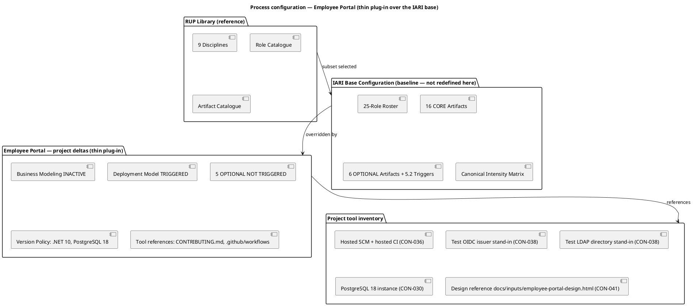
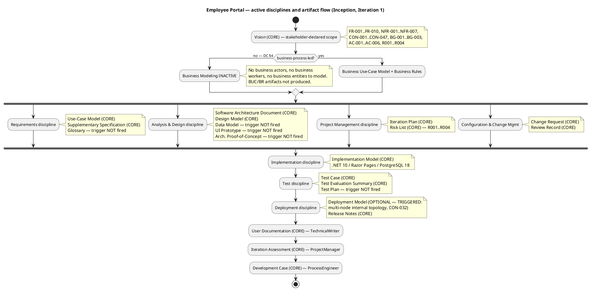
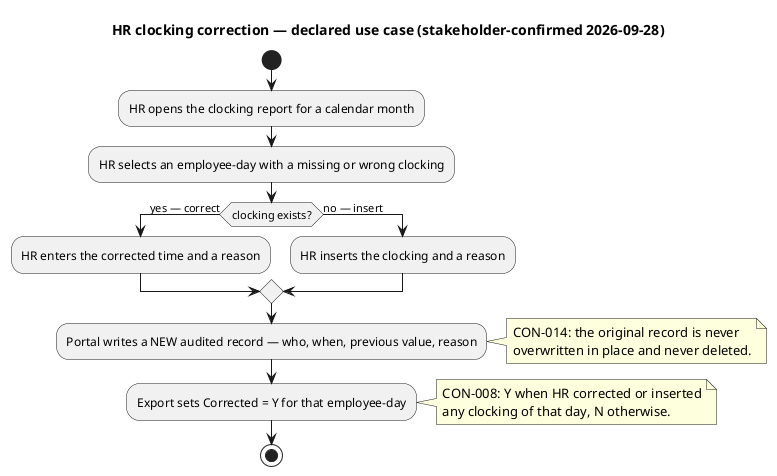
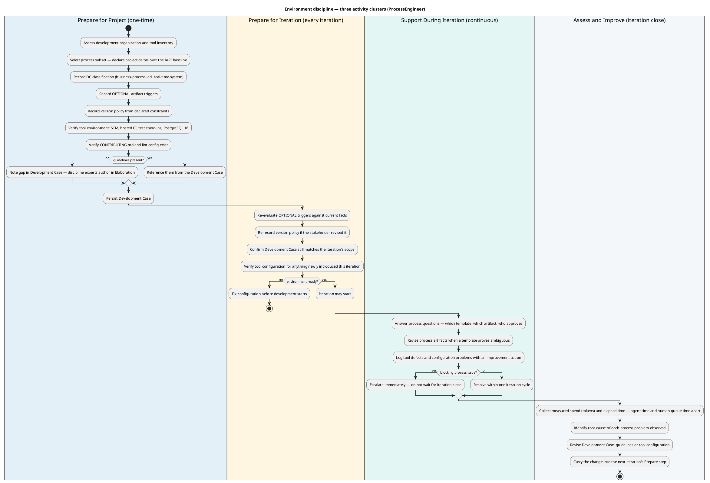

## Document Control

- Phase: Inception
- Status: Draft — under review for the end-of-Inception milestone
- Milestone Target: end-of-Inception (NOT YET ACHIEVED)
- Iteration: 1, Cycle 1
- Owner: ProcessEngineer
- Last updated: 2026-09-28

## Tailoring Overview
This document is a **delta over the IARI Development Case baseline**. It declares only
project-specific deviations. The baseline — the 25-role roster, the 16 CORE artifacts, the
6 OPTIONAL artifacts with their §5.2 triggers, the canonical intensity matrix and the fixed
primary ownership — is not restated here and is not redefined by this document.

### Organization and tool assessment (S1 findings)

| Dimension | Finding |
|---|---|
| Process artifacts in the repository | None prior to this iteration. This is the project's first iteration; no prior Development Case, no prior Review Record, no open Change Request. |
| Agent role count | 25 roles available per the baseline roster. Business Modeling is inactive as a discipline: no Business Modeling workflow runs and no Business Use-Case Model, Business Object Model or Business Rules artifact is produced. This removes no CORE artifact — the Vision remains CORE and is produced by its fixed primary owner. BusinessReviewer is not invoked, since no business-model artifact exists for it to review. |
| Process maturity target | CMMI Level 2 (Managed): requirements management, configuration management, project management basics. No statistical process control, no defect-prevention programme — the project has 10 use cases, 4 risks and one delivery. |
| Version control and CI | Hosted SCM provider with hosted CI (CON-036). CI never holds production data or credentials and never deploys; Infrastructure deploys. |
| External-system stand-ins | Test OIDC issuer and test LDAP directory carrying the declared attributes, including entries whose job title or extension is empty (CON-038). The team never works against the real Keycloak or the real AD. |
| Database | PostgreSQL 18 on the internal Windows Server estate (CON-030). |
| UI reference | `docs/inputs/employee-portal-design.html` — committed, verified present at sha `715d4f73d6ef4de18c46242258bc17a67f51ba6f`. Mandatory and authoritative for the visual layer (CON-041). |
| Guideline gap | `CONTRIBUTING.md`, the lint configuration and the CI workflow file are absent from the repository — verified by direct read, not assumed. Discipline experts author them during Elaboration; this Development Case references them and does not duplicate their content. |

### Process configuration

```plantuml
@startuml
title Process configuration — Employee Portal (thin plug-in over the IARI base)

package "RUP Library (reference)" as LIB {
  component "9 Disciplines" as RUP_DISC
  component "Role Catalogue" as RUP_ROLES
  component "Artifact Catalogue" as RUP_ART
}

package "IARI Base Configuration (baseline — not redefined here)" as BASE {
  component "25-Role Roster" as B_ROLES
  component "16 CORE Artifacts" as B_CORE
  component "6 OPTIONAL Artifacts + 5.2 Triggers" as B_OPT
  component "Canonical Intensity Matrix" as B_INT
}

package "Employee Portal — project deltas (thin plug-in)" as PROJ {
  component "Business Modeling INACTIVE" as P_BM
  component "Deployment Model TRIGGERED" as P_DEP
  component "5 OPTIONAL NOT TRIGGERED" as P_OPT
  component "Version Policy: .NET 10, PostgreSQL 18" as P_VER
  component "Tool references: CONTRIBUTING.md, .github/workflows" as P_TOOLS
}

package "Project tool inventory" as TOOLS {
  component "Hosted SCM + hosted CI (CON-036)" as T_CI
  component "Test OIDC issuer stand-in (CON-038)" as T_OIDC
  component "Test LDAP directory stand-in (CON-038)" as T_LDAP
  component "PostgreSQL 18 instance (CON-030)" as T_PG
  component "Design reference docs/inputs/employee-portal-design.html (CON-041)" as T_DESIGN
}

LIB --> BASE : subset selected
BASE --> PROJ : overridden by
PROJ --> TOOLS : references
@enduml
```

**Plug-in type: THIN.** This project substitutes content and adds references; it changes no
role, no artifact relationship and no workflow structure. No structural plug-in is applied,
so no downstream impact analysis is required.

### Active disciplines and artifact flow

```plantuml
@startuml
title Employee Portal — active disciplines and artifact flow (Inception, Iteration 1)

start
:Vision (CORE) — stakeholder-declared scope;
note right
  FR-001..FR-010, NFR-001..NFR-007,
  CON-001..CON-047, BG-001..BG-003,
  AC-001..AC-006, R001..R004
end note

if (business-process-led?) then (no — DC §4)
  :Business Modeling INACTIVE;
  note right
    No business actors, no business
    workers, no business entities to model.
    BUC/BR artifacts not produced.
  end note
else (yes)
  :Business Use-Case Model + Business Rules;
endif

fork
  :Requirements discipline;
  note right
    Use-Case Model (CORE)
    Supplementary Specification (CORE)
    Glossary — trigger NOT fired
  end note
fork again
  :Analysis & Design discipline;
  note right
    Software Architecture Document (CORE)
    Design Model (CORE)
    Data Model — trigger NOT fired
    UI Prototype — trigger NOT fired
    Arch. Proof-of-Concept — trigger NOT fired
  end note
fork again
  :Project Management discipline;
  note right
    Iteration Plan (CORE)
    Risk List (CORE) — R001..R004
  end note
fork again
  :Configuration & Change Mgmt;
  note right
    Change Request (CORE)
    Review Record (CORE)
  end note
end fork

:Implementation discipline;
note right
  Implementation Model (CORE)
  .NET 10 / Razor Pages / PostgreSQL 18
end note

:Test discipline;
note right
  Test Case (CORE)
  Test Evaluation Summary (CORE)
  Test Plan — trigger NOT fired
end note

:Deployment discipline;
note right
  Deployment Model (OPTIONAL — TRIGGERED:
  multi-node internal topology, CON-032)
  Release Notes (CORE)
end note

:User Documentation (CORE) — TechnicalWriter;
:Iteration Assessment (CORE) — ProjectManager;
:Development Case (CORE) — ProcessEngineer;
stop
@enduml
```

### DC §4 classification — business-process-led

**Verdict: NOT business-process-led.** No criterion of DC §4 holds: the declared scope names no
business actor, no business worker and no business entity to model; the portal automates a single
internal record-keeping flow (clocking, news, directory) rather than a business process; and no
Business Use Case or Business Rule was declared. The ten declared items are system use cases
(FR-001..FR-010) with actors Employee and HR Administrator.

**Consequence:** Business Modeling is INACTIVE as a discipline. No Business Use-Case Model, no
Business Object Model and no Business Rules artifact is produced, and no Business Modeling
workflow runs. BusinessReviewer is not invoked, since no business-model artifact exists for it to
review. This removes no CORE artifact and changes no primary ownership: the Vision remains CORE
and is produced by its fixed primary owner, BusinessProcessAnalyst, whose role in this project is
confined to that artifact. The 25-role roster is unchanged.

### DC §10 classification — real-time system

**Verdict: NOT a real-time system.** No hard deadline and no concurrent event-driven or reactive
behaviour is declared. NFR-004 (clocking under 1 second) is a response-time target, not a hard
deadline whose miss is a system failure. NFR-006 (clocking survives a 5-minute outage) is a
client-side retry of one POST (CON-045), not reactive concurrency. CON-016 removes the only
date-boundary case by declaring that no shift crosses midnight.

## Disciplines and Intensity

**All disciplines run per the canonical intensity matrix.** No deviation is requested and none is
self-granted.

| Discipline | Status | Note |
|---|---|---|
| Business Modeling | **INACTIVE** | DC §4 verdict: not business-process-led. |
| Requirements | Active | Per canonical matrix. |
| Analysis & Design | Active | Per canonical matrix. |
| Implementation | Active | Per canonical matrix. |
| Test | Active | Per canonical matrix. |
| Deployment | Active | Per canonical matrix. |
| Configuration & Change Management | Active | Per canonical matrix. |
| Project Management | Active | Per canonical matrix. |
| Environment | Active | One-time at project start — this iteration. |

## Artifacts and Templates
All 16 CORE artifacts are produced. One OPTIONAL artifact is triggered; five are not.

| Artifact | Status | Template / reference |
|---|---|---|
| Vision | CORE | Baseline template. |
| Use-Case Model | CORE | Baseline template. UC enumeration per baseline rule: one UC per declared process; multi-actor on the same process is one UC with multiple scenarios. |
| Supplementary Specification | CORE | Baseline template. Home of the cross-cutting mechanisms (OIDC login, LDAP read, audit trail, idempotency) — never UCs. |
| Software Architecture Document | CORE | Baseline template. Anchors the version policy below. |
| Design Model | CORE | Baseline template. Data structures live inline here (Data Model not triggered). |
| Implementation Model | CORE | Baseline template. |
| Test Case | CORE | Baseline template. |
| Test Evaluation Summary | CORE | Baseline template. |
| User Documentation | CORE | Baseline template. |
| Release Notes | CORE | Baseline template. |
| Iteration Plan | CORE | Baseline template. Defines per-iteration testing scope (Test Plan not triggered). |
| Iteration Assessment | CORE | Baseline template. Carries the measured spend. |
| Risk List | CORE | Baseline template. R001..R004 carried with their declared identifiers and magnitudes. |
| Review Record | CORE | Baseline template. Findings only, one per defect. |
| Development Case | CORE | This document. |
| Change Request | CORE | Baseline template. |
| Deployment Model | **OPTIONAL — TRIGGERED** | Baseline template. |
| Glossary | OPTIONAL — not triggered | — |
| Architectural Proof-of-Concept | OPTIONAL — not triggered | — |
| Data Model | OPTIONAL — not triggered | — |
| User-Interface Prototype | OPTIONAL — not triggered | — |
| Test Plan | OPTIONAL — not triggered | — |

### Declared use-case scope — HR clocking correction

The stakeholder confirmed on 2026-09-28 that HR corrects or inserts a clocking **inside the
portal**, as an HR-only use case. That is what the `Corrected` column and the audit entry
(who, when, previous value, reason) record, and the original record is never overwritten or
deleted. "Outside the portal" in CON-015 refers only to HR chasing the employee about the
missing clock-out, not to entering the correction.

**Consequence for artifact scope:** the Use-Case Model carries this as a declared use case with
its own scenarios and its own Test Cases. It is not a cross-cutting mechanism and not a
Supplementary Specification entry. The correction is an HR-only action, so it is not a
self-service screen for the employee (CON-013).

```plantuml
@startuml
title HR clocking correction — declared use case (stakeholder-confirmed 2026-09-28)

start
:HR opens the clocking report for a calendar month;
:HR selects an employee-day with a missing or wrong clocking;
if (clocking exists?) then (yes — correct)
  :HR enters the corrected time and a reason;
else (no — insert)
  :HR inserts the clocking and a reason;
endif
:Portal writes a NEW audited record — who, when, previous value, reason;
note right
  CON-014: the original record is never
  overwritten in place and never deleted.
end note
:Export sets Corrected = Y for that employee-day;
note right
  CON-008: Y when HR corrected or inserted
  any clocking of that day, N otherwise.
end note
stop
@enduml
```

This decision is what makes CON-008 and NFR-002 implementable: the portal can set `Corrected = Y`
and can record who, when, previous value and reason only because the correction happens where the
portal can see it.

## Optional Artifact Triggers

| Optional Artifact | Trigger | Justification |
|---|---|---|
| Deployment Model | **FIRED** | The §5.2 condition — distributed / multi-node topology — genuinely holds. The portal is a .NET application on the internal Windows Server estate (CON-010) with PostgreSQL 18 on the same estate (CON-030), consuming Keycloak and Active Directory as separate internal nodes (CON-032), reached only from the corporate network (CON-034). Four distinct node roles, and CON-032 explicitly constrains the topology: Keycloak is an intra-network node, and a deployment view placing it in a cloud node is wrong. That constraint is a deployment-view decision, so the view must exist as an artifact. |
| Glossary | NOT FIRED | The domain uses no specialist vocabulary requiring stakeholder-validated definitions. The only enumerations — the four news categories (CON-023), the four worker categories (CON-026) and the two authorization levels (CON-033) — are closed lists already fixed by the declared constraints. |
| Architectural Proof-of-Concept | NOT FIRED | The §5.2 condition requires the Elaboration phase plus a technical risk needing empirical validation. Elaboration has not started, and none of R001 (adoption), R002 (missing clock-outs), R003 (single engineering contact) or R004 (AD attribute fill) is a technical risk requiring a proof of concept. R004 is resolved by the human validation of the real AD that CON-038 places outside team work. |
| Data Model | NOT FIRED | The §5.2 condition requires a data-centric system, more than 10 entities, or data migration in scope. None holds: the portal records clockings, news items, the AD-user-id-to-category link (CON-004, two columns) and audit entries — well under 10 entities — and CON-040 declares there is no data migration. Data structures live inline in the Design Model. |
| User-Interface Prototype | NOT FIRED | The §5.2 condition requires UX-critical UI or UI complexity needing stakeholder validation before implementation. The visual layer is already fixed: CON-041 makes `docs/inputs/employee-portal-design.html` mandatory and authoritative, committed and verified present. There is nothing left for a prototype to validate. |
| Test Plan | NOT FIRED | The §5.2 condition requires formal delivery, regulatory audit or contractual test reporting. NFR-002 states no external compliance regime applies and no retention period is mandated. The Iteration Plan defines per-iteration testing scope. |

## Roles and Ownership
**Not invoked this project:** BusinessReviewer — a consequence of Business Modeling being
inactive, since no business-model artifact exists for it to review. BusinessProcessAnalyst
remains the fixed primary owner of the CORE Vision artifact and is invoked for that artifact
alone; no Business Modeling workflow runs. Neither change alters the 25-role roster.

**Authorization model (CON-033):** two levels only, from Active Directory group membership —
members of the HR AD group publish, edit and unpublish news and manage worker categories;
everybody else is an employee with read access to the directory and the news plus their own
clockings. There is no role matrix, no permission screen and no per-category rule. Worker
category is descriptive and drives no access decision (CON-024).
## Guidelines and Procedures
### Measurement policy

Two quantities are measured, and each one has a named decision and a named reader. A quantity
whose decision cannot be named is not collected.

| Measured quantity | Decision it enables | Reader |
|---|---|---|
| Tokens consumed per iteration | Forecast the next iteration's spend from the measured actual of the closed iteration. It is never a trigger to cut or defer declared scope (CON-037). | ProjectManager, ProcessEngineer |
| Elapsed time, split into agent time and time waiting for a human | Whether a milestone is delayed by a human gate rather than by agent work. The only declared human gate is the validation of the real Keycloak and AD (CON-038); if it delays a milestone the remedy is another iteration (CON-047). | ProjectManager, ProcessEngineer, ManagementReviewer |

The two clocks are reported apart and never added. No budget or cap on token spend exists and
none is set by the team (CON-037). No velocity, no person-week, no person-month, no story point
and no function point is recorded — those units are not producible here. No calendar date is
projected from an estimate.

### Version policy

Recorded from the declared constraints and anchored by the SoftwareArchitect in the Software
Architecture Document. The registry's "latest" does not override it.

| Ecosystem | Package / target | Pinned version | LTS only | Source |
|---|---|---|---|---|
| framework | .NET | 10 | no | CON-028 |
| framework | PostgreSQL | 18 (major pinned; patch level floats) | no | CON-030 |

Razor Pages is part of the .NET 10 target and carries no separate pin (CON-029). Keycloak is not
pinned: it is an external system this project neither deploys nor operates (CON-031). No NuGet,
npm or PyPI package pin was declared.

### Tool configuration references

| Concern | Reference | Owner of the content |
|---|---|---|
| Coding standards, review conventions, commit and branch conventions | `CONTRIBUTING.md` | SoftwareArchitect with Implementer — authored in Elaboration |
| Lint and static-analysis configuration | repository lint configuration | SoftwareArchitect with Implementer — authored in Elaboration |
| Build and test pipeline | `.github/workflows` on the hosted SCM provider (CON-036) | ConfigurationManager with Implementer |
| UI visual layer | `docs/inputs/employee-portal-design.html` (CON-041) | UserInterfaceDesigner — mandatory and authoritative |
| External-system stand-ins | test OIDC issuer and test LDAP directory (CON-038) | Implementer with Integrator |

This Development Case references these files; it does not restate their content. `CONTRIBUTING.md`
and the lint configuration do not exist yet — that gap is recorded in the Tailoring Overview and
is closed during Elaboration.

### Environment discipline — three activity clusters

```plantuml
@startuml
title Environment discipline — three activity clusters (ProcessEngineer)

|#E3F0F8|Prepare for Project (one-time)|
start
:Assess development organization and tool inventory;
:Select process subset — declare project deltas over the IARI baseline;
:Record DC classification (business-process-led, real-time-system);
:Record OPTIONAL artifact triggers;
:Record version policy from declared constraints;
:Verify tool environment: SCM, hosted CI, test stand-ins, PostgreSQL 18;
:Verify CONTRIBUTING.md and lint config exist;
if (guidelines present?) then (no)
  :Note gap in Development Case — discipline experts author in Elaboration;
else (yes)
  :Reference them from the Development Case;
endif
:Persist Development Case;

|#FFF6E2|Prepare for Iteration (every iteration)|
:Re-evaluate OPTIONAL triggers against current facts;
:Re-record version policy if the stakeholder revised it;
:Confirm Development Case still matches the iteration's scope;
:Verify tool configuration for anything newly introduced this iteration;
if (environment ready?) then (no)
  :Fix configuration before development starts;
  stop
else (yes)
  :Iteration may start;
endif

|#E4F6F3|Support During Iteration (continuous)|
:Answer process questions — which template, which artifact, who approves;
:Revise process artifacts when a template proves ambiguous;
:Log tool defects and configuration problems with an improvement action;
if (blocking process issue?) then (yes)
  :Escalate immediately — do not wait for iteration close;
else (no)
  :Resolve within one iteration cycle;
endif

|#F4F7FA|Assess and Improve (iteration close)|
:Collect measured spend (tokens) and elapsed time — agent time and human queue time apart;
:Identify root cause of each process problem observed;
:Revise Development Case, guidelines or tool configuration;
:Carry the change into the next iteration's Prepare step;
stop
@enduml
```

### Iteration preparation checklist

Before any iteration starts, the ProcessEngineer confirms: the Development Case matches the
iteration's scope; the OPTIONAL triggers have been re-evaluated against current facts; the version
policy reflects the stakeholder's latest declaration; and every tool introduced by that iteration
is configured and verified working. A tool discovered broken on day one is a process defect, not
a development problem.

### Process support

Process questions are answered within one iteration cycle. A blocking process issue — a template
that cannot be applied, a tool that prevents work, an approval whose owner is undefined — is
escalated immediately rather than at iteration close. Tool defects and configuration problems are
logged with an improvement action and carried into the next iteration's Prepare step.

### Change control

Nothing enters the process without a Change Request approved by the ChangeControlManager. The
declared scope is the ceiling: a new functional area, a new artifact outside the CORE + OPTIONAL
universe, or a change to a declared constraint requires a Change Request. The closed worker-category
list (CON-026) admits no fifth value without one.

### Environment readiness — Inception, Iteration 1

Verified before the iteration starts, by direct inspection of the repository rather than by
assumption.

| Check | Result | Action |
|---|---|---|
| Hosted SCM repository reachable | Pass | — |
| Mandatory UI design reference committed | Pass — `docs/inputs/employee-portal-design.html`, sha `715d4f73d6ef4de18c46242258bc17a67f51ba6f` | — |
| `CONTRIBUTING.md` present | Fail — not found in the repository | SoftwareArchitect with Implementer author it during Elaboration; referenced, not duplicated, by this Development Case |
| Lint configuration present | Fail — not found in the repository | Same as above |
| CI workflow file present | Fail — `.github/workflows/ci.yml` not found | ConfigurationManager with Implementer create it during Elaboration; CON-036 fixes the provider, not the file |
| Test OIDC issuer stand-in | Not yet provisioned | Implementer with Integrator, before the first login-dependent use case is implemented (CON-038) |
| Test LDAP directory stand-in | Not yet provisioned | Implementer with Integrator, before the first directory-dependent use case is implemented (CON-038) |
| PostgreSQL 18 instance | Not yet provisioned | Infrastructure installs it on the existing Windows Server estate (CON-030) |

**Verdict: environment ready for Inception.** The three absent files are Elaboration deliverables
owned by discipline experts, not Inception blockers — no Inception artifact depends on them. The
stand-ins and the database instance are needed before the use cases that consume them are
implemented, which is Elaboration and Construction work. Each is carried as a Prepare-for-Iteration
check, so a missing item is caught before the iteration that needs it starts rather than on its
first day.

## Traceability
| Element | Traces From | Link Type | Traces To |
|---|---|---|---|
| DC §Tailoring Overview — Business Modeling INACTIVE | FR-001, FR-002, FR-003, FR-004, FR-005, FR-006, FR-007, FR-008, FR-009, FR-010 | Refines | Use-Case Model, Supplementary Specification |
| DC §Artifacts and Templates — HR clocking correction use case (stakeholder-confirmed) | CON-008, CON-013, CON-014, CON-015, NFR-002 | Refines | Use-Case Model, Test Case, Test Evaluation Summary |
| DC §Optional Artifact Triggers — Deployment Model FIRED | CON-010, CON-030, CON-032, CON-034 | Refines | Deployment Model |
| DC §Optional Artifact Triggers — Data Model NOT FIRED | CON-004, CON-040 | Refines | Design Model |
| DC §Optional Artifact Triggers — User-Interface Prototype NOT FIRED | CON-041 | Refines | Design Model |
| DC §Optional Artifact Triggers — Test Plan NOT FIRED | NFR-002 | Refines | Test Case, Test Evaluation Summary |
| DC §Optional Artifact Triggers — Glossary NOT FIRED | CON-023, CON-026, CON-033 | Refines | Supplementary Specification |
| DC §Optional Artifact Triggers — Architectural Proof-of-Concept NOT FIRED | R001, R002, R003, R004 | Refines | Software Architecture Document |
| DC §Guidelines and Procedures — measurement policy | CON-037 | Refines | Iteration Assessment |
| DC §Guidelines and Procedures — version policy | CON-028, CON-030 | Refines | Software Architecture Document |
| DC §Guidelines and Procedures — stand-in tooling | CON-038 | Refines | Implementation Model |
| DC §Guidelines and Procedures — hosted CI | CON-036 | Refines | Implementation Model |
| DC §Guidelines and Procedures — environment readiness | CON-030, CON-036, CON-038, CON-041 | Refines | Implementation Model, Deployment Model |
| DC §Roles and Ownership — two-level authorization | CON-033 | Refines | Use-Case Model |
