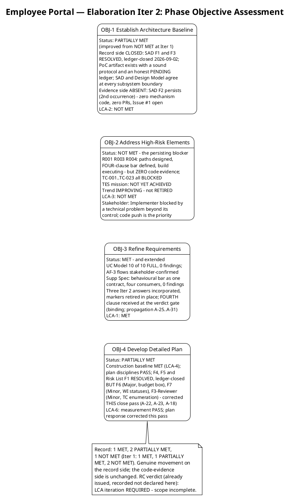
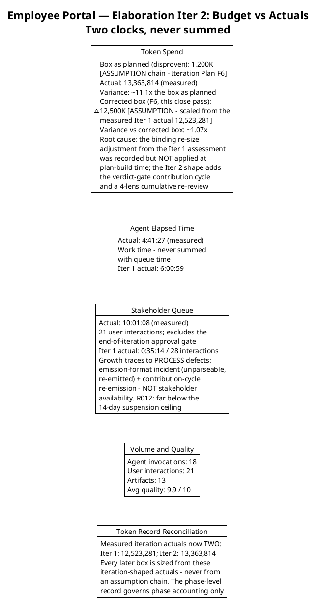
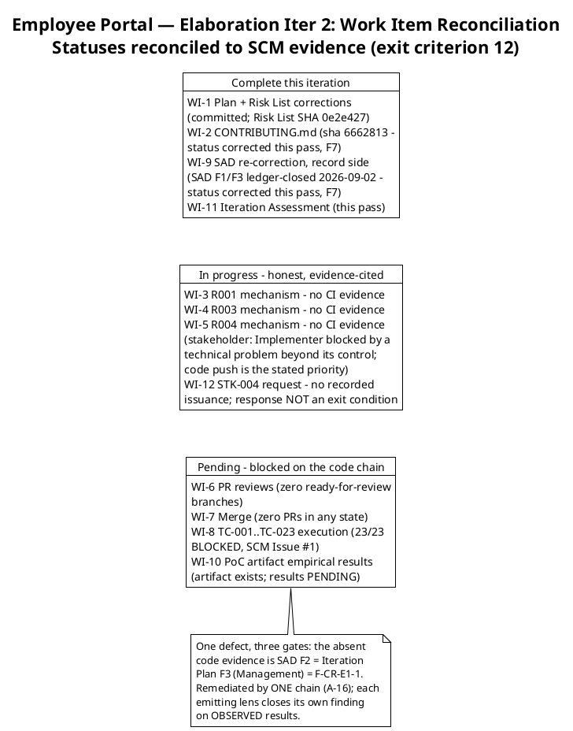
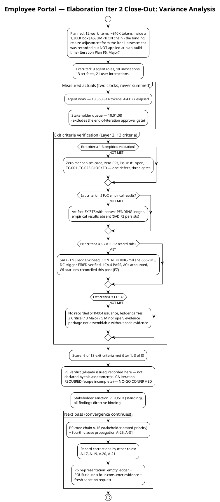

# Iteration Assessment

## Document Control

| Field | Value |
|---|---|
| Phase | Elaboration |
| Status | Draft — Elaboration Iteration 2 (Cycle 1) close-out record |
| Milestone Target | End of Elaboration (LCA) — **NOT achieved this cycle; NOT declared by this assessment** (the milestone verdict is the Review Coordinator's, already issued) |
| Iteration | 2 (Cycle 1) — convergence cycle |
| Date | 2026-09-02 |
| Review Coordinator Verdict (recorded, not declared here) | **LCA: iteration REQUIRED (scope incomplete)** — NO-GO CONFIRMED; `requiresIteration: TRUE`; the convergence cycle continues against the same R6 entry gate |
| Stakeholder Sanction (standing) | **REFUSED** at the Iter 1 LCA review — "No" to sanctioning advance past LCA. Binding directive, verbatim: "Please fix all the findings even if they are minors prior to move to next phase"; escalation resolution, verbatim: "Fix all the issues and close all findings". Fresh sanction request fires at the R6 re-presentation with the evidence package |
| Prior Version | Elaboration Iteration 1 close-out (2026-09-01); Inception Iteration Assessment (Approved at LCO — mission ACHIEVED); EVOLVED, not recreated. Prior records are preserved in SCM history |
| Elaboration Changes (Iter 2 close-out) | 4 phase objectives assessed (1 MET, 2 PARTIALLY MET, 1 NOT MET — genuine record-side movement vs Iter 1's 1/1/2); 6 of 13 exit criteria met (Iter 1: 3 of 8); measured actuals recorded (13,363,814 tokens; agent 4:41:27; stakeholder queue 10:01:08 — never summed); budget-box variance root-caused (the binding re-size adjustment was recorded but NOT applied at plan-build time — Iteration Plan F6, corrected this close pass); work items reconciled to SCM evidence (4 Complete, 2 In progress, 6 Pending/blocked); 12 tracked findings recorded with next-pass entry plan; PM-owned findings corrected this close pass (F6, F7, F3-Reviewer, Risk List F2, A-30); lessons learned + next-pass adjustments |

## Iteration Objectives Reached

The phase planned four objectives. Assessed against the Review Record (verified findings ledger, 2026-09-02) and the Test Evaluation Summary (mission verdict: NOT YET ACHIEVED), the record is: **1 MET, 2 PARTIALLY MET, 1 NOT MET** — genuine movement on the record side; the code-evidence side unchanged.

**Objective 1 — Establish Architecture Baseline: PARTIALLY MET (improved from NOT MET).** The record side closed this cycle: SAD F1 (superseded PoC disposition) and SAD F3 (stale component dependencies) are RESOLVED and ledger-closed (2026-09-02) — the SAD now carries the empirical disposition with an explicit supersession note, and the SAD and Design Model agree at every subsystem boundary. The DC-sanctioned Architectural Proof-of-Concept artifact EXISTS with a sound validation protocol, per-risk single-mechanism dispositions, the behavioural bar as acceptance criteria, and an honest PENDING ledger. The evidence side is absent: SAD F2 persists (2nd occurrence) — zero mechanism code in SCM, zero PRs in any state, SCM Issue #1 open. LCA criterion 2 (architecture stable): NOT MET — stable as a RECORD, unproven as EVIDENCE.

**Objective 2 — Address High-Risk Elements: NOT MET — the persisting blocker.** The empirical validation paths for R001 (disposable LDAP directory), R003 (stub OIDC issuer), R004 (direct) are designed, re-scoped per the binding stakeholder decision, and the FOUR-clause behavioural bar is now defined (stakeholder Iter 2 answer + verdict-gate fourth clause) — but the validation is unexecuted: zero `ready-for-review` branches, zero PRs in any state, no mechanism code, TC-001…TC-023 all BLOCKED. R001 (HIGH, exposure=9) trend: IMPROVING — the first genuine movement since Inception — but IMPROVING is not RETIRED; retirement is claimed only on OBSERVED results. The Test Evaluation Summary's mission verdict: NOT YET ACHIEVED (0 of 3 validations evidenced). The stakeholder attributed the Implementer's two-iteration code absence to a technical problem beyond its control and stated the code push as the priority for the next pass — recorded so convergence tracking does not misread the absence as non-compliance.

**Objective 3 — Refine Requirements: MET — and extended.** All 10 UCs FULL with correct `Source: FR-NNN` (0 findings); the UC-005/006/007 AF-3 behavioural-bar flows are stakeholder-confirmed with markers retired in place; the Supplementary Specification carries the behavioural bar as one reliability contract with four consumers (0 findings); the >90% figure is verified absent. Three stakeholder answers incorporated this iteration (behavioural bar; four-UC confirmation "Yes"; featured banner "newest first" — faithfully recorded in the Design Model as banners STACK, newest first). At the verdict gate the stakeholder added the FOURTH clause (binding, verbatim: "a missing attribute is displayed as missing. It is never replaced by a default, a placeholder, a guessed value, or another employee's value") — propagation tracked as A-25…A-31 across the seven carrying artifacts; the Risk List (A-30) and this plan's exit criterion 1 carry it already. LCA criterion 1 (vision stable): MET.

**Objective 4 — Develop Detailed Plan: PARTIALLY MET.** The Construction schedule baseline remains MET (LCA-4 PASS; UC IDs verified against the Use-Case Model authority). The plan's structural disciplines all PASS (units, two clocks, UC-ID authority, queue handling, all-findings criterion 11, status discipline 12), and three of this lens's Iter 1 findings are RESOLVED and ledger-closed (Iteration Plan F4, F5; Risk List F1). But the plan carried three new findings this cycle — F6 (Major: budget box not re-sized from the measured 12,523,281 actual, contradicting the Iter 1 assessment's first binding adjustment), F7 (Minor: WI 2/9 statuses understated verified delivery), F3-Reviewer (Minor: stale TC-001…TC-020 enumerations vs the 23-case authority) — **all three corrected in this close pass** (A-22, A-23, A-18): the box is re-sized to ~12,500K from the measured iteration actual, the statuses cite their evidence, and every TC enumeration reads TC-001…TC-023. LCA-6: measurement PASS; plan response corrected this pass.

## Adherence to Plan

| Metric | Planned | Actual (measured) | Notes |
|---|---|---|---|
| Token spend | 1,200K box [ASSUMPTION chain — disproven] | 13,363,814 | ~11.1× the box as planned; ~1.07× the corrected ~12,500K box — variance root-caused below |
| Agent elapsed time | Measured at close | 4:41:27 | Work time; never summed with queue |
| Stakeholder queue | Estimate NONE (rule) | 10:01:08 | 21 interactions; excludes the end-of-iteration approval gate; growth traced to process defects, not stakeholder availability |
| Agent invocations | — | 18 | 9 roles active |
| User interactions | — | 21 | 3 Iter 2 answers + verdict-gate contribution + review consultations |
| Artifacts | — | 13 | Inventory grew by the Architectural Proof-of-Concept artifact |
| Avg quality | — | 9.9 / 10 | Reviewer-assessed |

**Variance root cause (token spend ~11.1× the box as planned):** the Iter 1 Iteration Assessment recorded, as its FIRST binding adjustment, "Re-size the Iter 2 budget box from the measured 12,523,281 actual — the 1,200K assumption is disproven." The Iter 2 plan recorded that adjustment in its own change log but did NOT apply it — it re-derived the same 1,200K figure one step further from fact (Iteration Plan F6, Major, recorded by the Management Reviewer lens). The lesson: **a binding adjustment that is recorded but not applied is a finding waiting to fire.** The corrected box (~12,500K, scaled from the measured iteration actual) was applied this close pass; the measured Iter 2 actual (13,363,814) confirms its scale at ~1.07× — the residual variance is the verdict-gate contribution cycle and the 4-lens cumulative re-review, both genuine scope additions this iteration.

**Token record reconciliation:** measured iteration actuals now number TWO (Iter 1: 12,523,281; Iter 2: 13,363,814). Every later budget box is sized from these iteration-shaped actuals; the phase-level record (Inception: 1,347,939) governs phase accounting only. No per-iteration velocity is quoted from a phase-level record.

**Metrics with purpose (each answers a decision):**

| Goal (decision enabled) | Metric | Primitive measure |
|---|---|---|
| Track convergence progress cycle over cycle (decide whether the convergence cycle is closing its findings) | Exit criteria met | 6 of 13 this cycle (Iter 1: 3 of 8) — record side closing, code side unchanged |
| Size the next budget box from fact, not assumption | Token spend actual | 13,363,814 (system-measured) |
| Bound the human-gate queue risk (R012) with a measured basis and locate queue growth | Stakeholder queue time | 10:01:08 across 21 interactions (system-measured); growth attributed to process defects (emission-format incident, contribution-cycle re-emission) |
| Locate defect concentration for the next pass's critical path | Open findings by severity × artifact | Verified ledger: 2 Critical, 3 Major, 5 Minor + 2 narrative-tracked |
| Establish the process-effectiveness baseline (decide when reviews stop being the sole defect-detection instrument) | Defect removal efficiency | NOT YET MEASURABLE — 0 test executions (TC-001…TC-023 BLOCKED); becomes measurable when the mechanisms land |
| Confirm defects concentrate in execution, not design (protects the sound baseline from rework) | Avg artifact quality | 9.9 / 10 (reviewer-assessed) |

### Work Item Reconciliation (statuses reconciled to SCM evidence — exit criterion 12)

**Status honesty, both directions (F7 lesson):** WI 2 and WI 9 UNDERSTATED verified delivery ("In progress" against a committed sha and ledger-closed findings) — corrected this pass to "Complete" with evidence cited. WI 3–5 remain honestly "In progress" with their blocking evidence named. A status that cannot show evidence reverts to In progress, never to Complete — and a status that HAS evidence must not understate it either.

## Use Cases and Scenarios Implemented

**No use case was implemented as a running feature this iteration** — Elaboration produces the architecture baseline and validation evidence, not Construction features. The iteration's use-case scope was UC-001 (Clock In/Out), the four AD-reading use cases UC-004/005/006/007 (the FOUR-clause behavioural bar's consumers), and UC-010 (Unpublish News — audit/soft-delete test cases):

| UC | Validation Target | Mechanism | Result This Iteration |
|---|---|---|---|
| UC-001 | R003 (stub OIDC issuer) + R004 (offline drop) | COMP-006/CLS-010; COMP-009/CLS-008 | **Not executed** — zero code evidence; test cases designed (0 findings), execution BLOCKED |
| UC-004 | R001 (disposable LDAP directory) — FOUR-clause behavioural bar | COMP-007/CLS-009 | **Not executed** — zero code evidence; TC-011 + TC-021/022/023 designed with deliberately-seeded gaps and substitution-attempt fixtures; execution BLOCKED |
| UC-005/006/007 | R001 behavioural bar (stakeholder-confirmed extension) | COMP-007/CLS-009 (shared LDAP read path) | **Not executed** — same evidence gap; TC-021/022/023 designed this iteration (Integration level), BLOCKED |
| UC-010 | Audit trail + soft delete (R006 design) | CLS-005, DAT-002 | **Design complete** (Design Model, 0 findings); test cases designed, execution BLOCKED |

All 10 UCs (UC-001…UC-010) remain refined at the analysis level (Use-Case Model: 10/10 FULL, 0 findings at both reviews). Implementation of running features is Construction work per the baselined schedule (Iter 1 clocking cluster, Iter 2 news cluster, Iter 3 directory + export).

## Results Relative to Evaluation Criteria

### Layer 1 — Declared Acceptance Criteria (all 5 accounted; none closed this iteration)

| AC | Status This Iteration | Evidence / Deferral |
|---|---|---|
| AC-001 | Not addressed (deferred) | Construction Iter 1 — UC-001 running feature |
| AC-002 | Not addressed (deferred) | Construction Iter 2 — UC-008 running feature |
| AC-003 | Not met this iteration (partial evidence owed) | R001 validation was to produce partial evidence; it did not execute — rolls to the next pass; formal closure at Construction Iter 3 |
| AC-004 | Not addressed (deferred) | Transition Iter 1 — adoption measurement requires a deployed system (BG-003) |
| AC-005 | Not met this iteration (partial evidence owed) | R004 5-minute drop simulation did not execute — rolls to the next pass; formal AC test at Construction Iter 1 |

### Layer 2 — Iteration Plan Exit Criteria (6 of 13 met; Iter 1: 3 of 8)

| # | Exit Criterion | Result | Evidence |
|---|---|---|---|
| 1 | R001 empirically validated (disposable LDAP directory, FOUR-clause behavioural bar) | **NOT MET** | Zero mechanism code in SCM (SAD F2 / Iteration Plan F3 / F-CR-E1-1 — one defect, three gates); TES: 0 of 3 validations evidenced |
| 2 | R003 empirically validated (stub OIDC issuer) | **NOT MET** | Same evidence gap as criterion 1 |
| 3 | R004 empirically validated (direct) | **NOT MET** | Same evidence gap as criterion 1 |
| 4 | SAD corrected: §Quality empirical disposition (A-7) + §Logical View reconciliation (A-9) | **MET** | SAD F1/F3 RESOLVED and ledger-closed 2026-09-02 (Reviewer lens) |
| 5 | Architectural Proof-of-Concept artifact with empirical results (A-8) | **NOT MET** | Artifact EXISTS with honest PENDING ledger; empirical results absent (SAD F2 persists, 2nd occurrence) |
| 6 | CONTRIBUTING.md committed before the first mechanism PR (A-5) | **MET** | Committed, sha 6662813… (verified via the Development Case tool-verification 2026-09-02) |
| 7 | Development Case PoC-trigger record corrected (carried from Iter 1) | **MET** | DC trigger FIRED verified by both review lenses; carried verdict |
| 8 | Construction schedule baselined from measured actuals (carried from Iter 1) | **MET** | LCA-4 PASS (Management lens, both reviews) |
| 9 | STK-004 written deliverables request issued (R010) | **NOT EVIDENCED** | No recorded issuance this cycle; rolls to the next pass — and the response is NOT a condition of Elaboration exit (stakeholder decision) |
| 10 | All 5 ACs accounted | **MET** | Layer 1 table complete — AC-001 through AC-005 |
| 11 | ALL open findings closed — every lens, every severity | **NOT MET** | Verified ledger 2026-09-02: 2 Critical, 3 Major, 5 Minor open + 2 narrative-tracked; PM-owned findings corrected this close pass; the remainder is owned and scheduled |
| 12 | Work-item statuses reconciled to SCM evidence (A-11) | **MET** | Reconciliation executed this close pass (F7 corrections; WI 3–5 honestly In progress) |
| 13 | LCA evidence package assembled and re-presented with a fresh sanction request | **NOT MET** | Package not assemblable without code evidence; R6 entry gate unchanged |

**Score: 6 of 13.** The unmet criteria (1–3, 5, 13) are the empirical-validation core the stakeholder made binding; criteria 1–3 are one defect observed by three review gates, remediated by one action chain (A-16). The met criteria (4, 6–8, 10, 12) are the record side — closed this cycle, verified in the ledger.

## Test Results

No test execution occurred — no mechanism code exists to test. The Test Evaluation Summary (read in full) records the quality evidence for this iteration:

| Metric | Value | Source |
|---|---|---|
| Evaluation Mission verdict | **NOT YET ACHIEVED** — blocked on code delivery (INC-1 / SCM Issue #1) | Test Evaluation Summary § Conclusions |
| Risk-retirement validations evidenced | 0 of 3 (R001, R003, R004) | Test Evaluation Summary § Quality Metrics |
| Test cases designed / executed | 23 designed (TC-001…TC-023, 0 findings — extended this iteration with TC-021/022/023, the UC-005/006/007 AF-3 behavioural-bar cases) / **all 23 BLOCKED** on SCM Issue #1 | Test Case + Test Evaluation Summary |
| CI build status (main) | **Green** — run 33598979875 (completed 2026-09-02 06:29:05Z) | `scm_get_build_status`, verified this close pass |
| CI on `iteration/E1` | No runs — zero pushes have landed | Test Evaluation Summary (verified this iteration) |
| Open defects (SCM tracker) | 2 — Issue #1 (blocker, cr:approved, assigned: implementer), Issue #2 (minor — remediation verified present: CONTRIBUTING.md sha 6662813…; closure owned by the Code Reviewer lens) | Test Evaluation Summary + Review Record |
| Fabricated results | None — the honest NOT YET ACHIEVED verdict is itself the quality signal | Test Evaluation Summary § Conclusions |

The mission is defined, agreed, and executable, and every test-side precondition closed this cycle (behavioural bar defined and FOUR-clause-extended; SAD inconsistency resolved; fixtures specified with deliberately-seeded gaps; 23 cases designed and regression-ready; CI gate green and correctly configured). What it cannot yet claim is the three empirical validations — recording "achieved" would have been exactly the paper-only validation of a HIGH risk the stakeholder refused.

## External Changes

**No scope changes.** The declared scope (10 FRs, 5 NFRs, 5 ACs, 14 CONs) is unchanged; zero scope-creep findings across all review lenses, both iterations; R009 held by CCB enforcement.

**Stakeholder decisions recorded this iteration (all incorporated; markers retired in place where they stood):**
1. **R001 behavioural bar** — the >90% per-office figure is invented and dropped; the bar is behavioural (three clauses), with gaps seeded deliberately so each clause can actually fail; the production-AD percentage is a Construction activity (R010 + R011), outside the LCA evidence package.
2. **Four-UC confirmation** — the behavioural bar applies to ALL FOUR AD-reading use cases (UC-004/005/006/007), not only the directory search ("Yes").
3. **Featured-banner rendering contract** — "newest first": featured banners STACK, ordered newest first, every featured item renders its own banner (faithful record per the Design Model P-02; the Risk List R007 mis-transcription corrected this close pass, F2/A-24).
4. **FOURTH behavioural-bar clause (verdict-gate contribution, binding)** — verbatim: "a missing attribute is displayed as missing. It is never replaced by a default, a placeholder, a guessed value, or another employee's value." Rationale, verbatim: "Blank is an answer. 'General', or the first office in the list, is a fabrication — and on the CSV that reaches payroll a fabricated department is worse than an empty cell. An empty cell gets questioned. A plausible wrong one does not." Propagation tracked as A-25…A-31; the Risk List (A-30) and the Iteration Plan exit criterion 1 carry it already.
5. **Implementer context and priority** — verbatim: "Due to a technical problem, beyond its control, the implementer has not been able to work on both iterations. In this third iteration I hope that the Implementer can push the code so that everything moves forward." The two-iteration code absence is stakeholder-attributed to a technical problem beyond the Implementer's control; the code push is the stated priority for the next pass (A-16 remains P0).
6. **Contribution-cycle closure** — the stakeholder confirmed nothing further to add: "I did share previously to Reviewer Management something to fix. All was clear on that questionnaire." The standing all-findings directive is the complete work order for the next pass; the next stakeholder touchpoint is the R6 fresh sanction request.

**Stakeholder sanction: REFUSED (standing)** — the fresh request fires at the R6 re-presentation, gated on the evidence package. Requesting it mid-cycle would contradict the stakeholder's own bar.

## Rework Required

**Twelve tracked findings (verified ledger: 2 Critical, 3 Major, 5 Minor; plus 2 narrative-tracked Code Reviewer findings).** All are phase-exit conditions per the stakeholder's directive. PM-owned findings were corrected in this close pass; the remainder is owned and scheduled.

| # | Finding | Severity | Owner (Action) | Status |
|---|---|---|---|---|
| 1 | SAD F2 — zero mechanism code; empirical validation unexecuted (2nd occurrence) | Critical | Software Architect (A-8/A-16) + Implementer (A-2…A-4) + Code Reviewer (A-6) + Integrator + Test Designer | OPEN — closes only on OBSERVED results |
| 2 | Iteration Plan F3 (Management) — exit criteria 1–3 code evidence absent (2nd occurrence) | Critical | Project Manager (A-11/A-16) + the code chain | OPEN — record side fixed and verified; closes on OBSERVED results |
| 3 | F-CR-E1-1 — no Implementer handoff (narrative-tracked; converges with #1, #2) | Critical | Integrator (A-1, done) + Implementer (A-2…A-4) + Code Reviewer (A-6) | OPEN — same defect, same chain (A-16) |
| 4 | Development Case F1 — misrecorded featured-banner decision (3 locations) | Major | Process Engineer (A-17) | OPEN — record correction |
| 5 | Iteration Plan F6 — budget box not re-sized from the measured actual | Major | Project Manager (A-22) | **CORRECTED this close pass** — box re-sized ~12,500K; work items, headroom, Resources, Construction sizing updated in the same pass |
| 6 | Risk List F2 — R007 featured-banner mis-transcription | Major | Project Manager (A-24) | **CORRECTED this close pass** — faithful contract recorded, coordinated with A-17 |
| 7 | Development Case F2 — stale TC enumeration (5 locations) | Minor | Process Engineer (A-20) | OPEN — record correction |
| 8 | Iteration Plan F3 (Reviewer, Iter 2) — stale TC enumeration (3 locations) | Minor | Project Manager (A-18) | **CORRECTED this close pass** — TC-001…TC-023 everywhere |
| 9 | Iteration Plan F7 — WI 2/9 statuses stale vs verified delivery | Minor | Project Manager (A-23) | **CORRECTED this close pass** — statuses cite evidence |
| 10 | Test Evaluation Summary F1 — stale TC enumeration (8 locations) + stale scope row | Minor | Test Manager (A-19) | OPEN — record correction |
| 11 | Architectural Proof-of-Concept F1 — stale TC enumeration (2 locations) | Minor | Software Architect (A-21) | OPEN — lands with the A-8/A-16 PoC evolution |
| 12 | F-CR-E1-2 — CONTRIBUTING.md (narrative-tracked) | Minor | Implementer / Architect / ConfigurationManager (A-5) | Remediation VERIFIED PRESENT (sha 6662813…); closure owned by the Code Reviewer lens |

**Fourth-clause propagation (stakeholder-decision work, tracked as A-25…A-31):** A-30 (Risk List) — **DONE this close pass**; the Iteration Plan exit criterion 1 and UC table carry the four-clause bar — **DONE this close pass**; A-25 (Use-Case Model), A-26 (Supplementary Specification) — System Analyst, next pass; A-27 (Design Model) — Designer, MUST land with the mechanism build so the code implements four clauses; A-28 (Test Case) — Test Designer, MUST land BEFORE TC execution so the fourth clause can actually fail; A-29 (PoC artifact), A-31 (SAD) — Software Architect, with the A-8/A-16 evolution.

### Variance Analysis

### Lessons Learned

1. **A binding adjustment that is recorded but not applied is a finding waiting to fire (the dominant variance).** The Iter 1 assessment's first binding adjustment (re-size the box from the measured 12,523,281 actual) was quoted in the Iter 2 plan's own change log while the plan body re-derived the disproven 1,200K figure — recorded as Iteration Plan F6 (Major) and corrected only at this close. Adjustments land in the artifact BODY at plan-build time, or they have not landed.
2. **Mis-transcribing a stakeholder answer is a defect class, and it fires in pairs.** "Newest first" was glossed as the UNSELECTED option in two governance artifacts (Risk List F2, Development Case F1). "Newest first" is an ordering statement; ordering presupposes plurality. When recording a stakeholder decision: record the verbatim answer AND the faithful reading; never gloss — and when one artifact is caught mis-transcribing, check every artifact that carries the same decision.
3. **A confirmation questionnaire that cannot receive an addition silently drops stakeholder decisions.** The stakeholder held the fourth behavioural-bar clause for an entire cycle because the Iter 2 confirmation was yes/no with no free-text field. Contract-confirmation questionnaires must carry an optional free-text field (process observation recorded by the Review Coordinator; propagated to the Process Engineer).
4. **Queue growth traces to process defects, not stakeholder availability.** The queue grew 0:35:14 → 10:01:08 while the stakeholder answered every question in-round; the growth is the emission-format incident (an unparseable emission, re-emitted) and the contribution-cycle re-emission. Emission-format discipline — the marker on exactly one line, immediately followed by the valid JSON array, never embedded in memory blocks or prose — is load-bearing.
5. **One defect, three gates persists until the code lands.** The absent code evidence is still SAD F2 = Iteration Plan F3 = F-CR-E1-1, and it is now a 2nd-occurrence Critical on two gates. The stakeholder has attributed the Implementer's absence to a technical problem beyond its control and stated the code push as the priority — the convergence cycle's success now depends on exactly that one chain (A-16).

### Next Iteration Adjustments (binding inputs to the next pass)

| Adjustment | Rationale |
|---|---|
| **P0: execute the code chain A-16** — mechanisms in risk order R001 → R003 → R004, evolutionary in src/, dual-coverage tests, ready-for-review labels, terminal PR dispositions (base `iteration/E1`), Integrator merges, TC-001…TC-023 executed, empirical results into the PoC artifact, Issue #1 closed on merged-PR evidence | The stakeholder-stated priority; closes the three-gate Critical defect; the only path to the R6 entry gate |
| **A-28 fourth-clause test steps land BEFORE TC execution** (assert blank, not substituted; seed substitution-attempt fixtures) | A clause that cannot fail proves nothing — the stakeholder's own framing |
| **A-27 design contracts land WITH the mechanism build** | The code must implement four clauses, not three |
| Record corrections by other roles: A-17 (DC featured-banner), A-19 (TES TC enumeration), A-20 (DC TC enumeration), A-21 (PoC TC enumeration, with the A-8 evolution), A-25/A-26 (UC Model + Supp Spec fourth clause), A-29/A-31 (PoC + SAD fourth clause) | All are phase-exit conditions per the all-findings directive; all are quick, independent record corrections |
| Budget box for the next pass: sized from the measured iteration-shaped actuals (Iter 1: 12,523,281; Iter 2: 13,363,814) — the corrected ~12,500K basis carries forward; no assumption chain | The F6 lesson: adjustments are applied in the plan body at build time |
| No scope reduction | The convergence scope is fully determined by the open findings and the stakeholder directive; the box governs, and the box is now calibrated to measured fact |

## Traceability

| Element | Traces From | Link Type | Traces To |
|---|---|---|---|
| Iteration Assessment (this, Elaboration Iter 2) | Iteration Plan (Elaboration Iter 2 — objectives, exit criteria 1–13, corrected budget box); Review Record (verified findings ledger 2026-09-02, RC verdict NO-GO CONFIRMED, stakeholder sanction record, verdict-gate contribution); Test Evaluation Summary (mission verdict NOT YET ACHIEVED, quality metrics); Work Order measured facts (13,363,814 tokens; 4:41:27 agent; 10:01:08 queue; 18 invocations; 21 interactions; 13 artifacts; 9.9 quality) | Reviews | Next convergence pass (A-16 code chain + A-17…A-31 record corrections); R6 LCA re-presentation; Construction Iter 1 plan (built at LCA sanction) |
| OBJ-1 assessment (Architecture Baseline) | SAD (F1/F3 RESOLVED, ledger-closed; F2 persists); Architectural Proof-of-Concept artifact (exists, PENDING ledger); Review Record LCA-2 | Reviews | A-8/A-16/A-21/A-29/A-31 (Software Architect) |
| OBJ-2 assessment (High-Risk Elements) | Risk List R001/R003/R004 (MITIGATING, IMPROVING, unexecuted); Test Evaluation Summary (0 of 3 evidenced; 23/23 BLOCKED); Review Record LCA-3, SAD F2, Iteration Plan F3, F-CR-E1-1; stakeholder Implementer context (verbatim) | Reviews | A-16 delivery chain (Implementer, Code Reviewer, Integrator, Test Designer, Architect) |
| OBJ-3 assessment (Refine Requirements) | Use-Case Model (10/10 FULL, 0 findings; AF-3 flows confirmed); Supplementary Specification (0 findings; behavioural bar, four consumers); stakeholder Iter 2 answers + verdict-gate fourth clause (verbatim) | Reviews | A-25, A-26 (System Analyst); Construction iteration plans |
| OBJ-4 assessment (Detailed Plan) | Iteration Plan (Construction baseline, LCA-4 PASS; F6/F7/F3-Reviewer corrected this close pass); Review Record (PRA Part 1; F4/F5 resolved) | Reviews | A-22, A-23, A-18 (applied this close pass); next-pass plan |
| Budget variance root cause | Work Order measured actuals (13,363,814; 4:41:27; 10:01:08); Iter 1 assessment binding adjustment #1; Review Record Iteration Plan F6 (Major, A-22) | DependsOn | Corrected ~12,500K box (applied this close pass); every later budget forecast |
| Token record reconciliation | Measured iteration actuals (Iter 1: 12,523,281; Iter 2: 13,363,814); Inception phase-level record (1,347,939 — governs phase accounting) | Replaces | All later iteration-box sizing |
| Work item reconciliation (4 Complete / 2 In progress / 6 Pending) | Iteration Plan work items 1–12; SCM state (zero PRs, zero ready-for-review branches, iteration/E1 no CI runs, main GREEN run 33598979875); CONTRIBUTING.md sha 6662813; SAD F1/F3 ledger closures | Reviews | A-16 code chain; exit criterion 12 verification |
| Exit criteria score (6 of 13) | Iteration Plan Layer 2 criteria 1–13; Test Evaluation Summary; Review Record verified ledger | Reviews | R6 LCA re-presentation entry gate (empty ledger + FOUR-clause × four-consumer evidence package + fresh sanction request) |
| Test results record | Test Evaluation Summary (NOT YET ACHIEVED; 23/23 BLOCKED; CI green run 33598979875 — verified via scm_get_build_status this close pass; Issues #1/#2) | DependsOn | TC-001…TC-023 execution (next pass); defect removal efficiency baseline |
| Stakeholder decision record (Iter 2) | Stakeholder answers: behavioural bar (three clauses, >90% dropped); four-UC confirmation ("Yes"); featured banner ("newest first"); FOURTH clause (verbatim, verdict gate); Implementer context (verbatim); contribution-cycle closure (verbatim) | Authorizes | FOUR-clause behavioural bar (A-25…A-31 propagation); A-16 as P0; R6 evidence gate scope; Risk List R001 (A-30, applied); Iteration Plan exit criterion 1 |
| PM-owned finding corrections (this close pass) | Review Record Iteration Plan F6 (A-22), F7 (A-23), F3-Reviewer (A-18); Risk List F2 (A-24); A-30 | Reviews | Iteration Plan (box, statuses, TC enumerations, fourth clause); Risk List (R007 faithful contract; R001 four clauses; R012 measured actual) |
| Lessons learned (adjustment application, mis-transcription class, questionnaire format, queue attribution, one-defect-three-gates) | This iteration's measured variance; Review Record findings and process incidents; stakeholder interactions (21, 10:01:08 queue) | Refines | Every later Iteration Plan and Iteration Assessment; questionnaire format (Process Engineer); emission-format discipline (all roles) |