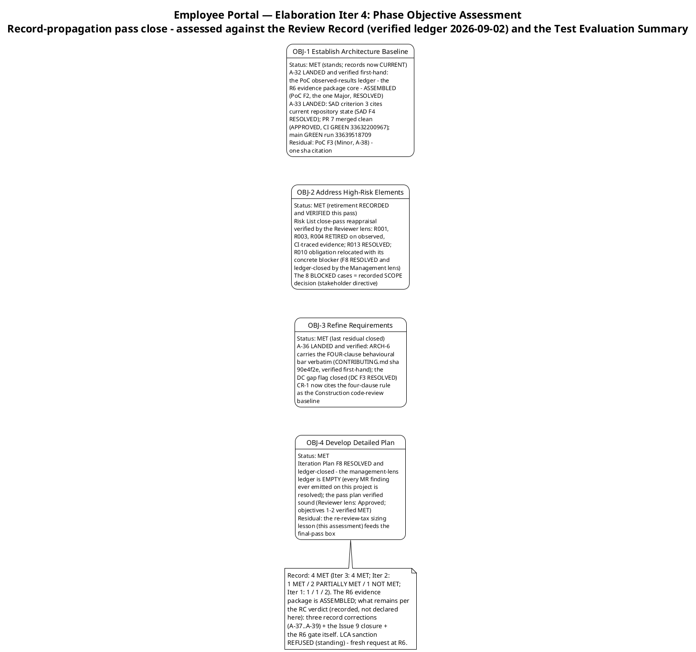
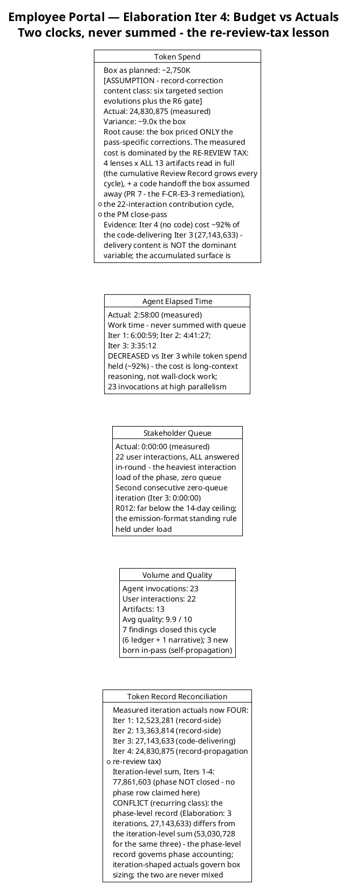
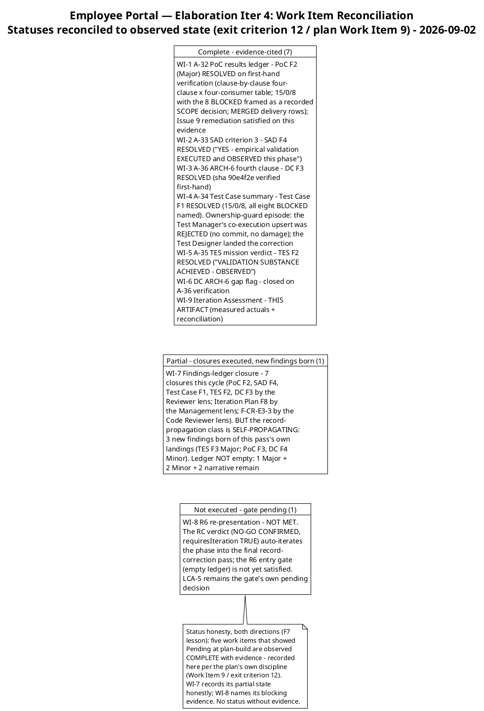
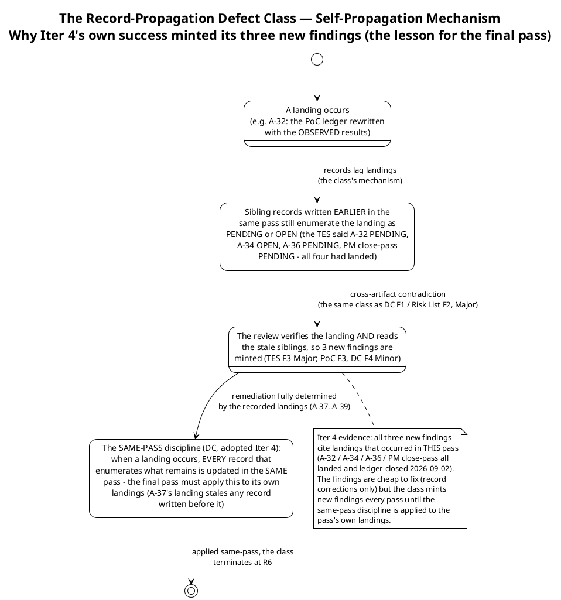

# Iteration Assessment

## Document Control

| Field | Value |
|---|---|
| Phase | Elaboration |
| Status | Draft — Elaboration Iteration 4 (Cycle 1) close-out record; EVOLVED from the Iter 3 close-out, not recreated |
| Milestone Target | End of Elaboration (LCA) — **NOT achieved this cycle; NOT declared by this assessment** (the milestone verdict is the Review Coordinator's, already issued) |
| Iteration | 4 (Cycle 1) — record-propagation pass |
| Date | 2026-09-02 |
| Review Coordinator Verdict (recorded, not declared here) | **LCA: iteration REQUIRED (scope incomplete)** — NO-GO CONFIRMED; `requiresIteration: TRUE`; the R6 evidence package is ASSEMBLED (its core — the PoC observed-results ledger — landed and ledger-closed this cycle), zero Critical open for the second consecutive cycle, and the phase auto-iterates into the **final record-correction pass** (A-37…A-39 + the Issue #9 closure + the R6 gate itself) |
| Stakeholder Sanction (standing) | **REFUSED** at the Iter 1 LCA review — binding directive, verbatim: "Please fix all the findings even if they are minors prior to move to next phase"; escalation resolution, verbatim: "Fix all the issues and close all findings". **Iter 4 verdict-gate contribution — ANSWERED and folded, verbatim: "Close all findings and issues opened"** — reinforces the all-findings directive and extends it to the open SCM issues (Issue #9 — the PoC results-ledger CR — closes on the verified A-32 evidence; Issues #1/#2 already closed). Fresh sanction request fires at R6 |
| Prior Version | Elaboration Iteration 3 close-out (2026-09-02); Iteration 2 close-out (2026-09-02); Iteration 1 close-out (2026-09-01); Inception Iteration Assessment (Approved at LCO — mission ACHIEVED); EVOLVED, not recreated. Prior records are preserved in SCM history |
| Elaboration Changes (Iter 4 close-out) | 4 phase objectives assessed — **4 MET** (records now CURRENT: A-32…A-36 all landed and ledger-closed); 6 of 8 pass exit criteria met (criteria 6 and 7 — ledger-empty and the R6 gate — NOT MET: 3 new findings born of this pass's own landings); measured actuals recorded (24,830,875 tokens; agent 2:58:00; stakeholder queue 0:00:00 across 22 interactions — never summed); budget variance root-caused (**RE-REVIEW TAX** — the box priced only the pass's corrections; the measured cost is dominated by the 4-lens × 13-artifact cumulative re-review; Iter 4, with no code, cost ~92% of code-delivering Iter 3); work items reconciled to observed state (7 Complete, 1 partial, 1 not executed); 7 findings closed this cycle / 3 new born (the record-propagation class is SELF-PROPAGATING — the same-pass discipline is the cure); lessons learned + final-pass adjustments (box ~21,000K by content class including the tax) |

## Iteration Objectives Reached

The phase planned four objectives. Assessed against the Review Record (verified findings ledger, 2026-09-02) and the Test Evaluation Summary (mission verdict: VALIDATION SUBSTANCE ACHIEVED — OBSERVED), the record is: **4 MET** — the phase objectives stand MET on observed evidence from Iter 3, and this pass made the RECORDS current to that evidence. What the RC verdict calls "scope incomplete" is the pass's own exit criteria 6 and 7 (the empty-ledger condition and the R6 gate) — recorded here, not re-litigated.



**Objective 1 — Establish Architecture Baseline: MET (records now current).** The architecture has been stable as record AND evidence since Iter 3; this pass closed the record lag: the PoC artifact's results ledger now carries the OBSERVED results (A-32 — R001 four-clause × four-consumer clause-by-clause evidence, R003 matrix, R004 simulation, 15/0/8 with the 8 BLOCKED framed as a recorded SCOPE decision, MERGED delivery rows with PR numbers, claims/does-not-claim discipline) — PoC F2, the one Major, RESOLVED on first-hand verification. SAD criterion 3 cites current repository state (A-33 — SAD F4 RESOLVED). PR #7 (the F-CR-E3-3 state-comment remediation) merged clean: APPROVED, review 5090059324, CI GREEN run 33632200967; main GREEN run 33639518709. Residual: PoC F3 (Minor, A-38) — one sha citation in the PoC traceability row.

**Objective 2 — Address High-Risk Elements: MET (retirement recorded and verified).** The Risk List close-pass reappraisal landed in-pass and was verified by the Reviewer lens this cycle: R001/R003/R004 RETIRED (Elaboration scope) on observed, CI-traced evidence, with residuals correctly carried to R011 (Construction); R013 RESOLVED; R010 NARROWED with the PM obligation relocated to Construction Iter 1 with its own trigger — Iteration Plan F8 RESOLVED and ledger-closed by the Management Reviewer lens (that lens's findings ledger is now EMPTY: every ManagementReviewer finding ever emitted on this project is resolved). The 8 BLOCKED test cases remain a recorded SCOPE decision per the stakeholder's framing directive: deferred to Construction, not missing.

**Objective 3 — Refine Requirements: MET (last residual closed).** A-36 landed and was verified first-hand: CONTRIBUTING.md (sha 90e4f2e) carries the FOUR-clause behavioural bar verbatim, and the Development Case gap flag closed on that verification (DC F3 RESOLVED). CR-1 now cites the four-clause rule as the citable baseline for Construction code reviews — the live propagation risk for the Construction UI layer (where substitution temptations are exactly the failure mode clause (d) prohibits) is closed.

**Objective 4 — Develop Detailed Plan: MET.** The pass plan was verified sound by both reviewing lenses (Reviewer: Approved — objectives 1–2 verified MET, box by content class with basis named; Management: CONDITIONAL GO sustained, conditions narrowed, zero new findings). The one residual planning lesson this pass produces — the re-review tax (below) — feeds the final-pass box sizing recorded in this assessment's adjustments.

## Adherence to Plan



| Metric | Planned | Actual (measured) | Notes |
|---|---|---|---|
| Token spend | ~2,750K box (work-item sum = box; no headroom) | 24,830,875 | ~9.0× the box — variance root-caused below (re-review tax, not rework) |
| Agent elapsed time | Measured at close | 2:58:00 | Work time; never summed with queue; decreased vs Iter 3 (3:35:12) |
| Stakeholder queue | Estimate NONE (rule; R012 bound) | 0:00:00 | 22 interactions, ALL answered in-round; excludes the end-of-iteration approval gate |
| Agent invocations | — | 23 | 5 roles active (Architect, Test Designer/Test Manager, Process Engineer, Review Coordinator + Management Reviewer, Project Manager) + the Code Reviewer gate |
| User interactions | — | 22 | The heaviest interaction load of the phase — all in-round |
| Artifacts | — | 13 | Inventory unchanged |
| Avg quality | — | 9.9 / 10 | Reviewer-assessed |

**Variance root cause (token spend ~9.0× the box): the RE-REVIEW TAX.** The ~2,750K box was sized from the record-side iterations' per-artifact correction cost — it priced the pass's own deliverables (six targeted section evolutions plus the R6 gate) and nothing else. The measured cost is dominated by what the box assumed away: (1) the four-lens cumulative re-review, which reads ALL 13 artifacts in full every cycle against a Review Record that grows with every pass; (2) a code handoff the plan declared out of scope (PR #7 — the F-CR-E3-3 remediation, reviewed under CR-1…CR-7 and APPROVED); (3) the 22-interaction stakeholder contribution cycle; (4) the PM close-pass. The decisive evidence: **Iteration 4 — a pass with no code, no design, and no new validation — cost ~92% of the code-delivering Iteration 3 (27,143,633).** Delivery content is NOT the dominant spend variable; the accumulated artifact surface is. **The lesson: every box is sized as (pass-specific work) + (the re-review tax, held roughly constant per cycle and growing with the surface).** The final-pass box below applies it.

**Token record reconciliation (conflict recorded, not fabricated):** measured iteration actuals now number FOUR (12,523,281 / 13,363,814 / 27,143,633 / 24,830,875); the iteration-level sum for Iters 1–4 is 77,861,603 — recorded for iteration accounting only; the phase is NOT closed, so no phase row is claimed. The Work Order's phase-level Elaboration record (3 iterations, 27,143,633 tokens, 3.6 h, 22 runs) differs from the iteration-level sum for the same three iterations (53,030,728) — the same conflict class as the Inception record (1,347,939 vs 3,550,308). Standing resolution: the phase-level record governs phase accounting; iteration-shaped actuals govern every budget box; the two are never mixed, and no per-iteration velocity is quoted from a phase-level record. When Elaboration closes, its recorded actuals replace every assumed share.

**Metrics with purpose (each answers a decision):**

| Goal (decision enabled) | Metric | Primitive measure |
|---|---|---|
| Track phase-closure progress cycle over cycle (decide whether the phase is converging on the R6 gate) | Pass exit criteria met | 6 of 8 this pass (Iter 3: 10 of 14; Iter 2: 6 of 13; Iter 1: 3 of 8) — the two unmet are the ledger-empty condition and the R6 gate itself |
| Size the next box from fact, by content class INCLUDING the re-review tax | Token spend actual | 24,830,875 (system-measured) — the record-propagation + re-review-tax class's first data point |
| Bound the human-gate queue risk (R012) and verify emission discipline under the heaviest interaction load | Stakeholder queue time | 0:00:00 across 22 interactions (system-measured) — all in-round; second consecutive zero-queue iteration |
| Locate defect concentration for the final pass's critical path | Open findings by severity × artifact | Verified ledger: 0 Critical (held, second consecutive cycle), 1 Major (TES F3), 2 Minor (PoC F3, DC F4) + 2 narrative (F-CR-E3-1/2, Construction scope) — all record-propagation class |
| Verify the review process is not deteriorating (rigor check) | Closures vs new findings; recurrence | 7 closed / 3 new (net −4); recurrence 0 of 7 — second consecutive zero; severity profile 4 Critical → 2 → 0 → 0 across four cycles |
| Confirm defects concentrate in records, not the validated baseline (protects the baseline from rework) | Avg artifact quality | 9.9 / 10 (reviewer-assessed) |

### Work Item Reconciliation (statuses reconciled to observed state — exit criterion 12 / plan Work Item 9)



**Status honesty, both directions (F7 lesson):** five work items that showed "Pending" at plan-build (WIs 1–6) are observed COMPLETE with evidence cited — recorded here per the plan's own discipline. WI-7 records its partial state honestly (the closures executed AND the new findings born); WI-8 names its blocking evidence (the RC verdict and the non-empty ledger). A status that cannot show evidence reverts to In progress, never to Complete — and a status that HAS evidence must not understate it either.

## Use Cases and Scenarios Implemented

**No use case was implemented or validated as a running feature this iteration** — the record-propagation pass carried no use-case activity by design (record corrections only, per the stakeholder-confirmed R6 path). The phase's use-case validation record from Iters 1–3 stands unchanged:

| UC | Validation Record (Iters 1–3 — stands; no Iter 4 activity) | Status |
|---|---|---|
| UC-001 | R003 stub-issuer + R004 offline-drop mechanism validation — token matrix PASS; 5-minute drop simulation PASS (zero duplicates/losses, sync ≤ 60 s, confirmations < 1 s) | **VALIDATED — OBSERVED** |
| UC-004 | R001 FOUR-clause behavioural bar vs the disposable LDAP directory (gaps AND substitution attempts seeded deliberately) — every employee rendered, no hidden entries, no errors, no substitution | **VALIDATED — OBSERVED** |
| UC-005 | R001 bar (event row, blank display fields, clocking data always complete) — TC-021 PASS | **VALIDATED — OBSERVED** |
| UC-006 | R001 bar (CSV row, blank cells, no abort) — TC-022 PASS | **VALIDATED — OBSERVED** |
| UC-007 | R001 bar (employee locatable and selectable with blank fields) — TC-023 PASS | **VALIDATED — OBSERVED** |
| UC-010 | Audit + soft-delete design complete (0 findings); TC-013…TC-016 BLOCKED — recorded SCOPE decision (news/audit mechanisms are Construction scope) | Design complete; execution deferred |
| UC-002, UC-003, UC-008, UC-009 | Analysis complete (Use-Case Model 10/10 FULL, 0 findings at all four LCA reviews); featured-banner contract settled (banners STACK, newest first) | Analysis level; Construction |

All 10 UCs remain refined at the analysis level; implementation of running features is Construction work per the baselined schedule (Iter 1 clocking cluster, Iter 2 news cluster, Iter 3 directory + export). The Construction assignments are unchanged this pass.

## Results Relative to Evaluation Criteria

### Layer 1 — Declared Acceptance Criteria (all 5 accounted; unchanged — no AC is addressed by record propagation itself)

| AC | Status | Evidence / Deferral |
|---|---|---|
| AC-001 | Partial evidence — OBSERVED (stands) | UC-001 mechanisms validated empirically (Iters 1–3); running feature is Construction Iter 1 |
| AC-002 | Not addressed (deferred) | Construction Iter 2 — UC-008 running feature |
| AC-003 | Partial evidence — OBSERVED (stands) | R001 FOUR-clause bar validated against the disposable directory; production-AD performance + data quality at Construction Iter 3 (R010 + R011) |
| AC-004 | Not addressed (deferred) | Transition Iter 1 — adoption measurement requires a deployed system (BG-003) |
| AC-005 | Partial evidence — OBSERVED (stands) | R004 5-minute drop simulation PASS; formal AC test at Construction Iter 1 |

### Layer 2 — Iteration 4 Pass Exit Criteria (one line per criterion the plan carried — 6 of 8 MET)

| # | Exit Criterion | Result | Evidence |
|---|---|---|---|
| 1 | A-32 — PoC results ledger rewritten with the OBSERVED results (closes PoC F2, Major) | **MET — verified** | PoC F2 RESOLVED via resolve_artifact_finding (Reviewer lens, first-hand verification: clause-by-clause four-clause × four-consumer table; 15/0/8 with the 8 BLOCKED framed as a recorded SCOPE decision; MERGED delivery rows with PR numbers; claims/does-not-claim section) |
| 2 | A-33 — SAD criterion 3 updated to the observed state (closes SAD F4) | **MET — verified** | SAD F4 RESOLVED — criterion 3 reads "YES — empirical validation EXECUTED and OBSERVED this phase" with current evidence |
| 3 | A-34 — Test Case summary reconciled to the per-case record (closes Test Case F1) | **MET — verified** | Test Case F1 RESOLVED — summary, per-case table, and corrections paragraph agree (15+8=23); all eight BLOCKED named. Ownership-guard episode recorded honestly (the Test Manager's co-execution upsert REJECTED, no commit, no damage; the Test Designer landed it) |
| 4 | A-35 — TES mission verdict + INC-1 + metrics updated (closes TES F2) | **MET — verified** | TES F2 RESOLVED — mission verdict "VALIDATION SUBSTANCE ACHIEVED — OBSERVED", CI-traced |
| 5 | A-36 — ARCH-6 fourth clause + DC gap flag closed (closes DC F3) | **MET — verified** | DC F3 RESOLVED — CONTRIBUTING.md sha 90e4f2e carries the four-clause ARCH-6 verbatim (verified first-hand); flag closed |
| 6 | Findings ledger EMPTY across ALL lenses and ALL severities | **NOT MET** | 7 closures this cycle, but 3 new findings born of this pass's own landings: TES F3 (Major — stale remainder-enumerations vs the same-pass landings), PoC F3 + DC F4 (Minor); + 2 narrative Minors carried (F-CR-E3-1/2, Construction scope). The record-propagation class is self-propagating |
| 7 | R6 re-presentation with the evidence package + fresh sanction request | **NOT MET** | The RC verdict (recorded, not declared here): LCA iteration REQUIRED — NO-GO CONFIRMED, requiresIteration TRUE; the R6 entry gate (empty ledger) is not yet satisfied; LCA-5 remains the gate's own pending decision |
| 8 | Iteration Assessment at pass close (measured actuals, work-item reconciliation) | **MET** | THIS ARTIFACT — authored after the reviewers ruled, per the plan's Work Item 9 |

**Score: 6 of 8.** The two unmet criteria are the ledger-empty condition and the R6 gate — both are the final record-correction pass's work (A-37…A-39 + the Issue #9 closure + the gate itself). Every remaining item is a record correction; none requires code, design, or new validation.

## Test Results

The formal test execution record stands unchanged from the Iteration 3 close (the execution authority): **15 PASS / 0 FAIL / 8 BLOCKED** across TC-001…TC-023, execution trace CI run 33617748483 — the 8 BLOCKED cases stated per the stakeholder's framing directive as **a recorded SCOPE decision — deferred to Construction, not missing**. This pass's test-side activity was record propagation, and it landed:

| Item | Result (this pass) | Source |
|---|---|---|
| A-34 — Test Case Document Control summary | **LANDED** — reconciled to the per-case record (15/0/8; TC-017/TC-018 named in the BLOCKED set; recorded scope decision framing); Test Case F1 RESOLVED | Review Record Iter 4 technical-lens verification |
| A-35 — TES mission verdict, INC-1, metrics | **LANDED** — "VALIDATION SUBSTANCE ACHIEVED — OBSERVED"; INC-1 resolved; TES F2 RESOLVED | Test Evaluation Summary (Iter 4 revision, read this close) |
| Regression on the pass's one code handoff | **BASELINE HELD** — PR #7 (comment-only F-CR-E3-3 remediation) APPROVED, review 5090059324, CI GREEN run 33632200967; the 15/0/8 baseline unchanged | Review Record Iter 4 code-review-lens record |
| CI build status (main) | **Green** — run 33639518709 (completed 2026-09-02 14:04:14Z, post-PR-7) | Review Record Iter 4 technical-lens verification |
| Open SCM issues | **1 open, remediation satisfied** — Issue #9 (cr:approved, assigned:software-architect — the PoC results-ledger CR named in this Work Order) has its remediation LANDED and verified first-hand (the A-32 observed-results ledger); it closes on that evidence per the stakeholder's Iter 4 directive. Issues #1/#2 CLOSED (cr:complete) | Review Record Iter 4 technical-lens verification |
| New test-side finding | **TES F3 (Major, A-37 — Test Manager)** — the TES's remainder-enumerations (Milestone Target, master workflow, Sequence 3, resources, INC-1, Conclusions, recommendations, traceability) claim A-32/A-34/A-36/PM-close-pass are PENDING/OPEN while all four are observed landed; the mission verdict itself is correct and unchanged | Review Record Iter 4 technical-lens record |
| Fabricated results | None — every verdict cites its execution trace; no result is claimed beyond the Test Case authority's record | Test Case / TES records |

## External Changes

**No scope changes.** The declared scope (10 FRs, 5 NFRs, 5 ACs, 14 CONs) is unchanged; zero scope-creep findings across all review lenses, four iterations; R009 held by CCB enforcement.

**Stakeholder decisions recorded this iteration (all incorporated):**
1. **Iter 4 verdict-gate contribution — verbatim: "Close all findings and issues opened."** Folded by the Review Coordinator: the answer REINFORCES the standing all-findings directive and extends it to the open SCM issues — the three open ledger findings (TES F3; PoC F3, DC F4 — actions A-37…A-39) close before the R6 re-presentation, and Issue #9 closes on the verified A-32 evidence (Issues #1/#2 already closed). The answer adds no new scope, no correction, and no priority; the contribution cycle is CLOSED; the milestone auto-iteration (requiresIteration: TRUE) was recorded immediately after the folding.
2. **Standing record (unchanged):** sanction REFUSED (Iter 1) with the binding all-findings directive; the R6 path CONFIRMED (Iter 3: "Yes") with the BLOCKED-cases framing directive — the 8 BLOCKED are a recorded SCOPE decision, deferred to Construction, not missing.

**Change Request status:** the one CR in this Work Order targets the Architectural Proof-of-Concept (SCM Issue #9 — the results-ledger rewrite). Its remediation is LANDED and verified first-hand this cycle (the A-32 observed-results ledger); the CR's work is satisfied and it closes on that evidence — the closure itself is the final pass's work, per the stakeholder's directive.

## Rework Required

**Five tracked findings (verified ledger: 0 Critical, 1 Major, 2 Minor; plus 2 narrative-tracked Code Reviewer Minors).** All are phase-exit conditions per the stakeholder's directive. **Every remaining item is a record correction — none requires code, design, or new validation.** No PM-owned finding remains open: Iteration Plan F8 was RESOLVED and ledger-closed this cycle (the Management lens's ledger is EMPTY), and the Risk List close-pass reappraisal was verified sound by the Reviewer lens.

| # | Finding | Severity | Owner (Action) | Status |
|---|---|---|---|---|
| 1 | TES F3 — stale remainder-enumerations vs the same-pass landings (the mission-verdict record contradicts the observed state of four artifacts) | **Major** | Test Manager (A-37) | OPEN — the final record-correction pass's P1 |
| 2 | PoC F3 — CONTRIBUTING.md sha cited c86ebf7 vs the verified 90e4f2e (the substantive claim is TRUE; the citation is the defect) | Minor | Software Architect (A-38) | OPEN — one-line correction |
| 3 | DC F4 — three stale A-32/PM-close-pass status claims (criterion 3 "Remaining" line; PoC disposition paragraph + trigger-diagram note; Organization Assessment) | Minor | Process Engineer (A-39) | OPEN — per the DC's own same-pass discipline |
| 4 | F-CR-E3-1 — interim IClockingsRepository vs INT-016 final contract | Minor (narrative) | Implementer (Construction Iter 1, R008) + Designer (INT-016 confirmation) | OPEN — Construction scope; [DEFERRED] marker carried |
| 5 | F-CR-E3-2 — IAuthProvider operations absent from the INT-011 contract table | Minor (narrative) | Designer (next Design Model evolution) | OPEN — Construction scope |

**Risk-retirement record (verified this pass, no change):** R001/R003/R004 RETIRED (Elaboration scope) on observed evidence; R013 RESOLVED; R010 NARROWED with the obligation carried to Construction Iter 1 with its own trigger; R012 measured 0:00:00 this iteration. The Risk List requires no evolution this close — it was verified clean by the Reviewer lens.

**The defect class this pass exposed — and its cure:**



### Variance Analysis

```plantuml
@startuml
!theme plain
title Employee Portal — Elaboration Iter 4 Close-Out: Variance Analysis and the Final Record-Correction Pass

start
:Planned: 9 work items, ~2,750K box
[ASSUMPTION - record-correction content class];
:Executed: 5 agent roles, 23 invocations,
13 artifacts, 22 user interactions -
five record corrections landed (A-32..A-36),
PR 7 merged clean, the 4-lens cumulative
re-review executed;

partition "Measured actuals (two clocks, never summed)" {
  :Agent work - 24,830,875 tokens,
  2:58:00 elapsed;
  :Stakeholder queue - 0:00:00
  (22 interactions, all in-round);
}

partition "Exit criteria verification (Layer 2, 8 criteria)" {
  if (Criteria 1-5: the five record\ncorrections A-32..A-36?) then (MET - verified)
    :PoC F2 (Major) + SAD F4, Test Case F1,\nTES F2, DC F3 (Minor) ALL ledger-closed by\nthe Reviewer lens on verified landings;\nthe R6 evidence package ASSEMBLED;
  endif
  if (Criterion 6: findings ledger EMPTY?) then (NOT MET)
    :3 new findings born of this pass's own\nlandings (TES F3 Major; PoC F3, DC F4 Minor)\n+ 2 narrative Minors carried (Construction\nscope) - the class is self-propagating;
  endif
  if (Criterion 8: Iteration Assessment?) then (MET)
    :THIS ARTIFACT - measured actuals,\nwork-item reconciliation, lessons;
  endif
  if (Criterion 7: R6 re-presentation?) then (NOT MET)
    :The RC verdict (recorded, not declared here):\nLCA iteration REQUIRED - NO-GO CONFIRMED,\nrequiresIteration TRUE; the phase auto-iterates\ninto the final record-correction pass;
  endif
}

:Score: 6 of 8 pass exit criteria met
(phase objectives: 4 of 4 MET);
:Stakeholder sanction REFUSED (standing);
verdict-gate contribution folded: "Close all
findings and issues opened" - extends the
all-findings directive to the open SCM issues
(Issue 9 closes on the verified A-32 evidence);

partition "Final record-correction pass (next)" {
  :P1 A-37 (Test Manager) - TES remainder-\nenumerations updated from the observed\nsame-pass landings - the one Major;
  :P2 A-38 (Software Architect) PoC sha citation +\nA-39 (Process Engineer) DC status claims -\nparallel Minors, per the DC's same-pass discipline;
  :P3 Issue 9 closed on the verified A-32 evidence;\nPM pass-close reconciliation (landed - this artifact);
  :P4 R6 re-presentation: empty ledger + evidence\npackage (15 executed PASS + 8 deferred-by-scope-\ndecision, zero FAIL) + fresh sanction request;
  :SAME-PASS DISCIPLINE: the pass's own landings\n(A-37..A-39) propagate to every record that\nenumerates what remains - IN THIS PASS;
  :Pass box ~21,000K [ASSUMPTION - record-propagation\n+ re-review-tax class; basis: the measured Iter 4\nactual 24,830,875 scaled to three corrections +\nthe R6 gate, holding the re-review tax constant];
}
stop
@enduml
```

### Lessons Learned

1. **The re-review tax dominates the budget — size every box for the accumulated surface, not just the pass's deliverables.** The ~2,750K box priced six section evolutions and the R6 gate; the measured 24,830,875 (~9.0×) was dominated by the 4-lens × 13-artifact cumulative re-review, a code handoff the plan declared out of scope (PR #7), the 22-interaction contribution cycle, and the close-pass. The decisive comparison: a no-code pass cost ~92% of the code-delivering Iter 3. Every later box is sized as (pass-specific work) + (the re-review tax, growing with the surface).
2. **The record-propagation defect class is SELF-PROPAGATING — the same-pass discipline is its cure, and it must be applied to the pass's OWN landings.** All three new findings this cycle cite landings that occurred in this same pass. A pass that lands A-37 must, in the same pass, update every record that enumerates A-37 as remaining — or the next review mints the same class again. The final pass is the class's last chance to terminate before R6.
3. **The ownership guard works — record the rejection honestly.** The Test Manager's co-execution upsert of the Test Case was REJECTED by the DC §6 ownership guard (no commit, no damage); the Test Designer landed A-34. The TES's honest recording of that rejection was itself verified as exemplary by the reviewer. Attempting another role's artifact is a near-miss, not a workaround; the guard is the system working.
4. **Zero queue under the heaviest interaction load of the phase.** Twenty-two stakeholder interactions, all answered in-round, second consecutive zero-queue iteration — the emission-format standing rule (one marker, one line, valid JSON, never embedded) held under load and must be maintained by every role into Construction.
5. **Retirement recording verified end-to-end.** The close-pass reappraisal discipline (record retirement at the close pass, not claim it at the review) executed at Iter 3 was verified by the Reviewer lens this cycle — the Risk List now agrees with the observed state. The discipline is load-bearing for every future phase close.

### Next Iteration Adjustments (binding inputs to the final record-correction pass)

| Adjustment | Rationale |
|---|---|
| **P1: A-37 — TES remainder-enumerations updated from the observed same-pass landings** (Milestone Target; master-workflow "Remaining" box; schedule Sequence 3; resources table; INC-1 → bottleneck RESOLVED; Conclusions restated to the current remainder; recommendations 1–2; traceability rows) — closes TES F3 (Major) | The one Major; R6 evidence-package internal consistency — the mission-verdict record must not contradict the PoC ledger it sits beside |
| **P2: A-38 + A-39 in the same pass** (PoC sha citation → the verified file sha 90e4f2e1b91bdb64082dcc9f75a4b32c3cc10f80, or c86ebf7 cited explicitly as the introducing commit sha; DC's three stale status claims → the observed state) — closes PoC F3 and DC F4 (Minor) | Parallel quick record corrections, independent artifacts, per the DC's own binding same-pass discipline |
| **SAME-PASS DISCIPLINE applied to the pass's own landings:** when A-37…A-39 land, every record that enumerates what remains (including any record written earlier in that pass) is updated IN THAT PASS | The self-propagation lesson — the class terminates at R6 only if the pass does not mint its own successors |
| **Issue #9 closed on the verified A-32 evidence** (the PoC results-ledger CR named in this Work Order — remediation landed and verified first-hand) | The stakeholder's Iter 4 directive extends the all-findings bar to the open SCM issues |
| **R6 re-presentation with the evidence package and a fresh sanction request to STK-001** — presented as 15 executed PASS + 8 deferred-by-scope-decision, zero FAIL; entry gate: empty ledger (verified via the findings system) + evidence package + corrections committed + review materials distributed | The stakeholder-confirmed path; LCA-5 is the gate's own pending decision — a GRANTED sanction is the only path to phase transition and Construction entry |
| **Pass budget box: ~21,000K** [ASSUMPTION — record-propagation + re-review-tax content class; basis: the measured Iter 4 actual (24,830,875) with the correction count scaled 5→3 and the re-review tax (the dominant term) held constant, plus the R6 gate] | The re-review-tax lesson applied: the box prices the pass's corrections AND the tax the surface imposes |
| **Iteration Plan roll-forward at the next plan-build:** the final record-correction pass becomes the CURRENT plan (coarse roadmap count 10 — Elaboration 5), built from these binding adjustments; Construction Iter 1 remains coarse-only until LCA sanction | The two-active-plans discipline; planning beyond the horizon in fine detail is waste |
| No scope reduction | The final-pass scope is fully determined by the open findings, the Issue #9 closure, and the stakeholder-confirmed R6 path; the box governs |

## Traceability

| Element | Traces From | Link Type | Traces To |
|---|---|---|---|
| Iteration Assessment (this, Elaboration Iter 4) | Iteration Plan (Elab Iter 4 — objectives 1–4, pass exit criteria 1–8, box ~2,750K, Work Item 9); Review Record (Iter 4 consolidated disposition — RC verdict NO-GO CONFIRMED / requiresIteration TRUE; verified ledger 0 Critical / 1 Major / 2 Minor + 2 narrative; A-32…A-36 all landed and ledger-closed; A-37…A-39 assigned; stakeholder contribution folded verbatim: "Close all findings and issues opened"); Test Evaluation Summary (Iter 4 — mission verdict VALIDATION SUBSTANCE ACHIEVED — OBSERVED; A-35 landed; TES F3 the new Major); Work Order measured facts (24,830,875 tokens; 2:58:00 agent; 0:00:00 queue; 23 invocations; 22 interactions; 13 artifacts; 9.9 quality) | Reviews | Final record-correction pass (A-37…A-39 + Issue #9 closure + R6 gate); the next Iteration Plan roll-forward; Construction Iter 1 plan (built at LCA sanction) |
| OBJ-1 assessment (Architecture Baseline — MET, records current) | PoC F2 closure (A-32 observed-results ledger, verified first-hand); SAD F4 closure (A-33); PR #7 APPROVED (review 5090059324, CI GREEN 33632200967); main GREEN run 33639518709 | Reviews | A-38 (PoC sha citation — Software Architect); the R6 evidence package |
| OBJ-2 assessment (High-Risk Elements — MET, retirement recorded and verified) | Risk List close-pass reappraisal (R001/R003/R004 RETIRED on observed evidence; R013 RESOLVED; R010 relocated) verified by the Reviewer lens; Iteration Plan F8 RESOLVED (Management lens ledger EMPTY); stakeholder framing directive (the 8 BLOCKED = recorded SCOPE decision) | Reviews | R011 (production residuals, Construction); Construction Iter 1 (R010 trigger; AC-005 formal test) |
| OBJ-3 assessment (Refine Requirements — MET, last residual closed) | A-36 verified (CONTRIBUTING.md sha 90e4f2e, four-clause ARCH-6 verbatim; DC gap flag closed); DC F3 RESOLVED | Reviews | CR-1 citable rule baseline for Construction code reviews |
| OBJ-4 assessment (Detailed Plan — MET) | Iteration Plan F8 RESOLVED and ledger-closed; pass plan verified sound (Reviewer: Approved; Management: CONDITIONAL GO, conditions narrowed, zero new findings) | Reviews | The re-review-tax sizing lesson (this assessment); the final-pass box (~21,000K) |
| Budget variance root cause (re-review tax) | Work Order measured actuals (24,830,875); the ~2,750K box's basis (record-correction content class); the Iter 4-vs-Iter 3 comparison (no-code pass ≈ 92% of the code-delivering pass) | DependsOn | Every later budget box (pass-specific work + the re-review tax); Construction sizing |
| Token record reconciliation (conflict recorded) | Measured iteration actuals (Iter 1: 12,523,281; Iter 2: 13,363,814; Iter 3: 27,143,633; Iter 4: 24,830,875; sum 77,861,603); the phase-level Elaboration record (27,143,633 — differs from the iteration-level sum 53,030,728 for the same three; the Inception conflict precedent 1,347,939 vs 3,550,308) | Replaces | All later iteration-box sizing; the Elaboration phase row (recorded only when the phase closes) |
| Work item reconciliation (7 Complete / 1 partial / 1 not executed) | Iteration Plan work items 1–9; observed state (A-32…A-36 landed and ledger-closed; PR #7 merged; 7 findings closed; 3 new born; R6 not executed per the RC verdict) | Reviews | Exit criterion 12 verification (discharged by this assessment); the final-pass work items |
| Exit criteria score (6 of 8) | Iteration Plan Layer 2 criteria 1–8; Review Record verified ledger; RC verdict | Reviews | R6 LCA re-presentation entry gate (empty ledger + evidence package + fresh sanction request) |
| Test results record | Test Case Cycle 1 formal-pass record (15/0/8, trace CI 33617748483 — the execution authority, stands); A-34/A-35 landings (verified); PR #7 regression (baseline HELD); Issue #9 (remediation satisfied, closure pending on the evidence) | DependsOn | A-37 (TES remainder-enumerations — Test Manager); Construction regression baseline; escaped-defect tracking (Construction Iter 1 onward) |
| Stakeholder decision record (Iter 4) | Stakeholder verdict-gate answer, verbatim: "Close all findings and issues opened" (folded by the Review Coordinator; contribution cycle CLOSED; requiresIteration TRUE recorded immediately after) | Authorizes | The final record-correction pass work order (A-37…A-39 + Issue #9 closure); the R6 evidence package; the fresh sanction request at R6 |
| Self-propagation lesson + same-pass discipline | The three Iter 4 findings' own citations (all cite same-pass landings); the DC's binding same-pass record-propagation discipline (adopted Iter 4) | Refines | The final record-correction pass (the class's termination condition); every future close-pass in Construction and Transition |
| Lessons learned (re-review tax; self-propagation; ownership guard; queue discipline; retirement recording) | This iteration's measured variance; the 7-closure/3-new cycle; the Test Case ownership-guard episode; R012 measured 0:00:00 across 22 interactions; the Risk List reappraisal verification | Refines | Every later Iteration Plan and Iteration Assessment; the R6 evidence package; Construction sizing and process |