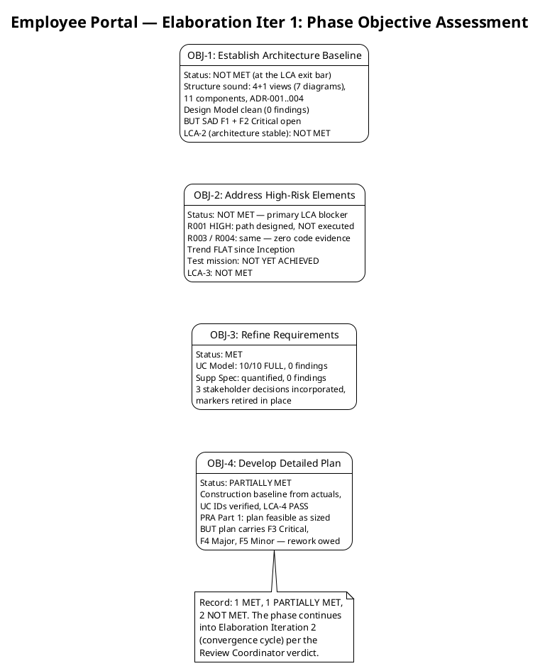
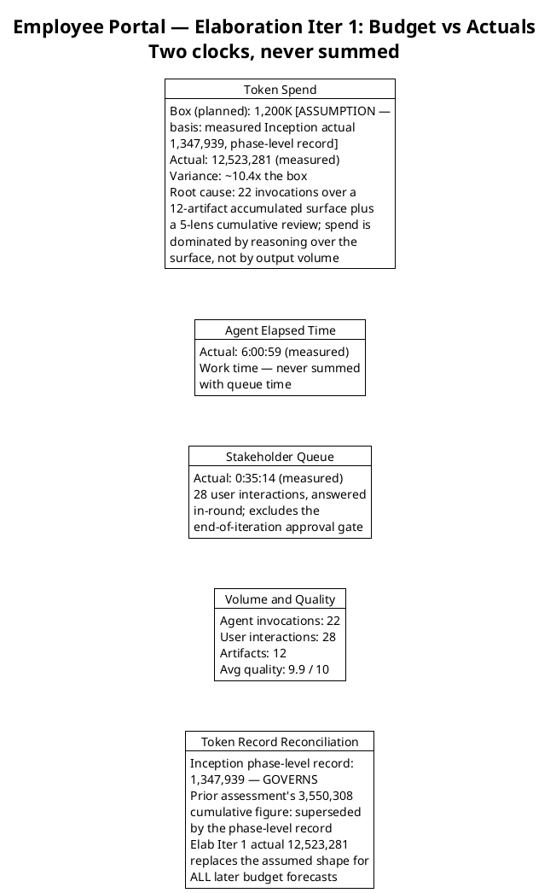
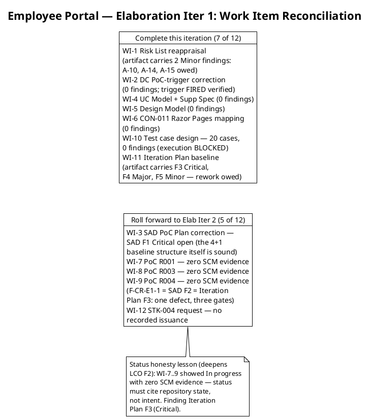
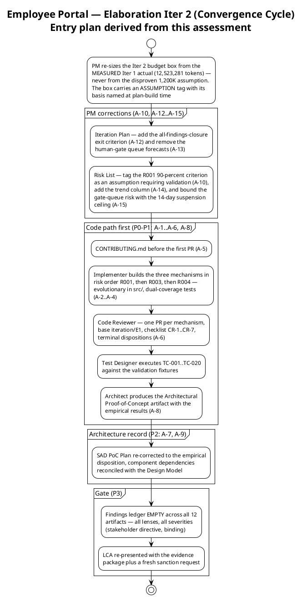
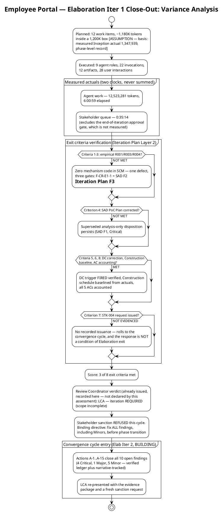

## Document Control

| Field | Value |
|---|---|
| Phase | Elaboration |
| Status | Draft — Elaboration Iter 1 (Cycle 1) close-out record |
| Milestone Target | End of Elaboration (LCA) — **NOT achieved this cycle; NOT declared by this assessment** (the milestone verdict is the Review Coordinator's, already issued) |
| Iteration | 1 (Cycle 1) |
| Date | 2026-09-01 |
| Review Coordinator Verdict (recorded, not declared here) | **LCA: iteration REQUIRED (scope incomplete)** — `requiresIteration: TRUE`; the phase auto-iterates into Elaboration Iteration 2 (convergence cycle, already planned as BUILDING) |
| Stakeholder Sanction (this cycle) | **REFUSED** — "No" to accepting this iteration's Iteration Plan and sanctioning advance past LCA. Binding directive, recorded verbatim: "Please fix all the findings even if they are minors prior to move to next phase" — reinforced by the escalation resolution: "Fix all the issues and close all findings" |
| Prior Version | Inception Iteration Assessment (Approved at LCO — mission ACHIEVED); EVOLVED, not recreated. The Inception record is preserved in SCM history |
| Elaboration Changes | Elaboration Iter 1 close-out added: 4 phase objectives assessed (1 MET, 1 PARTIALLY MET, 2 NOT MET); 3 of 8 exit criteria met; measured actuals recorded (12,523,281 tokens; agent 6:00:59; stakeholder queue 0:35:14 — never summed); budget-box variance root-caused (~10.4× the assumed box); work items reconciled to SCM evidence (7 Complete, 5 roll forward); 10 open findings recorded with convergence-cycle entry plan; lessons learned + N+1 adjustments |

## Iteration Objectives Reached

The phase planned four objectives. Assessed against the Review Record (verified findings ledger) and the Test Evaluation Summary (mission verdict), the record is: **1 MET, 1 PARTIALLY MET, 2 NOT MET.**

**Objective 1 — Establish Architecture Baseline: NOT MET (at the LCA exit bar).** The 4+1 baseline is structurally sound — 7 diagrams, 11 change-area components, ADR-001…004, interface-based boundaries; the Design Model is clean (10/10 realizations, 0 findings). But the SAD — the artifact the LCA gate evaluates — carries two Critical findings: F1 (superseded analysis-only PoC disposition, contradicting the binding stakeholder decision) and F2 (the DC-sanctioned Architectural Proof-of-Concept artifact absent; zero mechanism code in SCM). LCA criterion 2 (architecture stable): NOT MET. The structure must NOT be reworked; the record must be corrected and the validation executed.

**Objective 2 — Address High-Risk Elements: NOT MET — the primary LCA blocker.** The empirical validation paths for R001 (disposable LDAP directory), R003 (stub OIDC issuer), R004 (direct) are correctly designed and re-scoped per the stakeholder decision — but unexecuted: zero `ready-for-review` branches, zero PRs, no `Services/`, no `Infrastructure/`, `iteration/E1` skeleton only. R001 (HIGH, exposure=9) has been HIGH since Inception with a FLAT trend line. The Test Evaluation Summary's mission verdict: NOT YET ACHIEVED (0 of 3 validations evidenced). LCA criterion 3: NOT MET. The stakeholder's binding position: an LCA that validates a HIGH architectural risk on paper only will not be accepted.

**Objective 3 — Refine Requirements: MET.** All 10 UCs detailed FULL with correct `Source: FR-NNN` (0 findings); the Supplementary Specification is quantified, testable, threshold-tagged (0 findings); the three stakeholder decisions (timestamp convention: UTC store / local display / ISO-8601 offset export / local payroll day; office timezone: America/Havana — IANA, DST-aware; PoC empirical validation) are incorporated with markers retired in place. LCA criterion 1 (vision stable): MET.

**Objective 4 — Develop Detailed Plan: PARTIALLY MET.** The Construction schedule baseline is built from measured actuals with UC IDs verified against the Use-Case Model authority (LCO F1 lesson applied); LCA criterion 4 (Construction plan sufficiently detailed): MET, and the PRA's Part 1 verdict is that the plan is feasible as sized. But the Iteration Plan itself carries three findings: F3 (Critical — exit criteria 1–3 have no code evidence; Work Items 7–9 showed "In progress" with zero SCM evidence), F4 (Major — all-findings closure is not a phase-exit condition, contrary to the stakeholder's directive), F5 (Minor — human-gate queue forecasts violate the no-estimate rule). The plan's rework is scheduled in the convergence cycle (A-12, A-13).

## Adherence to Plan

| Metric | Planned | Actual (measured) | Notes |
|---|---|---|---|
| Token spend | 1,200K box [ASSUMPTION] | 12,523,281 | ~10.4× the box — variance root-caused below |
| Agent elapsed time | Measured at close | 6:00:59 | Work time; never summed with queue |
| Stakeholder queue | Estimate NONE (rule) | 0:35:14 | 28 interactions answered in-round; excludes the end-of-iteration approval gate |
| Agent invocations | — | 22 | 9 roles active |
| User interactions | — | 28 | 3 stakeholder decisions + review consultations |
| Artifacts | — | 12 | 7 clean from the technical lens |
| Avg quality | — | 9.9 / 10 | Reviewer-assessed |

**Variance root cause (token spend ~10.4× the box):** the 1,200K box was scaled from the Inception **phase-level** record (1,347,939 tokens — which covers TWO iterations, 10 artifacts, 11 runs). An Elaboration iteration is a different shape: 9 active roles reasoning over a 12-artifact accumulated surface, 22 invocations, 28 user interactions, and a 5-lens cumulative milestone review. Spend is dominated by reasoning over the accumulated surface, not by output volume — exactly the pattern the Inception lesson predicted, at larger scale. **The measured iteration actual (12,523,281) replaces the assumed shape for every later forecast; the phase-level record governs phase accounting, and iteration boxes are sized from iteration-shaped actuals.**

**Token record reconciliation (owned by this role per the Review Record):** the Inception phase-level record (1,347,939 tokens) governs; the prior Inception assessment's 3,550,308 cumulative figure is superseded by it. One row per CLOSED phase; no per-iteration velocity is quoted from a phase-level record.

**Metrics with purpose (each answers a decision):**

| Goal (decision enabled) | Metric | Primitive measure |
|---|---|---|
| Re-size the Elaboration Iter 2 budget box from fact, not assumption | Token spend actual | 12,523,281 (system-measured) |
| Bound the human-gate queue risk (A-15) with a measured basis, not a forecast | Stakeholder queue time | 0:35:14 across 28 interactions (system-measured) |
| Locate defect concentration for the convergence cycle's critical path | Open findings by severity × artifact | Verified ledger: 3 Critical, 1 Major, 4 Minor + 2 narrative-tracked |
| Establish the process-effectiveness baseline | Defect removal efficiency | NOT YET MEASURABLE — 0 test executions; becomes measurable when TC-001…TC-020 run in the convergence cycle |
| Confirm defects concentrate in execution, not design (protects the sound baseline from rework) | Avg artifact quality | 9.9 / 10 (reviewer-assessed) |

### Work Item Reconciliation (statuses reconciled to SCM evidence — LCO F2 lesson, deepened)

## Use Cases and Scenarios Implemented

**No use case was implemented as a running feature this iteration** — Elaboration produces the architecture baseline and validation evidence, not Construction features. The iteration's use-case scope was UC-001 (Clock In and Clock Out), UC-004 (Search Employee Directory), UC-010 (Unpublish News) — the three architecturally significant scenarios the PoC mechanisms were to validate:

| UC | Validation Target | Mechanism | Result This Iteration |
|---|---|---|---|
| UC-001 | R003 (stub OIDC issuer) + R004 (offline drop) | COMP-006/CLS-010; COMP-009/CLS-008 | **Not executed** — zero code evidence; test cases designed (0 findings), execution BLOCKED |
| UC-004 | R001 (disposable LDAP directory) | COMP-007/CLS-009 | **Not executed** — zero code evidence; test cases designed (0 findings), execution BLOCKED |
| UC-010 | Audit trail + soft delete (R006 design) | CLS-005, DAT-002 | **Design complete** (Design Model, 0 findings); test cases designed, execution BLOCKED |

All 10 UCs (UC-001…UC-010) were refined at the analysis level by the System Analyst (Use-Case Model: 10/10 FULL, 0 findings). Implementation of running features is Construction work per the baselined schedule (Iter 1 clocking cluster, Iter 2 news cluster, Iter 3 directory + export).

## Results Relative to Evaluation Criteria

### Layer 1 — Declared Acceptance Criteria (all 5 accounted; none closed this iteration)

| AC | Status This Iteration | Evidence / Deferral |
|---|---|---|
| AC-001 | Not addressed (deferred) | Construction Iter 1 — UC-001 running feature |
| AC-002 | Not addressed (deferred) | Construction Iter 2 — UC-008 running feature |
| AC-003 | Not met this iteration (partial evidence owed) | R001 validation was to produce partial evidence; it did not execute — rolls to the convergence cycle; formal closure at Construction Iter 3 |
| AC-004 | Not addressed (deferred) | Transition Iter 1 — adoption measurement requires a deployed system (BG-003) |
| AC-005 | Not met this iteration (partial evidence owed) | R004 5-minute drop simulation did not execute — rolls to the convergence cycle; formal AC test at Construction Iter 1 |

### Layer 2 — Iteration Plan Exit Criteria (3 of 8 met)

| # | Exit Criterion | Result | Evidence |
|---|---|---|---|
| 1 | R001 PoC empirically validated (disposable LDAP directory) | **NOT MET** | Zero mechanism code in SCM (F-CR-E1-1 / SAD F2 / Iteration Plan F3); Test Evaluation Summary: 0 of 3 validations evidenced |
| 2 | R003 PoC empirically validated (stub OIDC issuer) | **NOT MET** | Same evidence gap as criterion 1 |
| 3 | R004 PoC empirically validated (direct) | **NOT MET** | Same evidence gap as criterion 1 |
| 4 | SAD PoC Plan corrected to the stakeholder decision | **NOT MET** | SAD F1 (Critical) — superseded analysis-only disposition persists; Architect owns A-7 |
| 5 | Development Case PoC-trigger record corrected | **MET** | DC trigger FIRED verified by both review lenses; 0 findings on the Development Case |
| 6 | Construction schedule baselined from measured actuals | **MET** | Iteration Plan Construction Schedule Baseline; UC IDs verified against Use-Case Model authority; LCA-4 PASS |
| 7 | STK-004 written deliverables request issued (R010) | **NOT EVIDENCED** | No recorded issuance this iteration; rolls to the convergence cycle — and the response is NOT a condition of Elaboration exit (stakeholder decision) |
| 8 | All 5 ACs accounted for | **MET** | Layer 1 table complete — AC-001 through AC-005, each with evidence or deferral |

**Score: 3 of 8.** The unmet criteria (1–4) are precisely the empirical-validation core the stakeholder made binding; criteria 1–3 are one defect observed by three review gates, remediated by one action chain (A-2…A-6 + A-8 + A-11).

## Test Results

No test execution occurred — no mechanism code exists to test. The Test Evaluation Summary (read in full) records the quality evidence for this iteration:

| Metric | Value | Source |
|---|---|---|
| Evaluation Mission verdict | **NOT YET ACHIEVED** — blocked on code evidence (INC-1 / F-CR-E1-1) | Test Evaluation Summary § Conclusions |
| Risk-retirement validations evidenced | 0 of 3 (R001, R003, R004) | Test Evaluation Summary § Quality Metrics |
| Test cases designed / executed | 20 designed (TC-001…TC-020, 0 findings) / **all 20 BLOCKED** on SCM Issue #1 | Test Case + Test Evaluation Summary |
| CI build status (main) | **Green** — run 33492338439 | `scm_get_build_status`, verified this iteration |
| Open defects (SCM tracker) | 0 (all states) | `scm_list_issues`, verified this iteration |
| Fabricated results | None — the honest NOT YET ACHIEVED verdict is itself the quality signal | Test Evaluation Summary § Conclusions |

The mission is defined, agreed, and executable; what it cannot yet claim is the three empirical validations. Recording "achieved" here would have been exactly the paper-only validation of a HIGH risk the stakeholder refused.

## External Changes

**No scope changes.** The declared scope (10 FRs, 5 NFRs, 5 ACs, 14 CONs) is unchanged; zero scope-creep findings across all review lenses; R009 (scope creep) held by CCB enforcement.

**Stakeholder decisions recorded this iteration (all incorporated, markers retired in place):**
1. **Timestamp convention** — store UTC, display office-local, export ISO-8601 with explicit offset; payroll day is the local calendar day. The stakeholder corrected an invented premise in the question (office locations were never declared) — all 3 offices are in the same timezone.
2. **Office timezone** — America/Havana (IANA identifier, not a fixed offset; Cuba observes DST).
3. **PoC empirical validation** — produced in Elaboration and validated empirically: R001 via a disposable LDAP directory, R003 via a stub OIDC issuer, R004 direct; R010 re-scoped to production-instance integration only (Construction), tracked separately, not inheriting R001's HIGH.

**Stakeholder sanction: REFUSED this cycle**, with the binding directive to fix ALL findings including Minors before phase transition — recorded as Iteration Plan F4 (Major) with remediation A-12. The escalation resolution ("Fix all the issues and close all findings") confirms the convergence-cycle execution path with no correction, no reprioritization, and no additional requirement.

## Rework Required

**Ten open findings across four artifacts (verified ledger: 3 Critical, 1 Major, 4 Minor; plus 2 narrative-tracked Code Reviewer findings).** All are phase-exit conditions per the stakeholder's directive — severity-based prioritization is superseded for PHASE EXIT; the execution order below optimizes the critical path, not the severity ranking.

| # | Finding | Severity | Owner (Action) |
|---|---|---|---|
| 1 | SAD F1 — superseded analysis-only PoC disposition | Critical | Software Architect (A-7) |
| 2 | SAD F2 — PoC artifact absent; zero mechanism code | Critical | Software Architect (A-8) + Implementer (A-2…A-4) |
| 3 | Iteration Plan F3 — exit criteria 1–3 no code evidence; WIs 7–9 status dishonest | Critical | Project Manager (A-11) + Implementer + Code Reviewer + Test Designer |
| 4 | Iteration Plan F4 — all-findings closure not a phase-exit condition | Major | Project Manager (A-12) |
| 5 | SAD F3 — stale component dependencies vs Design Model | Minor | Software Architect (A-9) |
| 6 | Risk List F1 (Reviewer) — untagged >90% R001 criterion | Minor | Project Manager (A-10) |
| 7 | Risk List F1 (Management) — no trend column; gate-queue risk unbounded | Minor | Project Manager (A-14, A-15) |
| 8 | Iteration Plan F5 — human-gate queue forecasts violate no-estimate rule | Minor | Project Manager (A-13) |
| 9 | F-CR-E1-1 — no Implementer handoff (narrative-tracked; converges with #2, #3) | Critical | Integrator (A-1) + Implementer (A-2…A-4) + Code Reviewer (A-6) |
| 10 | F-CR-E1-2 — CONTRIBUTING.md absent (narrative-tracked) | Minor | Implementer / Architect / ConfigurationManager (A-5) |

### Convergence-Cycle Entry Plan (Elaboration Iteration 2 — BUILDING)

### Variance Analysis

### Lessons Learned

1. **Budget-box calibration (the dominant variance):** an iteration box scaled from a phase-level record (1,347,939 tokens covering TWO Inception iterations) was ~10.4× under the measured Elaboration iteration actual (12,523,281). Iteration boxes must be sized from measured ITERATION-shaped actuals; the phase-level record governs phase accounting only. Every later forecast is rebuilt from the 12,523,281 figure.
2. **Status honesty, deepened (LCO F2 → Iteration Plan F3):** "In progress" with zero SCM evidence is intent, not status. Work-item status must cite repository state — branches, PRs, build tree — never the plan's own expectation.
3. **One defect, three gates:** the absent mechanism code was observed by three review lenses as three findings (F-CR-E1-1, SAD F2, Iteration Plan F3). The remediation WORK merges into one action chain; the findings do not — each emitting lens closes its own.
4. **The stakeholder's all-findings directive supersedes severity-based phase-exit logic:** Minors are phase-exit conditions too. The convergence cycle's exit criterion is an EMPTY findings ledger, verified per artifact — not "all Criticals closed."
5. **In-round stakeholder answering held at scale:** 28 interactions, 0:35:14 total queue — the measured basis for bounding the human-gate queue risk (A-15) without forecasting it in the plan.

### Next Iteration Adjustments (Elaboration Iteration 2 — binding inputs to the next Iteration Plan)

| Adjustment | Rationale |
|---|---|
| Re-size the Iter 2 budget box from the measured 12,523,281 actual | The 1,200K assumption is disproven; the box is rebuilt from fact with its basis named |
| Add the all-findings-closure exit criterion (A-12) | Stakeholder directive, binding on phase transition — Iteration Plan F4 |
| Remove human-gate queue forecasts from the milestone table (A-13) | A human gate is a risk, not an estimate — bound it in the Risk List (A-15), never forecast it in the plan |
| Risk List: trend column (A-14), gate-queue risk entry with 14-day suspension ceiling (A-15), R001 >90% criterion tagged [ASSUMPTION — requires validation] (A-10) | Risk List F1 (both lenses) — a risk unchanged across two reviews must show why |
| Code path first: CONTRIBUTING.md (A-5), then mechanisms in risk order R001 → R003 → R004 (A-2…A-4), PR gate per mechanism (A-6), TC-001…TC-020 execution, PoC artifact (A-8) | Closes the three-gate defect; R001 is the only HIGH risk; the regression line holds — the third validation re-runs the first two |
| SAD re-correction (A-7, A-9) lands BEFORE the LCA re-presentation | The SAD is the artifact the gate evaluates; the 4+1 structure itself is sound and is NOT reworked |
| No scope reduction required | The convergence scope is fully determined by the 10 findings and confirmed by the stakeholder; the budget box governs, and the box is being re-sized from measured fact |

## Traceability

| Element | Traces From | Link Type | Traces To |
|---|---|---|---|
| Iteration Assessment (this, Elaboration Iter 1) | Iteration Plan (Elaboration Iter 1 — objectives, exit criteria, budget box); Review Record (verified findings ledger, RC verdict, stakeholder sanction record); Test Evaluation Summary (mission verdict, quality metrics); Work Order measured facts (tokens, times, invocations, quality) | Reviews | Elaboration Iteration 2 Iteration Plan (convergence cycle); Risk List evolution (A-10, A-14, A-15); LCA re-presentation |
| OBJ-1 assessment (Architecture Baseline) | SAD (4+1 baseline, F1/F2 Critical); Design Model (0 findings); Review Record LCA-2 | Reviews | A-7, A-8, A-9 (Software Architect) |
| OBJ-2 assessment (High-Risk Elements) | Risk List R001/R003/R004 (MITIGATING, unexecuted); Test Evaluation Summary (0 of 3 evidenced); Review Record LCA-3, F-CR-E1-1 | Reviews | A-1…A-6, A-8, A-11 (Integrator, Implementer, Code Reviewer, Test Designer, Architect) |
| OBJ-3 assessment (Refine Requirements) | Use-Case Model (10/10 FULL, 0 findings); Supplementary Specification (0 findings); stakeholder decisions (timestamp convention, America/Havana, PoC empirical) | Reviews | Construction iteration plans (baselined schedule) |
| OBJ-4 assessment (Detailed Plan) | Iteration Plan (Construction baseline, LCA-4 PASS); Review Record (PRA Part 1 feasible; F3/F4/F5 findings) | Reviews | A-11, A-12, A-13 (Project Manager) |
| Budget variance root cause | Work Order measured actuals (12,523,281 tokens; 6:00:59; 0:35:14); Inception phase-level record (1,347,939) | DependsOn | Elaboration Iter 2 budget box (re-sized from measured iteration actual) |
| Token record reconciliation | Inception phase-level record (governs); prior Inception assessment (3,550,308 — superseded) | Replaces | All later phase-level accounting |
| Work item reconciliation (7 Complete / 5 roll forward) | Iteration Plan work items 1–12; SCM state (zero PRs, iteration/E1 skeleton); Review Record F-CR-E1-1, Iteration Plan F3 | Reviews | Convergence-cycle work items (A-1…A-15) |
| Exit criteria score (3 of 8) | Iteration Plan Layer 2 criteria 1–8; Test Evaluation Summary; Review Record | Reviews | LCA re-presentation entry gate (empty findings ledger + evidence package) |
| Test results record | Test Evaluation Summary (NOT YET ACHIEVED; 20/20 BLOCKED; CI green run 33492338439; 0 defects) | DependsOn | TC-001…TC-020 execution (convergence cycle); defect removal efficiency baseline |
| Stakeholder sanction record | Stakeholder answers (this cycle): "No" to sanction; "Please fix all the findings even if they are minors prior to move to next phase"; "Fix all the issues and close all findings" | Authorizes | Convergence-cycle execution path (A-1…A-15); fresh sanction request at LCA re-presentation |
| Convergence-cycle entry plan | Review Record actions A-1…A-15; Consolidated Finding Tracker (10 findings); stakeholder all-findings directive | Refines | Elaboration Iteration 2 Iteration Plan (BUILDING → CURRENT) |
| Lessons learned (box calibration, status honesty, one-defect-three-gates, all-findings directive, in-round answering) | This iteration's measured variance; Review Record findings; stakeholder interactions (28, 0:35:14 queue) | Refines | Every later Iteration Plan and Iteration Assessment |