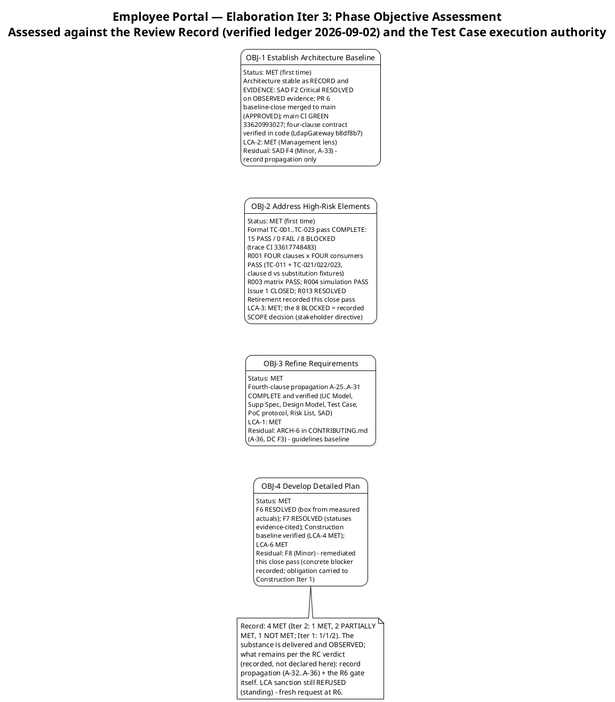
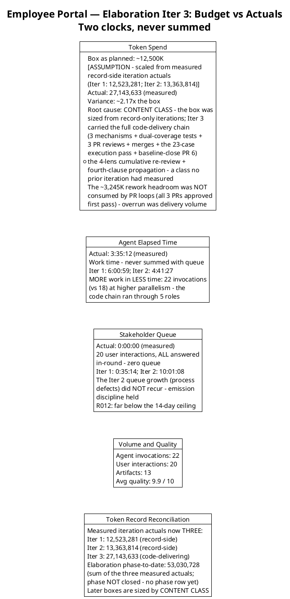
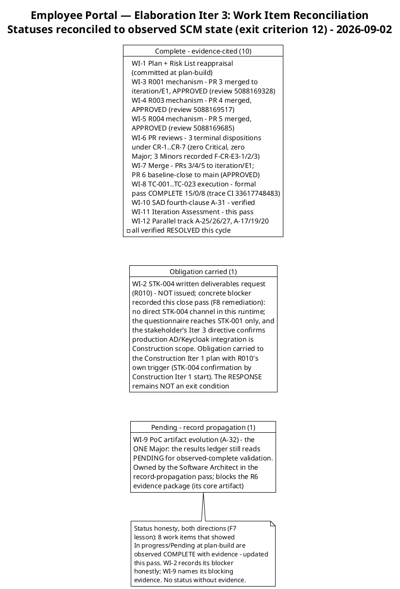
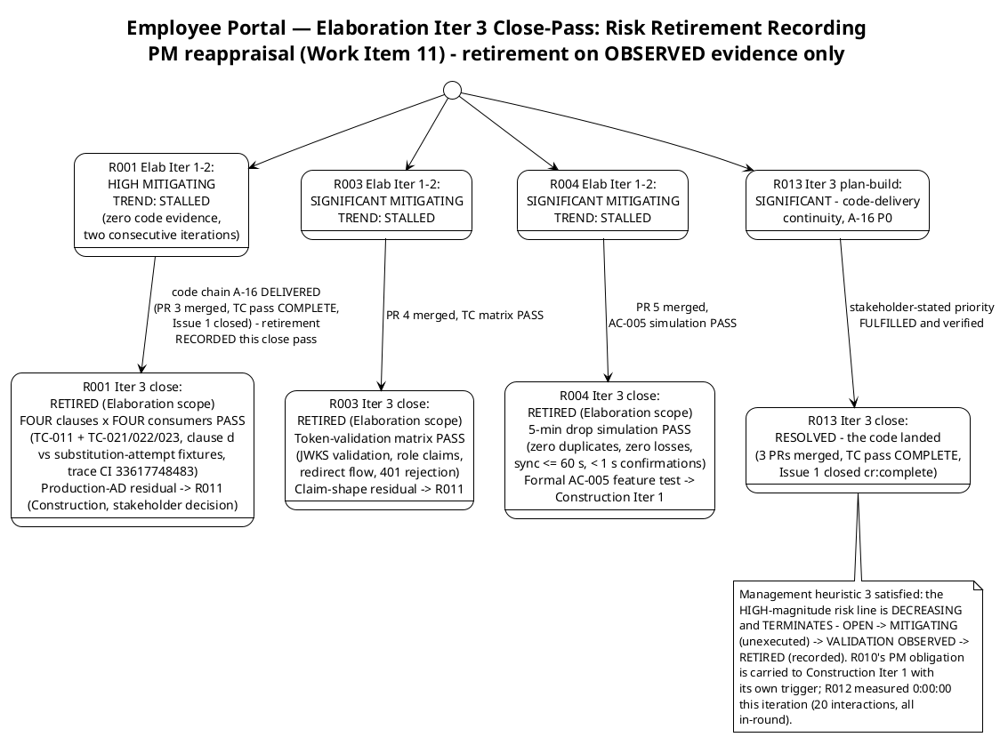
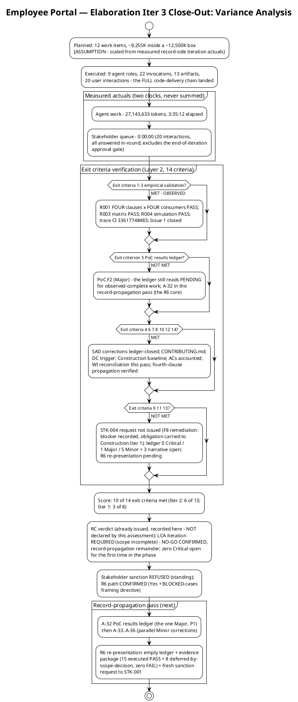

# Iteration Assessment

## Document Control

| Field | Value |
|---|---|
| Phase | Elaboration |
| Status | Draft — Elaboration Iteration 3 (Cycle 1) close-out record; EVOLVED from the Iter 2 close-out, not recreated |
| Milestone Target | End of Elaboration (LCA) — **NOT achieved this cycle; NOT declared by this assessment** (the milestone verdict is the Review Coordinator's, already issued) |
| Iteration | 3 (Cycle 1) — convergence cycle, code-delivering |
| Date | 2026-09-02 |
| Review Coordinator Verdict (recorded, not declared here) | **LCA: iteration REQUIRED (scope incomplete)** — NO-GO CONFIRMED; `requiresIteration: TRUE`; the substantive blocker is RETIRED (zero Critical open for the first time in the phase) and the phase auto-iterates into the record-propagation pass toward the R6 re-presentation |
| Stakeholder Sanction (standing) | **REFUSED** at the Iter 1 LCA review — binding directive, verbatim: "Please fix all the findings even if they are minors prior to move to next phase"; escalation resolution, verbatim: "Fix all the issues and close all findings". **R6 path CONFIRMED this cycle** ("Yes") with the BLOCKED-cases framing directive, verbatim: "the 8 BLOCKED test cases are a recorded SCOPE decision (production AD and Keycloak integration belongs to Construction), not an open gap. State it that way in the evidence package so the LCA reads them as deferred, not as missing." Fresh sanction request fires at R6 |
| Prior Version | Elaboration Iteration 2 close-out (2026-09-02); Iteration 1 close-out (2026-09-01); Inception Iteration Assessment (Approved at LCO — mission ACHIEVED); EVOLVED, not recreated. Prior records are preserved in SCM history |
| Elaboration Changes (Iter 3 close-out) | 4 phase objectives assessed — **4 MET** (Iter 2: 1 MET, 2 PARTIALLY MET, 1 NOT MET; Iter 1: 1/1/2); 10 of 14 exit criteria met (Iter 2: 6 of 13; Iter 1: 3 of 8) — criteria 1–3 MET ON OBSERVED EVIDENCE for the first time; measured actuals recorded (27,143,633 tokens; agent 3:35:12; stakeholder queue 0:00:00 — never summed); budget variance root-caused (CONTENT CLASS — the box was sized from record-side iterations; Iter 3 carried the full code-delivery chain); work items reconciled to observed SCM state (10 Complete, 1 obligation carried, 1 Pending); risk retirement RECORDED (R001/R003/R004 RETIRED; R013 RESOLVED); Iteration Plan F8 remediated (concrete blocker recorded, obligation carried to Construction Iter 1); 9 tracked findings recorded with the record-propagation entry plan; lessons learned + next-pass adjustments |

## Iteration Objectives Reached

The phase planned four objectives. Assessed against the Review Record (verified findings ledger, 2026-09-02) and the Test Case execution authority (formal pass 15 PASS / 0 FAIL / 8 BLOCKED, trace CI 33617748483), the record is: **4 MET** — with residuals that are record-propagation class only.

**Objective 1 — Establish Architecture Baseline: MET (first time).** The architecture is stable as RECORD and now as EVIDENCE: SAD F2 (Critical, 2nd occurrence) is RESOLVED on observed evidence — the three mechanisms merged as evolutionary production code (PRs #3/#4/#5 to `iteration/E1`, APPROVED ×3, reviews 5088169328/5088169517/5088169685), the baseline-close PR #6 merged to main under review state APPROVED, main CI GREEN (run 33620993027), and the four-clause graceful-degradation contract is verified first-hand in code (LdapGateway sha b8df8b7). The management lens records LCA-2 MET for the first time. Residual: SAD F4 (Minor, A-33) — the criterion-3 evidence row lags the observed state; record propagation only.

**Objective 2 — Address High-Risk Elements: MET (first time).** The formal TC-001…TC-023 execution pass is COMPLETE: 15 PASS / 0 FAIL / 8 BLOCKED (execution trace CI run 33617748483). R001 (HIGH, exposure=9) — FOUR clauses × FOUR consumers PASS via TC-011 + TC-021/022/023, clause (d) verified against the substitution-attempt fixtures (NOT "General", NOT "Central", NOT "N/A", no cross-entry inheritance). R003 — token-validation matrix PASS. R004 — 5-minute drop simulation PASS (zero duplicates, zero losses, sync ≤ 60 s, confirmations < 1 s). Issue #1 CLOSED cr:complete. The stakeholder's binding bar — "I will not accept an LCA that validates a HIGH architectural risk on paper only" — is satisfied by observed, CI-traced results. The 8 BLOCKED cases are a recorded SCOPE decision per the stakeholder's framing directive: deferred to Construction, not missing. Retirement is RECORDED in the Risk List this close pass (R001/R003/R004 RETIRED in Elaboration scope; R013 RESOLVED). LCA-3: MET.

**Objective 3 — Refine Requirements: MET.** The fourth-clause propagation (A-25…A-31) is COMPLETE and verified this cycle across all seven carrying artifacts: UC Model (A-25), Supplementary Specification (A-26), Design Model (A-27 — landed with the build; the code implements four clauses), Test Case (A-28 — executed BEFORE the pass), PoC protocol (A-29), Risk List (A-30), SAD (A-31). LCA-1: MET. Residual: ARCH-6 in CONTRIBUTING.md still carries the three-clause rule (A-36, DC F3) — a guidelines-baseline correction, not a requirements defect; the merged code already complies with all four clauses.

**Objective 4 — Develop Detailed Plan: MET.** The plan's own findings closed on verified corrections: F6 (Major — budget box) RESOLVED (box ~12,500K from measured actuals, all five named locations updated); F7 (Minor — WI statuses) RESOLVED (statuses evidence-cited); F3-Reviewer (Minor — TC enumerations) RESOLVED. The Construction baseline is verified (LCA-4 MET at all three reviews); LCA-6 MET. Residual: F8 (Minor) — the STK-004 written request unevidenced a third pass — **remediated this close pass**: the concrete blocker is recorded (no direct STK-004 channel exists in this runtime; the stakeholder questionnaire reaches STK-001 only; the stakeholder's Iter 3 directive confirms production AD/Keycloak integration is Construction scope) and the obligation is carried to the Construction Iter 1 plan with R010's own trigger. The RESPONSE remains NOT an Elaboration exit condition (stakeholder decision).

## Adherence to Plan

| Metric | Planned | Actual (measured) | Notes |
|---|---|---|---|
| Token spend | ~12,500K box; ~9,255K work-item sum | 27,143,633 | ~2.17× the box — variance root-caused below (content class, not rework) |
| Agent elapsed time | Measured at close | 3:35:12 | Work time; never summed with queue |
| Stakeholder queue | Estimate NONE (rule) | 0:00:00 | 20 interactions, ALL answered in-round; excludes the end-of-iteration approval gate |
| Agent invocations | — | 22 | 9 roles active |
| User interactions | — | 20 | R6-path confirmation + framing directive + verdict-gate contribution + review consultations |
| Artifacts | — | 13 | Inventory unchanged |
| Avg quality | — | 9.9 / 10 | Reviewer-assessed |

**Variance root cause (token spend ~2.17× the box):** the box was correctly sized from the only measured actuals that existed at plan-build — two record-side iterations (12,523,281; 13,363,814). Iteration 3 was the first CODE-DELIVERING iteration: the full delivery chain (3 mechanisms with dual-coverage tests, 3 PR reviews, merges, the 23-case execution pass, the baseline-close PR #6) plus the 4-lens cumulative re-review and the fourth-clause propagation across seven artifacts. No prior iteration had measured that content class. The ~3,245K rework headroom was NOT consumed by PR loops — all three PRs were approved on first pass — the overrun was delivery volume. **The lesson: size the box by CONTENT CLASS, not by iteration count.** The measured record now carries both classes (record-side ~12.5–13.4M; code-delivering ~27.1M), and every later box names its class.

**Token record reconciliation:** measured iteration actuals now number THREE. Elaboration phase-to-date is 53,030,728 tokens (the sum of the three measured iteration actuals) — recorded for phase accounting only; the phase is NOT closed, so no phase row is claimed. The Inception phase-level record (1,347,939) governs Inception accounting only. No per-iteration velocity is quoted from a phase-level record.

**Metrics with purpose (each answers a decision):**

| Goal (decision enabled) | Metric | Primitive measure |
|---|---|---|
| Track convergence progress cycle over cycle (decide whether the phase is closing toward the R6 gate) | Exit criteria met | 10 of 14 this cycle (Iter 2: 6 of 13; Iter 1: 3 of 8) — criteria 1–3 MET on observed evidence for the first time |
| Size the next budget box from fact, by content class | Token spend actual | 27,143,633 (system-measured) — the code-delivering class's first data point |
| Bound the human-gate queue risk (R012) and verify the Iter 2 process-defect growth did not recur | Stakeholder queue time | 0:00:00 across 20 interactions (system-measured) — all answered in-round; the growth did not recur |
| Locate defect concentration for the record-propagation pass's critical path | Open findings by severity × artifact | Verified ledger: 0 Critical, 1 Major (PoC F2), 5 Minor + 3 narrative-tracked — all record-propagation class |
| Establish the process-effectiveness baseline (decide whether review-first is working) | Defect removal efficiency | FIRST MEASUREMENT: all code defects caught at the PR gate (3 Minors across 3 PRs), zero test failures across 15 executed cases — review-first confirmed |
| Confirm defects concentrate in records, not design (protects the validated baseline from rework) | Avg artifact quality | 9.9 / 10 (reviewer-assessed) |

### Work Item Reconciliation (statuses reconciled to observed SCM state — exit criterion 12)

**Status honesty, both directions (F7 lesson):** eight work items that showed "In progress"/"Pending" at plan-build are observed COMPLETE with evidence cited — updated this pass. WI-2 records its concrete blocker honestly (F8 remediation); WI-9 names its blocking evidence (the PoC results ledger, A-32). A status that cannot show evidence reverts to In progress, never to Complete — and a status that HAS evidence must not understate it either.

## Use Cases and Scenarios Implemented

**No use case was implemented as a running feature this iteration** — Elaboration produces the architecture baseline and validation evidence, not Construction features. But this iteration is the first in which the use-case scope was VALIDATED against running code:

| UC | Validation Target | Mechanism | Result This Iteration |
|---|---|---|---|
| UC-001 | R003 (stub OIDC issuer) + R004 (offline drop) | COMP-006/CLS-010; COMP-009/CLS-008 | **VALIDATED — OBSERVED**: token-validation matrix PASS; 5-minute drop simulation PASS (zero duplicates/losses, sync ≤ 60 s, confirmations < 1 s); TC-001…TC-003, TC-004…TC-010 executed |
| UC-004 | R001 (disposable LDAP directory) — FOUR-clause behavioural bar | COMP-007/CLS-009 | **VALIDATED — OBSERVED**: FOUR clauses PASS via TC-011 (clause (d) verified against substitution-attempt fixtures); every employee rendered, no hidden entries, no errors, no substitution |
| UC-005 | R001 behavioural bar (event row, blank display fields) | COMP-007/CLS-009 (shared LDAP read path) | **VALIDATED — OBSERVED**: TC-021 PASS — event row rendered with blank display fields, clocking data always complete |
| UC-006 | R001 behavioural bar (CSV row, blank cells, no abort) | COMP-007/CLS-009 | **VALIDATED — OBSERVED**: TC-022 PASS — every event row exported, blank cells for missing display fields, no abort |
| UC-007 | R001 behavioural bar (employee locatable/selectable) | COMP-007/CLS-009 | **VALIDATED — OBSERVED**: TC-023 PASS — employee locatable and selectable with blank fields |
| UC-010 | Audit trail + soft delete (R006 design) | CLS-005, DAT-002 | Design complete (0 findings); TC-013…TC-016 BLOCKED — recorded scope decision (news/audit mechanisms are Construction scope) |

All 10 UCs (UC-001…UC-010) remain refined at the analysis level (Use-Case Model: 10/10 FULL, 0 findings at all three reviews). Implementation of running features is Construction work per the baselined schedule (Iter 1 clocking cluster, Iter 2 news cluster, Iter 3 directory + export).

## Results Relative to Evaluation Criteria

### Layer 1 — Declared Acceptance Criteria (all 5 accounted; three with OBSERVED partial evidence)

| AC | Status This Iteration | Evidence / Deferral |
|---|---|---|
| AC-001 | **Partial evidence — OBSERVED** | UC-001 mechanisms validated empirically (OIDC matrix PASS; offline drop PASS); running feature is Construction Iter 1 |
| AC-002 | Not addressed (deferred) | Construction Iter 2 — UC-008 running feature |
| AC-003 | **Partial evidence — OBSERVED** | R001 FOUR-clause bar validated against the disposable directory (every employee rendered, no substitution); production-AD performance + data quality at Construction Iter 3 (R010 + R011) |
| AC-004 | Not addressed (deferred) | Transition Iter 1 — adoption measurement requires a deployed system (BG-003) |
| AC-005 | **Partial evidence — OBSERVED** | R004 5-minute drop simulation PASS (zero duplicates/losses, sync ≤ 60 s); formal AC test at Construction Iter 1 |

### Layer 2 — Iteration Plan Exit Criteria (10 of 14 met; Iter 2: 6 of 13; Iter 1: 3 of 8)

| # | Exit Criterion | Result | Evidence |
|---|---|---|---|
| 1 | R001 empirically validated — FOUR-clause behavioural bar, four consumers | **MET — OBSERVED** | PR #3 merged (APPROVED); TC-011 + TC-021/022/023 clause-by-clause PASS; trace CI 33617748483; Issue #1 CLOSED |
| 2 | R003 empirically validated (stub issuer) | **MET — OBSERVED** | PR #4 merged (APPROVED); token-validation matrix PASS |
| 3 | R004 empirically validated (direct) | **MET — OBSERVED** | PR #5 merged (APPROVED); drop simulation PASS |
| 4 | SAD corrected (A-7, A-9) | **MET** | SAD F1/F3 ledger-closed 2026-09-02 |
| 5 | PoC artifact with empirical results (A-8) | **NOT MET** | Artifact exists with honest PENDING ledger; the OBSERVED results have not landed — PoC F2 (Major, A-32), the record-propagation pass's P1 |
| 6 | CONTRIBUTING.md committed (A-5) | **MET** | sha 6662813…; F-CR-E1-2 resolved |
| 7 | DC PoC-trigger record corrected (carried) | **MET** | DC F1/F2 resolved Iter 3; trigger FIRED verified |
| 8 | Construction schedule baselined (carried) | **MET** | LCA-4 MET at all three reviews |
| 9 | STK-004 written request issued (R010) | **NOT MET — obligation relocated (F8 remediation)** | Concrete blocker recorded (no direct STK-004 channel in this runtime; the questionnaire reaches STK-001 only; the stakeholder's Iter 3 directive confirms production integration is Construction scope); obligation carried to Construction Iter 1 with R010's trigger. Response NOT an exit condition (stakeholder decision) |
| 10 | All 5 ACs accounted | **MET** | Layer 1 table complete |
| 11 | ALL open findings closed — every lens, every severity | **NOT MET — record-propagation remainder** | Verified ledger: 0 Critical (first time), 1 Major, 5 Minor + 3 narrative; all record-propagation class |
| 12 | Work-item statuses reconciled to SCM evidence | **MET** | Reconciliation executed this close pass |
| 13 | LCA evidence package assembled + fresh sanction request | **NOT MET — R6 pending** | The package's SUBSTANCE exists (merged mechanisms + executed TC pass + four-clause evidence); A-32 and the ledger-empty condition gate the R6 re-presentation |
| 14 | Fourth-clause propagation complete (A-25…A-31) | **MET — verified** | All seven carrying artifacts verified RESOLVED this cycle; residual ARCH-6 extension (A-36, DC F3) |

**Score: 10 of 14.** The four unmet criteria (5, 9, 11, 13) are the record-propagation remainder — every one a record correction or a gate; none requires code, design, or new validation. Criteria 1–3 are MET ON OBSERVED EVIDENCE for the first time in the phase: the substantive LCA blocker is retired.

## Test Results

The formal test execution pass is COMPLETE — the first of the Elaboration phase. All results are observed and CI-traced; none is fabricated.

| Metric | Value | Source |
|---|---|---|
| Formal execution pass | **COMPLETE — 15 PASS / 0 FAIL / 8 BLOCKED** (23 cases; execution trace CI run 33617748483) | Test Case Cycle 1 record (the execution authority) |
| R001 evidence | FOUR clauses × FOUR consumers PASS — TC-011 + TC-021/022/023, clause (d) verified against the substitution-attempt fixtures (NOT "General", NOT "Central", NOT "N/A", no cross-entry inheritance) | Test Case R001 clause-by-clause table |
| R003 evidence | Token-validation matrix PASS — RS256 via issuer JWKS with kid matching, exp/iss/aud/sub enforced, roles extracted verbatim, failing states rejected (401) | Test Case record |
| R004 evidence | 5-minute drop simulation PASS — zero duplicates (double replay AND mixed online+queued), zero losses, sync ≤ 60 s, confirmations < 1 s, recorded-order preservation | Test Case record |
| The 8 BLOCKED cases | **A recorded SCOPE decision — deferred to Construction, not missing** (stakeholder framing directive, verbatim): TC-003, TC-010 (UI mechanisms); TC-017, TC-018 (endpoint/request surfaces); TC-013…TC-016 (news/audit) — all Construction-scope mechanisms, never Elaboration exit-criterion blockers | Stakeholder Iter 3 directive + Test Case per-case record |
| Regression baseline | Established via the merge-sequence green runs 33617283642 → 33617446626 → 33617748483 | Test Case record |
| CI build status (main) | **Green** — run 33620993027 (post-merge, completed 2026-09-02 10:45:20Z) | Review Record Iter 3 technical-lens verification |
| CI on `iteration/E1` | **Green** — run 33617748483 (mechanism code + dual-coverage suites) | Test Evaluation Summary (verified) |
| Open defects (SCM tracker) | **0** — Issue #1 CLOSED cr:complete (on merged-PR + executed-TC evidence); Issue #2 CLOSED cr:complete | Review Record Iter 3 verification |
| Defect removal efficiency | **FIRST MEASUREMENT — review-first confirmed**: all code defects caught at the PR gate (3 Minors across 3 PRs, F-CR-E3-1/2/3), zero test failures across 15 executed cases | Review Record Iter 3 metrics |
| Fabricated results | None — every verdict cites its execution trace; the honest corrections (TC-003/010/017/018 Scripted → BLOCKED rather than paper-PASS) are themselves the quality signal | Test Case record |

The Test Evaluation Summary's mission verdict (NOT YET ACHIEVED, written before the execution pass) is STALE against this record — recorded as TES F2 (Minor, A-35), owned by the Test Manager in the record-propagation pass. The Test Case authority's per-case record governs.

## External Changes

**No scope changes.** The declared scope (10 FRs, 5 NFRs, 5 ACs, 14 CONs) is unchanged; zero scope-creep findings across all review lenses, three iterations; R009 held by CCB enforcement.

**Stakeholder decisions recorded this iteration (all incorporated; markers retired in place where they stood):**
1. **R6-path confirmation — "Yes"** — the path (record corrections, then the R6 re-presentation with the evidence package and a fresh sanction request) is CONFIRMED with no correction, no reprioritization, and no additional requirement.
2. **BLOCKED-cases framing directive (binding on the evidence package)** — verbatim: "the 8 BLOCKED test cases are a recorded SCOPE decision (production AD and Keycloak integration belongs to Construction), not an open gap. State it that way in the evidence package so the LCA reads them as deferred, not as missing." Folded into A-32, A-34, A-35 and the R6 package shape.
3. **Verdict-gate contribution — "nothing else new"** — the contribution cycle is CLOSED; the standing all-findings directive and the confirmed R6 path remain the complete work order for the record-propagation pass.

**Stakeholder sanction: REFUSED (standing)** — the fresh request fires at the R6 re-presentation, gated on the evidence package and the empty findings ledger. Requesting it mid-cycle would contradict the stakeholder's own all-findings bar.

## Rework Required

**Nine tracked findings (verified ledger: 0 Critical, 1 Major, 5 Minor; plus 3 narrative-tracked Code Reviewer Minors).** All are phase-exit conditions per the stakeholder's directive. **Every remaining item is a record correction — none requires code, design, or new validation.** PM-owned findings were remediated this close pass; the remainder is owned and scheduled in the record-propagation pass.

| # | Finding | Severity | Owner (Action) | Status |
|---|---|---|---|---|
| 1 | PoC F2 — stale results ledger vs observed validation (the R6 evidence package's core) | Major | Software Architect (A-32) | OPEN — the record-propagation pass's P1 |
| 2 | SAD F4 — stale LCA-criterion-3 evidence | Minor | Software Architect (A-33) | OPEN — rides the A-32 evolution |
| 3 | Test Case F1 — Document Control summary 17/6 contradicts per-case record 15/8 | Minor | Test Designer / Test Manager (A-34) | OPEN |
| 4 | TES F2 — mission verdict stale vs the completed execution pass | Minor | Test Manager (A-35) | OPEN |
| 5 | DC F3 — ARCH-6 fourth-clause gap open past its stated deadline | Minor | Software Architect (A-36) + Process Engineer (flag closure) | OPEN — guidelines baseline; the code already complies |
| 6 | Iteration Plan F8 — STK-004 written request unevidenced a third pass | Minor | Project Manager (close-pass reconciliation) | **REMEDIATED this close pass** — concrete blocker recorded; obligation carried to Construction Iter 1 with R010's trigger; closure owned by the Management Reviewer lens |
| 7 | F-CR-E3-1 — interim IClockingsRepository vs INT-016 final contract | Minor (narrative) | Implementer (Construction Iter 1, R008) + Designer (INT-016 confirmation) | OPEN — Construction scope; [DEFERRED] marker carried in the PR record |
| 8 | F-CR-E3-2 — IAuthProvider operations absent from INT-011 contract table | Minor (narrative) | Designer (next Design Model evolution) | OPEN — Construction scope |
| 9 | F-CR-E3-3 — OidcMiddleware state comment overstates CSRF protection | Minor (narrative) | Implementer (next code touch) | OPEN — Construction scope |

**Risk-retirement recording (PM close-pass reappraisal, Work Item 11 — stakeholder-confirmed):** R001/R003/R004 → **RETIRED (Elaboration scope)** on observed evidence; R013 → **RESOLVED**; R010's PM obligation relocated with its concrete blocker recorded. Recorded in the Risk List this close pass.

### Variance Analysis

### Lessons Learned

1. **Size the budget box by CONTENT CLASS, not by iteration count (the dominant variance).** The ~12,500K box was correctly sized from the only measured actuals that existed — two record-side iterations. Iteration 3 was the first code-delivering iteration, and its actual (27,143,633, ~2.17× the box) establishes the second content class. The overrun was delivery volume, not rework — the ~3,245K rework headroom was untouched because all three PRs were approved first pass. Every later box names its class: record-side ~12.5–13.4M; code-delivering ~27.1M.
2. **Review-first works, and it is now measured.** The first defect-removal-efficiency data point: all code defects were caught at the PR gate (3 Minors across 3 PRs), and zero of the 15 executed test cases failed. The convergence cycle's insistence on the code-review gate before merge — against schedule pressure to skip it — is vindicated by the data.
3. **A stakeholder's framing directive is part of the evidence, not commentary on it.** The BLOCKED-cases directive (deferred-by-scope-decision, not missing) changes what the R6 package must SAY, not what it must contain. Folding it into A-32/A-34/A-35 at record time — not at presentation time — is what keeps the package honest.
4. **An obligation asserted three passes without execution is a finding (F8), and its honest remediation is recording the blocker, not restating the commitment.** The STK-004 written request could not be issued through any channel this runtime provides; the honest close-pass record says exactly that and relocates the obligation to Construction Iter 1 with its own trigger. A commitment-tracking failure is fixed by evidence or by a recorded blocker — never by a fourth restatement.
5. **Retirement is recorded at the close pass, not claimed at the review.** The reviews observed the validation (R001/R003/R004 VALIDATION OBSERVED); the Risk List still said MITIGATING/STALLED until this close pass recorded RETIRED. The reappraisal is the PM's own work item (11), and skipping it would have left the register contradicting the observed state — the same record-propagation defect class the reviewers are catching everywhere else.
6. **The queue discipline held under load.** Twenty stakeholder interactions, zero queue — the Iter 2 process-defect growth (unparseable emissions, re-emissions) did not recur. The emission-format standing rule (the question marker on exactly one line, immediately followed by the valid JSON array, never embedded in prose or memory blocks) is load-bearing and must be maintained by every role.

### Next Iteration Adjustments (binding inputs to the record-propagation pass)

| Adjustment | Rationale |
|---|---|
| **P1: A-32 — PoC results ledger rewritten with the OBSERVED results**, with the 8 BLOCKED cases stated per the stakeholder's framing directive (recorded scope decision, deferred to Construction, not missing) | The one Major; the R6 evidence package's core artifact — the gate cannot assemble the package from a ledger that says PENDING for observed-complete work |
| **A-33…A-36 in the same pass** (SAD criterion 3; Test Case summary reconciliation; TES verdict update; ARCH-6 fourth-clause extension + DC flag closure) | All Minor record corrections, all independent artifacts, all phase-exit conditions per the all-findings directive |
| **Findings-ledger closure by each emitting lens via the findings system** — including Iteration Plan F8 (remediation recorded this close pass; closure owned by the Management Reviewer lens) | Exit criterion 11: the ledger must be EMPTY at R6, verified via the findings system, never via narrative claims |
| **R6 re-presentation with the evidence package and a fresh sanction request to STK-001** — presented as 15 executed PASS + 8 deferred-by-scope-decision, zero FAIL | The stakeholder-confirmed path; LCA-5 is the gate's own pending decision |
| **Pass budget box: ~2,750K** [ASSUMPTION — record-correction content class; basis: the record-side iterations' measured per-artifact correction cost, scaled to six targeted section evolutions plus the R6 gate] | The content-class lesson applied: this pass is record-side work only — no code, no design, no new validation |
| **R010 written-request obligation lands in the Construction Iter 1 plan** (issued at plan-build through the stakeholder-facing channel, STK-001 relaying to STK-004 per the Vision's engagement model; trigger: STK-004 confirmation by Construction Iter 1 start) | The F8 remediation's relocation — the obligation is carried, not dropped; the response remains NOT an exit condition |
| No scope reduction | The record-propagation scope is fully determined by the open findings and the stakeholder-confirmed path; the box governs |

## Traceability

| Element | Traces From | Link Type | Traces To |
|---|---|---|---|
| Iteration Assessment (this, Elaboration Iter 3) | Iteration Plan (Elaboration Iter 3 — objectives, exit criteria 1–14, corrected budget box); Review Record (verified findings ledger 2026-09-02 — 0 Critical / 1 Major / 5 Minor + 3 narrative; RC verdict NO-GO CONFIRMED, record-propagation remainder; stakeholder R6-path confirmation + framing directive + verdict-gate contribution); Test Case Cycle 1 formal-pass record (15/0/8, trace CI 33617748483 — the execution authority); Work Order measured facts (27,143,633 tokens; 3:35:12 agent; 0:00:00 queue; 22 invocations; 20 interactions; 13 artifacts; 9.9 quality) | Reviews | Record-propagation pass (A-32…A-36 + ledger closure); R6 LCA re-presentation; Construction Iter 1 plan (built at LCA sanction) |
| OBJ-1 assessment (Architecture Baseline — MET) | SAD F2 closure on OBSERVED evidence (PRs #3/#4/#5 merged APPROVED ×3; PR #6 baseline-close to main APPROVED; main CI GREEN 33620993027; LdapGateway b8df8b7); Review Record LCA-2 MET (Management lens) | Reviews | A-33 (SAD criterion 3 — Software Architect); the R6 evidence package |
| OBJ-2 assessment (High-Risk Elements — MET) | Test Case Cycle 1 formal pass (R001 FOUR clauses × FOUR consumers via TC-011 + TC-021/022/023; R003 matrix; R004 simulation; trace CI 33617748483); Issue #1 CLOSED cr:complete; stakeholder framing directive (the 8 BLOCKED = recorded scope decision); Risk List close-pass reappraisal (R001/R003/R004 RETIRED; R013 RESOLVED) | Reviews | A-32 (PoC results ledger); R011 (production residuals, Construction); Construction Iter 1 (AC-005 formal test) |
| OBJ-3 assessment (Refine Requirements — MET) | Fourth-clause propagation A-25…A-31 verified COMPLETE (Review Record Iter 3 technical-lens record); Use-Case Model / Supp Spec / Design Model / Test Case / PoC protocol / Risk List / SAD | Reviews | A-36 (ARCH-6 extension — Software Architect + Process Engineer) |
| OBJ-4 assessment (Detailed Plan — MET) | Iteration Plan F6/F7/F3-Reviewer RESOLVED (ledger-closed by the Management Reviewer lens); LCA-4 MET; LCA-6 MET; F8 remediation (this close pass) | Reviews | Construction Iter 1 plan (R010 obligation carried); the record-propagation pass plan |
| Budget variance root cause (content class) | Work Order measured actuals (27,143,633); the ~12,500K box's basis (record-side actuals 12,523,281 / 13,363,814); PR-loop evidence (3 APPROVED first pass — headroom untouched) | DependsOn | Every later budget box (sized by content class); Construction sizing assumption |
| Token record reconciliation | Measured iteration actuals (Iter 1: 12,523,281; Iter 2: 13,363,814; Iter 3: 27,143,633); Elaboration phase-to-date 53,030,728 (phase NOT closed — no phase row claimed); Inception phase-level record (1,347,939) | Replaces | All later iteration-box sizing |
| Work item reconciliation (10 Complete / 1 carried / 1 Pending) | Iteration Plan work items 1–12; observed SCM state (PRs #3/#4/#5/#6 merged, APPROVED ×4; main GREEN 33620993027; iteration/E1 GREEN 33617748483; Issues #1/#2 CLOSED cr:complete); F8 remediation (WI-2 blocker recorded) | Reviews | Exit criterion 12 verification; the record-propagation pass work items |
| Exit criteria score (10 of 14) | Iteration Plan Layer 2 criteria 1–14; Test Case execution authority; Review Record verified ledger | Reviews | R6 LCA re-presentation entry gate (empty ledger + evidence package + fresh sanction request) |
| Test results record | Test Case Cycle 1 formal-pass record (15/0/8, trace CI 33617748483; R001 clause-by-clause table; R003/R004 results; regression baseline); TES F2 (stale mission verdict — A-35); DRE first measurement (review-first confirmed) | DependsOn | A-32/A-34/A-35 (record propagation); Construction regression baseline; escaped-defect tracking (Construction Iter 1 onward) |
| Stakeholder decision record (Iter 3) | Stakeholder answers: R6-path confirmation ("Yes"); BLOCKED-cases framing directive (verbatim); verdict-gate contribution ("nothing else new" — contribution cycle CLOSED) | Authorizes | The record-propagation pass work order; the R6 evidence package's framing (A-32, A-34, A-35); the fresh sanction request at R6 |
| PM-owned remediations (this close pass) | Review Record Iteration Plan F8 (STK-004 request — blocker recorded, obligation carried); PM close-pass reappraisal (Work Item 11 — risk retirement recorded, WI statuses reconciled) | Reviews | Risk List (R001/R003/R004 RETIRED; R013 RESOLVED; R010 obligation relocated); Iteration Plan (F8 remediation; roll-forward to the record-propagation pass); Construction Iter 1 plan (R010 trigger) |
| Lessons learned (content-class sizing; review-first measured; framing directives are evidence; blocker-not-restatement; retirement recorded at close; queue discipline) | This iteration's measured variance; the first DRE data point; the stakeholder's framing directive; the F8 three-pass pattern; the Risk List reappraisal discipline; R012 measured 0:00:00 | Refines | Every later Iteration Plan and Iteration Assessment; the R6 evidence package; Construction sizing |