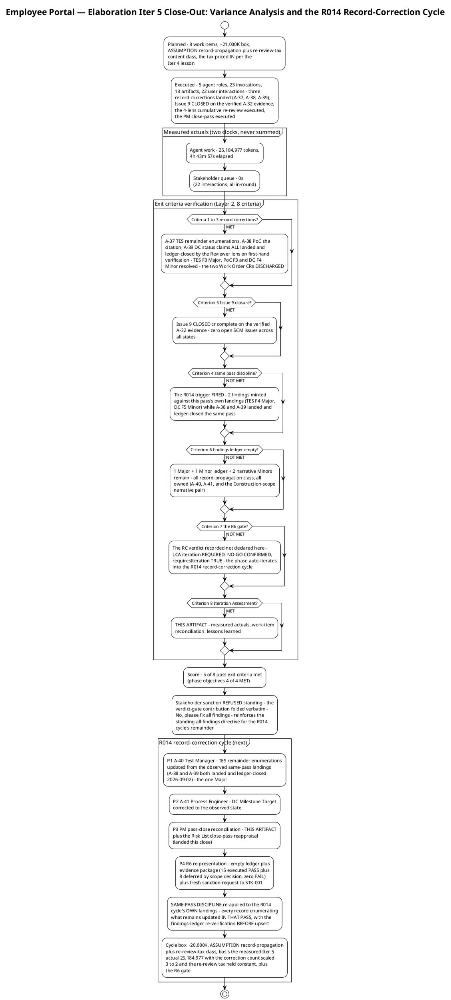

# Iteration Assessment

## Document Control

| Field | Value |
|---|---|
| Phase | Elaboration |
| Status | Draft — Elaboration Iteration 5 (Cycle 1) close-out record; EVOLVED from the Iter 4 close-out, not recreated |
| Milestone Target | End of Elaboration (LCA) — **NOT achieved this cycle; NOT declared by this assessment** (the milestone verdict is the Review Coordinator's, already issued) |
| Iteration | 5 (Cycle 1) — final record-correction pass |
| Date | 2026-09-02 |
| Review Coordinator Verdict (recorded, not declared here) | **LCA: iteration REQUIRED (scope incomplete)** — NO-GO CONFIRMED; `requiresIteration: TRUE`. The two Work Order CRs ([Moderate] Architectural Proof-of-Concept, [Moderate] Test Evaluation Summary) are **DISCHARGED** (A-37/A-38 landed and ledger-closed by the Reviewer lens on first-hand verification); Issue #9 CLOSED cr:complete — **zero open SCM issues**; zero Critical open (third consecutive cycle); the Management lens's ledger is EMPTY (re-verified); the Business lens carries zero findings project-wide; the code-review gate CLOSED (No-PRs-To-Review). **The R014 self-propagation trigger FIRED exactly as registered** — 2 new findings born of this pass's own landings (TES F4 Major → A-40, Test Manager; DC F5 Minor → A-41, Process Engineer); the phase auto-iterates into the **R014 record-correction cycle** (A-40/A-41 + the PM pass-close + the R6 gate itself) |
| Stakeholder Sanction (standing) | **REFUSED** at the Iter 1 LCA review — binding directive, verbatim: "Please fix all the findings even if they are minors prior to move to next phase"; escalation resolution, verbatim: "Fix all the issues and close all findings"; Iter 4 reinforcement, verbatim: "Close all findings and issues opened". **Iter 5 verdict-gate contribution — ANSWERED and folded, verbatim: "No, please fix all findings"** — the "No" closes the contribution question (nothing to add for the next pass); "please fix all findings" REINFORCES the standing all-findings directive for the R014 cycle's remainder. Fresh sanction request fires at R6 |
| Prior Version | Elaboration Iteration 4 close-out (2026-09-02); Iteration 3 close-out; Iteration 2 close-out; Iteration 1 close-out (2026-09-01); Inception Iteration Assessment (Approved at LCO — mission ACHIEVED); EVOLVED, not recreated. Prior records are preserved in SCM history |
| Elaboration Changes (Iter 5 close-out) | 4 phase objectives assessed — **4 MET** (third consecutive 4-MET close); **5 of 8 pass exit criteria met** (criteria 4, 6, 7 NOT MET: the same-pass discipline failed on its own landings, the ledger is not empty, the R6 gate not reached); measured actuals recorded (25,184,977 tokens; agent 4:43:57; stakeholder queue 0:00:00 across 22 interactions — never summed); budget variance recorded honestly: **~1.2× the ~21,000K box — the closest box of the phase; the re-review-tax sizing method VALIDATED**; work items reconciled to observed state (4 Complete, 2 Partial, 1 Not met, 1 discharged by this artifact); 3 findings closed this cycle (the two Work Order CRs among them) / 2 new born (the R014 trigger fired); lessons learned + R014-cycle adjustments (box ~20,000K by content class; the findings-ledger re-verification BEFORE upsert added to the same-pass discipline) |

## Iteration Objectives Reached

The phase planned four objectives. Assessed against the Review Record (verified findings ledger, 2026-09-02: 0 Critical / 1 Major / 1 Minor + 2 narrative) and the Test Evaluation Summary (mission verdict: VALIDATION SUBSTANCE ACHIEVED — OBSERVED, correct and unchanged), the record is: **4 MET** — the phase objectives stand MET on observed evidence, the records are current to that evidence, and this pass closed the last two Work Order CRs. What the RC verdict calls "scope incomplete" is the pass's own exit criteria 4, 6 and 7 (the same-pass discipline, the empty-ledger condition, and the R6 gate) — recorded here, not re-litigated.

```plantuml
@startuml
!theme plain
title Employee Portal — Elaboration Iter 5: Phase Objective Assessment
Final record-correction pass close - assessed against the Review Record (verified ledger 2026-09-02) and the Test Evaluation Summary

state "OBJ-1 Establish Architecture Baseline" as OBJ1 {
  OBJ1 : Status - MET (stands; citation corrected)
  OBJ1 : A-38 LANDED and verified first-hand -
  OBJ1 : the PoC Traceability sha citation
  OBJ1 : corrected to the verified file sha
  OBJ1 : 90e4f2e (PoC F3 RESOLVED, ledger-
  OBJ1 : closed); the observed-results ledger
  OBJ1 : intact (A-32, held); SAD criterion 3
  OBJ1 : current (A-33, held); main GREEN run
  OBJ1 : 33639518709; tree unchanged vs the
  OBJ1 : Iter 4 verified state
  OBJ1 : The Work Order PoC CR DISCHARGED
}
state "OBJ-2 Address High-Risk Elements" as OBJ2 {
  OBJ2 : Status - MET (terminal records held;
  OBJ2 : the R014 registration VALIDATED)
  OBJ2 : R001, R003, R004 RETIRED (Elaboration
  OBJ2 : scope) on observed, CI-traced evidence -
  OBJ2 : verified at Iter 4, held at Iter 5;
  OBJ2 : R013 RESOLVED; R010 obligation carried
  OBJ2 : to Construction Iter 1 with its trigger
  OBJ2 : R014 registered at plan-build - the
  OBJ2 : trigger FIRED exactly as predicted; the
  OBJ2 : contingency is operative and bounds the
  OBJ2 : cost at one pass per occurrence
}
state "OBJ-3 Refine Requirements" as OBJ3 {
  OBJ3 : Status - MET (stands)
  OBJ3 : The FOUR-clause behavioural bar
  OBJ3 : propagated and verified (complete
  OBJ3 : since Iter 3); zero requirements
  OBJ3 : findings at all five LCA reviews;
  OBJ3 : the Use-Case Model and Supplementary
  OBJ3 : Specification PRESERVED this pass
  OBJ3 : (clean - no finding or CR targets them)
}
state "OBJ-4 Develop Detailed Plan" as OBJ4 {
  OBJ4 : Status - MET
  OBJ4 : The pass plan verified sound by the
  OBJ4 : Management lens (all eight dimensions
  OBJ4 : PASS; zero new findings; the lens
  OBJ4 : ledger EMPTY, re-verified); the box
  OBJ4 : ~21,000K by content class with the
  OBJ4 : re-review tax priced IN produced a
  OBJ4 : ~1.2x variance - the most accurate
  OBJ4 : box of the phase; the sizing method
  OBJ4 : VALIDATED
}
OBJ1 -[hidden]-> OBJ2
OBJ2 -[hidden]-> OBJ3
OBJ3 -[hidden]-> OBJ4

note bottom of OBJ4
  Record - 4 MET (Iter 3 - 4 MET; Iter 4 -
  4 MET; third consecutive 4-MET close;
  Iter 2 - 1 MET / 2 PARTIALLY MET / 1 NOT
  MET; Iter 1 - 1 / 1 / 2). What remains
  per the RC verdict (recorded, not
  declared here) - two record corrections
  (A-40/A-41) + the PM pass-close (this
  artifact + the Risk List close-pass
  reappraisal) + the R6 gate itself.
  LCA sanction REFUSED (standing) - fresh
  request at R6.
end note
@enduml
```

**Objective 1 — Establish Architecture Baseline: MET (stands; citation corrected).** The architecture has been stable as record AND evidence since Iter 3; this pass closed the last citation defect: the PoC § Traceability behavioural-bar row now cites the verified CONTRIBUTING.md file sha 90e4f2e1b91bdb64082dcc9f75a4b32c3cc10f80 (A-38 — PoC F3 RESOLVED, ledger-closed; the Work Order's [Moderate] Architectural Proof-of-Concept CR DISCHARGED on that verification). The observed-results ledger (A-32) and the SAD criterion-3 record (A-33) held; main CI GREEN run 33639518709; the repo tree unchanged vs the Iter 4 verified state (85 entries, mechanism code present).

**Objective 2 — Address High-Risk Elements: MET (terminal records held; the R014 registration VALIDATED).** R001/R003/R004 remain RETIRED (Elaboration scope) on observed, CI-traced evidence — verified by the Reviewer lens at Iter 4, held at Iter 5; R013 RESOLVED; R010's obligation carried to Construction Iter 1 with its own trigger. The risk-management event of this pass is R014's: the trigger registered at plan-build FIRED at the review exactly as predicted (2 findings minted against this pass's own landings), and the pre-recorded contingency is now operative — the R6 entry gate re-opens the PASS (one more record-correction cycle), not the phase. A registered risk whose trigger fires as predicted is the process working, not failing.

**Objective 3 — Refine Requirements: MET (stands).** The FOUR-clause behavioural bar remains propagated and verified (complete since Iter 3); the Use-Case Model and Supplementary Specification were PRESERVED this pass (clean at all five LCA reviews; no finding or CR targets them). No requirements work was owed by a record-correction pass, and none was invented.

**Objective 4 — Develop Detailed Plan: MET.** The pass plan was verified sound by the Management lens (all eight planning dimensions PASS; zero new findings; that lens's findings ledger EMPTY, re-verified first-hand). The box (~21,000K by content class with the re-review tax priced IN) produced the most accurate variance of the phase (~1.2×) — the Iter 4 sizing lesson VALIDATED (see Adherence to Plan).

## Adherence to Plan

```plantuml
@startuml
!theme plain
title Employee Portal — Elaboration Iter 5: Budget vs Actuals
Two clocks, never summed - the re-review-tax sizing method VALIDATED

object "Token Spend" as TS {
  Box as planned - ~21,000K
  [ASSUMPTION - record-propagation +
  re-review-tax content class; the measured
  Iter 4 actual with corrections scaled
  5 to 3 and the tax held constant,
  plus the R6 gate]
  Actual - 25,184,977 (measured)
  Variance - ~1.2x the box
  THE CLOSEST BOX OF THE PHASE -
  Iter 1 ~10.4x; Iter 2 ~1.07x;
  Iter 3 ~2.17x; Iter 4 ~9.0x;
  Iter 5 ~1.2x
  The re-review tax itself was priced
  accurately; the ~4,185K residual is
  the correction count and the R6-gate
  share priced conservatively at
  plan-build. LESSON VALIDATED - every
  box is sized as pass-specific work +
  the re-review tax
}
object "Agent Elapsed Time" as AET {
  Actual - 4:43:57 (measured)
  Work time - never summed with queue
  The LONGEST elapsed of the phase -
  Iter 1 6:00:59; Iter 2 4:41:27;
  Iter 3 3:35:12; Iter 4 2:58:00
  Token spend held at ~101 percent of
  Iter 4 while elapsed rose ~59 percent -
  the cost driver is long-context
  reasoning over the largest cumulative
  surface yet; elapsed time is NOT a
  proxy for spend
}
object "Stakeholder Queue" as HGQ {
  Actual - 0:00:00 (measured)
  22 user interactions, ALL answered
  in-round - THIRD consecutive
  zero-queue iteration
  R012 - far below the 14-day
  suspension ceiling; the
  emission-format standing rule
  held under load
}
object "Volume and Quality" as VOL {
  Agent invocations - 23
  User interactions - 22
  Artifacts - 13
  Avg quality - 9.9 / 10
  3 findings closed this cycle (all
  Reviewer lens - the two Work Order
  CRs among them); 2 new born
  in-pass (the R014 trigger fired)
}
object "Token Record Reconciliation" as REC {
  Measured iteration actuals now FIVE -
  Iter 1 12,523,281 (record-side)
  Iter 2 13,363,814 (record-side)
  Iter 3 27,143,633 (code-delivering)
  Iter 4 24,830,875 (record-propagation
  + re-review tax)
  Iter 5 25,184,977 (record-correction
  + re-review tax)
  Iteration-level sum, Iters 1-5 -
  103,046,580 (phase NOT closed - no
  phase row claimed here)
  Standing resolution - the phase-level
  record governs phase accounting;
  iteration-shaped actuals govern every
  budget box; the two are never mixed
}
TS -[hidden]-> AET
AET -[hidden]-> HGQ
HGQ -[hidden]-> VOL
VOL -[hidden]-> REC
@enduml
```

| Metric | Planned | Actual (measured) | Notes |
|---|---|---|---|
| Token spend | ~21,000K box (work-item sum = box; the re-review tax priced IN) | 25,184,977 | ~1.2× the box — the closest of the phase; variance analysis below |
| Agent elapsed time | Measured at close | 4:43:57 | Work time; never summed with queue; the longest elapsed of the phase |
| Stakeholder queue | Estimate NONE (rule; R012 bound) | 0:00:00 | 22 interactions, ALL answered in-round; third consecutive zero-queue iteration; excludes the end-of-iteration approval gate |
| Agent invocations | — | 23 | 5 roles active (Test Manager, Software Architect, Process Engineer, the four review lenses + Review Coordinator, Project Manager) |
| User interactions | — | 22 | All in-round |
| Artifacts | — | 13 | Inventory unchanged |
| Avg quality | — | 9.9 / 10 | Reviewer-assessed |

**Variance analysis (token spend ~1.2× the box): the re-review-tax sizing method VALIDATED.** The ~21,000K box was sized per the Iter 4 lesson — (pass-specific work) + (the re-review tax, held constant) — and the measured 25,184,977 lands at ~1.2×, the closest box of the phase (Iter 1 ~10.4×; Iter 2 ~1.07×; Iter 3 ~2.17×; Iter 4 ~9.0×). The re-review tax itself was priced accurately; the ~4,185K residual is the correction count and the R6-gate share priced conservatively at plan-build. The lesson stands confirmed: **every box is sized as pass-specific work + the re-review tax, by content class from measured actuals.** The elapsed-time observation is recorded honestly: 4:43:57 is the longest of the phase while token spend held at ~101% of Iter 4 — the cost driver is long-context reasoning over the largest cumulative surface yet, and elapsed time is NOT a proxy for spend.

**Token record reconciliation (conflict recorded, not fabricated):** measured iteration actuals now number FIVE (12,523,281 / 13,363,814 / 27,143,633 / 24,830,875 / 25,184,977); the iteration-level sum for Iters 1–5 is 103,046,580 — recorded for iteration accounting only; the phase is NOT closed, so no phase row is claimed. The Work Order's phase-level Elaboration records differ from the iteration-level sums for the same iterations — the standing resolution holds: the phase-level record governs phase accounting; iteration-shaped actuals govern every budget box; the two are never mixed, and no per-iteration velocity is quoted from a phase-level record. When Elaboration closes, its recorded actuals replace every assumed share.

**Metrics with purpose (each answers a decision):**

| Goal (decision enabled) | Metric | Primitive measure |
|---|---|---|
| Track phase-closure progress cycle over cycle (decide whether the phase is converging on the R6 gate) | Pass exit criteria met | 5 of 8 this pass (Iter 4: 6 of 8; Iter 3: 10 of 14; Iter 2: 6 of 13; Iter 1: 3 of 8) — the three unmet are the same-pass discipline, the ledger-empty condition, and the R6 gate itself |
| Size the next box from fact, by content class including the re-review tax | Token spend actual | 25,184,977 (system-measured) — the record-correction + re-review-tax class's first data point; the ~1.2× variance validates the sizing method |
| Bound the human-gate queue risk (R012) and verify emission discipline under sustained load | Stakeholder queue time | 0:00:00 across 22 interactions (system-measured) — all in-round; third consecutive zero-queue iteration |
| Locate defect concentration for the R014 cycle's critical path | Open findings by severity × artifact | Verified ledger: 0 Critical (held, third consecutive cycle), 1 Major (TES F4), 1 Minor (DC F5) + 2 narrative (F-CR-E3-1/2, Construction scope) — all record-propagation class |
| Verify the review process is not deteriorating (rigor check) | Closures vs new findings; recurrence | 3 closed / 2 new (net −1); recurrence 0 of 3 — third consecutive zero; severity profile 4 Critical → 2 → 0 → 0 → 0 held across five cycles; minting count DECLINING (Iter 3: 5; Iter 4: 3; Iter 5: 2) |
| Confirm defects concentrate in records, not the validated baseline (protects the baseline from rework) | Avg artifact quality | 9.9 / 10 (reviewer-assessed) |

### Work Item Reconciliation (statuses reconciled to observed state — pass exit criterion 8 / plan Work Item 8)

```plantuml
@startuml
!theme plain
title Employee Portal — Elaboration Iter 5: Work Item Reconciliation
Statuses reconciled to observed state (pass exit criterion 8 / plan Work Item 8) - 2026-09-02

object "Complete - evidence-cited (4)" as C {
  WI-1 A-37 TES remainder-enumerations -
  TES F3 (Major) RESOLVED, ledger-closed;
  the Work Order Moderate TES CR DISCHARGED
  WI-2 A-38 PoC sha citation - corrected to
  the verified file sha 90e4f2e; PoC F3
  RESOLVED, ledger-closed; the Work Order
  Moderate PoC CR DISCHARGED
  WI-3 A-39 DC status claims - three
  locations corrected to the observed
  state; DC F4 RESOLVED, ledger-closed
  WI-5 Issue 9 closure - CLOSED on the
  verified A-32 evidence; ZERO open SCM
  issues (Issues 1, 2, 9 all cr complete) -
  the issues side of the stakeholder's
  Iter 4 directive SATISFIED
}
object "Partial - executed with born successors (2)" as P {
  WI-6 Findings-ledger closure - 3 closures
  executed by the Reviewer lens (TES F3,
  PoC F3, DC F4 - all on first-hand
  verification); BUT the R014 trigger
  FIRED - 2 new findings born of this
  pass's own landings (TES F4 Major,
  DC F5 Minor). Ledger NOT empty -
  1 Major + 1 Minor + 2 narrative remain
  WI-7 4-lens cumulative re-review + R6 -
  the re-review EXECUTED (all four lenses,
  13 of 13 artifacts, fifth consecutive
  100 percent coverage cycle); the R6
  re-presentation NOT MET - the RC verdict
  auto-iterates the phase into the R014
  record-correction cycle
}
object "Not met - the discipline failed on its own landings (1)" as N {
  WI-4 Same-pass discipline (R014
  mitigation, pass exit criterion 4) -
  the trigger FIRED - 2 findings minted
  against remainder-enumerations written
  earlier in this same pass (TES F4 -
  five locations; DC F5 - Milestone
  Target). The discipline was carried
  and still failed on two locations;
  the cure carried forward is the
  findings-ledger re-verification
  BEFORE upsert
}
object "Discharged by this artifact (1)" as A {
  WI-8 Iteration Assessment at pass close -
  THIS ARTIFACT (measured actuals +
  work-item reconciliation), authored
  after the reviewers ruled, per the
  plan's Work Item 8
}
C -[hidden]-> P
P -[hidden]-> N
N -[hidden]-> A

note bottom of N
  Status honesty, both directions (F7
  lesson) - the three correction work
  items that showed Pending at
  plan-build are observed COMPLETE with
  evidence; WI-4 records its failure
  honestly; WI-6 and WI-7 record their
  partial states; WI-8 names itself.
  No status without evidence.
end note
@enduml
```

**Status honesty, both directions (F7 lesson):** the three correction work items that showed "Pending" at plan-build (WIs 1–3) are observed COMPLETE with evidence cited; WI-5 (Issue #9) is observed COMPLETE on the verified SCM state. WI-4 records its failure honestly (the discipline was carried as exit criterion 4 and still failed on two locations — the R014 trigger fired); WI-6 and WI-7 record their partial states with their blocking evidence named; WI-8 is discharged by this artifact. A status that cannot show evidence reverts to In progress, never to Complete — and a status that HAS evidence must not understate it either.

## Use Cases and Scenarios Implemented

**No use case was implemented or validated as a running feature this iteration** — the final record-correction pass carried no use-case activity by design (record corrections only, per the stakeholder-confirmed R6 path). The phase's use-case validation record from Iters 1–3 stands unchanged:

| UC | Validation Record (Iters 1–3 — stands; no Iter 5 activity) | Status |
|---|---|---|
| UC-001 | R003 stub-issuer + R004 offline-drop mechanism validation — token matrix PASS; 5-minute drop simulation PASS (zero duplicates/losses, sync ≤ 60 s, confirmations < 1 s) | **VALIDATED — OBSERVED** |
| UC-004 | R001 FOUR-clause behavioural bar vs the disposable LDAP directory (gaps AND substitution attempts seeded deliberately) — every employee rendered, no hidden entries, no errors, no substitution | **VALIDATED — OBSERVED** |
| UC-005 | R001 bar (event row, blank display fields, clocking data always complete) — TC-021 PASS | **VALIDATED — OBSERVED** |
| UC-006 | R001 bar (CSV row, blank cells, no abort) — TC-022 PASS | **VALIDATED — OBSERVED** |
| UC-007 | R001 bar (employee locatable and selectable with blank fields) — TC-023 PASS | **VALIDATED — OBSERVED** |
| UC-010 | Audit + soft-delete design complete (0 findings); TC-013…TC-016 BLOCKED — recorded SCOPE decision (news/audit mechanisms are Construction scope) | Design complete; execution deferred |
| UC-002, UC-003, UC-008, UC-009 | Analysis complete (Use-Case Model 10/10 FULL, 0 findings at all five LCA reviews); featured-banner contract settled (banners STACK, newest first) | Analysis level; Construction |

All 10 UCs remain refined at the analysis level; implementation of running features is Construction work per the baselined schedule (Iter 1 clocking cluster, Iter 2 news cluster, Iter 3 directory + export). The Construction assignments are unchanged this pass.

## Results Relative to Evaluation Criteria

### Layer 1 — Declared Acceptance Criteria (all 5 accounted; unchanged — no AC is addressed by record correction itself)

| AC | Status | Evidence / Deferral |
|---|---|---|
| AC-001 | Partial evidence — OBSERVED (stands) | UC-001 mechanisms validated empirically (Iters 1–3); running feature is Construction Iter 1 |
| AC-002 | Not addressed (deferred) | Construction Iter 2 — UC-008 running feature |
| AC-003 | Partial evidence — OBSERVED (stands) | R001 FOUR-clause bar validated against the disposable directory; production-AD performance + data quality at Construction Iter 3 (R010 + R011) |
| AC-004 | Not addressed (deferred) | Transition Iter 1 — adoption measurement requires a deployed system (BG-003) |
| AC-005 | Partial evidence — OBSERVED (stands) | R004 5-minute drop simulation PASS; formal AC test at Construction Iter 1 |

### Layer 2 — Iteration 5 Pass Exit Criteria (one line per criterion the plan carried — 5 of 8 MET)

| # | Exit Criterion | Result | Evidence |
|---|---|---|---|
| 1 | A-37 — TES remainder-enumerations updated from the observed same-pass landings (closes TES F3, Major) | **MET — verified** | TES F3 RESOLVED via resolve_artifact_finding (Reviewer lens, first-hand verification: every named location updated; INC-1 bottleneck RESOLVED; the mission verdict correct and unchanged); the Work Order's [Moderate] Test Evaluation Summary CR DISCHARGED |
| 2 | A-38 — PoC § Traceability sha citation corrected (closes PoC F3, Minor) | **MET — verified** | PoC F3 RESOLVED — the row cites the verified file sha 90e4f2e1b91bdb64082dcc9f75a4b32c3cc10f80, read first-hand on main; the Work Order's [Moderate] Architectural Proof-of-Concept CR DISCHARGED |
| 3 | A-39 — Development Case's three stale status claims updated to the observed state (closes DC F4, Minor) | **MET — verified** | DC F4 RESOLVED — criterion 3 "Remaining: nothing on this criterion"; PoC disposition "obligation DISCHARGED"; Organization Assessment "retirement RECORDED" |
| 4 | Same-pass discipline applied to the pass's OWN landings (R014 mitigation) | **NOT MET** | The R014 trigger FIRED: 2 findings minted against remainder-enumerations written earlier in this same pass (TES F4 Major — five locations; DC F5 Minor — Milestone Target), while A-38/A-39 landed and ledger-closed the same pass. The discipline was carried and still failed on two locations |
| 5 | SCM Issue #9 closed on the verified A-32 evidence | **MET — verified** | Issue #9 CLOSED cr:complete; Issues #1/#2 already closed; zero open SCM issues across all states — the issues side of the stakeholder's Iter 4 directive SATISFIED |
| 6 | Findings ledger EMPTY across ALL lenses and ALL severities | **NOT MET** | 3 closures this cycle, but 2 new findings born of this pass's own landings: TES F4 (Major), DC F5 (Minor); + 2 narrative Minors carried (F-CR-E3-1/2, Construction scope). All record-propagation class, all owned (A-40/A-41) |
| 7 | R6 re-presentation with the evidence package + fresh sanction request | **NOT MET** | The RC verdict (recorded, not declared here): LCA iteration REQUIRED — NO-GO CONFIRMED, requiresIteration TRUE; the R6 entry gate (empty ledger) is not yet satisfied; LCA-5 remains the gate's own pending decision |
| 8 | Iteration Assessment at pass close (measured actuals, work-item reconciliation) | **MET** | THIS ARTIFACT — authored after the reviewers ruled, per the plan's Work Item 8 |

**Score: 5 of 8.** The three unmet criteria are the same-pass discipline, the ledger-empty condition, and the R6 gate — all are the R014 record-correction cycle's work (A-40/A-41 + the PM pass-close + the gate itself). Every remaining item is a record correction; none requires code, design, or new validation.

## Test Results

The formal test execution record stands unchanged from the Iteration 3 close (the execution authority): **15 PASS / 0 FAIL / 8 BLOCKED** across TC-001…TC-023, execution trace CI run 33617748483 — the 8 BLOCKED cases stated per the stakeholder's framing directive as **a recorded SCOPE decision — deferred to Construction, not missing**. This pass's test-side activity was record propagation, and it landed:

| Item | Result (this pass) | Source |
|---|---|---|
| A-37 — TES remainder-enumerations | **LANDED** — every named location updated from the observed same-pass landings; INC-1 bottleneck RESOLVED; the mission verdict ("VALIDATION SUBSTANCE ACHIEVED — OBSERVED") correct and unchanged; TES F3 RESOLVED | Review Record Iter 5 technical-lens verification |
| Regression baseline | **HELD** — no code entered the tree this cycle (zero PRs, tree unchanged vs the Iter 4 verified state); the 15/0/8 baseline stands on main run 33639518709 | Review Record Iter 5 code-review-lens + technical-lens records |
| CI build status (main) | **Green** — run 33639518709 (completed 2026-09-02 14:04:14Z) | Review Record Iter 5 code-review-lens record |
| Open SCM issues | **ZERO** — Issues #1/#2/#9 all CLOSED cr:complete (Issue #9 closed on the verified A-32 evidence) — the issues side of the stakeholder's Iter 4 directive SATISFIED | Review Record Iter 5 technical-lens record |
| New test-side finding | **TES F4 (Major, A-40 — Test Manager)** — five locations still enumerate A-38/A-39 as remaining while both landed and ledger-closed this same pass (the R014 class's successor instance); the mission verdict itself is correct and unchanged | Review Record Iter 5 technical-lens record |
| Fabricated results | None — every verdict cites its execution trace; no result is claimed beyond the Test Case authority's record | Test Case / TES records |

## External Changes

**No scope changes.** The declared scope (10 FRs, 5 NFRs, 5 ACs, 14 CONs) is unchanged; zero scope-creep findings across all review lenses, five iterations; R009 held by CCB enforcement.

**Stakeholder decisions recorded this iteration (all incorporated):**
1. **Iter 5 verdict-gate contribution — verbatim: "No, please fix all findings."** Folded by the Review Coordinator: the "No" closes the contribution question (nothing to add for the next pass — no missed requirement, no correction, no priority), and "please fix all findings" REINFORCES the standing all-findings directive (Iter 1 verbatim: "Please fix all the findings even if they are minors prior to move to next phase"; escalation resolution: "Fix all the issues and close all findings"; Iter 4: "Close all findings and issues opened") for the R014 record-correction cycle's remainder: the two open ledger findings (TES F4 → A-40; DC F5 → A-41) close before the R6 re-presentation, and the two narrative-tracked Code Reviewer Minors (F-CR-E3-1/2) carry with their recorded Construction-scope dispositions per the framing directive. The answer adds no new scope, no correction, and no priority; the contribution cycle is CLOSED; the milestone auto-iteration (requiresIteration: TRUE) was recorded immediately after the folding.
2. **Standing record (unchanged):** sanction REFUSED (Iter 1) with the binding all-findings directive; the R6 path CONFIRMED (Iter 3: "Yes") with the BLOCKED-cases framing directive — the 8 BLOCKED are a recorded SCOPE decision, deferred to Construction, not missing.

**Change Request status:** the two CRs in this Work Order — [Moderate] Architectural Proof-of-Concept and [Moderate] Test Evaluation Summary — are **DISCHARGED** (A-38 and A-37 landed and ledger-closed by the Reviewer lens on first-hand verification this pass). No open CR remains against any artifact.

## Rework Required

**Four tracked findings (verified ledger: 0 Critical, 1 Major, 1 Minor; plus 2 narrative-tracked Code Reviewer Minors).** All are phase-exit conditions per the stakeholder's directive. **Every remaining item is a record correction — none requires code, design, or new validation.** No PM-owned finding remains open: the Management lens's ledger is EMPTY (re-verified this cycle), and the Risk List close-pass reappraisal (this close) records the R014 trigger firing.

| # | Finding | Severity | Owner (Action) | Status |
|---|---|---|---|---|
| 1 | TES F4 — five locations still enumerate A-38/A-39 as remaining while both landed and ledger-closed this same pass (the R014 class's successor instance) | **Major** | Test Manager (A-40) | OPEN — the R014 record-correction cycle's P1 |
| 2 | DC F5 — the Milestone Target enumerates A-37/A-38 as remaining while both landed and ledger-closed | Minor | Process Engineer (A-41) | OPEN — one-location correction per the DC's own same-pass discipline |
| 3 | F-CR-E3-1 — interim IClockingsRepository vs INT-016 final contract | Minor (narrative) | Implementer (Construction Iter 1, R008) + Designer (INT-016 confirmation) | OPEN — Construction scope; [DEFERRED] marker carried |
| 4 | F-CR-E3-2 — IAuthProvider operations absent from the INT-011 contract table | Minor (narrative) | Designer (next Design Model evolution) | OPEN — Construction scope |

**Risk-retirement record (verified, no change):** R001/R003/R004 RETIRED (Elaboration scope) on observed evidence; R013 RESOLVED; R010 NARROWED with the obligation carried to Construction Iter 1 with its own trigger; R012 measured 0:00:00 this iteration (third consecutive zero-queue). **R014's trigger FIRED this cycle — recorded in the Risk List close-pass reappraisal (landed this close):**

```plantuml
@startuml
!theme plain
title R014 Record-Propagation Self-Propagation — Trigger FIRED, Contingency OPERATIVE
Elaboration Iter 5 close (PM close-pass reappraisal; recorded in the Risk List this close)

[*] --> Registered
state "REGISTERED at the Iter 5 plan-build
SIGNIFICANT (P=3, I=2), Accept, owner PM
trigger armed - any new record-propagation
finding minted at the Iter 5 review" as Registered
state "TRIGGER FIRED at the Iter 5 review
2 findings minted against this pass's OWN
landings - TES F4 (Major, five locations)
and DC F5 (Minor, Milestone Target) - while
A-38 and A-39 landed and ledger-closed the
same pass. Exactly as the registration
predicted - the registration VALIDATED" as Fired
state "CONTINGENCY OPERATIVE
the R6 entry-gate verification caught the
stale enumerations BEFORE re-presentation -
it re-opens the PASS (one more record-
correction cycle), NOT the phase. The
class's cost is bounded at one pass per
occurrence; no code, design, or validation
is invalidated" as Contingency
state "MITIGATION RE-APPLIED to the R014
cycle's OWN landings (A-40/A-41) - every
record enumerating what remains is updated
IN THAT PASS, and the remainder statement
is re-verified against the verified findings
ledger BEFORE upsert" as Reapplied
Registered --> Fired
Fired --> Contingency
Contingency --> Reapplied
Reapplied --> [*] : terminates when a pass
mints no successor finding

note bottom of Fired
  Minting count DECLINING across the
  three fired passes - Iter 3 five
  findings; Iter 4 three; Iter 5 two.
  The class is converging, and the
  contingency bounds each occurrence
  at one pass.
end note
@enduml
```

### Variance Analysis



### Lessons Learned

1. **The re-review-tax sizing method is VALIDATED — hold it.** The ~21,000K box (pass-specific work + the tax priced IN, by content class from measured actuals) produced the closest variance of the phase (~1.2× vs Iter 4's ~9.0×). Every later box — including Construction's — is sized the same way: (pass-specific work) + (the re-review tax, held roughly constant per cycle and growing with the surface).
2. **A registered risk whose trigger fires as predicted is the process working.** R014 was registered at plan-build with its trigger and contingency; the trigger fired exactly as registered, and the pre-recorded contingency bounded the cost at one pass (the R6 entry gate re-opens the PASS, not the phase). Registering the recurring defect class in advance — the R013 precedent applied — converted a surprise into a bounded, pre-priced event.
3. **The same-pass discipline failed on its own landings — the cure is verification, not just intent.** The discipline was carried as pass exit criterion 4 and still failed on two locations: records written earlier in the pass were not re-verified against the landings that occurred later in the same pass. The strengthened discipline for the R014 cycle: the remainder statement is re-verified against the verified findings ledger BEFORE every upsert — the ledger, not the author's memory, is the remainder's source of truth.
4. **Elapsed time is NOT a proxy for spend.** This pass recorded the longest elapsed time of the phase (4:43:57) while token spend held at ~101% of Iter 4 — the cost driver is long-context reasoning over the largest cumulative surface yet. The two clocks stay separate in every report; neither is converted into the other.
5. **Zero queue held under sustained load — third consecutive iteration.** Twenty-two stakeholder interactions, all answered in-round; the emission-format standing rule (one marker, one line, valid JSON, never embedded) held under load for a second consecutive heavy cycle and must be maintained by every role into Construction.

### Next Iteration Adjustments (binding inputs to the R014 record-correction cycle)

| Adjustment | Rationale |
|---|---|
| **P1: A-40 — TES remainder-enumerations updated from the observed same-pass landings** (Milestone Target; master-workflow "Remaining before R6" box; schedule Sequence 4; Conclusions "What the mission cannot yet claim" → the current remainder; recommendation 8 retired or restated) — closes TES F4 (Major) | The one Major; R6 evidence-package internal consistency — the mission-verdict record must not contradict the PoC ledger it sits beside |
| **P2: A-41 — DC Milestone Target corrected to the observed state** (all three record corrections landed and ledger-closed 2026-09-02; what remains is the PM pass-close reconciliation and the R6 gate itself), per the DC's own binding same-pass discipline — closes DC F5 (Minor) | The R6 entry gate reads the DC Milestone Target for process state |
| **SAME-PASS DISCIPLINE, STRENGTHENED: every record enumerating what remains is updated IN THE PASS its landings occur, and the remainder statement is re-verified against the verified findings ledger BEFORE every upsert** | The Iter 5 lesson — the discipline was carried and still failed on two locations; verification against the ledger, not author memory, is the cure |
| **PM pass-close reconciliation** — this Iteration Assessment + the Risk List close-pass reappraisal (both landed this close); the R014 cycle's close repeats the discipline | The close-pass reappraisal discipline (record retirement and trigger events at the close pass, verified by the reviewers) is load-bearing for every future phase close |
| **R6 re-presentation with the evidence package and a fresh sanction request to STK-001** — presented as 15 executed PASS + 8 deferred-by-scope-decision, zero FAIL; entry gate: empty ledger (verified via the findings system) + evidence package + corrections committed + review materials distributed | The stakeholder-confirmed path; LCA-5 is the gate's own pending decision — a GRANTED sanction is the only path to phase transition and Construction entry |
| **Cycle budget box: ~20,000K** [ASSUMPTION — record-propagation + re-review-tax content class; basis: the measured Iter 5 actual (25,184,977) with the correction count scaled 3→2 and the re-review tax (the dominant term) held constant, plus the R6 gate] | The validated sizing method applied: pass-specific work + the re-review tax |
| **Iteration Plan roll-forward at the next plan-build:** the R014 record-correction cycle becomes the CURRENT plan (coarse roadmap count 11 — Elaboration 6), built from these binding adjustments; Construction Iter 1 remains coarse-only until LCA sanction | The two-active-plans discipline; planning beyond the horizon in fine detail is waste. The count extension is minted by the R014 trigger firing — a registered risk event, never planning drift — and is justified against the risk profile exactly as the prior extensions were |
| No scope reduction | The R014-cycle scope is fully determined by the two open findings, the stakeholder-confirmed R6 path, and the standing all-findings directive; the box governs |

## Traceability

| Element | Traces From | Link Type | Traces To |
|---|---|---|---|
| Iteration Assessment (this, Elaboration Iter 5) | Iteration Plan (Elab Iter 5 — objectives 1–4, pass exit criteria 1–8, box ~21,000K, Work Item 8); Review Record (Iter 5 consolidated disposition — RC verdict NO-GO CONFIRMED / requiresIteration TRUE; verified ledger 0 Critical / 1 Major / 1 Minor + 2 narrative; A-37/A-38/A-39 landed and ledger-closed; the two Work Order CRs DISCHARGED; Issue #9 CLOSED; A-40/A-41 assigned; stakeholder contribution folded verbatim: "No, please fix all findings"); Test Evaluation Summary (Iter 5 — mission verdict VALIDATION SUBSTANCE ACHIEVED — OBSERVED, correct and unchanged; A-37 landed; TES F4 the new Major); Work Order measured facts (25,184,977 tokens; 4:43:57 agent; 0:00:00 queue; 23 invocations; 22 interactions; 13 artifacts; 9.9 quality) | Reviews | The R014 record-correction cycle (A-40/A-41 + PM pass-close + R6 gate); the next Iteration Plan roll-forward; Construction Iter 1 plan (built at LCA sanction) |
| OBJ-1 assessment (Architecture Baseline — MET, citation corrected) | PoC F3 closure (A-38 — the verified file sha 90e4f2e, read first-hand on main); the Work Order's [Moderate] Architectural Proof-of-Concept CR (DISCHARGED); main GREEN run 33639518709; the unchanged tree | Reviews | The R6 evidence package (citation verifiability restored) |
| OBJ-2 assessment (High-Risk Elements — MET, R014 registration validated) | Risk List close-pass reappraisal (this close — R014 trigger firing recorded; R012 trend updated); the terminal retirement records (R001/R003/R004 RETIRED, R013 RESOLVED — verified Iter 4, held Iter 5); the Review Record Iter 5 records (the trigger fired exactly as registered; the contingency operative) | Reviews | R011 (production residuals, Construction); the R014 record-correction cycle; Construction Iter 1 (R010 trigger; AC-005 formal test) |
| OBJ-4 assessment (Detailed Plan — MET, sizing method validated) | The ~21,000K box vs the measured 25,184,977 (~1.2× — the closest of the phase); the Management lens's Iter 5 verification (all eight dimensions PASS; zero new findings; lens ledger EMPTY) | Reviews | The R014-cycle box (~20,000K); Construction sizing (inherits the validated method) |
| Budget variance analysis (sizing method validated) | Work Order measured actuals (25,184,977); the box's basis (record-propagation + re-review-tax class, the tax priced IN); the five-iteration variance series (~10.4× / ~1.07× / ~2.17× / ~9.0× / ~1.2×) | DependsOn | Every later budget box (pass-specific work + the re-review tax); Construction sizing |
| Token record reconciliation (conflict recorded) | Measured iteration actuals (Iter 1: 12,523,281; Iter 2: 13,363,814; Iter 3: 27,143,633; Iter 4: 24,830,875; Iter 5: 25,184,977; sum 103,046,580); the phase-level Elaboration records; the Inception conflict precedent (1,347,939 vs 3,550,308) | Replaces | All later iteration-box sizing; the Elaboration phase row (recorded only when the phase closes) |
| Work item reconciliation (4 Complete / 2 Partial / 1 Not met / 1 discharged) | Iteration Plan work items 1–8; observed state (A-37/A-38/A-39 landed and ledger-closed; Issue #9 CLOSED; the R014 trigger fired; R6 not executed per the RC verdict) | Reviews | Exit criterion 8 verification (discharged by this assessment); the R014-cycle work items |
| Exit criteria score (5 of 8) | Iteration Plan Layer 2 criteria 1–8; Review Record verified ledger; RC verdict | Reviews | R6 LCA re-presentation entry gate (empty ledger + evidence package + fresh sanction request) |
| Test results record | Test Case Cycle 1 formal-pass record (15/0/8, trace CI 33617748483 — the execution authority, stands); A-37 landing (verified); the unchanged tree and main run 33639518709; zero open SCM issues | DependsOn | A-40 (TES remainder-enumerations — Test Manager); Construction regression baseline; escaped-defect tracking (Construction Iter 1 onward) |
| Stakeholder decision record (Iter 5) | Stakeholder verdict-gate answer, verbatim: "No, please fix all findings" (folded by the Review Coordinator; contribution cycle CLOSED; requiresIteration TRUE recorded immediately after) | Authorizes | The R014 record-correction cycle work order (A-40/A-41 + PM pass-close); the R6 evidence package; the fresh sanction request at R6 |
| R014 trigger-firing record + strengthened same-pass discipline | Risk List R014 (registered at plan-build with trigger + contingency); the Review Record Iter 5 technical-lens record (2 findings minted against same-pass landings); the Iter 5 work-item reconciliation (WI-4 Not met) | Refines | The R014 record-correction cycle (the class's termination condition); every future close-pass in Construction and Transition |
| Lessons learned (sizing method validated; registration validated; strengthened discipline; elapsed ≠ spend; queue discipline) | This iteration's measured variance (~1.2×); the R014 trigger firing; the WI-4 failure; R012 measured 0:00:00 across 22 interactions | Refines | Every later Iteration Plan and Iteration Assessment; the R6 evidence package; Construction sizing and process |