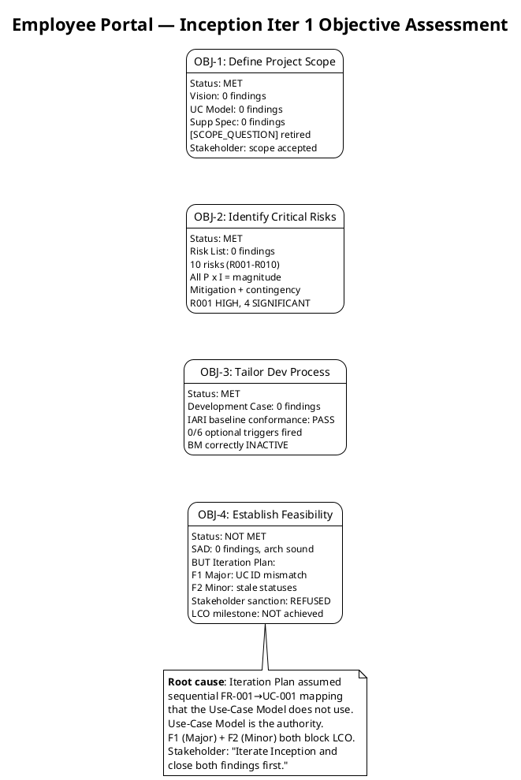
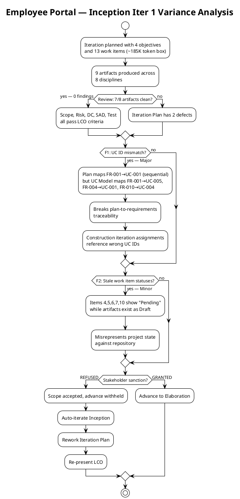
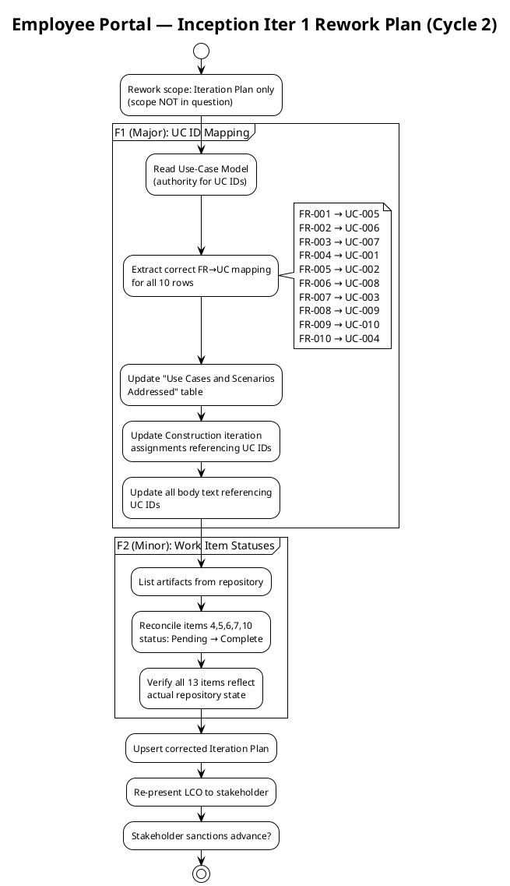

## Document Control

| Field | Value |
|---|---|
| Phase | Inception |
| Status | Draft |
| Milestone Target | End of Inception (LCO) |
| Iteration | 1 (Cycle 1) |
| Date | 2026-09-01 |
| Review Coordinator Verdict | LCO: iteration REQUIRED (scope incomplete) |
| Stakeholder Sanction | REFUSED — scope accepted, advance withheld pending Iteration Plan rework |

## Iteration Objectives Reached

The Inception Iteration 1 plan defined four objectives. Each is assessed below against the Review Record findings and the Test Evaluation Summary evidence.

### Objective 1 — Define Project Scope: **MET**

| Evidence | Source |
|---|---|
| Vision Document produced with clear includes/excludes matching declared scope | Review Record — 0 findings |
| Use-Case Model decomposes all 10 FRs into UC-001–UC-010 with sources cited | Review Record — 0 findings |
| Supplementary Specification covers all 5 NFRs, FURPS+ categorized, cross-cutting mechanisms correctly placed | Review Record — 0 findings |
| [SCOPE_QUESTION] on offline clocking retired by stakeholder confirmation | Stakeholder answer: "Yes" — architectural concern, not scope |
| Stakeholder confirmed scope accepted | Stakeholder: "Scope and objectives: accepted. They are not in question." |

### Objective 2 — Identify Critical Risks: **MET**

| Evidence | Source |
|---|---|
| Risk List produced with 10 risks (R001–R010), all classified P × I = magnitude | Review Record — 0 findings |
| R001 (AD LDAP) classified HIGH (P=3, I=3) — highest magnitude | Risk List |
| 4 SIGNIFICANT risks (R002, R003, R004, R010), 5 MODERATE risks (R005–R009) | Risk List |
| Mitigation + contingency defined for all 10 risks | Risk List |
| R010 (Infra availability) identified as critical-path blocker for Elaboration PoCs | Test Evaluation Summary — infrastructure needs assessment |

### Objective 3 — Tailor Development Process: **MET**

| Evidence | Source |
|---|---|
| Development Case conforms to IARI baseline with no forbidden overrides | Review Record — LCO-5: PASS |
| 0 of 6 optional triggers fired; all justified per DC §5.2 | Review Record — optional trigger audit: PASS |
| Business Modeling correctly classified INACTIVE (not business-process-led) | Review Record — DC §4 classification evidence |
| Role roster, ownership, CORE artifacts all verified | Review Record — compliance matrix: PASS |

### Objective 4 — Establish Feasibility: **NOT MET**

| Evidence | Source |
|---|---|
| SAD draft produced — 9 components, 3 ADRs, candidate architecture proportional to 200-user scope | Review Record — LCO-4: PASS, 0 findings |
| PoC plan for R001/R003/R004 defined in SAD | SAD + Test Evaluation Summary |
| **BUT** Iteration Plan F1 (Major): UC ID numbering mismatch breaks plan-to-requirements traceability | Review Record — F1 (Reviewer) + F1 (MR) |
| **AND** Iteration Plan F2 (Minor): stale work item statuses misrepresent project state | Review Record — F2 (Reviewer) + F2 (MR) |
| **AND** stakeholder sanction REFUSED — advance withheld | Stakeholder: "Sanction to advance: withheld. Iterate Inception and close both findings first." |
| LCO milestone NOT achieved | Review Coordinator: "LCO: iteration REQUIRED (scope incomplete)" |

**Root cause:** The Iteration Plan assumed a sequential FR-001→UC-001 mapping that the Use-Case Model (the authority) does not use. The Use-Case Model maps FR-001→UC-005, FR-004→UC-001, FR-010→UC-004, etc. This propagated incorrect UC references into the Construction iteration assignments. Additionally, work items 4, 5, 6, 7, and 10 showed "Pending" status while their artifacts exist as Draft in the repository.

## Adherence to Plan

### Budget vs Actuals

| Metric | Planned | Actual | Variance |
|---|---|---|---|
| Token spend | [ASSUMPTION — 185K] | 2,202,369 | +1,352,369 over assumed box |
| Agent invocations | — | 11 | — |
| User interactions | — | 12 | — |
| Artifacts produced | 13 work items → 9 artifacts | 9 artifacts | 9/13 work items produced artifacts (items 1, 12, 13 are PM planning/assessment, not separate artifacts) |
| Agent elapsed time | — | 1:24:29 | — |
| Human gate queue time | — | 0:02:20 | — |

**Variance analysis:** The token spend of 2,202,369 exceeded the assumed 185K box by a factor of ~12×. The assumption was explicitly tagged `[ASSUMPTION]` with basis "9 active disciplines producing initial artifacts for a moderate-scope project." The actual spend reflects the cumulative reasoning cost across all disciplines reading and producing artifacts — not a scope overrun. The measured actual replaces the assumption for all future forecasts. No scope items were added; the overrun is in reasoning cost, not in deliverable count.

**Two clocks, never summed:** Agent work consumed 1:24:29 of elapsed time. Human gate queue time was 0:02:20 (stakeholder answering questions). The end-of-iteration approval gate is not included in the queue time figure. These two clocks are reported side by side and never added.

### Work Item Status Reconciliation

| # | Work Item | Planned Status | Actual Status (Repository) | Finding |
|---|---|---|---|---|
| 1 | Risk List | In progress | Complete (Draft) | — |
| 2 | Development Case | Complete | Complete (Draft) | — |
| 3 | Tool environment config | Complete | Complete | — |
| 4 | Vision Document | Pending | Complete (Draft) | **F2** — showed Pending |
| 5 | Use-Case Model | Pending | Complete (Draft) | **F2** — showed Pending |
| 6 | Supplementary Specification | Pending | Complete (Draft) | **F2** — showed Pending |
| 7 | Software Architecture Document | Pending | Complete (Draft) | **F2** — showed Pending |
| 8 | Design Model | Pending | Complete (Draft) | — |
| 9 | Project skeleton | Pending | Complete | — |
| 10 | Test strategy | Pending | Complete (Draft) | **F2** — showed Pending |
| 11 | Repository configuration | Pending | Complete | — |
| 12 | Iteration Plan | In progress | Complete (Draft, with defects) | **F1** — UC ID mismatch |
| 13 | LCO readiness assessment | Pending | Not produced (LCO not achieved) | — |

## Use Cases and Scenarios Implemented

No use cases were implemented as running features in this iteration — Inception produces analysis and architecture artifacts, not executable code. All 10 UCs (UC-001–UC-010) were analyzed in the Use-Case Model and addressed at the architecture level in the SAD draft.

**UC ID mapping defect (F1):** The Iteration Plan's "Use Cases and Scenarios Addressed" table used a sequential FR-001→UC-001 mapping that does NOT match the Use-Case Model (the authority). The correct mapping from the Use-Case Model is:

| FR ID | Correct UC ID (per Use-Case Model) | Iteration Plan had |
|---|---|---|
| FR-001 | UC-005 | UC-001 ❌ |
| FR-002 | UC-006 | UC-002 ❌ |
| FR-003 | UC-007 | UC-003 ❌ |
| FR-004 | UC-001 | UC-004 ❌ |
| FR-005 | UC-002 | UC-005 ❌ |
| FR-006 | UC-008 | UC-006 ❌ |
| FR-007 | UC-003 | UC-007 ❌ |
| FR-008 | UC-009 | UC-008 ❌ |
| FR-009 | UC-010 | UC-009 ❌ |
| FR-010 | UC-004 | UC-010 ❌ |

All 10 rows are incorrect. Construction iteration assignments that reference UC IDs are also affected.

## Results Relative to Evaluation Criteria

The Iteration Plan defined 6 exit criteria for Inception Iteration 1. Each is assessed against the evidence:

| # | Exit Criterion | Result | Evidence |
|---|---|---|---|
| 1 | Risk List produced with all risks classified (P × I = magnitude) and mitigation/contingency defined | **MET** | Risk List artifact — 10 risks, all classified, 0 review findings |
| 2 | Coarse cross-iteration roadmap defined with milestone sequence | **MET** | Iteration Plan — 7 iterations, 4 milestones (LCO, LCA, IOC, PR) |
| 3 | Iteration budget box defined with per-work-item token allocation | **MET** | Work Items table — 13 items, ~185K total (assumption properly tagged) |
| 4 | All 10 FRs traced to planned use cases and implementation iterations | **NOT MET** | F1 (Major): UC ID mapping incorrect — all 10 rows mismatch Use-Case Model |
| 5 | All 5 ACs accounted for with deferral or closure evidence | **MET** | Evaluation Criteria Layer 1 — AC-001 through AC-005 all listed with deferral targets |
| 6 | LCO readiness assessed | **NOT MET** | LCO milestone NOT achieved — stakeholder sanction refused, 2 open findings block gate |

**Score: 4 of 6 exit criteria met.** Criteria 4 and 6 are blocked by the Iteration Plan defects (F1, F2) and the stakeholder's refused sanction.

## Test Results

No test execution occurred in this iteration — Inception produces no executable code beyond the bootstrap skeleton. The Test Evaluation Summary records the quality baseline:

| Metric | Value | Source |
|---|---|---|
| CI build status (main) | ✅ Success | `scm_get_build_status` — 2026-09-01 |
| CI build duration | ~66 seconds | `scm_get_build_status` — 2026-09-01 |
| Open defects (SCM issues) | 0 | SCM issue tracker — 2026-09-01 |
| Use cases defined | 10 (UC-001–UC-010) | Use-Case Model |
| Acceptance criteria mapped | 5/5 (AC-001–AC-005) | Test Evaluation Summary |
| Risks identified | 10 (R001–R010) | Risk List |
| PoCs planned for Elaboration | 3 (R001, R003, R004) | SAD |

**Test Evaluation Mission verdict: ACHIEVED** — all 5 mission objectives met (risk prioritization, UC-to-AC coverage mapping, infrastructure needs assessment, quality baseline recording, Elaboration test strategy outline).

**Critical path for Elaboration:** R010 (Infrastructure Team availability) blocks 2 of 3 Elaboration PoCs. LDAP read access and Keycloak client registration must be secured from STK-004 before Elaboration Iteration 1.

## External Changes

No external changes were recorded during this iteration. The stakeholder confirmed: "Nothing else new for this new iteration." No new requirements, no scope changes, no additional priorities beyond the two identified defects.

The [SCOPE_QUESTION] on the offline clocking persistence mechanism was retired by stakeholder confirmation: the mechanism is an architectural concern for the Software Architect in Elaboration, not a missing scope item.

## Rework Required

Two findings require rework in the next iteration cycle (Inception Iteration 1, Cycle 2). Both are on the Iteration Plan. Scope is NOT in question — the rework is purely a planning artifact quality correction.

### Rework Plan — Cycle 2

### Rework Items

| Finding | Severity | Action | Owner | Artifact |
|---|---|---|---|---|
| F1 (Major) | Major | Correct all 10 FR-to-UC mappings to match Use-Case Model; update Construction iteration assignments; update all body text referencing UC IDs | Project Manager | Iteration Plan |
| F2 (Minor) | Minor | Reconcile work item statuses (items 4, 5, 6, 7, 10) from "Pending" to "Complete" against repository | Project Manager | Iteration Plan |

### Lessons Learned

1. **UC ID authority:** The Use-Case Model is the authority for UC identifiers. The Iteration Plan must reference UC IDs as assigned by the System Analyst in the Use-Case Model — never assume a sequential FR-to-UC mapping. This is a traceability discipline failure that propagated into Construction planning.

2. **Work item status hygiene:** Work item statuses must be reconciled against the repository at iteration close. Stale "Pending" statuses for produced artifacts misrepresent project state and erode trust in the plan as a tracking instrument.

3. **Token spend calibration:** The assumed 185K token box was exceeded by ~12× (actual: 2,202,369). The assumption was properly tagged, but the magnitude of the variance indicates that initial budget boxes for first iterations require significantly more headroom than naive deliverable-count-based estimates. The measured actual replaces the assumption for all future forecasts.

4. **Stakeholder sanction is a hard gate:** The stakeholder accepted scope and objectives but refused to sanction advance — correctly — because the Iteration Plan did not match the requirements baseline. The LCO milestone is not a formality; it requires the plan to be internally consistent with the artifacts it references.

### Next Iteration Adjustments (Cycle 2)

| Adjustment | Rationale |
|---|---|
| Correct Iteration Plan UC ID mapping (F1) | Restore plan-to-requirements traceability |
| Reconcile work item statuses (F2) | Accurate project state representation |
| Re-present LCO to stakeholder after rework | Stakeholder explicitly required re-presentation |
| Replace assumed budget box with measured actual (2,202,369 tokens) | Measured actuals replace assumptions per budget-box discipline |
| No scope changes | Stakeholder confirmed: "Do not reopen scope" |
| No new artifacts | Only Iteration Plan rework; all other 8 artifacts preserved (0 findings each) |

## Traceability

| Element | Traces From | Link Type | Traces To |
|---|---|---|---|
| Iteration Assessment (this) | Iteration Plan, Review Record, Test Evaluation Summary | Reviews | Next Iteration Plan (Cycle 2) |
| OBJ-1 (Scope) | Vision, Use-Case Model, Supplementary Specification | Derives | LCO-1 (Scope Agreement) |
| OBJ-2 (Risks) | Risk List (R001–R010) | Derives | LCO-2 (Risk Identification) |
| OBJ-3 (Dev Process) | Development Case | Derives | LCO-5 (DC Conformance) |
| OBJ-4 (Feasibility) | SAD, Iteration Plan | Derives | LCO-3 (Feasibility), LCO-6 (Sanction) |
| F1 (Major) | Iteration Plan — UC ID mapping | Derives | Use-Case Model (authority) |
| F2 (Minor) | Iteration Plan — Work Items table | Derives | All produced Draft artifacts |
| Rework plan | Review Record findings F1, F2 | Refines | Iteration Plan (Cycle 2 rework) |
| Token spend actual (2,202,369) | Measured by system | Replaces | Budget box assumption (185K) |
| Test baseline | Test Evaluation Summary | Derives | Elaboration test strategy |