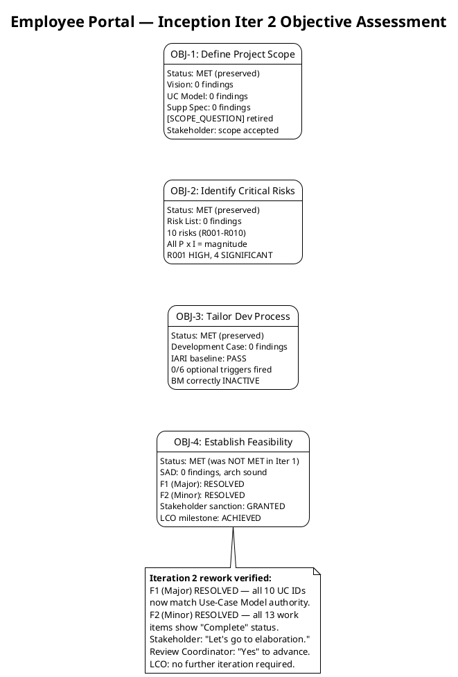
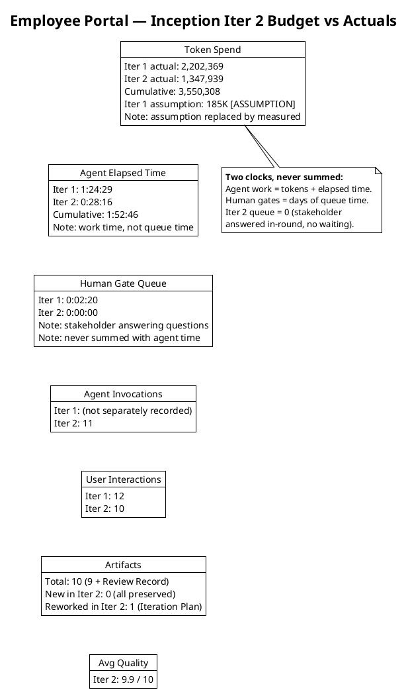
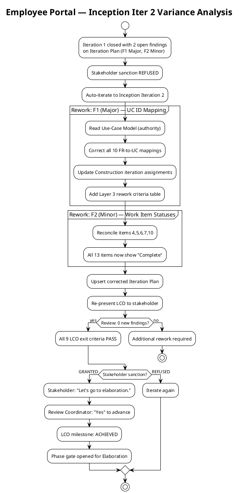
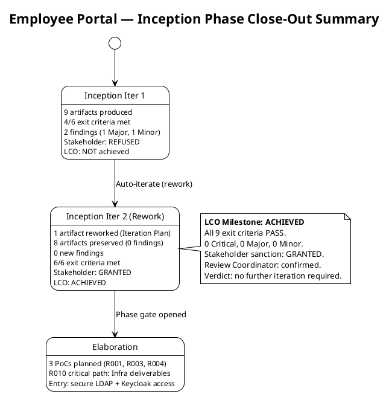

## Document Control

| Field | Value |
|---|---|
| Phase | Inception |
| Status | Draft |
| Milestone Target | End of Inception (LCO) |
| Iteration | 2 (Cycle 1) — Rework iteration |
| Date | 2026-09-01 |
| Review Coordinator Verdict | LCO: no further iteration required |
| Stakeholder Sanction | GRANTED — "Yes" to advancing past LCO; "Let's go to elaboration." |
| Review Coordinator Confirmation | "Yes" to advancing to next milestone; "Nothing else to add for this new phase." |
| Prior Iteration | 1 (Cycle 1) — 2 findings (1 Major, 1 Minor), both now RESOLVED |

## Iteration Objectives Reached

The Inception phase defined four objectives. Iteration 1 met objectives 1–3 but not objective 4 (Establish Feasibility), blocked by two Iteration Plan findings. Iteration 2 was a rework iteration that resolved both findings and achieved the LCO milestone. All four objectives are now MET.

### Objective 1 — Define Project Scope: **MET** (preserved from iteration 1)

| Evidence | Source |
|---|---|
| Vision Document produced with clear includes/excludes matching declared scope | Review Record — 0 findings (preserved) |
| Use-Case Model decomposes all 10 FRs into UC-001–UC-010 with sources cited | Review Record — 0 findings (preserved) |
| Supplementary Specification covers all 5 NFRs, FURPS+ categorized, cross-cutting mechanisms correctly placed | Review Record — 0 findings (preserved) |
| [SCOPE_QUESTION] on offline clocking retired by stakeholder confirmation | Stakeholder answer: "Yes" — architectural concern, not scope |
| Stakeholder confirmed scope accepted | Stakeholder: "Scope and objectives: accepted. They are not in question." |

### Objective 2 — Identify Critical Risks: **MET** (preserved from iteration 1)

| Evidence | Source |
|---|---|
| Risk List produced with 10 risks (R001–R010), all classified P × I = magnitude | Review Record — 0 findings (preserved) |
| R001 (AD LDAP) classified HIGH (P=3, I=3) — highest magnitude | Risk List |
| 4 SIGNIFICANT risks (R002, R003, R004, R010), 5 MODERATE risks (R005–R009) | Risk List |
| Mitigation + contingency defined for all 10 risks | Risk List |
| R010 (Infra availability) identified as critical-path blocker for Elaboration PoCs | Test Evaluation Summary — infrastructure needs assessment |

### Objective 3 — Tailor Development Process: **MET** (preserved from iteration 1)

| Evidence | Source |
|---|---|
| Development Case conforms to IARI baseline with no forbidden overrides | Review Record — LCO-6: PASS (preserved) |
| 0 of 6 optional triggers fired; all justified per DC §5.2 | Review Record — optional trigger audit: PASS (preserved) |
| Business Modeling correctly classified INACTIVE (not business-process-led) | Review Record — DC §4 classification evidence (preserved) |
| Role roster, ownership, CORE artifacts all verified | Review Record — compliance matrix: PASS (preserved) |

### Objective 4 — Establish Feasibility: **MET** (was NOT MET in iteration 1)

| Evidence | Source |
|---|---|
| SAD draft produced — 9 components, 3 ADRs, candidate architecture proportional to 200-user scope | Review Record — LCO-5: PASS, 0 findings (preserved) |
| PoC plan for R001/R003/R004 defined in SAD | SAD + Test Evaluation Summary |
| F1 (Major) RESOLVED — all 10 FR-to-UC mappings corrected to match Use-Case Model authority | Review Record — F1 (ManagementReviewer): RESOLVED via `resolve_artifact_finding` |
| F2 (Minor) RESOLVED — all 13 work item statuses reconciled to "Complete" | Review Record — F2 (ManagementReviewer): RESOLVED via `resolve_artifact_finding` |
| Zero new findings this iteration | Review Record — "Zero new findings. All 9 reviewed artifacts pass all LCO exit criteria." |
| Stakeholder sanction GRANTED | Stakeholder: "Yes" — "Let's go to elaboration." |
| Review Coordinator confirmed | "Yes" to advancing to next milestone; "Nothing else to add for this new phase." |
| LCO milestone ACHIEVED | Review Coordinator: "LCO: no further iteration required" |

**Root cause of iteration 1 failure (resolved):** The Iteration Plan assumed a sequential FR-001→UC-001 mapping that the Use-Case Model (the authority) does not use. This propagated incorrect UC references into Construction iteration assignments. Additionally, work items 4, 5, 6, 7, and 10 showed "Pending" status while their artifacts existed as Draft. Both defects were corrected in iteration 2 and verified by the Management Reviewer and Reviewer lenses.

## Adherence to Plan

### Budget vs Actuals

| Metric | Iter 1 Actual | Iter 2 Actual | Cumulative | Notes |
|---|---|---|---|---|
| Token spend | 2,202,369 | 1,347,939 | 3,550,308 | Iter 2 was rework-only: 1 artifact corrected, 8 preserved |
| Agent elapsed time | 1:24:29 | 0:28:16 | 1:52:46 | Work time — never summed with queue time |
| Human gate queue time | 0:02:20 | 0:00:00 | 0:02:20 | Stakeholder answered in-round; no waiting this iteration |
| Agent invocations | — | 11 | 11 | — |
| User interactions | 12 | 10 | 22 | — |
| Artifacts produced | 9 | 0 (new) | 9 | Iter 2 reworked 1, preserved 8 |
| Artifacts reworked | 0 | 1 (Iteration Plan) | 1 | F1 + F2 corrections |
| Avg quality score | — | 9.9 / 10 | — | Reviewer-assessed across all artifacts |

**Variance analysis:** Iteration 2 consumed 1,347,939 tokens — 61% of iteration 1's spend — for a rework scope of one artifact. This reflects the cumulative reasoning cost of re-reading the Use-Case Model (authority), the Iteration Plan (target), and the Review Record (findings), then producing the corrected plan. The rework was not a simple find-and-replace: it required cross-referencing all 10 FR-to-UC mappings, updating Construction iteration assignments, adding a Layer 3 rework criteria table, and reconciling 13 work item statuses. The measured actual replaces the prior assumption for all Elaboration forecasts.

**Two clocks, never summed:** Agent work consumed 0:28:16 of elapsed time. Human gate queue time was 0:00:00 — the stakeholder answered in-round with no waiting. These two clocks are reported side by side and never added.

### Work Item Status Reconciliation (Iteration 2)

All 13 work items now show "Complete" status, reconciled against the repository. The F2 finding (items 4, 5, 6, 7, 10 showed "Pending") is resolved.

| # | Work Item | Iter 1 Status | Iter 2 Status | Finding |
|---|---|---|---|---|
| 1 | Risk List | Complete | Complete (Draft) | — |
| 2 | Development Case | Complete | Complete (Draft) | — |
| 3 | Tool environment config | Complete | Complete | — |
| 4 | Vision Document | Pending ❌ | Complete (Draft) ✅ | F2 RESOLVED |
| 5 | Use-Case Model | Pending ❌ | Complete (Draft) ✅ | F2 RESOLVED |
| 6 | Supplementary Specification | Pending ❌ | Complete (Draft) ✅ | F2 RESOLVED |
| 7 | Software Architecture Document | Pending ❌ | Complete (Draft) ✅ | F2 RESOLVED |
| 8 | Design Model | Pending | Complete (Draft) | — |
| 9 | Project skeleton | Pending | Complete | — |
| 10 | Test strategy | Pending ❌ | Complete (Draft) ✅ | F2 RESOLVED |
| 11 | Repository configuration | Pending | Complete | — |
| 12 | Iteration Plan | In progress (with defects) | Complete (Draft, corrected) ✅ | F1 RESOLVED |
| 13 | LCO readiness assessment | Pending | Complete (this artifact) ✅ | — |

## Use Cases and Scenarios Implemented

No use cases were implemented as running features in this iteration — Inception produces analysis and architecture artifacts, not executable code. All 10 UCs (UC-001–UC-010) were analyzed in the Use-Case Model and addressed at the architecture level in the SAD draft.

**F1 resolution verified:** The Iteration Plan's "Use Cases and Scenarios Addressed" table now maps all 10 FR-to-UC pairs correctly per the Use-Case Model (the authority):

| FR ID | Correct UC ID (per Use-Case Model) | Iter 1 Had | Iter 2 Status |
|---|---|---|---|
| FR-001 | UC-005 | UC-001 ❌ | UC-005 ✅ |
| FR-002 | UC-006 | UC-002 ❌ | UC-006 ✅ |
| FR-003 | UC-007 | UC-003 ❌ | UC-007 ✅ |
| FR-004 | UC-001 | UC-004 ❌ | UC-001 ✅ |
| FR-005 | UC-002 | UC-005 ❌ | UC-002 ✅ |
| FR-006 | UC-008 | UC-006 ❌ | UC-008 ✅ |
| FR-007 | UC-003 | UC-007 ❌ | UC-003 ✅ |
| FR-008 | UC-009 | UC-008 ❌ | UC-009 ✅ |
| FR-009 | UC-010 | UC-009 ❌ | UC-010 ✅ |
| FR-010 | UC-004 | UC-010 ❌ | UC-004 ✅ |

All 10 rows corrected. Construction iteration assignments referencing UC IDs also updated. A Layer 3 rework criteria table was added to the Iteration Plan to verify the corrections.

## Results Relative to Evaluation Criteria

The Iteration Plan defined 6 exit criteria for Inception. In iteration 1, criteria 4 and 6 were NOT MET. In iteration 2, both are now MET.

| # | Exit Criterion | Iter 1 Result | Iter 2 Result | Evidence |
|---|---|---|---|---|
| 1 | Risk List produced with all risks classified (P × I = magnitude) and mitigation/contingency defined | MET | MET (preserved) | Risk List — 10 risks, all classified, 0 findings |
| 2 | Coarse cross-iteration roadmap defined with milestone sequence | MET | MET (preserved) | Iteration Plan — 7 iterations, 4 milestones (LCO, LCA, IOC, PR) |
| 3 | Iteration budget box defined with per-work-item token allocation | MET | MET (preserved) | Work Items table — 13 items, each with owner and budget |
| 4 | All 10 FRs traced to planned use cases and implementation iterations | **NOT MET** | **MET** ✅ | F1 RESOLVED — all 10 FR-to-UC mappings now match Use-Case Model authority; Construction assignments corrected |
| 5 | All 5 ACs accounted for with deferral or closure evidence | MET | MET (preserved) | Evaluation Criteria Layer 1 — AC-001 through AC-005 all listed with deferral targets |
| 6 | LCO readiness assessed | **NOT MET** | **MET** ✅ | LCO milestone ACHIEVED — 0 open findings, stakeholder sanction GRANTED, Review Coordinator confirmed |

**Score: 6 of 6 exit criteria met.** All criteria now pass. The LCO milestone is achieved.

### Layer 3 — Rework Criteria Verification (Iteration 2)

| # | Rework Criterion | Result | Evidence |
|---|---|---|---|
| R1 | F1 (Major) resolved: All 10 FR-to-UC mappings match the Use-Case Model | **PASS** ✅ | "Use Cases and Scenarios Addressed" table cross-checked against Use-Case Model — all 10 rows correct |
| R2 | F2 (Minor) resolved: Work item statuses reconciled against repository | **PASS** ✅ | All 13 work items show "Complete" status; 10 artifacts exist as Draft in repository |
| R3 | Construction iteration assignments reference correct UC IDs | **PASS** ✅ | Implementation Iteration column verified against corrected UC IDs |
| R4 | Evaluation Criteria UC references corrected | **PASS** ✅ | AC-001→UC-001, AC-002→UC-008, AC-003→UC-004 verified against Use-Case Model |

## Test Results

No test execution occurred in this iteration — Inception produces no executable code beyond the bootstrap skeleton. The Test Evaluation Summary records the quality baseline (preserved from iteration 1, verified green in iteration 2):

| Metric | Value | Source |
|---|---|---|
| CI build status (main) | ✅ Success | `scm_get_build_status` — 2026-09-01 |
| CI build duration | ~66 seconds | `scm_get_build_status` — 2026-09-01 |
| Open defects (SCM issues) | 0 | SCM issue tracker — 2026-09-01 |
| Use cases defined | 10 (UC-001–UC-010) | Use-Case Model |
| Acceptance criteria mapped | 5/5 (AC-001–AC-005) | Test Evaluation Summary |
| Risks identified | 10 (R001–R010) | Risk List |
| PoCs planned for Elaboration | 3 (R001, R003, R004) | SAD |
| Avg artifact quality | 9.9 / 10 | Review Record — iteration 2 |

**Test Evaluation Mission verdict: ACHIEVED** (preserved) — all 5 mission objectives met (risk prioritization, UC-to-AC coverage mapping, infrastructure needs assessment, quality baseline recording, Elaboration test strategy outline).

**Critical path for Elaboration:** R010 (Infrastructure Team availability) blocks 2 of 3 Elaboration PoCs. LDAP read access and Keycloak client registration must be secured from STK-004 before Elaboration Iteration 1.

## External Changes

No external changes were recorded during this iteration. The stakeholder confirmed: "Nothing else to add for this new phase." No new requirements, no scope changes, no additional priorities.

The [SCOPE_QUESTION] on the offline clocking persistence mechanism was retired in iteration 1 by stakeholder confirmation: the mechanism is an architectural concern for the Software Architect in Elaboration, not a missing scope item.

## Rework Required

**None.** All findings from both lenses (Reviewer and ManagementReviewer) are resolved. Zero new findings this iteration. The LCO milestone is achieved with 0 Critical, 0 Major, and 0 Minor open defects.

### Lessons Learned

1. **UC ID authority (reinforced):** The Use-Case Model is the authority for UC identifiers. The Iteration Plan must reference UC IDs as assigned by the System Analyst — never assume a sequential FR-to-UC mapping. This traceability discipline failure cost one full rework iteration. Future Iteration Plans must cross-check UC IDs against the Use-Case Model before first upsert.

2. **Work item status hygiene (reinforced):** Work item statuses must be reconciled against the repository at iteration close. Stale "Pending" statuses for produced artifacts misrepresent project state and erode trust in the plan as a tracking instrument.

3. **Token spend calibration:** The cumulative Inception spend is 3,550,308 tokens across two iterations. Iteration 2 (rework) consumed 61% of iteration 1's spend despite touching only 1 artifact — the reasoning cost of re-reading and cross-referencing dominates, not the volume of output. This measured shape replaces all assumed budget boxes for Elaboration forecasts.

4. **Rework iterations are efficient but not free:** The rework iteration resolved both findings with zero new defects and achieved the milestone. However, it consumed 1,347,939 tokens and 0:28:16 of agent time. Earlier cross-checking against the Use-Case Model would have avoided this cost entirely.

5. **Stakeholder sanction is a hard gate (confirmed):** The stakeholder accepted scope and objectives in iteration 1 but correctly refused to sanction advance because the Iteration Plan did not match the requirements baseline. In iteration 2, with both findings resolved, the sanction was granted. The LCO milestone is not a formality.

### Next Phase Adjustments (Elaboration)

| Adjustment | Rationale |
|---|---|
| Secure STK-004 deliverables before Elaboration Iter 1 | R010 blocks 2/3 PoCs — LDAP access and Keycloak client registration are critical path |
| Budget Elaboration from measured Inception actuals (3,550,308 tokens cumulative) | Measured actuals replace assumptions per budget-box discipline |
| Cross-check all UC IDs against Use-Case Model in Elaboration Iteration Plan | Prevent recurrence of F1 — traceability discipline |
| Schedule R001 PoC as first Elaboration priority | Only HIGH-magnitude risk; drives directory test case design |
| Schedule R003 and R004 PoCs in Elaboration Iter 1 | Both SIGNIFICANT; both depend on R010 deliverables |
| No scope changes | Stakeholder confirmed: scope accepted, nothing to add |

## Traceability

| Element | Traces From | Link Type | Traces To |
|---|---|---|---|
| Iteration Assessment (this) | Iteration Plan, Review Record, Test Evaluation Summary | Reviews | Elaboration Iteration Plan |
| OBJ-1 (Scope) | Vision, Use-Case Model, Supplementary Specification | Derives | LCO-1 (Scope Agreement) |
| OBJ-2 (Risks) | Risk List (R001–R010) | Derives | LCO-2 (Risk Identification) |
| OBJ-3 (Dev Process) | Development Case | Derives | LCO-6 (DC Conformance) |
| OBJ-4 (Feasibility) | SAD, Iteration Plan | Derives | LCO-3 (Feasibility), LCO-8 (Traceability), LCO-9 (Work Item Status) |
| F1 resolution | Iteration Plan — UC ID mapping | Derives | Use-Case Model (authority for UC IDs) |
| F2 resolution | Iteration Plan — Work Items table | Derives | All produced Draft artifacts (status reconciliation) |
| Token spend actual (3,550,308 cumulative) | Measured by system | Replaces | Budget box assumption (185K) for Elaboration forecasts |
| Test baseline | Test Evaluation Summary | Derives | Elaboration test strategy |
| Elaboration entry conditions | R001, R003, R004, R010 | DependsOn | Elaboration Iteration 1 Plan |
| Stakeholder sanction (Iter 2) | Stakeholder answer: "Yes" / "Let's go to elaboration." | Authorizes | Phase transition: Inception → Elaboration |
| Review Coordinator confirmation | "Yes" to advancing to next milestone | Confirms | Phase transition: Inception → Elaboration |