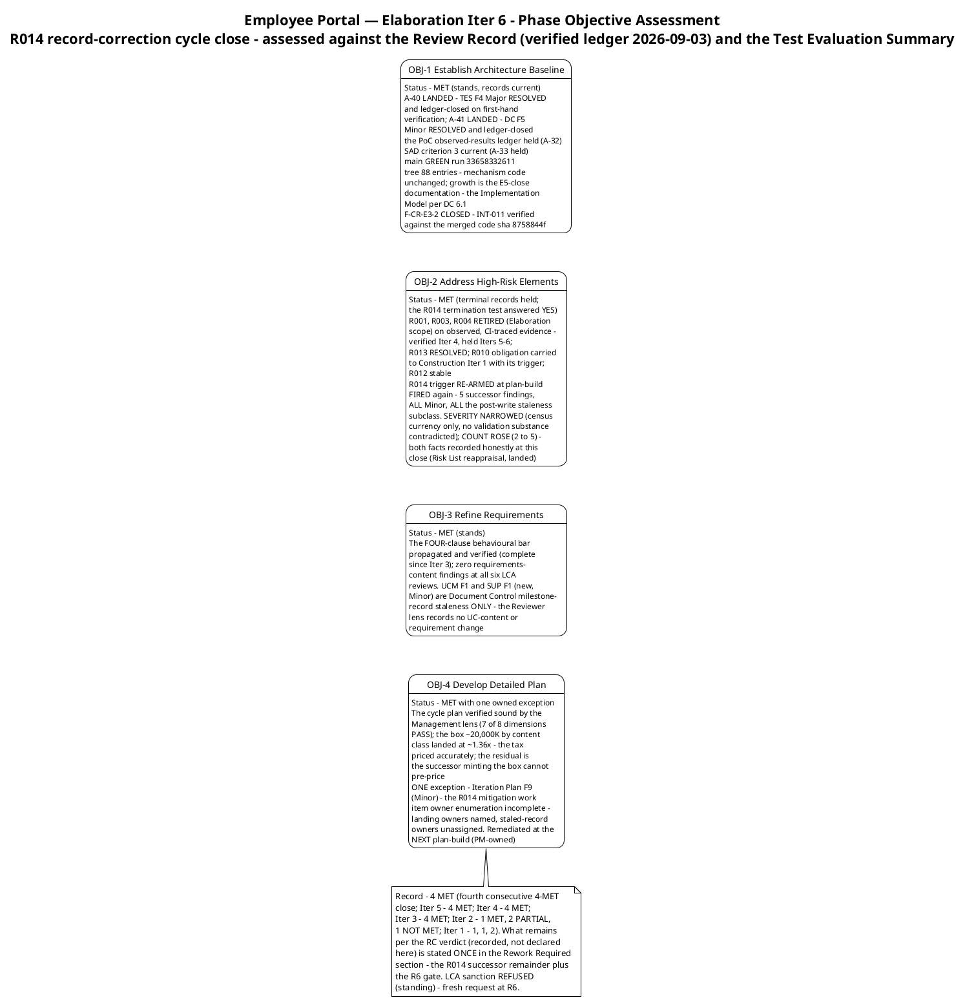
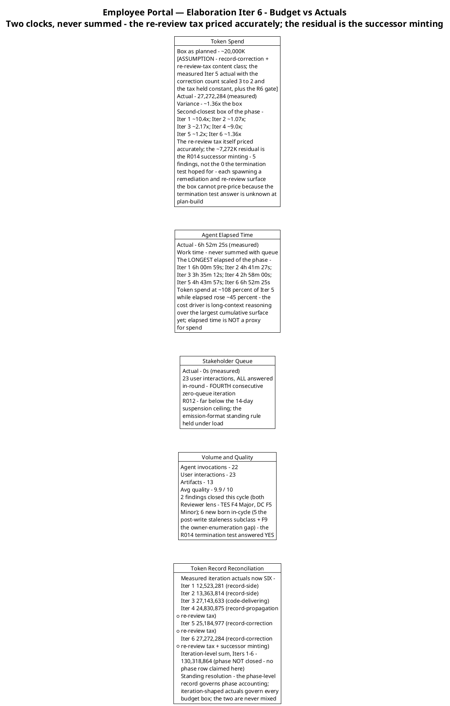
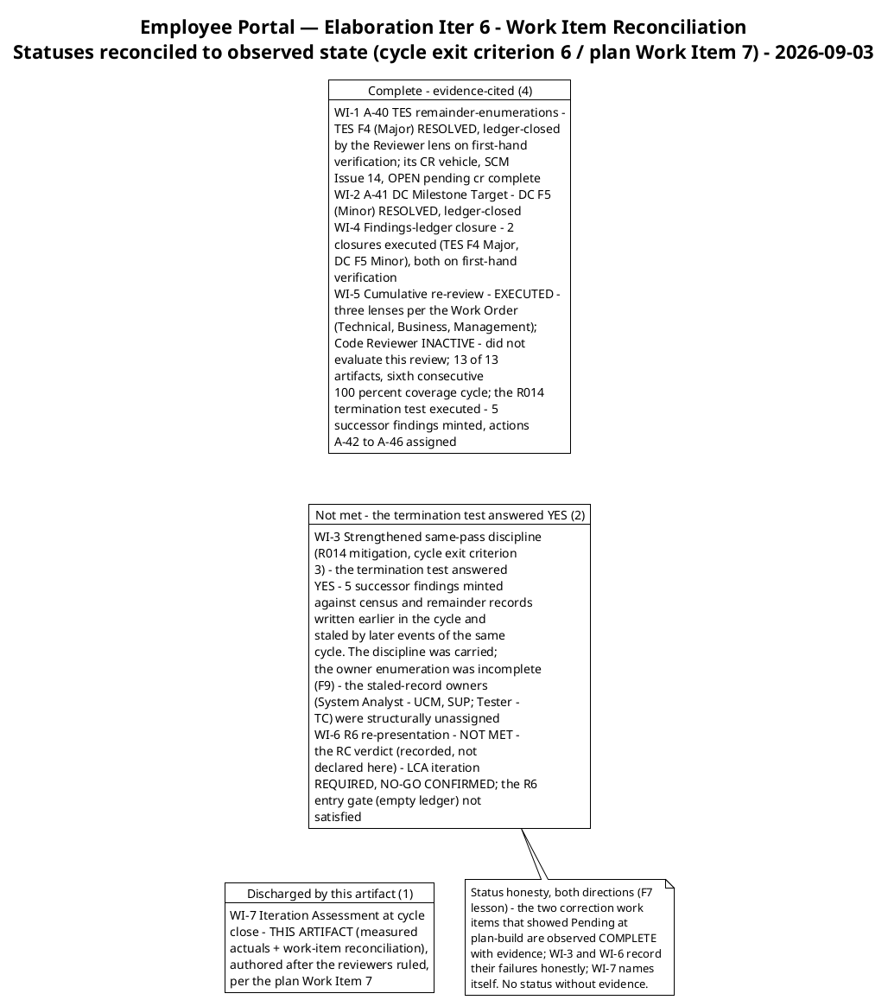
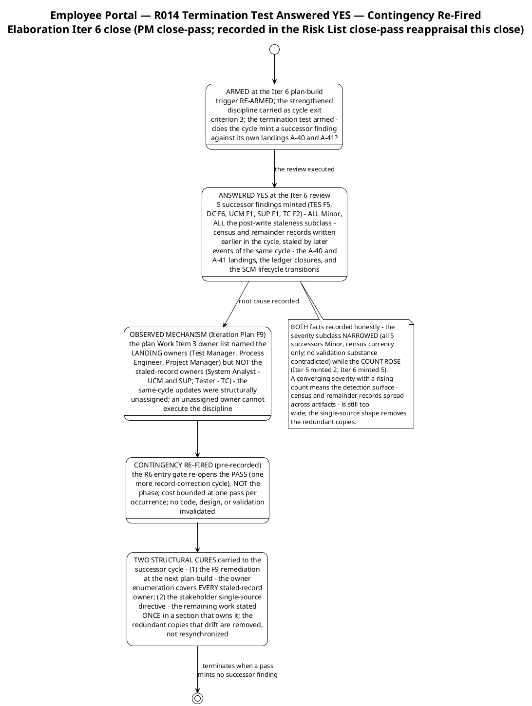
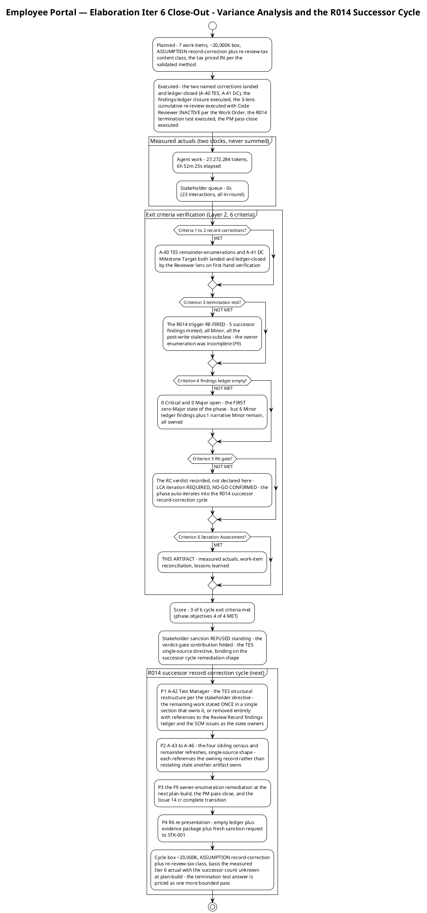

# Iteration Assessment

## Document Control

| Field | Value |
|---|---|
| Phase | Elaboration |
| Status | Draft — Elaboration Iteration 6 (Cycle 1) close-out record; EVOLVED from the Iter 5 close-out, not recreated |
| Milestone Target | End of Elaboration (LCA) — **NOT achieved this cycle; NOT declared by this assessment** (the milestone verdict is the Review Coordinator's, already issued) |
| Iteration | 6 (Cycle 1) — R014 record-correction cycle |
| Date | 2026-09-03 |
| Review Coordinator Verdict (recorded, not declared here) | **LCA: iteration REQUIRED (scope incomplete)** — NO-GO CONFIRMED; `requiresIteration: TRUE`. The cycle's two named corrections BOTH landed and ledger-closed (A-40 — TES F4, the one Major; A-41 — DC F5, the one Minor; 2 closures, both Reviewer-lens on first-hand verification); the two Work Order CRs remain DISCHARGED (since Iter 5); **zero Critical open (fourth consecutive cycle) and zero Major open (the FIRST zero-Major state of the Elaboration phase)**. The R014 termination test ANSWERED YES: 5 successor findings minted (TES F5, DC F6, UCM F1, SUP F1, TC F2 — actions A-42…A-46), ALL Minor, ALL the post-write staleness subclass, plus Iteration Plan F9 (the owner-enumeration gap, Management lens) and 1 narrative Minor (F-CR-E3-1, Construction-scope with recorded owner). Issue #14 OPEN (cr:approved, assigned:test-manager — the CR vehicle for the ledger-closed TES F4/A-40). The phase auto-iterates into the **R014 successor record-correction cycle**. The complete remainder is stated ONCE in § Rework Required (per the stakeholder's binding single-source directive) |
| Stakeholder Sanction (standing) | **REFUSED** at the Iter 1 LCA review — binding directive, verbatim: "Please fix all the findings even if they are minors prior to move to next phase"; escalation resolution, verbatim: "Fix all the issues and close all findings"; Iter 4 reinforcement, verbatim: "Close all findings and issues opened"; Iter 5 reinforcement, verbatim: "No, please fix all findings". **Iter 6 verdict-gate contribution — ANSWERED and folded (2026-09-03): the TES single-source directive, binding on the successor cycle's remediation shape** — recorded verbatim in § External Changes; it reframes A-42 into the structural restructure and extends the single-source principle to A-43…A-46. Fresh sanction request fires at R6 |
| Prior Version | Elaboration Iteration 5 close-out (2026-09-02); Iteration 4 close-out; Iteration 3 close-out; Iteration 2 close-out; Iteration 1 close-out (2026-09-01); Inception Iteration Assessment (Approved at LCO — mission ACHIEVED); EVOLVED, not recreated. Prior records are preserved in SCM history |
| Elaboration Changes (Iter 6 close-out) | 4 phase objectives assessed — **4 MET** (fourth consecutive 4-MET close); **3 of 6 cycle exit criteria met** (criteria 1–2 and 6 MET; the termination test, the ledger-empty condition, and the R6 gate NOT MET); measured actuals recorded (27,272,284 tokens; agent 6:52:25; stakeholder queue 0:00:00 across 23 interactions — never summed); budget variance recorded honestly: **~1.36× the ~20,000K box — the second-closest box of the phase; the re-review tax priced accurately, the residual is the successor minting the box cannot pre-price**; work items reconciled to observed state (4 Complete, 2 Not met, 1 discharged by this artifact); 2 findings closed this cycle / 6 new born in-cycle (the R014 termination test answered YES — severity NARROWED, count ROSE, both recorded honestly); lessons learned + successor-cycle adjustments (box ~20,000K; the single-source directive and the F9 owner enumeration as the two structural cures) |

## Iteration Objectives Reached

The phase planned four objectives. Assessed against the Review Record (verified findings ledger, 2026-09-03: 0 Critical / 0 Major / 6 Minor + 1 narrative) and the Test Evaluation Summary (mission verdict: VALIDATION SUBSTANCE ACHIEVED — OBSERVED, correct and unchanged), the record is: **4 MET** — the phase objectives stand MET on observed evidence, the cycle delivered both of its named corrections, and the phase reached its first zero-Major state. What the RC verdict calls "scope incomplete" is the cycle's own exit criteria 3, 4 and 5 (the termination test, the empty-ledger condition, and the R6 gate) — the complete remainder is stated ONCE in § Rework Required, not restated here.

**Objective 1 — Establish Architecture Baseline: MET (stands, records current).** The architecture has been stable as record AND evidence since Iter 3; this cycle closed the last two record defects against it: A-40 (TES F4, the one Major — the mission-verdict record's remainder-enumerations corrected from the observed same-pass landings) and A-41 (DC F5 — the Milestone Target corrected to the observed state), both ledger-closed by the Reviewer lens on first-hand verification. The PoC observed-results ledger (A-32) and the SAD criterion-3 record (A-33) held; main CI GREEN run 33658332611; the tree grew to 88 entries with the mechanism code unchanged (the growth is the E5-close documentation — the reverse-engineered Implementation Model per DC §6.1, merged as PR #10 under APPROVED). F-CR-E3-2 CLOSED by the Code Reviewer lens at Iter 6 (INT-011 verified against the merged code sha 8758844f).

**Objective 2 — Address High-Risk Elements: MET (terminal records held; the R014 termination test answered YES).** R001/R003/R004 remain RETIRED (Elaboration scope) on observed, CI-traced evidence — verified at Iter 4, held at Iters 5–6; R013 RESOLVED; R010's obligation carried to Construction Iter 1 with its own trigger; R012 stable (fourth consecutive zero-queue iteration). The risk-management event of this cycle is R014's second firing, and it is recorded with BOTH facts honestly: the severity subclass NARROWED (all 5 successors Minor, census currency only — no validation substance contradicted) while the COUNT ROSE (2 → 5). The observed mechanism is F9 — the plan's mitigation work item never assigned the owners of the records the landings would stale. The close-pass reappraisal (landed in the Risk List this close) records the firing, the re-fired contingency, and the two structural cures.

**Objective 3 — Refine Requirements: MET (stands).** The FOUR-clause behavioural bar remains propagated and verified (complete since Iter 3); zero requirements-content findings at all six LCA reviews. The two new requirements-artifact findings (UCM F1, SUP F1 — Minor) are Document Control milestone-record staleness ONLY; the Reviewer lens records no UC-content or requirement change. No requirements work was owed by a record-correction cycle, and none was invented.

**Objective 4 — Develop Detailed Plan: MET with one owned exception.** The cycle plan was verified sound by the Management lens (7 of 8 planning dimensions PASS; the lens ledger EMPTY at S_RECONCILE, re-verified first-hand). The box (~20,000K by content class, the re-review tax priced IN) landed at ~1.36× — the second-closest box of the phase; the tax itself was priced accurately, and the residual is the successor minting the box cannot pre-price (see Adherence to Plan). The one exception is mine: **Iteration Plan F9 (Minor)** — the R014 mitigation work item's owner enumeration named the landing owners but not the staled-record owners, so the same-cycle updates were structurally unassigned. Remediated at the NEXT plan-build (see § Rework Required).

## Adherence to Plan

| Metric | Planned | Actual (measured) | Notes |
|---|---|---|---|
| Token spend | ~20,000K box (work-item sum = box; the re-review tax priced IN) | 27,272,284 | ~1.36× the box — the second-closest of the phase; variance analysis below |
| Agent elapsed time | Measured at close | 6:52:25 | Work time; never summed with queue; the longest elapsed of the phase |
| Stakeholder queue | Estimate NONE (rule; R012 bound) | 0:00:00 | 23 interactions, ALL answered in-round; fourth consecutive zero-queue iteration; excludes the end-of-iteration approval gate |
| Agent invocations | — | 22 | Test Manager, Process Engineer, the review lenses + Review Coordinator, Project Manager |
| User interactions | — | 23 | All in-round |
| Artifacts | — | 13 | Inventory unchanged |
| Avg quality | — | 9.9 / 10 | Reviewer-assessed |

**Variance analysis (token spend ~1.36× the box): the tax priced accurately; the residual is the successor minting.** The ~20,000K box was sized per the validated method — (pass-specific work) + (the re-review tax, held constant) — and the tax itself was priced accurately. The ~7,272K residual is the R014 successor minting: the termination test answered YES with 5 findings, not the 0 the cycle hoped for, and each minted finding spawns a remediation, a re-review surface, and a coordinator tracker entry the box cannot pre-price because the test's answer is unknown at plan-build. The successor-cycle box prices the test as one more bounded pass — the contingency, not optimism, is the planning basis (see § Rework Required). The elapsed-time observation is recorded honestly a second time: 6:52:25 is the longest elapsed of the phase while token spend held at ~108% of Iter 5 — the cost driver is long-context reasoning over the largest cumulative surface yet, and elapsed time is NOT a proxy for spend.

**Token record reconciliation (conflict recorded, not fabricated):** measured iteration actuals now number SIX (12,523,281 / 13,363,814 / 27,143,633 / 24,830,875 / 25,184,977 / 27,272,284); the iteration-level sum for Iters 1–6 is 130,318,864 — recorded for iteration accounting only; the phase is NOT closed, so no phase row is claimed. The Work Order's phase-level Elaboration records differ from the iteration-level sums for the same iterations — the standing resolution holds: the phase-level record governs phase accounting; iteration-shaped actuals govern every budget box; the two are never mixed, and no per-iteration velocity is quoted from a phase-level record. When Elaboration closes, its recorded actuals replace every assumed share.

**Metrics with purpose (each answers a decision):**

| Goal (decision enabled) | Metric | Primitive measure |
|---|---|---|
| Track phase-closure progress cycle over cycle (decide whether the phase is converging on the R6 gate) | Cycle exit criteria met | 3 of 6 this cycle (Iter 5: 5 of 8; Iter 4: 6 of 8; Iter 3: 10 of 14; Iter 2: 6 of 13; Iter 1: 3 of 8) — the three unmet are the termination test, the ledger-empty condition, and the R6 gate itself |
| Size the next box from fact, by content class including the re-review tax | Token spend actual | 27,272,284 (system-measured) — the record-correction + re-review-tax + successor-minting class's first data point |
| Bound the human-gate queue risk (R012) and verify emission discipline under sustained load | Stakeholder queue time | 0:00:00 across 23 interactions (system-measured) — all in-round; fourth consecutive zero-queue iteration |
| Locate defect concentration for the successor cycle's critical path | Open findings by severity × artifact | Verified ledger: 0 Critical (held, fourth consecutive cycle), 0 Major (the FIRST zero-Major state of the phase), 6 Minor (5 the post-write staleness subclass + F9) + 1 narrative (F-CR-E3-1, Construction scope) — all record-currency class |
| Verify the review process is not deteriorating (rigor check) | Closures vs new findings; recurrence | 2 closed / 6 new (net +4 — the first net increase of the phase, driven by the termination test's YES); recurrence 0 of 2 — fourth consecutive zero; severity profile 4 Critical → 2 → 0 → 0 → 0 → 0 held; the minting COUNT rose (2 → 5) while the subclass NARROWED — both recorded honestly |
| Confirm defects concentrate in records, not the validated baseline (protects the baseline from rework) | Avg artifact quality | 9.9 / 10 (reviewer-assessed) |

### Work Item Reconciliation (statuses reconciled to observed state — cycle exit criterion 6 / plan Work Item 7)

**Status honesty, both directions (F7 lesson):** the two correction work items that showed "Pending" at plan-build (WIs 1–2) are observed COMPLETE with evidence cited; WI-4's closure work executed (2 ledger closures on first-hand verification — the ledger-empty CONDITION failed, but the closure WORK ITEM delivered what it owned); WI-5 executed with the participation the Work Order itself specified (3 lenses; Code Reviewer INACTIVE — recorded as INACTIVE, never as a verdict; coverage still 13 of 13 via the verified ledger sweep — the plan's "4-lens" label is corrected by the observed authoritative participation); WI-3 and WI-6 record their failures honestly with the blocking evidence named; WI-7 is discharged by this artifact. A status that cannot show evidence reverts to In progress, never to Complete — and a status that HAS evidence must not understate it either.

## Use Cases and Scenarios Implemented

**No use case was implemented or validated as a running feature this iteration** — the R014 record-correction cycle carried no use-case activity by design (record corrections only, per the stakeholder-confirmed R6 path). The phase's use-case validation record from Iters 1–3 stands unchanged:

| UC | Validation Record (Iters 1–3 — stands; no Iter 6 activity) | Status |
|---|---|---|
| UC-001 | R003 stub-issuer + R004 offline-drop mechanism validation — token matrix PASS; 5-minute drop simulation PASS (zero duplicates/losses, sync ≤ 60 s, confirmations < 1 s) | **VALIDATED — OBSERVED** |
| UC-004 | R001 FOUR-clause behavioural bar vs the disposable LDAP directory (gaps AND substitution attempts seeded deliberately) — every employee rendered, no hidden entries, no errors, no substitution | **VALIDATED — OBSERVED** |
| UC-005 | R001 bar (event row, blank display fields, clocking data always complete) — TC-021 PASS | **VALIDATED — OBSERVED** |
| UC-006 | R001 bar (CSV row, blank cells, no abort) — TC-022 PASS | **VALIDATED — OBSERVED** |
| UC-007 | R001 bar (employee locatable and selectable with blank fields) — TC-023 PASS | **VALIDATED — OBSERVED** |
| UC-010 | Audit + soft-delete design complete (0 findings); TC-013…TC-016 BLOCKED — recorded SCOPE decision (news/audit mechanisms are Construction scope) | Design complete; execution deferred |
| UC-002, UC-003, UC-008, UC-009 | Analysis complete (Use-Case Model 10/10 FULL, 0 content findings at all six LCA reviews); featured-banner contract settled (banners STACK, newest first) | Analysis level; Construction |

All 10 UCs remain refined at the analysis level; implementation of running features is Construction work per the baselined schedule (Iter 1 clocking cluster, Iter 2 news cluster, Iter 3 directory + export). The Construction assignments are unchanged this cycle.

## Results Relative to Evaluation Criteria

### Layer 1 — Declared Acceptance Criteria (all 5 accounted; unchanged — no AC is addressed by record correction itself)

| AC | Status | Evidence / Deferral |
|---|---|---|
| AC-001 | Partial evidence — OBSERVED (stands) | UC-001 mechanisms validated empirically (Iters 1–3); running feature is Construction Iter 1 |
| AC-002 | Not addressed (deferred) | Construction Iter 2 — UC-008 running feature |
| AC-003 | Partial evidence — OBSERVED (stands) | R001 FOUR-clause bar validated against the disposable directory; production-AD performance + data quality at Construction Iter 3 (R010 + R011) |
| AC-004 | Not addressed (deferred) | Transition Iter 1 — adoption measurement requires a deployed system (BG-003) |
| AC-005 | Partial evidence — OBSERVED (stands) | R004 5-minute drop simulation PASS; formal AC test at Construction Iter 1 |

### Layer 2 — Iteration 6 Cycle Exit Criteria (one line per criterion the plan carried — 3 of 6 MET)

| # | Exit Criterion | Result | Evidence |
|---|---|---|---|
| 1 | A-40 — TES remainder-enumerations updated from the observed same-pass landings (closes TES F4, Major) | **MET — verified** | TES F4 RESOLVED via resolve_artifact_finding (Reviewer lens, first-hand verification: every named location corrected; the mission verdict correct and unchanged); its CR vehicle, SCM Issue #14, is open pending its cr:complete transition |
| 2 | A-41 — Development Case Milestone Target corrected to the observed state (closes DC F5, Minor) | **MET — verified** | DC F5 RESOLVED — the Milestone Target corrected per the DC's own binding same-pass discipline, remainder re-verified against the verified findings ledger before upsert |
| 3 | Strengthened same-pass discipline applied to the cycle's OWN landings (R014 mitigation — the termination test) | **NOT MET** | The termination test ANSWERED YES: 5 successor findings minted (TES F5, DC F6, UCM F1, SUP F1, TC F2 — all Minor, all the post-write staleness subclass) against census and remainder records written earlier in the cycle. The discipline was carried and strengthened; the owner enumeration was incomplete (F9) — the staled-record owners were structurally unassigned |
| 4 | Findings ledger EMPTY across ALL lenses and ALL severities | **NOT MET** | 2 closures this cycle, but 6 new findings born of the cycle's own later events: 0 Critical / 0 Major (the first zero-Major state of the phase) / 6 Minor + 1 narrative Minor. All record-currency class, all owned (A-42…A-46 + F9 at the next plan-build) |
| 5 | R6 re-presentation with the evidence package + fresh sanction request | **NOT MET** | The RC verdict (recorded, not declared here): LCA iteration REQUIRED — NO-GO CONFIRMED, requiresIteration TRUE; the R6 entry gate (empty ledger) is not yet satisfied; LCA-5 remains the gate's own pending decision |
| 6 | Iteration Assessment at cycle close (measured actuals, work-item reconciliation) | **MET** | THIS ARTIFACT — authored after the reviewers ruled, per the plan's Work Item 7 |

**Score: 3 of 6.** The three unmet criteria are the R014 successor record-correction cycle's work — stated ONCE, with owners, in § Rework Required. Every remaining item is a record correction; none requires code, design, or new validation.

## Test Results

The formal test execution record stands unchanged from the Iteration 3 close (the execution authority): **15 PASS / 0 FAIL / 8 BLOCKED** across TC-001…TC-023, execution trace CI run 33617748483 — the 8 BLOCKED cases stated per the stakeholder's framing directive as **a recorded SCOPE decision — deferred to Construction, not missing**. This cycle's test-side activity was record correction, and it landed:

| Item | Result (this cycle) | Source |
|---|---|---|
| A-40 — TES remainder-enumerations | **LANDED** — every named location corrected from the observed same-pass landings; the mission verdict ("VALIDATION SUBSTANCE ACHIEVED — OBSERVED") correct and unchanged; TES F4 RESOLVED and ledger-closed | Review Record Iter 6 technical-lens verification |
| Regression baseline | **HELD** — no code entered the tree this cycle; the two baseline-close PRs merged since Iter 5 (#8 comment-only, #10 documentation-only) were verified APPROVED before merge with no product-surface change; the 15/0/8 baseline stands on main run 33658332611 | Review Record Iter 6 code-review-lens record |
| CI build status (main) | **Green** — run 33658332611 (completed 2026-09-02 17:01:01Z, post-PR-#10) | Review Record Iter 6 code-review-lens record |
| Open SCM issues | **1 open CR vehicle** — Issue #14 (cr:approved, assigned:test-manager — the CR vehicle for the LANDED, ledger-closed TES F4/A-40; awaits its cr:complete transition, owned by the assigned role + the CCM); Issues #1/#2/#9/#11/#12 all CLOSED cr:complete | Review Record Iter 6 technical-lens record |
| New test-side finding | **TES F5 (Minor, A-42 — Test Manager)** — stale SCM-issue census and transition-remainder enumerations vs the live tracker; **REFRAMED per the stakeholder's Iter 6 single-source directive into the structural restructure** (the remaining work stated ONCE in a section that owns it, or removed entirely with references to the owning records) | Review Record Iter 6 technical-lens + coordinator records |
| Fabricated results | None — every verdict cites its execution trace; no result is claimed beyond the Test Case authority's record | Test Case / TES records |

## External Changes

**No scope changes.** The declared scope (10 FRs, 5 NFRs, 5 ACs, 14 CONs) is unchanged; zero scope-creep findings across all review lenses, six iterations; R009 held by CCB enforcement.

**Stakeholder decision recorded this iteration (binding — incorporated):**

**Iter 6 verdict-gate contribution — the TES single-source directive, recorded verbatim:**

> "Stop remediating this artifact one location at a time. The defect is not the enumerations — it is that the Test Evaluation Summary states what remains in five places. Four consecutive iterations have fixed some copies and missed others (F1, F2, F3, F4, and now #14). It will not converge. State the remaining work ONCE, in a single section that owns it. Every other place that needs it — Milestone Target, the master-workflow diagram, the schedule — references that section instead of restating it. And consider whether the TES should enumerate remaining actions at all: that state already has an owner in the Review Record findings ledger and in the SCM issues. A document that copies someone else's state will drift from it forever."

Folded by the Review Coordinator (contribution cycle CLOSED; requiresIteration TRUE recorded immediately after): the diagnosis CONFIRMED against the verified ledger (the TES finding history F1/F2/F3/F4/F5 across Iters 2–6, all record-currency class; Issue #14 open); the answer does NOT change the verdict; it REFRAMES the successor cycle's remediation shape and is BINDING on it — A-42 reframed from a census refresh into the TES structural restructure; the single-source principle extended to A-43…A-46; the R014 class's termination condition gains its structural complement (F9's complete owner enumeration + the single-source shape). This assessment applies the same discipline to itself: the remainder is stated ONCE, in § Rework Required.

**Standing record (unchanged):** sanction REFUSED (Iter 1) with the binding all-findings directive; the R6 path CONFIRMED (Iter 3: "Yes") with the BLOCKED-cases framing directive — the 8 BLOCKED are a recorded SCOPE decision, deferred to Construction, not missing.

**Change Request status:** the two CRs in this Work Order — [Moderate] Architectural Proof-of-Concept and [Moderate] Test Evaluation Summary — remain **DISCHARGED** (since Iter 5, on the Reviewer lens's verified A-38/A-37 landings). Issue #14 is open solely as the CR vehicle for the ledger-closed TES F4/A-40 remediation — a lifecycle transition owned by the assigned role and the CCM, not corrective work.

## Rework Required

**THE REMAINDER — STATED ONCE (per the stakeholder's binding single-source directive; every other location in this artifact references this section):** the R014 successor record-correction cycle owns **(1) A-42 — the TES structural restructure** (Test Manager; the remaining work stated ONCE in a single section that owns it, or removed entirely with references to the Review Record findings ledger and the SCM issues as the state owners; every other TES location references that section and never restates it); **(2) A-43…A-46 — the four sibling census/remainder refreshes in single-source shape** (DC F6 — Process Engineer; UCM F1 and SUP F1 — System Analyst; TC F2 — Tester; each references the owning record rather than restating state another artifact owns); **(3) the F9 owner-enumeration remediation at the next plan-build** (Project Manager — every staled-record owner named); **(4) Issue #14's cr:complete transition** (assigned role + CCM); **(5) the PM pass-close reconciliation** (the successor cycle's Iteration Assessment + Risk List close-pass reappraisal); **(6) the R6 gate itself** (empty ledger + evidence package + fresh sanction request to STK-001). Every item is a record or gate action — none requires code, design, or new validation.

| # | Finding | Severity | Owner (Action) | Status |
|---|---|---|---|---|
| 1 | TES F5 — stale SCM-issue census and transition-remainder enumerations vs the live tracker | Minor | Test Manager (A-42 — **REFRAMED per the stakeholder directive into the structural restructure**) | OPEN — the successor cycle's P1 |
| 2 | DC F6 — Milestone Target items (1) and (4) stale vs the observed state | Minor | Process Engineer (A-43) | OPEN |
| 3 | UCM F1 — Document Control milestone record stale (A-40/A-41 claimed remaining; census claim stale) | Minor | System Analyst (A-44) — NO UC-content change | OPEN |
| 4 | SUP F1 — same Document Control record class as UCM F1 | Minor | System Analyst (A-45) — NO requirement/threshold/contract change | OPEN |
| 5 | TC F2 — Iter 6 verification record issue-census stale (#11/#12 recorded open, both CLOSED; #14 unmentioned) | Minor | Tester (A-46) — NO verdict change; the 15/0/8 baseline stands | OPEN |
| 6 | Iteration Plan F9 — the R014 mitigation work item's owner enumeration incomplete (landing owners named; staled-record owners unassigned) | Minor | Project Manager (next plan-build) | OPEN — mine; the structural cure |
| 7 | F-CR-E3-1 — interim IClockingsRepository vs INT-016 final contract | Minor (narrative) | Implementer (Construction Iter 1, R008) + Designer (INT-016 confirmation) | OPEN — Construction scope; [DEFERRED] marker carried |

**Risk-retirement record (verified, no change):** R001/R003/R004 RETIRED (Elaboration scope) on observed evidence; R013 RESOLVED; R010 NARROWED with the obligation carried to Construction Iter 1 with its own trigger; R012 measured 0:00:00 this iteration (fourth consecutive zero-queue). **R014's trigger RE-FIRED this cycle — recorded in the Risk List close-pass reappraisal (landed this close):**

### Variance Analysis

### Lessons Learned

1. **A document that copies someone else's state will drift from it forever — the single-source principle is now BINDING.** The stakeholder's diagnosis is confirmed by the ledger: four consecutive iterations fixed some copies and missed others (TES F1, F2, F3, F4, and now F5/#14). The cure is structural, not editorial: state the remaining work ONCE in the section that owns it; every other location references it. Applied to the TES first (A-42 reframed into the restructure), extended to the sibling remediations (A-43…A-46), and applied by this assessment to itself.
2. **An owner enumeration that names only the landing owners leaves the discipline structurally unassigned (F9).** The same-pass discipline was carried, strengthened with ledger re-verification, and still failed — because the plan's work item never assigned the owners of the records the landings would stale (System Analyst, Tester). A discipline without a complete owner list is a hope, not a commitment. The next plan-build's Work Item 3 names every staled-record owner.
3. **The termination test's answer is a budget variable — price it as a bounded contingency, not a hope.** The box priced the re-review tax accurately but could not pre-price the successor minting (5 findings; ~7,272K residual). The successor-cycle box prices the termination test as one more bounded pass — the pre-recorded contingency, not optimism, is the planning basis.
4. **Elapsed time is NOT a proxy for spend — confirmed a second time.** The longest elapsed of the phase (6:52:25) at ~108% of Iter 5's token spend; the driver is long-context reasoning over the largest cumulative surface yet. The two clocks stay separate in every report.
5. **Zero queue held a fourth consecutive iteration (23 interactions, all in-round).** The emission-format standing rule held under load; R012 remains far below the 14-day suspension ceiling — the in-round answering pattern is now the measured baseline for Construction's heavier consultation load.

### Next Iteration Adjustments (binding inputs to the R014 successor record-correction cycle)

| Adjustment | Rationale |
|---|---|
| **P1: A-42 — the TES structural restructure per the stakeholder's binding single-source directive** — the remaining work stated ONCE in a single section that owns it, or removed entirely with references to the Review Record findings ledger and the SCM issues as the state owners; every other TES location (Milestone Target, master-workflow diagram, schedule, Conclusions, recommendations) references that section and never restates it — closes TES F5 | The stakeholder's Iter 6 verdict-gate directive, verbatim and binding; the non-convergence diagnosis confirmed against the verified ledger |
| **P2: A-43…A-46 — the four sibling census/remainder refreshes in single-source shape** (DC F6 — Process Engineer; UCM F1, SUP F1 — System Analyst; TC F2 — Tester) — each references the owning record rather than restating state another artifact owns | The single-source principle extended to the sibling remediations per the folded directive; removes the redundant copies that drift |
| **P3: the F9 owner-enumeration remediation at the next plan-build** — the R014 mitigation work item's owner list covers EVERY owner whose artifact carries a remainder/census record the cycle's landings can stale (Test Manager, Process Engineer, System Analyst, Tester, Project Manager) + the PM pass-close + Issue #14's cr:complete transition | The observed mechanism of the termination test's YES answer; an unassigned owner cannot execute the discipline — the structural cure |
| **P4: R6 re-presentation with the evidence package and a fresh sanction request to STK-001** — entry gate: empty ledger (verified via the findings system) + evidence package (15 executed PASS + 8 deferred-by-scope-decision, zero FAIL) + corrections committed + the TES restructure verified as single-source + review materials distributed | The stakeholder-confirmed path; LCA-5 is the gate's own pending decision — a GRANTED sanction is the only path to phase transition and Construction entry |
| **Cycle budget box: ~20,000K** [ASSUMPTION — record-correction + re-review-tax content class; basis: the measured Iter 6 actual (27,272,284) with the successor count unknown at plan-build — the termination test answer is priced as one more bounded pass] | The validated sizing method applied, with the successor-minting lesson: the contingency, not optimism, is the planning basis |
| **Iteration Plan roll-forward at the next plan-build:** the R014 successor record-correction cycle becomes the CURRENT plan (coarse roadmap count 12 — Elaboration 7), built from these binding adjustments; Construction Iter 1 remains coarse-only until LCA sanction | The two-active-plans discipline; planning beyond the horizon in fine detail is waste. The count extension is minted by the R014 trigger re-firing — a registered risk event, never planning drift — and is justified against the risk profile exactly as the prior extensions were |
| No scope reduction | The successor-cycle scope is fully determined by the open findings, the stakeholder-confirmed R6 path, the standing all-findings directive, and the binding single-source directive; the box governs |

## Traceability

| Element | Traces From | Link Type | Traces To |
|---|---|---|---|
| Iteration Assessment (this, Elaboration Iter 6) | Iteration Plan (Elab Iter 6 — objectives 1–4, cycle exit criteria 1–6, box ~20,000K, Work Item 7); Review Record (Iter 6 consolidated disposition — RC verdict NO-GO CONFIRMED / requiresIteration TRUE; verified ledger 0 Critical / 0 Major / 6 Minor + 1 narrative; A-40/A-41 landed and ledger-closed; the termination test answered YES; actions A-42…A-46 + F9 assigned; the stakeholder single-source directive folded verbatim); Test Evaluation Summary (Iter 6 — mission verdict VALIDATION SUBSTANCE ACHIEVED — OBSERVED, correct and unchanged; A-40 landed; TES F5 the reframed Minor); Risk List (Iter 6 close-pass reappraisal — landed this close); Work Order measured facts (27,272,284 tokens; 6:52:25 agent; 0:00:00 queue; 22 invocations; 23 interactions; 13 artifacts; 9.9 quality) | Reviews | The R014 successor record-correction cycle (A-42…A-46 + F9 + Issue #14 transition + PM pass-close + the R6 gate); the next Iteration Plan roll-forward; Construction Iter 1 plan (built at LCA sanction) |
| OBJ-1 assessment (Architecture Baseline — MET, records current) | TES F4 closure (A-40 — first-hand verification, every named location corrected); DC F5 closure (A-41); the held records (PoC A-32; SAD criterion 3 A-33); main GREEN run 33658332611; the 88-entry tree (mechanism code unchanged; growth = the E5-close Implementation Model per DC §6.1, PR #10 APPROVED); F-CR-E3-2 closure (Code Reviewer lens, INT-011 vs merged code sha 8758844f) | Reviews | The R6 evidence package (internally consistent in its validation substance) |
| OBJ-2 assessment (High-Risk Elements — MET, termination test answered YES) | Risk List close-pass reappraisal (this close — R014 second firing recorded with BOTH facts; contingency re-fired; two structural cures); the terminal retirement records (R001/R003/R004 RETIRED, R013 RESOLVED — verified Iter 4, held Iters 5–6); R012 measured 0:00:00 across 23 interactions | Reviews | R011 (production residuals, Construction); the R014 successor cycle; Construction Iter 1 (R010 trigger; AC-005 formal test) |
| OBJ-4 assessment (Detailed Plan — MET with one owned exception) | The ~20,000K box vs the measured 27,272,284 (~1.36× — the second-closest of the phase); the Management lens's Iter 6 verification (7 of 8 dimensions PASS; lens ledger EMPTY at S_RECONCILE); Iteration Plan F9 (the owner-enumeration gap — PM-owned, remediated at the next plan-build) | Reviews | The successor-cycle box (~20,000K); the F9 remediation; Construction sizing (inherits the validated method) |
| Budget variance analysis (the residual is the successor minting) | Work Order measured actuals (27,272,284); the box's basis (record-correction + re-review-tax class, the tax priced IN); the six-iteration variance series (~10.4× / ~1.07× / ~2.17× / ~9.0× / ~1.2× / ~1.36×); the termination test's YES answer (5 successors) | DependsOn | Every later budget box (pass-specific work + the re-review tax + the successor-minting contingency); Construction sizing |
| Token record reconciliation (conflict recorded) | Measured iteration actuals (Iter 1: 12,523,281; Iter 2: 13,363,814; Iter 3: 27,143,633; Iter 4: 24,830,875; Iter 5: 25,184,977; Iter 6: 27,272,284; sum 130,318,864); the phase-level Elaboration records; the Inception conflict precedent (1,347,939 vs 3,550,308) | Replaces | All later iteration-box sizing; the Elaboration phase row (recorded only when the phase closes) |
| Work item reconciliation (4 Complete / 2 Not met / 1 discharged) | Iteration Plan work items 1–7; observed state (A-40/A-41 landed and ledger-closed; 2 ledger closures executed; the 3-lens re-review executed with Code Reviewer INACTIVE per the Work Order; the termination test answered YES; R6 not executed per the RC verdict) | Reviews | Exit criterion 6 verification (discharged by this assessment); the successor-cycle work items |
| Exit criteria score (3 of 6) | Iteration Plan Layer 2 criteria 1–6; Review Record verified ledger; RC verdict | Reviews | R6 LCA re-presentation entry gate (empty ledger + evidence package + fresh sanction request) |
| Test results record | Test Case Cycle 1 formal-pass record (15/0/8, trace CI 33617748483 — the execution authority, stands); A-40 landing (verified); the held baseline (main run 33658332611; PRs #8/#10 APPROVED, no product-surface change); Issue #14 (the CR vehicle for the ledger-closed A-40) | DependsOn | A-42 (the TES structural restructure — Test Manager); Construction regression baseline; escaped-defect tracking (Construction Iter 1 onward) |
| Stakeholder decision record (Iter 6 — the TES single-source directive) | Stakeholder verdict-gate answer, verbatim (folded by the Review Coordinator; contribution cycle CLOSED; requiresIteration TRUE recorded immediately after) | Authorizes | The successor cycle's remediation shape (A-42 reframed into the structural restructure; the single-source principle extended to A-43…A-46; the R014 termination condition's structural complement); the R6 entry gate's single-source verification |
| R014 termination-test record + the two structural cures | Risk List R014 (trigger RE-ARMED at plan-build; RE-FIRED at the Iter 6 review — recorded in the close-pass reappraisal this close); the Review Record Iter 6 technical-lens record (5 successor findings, all Minor, all post-write staleness subclass); Iteration Plan F9 (the observed mechanism) | Refines | The R014 successor record-correction cycle (the class's termination condition); every future close-pass in Construction and Transition |
| Lessons learned (single-source binding; complete owner enumeration; termination test as budget variable; elapsed ≠ spend; queue discipline) | The stakeholder's verbatim directive; the F9 mechanism; this iteration's measured variance (~1.36×); R012 measured 0:00:00 across 23 interactions | Refines | Every later Iteration Plan and Iteration Assessment; the R6 evidence package; Construction sizing and process |