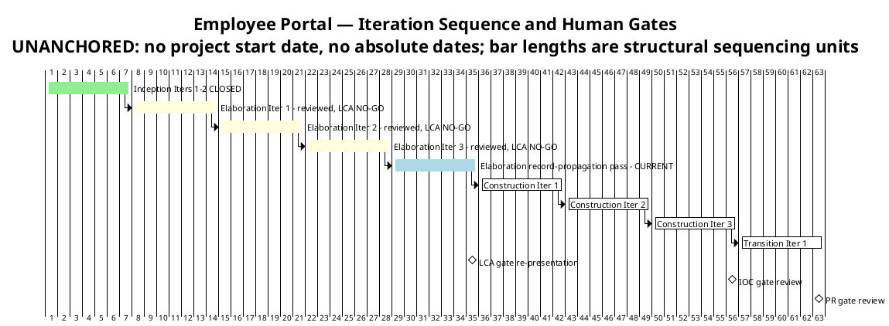
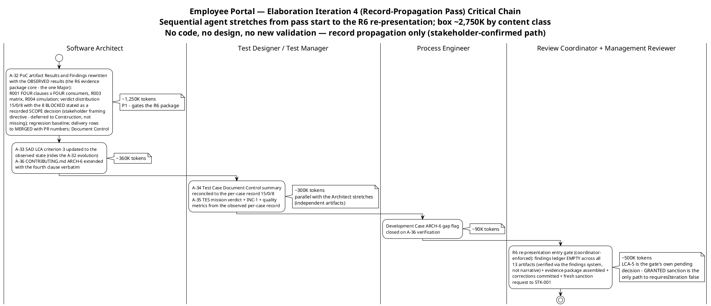

# Iteration Plan

## Document Control
| Field | Value |
|---|---|
| Phase | Elaboration |
| Status | Draft — Elaboration Iteration 3 close-pass roll-forward: the record-propagation pass (Elaboration Iteration 4) is now the CURRENT plan; evolved from the Iter 3 convergence-continuation plan, not recreated |
| Milestone Target | End of Elaboration (LCA) — NOT yet achieved; the R6 re-presentation at the record-propagation pass close is the next gate; LCA-5 (stakeholder sanction) is the gate's own pending decision |
| Iteration | 3 (Cycle 1) reviewed — RC verdict NO-GO CONFIRMED (record-propagation remainder; zero Critical open for the first time in the phase); Iteration 4 (record-propagation pass) CURRENT |
| Date | 2026-09-02 |
| Prior Version | Elaboration Iter 3 plan (convergence continuation, 2026-09-02); Iter 2 close-pass plan; Iter 1 plan; Inception plan (Approved at LCO); EVOLVED, not recreated |
| Two Active Plans | Elaboration Iteration 4 — record-propagation pass (CURRENT, building) + Construction Iteration 1 (coarse only — fine plan built at LCA sanction, not before; planning beyond the horizon is waste) |
| Iter 3 Close-Pass Changes | (1) **Iteration Plan F8 remediation (Minor):** the STK-004 written deliverables request is NOT issued — the concrete blocker is recorded (no direct STK-004 channel exists in this runtime; the stakeholder questionnaire reaches STK-001 only; the stakeholder's Iter 3 directive confirms production AD/Keycloak integration is Construction scope); the obligation is CARRIED to the Construction Iter 1 plan with R010's own trigger. The RESPONSE remains NOT an Elaboration exit condition (stakeholder decision). (2) **Work-item statuses reconciled to observed SCM state (exit criterion 12):** WIs 3–8, 10, 12 observed COMPLETE with evidence cited; WI-9 Pending (PoC results ledger — the one Major); WI-2 obligation carried. (3) **Exit criteria verified: 10 of 14 MET** — criteria 1–3 MET on OBSERVED evidence for the first time (formal TC pass 15/0/8, trace CI 33617748483). (4) **Budget variance recorded honestly:** 27,143,633 actual vs the ~12,500K box (~2.17×) — root cause: CONTENT CLASS (the box was sized from record-side iterations; Iter 3 carried the full code-delivery chain). (5) **The plan rolls forward to the record-propagation pass** — box ~2,750K by content class; no code, no design, no new validation (stakeholder-confirmed path). (6) The R010 written-request obligation is added to the Construction Iter 1 preview |
| Iter 3 Plan-Build Changes (preserved) | Convergence continuation plan; R013 registered; A-16 P0 (stakeholder-stated priority); exit criterion 14 added (fourth-clause propagation); roadmap count 8 — superseded by the close-pass count (9, record-propagation pass added) |
## Iteration Objectives
1. **A-32 — rewrite the Architectural Proof-of-Concept § Results and Findings with the OBSERVED results (P1 — the one Major; the R6 evidence package's core artifact).** R001 FOUR-clause × four-consumer clause-by-clause evidence (TC-011 + TC-021/022/023, clause (d) verified against the substitution-attempt fixtures); R003 token-validation matrix; R004 drop simulation; verdict distribution 15 PASS / 0 FAIL / 8 BLOCKED **stated per the stakeholder's framing directive: the 8 BLOCKED are a recorded SCOPE decision — deferred to Construction, not missing**; regression baseline (merge-sequence green runs 33617283642 → 33617446626 → 33617748483); delivery rows → MERGED with PR numbers (#3/#4/#5/#6); Issue #1 closure; Document Control update. Owner: Software Architect. No result claimed beyond the Test Case authority's record.
2. **A-33…A-36 — the four Minor record corrections (parallel track, independent artifacts).** A-33: SAD §Quality LCA criterion 3 updated to the observed state (validation EXECUTED and OBSERVED; merged PRs; Issue #1 closed; R011 residual to Construction) — Software Architect, rides the A-32 evolution. A-34: Test Case Document Control summary reconciled to the per-case record (15/0/8, TC-017/TC-018 named in the BLOCKED set, stated as a recorded scope decision) — Test Designer / Test Manager. A-35: TES mission verdict, INC-1, and quality metrics updated from the observed per-case record (thresholds OBSERVED to hold; bottleneck → PoC ledger propagation) — Test Manager. A-36: CONTRIBUTING.md ARCH-6 extended with the fourth clause verbatim (citing the stakeholder's verdict-gate contribution) + the Development Case gap flag closed on verification — Software Architect + Process Engineer.
3. **Empty the findings ledger across ALL lenses and ALL severities (exit criterion 11 — the stakeholder's binding all-findings directive).** Open after the Iter 3 review: 1 Major (PoC F2) + 5 Minor ledger (SAD F4, Test Case F1, TES F2, DC F3, Iteration Plan F8 — F8 remediated this close pass, closure owned by the Management Reviewer lens) + 3 narrative-tracked Code Reviewer Minors (F-CR-E3-1/2/3 — Construction-scope remediations with recorded owners). Each emitting lens closes its own finding via the findings system on verified correction — never via narrative claims.
4. **R6 re-presentation with the evidence package and a fresh sanction request to STK-001.** The coordinator-enforced entry gate: findings ledger EMPTY (verified via the findings system across all 13 artifacts) + evidence package assembled (PoC observed-results ledger + merged mechanisms + TC-001…TC-023 executed + FOUR-clause × four-consumer R001 evidence, presented as 15 executed PASS + 8 deferred-by-scope-decision, zero FAIL) + corrections committed + review materials distributed. LCA-5 is the gate's own pending decision — a GRANTED sanction is the only path to phase transition and Construction entry.
## Plan and Milestones
### Coarse Cross-Iteration Roadmap

9 total iterations — at the upper bound of the 6 ± 3 rule, justified against the risk profile: the only HIGH-magnitude risk (R001) required empirical validation the stakeholder refused to accept on paper; the code delivery landed only in Iter 3 (R013, stakeholder-attributed); and the stakeholder's binding all-findings directive plus the confirmed R6 path require one record-propagation pass (~2,750K — a fraction of a full iteration's box; record corrections only). Elaboration holds 4 of 9; Construction remains 3; Transition 1.

| Phase | Iterations | Milestone | Gate Criteria | Human Gate Queue |
|---|---|---|---|---|
| Inception | 2 — **CLOSED** | LCO — **ACHIEVED** | Scope agreed; risks identified; architecture direction sound | **MEASURED: 0s** — stakeholder answered in-round (recorded actual) |
| Elaboration | 4 (Iters 1–3 reviewed — LCA NO-GO each; **Iter 4 record-propagation CURRENT**) | LCA — re-presented at Iter 4 close (R6) | Architecture baselined — **OBSERVED** (PR #6 merged to main, APPROVED); R001/R003/R004 RETIRED empirically (recorded this close pass); ALL findings closed; Construction viable | **Estimate NONE** — bounded in Risk List R012 (14-day suspension ceiling); measured actuals: Iter 1 0:35:14; Iter 2 10:01:08; Iter 3 0:00:00 (20 interactions, all in-round) |
| Construction | 3 | IOC | All 10 FRs implemented and tested; all 5 ACs verified; deployable on Windows Server | **Estimate NONE** — R012; measured actual at the Construction close assessment |
| Transition | 1 | PR | System in production; 80% adoption measured; documentation delivered | **Estimate NONE** — R012; measured actual at the Transition close assessment |

**Measured actuals (recorded, not estimated) — closed phases and closed iterations:**

| Record | Iterations | Agent time | Stakeholder queue | Tokens | Agent runs | Artifacts |
|---|---|---|---|---|---|---|
| Inception (phase-level — governs phase accounting) | 2 | 28 min | 0s | 1,347,939 | 11 | 10 |
| Elaboration Iter 1 (iteration-level — record-side) | 1 | 6:00:59 | 0:35:14 | 12,523,281 | — | — |
| Elaboration Iter 2 (iteration-level — record-side) | 1 | 4:41:27 | 10:01:08 | 13,363,814 | 18 | 13 |
| Elaboration Iter 3 (iteration-level — **code-delivering**) | 1 | 3:35:12 | 0:00:00 | 27,143,633 | 22 | 13 |

> **Conflict resolution (recorded, carried):** the Inception Iteration Assessment quotes a 3,550,308-token cumulative across its two cycles; the phase-level record governs — one row per CLOSED phase, no per-iteration velocity is quoted from it. Iteration-shaped actuals govern every later budget box. The two clocks are never summed.

**Sizing consequence — the CONTENT-CLASS lesson (Iter 3 close):** spend is dominated by reasoning over the accumulated artifact surface, and the surface now splits into two measured content classes: **record-side iterations** (Iter 1: 12,523,281; Iter 2: 13,363,814 — artifact evolution and review only) and **code-delivering iterations** (Iter 3: 27,143,633 — the full delivery chain: 3 mechanisms + dual-coverage tests + 3 PR reviews + merges + the 23-case execution pass + baseline-close PR + 4-lens cumulative re-review + fourth-clause propagation). Every later box is sized by content class from these measured actuals; where no comparable actual exists, the figure is an explicit assumption with its basis named.

> **Two clocks, never summed:** iteration bar lengths are structural sequencing units, NOT measured durations — actual duration is governed by the token budget box and recorded in the Iteration Assessment. Human gates carry NO queue estimate in this plan (A-13): a gate is a risk, bounded in Risk List R012; only measured actuals are reported, at each Iteration Assessment.

### Fine-Grained Plan — Elaboration Iteration 4 (CURRENT, building — record-propagation pass)

This pass executes the stakeholder-confirmed R6 path: record corrections first, then the R6 re-presentation with the evidence package and a fresh sanction request. **No code, no design, no new validation** — the validation substance exists and is observed (Test Case Cycle 1 formal pass, CI-traced); the records lag it. The critical chain below shows the sequential agent stretches from pass start to the R6 re-presentation, each annotated with its token budget.

**Pass budget box: ~2,750K tokens** [ASSUMPTION — record-correction content class; basis: the record-side iterations' measured per-artifact correction cost (Iter 1/Iter 2 actuals ~12.5–13.4M across full-artifact evolutions and 4-lens reviews), scaled to this pass's scope — six targeted section evolutions plus the R6 gate; no code, no design, no new validation. The box does not grow to fit scope.]

### Work Items — Elaboration Iteration 4 (record-propagation pass)

Statuses reflect the verified findings ledger (2026-09-02) and the observed SCM state. No work item may show "Complete" without evidence — the reconciliation is exit criterion 12, re-executed at this pass's close.

| # | Work Item | Owner Role | Token Budget | Depends On | Status |
|---|---|---|---|---|---|
| 1 | **A-32 — PoC artifact § Results and Findings rewritten with the OBSERVED results** (R001 four-clause × four-consumer clause-by-clause; R003 matrix; R004 simulation; 15/0/8 with the 8 BLOCKED stated as a recorded scope decision; regression baseline; delivery rows → MERGED; Issue #1 closure; Document Control) — closes PoC F2 (Major) | Software Architect | ~1,250K | — | Pending — requires only the observed Test Case record (exists); the pass's P1 |
| 2 | **A-33 — SAD §Quality LCA criterion 3** updated to the observed state — closes SAD F4 (Minor) | Software Architect | ~210K | — | Pending — rides the A-32 evolution |
| 3 | **A-36 — CONTRIBUTING.md ARCH-6 extended with the fourth clause verbatim** — closes DC F3 (Minor, with the Process Engineer's flag closure) | Software Architect | ~150K | — | Pending |
| 4 | **A-34 — Test Case Document Control summary reconciled to the per-case record** (15/0/8; TC-017/TC-018 named in the BLOCKED set; recorded scope decision framing) — closes Test Case F1 (Minor) | Test Designer / Test Manager | ~180K | — | Pending |
| 5 | **A-35 — TES mission verdict + INC-1 + quality metrics** updated from the observed per-case record — closes TES F2 (Minor) | Test Manager | ~120K | — | Pending |
| 6 | Development Case ARCH-6 gap flag closed on A-36 verification | Process Engineer | ~90K | Work Item 3 | Pending |
| 7 | Findings-ledger closure by emitting lenses (PoC F2, SAD F4, Test Case F1, TES F2, DC F3; Iteration Plan F8 — remediation recorded this close pass, closure owned by the Management Reviewer lens) — verified via the findings system, not narrative | All emitting lenses | ~150K | Work Items 1–6 | Pending |
| 8 | R6 re-presentation: evidence package + fresh sanction request to STK-001 (coordinator-enforced entry gate) | Review Coordinator + Management Reviewer | ~500K | Work Item 7 | Pending — LCA-5 is the gate's own pending decision |
| 9 | Iteration Assessment (record-propagation pass close): measured actuals, work-item reconciliation | Project Manager | ~100K | Work Items 1–8 | Pending — authored at pass close, AFTER the reviewers rule |
| **Total** | | | **~2,750K** (box: ~2,750K; no headroom — record corrections carry no PR-loop risk) | | |

> **Status discipline (F3/F7 lesson, both directions):** every "Complete" is backed by a commit SHA or CI run; every "Pending" names its blocking evidence. The three narrative-tracked Code Reviewer Minors (F-CR-E3-1/2/3) are Construction-scope remediations with recorded owners — they are NOT work items of this pass.

### Construction Schedule Baseline (from measured actuals — preserved; verified MET at the LCA-4 criterion)

All 10 UCs assigned; UC IDs verified against the Use-Case Model authority (LCO F1 lesson). Sequencing is risk-driven: the clocking cluster first (highest adoption risk R002 + simplest user value), the news cluster second (shared audit mechanism R006), directory + export third (R001 residual R011 closes with production integration).

| Construction Iteration | Use Cases | FRs | Key Risks Retired |
|---|---|---|---|
| Construction Iter 1 | UC-001 (Clock In/Out), UC-002 (Own History), UC-005 (Review Clockings), UC-007 (Assign Category) | FR-004, FR-005, FR-001, FR-003 | R004 residual (AC-005 formal test), R008 (CRUD validation + PG adapter per INT-016, F-CR-E3-1) |
| Construction Iter 2 | UC-003 (Browse News), UC-008 (Publish), UC-009 (Edit), UC-010 (Unpublish) | FR-007, FR-006, FR-008, FR-009 | R006 (audit mechanism verified end-to-end) |
| Construction Iter 3 | UC-004 (Directory Search), UC-006 (CSV Export) | FR-010, FR-002 | R011 + R010 (production-instance integration — STK-004 deliverables), R005 (LDAP performance) |

**Construction sizing:** [ASSUMPTION — 3 iterations sized by content class from the MEASURED Elaboration actuals: code-delivering iterations (Iter 3: 27,143,633) are the comparable class for feature-implementation iterations; record-side actuals govern review-heavy passes. Refined at each Iteration Assessment as measured actuals accumulate — no fine-grained Construction plan is produced now (planning beyond the horizon is waste).]

### Next Iteration Preview — Construction Iteration 1 (coarse only)

| Aspect | Plan |
|---|---|
| Primary objective | Clocking cluster: UC-001, UC-002, UC-005, UC-007 implemented as running features on the validated mechanisms (offline queue, OIDC consumption, LDAP gateway) + the PG adapter per INT-016 (R008; F-CR-E3-1 remediation) |
| Entry condition | LCA sanction GRANTED + empty findings ledger + completed record-propagation scope (Review Record R6 entry gate) |
| Fine plan | **Built at LCA sanction, not before** — planning beyond the current horizon in fine-grained detail is waste; the coarse baseline above is the commitment |
| Key risks | R010 (STK-004 deliverables — **the written request is issued at Construction Iter 1 plan-build through the stakeholder-facing channel, STK-001 relaying to STK-004 per the Vision's engagement model; trigger: STK-004 confirmation by Construction Iter 1 start**), R008, R002 (adoption design) |
## Resources
### Agent Role Profile — Elaboration Iteration 4 (record-propagation pass)

| Agent Role | Discipline | Intensity | Active This Pass | Token Budget | Key Deliverable |
|---|---|---|---|---|---|
| Software Architect | Analysis & Design | High | Yes | ~1,610K | A-32 PoC results ledger (the R6 evidence package core — the one Major) + A-33 SAD criterion 3 + A-36 ARCH-6 fourth clause |
| Test Designer / Test Manager | Test | Medium | Yes | ~300K | A-34 Test Case summary reconciliation + A-35 TES mission verdict update |
| Process Engineer | Environment | Low | Yes | ~90K | Development Case ARCH-6 gap flag closure on A-36 verification |
| Review Coordinator + Management Reviewer | Project Management | High | Yes | ~500K | R6 re-presentation entry gate + fresh sanction request to STK-001 |
| Project Manager | Project Management | Medium | Yes | ~250K | Pass tracking; findings-ledger closure verification; Iteration Assessment at pass close |
| **Total** | | | | **~2,750K** | |

> The Implementer, Code Reviewer, Integrator, System Analyst, Designer, and Test Designer's execution roles are NOT active this pass — no code, no design, no new validation (stakeholder-confirmed path). The three narrative-tracked Code Reviewer Minors (F-CR-E3-1/2/3) are Construction-scope remediations with recorded owners, not this pass's work.

### Budget Split Across Disciplines

| Discipline | Token Share | Rationale |
|---|---|---|
| Analysis & Design | ~59% | The PoC results ledger is the R6 evidence package's core artifact (PoC F2, the one Major) — the pass's P1; the SAD criterion-3 correction and ARCH-6 extension ride the same role |
| Test | ~11% | Two record corrections (Test Case summary; TES verdict) from the observed per-case record |
| Project Management | ~27% | The R6 gate itself (coordinator-enforced entry verification + fresh sanction request) + PM pass tracking and close assessment |
| Environment | ~3% | One flag closure on verification |

### Two Clocks (never summed)

| Clock | Elaboration Iteration 4 (record-propagation pass) | Basis |
|---|---|---|
| Agent work | ~2,750K tokens planned (box = work-item sum; no headroom — record corrections carry no PR-loop risk); elapsed time measured at pass close | Budget box [ASSUMPTION — record-correction content class; basis: the record-side iterations' measured per-artifact correction cost, scaled to six targeted section evolutions plus the R6 gate] |
| Human gates | **Estimate NONE** — bounded in Risk List R012 (14-day suspension ceiling; nothing auto-filled). Mitigation: in-round stakeholder answering, as measured at LCO (0s), Iter 1 (0:35:14), Iter 2 (10:01:08), Iter 3 (0:00:00 — 20 interactions, all in-round). The R6 fresh sanction request is the pass's one stakeholder touchpoint | Planning rule (Review Record A-13/A-15); measured actuals |

### Iteration 3 Actuals (recorded at close — the basis the pass box is sized against)

| Metric | Planned (Iter 3) | Actual (measured) | Variance |
|---|---|---|---|
| Token spend | ~12,500K box; ~9,255K work-item sum | 27,143,633 | ~2.17× the box — root cause: CONTENT CLASS (the box was sized from record-side iterations; Iter 3 carried the full code-delivery chain + 4-lens cumulative re-review + fourth-clause propagation). The ~3,245K rework headroom was NOT consumed by PR loops (all 3 PRs approved first pass) — the overrun was delivery volume, not rework |
| Agent elapsed time | Measured at close | 3:35:12 | More work in less time than Iter 2 (4:41:27) — 22 invocations at higher parallelism; the code chain ran through 5 roles |
| Stakeholder queue | Estimate NONE (R012) | 0:00:00 | 20 interactions, ALL answered in-round — the Iter 2 process-defect growth did not recur; emission discipline held |
| Agent invocations | — | 22 | 9 roles active |
| User interactions | — | 20 | R6-path confirmation + framing directive + verdict-gate contribution ("nothing else new") + review consultations |
| Artifacts | — | 13 | Inventory unchanged |
| Avg quality | — | 9.9 / 10 | Reviewer-assessed |
## Use Cases and Scenarios Addressed
**This iteration's use-case scope (convergence continuation):** the empirical validation exercises UC-001 (Clock In/Out — OIDC consumption, offline resilience, idempotency) and the four AD-reading use cases UC-004 (Directory Search), UC-005 (Review Clockings), UC-006 (CSV Export), UC-007 (Assign Category) — the R001 behavioural bar is confirmed for ALL FOUR per the stakeholder's Iter 2 answer, and the FOURTH clause (verdict-gate contribution) extends it: a missing attribute is displayed as missing, never replaced by a default, a placeholder, a guessed value, or another employee's value. UC-010 (Unpublish News) carries its audit/soft-delete test cases. All 10 UCs remain refined at the analysis level (Use-Case Model clean at both reviews); none is implemented as a running feature — implementation is Construction.

| FR ID | Use Case ID | Use Case Name | Elaboration Iter 3 Activity | Construction Iteration |
|---|---|---|---|---|
| FR-004 | UC-001 | Clock In and Clock Out | R003 stub-issuer + R004 offline-drop mechanism validation (code evidence — the stakeholder-stated priority); TC execution | Construction Iter 1 |
| FR-005 | UC-002 | View Own Clocking History | Analysis complete (clean at review); no Iter 3 activity | Construction Iter 1 |
| FR-001 | UC-005 | Review Employee Clockings | R001 behavioural bar applies (stakeholder-confirmed): event row rendered with blank display fields, clocking data always complete; missing attribute displayed as missing — no substitution | Construction Iter 1 |
| FR-003 | UC-007 | Assign Worker Category | R001 behavioural bar applies (stakeholder-confirmed): employee locatable and selectable with blank fields; missing attribute displayed as missing — no substitution | Construction Iter 1 |
| FR-007 | UC-003 | Browse News | Analysis complete; featured-banner contract settled (stakeholder Iter 2: banners STACK, newest first) | Construction Iter 2 |
| FR-006 | UC-008 | Publish News | Analysis complete (clean at review) | Construction Iter 2 |
| FR-008 | UC-009 | Edit Published News | Analysis complete (clean at review) | Construction Iter 2 |
| FR-009 | UC-010 | Unpublish News | Audit + soft-delete test cases executed this cycle (TC set) | Construction Iter 2 |
| FR-010 | UC-004 | Search Employee Directory | R001 behavioural bar validated against the disposable LDAP directory (gaps AND substitution attempts seeded deliberately): every employee rendered; missing attribute never removes from results; never raises an error; displayed as missing — no substitution | Construction Iter 3 |
| FR-002 | UC-006 | Export Monthly Clocking Report | R001 behavioural bar applies (stakeholder-confirmed): every event row exported with blank cells for missing display fields, no abort; missing attribute displayed as missing — no substitution | Construction Iter 3 |

> UC IDs cross-checked against the Use-Case Model §Use-Case Survey (authority) — LCO F1 lesson applied; re-verified clean at both LCA reviews (LCA-4 PASS).

## Evaluation Criteria
### Layer 1 — Declared Acceptance Criteria Status

| AC ID | Description | Addressed This Iteration? | Evidence / Deferral |
|---|---|---|---|
| AC-001 | Employee can clock in/out without HR help | **Partial evidence — OBSERVED this iteration** | UC-001 mechanisms validated empirically (OIDC consumption matrix PASS; offline drop simulation PASS — zero duplicates/losses, sync ≤ 60 s, confirmations < 1 s); running feature is Construction Iter 1 |
| AC-002 | HR can publish news without technical assistance | Deferred to Construction Iter 2 | UC-008 analyzed; audit mechanism designed (R006 — Design Model clean at review) |
| AC-003 | Employee finds colleague's phone/email in <10 seconds | **Partial evidence — OBSERVED this iteration** | R001 FOUR-clause behavioural bar validated against the disposable directory (every employee rendered, no hidden entries, no errors, no substitution — clause (d) verified against substitution-attempt fixtures); production-AD performance + data quality at Construction Iter 3 (R010 + R011) |
| AC-004 | 80% of employees complete one clocking with no training | Deferred to Transition Iter 1 | Adoption measurement requires a deployed system (BG-003) |
| AC-005 | System works temporarily offline (5-min network drop) | **Partial evidence — OBSERVED this iteration** | R004 mechanism validated: 5-minute drop simulated, queue, reconnect, idempotent sync, zero duplicates/losses (trace CI 33617748483); formal AC test at Construction Iter 1 |

No AC is absent from this table. All 5 declared acceptance criteria are accounted for with explicit evidence or deferral targets.

### Layer 2 — Elaboration Iteration 3 Exit Criteria (RESULTS — verified at close, 2026-09-02)

| # | Exit Criterion | Result | Evidence |
|---|---|---|---|
| 1 | R001 empirically validated against the disposable LDAP directory — FOUR-clause behavioural bar (a) every employee rendered; (b) missing attribute never removes from search results; (c) never raises an error; (d) displayed as missing — never a default, placeholder, guessed value, or another employee's value — gaps AND substitution-attempt fixtures seeded deliberately; applies to UC-004/005/006/007 | **MET — OBSERVED** | PR #3 merged to `iteration/E1` (APPROVED, review 5088169328); LdapGateway sha b8df8b7 (four-clause contract in code); formal TC pass: FOUR clauses × FOUR consumers PASS via TC-011 + TC-021/022/023, clause (d) verified against the substitution-attempt fixtures (NOT "General", NOT "Central", NOT "N/A", no cross-entry inheritance); trace CI 33617748483; Issue #1 CLOSED |
| 2 | R003 empirically validated against the stub OIDC issuer: token validation succeeds; Employee + HR Administrator roles extracted from claims; redirect flow completes | **MET — OBSERVED** | PR #4 merged (APPROVED, review 5088169517); token-validation matrix PASS — RS256 via issuer JWKS with kid matching, exp/iss/aud/sub enforced, roles extracted verbatim, failing states rejected at the request boundary (401) |
| 3 | R004 empirically validated (direct): 5-minute drop simulated; sync ≤ 60 s; zero duplicates (idempotency key); zero losses; confirmation < 1 s both paths | **MET — OBSERVED** | PR #5 merged (APPROVED, review 5088169685); drop simulation PASS — zero duplicates (double replay AND mixed online+queued), zero losses, sync ≤ 60 s, confirmations < 1 s, recorded-order preservation |
| 4 | SAD corrected: §Quality PoC Plan carries the EMPIRICAL disposition (A-7); §Logical View dependencies reconciled with the Design Model (A-9) | **MET** | SAD F1/F3 ledger-closed 2026-09-02 (Reviewer lens) |
| 5 | Architectural Proof-of-Concept artifact produced, carrying empirical R001/R003/R004 results (A-8) | **NOT MET — record propagation pending** | The artifact EXISTS with a sound protocol and honest PENDING ledger; the OBSERVED results have not yet landed in § Results and Findings — PoC F2 (Major, A-32), the record-propagation pass's P1. The validation SUBSTANCE exists and is observed (Test Case Cycle 1 formal pass) |
| 6 | CONTRIBUTING.md committed before the first mechanism PR (A-5) | **MET** | Committed, sha 6662813…; F-CR-E1-2 resolved by the Code Reviewer lens |
| 7 | Carried — VERIFIED: Development Case PoC-trigger record corrected (trigger FIRED recorded; DC clean at review) | **MET** | Review Record per-artifact verdict: Development Case Approved (F1/F2 resolved Iter 3) |
| 8 | Carried — VERIFIED: Construction schedule baselined from measured actuals, UC IDs against authority | **MET** | LCA-4 criterion MET at all three LCA reviews (Management lens) |
| 9 | STK-004 written deliverables request issued (R010); response NOT required for Elaboration exit | **NOT MET — obligation relocated (F8 remediation)** | The request is NOT issued; the concrete blocker is recorded this close pass (no direct STK-004 channel in this runtime — the questionnaire reaches STK-001 only; the stakeholder's Iter 3 directive confirms production AD/Keycloak integration is Construction scope); the obligation is CARRIED to the Construction Iter 1 plan with R010's own trigger. The RESPONSE remains NOT an exit condition (stakeholder decision) |
| 10 | All 5 ACs accounted | **MET** | Layer 1 table complete — AC-001 through AC-005, three with OBSERVED partial evidence |
| 11 | ALL open findings closed — every lens, every severity (A-12; stakeholder directive) | **NOT MET — record-propagation remainder** | Verified ledger 2026-09-02: 0 Critical (first time in the phase), 1 Major (PoC F2), 5 Minor (SAD F4, Test Case F1, TES F2, DC F3, Iteration Plan F8 — F8 remediation recorded this close pass, closure owned by the Management Reviewer lens) + 3 narrative-tracked Code Reviewer Minors (Construction scope). All record-propagation class; none requires code, design, or new validation |
| 12 | Work-item statuses reconciled to SCM evidence (A-11) | **MET** | Reconciliation executed this close pass: WIs 3–8, 10, 12 observed COMPLETE with evidence cited; WI-9 Pending (PoC results ledger); WI-2 obligation carried with its blocker recorded |
| 13 | LCA evidence package assembled and re-presented with a fresh sanction request | **NOT MET — R6 pending** | The package's SUBSTANCE exists (merged mechanisms + executed TC pass + FOUR-clause × four-consumer evidence); the PoC results ledger (A-32) and the ledger-empty condition gate the R6 re-presentation — the record-propagation pass's objective |
| 14 | Fourth-clause propagation complete (A-25…A-31) across the seven carrying artifacts | **MET — verified** | UC Model (A-25), Supp Spec (A-26), Design Model (A-27 — landed with the build; the code implements four clauses), Test Case (A-28 — executed BEFORE the pass), PoC protocol (A-29), Risk List (A-30), SAD (A-31) — all verified RESOLVED this cycle (Review Record Iter 3 technical-lens record); residual: ARCH-6 in CONTRIBUTING.md (A-36, DC F3) |

**Score: 10 of 14 MET** (Iter 2: 6 of 13; Iter 1: 3 of 8). The four unmet criteria (5, 9, 11, 13) are the record-propagation remainder — every one a record correction or a gate, none requiring code, design, or new validation. Criteria 1–3 are MET ON OBSERVED EVIDENCE for the first time in the phase: the substantive LCA blocker is retired.
## Traceability
| Element | Traces From | Link Type | Traces To |
|---|---|---|---|
| Iteration Plan (this, Elab Iter 3) | Review Record (Iter 1 + Iter 2 — findings, actions A-1…A-31, convergence calendar R1–R6, stakeholder verdict-gate contribution); stakeholder directive (all findings closed before phase transition); stakeholder Iter 2 answers (R001 behavioural bar; four-UC confirmation; featured banner newest first); stakeholder Implementer priority ("In this third iteration I hope that the Implementer can push the code so that everything moves forward"); Iteration Assessment Iter 2 (binding adjustments: A-16 P0, A-28 before execution, A-27 with the build, box from measured actuals); measured actuals (Inception phase-level; Elab Iter 1: 12,523,281; Iter 2: 13,363,814) | Refines | Elaboration Iter 3 Iteration Assessment; R6 LCA re-presentation; Construction Iter 1 plan (built at LCA sanction) |
| Exit criterion 1 (R001 FOUR-clause behavioural bar) | Stakeholder Iter 2 answer (behavioural bar, three clauses, >90% dropped, four-UC confirmation "Yes"); stakeholder verdict-gate contribution, verbatim: "a missing attribute is displayed as missing. It is never replaced by a default, a placeholder, a guessed value, or another employee's value" | Authorizes | Work Item 3 (R001 mechanism); Risk List R001 acceptance criteria (A-30, applied); Test Case TC-011 + TC-021/022/023 fixtures (A-28); Architectural Proof-of-Concept artifact (A-29) |
| Exit criteria 1–3 (code evidence) | Review Record Iteration Plan F3 (Critical) / SAD F2 / F-CR-E1-1 — three gates, one defect: absent mechanism code, two consecutive iterations | Derives | Work Items 3–9; SCM evidence (CI runs on iteration/E1, merged PRs); LCA evidence package; Risk List R013 (continuity risk) |
| Exit criterion 11 (all-findings closure) | Review Record Iteration Plan F4 (Major, A-12); stakeholder directive verbatim: "Please fix all the findings even if they are minors prior to move to next phase"; escalation resolution: "Fix all the issues and close all findings" | Derives | Findings ledger (verified empty at iteration close); phase-transition sanction |
| Exit criterion 12 (status reconciliation) | Review Record Iteration Plan F3 (Critical, A-11) + F7 (Minor, A-23); LCO F2 lesson (status honesty, both directions) | Derives | Work Items 1–12 statuses; Iteration Assessment |
| Exit criterion 14 (fourth-clause propagation) | Review Record propagation actions A-25…A-31 (stakeholder verdict-gate contribution); R6 entry gate ("corrections committed (A-17…A-31)") | Derives | Work Item 12 (parallel track); carrying artifacts owned by their roles |
| Milestone table (no queue forecasts) | Review Record Iteration Plan F5 (Minor, A-13); planning rule: human gate = risk, not estimate | Derives | Risk List R012 (bounds the queue; 14-day suspension ceiling); Iteration Assessment (measured actuals only) |
| Budget box ~12,500K [ASSUMPTION] | Measured iteration actuals (Iter 1: 12,523,281; Iter 2: 13,363,814); Iter 1 assessment binding adjustment #1; Review Record Iteration Plan F6 (Major, A-22 — corrected at the Iter 2 close pass; the F6 lesson applied at this plan-build: adjustments land in the plan BODY) | DependsOn | Elaboration Iter 3 Iteration Assessment (records actuals; refines Construction sizing) |
| Work Items 3–5 (mechanisms) | Stakeholder decision (Elab Iter 1): "The PoC is produced in Elaboration and validated empirically" — R001 disposable directory, R003 stub issuer, R004 direct; stakeholder Implementer priority (Iter 2 verdict gate) | Authorizes | R001, R003, R004 retirement evidence; SAD COMP-007/COMP-006/COMP-009; Design Model CLS-009/CLS-010/CLS-008 |
| Work Item 2 (STK-004 request) | R010, STK-004, CON-004, CON-005, CON-008; stakeholder decision (R010 blocks production-instance integration only; response NOT an Elaboration exit condition) | Derives | Construction Iter 3 integration testing |
| Work Item 8 (A-28 + TC execution) | Test Case §Test Case Catalog (TC-ID authority, 23 cases); Iteration Assessment Iter 2 binding adjustment ("A-28 fourth-clause test steps land BEFORE TC execution — a clause that cannot fail proves nothing") | Derives | TC-001…TC-023 execution results; PoC artifact § Results and Findings |
| Construction Schedule Baseline | Use-Case Model §Use-Case Survey (UC ID authority), SAD UC prioritization; verified MET at LCA-4 | Derives | Construction Iteration Plans (built at LCA, not before) |
| Roadmap count 8 iterations (Elaboration 3) | 6 ± 3 rule; rubber profile bent to the risk profile (only HIGH risk requires empirical validation; stakeholder refused paper-only validation; code delivery not landed in two iterations) | Refines | Construction entry (on GRANTED sanction); Iteration Assessments (measured actuals refine the profile) |