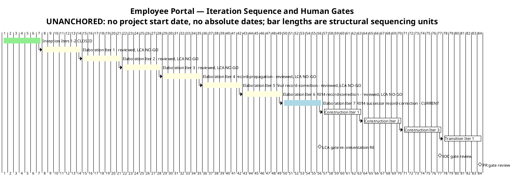

# Iteration Plan

## Document Control

| Field | Value |
|---|---|
| Phase | Elaboration |
| Status | Draft — Elaboration Iteration 7 roll-forward: the R014 successor record-correction cycle is now the CURRENT plan; evolved from the Iter 6 R014 record-correction cycle plan, not recreated |
| Milestone Target | End of Elaboration (LCA) — NOT yet achieved; the R6 re-presentation at the R014 successor record-correction cycle close is the next gate; LCA-5 (stakeholder sanction) is the gate's own pending decision |
| Iteration | 6 (Cycle 1) reviewed — RC verdict NO-GO CONFIRMED (R014 successor remainder: 0 Critical / 0 Major / 6 Minor ledger + 1 narrative — the FIRST zero-Major state of the phase; the termination test ANSWERED YES — 5 successor findings, all Minor, all the post-write staleness subclass; A-40/A-41 landed and ledger-closed; the two Work Order CRs DISCHARGED); Iteration 7 (R014 successor record-correction cycle) CURRENT |
| Date | 2026-09-03 |
| Prior Version | Elaboration Iteration 6 R014 record-correction cycle plan (2026-09-03); Iter 5 final record-correction pass plan; Iter 4 record-propagation pass plan; Iter 3 close-pass roll-forward; Iter 3 convergence-continuation plan; Iter 2 close-pass plan; Iter 1 plan; Inception plan (Approved at LCO); EVOLVED, not recreated |
| Two Active Plans | Elaboration Iteration 7 — R014 successor record-correction cycle (CURRENT, building) + Construction Iteration 1 (coarse only — fine plan built at LCA sanction, not before; planning beyond the horizon is waste) |
| Iter 6 Close-Pass Changes | (1) **Work-item reconciliation (plan Work Item 7 / cycle exit criterion 6):** 4 Complete with evidence cited (A-40/A-41 landed and ledger-closed — 2 Reviewer-lens closures on first-hand verification; the findings-ledger closure work executed; the 3-lens cumulative re-review executed with Code Reviewer INACTIVE per the Work Order), 2 Not met (the strengthened same-pass discipline — the termination test ANSWERED YES, 5 successor findings minted; the R6 gate — not reached per the RC verdict), 1 discharged by the Iteration Assessment. (2) **Exit criteria verified: 3 of 6 MET.** (3) **Budget variance recorded honestly: 27,272,284 actual vs the ~20,000K box (~1.36×) — the second-closest box of the phase; the re-review tax priced accurately; the ~7,272K residual is the successor minting the box cannot pre-price.** (4) **The plan rolls forward to the R014 successor record-correction cycle** — box ~20,000K; no code, no design, no new validation. (5) **The F9 owner-enumeration remediation is EXECUTED at this plan-build** (Work Item 6 names EVERY staled-record owner — the structural cure). (6) **The stakeholder's binding single-source Iter 6 directive is carried as the remediation shape** (A-42 reframed into the TES structural restructure; the principle extended to A-43…A-46). (7) **R014's trigger RE-ARMED at this plan-build for the Iter 7 review** (the termination test re-executes). (8) **Coarse-roadmap count CORRECTED:** the prior plan's "11 total / Elaboration 6 of 11" was arithmetically impossible against its own milestone table (Inception 2 + Elaboration 6 + Construction 3 + Transition 1 = 12) — a stale total of exactly the R014 post-write-staleness class in this artifact's own record; the count is now COMPUTED from the milestone table at every plan-build, never carried forward: **13 total (Inception 2 + Elaboration 7 + Construction 3 + Transition 1)** |
| Iter 5 Close-Pass Changes (preserved) | (1) **Work-item reconciliation (exit criterion 8, plan Work Item 8):** 4 Complete with evidence cited (A-37/A-38/A-39 landed and ledger-closed — the two Work Order CRs DISCHARGED; Issue #9 CLOSED cr:complete — zero open SCM issues), 2 Partial (findings-ledger closure — 3 closures executed but the R014 trigger FIRED, 2 new findings born of the pass's own landings; 4-lens re-review executed but R6 not reached), 1 Not met (same-pass discipline — failed on two locations despite being carried), 1 discharged by the Iteration Assessment. (2) **Exit criteria verified: 5 of 8 MET** — criteria 4 (same-pass discipline), 6 (ledger-empty), 7 (R6 gate) NOT MET. (3) **Budget variance recorded honestly: 25,184,977 actual vs the ~21,000K box (~1.2×) — the CLOSEST box of the phase; the re-review-tax sizing method VALIDATED.** (4) **The plan rolls forward to the R014 record-correction cycle** — box ~20,000K by content class; no code, no design, no new validation. (5) **The STRENGTHENED same-pass discipline is carried as cycle exit criterion 3** (R014 mitigation — the Iter 5 lesson: the remainder statement is re-verified against the verified findings ledger BEFORE every upsert; the ledger, not the author's memory, is the remainder's source of truth). (6) **R014's trigger FIRED — recorded in the Risk List close-pass reappraisal; RE-ARMED at that plan-build for the Iter 6 review** (the termination test: does the cycle mint a successor finding against its own landings A-40/A-41?) |
| Iter 4 Close-Pass Changes (preserved) | (1) Work-item reconciliation (exit criterion 12): 7 Complete, 1 partial, 1 not executed. (2) Exit criteria verified: 6 of 8 MET. (3) Budget variance ~9.0× — root cause: the RE-REVIEW TAX. (4) The plan rolled forward to the final record-correction pass — box ~21,000K with the tax priced IN. (5) The SAME-PASS DISCIPLINE carried as pass exit criterion 4 (R014 mitigation — registered in the Risk List at that plan-build). (6) Issue #9 closure added as a work item |
| Iter 3 Close-Pass Changes (preserved) | (1) Iteration Plan F8 remediation (Minor): the STK-004 written deliverables request is NOT issued — the concrete blocker is recorded; the obligation is CARRIED to the Construction Iter 1 plan with R010's own trigger. (2) Work-item statuses reconciled to observed SCM state. (3) Exit criteria verified: 10 of 14 MET. (4) Budget variance ~2.17× — root cause: CONTENT CLASS. (5) The plan rolled forward to the record-propagation pass. (6) The R010 written-request obligation added to the Construction Iter 1 preview |

## Iteration Objectives

1. **A-42 — the TES structural restructure (P1 — the stakeholder's binding single-source Iter 6 directive, verbatim: "State the remaining work ONCE, in a single section that owns it. Every other place that needs it — Milestone Target, the master-workflow diagram, the schedule — references that section instead of restating it.").** The remaining work is stated ONCE in a single TES section that owns it, or removed entirely with references to the Review Record findings ledger and the SCM issues as the state owners; every other TES location references that section and never restates it. Includes Issue #14's cr:complete transition (the CR vehicle for the ledger-closed TES F4/A-40 — a lifecycle transition owned by the assigned role + the CCM, not corrective work). Owner: Test Manager. Closes TES F5 (Minor).
2. **A-43…A-46 — the four sibling census/remainder refreshes in single-source shape.** DC F6 (Process Engineer — Milestone Target items (1) and (4)); UCM F1 + SUP F1 (System Analyst — Document Control milestone records; NO UC-content or requirement change); TC F2 (Tester — issue-census; NO verdict change, the 15/0/8 baseline stands). Each references the owning record (the verified findings ledger; the live SCM tracker) rather than restating state another artifact owns — the copies that drift are removed, not resynchronized.
3. **Empty the findings ledger across ALL lenses and ALL severities (cycle exit criterion 7 — the stakeholder's binding all-findings directive, reinforced at the Iter 5 verdict gate, verbatim: "No, please fix all findings").** The five Reviewer-lens Minors (TES F5, DC F6, UCM F1, SUP F1, TC F2) closed by that lens via the findings system on verified correction; Iteration Plan F9 closed by the Management lens on verification of the complete owner enumeration — never via narrative claims. The 1 narrative Minor (F-CR-E3-1) is Construction-scope with a recorded owner — carried, not closed this phase.
4. **R6 re-presentation with the evidence package and a fresh sanction request to STK-001.** Entry gate: findings ledger EMPTY (verified via the findings system across all 13 artifacts) + evidence package assembled (PoC observed-results ledger + merged mechanisms + TC-001…TC-023 executed + FOUR-clause × four-consumer R001 evidence, presented as 15 executed PASS + 8 deferred-by-scope-decision, zero FAIL) + the TES restructure verified single-source + review materials distributed. LCA-5 is the gate's own pending decision — a GRANTED sanction is the only path to phase transition and Construction entry. **The same-pass discipline with the COMPLETE owner enumeration applies to this cycle's own landings (R014 mitigation — the F9 remediation EXECUTED at this plan-build): when A-42…A-46 land, every record enumerating what remains — including any record written earlier in this cycle — is updated IN THIS CYCLE by its NAMED owner, and the remainder statement is re-verified against the verified findings ledger BEFORE every upsert.**

## Plan and Milestones

### Coarse Cross-Iteration Roadmap

**13 total iterations — COMPUTED from the milestone table (Inception 2 + Elaboration 7 + Construction 3 + Transition 1) — four above the upper bound of the 6 ± 3 rule (9), justified against the risk profile:** the only HIGH-magnitude risk (R001) required empirical validation the stakeholder refused to accept on paper; the code delivery landed only in Iter 3 (R013, stakeholder-attributed); the stakeholder's binding all-findings directive plus the confirmed R6 path required a record-propagation pass (Iter 4); the record-propagation defect class minted new findings in FOUR consecutive passes (R014 — registered in the Risk List at the Iter 5 plan-build; fired at the Iter 5, Iter 6 reviews), requiring the final record-correction pass (Iter 5), the R014 record-correction cycle (Iter 6), and now the R014 successor record-correction cycle (Iter 7 — minted by the trigger re-firing, a registered risk event, never planning drift). Each extension was minted by a recorded stakeholder directive or a verified defect class. The count is computed from the milestone table at every plan-build — never carried forward (the prior plan's stale "11 total" corrected at this plan-build).

| Phase | Iterations | Milestone | Gate Criteria | Human Gate Queue |
|---|---|---|---|---|
| Inception | 2 — **CLOSED** | LCO — **ACHIEVED** | Scope agreed; risks identified; architecture direction sound | **MEASURED: 0s** — stakeholder answered in-round (recorded actual) |
| Elaboration | 7 (Iters 1–6 reviewed — LCA NO-GO each; **Iter 7 R014 successor record-correction CURRENT**) | LCA — re-presented at Iter 7 close (R6) | Architecture baselined — **OBSERVED** (PR #6 merged to main, APPROVED); R001/R003/R004 RETIRED empirically (recorded, verified at Iter 4, held at Iters 5–6); ALL findings closed; Construction viable | **Estimate NONE** — bounded in Risk List R012 (14-day suspension ceiling); measured actuals: Iter 1 0:35:14; Iter 2 10:01:08; Iter 3 0:00:00; Iter 4 0:00:00; Iter 5 0:00:00; Iter 6 0:00:00 (23 interactions, all in-round — fourth consecutive zero-queue iteration) |
| Construction | 3 | IOC | All 10 FRs implemented and tested; all 5 ACs verified; deployable on Windows Server | **Estimate NONE** — R012; measured actual at the Construction close assessment |
| Transition | 1 | PR | System in production; 80% adoption measured; documentation delivered | **Estimate NONE** — R012; measured actual at the Transition close assessment |

**Measured actuals (recorded, not estimated) — closed phases and closed iterations:**

| Record | Iterations | Agent time | Stakeholder queue | Tokens | Agent runs | Artifacts |
|---|---|---|---|---|---|---|
| Inception (phase-level — governs phase accounting) | 2 | 28 min | 0s | 1,347,939 | 11 | 10 |
| Elaboration Iter 1 (iteration-level — record-side) | 1 | 6:00:59 | 0:35:14 | 12,523,281 | — | — |
| Elaboration Iter 2 (iteration-level — record-side) | 1 | 4:41:27 | 10:01:08 | 13,363,814 | 18 | 13 |
| Elaboration Iter 3 (iteration-level — **code-delivering**) | 1 | 3:35:12 | 0:00:00 | 27,143,633 | 22 | 13 |
| Elaboration Iter 4 (iteration-level — **record-propagation + re-review tax**) | 1 | 2:58:00 | 0:00:00 | 24,830,875 | 23 | 13 |
| Elaboration Iter 5 (iteration-level — **record-correction + re-review tax**) | 1 | 4:43:57 | 0:00:00 | 25,184,977 | 23 | 13 |
| Elaboration Iter 6 (iteration-level — **record-correction + re-review tax + successor minting**) | 1 | 6:52:25 | 0:00:00 | 27,272,284 | 22 | 13 |

> **Conflict resolution (recorded, carried):** the Inception Iteration Assessment quotes a 3,550,308-token cumulative across its two cycles; the phase-level record governs — one row per CLOSED phase, no per-iteration velocity is quoted from it. The Work Order's phase-level Elaboration records differ from the iteration-level sums for the same iterations — the same conflict class; the phase-level record governs phase accounting, iteration-shaped actuals govern every budget box; the two are never mixed. Iteration-shaped actuals now number SIX and split into FOUR measured content classes: **record-side** (Iter 1: 12,523,281; Iter 2: 13,363,814), **code-delivering** (Iter 3: 27,143,633), **record-propagation + re-review tax** (Iter 4: 24,830,875), and **record-correction + re-review tax** (Iter 5: 25,184,977; Iter 6: 27,272,284 — with the successor-minting residual). The two clocks are never summed.

**Sizing consequence — the validated method (held):** every box is sized as **(pass-specific work) + (the re-review tax, held roughly constant per cycle and growing with the surface) + (the successor-minting contingency, where the termination test's answer is unknown at plan-build)**, by content class from these measured actuals. The Iter 5 box (~21,000K, tax priced IN) landed at ~1.2× and the Iter 6 box (~20,000K) at ~1.36× — the two closest boxes of the phase, VALIDATING the method; the Iter 6 residual is the successor minting, which the box cannot pre-price — so the successor-cycle box prices it as a bounded contingency, not a hope (the Iter 6 lesson). Where no comparable actual exists, the figure is an explicit assumption with its basis named.

> **Two clocks, never summed:** iteration bar lengths are structural sequencing units, NOT measured durations — actual duration is governed by the token budget box and recorded in the Iteration Assessment. Human gates carry NO queue estimate in this plan (A-13): a gate is a risk, bounded in Risk List R012; only measured actuals are reported, at each Iteration Assessment.

### Fine-Grained Plan — Elaboration Iteration 7 (CURRENT, building — the R014 successor record-correction cycle)

This cycle executes the RC verdict's named next pass: five census/remainder corrections in SINGLE-SOURCE shape (A-42 — the TES structural restructure, the stakeholder's binding directive; A-43…A-46 — the four sibling refreshes), the same-pass discipline with the COMPLETE owner enumeration (the F9 remediation, executed at this plan-build), the findings-ledger closure, and the R6 re-presentation itself. **No code, no design, no new validation** — the validation substance exists and is observed (Test Case Cycle 1 formal pass, CI-traced); the R6 evidence package is ASSEMBLED and internally consistent in its validation substance; what remains is record currency in single-source shape, plus the gate. The critical chain below shows the sequential agent stretches from cycle start to the R6 re-presentation, each annotated with its token budget.

**Cycle budget box: ~20,000K tokens** [ASSUMPTION — record-correction + re-review-tax content class; basis: the measured Iter 6 actual (27,272,284) with the successor count unknown at plan-build — the termination test's answer is priced as one more bounded pass. Work-item sum ~19,400K + ~600K successor-minting contingency = the box. The re-review tax is priced INTO the box — the validated method; the box does not grow to fit scope; the scope is bounded by the box.]

```plantuml
@startuml
!theme plain
title Employee Portal — Elaboration Iteration 7 (R014 Successor Record-Correction Cycle) Critical Chain\nSequential agent stretches from cycle start to the R6 re-presentation, box ~20,000K by content class\nNo code, no design, no new validation - five census and remainder corrections in SINGLE-SOURCE shape + the R6 gate

|Test Manager|
start
:A-42 TES STRUCTURAL RESTRUCTURE per the stakeholder
binding single-source Iter 6 directive - the remaining
work stated ONCE in a single section that owns it,
or removed entirely with references to the Review
Record findings ledger and the SCM issues as the
state owners. Every other TES location references
that section and never restates it. Includes the
Issue 14 completion transition, the CR vehicle for
the ledger-closed TES F4 A-40. Closes TES F5, the
cycle P1;
note right: ~1,000K tokens\nP1 - the stakeholder\nbinding Iter 6 directive,\nthe non-convergence\ndiagnosis confirmed\nagainst the verified\nledger (TES F1 to F5)

|Process Engineer|
:A-43 DC Milestone Target items 1 and 4 corrected
to the observed state in single-source shape - A-40
landed and TES F4 ledger-closed, Issues 11 and 12
CLOSED, the remaining transition is Issue 14.
Closes DC F6;
note right: ~400K tokens

|System Analyst|
:A-44 and A-45 UCM and SUP Document Control
milestone records refreshed in single-source shape -
A-40 and A-41 landed and ledger-closed, the live
census referenced not restated. NO UC-content or
requirement change. Closes UCM F1 and SUP F1;
note right: ~500K tokens

|Tester|
:A-46 Test Case issue-census refreshed in
single-source shape - 1 open CR vehicle (Issue 14),
5 closed, referenced not restated. NO verdict
change - the 15/0/8 baseline stands. Closes TC F2;
note right: ~300K tokens

|All named owners|
:SAME-PASS DISCIPLINE with the COMPLETE owner
enumeration - the F9 remediation EXECUTED at this
plan-build. When A-42 to A-46 land, EVERY record
enumerating what remains is updated IN THIS CYCLE
by its NAMED owner - Test Manager (TES), Process
Engineer (DC), System Analyst (UCM, SUP), Tester
(TC), Project Manager (Iteration Plan, Risk List,
Iteration Assessment). The single-source shape
removes the copies that drift rather than
resynchronizing them;
note right: ~700K tokens\nthe R014 termination\ntest re-executes at the\nIter 7 review - does\nthe cycle mint a\nsuccessor finding\nagainst its own landings

|Reviewer lens + Management lens|
:Findings-ledger closure on verified corrections -
TES F5, DC F6, UCM F1, SUP F1, TC F2 closed by the
Reviewer lens, Iteration Plan F9 closed by the
Management lens on verification of the complete
owner enumeration - via the findings system, never
narrative claims;
note right: ~500K tokens

|Review lenses per the Work Order|
:Cumulative re-review of ALL 13 artifacts - the
RE-REVIEW TAX, priced INTO the box - the accumulated
surface, not the delivery content, dominates spend.
The R014 termination test executes here;
note right: ~12,000K tokens\nthe dominant term -\nheld roughly constant\nper cycle, growing with\nthe surface

|Review Coordinator + Management Reviewer|
:R6 re-presentation entry gate - findings ledger
EMPTY, verified via the findings system across all
13 artifacts. Evidence package presented as 15
executed PASS + 8 deferred-by-scope-decision, zero
FAIL. The TES restructure verified single-source.
Fresh sanction request to STK-001;
note right: ~3,000K tokens\nLCA-5 is the pending\ndecision of the gate\nitself - a GRANTED\nsanction is the only\npath to phase transition\nand Construction entry

|Project Manager|
:PM pass-close reconciliation - the cycle Iteration
Assessment plus the Risk List close-pass reappraisal,
authored AFTER the reviewers rule;
note right: ~1,000K tokens
stop
@enduml
```

### Work Items — Elaboration Iteration 7 (R014 successor record-correction cycle)

Statuses reflect the verified findings ledger (2026-09-03: 0 Critical / 0 Major / 6 Minor + 1 narrative) and the observed SCM state (Issue #14 open — the CR vehicle for the ledger-closed TES F4/A-40; Issues #1/#2/#9/#11/#12 closed). No work item may show "Complete" without evidence — the reconciliation is cycle exit criterion 9, re-executed at this cycle's close.

| # | Work Item | Owner Role | Token Budget | Depends On | Status |
|---|---|---|---|---|---|
| 1 | **A-42 — the TES structural restructure per the stakeholder's binding single-source directive** (the remaining work stated ONCE in a single section that owns it, or removed entirely with references to the Review Record findings ledger and the SCM issues as the state owners; every other TES location references that section and never restates it) — closes TES F5 (Minor) | Test Manager | ~1,000K | — | Pending — the cycle's P1; the non-convergence diagnosis confirmed against the verified ledger (TES F1…F5) |
| 2 | **A-43 — DC Milestone Target items (1) and (4) corrected to the observed state in single-source shape** (A-40 landed and TES F4 ledger-closed; Issues #11/#12 CLOSED cr:complete; the remaining transition is Issue #14's) — closes DC F6 (Minor) | Process Engineer | ~400K | — | Pending — two-location correction |
| 3 | **A-44 + A-45 — UCM and SUP Document Control milestone records refreshed in single-source shape** (A-40/A-41 landed and ledger-closed; the live census referenced, not restated; NO UC-content or requirement change) — closes UCM F1 and SUP F1 (Minor) | System Analyst | ~500K | — | Pending — record correction only |
| 4 | **A-46 — Test Case issue-census refreshed in single-source shape** (1 open CR vehicle — Issue #14, which does not target the Test Case artifact; 5 closed; referenced not restated; NO verdict change — the 15/0/8 baseline stands) — closes TC F2 (Minor) | Tester | ~300K | — | Pending — census correction only |
| 5 | **Issue #14's cr:complete transition** (the CR vehicle for the ledger-closed TES F4/A-40 — a lifecycle transition, not corrective work) | Test Manager (assigned role) + CCM | rides WI-1 | WI-1 | Pending — owned by the assigned role + the CCM |
| 6 | **Same-pass discipline with the COMPLETE owner enumeration — the F9 remediation, EXECUTED at this plan-build:** when A-42…A-46 land, EVERY record enumerating what remains is updated IN THIS CYCLE by its NAMED owner — **Test Manager (TES), Process Engineer (DC), System Analyst (UCM, SUP), Tester (TC), Project Manager (Iteration Plan, Risk List, Iteration Assessment)** — and the remainder statement is re-verified against the verified findings ledger BEFORE every upsert | All named owners (complete enumeration) | ~700K | WIs 1–4 | Pending — the R014 termination test re-executes at the Iter 7 review |
| 7 | Findings-ledger closure by the emitting lenses (TES F5, DC F6, UCM F1, SUP F1, TC F2 — Reviewer lens; Iteration Plan F9 — Management lens) via the findings system on verified correction — never via narrative claims | Reviewer lens + Management lens | ~500K | WIs 1–6 | Pending |
| 8 | Cumulative re-review of ALL 13 artifacts (the re-review tax — priced INTO the box); the R014 termination test executes here | Review lenses per the Work Order | ~12,000K | WI-7 | Pending |
| 9 | **R6 re-presentation: evidence package + fresh sanction request to STK-001** (coordinator-enforced entry gate: empty ledger + evidence package presented as 15 executed PASS + 8 deferred-by-scope-decision, zero FAIL + the TES restructure verified single-source + review materials distributed) | Review Coordinator + Management Reviewer | ~3,000K | WI-8 | Pending — LCA-5 is the gate's own pending decision |
| 10 | Iteration Assessment (R014 successor record-correction cycle close): measured actuals, work-item reconciliation + the Risk List close-pass reappraisal | Project Manager | ~1,000K | WIs 1–9 | Pending — authored at cycle close, AFTER the reviewers rule |
| **Total** | | | **~19,400K work-item sum + ~600K successor-minting contingency = ~20,000K box** | | |

> **Status discipline (F3/F7 lesson, both directions):** every "Complete" is backed by a commit SHA or CI run; every "Pending" names its blocking evidence. The 1 narrative-tracked Code Reviewer Minor (F-CR-E3-1) is a Construction-scope remediation with a recorded owner — it is NOT a work item of this cycle. **Single-source note:** this work-items table is the plan's OWN commitment (its scope), stated once here; the findings-ledger state and the SCM census are owned by the Review Record and the SCM tracker respectively — this plan references them, never restates them as its own record.

### Construction Schedule Baseline (from measured actuals — preserved; verified MET at the LCA-4 criterion at all six reviews)

All 10 UCs assigned; UC IDs verified against the Use-Case Model authority (LCO F1 lesson). Sequencing is risk-driven: the clocking cluster first (highest adoption risk R002 + simplest user value), the news cluster second (shared audit mechanism R006), directory + export third (R001 residual R011 closes with production integration).

| Construction Iteration | Use Cases | FRs | Key Risks Retired |
|---|---|---|---|
| Construction Iter 1 | UC-001 (Clock In/Out), UC-002 (Own History), UC-005 (Review Clockings), UC-007 (Assign Category) | FR-004, FR-005, FR-001, FR-003 | R004 residual (AC-005 formal test), R008 (CRUD validation + PG adapter per INT-016, F-CR-E3-1) |
| Construction Iter 2 | UC-003 (Browse News), UC-008 (Publish), UC-009 (Edit), UC-010 (Unpublish) | FR-007, FR-006, FR-008, FR-009 | R006 (audit mechanism verified end-to-end) |
| Construction Iter 3 | UC-004 (Directory Search), UC-006 (CSV Export) | FR-010, FR-002 | R011 + R010 (production-instance integration — STK-004 deliverables), R005 (LDAP performance) |

**Construction sizing:** [ASSUMPTION — 3 iterations sized by content class from the MEASURED Elaboration actuals: code-delivering iterations (Iter 3: 27,143,633) are the comparable class for feature-implementation iterations; record-side and record-correction actuals govern review-heavy passes; the re-review tax (Iter 4: 24,830,875; Iter 5: 25,184,977; Iter 6: 27,272,284 with no code) is added to every Construction box. Refined at each Iteration Assessment as measured actuals accumulate — no fine-grained Construction plan is produced now (planning beyond the horizon is waste).]

### Next Iteration Preview — Construction Iteration 1 (coarse only)

| Aspect | Plan |
|---|---|
| Primary objective | Clocking cluster: UC-001, UC-002, UC-005, UC-007 implemented as running features on the validated mechanisms (offline queue, OIDC consumption, LDAP gateway) + the PG adapter per INT-016 (R008; F-CR-E3-1 remediation) |
| Entry condition | LCA sanction GRANTED + empty findings ledger + completed R014 successor record-correction scope (Review Record R6 entry gate) |
| Fine plan | **Built at LCA sanction, not before** — planning beyond the current horizon in fine-grained detail is waste; the coarse baseline above is the commitment |
| Key risks | R010 (STK-004 deliverables — **the written request is issued at Construction Iter 1 plan-build through the stakeholder-facing channel, STK-001 relaying to STK-004 per the Vision's engagement model; trigger: STK-004 confirmation by Construction Iter 1 start**), R008, R002 (adoption design) |

## Resources

### Agent Role Profile — Elaboration Iteration 7 (R014 successor record-correction cycle)

| Agent Role | Discipline | Intensity | Active This Cycle | Token Budget | Key Deliverable |
|---|---|---|---|---|---|
| Test Manager | Test | Medium | Yes | ~1,000K | A-42 TES structural restructure (the cycle P1) + Issue #14's cr:complete transition |
| Process Engineer | Environment | Low | Yes | ~400K | A-43 DC Milestone Target correction (single-source shape) |
| System Analyst | Requirements | Low | Yes | ~500K | A-44 + A-45 UCM/SUP Document Control milestone records (single-source shape) |
| Tester | Test | Low | Yes | ~300K | A-46 Test Case issue-census refresh (single-source shape) |
| All named owners (complete enumeration — the F9 remediation) | Cross-discipline | — | Yes | ~700K | Same-pass discipline executed by every NAMED staled-record owner (Test Manager, Process Engineer, System Analyst, Tester, Project Manager) |
| Reviewer lens + Management lens | Project Management | High | Yes | ~500K | Findings-ledger closure (5 Reviewer-lens Minors + Iteration Plan F9) |
| Review lenses per the Work Order | Project Management | High | Yes | ~12,000K | Cumulative re-review of ALL 13 artifacts (the re-review tax); the R014 termination test |
| Review Coordinator + Management Reviewer | Project Management | High | Yes | ~3,000K | The R6 re-presentation entry gate + fresh sanction request to STK-001 |
| Project Manager | Project Management | Medium | Yes | ~1,000K | Cycle tracking; the F9 owner-enumeration execution; the PM pass-close (Iteration Assessment + Risk List close-pass reappraisal) |
| **Total** | | | | **~19,400K + ~600K successor-minting contingency = ~20,000K** | |

> The Implementer, Code Reviewer, Integrator, Designer, and Test Designer's execution roles are NOT active this cycle — no code, no design, no new validation (stakeholder-confirmed path). The 1 narrative-tracked Code Reviewer Minor (F-CR-E3-1) is a Construction-scope remediation with a recorded owner, not this cycle's work.

### Budget Split Across Disciplines

| Discipline | Token Share | Rationale |
|---|---|---|
| Project Management (review + gate + PM) | ~82.5% | The re-review tax (~12,000K) + the R6 gate (~3,000K) + findings closure (~500K) + PM tracking and close (~1,000K) — the dominant terms, priced INTO the box per the validated method |
| Test | ~6.5% | A-42 (the TES structural restructure, ~1,000K) + A-46 (the Test Case census, ~300K) |
| Environment | ~2% | A-43 DC Milestone Target correction |
| Requirements | ~2.5% | A-44 + A-45 UCM/SUP milestone records |
| Cross-discipline (same-pass discipline, complete owner enumeration) | ~3.5% | ~700K — R014 mitigation executed by every named owner |
| Successor-minting contingency | ~3% | ~600K — the termination test's answer is unknown at plan-build; priced as a bounded contingency, not a hope (the Iter 6 lesson) |

### Two Clocks (never summed)

| Clock | Elaboration Iteration 7 (R014 successor record-correction cycle) | Basis |
|---|---|---|
| Agent work | ~20,000K tokens planned (work-item sum ~19,400K + ~600K successor-minting contingency; the re-review tax is the dominant term and is priced IN); elapsed time measured at cycle close | Budget box [ASSUMPTION — record-correction + re-review-tax content class; basis: the measured Iter 6 actual (27,272,284) with the successor count unknown at plan-build — the termination test answer is priced as one more bounded pass] |
| Human gates | **Estimate NONE** — bounded in Risk List R012 (14-day suspension ceiling; nothing auto-filled). Mitigation: in-round stakeholder answering, as measured at LCO (0s), Iter 1 (0:35:14), Iter 2 (10:01:08), Iter 3 (0:00:00), Iter 4 (0:00:00), Iter 5 (0:00:00), Iter 6 (0:00:00 — 23 interactions, fourth consecutive zero-queue iteration). The R6 fresh sanction request is the cycle's one stakeholder touchpoint | Planning rule (Review Record A-13/A-15); measured actuals |

### Iteration 6 Actuals (recorded at close — the basis the cycle box is sized against)

| Metric | Planned (Iter 6) | Actual (measured) | Variance |
|---|---|---|---|
| Token spend | ~20,000K box (work-item sum = box; the re-review tax priced IN) | 27,272,284 | ~1.36× the box — the second-closest box of the phase (Iter 1 ~10.4×; Iter 2 ~1.07×; Iter 3 ~2.17×; Iter 4 ~9.0×; Iter 5 ~1.2×; Iter 6 ~1.36×). The tax itself priced accurately; the ~7,272K residual is the successor minting (5 findings, not the 0 the termination test hoped for) — each spawning a remediation and re-review surface the box cannot pre-price |
| Agent elapsed time | Measured at close | 6:52:25 | Work time; never summed with queue; the LONGEST elapsed of the phase while token spend held at ~108% of Iter 5 — the cost driver is long-context reasoning over the largest cumulative surface yet; elapsed time is NOT a proxy for spend |
| Stakeholder queue | Estimate NONE (R012) | 0:00:00 | 23 interactions, ALL answered in-round — fourth consecutive zero-queue iteration; the emission-format standing rule held under load |
| Agent invocations | — | 22 | Test Manager, Process Engineer, the review lenses + Review Coordinator, Project Manager |
| User interactions | — | 23 | Verdict-gate contribution (the TES single-source directive, binding) + review consultations |
| Artifacts | — | 13 | Inventory unchanged |
| Avg quality | — | 9.9 / 10 | Reviewer-assessed |

## Use Cases and Scenarios Addressed

**This cycle's use-case scope (Elaboration Iteration 7 — R014 successor record-correction): NONE.** The cycle carries no use-case validation, analysis, or implementation activity — five record corrections in single-source shape, the findings-ledger closure, and the R6 gate, per the stakeholder-confirmed R6 path (no code, no design, no new validation). The validation evidence recorded at the Iteration 3 close stands unchanged as the phase's use-case validation record: UC-001 (Clock In/Out — OIDC consumption, offline resilience, idempotency) and the four AD-reading use cases UC-004 (Directory Search), UC-005 (Review Clockings), UC-006 (CSV Export), UC-007 (Assign Category) validated against the FOUR-clause behavioural bar (observed, CI-traced — trace CI 33617748483); UC-010's audit/soft-delete test cases recorded as a Construction scope decision (the 8 BLOCKED cases — deferred to Construction, not missing, per the stakeholder's framing directive). All 10 UCs remain refined at the analysis level (Use-Case Model: 10/10 FULL, 0 content findings at all six LCA reviews); implementation of running features is Construction work per the baselined schedule below.

| FR ID | Use Case ID | Use Case Name | Elaboration Validation Record (Iters 1–3 — stands; no Iter 7 activity) | Construction Iteration |
|---|---|---|---|---|
| FR-004 | UC-001 | Clock In and Clock Out | R003 stub-issuer + R004 offline-drop mechanism validation (code evidence — the stakeholder-stated priority); TC execution | Construction Iter 1 |
| FR-005 | UC-002 | View Own Clocking History | Analysis complete (clean at review); no Elaboration validation activity | Construction Iter 1 |
| FR-001 | UC-005 | Review Employee Clockings | R001 behavioural bar applies (stakeholder-confirmed): event row rendered with blank display fields, clocking data always complete; missing attribute displayed as missing — no substitution | Construction Iter 1 |
| FR-003 | UC-007 | Assign Worker Category | R001 behavioural bar applies (stakeholder-confirmed): employee locatable and selectable with blank fields; missing attribute displayed as missing — no substitution | Construction Iter 1 |
| FR-007 | UC-003 | Browse News | Analysis complete; featured-banner contract settled (stakeholder Iter 2: banners STACK, newest first) | Construction Iter 2 |
| FR-006 | UC-008 | Publish News | Analysis complete (clean at review) | Construction Iter 2 |
| FR-008 | UC-009 | Edit Published News | Analysis complete (clean at review) | Construction Iter 2 |
| FR-009 | UC-010 | Unpublish News | Audit + soft-delete test cases designed; TC-013…TC-016 BLOCKED — recorded scope decision (news/audit mechanisms are Construction scope) | Construction Iter 2 |
| FR-010 | UC-004 | Search Employee Directory | R001 behavioural bar validated against the disposable LDAP directory (gaps AND substitution attempts seeded deliberately): every employee rendered; missing attribute never removes from results; never raises an error; displayed as missing — no substitution | Construction Iter 3 |
| FR-002 | UC-006 | Export Monthly Clocking Report | R001 behavioural bar applies (stakeholder-confirmed): every event row exported with blank cells for missing display fields, no abort; missing attribute displayed as missing — no substitution | Construction Iter 3 |

> UC IDs cross-checked against the Use-Case Model §Use-Case Survey (authority) — LCO F1 lesson applied; re-verified clean at all six LCA reviews (LCA-4 PASS). The Construction assignments are unchanged this cycle.

## Evaluation Criteria

### Layer 1 — Declared Acceptance Criteria Status

| AC ID | Description | Addressed This Iteration? | Evidence / Deferral |
|---|---|---|---|
| AC-001 | Employee can clock in/out without HR help | **Partial evidence — OBSERVED (Iters 1–3; stands)** | UC-001 mechanisms validated empirically (OIDC consumption matrix PASS; offline drop simulation PASS — zero duplicates/losses, sync ≤ 60 s, confirmations < 1 s); running feature is Construction Iter 1 |
| AC-002 | HR can publish news without technical assistance | Deferred to Construction Iter 2 | UC-008 analyzed; audit mechanism designed (R006 — Design Model clean at review) |
| AC-003 | Employee finds colleague's phone/email in <10 seconds | **Partial evidence — OBSERVED (Iters 1–3; stands)** | R001 FOUR-clause behavioural bar validated against the disposable directory (every employee rendered, no hidden entries, no errors, no substitution — clause (d) verified against substitution-attempt fixtures); production-AD performance + data quality at Construction Iter 3 (R010 + R011) |
| AC-004 | 80% of employees complete one clocking with no training | Deferred to Transition Iter 1 | Adoption measurement requires a deployed system (BG-003) |
| AC-005 | System works temporarily offline (5-min network drop) | **Partial evidence — OBSERVED (Iters 1–3; stands)** | R004 mechanism validated: 5-minute drop simulated, queue, reconnect, idempotent sync, zero duplicates/losses (trace CI 33617748483); formal AC test at Construction Iter 1 |

No AC is absent from this table. All 5 declared acceptance criteria are accounted for with explicit evidence or deferral targets. **No AC is addressed by the R014 successor record-correction cycle itself** — record corrections only; the OBSERVED partial evidence recorded at the Iteration 3 close stands unchanged.

### Layer 2 — Elaboration Iteration 7 Exit Criteria (R014 successor record-correction cycle — the cycle-close review verifies against these)

| # | Exit Criterion | Verification Method |
|---|---|---|
| 1 | **A-42 — the TES structural restructure per the stakeholder's binding single-source directive:** the remaining work stated ONCE in a single section that owns it, or removed entirely with references to the Review Record findings ledger and the SCM issues as the state owners; every other TES location references that section and never restates it — closes TES F5 (Minor) | TES read-back: exactly ONE section owns the remainder statement; every other location references it; no location restates state another artifact owns; the restructure verified against the verified findings ledger AND the live SCM census |
| 2 | **A-43 — DC Milestone Target items (1) and (4) corrected to the observed state in single-source shape** (A-40 landed and TES F4 ledger-closed; Issues #11/#12 CLOSED cr:complete; the remaining transition is Issue #14's) — closes DC F6 (Minor) | DC read-back: items (1) and (4) state the observed state; the remainder references the owning records, never restates them |
| 3 | **A-44 + A-45 — UCM and SUP Document Control milestone records refreshed in single-source shape** (NO UC-content or requirement change) — closes UCM F1 and SUP F1 (Minor) | UCM/SUP read-back: the milestone records reference the owning records; no UC-content or requirement change |
| 4 | **A-46 — Test Case issue-census refreshed in single-source shape** (NO verdict change — the 15/0/8 baseline stands) — closes TC F2 (Minor) | Test Case read-back: the census references the live SCM tracker; the verdict set unchanged |
| 5 | **Issue #14's cr:complete transition executed** (the CR vehicle for the ledger-closed TES F4/A-40) | SCM verification: Issue #14 closed cr:complete |
| 6 | **Same-pass discipline with the COMPLETE owner enumeration (the F9 remediation, executed at this plan-build) applied to the cycle's OWN landings — the R014 termination test:** when A-42…A-46 land, EVERY record enumerating what remains is updated IN THIS CYCLE by its NAMED owner (Test Manager — TES; Process Engineer — DC; System Analyst — UCM, SUP; Tester — TC; Project Manager — Iteration Plan, Risk List, Iteration Assessment) | The cycle-close review verifies ZERO new record-propagation findings minted against this cycle's own landings (the R014 trigger does not re-fire); the findings ledger carries no entry citing a same-cycle landing |
| 7 | **Findings ledger EMPTY across ALL lenses and ALL severities** (the stakeholder's binding all-findings directive): the five Reviewer-lens Minors closed by that lens; Iteration Plan F9 closed by the Management lens on verification of the complete owner enumeration — via the findings system, never narrative claims. The 1 narrative Minor (F-CR-E3-1) is Construction-scope with a recorded owner — carried, not closed this phase | Verified via the findings system across all 13 artifacts at cycle close — never via narrative claims |
| 8 | **R6 re-presentation with the evidence package and a fresh sanction request to STK-001** (entry gate: empty ledger + evidence package presented as 15 executed PASS + 8 deferred-by-scope-decision, zero FAIL + the TES restructure verified single-source + review materials distributed). LCA-5 is the gate's own pending decision — a GRANTED sanction is the only path to phase transition and Construction entry | Review Coordinator's R6 entry-gate verification + the stakeholder's sanction decision (recorded, not declared by this plan) |
| 9 | **Iteration Assessment (R014 successor record-correction cycle close): measured actuals, work-item reconciliation + the Risk List close-pass reappraisal** — authored at cycle close, AFTER the reviewers rule | This plan's Work Item 10; the assessment records the cycle's two-clock actuals against the ~20,000K box |

**Score at plan-build: 0 of 9 MET** — the cycle has not executed; every criterion is Pending with its verification method named. This table is the baseline the cycle-close review verifies against.

### Prior Verification Record — Elaboration Iteration 6 Exit Criteria (RESULTS — verified at close, 2026-09-03; preserved)

**Score: 3 of 6 MET** (Iter 5: 5 of 8; Iter 4: 6 of 8; Iter 3: 10 of 14; Iter 2: 6 of 13; Iter 1: 3 of 8). Criteria 1–2 and 6 MET on verified landings — the two named corrections (A-40/A-41) landed and ledger-closed (2 Reviewer-lens closures on first-hand verification); the phase reached its FIRST zero-Major state. The three unmet criteria (3 — the termination test, which answered YES; 4 — the ledger-empty condition; 5 — the R6 gate) are the R014 successor record-correction cycle's work: criterion 3 → cycle criterion 6 (with the complete owner enumeration); criteria 4–5 → cycle criteria 7–8.

| # | Exit Criterion (Iter 6) | Result | Evidence |
|---|---|---|---|
| 1 | A-40 — TES remainder-enumerations updated from the observed same-pass landings (closes TES F4, Major) | **MET — verified** | TES F4 RESOLVED via resolve_artifact_finding (Reviewer lens, first-hand verification: every named location corrected; the mission verdict correct and unchanged); its CR vehicle, SCM Issue #14, open pending its cr:complete transition |
| 2 | A-41 — Development Case Milestone Target corrected to the observed state (closes DC F5, Minor) | **MET — verified** | DC F5 RESOLVED — the Milestone Target corrected per the DC's own binding same-pass discipline, remainder re-verified against the verified findings ledger before upsert |
| 3 | Strengthened same-pass discipline applied to the cycle's OWN landings (R014 mitigation — the termination test) | **NOT MET** | The termination test ANSWERED YES: 5 successor findings minted (TES F5, DC F6, UCM F1, SUP F1, TC F2 — all Minor, all the post-write staleness subclass). The discipline was carried and strengthened; the owner enumeration was incomplete (F9) — the staled-record owners were structurally unassigned |
| 4 | Findings ledger EMPTY across ALL lenses and ALL severities | **NOT MET** | 2 closures this cycle, but 6 new findings born of the cycle's own later events: 0 Critical / 0 Major (the first zero-Major state of the phase) / 6 Minor + 1 narrative Minor. All record-currency class, all owned (A-42…A-46 + F9 at this plan-build) |
| 5 | R6 re-presentation with the evidence package + fresh sanction request | **NOT MET** | The RC verdict (recorded, not declared here): LCA iteration REQUIRED — NO-GO CONFIRMED, requiresIteration TRUE; the R6 entry gate (empty ledger) is not yet satisfied; LCA-5 remains the gate's own pending decision |
| 6 | Iteration Assessment at cycle close (measured actuals, work-item reconciliation) | **MET** | The Iter 6 Iteration Assessment — authored after the reviewers ruled, per the plan's Work Item 7 |

## Traceability

| Element | Traces From | Link Type | Traces To |
|---|---|---|---|
| Iteration Plan (this, Elab Iter 7 — R014 successor record-correction cycle) | Review Record (Iter 6 consolidated disposition — NO-GO CONFIRMED, the phase auto-iterates into the R014 successor record-correction cycle; verified ledger 0 Critical / 0 Major / 6 Minor + 1 narrative; actions A-42…A-46; Iteration Plan F9; the stakeholder single-source directive folded verbatim, binding); Iteration Assessment Iter 6 (measured actuals 27,272,284 / 6:52:25 / 0:00:00; the ~1.36× variance — the residual is the successor minting; the two structural cures; binding adjustments incl. the box ~20,000K and the F9 remediation at this plan-build); measured actuals (Inception phase-level; Elab Iters 1–6 iteration-shaped) | Refines | R014 successor record-correction cycle execution (A-42…A-46 in single-source shape + the complete owner enumeration + findings-ledger closure); R6 LCA re-presentation; Iteration Assessment (cycle close); Construction Iter 1 plan (built at LCA sanction) |
| Cycle exit criteria 1–4 (A-42…A-46) | Review Record Iter 6 technical-lens findings (TES F5, DC F6, UCM F1, SUP F1, TC F2 — all Minor, all the post-write staleness subclass); the stakeholder's binding single-source Iter 6 directive (verbatim, folded); the verified findings ledger (2026-09-03) | Derives | Work Items 1–4; findings-ledger closure by the emitting lenses; the R6 evidence package's record currency |
| Cycle exit criterion 5 (Issue #14 transition) | SCM Issue #14 (cr:approved, assigned:test-manager — the CR vehicle for the ledger-closed TES F4/A-40); the one-CR-one-Issue lifecycle pattern | Derives | Work Item 5; the CCM lifecycle; the R6 entry gate's issue-side currency |
| Cycle exit criterion 6 (same-pass discipline with the COMPLETE owner enumeration — the F9 remediation) | Iteration Plan F9 (Minor, Management lens — the observed mechanism of the termination test's YES answer); Risk List R014 (trigger RE-ARMED at this plan-build); Iteration Assessment Iter 6 (the F9 remediation as a binding adjustment at the next plan-build) | Derives | Work Item 6; the R014 termination test at the Iter 7 review; the R6 entry gate (ledger-empty condition); every future close-pass in Construction and Transition |
| Cycle exit criterion 7 (findings ledger EMPTY) | Review Record Iteration Plan F4 (Major, A-12); stakeholder directive verbatim: "Please fix all the findings even if they are minors prior to move to next phase"; escalation resolution: "Fix all the issues and close all findings"; Iter 5 reinforcement, verbatim: "No, please fix all findings" | Derives | Findings ledger (verified empty at cycle close via the findings system); phase-transition sanction |
| Cycle exit criterion 8 (R6 re-presentation) | Stakeholder R6-path confirmation ("Yes" — record corrections, then the R6 re-presentation with the evidence package and a fresh sanction request); Review Coordinator R6 entry gate; the BLOCKED-cases framing directive (15 executed PASS + 8 deferred-by-scope-decision, zero FAIL); the stakeholder single-source directive (the TES restructure verified single-source at the gate) | Authorizes | LCA-5 decision (the gate's own pending decision — GRANTED sanction is the only path to phase transition); Construction entry |
| Cycle exit criterion 9 (Iteration Assessment at cycle close) | This plan's Work Item 10; the assessment discipline (authored AFTER the reviewers rule) | Derives | Iteration Assessment (R014 successor record-correction cycle close — measured actuals vs the ~20,000K box) |
| Budget box ~20,000K [ASSUMPTION — record-correction + re-review-tax content class] | Measured iteration actuals by content class (Iter 1: 12,523,281 record-side; Iter 2: 13,363,814 record-side; Iter 3: 27,143,633 code-delivering; Iter 4: 24,830,875 record-propagation + re-review tax; Iter 5: 25,184,977 record-correction + re-review tax; Iter 6: 27,272,284 record-correction + re-review tax + successor minting); the VALIDATED sizing method (pass-specific work + the re-review tax + the successor-minting contingency); basis: the measured Iter 6 actual with the successor count unknown at plan-build | DependsOn | Iteration Assessment (R014 successor record-correction cycle close — records the actual; refines Construction sizing) |
| Work Items 1–4 (record corrections A-42…A-46) | Review Record Iter 6 technical-lens findings ledger (TES F5, DC F6, UCM F1, SUP F1, TC F2); the stakeholder's binding single-source directive (the remediation shape) | Derives | Findings-ledger closure (cycle criterion 7); the R6 evidence package |
| Work Item 6 (same-pass discipline, complete owner enumeration) | Iteration Plan F9 (the remediation EXECUTED at this plan-build); Risk List R014 (RE-ARMED); the DC's binding same-pass discipline | Derives | Cycle exit criterion 6; the R6 entry gate; every future close-pass |
| Work Item 9 (R6 gate) | The cumulative re-review discipline (Review Record — the lenses execute per the Work Order); the Review Coordinator's R6 entry gate; the stakeholder-confirmed R6 path | Derives | LCA-5 decision; phase transition (only on GRANTED sanction); Construction entry |
| Construction Schedule Baseline | Use-Case Model §Use-Case Survey (UC ID authority), SAD UC prioritization; verified MET at LCA-4 (all six reviews) | Derives | Construction Iteration Plans (built at LCA, not before) |
| Roadmap count 13 iterations (COMPUTED: Inception 2 + Elaboration 7 + Construction 3 + Transition 1) | The milestone table (the owning record — the count is computed from it at every plan-build, never carried forward); 6 ± 3 rule (four above the upper bound, justified against the risk profile: the only HIGH-magnitude risk required empirical validation the stakeholder refused to accept on paper; the code delivery landed only in Iter 3 (R013, stakeholder-attributed); the all-findings directive plus the confirmed R6 path required the record-propagation pass (Iter 4); the record-propagation class minted findings in FOUR consecutive passes (R014 — registered at the Iter 5 plan-build, fired at the Iter 5 and Iter 6 reviews), requiring Iters 5, 6, and 7. Each extension was minted by a recorded stakeholder directive or a verified defect class; the prior plan's stale "11 total" corrected at this plan-build) | Refines | Construction entry (on GRANTED sanction); Iteration Assessments (measured actuals refine the profile) |
| Milestone table (no queue forecasts) | Review Record Iteration Plan F5 (Minor, A-13); planning rule: human gate = risk, not estimate | Derives | Risk List R012 (bounds the queue; 14-day suspension ceiling; measured actuals: LCO 0s; Iter 1 0:35:14; Iter 2 10:01:08; Iter 3 0:00:00; Iter 4 0:00:00; Iter 5 0:00:00; Iter 6 0:00:00); Iteration Assessment (measured actuals only) |
| Work Item 2 (STK-004 request — Iter 3 obligation, relocated; preserved) | R010, STK-004, CON-004, CON-005, CON-008; stakeholder decision (R010 blocks production-instance integration only; response NOT an Elaboration exit condition); Iteration Plan F8 remediation record (concrete blocker: no direct STK-004 channel in this runtime; obligation carried to Construction Iter 1 with R010's trigger — RESOLVED and ledger-closed by the Management lens at Iter 4) | Derives | Construction Iter 1 plan (request issued at plan-build through the stakeholder-facing channel, STK-001 relaying to STK-004 per the Vision's engagement model; trigger: STK-004 confirmation by Construction Iter 1 start); Construction Iter 3 integration testing |