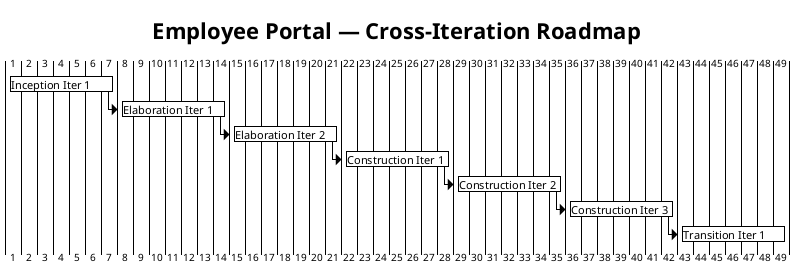
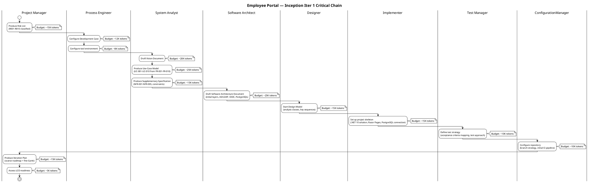

## Document Control

| Field | Value |
|---|---|
| Phase | Inception |
| Status | Draft |
| Milestone Target | End of Inception (LCO) |
| Iteration | 2 (Cycle 1) — Rework iteration |
| Date | 2026-09-01 |
| Rework Reason | F1 (Major): UC ID mapping corrected to match Use-Case Model (authority); F2 (Minor): Work item statuses reconciled against repository |
| Findings Resolved | F1 (Major — UC ID mismatch), F2 (Minor — stale work item statuses) |

## Iteration Objectives

1. **Establish project framework:** Risk List with all identified risks classified by probability × impact = magnitude, with mitigation and contingency plans.
2. **Define scope and roadmap:** Coarse cross-iteration roadmap with milestone sequence (LCO → LCA → IOC → PR) and iteration boundaries.
3. **Produce foundational artifacts:** All Inception-phase disciplines produce their initial deliverables — Use-Case Model, Supplementary Specification, SAD draft, Design Model start, project skeleton, test strategy, CM configuration.
4. **Confront highest-magnitude risks:** R001 (AD LDAP attribute consistency) is HIGH magnitude — the SAD draft and Elaboration plan must include an Architectural PoC to validate LDAP attribute availability across the 3 offices. R003 (OIDC integration) and R004 (offline fault tolerance) are SIGNIFICANT and must be addressed in the SAD draft.
5. **Assess LCO readiness:** Determine whether the project is viable to proceed to Elaboration — stakeholders agree on scope, initial risks are identified and classified, and the architecture direction is sound.

## Plan and Milestones

### Coarse Cross-Iteration Roadmap

The project follows the RUP iterative structure with **7 total iterations** across 4 phases, consistent with the 6 ± 3 rule. The rubber profile starting point (Inception ~5%, Elaboration ~20%, Construction ~65%, Transition ~10%) is adjusted for this project's moderate complexity and risk profile.

| Phase | Iterations | Milestone | Gate Criteria | Human Gate Queue Time |
|---|---|---|---|---|
| Inception | 1 (this) | LCO | Scope agreed; risks identified; architecture direction sound; project viable | [ASSUMPTION — 2 days of stakeholder review queue, basis: single review cycle for a moderate-scope internal project] |
| Elaboration | 2 | LCA | Architecture baseline stable; R001 PoC resolved; all HIGH/SIGNIFICANT risks mitigated or retired; SAD complete | [ASSUMPTION — 3 days of stakeholder + architectural review queue, basis: architectural review for 2 external integrations] |
| Construction | 3 | IOC | All 10 FRs implemented and tested; all 5 ACs verified; system deployable on Windows Server | [ASSUMPTION — 3 days of stakeholder review queue, basis: functional acceptance review] |
| Transition | 1 | PR | System in production; 80% adoption measured; documentation delivered | [ASSUMPTION — 2 days of stakeholder sign-off queue, basis: final delivery review] |

**Iteration count justification:** 7 iterations total — within the 6 ± 3 range. The project has moderate complexity (10 FRs, 2 external integrations, single-server deployment) and 2 declared risks. Elaboration gets 2 iterations to resolve R001 (AD LDAP) and R003 (OIDC) via PoC. Construction gets 3 iterations to implement 10 FRs with testing. Transition gets 1 iteration for deployment and adoption tracking.

> **Note on the Gantt:** Iteration durations shown as 7-day units are structural placeholders for the roadmap's relative sequencing — NOT measured durations. Actual iteration duration is governed by the token budget box and measured elapsed time, recorded in the Iteration Assessment. Human gate queue times are quoted separately in the milestone table above. The two clocks are never summed.

### Fine-Grained Plan — Inception Iteration 1

This iteration is a **mini-project**: all disciplines produce their initial Inception deliverables. The critical chain below shows the sequential agent stretches from iteration start to the LCO gate, each annotated with its token budget.

**Iteration budget box:** [ASSUMPTION — 185K tokens total, basis: 9 active disciplines producing initial artifacts for a moderate-scope project with 10 FRs, 5 NFRs, 14 constraints, and 10 risks. No measured actuals exist yet — this is the first iteration.]

### Work Items — Inception Iteration 1

> **Status reconciliation (Iteration 2):** All statuses updated to reflect actual artifact state in the repository. Items previously marked "Pending" or "In progress" have been reconciled against the 10 existing Draft artifacts.

| # | Work Item | Owner Role | Token Budget | Depends On | Status |
|---|---|---|---|---|---|
| 1 | Risk List (R001–R010, classified, mitigated) | Project Manager | ~15K | — | Complete |
| 2 | Development Case (tailoring, tool assessment) | Process Engineer | ~12K | — | Complete |
| 3 | Tool environment configuration | Process Engineer | ~8K | Work Item 2 | Complete |
| 4 | Vision Document (from stakeholder declaration) | System Analyst | ~20K | Work Item 2 | Complete |
| 5 | Use-Case Model (UC-001–UC-010) | System Analyst | ~25K | Work Item 4 | Complete |
| 6 | Supplementary Specification (NFRs, constraints) | System Analyst | ~15K | Work Item 5 | Complete |
| 7 | Software Architecture Document (draft) | Software Architect | ~25K | Work Items 5, 6 | Complete |
| 8 | Design Model (start — analysis classes) | Designer | ~15K | Work Item 7 | Complete |
| 9 | Project skeleton (.NET 10, Razor Pages, PG) | Implementer | ~15K | Work Item 7 | Complete |
| 10 | Test strategy (AC mapping, approach) | Test Manager | ~10K | Work Item 5 | Complete |
| 11 | Repository configuration (branches, CI) | ConfigurationManager | ~10K | Work Item 2 | Complete |
| 12 | Iteration Plan (this document) | Project Manager | ~15K | Work Item 1 | Complete |
| 13 | LCO readiness assessment | Project Manager | ~5K | All above | Complete |
| **Total** | | | **~185K** | | |

## Resources

### Agent Role Profile — Inception Iteration 1

| Agent Role | Discipline | Intensity | Active This Iteration | Token Budget | Key Deliverable |
|---|---|---|---|---|---|
| Project Manager | Project Management | High | Yes | ~35K | Risk List, Iteration Plan |
| Process Engineer | Environment | High | Yes | ~20K | Development Case, tool config |
| System Analyst | Requirements | Critical | Yes | ~60K | Vision, Use-Case Model, Supplementary Spec |
| Software Architect | Analysis & Design | Medium | Yes | ~25K | SAD draft |
| Designer | Analysis & Design | Medium | Yes | ~15K | Design Model (start) |
| Implementer | Implementation | Medium | Yes | ~15K | Project skeleton |
| Test Manager | Test | Low | Yes | ~10K | Test strategy |
| ConfigurationManager | Configuration & Change Mgmt | Medium | Yes | ~10K | Repository, CI pipeline |
| UI Designer | Analysis & Design | Medium | Yes | ~5K | UI design mapping (CON-011 review) |
| **Total** | | | | **~195K** | |

### Budget Split Across Disciplines

| Discipline | Token Share | Rationale |
|---|---|---|
| Requirements | ~31% | Critical intensity — Use-Case Model is the primary Inception deliverable; 10 FRs to decompose |
| Project Management | ~18% | High intensity — Risk List + Iteration Plan + LCO assessment |
| Analysis & Design | ~23% | Medium intensity — SAD draft + Design Model start + UI mapping |
| Environment | ~10% | High intensity — Development Case + tool configuration (one-time setup) |
| Implementation | ~8% | Medium intensity — project skeleton only (not feature implementation) |
| Test | ~5% | Low intensity — strategy only, no test execution in Inception |
| Configuration & Change Mgmt | ~5% | Medium intensity — repository setup, initial CI |

### Next Iteration Preview — Elaboration Iteration 1

| Aspect | Plan |
|---|---|
| Primary objective | Resolve R001 (AD LDAP PoC) and R003 (OIDC integration validation); stabilize architecture baseline |
| Key risks to confront | R001 (HIGH), R003 (SIGNIFICANT), R004 (SIGNIFICANT), R010 (SIGNIFICANT — Infra access) |
| Agent roles | Architect (High), Designer (High), System Analyst (Medium — refine UCs), Implementer (Medium — PoC code), Test Manager (Medium — test design), PM (Medium — monitor risks) |
| Budget box | [ASSUMPTION — to be refined after Inception Iteration 1 measured actuals are recorded in the Iteration Assessment] |

## Use Cases and Scenarios Addressed

This iteration addresses ALL 10 declared functional requirements at the analysis and architecture level — none are implemented as running features yet. The Use-Case Model decomposes FR-001 through FR-010 into system use cases. The SAD draft addresses the architectural implications of all FRs.

> **UC ID mapping corrected in Iteration 2 to match the Use-Case Model (authority).** The Use-Case Model assigns UC IDs by architectural significance, not by FR sequence. All FR-to-UC mappings below are copied from the Use-Case Model's Use-Case Survey table.

| FR ID | Use Case ID | Use Case Name | Inception Activity | Implementation Iteration |
|---|---|---|---|---|
| FR-001 | UC-005 | Review Employee Clockings | Analyzed in UC Model; architecture noted in SAD | Construction Iter 1 |
| FR-002 | UC-006 | Export Monthly Clocking Report | Analyzed in UC Model; CSV export design noted | Construction Iter 3 |
| FR-003 | UC-007 | Assign Worker Category | Analyzed in UC Model; AD user id → category storage in SAD | Construction Iter 1 |
| FR-004 | UC-001 | Clock In and Clock Out | Analyzed in UC Model; OIDC auth + idempotent clocking in SAD | Construction Iter 1 |
| FR-005 | UC-002 | View Own Clocking History | Analyzed in UC Model | Construction Iter 1 |
| FR-006 | UC-008 | Publish News | Analyzed in UC Model; audit trail design in SAD | Construction Iter 2 |
| FR-007 | UC-003 | Browse News | Analyzed in UC Model | Construction Iter 2 |
| FR-008 | UC-009 | Edit Published News | Analyzed in UC Model; audit trail for edits in SAD | Construction Iter 2 |
| FR-009 | UC-010 | Unpublish News | Analyzed in UC Model; soft-delete + audit in SAD | Construction Iter 2 |
| FR-010 | UC-004 | Search Employee Directory | Analyzed in UC Model; LDAP read-on-demand in SAD; R001 PoC planned for Elaboration | Construction Iter 3 |

**Iteration sequencing rationale (risk-driven):**
- **Construction Iter 1** addresses FR-004 (UC-001, clocking) and FR-005 (UC-002, history) first — these are the highest-adoption-risk features (R002) and the simplest to implement, providing early user value. FR-001 (UC-005, review clockings) and FR-003 (UC-007, assign category) are also assigned here as they are HR-facing features that complement the clocking workflow.
- **Construction Iter 2** addresses the news management cluster: FR-006 (UC-008), FR-007 (UC-003), FR-008 (UC-009), FR-009 (UC-010) — these share the audit trail mechanism (R006) and are implemented together for coherence.
- **Construction Iter 3** addresses FR-010 (UC-004, directory) and FR-002 (UC-006, CSV export) — directory depends on R001 resolution (Elaboration PoC), and CSV export is a downstream reporting feature.

## Evaluation Criteria

### Layer 1 — Declared Acceptance Criteria Status

| AC ID | Description | Addressed This Iteration? | Evidence / Deferral |
|---|---|---|---|
| AC-001 | Employee can clock in/out without HR help | Deferred to Construction Iter 1 | UC-001 analyzed; implementation pending |
| AC-002 | HR can publish news without technical assistance | Deferred to Construction Iter 2 | UC-008 analyzed; implementation pending |
| AC-003 | Employee finds colleague's phone/email in <10 seconds | Deferred to Construction Iter 3 | UC-004 analyzed; R001 PoC required first (Elaboration) |
| AC-004 | 80% of employees complete one clocking with no training | Deferred to Transition Iter 1 | Adoption measurement requires deployed system |
| AC-005 | System works temporarily offline (5-min network drop) | Deferred to Construction Iter 1 | R004 (offline fault tolerance) addressed in SAD draft; implementation pending |

No AC is absent from this table. All 5 declared acceptance criteria are accounted for with explicit deferral targets.

### Layer 2 — Inception Iteration 1 Exit Criteria

| # | Exit Criterion | Verification Method |
|---|---|---|
| 1 | Risk List produced with all risks classified (P × I = magnitude) and mitigation/contingency defined | Review of Risk List artifact — 10 risks (R001–R010), all with strategy, mitigation, contingency |
| 2 | Coarse cross-iteration roadmap defined with milestone sequence | Review of this Iteration Plan — 7 iterations, 4 milestones (LCO, LCA, IOC, PR) |
| 3 | Iteration budget box defined with per-work-item token allocation | Review of Work Items table — 13 items, ~185K total, each with owner and budget |
| 4 | All 10 FRs traced to planned use cases and implementation iterations | Review of Use Cases and Scenarios Addressed table — FR-001 through FR-010 mapped to UC-001 through UC-010 per Use-Case Model authority |
| 5 | All 5 ACs accounted for with deferral or closure evidence | Review of Evaluation Criteria Layer 1 — AC-001 through AC-005 all listed |
| 6 | LCO readiness assessed | PM assessment: scope agreed (stakeholder declaration), risks identified (R001–R010), architecture direction sound (SAD draft produced) |

### Layer 3 — Iteration 2 Rework Criteria

| # | Rework Criterion | Verification Method |
|---|---|---|
| R1 | F1 (Major) resolved: All 10 FR-to-UC mappings match the Use-Case Model | Use Cases and Scenarios Addressed table cross-checked against Use-Case Model §Use-Case Survey |
| R2 | F2 (Minor) resolved: Work item statuses reconciled against repository | Work Items table status column cross-checked against artifact list (all 10 artifacts exist as Draft) |
| R3 | Construction iteration assignments reference correct UC IDs | Iteration sequencing rationale and Implementation Iteration column verified against corrected UC IDs |
| R4 | Evaluation Criteria UC references corrected | AC-001→UC-001, AC-002→UC-008, AC-003→UC-004 verified against Use-Case Model |

## Traceability

| Element | Traces From | Link Type | Traces To |
|---|---|---|---|
| Iteration Plan (this) | Development Case | Refines | Iteration Assessment (next iteration) |
| Risk List | Declared risks R001, R002 | Refines | SAD (R001 PoC), Elaboration Iter 1 plan |
| Coarse roadmap | Rubber profile heuristic, 6±3 rule | Derives | All subsequent Iteration Plans |
| Work Items 4–6 | FR-001–FR-010 | Derives | Use-Case Model, Supplementary Specification |
| Work Item 7 | CON-001–CON-014, NFR-001–NFR-005 | Derives | Software Architecture Document |
| Work Item 8 | UC-001–UC-010 | Derives | Design Model |
| Work Item 9 | CON-001, CON-002, CON-003 | Derives | Implementation Model |
| Work Item 10 | AC-001–AC-005 | Derives | Test Case artifacts |
| AC deferral table | AC-001–AC-005 | Refines | Construction/Transition Iteration Plans |
| Budget box [ASSUMPTION] | No measured actuals (first iteration) | DependsOn | Iteration Assessment (will record actuals) |
| FR-to-UC mapping | Use-Case Model §Use-Case Survey (authority) | Derives | Construction Iteration Plans (UC assignments) |
| F1 resolution | Review Record F1 (Major) | Derives | Use-Case Model (authority for UC IDs) |
| F2 resolution | Review Record F2 (Minor) | Derives | Artifact repository (status reconciliation) |