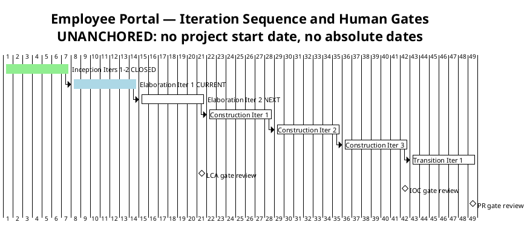
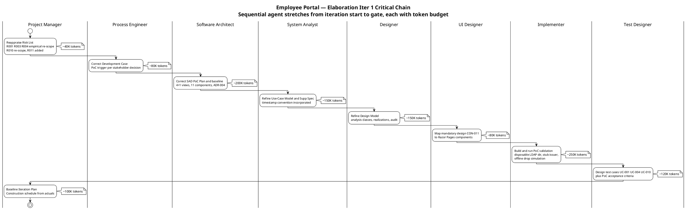

## Document Control

| Field | Value |
|---|---|
| Phase | Elaboration |
| Status | Draft — Elaboration Iter 1 plan |
| Milestone Target | End of Elaboration (LCA) |
| Iteration | 1 (Cycle 1) |
| Date | 2026-09-01 |
| Prior Version | Inception Iteration Plan (Approved at LCO — F1/F2 resolved); EVOLVED, not recreated |
| Elaboration Changes | Fine plan replaced: Inception work items closed, Elaboration Iter 1 critical chain added; coarse roadmap re-anchored to MEASURED Inception actuals (phase-level record governs); Construction schedule baselined; PoC work items scheduled per stakeholder decision (R001 disposable LDAP directory, R003 stub issuer, R004 direct); R010 re-scoped off the Elaboration critical path; two active plans declared (Elab Iter 1 tracking, Elab Iter 2 building) |

## Iteration Objectives

1. **Retire the highest-magnitude risks EMPIRICALLY** — R001 (HIGH) via a disposable LDAP directory, R003 (SIGNIFICANT) via a stub OIDC issuer, R004 (SIGNIFICANT) directly. Per the stakeholder decision: the PoC is produced in Elaboration and validated empirically; an LCA that validates a HIGH architectural risk on paper only will not be accepted.
2. **Correct the architecture baseline to match the stakeholder decision** — the SAD's PoC Plan (analysis-only disposition) and the Development Case's PoC trigger record are superseded; the Architect and Process Engineer own the corrections.
3. **Baseline the Construction schedule** from MEASURED actuals — all 10 UCs assigned to Construction iterations with corrected UC IDs (LCO F1 lesson), sized from the recorded Inception spend, never from the disproven 185K assumption.
4. **Engage STK-004 (R010)** with a written deliverables request — response is NOT a condition of Elaboration exit (stakeholder decision); production-instance integration goes to Construction.
5. **Refine the analysis-level model** — all 10 UCs detailed, timestamp convention (UTC / America/Havana / ISO-8601 offset / local payroll day) incorporated, audit mechanism designed (R006), CON-011 design mapped to Razor Pages (R007).

## Plan and Milestones

### Coarse Cross-Iteration Roadmap

7 total iterations — within the 6 ± 3 rule. Elaboration holds 2 of 7 (~29%, above the ~20% rubber-profile starting point) because the only HIGH-magnitude risk (R001) requires empirical validation this phase; the profile bends to the risk profile, not to the heuristic.

| Phase | Iterations | Milestone | Gate Criteria | Human Gate Queue Time |
|---|---|---|---|---|
| Inception | 2 — **CLOSED** | LCO — **ACHIEVED** | Scope agreed; risks identified; architecture direction sound | **MEASURED: 0s** — stakeholder answered in-round (recorded actual) |
| Elaboration | 2 | LCA | Architecture baselined; R001/R003/R004 retired EMPIRICALLY; Construction viable | [ASSUMPTION — up to 2 days, basis: heavier review than LCO (architecture baseline + PoC evidence); Inception measured 0s with in-round answers] |
| Construction | 3 | IOC | All 10 FRs implemented and tested; all 5 ACs verified; deployable on Windows Server | [ASSUMPTION — up to 3 days, basis: functional acceptance review] |
| Transition | 1 | PR | System in production; 80% adoption measured; documentation delivered | [ASSUMPTION — up to 2 days, basis: final delivery review] |

**Measured actuals (recorded, not estimated) — the Inception phase cost:**

| Phase | Iterations | Agent time | Stakeholder queue | Tokens | Agent runs | Artifacts |
|---|---|---|---|---|---|---|
| Inception | 2 | 28 min | 0s | 1,347,939 | 11 | 10 |

> **Conflict resolution (recorded):** the Inception Iteration Assessment quotes a 3,550,308-token cumulative across its two cycles; the phase-level record above governs — one row per CLOSED phase, no per-iteration velocity is quoted. All forecasts below are built from the phase-level figure.

**Sizing consequence:** the Inception plan's 185K budget box was ~7× under the measured shape — spend is dominated by reasoning over the accumulated artifact surface, not by output volume. Every assumed share is replaced by the measured figure; where no comparable actual exists (Elaboration, Construction, Transition), the figure is an explicit assumption with its basis named.

> **Two clocks, never summed:** iteration bar lengths are structural sequencing units, NOT measured durations — actual duration is governed by the token budget box and recorded in the Iteration Assessment. Human gates are quoted separately in days of queue time in the milestone table. The Inception gate measured 0s of queue; the LCA/IOC/PR gates are assumptions until measured.

### Fine-Grained Plan — Elaboration Iteration 1 (CURRENT, tracking)

This iteration is a **mini-project**: risk retirement (PoC), analysis refinement, design, implementation of validation code, and test design — not a documentation-only phase. The critical chain below shows the sequential agent stretches from iteration start to gate, each annotated with its token budget.

**Iteration budget box: 1,200K tokens** [ASSUMPTION — scaled from the MEASURED Inception actual (1,347,939 tokens, 11 runs, 28 min for 10 artifacts across 2 iterations); Elaboration Iter 1 activates 9 roles reasoning over a larger accumulated surface PLUS PoC code, but produces fewer net-new artifacts. Basis named; the box does not grow to fit scope — scope that does not fit goes to Elaboration Iter 2.]

### Work Items — Elaboration Iteration 1

| # | Work Item | Owner Role | Token Budget | Depends On | Status |
|---|---|---|---|---|---|
| 1 | Risk List reappraisal (R001/R003/R004 empirical re-scope, R010 re-scope, R011 added) | Project Manager | ~40K | — | Complete (this iteration) |
| 2 | Development Case PoC-trigger correction per stakeholder decision | Process Engineer | ~80K | Stakeholder decision | In progress |
| 3 | SAD PoC Plan correction + 4+1 baseline refinement (COMP-010, COMP-011, ADR-004, timestamp convention) | Software Architect | ~200K | Work Item 2 | In progress |
| 4 | Use-Case Model + Supplementary Specification refinement (all 10 UCs detailed; timestamp convention) | System Analyst | ~150K | Work Item 3 | In progress |
| 5 | Design Model refinement (analysis classes, realizations, audit mechanism — R006) | Designer | ~150K | Work Item 4 | In progress |
| 6 | CON-011 design → Razor Pages component mapping (R007) | UI Designer | ~80K | Work Item 3 | In progress |
| 7 | **PoC: R001** — disposable LDAP directory, attribute population + query validation | Implementer | ~100K | Work Item 3 | In progress |
| 8 | **PoC: R003** — stub OIDC issuer, token validation + role-claim extraction | Implementer | ~80K | Work Item 3 | In progress |
| 9 | **PoC: R004** — 5-minute network-drop simulation, localStorage queue, idempotent sync | Implementer | ~70K | Work Item 3 | In progress |
| 10 | Test case design: UC-001, UC-004, UC-010 + PoC acceptance criteria | Test Designer | ~120K | Work Items 7–9 | In progress |
| 11 | Iteration Plan baseline (this document — Construction schedule from measured actuals) | Project Manager | ~100K | Work Items 1–10 | Complete (this iteration) |
| 12 | STK-004 written deliverables request (R010 mitigation) | Project Manager | ~10K | — | In progress |
| **Total** | | | **~1,180K** (box: 1,200K) | | |

> **Status discipline (LCO F2 lesson):** statuses reflect actual repository state. Work Items 2–10 are In progress — their artifacts exist as Draft (Use-Case Model, Supplementary Specification, SAD, Design Model per the artifact registry) or are being produced this cycle; they are reconciled to Complete at iteration close in the Iteration Assessment.

### Construction Schedule Baseline (from measured actuals)

All 10 UCs assigned; UC IDs verified against the Use-Case Model authority (LCO F1 lesson — cross-checked before first upsert). Sequencing is risk-driven: the clocking cluster first (highest adoption risk R002 + simplest user value), the news cluster second (shared audit mechanism R006), directory + export third (R001 residual R011 closes with production integration).

| Construction Iteration | Use Cases | FRs | Key Risks Retired |
|---|---|---|---|
| Construction Iter 1 | UC-001 (Clock In/Out), UC-002 (Own History), UC-005 (Review Clockings), UC-007 (Assign Category) | FR-004, FR-005, FR-001, FR-003 | R004 residual (AC-005 formal test), R008 (CRUD validation) |
| Construction Iter 2 | UC-003 (Browse News), UC-008 (Publish), UC-009 (Edit), UC-010 (Unpublish) | FR-007, FR-006, FR-008, FR-009 | R006 (audit mechanism verified end-to-end) |
| Construction Iter 3 | UC-004 (Directory Search), UC-006 (CSV Export) | FR-010, FR-002 | R011 + R010 (production-instance integration — STK-004 deliverables), R005 (LDAP performance) |

**Construction sizing:** [ASSUMPTION — 3 iterations × ~1,200K tokens each, basis: Elaboration Iter 1 box scaled from the measured Inception actual; Construction adds feature implementation volume but reuses the validated PoC mechanisms. Refined at each Elaboration Iteration Assessment as measured actuals accumulate — no fine-grained Construction plan is produced now (planning beyond the horizon is waste).]

### Next Iteration Preview — Elaboration Iteration 2 (BUILDING)

| Aspect | Plan |
|---|---|
| Primary objective | Close residual findings from Iter 1 review; complete any PoC acceptance criteria not met; finalize LCA evidence package |
| Key risks | Whatever the Iter 1 assessment elevates; R011 monitored; R010 response tracked (not blocking) |
| Agent roles | Driven by Iter 1 Iteration Assessment variance analysis — not pre-committed |
| Budget box | [ASSUMPTION — remainder of the Elaboration phase box (~2,400K total, basis: 2 × the Iter 1 box); refined from Iter 1 measured actuals] |

## Resources

### Agent Role Profile — Elaboration Iteration 1

| Agent Role | Discipline | Intensity | Active This Iteration | Token Budget | Key Deliverable |
|---|---|---|---|---|---|
| Project Manager | Project Management | High | Yes | ~150K | Risk List reappraisal, Iteration Plan baseline, STK-004 request |
| Process Engineer | Environment | Medium | Yes | ~80K | Development Case PoC-trigger correction |
| System Analyst | Requirements | High | Yes | ~150K | Use-Case Model + Supp Spec refinement |
| Software Architect | Analysis & Design | Critical | Yes | ~200K | SAD baseline correction + PoC Plan |
| Designer | Analysis & Design | High | Yes | ~150K | Design Model refinement (audit, realizations) |
| UI Designer | Analysis & Design | Medium | Yes | ~80K | CON-011 → Razor Pages mapping |
| Implementer | Implementation | Critical | Yes | ~250K | R001/R003/R004 PoC validation code |
| Test Designer | Test | High | Yes | ~120K | Test cases UC-001/004/010 + PoC criteria |
| **Total** | | | | **~1,180K** | |

### Budget Split Across Disciplines

| Discipline | Token Share | Rationale |
|---|---|---|
| Analysis & Design | ~36% | Critical intensity — SAD baseline correction + Design Model + UI mapping; the architecture is being baselined for LCA |
| Implementation | ~21% | Critical intensity — the PoC validation code IS the risk-retirement vehicle this phase |
| Requirements | ~13% | High intensity — all 10 UCs detailed; timestamp convention incorporated |
| Project Management | ~13% | High intensity — risk reappraisal, plan baseline, external engagement |
| Test | ~10% | High intensity — test design against PoC acceptance criteria |
| Environment | ~7% | Medium intensity — one targeted Development Case correction |

### Two Clocks (never summed)

| Clock | Elaboration Iter 1 | Basis |
|---|---|---|
| Agent work | ~1,180K tokens; elapsed time measured at iteration close | Budget box; actuals recorded in Iteration Assessment |
| Human gates | LCA review: [ASSUMPTION — up to 2 days queue]; STK-004 response: [ASSUMPTION — up to 5 days queue, external team, low interest per STK-004 profile] | Inception measured 0s gate queue; STK-004 has never been engaged — no measured actual exists |

## Use Cases and Scenarios Addressed

**This iteration's use-case scope (risk-driven, per SAD prioritization and Test Evaluation Summary):** UC-001 (Clock In and Clock Out — exercises OIDC, offline resilience, idempotency, timestamp convention), UC-004 (Search Employee Directory — exercises LDAP, graceful degradation, R001), UC-010 (Unpublish News — exercises audit trail, soft delete). These three are the architecturally significant scenarios validated by the PoCs and detailed in test design. All 10 UCs are refined at the analysis level by the System Analyst; none is implemented as a running feature — implementation is Construction.

| FR ID | Use Case ID | Use Case Name | Elaboration Iter 1 Activity | Construction Iteration |
|---|---|---|---|---|
| FR-004 | UC-001 | Clock In and Clock Out | PoC validation (R003 stub issuer, R004 offline drop); test case design | Construction Iter 1 |
| FR-005 | UC-002 | View Own Clocking History | Analysis refinement | Construction Iter 1 |
| FR-001 | UC-005 | Review Employee Clockings | Analysis refinement | Construction Iter 1 |
| FR-003 | UC-007 | Assign Worker Category | Analysis refinement; ADR-004 category file | Construction Iter 1 |
| FR-007 | UC-003 | Browse News | Analysis refinement | Construction Iter 2 |
| FR-006 | UC-008 | Publish News | Analysis refinement; audit design | Construction Iter 2 |
| FR-008 | UC-009 | Edit Published News | Analysis refinement; audit design | Construction Iter 2 |
| FR-009 | UC-010 | Unpublish News | Audit + soft-delete design; test case design | Construction Iter 2 |
| FR-010 | UC-004 | Search Employee Directory | PoC validation (R001 disposable LDAP directory); test case design | Construction Iter 3 |
| FR-002 | UC-006 | Export Monthly Clocking Report | Analysis refinement; COMP-010 column set; timestamp convention | Construction Iter 3 |

> UC IDs cross-checked against the Use-Case Model §Use-Case Survey (authority) before first upsert — LCO F1 lesson applied.

## Evaluation Criteria

### Layer 1 — Declared Acceptance Criteria Status

| AC ID | Description | Addressed This Iteration? | Evidence / Deferral |
|---|---|---|---|
| AC-001 | Employee can clock in/out without HR help | Deferred to Construction Iter 1 | UC-001 PoC-validated mechanism (offline queue, idempotency); running feature is Construction work |
| AC-002 | HR can publish news without technical assistance | Deferred to Construction Iter 2 | UC-008 analyzed; audit mechanism designed (R006) |
| AC-003 | Employee finds colleague's phone/email in <10 seconds | Partial evidence this iteration | R001 PoC validates attribute population + query path against the disposable directory; formal AC closure at Construction Iter 3 (production integration, R010/R011) |
| AC-004 | 80% of employees complete one clocking with no training | Deferred to Transition Iter 1 | Adoption measurement requires a deployed system (BG-003) |
| AC-005 | System works temporarily offline (5-min network drop) | Partial evidence this iteration | R004 PoC simulates the 5-minute drop: queue, reconnect, idempotent sync, zero duplicates/losses; formal AC test at Construction Iter 1 |

No AC is absent from this table. All 5 declared acceptance criteria are accounted for with explicit evidence or deferral targets.

### Layer 2 — Elaboration Iteration 1 Exit Criteria

| # | Exit Criterion | Verification Method |
|---|---|---|
| 1 | R001 PoC empirically validated against the disposable LDAP directory | PoC acceptance criteria met (Risk List R001): 6 corporate attributes populated, >90% of sampled users per office; graceful degradation verified |
| 2 | R003 PoC empirically validated against the stub OIDC issuer | Token validation succeeds; Employee + HR Administrator roles extracted from claims; redirect flow completes |
| 3 | R004 PoC empirically validated (direct) | 5-minute drop simulated; sync ≤ 60 s; zero duplicates (idempotency key); zero losses; confirmation < 1 s both paths |
| 4 | SAD PoC Plan corrected to match the stakeholder decision | SAD §Quality no longer carries the analysis-only disposition; empirical validation recorded per risk |
| 5 | Development Case PoC-trigger record corrected | Process Engineer's correction committed |
| 6 | Construction schedule baselined from measured actuals | This document — Construction Schedule Baseline section; UC IDs verified against Use-Case Model |
| 7 | STK-004 written deliverables request issued (R010) | Request recorded; response NOT required for Elaboration exit (stakeholder decision) |
| 8 | All 5 ACs accounted for | Layer 1 table complete — AC-001 through AC-005 |

## Traceability

| Element | Traces From | Link Type | Traces To |
|---|---|---|---|
| Iteration Plan (this) | Development Case, SAD (UC prioritization), Risk List (Elab Iter 1), Measured Inception actuals (Work Order) | Refines | Elaboration Iter 1 Iteration Assessment, Elaboration Iter 2 Plan |
| PoC work items 7–9 | Stakeholder decision (Elab Iter 1): "The PoC is produced in Elaboration and validated empirically" | Authorizes | R001, R003, R004 retirement evidence; LCA gate |
| Work Item 2 | Stakeholder decision (Elab Iter 1) — Development Case trigger correction | Derives | Development Case (Process Engineer) |
| Work Item 3 | Stakeholder decision (Elab Iter 1) — SAD PoC Plan superseded | Derives | Software Architecture Document (Architect) |
| Work Items 4–6 | FR-001–FR-010, NFR-001–NFR-005, CON-011, CON-013 | Derives | Use-Case Model, Supplementary Specification, Design Model |
| Work Item 10 | AC-003, AC-005, UC-001, UC-004, UC-010 | Derives | Test case artifacts (Test Designer) |
| Work Item 12 | R010, STK-004, CON-004, CON-005, CON-008 | Derives | Construction Iter 3 integration testing |
| Construction Schedule Baseline | Use-Case Model §Use-Case Survey (UC ID authority), SAD UC prioritization | Derives | Construction Iteration Plans (built at LCA, not before) |
| Budget box 1,200K [ASSUMPTION] | Measured Inception actual (1,347,939 tokens, phase-level record) | DependsOn | Elaboration Iter 1 Iteration Assessment (records actuals) |
| R011 | Stakeholder decision (Elab Iter 1) — validation-environment residual | Derives | Risk List R011, Construction Iter 3 integration |