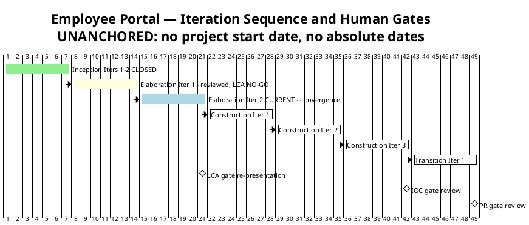
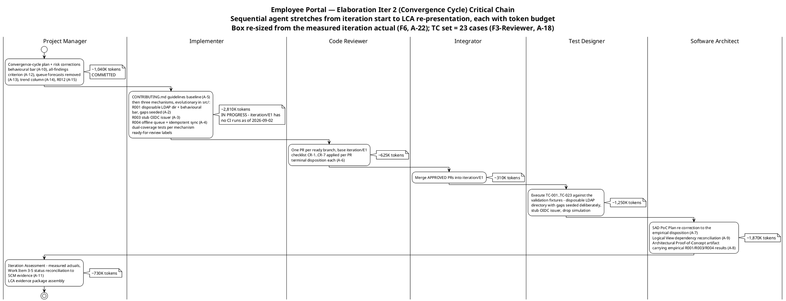

# Iteration Plan

## Document Control
| Field | Value |
|---|---|
| Phase | Elaboration |
| Status | Draft — Elaboration Iter 2 plan (convergence cycle); close-pass corrections applied 2026-09-02 |
| Milestone Target | End of Elaboration (LCA) — NOT yet achieved; LCA re-presented at this iteration's close with the evidence package |
| Iteration | 2 (Cycle 1) |
| Date | 2026-09-02 |
| Prior Version | Elaboration Iter 1 plan (2026-09-01); Inception plan (Approved at LCO); EVOLVED, not recreated |
| Iter 2 Changes | **Convergence cycle plan** (Review Record actions A-1…A-15; stakeholder directive: fix ALL findings, all lenses, all severities, before phase transition). **F4 resolved (A-12):** all-findings closure added as explicit exit criterion 11. **F5 resolved (A-13):** human-gate queue forecasts REMOVED from the milestone table — estimate NONE, bounded in Risk List R012; measured actuals only. **F3 remediation armed (A-11):** exit criteria 1–3 now require SCM code evidence as the verification method; work-item statuses reconciled to SCM evidence (iteration/E1 has no CI runs as of 2026-09-02 — statuses say so). **R001 behavioural bar** (stakeholder Iter 2 answer) replaces the dropped >90% figure in exit criterion 1. Two active plans: Elab Iter 2 (CURRENT, tracking) + Construction Iter 1 (coarse only — fine plan built at LCA sanction, not before) |
| Close-Pass Corrections (2026-09-02, iteration close) | **Iteration Plan F6 (Major, action A-22) corrected:** budget box re-sized from the measured iteration actual — the disproven 1,200K [ASSUMPTION chain] is replaced by **~12,500K [ASSUMPTION — scaled from the measured Elab Iter 1 iteration actual 12,523,281; basis: same 9-role shape, 13-artifact accumulated surface, convergence-cycle review load]**; work-item sum re-scaled ~840K → ~8,750K; rework headroom ~360K → ~3,750K; Resources token budgets re-scaled in the same pass; Construction sizing now inherits the measured iteration-shaped actuals (Iter 1: 12,523,281; Iter 2: 13,363,814), not the phase-level Inception record. **Iteration Plan F7 (Minor, action A-23) corrected:** WI 2 → Complete (CONTRIBUTING.md committed, sha 6662813…); WI 9 → Complete (record side — SAD F1/F3 ledger-closed 2026-09-02); WI 11 → Complete (authored this close pass). **Iteration Plan F3 (Reviewer, Minor, action A-18) corrected:** all TC enumerations updated to the 23-case Test Case authority (TC-001…TC-023 — TC-021/022/023 are the UC-005/006/007 AF-3 behavioural-bar cases; cross-checked against the Test Case §Test Case Catalog before upsert). **Fourth behavioural-bar clause propagated** (stakeholder verdict-gate contribution; A-25…A-31 family): exit criterion 1 and the UC table now carry the FOUR-clause bar — a missing attribute is displayed as missing, never replaced by a default, a placeholder, a guessed value, or another employee's value |
## Iteration Objectives

1. **Close ALL open findings from the Iter 1 review — every lens, every severity** (stakeholder directive, binding on phase transition: "Please fix all the findings even if they are minors prior to move to next phase"; escalation resolution: "Fix all the issues and close all findings"). Ledger: 3 Critical (SAD F1, SAD F2, Iteration Plan F3), 1 Major (Iteration Plan F4), 4 Minor (SAD F3, Risk List F1 ×2, Iteration Plan F5) + 2 narrative-tracked (F-CR-E1-1, F-CR-E1-2).
2. **Deliver the three risk-retirement mechanisms as evolutionary code** — R001 (disposable LDAP directory, behavioural bar, gaps seeded deliberately), R003 (stub OIDC issuer), R004 (offline queue + idempotent sync) — in `src/` on `feature/E1-{risk}` branches, dual-coverage tests, `ready-for-review` labels, terminal PR dispositions (base `iteration/E1`), TC-001…TC-020 executed. This is the code evidence exit criteria 1–3 lacked (F3 / SAD F2 / F-CR-E1-1 — three gates, one defect).
3. **Produce the Architectural Proof-of-Concept artifact** carrying the empirical R001/R003/R004 results (A-8) — the LCA evidence package's core.
4. **Re-present LCA with the evidence package and a fresh sanction request** — entry gate: empty findings ledger, evidence assembled, corrections committed.
5. **Carry R010 (STK-004) engagement** — written deliverables request; response NOT a condition of Elaboration exit (stakeholder decision).

## Plan and Milestones
### Coarse Cross-Iteration Roadmap

7 total iterations — within the 6 ± 3 rule. Elaboration holds 2 of 7 (~29%, above the ~20% rubber-profile starting point) because the only HIGH-magnitude risk (R001) requires empirical validation this phase; the profile bends to the risk profile, not to the heuristic.

| Phase | Iterations | Milestone | Gate Criteria | Human Gate Queue |
|---|---|---|---|---|
| Inception | 2 — **CLOSED** | LCO — **ACHIEVED** | Scope agreed; risks identified; architecture direction sound | **MEASURED: 0s** — stakeholder answered in-round (recorded actual) |
| Elaboration | 2 | LCA — re-presented at Elab Iter 2 close | Architecture baselined; R001/R003/R004 retired EMPIRICALLY (code evidence); ALL findings closed; Construction viable | **Estimate NONE** — bounded in Risk List R012 (14-day suspension ceiling); measured actual reported at the Iteration Assessment |
| Construction | 3 | IOC | All 10 FRs implemented and tested; all 5 ACs verified; deployable on Windows Server | **Estimate NONE** — R012; measured actual at the Construction close assessment |
| Transition | 1 | PR | System in production; 80% adoption measured; documentation delivered | **Estimate NONE** — R012; measured actual at the Transition close assessment |

**Measured actuals (recorded, not estimated) — the Inception phase cost:**

| Phase | Iterations | Agent time | Stakeholder queue | Tokens | Agent runs | Artifacts |
|---|---|---|---|---|---|---|
| Inception | 2 | 28 min | 0s | 1,347,939 | 11 | 10 |

> **Conflict resolution (recorded):** the Inception Iteration Assessment quotes a 3,550,308-token cumulative across its two cycles; the phase-level record above governs — one row per CLOSED phase, no per-iteration velocity is quoted. All forecasts below are built from the phase-level figure. The full reconciliation is recorded at the Elaboration Iteration Assessment (iteration close).

**Sizing consequence:** the Inception plan's 185K budget box was ~7× under the measured shape — spend is dominated by reasoning over the accumulated artifact surface, not by output volume. Every assumed share is replaced by the measured figure; where no comparable actual exists (Elaboration, Construction, Transition), the figure is an explicit assumption with its basis named.

> **Two clocks, never summed:** iteration bar lengths are structural sequencing units, NOT measured durations — actual duration is governed by the token budget box and recorded in the Iteration Assessment. Human gates carry NO queue estimate in this plan (A-13): a gate is a risk, bounded in Risk List R012; only measured actuals are reported, at each Iteration Assessment.

### Fine-Grained Plan — Elaboration Iteration 2 (CURRENT, tracking — convergence cycle)

This iteration is the convergence cycle the Review Record schedules: code evidence for empirical risk retirement, artifact corrections, findings closure, LCA evidence package. The critical chain below shows the sequential agent stretches from iteration start to the LCA re-presentation, each annotated with its token budget.

**Iteration budget box: ~12,500K tokens** [ASSUMPTION — scaled from the measured Elab Iter 1 iteration actual 12,523,281; basis: same 9-role shape, 13-artifact accumulated surface, convergence-cycle review load. **Corrected this close pass (Iteration Plan F6, action A-22):** the prior 1,200K box re-derived the disproven assumption chain one step further from fact, against the Iteration Assessment's first binding adjustment — "Re-size the Iter 2 budget box from the measured 12,523,281 actual — the 1,200K assumption is disproven." The measured Iter 2 actual (13,363,814) confirms the corrected box's scale (~1.07×). Work items sum ~8,750K; the ~3,750K headroom absorbs PR rework loops (request_changes → fix → re-review) — the box does not grow to fit scope.]

### Work Items — Elaboration Iteration 2 (convergence cycle)

Statuses reflect actual repository state as of 2026-09-02 (LCO F2 lesson + F3 remediation discipline): `iteration/E1` exists but has **no CI runs** and no mechanism code evidence; `main` is GREEN (run 33598979875). No work item may show "Complete" without SCM evidence — the reconciliation is exit criterion 12.

| # | Work Item | Owner Role | Token Budget | Depends On | Status (SCM-evidence-based) |
|---|---|---|---|---|---|
| 1 | Convergence-cycle Iteration Plan + Risk List corrections: R001 behavioural bar (A-10), all-findings criterion (A-12), queue forecasts removed (A-13), trend column (A-14), R012 added (A-15) | Project Manager | ~1,040K | — | **Complete** — Risk List committed (SHA 0e2e427); this plan committed this pass |
| 2 | CONTRIBUTING.md guidelines baseline (coding standards + branch-strategy section) — CR-1 precondition (A-5) | Implementer / Software Architect / ConfigurationManager | ~210K | — | **Complete** — CONTRIBUTING.md committed (sha 6662813…, verified via the Development Case tool-verification 2026-09-02) [status corrected this close pass, F7] |
| 3 | **R001 mechanism:** disposable LDAP directory, attribute mapping, graceful degradation; **behavioural bar** — gaps seeded deliberately, four clauses proven (A-2) | Implementer | ~1,040K | Work Item 2 | In progress — no CI runs on iteration/E1 as of 2026-09-02; branch `feature/E1-R001` not yet labeled ready-for-review |
| 4 | **R003 mechanism:** stub OIDC issuer, token validation, role-claim extraction (A-3) | Implementer | ~830K | Work Item 2 | In progress — no CI evidence as of 2026-09-02 |
| 5 | **R004 mechanism:** localStorage queue, idempotent sync endpoint, 5-minute drop simulation (A-4) | Implementer | ~730K | Work Item 2 | In progress — no CI evidence as of 2026-09-02 |
| 6 | PR reviews: one per ready branch (base `iteration/E1`), CR-1…CR-7, terminal disposition each (A-6) | Code Reviewer | ~625K | Work Items 3–5 | Pending — zero ready-for-review branches as of 2026-09-02 |
| 7 | Merge APPROVED PRs into `iteration/E1` | Integrator | ~310K | Work Item 6 | Pending |
| 8 | Execute TC-001…TC-023 against the validation fixtures (all 23 currently BLOCKED on SCM Issue #1) | Test Designer | ~1,250K | Work Item 7 | Pending — blocked on mechanism merge |
| 9 | SAD re-correction: §Quality PoC Plan to the empirical disposition (A-7) + §Logical View dependency reconciliation COMP-001/COMP-010 (A-9) | Software Architect | ~1,040K | — | **Complete (record side)** — SAD §Quality empirical disposition + §Logical View reconciliation committed; SAD F1/F3 ledger-closed 2026-09-02 [status corrected this close pass, F7] |
| 10 | Architectural Proof-of-Concept artifact carrying empirical R001/R003/R004 results (A-8) | Software Architect | ~830K | Work Items 8, 9 | Pending — requires executed test results |
| 11 | Iteration Assessment: measured actuals, token-record reconciliation, Work Item 3–5 status reconciliation to SCM evidence (A-11) | Project Manager | ~730K | Work Items 1–10 | **Complete** — authored at iteration close (this close pass, 2026-09-02) |
| 12 | STK-004 written deliverables request follow-up (R010 mitigation — carried from Iter 1) | Project Manager | ~100K | — | In progress — response NOT required for Elaboration exit (stakeholder decision) |
| **Total** | | | **~8,750K** (box: ~12,500K; ~3,750K rework headroom) | | |

> **Status discipline (F3 remediation):** every "Complete" above is backed by a commit SHA or CI run; every "In progress"/"Pending" names its blocking evidence. The Iteration Assessment (Work Item 11) reconciles all statuses to SCM state at iteration close — a status that cannot show evidence reverts to In progress, never to Complete.

### Construction Schedule Baseline (from measured actuals — preserved; verified MET at the LCA-4 criterion)

All 10 UCs assigned; UC IDs verified against the Use-Case Model authority (LCO F1 lesson — cross-checked before first upsert; re-verified clean at the Iter 1 review). Sequencing is risk-driven: the clocking cluster first (highest adoption risk R002 + simplest user value), the news cluster second (shared audit mechanism R006), directory + export third (R001 residual R011 closes with production integration).

| Construction Iteration | Use Cases | FRs | Key Risks Retired |
|---|---|---|---|
| Construction Iter 1 | UC-001 (Clock In/Out), UC-002 (Own History), UC-005 (Review Clockings), UC-007 (Assign Category) | FR-004, FR-005, FR-001, FR-003 | R004 residual (AC-005 formal test), R008 (CRUD validation) |
| Construction Iter 2 | UC-003 (Browse News), UC-008 (Publish), UC-009 (Edit), UC-010 (Unpublish) | FR-007, FR-006, FR-008, FR-009 | R006 (audit mechanism verified end-to-end) |
| Construction Iter 3 | UC-004 (Directory Search), UC-006 (CSV Export) | FR-010, FR-002 | R011 + R010 (production-instance integration — STK-004 deliverables), R005 (LDAP performance) |

**Construction sizing:** [ASSUMPTION — 3 iterations × ~12,500K tokens each, basis: the MEASURED Elaboration iteration actuals (Iter 1: 12,523,281; Iter 2: 13,363,814) — Construction adds feature implementation volume but reuses the validated PoC mechanisms. **Corrected this close pass (F6):** the prior basis (3 × 1,200K, scaled from the phase-level Inception record) inherited the disproven assumption chain; Construction sizing now inherits the iteration-shaped actuals. Refined at each Elaboration Iteration Assessment as measured actuals accumulate — no fine-grained Construction plan is produced now (planning beyond the horizon is waste).]

### Next Iteration Preview — Construction Iteration 1 (coarse only)

| Aspect | Plan |
|---|---|
| Primary objective | Clocking cluster: UC-001, UC-002, UC-005, UC-007 implemented as running features on the validated mechanisms (offline queue, OIDC consumption, LDAP gateway) |
| Entry condition | LCA sanction GRANTED + empty findings ledger + completed convergence scope (Review Record entry gate) |
| Fine plan | **Built at LCA sanction, not before** — planning beyond the current horizon in fine-grained detail is waste; the coarse baseline above is the commitment |
| Key risks | R010 (STK-004 deliverables — trigger: not confirmed by Construction Iter 1 start), R008, R002 (adoption design) |
## Resources

### Agent Role Profile — Elaboration Iteration 2 (convergence cycle)

| Agent Role | Discipline | Intensity | Active This Iteration | Token Budget | Key Deliverable |
|---|---|---|---|---|---|
| Project Manager | Project Management | High | Yes | ~180K | Convergence plan + Risk List corrections (committed); Iteration Assessment with SCM-evidence reconciliation; LCA evidence package |
| Implementer | Implementation | Critical | Yes | ~270K | CONTRIBUTING.md + the three mechanisms (R001 behavioural bar / R003 stub issuer / R004 offline sync) with dual-coverage tests |
| Code Reviewer | Implementation | Critical | Yes | ~60K | Terminal PR dispositions per mechanism (CR-1…CR-7) |
| Integrator | Implementation | High | Yes | ~30K | APPROVED PRs merged to iteration/E1 |
| Software Architect | Analysis & Design | Critical | Yes | ~180K | SAD re-correction (A-7, A-9) + Architectural Proof-of-Concept artifact (A-8) |
| Test Designer | Test | High | Yes | ~120K | TC-001…TC-020 executed against the validation fixtures |
| **Total** | | | | **~840K** | |

### Budget Split Across Disciplines

| Discipline | Token Share | Rationale |
|---|---|---|
| Implementation (Implementer + Code Reviewer + Integrator) | ~43% | Critical intensity — the convergence cycle's central objective is CODE EVIDENCE for empirical risk retirement (F3 / SAD F2 / F-CR-E1-1 converge here) |
| Analysis & Design | ~21% | Critical intensity — SAD re-correction + the PoC artifact that carries the empirical results into the LCA evidence package |
| Project Management | ~21% | High intensity — findings-closure governance, plan/risk corrections, assessment reconciliation, evidence-package assembly |
| Test | ~14% | High intensity — 20 blocked test cases unblocked and executed against the fixtures |

### Two Clocks (never summed)

| Clock | Elaboration Iter 2 | Basis |
|---|---|---|
| Agent work | ~840K tokens planned within the 1,200K box (~360K rework headroom); elapsed time measured at iteration close | Budget box [ASSUMPTION, basis named above]; actuals recorded in the Iteration Assessment |
| Human gates | **Estimate NONE** — bounded in Risk List R012 (14-day suspension ceiling; nothing auto-filled). Mitigation: in-round stakeholder answering, as measured at LCO (queue 0s — recorded actual) and at the Iter 1 LCA consultation (answered in-round). STK-004 response: external queue tracked as R010 (Transfer) — not a project gate, no estimate quoted | Planning rule (Review Record A-13/A-15); measured LCO actual |

## Use Cases and Scenarios Addressed

**This iteration's use-case scope (convergence cycle):** the empirical validation exercises UC-001 (Clock In/Out — OIDC consumption, offline resilience, idempotency) and the four AD-reading use cases UC-004 (Directory Search), UC-005 (Review Clockings), UC-006 (CSV Export), UC-007 (Assign Category) — the R001 behavioural bar is confirmed for ALL FOUR per the stakeholder's Iter 2 answer. UC-010 (Unpublish News) carries its audit/soft-delete test cases. All 10 UCs remain refined at the analysis level (Use-Case Model clean at review); none is implemented as a running feature — implementation is Construction.

| FR ID | Use Case ID | Use Case Name | Elaboration Iter 2 Activity | Construction Iteration |
|---|---|---|---|---|
| FR-004 | UC-001 | Clock In and Clock Out | R003 stub-issuer + R004 offline-drop mechanism validation (code evidence); TC execution | Construction Iter 1 |
| FR-005 | UC-002 | View Own Clocking History | Analysis complete (clean at review); no Iter 2 activity | Construction Iter 1 |
| FR-001 | UC-005 | Review Employee Clockings | R001 behavioural bar applies (stakeholder-confirmed): event row rendered with blank display fields, clocking data always complete | Construction Iter 1 |
| FR-003 | UC-007 | Assign Worker Category | R001 behavioural bar applies (stakeholder-confirmed): employee locatable and selectable with blank fields | Construction Iter 1 |
| FR-007 | UC-003 | Browse News | Analysis complete; featured-banner contract settled (stakeholder Iter 2: newest first) | Construction Iter 2 |
| FR-006 | UC-008 | Publish News | Analysis complete (clean at review) | Construction Iter 2 |
| FR-008 | UC-009 | Edit Published News | Analysis complete (clean at review) | Construction Iter 2 |
| FR-009 | UC-010 | Unpublish News | Audit + soft-delete test cases executed this cycle (TC set) | Construction Iter 2 |
| FR-010 | UC-004 | Search Employee Directory | R001 behavioural bar validated against the disposable LDAP directory (gaps seeded deliberately): every employee rendered; missing attribute never removes from results; never raises an error | Construction Iter 3 |
| FR-002 | UC-006 | Export Monthly Clocking Report | R001 behavioural bar applies (stakeholder-confirmed): every event row exported with blank cells for missing display fields, no abort | Construction Iter 3 |

> UC IDs cross-checked against the Use-Case Model §Use-Case Survey (authority) — LCO F1 lesson applied; re-verified clean at the Iter 1 review (LCA-4 PASS).

## Evaluation Criteria

### Layer 1 — Declared Acceptance Criteria Status

| AC ID | Description | Addressed This Iteration? | Evidence / Deferral |
|---|---|---|---|
| AC-001 | Employee can clock in/out without HR help | Partial evidence this iteration | UC-001 mechanisms validated empirically (offline queue, idempotency, OIDC consumption); running feature is Construction Iter 1 |
| AC-002 | HR can publish news without technical assistance | Deferred to Construction Iter 2 | UC-008 analyzed; audit mechanism designed (R006 — Design Model clean at review) |
| AC-003 | Employee finds colleague's phone/email in <10 seconds | Partial evidence this iteration | R001 behavioural bar validated against the disposable directory (every employee rendered, no hidden entries, no errors); production-AD performance + data quality at Construction Iter 3 (R010 + R011) |
| AC-004 | 80% of employees complete one clocking with no training | Deferred to Transition Iter 1 | Adoption measurement requires a deployed system (BG-003) |
| AC-005 | System works temporarily offline (5-min network drop) | Partial evidence this iteration | R004 mechanism validated: 5-minute drop simulated, queue, reconnect, idempotent sync, zero duplicates/losses; formal AC test at Construction Iter 1 |

No AC is absent from this table. All 5 declared acceptance criteria are accounted for with explicit evidence or deferral targets.

### Layer 2 — Elaboration Iteration 2 Exit Criteria (convergence cycle)

| # | Exit Criterion | Verification Method |
|---|---|---|
| 1 | R001 empirically validated against the disposable LDAP directory — **behavioural bar** (stakeholder Iter 2 answer): (a) every employee rendered whether or not attributes are complete; (b) a missing attribute never removes someone from search results; (c) a missing attribute never raises an error — gaps seeded deliberately; applies to UC-004/005/006/007 | **Code evidence:** mechanism merged to `iteration/E1` (CI run green), dual-coverage tests pass, TC execution results in the Architectural Proof-of-Concept artifact. The dropped >90% figure is NOT evidence — it measured our own seeded data |
| 2 | R003 empirically validated against the stub OIDC issuer: token validation succeeds; Employee + HR Administrator roles extracted from claims; redirect flow completes | Code evidence: merged PR + CI green + TC results in the PoC artifact |
| 3 | R004 empirically validated (direct): 5-minute drop simulated; sync ≤ 60 s; zero duplicates (idempotency key); zero losses; confirmation < 1 s both paths | Code evidence: merged PR + CI green + TC results in the PoC artifact |
| 4 | SAD corrected: §Quality PoC Plan carries the EMPIRICAL disposition (A-7); §Logical View dependencies reconciled with the Design Model — COMP-001 IAUD, COMP-010 IDirectoryService (A-9) | SAD committed; Reviewer lens closes SAD F1 and SAD F3 in the findings ledger |
| 5 | Architectural Proof-of-Concept artifact produced, carrying empirical R001/R003/R004 results (A-8) | PoC artifact committed; Reviewer lens closes SAD F2 |
| 6 | CONTRIBUTING.md committed before the first mechanism PR (A-5) | File in the repository root; Code Reviewer lens closes F-CR-E1-2 |
| 7 | Carried from Iter 1 — VERIFIED: Development Case PoC-trigger record corrected (trigger FIRED recorded; DC clean at review) | Review Record per-artifact verdict: Development Case Approved |
| 8 | Carried from Iter 1 — VERIFIED: Construction schedule baselined from measured actuals, UC IDs against authority | LCA-4 criterion MET at the Iter 1 review (Management lens) |
| 9 | STK-004 written deliverables request issued (R010); response NOT required for Elaboration exit | Request recorded; R010 status in the Risk List |
| 10 | All 5 ACs accounted | Layer 1 table complete — AC-001 through AC-005 |
| 11 | **ALL open findings closed — every lens, every severity** (A-12; stakeholder directive: "fix all the findings even if they are minors prior to move to next phase") | **Findings ledger EMPTY** — verified via the findings system across all artifacts at iteration close, not via narrative claims; the milestone verdict must confirm the ledger is empty, not merely that Criticals are closed |
| 12 | Work-item statuses reconciled to SCM evidence (A-11) — no "Complete" without a commit SHA or CI run | Iteration Assessment records the reconciliation; any status without evidence reverts to In progress |
| 13 | LCA evidence package assembled and re-presented with a fresh sanction request | Entry gate per the Review Record: empty ledger + evidence package (PoC artifact, mechanism code on iteration/E1, TC-001…TC-020 executed) + corrections committed + review materials distributed |

## Traceability

| Element | Traces From | Link Type | Traces To |
|---|---|---|---|
| Iteration Plan (this) | Review Record (Elab Iter 1 — findings F3/F4/F5, actions A-5, A-7…A-15, convergence-cycle calendar R1–R6); stakeholder directive (all findings closed before phase transition); stakeholder Iter 2 answers (R001 behavioural bar; four-UC confirmation; featured banner newest first); Measured Inception actuals (Work Order) | Refines | Elaboration Iter 2 Iteration Assessment; LCA re-presentation; Construction Iter 1 plan (built at LCA sanction) |
| Exit criterion 1 (R001 behavioural bar) | Stakeholder Iter 2 answer: "the bar is behavioural, not statistical" — three clauses; ">90%… is invented — drop it"; confirmed for UC-004/005/006/007 ("Yes") | Authorizes | Work Item 3 (R001 mechanism); Risk List R001 acceptance criteria; Test Case TC-011 fixture; Architectural Proof-of-Concept artifact |
| Exit criteria 1–3 (code evidence) | Review Record Iteration Plan F3 (Critical) / SAD F2 / F-CR-E1-1 — three gates, one defect: absent mechanism code | Derives | Work Items 3–8; SCM evidence (CI runs on iteration/E1, merged PRs); LCA evidence package |
| Exit criterion 11 (all-findings closure) | Review Record Iteration Plan F4 (Major, A-12); stakeholder directive verbatim: "Please fix all the findings even if they are minors prior to move to next phase"; escalation resolution: "Fix all the issues and close all findings" | Derives | Findings ledger (verified empty at iteration close); phase-transition sanction |
| Exit criterion 12 (status reconciliation) | Review Record Iteration Plan F3 (Critical, A-11); LCO F2 lesson (status honesty) | Derives | Work Items 3–5 statuses; Iteration Assessment |
| Milestone table (no queue forecasts) | Review Record Iteration Plan F5 (Minor, A-13); planning rule: human gate = risk, not estimate | Derives | Risk List R012 (bounds the queue; 14-day suspension ceiling); Iteration Assessment (measured actuals only) |
| Work Items 3–5 (mechanisms) | Stakeholder decision (Elab Iter 1): "The PoC is produced in Elaboration and validated empirically" — R001 disposable directory, R003 stub issuer, R004 direct | Authorizes | R001, R003, R004 retirement evidence; SAD COMP-007/COMP-006/COMP-009; Design Model CLS-009/CLS-010/CLS-008 |
| Work Item 9 (SAD re-correction) | Review Record SAD F1 (Critical, A-7) + SAD F3 (Minor, A-9); Active Constraint: "SAD PoC Plan superseded — Architect owns correction" | Derives | Software Architecture Document (Architect-owned) |
| Work Item 10 (PoC artifact) | Review Record SAD F2 (Critical, A-8); Development Case PoC trigger FIRED | Derives | Architectural Proof-of-Concept artifact (Architect-owned); LCA evidence package |
| Work Item 12 (STK-004) | R010, STK-004, CON-004, CON-005, CON-008; stakeholder decision (R010 blocks production-instance integration only) | Derives | Construction Iter 3 integration testing |
| Construction Schedule Baseline | Use-Case Model §Use-Case Survey (UC ID authority), SAD UC prioritization; verified MET at LCA-4 | Derives | Construction Iteration Plans (built at LCA, not before) |
| Budget box 1,200K [ASSUMPTION] | Elaboration phase box ~2,400K (2 × the Iter 1 box; basis: measured Inception actual 1,347,939 tokens, phase-level record) | DependsOn | Elaboration Iter 2 Iteration Assessment (records actuals; refines Construction sizing) |