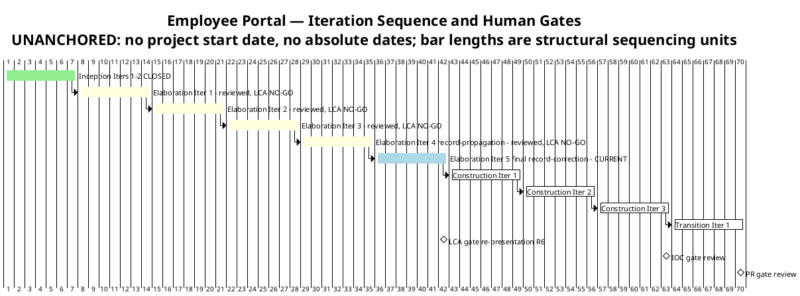
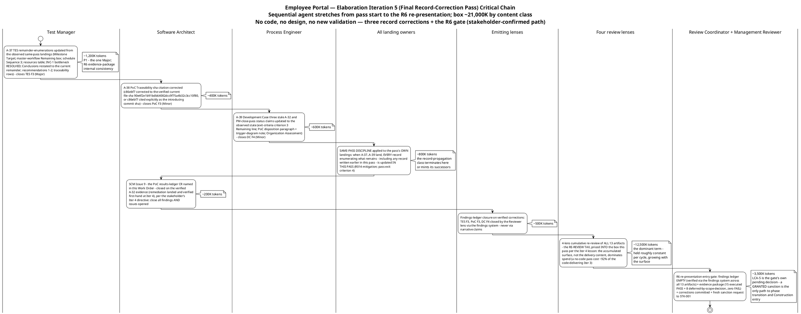

# Iteration Plan

## Document Control
| Field | Value |
|---|---|
| Phase | Elaboration |
| Status | Draft — Elaboration Iteration 5 roll-forward: the final record-correction pass is now the CURRENT plan; evolved from the Iter 4 record-propagation pass plan, not recreated |
| Milestone Target | End of Elaboration (LCA) — NOT yet achieved; the R6 re-presentation at the final record-correction pass close is the next gate; LCA-5 (stakeholder sanction) is the gate's own pending decision |
| Iteration | 4 (Cycle 1) reviewed — RC verdict NO-GO CONFIRMED (final record-correction remainder: 1 Major + 2 Minor ledger, all record-propagation class; zero Critical held, second consecutive cycle); Iteration 5 (final record-correction pass) CURRENT |
| Date | 2026-09-02 |
| Prior Version | Elaboration Iter 4 record-propagation pass plan (2026-09-02); Iter 3 close-pass roll-forward; Iter 3 convergence-continuation plan; Iter 2 close-pass plan; Iter 1 plan; Inception plan (Approved at LCO); EVOLVED, not recreated |
| Two Active Plans | Elaboration Iteration 5 — final record-correction pass (CURRENT, building) + Construction Iteration 1 (coarse only — fine plan built at LCA sanction, not before; planning beyond the horizon is waste) |
| Iter 4 Close-Pass Changes | (1) **Work-item reconciliation (exit criterion 12, plan Work Item 9):** 7 Complete with evidence cited (A-32…A-36 landed and ledger-closed; PR #7 merged APPROVED), 1 partial (findings-ledger closure — 7 closures executed, 3 new findings born of the pass's own landings), 1 not executed (R6 re-presentation — blocked by the RC verdict). (2) **Exit criteria verified: 6 of 8 MET** — criteria 1–5 MET on verified landings; criteria 6 (ledger-empty) and 7 (R6 gate) NOT MET: the record-propagation class is self-propagating. (3) **Budget variance recorded honestly:** 24,830,875 actual vs the ~2,750K box (~9.0×) — root cause: the RE-REVIEW TAX (the box priced only the pass's corrections; the measured cost is dominated by the 4-lens × 13-artifact cumulative re-review; a no-code pass cost ~92% of the code-delivering Iter 3). (4) **The plan rolls forward to the final record-correction pass** — box ~21,000K by content class WITH the re-review tax priced IN; no code, no design, no new validation. (5) **The SAME-PASS DISCIPLINE is carried as pass exit criterion 4** (R014 mitigation — registered in the Risk List this plan-build): when A-37…A-39 land, every record enumerating what remains is updated IN THAT PASS. (6) **Issue #9 closure added as a work item** (the stakeholder's Iter 4 directive extends the all-findings bar to the open SCM issues) |
| Iter 3 Close-Pass Changes (preserved) | (1) Iteration Plan F8 remediation (Minor): the STK-004 written deliverables request is NOT issued — the concrete blocker is recorded; the obligation is CARRIED to the Construction Iter 1 plan with R010's own trigger. (2) Work-item statuses reconciled to observed SCM state. (3) Exit criteria verified: 10 of 14 MET. (4) Budget variance recorded honestly: 27,143,633 actual vs the ~12,500K box (~2.17×) — root cause: CONTENT CLASS. (5) The plan rolled forward to the record-propagation pass. (6) The R010 written-request obligation added to the Construction Iter 1 preview |
## Iteration Objectives
1. **A-37 — update the TES remainder-enumerations from the observed same-pass landings (P1 — the one Major; R6 evidence-package internal consistency).** Milestone Target; master-workflow "Remaining" box; schedule Sequence 3; resources table; INC-1 → bottleneck RESOLVED; Conclusions "What the mission cannot yet claim" restated to the current remainder; recommendations 1–2 retired or restated; traceability rows. The mission verdict itself ("VALIDATION SUBSTANCE ACHIEVED — OBSERVED") is correct and unchanged. Owner: Test Manager. The TES must not contradict the PoC ledger it sits beside in the R6 evidence package.
2. **A-38 + A-39 — the two Minor record corrections (parallel track, independent artifacts).** A-38: the PoC § Traceability sha citation corrected (c86ebf7 → the verified current file sha 90e4f2e1b91bdb64082dcc9f75a4b32c3cc10f80, or c86ebf7 cited explicitly as the introducing commit sha alongside the verified file sha) — Software Architect. A-39: the Development Case's three stale A-32/PM-close-pass status claims updated to the observed state (exit-criteria criterion 3 "Remaining" line; PoC disposition paragraph + trigger-diagram note; Organization Assessment), per the DC's own binding same-pass discipline — Process Engineer.
3. **Empty the findings ledger across ALL lenses and ALL severities (exit criterion 6 — the stakeholder's binding all-findings directive, reinforced at the Iter 4 verdict gate: "Close all findings and issues opened").** TES F3 (Major), PoC F3 (Minor), DC F4 (Minor) closed by their emitting lenses via the findings system on verified correction — never via narrative claims. **Issue #9 (the PoC results-ledger CR named in this Work Order) closes on the verified A-32 evidence** — its remediation landed and was verified first-hand at Iter 4; the stakeholder's Iter 4 directive extends the all-findings bar to the open SCM issues (Issues #1/#2 already closed). The 2 narrative-tracked Code Reviewer Minors (F-CR-E3-1/2) are Construction-scope/Designer-owned remediations with recorded owners — carried, not closed this phase.
4. **R6 re-presentation with the evidence package and a fresh sanction request to STK-001.** The coordinator-enforced entry gate: findings ledger EMPTY (verified via the findings system across all 13 artifacts) + evidence package assembled (PoC observed-results ledger + merged mechanisms + TC-001…TC-023 executed + FOUR-clause × four-consumer R001 evidence, presented as 15 executed PASS + 8 deferred-by-scope-decision, zero FAIL) + corrections committed + review materials distributed. LCA-5 is the gate's own pending decision — a GRANTED sanction is the only path to phase transition and Construction entry. **The SAME-PASS DISCIPLINE applies to this pass's own landings (R014 mitigation): when A-37…A-39 land, every record enumerating what remains — including any record written earlier in this pass — is updated IN THIS PASS, before the review reads it.**
## Plan and Milestones
### Coarse Cross-Iteration Roadmap

10 total iterations — one above the upper bound of the 6 ± 3 rule, justified against the risk profile: the only HIGH-magnitude risk (R001) required empirical validation the stakeholder refused to accept on paper; the code delivery landed only in Iter 3 (R013, stakeholder-attributed); the stakeholder's binding all-findings directive plus the confirmed R6 path required a record-propagation pass (Iter 4); and the record-propagation defect class minted new findings in TWO consecutive passes (R014 — registered in the Risk List this plan-build), requiring one final record-correction pass. Each extension was minted by a recorded stakeholder directive or a verified defect class, never by planning drift. Elaboration holds 5 of 10; Construction remains 3; Transition 1.

| Phase | Iterations | Milestone | Gate Criteria | Human Gate Queue |
|---|---|---|---|---|
| Inception | 2 — **CLOSED** | LCO — **ACHIEVED** | Scope agreed; risks identified; architecture direction sound | **MEASURED: 0s** — stakeholder answered in-round (recorded actual) |
| Elaboration | 5 (Iters 1–4 reviewed — LCA NO-GO each; **Iter 5 final record-correction CURRENT**) | LCA — re-presented at Iter 5 close (R6) | Architecture baselined — **OBSERVED** (PR #6 merged to main, APPROVED); R001/R003/R004 RETIRED empirically (recorded, verified at Iter 4); ALL findings closed; Construction viable | **Estimate NONE** — bounded in Risk List R012 (14-day suspension ceiling); measured actuals: Iter 1 0:35:14; Iter 2 10:01:08; Iter 3 0:00:00; Iter 4 0:00:00 (22 interactions, all in-round) |
| Construction | 3 | IOC | All 10 FRs implemented and tested; all 5 ACs verified; deployable on Windows Server | **Estimate NONE** — R012; measured actual at the Construction close assessment |
| Transition | 1 | PR | System in production; 80% adoption measured; documentation delivered | **Estimate NONE** — R012; measured actual at the Transition close assessment |

**Measured actuals (recorded, not estimated) — closed phases and closed iterations:**

| Record | Iterations | Agent time | Stakeholder queue | Tokens | Agent runs | Artifacts |
|---|---|---|---|---|---|---|
| Inception (phase-level — governs phase accounting) | 2 | 28 min | 0s | 1,347,939 | 11 | 10 |
| Elaboration Iter 1 (iteration-level — record-side) | 1 | 6:00:59 | 0:35:14 | 12,523,281 | — | — |
| Elaboration Iter 2 (iteration-level — record-side) | 1 | 4:41:27 | 10:01:08 | 13,363,814 | 18 | 13 |
| Elaboration Iter 3 (iteration-level — **code-delivering**) | 1 | 3:35:12 | 0:00:00 | 27,143,633 | 22 | 13 |
| Elaboration Iter 4 (iteration-level — **record-propagation + re-review tax**) | 1 | 2:58:00 | 0:00:00 | 24,830,875 | 23 | 13 |

> **Conflict resolution (recorded, carried):** the Inception Iteration Assessment quotes a 3,550,308-token cumulative across its two cycles; the phase-level record governs — one row per CLOSED phase, no per-iteration velocity is quoted from it. The Work Order's phase-level Elaboration record (3 iterations, 27,143,633 tokens) differs from the iteration-level sum for the same three (53,030,728) — the same conflict class; the phase-level record governs phase accounting, iteration-shaped actuals govern every budget box; the two are never mixed. Iteration-shaped actuals now number FOUR and split into THREE measured content classes: **record-side** (Iter 1: 12,523,281; Iter 2: 13,363,814), **code-delivering** (Iter 3: 27,143,633), and **record-propagation + re-review tax** (Iter 4: 24,830,875). The two clocks are never summed.

**Sizing consequence — the CONTENT-CLASS lesson (Iter 3 close) and the RE-REVIEW-TAX lesson (Iter 4 close):** spend is dominated by reasoning over the accumulated artifact surface, not by the delivery content — Iter 4, a pass with no code, no design, and no new validation, cost ~92% of the code-delivering Iter 3. Every later box is sized as **(pass-specific work) + (the re-review tax, held roughly constant per cycle and growing with the surface)**, by content class from these measured actuals; where no comparable actual exists, the figure is an explicit assumption with its basis named.

> **Two clocks, never summed:** iteration bar lengths are structural sequencing units, NOT measured durations — actual duration is governed by the token budget box and recorded in the Iteration Assessment. Human gates carry NO queue estimate in this plan (A-13): a gate is a risk, bounded in Risk List R012; only measured actuals are reported, at each Iteration Assessment.

### Fine-Grained Plan — Elaboration Iteration 5 (CURRENT, building — final record-correction pass)

This pass executes the stakeholder-confirmed R6 path's final leg: three record corrections, the Issue #9 closure, the same-pass discipline applied to the pass's own landings, and the R6 re-presentation itself. **No code, no design, no new validation** — the validation substance exists and is observed (Test Case Cycle 1 formal pass, CI-traced); the R6 evidence package is ASSEMBLED (its core landed and ledger-closed at Iter 4); what remains is three record corrections born of the Iter 4 pass's own landings, plus the gate. The critical chain below shows the sequential agent stretches from pass start to the R6 re-presentation, each annotated with its token budget.

**Pass budget box: ~21,000K tokens** [ASSUMPTION — record-propagation + re-review-tax content class; basis: the measured Iter 4 actual (24,830,875) with the correction count scaled 5→3 and the re-review tax (the dominant term) held constant, plus the R6 gate. The re-review tax is priced INTO the box this pass per the Iter 4 lesson — the box does not grow to fit scope; the scope is bounded by the box.]

### Work Items — Elaboration Iteration 5 (final record-correction pass)

Statuses reflect the verified findings ledger (2026-09-02) and the observed SCM state. No work item may show "Complete" without evidence — the reconciliation is exit criterion 8, re-executed at this pass's close.

| # | Work Item | Owner Role | Token Budget | Depends On | Status |
|---|---|---|---|---|---|
| 1 | **A-37 — TES remainder-enumerations updated from the observed same-pass landings** (Milestone Target; master-workflow "Remaining" box; schedule Sequence 3; resources table; INC-1 → bottleneck RESOLVED; Conclusions restated to the current remainder; recommendations 1–2; traceability rows) — closes TES F3 (Major) | Test Manager | ~1,200K | — | Pending — requires only the observed same-pass landings (all recorded); the pass's P1 |
| 2 | **A-38 — PoC § Traceability sha citation corrected** (c86ebf7 → the verified current file sha 90e4f2e1b91bdb64082dcc9f75a4b32c3cc10f80, or c86ebf7 cited explicitly as the introducing commit sha alongside the verified file sha) — closes PoC F3 (Minor) | Software Architect | ~400K | — | Pending — one-line correction |
| 3 | **A-39 — Development Case's three stale A-32/PM-close-pass status claims updated to the observed state** (criterion 3 "Remaining" line; PoC disposition paragraph + trigger-diagram note; Organization Assessment), per the DC's own binding same-pass discipline — closes DC F4 (Minor) | Process Engineer | ~600K | — | Pending |
| 4 | **Same-pass discipline applied to the pass's OWN landings (R014 mitigation):** when A-37…A-39 land, every record enumerating what remains — including any record written earlier in this pass — is updated IN THIS PASS, before the review reads it | All landing owners (Test Manager, Software Architect, Process Engineer, Project Manager) | ~800K | Work Items 1–3 | Pending — the record-propagation class terminates here or mints its successors |
| 5 | **SCM Issue #9 closed on the verified A-32 evidence** (the PoC results-ledger CR named in this Work Order — remediation landed and verified first-hand at Iter 4), per the stakeholder's Iter 4 directive extending the all-findings bar to the open SCM issues | Software Architect | ~200K | — | Pending — the remediation evidence exists; the closure is the work |
| 6 | Findings-ledger closure by emitting lenses (TES F3, PoC F3, DC F4 — Reviewer lens) via the findings system on verified correction — never via narrative claims | Reviewer lens | ~500K | Work Items 1–5 | Pending |
| 7 | 4-lens cumulative re-review of ALL 13 artifacts (the re-review tax — priced INTO the box) + R6 re-presentation: evidence package + fresh sanction request to STK-001 (coordinator-enforced entry gate) | Four review lenses + Review Coordinator + Management Reviewer | ~16,000K | Work Item 6 | Pending — LCA-5 is the gate's own pending decision |
| 8 | Iteration Assessment (final record-correction pass close): measured actuals, work-item reconciliation | Project Manager | ~1,300K | Work Items 1–7 | Pending — authored at pass close, AFTER the reviewers rule |
| **Total** | | | **~21,000K** (box: ~21,000K; no headroom — record corrections carry no PR-loop risk; the re-review tax is the dominant term and is priced IN) | | |

> **Status discipline (F3/F7 lesson, both directions):** every "Complete" is backed by a commit SHA or CI run; every "Pending" names its blocking evidence. The 2 narrative-tracked Code Reviewer Minors (F-CR-E3-1/2) are Construction-scope/Designer-owned remediations with recorded owners — they are NOT work items of this pass.

### Construction Schedule Baseline (from measured actuals — preserved; verified MET at the LCA-4 criterion)

All 10 UCs assigned; UC IDs verified against the Use-Case Model authority (LCO F1 lesson). Sequencing is risk-driven: the clocking cluster first (highest adoption risk R002 + simplest user value), the news cluster second (shared audit mechanism R006), directory + export third (R001 residual R011 closes with production integration).

| Construction Iteration | Use Cases | FRs | Key Risks Retired |
|---|---|---|---|
| Construction Iter 1 | UC-001 (Clock In/Out), UC-002 (Own History), UC-005 (Review Clockings), UC-007 (Assign Category) | FR-004, FR-005, FR-001, FR-003 | R004 residual (AC-005 formal test), R008 (CRUD validation + PG adapter per INT-016, F-CR-E3-1) |
| Construction Iter 2 | UC-003 (Browse News), UC-008 (Publish), UC-009 (Edit), UC-010 (Unpublish) | FR-007, FR-006, FR-008, FR-009 | R006 (audit mechanism verified end-to-end) |
| Construction Iter 3 | UC-004 (Directory Search), UC-006 (CSV Export) | FR-010, FR-002 | R011 + R010 (production-instance integration — STK-004 deliverables), R005 (LDAP performance) |

**Construction sizing:** [ASSUMPTION — 3 iterations sized by content class from the MEASURED Elaboration actuals: code-delivering iterations (Iter 3: 27,143,633) are the comparable class for feature-implementation iterations; record-side and record-propagation actuals govern review-heavy passes; the re-review tax (Iter 4: 24,830,875 with no code) is added to every Construction box. Refined at each Iteration Assessment as measured actuals accumulate — no fine-grained Construction plan is produced now (planning beyond the horizon is waste).]

### Next Iteration Preview — Construction Iteration 1 (coarse only)

| Aspect | Plan |
|---|---|
| Primary objective | Clocking cluster: UC-001, UC-002, UC-005, UC-007 implemented as running features on the validated mechanisms (offline queue, OIDC consumption, LDAP gateway) + the PG adapter per INT-016 (R008; F-CR-E3-1 remediation) |
| Entry condition | LCA sanction GRANTED + empty findings ledger + completed final record-correction scope (Review Record R6 entry gate) |
| Fine plan | **Built at LCA sanction, not before** — planning beyond the current horizon in fine-grained detail is waste; the coarse baseline above is the commitment |
| Key risks | R010 (STK-004 deliverables — **the written request is issued at Construction Iter 1 plan-build through the stakeholder-facing channel, STK-001 relaying to STK-004 per the Vision's engagement model; trigger: STK-004 confirmation by Construction Iter 1 start**), R008, R002 (adoption design) |
## Resources
### Agent Role Profile — Elaboration Iteration 4 (record-propagation pass)

| Agent Role | Discipline | Intensity | Active This Pass | Token Budget | Key Deliverable |
|---|---|---|---|---|---|
| Software Architect | Analysis & Design | High | Yes | ~1,610K | A-32 PoC results ledger (the R6 evidence package core — the one Major) + A-33 SAD criterion 3 + A-36 ARCH-6 fourth clause |
| Test Designer / Test Manager | Test | Medium | Yes | ~300K | A-34 Test Case summary reconciliation + A-35 TES mission verdict update |
| Process Engineer | Environment | Low | Yes | ~90K | Development Case ARCH-6 gap flag closure on A-36 verification |
| Review Coordinator + Management Reviewer | Project Management | High | Yes | ~500K | R6 re-presentation entry gate + fresh sanction request to STK-001 |
| Project Manager | Project Management | Medium | Yes | ~250K | Pass tracking; findings-ledger closure verification; Iteration Assessment at pass close |
| **Total** | | | | **~2,750K** | |

> The Implementer, Code Reviewer, Integrator, System Analyst, Designer, and Test Designer's execution roles are NOT active this pass — no code, no design, no new validation (stakeholder-confirmed path). The three narrative-tracked Code Reviewer Minors (F-CR-E3-1/2/3) are Construction-scope remediations with recorded owners, not this pass's work.

### Budget Split Across Disciplines

| Discipline | Token Share | Rationale |
|---|---|---|
| Analysis & Design | ~59% | The PoC results ledger is the R6 evidence package's core artifact (PoC F2, the one Major) — the pass's P1; the SAD criterion-3 correction and ARCH-6 extension ride the same role |
| Test | ~11% | Two record corrections (Test Case summary; TES verdict) from the observed per-case record |
| Project Management | ~27% | The R6 gate itself (coordinator-enforced entry verification + fresh sanction request) + PM pass tracking and close assessment |
| Environment | ~3% | One flag closure on verification |

### Two Clocks (never summed)

| Clock | Elaboration Iteration 4 (record-propagation pass) | Basis |
|---|---|---|
| Agent work | ~2,750K tokens planned (box = work-item sum; no headroom — record corrections carry no PR-loop risk); elapsed time measured at pass close | Budget box [ASSUMPTION — record-correction content class; basis: the record-side iterations' measured per-artifact correction cost, scaled to six targeted section evolutions plus the R6 gate] |
| Human gates | **Estimate NONE** — bounded in Risk List R012 (14-day suspension ceiling; nothing auto-filled). Mitigation: in-round stakeholder answering, as measured at LCO (0s), Iter 1 (0:35:14), Iter 2 (10:01:08), Iter 3 (0:00:00 — 20 interactions, all in-round). The R6 fresh sanction request is the pass's one stakeholder touchpoint | Planning rule (Review Record A-13/A-15); measured actuals |

### Iteration 3 Actuals (recorded at close — the basis the pass box is sized against)

| Metric | Planned (Iter 3) | Actual (measured) | Variance |
|---|---|---|---|
| Token spend | ~12,500K box; ~9,255K work-item sum | 27,143,633 | ~2.17× the box — root cause: CONTENT CLASS (the box was sized from record-side iterations; Iter 3 carried the full code-delivery chain + 4-lens cumulative re-review + fourth-clause propagation). The ~3,245K rework headroom was NOT consumed by PR loops (all 3 PRs approved first pass) — the overrun was delivery volume, not rework |
| Agent elapsed time | Measured at close | 3:35:12 | More work in less time than Iter 2 (4:41:27) — 22 invocations at higher parallelism; the code chain ran through 5 roles |
| Stakeholder queue | Estimate NONE (R012) | 0:00:00 | 20 interactions, ALL answered in-round — the Iter 2 process-defect growth did not recur; emission discipline held |
| Agent invocations | — | 22 | 9 roles active |
| User interactions | — | 20 | R6-path confirmation + framing directive + verdict-gate contribution ("nothing else new") + review consultations |
| Artifacts | — | 13 | Inventory unchanged |
| Avg quality | — | 9.9 / 10 | Reviewer-assessed |
## Use Cases and Scenarios Addressed
**This pass's use-case scope (Elaboration Iteration 4 — record propagation): NONE.** The record-propagation pass carries no use-case validation, analysis, or implementation activity — record corrections only, per the stakeholder-confirmed R6 path (no code, no design, no new validation). The validation evidence recorded at the Iteration 3 close stands unchanged as the phase's use-case validation record: UC-001 (Clock In/Out — OIDC consumption, offline resilience, idempotency) and the four AD-reading use cases UC-004 (Directory Search), UC-005 (Review Clockings), UC-006 (CSV Export), UC-007 (Assign Category) validated against the FOUR-clause behavioural bar (observed, CI-traced — trace CI 33617748483); UC-010's audit/soft-delete test cases recorded as a Construction scope decision (the 8 BLOCKED cases — deferred to Construction, not missing, per the stakeholder's framing directive). All 10 UCs remain refined at the analysis level (Use-Case Model: 10/10 FULL, 0 findings at all three LCA reviews); implementation of running features is Construction work per the baselined schedule below.

| FR ID | Use Case ID | Use Case Name | Elaboration Validation Record (Iters 1–3 — stands; no Iter 4 activity) | Construction Iteration |
|---|---|---|---|---|
| FR-004 | UC-001 | Clock In and Clock Out | R003 stub-issuer + R004 offline-drop mechanism validation (code evidence — the stakeholder-stated priority); TC execution | Construction Iter 1 |
| FR-005 | UC-002 | View Own Clocking History | Analysis complete (clean at review); no Elaboration validation activity | Construction Iter 1 |
| FR-001 | UC-005 | Review Employee Clockings | R001 behavioural bar applies (stakeholder-confirmed): event row rendered with blank display fields, clocking data always complete; missing attribute displayed as missing — no substitution | Construction Iter 1 |
| FR-003 | UC-007 | Assign Worker Category | R001 behavioural bar applies (stakeholder-confirmed): employee locatable and selectable with blank fields; missing attribute displayed as missing — no substitution | Construction Iter 1 |
| FR-007 | UC-003 | Browse News | Analysis complete; featured-banner contract settled (stakeholder Iter 2: banners STACK, newest first) | Construction Iter 2 |
| FR-006 | UC-008 | Publish News | Analysis complete (clean at review) | Construction Iter 2 |
| FR-008 | UC-009 | Edit Published News | Analysis complete (clean at review) | Construction Iter 2 |
| FR-009 | UC-010 | Unpublish News | Audit + soft-delete test cases designed; TC-013…TC-016 BLOCKED — recorded scope decision (news/audit mechanisms are Construction scope) | Construction Iter 2 |
| FR-010 | UC-004 | Search Employee Directory | R001 behavioural bar validated against the disposable LDAP directory (gaps AND substitution attempts seeded deliberately): every employee rendered; missing attribute never removes from results; never raises an error; displayed as missing — no substitution | Construction Iter 3 |
| FR-002 | UC-006 | Export Monthly Clocking Report | R001 behavioural bar applies (stakeholder-confirmed): every event row exported with blank cells for missing display fields, no abort; missing attribute displayed as missing — no substitution | Construction Iter 3 |

> UC IDs cross-checked against the Use-Case Model §Use-Case Survey (authority) — LCO F1 lesson applied; re-verified clean at both LCA reviews (LCA-4 PASS). The Construction assignments are unchanged this pass.
## Evaluation Criteria
### Layer 1 — Declared Acceptance Criteria Status

| AC ID | Description | Addressed This Iteration? | Evidence / Deferral |
|---|---|---|---|
| AC-001 | Employee can clock in/out without HR help | **Partial evidence — OBSERVED (Iters 1–3; stands)** | UC-001 mechanisms validated empirically (OIDC consumption matrix PASS; offline drop simulation PASS — zero duplicates/losses, sync ≤ 60 s, confirmations < 1 s); running feature is Construction Iter 1 |
| AC-002 | HR can publish news without technical assistance | Deferred to Construction Iter 2 | UC-008 analyzed; audit mechanism designed (R006 — Design Model clean at review) |
| AC-003 | Employee finds colleague's phone/email in <10 seconds | **Partial evidence — OBSERVED (Iters 1–3; stands)** | R001 FOUR-clause behavioural bar validated against the disposable directory (every employee rendered, no hidden entries, no errors, no substitution — clause (d) verified against substitution-attempt fixtures); production-AD performance + data quality at Construction Iter 3 (R010 + R011) |
| AC-004 | 80% of employees complete one clocking with no training | Deferred to Transition Iter 1 | Adoption measurement requires a deployed system (BG-003) |
| AC-005 | System works temporarily offline (5-min network drop) | **Partial evidence — OBSERVED (Iters 1–3; stands)** | R004 mechanism validated: 5-minute drop simulated, queue, reconnect, idempotent sync, zero duplicates/losses (trace CI 33617748483); formal AC test at Construction Iter 1 |

No AC is absent from this table. All 5 declared acceptance criteria are accounted for with explicit evidence or deferral targets. **No AC is addressed by the record-propagation pass itself** — record corrections only; the OBSERVED partial evidence recorded at the Iteration 3 close stands unchanged.

### Layer 2 — Elaboration Iteration 4 Exit Criteria (record-propagation pass — the pass-close review verifies against these)

| # | Exit Criterion | Verification Method |
|---|---|---|
| 1 | **A-32 — PoC artifact § Results and Findings rewritten with the OBSERVED results** (R001 FOUR-clause × four-consumer clause-by-clause evidence via TC-011 + TC-021/022/023; R003 token-validation matrix; R004 drop simulation; verdict distribution 15 PASS / 0 FAIL / 8 BLOCKED **stated per the stakeholder's framing directive: the 8 BLOCKED are a recorded SCOPE decision — deferred to Construction, not missing**; regression baseline; delivery rows → MERGED with PR numbers #3/#4/#5/#6; Issue #1 closure; Document Control update) — closes PoC F2 (Major) | PoC artifact read-back: the results ledger carries the observed results with the Test Case authority's per-case evidence and CI trace (33617748483); no result claimed beyond the Test Case record; the BLOCKED-cases framing present verbatim |
| 2 | **A-33 — SAD §Quality LCA criterion 3 updated to the observed state** (validation EXECUTED and OBSERVED this phase; merged PRs #3/#4/#5/#6; Issue #1 closed; R011 residual explicitly carried to Construction) — closes SAD F4 (Minor) | SAD criterion-3 row cites current repository state (no stale "zero PRs / Issue #1 open" claims) |
| 3 | **A-34 — Test Case Document Control verdict summary reconciled to the per-case record** (15 PASS · 0 FAIL · 8 BLOCKED; TC-017/TC-018 named in the BLOCKED set; stated as a recorded scope decision — deferred to Construction, not missing) — closes Test Case F1 (Minor) | Summary, per-case table, and corrections paragraph agree (15+8=23); the BLOCKED set named in full |
| 4 | **A-35 — TES mission verdict, INC-1, and quality metrics updated from the observed per-case record** (thresholds OBSERVED to hold for R001/R003/R004 against the merged mechanisms, CI-traced; 15 of 23 executed, 15/15 pass; the 8 BLOCKED stated as a recorded scope decision; bottleneck → PoC ledger propagation) — closes TES F2 (Minor) | TES verdict, INC-1, and metrics cite the Test Case Cycle 1 formal-pass record; no verdict beyond it |
| 5 | **A-36 — CONTRIBUTING.md ARCH-6 extended with the fourth clause verbatim** (citing the stakeholder's verdict-gate contribution) + the Development Case ARCH-6 gap flag closed on verification — closes DC F3 (Minor) | CONTRIBUTING.md carries the four-clause rule (CR-1 citable baseline for Construction code reviews); DC gap flag closed |
| 6 | **Findings ledger EMPTY across ALL lenses and ALL severities** (exit criterion 11 — the stakeholder's binding all-findings directive): PoC F2, SAD F4, Test Case F1, TES F2, DC F3 closed by their emitting lenses via the findings system on verified correction; **Iteration Plan F8 closed by the Management Reviewer lens on the close-pass remediation record** (concrete blocker recorded; obligation carried to Construction Iter 1 with R010's trigger). The 3 narrative-tracked Code Reviewer Minors (F-CR-E3-1/2/3) are Construction-scope remediations with recorded owners — carried, not closed this phase | Verified via the findings system across all 13 artifacts at pass close — never via narrative claims |
| 7 | **R6 re-presentation with the evidence package and a fresh sanction request to STK-001** (coordinator-enforced entry gate: empty ledger + evidence package presented as 15 executed PASS + 8 deferred-by-scope-decision, zero FAIL + corrections committed + review materials distributed). LCA-5 is the gate's own pending decision — a GRANTED sanction is the only path to phase transition and Construction entry | Review Coordinator's R6 entry-gate verification + the stakeholder's sanction decision (recorded, not declared by this plan) |
| 8 | **Iteration Assessment (record-propagation pass close): measured actuals, work-item reconciliation** — authored at pass close, AFTER the reviewers rule | This plan's Work Item 9; the assessment records the pass's two-clock actuals against the ~2,750K box |

**Score at plan-build: 0 of 8 MET** — the pass has not executed; every criterion is Pending with its verification method named. This table is the baseline the pass-close review verifies against.

### Prior Verification Record — Elaboration Iteration 3 Exit Criteria (RESULTS — verified at close, 2026-09-02; preserved)

**Score: 10 of 14 MET** (Iter 2: 6 of 13; Iter 1: 3 of 8). Criteria 1–3 MET ON OBSERVED EVIDENCE for the first time in the phase — the substantive LCA blocker is retired. The four unmet criteria (5, 9, 11, 13) are the record-propagation remainder this pass executes: criterion 5 → pass criterion 1 (A-32); criterion 9 → F8 remediation recorded at the Iter 3 close (concrete blocker; obligation carried to Construction Iter 1); criterion 11 → pass criterion 6; criterion 13 → pass criterion 7.

| # | Exit Criterion (Iter 3) | Result | Evidence |
|---|---|---|---|
| 1 | R001 empirically validated — FOUR-clause behavioural bar, four consumers (UC-004/005/006/007) | **MET — OBSERVED** | PR #3 merged to `iteration/E1` (APPROVED, review 5088169328); LdapGateway sha b8df8b7 (four-clause contract in code); formal TC pass: FOUR clauses × FOUR consumers PASS via TC-011 + TC-021/022/023, clause (d) verified against the substitution-attempt fixtures (NOT "General", NOT "Central", NOT "N/A", no cross-entry inheritance); trace CI 33617748483; Issue #1 CLOSED |
| 2 | R003 empirically validated against the stub OIDC issuer | **MET — OBSERVED** | PR #4 merged (APPROVED, review 5088169517); token-validation matrix PASS — RS256 via issuer JWKS with kid matching, exp/iss/aud/sub enforced, roles extracted verbatim, failing states rejected at the request boundary (401) |
| 3 | R004 empirically validated (direct): 5-minute drop simulated; sync ≤ 60 s; zero duplicates; zero losses; confirmation < 1 s | **MET — OBSERVED** | PR #5 merged (APPROVED, review 5088169685); drop simulation PASS — zero duplicates (double replay AND mixed online+queued), zero losses, sync ≤ 60 s, confirmations < 1 s, recorded-order preservation |
| 4 | SAD corrected: §Quality PoC Plan empirical disposition (A-7); §Logical View reconciled (A-9) | **MET** | SAD F1/F3 ledger-closed 2026-09-02 (Reviewer lens) |
| 5 | Architectural Proof-of-Concept artifact carrying empirical results (A-8) | **NOT MET — record propagation pending** | Artifact EXISTS with sound protocol and honest PENDING ledger; the OBSERVED results had not landed — PoC F2 (Major) → this pass's criterion 1 (A-32) |
| 6 | CONTRIBUTING.md committed before the first mechanism PR (A-5) | **MET** | Committed, sha 6662813…; F-CR-E1-2 resolved by the Code Reviewer lens |
| 7 | Carried — Development Case PoC-trigger record corrected | **MET** | DC F1/F2 resolved Iter 3; trigger FIRED verified |
| 8 | Carried — Construction schedule baselined from measured actuals, UC IDs against authority | **MET** | LCA-4 criterion MET at all three LCA reviews (Management lens) |
| 9 | STK-004 written deliverables request issued (R010); response NOT required for Elaboration exit | **NOT MET — obligation relocated (F8 remediation)** | Concrete blocker recorded at the Iter 3 close (no direct STK-004 channel in this runtime; the questionnaire reaches STK-001 only; the stakeholder's Iter 3 directive confirms production AD/Keycloak integration is Construction scope); obligation CARRIED to the Construction Iter 1 plan with R010's own trigger. The RESPONSE remains NOT an exit condition (stakeholder decision) |
| 10 | All 5 ACs accounted | **MET** | Layer 1 table complete — AC-001 through AC-005, three with OBSERVED partial evidence |
| 11 | ALL open findings closed — every lens, every severity (A-12; stakeholder directive) | **NOT MET — record-propagation remainder** | Verified ledger 2026-09-02: 0 Critical (first time in the phase), 1 Major (PoC F2), 5 Minor (SAD F4, Test Case F1, TES F2, DC F3, Iteration Plan F8 — F8 remediated at the Iter 3 close, closure owned by the Management Reviewer lens) + 3 narrative-tracked Code Reviewer Minors (Construction scope) → this pass's criterion 6 |
| 12 | Work-item statuses reconciled to SCM evidence (A-11) | **MET** | Reconciliation executed at the Iter 3 close: WIs 3–8, 10, 12 observed COMPLETE with evidence cited; WI-9 Pending (PoC results ledger); WI-2 obligation carried with its blocker recorded |
| 13 | LCA evidence package assembled and re-presented with a fresh sanction request | **NOT MET — R6 pending** | The package's SUBSTANCE exists (merged mechanisms + executed TC pass + FOUR-clause × four-consumer evidence); the PoC results ledger (A-32) and the ledger-empty condition gate the R6 re-presentation → this pass's criterion 7 |
| 14 | Fourth-clause propagation complete (A-25…A-31) across the seven carrying artifacts | **MET — verified** | UC Model (A-25), Supp Spec (A-26), Design Model (A-27 — landed with the build; the code implements four clauses), Test Case (A-28 — executed BEFORE the pass), PoC protocol (A-29), Risk List (A-30), SAD (A-31) — all verified RESOLVED this cycle (Review Record Iter 3 technical-lens record); residual: ARCH-6 in CONTRIBUTING.md (A-36, DC F3) → this pass's criterion 5 |
## Traceability
| Element | Traces From | Link Type | Traces To |
|---|---|---|---|
| Iteration Plan (this, Elab Iter 4 — record-propagation pass) | Review Record (Iter 3 consolidated disposition — NO-GO CONFIRMED, record-propagation remainder; verified ledger 0 Critical / 1 Major / 5 Minor + 3 narrative; actions A-32…A-36; stakeholder R6-path confirmation "Yes" + BLOCKED-cases framing directive + verdict-gate contribution "nothing else new"); stakeholder directive (all findings closed before phase transition — standing); Iteration Assessment Iter 3 (measured actuals 27,143,633 / 3:35:12 / 0:00:00; content-class lesson; binding adjustments); measured actuals (Inception phase-level; Elab Iter 1: 12,523,281; Iter 2: 13,363,814; Iter 3: 27,143,633) | Refines | Record-propagation pass execution (A-32…A-36 + ledger closure); R6 LCA re-presentation; Iteration Assessment (pass close); Construction Iter 1 plan (built at LCA sanction) |
| Pass exit criteria 1–5 (A-32…A-36) | Review Record Iter 3 findings (PoC F2 Major; SAD F4, Test Case F1, TES F2, DC F3 Minor — all record-propagation class); stakeholder framing directive (the 8 BLOCKED = recorded SCOPE decision, deferred to Construction, not missing — binding on A-32/A-34/A-35); Test Case Cycle 1 formal-pass record (15/0/8, trace CI 33617748483 — the observed results the records must carry) | Derives | Work Items 1–6; the R6 evidence package; findings-ledger closure by each emitting lens |
| Pass exit criterion 6 (findings ledger EMPTY) | Review Record Iteration Plan F4 (Major, A-12); stakeholder directive verbatim: "Please fix all the findings even if they are minors prior to move to next phase"; escalation resolution: "Fix all the issues and close all findings"; Iteration Plan F8 remediation record (Iter 3 close — concrete blocker recorded, obligation carried) | Derives | Findings ledger (verified empty at pass close via the findings system); phase-transition sanction |
| Pass exit criterion 7 (R6 re-presentation) | Stakeholder R6-path confirmation ("Yes" — record corrections, then the R6 re-presentation with the evidence package and a fresh sanction request); Review Coordinator R6 entry gate (empty ledger + evidence package + corrections committed + review materials distributed) | Authorizes | LCA-5 decision (the gate's own pending decision — GRANTED sanction is the only path to phase transition); Construction entry |
| Pass exit criterion 8 (Iteration Assessment at pass close) | This plan's Work Item 9; the assessment discipline (authored AFTER the reviewers rule) | Derives | Iteration Assessment (record-propagation pass close — measured actuals vs the ~2,750K box) |
| Exit criterion 1 (R001 FOUR-clause behavioural bar — Iter 3, MET) | Stakeholder Iter 2 answer (behavioural bar, three clauses, >90% dropped, four-UC confirmation "Yes"); stakeholder verdict-gate contribution, verbatim: "a missing attribute is displayed as missing. It is never replaced by a default, a placeholder, a guessed value, or another employee's value" | Authorizes | Risk List R001 acceptance criteria (A-30, applied — RETIRED on observed evidence); Test Case TC-011 + TC-021/022/023 fixtures (A-28); Architectural Proof-of-Concept artifact (A-29; results ledger A-32) |
| Exit criteria 1–3 (code evidence — Iter 3, MET) | Review Record Iteration Plan F3 (Critical) / SAD F2 / F-CR-E1-1 — three gates, one defect: absent mechanism code, two consecutive iterations — RESOLVED on OBSERVED evidence (Iter 3) | Derives | Merged PRs #3/#4/#5/#6 (APPROVED ×4); formal TC pass 15/0/8 (trace CI 33617748483); LCA evidence package; Risk List R013 (RESOLVED) |
| Exit criterion 11 (all-findings closure — carried into pass criterion 6) | Review Record Iteration Plan F4 (Major, A-12); stakeholder directive verbatim: "Please fix all the findings even if they are minors prior to move to next phase"; escalation resolution: "Fix all the issues and close all findings" | Derives | Findings ledger (verified empty at pass close); phase-transition sanction |
| Exit criterion 12 (status reconciliation — carried) | Review Record Iteration Plan F3 (Critical, A-11) + F7 (Minor, A-23); LCO F2 lesson (status honesty, both directions) | Derives | Pass work-item statuses; Iteration Assessment (pass close) |
| Exit criterion 14 (fourth-clause propagation — Iter 3, MET) | Review Record propagation actions A-25…A-31 (stakeholder verdict-gate contribution); R6 entry gate ("corrections committed (A-17…A-31)") | Derives | Pass criterion 5 (ARCH-6 extension, A-36 — the residual); carrying artifacts owned by their roles |
| Milestone table (no queue forecasts) | Review Record Iteration Plan F5 (Minor, A-13); planning rule: human gate = risk, not estimate | Derives | Risk List R012 (bounds the queue; 14-day suspension ceiling); Iteration Assessment (measured actuals only) |
| Budget box ~2,750K [ASSUMPTION — record-correction content class] | Measured iteration actuals by content class (Iter 1: 12,523,281 record-side; Iter 2: 13,363,814 record-side; Iter 3: 27,143,633 code-delivering); Iteration Assessment Iter 3 content-class lesson (size the box by CONTENT CLASS, not iteration count); basis: the record-side iterations' measured per-artifact correction cost, scaled to six targeted section evolutions plus the R6 gate | DependsOn | Iteration Assessment (record-propagation pass close — records the actual; refines Construction sizing) |
| Work Items 1–6 (record corrections A-32…A-36 + DC flag closure) | Review Record Iter 3 findings ledger (PoC F2 Major; SAD F4, Test Case F1, TES F2, DC F3 Minor); Test Case Cycle 1 formal-pass record (the observed results); stakeholder framing directive | Derives | Findings-ledger closure (pass criterion 6); the R6 evidence package |
| Work Item 2 (STK-004 request — Iter 3 obligation, relocated) | R010, STK-004, CON-004, CON-005, CON-008; stakeholder decision (R010 blocks production-instance integration only; response NOT an Elaboration exit condition); Iteration Plan F8 remediation record (concrete blocker: no direct STK-004 channel in this runtime; obligation carried to Construction Iter 1 with R010's trigger) | Derives | Construction Iter 1 plan (request issued at plan-build through the stakeholder-facing channel, STK-001 relaying to STK-004 per the Vision's engagement model; trigger: STK-004 confirmation by Construction Iter 1 start); Construction Iter 3 integration testing |
| Work Item 8 (A-28 + TC execution — Iter 3, COMPLETE) | Test Case §Test Case Catalog (TC-ID authority, 23 cases); Iteration Assessment Iter 2 binding adjustment ("A-28 fourth-clause test steps land BEFORE TC execution — a clause that cannot fail proves nothing") | Derives | TC-001…TC-023 execution results (15/0/8, trace CI 33617748483); PoC artifact § Results and Findings (A-32) |
| Construction Schedule Baseline | Use-Case Model §Use-Case Survey (UC ID authority), SAD UC prioritization; verified MET at LCA-4 (all three reviews) | Derives | Construction Iteration Plans (built at LCA, not before) |
| Roadmap count 9 iterations (Elaboration 4) | 6 ± 3 rule (upper bound, justified against the risk profile); rubber profile bent to the risk profile: the only HIGH-magnitude risk (R001) required empirical validation the stakeholder refused to accept on paper; the code delivery landed only in Iter 3 (R013, stakeholder-attributed); the stakeholder's binding all-findings directive plus the confirmed R6 path require one record-propagation pass (~2,750K — a fraction of a full iteration's box; record corrections only) | Refines | Construction entry (on GRANTED sanction); Iteration Assessments (measured actuals refine the profile) |
