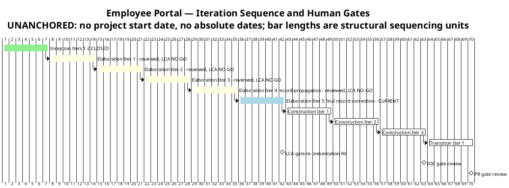
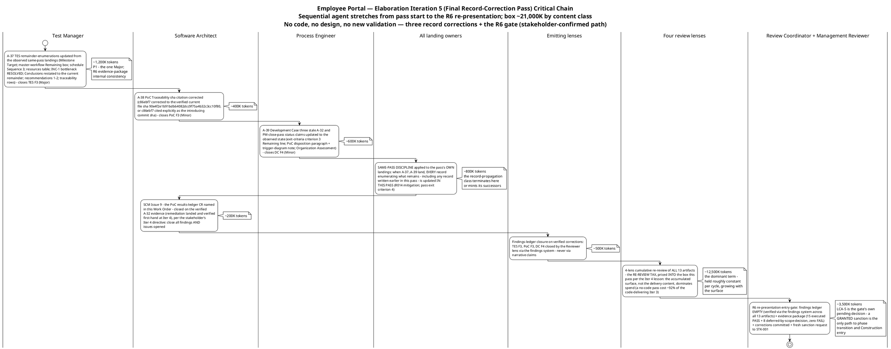

# Iteration Plan

## Document Control
| Field | Value |
|---|---|
| Phase | Elaboration |
| Status | Draft — Elaboration Iteration 5 roll-forward: the final record-correction pass is now the CURRENT plan; evolved from the Iter 4 record-propagation pass plan, not recreated |
| Milestone Target | End of Elaboration (LCA) — NOT yet achieved; the R6 re-presentation at the final record-correction pass close is the next gate; LCA-5 (stakeholder sanction) is the gate's own pending decision |
| Iteration | 4 (Cycle 1) reviewed — RC verdict NO-GO CONFIRMED (final record-correction remainder: 1 Major + 2 Minor ledger, all record-propagation class; zero Critical held, second consecutive cycle); Iteration 5 (final record-correction pass) CURRENT |
| Date | 2026-09-02 |
| Prior Version | Elaboration Iter 4 record-propagation pass plan (2026-09-02); Iter 3 close-pass roll-forward; Iter 3 convergence-continuation plan; Iter 2 close-pass plan; Iter 1 plan; Inception plan (Approved at LCO); EVOLVED, not recreated |
| Two Active Plans | Elaboration Iteration 5 — final record-correction pass (CURRENT, building) + Construction Iteration 1 (coarse only — fine plan built at LCA sanction, not before; planning beyond the horizon is waste) |
| Iter 4 Close-Pass Changes | (1) **Work-item reconciliation (exit criterion 12, plan Work Item 9):** 7 Complete with evidence cited (A-32…A-36 landed and ledger-closed; PR #7 merged APPROVED), 1 partial (findings-ledger closure — 7 closures executed, 3 new findings born of the pass's own landings), 1 not executed (R6 re-presentation — blocked by the RC verdict). (2) **Exit criteria verified: 6 of 8 MET** — criteria 1–5 MET on verified landings; criteria 6 (ledger-empty) and 7 (R6 gate) NOT MET: the record-propagation class is self-propagating. (3) **Budget variance recorded honestly:** 24,830,875 actual vs the ~2,750K box (~9.0×) — root cause: the RE-REVIEW TAX (the box priced only the pass's corrections; the measured cost is dominated by the 4-lens × 13-artifact cumulative re-review; a no-code pass cost ~92% of the code-delivering Iter 3). (4) **The plan rolls forward to the final record-correction pass** — box ~21,000K by content class WITH the re-review tax priced IN; no code, no design, no new validation. (5) **The SAME-PASS DISCIPLINE is carried as pass exit criterion 4** (R014 mitigation — registered in the Risk List this plan-build): when A-37…A-39 land, every record enumerating what remains is updated IN THAT PASS. (6) **Issue #9 closure added as a work item** (the stakeholder's Iter 4 directive extends the all-findings bar to the open SCM issues) |
| Iter 3 Close-Pass Changes (preserved) | (1) Iteration Plan F8 remediation (Minor): the STK-004 written deliverables request is NOT issued — the concrete blocker is recorded; the obligation is CARRIED to the Construction Iter 1 plan with R010's own trigger. (2) Work-item statuses reconciled to observed SCM state. (3) Exit criteria verified: 10 of 14 MET. (4) Budget variance recorded honestly: 27,143,633 actual vs the ~12,500K box (~2.17×) — root cause: CONTENT CLASS. (5) The plan rolled forward to the record-propagation pass. (6) The R010 written-request obligation added to the Construction Iter 1 preview |
## Iteration Objectives
1. **A-37 — update the TES remainder-enumerations from the observed same-pass landings (P1 — the one Major; R6 evidence-package internal consistency).** Milestone Target; master-workflow "Remaining" box; schedule Sequence 3; resources table; INC-1 → bottleneck RESOLVED; Conclusions "What the mission cannot yet claim" restated to the current remainder; recommendations 1–2 retired or restated; traceability rows. The mission verdict itself ("VALIDATION SUBSTANCE ACHIEVED — OBSERVED") is correct and unchanged. Owner: Test Manager. The TES must not contradict the PoC ledger it sits beside in the R6 evidence package.
2. **A-38 + A-39 — the two Minor record corrections (parallel track, independent artifacts).** A-38: the PoC § Traceability sha citation corrected (c86ebf7 → the verified current file sha 90e4f2e1b91bdb64082dcc9f75a4b32c3cc10f80, or c86ebf7 cited explicitly as the introducing commit sha alongside the verified file sha) — Software Architect. A-39: the Development Case's three stale A-32/PM-close-pass status claims updated to the observed state (exit-criteria criterion 3 "Remaining" line; PoC disposition paragraph + trigger-diagram note; Organization Assessment), per the DC's own binding same-pass discipline — Process Engineer.
3. **Empty the findings ledger across ALL lenses and ALL severities (exit criterion 6 — the stakeholder's binding all-findings directive, reinforced at the Iter 4 verdict gate: "Close all findings and issues opened").** TES F3 (Major), PoC F3 (Minor), DC F4 (Minor) closed by their emitting lenses via the findings system on verified correction — never via narrative claims. **Issue #9 (the PoC results-ledger CR named in this Work Order) closes on the verified A-32 evidence** — its remediation landed and was verified first-hand at Iter 4; the stakeholder's Iter 4 directive extends the all-findings bar to the open SCM issues (Issues #1/#2 already closed). The 2 narrative-tracked Code Reviewer Minors (F-CR-E3-1/2) are Construction-scope/Designer-owned remediations with recorded owners — carried, not closed this phase.
4. **R6 re-presentation with the evidence package and a fresh sanction request to STK-001.** The coordinator-enforced entry gate: findings ledger EMPTY (verified via the findings system across all 13 artifacts) + evidence package assembled (PoC observed-results ledger + merged mechanisms + TC-001…TC-023 executed + FOUR-clause × four-consumer R001 evidence, presented as 15 executed PASS + 8 deferred-by-scope-decision, zero FAIL) + corrections committed + review materials distributed. LCA-5 is the gate's own pending decision — a GRANTED sanction is the only path to phase transition and Construction entry. **The SAME-PASS DISCIPLINE applies to this pass's own landings (R014 mitigation): when A-37…A-39 land, every record enumerating what remains — including any record written earlier in this pass — is updated IN THIS PASS, before the review reads it.**
## Plan and Milestones
### Coarse Cross-Iteration Roadmap

10 total iterations — one above the upper bound of the 6 ± 3 rule, justified against the risk profile: the only HIGH-magnitude risk (R001) required empirical validation the stakeholder refused to accept on paper; the code delivery landed only in Iter 3 (R013, stakeholder-attributed); the stakeholder's binding all-findings directive plus the confirmed R6 path required a record-propagation pass (Iter 4); and the record-propagation defect class minted new findings in TWO consecutive passes (R014 — registered in the Risk List this plan-build), requiring one final record-correction pass. Each extension was minted by a recorded stakeholder directive or a verified defect class, never by planning drift. Elaboration holds 5 of 10; Construction remains 3; Transition 1.

| Phase | Iterations | Milestone | Gate Criteria | Human Gate Queue |
|---|---|---|---|---|
| Inception | 2 — **CLOSED** | LCO — **ACHIEVED** | Scope agreed; risks identified; architecture direction sound | **MEASURED: 0s** — stakeholder answered in-round (recorded actual) |
| Elaboration | 5 (Iters 1–4 reviewed — LCA NO-GO each; **Iter 5 final record-correction CURRENT**) | LCA — re-presented at Iter 5 close (R6) | Architecture baselined — **OBSERVED** (PR #6 merged to main, APPROVED); R001/R003/R004 RETIRED empirically (recorded, verified at Iter 4); ALL findings closed; Construction viable | **Estimate NONE** — bounded in Risk List R012 (14-day suspension ceiling); measured actuals: Iter 1 0:35:14; Iter 2 10:01:08; Iter 3 0:00:00; Iter 4 0:00:00 (22 interactions, all in-round) |
| Construction | 3 | IOC | All 10 FRs implemented and tested; all 5 ACs verified; deployable on Windows Server | **Estimate NONE** — R012; measured actual at the Construction close assessment |
| Transition | 1 | PR | System in production; 80% adoption measured; documentation delivered | **Estimate NONE** — R012; measured actual at the Transition close assessment |

**Measured actuals (recorded, not estimated) — closed phases and closed iterations:**

| Record | Iterations | Agent time | Stakeholder queue | Tokens | Agent runs | Artifacts |
|---|---|---|---|---|---|---|
| Inception (phase-level — governs phase accounting) | 2 | 28 min | 0s | 1,347,939 | 11 | 10 |
| Elaboration Iter 1 (iteration-level — record-side) | 1 | 6:00:59 | 0:35:14 | 12,523,281 | — | — |
| Elaboration Iter 2 (iteration-level — record-side) | 1 | 4:41:27 | 10:01:08 | 13,363,814 | 18 | 13 |
| Elaboration Iter 3 (iteration-level — **code-delivering**) | 1 | 3:35:12 | 0:00:00 | 27,143,633 | 22 | 13 |
| Elaboration Iter 4 (iteration-level — **record-propagation + re-review tax**) | 1 | 2:58:00 | 0:00:00 | 24,830,875 | 23 | 13 |

> **Conflict resolution (recorded, carried):** the Inception Iteration Assessment quotes a 3,550,308-token cumulative across its two cycles; the phase-level record governs — one row per CLOSED phase, no per-iteration velocity is quoted from it. The Work Order's phase-level Elaboration record (3 iterations, 27,143,633 tokens) differs from the iteration-level sum for the same three (53,030,728) — the same conflict class; the phase-level record governs phase accounting, iteration-shaped actuals govern every budget box; the two are never mixed. Iteration-shaped actuals now number FOUR and split into THREE measured content classes: **record-side** (Iter 1: 12,523,281; Iter 2: 13,363,814), **code-delivering** (Iter 3: 27,143,633), and **record-propagation + re-review tax** (Iter 4: 24,830,875). The two clocks are never summed.

**Sizing consequence — the CONTENT-CLASS lesson (Iter 3 close) and the RE-REVIEW-TAX lesson (Iter 4 close):** spend is dominated by reasoning over the accumulated artifact surface, not by the delivery content — Iter 4, a pass with no code, no design, and no new validation, cost ~92% of the code-delivering Iter 3. Every later box is sized as **(pass-specific work) + (the re-review tax, held roughly constant per cycle and growing with the surface)**, by content class from these measured actuals; where no comparable actual exists, the figure is an explicit assumption with its basis named.

> **Two clocks, never summed:** iteration bar lengths are structural sequencing units, NOT measured durations — actual duration is governed by the token budget box and recorded in the Iteration Assessment. Human gates carry NO queue estimate in this plan (A-13): a gate is a risk, bounded in Risk List R012; only measured actuals are reported, at each Iteration Assessment.

### Fine-Grained Plan — Elaboration Iteration 5 (CURRENT, building — final record-correction pass)

This pass executes the stakeholder-confirmed R6 path's final leg: three record corrections, the Issue #9 closure, the same-pass discipline applied to the pass's own landings, and the R6 re-presentation itself. **No code, no design, no new validation** — the validation substance exists and is observed (Test Case Cycle 1 formal pass, CI-traced); the R6 evidence package is ASSEMBLED (its core landed and ledger-closed at Iter 4); what remains is three record corrections born of the Iter 4 pass's own landings, plus the gate. The critical chain below shows the sequential agent stretches from pass start to the R6 re-presentation, each annotated with its token budget.

**Pass budget box: ~21,000K tokens** [ASSUMPTION — record-propagation + re-review-tax content class; basis: the measured Iter 4 actual (24,830,875) with the correction count scaled 5→3 and the re-review tax (the dominant term) held constant, plus the R6 gate. The re-review tax is priced INTO the box this pass per the Iter 4 lesson — the box does not grow to fit scope; the scope is bounded by the box.]

### Work Items — Elaboration Iteration 5 (final record-correction pass)

Statuses reflect the verified findings ledger (2026-09-02) and the observed SCM state. No work item may show "Complete" without evidence — the reconciliation is exit criterion 8, re-executed at this pass's close.

| # | Work Item | Owner Role | Token Budget | Depends On | Status |
|---|---|---|---|---|---|
| 1 | **A-37 — TES remainder-enumerations updated from the observed same-pass landings** (Milestone Target; master-workflow "Remaining" box; schedule Sequence 3; resources table; INC-1 → bottleneck RESOLVED; Conclusions restated to the current remainder; recommendations 1–2; traceability rows) — closes TES F3 (Major) | Test Manager | ~1,200K | — | Pending — requires only the observed same-pass landings (all recorded); the pass's P1 |
| 2 | **A-38 — PoC § Traceability sha citation corrected** (c86ebf7 → the verified current file sha 90e4f2e1b91bdb64082dcc9f75a4b32c3cc10f80, or c86ebf7 cited explicitly as the introducing commit sha alongside the verified file sha) — closes PoC F3 (Minor) | Software Architect | ~400K | — | Pending — one-line correction |
| 3 | **A-39 — Development Case's three stale A-32/PM-close-pass status claims updated to the observed state** (criterion 3 "Remaining" line; PoC disposition paragraph + trigger-diagram note; Organization Assessment), per the DC's own binding same-pass discipline — closes DC F4 (Minor) | Process Engineer | ~600K | — | Pending |
| 4 | **Same-pass discipline applied to the pass's OWN landings (R014 mitigation):** when A-37…A-39 land, every record enumerating what remains — including any record written earlier in this pass — is updated IN THIS PASS, before the review reads it | All landing owners (Test Manager, Software Architect, Process Engineer, Project Manager) | ~800K | Work Items 1–3 | Pending — the record-propagation class terminates here or mints its successors |
| 5 | **SCM Issue #9 closed on the verified A-32 evidence** (the PoC results-ledger CR named in this Work Order — remediation landed and verified first-hand at Iter 4), per the stakeholder's Iter 4 directive extending the all-findings bar to the open SCM issues | Software Architect | ~200K | — | Pending — the remediation evidence exists; the closure is the work |
| 6 | Findings-ledger closure by emitting lenses (TES F3, PoC F3, DC F4 — Reviewer lens) via the findings system on verified correction — never via narrative claims | Reviewer lens | ~500K | Work Items 1–5 | Pending |
| 7 | 4-lens cumulative re-review of ALL 13 artifacts (the re-review tax — priced INTO the box) + R6 re-presentation: evidence package + fresh sanction request to STK-001 (coordinator-enforced entry gate) | Four review lenses + Review Coordinator + Management Reviewer | ~16,000K | Work Item 6 | Pending — LCA-5 is the gate's own pending decision |
| 8 | Iteration Assessment (final record-correction pass close): measured actuals, work-item reconciliation | Project Manager | ~1,300K | Work Items 1–7 | Pending — authored at pass close, AFTER the reviewers rule |
| **Total** | | | **~21,000K** (box: ~21,000K; no headroom — record corrections carry no PR-loop risk; the re-review tax is the dominant term and is priced IN) | | |

> **Status discipline (F3/F7 lesson, both directions):** every "Complete" is backed by a commit SHA or CI run; every "Pending" names its blocking evidence. The 2 narrative-tracked Code Reviewer Minors (F-CR-E3-1/2) are Construction-scope/Designer-owned remediations with recorded owners — they are NOT work items of this pass.

### Construction Schedule Baseline (from measured actuals — preserved; verified MET at the LCA-4 criterion)

All 10 UCs assigned; UC IDs verified against the Use-Case Model authority (LCO F1 lesson). Sequencing is risk-driven: the clocking cluster first (highest adoption risk R002 + simplest user value), the news cluster second (shared audit mechanism R006), directory + export third (R001 residual R011 closes with production integration).

| Construction Iteration | Use Cases | FRs | Key Risks Retired |
|---|---|---|---|
| Construction Iter 1 | UC-001 (Clock In/Out), UC-002 (Own History), UC-005 (Review Clockings), UC-007 (Assign Category) | FR-004, FR-005, FR-001, FR-003 | R004 residual (AC-005 formal test), R008 (CRUD validation + PG adapter per INT-016, F-CR-E3-1) |
| Construction Iter 2 | UC-003 (Browse News), UC-008 (Publish), UC-009 (Edit), UC-010 (Unpublish) | FR-007, FR-006, FR-008, FR-009 | R006 (audit mechanism verified end-to-end) |
| Construction Iter 3 | UC-004 (Directory Search), UC-006 (CSV Export) | FR-010, FR-002 | R011 + R010 (production-instance integration — STK-004 deliverables), R005 (LDAP performance) |

**Construction sizing:** [ASSUMPTION — 3 iterations sized by content class from the MEASURED Elaboration actuals: code-delivering iterations (Iter 3: 27,143,633) are the comparable class for feature-implementation iterations; record-side and record-propagation actuals govern review-heavy passes; the re-review tax (Iter 4: 24,830,875 with no code) is added to every Construction box. Refined at each Iteration Assessment as measured actuals accumulate — no fine-grained Construction plan is produced now (planning beyond the horizon is waste).]

### Next Iteration Preview — Construction Iteration 1 (coarse only)

| Aspect | Plan |
|---|---|
| Primary objective | Clocking cluster: UC-001, UC-002, UC-005, UC-007 implemented as running features on the validated mechanisms (offline queue, OIDC consumption, LDAP gateway) + the PG adapter per INT-016 (R008; F-CR-E3-1 remediation) |
| Entry condition | LCA sanction GRANTED + empty findings ledger + completed final record-correction scope (Review Record R6 entry gate) |
| Fine plan | **Built at LCA sanction, not before** — planning beyond the current horizon in fine-grained detail is waste; the coarse baseline above is the commitment |
| Key risks | R010 (STK-004 deliverables — **the written request is issued at Construction Iter 1 plan-build through the stakeholder-facing channel, STK-001 relaying to STK-004 per the Vision's engagement model; trigger: STK-004 confirmation by Construction Iter 1 start**), R008, R002 (adoption design) |
## Resources
### Agent Role Profile — Elaboration Iteration 5 (final record-correction pass)

| Agent Role | Discipline | Intensity | Active This Pass | Token Budget | Key Deliverable |
|---|---|---|---|---|---|
| Test Manager | Test | Medium | Yes | ~1,200K | A-37 TES remainder-enumerations update (the one Major — R6 evidence-package internal consistency) |
| Software Architect | Analysis & Design | Medium | Yes | ~600K | A-38 PoC sha citation + the Issue #9 closure on the verified A-32 evidence |
| Process Engineer | Environment | Low | Yes | ~600K | A-39 Development Case status-claims update (three locations, per the DC's own same-pass discipline) |
| All landing owners (same-pass discipline) | Cross-discipline | — | Yes | ~800K | Every record enumerating what remains updated IN THIS PASS when A-37…A-39 land (R014 mitigation) |
| Reviewer lens | Project Management | High | Yes | ~500K | Findings-ledger closure on verified corrections (TES F3, PoC F3, DC F4) |
| Four review lenses + Review Coordinator + Management Reviewer | Project Management | High | Yes | ~16,000K | 4-lens cumulative re-review of ALL 13 artifacts (the re-review tax) + the R6 re-presentation entry gate + fresh sanction request to STK-001 |
| Project Manager | Project Management | Medium | Yes | ~1,300K | Pass tracking; same-pass discipline enforcement; Iteration Assessment at pass close |
| **Total** | | | | **~21,000K** | |

> The Implementer, Code Reviewer, Integrator, System Analyst, Designer, and Test Designer's execution roles are NOT active this pass — no code, no design, no new validation (stakeholder-confirmed path). The 2 narrative-tracked Code Reviewer Minors (F-CR-E3-1/2) are Construction-scope/Designer-owned remediations with recorded owners, not this pass's work.

### Budget Split Across Disciplines

| Discipline | Token Share | Rationale |
|---|---|---|
| Project Management (review + gate + PM) | ~85% | The re-review tax (4 lenses × 13 artifacts, ~12,500K) + the R6 gate (~3,500K) + findings closure (~500K) + PM tracking and close assessment (~1,300K) — the dominant terms, priced INTO the box per the Iter 4 lesson |
| Test | ~6% | The one Major (A-37 — TES remainder-enumerations) |
| Analysis & Design | ~3% | A-38 PoC sha citation + the Issue #9 closure |
| Environment | ~3% | A-39 DC status-claims update |
| Cross-discipline (same-pass discipline) | ~4% | R014 mitigation — every landing owner updates every record enumerating what remains, in this pass |

### Two Clocks (never summed)

| Clock | Elaboration Iteration 5 (final record-correction pass) | Basis |
|---|---|---|
| Agent work | ~21,000K tokens planned (box = work-item sum; no headroom — record corrections carry no PR-loop risk; the re-review tax is the dominant term and is priced IN); elapsed time measured at pass close | Budget box [ASSUMPTION — record-propagation + re-review-tax content class; basis: the measured Iter 4 actual (24,830,875) with the correction count scaled 5→3 and the re-review tax held constant, plus the R6 gate] |
| Human gates | **Estimate NONE** — bounded in Risk List R012 (14-day suspension ceiling; nothing auto-filled). Mitigation: in-round stakeholder answering, as measured at LCO (0s), Iter 1 (0:35:14), Iter 2 (10:01:08), Iter 3 (0:00:00), Iter 4 (0:00:00 — 22 interactions, the heaviest load of the phase). The R6 fresh sanction request is the pass's one stakeholder touchpoint | Planning rule (Review Record A-13/A-15); measured actuals |

### Iteration 4 Actuals (recorded at close — the basis the pass box is sized against)

| Metric | Planned (Iter 4) | Actual (measured) | Variance |
|---|---|---|---|
| Token spend | ~2,750K box (work-item sum = box; no headroom) | 24,830,875 | ~9.0× the box — root cause: the RE-REVIEW TAX (the box priced only the pass's corrections; the measured cost is dominated by the 4-lens × 13-artifact cumulative re-review, a code handoff the plan declared out of scope (PR #7), the 22-interaction contribution cycle, and the PM close-pass). The decisive evidence: a no-code pass cost ~92% of the code-delivering Iter 3 — the accumulated surface, not the delivery content, dominates spend |
| Agent elapsed time | Measured at close | 2:58:00 | Work time; never summed with queue; decreased vs Iter 3 (3:35:12) while token spend held (~92%) — the cost is long-context reasoning, not wall-clock work; 23 invocations at high parallelism |
| Stakeholder queue | Estimate NONE (R012) | 0:00:00 | 22 interactions, ALL answered in-round — the heaviest interaction load of the phase, zero queue; second consecutive zero-queue iteration; the emission-format standing rule held under load |
| Agent invocations | — | 23 | 5 roles active + the Code Reviewer gate |
| User interactions | — | 22 | Verdict-gate contribution ("Close all findings and issues opened") + review consultations |
| Artifacts | — | 13 | Inventory unchanged |
| Avg quality | — | 9.9 / 10 | Reviewer-assessed |
## Use Cases and Scenarios Addressed
**This pass's use-case scope (Elaboration Iteration 5 — final record-correction): NONE.** The final record-correction pass carries no use-case validation, analysis, or implementation activity — three record corrections, the Issue #9 closure, and the R6 gate, per the stakeholder-confirmed R6 path (no code, no design, no new validation). The validation evidence recorded at the Iteration 3 close stands unchanged as the phase's use-case validation record: UC-001 (Clock In/Out — OIDC consumption, offline resilience, idempotency) and the four AD-reading use cases UC-004 (Directory Search), UC-005 (Review Clockings), UC-006 (CSV Export), UC-007 (Assign Category) validated against the FOUR-clause behavioural bar (observed, CI-traced — trace CI 33617748483); UC-010's audit/soft-delete test cases recorded as a Construction scope decision (the 8 BLOCKED cases — deferred to Construction, not missing, per the stakeholder's framing directive). All 10 UCs remain refined at the analysis level (Use-Case Model: 10/10 FULL, 0 findings at all four LCA reviews); implementation of running features is Construction work per the baselined schedule below.

| FR ID | Use Case ID | Use Case Name | Elaboration Validation Record (Iters 1–3 — stands; no Iter 5 activity) | Construction Iteration |
|---|---|---|---|---|
| FR-004 | UC-001 | Clock In and Clock Out | R003 stub-issuer + R004 offline-drop mechanism validation (code evidence — the stakeholder-stated priority); TC execution | Construction Iter 1 |
| FR-005 | UC-002 | View Own Clocking History | Analysis complete (clean at review); no Elaboration validation activity | Construction Iter 1 |
| FR-001 | UC-005 | Review Employee Clockings | R001 behavioural bar applies (stakeholder-confirmed): event row rendered with blank display fields, clocking data always complete; missing attribute displayed as missing — no substitution | Construction Iter 1 |
| FR-003 | UC-007 | Assign Worker Category | R001 behavioural bar applies (stakeholder-confirmed): employee locatable and selectable with blank fields; missing attribute displayed as missing — no substitution | Construction Iter 1 |
| FR-007 | UC-003 | Browse News | Analysis complete; featured-banner contract settled (stakeholder Iter 2: banners STACK, newest first) | Construction Iter 2 |
| FR-006 | UC-008 | Publish News | Analysis complete (clean at review) | Construction Iter 2 |
| FR-008 | UC-009 | Edit Published News | Analysis complete (clean at review) | Construction Iter 2 |
| FR-009 | UC-010 | Unpublish News | Audit + soft-delete test cases designed; TC-013…TC-016 BLOCKED — recorded scope decision (news/audit mechanisms are Construction scope) | Construction Iter 2 |
| FR-010 | UC-004 | Search Employee Directory | R001 behavioural bar validated against the disposable LDAP directory (gaps AND substitution attempts seeded deliberately): every employee rendered; missing attribute never removes from results; never raises an error; displayed as missing — no substitution | Construction Iter 3 |
| FR-002 | UC-006 | Export Monthly Clocking Report | R001 behavioural bar applies (stakeholder-confirmed): every event row exported with blank cells for missing display fields, no abort; missing attribute displayed as missing — no substitution | Construction Iter 3 |

> UC IDs cross-checked against the Use-Case Model §Use-Case Survey (authority) — LCO F1 lesson applied; re-verified clean at all four LCA reviews (LCA-4 PASS). The Construction assignments are unchanged this pass.
## Evaluation Criteria
### Layer 1 — Declared Acceptance Criteria Status

| AC ID | Description | Addressed This Iteration? | Evidence / Deferral |
|---|---|---|---|
| AC-001 | Employee can clock in/out without HR help | **Partial evidence — OBSERVED (Iters 1–3; stands)** | UC-001 mechanisms validated empirically (OIDC consumption matrix PASS; offline drop simulation PASS — zero duplicates/losses, sync ≤ 60 s, confirmations < 1 s); running feature is Construction Iter 1 |
| AC-002 | HR can publish news without technical assistance | Deferred to Construction Iter 2 | UC-008 analyzed; audit mechanism designed (R006 — Design Model clean at review) |
| AC-003 | Employee finds colleague's phone/email in <10 seconds | **Partial evidence — OBSERVED (Iters 1–3; stands)** | R001 FOUR-clause behavioural bar validated against the disposable directory (every employee rendered, no hidden entries, no errors, no substitution — clause (d) verified against substitution-attempt fixtures); production-AD performance + data quality at Construction Iter 3 (R010 + R011) |
| AC-004 | 80% of employees complete one clocking with no training | Deferred to Transition Iter 1 | Adoption measurement requires a deployed system (BG-003) |
| AC-005 | System works temporarily offline (5-min network drop) | **Partial evidence — OBSERVED (Iters 1–3; stands)** | R004 mechanism validated: 5-minute drop simulated, queue, reconnect, idempotent sync, zero duplicates/losses (trace CI 33617748483); formal AC test at Construction Iter 1 |

No AC is absent from this table. All 5 declared acceptance criteria are accounted for with explicit evidence or deferral targets. **No AC is addressed by the final record-correction pass itself** — record corrections only; the OBSERVED partial evidence recorded at the Iteration 3 close stands unchanged.

### Layer 2 — Elaboration Iteration 5 Exit Criteria (final record-correction pass — the pass-close review verifies against these)

| # | Exit Criterion | Verification Method |
|---|---|---|
| 1 | **A-37 — TES remainder-enumerations updated from the observed same-pass landings** (Milestone Target; master-workflow "Remaining" box; schedule Sequence 3; resources table; INC-1 → bottleneck RESOLVED; Conclusions "What the mission cannot yet claim" restated to the current remainder; recommendations 1–2 retired or restated; traceability rows) — closes TES F3 (Major). The mission verdict itself ("VALIDATION SUBSTANCE ACHIEVED — OBSERVED") is correct and unchanged | TES read-back: no location claims A-32/A-34/A-36/PM-close-pass are PENDING/OPEN (all four are observed landed and ledger-closed); the mission verdict cites the Test Case Cycle 1 formal-pass record; no verdict beyond it |
| 2 | **A-38 — PoC § Traceability sha citation corrected** (c86ebf7 → the verified current file sha 90e4f2e1b91bdb64082dcc9f75a4b32c3cc10f80, or c86ebf7 cited explicitly as the introducing commit sha alongside the verified file sha) — closes PoC F3 (Minor) | PoC traceability row read-back: the citation matches the verified file sha (or names c86ebf7 explicitly as a commit sha); the substantive claim (four-clause ARCH-6) unchanged and verified |
| 3 | **A-39 — Development Case's three stale A-32/PM-close-pass status claims updated to the observed state** (exit-criteria criterion 3 "Remaining" line; PoC disposition paragraph + trigger-diagram note; Organization Assessment), per the DC's own binding same-pass discipline — closes DC F4 (Minor) | DC read-back: all three locations state the observed state (A-32 landed and ledger-closed 2026-09-02; PM close-pass landed — R001/R003/R004 RETIRED on observed evidence); no location claims the record-propagation obligation is open |
| 4 | **Same-pass discipline applied to the pass's OWN landings (R014 mitigation):** when A-37…A-39 land, EVERY record enumerating what remains — including any record written earlier in this pass — is updated IN THIS PASS, before the review reads it | The pass-close review verifies ZERO new record-propagation findings minted against this pass's own landings (R014 trigger does not fire); the findings ledger carries no entry citing a same-pass landing |
| 5 | **SCM Issue #9 closed on the verified A-32 evidence** (the PoC results-ledger CR named in this Work Order — remediation landed and verified first-hand at Iter 4), per the stakeholder's Iter 4 directive extending the all-findings bar to the open SCM issues | SCM issue state: Issue #9 closed (cr:complete) on the A-32 evidence; Issues #1/#2 already closed; no other issue open |
| 6 | **Findings ledger EMPTY across ALL lenses and ALL severities** (the stakeholder's binding all-findings directive, reinforced at the Iter 4 verdict gate: "Close all findings and issues opened"): TES F3, PoC F3, DC F4 closed by the Reviewer lens via the findings system on verified correction. The 2 narrative-tracked Code Reviewer Minors (F-CR-E3-1/2) are Construction-scope/Designer-owned remediations with recorded owners — carried, not closed this phase | Verified via the findings system across all 13 artifacts at pass close — never via narrative claims |
| 7 | **R6 re-presentation with the evidence package and a fresh sanction request to STK-001** (coordinator-enforced entry gate: empty ledger + evidence package presented as 15 executed PASS + 8 deferred-by-scope-decision, zero FAIL + corrections committed + review materials distributed). LCA-5 is the gate's own pending decision — a GRANTED sanction is the only path to phase transition and Construction entry | Review Coordinator's R6 entry-gate verification + the stakeholder's sanction decision (recorded, not declared by this plan) |
| 8 | **Iteration Assessment (final record-correction pass close): measured actuals, work-item reconciliation** — authored at pass close, AFTER the reviewers rule | This plan's Work Item 8; the assessment records the pass's two-clock actuals against the ~21,000K box |

**Score at plan-build: 0 of 8 MET** — the pass has not executed; every criterion is Pending with its verification method named. This table is the baseline the pass-close review verifies against.

### Prior Verification Record — Elaboration Iteration 4 Exit Criteria (RESULTS — verified at close, 2026-09-02; preserved)

**Score: 6 of 8 MET** (Iter 3: 10 of 14; Iter 2: 6 of 13; Iter 1: 3 of 8). Criteria 1–5 MET on verified landings — the five named record-propagation corrections (A-32…A-36) all landed and ledger-closed; the R6 evidence package ASSEMBLED. The two unmet criteria (6 and 7 — the ledger-empty condition and the R6 gate) are the final record-correction pass's work: criterion 6 → pass criterion 6 (the 3 new findings born of the pass's own landings); criterion 7 → pass criterion 7.

| # | Exit Criterion (Iter 4) | Result | Evidence |
|---|---|---|---|
| 1 | A-32 — PoC artifact § Results and Findings rewritten with the OBSERVED results (closes PoC F2, Major) | **MET — verified** | PoC F2 RESOLVED via resolve_artifact_finding (Reviewer lens, first-hand verification: clause-by-clause four-clause × four-consumer table; 15/0/8 with the 8 BLOCKED framed as a recorded SCOPE decision; MERGED delivery rows with PR numbers; claims/does-not-claim section); Issue #9 remediation satisfied on this evidence |
| 2 | A-33 — SAD §Quality LCA criterion 3 updated to the observed state (closes SAD F4) | **MET — verified** | SAD F4 RESOLVED — criterion 3 reads "YES — empirical validation EXECUTED and OBSERVED this phase" with current evidence |
| 3 | A-34 — Test Case Document Control summary reconciled to the per-case record (closes Test Case F1) | **MET — verified** | Test Case F1 RESOLVED — summary, per-case table, and corrections paragraph agree (15+8=23); all eight BLOCKED named. Ownership-guard episode recorded honestly (the Test Manager's co-execution upsert REJECTED, no commit, no damage; the Test Designer landed it) |
| 4 | A-35 — TES mission verdict + INC-1 + quality metrics updated (closes TES F2) | **MET — verified** | TES F2 RESOLVED — mission verdict "VALIDATION SUBSTANCE ACHIEVED — OBSERVED", CI-traced |
| 5 | A-36 — ARCH-6 fourth clause + DC gap flag closed (closes DC F3) | **MET — verified** | DC F3 RESOLVED — CONTRIBUTING.md sha 90e4f2e carries the four-clause ARCH-6 verbatim (verified first-hand); flag closed |
| 6 | Findings ledger EMPTY across ALL lenses and ALL severities | **NOT MET** | 7 closures this cycle, but 3 new findings born of this pass's own landings: TES F3 (Major — stale remainder-enumerations vs the same-pass landings), PoC F3 + DC F4 (Minor); + 2 narrative Minors carried (F-CR-E3-1/2, Construction scope). The record-propagation class is self-propagating → pass criterion 4 (R014 mitigation) |
| 7 | R6 re-presentation with the evidence package + fresh sanction request | **NOT MET** | The RC verdict (recorded, not declared here): LCA iteration REQUIRED — NO-GO CONFIRMED, requiresIteration TRUE; the R6 entry gate (empty ledger) is not yet satisfied; LCA-5 remains the gate's own pending decision → pass criterion 7 |
| 8 | Iteration Assessment at pass close (measured actuals, work-item reconciliation) | **MET** | The Iter 4 Iteration Assessment — authored after the reviewers ruled, per the plan's Work Item 9 |
## Traceability
| Element | Traces From | Link Type | Traces To |
|---|---|---|---|
| Iteration Plan (this, Elab Iter 5 — final record-correction pass) | Review Record (Iter 4 consolidated disposition — NO-GO CONFIRMED, final record-correction remainder; verified ledger 0 Critical / 1 Major / 2 Minor + 2 narrative; actions A-37…A-39; stakeholder verdict-gate contribution folded verbatim: "Close all findings and issues opened"); Iteration Assessment Iter 4 (measured actuals 24,830,875 / 2:58:00 / 0:00:00; the re-review-tax lesson; the self-propagation lesson; binding adjustments); measured actuals (Inception phase-level; Elab Iter 1: 12,523,281; Iter 2: 13,363,814; Iter 3: 27,143,633; Iter 4: 24,830,875) | Refines | Final record-correction pass execution (A-37…A-39 + Issue #9 closure + same-pass discipline); R6 LCA re-presentation; Iteration Assessment (pass close); Construction Iter 1 plan (built at LCA sanction) |
| Pass exit criteria 1–3 (A-37…A-39) | Review Record Iter 4 technical-lens findings (TES F3 Major; PoC F3, DC F4 Minor — all record-propagation class, all citing same-pass landings); the DC's binding same-pass record-propagation discipline (adopted Iter 4); the verified file sha 90e4f2e1b91bdb64082dcc9f75a4b32c3cc10f80 (read first-hand at Iter 4) | Derives | Work Items 1–3; findings-ledger closure by the Reviewer lens; the R6 evidence package's internal consistency and citation verifiability |
| Pass exit criterion 4 (same-pass discipline — R014 mitigation) | Risk List R014 (registered this plan-build: record-propagation self-propagation, SIGNIFICANT, P=3, I=2, Accept, owner PM); Iteration Assessment Iter 4 (the self-propagation lesson — all three Iter 4 findings cite same-pass landings); the DC's binding same-pass discipline | Derives | Work Item 4; the R6 entry gate (ledger-empty condition); the phase-close schedule; every future close-pass in Construction and Transition |
| Pass exit criterion 5 (Issue #9 closure) | Stakeholder Iter 4 verdict-gate contribution, verbatim: "Close all findings and issues opened" (folded by the Review Coordinator — extends the all-findings bar to the open SCM issues); the verified A-32 evidence (the PoC observed-results ledger, landed and ledger-closed at Iter 4); SCM Issue #9 (cr:approved, assigned:software-architect — remediation satisfied) | Derives | Work Item 5; the R6 entry gate (open SCM issues closed on their evidence) |
| Pass exit criterion 6 (findings ledger EMPTY) | Review Record Iteration Plan F4 (Major, A-12); stakeholder directive verbatim: "Please fix all the findings even if they are minors prior to move to next phase"; escalation resolution: "Fix all the issues and close all findings"; stakeholder Iter 4 reinforcement, verbatim: "Close all findings and issues opened" | Derives | Findings ledger (verified empty at pass close via the findings system); phase-transition sanction |
| Pass exit criterion 7 (R6 re-presentation) | Stakeholder R6-path confirmation ("Yes" — record corrections, then the R6 re-presentation with the evidence package and a fresh sanction request); Review Coordinator R6 entry gate (empty ledger + evidence package + corrections committed + review materials distributed); the BLOCKED-cases framing directive (15 executed PASS + 8 deferred-by-scope-decision, zero FAIL) | Authorizes | LCA-5 decision (the gate's own pending decision — GRANTED sanction is the only path to phase transition); Construction entry |
| Pass exit criterion 8 (Iteration Assessment at pass close) | This plan's Work Item 8; the assessment discipline (authored AFTER the reviewers rule) | Derives | Iteration Assessment (final record-correction pass close — measured actuals vs the ~21,000K box) |
| Budget box ~21,000K [ASSUMPTION — record-propagation + re-review-tax content class] | Measured iteration actuals by content class (Iter 1: 12,523,281 record-side; Iter 2: 13,363,814 record-side; Iter 3: 27,143,633 code-delivering; Iter 4: 24,830,875 record-propagation + re-review tax); Iteration Assessment Iter 4 (the re-review-tax lesson: every box is sized as pass-specific work + the re-review tax, held roughly constant per cycle and growing with the surface); basis: the measured Iter 4 actual with the correction count scaled 5→3 and the tax held constant, plus the R6 gate | DependsOn | Iteration Assessment (final record-correction pass close — records the actual; refines Construction sizing) |
| Work Items 1–3 (record corrections A-37…A-39) | Review Record Iter 4 technical-lens findings ledger (TES F3 Major; PoC F3, DC F4 Minor); the observed same-pass landings (A-32/A-34/A-36/PM close-pass all landed and ledger-closed 2026-09-02) | Derives | Findings-ledger closure (pass criterion 6); the R6 evidence package |
| Work Item 4 (same-pass discipline) | Risk List R014 (this plan-build); Iteration Assessment Iter 4 (the self-propagation lesson); the DC's binding same-pass discipline | Derives | Pass exit criterion 4; the R6 entry gate; every future close-pass |
| Work Item 5 (Issue #9 closure) | Stakeholder Iter 4 directive (verbatim: "Close all findings and issues opened"); the verified A-32 evidence; SCM Issue #9 state (remediation satisfied) | Derives | Pass exit criterion 5; the R6 entry gate |
| Work Item 7 (re-review + R6 gate) | The 4-lens cumulative re-review discipline (Review Record — all lenses execute per the Work Order); the Review Coordinator's R6 entry gate; the stakeholder-confirmed R6 path | Derives | LCA-5 decision; phase transition (only on GRANTED sanction); Construction entry |
| Construction Schedule Baseline | Use-Case Model §Use-Case Survey (UC ID authority), SAD UC prioritization; verified MET at LCA-4 (all four reviews) | Derives | Construction Iteration Plans (built at LCA, not before) |
| Roadmap count 10 iterations (Elaboration 5) | 6 ± 3 rule (one above the upper bound, justified against the risk profile: the only HIGH-magnitude risk required empirical validation the stakeholder refused to accept on paper; the code delivery landed only in Iter 3 (R013, stakeholder-attributed); the all-findings directive plus the confirmed R6 path required the record-propagation pass (Iter 4); and the record-propagation class minted findings two consecutive passes (R014 — registered this plan-build), requiring the final record-correction pass. Each extension was minted by a recorded stakeholder directive or a verified defect class, never by planning drift) | Refines | Construction entry (on GRANTED sanction); Iteration Assessments (measured actuals refine the profile) |
| Milestone table (no queue forecasts) | Review Record Iteration Plan F5 (Minor, A-13); planning rule: human gate = risk, not estimate | Derives | Risk List R012 (bounds the queue; 14-day suspension ceiling; measured actuals: LCO 0s; Iter 1 0:35:14; Iter 2 10:01:08; Iter 3 0:00:00; Iter 4 0:00:00); Iteration Assessment (measured actuals only) |
| Work Item 2 (STK-004 request — Iter 3 obligation, relocated; preserved) | R010, STK-004, CON-004, CON-005, CON-008; stakeholder decision (R010 blocks production-instance integration only; response NOT an Elaboration exit condition); Iteration Plan F8 remediation record (concrete blocker: no direct STK-004 channel in this runtime; obligation carried to Construction Iter 1 with R010's trigger — RESOLVED and ledger-closed by the Management lens at Iter 4) | Derives | Construction Iter 1 plan (request issued at plan-build through the stakeholder-facing channel, STK-001 relaying to STK-004 per the Vision's engagement model; trigger: STK-004 confirmation by Construction Iter 1 start); Construction Iter 3 integration testing |
