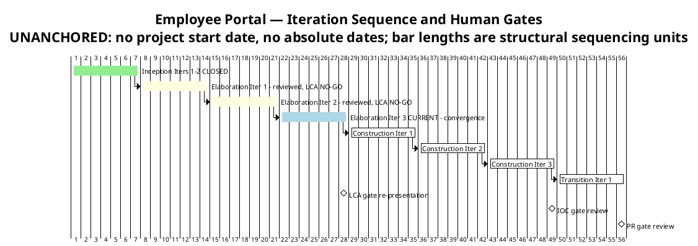
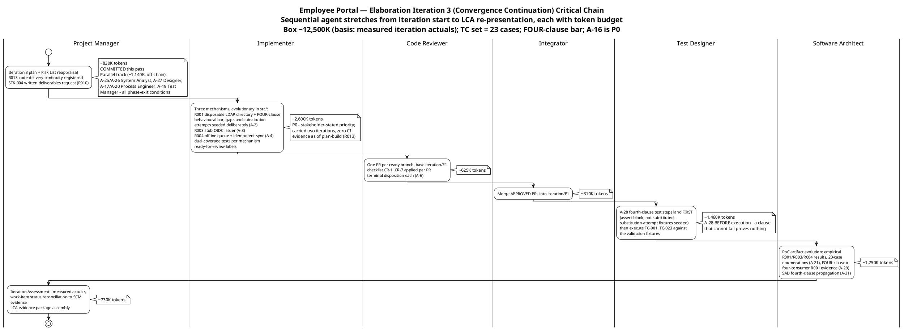

# Iteration Plan

## Document Control
| Field | Value |
|---|---|
| Phase | Elaboration |
| Status | Draft — Elaboration Iteration 3 plan (convergence continuation); evolved from the Iter 2 close-pass plan, not recreated |
| Milestone Target | End of Elaboration (LCA) — NOT yet achieved; LCA re-presented at this iteration's close with the evidence package, per the R6 entry gate |
| Iteration | 3 (Cycle 1) |
| Date | 2026-09-02 |
| Prior Version | Elaboration Iter 2 plan (close-pass corrections 2026-09-02); Elaboration Iter 1 plan (2026-09-01); Inception plan (Approved at LCO); EVOLVED, not recreated |
| Iter 3 Changes | **Convergence continuation plan.** The Iter 2 close-pass corrections (F6/A-22 budget box ~12,500K from the measured actual; F7/A-23 WI statuses; F3-Reviewer/A-18 TC-001…TC-023 enumerations; fourth-clause propagation into exit criterion 1 and the UC table) are PRESERVED — they are the corrected baseline this plan builds on. **This pass:** (1) the plan rolls forward to Elaboration Iteration 3 — the stakeholder's stated priority is the Implementer code push ("In this third iteration I hope that the Implementer can push the code so that everything moves forward"), making A-16 the P0 critical chain; (2) **R013 (code-delivery continuity) registered in the Risk List** — a blocker recurring two consecutive iterations without a register entry is a risk-management failure; (3) the STK-004 written deliverables request (exit criterion 9, unevidenced two passes) is a PM-owned obligation this iteration; (4) the roadmap count updates to 8 total iterations (Elaboration now 3 — the profile bends to the risk profile: the only HIGH risk requires empirical validation the stakeholder refuses to accept on paper); (5) exit criterion 14 added — fourth-clause propagation (A-25…A-31) complete across the seven carrying artifacts, per the R6 entry gate |
| Two Active Plans | Elaboration Iter 3 (CURRENT, tracking) + Construction Iter 1 (coarse only — fine plan built at LCA sanction, not before; planning beyond the horizon is waste) |

## Iteration Objectives
1. **Deliver the three risk-retirement mechanisms as evolutionary code — the stakeholder-stated priority (A-16, P0):** R001 (disposable LDAP directory, FOUR-clause behavioural bar, gaps and substitution attempts seeded deliberately), R003 (stub OIDC issuer), R004 (offline queue + idempotent sync) — in `src/` on `feature/E1-{risk}` branches, dual-coverage tests, `ready-for-review` labels, terminal PR dispositions (base `iteration/E1`), Integrator merges. This is the code evidence exit criteria 1–3 have lacked for two iterations (SAD F2 = Iteration Plan F3-Management = F-CR-E1-1 — one defect, three gates). The stakeholder attributed the two-iteration absence to a technical problem beyond the Implementer's control and expects the push this iteration — recorded so tracking does not misread the absence as non-compliance (Risk List R013).
2. **Execute TC-001…TC-023 against the validation fixtures** — with the A-28 fourth-clause test steps landing FIRST (assert blank, not substituted; substitution-attempt fixtures seeded) so the fourth clause can actually fail. Empirical results land in the Architectural Proof-of-Concept artifact (A-8/A-16/A-21/A-29).
3. **Complete the fourth-clause propagation (A-25…A-31) and the open record corrections** — A-25/A-26 (System Analyst: UC Model, Supp Spec), A-27 (Designer: Design Model — MUST land with the mechanism build so the code implements four clauses), A-17/A-20 (Process Engineer: Development Case), A-19 (Test Manager: TES), A-29/A-31 (Architect: PoC artifact, SAD). All are phase-exit conditions per the stakeholder's all-findings directive.
4. **Issue the STK-004 written deliverables request (R010)** — PM-owned obligation, unevidenced two passes; the RESPONSE is not a condition of Elaboration exit (stakeholder decision).
5. **Re-present LCA with the evidence package and a fresh sanction request** — R6 entry gate: empty findings ledger + FOUR-clause × four-consumer R001 evidence + mechanism code merged to `iteration/E1` + TC-001…TC-023 executed + corrections committed.

## Plan and Milestones
### Coarse Cross-Iteration Roadmap

8 total iterations — within the 6 ± 3 rule. Elaboration holds 3 of 8 (~38%, above the ~20% rubber-profile starting point) because the only HIGH-magnitude risk (R001) requires empirical validation this phase, the stakeholder refused paper-only validation, and the code delivery has not landed in two iterations — the profile bends to the risk profile, not to the heuristic. Construction remains 3 iterations; Transition 1.

| Phase | Iterations | Milestone | Gate Criteria | Human Gate Queue |
|---|---|---|---|---|
| Inception | 2 — **CLOSED** | LCO — **ACHIEVED** | Scope agreed; risks identified; architecture direction sound | **MEASURED: 0s** — stakeholder answered in-round (recorded actual) |
| Elaboration | 3 (Iter 1, Iter 2 reviewed — LCA NO-GO both; Iter 3 CURRENT) | LCA — re-presented at Elab Iter 3 close | Architecture baselined; R001/R003/R004 retired EMPIRICALLY (code evidence); ALL findings closed; Construction viable | **Estimate NONE** — bounded in Risk List R012 (14-day suspension ceiling); measured actuals reported at each Iteration Assessment (Iter 1: 0:35:14; Iter 2: 10:01:08) |
| Construction | 3 | IOC | All 10 FRs implemented and tested; all 5 ACs verified; deployable on Windows Server | **Estimate NONE** — R012; measured actual at the Construction close assessment |
| Transition | 1 | PR | System in production; 80% adoption measured; documentation delivered | **Estimate NONE** — R012; measured actual at the Transition close assessment |

**Measured actuals (recorded, not estimated) — closed phases and closed iterations:**

| Record | Iterations | Agent time | Stakeholder queue | Tokens | Agent runs | Artifacts |
|---|---|---|---|---|---|---|
| Inception (phase-level — governs phase accounting) | 2 | 28 min | 0s | 1,347,939 | 11 | 10 |
| Elaboration Iter 1 (iteration-level — governs box sizing) | 1 | 6:00:59 | 0:35:14 | 12,523,281 | — | — |
| Elaboration Iter 2 (iteration-level — governs box sizing) | 1 | 4:41:27 | 10:01:08 | 13,363,814 | 18 | 13 |

> **Conflict resolution (recorded, carried):** the Inception Iteration Assessment quotes a 3,550,308-token cumulative across its two cycles; the phase-level record governs — one row per CLOSED phase, no per-iteration velocity is quoted from it. Iteration-shaped actuals (Iter 1: 12,523,281; Iter 2: 13,363,814) govern every later budget box. The two clocks are never summed.

**Sizing consequence:** spend is dominated by reasoning over the accumulated artifact surface, not by output volume. Every budget box below is sized from the measured iteration-shaped actuals; where no comparable actual exists (Construction, Transition), the figure is an explicit assumption with its basis named.

> **Two clocks, never summed:** iteration bar lengths are structural sequencing units, NOT measured durations — actual duration is governed by the token budget box and recorded in the Iteration Assessment. Human gates carry NO queue estimate in this plan (A-13): a gate is a risk, bounded in Risk List R012; only measured actuals are reported, at each Iteration Assessment.

### Fine-Grained Plan — Elaboration Iteration 3 (CURRENT, tracking — convergence continuation)

This iteration continues the convergence cycle: the code evidence chain (A-16) is the critical path and the stakeholder-stated priority; the record corrections (A-17…A-31) run as a parallel track. The critical chain below shows the sequential agent stretches from iteration start to the LCA re-presentation, each annotated with its token budget.

**Iteration budget box: ~12,500K tokens** [ASSUMPTION — scaled from the measured iteration-shaped actuals (Iter 1: 12,523,281; Iter 2: 13,363,814); basis: same 9-role shape, 13-artifact accumulated surface, convergence-cycle review load. Carried from the Iter 2 close-pass correction (F6/A-22) — the F6 lesson applied: the box is sized from measured fact at plan-build time, not from an assumption chain. Work items sum ~9,255K; the ~3,245K headroom absorbs PR rework loops (request_changes → fix → re-review) — the box does not grow to fit scope.]

### Work Items — Elaboration Iteration 3 (convergence continuation)

Statuses reflect actual repository state as of plan-build 2026-09-02 (verified via `scm_get_build_status` this pass): `iteration/E1` has **no CI runs** — zero pushes have landed; `main` is GREEN (run 33598979875). No work item may show "Complete" without SCM evidence — the reconciliation is exit criterion 12, re-executed at this iteration's close.

| # | Work Item | Owner Role | Token Budget | Depends On | Status (SCM-evidence-based) |
|---|---|---|---|---|---|
| 1 | Iteration 3 plan + Risk List reappraisal: R013 registered, trends updated, STK-004 request specified | Project Manager | ~830K | — | **Complete** — this plan + the Risk List reappraisal committed this pass |
| 2 | STK-004 written deliverables request (R010): LDAP service account, Keycloak client registration, Windows Server provisioning — response NOT an exit condition | Project Manager | ~100K | — | In progress — no recorded issuance as of plan-build (unevidenced two passes); PM-owned obligation this iteration (exit criterion 9) |
| 3 | **R001 mechanism (A-2):** disposable LDAP directory, attribute mapping, graceful degradation; FOUR-clause behavioural bar — gaps AND substitution-attempt fixtures seeded deliberately | Implementer | ~1,040K | — | In progress — carried two iterations; zero CI evidence on `iteration/E1` as of plan-build; stakeholder-stated priority this pass (R013) |
| 4 | **R003 mechanism (A-3):** stub OIDC issuer, token validation, role-claim extraction | Implementer | ~830K | — | In progress — carried; zero CI evidence as of plan-build |
| 5 | **R004 mechanism (A-4):** localStorage queue, idempotent sync endpoint, 5-minute drop simulation | Implementer | ~730K | — | In progress — carried; zero CI evidence as of plan-build |
| 6 | PR reviews: one per ready branch (base `iteration/E1`), CR-1…CR-7, terminal disposition each (A-6) | Code Reviewer | ~625K | Work Items 3–5 | Pending — zero ready-for-review branches as of plan-build |
| 7 | Merge APPROVED PRs into `iteration/E1` | Integrator | ~310K | Work Item 6 | Pending |
| 8 | A-28 fourth-clause test steps FIRST (assert blank, not substituted; substitution-attempt fixtures), then execute TC-001…TC-023 against the validation fixtures (all 23 currently BLOCKED on SCM Issue #1) | Test Designer | ~1,460K | Work Item 7 | Pending — blocked on mechanism merge; A-28 lands BEFORE execution |
| 9 | PoC artifact evolution: empirical R001/R003/R004 results + 23-case enumerations (A-21) + FOUR-clause × four-consumer R001 evidence (A-29) | Software Architect | ~1,250K | Work Item 8 | Pending — requires executed test results (artifact exists with honest PENDING ledger) |
| 10 | SAD fourth-clause propagation (A-31) — §Quality PoC Plan R001 record to four clauses | Software Architect | ~210K | — | Pending — Architect-owned, rides the PoC/SAD evolution |
| 11 | Iteration Assessment: measured actuals, work-item status reconciliation to SCM evidence | Project Manager | ~730K | Work Items 1–10 | Pending — authored at iteration close, AFTER the reviewers rule |
| 12 | Fourth-clause propagation + record corrections (parallel track): A-25 (UC Model), A-26 (Supp Spec) — System Analyst; A-27 (Design Model) — Designer, MUST land with the mechanism build; A-17 (DC featured-banner), A-20 (DC TC enumeration) — Process Engineer; A-19 (TES TC enumeration) — Test Manager | System Analyst / Designer / Process Engineer / Test Manager | ~1,140K | — | In progress — owned by their roles; all phase-exit conditions per the all-findings directive |
| **Total** | | | **~9,255K** (box: ~12,500K; ~3,245K rework headroom) | | |

> **Status discipline (F3/F7 lesson, both directions):** every "Complete" is backed by a commit SHA or CI run; every "In progress"/"Pending" names its blocking evidence. A status that cannot show evidence reverts to In progress, never to Complete — and a status that HAS evidence must not understate it either.

### Construction Schedule Baseline (from measured actuals — preserved; verified MET at the LCA-4 criterion)

All 10 UCs assigned; UC IDs verified against the Use-Case Model authority (LCO F1 lesson). Sequencing is risk-driven: the clocking cluster first (highest adoption risk R002 + simplest user value), the news cluster second (shared audit mechanism R006), directory + export third (R001 residual R011 closes with production integration).

| Construction Iteration | Use Cases | FRs | Key Risks Retired |
|---|---|---|---|
| Construction Iter 1 | UC-001 (Clock In/Out), UC-002 (Own History), UC-005 (Review Clockings), UC-007 (Assign Category) | FR-004, FR-005, FR-001, FR-003 | R004 residual (AC-005 formal test), R008 (CRUD validation) |
| Construction Iter 2 | UC-003 (Browse News), UC-008 (Publish), UC-009 (Edit), UC-010 (Unpublish) | FR-007, FR-006, FR-008, FR-009 | R006 (audit mechanism verified end-to-end) |
| Construction Iter 3 | UC-004 (Directory Search), UC-006 (CSV Export) | FR-010, FR-002 | R011 + R010 (production-instance integration — STK-004 deliverables), R005 (LDAP performance) |

**Construction sizing:** [ASSUMPTION — 3 iterations × ~12,500K tokens each, basis: the MEASURED Elaboration iteration actuals (Iter 1: 12,523,281; Iter 2: 13,363,814) — Construction adds feature implementation volume but reuses the validated PoC mechanisms. Refined at each Elaboration Iteration Assessment as measured actuals accumulate — no fine-grained Construction plan is produced now (planning beyond the horizon is waste).]

### Next Iteration Preview — Construction Iteration 1 (coarse only)

| Aspect | Plan |
|---|---|
| Primary objective | Clocking cluster: UC-001, UC-002, UC-005, UC-007 implemented as running features on the validated mechanisms (offline queue, OIDC consumption, LDAP gateway) |
| Entry condition | LCA sanction GRANTED + empty findings ledger + completed convergence scope (Review Record R6 entry gate) |
| Fine plan | **Built at LCA sanction, not before** — planning beyond the current horizon in fine-grained detail is waste; the coarse baseline above is the commitment |
| Key risks | R010 (STK-004 deliverables — trigger: not confirmed by Construction Iter 1 start), R008, R002 (adoption design) |

## Resources
### Agent Role Profile — Elaboration Iteration 3 (convergence continuation)

| Agent Role | Discipline | Intensity | Active This Iteration | Token Budget | Key Deliverable |
|---|---|---|---|---|---|
| Project Manager | Project Management | High | Yes | ~1,660K | Iter 3 plan + Risk List reappraisal (R013); STK-004 request; Iteration Assessment with SCM-evidence reconciliation; LCA evidence package |
| Implementer | Implementation | Critical | Yes | ~2,600K | The three mechanisms (R001 FOUR-clause bar / R003 stub issuer / R004 offline sync) with dual-coverage tests — the stakeholder-stated priority |
| Code Reviewer | Implementation | Critical | Yes | ~625K | Terminal PR dispositions per mechanism (CR-1…CR-7) |
| Integrator | Implementation | High | Yes | ~310K | APPROVED PRs merged to iteration/E1 |
| Software Architect | Analysis & Design | Critical | Yes | ~1,460K | PoC artifact evolution (empirical results, A-21/A-29) + SAD fourth-clause propagation (A-31) |
| Test Designer | Test | High | Yes | ~1,460K | A-28 fourth-clause steps + TC-001…TC-023 executed against the validation fixtures |
| System Analyst / Designer / Process Engineer / Test Manager | Requirements / A&D / Environment / Test | Medium | Yes (parallel track) | ~1,140K | A-25, A-26, A-27, A-17, A-19, A-20 record corrections |
| **Total** | | | | **~9,255K** | |

### Budget Split Across Disciplines

| Discipline | Token Share | Rationale |
|---|---|---|
| Implementation (Implementer + Code Reviewer + Integrator) | ~38% | Critical intensity — the convergence cycle's central objective is CODE EVIDENCE for empirical risk retirement (F3 / SAD F2 / F-CR-E1-1 converge here); the stakeholder-stated priority |
| Analysis & Design | ~16% | Critical intensity — the PoC artifact evolution that carries the empirical results into the LCA evidence package + SAD propagation |
| Project Management | ~18% | High intensity — plan/risk governance, STK-004 engagement, assessment reconciliation, evidence-package assembly |
| Test | ~16% | High intensity — A-28 steps + 23 blocked test cases unblocked and executed against the fixtures |
| Parallel record corrections (Requirements / A&D / Environment) | ~12% | Medium intensity — A-17, A-19, A-20, A-25, A-26, A-27; all phase-exit conditions per the all-findings directive |

### Two Clocks (never summed)

| Clock | Elaboration Iteration 3 | Basis |
|---|---|---|
| Agent work | ~9,255K tokens planned within the ~12,500K box (~3,245K rework headroom); elapsed time measured at iteration close | Budget box [ASSUMPTION — scaled from the measured iteration actuals (Iter 1: 12,523,281; Iter 2: 13,363,814)]; actuals recorded in the Iteration Assessment |
| Human gates | **Estimate NONE** — bounded in Risk List R012 (14-day suspension ceiling; nothing auto-filled). Mitigation: in-round stakeholder answering, as measured at LCO (queue 0s), Iter 1 (0:35:14), and Iter 2 (10:01:08 across 21 interactions — growth traced to process defects, not stakeholder availability). STK-004 response: external queue tracked as R010 (Transfer) — not a project gate, no estimate quoted | Planning rule (Review Record A-13/A-15); measured actuals |

## Use Cases and Scenarios Addressed
**This iteration's use-case scope (convergence continuation):** the empirical validation exercises UC-001 (Clock In/Out — OIDC consumption, offline resilience, idempotency) and the four AD-reading use cases UC-004 (Directory Search), UC-005 (Review Clockings), UC-006 (CSV Export), UC-007 (Assign Category) — the R001 behavioural bar is confirmed for ALL FOUR per the stakeholder's Iter 2 answer, and the FOURTH clause (verdict-gate contribution) extends it: a missing attribute is displayed as missing, never replaced by a default, a placeholder, a guessed value, or another employee's value. UC-010 (Unpublish News) carries its audit/soft-delete test cases. All 10 UCs remain refined at the analysis level (Use-Case Model clean at both reviews); none is implemented as a running feature — implementation is Construction.

| FR ID | Use Case ID | Use Case Name | Elaboration Iter 3 Activity | Construction Iteration |
|---|---|---|---|---|
| FR-004 | UC-001 | Clock In and Clock Out | R003 stub-issuer + R004 offline-drop mechanism validation (code evidence — the stakeholder-stated priority); TC execution | Construction Iter 1 |
| FR-005 | UC-002 | View Own Clocking History | Analysis complete (clean at review); no Iter 3 activity | Construction Iter 1 |
| FR-001 | UC-005 | Review Employee Clockings | R001 behavioural bar applies (stakeholder-confirmed): event row rendered with blank display fields, clocking data always complete; missing attribute displayed as missing — no substitution | Construction Iter 1 |
| FR-003 | UC-007 | Assign Worker Category | R001 behavioural bar applies (stakeholder-confirmed): employee locatable and selectable with blank fields; missing attribute displayed as missing — no substitution | Construction Iter 1 |
| FR-007 | UC-003 | Browse News | Analysis complete; featured-banner contract settled (stakeholder Iter 2: banners STACK, newest first) | Construction Iter 2 |
| FR-006 | UC-008 | Publish News | Analysis complete (clean at review) | Construction Iter 2 |
| FR-008 | UC-009 | Edit Published News | Analysis complete (clean at review) | Construction Iter 2 |
| FR-009 | UC-010 | Unpublish News | Audit + soft-delete test cases executed this cycle (TC set) | Construction Iter 2 |
| FR-010 | UC-004 | Search Employee Directory | R001 behavioural bar validated against the disposable LDAP directory (gaps AND substitution attempts seeded deliberately): every employee rendered; missing attribute never removes from results; never raises an error; displayed as missing — no substitution | Construction Iter 3 |
| FR-002 | UC-006 | Export Monthly Clocking Report | R001 behavioural bar applies (stakeholder-confirmed): every event row exported with blank cells for missing display fields, no abort; missing attribute displayed as missing — no substitution | Construction Iter 3 |

> UC IDs cross-checked against the Use-Case Model §Use-Case Survey (authority) — LCO F1 lesson applied; re-verified clean at both LCA reviews (LCA-4 PASS).

## Evaluation Criteria
### Layer 1 — Declared Acceptance Criteria Status

| AC ID | Description | Addressed This Iteration? | Evidence / Deferral |
|---|---|---|---|
| AC-001 | Employee can clock in/out without HR help | Partial evidence this iteration | UC-001 mechanisms validated empirically (offline queue, idempotency, OIDC consumption) — the code chain this iteration is the stakeholder-stated priority; running feature is Construction Iter 1 |
| AC-002 | HR can publish news without technical assistance | Deferred to Construction Iter 2 | UC-008 analyzed; audit mechanism designed (R006 — Design Model clean at review) |
| AC-003 | Employee finds colleague's phone/email in <10 seconds | Partial evidence this iteration | R001 behavioural bar validated against the disposable directory (every employee rendered, no hidden entries, no errors, no substitution); production-AD performance + data quality at Construction Iter 3 (R010 + R011) |
| AC-004 | 80% of employees complete one clocking with no training | Deferred to Transition Iter 1 | Adoption measurement requires a deployed system (BG-003) |
| AC-005 | System works temporarily offline (5-min network drop) | Partial evidence this iteration | R004 mechanism validated: 5-minute drop simulated, queue, reconnect, idempotent sync, zero duplicates/losses; formal AC test at Construction Iter 1 |

No AC is absent from this table. All 5 declared acceptance criteria are accounted for with explicit evidence or deferral targets.

### Layer 2 — Elaboration Iteration 3 Exit Criteria (convergence continuation)

| # | Exit Criterion | Verification Method |
|---|---|---|
| 1 | R001 empirically validated against the disposable LDAP directory — **FOUR-clause behavioural bar** (stakeholder Iter 2 answer + verdict-gate contribution): (a) every employee rendered whether or not attributes are complete; (b) a missing attribute never removes someone from search results; (c) a missing attribute never raises an error; (d) a missing attribute is displayed as missing — never replaced by a default, a placeholder, a guessed value, or another employee's value — gaps AND substitution-attempt fixtures seeded deliberately; applies to UC-004/005/006/007 | **Code evidence:** mechanism merged to `iteration/E1` (CI run green), dual-coverage tests pass, TC execution results in the Architectural Proof-of-Concept artifact. The dropped >90% figure is NOT evidence — it measured our own seeded data. **Carried two iterations — NOT MET; the code chain is this iteration's P0** |
| 2 | R003 empirically validated against the stub OIDC issuer: token validation succeeds; Employee + HR Administrator roles extracted from claims; redirect flow completes | Code evidence: merged PR + CI green + TC results in the PoC artifact — **carried; NOT MET** |
| 3 | R004 empirically validated (direct): 5-minute drop simulated; sync ≤ 60 s; zero duplicates (idempotency key); zero losses; confirmation < 1 s both paths | Code evidence: merged PR + CI green + TC results in the PoC artifact — **carried; NOT MET** |
| 4 | SAD corrected: §Quality PoC Plan carries the EMPIRICAL disposition (A-7); §Logical View dependencies reconciled with the Design Model — COMP-001 IAUD, COMP-010 IDirectoryService (A-9) | SAD committed; Reviewer lens closes SAD F1 and SAD F3 in the findings ledger — **DONE: SAD F1/F3 ledger-closed 2026-09-02** |
| 5 | Architectural Proof-of-Concept artifact produced, carrying empirical R001/R003/R004 results (A-8) | PoC artifact committed; Reviewer lens closes SAD F2 — **PARTIAL: artifact exists with honest PENDING ledger; empirical results absent (SAD F2 persists, 2nd occurrence); results land this iteration via Work Item 9** |
| 6 | CONTRIBUTING.md committed before the first mechanism PR (A-5) | File in the repository root; Code Reviewer lens closes F-CR-E1-2 — **DONE: committed, sha 6662813…** |
| 7 | Carried — VERIFIED: Development Case PoC-trigger record corrected (trigger FIRED recorded; DC clean at review) | Review Record per-artifact verdict: Development Case Approved |
| 8 | Carried — VERIFIED: Construction schedule baselined from measured actuals, UC IDs against authority | LCA-4 criterion MET at both LCA reviews (Management lens) |
| 9 | STK-004 written deliverables request issued (R010); response NOT required for Elaboration exit | Request recorded; R010 status in the Risk List — **NOT EVIDENCED two passes; PM-owned obligation THIS iteration (Work Item 2)** |
| 10 | All 5 ACs accounted | Layer 1 table complete — AC-001 through AC-005 |
| 11 | **ALL open findings closed — every lens, every severity** (A-12; stakeholder directive: "fix all the findings even if they are minors prior to move to next phase") | **Findings ledger EMPTY** — verified via the findings system across all artifacts at iteration close, not via narrative claims — **NOT MET at plan-build: ledger carries 2 Critical / 3 Major / 5 Minor open + 2 narrative-tracked (verified 2026-09-02); PM-owned corrections applied at the Iter 2 close pass; the remainder is owned and scheduled** |
| 12 | Work-item statuses reconciled to SCM evidence (A-11) — no "Complete" without a commit SHA or CI run, no understated delivery either | Iteration Assessment records the reconciliation; any status without evidence reverts to In progress — **re-executed at this iteration's close (Work Item 11)** |
| 13 | LCA evidence package assembled and re-presented with a fresh sanction request | R6 entry gate per the Review Record: empty ledger + evidence package (PoC artifact, mechanism code on iteration/E1, TC-001…TC-023 executed, FOUR-clause × four-consumer R001 evidence) + corrections committed + review materials distributed — **NOT MET at plan-build: package not assemblable without code evidence** |
| 14 | **Fourth-clause propagation complete (A-25…A-31)** across the seven carrying artifacts: UC Model (A-25), Supp Spec (A-26), Design Model (A-27 — with the mechanism build), Test Case (A-28 — before TC execution), PoC artifact (A-29), Risk List (A-30 — DONE), SAD (A-31) | Each carrying artifact committed with the four-clause bar; R4/R6 gates verify completion — **A-30 and this plan's exit criterion 1/UC table DONE; the remainder owned by their roles (Work Item 12)** |

## Traceability
| Element | Traces From | Link Type | Traces To |
|---|---|---|---|
| Iteration Plan (this, Elab Iter 3) | Review Record (Iter 1 + Iter 2 — findings, actions A-1…A-31, convergence calendar R1–R6, stakeholder verdict-gate contribution); stakeholder directive (all findings closed before phase transition); stakeholder Iter 2 answers (R001 behavioural bar; four-UC confirmation; featured banner newest first); stakeholder Implementer priority ("In this third iteration I hope that the Implementer can push the code so that everything moves forward"); Iteration Assessment Iter 2 (binding adjustments: A-16 P0, A-28 before execution, A-27 with the build, box from measured actuals); measured actuals (Inception phase-level; Elab Iter 1: 12,523,281; Iter 2: 13,363,814) | Refines | Elaboration Iter 3 Iteration Assessment; R6 LCA re-presentation; Construction Iter 1 plan (built at LCA sanction) |
| Exit criterion 1 (R001 FOUR-clause behavioural bar) | Stakeholder Iter 2 answer (behavioural bar, three clauses, >90% dropped, four-UC confirmation "Yes"); stakeholder verdict-gate contribution, verbatim: "a missing attribute is displayed as missing. It is never replaced by a default, a placeholder, a guessed value, or another employee's value" | Authorizes | Work Item 3 (R001 mechanism); Risk List R001 acceptance criteria (A-30, applied); Test Case TC-011 + TC-021/022/023 fixtures (A-28); Architectural Proof-of-Concept artifact (A-29) |
| Exit criteria 1–3 (code evidence) | Review Record Iteration Plan F3 (Critical) / SAD F2 / F-CR-E1-1 — three gates, one defect: absent mechanism code, two consecutive iterations | Derives | Work Items 3–9; SCM evidence (CI runs on iteration/E1, merged PRs); LCA evidence package; Risk List R013 (continuity risk) |
| Exit criterion 11 (all-findings closure) | Review Record Iteration Plan F4 (Major, A-12); stakeholder directive verbatim: "Please fix all the findings even if they are minors prior to move to next phase"; escalation resolution: "Fix all the issues and close all findings" | Derives | Findings ledger (verified empty at iteration close); phase-transition sanction |
| Exit criterion 12 (status reconciliation) | Review Record Iteration Plan F3 (Critical, A-11) + F7 (Minor, A-23); LCO F2 lesson (status honesty, both directions) | Derives | Work Items 1–12 statuses; Iteration Assessment |
| Exit criterion 14 (fourth-clause propagation) | Review Record propagation actions A-25…A-31 (stakeholder verdict-gate contribution); R6 entry gate ("corrections committed (A-17…A-31)") | Derives | Work Item 12 (parallel track); carrying artifacts owned by their roles |
| Milestone table (no queue forecasts) | Review Record Iteration Plan F5 (Minor, A-13); planning rule: human gate = risk, not estimate | Derives | Risk List R012 (bounds the queue; 14-day suspension ceiling); Iteration Assessment (measured actuals only) |
| Budget box ~12,500K [ASSUMPTION] | Measured iteration actuals (Iter 1: 12,523,281; Iter 2: 13,363,814); Iter 1 assessment binding adjustment #1; Review Record Iteration Plan F6 (Major, A-22 — corrected at the Iter 2 close pass; the F6 lesson applied at this plan-build: adjustments land in the plan BODY) | DependsOn | Elaboration Iter 3 Iteration Assessment (records actuals; refines Construction sizing) |
| Work Items 3–5 (mechanisms) | Stakeholder decision (Elab Iter 1): "The PoC is produced in Elaboration and validated empirically" — R001 disposable directory, R003 stub issuer, R004 direct; stakeholder Implementer priority (Iter 2 verdict gate) | Authorizes | R001, R003, R004 retirement evidence; SAD COMP-007/COMP-006/COMP-009; Design Model CLS-009/CLS-010/CLS-008 |
| Work Item 2 (STK-004 request) | R010, STK-004, CON-004, CON-005, CON-008; stakeholder decision (R010 blocks production-instance integration only; response NOT an Elaboration exit condition) | Derives | Construction Iter 3 integration testing |
| Work Item 8 (A-28 + TC execution) | Test Case §Test Case Catalog (TC-ID authority, 23 cases); Iteration Assessment Iter 2 binding adjustment ("A-28 fourth-clause test steps land BEFORE TC execution — a clause that cannot fail proves nothing") | Derives | TC-001…TC-023 execution results; PoC artifact § Results and Findings |
| Construction Schedule Baseline | Use-Case Model §Use-Case Survey (UC ID authority), SAD UC prioritization; verified MET at LCA-4 | Derives | Construction Iteration Plans (built at LCA, not before) |
| Roadmap count 8 iterations (Elaboration 3) | 6 ± 3 rule; rubber profile bent to the risk profile (only HIGH risk requires empirical validation; stakeholder refused paper-only validation; code delivery not landed in two iterations) | Refines | Construction entry (on GRANTED sanction); Iteration Assessments (measured actuals refine the profile) |