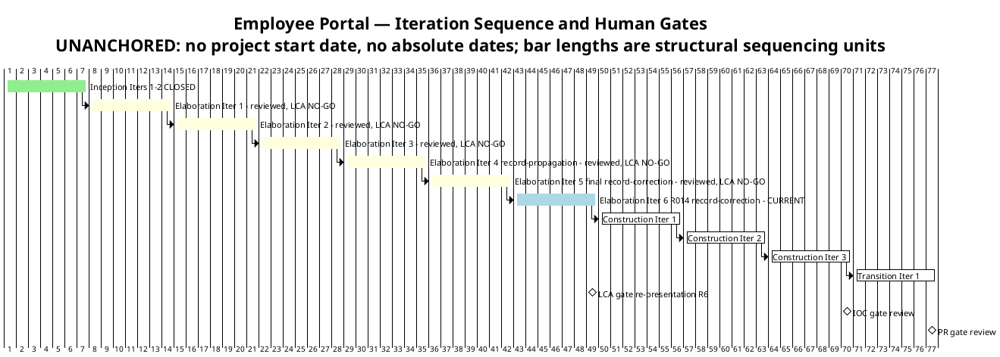
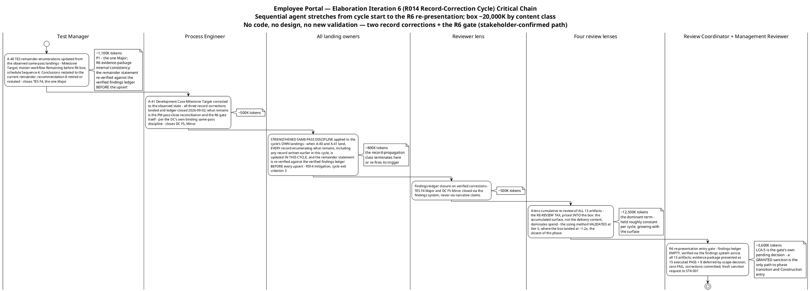

# Iteration Plan

## Document Control

| Field | Value |
|---|---|
| Phase | Elaboration |
| Status | Draft — Elaboration Iteration 6 roll-forward: the R014 record-correction cycle is now the CURRENT plan; evolved from the Iter 5 final record-correction pass plan, not recreated |
| Milestone Target | End of Elaboration (LCA) — NOT yet achieved; the R6 re-presentation at the R014 record-correction cycle close is the next gate; LCA-5 (stakeholder sanction) is the gate's own pending decision |
| Iteration | 5 (Cycle 1) reviewed — RC verdict NO-GO CONFIRMED (R014 remainder: 1 Major + 1 Minor ledger, both record-propagation class; zero Critical held, third consecutive cycle; the two Work Order CRs DISCHARGED; zero open SCM issues); Iteration 6 (R014 record-correction cycle) CURRENT |
| Date | 2026-09-03 |
| Prior Version | Elaboration Iteration 5 final record-correction pass plan (2026-09-02); Iter 4 record-propagation pass plan; Iter 3 close-pass roll-forward; Iter 3 convergence-continuation plan; Iter 2 close-pass plan; Iter 1 plan; Inception plan (Approved at LCO); EVOLVED, not recreated |
| Two Active Plans | Elaboration Iteration 6 — R014 record-correction cycle (CURRENT, building) + Construction Iteration 1 (coarse only — fine plan built at LCA sanction, not before; planning beyond the horizon is waste) |
| Iter 5 Close-Pass Changes | (1) **Work-item reconciliation (exit criterion 8, plan Work Item 8):** 4 Complete with evidence cited (A-37/A-38/A-39 landed and ledger-closed — the two Work Order CRs DISCHARGED; Issue #9 CLOSED cr:complete — zero open SCM issues), 2 Partial (findings-ledger closure — 3 closures executed but the R014 trigger FIRED, 2 new findings born of the pass's own landings; 4-lens re-review executed but R6 not reached), 1 Not met (same-pass discipline — failed on two locations despite being carried), 1 discharged by the Iteration Assessment. (2) **Exit criteria verified: 5 of 8 MET** — criteria 4 (same-pass discipline), 6 (ledger-empty), 7 (R6 gate) NOT MET. (3) **Budget variance recorded honestly: 25,184,977 actual vs the ~21,000K box (~1.2×) — the CLOSEST box of the phase; the re-review-tax sizing method VALIDATED.** (4) **The plan rolls forward to the R014 record-correction cycle** — box ~20,000K by content class; no code, no design, no new validation. (5) **The STRENGTHENED same-pass discipline is carried as cycle exit criterion 3** (R014 mitigation — the Iter 5 lesson: the remainder statement is re-verified against the verified findings ledger BEFORE every upsert; the ledger, not the author's memory, is the remainder's source of truth). (6) **R014's trigger FIRED — recorded in the Risk List close-pass reappraisal; RE-ARMED at this plan-build for the Iter 6 review** (the termination test: does the cycle mint a successor finding against its own landings A-40/A-41?) |
| Iter 4 Close-Pass Changes (preserved) | (1) Work-item reconciliation (exit criterion 12): 7 Complete, 1 partial, 1 not executed. (2) Exit criteria verified: 6 of 8 MET. (3) Budget variance ~9.0× — root cause: the RE-REVIEW TAX. (4) The plan rolled forward to the final record-correction pass — box ~21,000K with the tax priced IN. (5) The SAME-PASS DISCIPLINE carried as pass exit criterion 4 (R014 mitigation — registered in the Risk List at that plan-build). (6) Issue #9 closure added as a work item |
| Iter 3 Close-Pass Changes (preserved) | (1) Iteration Plan F8 remediation (Minor): the STK-004 written deliverables request is NOT issued — the concrete blocker is recorded; the obligation is CARRIED to the Construction Iter 1 plan with R010's own trigger. (2) Work-item statuses reconciled to observed SCM state. (3) Exit criteria verified: 10 of 14 MET. (4) Budget variance ~2.17× — root cause: CONTENT CLASS. (5) The plan rolled forward to the record-propagation pass. (6) The R010 written-request obligation added to the Construction Iter 1 preview |

## Iteration Objectives

1. **A-40 — update the TES remainder-enumerations from the observed same-pass landings (P1 — the one Major; R6 evidence-package internal consistency).** Milestone Target; master-workflow "Remaining before R6" box; schedule Sequence 4; Conclusions "What the mission cannot yet claim" restated to the current remainder; recommendation 8 retired or restated. The mission verdict itself ("VALIDATION SUBSTANCE ACHIEVED — OBSERVED") is correct and unchanged. Owner: Test Manager. **The remainder statement is re-verified against the verified findings ledger BEFORE the upsert** (the strengthened discipline — the Iter 5 lesson). The TES must not contradict the PoC ledger it sits beside in the R6 evidence package.
2. **A-41 — correct the Development Case Milestone Target to the observed state (the one Minor).** All three record corrections landed and ledger-closed 2026-09-02 (A-37 — TES; A-38 — PoC; A-39 — DC); what remains is the PM pass-close reconciliation and the R6 gate itself — per the DC's own binding same-pass record-propagation discipline. Owner: Process Engineer.
3. **Empty the findings ledger across ALL lenses and ALL severities (cycle exit criterion 4 — the stakeholder's binding all-findings directive, reinforced at the Iter 5 verdict gate, verbatim: "No, please fix all findings").** TES F4 (Major) and DC F5 (Minor) closed by the Reviewer lens via the findings system on verified correction — never via narrative claims. The 2 narrative-tracked Code Reviewer Minors (F-CR-E3-1/2) are Construction-scope/Designer-owned remediations with recorded owners — carried, not closed this phase.
4. **R6 re-presentation with the evidence package and a fresh sanction request to STK-001.** The coordinator-enforced entry gate: findings ledger EMPTY (verified via the findings system across all 13 artifacts) + evidence package assembled (PoC observed-results ledger + merged mechanisms + TC-001…TC-023 executed + FOUR-clause × four-consumer R001 evidence, presented as 15 executed PASS + 8 deferred-by-scope-decision, zero FAIL) + corrections committed + review materials distributed. LCA-5 is the gate's own pending decision — a GRANTED sanction is the only path to phase transition and Construction entry. **The STRENGTHENED same-pass discipline applies to this cycle's own landings (R014 mitigation): when A-40/A-41 land, every record enumerating what remains — including any record written earlier in this cycle — is updated IN THIS CYCLE, and the remainder statement is re-verified against the verified findings ledger BEFORE every upsert.**

## Plan and Milestones

### Coarse Cross-Iteration Roadmap

11 total iterations — two above the upper bound of the 6 ± 3 rule, justified against the risk profile: the only HIGH-magnitude risk (R001) required empirical validation the stakeholder refused to accept on paper; the code delivery landed only in Iter 3 (R013, stakeholder-attributed); the stakeholder's binding all-findings directive plus the confirmed R6 path required a record-propagation pass (Iter 4); the record-propagation defect class minted new findings in THREE consecutive passes (R014 — registered in the Risk List at the Iter 5 plan-build, trigger fired at the Iter 5 review exactly as registered), requiring the final record-correction pass (Iter 5) and now the R014 record-correction cycle (Iter 6 — minted by the R014 trigger firing, a registered risk event, never planning drift). Each extension was minted by a recorded stakeholder directive or a verified defect class. Elaboration holds 6 of 11; Construction remains 3; Transition 1.

| Phase | Iterations | Milestone | Gate Criteria | Human Gate Queue |
|---|---|---|---|---|
| Inception | 2 — **CLOSED** | LCO — **ACHIEVED** | Scope agreed; risks identified; architecture direction sound | **MEASURED: 0s** — stakeholder answered in-round (recorded actual) |
| Elaboration | 6 (Iters 1–5 reviewed — LCA NO-GO each; **Iter 6 R014 record-correction CURRENT**) | LCA — re-presented at Iter 6 close (R6) | Architecture baselined — **OBSERVED** (PR #6 merged to main, APPROVED); R001/R003/R004 RETIRED empirically (recorded, verified at Iter 4, held at Iter 5); ALL findings closed; Construction viable | **Estimate NONE** — bounded in Risk List R012 (14-day suspension ceiling); measured actuals: Iter 1 0:35:14; Iter 2 10:01:08; Iter 3 0:00:00; Iter 4 0:00:00; Iter 5 0:00:00 (22 interactions, all in-round — third consecutive zero-queue iteration) |
| Construction | 3 | IOC | All 10 FRs implemented and tested; all 5 ACs verified; deployable on Windows Server | **Estimate NONE** — R012; measured actual at the Construction close assessment |
| Transition | 1 | PR | System in production; 80% adoption measured; documentation delivered | **Estimate NONE** — R012; measured actual at the Transition close assessment |

**Measured actuals (recorded, not estimated) — closed phases and closed iterations:**

| Record | Iterations | Agent time | Stakeholder queue | Tokens | Agent runs | Artifacts |
|---|---|---|---|---|---|---|
| Inception (phase-level — governs phase accounting) | 2 | 28 min | 0s | 1,347,939 | 11 | 10 |
| Elaboration Iter 1 (iteration-level — record-side) | 1 | 6:00:59 | 0:35:14 | 12,523,281 | — | — |
| Elaboration Iter 2 (iteration-level — record-side) | 1 | 4:41:27 | 10:01:08 | 13,363,814 | 18 | 13 |
| Elaboration Iter 3 (iteration-level — **code-delivering**) | 1 | 3:35:12 | 0:00:00 | 27,143,633 | 22 | 13 |
| Elaboration Iter 4 (iteration-level — **record-propagation + re-review tax**) | 1 | 2:58:00 | 0:00:00 | 24,830,875 | 23 | 13 |
| Elaboration Iter 5 (iteration-level — **record-correction + re-review tax**) | 1 | 4:43:57 | 0:00:00 | 25,184,977 | 23 | 13 |

> **Conflict resolution (recorded, carried):** the Inception Iteration Assessment quotes a 3,550,308-token cumulative across its two cycles; the phase-level record governs — one row per CLOSED phase, no per-iteration velocity is quoted from it. The Work Order's phase-level Elaboration records differ from the iteration-level sums for the same iterations — the same conflict class; the phase-level record governs phase accounting, iteration-shaped actuals govern every budget box; the two are never mixed. Iteration-shaped actuals now number FIVE and split into FOUR measured content classes: **record-side** (Iter 1: 12,523,281; Iter 2: 13,363,814), **code-delivering** (Iter 3: 27,143,633), **record-propagation + re-review tax** (Iter 4: 24,830,875), and **record-correction + re-review tax** (Iter 5: 25,184,977). The two clocks are never summed.

**Sizing consequence — the validated method (Iter 5 close):** every box is sized as **(pass-specific work) + (the re-review tax, held roughly constant per cycle and growing with the surface)**, by content class from these measured actuals. The Iter 5 box (~21,000K, tax priced IN) landed at ~1.2× — the closest of the phase, VALIDATING the method. Where no comparable actual exists, the figure is an explicit assumption with its basis named.

> **Two clocks, never summed:** iteration bar lengths are structural sequencing units, NOT measured durations — actual duration is governed by the token budget box and recorded in the Iteration Assessment. Human gates carry NO queue estimate in this plan (A-13): a gate is a risk, bounded in Risk List R012; only measured actuals are reported, at each Iteration Assessment.

### Fine-Grained Plan — Elaboration Iteration 6 (CURRENT, building — the R014 record-correction cycle)

This cycle executes the RC verdict's named next pass: two record corrections (A-40/A-41), the strengthened same-pass discipline applied to the cycle's own landings, the findings-ledger closure, and the R6 re-presentation itself. **No code, no design, no new validation** — the validation substance exists and is observed (Test Case Cycle 1 formal pass, CI-traced); the R6 evidence package is ASSEMBLED and internally consistent except for the two stale remainder-enumerations; what remains is two record corrections born of the Iter 5 pass's own landings, plus the gate. The critical chain below shows the sequential agent stretches from cycle start to the R6 re-presentation, each annotated with its token budget.

**Cycle budget box: ~20,000K tokens** [ASSUMPTION — record-correction + re-review-tax content class; basis: the measured Iter 5 actual (25,184,977) with the correction count scaled 3→2 and the re-review tax (the dominant term) held constant, plus the R6 gate. The re-review tax is priced INTO the box — the validated method; the box does not grow to fit scope; the scope is bounded by the box.]

### Work Items — Elaboration Iteration 6 (R014 record-correction cycle)

Statuses reflect the verified findings ledger (2026-09-02: 0 Critical / 1 Major / 1 Minor + 2 narrative) and the observed SCM state. No work item may show "Complete" without evidence — the reconciliation is cycle exit criterion 6, re-executed at this cycle's close.

| # | Work Item | Owner Role | Token Budget | Depends On | Status |
|---|---|---|---|---|---|
| 1 | **A-40 — TES remainder-enumerations updated from the observed same-pass landings** (Milestone Target; master-workflow "Remaining before R6" box; schedule Sequence 4; Conclusions "What the mission cannot yet claim" → the current remainder; recommendation 8 retired or restated) — the remainder statement re-verified against the verified findings ledger BEFORE the upsert — closes TES F4 (Major) | Test Manager | ~1,100K | — | Pending — requires only the observed same-pass landings (all recorded); the cycle's P1 |
| 2 | **A-41 — Development Case Milestone Target corrected to the observed state** (all three record corrections landed and ledger-closed 2026-09-02; what remains is the PM pass-close reconciliation and the R6 gate itself), per the DC's own binding same-pass discipline — closes DC F5 (Minor) | Process Engineer | ~500K | — | Pending — one-location correction |
| 3 | **Strengthened same-pass discipline applied to the cycle's OWN landings (R014 mitigation):** when A-40/A-41 land, every record enumerating what remains — including any record written earlier in this cycle — is updated IN THIS CYCLE, and the remainder statement is re-verified against the verified findings ledger BEFORE every upsert | All landing owners (Test Manager, Process Engineer, Project Manager) | ~800K | Work Items 1–2 | Pending — the R014 termination test executes at the Iter 6 review |
| 4 | Findings-ledger closure by the emitting lens (TES F4, DC F5 — Reviewer lens) via the findings system on verified correction — never via narrative claims | Reviewer lens | ~500K | Work Items 1–3 | Pending |
| 5 | 4-lens cumulative re-review of ALL 13 artifacts (the re-review tax — priced INTO the box) | Four review lenses | ~12,500K | Work Item 4 | Pending |
| 6 | **R6 re-presentation: evidence package + fresh sanction request to STK-001** (coordinator-enforced entry gate: empty ledger + evidence package presented as 15 executed PASS + 8 deferred-by-scope-decision, zero FAIL + corrections committed + review materials distributed) | Review Coordinator + Management Reviewer | ~3,600K | Work Item 5 | Pending — LCA-5 is the gate's own pending decision |
| 7 | Iteration Assessment (R014 record-correction cycle close): measured actuals, work-item reconciliation | Project Manager | ~1,000K | Work Items 1–6 | Pending — authored at cycle close, AFTER the reviewers rule |
| **Total** | | | **~20,000K** (box: ~20,000K; no headroom — record corrections carry no PR-loop risk; the re-review tax is the dominant term and is priced IN) | | |

> **Status discipline (F3/F7 lesson, both directions):** every "Complete" is backed by a commit SHA or CI run; every "Pending" names its blocking evidence. The 2 narrative-tracked Code Reviewer Minors (F-CR-E3-1/2) are Construction-scope/Designer-owned remediations with recorded owners — they are NOT work items of this cycle.

### Construction Schedule Baseline (from measured actuals — preserved; verified MET at the LCA-4 criterion at all five reviews)

All 10 UCs assigned; UC IDs verified against the Use-Case Model authority (LCO F1 lesson). Sequencing is risk-driven: the clocking cluster first (highest adoption risk R002 + simplest user value), the news cluster second (shared audit mechanism R006), directory + export third (R001 residual R011 closes with production integration).

| Construction Iteration | Use Cases | FRs | Key Risks Retired |
|---|---|---|---|
| Construction Iter 1 | UC-001 (Clock In/Out), UC-002 (Own History), UC-005 (Review Clockings), UC-007 (Assign Category) | FR-004, FR-005, FR-001, FR-003 | R004 residual (AC-005 formal test), R008 (CRUD validation + PG adapter per INT-016, F-CR-E3-1) |
| Construction Iter 2 | UC-003 (Browse News), UC-008 (Publish), UC-009 (Edit), UC-010 (Unpublish) | FR-007, FR-006, FR-008, FR-009 | R006 (audit mechanism verified end-to-end) |
| Construction Iter 3 | UC-004 (Directory Search), UC-006 (CSV Export) | FR-010, FR-002 | R011 + R010 (production-instance integration — STK-004 deliverables), R005 (LDAP performance) |

**Construction sizing:** [ASSUMPTION — 3 iterations sized by content class from the MEASURED Elaboration actuals: code-delivering iterations (Iter 3: 27,143,633) are the comparable class for feature-implementation iterations; record-side and record-correction actuals govern review-heavy passes; the re-review tax (Iter 4: 24,830,875 and Iter 5: 25,184,977 with no code) is added to every Construction box. Refined at each Iteration Assessment as measured actuals accumulate — no fine-grained Construction plan is produced now (planning beyond the horizon is waste).]

### Next Iteration Preview — Construction Iteration 1 (coarse only)

| Aspect | Plan |
|---|---|
| Primary objective | Clocking cluster: UC-001, UC-002, UC-005, UC-007 implemented as running features on the validated mechanisms (offline queue, OIDC consumption, LDAP gateway) + the PG adapter per INT-016 (R008; F-CR-E3-1 remediation) |
| Entry condition | LCA sanction GRANTED + empty findings ledger + completed R014 record-correction scope (Review Record R6 entry gate) |
| Fine plan | **Built at LCA sanction, not before** — planning beyond the current horizon in fine-grained detail is waste; the coarse baseline above is the commitment |
| Key risks | R010 (STK-004 deliverables — **the written request is issued at Construction Iter 1 plan-build through the stakeholder-facing channel, STK-001 relaying to STK-004 per the Vision's engagement model; trigger: STK-004 confirmation by Construction Iter 1 start**), R008, R002 (adoption design) |

## Resources

### Agent Role Profile — Elaboration Iteration 6 (R014 record-correction cycle)

| Agent Role | Discipline | Intensity | Active This Cycle | Token Budget | Key Deliverable |
|---|---|---|---|---|---|
| Test Manager | Test | Medium | Yes | ~1,100K | A-40 TES remainder-enumerations update (the one Major — R6 evidence-package internal consistency) |
| Process Engineer | Environment | Low | Yes | ~500K | A-41 Development Case Milestone Target correction (one location, per the DC's own same-pass discipline) |
| All landing owners (strengthened same-pass discipline) | Cross-discipline | — | Yes | ~800K | Every record enumerating what remains updated IN THIS CYCLE when A-40/A-41 land, with the findings-ledger re-verification BEFORE every upsert (R014 mitigation) |
| Reviewer lens | Project Management | High | Yes | ~500K | Findings-ledger closure on verified corrections (TES F4, DC F5) |
| Four review lenses | Project Management | High | Yes | ~12,500K | 4-lens cumulative re-review of ALL 13 artifacts (the re-review tax) |
| Review Coordinator + Management Reviewer | Project Management | High | Yes | ~3,600K | The R6 re-presentation entry gate + fresh sanction request to STK-001 |
| Project Manager | Project Management | Medium | Yes | ~1,000K | Cycle tracking; strengthened same-pass discipline enforcement; Iteration Assessment at cycle close |
| **Total** | | | | **~20,000K** | |

> The Implementer, Code Reviewer, Integrator, System Analyst, Designer, and Test Designer's execution roles are NOT active this cycle — no code, no design, no new validation (stakeholder-confirmed path). The 2 narrative-tracked Code Reviewer Minors (F-CR-E3-1/2) are Construction-scope/Designer-owned remediations with recorded owners, not this cycle's work.

### Budget Split Across Disciplines

| Discipline | Token Share | Rationale |
|---|---|---|
| Project Management (review + gate + PM) | ~88% | The re-review tax (4 lenses × 13 artifacts, ~12,500K) + the R6 gate (~3,600K) + findings closure (~500K) + PM tracking and close assessment (~1,000K) — the dominant terms, priced INTO the box per the validated method |
| Test | ~5.5% | The one Major (A-40 — TES remainder-enumerations) |
| Environment | ~2.5% | A-41 DC Milestone Target correction |
| Cross-discipline (strengthened same-pass discipline) | ~4% | R014 mitigation — every landing owner updates every record enumerating what remains, in this cycle, with ledger re-verification |

### Two Clocks (never summed)

| Clock | Elaboration Iteration 6 (R014 record-correction cycle) | Basis |
|---|---|---|
| Agent work | ~20,000K tokens planned (box = work-item sum; no headroom — record corrections carry no PR-loop risk; the re-review tax is the dominant term and is priced IN); elapsed time measured at cycle close | Budget box [ASSUMPTION — record-correction + re-review-tax content class; basis: the measured Iter 5 actual (25,184,977) with the correction count scaled 3→2 and the re-review tax held constant, plus the R6 gate] |
| Human gates | **Estimate NONE** — bounded in Risk List R012 (14-day suspension ceiling; nothing auto-filled). Mitigation: in-round stakeholder answering, as measured at LCO (0s), Iter 1 (0:35:14), Iter 2 (10:01:08), Iter 3 (0:00:00), Iter 4 (0:00:00), Iter 5 (0:00:00 — 22 interactions, third consecutive zero-queue iteration). The R6 fresh sanction request is the cycle's one stakeholder touchpoint | Planning rule (Review Record A-13/A-15); measured actuals |

### Iteration 5 Actuals (recorded at close — the basis the cycle box is sized against)

| Metric | Planned (Iter 5) | Actual (measured) | Variance |
|---|---|---|---|
| Token spend | ~21,000K box (work-item sum = box; the re-review tax priced IN) | 25,184,977 | ~1.2× the box — **the CLOSEST box of the phase; the re-review-tax sizing method VALIDATED** (Iter 1 ~10.4×; Iter 2 ~1.07×; Iter 3 ~2.17×; Iter 4 ~9.0×; Iter 5 ~1.2×). The tax itself was priced accurately; the ~4,185K residual is the correction count and the R6-gate share priced conservatively at plan-build |
| Agent elapsed time | Measured at close | 4:43:57 | Work time; never summed with queue; the LONGEST elapsed of the phase while token spend held at ~101% of Iter 4 — the cost driver is long-context reasoning over the largest cumulative surface yet; elapsed time is NOT a proxy for spend |
| Stakeholder queue | Estimate NONE (R012) | 0:00:00 | 22 interactions, ALL answered in-round — third consecutive zero-queue iteration; the emission-format standing rule held under load |
| Agent invocations | — | 23 | 5 roles active + the review lenses |
| User interactions | — | 22 | Verdict-gate contribution ("No, please fix all findings") + review consultations |
| Artifacts | — | 13 | Inventory unchanged |
| Avg quality | — | 9.9 / 10 | Reviewer-assessed |

## Use Cases and Scenarios Addressed

**This cycle's use-case scope (Elaboration Iteration 6 — R014 record-correction): NONE.** The R014 record-correction cycle carries no use-case validation, analysis, or implementation activity — two record corrections, the findings-ledger closure, and the R6 gate, per the stakeholder-confirmed R6 path (no code, no design, no new validation). The validation evidence recorded at the Iteration 3 close stands unchanged as the phase's use-case validation record: UC-001 (Clock In/Out — OIDC consumption, offline resilience, idempotency) and the four AD-reading use cases UC-004 (Directory Search), UC-005 (Review Clockings), UC-006 (CSV Export), UC-007 (Assign Category) validated against the FOUR-clause behavioural bar (observed, CI-traced — trace CI 33617748483); UC-010's audit/soft-delete test cases recorded as a Construction scope decision (the 8 BLOCKED cases — deferred to Construction, not missing, per the stakeholder's framing directive). All 10 UCs remain refined at the analysis level (Use-Case Model: 10/10 FULL, 0 findings at all five LCA reviews); implementation of running features is Construction work per the baselined schedule below.

| FR ID | Use Case ID | Use Case Name | Elaboration Validation Record (Iters 1–3 — stands; no Iter 6 activity) | Construction Iteration |
|---|---|---|---|---|
| FR-004 | UC-001 | Clock In and Clock Out | R003 stub-issuer + R004 offline-drop mechanism validation (code evidence — the stakeholder-stated priority); TC execution | Construction Iter 1 |
| FR-005 | UC-002 | View Own Clocking History | Analysis complete (clean at review); no Elaboration validation activity | Construction Iter 1 |
| FR-001 | UC-005 | Review Employee Clockings | R001 behavioural bar applies (stakeholder-confirmed): event row rendered with blank display fields, clocking data always complete; missing attribute displayed as missing — no substitution | Construction Iter 1 |
| FR-003 | UC-007 | Assign Worker Category | R001 behavioural bar applies (stakeholder-confirmed): employee locatable and selectable with blank fields; missing attribute displayed as missing — no substitution | Construction Iter 1 |
| FR-007 | UC-003 | Browse News | Analysis complete; featured-banner contract settled (stakeholder Iter 2: banners STACK, newest first) | Construction Iter 2 |
| FR-006 | UC-008 | Publish News | Analysis complete (clean at review) | Construction Iter 2 |
| FR-008 | UC-009 | Edit Published News | Analysis complete (clean at review) | Construction Iter 2 |
| FR-009 | UC-010 | Unpublish News | Audit + soft-delete test cases designed; TC-013…TC-016 BLOCKED — recorded scope decision (news/audit mechanisms are Construction scope) | Construction Iter 2 |
| FR-010 | UC-004 | Search Employee Directory | R001 behavioural bar validated against the disposable LDAP directory (gaps AND substitution attempts seeded deliberately): every employee rendered; missing attribute never removes from results; never raises an error; displayed as missing — no substitution | Construction Iter 3 |
| FR-002 | UC-006 | Export Monthly Clocking Report | R001 behavioural bar applies (stakeholder-confirmed): every event row exported with blank cells for missing display fields, no abort; missing attribute displayed as missing — no substitution | Construction Iter 3 |

> UC IDs cross-checked against the Use-Case Model §Use-Case Survey (authority) — LCO F1 lesson applied; re-verified clean at all five LCA reviews (LCA-4 PASS). The Construction assignments are unchanged this cycle.

## Evaluation Criteria

### Layer 1 — Declared Acceptance Criteria Status

| AC ID | Description | Addressed This Iteration? | Evidence / Deferral |
|---|---|---|---|
| AC-001 | Employee can clock in/out without HR help | **Partial evidence — OBSERVED (Iters 1–3; stands)** | UC-001 mechanisms validated empirically (OIDC consumption matrix PASS; offline drop simulation PASS — zero duplicates/losses, sync ≤ 60 s, confirmations < 1 s); running feature is Construction Iter 1 |
| AC-002 | HR can publish news without technical assistance | Deferred to Construction Iter 2 | UC-008 analyzed; audit mechanism designed (R006 — Design Model clean at review) |
| AC-003 | Employee finds colleague's phone/email in <10 seconds | **Partial evidence — OBSERVED (Iters 1–3; stands)** | R001 FOUR-clause behavioural bar validated against the disposable directory (every employee rendered, no hidden entries, no errors, no substitution — clause (d) verified against substitution-attempt fixtures); production-AD performance + data quality at Construction Iter 3 (R010 + R011) |
| AC-004 | 80% of employees complete one clocking with no training | Deferred to Transition Iter 1 | Adoption measurement requires a deployed system (BG-003) |
| AC-005 | System works temporarily offline (5-min network drop) | **Partial evidence — OBSERVED (Iters 1–3; stands)** | R004 mechanism validated: 5-minute drop simulated, queue, reconnect, idempotent sync, zero duplicates/losses (trace CI 33617748483); formal AC test at Construction Iter 1 |

No AC is absent from this table. All 5 declared acceptance criteria are accounted for with explicit evidence or deferral targets. **No AC is addressed by the R014 record-correction cycle itself** — record corrections only; the OBSERVED partial evidence recorded at the Iteration 3 close stands unchanged.

### Layer 2 — Elaboration Iteration 6 Exit Criteria (R014 record-correction cycle — the cycle-close review verifies against these)

| # | Exit Criterion | Verification Method |
|---|---|---|
| 1 | **A-40 — TES remainder-enumerations updated from the observed same-pass landings** (Milestone Target; master-workflow "Remaining before R6" box; schedule Sequence 4; Conclusions "What the mission cannot yet claim" → the current remainder; recommendation 8 retired or restated) — closes TES F4 (Major). The mission verdict itself ("VALIDATION SUBSTANCE ACHIEVED — OBSERVED") is correct and unchanged | TES read-back: no location claims A-38/A-39 are REMAINING (both are observed landed and ledger-closed 2026-09-02); the remainder statement re-verified against the verified findings ledger BEFORE the upsert; the mission verdict cites the Test Case Cycle 1 formal-pass record; no verdict beyond it |
| 2 | **A-41 — Development Case Milestone Target corrected to the observed state** (all three record corrections landed and ledger-closed 2026-09-02; what remains is the PM pass-close reconciliation and the R6 gate itself), per the DC's own binding same-pass discipline — closes DC F5 (Minor) | DC read-back: the Milestone Target states the observed state; no location claims A-37/A-38 are remaining; the remainder statement re-verified against the verified findings ledger BEFORE the upsert |
| 3 | **Strengthened same-pass discipline applied to the cycle's OWN landings (R014 mitigation — the termination test):** when A-40/A-41 land, EVERY record enumerating what remains — including any record written earlier in this cycle — is updated IN THIS CYCLE, and the remainder statement is re-verified against the verified findings ledger BEFORE every upsert | The cycle-close review verifies ZERO new record-propagation findings minted against this cycle's own landings (the R014 trigger does not re-fire); the findings ledger carries no entry citing a same-cycle landing |
| 4 | **Findings ledger EMPTY across ALL lenses and ALL severities** (the stakeholder's binding all-findings directive, reinforced at the Iter 5 verdict gate, verbatim: "No, please fix all findings"): TES F4 and DC F5 closed by the Reviewer lens via the findings system on verified correction. The 2 narrative-tracked Code Reviewer Minors (F-CR-E3-1/2) are Construction-scope/Designer-owned remediations with recorded owners — carried, not closed this phase | Verified via the findings system across all 13 artifacts at cycle close — never via narrative claims |
| 5 | **R6 re-presentation with the evidence package and a fresh sanction request to STK-001** (coordinator-enforced entry gate: empty ledger + evidence package presented as 15 executed PASS + 8 deferred-by-scope-decision, zero FAIL + corrections committed + review materials distributed). LCA-5 is the gate's own pending decision — a GRANTED sanction is the only path to phase transition and Construction entry | Review Coordinator's R6 entry-gate verification + the stakeholder's sanction decision (recorded, not declared by this plan) |
| 6 | **Iteration Assessment (R014 record-correction cycle close): measured actuals, work-item reconciliation** — authored at cycle close, AFTER the reviewers rule | This plan's Work Item 7; the assessment records the cycle's two-clock actuals against the ~20,000K box |

**Score at plan-build: 0 of 6 MET** — the cycle has not executed; every criterion is Pending with its verification method named. This table is the baseline the cycle-close review verifies against.

### Prior Verification Record — Elaboration Iteration 5 Exit Criteria (RESULTS — verified at close, 2026-09-02; preserved)

**Score: 5 of 8 MET** (Iter 4: 6 of 8; Iter 3: 10 of 14; Iter 2: 6 of 13; Iter 1: 3 of 8). Criteria 1–3, 5, 8 MET on verified landings — the three named record corrections (A-37/A-38/A-39) all landed and ledger-closed, the two Work Order CRs DISCHARGED, Issue #9 CLOSED cr:complete (zero open SCM issues). The three unmet criteria (4 — the same-pass discipline, which failed on its own landings; 6 — the ledger-empty condition; 7 — the R6 gate) are the R014 record-correction cycle's work: criterion 4 → cycle criterion 3 (strengthened); criteria 6–7 → cycle criteria 4–5.

| # | Exit Criterion (Iter 5) | Result | Evidence |
|---|---|---|---|
| 1 | A-37 — TES remainder-enumerations updated from the observed same-pass landings (closes TES F3, Major) | **MET — verified** | TES F3 RESOLVED via resolve_artifact_finding (Reviewer lens, first-hand verification: every named location updated; INC-1 bottleneck RESOLVED; the mission verdict correct and unchanged); the Work Order's [Moderate] Test Evaluation Summary CR DISCHARGED |
| 2 | A-38 — PoC § Traceability sha citation corrected (closes PoC F3, Minor) | **MET — verified** | PoC F3 RESOLVED — the row cites the verified file sha 90e4f2e1b91bdb64082dcc9f75a4b32c3cc10f80, read first-hand on main; the Work Order's [Moderate] Architectural Proof-of-Concept CR DISCHARGED |
| 3 | A-39 — Development Case's three stale status claims updated to the observed state (closes DC F4, Minor) | **MET — verified** | DC F4 RESOLVED — criterion 3 "Remaining: nothing on this criterion"; PoC disposition "obligation DISCHARGED"; Organization Assessment "retirement RECORDED" |
| 4 | Same-pass discipline applied to the pass's OWN landings (R014 mitigation) | **NOT MET** | The R014 trigger FIRED: 2 findings minted against remainder-enumerations written earlier in this same pass (TES F4 Major — five locations; DC F5 Minor — Milestone Target), while A-38/A-39 landed and ledger-closed the same pass. The discipline was carried and still failed on two locations → cycle criterion 3 (STRENGTHENED: findings-ledger re-verification BEFORE every upsert) |
| 5 | SCM Issue #9 closed on the verified A-32 evidence | **MET — verified** | Issue #9 CLOSED cr:complete; Issues #1/#2 already closed; zero open SCM issues across all states — the issues side of the stakeholder's Iter 4 directive SATISFIED |
| 6 | Findings ledger EMPTY across ALL lenses and ALL severities | **NOT MET** | 3 closures this cycle, but 2 new findings born of this pass's own landings: TES F4 (Major), DC F5 (Minor); + 2 narrative Minors carried (F-CR-E3-1/2, Construction scope). All record-propagation class, all owned (A-40/A-41) → cycle criterion 4 |
| 7 | R6 re-presentation with the evidence package + fresh sanction request | **NOT MET** | The RC verdict (recorded, not declared here): LCA iteration REQUIRED — NO-GO CONFIRMED, requiresIteration TRUE; the R6 entry gate (empty ledger) is not yet satisfied; LCA-5 remains the gate's own pending decision → cycle criterion 5 |
| 8 | Iteration Assessment at pass close (measured actuals, work-item reconciliation) | **MET** | The Iter 5 Iteration Assessment — authored after the reviewers ruled, per the plan's Work Item 8 |

## Traceability

| Element | Traces From | Link Type | Traces To |
|---|---|---|---|
| Iteration Plan (this, Elab Iter 6 — R014 record-correction cycle) | Review Record (Iter 5 consolidated disposition — NO-GO CONFIRMED, R014 record-correction cycle; verified ledger 0 Critical / 1 Major / 1 Minor + 2 narrative; actions A-40/A-41; stakeholder verdict-gate contribution folded verbatim: "No, please fix all findings"); Iteration Assessment Iter 5 (measured actuals 25,184,977 / 4:43:57 / 0:00:00; the ~1.2× variance — the sizing method VALIDATED; the strengthened same-pass discipline; binding adjustments); measured actuals (Inception phase-level; Elab Iters 1–5 iteration-shaped) | Refines | R014 record-correction cycle execution (A-40/A-41 + strengthened same-pass discipline + findings-ledger closure); R6 LCA re-presentation; Iteration Assessment (cycle close); Construction Iter 1 plan (built at LCA sanction) |
| Cycle exit criteria 1–2 (A-40/A-41) | Review Record Iter 5 technical-lens findings (TES F4 Major; DC F5 Minor — both the R014 self-propagation class, both citing same-pass landings A-38/A-39); the DC's binding same-pass record-propagation discipline; the verified findings ledger (2026-09-02) | Derives | Work Items 1–2; findings-ledger closure by the Reviewer lens; the R6 evidence package's internal consistency and gate-record accuracy |
| Cycle exit criterion 3 (strengthened same-pass discipline — R014 mitigation, the termination test) | Risk List R014 (trigger FIRED at the Iter 5 review — recorded at the close pass; RE-ARMED at this plan-build); Iteration Assessment Iter 5 (the strengthened discipline — the findings-ledger re-verification BEFORE every upsert; the ledger, not the author's memory, is the remainder's source of truth) | Derives | Work Item 3; the R6 entry gate (ledger-empty condition); the phase-close schedule; every future close-pass in Construction and Transition |
| Cycle exit criterion 4 (findings ledger EMPTY) | Review Record Iteration Plan F4 (Major, A-12); stakeholder directive verbatim: "Please fix all the findings even if they are minors prior to move to next phase"; escalation resolution: "Fix all the issues and close all findings"; stakeholder Iter 5 reinforcement, verbatim: "No, please fix all findings" | Derives | Findings ledger (verified empty at cycle close via the findings system); phase-transition sanction |
| Cycle exit criterion 5 (R6 re-presentation) | Stakeholder R6-path confirmation ("Yes" — record corrections, then the R6 re-presentation with the evidence package and a fresh sanction request); Review Coordinator R6 entry gate (empty ledger + evidence package + corrections committed + review materials distributed); the BLOCKED-cases framing directive (15 executed PASS + 8 deferred-by-scope-decision, zero FAIL) | Authorizes | LCA-5 decision (the gate's own pending decision — GRANTED sanction is the only path to phase transition); Construction entry |
| Cycle exit criterion 6 (Iteration Assessment at cycle close) | This plan's Work Item 7; the assessment discipline (authored AFTER the reviewers rule) | Derives | Iteration Assessment (R014 record-correction cycle close — measured actuals vs the ~20,000K box) |
| Budget box ~20,000K [ASSUMPTION — record-correction + re-review-tax content class] | Measured iteration actuals by content class (Iter 1: 12,523,281 record-side; Iter 2: 13,363,814 record-side; Iter 3: 27,143,633 code-delivering; Iter 4: 24,830,875 record-propagation + re-review tax; Iter 5: 25,184,977 record-correction + re-review tax); Iteration Assessment Iter 5 (the VALIDATED sizing method: every box is pass-specific work + the re-review tax, held roughly constant per cycle and growing with the surface); basis: the measured Iter 5 actual with the correction count scaled 3→2 and the tax held constant, plus the R6 gate | DependsOn | Iteration Assessment (R014 record-correction cycle close — records the actual; refines Construction sizing) |
| Work Items 1–2 (record corrections A-40/A-41) | Review Record Iter 5 technical-lens findings ledger (TES F4 Major; DC F5 Minor); the observed same-pass landings (A-37/A-38/A-39 all landed and ledger-closed 2026-09-02) | Derives | Findings-ledger closure (cycle criterion 4); the R6 evidence package |
| Work Item 3 (strengthened same-pass discipline) | Risk List R014 (RE-ARMED at this plan-build); Iteration Assessment Iter 5 (the strengthened discipline); the DC's binding same-pass discipline | Derives | Cycle exit criterion 3; the R6 entry gate; every future close-pass |
| Work Item 6 (R6 gate) | The 4-lens cumulative re-review discipline (Review Record — all lenses execute per the Work Order); the Review Coordinator's R6 entry gate; the stakeholder-confirmed R6 path | Derives | LCA-5 decision; phase transition (only on GRANTED sanction); Construction entry |
| Construction Schedule Baseline | Use-Case Model §Use-Case Survey (UC ID authority), SAD UC prioritization; verified MET at LCA-4 (all five reviews) | Derives | Construction Iteration Plans (built at LCA, not before) |
| Roadmap count 11 iterations (Elaboration 6) | 6 ± 3 rule (two above the upper bound, justified against the risk profile: the only HIGH-magnitude risk required empirical validation the stakeholder refused to accept on paper; the code delivery landed only in Iter 3 (R013, stakeholder-attributed); the all-findings directive plus the confirmed R6 path required the record-propagation pass (Iter 4); the record-propagation class minted findings three consecutive passes (R014 — registered at the Iter 5 plan-build, trigger fired exactly as registered), requiring the final record-correction pass (Iter 5) and the R014 record-correction cycle (Iter 6 — minted by the trigger firing, a registered risk event, never planning drift). Each extension was minted by a recorded stakeholder directive or a verified defect class) | Refines | Construction entry (on GRANTED sanction); Iteration Assessments (measured actuals refine the profile) |
| Milestone table (no queue forecasts) | Review Record Iteration Plan F5 (Minor, A-13); planning rule: human gate = risk, not estimate | Derives | Risk List R012 (bounds the queue; 14-day suspension ceiling; measured actuals: LCO 0s; Iter 1 0:35:14; Iter 2 10:01:08; Iter 3 0:00:00; Iter 4 0:00:00; Iter 5 0:00:00); Iteration Assessment (measured actuals only) |
| Work Item 2 (STK-004 request — Iter 3 obligation, relocated; preserved) | R010, STK-004, CON-004, CON-005, CON-008; stakeholder decision (R010 blocks production-instance integration only; response NOT an Elaboration exit condition); Iteration Plan F8 remediation record (concrete blocker: no direct STK-004 channel in this runtime; obligation carried to Construction Iter 1 with R010's trigger — RESOLVED and ledger-closed by the Management lens at Iter 4) | Derives | Construction Iter 1 plan (request issued at plan-build through the stakeholder-facing channel, STK-001 relaying to STK-004 per the Vision's engagement model; trigger: STK-004 confirmation by Construction Iter 1 start); Construction Iter 3 integration testing |