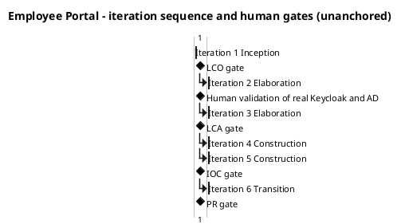
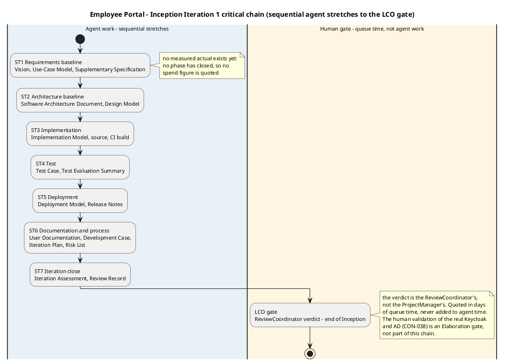

## Document Control

- Phase: Inception
- Status: Draft — under review for the end-of-Inception milestone
- Milestone Target: end-of-Inception (NOT YET ACHIEVED)
- Iteration: 1, Cycle 1
- Owner: ProjectManager
- Last updated: 2026-09-28

## Iteration Objectives

| # | Objective | Exit condition |
|---|---|---|
| O1 | Establish the requirements baseline | Vision, Use-Case Model and Supplementary Specification persisted; every declared FR, NFR, AC, CON and BG addressed by identifier |
| O2 | Establish the architecture baseline | Software Architecture Document and Design Model persisted; the three High-volatility use cases (UC-004, UC-011, UC-012) encapsulated in dedicated components |
| O3 | Establish the project's risk record | Risk List persisted; R001-R004 carried with their declared identifiers and magnitudes; every risk classified with a strategy and, where accepted, a mitigation and contingency |
| O4 | Establish the process baseline | Development Case persisted; the six optional-artifact triggers decided |
| O5 | Reach LCO readiness | The ReviewCoordinator's LCO verdict. The ProjectManager does not grant this milestone. |

Inception's increment is the four baselines, not an executable. No use case is implemented this iteration, and no acceptance criterion is verified this iteration — the evidence for each is produced in the iteration named in Evaluation Criteria.

## Plan and Milestones

### Coarse roadmap — cross-iteration

Iteration count is derived from the rubber profile as a starting point for **iteration count only** — Inception ~5%, Elaboration ~20%, Construction ~65%, Transition ~10% — checked against the 6±3 rule. Six iterations sit inside the band. The profile is not a spend split: no spend is assumed from it, and the first measured actual of a closed phase replaces every assumed share in every forecast made afterwards.

| Iteration | Phase | Milestone at end | Objective | Risks confronted |
|---|---|---|---|---|
| 1 | Inception | LCO | Requirements, architecture, risk and process baselines | R001-R005 identified and classified |
| 2 | Elaboration | — | Executable architecture; the highest-magnitude technical risks retired | R004 exercised against the test LDAP stand-in |
| 3 | Elaboration | LCA | Architecture baselined; all 12 use cases analysed and designed | R004 feedback from the human validation absorbed |
| 4 | Construction | — | Clocking and directory implemented and integrated | R002 |
| 5 | Construction | IOC | All 12 use cases implemented and tested | R005 |
| 6 | Transition | PR | Handover to Infrastructure; adoption measurement begins | R001 |

Elaboration carries two iterations rather than one because the architecture risk is concentrated there: the three High-volatility use cases (UC-004, UC-011, UC-012) must be encapsulated, and the human validation of the real Keycloak and AD (CON-038) returns its feedback before LCA. Construction carries two because the twelve use cases span three functional areas over one database. Transition is one iteration: the deployment target is an estate Infrastructure already runs (CON-010), there is no data migration (CON-040), and Infrastructure operates the portal afterwards (CON-039), so no user-training or cutover programme is planned.

**Human gates — quoted in days of queue time, never added to agent time:**

| Gate | Who | Where in the sequence | Duration |
|---|---|---|---|
| Human validation of the real Keycloak and the real AD (CON-038) | Infrastructure, with HR | End of Iteration 2, so Iteration 3 absorbs its feedback before LCA | Not measured — no gate has been passed |
| LCO, LCA, IOC, PR milestone verdicts | ReviewCoordinator | End of Iterations 1, 3, 5, 6 | Not measured |

If the human validation delays a milestone, the remedy is another iteration (CON-047) — never a cut to declared scope.

```plantuml
@startgantt
title Employee Portal - iteration sequence and human gates (unanchored)
' No project start date is declared. No absolute date appears.
' No duration is measured: no phase has closed, so no measured actual exists.
[Iteration 1 Inception] lasts 0 days
[LCO gate] happens at [Iteration 1 Inception]'s end
[Iteration 2 Elaboration] lasts 0 days
[Iteration 2 Elaboration] starts at [LCO gate]'s end
[Human validation of real Keycloak and AD] happens at [Iteration 2 Elaboration]'s end
[Iteration 3 Elaboration] lasts 0 days
[Iteration 3 Elaboration] starts at [Human validation of real Keycloak and AD]'s end
[LCA gate] happens at [Iteration 3 Elaboration]'s end
[Iteration 4 Construction] lasts 0 days
[Iteration 4 Construction] starts at [LCA gate]'s end
[Iteration 5 Construction] lasts 0 days
[Iteration 5 Construction] starts at [Iteration 4 Construction]'s end
[IOC gate] happens at [Iteration 5 Construction]'s end
[Iteration 6 Transition] lasts 0 days
[Iteration 6 Transition] starts at [IOC gate]'s end
[PR gate] happens at [Iteration 6 Transition]'s end
@endgantt
```

The bars carry no duration because none has been measured. A bar drawn to an estimated length would read downstream as an observation, and no date is projected from an estimate.

### Fine plan — this iteration

Work items and owners. **No work item carries a size.** No phase has closed, so no measured actual exists and no forecast can be derived from one; an empty size is correct, and a figure in hours, days, weeks or person-anything would be a unit this system does not measure.

| # | Work item | Owner (agent role) | Depends on | Exit condition |
|---|---|---|---|---|
| W1 | Vision | BusinessProcessAnalyst | — | Persisted; declared scope carried by identifier |
| W2 | Use-Case Model | SystemAnalyst | W1 | 12 use cases; the 4 architecturally significant ones detailed |
| W3 | Supplementary Specification | RequirementsSpecifier | W1 | 5 cross-cutting mechanisms as `<<include>>`, never as use cases |
| W4 | Software Architecture Document | SoftwareArchitect | W2, W3 | The three High-volatility use cases encapsulated |
| W5 | Design Model | Designer | W4 | Data structures inline (Data Model not triggered) |
| W6 | Implementation Model | Implementer | W5 | .NET 10 / Razor Pages / PostgreSQL 18 |
| W7 | Test Case | TestDesigner | W2, W5 | Covers UC-005 including the audit entry and the Corrected flag |
| W8 | Test Evaluation Summary | TestManager | W7 | — |
| W9 | Deployment Model | DeploymentManager | W4 | Keycloak as an intra-network node, never a cloud node (CON-032) |
| W10 | Release Notes | DeploymentManager | W6 | — |
| W11 | User Documentation | TechnicalWriter | W2 | — |
| W12 | Development Case | ProcessEngineer | — | The six optional triggers decided |
| W13 | Iteration Plan | ProjectManager | W1, W2 | This document |
| W14 | Risk List | ProjectManager | W1 | R001-R005 classified with strategies |
| W15 | Iteration Assessment | ProjectManager | W13, W14 | Written after the reviewers rule |
| W16 | Review Record | ConfigurationManager | W1-W15 | Findings only, one per defect |

```plantuml
@startuml
title Employee Portal - Inception Iteration 1 critical chain (sequential agent stretches to the LCO gate)
skinparam defaultFontSize 11

|#E8F0F8|Agent work - sequential stretches|
start
:ST1 Requirements baseline
Vision, Use-Case Model, Supplementary Specification;
note right
  no measured actual exists yet:
  no phase has closed, so no
  spend figure is quoted
end note
:ST2 Architecture baseline
Software Architecture Document, Design Model;
:ST3 Implementation
Implementation Model, source, CI build;
:ST4 Test
Test Case, Test Evaluation Summary;
:ST5 Deployment
Deployment Model, Release Notes;
:ST6 Documentation and process
User Documentation, Development Case,
Iteration Plan, Risk List;
:ST7 Iteration close
Iteration Assessment, Review Record;

|#FFF6E2|Human gate - queue time, not agent work|
:LCO gate
ReviewCoordinator verdict - end of Inception;
note right
  the verdict is the ReviewCoordinator's,
  not the ProjectManager's. Quoted in days
  of queue time, never added to agent time.
  The human validation of the real Keycloak
  and AD (CON-038) is an Elaboration gate,
  not part of this chain.
end note
stop
@enduml
```

The chain has seven sequential agent stretches from iteration start to the gate. Each carries no spend figure: the first measured actual arrives when a phase closes, and until then there is nothing to forecast from.

## Resources

Agent role profile for this iteration. Every role below is an AI agent; the only human in the project is the stakeholder.

| Role | Discipline | Artifacts owned this iteration |
|---|---|---|
| BusinessProcessAnalyst | Requirements | Vision |
| SystemAnalyst | Requirements | Use-Case Model |
| RequirementsSpecifier | Requirements | Supplementary Specification |
| SoftwareArchitect | Analysis & Design | Software Architecture Document |
| Designer | Analysis & Design | Design Model |
| UserInterfaceDesigner | Analysis & Design | Design Model (UI sections) |
| DatabaseDesigner | Analysis & Design | Design Model (data sections) |
| Implementer | Implementation | Implementation Model |
| Integrator | Implementation | Implementation Model (integration) |
| TestDesigner | Test | Test Case |
| TestManager | Test | Test Evaluation Summary |
| DeploymentManager | Deployment | Deployment Model, Release Notes |
| TechnicalWriter | Cross-discipline | User Documentation |
| ProcessEngineer | Environment | Development Case |
| ProjectManager | Project Management | Iteration Plan, Risk List, Iteration Assessment |
| ConfigurationManager | Configuration & Change Management | Review Record |
| ChangeControlManager | Configuration & Change Management | Change Request |
| Reviewer, ManagementReviewer, ReviewCoordinator | Configuration & Change Management | Review Record findings; the milestone verdict |

**Not invoked:** BusinessReviewer — Business Modeling is inactive as a discipline (Development Case §DC §4 classification), so no business-model artifact exists for it to review.

**Parallelism is not a lever.** The profile is fixed by the Development Case and is not adjusted to absorb a slip. Adding agent roles increases coordination overhead — context conflicts and artifact contention — without proportional benefit. When the project is behind, the lever is iteration count: another iteration to finish the declared scope. Declared scope is never cut to fit a plan; reducing it is a Change Request the stakeholder decides.

### The two currencies

| Currency | What it measures | This iteration | Reader |
|---|---|---|---|
| Agent work — tokens | The spend of the agent stretches above | Not yet measured — no phase has closed | ProjectManager, ProcessEngineer |
| Agent work — elapsed time | The wall clock the agent stretches consumed | Not yet measured | ProjectManager, ProcessEngineer |
| Human gate — days of queue time | Waiting for a human, not working | Not yet measured — no gate has been passed | ProjectManager, ProcessEngineer, ManagementReviewer |

The two clocks are reported side by side and never added, and neither is converted into the other. **No token budget exists and none is set** (CON-037): there is no box to fit, and declared scope is never cut or deferred to fit an estimate. The first measured actual of a closed phase replaces every assumed share in every forecast made afterwards.

## Use Cases and Scenarios Addressed

The iteration's scope is a named set of use cases, not a paraphrase. Inception Iteration 1 analyses and designs all twelve; it implements none.

| UC | Name | This iteration | Detail level |
|---|---|---|---|
| UC-001 | Record Clocking | Analysed and designed | Detailed — client timestamp, idempotency, client-side retry |
| UC-002 | View Own Clocking History | Analysed and designed | Outline |
| UC-003 | View All Employee Clockings | Analysed and designed | Outline |
| UC-004 | Export Monthly Clocking Report (CSV) | Analysed and designed | Detailed — High volatility |
| UC-005 | Correct or Insert a Clocking | Analysed and designed | Detailed — immutability and audit |
| UC-006 | Read News | Analysed and designed | Outline |
| UC-007 | Publish News Item | Analysed and designed | Outline |
| UC-008 | Edit Published News Item | Analysed and designed | Outline |
| UC-009 | Unpublish News Item | Analysed and designed | Outline |
| UC-010 | Feature News Item | Analysed and designed | Detailed — the at-most-one-featured invariant |
| UC-011 | Search Employee Directory | Analysed and designed | Outline |
| UC-012 | Assign Worker Category | Analysed and designed | Outline |

The four detailed use cases are the architecturally significant ones — those that force an architectural decision. The remaining eight are detailed by the RequirementsSpecifier in Elaboration.

## Evaluation Criteria
Two layers, kept apart.

### (a) Declared acceptance criteria — every AC-NNN addressed

| AC | Addressed this iteration by | Evidence that closes it | Iteration where the evidence exists |
|---|---|---|---|
| AC-001 | UC-001, NFR-003 | The full page load as the employee experiences it, including the clocking page's script | Construction / Transition |
| AC-002 | UC-001 | An employee clocks in and out without help from HR or the development team | Construction / Transition |
| AC-003 | UC-007 | An HR Administrator publishes a news item without technical assistance | Construction / Transition |
| AC-004 | UC-011 | Any employee finds a colleague's phone/email in under 10 seconds | Construction / Transition |
| AC-005 | UC-001 | 80% of employees complete at least one clocking with no prior training | Transition — adoption measurement |
| AC-006 | UC-001 | A clocking made while the network is down for up to 5 minutes is not lost | Construction / Transition |

No declared acceptance criterion is absent: all six are addressed by a named use case this iteration, and each names the evidence that closes it and the iteration where that evidence exists. Inception produces no executable, so no acceptance criterion is verified this iteration — stated rather than implied.

### (b) This iteration's exit criteria

| # | Exit criterion | Met when |
|---|---|---|
| E1 | Requirements baseline persisted | Vision, Use-Case Model and Supplementary Specification exist and every declared item is addressed by identifier |
| E2 | Architecture baseline persisted | Software Architecture Document and Design Model exist; the three High-volatility use cases are encapsulated |
| E3 | Risk record persisted | Risk List exists; every risk classified with a strategy and, where accepted, a mitigation and contingency |
| E4 | Process baseline persisted | Development Case exists; the six optional triggers decided |
| E5 | LCO readiness assessed | The ReviewCoordinator's verdict — not the ProjectManager's |

### (c) LCO readiness assessment

The ProjectManager's assessment. It is not the milestone verdict — that is the ReviewCoordinator's, and it does not exist yet.

| LCO exit criterion | Assessment |
|---|---|
| Stakeholders agree on scope | The scope is the declared one, carried by identifier and bounded by the declared exclusions. No functional area was added and none was cut. |
| The project is viable to proceed to Elaboration | Viable. The architecture risk is concentrated in three High-volatility use cases (UC-004, UC-011, UC-012) and is confronted in Elaboration Iterations 2-3. The deployment target is an estate Infrastructure already runs (CON-010). There is no data migration (CON-040). The two external systems are consumed, not built (CON-031, CON-011). |
| Initial risks identified | Five risks classified with probability, impact, magnitude, strategy and treatment. Every acceptance is authorised: R001-R004 by the CON-047 advance grant, R005 by STK-001's grant of 2026-09-28. |

**Recommendation: proceed to Elaboration.** The condition to watch is R004 — the human validation of the real AD (CON-038) must return its feedback before LCA, and if it delays the milestone the remedy is another iteration (CON-047), never a cut to declared scope.

## Traceability
| Element | Traces From | Link Type | Traces To |
|---|---|---|---|
| Iteration Plan | FR-001, FR-002, FR-003, FR-004, FR-005, FR-006, FR-007, FR-008, FR-009, FR-010, AC-001, AC-002, AC-003, AC-004, AC-005, AC-006 | DependsOn | Use-Case Model |
| Iteration Plan | R001, R002, R003, R004, R005 | DependsOn | Risk List |
| Iteration Plan | CON-010, CON-038, CON-039, CON-040 | DependsOn | Deployment Model |
| Iteration Plan | BG-001, BG-002, BG-003 | DependsOn | Iteration Assessment |

The plan's scope is the twelve use cases of the Use-Case Model, cited by identifier, and its acceptance criteria are the six declared ones, each mapped to the use case that addresses it. Its risk-driven sequencing rests on the Risk List. Its human gate and its deployment assumptions rest on CON-038 and the deployment constraints. Its business goals are measured in the Iteration Assessment.

