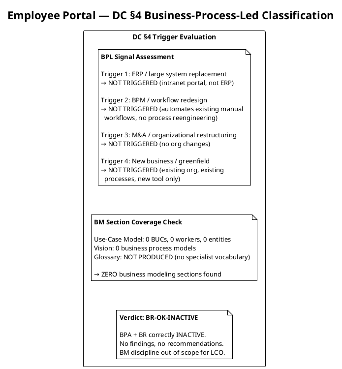
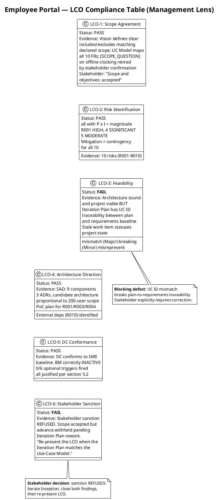
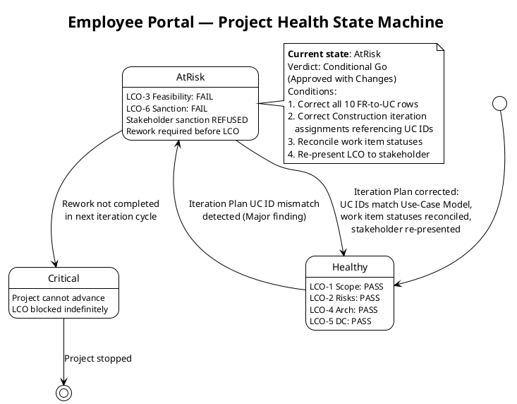
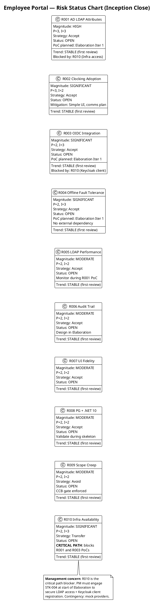
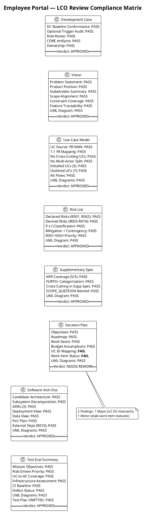
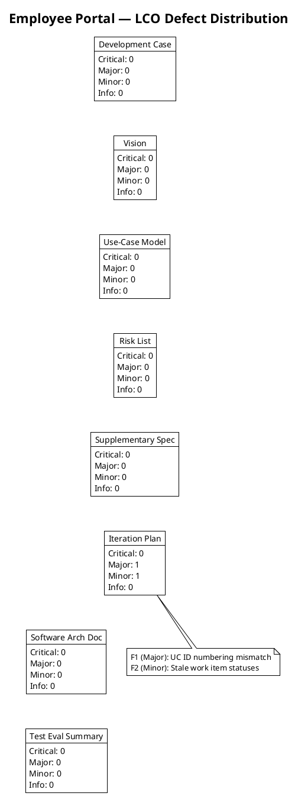

## Document Control

| Field | Value |
|---|---|
| Phase | Inception |
| Status | Draft |
| Milestone Target | End of Inception (LCO) |
| Iteration | 1 (Cycle 1) |
| Date | 2026-09-01 |
| Reviewers | Reviewer (technical lens), Management Reviewer (management lens) |
| Review Type | LCO Milestone Review — Feasibility & Exit Criteria |
| Stakeholder Sanction | **REFUSED** — scope accepted, advance withheld pending Iteration Plan rework |
| Management Verdict | **Conditional Go (Approved with Changes)** — rework required before LCO can close |

## Review Scope and Criteria

### Artifacts Reviewed (8)

| # | Artifact | Discipline | Phase | Status |
|---|---|---|---|---|
| 1 | Development Case | Environment | Inception | Draft |
| 2 | Vision | Requirements | Inception | Draft |
| 3 | Use-Case Model | Requirements | Inception | Draft |
| 4 | Risk List | Project Management | Inception | Draft |
| 5 | Supplementary Specification | Requirements | Inception | Draft |
| 6 | Iteration Plan | Project Management | Inception | Draft |
| 7 | Software Architecture Document | Analysis & Design | Inception | Draft |
| 8 | Test Evaluation Summary | Test | Inception | Draft |

### LCO Exit Criteria Applied

This review applies the **feasibility and acceptability** lens per RUP Project Approval / Planning review point. The LCO exit criteria checklist:

1. **Vision clarity** — Is the problem statement, product position, and scope clear and stakeholder-acceptable?
2. **Initial risk identification** — Are declared risks present, classified, and mitigated? Are additional risks identified?
3. **Use case survey level** — Are all declared FRs decomposed into UCs with sources cited? Are architecturally significant UCs detailed?
4. **Stakeholder agreement on scope and feasibility** — Does the scope match the declared input? Are cross-cutting mechanisms correctly placed?
5. **Architecture direction sound** — Is the candidate architecture proportional to scope? Are ADRs justified?
6. **DC baseline conformance** — Does the Development Case conform to the IARI baseline without forbidden overrides?
7. **Optional trigger justification** — Are all NOT-FIRED optional triggers genuinely not meeting their §5.2 conditions?
8. **Traceability** — Do all artifacts trace to declared scope elements (FR-NNN, NFR-NNN, CON-NNN, AC-NNN, RNNN)?

### SCM State

- **Open pull requests:** 0 — no PRs to dispose.
- **CI build status:** Green on main (verified by Test Evaluation Summary).

### Business Modeling Lens (Reviewer: Business Reviewer)

**Verdict: [BR-OK-INACTIVE] — Discipline NOT APPLICABLE per DC §4**

DC §4 trigger evaluation: project does not exhibit business-process-led characteristics. No ERP / BPM / workflow-redesign / M&A signals found in Vision. No Business Use Cases / Workers / Entities sections present in Use-Case Model. No business-domain specialist terms in Glossary (Glossary not produced — no specialist vocabulary trigger).

Conclusion: BPA + BR are correctly INACTIVE for this engagement. No findings, no recommendations. Downstream reviewers (MR, RC) may treat the BM discipline as out-of-scope for the LCO milestone.

#### DC §4 Classification Evidence

| Check | Result | Evidence |
|---|---|---|
| DC §4 `isBusinessProcessLed` | `false` | Process Engineer classification recorded 2026-09-01T07:50:58Z |
| BPL Trigger 1: ERP / large system replacement | NOT TRIGGERED | Employee Portal is an intranet web app, not an ERP replacement |
| BPL Trigger 2: BPM / workflow redesign | NOT TRIGGERED | Project automates existing manual workflows (Excel → web), no process reengineering |
| BPL Trigger 3: M&A / organizational restructuring | NOT TRIGGERED | No organizational changes declared |
| BPL Trigger 4: New business / greenfield | NOT TRIGGERED | Existing organization (Cuba Corp, 200 employees), existing processes, new tool only |
| BM sections in Use-Case Model | 0 BUCs, 0 Workers, 0 Entities | Use-Case Model contains only system-level UCs (UC-001–UC-010) with system actors |
| BM sections in Vision | 0 | Vision contains product position, features, system boundary — no business process models |
| Glossary specialist terms | N/A | Glossary not produced (no specialist vocabulary trigger per DC §5.2) |

#### Classification Coverage Diagram

#### BR Traceability

| Element | Traces From | Link Type | Traces To |
|---|---|---|---|
| BR-OK-INACTIVE verdict | DC §4 classification (`isBusinessProcessLed: false`) | Refines | LCO Milestone Gate |
| BM section coverage check | Use-Case Model (0 BUCs), Vision (0 BPMs) | Tests | DC §4 BPL trigger conditions |
| BPL trigger evaluation | DC §4 criteria (ERP, BPM, M&A, greenfield) | Tests | Vision, Use-Case Model |

### Management Reviewer Lens — LCO Compliance Table

The Management Reviewer evaluates the project against LCO exit criteria from the project governance perspective: scope agreement, risk identification, feasibility, architecture direction, DC conformance, and stakeholder sanction.

### Management Reviewer Lens — Project Health State Machine

### Management Reviewer Lens — Risk Status Chart

### Management Reviewer Lens — Four-Axis Health Scorecard

| Dimension | Status | Evidence |
|---|---|---|
| **Scope** | 🟢 GREEN | All 10 FRs decomposed into UCs; scope matches declared input; no scope creep; [SCOPE_QUESTION] retired; stakeholder confirmed scope accepted |
| **Schedule** | 🟡 AMBER | 7-iteration roadmap within 6±3 rule; BUT Iteration Plan has stale work item statuses misrepresenting completion state; LCO cannot close until rework complete |
| **Cost** | 🟢 GREEN | Budget box [ASSUMPTION — 185K tokens] with per-work-item allocation; no measured actuals yet (first iteration); assumptions properly tagged |
| **Quality** | 🟡 AMBER | 7/8 artifacts pass with zero findings; CI green, zero defects; BUT Iteration Plan UC ID mismatch breaks traceability — a quality defect in the planning artifact itself |

**Overall health: AT-RISK** — Two dimensions amber (schedule, quality) due to Iteration Plan defects. Project is viable but cannot advance until rework closes both findings and stakeholder re-presented.

## Findings

### Technical Lens (Reviewer)

**Verdict: Approved with Changes** — 7 of 8 artifacts pass all LCO exit criteria. Iteration Plan requires rework (1 Major, 1 Minor). No Critical findings. No open [SCOPE_QUESTION] markers. No scope creep detected.

#### Compliance Matrix

#### Defect Distribution

### Management Lens (Management Reviewer)

**Verdict: Conditional Go (Approved with Changes) — Stakeholder sanction REFUSED**

The Management Reviewer evaluated the project against LCO exit criteria from the project governance perspective. 4 of 6 management criteria pass (scope agreement, risk identification, architecture direction, DC conformance). 2 criteria fail:

- **LCO-3 (Feasibility): FAIL** — The Iteration Plan contains a Major defect (UC ID mismatch) that breaks traceability between the project plan and the requirements baseline. A plan that does not correctly reference the use cases it is planning to deliver cannot serve as a reliable basis for milestone assessment.
- **LCO-6 (Stakeholder Sanction): FAIL** — The stakeholder was consulted and refused to sanction advancing past LCO. The stakeholder's decision: "Scope and objectives: accepted. They are not in question. Sanction to advance: withheld. Iterate Inception and close both findings first."

**Stakeholder sanction: REFUSED**

The stakeholder accepted the project scope and objectives but withheld sanction to advance to Elaboration. The stakeholder requires:
1. Correct all 10 FR-to-UC rows in the Iteration Plan to match the Use-Case Model (the authority)
2. Correct Construction iteration assignments that reference UC IDs
3. Reconcile work item statuses against the repository
4. Re-present the LCO when the Iteration Plan matches the Use-Case Model

The stakeholder explicitly stated: "Do not reopen scope: nothing about the requirements baseline is being questioned here."

#### Management Findings on Iteration Plan

| Finding Key | Severity | Finding | Recommendation | Verdict |
|---|---|---|---|---|
| F1 (MR) | Major | UC ID numbering mismatch breaks plan-to-requirements traceability. The "Use Cases and Scenarios Addressed" table maps FR-001→UC-001 (sequential), but the Use-Case Model maps FR-001→UC-005, FR-004→UC-001, FR-010→UC-004. Stakeholder reviewed and refused sanction: "The Use-Case Model is the authority. Correct all ten rows, and the Construction iteration assignments that hang off them." | Update all 10 FR-to-UC mappings to match Use-Case Model. Update Construction iteration assignments. Re-present LCO. | NeedsRework |
| F2 (MR) | Minor | Work item statuses stale: items 4, 5, 6, 7, 10 show "Pending" while artifacts exist as Draft. Stakeholder: "Reconcile the status column against the repository." | Update Work Items table status column to reflect actual completion. Reconcile against repository. | NeedsRework |

## Resolutions and Actions

### Open Action Items

| Finding Key | Artifact | Severity | Lens | Action Required | Owner | Status |
|---|---|---|---|---|---|---|
| F1 | Iteration Plan | Major | Reviewer + MR | Correct UC ID mapping in "Use Cases and Scenarios Addressed" table and all body text referencing UC IDs; update Construction iteration assignments | Project Manager | **Open — BLOCKING LCO** |
| F2 | Iteration Plan | Minor | Reviewer + MR | Update work item statuses to reflect actual completion against repository | Project Manager | **Open — BLOCKING LCO** |

### Prior Findings (This Lens)

No prior findings — this is iteration 1 (first review cycle).

### Stakeholder Consultation Record

| Item | Value |
|---|---|
| Question | LCO review — verdict: Conditional Go. Open defects: 0 Critical, 1 Major, 1 Minor. Do you accept the project scope and objectives and sanction advancing past LCO? |
| Answer | **No** — scope accepted, sanction withheld |
| Stakeholder direction | "Scope and objectives: accepted. They are not in question. Sanction to advance: withheld. Iterate Inception and close both findings first." |
| Scope status | NOT in question — do not reopen |
| Required rework | (1) Correct all 10 FR-to-UC rows to match Use-Case Model; (2) Correct Construction iteration assignments; (3) Reconcile work item statuses; (4) Re-present LCO |

## Disposition

### Technical Lens Disposition

**Approved with Changes** — 7 of 8 artifacts pass all LCO exit criteria with zero findings. The Iteration Plan requires rework (1 Major, 1 Minor). No Critical findings. No open [SCOPE_QUESTION] markers. No scope creep detected.

### Management Lens Disposition

**Conditional Go (Approved with Changes) — Stakeholder sanction REFUSED**

The Inception iteration has produced a comprehensive and high-quality set of artifacts. The project is viable, the scope is agreed, risks are identified with magnitude ratings, and the architecture direction is sound. The Development Case conforms to the IARI baseline with no forbidden overrides.

**However, the LCO milestone cannot be declared achieved.** Two conditions must be met before the LCO gate can close:

1. **F1 (Major — BLOCKING):** The Iteration Plan must correct all 10 FR-to-UC mappings to match the Use-Case Model (the authority). Construction iteration assignments that reference UC IDs must also be corrected. This is a traceability defect that breaks the link between the project plan and the requirements baseline.

2. **F2 (Minor — BLOCKING):** The Iteration Plan must reconcile work item statuses against the repository. Items showing "Pending" for artifacts already produced as Draft misrepresent project state.

**After both findings are closed, the LCO must be re-presented to the stakeholder for sanction.** The stakeholder explicitly stated: "Re-present the LCO when the Iteration Plan matches the Use-Case Model."

**Project health: AT-RISK.** The project is not in crisis — scope, architecture, and risk management are sound. The blocking issue is a planning artifact quality defect, not a fundamental project problem. One rework cycle of the Iteration Plan should resolve both findings.

**No Critical findings. No open [SCOPE_QUESTION] markers. No scope creep detected. Scope is NOT in question.**

## Traceability

| Element | Traces From | Link Type | Traces To |
|---|---|---|---|
| Review Record (this) | All 8 Inception artifacts | Reviews | Iteration Assessment, LCO Milestone Gate |
| F1 (Major) | Iteration Plan — UC ID mapping | Derives | Use-Case Model (authority for UC IDs) |
| F2 (Minor) | Iteration Plan — Work Items table | Derives | All produced Draft artifacts |
| DC Conformance Check | IARI DC Baseline | Refines | Development Case artifact |
| Optional Trigger Audit | DC §5.2 conditions | Refines | Development Case — Optional Artifacts table |
| UC Source Verification | FR-001–FR-010 (declared) | Tests | Use-Case Model — UC-001–UC-010 |
| Cross-Cutting Check | Scope Guard Rule 7 | Tests | Use-Case Model, Supplementary Specification |
| Scope Adherence | Declared Scope (Work Order) | Tests | All 8 artifacts |
| LCO Compliance Table | LCO exit criteria (RUP) | Refines | LCO Milestone Gate |
| Project Health State Machine | Four-axis health assessment | Refines | LCO Milestone Gate |
| Risk Status Chart | Risk List (R001–R010) | Refines | Elaboration Iteration Plan, LCO Milestone Gate |
| Stakeholder Consultation | S_CONSULT_STAKEHOLDER | Derives | LCO Milestone Gate (sanction decision) |
| BR-OK-INACTIVE verdict | DC §4 classification | Refines | LCO Milestone Gate |