## Document Control
| Field | Value |
|---|---|
| Phase | Elaboration |
| Status | **Consolidated — cumulative across iterations.** Elaboration Iter 1 Cycle 1 record (Code Reviewer + Reviewer + Business Reviewer + Management Reviewer lenses + Review Coordinator consolidation) **PRESERVED below — never overwritten.** **Elaboration Iter 2 Cycle 1 (convergence cycle) — technical-lens re-review APPENDED (Reviewer):** prior-findings reconciliation executed (3 of 4 prior findings of that lens RESOLVED via `resolve_artifact_finding` — SAD F1, SAD F3, Risk List F1; SAD F2 PERSISTS, re-emitted under its findingKey with fresh SCM evidence); 5 new findings recorded via `record_artifact_finding` (1 Major — Development Case F1; 4 Minor — Iteration Plan F3 TC enumeration, Test Evaluation Summary F1, Development Case F2, Architectural Proof-of-Concept F1); per-artifact verdicts; LCA disposition (sanction STILL WITHHELD — code evidence absent); PR disposition (in-scope open PR set ∅ — verified via `scm_list_pull_requests` state=all). **Business-lens re-review APPENDED (Business Reviewer, Iter 2):** DC §4 gate re-evaluated — **BR-OK-INACTIVE sustained**; zero findings, zero BM conditions. **Management-lens re-review APPENDED (Management Reviewer — PRA, Iter 2):** prior-findings reconciliation executed (3 of 4 prior findings of this lens RESOLVED via `resolve_artifact_finding` — Iteration Plan F4, Iteration Plan F5, Risk List F1; Iteration Plan F3 PERSISTS, re-emitted under its findingKey, 2nd occurrence); 4 findings recorded via `record_artifact_finding` (1 Critical re-emission — Iteration Plan F3; 2 Major NEW — Iteration Plan F6 budget box not re-sized from the measured 12,523,281 iteration actual, Risk List F2 R007 featured-banner mis-transcription; 1 Minor NEW — Iteration Plan F7 WI 2/9 statuses stale vs verified delivery); LCA disposition NO-GO (convergence continues; fresh sanction request at R6); four-dimension health AT-RISK (Scope GREEN, Schedule AMBER, Cost AMBER, Quality RED). **Coordinator consolidation APPENDED this revision (Review Coordinator, Iter 2):** verified-ledger sweep executed across ALL 13 artifacts (`read_artifact_findings` — [FINDINGS] read=13, unread=none, open Critical=2, open Major=3, open Minor=5); Consolidated Finding Tracker updated to the Iter 2 verified ledger (12 tracked findings: 10 ledger + 2 narrative; 6 ledger-closed this cycle by their emitting lenses); cross-lens conflicts resolved (one defect observed by three gates → merged work A-16; featured-banner mis-transcription class spans Development Case F1 + Risk List F2 → coordinated A-17 + A-24; stale TC-enumeration class spans four artifacts → coordinated A-18…A-21; budget box + statuses ride one plan evolution A-22 + A-23); action chain extended A-16…A-24 with dependency-ordered execution priorities; Iter 2 Review Effectiveness Metrics recorded (first trend data: coverage 13/13, 6 findings closed in one cycle, 2 Criticals recurring on the one code-evidence defect, DRE still not measurable, 0 overdue); consolidated LCA disposition **NO-GO CONFIRMED — requiresIteration: TRUE** (Critical-escalation state: DISCHARGED at Iter 1, standing resolution binding; no new stakeholder input owed to unblock the Criticals — their remediation is fully determined by recorded stakeholder decisions). **Stakeholder contribution received at the verdict gate and folded this revision (post-consolidation):** the R001 behavioural bar is EXTENDED to FOUR clauses (fourth clause, verbatim in § Findings — Stakeholder Contribution: "a missing attribute is displayed as missing. It is never replaced by a default, a placeholder, a guessed value, or another employee's value"); propagation actions A-25…A-31 added (seven carrying artifacts: Use-Case Model, Supplementary Specification, Design Model, Test Case, Architectural Proof-of-Concept, Risk List, SAD); the Implementer's two-iteration code absence is stakeholder-attributed to a technical problem beyond its control — the code push is the stated priority for the next pass (A-16 remains P0); the R6 evidence gate now requires FOUR-clause × four-consumer R001 evidence |
| Milestone Target | End of Elaboration (LCA) — **NOT achieved; convergence cycle in progress.** Re-presentation entry gate (coordinator-enforced): empty findings ledger across ALL lenses and severities + empirical R001/R003/R004 evidence package (PoC artifact results with clause-by-clause FOUR-clause four-consumer evidence + mechanism code merged to `iteration/E1` + TC-001…TC-023 executed) + corrections committed (A-17…A-31) + fresh sanction request |
| Iteration | 2 (Cycle 1) — this revision appends the coordinator consolidation and the verdict-gate stakeholder contribution atop the Iter 2 technical-lens, business-lens and management-lens records; the Iter 1 record below is the historical baseline |
| Date | 2026-09-02 (Iter 2 technical-lens + business-lens + management-lens reviews + coordinator consolidation + stakeholder contribution at the verdict gate + **verdict-gate question re-emission after the emission-format incident**) · 2026-09-01 (Iter 1 record, preserved) |
| Review Type | Cumulative. Iter 1 (preserved): Code Review (PR Approval Loop, Implementation discipline) + Technical LCA Milestone Review + Business Modeling lens LCA evaluation + Management LCA Milestone Review (PRA) + Coordinator consolidation. **Iter 2 (this revision): Technical LCA re-review — convergence-cycle track (R3 corrected-artifact re-reviews + R4 evaluation-criteria verification), EXIT CRITERIA lens; Business Modeling lens — DC §4 classification re-verification (BR-OK-INACTIVE sustained); Management LCA re-review (PRA — Project Planning Review + LCA exit criteria, convergence track R3/R4); Review Coordinator — LCA milestone consolidation (verified-ledger sweep, cross-reviewer finding consolidation, conflict resolution, action prioritization, verdict aggregation) + stakeholder-contribution folding at the verdict gate** |
| Reviewers | **Iter 2 (this revision): Reviewer (technical lens) + Business Reviewer (business lens — BR-OK-INACTIVE sustained) + Management Reviewer (PRA — management lens) + Review Coordinator (consolidation) + Stakeholder (STK-001 — contribution at the verdict gate).** Iter 1 (preserved): Code Reviewer (code-review gate sections); Reviewer (technical LCA sections); Business Reviewer (BR-OK-INACTIVE); Management Reviewer (PRA); Review Coordinator (consolidation) |
| Review Point | LCA milestone — EXIT CRITERIA lens. **Iter 2 technical-lens answer: NO — 1 Critical open (SAD F2, 2nd occurrence: zero mechanism code in SCM, zero PRs in any state, Issue #1 open — empirical R001/R003/R004 validation unexecuted).** **Iter 2 business-lens answer: BR-OK-INACTIVE sustained — zero BM conditions on the LCA re-presentation gate.** **Iter 2 management-lens answer: NO-GO — LCA-2/LCA-3 NOT MET (code evidence absent), LCA-5 REFUSED (standing), LCA-6 measurement PASS / plan-response FAIL (budget box not re-sized); convergence cycle continues; fresh sanction request at R6.** **Coordinator consolidated answer (this revision): NO-GO CONFIRMED — verified ledger carries 2 Critical / 3 Major / 5 Minor open; planned scope (exit criteria 1–3) UNMET on zero code evidence; stakeholder sanction REFUSED (standing). The phase auto-iterates within the convergence cycle (`requiresIteration: TRUE` recorded, ok — the verdict stands, never revised); the R6 re-presentation entry gate is unchanged in substance, extended in scope (FOUR-clause bar per the verdict-gate contribution).** Record-side corrections VERIFIED this review across lenses: SAD F1/F3 and Risk List F1 (Reviewer) RESOLVED; Iteration Plan F4/F5 and Risk List F1 (Management Reviewer) RESOLVED this revision via `resolve_artifact_finding`; the plan/risk management corrections (A-12…A-15) verified present in the artifacts |
| Prior Record | Inception LCO Milestone Review — GO (APPROVED), all 4 findings RESOLVED, stakeholder sanction GRANTED (preserved below). Elaboration Iter 1 — NO-GO confirmed; stakeholder sanction REFUSED; all-findings directive binding (preserved below) |
| Open Findings (verified ledger, after this revision) | **Critical 2:** [Software Architecture Document#F2 — persists, 2nd occurrence: zero mechanism code in SCM, zero PRs in any state, Issue #1 open — empirical R001/R003/R004 validation unexecuted (Reviewer lens)]; [Iteration Plan#F3 — persists, 2nd occurrence: exit criteria 1–3 code evidence absent (Management Reviewer lens)]. **Major 3:** [Development Case#F1 — misrecorded featured-banner decision (Reviewer lens)]; [Iteration Plan#F6 — budget box not re-sized from the measured 12,523,281 iteration actual (Management Reviewer lens)]; [Risk List#F2 — R007 featured-banner mis-transcription (Management Reviewer lens)]. **Minor 5:** [Development Case#F2 — stale TC enumeration (Reviewer)]; [Iteration Plan#F3 — stale TC enumeration (Reviewer, Iter 2)]; [Iteration Plan#F7 — WI 2/9 statuses stale (Management Reviewer)]; [Test Evaluation Summary#F1 — stale TC enumeration (Reviewer)]; [Architectural Proof-of-Concept#F1 — stale TC enumeration (Reviewer)]. **Narrative-tracked (Code Reviewer):** F-CR-E1-1 Critical — OPEN (same underlying gap as SAD F2 / Iteration Plan F3 — one defect, three gates); F-CR-E1-2 Minor — remediation VERIFIED PRESENT (CONTRIBUTING.md committed, sha `6662813…`); closure owned by that lens. **Ledger-closed this cycle (6):** SAD F1, SAD F3, Risk List F1 (Reviewer), Risk List F1 (Management Reviewer), Iteration Plan F4, Iteration Plan F5 — all by their emitting lenses via `resolve_artifact_finding` (2026-09-02). Business Reviewer lens: zero findings (BR-OK-INACTIVE sustained, Iter 2). **Stakeholder-contribution propagation (not defect findings — stakeholder-decision work, tracked as A-25…A-31):** the FOUR-clause behavioural bar must land in all seven carrying artifacts before R4/R6 |
| Stakeholder Sanction | **REFUSED at the Iter 1 LCA review — standing until re-presentation.** Directive verbatim: "Please fix all the findings even if they are minors prior to move to next phase"; escalation resolution verbatim: "Fix all the issues and close all findings" — binding on phase transition (ALL findings, ALL severities, ALL lenses close before phase exit). Fresh sanction request scheduled at the R6 re-presentation with the evidence package. **Contribution at the Iter 2 verdict gate (2026-09-02, post-consolidation):** the FOURTH behavioural-bar clause (binding — extends the R001 validation bar for all four AD-reading UCs: a missing attribute is displayed as missing, never replaced by a default, a placeholder, a guessed value, or another employee's value) and the Implementer context/priority, folded verbatim into § Findings (Stakeholder Contribution) and tracked as A-25…A-31. The standing REFUSED sanction and the all-findings directive are unchanged; the fresh sanction request fires at R6 |
| Process Incident (this revision) | None new in the review process itself. The Iter 2 doubt examination (technical lens) stands: no stakeholder input is owed this cycle — every open finding's remediation is fully determined by recorded stakeholder decisions. The management lens re-examined independently and concurs. **Coordinator determination (this revision): the Critical-escalation state for the two persisting Criticals (SAD F2, Iteration Plan F3 — both 2nd occurrences) is DISCHARGED — the Iter 1 escalation was delivered and answered (resolution recorded verbatim, binding); both Criticals trace to recorded stakeholder decisions whose remediation needs no new stakeholder input; re-escalating would re-open an answered question. The milestone verdict proceeds through the stakeholder contribution gate (VERDICT_CONTRIB) — the phase iterates.** **Verdict-gate contribution (this revision):** received, verified against the recorded artifact state (the fourth clause EXTENDS the three-clause bar without contradiction — the existing records already specify blank rendering: UC-005 blank display fields, UC-006 blank cells, UC-007 blank fields, COMP-007/CLS-009 missing attribute = null), and folded; no open consequential doubt remains — the fourth-clause decision is GIVEN, not pending; its propagation (A-25…A-31) is convergence-cycle work tracked to the R4/R6 gates. **Process observation recorded for all roles emitting the user-input question marker:** the stakeholder states the prior confirmation questionnaire "did not include input" — the Iter 2 behavioural-bar confirmation was yes/no with no free-text field, and the stakeholder held this fourth clause for an entire cycle with no field to deliver it in; contract-confirmation questionnaires must carry an optional free-text field for additions. **Emission-format incident (coordinator-owned, this revision — recorded, not silently dropped):** the consolidation revision's completion output embedded the user-input question-marker string inside a memory-entry text block (the questionnaire-format process observation above); the runtime parser read that occurrence as a question emission, found no valid JSON array following it, and flagged the emission INVALID — never delivered. Corrective actions executed this revision: (1) the verdict-gate contribution question is re-emitted in valid format — the marker on its own line, immediately followed by the JSON array, nothing else on that line; (2) the marker string is never again embedded in non-emission text (memory blocks, prose, artifact content) — one marker, one line, valid JSON, nothing else on the line. Incident class: unparseable emission withdrawn and corrected — the SAME class as the Iter 1 escalation emission failure (first emission unparseable, never delivered; re-emitted in valid format, delivered and answered); this is the class's second occurrence, now recorded as a standing emission-format rule propagated to the Process Engineer alongside the questionnaire-format rule |
## Review Scope and Criteria
### This Cycle's Scope — Elaboration Iteration 1, Cycle 1 (Code-Review Lens)

Per the Work Order and BRANCHING_STRATEGY §5.2, the Elaboration architectural prototype is **evolutionary production code**: the Implementer builds each risk-retirement mechanism in `src/` on `feature/E1-{risk-id}` branches based on `iteration/E1`, labels them `ready-for-review`, and the Code Reviewer opens and reviews one PR per mechanism (base `iteration/E1`) exactly as a Construction feature PR — never rejecting prototype code as throwaway, never waiving the checklist.

**Expected handoffs this iteration** (Iteration Plan Work Items 7–9, ~250K tokens; Development Case PoC trigger FIRED; stakeholder decision binding — the PoC is produced in Elaboration AND validated empirically):

| Expected mechanism | Risk | Plan work item | Design baseline |
|---|---|---|---|
| Disposable LDAP directory + attribute population/query validation | R001 (HIGH) | WI-7 | COMP-007 / CLS-009 LdapGateway; graceful degradation (missing attribute = null, entry NOT hidden) |
| Stub OIDC issuer + token validation + role-claim extraction | R003 (SIGNIFICANT) | WI-8 | COMP-006 / CLS-010 KeycloakAuthProvider; Employee + HR Administrator roles from claims |
| 5-minute network-drop simulation: localStorage queue + idempotent sync | R004 (SIGNIFICANT) | WI-9 | COMP-009 / CLS-008 OfflineQueueClient; UNIQUE idempotency_key (REL-002), sync ≤ 60 s (REL-003) |

### Code-Review Checklist (applies unchanged to the first mechanism PR)

| # | Checklist item | Basis |
|---|---|---|
| CR-1 | Programming guidelines conformance — every violation cited to a rule in `CONTRIBUTING.md` | RUP Ch.11; DC-flagged guideline gap |
| CR-2 | Dual coverage — black-box contract AND white-box paths (branches, loops, error handlers) | RUP Ch.11 §7428-7447 |
| CR-3 | SAD / Design Model conformance — class names, signatures, layer placement, interface contracts | SAD COMP-001…011, ADR-001…004; Design Model CLS-001…027, INT-006…019 |
| CR-4 | Traceability trailer — `Implements: UC-NNN` or risk-id in PR body / commit | Use-case-driven pillar |
| CR-5 | Build status hard gate — CI red ⇒ request_changes, no code review | Reviewer heuristic 5 |
| CR-6 | Build-tree coverage — every changed file under `src/` or `tests/` inside the build tree | S2 checklist |
| CR-7 | Terminal disposition per PR — approve or request_changes; no PR left undecided | Gate-enforcement mandate |

### Gate Execution — What Was Run This Cycle (Code-Review Lens)

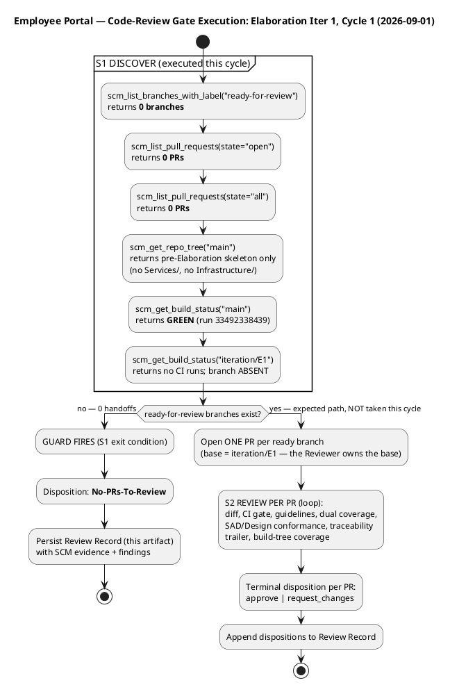

### Compliance Matrix — Checklist × Status (Code-Review Lens)

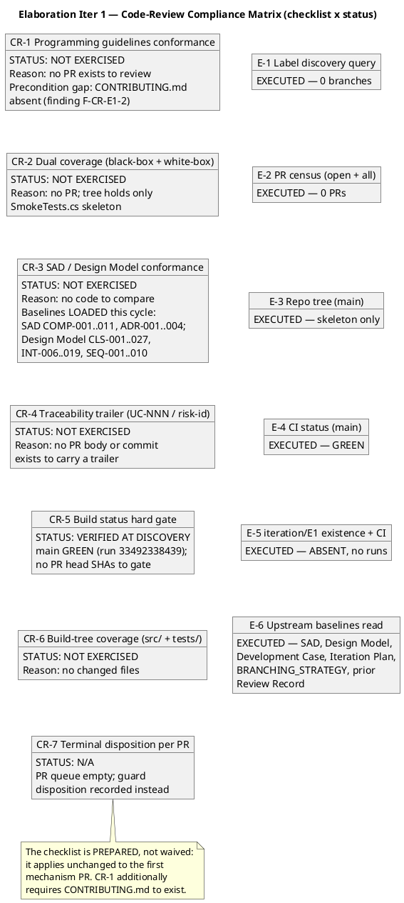

### SCM Evidence Snapshot (review evidence — what actually happened)

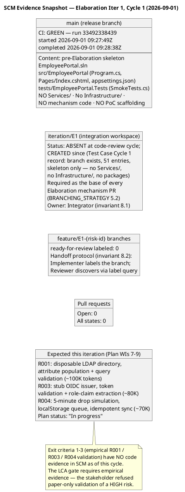

### Historical Record — Inception LCO Review Scope (preserved)

The Inception record reviewed 9 artifacts + the Review Record against 9 LCO exit criteria (feasibility lens) across 2 iterations. Iteration 1 raised 2 findings on the Iteration Plan (F1 Major — UC-ID mapping mismatch; F2 Minor — stale work-item statuses); the stakeholder REFUSED sanction pending rework. Iteration 2 verified both corrections, raised zero new findings, and recorded stakeholder sanction GRANTED ("Let's go to elaboration."). Full LCO compliance matrices, health state machine, risk retirement status, and milestone timeline diagrams are preserved in SCM history at the Inception revision of this artifact.

### Technical LCA Lens — Scope and Criteria (Reviewer, this cycle)

**Scope:** ALL 9 technical artifacts produced this phase, reviewed against the **LCA exit-criteria lens** (are the artifacts collectively sufficient for phase transition?) — the correct evaluative lens for a lifecycle milestone, not a completion lens. Priority order: SAD first (architecture gate), then Design Model, then Use-Case Model, then remaining. Upstream consumption completed before findings: all 9 artifacts read in full; the Work Order's declared scope (10 FRs, 5 NFRs, 5 ACs, 14 CONs, 2 declared risks), the stakeholder's recorded decisions (timestamp convention, America/Havana, PoC empirical validation), and the SCM state (zero open PRs; `iteration/E1` skeleton-only per the Test Case's empirical inspection) were cross-checked.

**Checklists applied per artifact type:** SAD → architecture checklist (4+1 views, NFR→tactic mapping, change-area subsystems, interface-based boundaries, PoC plan vs stakeholder decision); Design Model → design checklist (UC realizations per-UC, full signatures, interface contracts, volatility encapsulation, co-owned section integrity); Use-Case Model → requirements checklist (actors, flows, pre/post conditions, alternatives, `Source: FR-NNN` guard, cross-cutting-mechanism guard); Supplementary Specification → NFR checklist (FURPS+ quantified, testable, traceable, no gold-plating); Risk List → mitigation/acceptance-criteria checklist; Iteration Plan → plan-integrity checklist (UC-ID authority, honest statuses, two clocks); Development Case → IARI baseline conformance + optional-trigger justification audit; Test Case / Test Evaluation Summary → test-design checklist (coverage, adversarial intent, honest verdicts, no fabricated results).

**Scope-marker verification:** all non-literal elements carry correct markers; three stakeholder decisions retired their markers in place (offline mechanism, timestamp convention, office timezone America/Havana) — no marker survives its own answer. The `[ASSUMPTION]` tags on quantified thresholds (2 s window, queue ≥ 10, sync ≤ 60 s, 95th percentile) carry named bases — compliant, with one exception recorded as Risk List F1.

**Compliance Matrix — Technical LCA Lens (9 artifacts × checklist dimensions):**

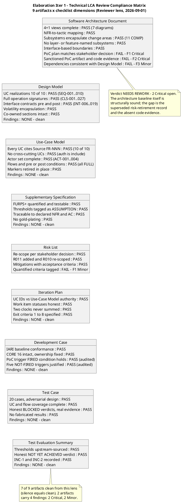

### Business Modeling Lens — Scope and Criteria (Business Reviewer, this cycle)

**Scope:** the DC §4 business-process-led classification and the Elaboration artifact set, evaluated against the LCA exit-criteria lens for the Business Modeling discipline: is the discipline correctly INACTIVE, and did the phase produce exactly the BM deliverables the classification requires (zero, for a non-BPL project)?

**Scenario assessment (reviewer heuristic 1):** the engagement is software-feature-led automation of existing, well-understood manual workflows (Excel clocking sheets, mass-email news distribution, PDF directory) — not one of the business-modeling scenarios that warrant a business object model. The ProcessEngineer's DC §4 re-check (2026-09-01) records `isBusinessProcessLed = false` with the Inception verdict unchanged; this lens independently verified the claim against the Vision (tool replacement, no reengineering signals) and the Use-Case Model (zero BUCs, business workers, business entities, or realizations; 10 system UCs trace 1:1 to FR-001…FR-010). The classification is CORRECT — no defect.

**Gate evaluation (what was checked, with evidence):**

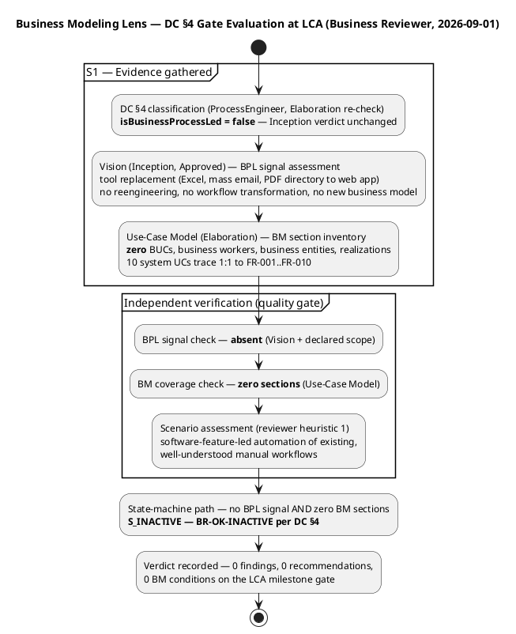

**Prior-findings reconciliation (this lens):** the findings ledger holds zero findings emitted by the BusinessReviewer role — the Inception findings (F1/F2) belong to the Reviewer and ManagementReviewer lenses and are all RESOLVED. Nothing to close; no `resolve_artifact_finding` calls owed.

### Management LCA Lens — Scope and Criteria (Management Reviewer — PRA, this cycle)

**Scope:** the two-part review the PRA owns at the end-of-Elaboration milestone. Part 1 — **Project Planning Review** (feasibility and acceptability of the Iteration Plan). Part 2 — **LCA exit criteria** (the six RUP lifecycle-architecture criteria, pass/fail per criterion with evidence). Artifacts inspected in full before any conclusion: Software Architecture Document (architecture baseline), Iteration Plan (planning baseline — coarse roadmap + fine plan), Risk List (risk status), Iteration Assessment (Inception — prior-phase actuals; the Elaboration assessment is authored by the Project Manager in the Assess touchpoint AFTER this review, so its absence here is expected and is never a finding), Development Case (PoC trigger correction verified: trigger FIRED, stakeholder decision binding), Review Record (cumulative — all lenses), and the Work Order's Measured Actuals (Inception: 28 min agent time, 1,347,939 tokens, 11 runs, 10 artifacts — phase-level record governs).

**Part 1 — Project Planning Review (feasibility and acceptability):**

| Dimension | Assessment | Evidence |
|---|---|---|
| Budget box traces to measured actuals | **PASS** | 1,200K box [ASSUMPTION — scaled from measured Inception actual 1,347,939 tokens, phase-level record; basis named]; work items sum ~1,180K within box; Construction sizing tagged with basis; the disproven 185K assumption explicitly replaced |
| Units discipline | **PASS** | No person-weeks/story points; two clocks (agent tokens/time vs. human queue days) never summed — verified in milestone table, Two Clocks section, sizing note; gantt bars disclaimed as structural sequencing units, unanchored |
| UC-ID authority (LCO F1 lesson) | **PASS** | All 10 FR→UC rows verified against Use-Case Model authority (FR-001→UC-005, FR-004→UC-001, FR-010→UC-004 …) |
| Status honesty (LCO F2 lesson) | **PASS with one Critical exception** | WI 2–10 "In progress" with reconciliation note — but WI 7–9 (PoC code) have zero SCM evidence (no Services/, no Infrastructure/, no packages; iteration/E1 skeleton only; SCM Issue #1 blocker) → Iteration Plan F3 (Critical) |
| Human gate queue handling | **DEFECT (Minor)** | Plan forecasts gate queues ([ASSUMPTION — up to 2 days LCA; up to 5 days STK-004]) — the planning rule requires estimate NONE, bounded in the Risk List → Iteration Plan F5 + Risk List F1 (Minor) |
| Architecture stability | **NOT stable for Construction entry this cycle** | 4+1 baseline structurally complete and sound (7 diagrams, 11 components, ADR-001..004) — but the SAD still carries the superseded analysis-only PoC record (§Quality cites "trigger NOT fired" while the Development Case records it FIRED), and the riskiest mechanisms are empirically unvalidated |
| Risk retirement trend | **FLAT — not occurring yet** | R001 HIGH since Inception, still HIGH; R003/R004 SIGNIFICANT unchanged. The re-scoped empirical validation paths are correct but unexecuted; the Risk List carries no per-risk trend direction to surface this → Risk List F1 (Minor) |
| Stakeholder acceptability | **OBTAINED by asking** | Consulted at this review with the full defect inventory; answer: "No" — sanction REFUSED; directive recorded verbatim and binding |

**Part 2 — LCA Milestone Compliance Table (criterion / status / evidence / verdict):**

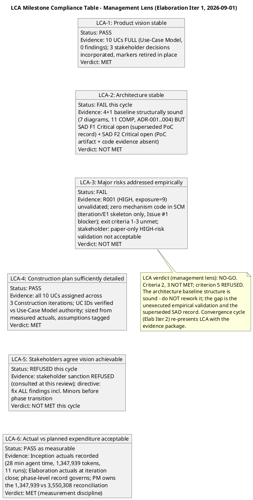

**Risk Retirement Trend (Inception → Elaboration Iter 1 — the management heuristic: high-magnitude risks must show DECREASING trend lines):**

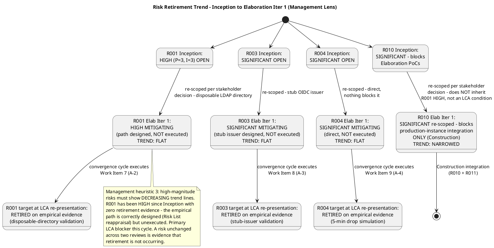

**Project Health Scorecard (four dimensions — a project green on three and red on one is NOT a green project):**

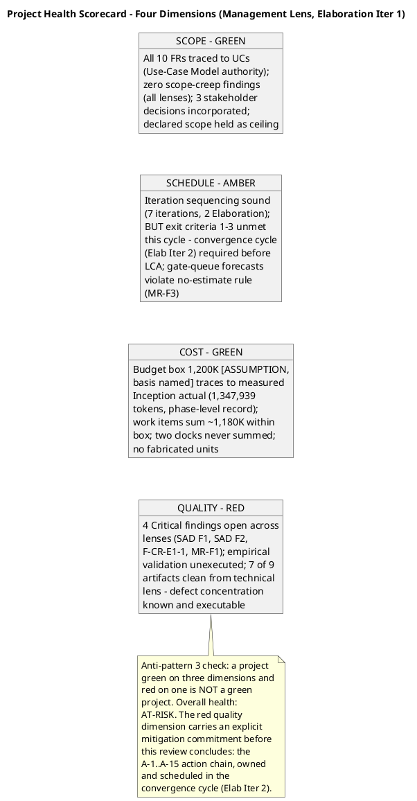

**Prior-findings reconciliation (this lens):** all four prior ManagementReviewer findings (Iteration Plan F1 Major, F2 Minor — Inception) are RESOLVED with successful `resolve_artifact_finding` closures recorded in Inception Iter 2; zero findings carried open into Elaboration Iteration 1 from this lens. The one open finding on the Risk List (untagged >90% criterion) was emitted by the Reviewer lens — per the cross-lens ownership invariant it is not this lens's to resolve.

### Elaboration Iteration 2 — Technical-Lens Re-Review (Reviewer, 2026-09-02 — convergence cycle, calendar events R3/R4)

**Scope and criteria (this lens, this cycle):** ALL 13 artifacts in the inventory, reviewed against the **LCA exit-criteria lens** (convergence-cycle track: R3 corrected-artifact re-reviews + R4 evaluation-criteria verification). Priority order: SAD first (architecture gate), then Design Model, then Use-Case Model, then remaining. Upstream consumption complete before findings: all artifacts read in full; the Work Order's declared scope and the stakeholder's recorded Iter 2 answers (R001 behavioural bar; four-UC confirmation "Yes"; featured banner "newest first") cross-checked; SCM state verified empirically (`scm_list_pull_requests` state=all → zero PRs; `scm_get_file_content` main → no Services/, no Infrastructure/; `scm_get_build_status` main → green run 33598979875; `scm_list_issues` → Issue #1 open, cr:approved, assigned:implementer). Checklists applied per artifact type: SAD → architecture checklist; Design Model → design checklist; UC Model → requirements checklist (Source: FR-NNN guard, cross-cutting guard, per-actor guard); Supp Spec → NFR checklist; Risk List → mitigation/acceptance-criteria checklist; Iteration Plan → plan-integrity checklist; Development Case → IARI baseline conformance + optional-trigger audit; Test Case / TES → test-design checklist; PoC artifact → trigger-condition + validation-protocol checklist. Iteration Assessment excluded per review-point rules (authored by the PM in the Assess touchpoint AFTER this review — its absence is never a finding).

**Prior-findings reconciliation (this lens — executed in the dedicated closure state, tool calls FIRST):** 4 prior findings of this lens with resolution==null were loaded; dispositions: **SAD F1 (Critical) RESOLVED** — §Quality PoC Plan rewritten to the empirical disposition with explicit supersession note; §External Dependencies re-scoped (R010 → production-instance integration only); LCA criterion 3 corrected; all three stale locations named in the finding fixed. **SAD F3 (Minor) RESOLVED** — COMP-001 no longer lists IAUD; COMP-010 resolves via IDIR (INT-008); reconciliation subsection present; SAD and Design Model agree at every subsystem boundary. **Risk List F1 (Minor) RESOLVED** — the >90% figure DROPPED per the stakeholder's Iter 2 answer and replaced by the behavioural bar (three clauses, confirmed for UC-004/005/006/007); production-AD percentage moved to Construction (R010+R011), outside the LCA evidence package. **SAD F2 (Critical) PERSISTS** — left open and re-emitted under its findingKey with fresh SCM evidence (2nd occurrence). [EXIT] closed=3 (Resolved), deferred=0, rejected=0, left-open=1. Total disposed: 4 of 4.

**New findings (this lens, this cycle — all emitted via `record_artifact_finding` before this upsert):**

| Finding Key | Severity | Artifact | Description (summary) | Remediation (summary) |
|---|---|---|---|---|
| **SAD F2** (re-emission, 2nd occurrence) | **Critical** | Software Architecture Document (as architecture baseline) + SCM state | **PERSISTS — record side fixed, code-evidence side unmet.** The Architectural Proof-of-Concept artifact now EXISTS (DC-sanctioned, trigger FIRED, Architect-owned) with a sound validation protocol, per-risk single-mechanism dispositions, the R001 behavioural bar, and an honest PENDING ledger. But as of this review (verified 2026-09-02): zero mechanism code in SCM (src/EmployeePortal/Services/ClockingService.cs and src/EmployeePortal/Infrastructure/LdapGateway.cs both not found on main), ZERO pull requests in ANY state, and SCM Issue #1 (severity:blocker, cr:approved, assigned:implementer) still OPEN. Empirical validation of R001 (HIGH, exposure=9), R003, R004 has NOT been performed; TC-001…TC-023 all BLOCKED. The stakeholder's bar — "I will not accept an LCA that validates a HIGH architectural risk on paper only" — is not yet satisfied. The architecture baseline remains structurally sound; the gap is execution of the mandated validation. | Complete the convergence-cycle delivery chain (A-2…A-6, A-8): Implementer delivers the three mechanisms as evolutionary production code in src/ on feature/E1-{risk} branches with dual-coverage tests, labeled ready-for-review; Code Reviewer issues terminal dispositions per PR (base iteration/E1); Integrator merges APPROVED PRs; Test Designer executes TC-001…TC-023 against the fixtures; empirical results land in the PoC artifact § Results and Findings; Issue #1 closes on merged mechanism-PR evidence. This finding closes only when the empirical results are OBSERVED, not when the delivery is planned. |
| **Development Case F1** | **Major** | Development Case — Tailoring note (Requirements); Stakeholder Decisions Incorporated §(3); Traceability row | **Misrecorded stakeholder decision — cross-artifact contradiction on the featured-banner rendering contract.** The stakeholder was asked: "stack all featured banners (newest first), or show only the newest featured item?" and answered "newest first". The Design Model (authoritative UI artifact) retired its P-02 PENDING marker with the faithful reading: stack ALL featured banners, ordered newest first — every featured item renders its own banner, no featured flag silently dropped. The DC instead glosses the same answer as "newest first (single banner, newest featured item)" — in three places — describing the OTHER option the stakeholder did not select. "Newest first" is an ordering statement; ordering presupposes plurality. The two artifacts contradict on a stakeholder-decided contract that authorizes UC-003 step 4 and UC-008 step 3, and the DC is the governance document every role reads for decision records. | Process Engineer corrects the three DC locations to the Design Model's recorded contract, citing the verbatim answer: featured banners STACK, ordered newest first (every featured item renders its own banner; ordering by the same date criterion as the FR-007 list; renders above the list on SCR-03 and above the history preview on SCR-01). Remove the "(single banner, newest featured item)" gloss everywhere it appears. If genuinely ambiguous, escalate via REQUIRES_USER_INPUT rather than recording either gloss. |
| **Iteration Plan F3** (Reviewer, Iter 2) | **Minor** | Iteration Plan — Work Item 8; Objective 2; critical-chain diagram | **Stale test-case enumeration vs the Test Case authority.** The plan names the 20-case set ("Execute TC-001…TC-020", "all 20 currently BLOCKED", "TC-001…TC-020 executed") while the Test Case artifact (TC-ID authority) was extended this same iteration to 23 cases: TC-021/022/023 are the UC-005/006/007 AF-3 behavioural-bar validation cases, and its Cycle 2 record reports 23/23 BLOCKED. The plan's own exit criterion 1 requires the behavioural bar validated across ALL FOUR AD-reading use cases — evidence only TC-021/022/023 provide — yet the enumerated execution scope omits them. Same defect class as the LCO F1 UC-ID mismatch. | Update the three stale enumerations to the 23-case set (Work Item 8, Objective 2, critical-chain Test Designer step). Cross-check against the Test Case §Test Case Catalog (authority) before upsert — the LCO F1 lesson applies to TC IDs exactly as it did to UC IDs. |
| **Test Evaluation Summary F1** | **Minor** | Test Evaluation Summary — mission scope; master workflow; schedule Sequence 2; resources table; INC-1; conclusions; recommendation 1; defect-status row | **Stale test-case enumeration vs the Test Case authority (same class as Iteration Plan F3).** The TES enumerates the 20-case set in eight locations and its mission-scope boundary row states "dedicated per-UC test cases for UC-005/006/007 land in Construction functional suites" — stale against the Test Case artifact, which designed TC-021/022/023 THIS iteration at Integration level as part of the R001 PoC's four-consumer validation. The TES's own acceptance-thresholds table correctly requires the bar "observed across all four AD-reading UCs" — the substance is right; the enumerations and the one scope row are stale. | Update the stale enumerations to the 23-case set and correct the mission-scope boundary row: TC-021/022/023 are DESIGNED and executed THIS convergence cycle as part of the R001 PoC; what lands in Construction is the full functional main-flow suites for UC-005/006/007, not the AF-3 bar cases. |
| **Development Case F2** | **Minor** | Development Case — discipline workflow diagram; Test tailoring note; CORE artifacts table; role matrix (TestDesigner, Tester) | **Stale test-case enumeration vs the Test Case authority (same class).** The DC enumerates the 20-case set in five locations while the Test Case authority carries 23. The DC's own exit criterion 3 requires the behavioural bar confirmed for UC-004..UC-007 — evidence only TC-021/022/023 provide. | Update the five DC locations to the 23-case set (TC-001..TC-023), cross-checked against the Test Case §Test Case Catalog (authority) — the same ID-verification discipline the DC itself mandates for UC IDs. |
| **Architectural Proof-of-Concept F1** | **Minor** | Architectural Proof-of-Concept — § Results and Findings ledger row; § Approach delivery protocol | **Stale test-case enumeration vs the Test Case authority (same class) — in the LCA evidence package's core artifact.** The PoC artifact enumerates the 20-case set in two locations: the Results ledger row ("TC-001…TC-020 execution | PENDING — All 20 test cases BLOCKED") and the delivery protocol ("The Test Designer executes TC-001…TC-020"). The Test Case authority carries 23 cases; the PoC's own acceptance criteria require the R001 behavioural bar proven across ALL FOUR AD-reading consumers — evidence only TC-021/022/023 provide — so the execution protocol as written under-scopes the validation whose results this artifact must carry to the LCA gate. (The artifact predates the Test Case extension by one day — its Cycle 1 citation was accurate when written — but the protocol governs the execution that is still pending, so it must reflect the current authority before the results land.) | Software Architect updates the two locations when the PoC artifact is evolved for the empirical results (the A-8/A-16 evolution already mandates rewriting exactly this table): Results ledger row → "TC-001…TC-023 execution | PENDING — All 23 test cases BLOCKED (Test Case Cycle 2 record; SCM Issue #1)"; delivery protocol → "The Test Designer executes TC-001…TC-023 against the validation fixtures". The R001 results row must then record clause-by-clause evidence for all four consumers (TC-011 + TC-021/022/023), not the directory search alone. |

**Compliance Matrix — Technical LCA Lens, Iteration 2 (11 artifacts × checklist dimensions):**

```plantuml
@startuml
title Elaboration Iter 2 - Technical LCA Review Compliance Matrix\n11 artifacts x checklist dimensions (Reviewer lens, 2026-09-02)

object "Software Architecture Document" as SAD {
  4+1 views complete : PASS (7 diagrams)
  NFR-to-tactic mapping : PASS
  PoC plan matches stakeholder decision : PASS - F1 RESOLVED
  Dependencies vs Design Model : PASS - F3 RESOLVED
  Code evidence for empirical validation : FAIL - F2 persists (2nd occurrence)
}
object "Design Model" as DM {
  UC realizations 10 of 10 : PASS (SEQ-001..010 + AF-3)
  Full signatures : PASS (CLS-001..027)
  Interface contracts : PASS (INT-006..019 + bar)
  Behavioural bar realized : PASS (D-9, four consumers)
  Featured-banner marker retired : PASS (verbatim answer)
  Findings : NONE - clean
}
object "Use-Case Model" as UCM {
  Source FR-NNN 10 of 10 : PASS
  No cross-cutting UCs : PASS
  AF-3 flows stakeholder-confirmed : PASS
  Activity diagrams 10 of 10 : PASS
  Findings : NONE - clean
}
object "Supplementary Specification" as SUP {
  FURPS+ quantified, testable : PASS
  Behavioural bar one contract : PASS
  90 percent figure absent : PASS (verified)
  Findings : NONE - clean
}
object "Risk List" as RISK {
  Behavioural bar replaces figure : PASS - F1 RESOLVED
  Trend column present : PASS (A-14)
  R012 gate-queue bound : PASS (A-15)
  Findings : NONE - clean
}
object "Iteration Plan" as PLAN {
  UC IDs vs authority : PASS
  Statuses SCM-evidence-based : PASS
  All-findings criterion : PASS (exit criterion 11)
  TC enumeration vs authority : FAIL - F3 NEW (Minor)
}
object "Development Case" as DC {
  IARI baseline conformance : PASS
  PoC trigger FIRED holds : PASS (audited)
  Featured-banner decision record : FAIL - F1 NEW (Major)
  TC enumeration : FAIL - F2 NEW (Minor)
}
object "Test Case" as TC {
  23 cases adversarial design : PASS
  TC-011 behavioural bar : PASS
  TC-021..023 four consumers : PASS
  Honest BLOCKED verdicts : PASS
  Findings : NONE - clean
}
object "Test Evaluation Summary" as TES {
  Thresholds upstream-sourced : PASS
  Honest NOT YET ACHIEVED : PASS
  TC enumeration vs authority : FAIL - F1 NEW (Minor)
}
object "Architectural Proof-of-Concept" as POC {
  Trigger condition holds : PASS
  Vehicles match decision : PASS
  Behavioural bar acceptance : PASS
  Honest PENDING ledger : PASS
  TC enumeration vs authority : FAIL - F1 NEW (Minor)
  Empirical results : PENDING - blocked by SAD F2
}
object "Vision (Inception, carried)" as VIS {
  Approved at LCO, 0 findings : PRESERVED
  No finding or CR targets it : PRESERVED
}
SAD -[hidden]-> DM
DM -[hidden]-> UCM
UCM -[hidden]-> SUP
SUP -[hidden]-> RISK
RISK -[hidden]-> PLAN
PLAN -[hidden]-> DC
DC -[hidden]-> TC
TC -[hidden]-> TES
TES -[hidden]-> POC
POC -[hidden]-> VIS
@enduml
```

**Defect Distribution — Iteration 2 (severity × artifact, this lens):**

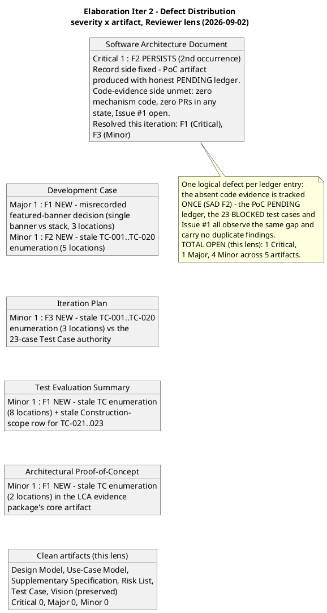

**Cross-lens observation (recorded for the Coordinator):** the Management Reviewer lens's four Iter 1 findings (Iteration Plan F3/F4/F5, Risk List F1) have their remediation evidence VERIFIED PRESENT this review (exit criterion 11 added; queue forecasts removed; trend column added; R012 added) — but per the cross-lens ownership invariant, only the Management Reviewer lens may close them; this lens records the verification, it does not emit the closure. The Code Reviewer's F-CR-E1-2 (CONTRIBUTING.md) likewise has remediation VERIFIED PRESENT (committed, sha `6662813…`, per the Development Case tool-verification 2026-09-02) — closure owned by that lens. F-CR-E1-1 remains OPEN and converges with SAD F2 on the same underlying gap.

### Business Modeling Lens — Scope and Criteria (Business Reviewer, Iteration 2 — convergence cycle, 2026-09-02)

**Scope:** the DC §4 business-process-led classification re-verified at the LCA convergence-cycle review, and the Elaboration Iteration 2 artifact set re-checked for BM content. The correct evaluative lens at a lifecycle milestone is EXIT CRITERIA: is the Business Modeling discipline correctly INACTIVE, and did the phase produce exactly the BM deliverables the classification requires (zero, for a non-BPL project)?

**Evidence gathered this iteration (all read in full before the verdict):** DC §4 classification (ProcessEngineer re-check 2026-09-02 — `isBusinessProcessLed = false`, Inception verdict unchanged, no CR re-opened the classification); Vision (Inception, Approved — BPL signal re-assessed); Use-Case Model (Elaboration Iter 2 — BM section inventory: zero BUCs, business workers, business entities, realizations; 10 system UCs trace 1:1 to FR-001…FR-010); Glossary (absent from the inventory — DC §5.2 specialist-vocabulary trigger NOT FIRED, no business-terms obligation); findings ledger (read_artifact_findings executed for Vision, Use-Case Model, Supplementary Specification, Review Record — all four return empty arrays; zero prior BusinessReviewer findings).

**Scenario assessment (reviewer heuristic 1) — sustained:** software-feature-led automation of existing, well-understood manual workflows. The stakeholder's three Iteration 2 answers (R001 behavioural bar; four-UC confirmation "Yes"; featured banner "newest first") were cross-checked — all are system-requirements decisions refining declared FRs; none introduces a business-process signal.

**Gate re-evaluation (what was checked, with evidence):**

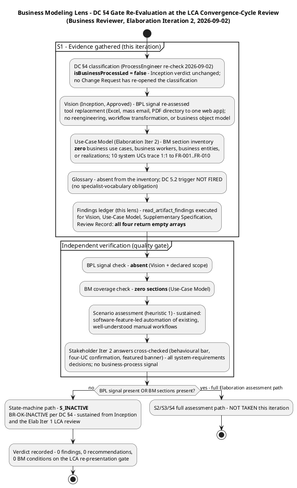

**Checklist compliance (classification criteria PASS with verification basis; BM-specific criteria N/A by classification):**

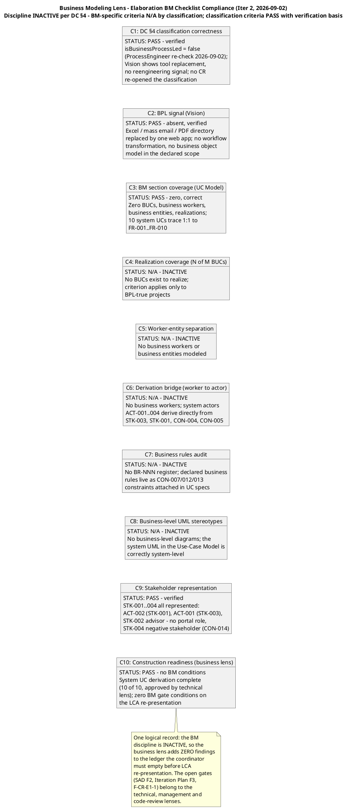

**Prior-findings reconciliation (this lens, Iter 2):** [PLAN] artifacts × prior BR findings with resolution==null: Vision: [], Use-Case Model: [], Supplementary Specification: [], Review Record: []. TOTAL: 0. [EXIT] closed=0, deferred=0, rejected=0, left-open=0. Total: 0 of 0. The findings ledger holds zero findings emitted by the BusinessReviewer role across the entire project — nothing to close; no `resolve_artifact_finding` calls owed.

### Elaboration Iteration 2 — Management-Lens Re-Review (Management Reviewer — PRA, 2026-09-02 — convergence cycle, calendar events R3/R4)

**Scope and criteria (this lens, this cycle):** the two-part PRA review re-executed on the convergence track. Part 1 — **Project Planning Review** (feasibility and acceptability of the Iteration 2 Iteration Plan, evaluated against the MEASURED actuals in the Work Order and the Iteration Assessment's binding adjustments). Part 2 — **LCA exit criteria** (the six RUP lifecycle-architecture criteria, pass/fail per criterion with evidence). Artifacts inspected in full before any conclusion: Software Architecture Document (architecture baseline — SAD F1/F3 corrections verified present), Iteration Plan (Iter 2 convergence plan), Risk List (Iter 2 reappraisal — behavioural bar, trend column, R012), Iteration Assessment (Elab Iter 1 close-out — the measured actuals and binding adjustments this review evaluates the plan against; the Elab Iter 2 assessment is authored by the PM in the Assess touchpoint AFTER this review, so its absence is expected and is never a finding), Review Record (cumulative — all lenses, both iterations), and the Work Order's Measured Actuals (Inception phase-level record: 28 min agent time, 1,347,939 tokens, 11 runs, 10 artifacts). SCM state is taken from the technical lens's same-day empirical verification (2026-09-02: zero PRs in any state, no mechanism code on main, Issue #1 open, main GREEN run 33598979875) — recorded here per the cross-lens verification note; this lens does not re-probe SCM independently.

**Prior-findings reconciliation (this lens — executed in the dedicated closure state, tool calls FIRST):** [PLAN] artifacts × prior MR findings with resolution==null: Iteration Plan: [4 (F3, Critical), 5 (F4, Major), 6 (F5, Minor)], Risk List: [1 (F1, Minor)]. TOTAL: 4. Dispositions: **Iteration Plan F4 (Major) RESOLVED** — exit criterion 11 mandates an EMPTY findings ledger across all lenses and severities, verified via the findings system at iteration close; Iteration Objectives §1 carries the stakeholder directive verbatim. **Iteration Plan F5 (Minor) RESOLVED** — queue forecasts removed; milestone table carries only the measured Inception 0s actual + "Estimate NONE" bounded in R012. **Risk List F1 (Minor) RESOLVED** — trend column on all 12 register rows with evidence pointers; R012 bounds the gate queue with the 14-day suspension ceiling. **Iteration Plan F3 (Critical) PERSISTS** — record side fixed (exit criteria 1–3 demand code evidence; statuses SCM-evidence-based; criterion 12 added), code-evidence side unmet (zero PRs, Issue #1 open, TC-001…TC-023 BLOCKED) — left open and re-emitted under its findingKey (2nd occurrence). [PROGRESS] anchors emitted per finding before each resolve. [EXIT] closed=3 (Resolved), deferred=0, rejected=0, left-open=1. Total disposed: 4 of 4. This satisfies the R3 calendar exit condition for this lens (Iteration Plan F4, F5 and Risk List F1 closed in the ledger); F3 closes at R4/R6 on OBSERVED evidence.

**Part 1 — Project Planning Review (feasibility and acceptability, Iter 2 plan):**

| Dimension | Assessment | Evidence |
|---|---|---|
| Units discipline | **PASS** | No person-weeks/story points; two clocks never summed (Two Clocks section, milestone table, sizing note); gantt bars disclaimed as structural sequencing units, unanchored |
| UC-ID authority (LCO F1 lesson) | **PASS** | All 10 FR→UC rows verified against Use-Case Model authority; re-verified clean at the Iter 1 technical review (LCA-4 PASS) |
| Human gate queue handling (F5 remediation) | **PASS — verified and ledger-closed** | Milestone table: measured Inception 0s actual + "Estimate NONE" for Elaboration/Construction/Transition; R012 bounds the queue (14-day suspension ceiling); no queue figure anywhere in the plan |
| All-findings closure (F4 remediation) | **PASS — verified and ledger-closed** | Exit criterion 11: findings ledger EMPTY across all lenses and severities, verified via the findings system, not narrative claims |
| Status honesty (F3 record side) | **PASS with two stale exceptions** | Work Items 3–5 honestly cite "no CI evidence as of 2026-09-02"; BUT WI 2 (CONTRIBUTING.md — committed, sha `6662813…`) and WI 9 (SAD corrections — F1/F3 ledger-closed 2026-09-02) understate verified delivery → Iteration Plan F7 (Minor) |
| Budget box traces to measured actuals | **FAIL — Major** | The Iter 2 box retains 1,200K [ASSUMPTION — scaled from the Inception phase-level record] against the Iteration Assessment's FIRST binding adjustment: "Re-size the Iter 2 budget box from the measured 12,523,281 actual — the 1,200K assumption is disproven." The plan re-derives the disproven figure one step further from fact; work items sum ~840K against a box the measured shape says is ~10× too small → Iteration Plan F6 (Major) |
| Architecture stability | **Record side fixed; code side unmet** | SAD §Quality carries the empirical disposition with explicit supersession note; §Logical View reconciled with the Design Model (SAD F1/F3 RESOLVED, ledger-closed 2026-09-02); PoC artifact exists with honest PENDING ledger — but zero mechanism code, zero PRs, Issue #1 open (SAD F2 persists, Reviewer lens) |
| Risk retirement trend | **IMPROVING — first genuine movement, NOT retired** | R001/R003/R004: behavioural bar defined (stakeholder Iter 2), mechanism build executing, trend column present — but zero code evidence; IMPROVING is not RETIRED (see trend diagram below) |
| Stakeholder acceptability | **Standing record — REFUSED; fresh request at R6** | The sanction question is verbatim in the stakeholder's answered list ("No" + all-findings directive); the convergence path was confirmed via the discharged escalation ("Fix all the issues and close all findings"); the fresh sanction request fires at R6 gated on the evidence package — requesting it mid-cycle would contradict the stakeholder's own bar. No new consultation owed this cycle; no un-asked consequential question exists |

**Part 2 — LCA Milestone Compliance Table (criterion / status / evidence / verdict, Iter 2):**

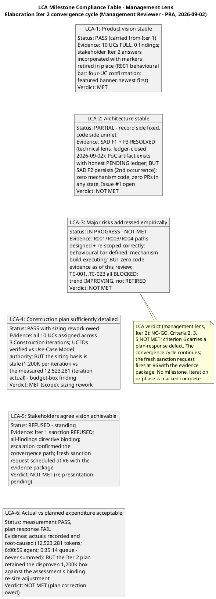

**Risk Retirement Trend (Inception → Elaboration Iter 2 — the management heuristic: high-magnitude risks must show DECREASING trend lines; IMPROVING is not RETIRED):**

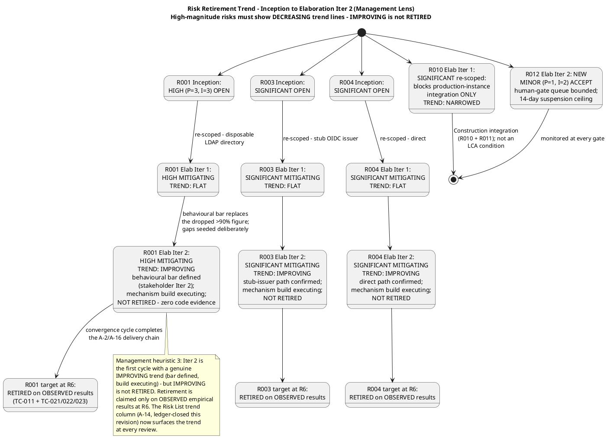

**Project Health Scorecard (four dimensions — a project green on some dimensions and red on another is NOT a green project):**

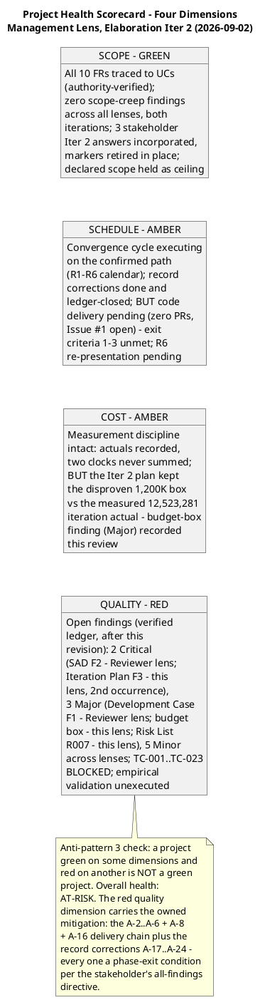
## Findings
### Elaboration Iteration 1 — New Findings (Code-Review Lens)

| Finding Key | Severity | Location | Description | Remediation |
|---|---|---|---|---|
| **F-CR-E1-1** | **Critical** | SCM state vs. Iteration Plan WIs 7–9; exit criteria 1–3 | **No Implementer handoff exists.** Zero `ready-for-review` branches, zero PRs in any state, and the build tree at `main` contains no mechanism code (no `Services/`, no `Infrastructure/`, no PoC scaffolding — only the pre-Elaboration skeleton). `iteration/E1`, the mandatory PR base (BRANCHING_STRATEGY §5.2), does not exist. Consequence: the iteration's exit criteria 1–3 (empirical validation of R001/R003/R004) have **no code evidence**, and the LCA evidence package cannot be assembled — the stakeholder explicitly refused an LCA that validates a HIGH architectural risk on paper only. The code-review gate for this iteration is OPEN. | (1) Integrator creates `iteration/E1` (invariant 8.1 — only the Integrator writes `iteration/*`). (2) Implementer builds the three mechanisms **evolutionarily in `src/`** (never a `poc/` branch or `samples/` directory — invariant 8.4): R001 → COMP-007/CLS-009 against a disposable LDAP directory; R003 → COMP-006/CLS-010 against a stub OIDC issuer; R004 → COMP-009/CLS-008 offline queue + idempotent sync. (3) Each mechanism ships dual-coverage unit tests (black-box contract + white-box paths). (4) Implementer labels each `feature/E1-{risk-id}` branch `ready-for-review`. (5) Code Reviewer opens one PR per branch (base `iteration/E1`) and applies CR-1…CR-7 with terminal dispositions. |
| **F-CR-E1-2** | **Minor** | Repository root — `CONTRIBUTING.md` (also flagged in Development Case § Tool Configuration References) | **Programming-guidelines baseline absent.** `CONTRIBUTING.md` does not exist in the repository, so checklist item CR-1 has no citable rule baseline for the first mechanism PR. Without it, guideline findings cannot cite a rule (a violation without a rule citation is personal taste, not a finding). The Development Case already records this as a gap owned by Implementer / Software Architect / ConfigurationManager. | Commit `CONTRIBUTING.md` before or together with the first mechanism PR: coding standards (naming, error handling, async conventions, test conventions) plus the branch-strategy documentation section. Until it exists, CR-1 findings in the first PR will be limited to rules citable from the SAD layering rule (dependencies point down, interfaces only) and the Design Model contracts. |

### Defect Distribution (severity × scope — Code-Review Lens)

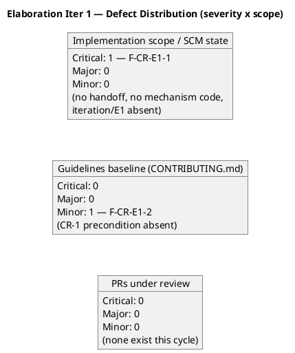

### Elaboration Iteration 1 — New Findings (Technical LCA Lens — Reviewer)

All four findings emitted via `record_artifact_finding` (2026-09-01); each carries severity, location, description, and remediation. Two Critical findings block the LCA disposition this cycle.

| Finding Key | Severity | Artifact | Description (summary) | Remediation (summary) |
|---|---|---|---|---|
| **SAD F1** | **Critical** | Software Architecture Document — §Quality PoC Plan; §Deployment View External Dependencies; §LCA Review criterion 3 | **Superseded analysis-only PoC disposition persists in the SAD.** The PoC Plan states the Development Case oracle reports the Architectural Proof-of-Concept trigger NOT fired and retires R001/R003/R004 as "Analysis-only + designed mechanism" with empirical validation deferred to Construction "blocked on R010". This contradicts the binding stakeholder decision ("The PoC is produced in Elaboration and validated empirically" — R001 disposable LDAP directory, R003 stub OIDC issuer, R004 direct), the corrected Development Case (trigger FIRED), the Risk List reappraisal (R001/R003/R004 "MITIGATING — empirical validation this phase"; R010 re-scoped to production-instance integration only), and Iteration Plan exit criteria 1–4. Three stale locations: §Quality PoC Plan table + rationale; §External Dependencies ("blocks R001 validation", "blocks auth integration"); §LCA Review criterion 3 ("PARTIAL — by design... did not fire the... trigger... blocked on R010"). | Software Architect re-corrects the SAD (Active Constraint: "SAD PoC Plan superseded — Architect owns correction"): rewrite §Quality per-risk retirement to EMPIRICAL validation this phase citing the stakeholder decision; update §External Dependencies so R010 blocks production-instance integration only (Construction, R011 residual); correct LCA criterion 3; name the Architectural Proof-of-Concept artifact (DC-sanctioned, Architect-owned) as the validation vehicle. |
| **SAD F2** | **Critical** | Software Architecture Document (as architecture baseline) + artifact inventory + SCM state | **The DC-sanctioned Architectural Proof-of-Concept artifact is absent, and zero mechanism code exists in SCM.** The Test Case Cycle 1 execution record empirically confirms `iteration/E1` holds skeleton only (no Services/, no Infrastructure/, no Npgsql/LDAP/JWT packages; file shas 5a1f720/9a04a31/10f68b8/dc835d2), all 20 test cases are BLOCKED, and SCM Issue #1 (severity:blocker) formalizes the absence. Empirical validation of R001 (HIGH, exposure=9), R003, R004 has NOT been performed; Iteration Plan exit criteria 1–3 are unmet. The stakeholder's binding decision: "I will not accept an LCA that validates a HIGH architectural risk on paper only." The LCA evidence package cannot be assembled this cycle. | Convergence cycle (Elaboration Iteration 2, already planned): (1) Software Architect produces the Architectural Proof-of-Concept artifact carrying empirical results for R001/R003/R004; (2) Implementer delivers the three mechanisms as evolutionary code in src/ with dual-coverage tests (Issue #1 remediation; actions A-2…A-4) on feature/E1-{risk} branches → PRs to iteration/E1; (3) Test Designer executes TC-001…TC-020 against the validation fixtures; (4) empirical results recorded and the LCA evidence package assembled. The architecture baseline itself (4+1 views, 11 components, ADR-001…004) is structurally sound — the gap is execution of the mandated validation, not the design. |
| **SAD F3** | **Minor** | Software Architecture Document — §Logical View component table | **Stale component dependencies vs the Design Model's documented reconciliations.** COMP-001 lists IAUD but CLS-001 deliberately omits IAuditService (NFR-005 scopes audit to news operations AUD-001…003 and category changes AUD-004; clocking events carry their own actor and are immutable per DAT-001); COMP-010 lists ILDAP but CLS-006 resolves display data transitively via IDirectoryService (INT-008). The Design Model documents both as "SAD Boundary Reconciliations — coupling reductions, not violations" with sound justification, but the SAD — the architecture authority — still carries the pre-reconciliation dependency lists, so the two artifacts contradict at the same subsystem boundary. | With the §Quality correction (SAD F1), update the SAD §Logical View dependency column for COMP-001 (remove IAUD) and COMP-010 (replace ILDAP with IDirectoryService via COMP-003), or add the Design Model's reconciliation notes verbatim so the SAD and Design Model agree at every subsystem boundary. |
| **Risk List F1** | **Minor** | Risk List — R001 acceptance criteria | **Untagged quantitative threshold.** R001's "All six corporate attributes populated for >90% of sampled users per office" has no declared source (the declared R001 names no percentage; the stakeholder's PoC decision names none) and carries no `[ASSUMPTION — requires validation]` tag, while every sibling quantified threshold in the artifact set is tagged (UC-001 AF-3 2 s window, REL-002 queue capacity ≥ 10, REL-003 sync ≤ 60 s, PRF-003 5 s query split). The same untagged figure propagates into the SAD PoC Plan, the Test Evaluation Summary acceptance thresholds, and Test Case TC-011 (whose disposable-directory fixture is constructed at 95%/95%/100% — passing the criterion by construction). | Tag the >90% criterion `[ASSUMPTION — requires validation]` with its basis (a mechanism-validation bar set by the risk owner against the disposable directory's representative data — the production-AD residual is R011, retired in Construction), or escalate the threshold to the stakeholder for confirmation as the R001 validation bar. Apply the tag consistently in the SAD PoC Plan, Test Evaluation Summary, and Test Case when those artifacts are next evolved. |

### Defect Distribution (severity × artifact — both lenses, consolidated)

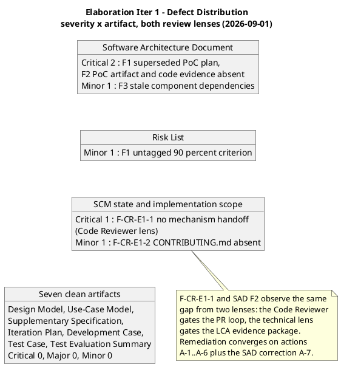

### Elaboration Iteration 1 — New Findings (Management LCA Lens — Management Reviewer, PRA)

All four findings emitted via `record_artifact_finding` (2026-09-01). The Critical finding records the stakeholder's REFUSED sanction; the Major finding records the stakeholder's binding all-findings directive as a phase-exit condition.

| Finding Key | Severity | Artifact | Description (summary) | Remediation (summary) |
|---|---|---|---|---|
| **Iteration Plan F3** | **Critical** | Iteration Plan — Layer 2 exit criteria 1–3; Work Items 7–9 | **LCA exit criteria 1–3 (empirical validation of R001/R003/R004) have no code evidence, and Work Items 7–9 show "In progress" with zero SCM evidence** (no Services/, no Infrastructure/, no Npgsql/LDAP/JWT packages; iteration/E1 skeleton only; SCM Issue #1 blocker). The stakeholder's binding decision makes empirical risk retirement the phase's central objective — it is unmet, and the LCA gate cannot close this cycle. The stakeholder, consulted at this review, REFUSED sanction to advance past LCA. | Execute the convergence cycle (Elaboration Iteration 2, already planned as BUILDING) per actions A-1…A-6: Implementer delivers the three mechanisms as evolutionary code in src/ with dual-coverage tests on feature/E1-{risk} branches labeled ready-for-review; Code Reviewer issues terminal dispositions per PR (base iteration/E1); Test Designer executes TC-001…TC-020; empirical results feed the Architectural Proof-of-Concept artifact (A-8). Reconcile Work Item 7–9 statuses to SCM evidence at iteration close. LCA is then re-presented with the evidence package and a fresh sanction request. |
| **Iteration Plan F4** | **Major** | Iteration Plan — Layer 2 exit criteria table; Elab Iter 2 preview | **The plan's exit criteria do not make closure of ALL open review findings a phase-exit condition.** The Layer 2 table (criteria 1–8) verifies PoC validation, artifact corrections, schedule baselining, and AC accounting, but carries no criterion that every open finding from every review lens is resolved before phase transition. The stakeholder, refusing sanction at this review, directed verbatim: "Please fix all the findings even if they are minors prior to move to next phase." As written, the plan permits a phase close with Minor findings open (e.g., SAD F3, Risk List F1, F-CR-E1-2) — contrary to the stakeholder's binding directive. | Add an explicit exit criterion to the Layer 2 table and the Elaboration Iter 2 preview's primary objective: zero open findings across ALL review lenses and ALL severities (Critical, Major, Minor) before phase transition is sanctioned. Verify via the findings ledger (read_artifact_findings per artifact) at each iteration close; the milestone verdict must confirm the ledger is empty, not merely that Criticals are closed. |
| **Iteration Plan F5** | **Minor** | Iteration Plan — Plan and Milestones table (human gate queue forecasts) | **The plan forecasts human gate queue times** ([ASSUMPTION — up to 2 days LCA; up to 3 days IOC; up to 2 days PR; up to 5 days STK-004 response]). The planning rule for human gates: a human gate is a RISK, not an estimate — ceiling 14 days (then the process suspends, nothing is auto-filled), actual measured and reported apart, estimate NONE; bound it in the Risk List, never forecast it in the plan. The Inception gate measured 0s; no comparable actual exists for LCA/IOC/PR, so no queue figure should appear in the plan. | Remove the queue-time forecasts from the milestone table (retain the measured Inception 0s as a recorded actual); bound the human-gate queue risk in the Risk List instead (companion finding on the Risk List) with the 14-day suspension ceiling; report measured actuals only, at each Iteration Assessment. |
| **Risk List F1** | **Minor** | Risk List — Risk Register (trend direction); human-gate queue risk | **Two risk-monitoring gaps.** (1) No per-risk trend direction: the Risk Register carries status (OPEN/MITIGATING/RETIRED) but no trend field (better/worse/stable since last review), so a static risk list cannot be challenged at review — R001 has been HIGH since Inception with zero retirement evidence, and the register does not surface that flatness. (2) The human-gate queue risk is unbounded: the LCA/IOC/PR review gates are human gates (a risk, not an estimate — ceiling 14 days, then the process suspends), but no Risk List entry bounds them; the queue figures instead appear as forecasts inside the Iteration Plan milestone table (companion finding on the Iteration Plan). | (1) Add a trend column to the Risk Register (direction since last review + evidence pointer), updated at each iteration reappraisal — a risk whose magnitude is unchanged across two reviews must show why. (2) Add a Risk List entry bounding the human-gate queue risk (strategy Accept; mitigation: in-round stakeholder answering as measured at LCO and at this review's consultation; contingency: process suspends at 14 days per the planning rule — nothing is auto-filled). |

### Defect Distribution (severity × artifact — all lenses, consolidated)

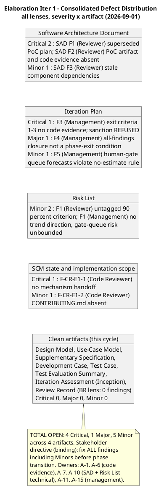

### Prior Findings (Inception — historical ledger, all RESOLVED; never overwritten)

| Finding Key | Lens | Artifact | Severity | Finding (summary) | Status |
|---|---|---|---|---|---|
| F1 (Reviewer) | Technical | Iteration Plan | Major | UC ID numbering mismatch: Iteration Plan mapped FR-001→UC-001 sequentially; Use-Case Model (authority) maps FR-001→UC-005, FR-004→UC-001, FR-010→UC-004. | **RESOLVED** (Inception Iter 2) |
| F1 (ManagementReviewer) | Management | Iteration Plan | Major | Same defect as F1 (Reviewer); stakeholder refused sanction. | **RESOLVED** (Inception Iter 2) |
| F2 (Reviewer) | Technical | Iteration Plan | Minor | Work item statuses stale ("Pending" while artifacts existed as Draft). | **RESOLVED** (Inception Iter 2) |
| F2 (ManagementReviewer) | Management | Iteration Plan | Minor | Same defect as F2 (Reviewer). | **RESOLVED** (Inception Iter 2) |

**Reconciliation status:** zero findings carried open into Elaboration Iteration 1. The two Code-Reviewer findings (F-CR-E1-1, F-CR-E1-2), the four technical-lens findings (SAD F1/F2/F3, Risk List F1), and the four management-lens findings (Iteration Plan F3/F4/F5, Risk List F1) are NEW defects, not recurrences — they carry fresh keys. SAD F2, F-CR-E1-1, and Iteration Plan F3 observe the same underlying gap (no mechanism code / no empirical validation) from three different lenses and three different gates; their remediation converges on the same action chain (A-1…A-6 + A-7/A-8) and they are expected to close together in the convergence cycle.

### Business Modeling Lens — Findings (Business Reviewer, this cycle)

**NONE — zero findings, zero recommendations.** The Business Modeling discipline is INACTIVE per DC §4 (`isBusinessProcessLed = false`, ProcessEngineer re-check 2026-09-01, independently verified by this lens against the Vision and the Use-Case Model). No BM artifact exists to receive a finding, and none was required this phase. No `record_artifact_finding` was emitted from this lens. See § Review Scope and Criteria (business-lens gate evaluation) and § Disposition (BR-OK-INACTIVE verdict).

### Consolidated Finding Tracker (Review Coordinator — verified ledger, 2026-09-01)

**Ledger-vs-narrative reconciliation (conflict resolution):** the lens narratives report 4 Critical / 1 Major / 5 Minor; the verified findings ledger (read_artifact_findings executed for all 12 artifacts) carries **3 Critical / 1 Major / 4 Minor**. The two Code Reviewer findings (F-CR-E1-1 Critical, F-CR-E1-2 Minor) are recorded in this Review Record's narrative but are not ledger-scoped — they target SCM state and the repository root, which are not reviewable artifacts in the findings system. **Resolution:** the tracker below carries ALL TEN findings; the milestone verdict anchors to the verified ledger (3 Critical) and treats the narrative Critical F-CR-E1-1 as the SAME underlying gap as SAD F2 and Iteration Plan F3 — three gates (code-review gate, technical LCA lens, management LCA lens) observing one defect: the absent mechanism code / unexecuted empirical validation. No cross-lens severity conflicts exist. The stakeholder's all-findings directive supersedes severity-based phase-exit prioritization: ALL ten findings close before phase transition.

| # | Finding Key | Lens | Severity | Artifact / Location | Owner (Action) | Priority | Deadline | Ledger Status |
|---|---|---|---|---|---|---|---|---|
| 1 | SAD F1 | Reviewer | **Critical** | SAD §Quality PoC Plan; §External Dependencies; §LCA criterion 3 | Software Architect (A-7) | P2 | Elab Iter 2 — before LCA re-presentation | OPEN |
| 2 | SAD F2 | Reviewer | **Critical** | SAD baseline + artifact inventory + SCM state | Software Architect (A-8) + Implementer (A-2…A-4) | P1 | Elab Iter 2 — before LCA re-presentation | OPEN |
| 3 | Iteration Plan F3 | Management Reviewer | **Critical** | Iteration Plan exit criteria 1–3; WIs 7–9 | Project Manager (A-11) + Implementer + Code Reviewer + Test Designer | P1 | Elab Iter 2 — before LCA re-presentation | OPEN |
| 4 | Iteration Plan F4 | Management Reviewer | **Major** | Iteration Plan Layer 2 exit criteria table; Elab Iter 2 preview | Project Manager (A-12) | P3 | Elab Iter 2 — before LCA re-presentation | OPEN |
| 5 | SAD F3 | Reviewer | Minor | SAD §Logical View component table | Software Architect (A-9) | P2 | Elab Iter 2 close | OPEN |
| 6 | Risk List F1 (Reviewer) | Reviewer | Minor | Risk List R001 acceptance criteria | Project Manager (A-10) | P3 | Elab Iter 2 close | OPEN |
| 7 | Risk List F1 (Management) | Management Reviewer | Minor | Risk List Risk Register; human-gate queue risk | Project Manager (A-14, A-15) | P3 | Elab Iter 2 close | OPEN |
| 8 | Iteration Plan F5 | Management Reviewer | Minor | Iteration Plan milestone table (queue forecasts) | Project Manager (A-13) | P3 | Elab Iter 2 close | OPEN |
| 9 | F-CR-E1-1 | Code Reviewer (narrative) | **Critical** | SCM state vs Iteration Plan WIs 7–9; exit criteria 1–3 | Integrator (A-1) + Implementer (A-2…A-4) + Code Reviewer (A-6) | P0/P1 | Elab Iter 2 — before LCA re-presentation | OPEN (narrative-tracked; converges with #2, #3) |
| 10 | F-CR-E1-2 | Code Reviewer (narrative) | Minor | Repository root — CONTRIBUTING.md | Implementer / Software Architect / ConfigurationManager (A-5) | P0 | Before the first mechanism PR | OPEN (narrative-tracked) |

**Deadlines are iteration-relative** (Elaboration Iteration 2 boundaries), never projected calendar dates — the convergence cycle closes when its exit criteria pass or its budget box is spent. **Overdue findings: 0 of 10** (all raised 2026-09-01; no deadline missed; no escalation notices owed). **Escalation status:** the Critical-finding escalation to the stakeholder is **DISCHARGED — stakeholder resolution received (2026-09-01)**: the re-emitted escalation question (the first emission was unparseable and never delivered; the interim "discharged in-round" claim was withdrawn and corrected) was answered. Stakeholder resolution, recorded verbatim: **"Fix all the issues and close all findings."** The stakeholder confirms the convergence-cycle execution path (A-1…A-15, all findings closed across all lenses and severities, LCA re-presented with the evidence package and a fresh sanction request) with no correction, no reprioritization, and no additional requirement. The three Criticals remain OPEN in the ledger — the confirmation authorizes the remediation path, it does not close the findings; each emitting lens closes its own via resolve_artifact_finding when the corrective action is verified in the convergence cycle. Overdue-finding escalation to the Project Manager arms at the first missed deadline in the convergence cycle, with systemic patterns escalating to the CCM Board.

**Finding lifecycle (governance state machine — a finding is CLOSED only by the emitting lens via resolve_artifact_finding; a Review Record sentence is NOT a resolution):**

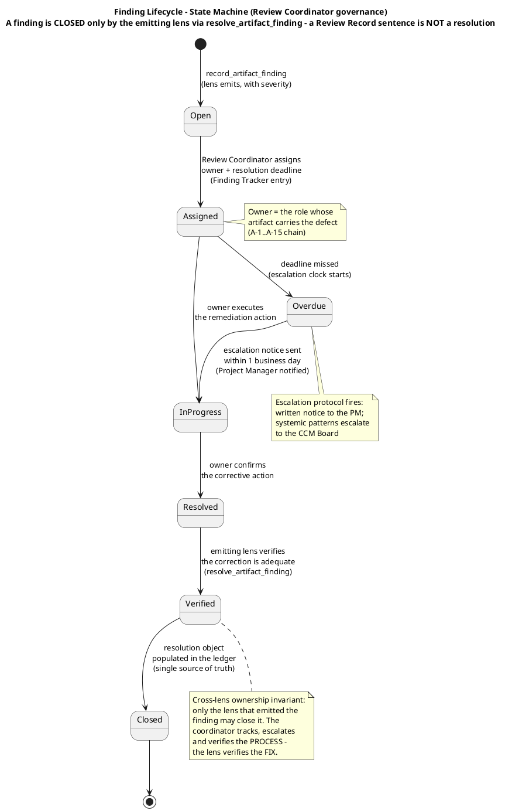

### Review Effectiveness Metrics (Review Coordinator — initial report, 2026-09-01)

First formal review event of the Elaboration phase — no prior Elaboration data exists, so current metrics only (no fabricated trend; the Inception LCO review is a different review type against a different artifact set).

| Metric | Value (this cycle) | Interpretation |
|---|---|---|
| Review coverage | 12 of 12 artifacts formally reviewed (100% of the inventory): technical lens 9 technical artifacts; management lens the planning chain (Iteration Plan, Risk List, SAD, Development Case, Iteration Assessment, Review Record, Measured Actuals); business lens the DC §4 classification (Vision + Use-Case Model); code-review lens the SCM gate discovery (branches, PRs, tree, CI) | Coverage complete — no artifact escaped formal review this cycle |
| Defect density | 10 findings across 12 artifacts; concentration: SAD 3, Iteration Plan 3, Risk List 2, SCM/implementation scope 2; 7 artifacts zero-findings | Defects concentrate in the artifacts closest to the unexecuted empirical validation — a concentrated, executable gap, not diffuse quality decay |
| Defect removal efficiency | NOT YET MEASURABLE — zero test execution this cycle (all 20 test cases BLOCKED on SCM Issue #1); reviews are currently the sole active defect-detection instrument | Becomes measurable when TC-001…TC-020 execute in the convergence cycle; that ratio anchors the process-effectiveness baseline |
| Rework effort | The convergence cycle (Elab Iter 2) IS the rework vehicle; sized by the plan's Elab Iter 2 box [ASSUMPTION — remainder of the ~2,400K Elaboration phase box, basis named in the Iteration Plan]; no measured rework actuals exist yet | First rework actual records at Elab Iter 2 close (Iteration Assessment) |
| Findings overdue | 0 of 10 (deadlines iteration-relative; all raised 2026-09-01) | Review debt: none accrued; the tracker arms escalation at the first missed deadline |

### Elaboration Iteration 2 — Technical-Lens Re-Review (Reviewer, 2026-09-02 — convergence cycle, calendar events R3/R4)

**Scope and criteria (this lens, this cycle):** ALL 13 artifacts in the inventory, reviewed against the **LCA exit-criteria lens** (convergence-cycle track: R3 corrected-artifact re-reviews + R4 evaluation-criteria verification). Priority order: SAD first (architecture gate), then Design Model, then Use-Case Model, then remaining. Upstream consumption complete before findings: all artifacts read in full; the Work Order's declared scope and the stakeholder's recorded Iter 2 answers (R001 behavioural bar; four-UC confirmation "Yes"; featured banner "newest first") cross-checked; SCM state verified empirically (`scm_list_pull_requests` state=all → zero PRs; `scm_get_file_content` main → no Services/, no Infrastructure/; `scm_get_build_status` main → green run 33598979875; `scm_list_issues` → Issue #1 open, cr:approved, assigned:implementer). Checklists applied per artifact type: SAD → architecture checklist; Design Model → design checklist; UC Model → requirements checklist (Source: FR-NNN guard, cross-cutting guard, per-actor guard); Supp Spec → NFR checklist; Risk List → mitigation/acceptance-criteria checklist; Iteration Plan → plan-integrity checklist; Development Case → IARI baseline conformance + optional-trigger audit; Test Case / TES → test-design checklist; PoC artifact → trigger-condition + validation-protocol checklist. Iteration Assessment excluded per review-point rules (authored by the PM in the Assess touchpoint AFTER this review — its absence is never a finding).

**Prior-findings reconciliation (this lens — executed in the dedicated closure state, tool calls FIRST):** 4 prior findings of this lens with resolution==null were loaded; dispositions: **SAD F1 (Critical) RESOLVED** — §Quality PoC Plan rewritten to the empirical disposition with explicit supersession note; §External Dependencies re-scoped (R010 → production-instance integration only); LCA criterion 3 corrected; all three stale locations named in the finding fixed. **SAD F3 (Minor) RESOLVED** — COMP-001 no longer lists IAUD; COMP-010 resolves via IDIR (INT-008); reconciliation subsection present; SAD and Design Model agree at every subsystem boundary. **Risk List F1 (Minor) RESOLVED** — the >90% figure DROPPED per the stakeholder's Iter 2 answer and replaced by the behavioural bar (three clauses, confirmed for UC-004/005/006/007); production-AD percentage moved to Construction (R010+R011), outside the LCA evidence package. **SAD F2 (Critical) PERSISTS** — left open and re-emitted under its findingKey with fresh SCM evidence (2nd occurrence). [EXIT] closed=3 (Resolved), deferred=0, rejected=0, left-open=1. Total disposed: 4 of 4.

**New findings (this lens, this cycle — all emitted via `record_artifact_finding` before this upsert):**

| Finding Key | Severity | Artifact | Description (summary) | Remediation (summary) |
|---|---|---|---|---|
| **SAD F2** (re-emission, 2nd occurrence) | **Critical** | Software Architecture Document (as architecture baseline) + SCM state | **PERSISTS — record side fixed, code-evidence side unmet.** The Architectural Proof-of-Concept artifact now EXISTS (DC-sanctioned, trigger FIRED, Architect-owned) with a sound validation protocol, per-risk single-mechanism dispositions, the R001 behavioural bar, and an honest PENDING ledger. But as of this review (verified 2026-09-02): zero mechanism code in SCM (src/EmployeePortal/Services/ClockingService.cs and src/EmployeePortal/Infrastructure/LdapGateway.cs both not found on main), ZERO pull requests in ANY state, and SCM Issue #1 (severity:blocker, cr:approved, assigned:implementer) still OPEN. Empirical validation of R001 (HIGH, exposure=9), R003, R004 has NOT been performed; TC-001…TC-023 all BLOCKED. The stakeholder's bar — "I will not accept an LCA that validates a HIGH architectural risk on paper only" — is not yet satisfied. The architecture baseline remains structurally sound; the gap is execution of the mandated validation. | Complete the convergence-cycle delivery chain (A-2…A-6, A-8): Implementer delivers the three mechanisms as evolutionary production code in src/ on feature/E1-{risk} branches with dual-coverage tests, labeled ready-for-review; Code Reviewer issues terminal dispositions per PR (base iteration/E1); Integrator merges APPROVED PRs; Test Designer executes TC-001…TC-023 against the fixtures; empirical results land in the PoC artifact § Results and Findings; Issue #1 closes on merged mechanism-PR evidence. This finding closes only when the empirical results are OBSERVED, not when the delivery is planned. |
| **Development Case F1** | **Major** | Development Case — Tailoring note (Requirements); Stakeholder Decisions Incorporated §(3); Traceability row | **Misrecorded stakeholder decision — cross-artifact contradiction on the featured-banner rendering contract.** The stakeholder was asked: "stack all featured banners (newest first), or show only the newest featured item?" and answered "newest first". The Design Model (authoritative UI artifact) retired its P-02 PENDING marker with the faithful reading: stack ALL featured banners, ordered newest first — every featured item renders its own banner, no featured flag silently dropped. The DC instead glosses the same answer as "newest first (single banner, newest featured item)" — in three places — describing the OTHER option the stakeholder did not select. "Newest first" is an ordering statement; ordering presupposes plurality. The two artifacts contradict on a stakeholder-decided contract that authorizes UC-003 step 4 and UC-008 step 3, and the DC is the governance document every role reads for decision records. | Process Engineer corrects the three DC locations to the Design Model's recorded contract, citing the verbatim answer: featured banners STACK, ordered newest first (every featured item renders its own banner; ordering by the same date criterion as the FR-007 list; renders above the list on SCR-03 and above the history preview on SCR-01). Remove the "(single banner, newest featured item)" gloss everywhere it appears. If genuinely ambiguous, escalate via REQUIRES_USER_INPUT rather than recording either gloss. |
| **Iteration Plan F3** (Reviewer, Iter 2) | **Minor** | Iteration Plan — Work Item 8; Objective 2; critical-chain diagram | **Stale test-case enumeration vs the Test Case authority.** The plan names the 20-case set ("Execute TC-001…TC-020", "all 20 currently BLOCKED", "TC-001…TC-020 executed") while the Test Case artifact (TC-ID authority) was extended this same iteration to 23 cases: TC-021/022/023 are the UC-005/006/007 AF-3 behavioural-bar validation cases, and its Cycle 2 record reports 23/23 BLOCKED. The plan's own exit criterion 1 requires the behavioural bar validated across ALL FOUR AD-reading use cases — evidence only TC-021/022/023 provide — yet the enumerated execution scope omits them. Same defect class as the LCO F1 UC-ID mismatch. | Update the three stale enumerations to the 23-case set (Work Item 8, Objective 2, critical-chain Test Designer step). Cross-check against the Test Case §Test Case Catalog (authority) before upsert — the LCO F1 lesson applies to TC IDs exactly as it did to UC IDs. |
| **Test Evaluation Summary F1** | **Minor** | Test Evaluation Summary — mission scope; master workflow; schedule Sequence 2; resources table; INC-1; conclusions; recommendation 1; defect-status row | **Stale test-case enumeration vs the Test Case authority (same class as Iteration Plan F3).** The TES enumerates the 20-case set in eight locations and its mission-scope boundary row states "dedicated per-UC test cases for UC-005/006/007 land in Construction functional suites" — stale against the Test Case artifact, which designed TC-021/022/023 THIS iteration at Integration level as part of the R001 PoC's four-consumer validation. The TES's own acceptance-thresholds table correctly requires the bar "observed across all four AD-reading UCs" — the substance is right; the enumerations and the one scope row are stale. | Update the stale enumerations to the 23-case set and correct the mission-scope boundary row: TC-021/022/023 are DESIGNED and executed THIS convergence cycle as part of the R001 PoC; what lands in Construction is the full functional main-flow suites for UC-005/006/007, not the AF-3 bar cases. |
| **Development Case F2** | **Minor** | Development Case — discipline workflow diagram; Test tailoring note; CORE artifacts table; role matrix (TestDesigner, Tester) | **Stale test-case enumeration vs the Test Case authority (same class).** The DC enumerates the 20-case set in five locations while the Test Case authority carries 23. The DC's own exit criterion 3 requires the behavioural bar confirmed for UC-004..UC-007 — evidence only TC-021/022/023 provide. | Update the five DC locations to the 23-case set (TC-001..TC-023), cross-checked against the Test Case §Test Case Catalog (authority) — the same ID-verification discipline the DC itself mandates for UC IDs. |
| **Architectural Proof-of-Concept F1** | **Minor** | Architectural Proof-of-Concept — § Results and Findings ledger row; § Approach delivery protocol | **Stale test-case enumeration vs the Test Case authority (same class) — in the LCA evidence package's core artifact.** The PoC artifact enumerates the 20-case set in two locations: the Results ledger row ("TC-001…TC-020 execution | PENDING — All 20 test cases BLOCKED") and the delivery protocol ("The Test Designer executes TC-001…TC-020"). The Test Case authority carries 23 cases; the PoC's own acceptance criteria require the R001 behavioural bar proven across ALL FOUR AD-reading consumers — evidence only TC-021/022/023 provide — so the execution protocol as written under-scopes the validation whose results this artifact must carry to the LCA gate. (The artifact predates the Test Case extension by one day — its Cycle 1 citation was accurate when written — but the protocol governs the execution that is still pending, so it must reflect the current authority before the results land.) | Software Architect updates the two locations when the PoC artifact is evolved for the empirical results (the A-8/A-16 evolution already mandates rewriting exactly this table): Results ledger row → "TC-001…TC-023 execution | PENDING — All 23 test cases BLOCKED (Test Case Cycle 2 record; SCM Issue #1)"; delivery protocol → "The Test Designer executes TC-001…TC-023 against the validation fixtures". The R001 results row must then record clause-by-clause evidence for all four consumers (TC-011 + TC-021/022/023), not the directory search alone. |

**Compliance Matrix — Technical LCA Lens, Iteration 2 (11 artifacts × checklist dimensions):**


**Defect Distribution — Iteration 2 (severity × artifact, this lens):**

```plantuml
@startuml
title Elaboration Iter 2 - Defect Distribution\nseverity x artifact, Reviewer lens (2026-09-02)

object "Software Architecture Document" as D1 {
  Critical 1 : F2 PERSISTS (2nd occurrence)
  Record side fixed - PoC artifact
  produced with honest PENDING ledger.
  Code-evidence side unmet: zero
  mechanism code, zero PRs in any
  state, Issue #1 open.
  Resolved this iteration: F1 (Critical),
  F3 (Minor)
}
object "Development Case" as D2 {
  Major 1 : F1 NEW - misrecorded
  featured-banner decision (single
  banner vs stack, 3 locations)
  Minor 1 : F2 NEW - stale TC-001..TC-020
  enumeration (5 locations)
}
object "Iteration Plan" as D3 {
  Minor 1 : F3 NEW - stale TC-001..TC-020
  enumeration (3 locations) vs the
  23-case Test Case authority
}
object "Test Evaluation Summary" as D4 {
  Minor 1 : F1 NEW - stale TC enumeration
  (8 locations) + stale Construction-
  scope row for TC-021..023
}
object "Architectural Proof-of-Concept" as D5 {
  Minor 1 : F1 NEW - stale TC enumeration
  (2 locations) in the LCA evidence
  package's core artifact
}
object "Clean artifacts (this lens)" as D6 {
  Design Model, Use-Case Model,
  Supplementary Specification, Risk List,
  Test Case, Vision (preserved)
  Critical 0, Major 0, Minor 0
}
D1 -[hidden]-> D2
D2 -[hidden]-> D3
D3 -[hidden]-> D4
D4 -[hidden]-> D5
D5 -[hidden]-> D6

note bottom of D1
  One logical defect per ledger entry:
  the absent code evidence is tracked
  ONCE (SAD F2) - the PoC PENDING
  ledger, the 23 BLOCKED test cases and
  Issue #1 all observe the same gap and
  carry no duplicate findings.
  TOTAL OPEN (this lens): 1 Critical,
  1 Major, 4 Minor across 5 artifacts.
end note
@enduml
```

**Cross-lens observation (recorded for the Coordinator):** the Management Reviewer lens's four Iter 1 findings (Iteration Plan F3/F4/F5, Risk List F1) have their remediation evidence VERIFIED PRESENT this review (exit criterion 11 added; queue forecasts removed; trend column added; R012 added) — but per the cross-lens ownership invariant, only the Management Reviewer lens may close them; this lens records the verification, it does not emit the closure. The Code Reviewer's F-CR-E1-2 (CONTRIBUTING.md) likewise has remediation VERIFIED PRESENT (committed, sha `6662813…`, per the Development Case tool-verification 2026-09-02) — closure owned by that lens. F-CR-E1-1 remains OPEN and converges with SAD F2 on the same underlying gap.

### Business Modeling Lens — Findings (Business Reviewer, Iteration 2 — convergence cycle, 2026-09-02)

**NONE — zero findings, zero recommendations, zero BM conditions.** The Business Modeling discipline remains INACTIVE per DC §4 (`isBusinessProcessLed = false`, ProcessEngineer re-check 2026-09-02, independently verified by this lens against the Vision and the Use-Case Model — see § Review Scope and Criteria, business-lens Iter 2 subsection). No BM artifact exists to receive a finding, and none is required for a non-BPL project. No `record_artifact_finding` was emitted from this lens this iteration; no prior BusinessReviewer finding exists to close. The business lens therefore adds **zero entries** to the findings ledger the Review Coordinator must empty before the LCA re-presentation — the open gates (SAD F2, Iteration Plan F3, F-CR-E1-1 and the record corrections A-17…A-21) belong to the technical, management and code-review lenses.

### Elaboration Iteration 2 — New Findings (Management LCA Lens — Management Reviewer, PRA, 2026-09-02)

All four findings emitted via `record_artifact_finding` (2026-09-02) before this upsert. The Critical is a re-emission under its existing findingKey (2nd occurrence — one ledger entry per logical defect); the other three are genuinely new defects minted fresh keys.

| Finding Key | Severity | Artifact | Description (summary) | Remediation (summary) |
|---|---|---|---|---|
| **Iteration Plan F3** (re-emission, 2nd occurrence) | **Critical** | Iteration Plan — Layer 2 exit criteria 1–3; Work Items 3–5 | **PERSISTS — record side fixed, code-evidence side unmet.** The plan's exit criteria 1–3 now correctly require SCM code evidence as the verification method (A-11 record side), work-item statuses are reconciled to SCM evidence, and exit criterion 12 mandates status reconciliation — the plan no longer misstates its own completion state. But the substance the criteria demand is absent as of this review (2026-09-02): zero mechanism code in SCM, zero pull requests in ANY state, zero ready-for-review branches, SCM Issue #1 open, TC-001…TC-023 all BLOCKED. Work Items 3–5 show "In progress — no CI evidence" — honest, but the empirical validation of R001 (HIGH, exposure=9), R003, R004 that the stakeholder made the phase's central objective remains unexecuted. The LCA gate cannot close this cycle. This finding closes only when the empirical results are OBSERVED, not when the delivery is planned. | Complete the convergence-cycle delivery chain (A-2…A-6, A-8, A-16): mechanisms as evolutionary production code in src/ on feature/E1-{risk} branches with dual-coverage tests, ready-for-review labels; terminal PR dispositions (base iteration/E1); Integrator merges APPROVED PRs; Test Designer executes TC-001…TC-023; empirical results land in the PoC artifact § Results and Findings; Issue #1 closes on merged mechanism-PR evidence. PM reconciles Work Item 3–5 statuses to observed SCM state at iteration close (exit criterion 12). LCA re-presented at R6 with the evidence package and a fresh sanction request. |
| **Iteration Plan F6** | **Major** | Iteration Plan — Iteration budget box; work-item sum; rework headroom; Resources token budgets; Construction sizing assumption | **The Iteration 2 budget box was not re-sized from the measured actual, contradicting the Iteration Assessment's binding adjustment.** The Iter 1 close-out recorded the measured iteration actual of 12,523,281 tokens against the 1,200K box (~10.4× variance), root-caused it, and listed as the FIRST binding input to the next Iteration Plan: "Re-size the Iter 2 budget box from the measured 12,523,281 actual — the 1,200K assumption is disproven; the box is rebuilt from fact with its basis named." The Iter 2 plan instead retains "1,200K tokens [ASSUMPTION — remainder of the ~2,400K Elaboration phase box (2 × the Iter 1 box; basis: the Iter 1 box was scaled from the MEASURED Inception actual, 1,347,939 tokens phase-level)]" — the same disproven assumption chain, one step further from fact. Work items sum ~840K against a box the measured shape says is ~10× too small; the ~360K "rework headroom" is a fiction at this scale. A cost-boxed iteration whose box is calibrated to a figure the project has already measured and disproven is not a credible basis for LCA-6 or for Construction sizing, which inherits the same basis. | Project Manager re-sizes the Iteration 2 budget box from the measured iteration actual (12,523,281 tokens) with its basis named — e.g. ~12,500K [ASSUMPTION — scaled from the measured Elab Iter 1 iteration actual; basis: same 9-role shape, 13-artifact accumulated surface, convergence-cycle review load] — or a deliberately different figure with the delta from the measured actual explicitly justified. Update the box, the work-item sum, the rework-headroom note, the Resources section token budgets, and the Construction sizing assumption (which must inherit the iteration-shaped actual, not the phase-level Inception record) in the same pass. Two clocks remain separate; no person-weeks are produced. |
| **Iteration Plan F7** | **Minor** | Iteration Plan — Work Items 2 and 9 (status column) | **Two work-item statuses are stale against verified repository state, violating the plan's own status discipline** ("every 'Complete' above is backed by a commit SHA or CI run; every 'In progress'/'Pending' names its blocking evidence"). Work Item 2 (CONTRIBUTING.md, A-5) shows "In progress — no SCM evidence as of 2026-09-02" — but CONTRIBUTING.md is committed (sha `6662813…`, verified via the Development Case tool-verification 2026-09-02), so the item is complete with evidence and the status understates delivery. Work Item 9 (SAD re-correction, A-7 + A-9) shows "In progress — SAD corrections owned by the Architect this cycle" — but the SAD §Quality PoC Plan carries the empirical disposition with the explicit supersession note and the §Logical View dependencies are reconciled with the Design Model (SAD F1 and SAD F3 RESOLVED via resolve_artifact_finding by the Reviewer lens, 2026-09-02), so the record-side work is done and the status understates it. Same defect class as LCO F2 / Iteration Plan F3's status-honesty lesson: status must cite repository state, not intent — in both directions. | Project Manager reconciles Work Item 2 → "Complete — CONTRIBUTING.md committed (sha 6662813…)" and Work Item 9 → "Complete (record side) — SAD §Quality empirical disposition + §Logical View reconciliation committed; SAD F1/F3 ledger-closed 2026-09-02" in the same pass as the budget-box correction (F6), citing the evidence per the plan's own status discipline. Work Item 10 (PoC artifact) remains Pending — it requires the executed test results, which do not yet exist. |
| **Risk List F2** | **Major** | Risk List — R007 mitigation (featured-banner rendering contract) | **R007's mitigation mis-transcribes the stakeholder's featured-banner decision — it records the option the stakeholder did NOT select.** The stakeholder was asked (UI Designer, Elab Iter 2): "stack all featured banners (newest first), or show only the newest featured item?" and answered "newest first". The Design Model (authoritative UI artifact) retired its P-02 PENDING marker with the faithful reading: stack ALL featured banners, ordered newest first — every featured item renders its own banner, no featured flag silently dropped. The Risk List R007 mitigation instead states: "when more than one item is featured, show only the NEWEST featured item — no stacked banners" — describing the OTHER option, the one not selected. "Newest first" is an ordering statement; ordering presupposes plurality. Same defect class as Development Case F1 (Major, Reviewer lens, Iter 2): a mis-transcription of an answered stakeholder decision that contradicts the authoritative record. The Risk List is a governance artifact every role reads for risk context; a wrong decision record there propagates the wrong contract into R007's mitigation reasoning and any downstream consumer of the risk register. | Project Manager corrects the R007 mitigation to the Design Model's recorded contract, citing the verbatim answer: featured banners STACK, ordered newest first — every featured item renders its own banner (ordering by the same date criterion as the FR-007 list; renders above the list on SCR-03 and above the history preview on SCR-01). Remove the "show only the NEWEST featured item — no stacked banners" gloss. Coordinate with the Process Engineer's parallel correction of Development Case F1 (same defect class, same verbatim answer) so the two governance artifacts record the identical contract. |

### Defect Distribution — Iteration 2 (severity × artifact, Management Lens)

```plantuml
@startuml
title Elaboration Iter 2 - Management-Lens Defect Distribution\nseverity x artifact (Management Reviewer, 2026-09-02)

object "Iteration Plan" as D1 {
  Critical 1 : F3 PERSISTS
  (2nd occurrence) - record side
  fixed (exit criteria demand
  code evidence; statuses
  honest; criterion 12 added),
  code side unmet (zero PRs,
  Issue #1 open, TC-001..TC-023
  BLOCKED)
  Major 1 : NEW - budget box
  not re-sized from the measured
  12,523,281 iteration actual;
  contradicts the Iteration
  Assessment's binding adjustment
  Minor 1 : NEW - WI 2 + WI 9
  statuses stale vs verified
  repository state (sha 6662813;
  SAD F1/F3 ledger-closed)
  Resolved this revision:
  F4 (Major), F5 (Minor)
}
object "Risk List" as D2 {
  Major 1 : NEW - R007 mitigation
  mis-transcribes the featured-banner
  decision ("show only the NEWEST
  featured item - no stacked banners"
  = the UNSELECTED option; faithful
  record: stack ALL, newest first)
  Resolved this revision:
  F1 (Minor - trend column + R012)
}
object "Iteration Assessment" as D3 {
  Clean from this lens - the
  Elab Iter 1 close-out is honest
  (measured actuals, root-caused
  variance, binding adjustments);
  the Elab Iter 2 assessment is
  authored AFTER this review -
  absence expected, never a finding
}

D1 -[hidden]-> D2
D2 -[hidden]-> D3

note bottom of D3
  TOTAL (this lens, after this
  revision): 1 Critical, 2 Major,
  1 Minor open across 2 artifacts;
  3 prior findings ledger-closed
  (Iteration Plan F4, F5; Risk List
  F1). All open findings are
  phase-exit conditions per the
  stakeholder's all-findings
  directive.
end note
@enduml
```

### Elaboration Iteration 2 — Consolidated Finding Tracker (Review Coordinator — verified ledger, 2026-09-02)

**Ledger-vs-narrative reconciliation (conflict resolution, this cycle):** the lens narratives report 2 Critical / 3 Major / 5 Minor open; the verified findings ledger (`read_artifact_findings` executed for ALL 13 artifacts, 2026-09-02) carries **exactly 2 Critical / 3 Major / 5 Minor open** — ledger and narrative AGREE this cycle. The Iter 1 discrepancy is resolved: the two Code Reviewer findings remain narrative-tracked because they target SCM state and the repository root, which are not ledger-scoped artifacts. **Resolution:** the tracker below carries ALL TWELVE findings (10 ledger + 2 narrative); the milestone verdict anchors to the verified ledger. No cross-lens severity conflicts exist. The stakeholder's all-findings directive supersedes severity-based phase-exit prioritization: ALL twelve findings close before phase transition.

| # | Finding Key | Lens | Severity | Artifact / Location | Owner (Action) | Priority | Deadline | Ledger Status |
|---|---|---|---|---|---|---|---|---|
| 1 | SAD F2 (2nd occurrence) | Reviewer | **Critical** | SAD baseline + SCM state (zero mechanism code, zero PRs, Issue #1 open) | Software Architect (A-8/A-16) + Implementer (A-2…A-4) + Code Reviewer (A-6) + Integrator + Test Designer | P1 | Elab Iter 2 — before LCA re-presentation | OPEN |
| 2 | Iteration Plan F3 (Management, 2nd occurrence) | Management Reviewer | **Critical** | Iteration Plan exit criteria 1–3; WIs 3–5 | Project Manager (A-11/A-16) + Implementer + Code Reviewer + Test Designer | P1 | Elab Iter 2 — before LCA re-presentation | OPEN |
| 3 | Development Case F1 | Reviewer | **Major** | DC — 3 locations (featured-banner decision record) | Process Engineer (A-17) | P3 | Elab Iter 2 close | OPEN |
| 4 | Iteration Plan F6 | Management Reviewer | **Major** | Iteration Plan — budget box + work-item sum + rework headroom + Resources + Construction sizing | Project Manager (A-22) | P3 | Elab Iter 2 close | OPEN |
| 5 | Risk List F2 | Management Reviewer | **Major** | Risk List — R007 mitigation (featured-banner mis-transcription) | Project Manager (A-24) | P3 | Elab Iter 2 close | OPEN |
| 6 | Development Case F2 | Reviewer | Minor | DC — 5 stale TC enumerations | Process Engineer (A-20) | P3 | Elab Iter 2 close | OPEN |
| 7 | Iteration Plan F3 (Reviewer, Iter 2) | Reviewer | Minor | Iteration Plan — 3 stale TC enumerations (WI 8, Objective 2, critical chain) | Project Manager (A-18) | P3 | Elab Iter 2 close | OPEN |
| 8 | Iteration Plan F7 | Management Reviewer | Minor | Iteration Plan — WI 2/9 statuses stale vs verified delivery | Project Manager (A-23) | P3 | Elab Iter 2 close | OPEN |
| 9 | Test Evaluation Summary F1 | Reviewer | Minor | TES — 8 stale TC enumerations + stale Construction-scope row | Test Manager (A-19) | P3 | Elab Iter 2 close | OPEN |
| 10 | Architectural Proof-of-Concept F1 | Reviewer | Minor | PoC — 2 stale TC enumerations (Results ledger row; delivery protocol) | Software Architect (A-21) | P3 | Elab Iter 2 close | OPEN |
| 11 | F-CR-E1-1 | Code Reviewer (narrative) | **Critical** | SCM state vs Iteration Plan WIs; exit criteria 1–3 | Integrator (A-1) + Implementer (A-2…A-4) + Code Reviewer (A-6) | P0/P1 | Elab Iter 2 — before LCA re-presentation | OPEN (narrative-tracked; converges with #1, #2 — one defect, three gates) |
| 12 | F-CR-E1-2 | Code Reviewer (narrative) | Minor | Repository root — CONTRIBUTING.md | Implementer / Software Architect / ConfigurationManager (A-5) | P0 | Before the first mechanism PR | OPEN (narrative-tracked; remediation VERIFIED PRESENT — sha `6662813…`; closure owned by the Code Reviewer lens) |

**Deadlines are iteration-relative** (Elaboration Iteration 2 boundaries), never projected calendar dates. **Overdue findings: 0 of 12** (all raised 2026-09-01/02; no deadline missed; no escalation notices owed). **Escalation status:** the Critical-finding escalation is **DISCHARGED — standing** (Iter 1: delivered and answered; stakeholder resolution verbatim: "Fix all the issues and close all findings"). The two persisting Criticals (SAD F2, Iteration Plan F3) are 2nd occurrences of findings covered by that discharged escalation — both trace to recorded stakeholder decisions whose remediation is fully determined; no new escalation is owed, and re-escalating would re-open an answered question. Overdue-finding escalation to the Project Manager arms at the first missed deadline in the convergence cycle, with systemic patterns escalating to the CCM Board. **Ledger-closed this cycle (6, by their emitting lenses via `resolve_artifact_finding`, 2026-09-02):** SAD F1 (Critical), SAD F3 (Minor), Risk List F1 (Reviewer, Minor), Risk List F1 (Management, Minor), Iteration Plan F4 (Major), Iteration Plan F5 (Minor) — the finding-lifecycle state machine executed end-to-end for six findings in one cycle.

### Review Effectiveness Metrics (Review Coordinator — Iter 2 update, 2026-09-02)

Second formal review event of the Elaboration phase — first cycle with comparable prior data (the Iter 1 record); trends compare only review events that ACTUALLY occurred.

| Metric | Iter 1 (2026-09-01) | Iter 2 (2026-09-02) | Trend / Interpretation |
|---|---|---|---|
| Review coverage | 12 of 12 artifacts (100%) | 13 of 13 artifacts (100% — inventory grew by the Architectural Proof-of-Concept artifact) | Coverage HELD at 100% while the inventory grew — the new artifact was reviewed in its birth cycle; no artifact escaped formal review |
| Defect density | 10 findings / 12 artifacts; concentration: SAD 3, Iteration Plan 3, Risk List 2, SCM 2 | 8 new findings / 13 artifacts + 2 persisting Criticals; concentration: Iteration Plan 4, Development Case 2, Risk List 1, TES 1, PoC 1 | Defect-class concentration SHIFTED from "superseded records + absent code" to "stale enumerations + mis-transcribed decisions" — record-hygiene defects, cheap to fix; the one structural defect (absent code evidence) persists unchanged |
| Findings closed per cycle | 0 (first cycle — nothing to close) | 6 of 10 Iter 1 ledger findings closed by their emitting lenses in ONE cycle | Closure velocity HIGH — the convergence cycle is working; the finding lifecycle (Open → Assigned → In-Progress → Resolved → Verified → Closed) executed end-to-end for 6 findings |
| Recurrence rate | — (first cycle) | 2 of 10 Iter 1 ledger findings recurred (SAD F2, Iteration Plan F3 — both 2nd occurrences, same underlying defect: absent code evidence) | 80% non-recurrence; the 2 recurrences are the SAME defect observed by three gates — tracked once per gate, remediated by ONE action chain (A-16) |
| Defect removal efficiency | NOT YET MEASURABLE (TC-001…TC-020 BLOCKED) | STILL NOT MEASURABLE (TC-001…TC-023 all BLOCKED on SCM Issue #1) | Unchanged — reviews remain the sole active defect-detection instrument until the mechanisms land; becomes measurable at R4/R6 and anchors the process-effectiveness baseline |
| Rework effort | Convergence cycle IS the rework vehicle; no measured actuals | Record-side rework DONE this cycle (6 closures + verified corrections A-7/A-9/A-10, A-12…A-15); code-side rework PENDING (A-16) | First partial rework actual records at Elab Iter 2 close (Iteration Assessment); the record/code split quantifies where the rework budget went |
| Findings overdue | 0 of 10 | 0 of 12 | Review debt: none accrued across two cycles; escalation arms at the first missed deadline |

**Interpretation (metrics with meaning, not raw counts):** the review process is EFFECTIVE and IMPROVING — coverage held at 100% while the inventory grew; closure velocity went from 0 to 6 in one cycle; the recurrence rate is concentrated on ONE structural defect with a single owned remediation chain (A-16), not diffuse quality decay. The warning indicator: defect removal efficiency remains unmeasurable because test execution is blocked on the very defect the two Criticals track — the review process currently carries 100% of the defect-detection load, which is precisely why the stakeholder's all-findings directive and the R6 evidence gate exist. Deterioration check (heuristic 6): coverage NOT declining, rework NOT rising uncontrolled, DRE not falling (never yet measurable) — no rigor-loss signal; the process requires no correction this cycle.

### Stakeholder Contribution at the Verdict Gate (Review Coordinator — folded 2026-09-02, post-consolidation)

**Source:** the stakeholder's answer at the Iter 2 milestone verdict gate (VERDICT_CONTRIB contribution question). Two items, both folded into this record NOW — an answered question that stays unrecorded makes every later role ask it again.

**Item 1 — the FOURTH behavioural-bar clause (BINDING — extends the R001 validation bar for all four AD-reading UCs).** The stakeholder states the prior confirmation questionnaire did not include a free-text input, and supplies the addition they were holding: clocking data is portal data, ad_user_id is always present, and an employee nobody can select is an employee nobody can categorize. The three existing clauses stop data from being LOST; none of them stops it from being INVENTED. The fourth clause, recorded verbatim:

> **"a missing attribute is displayed as missing. It is never replaced by a default, a placeholder, a guessed value, or another employee's value."**

With the stakeholder's stated rationale, recorded verbatim: "Blank is an answer. 'General', or the first office in the list, is a fabrication — and on the CSV that reaches payroll a fabricated department is worse than an empty cell. An empty cell gets questioned. A plausible wrong one does not."

**Verification against the recorded artifact state (coordinator, before folding):** the fourth clause EXTENDS the three-clause bar without contradiction — the existing records already specify blank rendering (UC-005 blank display fields; UC-006 blank cells, no abort; UC-007 blank fields, employee locatable; COMP-007/CLS-009 "missing attribute = null, entry NOT hidden"). The fourth clause hardens blankness into an explicit prohibition on substitution: no default, no placeholder, no guessed value, no another-employee's-value. It applies to ALL FOUR AD-reading use cases (UC-004/005/006/007), per the stakeholder's "Add a fourth clause to all four."

**Propagation tracking (stakeholder-decision work, not defect findings — tracked as actions A-25…A-31; the R4/R6 gates verify completion):**

| # | Propagation action | Owner | Lands with |
|---|---|---|---|
| A-25 | Add the fourth clause to UC-004 AF-2 (the S4 bar-walk) and the UC-005/006/007 AF-3 flows in the Use-Case Model, citing the stakeholder's verbatim words | System Analyst | The next Use-Case Model evolution |
| A-26 | Extend the R001 behavioural-bar reliability contract in the Supplementary Specification from three to four clauses (four consumers unchanged) | System Analyst | The next Supplementary Specification evolution |
| A-27 | Extend the four-consumer rendering contracts (P-05) and the CLS-009 graceful-degradation contract in the Design Model: missing attribute = null/blank, NEVER a default, placeholder, guessed value, or another employee's value | Designer | The next Design Model evolution — MUST land with the mechanism build so the code implements four clauses |
| A-28 | Extend TC-011 and TC-021/022/023 in the Test Case artifact with fourth-clause verification steps (assert the rendered/exported value is blank, not substituted) and seed substitution-attempt fixtures (a default category, a first-office fallback) so the clause can actually fail | Test Designer | The next Test Case evolution — BEFORE TC execution |
| A-29 | Extend the PoC artifact's R001 acceptance criteria and results protocol to FOUR clauses × four consumers; the R001 results row must record clause-by-clause evidence for all four clauses across TC-011 + TC-021/022/023 | Software Architect | The A-8/A-16/A-21 PoC evolution (same pass as the 23-case enumeration fix) |
| A-30 | Extend the R001 acceptance criteria in the Risk List to four clauses (the mitigation already seeds gaps deliberately; add the substitution-prohibition) | Project Manager | The next Risk List evolution (same pass as A-24) |
| A-31 | Extend the SAD §Quality PoC Plan R001 behavioural-bar record to four clauses | Software Architect | The next SAD evolution |

**Item 2 — the Implementer context and priority.** The stakeholder states, verbatim: "Due to a technical problem, beyond its control, the implementer has not been able to work on both iterations. In this third iteration I hope that the Implementer can push the code so that everything moves forward." Folded as: (a) the two-iteration code absence is stakeholder-attributed to a technical problem beyond the Implementer's control — recorded so the convergence-cycle tracking does not misread it as non-compliance; (b) the code push is the stakeholder's stated priority for the next pass — A-16 (the merged delivery chain) remains P0 on the consolidated execution order, unchanged in substance, now stakeholder-prioritized; (c) the stakeholder's "third iteration" phrasing is noted — the convergence cycle continues until the R6 entry gate passes; the iteration count is the process's, not a deadline.

**Process observation recorded for all roles emitting REQUIRES_USER_INPUT:** the stakeholder states the prior confirmation questionnaire "did not include input" — the Iter 2 behavioural-bar confirmation was a yes/no question with no free-text field, and the stakeholder held this fourth clause for an entire cycle with no field to deliver it in. Contract-confirmation questionnaires MUST carry an optional free-text field for additions; a confirmation that cannot receive an addition is a gate that silently drops stakeholder decisions. This observation is recorded here as a process lesson and propagated to the Process Engineer (Development Case owner) for the questionnaire-format rule.
## Resolutions and Actions
### Convergence-Cycle Review Calendar (Review Coordinator — Elaboration Iteration 2)

The phase auto-iterates into the already-planned Elaboration Iteration 2 (BUILDING). The review calendar below is synchronized to the convergence-cycle workflow — every review event is triggered by a workflow activity completion, not by a fixed calendar date; if the iteration slips, the reviews slip with it. Entry criteria are coordinator-enforced before each event begins; exit criteria gate each event's completion.

```plantuml
@startuml
title Elaboration Iter 2 (Convergence Cycle) - Review Calendar\nReview events mapped to the convergence-cycle workflow (Review Coordinator, 2026-09-01)

start
:Phase auto-iterates into Elaboration Iteration 2\n(trigger - LCA NO-GO this cycle plus the stakeholder\nall-findings directive, binding on phase transition);

partition "R1 - Mechanism PR code reviews (Code Reviewer)" {
  :ENTRY - Implementer labels the mechanism branches\nready-for-review (feature/E1-R001, E1-R003, E1-R004),\nCI green, CONTRIBUTING.md committed (A-5);
  :One PR per branch, base iteration/E1,\nchecklist CR-1..CR-7 applied per PR;
  :EXIT - terminal disposition per PR\n(approve or request_changes);
}

partition "R2 - Mid-iteration PRA checkpoint (Management Reviewer)" {
  :Monitor convergence execution against the Iteration Plan;\nescalate any finding that misses its deadline;
}

partition "R3 - Corrected-artifact re-reviews" {
  :SAD re-review (Reviewer lens)\nENTRY - A-7 and A-9 committed\nEXIT - SAD F1 and SAD F3 closed in the ledger;
  :Iteration Plan and Risk List re-review (Management lens)\nENTRY - A-12..A-15 committed\nEXIT - Iteration Plan F4, F5 and Risk List F1 closed;
  :Architectural Proof-of-Concept artifact review (Reviewer lens)\nENTRY - A-8 produced with empirical R001/R003/R004 results\nEXIT - SAD F2 closed in the ledger;
}

partition "R4 - Iteration Evaluation Criteria Review" {
  :Verify exit criteria 1-8 PLUS the all-findings criterion\n(zero open findings - ALL lenses, ALL severities);
}

partition "R5 - Iteration Acceptance Review" {
  :Formal acceptance of the convergence deliverables\n(mechanisms merged to iteration/E1, PoC artifact,\ncorrected SAD, Iteration Plan, Risk List);
}

partition "R6 - LCA milestone re-presentation" {
  :ENTRY GATE - coordinator-enforced\n1. findings ledger EMPTY (read_artifact_findings across\nall 12 artifacts shows zero open findings)\n2. evidence package assembled (PoC artifact plus mechanism\ncode on iteration/E1 plus TC-001..TC-020 executed)\n3. SAD, Iteration Plan and Risk List corrected\n4. review materials distributed before the review;
  :Fresh sanction request to the stakeholder\n(decision-maker with phase-sanctioning authority);
  if (Sanction GRANTED?) then (yes)
    :Phase transition sanctioned - Construction entry;
    stop
  else (no)
    :Record refusal and directive;\niterate again against the same entry gate;
    stop
  endif
}
@enduml
```

**Calendar-to-finding mapping:** R1 closes F-CR-E1-1 and F-CR-E1-2 (tracker #9, #10); R3 closes SAD F1/F2/F3, Iteration Plan F4/F5, Risk List F1 ×2 (tracker #1, #2, #4–#8); R4 verifies Iteration Plan F3's remediation (tracker #3 — the exit criteria it violates must PASS with code evidence); R6 is the milestone gate whose entry condition is the stakeholder's all-findings directive satisfied. **Participant assignment (expertise-matched):** architecture re-reviews require the Reviewer lens with architecture competency; the PoC artifact review requires the Reviewer lens plus the Software Architect as author; the Iteration Plan/Risk List re-reviews require the Management Reviewer lens; the code reviews require the Code Reviewer lens; the LCA re-presentation requires the stakeholder (STK-001 — sanctioning authority) with all three lenses reporting.

### Remediation — Closing the Elaboration Iter 1 Code-Review Gate

```plantuml
@startuml
title Remediation — Closing the Elaboration Iter 1 Code-Review Gate

|Integrator|
start
:Create iteration/E1
(integration workspace — strategy 5.2, 8.1);

|Implementer|
:Build R001 mechanism (evolutionary, in src/):
COMP-007 LdapGateway (CLS-009) against a
disposable LDAP directory — attribute
mapping, graceful degradation
(missing attribute = null, entry NOT hidden);
:Build R003 mechanism:
COMP-006 (CLS-010) against a stub OIDC
issuer — token validation, role-claim
extraction (Employee + HR Administrator);
:Build R004 mechanism:
COMP-009 (CLS-008) — localStorage queue,
idempotent sync endpoint, UNIQUE
idempotency_key (REL-002);
:Ship dual-coverage unit tests per mechanism
(black-box contract + white-box paths);
:Commit CONTRIBUTING.md (guidelines baseline —
closes the F-CR-E1-2 precondition);
:Label branches ready-for-review:
feature/E1-R001-*, feature/E1-R003-*,
feature/E1-R004-*;

|Code Reviewer|
:Open ONE PR per branch — base iteration/E1
(the Reviewer owns the PR and its base);
:Apply checklist CR-1..CR-7 per PR:
CI gate, guidelines, dual coverage,
SAD/Design conformance, traceability
trailer (Implements: UC-NNN / risk-id),
build-tree coverage;
:Terminal disposition per PR:
scm_approve_pull_request |
scm_request_changes_on_pull_request;
:Append dispositions to this Review Record
(cumulative);

|Integrator|
:Merge APPROVED PRs into iteration/E1;
note right
  Result: exit criteria 1-3 acquire
  code evidence; empirical results
  feed the Architectural Proof-of-Concept
  artifact (owner: Software Architect)
  and the LCA evidence package.
end note
stop
@enduml
```

### Open Action Items

| # | Action | Owner | Severity | Blocks |
|---|---|---|---|---|
| A-1 | Create `iteration/E1` integration workspace | Integrator | Critical | Every Elaboration mechanism PR (no valid base exists) — **DONE since the code-review cycle** (branch exists, skeleton only; no mechanism code yet) |
| A-2 | Build + hand off R001 mechanism (disposable LDAP directory, COMP-007/CLS-009) with dual-coverage tests, branch labeled `ready-for-review` | Implementer | Critical | Exit criterion 1; R001 (HIGH) empirical retirement |
| A-3 | Build + hand off R003 mechanism (stub OIDC issuer, COMP-006/CLS-010) with dual-coverage tests, branch labeled `ready-for-review` | Implementer | Critical | Exit criterion 2; R003 empirical retirement |
| A-4 | Build + hand off R004 mechanism (offline queue + idempotent sync, COMP-009/CLS-008) with dual-coverage tests, branch labeled `ready-for-review` | Implementer | Critical | Exit criterion 3; R004 empirical retirement; AC-005 evidence |
| A-5 | Commit `CONTRIBUTING.md` (coding standards + branch-strategy section) | Implementer / Software Architect / ConfigurationManager | Minor | CR-1 rule citation in the first mechanism PR — **DONE** (verified via SCM, sha `6662813…`, per Development Case tool-verification 2026-09-02; closure of F-CR-E1-2 owned by the Code Reviewer lens) |
| A-6 | Open + review one PR per ready branch (base `iteration/E1`), terminal disposition each | Code Reviewer | Critical | Iteration code-review gate closure |
| **A-7** | **Re-correct the SAD PoC Plan to the empirical disposition** (§Quality per-risk retirement: R001 disposable directory / R003 stub issuer / R004 direct, citing the stakeholder decision; §External Dependencies: R010 blocks production-instance integration only; LCA criterion 3 corrected; name the Architectural Proof-of-Concept artifact as validation vehicle) — closes SAD F1 | Software Architect | Critical | LCA exit criterion 3 (technical lens); SAD F1 — **DONE** (verified this review; SAD F1 RESOLVED via resolve_artifact_finding, 2026-09-02) |
| **A-8** | **Produce the Architectural Proof-of-Concept artifact** (DC-sanctioned, Architect-owned) carrying the empirical results for R001/R003/R004 once the mechanisms are validated — closes SAD F2 | Software Architect | Critical | LCA evidence package; SAD F2 — **IN PROGRESS** (artifact produced with validation protocol + honest PENDING ledger; empirical results still absent — SAD F2 persists until results are OBSERVED) |
| **A-9** | **Reconcile SAD §Logical View component dependencies with the Design Model's documented reconciliations** (COMP-001 IAUD removal, COMP-010 ILDAP → IDirectoryService) — closes SAD F3 | Software Architect | Minor | SAD/Design Model boundary consistency — **DONE** (verified this review; SAD F3 RESOLVED via resolve_artifact_finding, 2026-09-02) |
| **A-10** | **Tag the R001 >90% acceptance criterion `[ASSUMPTION — requires validation]` with its basis** (or escalate to the stakeholder as the R001 validation bar); propagate the tag to the SAD PoC Plan, Test Evaluation Summary, and Test Case on next evolution — closes Risk List F1 (Reviewer) | Project Manager (Risk List owner) | Minor | R001 validation-bar traceability — **DONE** (escalation path taken: the stakeholder rejected the figure as invented and set the behavioural bar; Risk List F1 RESOLVED via resolve_artifact_finding, 2026-09-02) |
| **A-11** | **Execute the convergence cycle (Elaboration Iteration 2) per A-1…A-6 + A-8**: deliver the three mechanisms as evolutionary code with dual-coverage tests, terminal PR dispositions, TC-001…TC-020 execution, empirical results into the PoC artifact; reconcile Work Item 7–9 statuses to SCM evidence at iteration close — closes Iteration Plan F3 (Critical) | Project Manager (plan owner) / Implementer / Code Reviewer / Test Designer / Software Architect | Critical | LCA re-presentation; stakeholder sanction — **IN PROGRESS** (record-side corrections done; code delivery pending — Issue #1 open) |
| **A-12** | **Add the all-findings-closure exit criterion** to the Iteration Plan Layer 2 table and the Elab Iter 2 preview's primary objective: zero open findings across ALL lenses and ALL severities before phase transition; verify via the findings ledger at each iteration close — closes Iteration Plan F4 (Major) | Project Manager (plan owner) | Major | Phase transition sanction (stakeholder directive) — **DONE** (exit criterion 11 verified present this review; **ledger-closed by this lens via resolve_artifact_finding, 2026-09-02**) |
| **A-13** | **Remove the human-gate queue-time forecasts from the milestone table** (retain measured Inception 0s as a recorded actual); report measured actuals only at each Iteration Assessment — closes Iteration Plan F5 (Minor) | Project Manager (plan owner) | Minor | Planning-rule conformance — **DONE** (queue forecasts verified absent; "Estimate NONE" recorded; **ledger-closed by this lens via resolve_artifact_finding, 2026-09-02**) |
| **A-14** | **Add a trend column to the Risk Register** (direction since last review + evidence pointer), updated at each iteration reappraisal — closes Risk List F1 (Management, part 1) | Project Manager (Risk List owner) | Minor | Risk-retirement trend verification at every review — **DONE** (trend column verified present with evidence pointers; **ledger-closed by this lens via resolve_artifact_finding, 2026-09-02**) |
| **A-15** | **Add a Risk List entry bounding the human-gate queue risk** (strategy Accept; mitigation: in-round stakeholder answering as measured at LCO and at this review's consultation; contingency: process suspends at 14 days per the planning rule — nothing is auto-filled) — closes Risk List F1 (Management, part 2) | Project Manager (Risk List owner) | Minor | Human-gate risk bounded in the Risk List, not forecast in the plan — **DONE** (R012 verified present with the 14-day suspension ceiling; **ledger-closed by this lens via resolve_artifact_finding, 2026-09-02**) |

### Coordinator Prioritization (execution order for the convergence cycle)

The action chain is sequenced by dependency, not by severity alone — the stakeholder's directive makes ALL of them phase-exit conditions, so the order optimizes the critical path:

1. **P0 — unblock the code path (A-1 done, A-5, A-2, A-3, A-4):** CONTRIBUTING.md first (CR-1 precondition), then the three mechanisms in risk order R001 → R003 → R004 (R001 is the only HIGH-magnitude risk; the Elaboration test priority confirms UC-001, UC-004, UC-010 coverage).
2. **P1 — close the evidence gap (A-6, A-8, A-11):** PR dispositions, TC-001…TC-020 execution, empirical results into the Architectural Proof-of-Concept artifact — this closes tracker #2, #3, #9 (the three-gate observation of the same defect) and assembles the LCA evidence package.
3. **P2 — correct the architecture record (A-7, A-9):** the SAD re-correction must land BEFORE the LCA re-presentation (the SAD is the artifact the gate evaluates); A-9 rides the same SAD evolution.
4. **P3 — close the management findings (A-12, A-13, A-14, A-15, A-10):** the plan/risk corrections are quick, independent, and must be committed before the Iteration Evaluation Criteria Review verifies the all-findings criterion.

**Conflict resolution (cross-lens):** no severity conflicts exist across lenses. The one consolidation decision: SAD F2, F-CR-E1-1, and Iteration Plan F3 are tracked as three findings (three gates, three emitting lenses) but remediated by ONE action chain (A-2…A-6 + A-8 + A-11) — the coordinator does not merge the findings (each lens closes its own) but merges the WORK to avoid triple execution of the same remediation.

### Historical Resolutions (Inception — preserved)

F1 (Major, both lenses) — RESOLVED: the Iteration Plan's "Use Cases and Scenarios Addressed" table corrected to the Use-Case Model authority (FR-001→UC-005, FR-002→UC-006, FR-003→UC-007, FR-004→UC-001, FR-005→UC-002, FR-006→UC-008, FR-007→UC-003, FR-008→UC-009, FR-009→UC-010, FR-010→UC-004); Construction assignments updated; Layer 3 rework criteria table added. F2 (Minor, both lenses) — RESOLVED: all 13 work items reconciled to "Complete" against repository state. Both closures verified in the Inception Iter 2 review; stakeholder sanction granted.

### Technical-Lens Remediation Chain (convergence cycle — Elaboration Iter 2)

```plantuml
@startuml
title Technical-Lens Remediation Chain — Elaboration Iter 2 Convergence

|Software Architect|
start
:A-7 Re-correct SAD PoC Plan to the
empirical disposition (closes SAD F1);
:A-9 Reconcile SAD Logical View
dependencies with the Design Model
(closes SAD F3);

|Implementer|
:A-2..A-4 Build and hand off the three
mechanisms (evolutionary, in src/,
dual-coverage tests, ready-for-review
labels) — closes F-CR-E1-1 / Issue #1;

|Code Reviewer|
:A-6 Open one PR per branch
(base iteration/E1), apply CR-1..CR-7,
terminal disposition each;

|Integrator|
:Merge APPROVED PRs into iteration/E1;

|Test Designer|
:Execute TC-001..TC-020 against the
validation fixtures (disposable LDAP
directory, stub OIDC issuer, PG dev,
drop simulation) — unblocks all 20 cases;

|Software Architect|
:A-8 Produce the Architectural
Proof-of-Concept artifact carrying the
empirical R001/R003/R004 results
(closes SAD F2);

|Project Manager|
:A-10 Tag the R001 90 percent criterion
(closes Risk List F1);
:Record actuals in the Iteration
Assessment; assemble the LCA
evidence package;
stop
@enduml
```

### Management-Lens Remediation Chain (convergence cycle — Elaboration Iter 2)

```plantuml
@startuml
title Management-Lens Remediation Chain — Elaboration Iter 2 Convergence

|Project Manager|
start
:A-12 Add the all-findings-closure exit
criterion to the Iteration Plan Layer 2
table and Elab Iter 2 preview objective
(closes Iteration Plan F4, Major);
:A-13 Remove human-gate queue forecasts
from the milestone table; keep measured
Inception 0s as recorded actual
(closes Iteration Plan F5, Minor);
:A-14 Add trend column to the Risk
Register - direction since last review
+ evidence pointer (closes Risk List F1
part 1, Minor);
:A-15 Add Risk List entry bounding the
human-gate queue risk - 14-day suspension
ceiling, in-round answering as mitigation
(closes Risk List F1 part 2, Minor);

|Implementer / Code Reviewer / Test Designer / Architect|
:A-11 Execute the convergence cycle:
three mechanisms as evolutionary code,
terminal PR dispositions, TC-001..TC-020
executed, empirical results into the
Architectural Proof-of-Concept artifact;
Work Item 7-9 statuses reconciled to
SCM evidence (closes Iteration Plan F3,
Critical);

|Project Manager|
:Reconcile the 1,347,939 vs 3,550,308
token records at the Iteration Assessment
(phase-level record governs);
:Assemble the LCA evidence package:
empirical results + empty findings ledger
across ALL lenses and ALL severities;

|Management Reviewer|
:Re-present LCA with the evidence package;
fresh sanction request to the stakeholder;
stop
@enduml
```

### Business Modeling Lens — Resolutions and Actions (Business Reviewer, this cycle)

| # | Action | Owner | Severity | Blocks |
|---|---|---|---|---|
| — | **None.** Zero findings emitted from this lens; zero prior BusinessReviewer findings open (ledger verified — the Inception findings belong to the Reviewer and ManagementReviewer lenses, all RESOLVED). | — | — | — |

**BM discipline disposition for the convergence cycle:** remains INACTIVE. Re-trigger condition: a Change Request that introduces business-process reengineering, workflow transformation, or a business object model re-opens the DC §4 classification (owner: ProcessEngineer) — until then, no BM deliverable is owed at LCA and no BM action item exists.

### Elaboration Iteration 2 — New Action Items (Reviewer lens, 2026-09-02)

Actions A-16…A-21 remediate the findings recorded by that lens this cycle. They extend the A-1…A-15 chain (the coordinator's numbering continues; no prior action is renumbered or superseded). Priority: A-16 rides the same convergence-cycle critical path as A-2…A-6 (it IS the same underlying gap); A-17…A-21 are quick record corrections that must land before the R4 evaluation-criteria review verifies the all-findings criterion.

| # | Action | Owner | Severity | Blocks |
|---|---|---|---|---|
| **A-16** | **Deliver the three mechanisms as evolutionary code and complete the empirical validation** (same chain as A-2…A-6 + A-8: feature/E1-{risk} branches, dual-coverage tests, ready-for-review labels, terminal PR dispositions base `iteration/E1`, Integrator merges, TC-001…TC-023 executed against the fixtures, empirical results into the PoC artifact § Results and Findings, Issue #1 closed on merged-PR evidence) — closes SAD F2 (Critical, 2nd occurrence) and, with it, the same-gap observations F-CR-E1-1 (Code Reviewer lens) and Iteration Plan F3 (Management lens) close their own entries | Implementer (A-2…A-4) + Code Reviewer (A-6) + Integrator + Test Designer + Software Architect (A-8) | Critical | LCA evidence package; exit criteria 1–3; R001/R003/R004 empirical retirement; phase transition |
| **A-17** | **Correct the Development Case's featured-banner decision record** (three locations: Tailoring note Requirements; Stakeholder Decisions Incorporated §(3); Traceability row) to the Design Model's faithful contract — featured banners STACK, ordered newest first, every featured item renders its own banner — citing the stakeholder's verbatim answer "newest first"; remove the "(single banner, newest featured item)" gloss everywhere — closes Development Case F1 (Major) | Process Engineer | Major | Decision-record integrity across artifacts; UC-003 step 4 / UC-008 step 3 authorization chain |
| **A-18** | **Update the Iteration Plan's three stale TC enumerations** to the 23-case set (Work Item 8, Objective 2, critical-chain Test Designer step), cross-checked against the Test Case §Test Case Catalog (authority) — closes Iteration Plan F3 (Reviewer, Iter 2, Minor) | Project Manager (plan owner) | Minor | Plan-to-test-authority traceability; exit criterion 1's four-consumer evidence scope |
| **A-19** | **Update the Test Evaluation Summary's eight stale TC enumerations and the mission-scope boundary row** to the 23-case set; correct the boundary row: TC-021/022/023 are designed and executed THIS convergence cycle as part of the R001 PoC; Construction receives the full functional main-flow suites for UC-005/006/007, not the AF-3 bar cases — closes Test Evaluation Summary F1 (Minor) | Test Manager | Minor | Mission-scope accuracy; four-consumer bar evidence scope |
| **A-20** | **Update the Development Case's five stale TC enumerations** to the 23-case set (discipline workflow diagram, Test tailoring note, CORE artifacts table, role matrix TestDesigner + Tester rows), cross-checked against the Test Case authority — closes Development Case F2 (Minor) | Process Engineer | Minor | DC-to-test-authority traceability |
| **A-21** | **Update the Architectural Proof-of-Concept's two stale TC enumerations** (§ Results and Findings ledger row; § Approach delivery protocol) to the 23-case set when the artifact is evolved for the empirical results (the A-8/A-16 evolution already mandates rewriting exactly this table); the R001 results row must record clause-by-clause evidence for all four consumers (TC-011 + TC-021/022/023) — closes Architectural Proof-of-Concept F1 (Minor) | Software Architect | Minor | LCA evidence-package accuracy; four-consumer bar evidence scope |

**Iter 2 action-chain status (that lens's view, for the Coordinator):** A-7, A-9, A-10 — DONE and ledger-closed by that lens (resolve_artifact_finding, 2026-09-02). A-5, A-12, A-13, A-14, A-15 — remediation verified present; closure owned by the emitting lenses (Code Reviewer for A-5; Management Reviewer for A-12…A-15). A-1 — DONE (branch exists). A-2, A-3, A-4, A-6, A-8, A-11 — OPEN (code delivery pending; Issue #1 open; zero PRs). A-16…A-21 — NEW this cycle, owned as listed above.

### Business Modeling Lens — Resolutions and Actions (Business Reviewer, Iteration 2 — convergence cycle, 2026-09-02)

| # | Action | Owner | Severity | Blocks |
|---|---|---|---|---|
| — | **None.** Zero findings emitted from this lens this iteration; zero prior BusinessReviewer findings open (findings ledger read for Vision, Use-Case Model, Supplementary Specification, Review Record — all four return empty arrays; zero BusinessReviewer findings exist across the entire project). No BM action item exists for the convergence cycle. | — | — | — |

**BM discipline disposition for the convergence cycle (Iter 2 re-verification):** remains INACTIVE — sustained. The DC §4 classification (`isBusinessProcessLed = false`, ProcessEngineer re-check 2026-09-02) is verified CORRECT against the Vision and the Use-Case Model; no Change Request has re-opened it. Re-trigger condition (unchanged): a Change Request that introduces business-process reengineering, workflow transformation, or a business object model re-opens the DC §4 classification (owner: ProcessEngineer) — until then, no BM deliverable is owed at the LCA re-presentation, in Construction, or in Transition, and this lens's next review obligation arises only if the classification changes.

### Elaboration Iteration 2 — Management-Lens Closures and New Action Items (Management Reviewer — PRA, 2026-09-02)

**Closures executed this revision (tool calls FIRST, narrative SECOND — `resolve_artifact_finding` ×3, all returned ok):**

| Finding | Closure | Evidence |
|---|---|---|
| Iteration Plan F4 (Major) | **RESOLVED** (2026-09-02, this lens) | Exit criterion 11: "ALL open findings closed — every lens, every severity… Findings ledger EMPTY — verified via the findings system across all artifacts at iteration close, not via narrative claims; the milestone verdict must confirm the ledger is empty, not merely that Criticals are closed." Iteration Objectives §1 carries the stakeholder directive verbatim. The plan no longer permits a phase close with Minor findings open. |
| Iteration Plan F5 (Minor) | **RESOLVED** (2026-09-02, this lens) | Milestone table Human Gate Queue column: measured Inception 0s actual + "Estimate NONE — bounded in Risk List R012 (14-day suspension ceiling)" for Elaboration/Construction/Transition. Two Clocks section carries "Estimate NONE" with the R012 bound and the measured LCO basis. No queue figure appears anywhere in the plan. |
| Risk List F1 (Minor) | **RESOLVED** (2026-09-02, this lens) | Trend column ("Trend (since Iter 1 review)") on all 12 register rows with direction + evidence pointer; R012 added (MINOR, Accept, 14-day suspension ceiling, 7-day trigger with escalation). The queue is bounded in the Risk List, not forecast in the plan. |
| Iteration Plan F3 (Critical) | **LEFT OPEN — re-emitted under findingKey F3 (2nd occurrence)** | Record side fixed and verified (exit criteria 1–3 demand code evidence; statuses honest; criterion 12 added); code-evidence side unmet (zero PRs, Issue #1 open, TC-001…TC-023 BLOCKED). Closes at R4/R6 only on OBSERVED empirical results — the same discipline the technical lens applies to SAD F2. |

**New action items (this lens, Iter 2 — extend the chain; no prior action renumbered):**

| # | Action | Owner | Severity | Blocks |
|---|---|---|---|---|
| **A-22** | **Re-size the Iteration 2 budget box from the measured iteration actual (12,523,281 tokens)** with its basis named — e.g. ~12,500K [ASSUMPTION — scaled from the measured Elab Iter 1 iteration actual; basis: same 9-role shape, 13-artifact accumulated surface, convergence-cycle review load] — or a deliberately different figure with the delta from the measured actual explicitly justified; update the box, the work-item sum, the rework-headroom note, the Resources section token budgets, and the Construction sizing assumption (which must inherit the iteration-shaped actual, not the phase-level Inception record) in the same pass — closes Iteration Plan F6 (Major) | Project Manager (plan owner) | Major | LCA-6 credibility; Construction sizing basis; cost-boxed iteration governance |
| **A-23** | **Reconcile Work Item 2 → "Complete — CONTRIBUTING.md committed (sha 6662813…)" and Work Item 9 → "Complete (record side) — SAD §Quality empirical disposition + §Logical View reconciliation committed; SAD F1/F3 ledger-closed 2026-09-02"**, citing the evidence per the plan's own status discipline; ride the same pass as A-22 — closes Iteration Plan F7 (Minor) | Project Manager (plan owner) | Minor | Status honesty in both directions (understated delivery is as dishonest as overstated) |
| **A-24** | **Correct the Risk List R007 mitigation to the Design Model's recorded contract** — featured banners STACK, ordered newest first, every featured item renders its own banner — citing the stakeholder's verbatim answer "newest first"; remove the "show only the NEWEST featured item — no stacked banners" gloss; coordinate with the Process Engineer's parallel A-17 correction (Development Case F1, same defect class, same verbatim answer) so the two governance artifacts record the identical contract — closes Risk List F2 (Major) | Project Manager (Risk List owner) | Major | Decision-record integrity; R007 mitigation reasoning; downstream consumers of the risk register |

**Iter 2 action-chain status (this lens's view, for the Coordinator):** A-12, A-13, A-14, A-15 — DONE and ledger-closed by this lens (resolve_artifact_finding, 2026-09-02). A-11 — IN PROGRESS (record side done; code delivery pending — the Critical F3 re-emission tracks it). A-22, A-23, A-24 — NEW this cycle, owned by the Project Manager; all three are quick record corrections that must land before the R4 evaluation-criteria review verifies the all-findings criterion (exit criterion 11). The R3 calendar exit condition for this lens is SATISFIED (Iteration Plan F4, F5 and Risk List F1 closed in the ledger); F3 remains the lens's open gate, converging with SAD F2 and F-CR-E1-1 on the one underlying defect.

### Elaboration Iteration 2 — Coordinator Consolidated Prioritization (Review Coordinator, 2026-09-02 — updated post-stakeholder-contribution)

The consolidated action chain now runs A-1…A-31. The lens records above own the individual actions; this subsection is the coordinator's consolidated execution order for the remainder of the convergence cycle — sequenced by dependency, with the stakeholder's all-findings directive making every open finding a phase-exit condition regardless of severity, and the verdict-gate contribution (fourth behavioural-bar clause; Implementer code push as the stated priority) folded in.

```plantuml
@startuml
title Coordinator Consolidated Execution Order - Remainder of the Convergence Cycle\nDependency-sequenced; every open finding is a phase-exit condition (stakeholder directive)\nUpdated post-stakeholder-contribution: FOUR-clause behavioural bar (A-25..A-31)

start
partition "P0 - Code path (CRITICAL PATH - gates everything)" {
  :A-2, A-3, A-4 Implementer builds the three\nmechanisms (R001 first - the only HIGH risk)\nas evolutionary code in src/ with\ndual-coverage tests, ready-for-review labels\n(stakeholder priority for this pass:\nthe code push must land);
  :A-6 Code Reviewer opens one PR per branch\n(base iteration/E1), applies CR-1..CR-7,\nterminal disposition each;
  :Integrator merges APPROVED PRs\ninto iteration/E1;
}
partition "P1 - Evidence package (closes the 3 Criticals)" {
  :Test Designer executes TC-001..TC-023\nagainst the validation fixtures\n(A-28 fourth-clause steps land first);
  :A-8 + A-16 + A-21 + A-29 Software Architect evolves\nthe PoC artifact: empirical results + corrected\n23-case enumerations + FOUR-clause x\nfour-consumer R001 evidence;
  :Issue #1 closes on merged mechanism-PR evidence;
}
partition "P2 - Record corrections (parallel track - quick, independent)" {
  :A-17 + A-24 Featured-banner decision record\ncorrected in BOTH governance artifacts\n(Development Case + Risk List) - one\nverbatim answer, one identical contract;
  :A-18 + A-19 + A-20 Stale TC enumerations\ncorrected across Iteration Plan, TES, DC\n- one authority (Test Case catalog), one pass;
  :A-22 + A-23 Budget box re-sized from the\nmeasured 12,523,281 actual + WI 2/9\nstatuses reconciled - one plan evolution;
  :A-25 + A-26 + A-27 + A-30 + A-31 FOURTH\nbehavioural-bar clause propagated to the\ncarrying artifacts (UC Model, Supp Spec,\nDesign Model, Risk List, SAD) - design\ncontracts (A-27) land with the mechanism\nbuild so the code implements four clauses;
}
partition "P3 - Verification gates (coordinator-enforced)" {
  :R4 Iteration Evaluation Criteria Review\nexit criteria 1-12 verified, incl. criterion 11\n(findings ledger EMPTY - all lenses, all severities);
  :R5 Iteration Acceptance Review\nformal acceptance of convergence deliverables;
  :R6 LCA re-presentation\nENTRY GATE: empty ledger + evidence package\n(TC-001..TC-023 executed; FOUR-clause bar\nproven across all four consumers) + corrections\ncommitted (A-17..A-31) + fresh sanction request\nto STK-001;
  if (Sanction GRANTED?) then (yes)
    :Phase transition sanctioned - Construction entry;
    stop
  else (no)
    :Record refusal and directive;\niterate again against the same entry gate;
    stop
  endif
}
@enduml
```

**Consolidated calendar-to-finding mapping (Iter 2 update, post-contribution):** R1 closes F-CR-E1-1 (tracker #11) and issues the terminal dispositions the code-review gate requires — the stakeholder's stated priority for the next pass; R3's SAD/plan/risk re-review exits are SATISFIED for the record side (6 ledger closures, 2026-09-02) — the PoC-artifact review exit (SAD F2 closed) remains pending on the empirical results; R4 verifies exit criteria 1–12 including the all-findings criterion against the verified ledger AND the fourth-clause propagation (A-25…A-31); R5 formally accepts the convergence deliverables; R6 is the milestone gate. **The R6 entry gate's evidence scope is corrected by the Test Case authority: TC-001…TC-023 executed (23 cases — the Iter 1 calendar's "TC-001..TC-020" line predates the Test Case extension; the four-consumer R001 behavioural-bar evidence requires TC-021/022/023) and extended by the verdict-gate contribution: the FOUR-clause bar proven across all four consumers.** Participant assignment unchanged: the LCA re-presentation requires the stakeholder (STK-001 — sanctioning authority) with all three lenses reporting; no lens is INACTIVE (all three EXECUTED this cycle per the Work Order).

**Conflict resolution and work-merging decisions (coordinator, Iter 2, post-contribution):** (1) **One defect, three gates:** SAD F2 (Reviewer), Iteration Plan F3 (Management Reviewer), and F-CR-E1-1 (Code Reviewer, narrative) observe the absent code evidence / unexecuted empirical validation from three gates — the WORK is merged into A-16 (one delivery chain); the findings are NOT merged (each emitting lens closes its own via resolve_artifact_finding when the empirical results are OBSERVED). (2) **One decision, two mis-transcriptions:** Development Case F1 (Reviewer) and Risk List F2 (Management Reviewer) are the same defect class — the featured-banner answer glossed as the unselected option — in two governance artifacts; A-17 and A-24 are coordinated so both record the identical faithful contract (stack ALL, newest first), citing the same verbatim answer. (3) **One authority, four stale consumers:** the stale TC-enumeration class spans Iteration Plan F3 (Reviewer), Test Evaluation Summary F1, Development Case F2, and Architectural Proof-of-Concept F1 — A-18…A-21 are coordinated against the single Test Case §Test Case Catalog authority (23 cases), the same ID-verification discipline the LCO F1 lesson mandates. (4) **One plan evolution:** A-22 (budget box) and A-23 (WI 2/9 statuses) ride the same Iteration Plan pass to avoid two evolutions of one artifact. (5) **One stakeholder decision, seven carrying artifacts (NEW — verdict-gate contribution):** the FOURTH behavioural-bar clause propagates to all seven artifacts that carry the three-clause bar (A-25 Use-Case Model, A-26 Supplementary Specification, A-27 Design Model, A-28 Test Case, A-29 PoC artifact, A-30 Risk List, A-31 SAD) — one verbatim clause, one coordinated pass; the design contracts (A-27) MUST land with the mechanism build so the code implements four clauses, and the test extensions (A-28) MUST land BEFORE TC execution so the fourth clause can actually fail. No severity conflicts exist across lenses; no finding is unowned; no deadline is missed.
## Disposition
### Elaboration Iteration 1, Cycle 1 — Code-Review Gate Disposition

**No-PRs-To-Review.** The S1 guard fired: zero `ready-for-review` branches and zero PRs in any state. No PR received a terminal SCM review decision because no PR existed; the guard disposition is recorded here as the cycle's terminal outcome, and the checklist (CR-1…CR-7) is declared PREPARED, not waived — it applies unchanged to the first mechanism PR.

**Iteration completion verdict (Iteration Acceptance lens):** the iteration's code objectives are **NOT met as of this cycle** — Work Items 7–9 have no SCM evidence, and exit criteria 1–3 (empirical R001/R003/R004 validation) therefore have no code evidence. This is recorded as finding F-CR-E1-1 (Critical). The milestone is NOT declared achieved; no iteration, phase, or milestone is marked complete by this record. The gate remains open: the moment handoffs arrive, the Code Reviewer opens PRs against `iteration/E1` and issues terminal dispositions per PR.

**SCM evidence summary:** CI green on `main` (run 33492338439) — no red-build finding applies; `iteration/E1` absent at the code-review cycle (created since, skeleton only); no open PRs; no mechanism code in the build tree.

**Scope adherence:** no scope-creep finding — the absence of code cannot inflate scope. The expected mechanisms trace cleanly to declared scope: R001→FR-010/CON-005, R003→CON-004, R004→NFR-004/AC-005, all via the Development Case's FIRED PoC trigger and the stakeholder's empirical-validation decision.

### PR Disposition Record (S3 — terminal verdicts per in-scope PR)

**In-scope open PR set: ∅ (empty).** Verified via `scm_list_pull_requests` (state=open) at review start: zero open PRs; the Code Reviewer's census additionally recorded zero PRs in ALL states. No PR carries the Elaboration architecture baseline, so no PR-level sanction (approve / request-changes) was issued this cycle — there is nothing to sanction and nothing to withhold on. The baseline sanction lands on the PR that carries the architecture baseline when it exists: the mechanism PRs opened next cycle per actions A-2…A-6 (base `iteration/E1`), each of which will receive a terminal verdict from the Code Reviewer under checklist CR-1…CR-7, and the iteration-close PR to main, which the Integrator merges only on APPROVED. Withholding the LCA sanction this cycle is a verdict, not a skip: the convergence cycle (Elaboration Iteration 2) re-presents the baseline with the empirical evidence attached.

### Technical LCA Lens — Per-Artifact Verdicts (Reviewer, 2026-09-01)

| Artifact | Verdict (this lens) | Basis |
|---|---|---|
| Software Architecture Document | **NeedsRework** | 2 Critical open (F1 superseded PoC plan; F2 PoC artifact + code evidence absent) + 1 Minor (F3 stale dependencies). The 4+1 baseline itself is structurally sound — the defect is the superseded risk-retirement record, not the architecture. |
| Design Model | **Approved** | Zero findings. All 10 UCs realized (SEQ-001…010), full signatures (CLS-001…027), interface contracts with pre/postconditions (INT-006…019), state machines, inline data model with NFR-justified indexes, co-owned sections intact, SAD reconciliations documented with sound justification. |
| Use-Case Model | **Approved** | Zero findings. All 10 UCs FULL with correct `Source: FR-NNN` (1:1 to declared FRs — no phantom UCs), authentication correctly a cross-cutting `<<include>>` (no standalone auth UC), actor set complete, timestamp convention + America/Havana incorporated, markers retired in place. |
| Supplementary Specification | **Approved** | Zero findings. FURPS+ quantified and testable, thresholds tagged with named bases, traceable to declared NFRs/ACs, no gold-plating. |
| Risk List | **Approved** | 1 Minor (F1 untagged >90% criterion) — non-blocking. The R001/R003/R004 empirical re-scope, R010 re-scope, and R011 addition correctly implement the stakeholder decision. |
| Iteration Plan | **Approved** | Zero findings. UC IDs verified against the Use-Case Model authority (LCO F1 lesson applied), honest work-item statuses (LCO F2 lesson applied), two clocks never summed, exit criteria 1–8 correctly specified. |
| Development Case | **Approved** | Zero findings. IARI baseline conformance verified (25-role roster intact, 16 CORE artifacts intact, ownership fixed, no forbidden overrides); the PoC trigger FIRED genuinely holds (Elaboration phase + R001 HIGH requiring empirical validation per Risk List); all 5 NOT-FIRED triggers audited and justified. |
| Test Case | **Approved** | Zero findings. 20 cases with adversarial intent, complete UC/flow coverage, honest BLOCKED verdicts backed by real SCM evidence (CI run 33492338439, file shas, Issue #1/#2), no fabricated results. |
| Test Evaluation Summary | **Approved** | Zero findings. Honest NOT YET ACHIEVED mission verdict, INC-1/INC-2 recorded, thresholds upstream-sourced, regression policy mandatory. |

### Technical LCA Lens — Milestone Disposition (Elaboration Iter 1, Cycle 1)

**Sanction WITHHELD at LCA — NEEDS REWORK.** The technical-lens disposition for the end-of-Elaboration milestone is withheld this cycle. Two Critical findings are open on the Software Architecture Document (F1 — the superseded analysis-only PoC disposition contradicts the binding stakeholder decision; F2 — the DC-sanctioned Architectural Proof-of-Concept artifact is absent and empirical validation of R001/R003/R004 has no code evidence), and the Code Reviewer's Critical finding F-CR-E1-1 (no mechanism handoff) remains open. Per the stakeholder's binding decision — "I will not accept an LCA that validates a HIGH architectural risk on paper only" — the LCA evidence package cannot be assembled this cycle: exit criteria 1–3 (empirical R001/R003/R004 validation) are unmet, and the SAD's risk-retirement record misstates how the phase's central risks are retired.

**Withholding is a verdict, not a skip.** The convergence path is fully specified and already planned (Iteration Plan: Elaboration Iter 2 "BUILDING" — "Close residual findings from Iter 1 review; complete any PoC acceptance criteria not met; finalize LCA evidence package"): actions A-1…A-10 (§ Resolutions and Actions) unblock the PR loop, deliver the three mechanisms, execute the 20 test cases, produce the PoC artifact, and correct the SAD. The milestone is NOT declared achieved; no iteration, phase, or milestone is marked complete by this record.

**What is sound and must not be reworked:** the architecture baseline (4+1 views, 11 change-area components, ADR-001…004, interface-based boundaries), the complete requirements set (10 FULL UCs, quantified Supplementary Specification), the complete design (10 realizations, full signatures, inline data model), the honest test instrument (20 regression-ready cases), and the plan/risk/DC governance chain. Seven of nine artifacts are clean from this lens. The gap is concentrated and executable: the SAD's superseded PoC record and the absent empirical validation.

**SCM evidence for the disposition:** zero open PRs (nothing to sanction or withhold on — no PR carries the baseline); CI green on `main` (run 33492338439); `iteration/E1` exists but holds skeleton only (no Services/, no Infrastructure/, no Npgsql/LDAP/JWT packages); SCM Issue #1 (severity:blocker) formalizes the mechanism-code absence; Issue #2 (severity:minor) formalizes the CONTRIBUTING.md gap.

**Scope adherence (technical lens):** no scope-creep findings. Every element in every artifact traces to the declared scope (10 FRs, 5 NFRs, 5 ACs, 14 CONs, 2 declared risks); the three stakeholder decisions are incorporated with markers retired in place; the only untagged quantitative figure is recorded as Risk List F1 (Minor).

**Critical-finding escalation note:** both Critical findings (SAD F1, SAD F2) trace to a question the stakeholder has ALREADY answered and recorded ("The PoC is produced in Elaboration and validated empirically" — R001 disposable directory, R003 stub issuer, R004 direct). The findings are non-compliance with that recorded decision, not ambiguity requiring new stakeholder input; their remediation (A-7, A-8, A-2…A-4) is fully determined by the decision itself. The findings remain OPEN in the finding system — they block milestone auto-iteration until resolved — and the withheld sanction is the review's terminal signal to the ReviewCoordinator and stakeholder for this cycle.

### Historical — LCO Disposition (Inception, preserved)

**GO (APPROVED)** — all 9 artifacts passed all 9 LCO exit criteria; both prior findings resolved; zero new findings; stakeholder sanction GRANTED and confirmed; `requiresIteration: false`. The project was sanctioned to proceed to Elaboration. Elaboration entry conditions (STK-004 engagement, R001/R003/R004 PoC scheduling) were recorded as advisory, non-blocking items — of which the PoC items are now the subject of this cycle's Critical findings.

### Business Modeling Lens — Milestone Disposition (Business Reviewer, 2026-09-01)

**Verdict: [BR-OK-INACTIVE] — Discipline NOT APPLICABLE per DC §4.**

DC §4 trigger evaluation at LCA: the project does not exhibit business-process-led characteristics. The ProcessEngineer's Elaboration re-check (2026-09-01) records `isBusinessProcessLed = false` with the Inception verdict unchanged, and this lens independently verified the claim against the Vision (tool replacement — Excel sheets, mass emails, PDF directory → one web app; no reengineering, workflow transformation, or business object modeling in scope) and the Use-Case Model (zero BUCs, business workers, business entities, or realizations; all 10 system UCs trace 1:1 to FR-001…FR-010). No BM sections were produced during Elaboration, and none were required.

**Conclusion:** the Business Modeling discipline remains correctly INACTIVE. Zero findings, zero recommendations, zero BM action items. The LCA milestone may proceed without BM contributions — the business lens imposes **no conditions** on the LCA gate. The technical lens's withheld sanction (2 Critical findings on the SAD, empirical validation unexecuted) is the only open gate from this Review Record; it is owned by the Reviewer and Code Reviewer lenses, not this one.

**Re-trigger condition (recorded for the ReviewCoordinator):** a Change Request introducing business-process reengineering, workflow transformation, or a business object model re-opens the DC §4 classification (owner: ProcessEngineer). Until such a CR exists, no BM deliverable is owed in Elaboration Iter 2, Construction, or Transition, and this lens's next review obligation arises only if the classification changes.

### Management LCA Lens — Milestone Disposition (Management Reviewer — PRA, 2026-09-01)

**Verdict: NO-GO. The Lifecycle Architecture milestone is NOT achieved this cycle; sanction to advance past LCA is REFUSED by the stakeholder.**

The Project Review Authority's two-part review was executed against the measured evidence. Part 1 — Project Planning Review (feasibility and acceptability): the Iteration Plan's budget box (1,200K tokens, [ASSUMPTION] with basis named) traces to the measured Inception actual (1,347,939 tokens, phase-level record); work items sum ~1,180K within the box; no person-weeks or story points appear; the two clocks are never summed; UC IDs are verified against the Use-Case Model authority (LCO F1 lesson applied); Construction sizing is tagged with its basis. The plan is FEASIBLE as sized. Part 2 — LCA exit criteria: criteria 1, 4, and 6 are MET; criteria 2 and 3 are NOT MET; criterion 5 is REFUSED by the stakeholder this cycle.

**Stakeholder sanction: REFUSED.** Consulted at this review with the full defect inventory (4 Critical, 0 Major, 5 Minor at consultation time), the stakeholder answered "No" to accepting this iteration's Iteration Plan and sanctioning advance past the Lifecycle Architecture milestone, and directed verbatim: "Please fix all the findings even if they are minors prior to move to next phase." That directive is binding on the phase transition and is recorded as Iteration Plan F4 (Major) with remediation A-12: the plan's exit criteria must make closure of ALL open findings — every lens, every severity — an explicit phase-exit condition, verified against the findings ledger at each iteration close.

**Why NO-GO is the correct verdict, not schedule-pressure capitulation:** the LCA gate exists precisely to resist the pressure to advance because the calendar says so. The stakeholder's own binding decision — "I will not accept an LCA that validates a HIGH architectural risk on paper only — preventing exactly that is what Elaboration is for" — makes empirical risk retirement the phase's central objective. R001 (HIGH, exposure=9) has been HIGH since Inception with zero retirement evidence; the empirical validation paths are correctly designed (Risk List reappraisal) but unexecuted (no mechanism code in SCM). A phase does not end because the calendar says so; it ends when its exit criteria are met. They are not.

**What is sound and must not be reworked:** the architecture baseline's structure (4+1 views, 11 change-area components, ADR-001…004), the complete requirements set, the complete design, the honest test instrument, and the plan/risk/DC governance chain. The convergence cycle (Elaboration Iteration 2, already planned as BUILDING) executes actions A-1…A-15 and re-presents LCA with the evidence package: empirical R001/R003/R004 results in the Architectural Proof-of-Concept artifact, terminal PR dispositions, TC-001…TC-020 executed, the SAD PoC record corrected, and an EMPTY findings ledger across all lenses and all severities.

**Four-dimension health (management lens):** Scope GREEN (all 10 FRs traced, zero scope-creep findings); Schedule AMBER (sequencing sound, but exit criteria 1–3 unmet — convergence cycle required before LCA; gate-queue forecasts violate the no-estimate rule, A-13); Cost GREEN (budget box traces to measured actuals, two clocks never summed); Quality RED (4 Critical findings open across lenses; empirical validation unexecuted). A project green on three dimensions and red on one is NOT a green project — overall health: **AT-RISK**, with the red dimension carrying an explicit, owned mitigation commitment (A-1…A-15) before this review concludes.

**No milestone, iteration, or phase is marked complete by this record.** The phase continues into Elaboration Iteration 2. The next review re-evaluates LCA against the same six criteria plus the stakeholder's all-findings-closure condition.

### Review Coordinator — Consolidated Milestone Disposition (LCA Verdict Aggregation, 2026-09-01)

**Lens participation (per the Work Order — authoritative):** Technical/Reviewer — **EXECUTED** (sanction withheld, NEEDS REWORK). Business/BusinessReviewer — **EXECUTED** (BR-OK-INACTIVE; zero BM conditions on the gate). Management/ManagementReviewer — **EXECUTED** (NO-GO; stakeholder sanction REFUSED). No lens is recorded as INACTIVE — all three evaluated this review, and the milestone decision is based on all three.

**Consolidated verdict: NO-GO CONFIRMED — the phase AUTO-ITERATES into Elaboration Iteration 2 (convergence cycle). `requiresIteration: TRUE` recorded via `record_milestone_auto_iterate`.**

The verdict is anchored to the VERIFIED findings ledger, never to narrative or judgment:

```plantuml
@startuml
title LCA Milestone Verdict - Decision Flow (Review Coordinator consolidation, 2026-09-01)\nVerdict anchored to the VERIFIED findings ledger - never to narrative or judgment

start
:Consolidate all three lens dispositions\n(Work Order - authoritative participation):\nTechnical (Reviewer) - EXECUTED - sanction withheld\nBusiness (BusinessReviewer) - EXECUTED - BR-OK-INACTIVE\nManagement (ManagementReviewer) - EXECUTED - NO-GO;

:Read the findings ledger for ALL 12 artifacts\n(read_artifact_findings - a Review Record sentence\nis NOT a resolution);

if (Any unresolved CRITICAL finding?) then (yes - 3 open)
  :VERDICT - CRITICAL ESCALATION BLOCKER\nSAD F1, SAD F2, Iteration Plan F3 open;
  :record_milestone_auto_iterate\n(requiresIteration = true);
  stop
else (no)
  if (Open Major findings OR planned scope incomplete\nOR stakeholder sanction not GRANTED?) then (yes)
    :VERDICT - STAKEHOLDER CONTRIBUTION\niterate the phase;
    :record_milestone_auto_iterate\n(requiresIteration = true);
    stop
  else (no)
    :VERDICT - SCOPE COMPLETE\nadvance the phase gate;
    :record_milestone_auto_iterate\n(requiresIteration = false);
    stop
  endif
endif
@enduml
```

**Verdict data (from the verified ledger — [FINDINGS] read=12, unread=none):** open Critical = 3 [Software Architecture Document#F1, Software Architecture Document#F2, Iteration Plan#F3]; open Major = 1 [Iteration Plan#F4]; open Minor = 4 [Software Architecture Document#F3, Risk List#F1 (Reviewer), Risk List#F1 (Management Reviewer), Iteration Plan#F5]; plus 2 narrative-tracked Code Reviewer findings (F-CR-E1-1 Critical, F-CR-E1-2 Minor). Planned scope: exit criteria 1–3 (empirical R001/R003/R004 validation) UNMET — zero mechanism code in SCM. Stakeholder sanction: **REFUSED**. All three conditions independently require iteration; the decision flow terminates at the Critical branch.

**Critical-finding escalation — DISCHARGED (stakeholder resolution received, 2026-09-01):** the escalation invariant required stakeholder input for the three unresolved Criticals. The first escalation emission was unparseable and never delivered (the runtime rejected it; the interim "discharged in-round" claim was withdrawn and corrected in this record); the question was re-emitted in valid format and DELIVERED, and the stakeholder ANSWERED. **Stakeholder resolution, recorded verbatim: "Fix all the issues and close all findings."** The stakeholder CONFIRMS the convergence-cycle execution path — actions A-1…A-15 in Elaboration Iteration 2 (BUILDING), all findings closed across all lenses and severities, LCA re-presented with the evidence package and a fresh sanction request — with no correction, no reprioritization, and no additional requirement. The resolution reinforces the binding all-findings directive from the Management lens consultation and is now the escalation's authoritative closure record. The three Criticals (SAD F1, SAD F2, Iteration Plan F3) remain OPEN in the findings ledger — the confirmation authorizes the remediation path, it does not close the findings; each emitting lens closes its own via resolve_artifact_finding when the corrective action is verified in the convergence cycle.

**Conflict resolution and prioritization (coordinator consolidation):** (1) Ledger-vs-narrative: the verified ledger (3 Critical / 1 Major / 4 Minor) governs the verdict; the two narrative-tracked Code Reviewer findings are tracked to closure in the Consolidated Finding Tracker and close with the same action chain. (2) Triple observation: SAD F2, F-CR-E1-1, and Iteration Plan F3 observe ONE defect (absent mechanism code / unexecuted empirical validation) from three gates — the WORK is merged (A-2…A-6 + A-8 + A-11), the findings are NOT (each lens closes its own). (3) Priority order for the convergence cycle: P0 code-path unblocking (A-5, A-2…A-4) → P1 evidence package (A-6, A-8, A-11) → P2 SAD correction (A-7, A-9) → P3 management findings (A-10, A-12…A-15). The stakeholder's all-findings directive supersedes severity-based prioritization for PHASE EXIT: all ten findings close before the LCA re-presentation.

**LCA re-presentation entry gate (coordinator-enforced, next cycle):** (1) the findings ledger is EMPTY across all 12 artifacts — verified via read_artifact_findings, not via narrative claims; (2) the evidence package is assembled — Architectural Proof-of-Concept artifact with empirical R001/R003/R004 results, mechanism code merged to `iteration/E1` with terminal PR dispositions, TC-001…TC-020 executed; (3) the SAD, Iteration Plan, and Risk List corrections are committed; (4) review materials are distributed before the review begins. The stakeholder (STK-001 — sanctioning authority) receives a fresh sanction request; a GRANTED sanction plus an empty ledger plus completed planned scope is the only path to `requiresIteration: false`.

**No milestone, iteration, or phase is marked complete by this record.** The Elaboration phase continues into Iteration 2 (convergence cycle, already planned as BUILDING). The review calendar (§ Resolutions and Actions) schedules every review event of that cycle; the finding tracker (§ Findings) carries every open finding with owner, priority, and deadline; the escalation protocol arms at the first missed deadline.

### Elaboration Iteration 2 — Technical-Lens Per-Artifact Verdicts (Reviewer, 2026-09-02)

| Artifact | Verdict (this lens) | Basis |
|---|---|---|
| Software Architecture Document | **NeedsRework** | 1 Critical open (F2, 2nd occurrence — code evidence absent). F1 and F3 RESOLVED this iteration and verified: §Quality PoC Plan carries the empirical disposition with explicit supersession note; §External Dependencies re-scoped (R010 → production-instance integration only); LCA criterion 3 corrected; COMP-001/COMP-010 dependencies reconciled with the Design Model. The 4+1 baseline remains structurally sound; the remaining defect is the unexecuted empirical validation, not the architecture. |
| Design Model | **Approved** | Zero findings. All 10 UCs realized with the stakeholder-confirmed AF-3 behavioural-bar flows (SEQ-005/006/007); D-9 map-completeness design decision; INT-008/010/013 postconditions extended; UI sections evolved (P-05 four-consumer rendering contracts, Salt wireframes, featured-banner marker retired in place citing the verbatim answer); co-owned sections preserved; boundary reconciliations now mirrored in the SAD. |
| Use-Case Model | **Approved** | Zero findings. All 10 UCs FULL with correct `Source: FR-NNN`; UC-004 AF-2 carries the behavioural bar with the S4 bar-walk; UC-005/006/007 AF-3 flows stakeholder-confirmed with markers retired in place; SB-05 storyboard added; activity diagrams complete for all 10 UCs. |
| Supplementary Specification | **Approved** | Zero findings. The R001 behavioural bar recorded as one reliability contract with four consumers + distinct-condition boundary vs AD-unreachable; the >90% figure verified ABSENT; all thresholds tagged with named bases; no gold-plating. |
| Risk List | **Approved** | Zero findings (F1 RESOLVED and ledger-closed this iteration). Behavioural bar replaces the dropped figure; trend column with evidence pointers (A-14); R012 bounds the human-gate queue with the 14-day suspension ceiling (A-15); R010 re-scoped; R011 owns the Construction residual. |
| Iteration Plan | **Approved with changes** | 1 Minor (F3, this lens — stale TC enumeration). UC IDs verified against the Use-Case Model authority; statuses honest and SCM-evidence-based; exit criterion 11 (all-findings closure) present; queue forecasts removed; two clocks separated. The defect is a record correction, not a planning flaw. |
| Development Case | **NeedsRework** | 1 Major (F1 — misrecorded featured-banner decision, contradicting the Design Model's faithful record in three locations) + 1 Minor (F2 — stale TC enumeration in five locations). IARI baseline conformance PASSES (roster intact, 16 CORE intact, ownership fixed, no forbidden overrides); the PoC trigger FIRED genuinely holds; the five NOT-FIRED triggers are justified. The defects are decision-record and enumeration corrections. |
| Test Case | **Approved** | Zero findings. 23 cases with adversarial intent; TC-011 rewritten to the behavioural bar with deliberately-seeded gaps + D-9 extreme; TC-021/022/023 extend the bar to all four AD-reading consumers; honest 23/23 BLOCKED verdicts with fresh branch-level SCM evidence; zero fabricated results. |
| Test Evaluation Summary | **Approved with changes** | 1 Minor (F1 — stale TC enumeration in eight locations + one stale scope row). Acceptance thresholds correctly carry the behavioural bar across all four consumers; honest NOT YET ACHIEVED verdict; INC-2 resolved and verified; quality metrics from real SCM data. |
| Architectural Proof-of-Concept | **Approved with changes (protocol) — results PENDING** | 1 Minor (F1 — stale TC enumeration in two locations, in the LCA evidence package's core artifact). The artifact's content is otherwise sound: trigger condition genuinely holds; validation vehicles match the binding stakeholder decision; acceptance criteria = the behavioural bar with gaps seeded deliberately so the bar can fail; honest PENDING ledger (no result claimed before observed). The PENDING results are the SAME logical defect as SAD F2 — tracked once, no duplicate finding. |
| Vision | **PRESERVED** | Inception-approved (LCO, 0 findings); no finding or CR targets it this iteration; carried forward unchanged. |

### Elaboration Iteration 2 — Technical-Lens Milestone Disposition (Reviewer, 2026-09-02)

**Sanction STILL WITHHELD at LCA — NEEDS REWORK (convergence cycle in progress).** The technical-lens disposition for the end-of-Elaboration milestone remains withheld. One Critical finding is open (SAD F2, 2nd occurrence): the record side of the convergence cycle is substantially complete — the SAD PoC Plan now carries the empirical disposition (F1 RESOLVED), the boundary reconciliations are mirrored (F3 RESOLVED), the Risk List carries the behavioural bar (F1 RESOLVED), the Architectural Proof-of-Concept artifact exists with a sound validation protocol and an honest PENDING ledger, and the plan/risk management corrections (A-12…A-15) are verified present — but the code-evidence side is unmet as of this review (verified 2026-09-02): zero mechanism code in SCM, zero pull requests in ANY state, SCM Issue #1 open. Empirical validation of R001 (HIGH, exposure=9), R003, and R004 has NOT been performed; TC-001…TC-023 are all BLOCKED. Per the stakeholder's binding bar — "I will not accept an LCA that validates a HIGH architectural risk on paper only" — the LCA evidence package cannot be assembled this cycle.

**Withholding is a verdict, not a skip.** The convergence cycle is executing: the record corrections are done and ledger-closed; the remaining work is the code delivery chain (A-2…A-6, A-8, A-16) plus five quick record corrections (A-17…A-21). The milestone is NOT declared achieved; no iteration, phase, or milestone is marked complete by this record.

**What is sound and must not be reworked:** the architecture baseline (4+1 views, 11 change-area components, ADR-001…004, interface-based boundaries — now internally consistent with the Design Model at every subsystem boundary), the complete requirements set (10 FULL UCs with the stakeholder-confirmed behavioural-bar flows), the complete design (10 realizations, full signatures, D-9, inline data model), the honest test instrument (23 regression-ready cases with the four-consumer bar coverage), and the plan/risk/DC governance chain. Eight of eleven evaluated artifacts are clean or approved-with-changes from this lens. The gap remains concentrated and executable: the absent code evidence, plus five record corrections.

**SCM evidence for the disposition:** `scm_list_pull_requests` (state=all) → zero PRs in any state; `scm_get_file_content` (main) → src/EmployeePortal/Services/ClockingService.cs and src/EmployeePortal/Infrastructure/LdapGateway.cs both not found (no mechanism code); `scm_get_build_status` (main) → GREEN (run 33598979875, completed 2026-09-02 06:29:05Z — no red-build finding applies); `scm_list_issues` → Issue #1 open (severity:blocker, cr:approved, assigned:implementer); `scm_list_branches_with_label("ready-for-review")` → zero branches.

**Scope adherence (technical lens, Iter 2):** no scope-creep findings. Every element in every artifact traces to the declared scope; the stakeholder's Iter 2 answers (behavioural bar, four-UC confirmation, featured banner) are incorporated with markers retired in place; the >90% figure is verified absent from the requirements baseline. The one decision-record defect (Development Case F1) is a mis-transcription of an answered decision, not a scope expansion.

**Critical-finding escalation note (Iter 2):** SAD F2 traces to a question the stakeholder has ALREADY answered and recorded ("The PoC is produced in Elaboration and validated empirically"). The finding is non-compliance with that recorded decision — its remediation (A-16) is fully determined by the decision itself; no new stakeholder input is required to unblock it. The finding remains OPEN in the findings system and blocks milestone auto-iteration until the empirical results are observed.

### PR Disposition Record — Elaboration Iteration 2 (S3, terminal verdicts per in-scope PR)

**In-scope open PR set: ∅ (empty).** Verified via `scm_list_pull_requests` (state=all) at this review: **zero pull requests in ANY state** — open, closed, or merged. No PR carries the Elaboration architecture baseline, so no PR-level sanction (approve / request-changes) exists to give or withhold — the same guard disposition as Iteration 1. No phase-discipline violation exists to flag: no PR merges productive feature code to main outside the iteration line, because no PR exists at all; the mechanism branches (feature/E1-R001/R003/R004) hold zero CI runs (no code pushed at the source, per the Test Case Cycle 2 branch probes), so they are not in-flight PRs but absent handoffs — tracked as SAD F2 / F-CR-E1-1 / Issue #1, not as a PR-disposition defect.

**Terminal verdicts issued this cycle: NONE (none due).** The baseline sanction lands on the PRs that carry the architecture baseline when they exist: the mechanism PRs opened per actions A-2…A-6 (base `iteration/E1`), each receiving a terminal verdict from the Code Reviewer under checklist CR-1…CR-7, and the iteration-close PR to main, which the Integrator merges only on APPROVED. Withholding the LCA sanction this cycle is a verdict, not a skip: the convergence cycle re-presents the baseline with the empirical evidence attached, and every PR opened in the remainder of this cycle receives its terminal disposition in the R1 review event.

**SCM evidence:** zero open PRs; zero PRs in all states; zero ready-for-review branches; main CI GREEN (run 33598979875); Issue #1 open (cr:approved, assigned:implementer); Issue #2 remediation verified present (CONTRIBUTING.md committed, sha `6662813…`).

### Business Modeling Lens — Milestone Disposition (Business Reviewer, Iteration 2 — convergence cycle, 2026-09-02)

**Verdict: [BR-OK-INACTIVE] — Discipline NOT APPLICABLE per DC §4 — SUSTAINED.**

DC §4 trigger re-evaluation at the LCA convergence-cycle review: the project still does not exhibit business-process-led characteristics. The ProcessEngineer's re-check (2026-09-02) records `isBusinessProcessLed = false` with the Inception verdict unchanged and no Change Request re-opening the classification; this lens independently re-verified the claim against the Vision (tool replacement — Excel sheets, mass emails, PDF directory → one web app; no reengineering, workflow transformation, or business object modeling in scope) and the Use-Case Model (zero BUCs, business workers, business entities, or realizations; all 10 system UCs trace 1:1 to FR-001…FR-010). The stakeholder's three Iteration 2 answers (R001 behavioural bar; four-UC confirmation "Yes"; featured banner "newest first") were cross-checked — all are system-requirements decisions refining declared FRs; none introduces a business-process signal. No BM sections were produced during Elaboration Iteration 2, and none were required.

**Conclusion:** the Business Modeling discipline remains correctly INACTIVE — sustained from Inception and the Elaboration Iter 1 LCA review. Zero findings, zero recommendations, zero BM action items, zero BM conditions on the LCA re-presentation gate. The business lens adds **zero entries** to the findings ledger the Review Coordinator must empty before the LCA re-presentation; the open gates (SAD F2 Critical, Iteration Plan F3 Critical, F-CR-E1-1 Critical, and the record corrections A-17…A-21) belong to the technical, management and code-review lenses and are unaffected by this verdict.

**Re-trigger condition (unchanged, recorded for the ReviewCoordinator):** a Change Request introducing business-process reengineering, workflow transformation, or a business object model re-opens the DC §4 classification (owner: ProcessEngineer). Until such a CR exists, no BM deliverable is owed at the LCA re-presentation, in Construction, or in Transition, and this lens's next review obligation arises only if the classification changes.

### Elaboration Iteration 2 — Management-Lens Per-Artifact Verdicts (Management Reviewer — PRA, 2026-09-02)

| Artifact | Verdict (this lens) | Basis |
|---|---|---|
| Iteration Plan | **NeedsRework** | 1 Critical (F3, 2nd occurrence — exit criteria 1–3 code evidence absent; record side fixed and verified) + 1 Major (F6 — budget box not re-sized from the measured 12,523,281 iteration actual, contradicting the Iteration Assessment's binding adjustment) + 1 Minor (F7 — WI 2/9 statuses stale vs verified delivery). F4 and F5 RESOLVED and ledger-closed this revision. The plan's structure is sound (units discipline, UC-ID authority, two clocks, all-findings criterion 11, status discipline 12); the defects are the unexecuted code evidence and three record corrections. |
| Risk List | **NeedsRework** | 1 Major (F2 — R007 mitigation mis-transcribes the featured-banner decision as the unselected option, contradicting the Design Model's faithful record). F1 RESOLVED and ledger-closed this revision (trend column + R012). The reappraisal itself is sound: behavioural bar correctly replaces the dropped figure, R010 re-scoped, R011 owns the Construction residual, trend column present. |
| Iteration Assessment | **Approved** | Zero findings from this lens. The Elab Iter 1 close-out is honest: measured actuals recorded (12,523,281 tokens; 6:00:59 agent; 0:35:14 queue — never summed), variance root-caused, binding adjustments listed, work items reconciled to SCM evidence, lessons learned recorded. The Elab Iter 2 assessment is authored by the PM in the Assess touchpoint AFTER this review — its absence is expected and is never a finding. |
| Software Architecture Document | **Approved (record side) — code evidence pending** | SAD F1/F3 corrections verified present and ledger-closed by the Reviewer lens (2026-09-02); §Quality carries the empirical disposition; §Logical View reconciled with the Design Model. The architecture baseline is stable as a RECORD; the empirical validation that would make it stable as EVIDENCE is unexecuted (SAD F2, Reviewer lens — not this lens's finding, but it gates the same milestone this lens verdicts on). |
| Development Case | **Approved (management aspects)** | PoC trigger FIRED genuinely holds (audited by the technical lens); IARI baseline conformance passes. The DC's featured-banner mis-transcription (F1) and stale TC enumeration (F2) are Reviewer-lens findings — recorded there, not duplicated here. |
| Architectural Proof-of-Concept | **Approved (protocol) — results PENDING** | The artifact exists with a sound validation protocol, per-risk single-mechanism dispositions, the behavioural bar as acceptance criteria, and an honest PENDING ledger. Its stale TC enumeration (F1) is a Reviewer-lens finding. The PENDING results converge with the same underlying defect as Iteration Plan F3 — tracked once per lens, no duplicates. |
| Vision | **PRESERVED** | Inception-approved (LCO, 0 findings); no finding or CR targets it; carried forward unchanged. |

### Elaboration Iteration 2 — Management-Lens Milestone Disposition (Management Reviewer — PRA, 2026-09-02)

**Verdict: NO-GO. The Lifecycle Architecture milestone is NOT achieved this cycle; the convergence cycle continues. No sanction is requested this cycle — the fresh sanction request fires at the R6 re-presentation, gated on the evidence package.**

The Project Review Authority's two-part review was re-executed on the convergence track against the measured evidence. **Part 1 — Project Planning Review:** the plan's structural disciplines all PASS (units, UC-ID authority, two clocks, queue handling, all-findings criterion) and three of this lens's four Iter 1 findings are RESOLVED and ledger-closed (F4, F5, Risk List F1). But the plan is NOT yet a credible basis for LCA-6: its budget box retains the disproven 1,200K assumption against the Iteration Assessment's first binding adjustment (re-size from the measured 12,523,281 iteration actual) — recorded as Iteration Plan F6 (Major) — and two work-item statuses understate verified delivery (F7, Minor). **Part 2 — LCA exit criteria:** LCA-1 MET; LCA-2 NOT MET (record side fixed, code evidence absent — SAD F2 persists); LCA-3 NOT MET (R001/R003/R004 IMPROVING but not RETIRED — zero code evidence, TC-001…TC-023 BLOCKED); LCA-4 MET on scope with sizing rework owed; LCA-5 REFUSED (standing — fresh request at R6); LCA-6 measurement PASS / plan response FAIL.

**Why NO-GO remains the correct verdict:** the stakeholder's binding bar — "I will not accept an LCA that validates a HIGH architectural risk on paper only — preventing exactly that is what Elaboration is for" — is not satisfied by a designed-and-executing validation; it is satisfied by OBSERVED results. The convergence cycle has made genuine progress this iteration (record corrections done and ledger-closed across lenses; the behavioural bar defined; the mechanism build executing; the first IMPROVING risk trend since Inception), and this review credits that progress explicitly — but progress is not retirement, and a phase does not end because the calendar or the plan says so. It ends when its exit criteria are met. They are not.

**What is sound and must not be reworked:** the architecture baseline's structure and now its record (SAD F1/F3 closed), the complete requirements set with the stakeholder-confirmed behavioural bar, the complete design, the honest test instrument (23 cases), the honest Iteration Assessment, and the plan's structural disciplines. The remaining gap is concentrated and executable: the code delivery chain (A-2…A-6, A-8, A-16) plus seven quick record corrections (A-17…A-21 from the technical lens; A-22, A-23, A-24 from this lens).

**Four-dimension health (management lens, Iter 2):** Scope GREEN; Schedule AMBER (convergence executing, code delivery pending); Cost AMBER (measurement discipline intact, budget-box correction owed — F6); Quality RED (2 Critical, 3 Major, 5 Minor open across lenses after this revision; empirical validation unexecuted). Overall health: **AT-RISK** — not a green project; the red dimension carries the owned mitigation chain (A-16…A-24), every item a phase-exit condition per the stakeholder's all-findings directive.

**Stakeholder sanction record (standing):** REFUSED at the Iter 1 LCA review; directive verbatim "Please fix all the findings even if they are minors prior to move to next phase"; escalation resolution verbatim "Fix all the issues and close all findings". This cycle's doubt examination (recorded in Document Control) concluded no new consultation is owed: the sanction question is verbatim in the stakeholder's answered list, the convergence path is confirmed, and every new finding's remediation is fully determined by recorded stakeholder decisions. The fresh sanction request fires at R6 with the evidence package — requesting it mid-cycle would contradict the stakeholder's own bar.

**No milestone, iteration, or phase is marked complete by this record.** The Elaboration phase continues in Iteration 2 (convergence cycle). The next review re-evaluates LCA against the same six criteria plus the stakeholder's all-findings-closure condition, with the R6 entry gate: empty findings ledger + evidence package + corrections committed + fresh sanction request.

### Elaboration Iteration 2 — Review Coordinator Consolidated Milestone Disposition (LCA Verdict Aggregation, 2026-09-02 — updated post-stakeholder-contribution)

**Lens participation (per the Work Order — authoritative):** Technical/Reviewer — **EXECUTED** (sanction STILL WITHHELD — SAD F2 persists, 2nd occurrence). Business/BusinessReviewer — **EXECUTED** (BR-OK-INACTIVE sustained; zero findings, zero BM conditions on the gate). Management/ManagementReviewer — **EXECUTED** (NO-GO — LCA-2/LCA-3 NOT MET, LCA-5 REFUSED standing, LCA-6 measurement PASS / plan response FAIL). No lens is recorded as INACTIVE — all three evaluated this review, and the milestone decision is based on all three.

**Consolidated verdict: NO-GO CONFIRMED — the phase AUTO-ITERATES within the convergence cycle. `requiresIteration: TRUE` recorded via `record_milestone_auto_iterate`.**

The verdict is anchored to the VERIFIED findings ledger, never to narrative or judgment:

```plantuml
@startuml
title LCA Milestone Verdict - Decision Flow\nReview Coordinator consolidation, Elaboration Iter 2 (2026-09-02)

start
:Consolidate the three EXECUTED lens dispositions\n(Work Order - authoritative participation)\nTechnical (Reviewer) - sanction STILL WITHHELD, SAD F2 persists (2nd occurrence)\nBusiness (BusinessReviewer) - BR-OK-INACTIVE sustained, zero findings, zero conditions\nManagement (ManagementReviewer) - NO-GO, LCA-2 and LCA-3 NOT MET, LCA-5 REFUSED;

:Sweep the findings ledger - ALL 13 artifacts\n(read_artifact_findings - a Review Record sentence\nis NOT a resolution);

:FINDINGS sweep result - read=13, unread=none\nopen Critical=2 (SAD F2, Iteration Plan F3)\nopen Major=3 (Development Case F1, Iteration Plan F6,\nRisk List F2)\nopen Minor=5 (Development Case F2, Iteration Plan F3-R,\nIteration Plan F7, Test Evaluation Summary F1, PoC F1);

if (Unresolved Critical findings?) then (yes - 2 open)
  :Escalation-state check (coordinator)\nboth Criticals are 2nd occurrences of the\nIter 1 escalation - stakeholder resolution\nRECORDED verbatim (Fix all the issues and\nclose all findings); remediation fully\ndetermined by recorded stakeholder decisions;\nthe team CAN resolve internally;
  :Critical escalation invariant SATISFIED by\nthe discharged Iter 1 escalation - re-asking\nwould re-open an answered question;
  :VERDICT - STAKEHOLDER CONTRIBUTION\nopen Majors (3) + planned scope incomplete\n(exit criteria 1-3, zero code evidence) +\nsanction REFUSED (standing) each independently\nrequire the phase to iterate;
  :record_milestone_auto_iterate\n(requiresIteration = true)
  after the stakeholder contribution gate;
  stop
else (no)
  :VERDICT - SCOPE COMPLETE\n(disqualified this cycle - 2 Criticals open,\nplanned scope incomplete, sanction REFUSED);
  stop
endif
@enduml
```

**Verdict data (from the verified ledger — [FINDINGS] read=13, unread=none):** open Critical = 2 [Software Architecture Document#F2 (2nd occurrence), Iteration Plan#F3 (Management Reviewer, 2nd occurrence)]; open Major = 3 [Development Case#F1, Iteration Plan#F6, Risk List#F2]; open Minor = 5 [Development Case#F2, Iteration Plan#F3 (Reviewer, Iter 2), Iteration Plan#F7, Test Evaluation Summary#F1, Architectural Proof-of-Concept#F1]; plus 2 narrative-tracked Code Reviewer findings (F-CR-E1-1 Critical — converges with the two ledger Criticals on one defect; F-CR-E1-2 Minor — remediation verified present, closure owned by that lens). Planned scope: exit criteria 1–3 (empirical R001/R003/R004 validation) UNMET — zero mechanism code in SCM, zero PRs in any state, Issue #1 open, TC-001…TC-023 all BLOCKED. Stakeholder sanction: **REFUSED (standing)**. All three conditions independently require iteration; the decision flow terminates at the Critical branch, with the escalation state DISCHARGED (see below).

**Critical-escalation state determination (coordinator, this revision):** the two persisting Criticals (SAD F2, Iteration Plan F3) are 2nd occurrences of findings covered by the Iter 1 escalation, which was DELIVERED and ANSWERED — stakeholder resolution recorded verbatim: "Fix all the issues and close all findings." Both Criticals trace to recorded stakeholder decisions ("The PoC is produced in Elaboration and validated empirically"; "I will not accept an LCA that validates a HIGH architectural risk on paper only") whose remediation (A-16) is fully determined by the decisions themselves — the team CAN resolve them internally; no new stakeholder input is required to unblock them, and re-escalating would re-open an answered question. The escalation invariant is therefore SATISFIED by the discharged Iter 1 escalation; the milestone verdict proceeds through the stakeholder contribution gate (VERDICT_CONTRIB), not a new Critical escalation.

**Stakeholder contribution at the verdict gate (received and folded, 2026-09-02):** the stakeholder answered the VERDICT_CONTRIB contribution question with two items, both folded into this record (§ Findings — Stakeholder Contribution at the Verdict Gate; § Resolutions and Actions — consolidated prioritization updated): (1) **the FOURTH behavioural-bar clause, binding** — "a missing attribute is displayed as missing. It is never replaced by a default, a placeholder, a guessed value, or another employee's value" — extending the R001 validation bar for all four AD-reading UCs (UC-004/005/006/007); propagation tracked as A-25…A-31 across the seven carrying artifacts; the R6 evidence gate now requires FOUR-clause × four-consumer R001 evidence. (2) **the Implementer context and priority** — the two-iteration code absence is stakeholder-attributed to a technical problem beyond the Implementer's control, and the code push is the stated priority for the next pass; A-16 remains P0 on the consolidated execution order, now stakeholder-prioritized. The contribution does NOT change the verdict — it EXTENDS the convergence-cycle work order: the same three conditions (open Majors, planned scope incomplete, sanction REFUSED) that required iteration before the contribution still require it after; the contribution adds scope to the iteration, not an exit from it.

**Conflict resolution and prioritization (coordinator consolidation, Iter 2, post-contribution):** (1) **Ledger-vs-narrative:** the verified ledger (2 Critical / 3 Major / 5 Minor) and the lens narratives AGREE this cycle — the Iter 1 discrepancy is resolved; the two Code Reviewer findings remain narrative-tracked (SCM state and repository root are not ledger-scoped) and are tracked to closure in the Consolidated Finding Tracker. (2) **One defect, three gates:** SAD F2, Iteration Plan F3, and F-CR-E1-1 observe the absent code evidence from three gates — the WORK is merged into A-16; the findings are NOT (each emitting lens closes its own via resolve_artifact_finding when the empirical results are OBSERVED). (3) **One decision, two mis-transcriptions:** Development Case F1 and Risk List F2 are the same defect class in two governance artifacts — A-17 and A-24 are coordinated so both record the identical faithful contract. (4) **One authority, four stale consumers:** the stale TC-enumeration class spans four artifacts — A-18…A-21 are coordinated against the single Test Case authority (23 cases). (5) **One stakeholder decision, seven carrying artifacts:** the FOURTH behavioural-bar clause propagates to all seven artifacts that carry the three-clause bar (A-25…A-31) — one verbatim clause, one coordinated pass; the design contracts (A-27) land with the mechanism build so the code implements four clauses, and the test extensions (A-28) land BEFORE TC execution so the fourth clause can actually fail. (6) **Priority order:** P0 code path (A-2…A-4, A-6 — stakeholder-prioritized) → P1 evidence package (A-8, A-16, A-21, A-28, A-29) → P2 record corrections (A-17…A-20, A-22…A-27, A-30, A-31) → P3 verification gates (R4, R5, R6). The stakeholder's all-findings directive supersedes severity-based prioritization for PHASE EXIT: all twelve tracked findings close before the LCA re-presentation.

**LCA re-presentation entry gate (coordinator-enforced, updated post-contribution):** (1) the findings ledger is EMPTY across ALL 13 artifacts — verified via read_artifact_findings, not via narrative claims; (2) the evidence package is assembled — Architectural Proof-of-Concept artifact with empirical R001/R003/R004 results including clause-by-clause FOUR-clause four-consumer R001 evidence (TC-011 + TC-021/022/023, with the fourth-clause verification steps per A-28), mechanism code merged to `iteration/E1` with terminal PR dispositions, TC-001…TC-023 executed (23 cases per the Test Case authority — the Iter 1 gate's "TC-001..TC-020" line predates the Test Case extension); (3) the record corrections are committed (A-17…A-24) and the fourth-clause propagation is complete (A-25…A-31); (4) review materials are distributed before the review begins. The stakeholder (STK-001 — sanctioning authority) receives a fresh sanction request; a GRANTED sanction plus an empty ledger plus completed planned scope is the only path to `requiresIteration: false`.

**No milestone, iteration, or phase is marked complete by this record.** The Elaboration phase continues in Iteration 2 (convergence cycle). The consolidated execution order (§ Resolutions and Actions) sequences the remaining work; the Consolidated Finding Tracker (§ Findings) carries every open finding with owner, priority, and deadline; the escalation protocol arms at the first missed deadline. The next review re-evaluates LCA against the same six criteria plus the stakeholder's all-findings-closure condition, now including the FOUR-clause behavioural bar.
## Traceability
| Element | Traces From | Link Type | Traces To |
|---|---|---|---|
| Review Record (this, Elaboration Iter 1) | Work Order (Elab Iter 1); BRANCHING_STRATEGY §5.2, §8; Iteration Plan WIs 7–9 + exit criteria 1–3; Development Case (PoC trigger FIRED + stakeholder decision); SAD; Design Model | Reviews | Elaboration Iter 1 Iteration Assessment; LCA milestone gate; Integrator (A-1); Implementer (A-2…A-5) |
| F-CR-E1-1 (Critical) | Iteration Plan WIs 7–9; exit criteria 1–3; stakeholder decision ("The PoC is produced in Elaboration and validated empirically"); BRANCHING_STRATEGY invariants 8.1, 8.2, 8.4 | Derives | A-1…A-4, A-6; R001, R003, R004 retirement evidence; Architectural Proof-of-Concept artifact |
| F-CR-E1-2 (Minor) | Development Case § Tool Configuration References (CONTRIBUTING.md gap); RUP Ch.11 guidelines-conformance rule | Derives | A-5; CR-1 checklist item; first mechanism PR review |
| Checklist CR-1…CR-7 | RUP Ch.11 (code review); SAD/Design Model baselines; BRANCHING_STRATEGY | Refines | Every Elaboration mechanism PR; Construction feature PRs |
| Expected mechanisms (R001/R003/R004) | FR-010/CON-005 (R001); CON-004 (R003); NFR-004/AC-005 (R004); SAD COMP-007/COMP-006/COMP-009; Design Model CLS-009/CLS-010/CLS-008 | Realizes | Exit criteria 1–3; LCA evidence package |
| SCM evidence snapshot (Iter 1) | scm_list_branches_with_label, scm_list_pull_requests, scm_get_repo_tree, scm_get_build_status (executed 2026-09-01) | DependsOn | F-CR-E1-1; Disposition (No-PRs-To-Review) |
| Historical LCO record | Inception artifacts (9); prior Review Record revision | Refines | This cumulative Review Record (never overwritten) |
| Prior findings F1/F2 (Inception) | Iteration Plan; Use-Case Model (UC-ID authority) | Reviews | RESOLVED — verified Inception Iter 2; zero findings carried open into Elaboration |
| Technical LCA lens (Iter 1) | Work Order (Elab Iter 1 — LCA milestone review, technical lens); all 9 technical artifacts read in full; declared scope (FR-001…010, NFR-001…005, AC-001…005, CON-001…014, R001/R002); stakeholder decisions (timestamp convention, America/Havana, PoC empirical validation); SCM state (zero open PRs; iteration/E1 skeleton per Test Case Cycle 1 record) | Reviews | LCA milestone gate (sanction withheld); Elaboration Iter 2 convergence cycle; actions A-7…A-10 |
| SAD F1 (Critical, Iter 1) | Stakeholder decision (Elab Iter 1): "The PoC is produced in Elaboration and validated empirically"; Development Case § Optional Artifact Triggers (PoC FIRED, recorded via record_optional_artifact_triggers); Risk List reappraisal (R001/R003/R004 MITIGATING — empirical this phase; R010 re-scoped); Iteration Plan exit criteria 1–4; Active Constraints ("SAD PoC Plan superseded — Architect owns correction") | Reviews | Software Architecture Document (A-7); LCA exit criterion 3 |
| SAD F2 (Critical, Iter 1) | Development Case §5.2 (PoC trigger FIRED — Architect owns the artifact); Test Case Cycle 1 execution record (iteration/E1 skeleton only, file shas 5a1f720/9a04a31/10f68b8/dc835d2; all 20 cases BLOCKED); SCM Issue #1 (severity:blocker); stakeholder decision ("I will not accept an LCA that validates a HIGH architectural risk on paper only") | Reviews | Architectural Proof-of-Concept artifact (A-8); LCA evidence package; exit criteria 1–3 |
| SAD F3 (Minor, Iter 1) | Design Model § SAD Boundary Reconciliations (COMP-001 IAUD omission; COMP-010 ILDAP via IDirectoryService); NFR-005 scope (AUD-001…004); DAT-001 | Reviews | Software Architecture Document § Logical View (A-9) |
| Risk List F1 (Minor, Reviewer, Iter 1) | Declared R001 (names no percentage); anti-fabrication rule (quantitative claims carry [ASSUMPTION] or a declared source); sibling tagged thresholds (UC-001 AF-3, REL-002, REL-003, PRF-003) | Reviews | Risk List R001 acceptance criteria (A-10); SAD PoC Plan; Test Evaluation Summary thresholds; Test Case TC-011 |
| Technical-lens compliance matrix (Iter 1) | Reviewer Base Competencies (checklist-driven evaluation; UML is the review); artifact-type checklists (architecture, design, requirements, NFR, plan, DC baseline conformance, test design) | Refines | This Review Record (audit trail of what was and was not checked) |
| Technical-lens disposition (Iter 1, sanction withheld) | RUP LCA milestone criteria; stakeholder decision (empirical validation required); open Critical findings (SAD F1, SAD F2, F-CR-E1-1) | Refines | Elaboration Iter 2 convergence cycle; LCA milestone gate (re-evaluated next cycle) |
| Business Modeling lens (Iter 1) | Work Order (Elab Iter 1 — LCA milestone review, business modeling lens); DC §4 classification (ProcessEngineer re-check 2026-09-01: isBusinessProcessLed=false, Inception verdict unchanged); Vision (Inception, Approved — BPL signal absent); Use-Case Model (Elaboration — zero BM sections verified); findings ledger (zero BusinessReviewer findings) | Reviews | LCA milestone gate (zero BM conditions); Review Record cumulative (business-lens sections) |
| BR-OK-INACTIVE verdict | DC §4 activation rule (Business Modeling ACTIVE only when business-process-led = true); IARI DC baseline discipline-intensity matrix (BM High in Elaboration applies only to BPL-true projects) | Refines | Elaboration Iter 2 convergence cycle (BM remains INACTIVE unless a CR re-triggers the classification); ReviewCoordinator LCA verdict aggregation |
| Management LCA lens (Iter 1) | Work Order (Elab Iter 1 — LCA milestone review, management lens); SAD (architecture baseline, read in full); Iteration Plan (planning baseline, read in full); Risk List (risk status, read in full); Iteration Assessment (Inception — prior-phase actuals); Development Case (PoC trigger FIRED verified); Review Record (cumulative, all lenses); Measured Actuals (Work Order: Inception 28 min agent time, 1,347,939 tokens, 11 runs, 10 artifacts); stakeholder consultation (this review — sanction REFUSED, directive recorded) | Reviews | LCA milestone gate (NO-GO); Elaboration Iter 2 convergence cycle; actions A-11…A-15 |
| Iteration Plan F3 (Critical, Management, Iter 1) | Iteration Plan exit criteria 1–3; Work Items 7–9; SCM state (no Services/, no Infrastructure/, no packages; iteration/E1 skeleton only; Issue #1 blocker); stakeholder decision (empirical validation binding); stakeholder consultation (sanction REFUSED) | Reviews | Iteration Plan (A-11); LCA re-presentation; R001/R003/R004 retirement evidence |
| Iteration Plan F4 (Major, Management, Iter 1) | Stakeholder directive (this review, verbatim): "Please fix all the findings even if they are minors prior to move to next phase"; Iteration Plan Layer 2 exit criteria table; findings ledger (4 Critical, 1 Major, 5 Minor open across lenses) | Reviews | Iteration Plan (A-12); phase-transition sanction condition |
| Iteration Plan F5 (Minor, Management, Iter 1) | IARI planning rule (human gate = risk, not estimate; ceiling 14 days; estimate NONE; bound in Risk List); Iteration Plan milestone table queue forecasts; measured Inception gate actual (0s) | Reviews | Iteration Plan (A-13); Risk List human-gate entry (A-15) |
| Risk List F1 (Minor, Management, Iter 1) | Management Reviewer heuristic 3 (risk retirement verification — decreasing trend lines required); Risk Register (no trend field); IARI planning rule (human-gate queue risk unbounded) | Reviews | Risk List (A-14, A-15); every future milestone review (trend verification) |
| Management-lens LCA compliance table (Iter 1) | RUP LCA milestone criteria (6); SAD; Use-Case Model; Iteration Plan; Measured Actuals; stakeholder consultation | Refines | This Review Record (audit trail — criterion-by-criterion pass/fail) |
| Risk retirement trend diagram (Iter 1) | Risk List (Inception + Elab Iter 1 reappraisal); SAD PoC Plan; SCM state (no mechanism code) | Refines | LCA criterion 3; convergence-cycle execution evidence |
| Project health scorecard (Iter 1) | Scope: Use-Case Model + all-lens scope findings; Schedule: Iteration Plan + exit criteria status; Cost: Measured Actuals + budget box; Quality: findings ledger (4 Critical, 1 Major, 5 Minor) | Refines | Elaboration Iter 2 Iteration Assessment; ReviewCoordinator LCA verdict aggregation |
| Management-lens disposition (NO-GO, Iter 1) | RUP LCA milestone criteria (criteria 2, 3 NOT MET; criterion 5 REFUSED); stakeholder consultation (sanction REFUSED, all-findings directive); four-dimension health (Scope GREEN, Schedule AMBER, Cost GREEN, Quality RED) | Refines | Elaboration Iter 2 convergence cycle; LCA milestone gate (re-presented with evidence package + empty findings ledger) |
| Stakeholder sanction record (Iter 1) | Stakeholder answer (this review): "No" to sanctioning advance past LCA; directive: "Please fix all the findings even if they are minors prior to move to next phase" | Authorizes | Phase transition condition (all findings closed, all severities, all lenses); LCA re-presentation |
| Consolidated Finding Tracker (coordinator, Iter 1) | Verified findings ledger (read_artifact_findings executed for all 12 artifacts, 2026-09-01); lens narratives (Code Reviewer, Reviewer, Business Reviewer, Management Reviewer); stakeholder all-findings directive | Reviews | All 10 open findings (owners A-1…A-15); escalation protocol; LCA re-presentation entry gate |
| Finding lifecycle state machine | RUP review governance (finding tracking to closure); cross-lens ownership invariant (only the emitting lens closes via resolve_artifact_finding); escalation protocol (PM within 1 business day; CCM Board for systemic patterns) | Refines | Every finding in the tracker; convergence-cycle closure verification |
| Convergence-cycle review calendar (R1–R6) | Iteration Plan Elab Iter 2 preview (BUILDING); action chain A-1…A-15; stakeholder all-findings directive; RUP review-type selection (code review, PRA checkpoint, re-reviews, Iteration Evaluation Criteria Review, Iteration Acceptance Review, LCA milestone re-presentation) | Refines | Elaboration Iter 2 review events; LCA re-presentation entry gate; Construction entry (on GRANTED sanction) |
| Review Effectiveness Metrics (initial, Iter 1) | Review coverage (12 of 12 artifacts); defect density (10 findings, concentration SAD/Iteration Plan/Risk List/SCM); defect removal efficiency (NOT YET MEASURABLE — TC-001…TC-020 BLOCKED); rework effort (Elab Iter 2 box, [ASSUMPTION] with basis); findings overdue (0 of 10) | Refines | Elab Iter 2 metrics comparison (first trend data); Iteration Assessment; process-effectiveness baseline |
| Coordinator consolidated verdict (requiresIteration: TRUE, Iter 1) | Verified ledger ([FINDINGS] read=12, unread=none, open Critical=3, open Major=1, open Minor=4); planned scope incomplete (exit criteria 1–3 unmet); stakeholder sanction REFUSED; record_milestone_auto_iterate(requiresIteration=true) | Refines | Elaboration Iteration 2 (convergence cycle); LCA re-presentation entry gate; phase transition (only on GRANTED sanction + empty ledger + completed scope) |
| Critical escalation record (DISCHARGED, Iter 1) | Critical escalation invariant (unresolved Criticals require stakeholder input); runtime delivery-failure notice (first emission unparseable, never delivered — interim "discharged" claim withdrawn and corrected); re-emitted question delivered and ANSWERED (2026-09-01); stakeholder resolution, verbatim: "Fix all the issues and close all findings"; stakeholder's recorded all-findings directive (Management lens consultation) | Authorizes | Convergence-cycle execution path CONFIRMED (actions A-1…A-15 in Elab Iter 2 BUILDING; all findings closed across all lenses and severities; LCA re-presented with the evidence package and a fresh sanction request; no correction, no reprioritization, no additional requirement); the three Criticals remain OPEN in the ledger until each emitting lens closes its own via resolve_artifact_finding when the corrective action is verified |
| **Review Record (this revision, Elaboration Iter 2 — technical lens)** | Work Order (Elab Iter 2 — LCA milestone review, technical lens; convergence-cycle track R3/R4); all 13 artifacts read in full; stakeholder Iter 2 answers (R001 behavioural bar — three clauses, >90% figure dropped; four-UC confirmation "Yes"; featured banner "newest first"); SCM state verified 2026-09-02 (scm_list_pull_requests state=all → zero PRs; scm_get_file_content main → no Services/, no Infrastructure/; scm_get_build_status main → GREEN run 33598979875; scm_list_issues → Issue #1 open, cr:approved, assigned:implementer; scm_list_branches_with_label ready-for-review → zero) | Reviews | LCA milestone gate (sanction STILL WITHHELD); convergence-cycle completion (A-16…A-20); Elaboration Iter 2 Iteration Assessment; ReviewCoordinator LCA re-presentation entry gate |
| **Prior-findings reconciliation (Iter 2, technical lens)** | read_artifact_findings executed for all 13 artifacts (2026-09-02); resolve_artifact_finding ×3 (SAD F1, SAD F3, Risk List F1 — Resolved, 2026-09-02); SAD F2 left open and re-emitted under findingKey F2 (2nd occurrence) | Refines | Findings ledger (single source of truth); Consolidated Finding Tracker (Iter 2 update); cross-lens ownership invariant (Management Reviewer and Code Reviewer findings untouched by that lens) |
| **SAD F2 re-emission (Critical, 2nd occurrence)** | PoC artifact § Results and Findings (honest PENDING ledger — mechanism deliveries PENDING, TC-001…TC-023 BLOCKED); SCM state verified 2026-09-02 (zero PRs in any state; no mechanism code on main; Issue #1 open); stakeholder decision ("I will not accept an LCA that validates a HIGH architectural risk on paper only") | Reviews | A-16 (code delivery chain); Architectural Proof-of-Concept § Results and Findings (empirical results); exit criteria 1–3; LCA evidence package |
| **Development Case F1 (Major, Iter 2)** | Stakeholder answer (UI Designer question, Elab Iter 2, verbatim: "newest first"); Design Model P-02 (faithful record: stack ALL featured banners, ordered newest first — every featured item renders its own banner); DC three locations carrying the "(single banner, newest featured item)" gloss | Reviews | Development Case (A-17 — Process Engineer); UC-003 step 4, UC-008 step 3 (Use-Case Model); Design Model P-02 (authoritative UI record) |
| **Iteration Plan F3 (Reviewer, Iter 2, Minor)** | Test Case artifact (TC-ID authority, 2026-09-02: 23 cases — TC-021/022/023 designed this iteration; Cycle 2 record 23/23 BLOCKED); Iteration Plan three stale enumerations (Work Item 8, Objective 2, critical-chain diagram); Iteration Plan exit criterion 1 (four-consumer bar requirement) | Reviews | Iteration Plan (A-18 — Project Manager); Test Case § Test Case Catalog (authority); exit criterion 1 evidence scope |
| **Test Evaluation Summary F1 (Minor, Iter 2)** | Test Case artifact (TC-ID authority: 23 cases); TES eight stale enumerations + one stale mission-scope boundary row ("dedicated per-UC test cases… land in Construction"); TES acceptance-thresholds table (correctly requires the bar across all four consumers) | Reviews | Test Evaluation Summary (A-19 — Test Manager); R001 PoC execution protocol (four-consumer validation) |
| **Development Case F2 (Minor, Iter 2)** | Test Case artifact (TC-ID authority: 23 cases); DC five stale enumerations (discipline workflow diagram, Test tailoring note, CORE artifacts table, role matrix TestDesigner + Tester); DC exit criterion 3 (four-UC bar requirement) | Reviews | Development Case (A-20 — Process Engineer); Test Case § Test Case Catalog (authority) |
| **Iter 2 compliance matrix + defect distribution (technical lens)** | Reviewer Base Competencies (UML is the review — compliance matrix + defect distribution as PlantUML, validated via generate_uml before embedding); 11-artifact × checklist-dimension evaluation; findings ledger (1 Critical, 1 Major, 3 Minor open from that lens) | Refines | This Review Record (audit trail of what was and was not checked, Iter 2); ReviewCoordinator consolidation |
| **Iter 2 technical-lens disposition (sanction STILL WITHHELD)** | RUP LCA milestone criteria; stakeholder decision (empirical validation binding); SAD F2 open (2nd occurrence); verified SCM evidence (zero PRs, no mechanism code, Issue #1 open, main GREEN); record-side corrections verified (SAD F1/F3, Risk List F1 RESOLVED; A-12…A-15 remediation present) | Refines | Convergence-cycle completion (A-16…A-20); LCA re-presentation entry gate (empty ledger + evidence package + corrections committed + fresh sanction request); phase transition (only on GRANTED sanction) |
| **Iter 2 PR disposition record (∅ empty set)** | scm_list_pull_requests (state=all, 2026-09-02) → zero PRs in any state; scm_list_branches_with_label("ready-for-review") → zero branches; Test Case Cycle 2 branch probes (zero CI runs on feature/E1-R001/R003/R004 — absent handoffs, not in-flight PRs) | Reviews | R1 review event (mechanism PRs, when they exist); Code Reviewer terminal dispositions; Integrator merge gate (APPROVED only) |
| **Cross-lens verification record (Iter 2)** | Iteration Plan exit criterion 11 (all-findings closure — A-12 verified present); milestone table queue forecasts absent (A-13 verified); Risk List trend column (A-14 verified); R012 (A-15 verified); CONTRIBUTING.md committed sha 6662813… (A-5 verified, per Development Case tool-verification 2026-09-02) | Reviews | Management Reviewer lens (owns closure of Iteration Plan F3/F4/F5, Risk List F1); Code Reviewer lens (owns closure of F-CR-E1-2); cross-lens ownership invariant (that lens records verification, does not emit closure) |
| **Business Modeling lens (Iter 2 — Business Reviewer)** | Work Order (Elab Iter 2 — LCA milestone review, business modeling lens); DC §4 classification (ProcessEngineer re-check 2026-09-02: isBusinessProcessLed=false, Inception verdict unchanged, no CR re-opened); Vision (Inception, Approved — BPL signal re-verified absent); Use-Case Model (Elaboration Iter 2 — zero BM sections re-verified); Glossary (absent — DC §5.2 specialist-vocabulary trigger NOT FIRED); findings ledger (read_artifact_findings executed for Vision, Use-Case Model, Supplementary Specification, Review Record — all four empty; zero BusinessReviewer findings across the entire project); stakeholder Iter 2 answers cross-checked (behavioural bar, four-UC confirmation, featured banner — all system-requirements decisions, no business-process signal) | Reviews | LCA re-presentation gate (zero BM conditions); Review Record cumulative (business-lens Iter 2 sections); ReviewCoordinator LCA verdict aggregation |
| **BR-OK-INACTIVE verdict (Iter 2, sustained)** | DC §4 activation rule (Business Modeling ACTIVE only when business-process-led = true); IARI DC baseline discipline-intensity matrix (BM High in Elaboration applies only to BPL-true projects); Iter 1 BR-OK-INACTIVE verdict (sustained, not re-created) | Refines | LCA re-presentation (BM remains INACTIVE unless a CR re-triggers the classification); Construction and Transition (no BM deliverable owed); ProcessEngineer (re-trigger owner) |
| **BM checklist compliance matrix (Iter 2)** | Business Reviewer competencies (scenario assessment heuristic 1; BUC completeness test; realization coverage; derivation bridge; business rules audit; stakeholder representation; UML richness — checklist compliance as PlantUML, validated via generate_uml before embedding); classification criteria C1–C3, C9–C10 verified PASS; BM-specific criteria C4–C8 N/A by INACTIVE classification | Refines | This Review Record (audit trail of what was and was not checked, business lens, Iter 2); ReviewCoordinator consolidation |
| **BM prior-findings reconciliation (Iter 2)** | read_artifact_findings executed for Vision, Use-Case Model, Supplementary Specification, Review Record (2026-09-02) — all four return empty arrays; zero resolve_artifact_finding calls owed; zero record_artifact_finding calls owed | Refines | Findings ledger (single source of truth — zero BusinessReviewer entries across the entire project); cross-lens ownership invariant (Inception findings belong to the Reviewer and ManagementReviewer lenses, all RESOLVED) |
| **Management LCA lens (Iter 2 — this revision, Management Reviewer)** | Work Order (Elab Iter 2 — LCA milestone review, management lens; convergence track R3/R4); SAD (architecture baseline — F1/F3 corrections verified); Iteration Plan (Iter 2 convergence plan, read in full); Risk List (Iter 2 reappraisal, read in full); Iteration Assessment (Elab Iter 1 close-out — measured actuals 12,523,281 tokens / 6:00:59 agent / 0:35:14 queue, binding adjustments); Review Record (cumulative, all lenses); Measured Actuals (Work Order — Inception phase-level record); SCM state per the technical lens's same-day verification (zero PRs, no mechanism code, Issue #1 open, main GREEN run 33598979875); stakeholder standing record (sanction REFUSED, all-findings directive, discharged escalation) | Reviews | LCA milestone gate (NO-GO, Iter 2); convergence-cycle completion (A-16…A-24); Elaboration Iter 2 Iteration Assessment; ReviewCoordinator LCA re-presentation entry gate |
| **Prior-findings reconciliation (Iter 2, this lens)** | read_artifact_findings executed for Iteration Plan, Risk List, Iteration Assessment (2026-09-02); resolve_artifact_finding ×3 (Iteration Plan F4, Iteration Plan F5, Risk List F1 — Resolved, 2026-09-02, all returned ok); Iteration Plan F3 left open and re-emitted under findingKey F3 (2nd occurrence) | Refines | Findings ledger (single source of truth); R3 calendar exit condition for this lens (SATISFIED — Iteration Plan F4, F5 and Risk List F1 closed); cross-lens ownership invariant (Reviewer-lens findings untouched by this lens) |
| **Iteration Plan F3 re-emission (Critical, 2nd occurrence, this lens)** | Iteration Plan Layer 2 exit criteria 1–3 (code-evidence verification method — record side fixed); Work Items 3–5 statuses ("In progress — no CI evidence as of 2026-09-02"); SCM state (zero PRs in any state, zero ready-for-review branches, Issue #1 open, TC-001…TC-023 BLOCKED); stakeholder decision (empirical validation binding) | Reviews | A-16 delivery chain (same as SAD F2 / F-CR-E1-1 — one defect, three gates); exit criteria 1–3; LCA evidence package; R6 re-presentation |
| **Iteration Plan F6 (Major, NEW, this lens)** | Iteration Assessment Elab Iter 1 (measured iteration actual 12,523,281 tokens; ~10.4× variance root-caused; binding adjustment #1: "Re-size the Iter 2 budget box from the measured 12,523,281 actual"); Iteration Plan Iter 2 budget box (1,200K [ASSUMPTION — remainder of the ~2,400K phase box; basis: the Iter 1 box scaled from the Inception phase-level record]); work-item sum ~840K; Construction sizing assumption (inherits the same basis) | Reviews | Iteration Plan (A-22 — Project Manager); LCA-6 credibility; Construction sizing basis; cost-boxed iteration governance |
| **Iteration Plan F7 (Minor, NEW, this lens)** | Iteration Plan Work Item 2 (CONTRIBUTING.md — committed sha 6662813…, per Development Case tool-verification 2026-09-02) vs status "In progress — no SCM evidence"; Work Item 9 (SAD corrections — SAD F1/F3 RESOLVED via resolve_artifact_finding 2026-09-02) vs status "In progress"; the plan's own status discipline (evidence-cited statuses) | Reviews | Iteration Plan (A-23 — Project Manager); status honesty in both directions; exit criterion 12 verification |
| **Risk List F2 (Major, NEW, this lens)** | Stakeholder answer (UI Designer question, Elab Iter 2, verbatim: "newest first"); Design Model P-02 (faithful record: stack ALL featured banners, ordered newest first); Risk List R007 mitigation ("show only the NEWEST featured item — no stacked banners" — the unselected option); Development Case F1 (same defect class, Reviewer lens, Iter 2) | Reviews | Risk List (A-24 — Project Manager); R007 mitigation reasoning; downstream consumers of the risk register; parallel A-17 correction (Development Case) |
| **Iter 2 management-lens compliance matrix + risk trend + health scorecard + defect distribution (this revision)** | Management Reviewer competencies (evidence-based assessment; milestone-gated progression; risk retirement verification — IMPROVING is not RETIRED; four-dimension health; UML richness — all four diagrams validated via generate_uml before embedding); RUP LCA milestone criteria (6); Iteration Assessment measured actuals; findings ledger (verified, after this revision: this lens 1 Critical, 2 Major, 1 Minor open) | Refines | This Review Record (audit trail — criterion-by-criterion pass/fail, trend evidence, health dimensions, defect concentration); ReviewCoordinator consolidation; Elaboration Iter 2 Iteration Assessment |
| **Iter 2 management-lens disposition (NO-GO, this revision)** | RUP LCA milestone criteria (LCA-2/LCA-3 NOT MET — code evidence absent; LCA-5 REFUSED standing; LCA-6 measurement PASS / plan response FAIL); stakeholder standing record (sanction REFUSED; all-findings directive; discharged escalation); four-dimension health (Scope GREEN, Schedule AMBER, Cost AMBER, Quality RED — AT-RISK); doubt examination (no new consultation owed — sanction question verbatim in the answered list; fresh request at R6) | Refines | Convergence-cycle completion (A-16…A-24); LCA re-presentation entry gate (empty ledger + evidence package + corrections committed + fresh sanction request); phase transition (only on GRANTED sanction) |
| **Iter 2 management-lens closures (this revision)** | resolve_artifact_finding ×3 executed 2026-09-02 (Iteration Plan F4 — exit criterion 11 verified; Iteration Plan F5 — queue forecasts absent, R012 bound; Risk List F1 — trend column + R012), all returned ok; tool call FIRST, narrative SECOND | Refines | Findings ledger (single source of truth); R3 calendar exit condition (this lens SATISFIED); Consolidated Finding Tracker (Iter 2 update) |
| **Review Record (this revision, Elaboration Iter 2 — Review Coordinator consolidation)** | Work Order (Elab Iter 2 — phase-level milestone review consolidation; lens participation authoritative: Technical/Reviewer EXECUTED, Business/BusinessReviewer EXECUTED, Management/ManagementReviewer EXECUTED); the three Iter 2 lens records appended this revision; verified findings ledger (read_artifact_findings executed for ALL 13 artifacts, 2026-09-02 — [FINDINGS] read=13, unread=none, open Critical=2, open Major=3, open Minor=5); stakeholder standing record (sanction REFUSED; all-findings directive; discharged escalation) | Reviews | LCA milestone gate (NO-GO CONFIRMED); convergence-cycle remainder (A-16…A-24); R4/R5/R6 review events; Elaboration Iter 2 Iteration Assessment; phase transition (only on GRANTED sanction + empty ledger + completed scope) |
| **Verified-ledger sweep (Iter 2, coordinator)** | read_artifact_findings ×13 (2026-09-02): Development Case [F1 Major, F2 Minor open], Vision [], Risk List [F1×2 resolved, F2 Major open], Use-Case Model [], Supplementary Specification [], Iteration Plan [F1/F2×2/F1×2 resolved (Inception), F3 Critical open (2nd occurrence), F4/F5 resolved, F3 Minor open (Reviewer), F6 Major open, F7 Minor open], SAD [F1/F3 resolved, F2 Critical open (2nd occurrence)], TES [F1 Minor open], Review Record [], Iteration Assessment [], Design Model [], Test Case [], PoC [F1 Minor open] | Refines | Consolidated Finding Tracker (Iter 2 — 12 tracked findings: 10 ledger + 2 narrative); milestone verdict data (anchored to the verified ledger, never to narrative); R6 entry gate verification method |
| **Consolidated Finding Tracker (Iter 2, coordinator)** | Verified ledger (2 Critical / 3 Major / 5 Minor open; 6 ledger-closed this cycle by their emitting lenses); lens narratives (agreement verified — the Iter 1 ledger-vs-narrative discrepancy resolved); stakeholder all-findings directive (binding on phase exit); cross-lens ownership invariant | Reviews | All 12 open findings (owners A-16…A-24); escalation protocol (0 overdue; arms at first missed deadline); R4 all-findings criterion verification; R6 entry gate |
| **Iter 2 Review Effectiveness Metrics (coordinator)** | Review coverage (13 of 13 artifacts — inventory grew by the PoC artifact, reviewed in its birth cycle); closure velocity (6 of 10 Iter 1 ledger findings closed in one cycle); recurrence rate (2 of 10 — both the same underlying defect, one action chain A-16); defect removal efficiency (STILL NOT MEASURABLE — TC-001…TC-023 BLOCKED on Issue #1); findings overdue (0 of 12) | Refines | Elab Iter 2 Iteration Assessment (first partial rework actual); R4/R6 process-effectiveness baseline (DRE becomes measurable when the mechanisms land); review-process rigor check (no deterioration signal — coverage held, closure velocity high, recurrence concentrated) |
| **Coordinator consolidated verdict (requiresIteration: TRUE, Iter 2)** | Verified ledger ([FINDINGS] read=13, unread=none, open Critical=2, open Major=3, open Minor=5); planned scope incomplete (exit criteria 1–3 unmet — zero code evidence); stakeholder sanction REFUSED (standing); Critical-escalation state DISCHARGED (Iter 1 escalation answered; both persisting Criticals trace to recorded stakeholder decisions — remediation fully determined, no new stakeholder input owed); record_milestone_auto_iterate(requiresIteration=true) | Refines | Elaboration Iteration 2 remainder (convergence cycle); R4/R5/R6 review events; LCA re-presentation entry gate (empty ledger + evidence package + corrections committed + fresh sanction request); phase transition (only on GRANTED sanction) |
| **Critical-escalation state determination (Iter 2, coordinator)** | Critical escalation invariant; Iter 1 escalation record (delivered and ANSWERED — resolution verbatim: "Fix all the issues and close all findings"); SAD F2 + Iteration Plan F3 both trace to recorded stakeholder decisions ("The PoC is produced in Elaboration and validated empirically"; "I will not accept an LCA that validates a HIGH architectural risk on paper only"); remediation A-16 fully determined by those decisions | Authorizes | VERDICT_CONTRIB path (stakeholder contribution gate — the phase iterates; no new Critical escalation owed; re-escalating would re-open an answered question) |
| **Consolidated execution order + conflict resolution (Iter 2, coordinator)** | Action chain A-1…A-24 (lens records own the individual actions); work-merging decisions: one defect/three gates → A-16 (SAD F2 + Iteration Plan F3 + F-CR-E1-1); one decision/two mis-transcriptions → A-17 + A-24 (Development Case F1 + Risk List F2, same verbatim answer); one authority/four stale consumers → A-18…A-21 (Test Case catalog, 23 cases); one plan evolution → A-22 + A-23; R6 entry-gate evidence scope corrected to TC-001…TC-023 per the Test Case authority | Refines | Remainder of the convergence cycle (P0 code path → P1 evidence package → P2 record corrections → P3 verification gates); R4 Iteration Evaluation Criteria Review; R5 Iteration Acceptance Review; R6 LCA re-presentation |
| **Stakeholder contribution at the verdict gate (Iter 2, coordinator — folded)** | Stakeholder answer at the VERDICT_CONTRIB gate (2026-09-02): (1) FOURTH behavioural-bar clause, verbatim: "a missing attribute is displayed as missing. It is never replaced by a default, a placeholder, a guessed value, or another employee's value" — with rationale verbatim: "Blank is an answer. 'General', or the first office in the list, is a fabrication — and on the CSV that reaches payroll a fabricated department is worse than an empty cell. An empty cell gets questioned. A plausible wrong one does not."; (2) Implementer context, verbatim: "Due to a technical problem, beyond its control, the implementer has not been able to work on both iterations. In this third iteration I hope that the Implementer can push the code so that everything moves forward."; coordinator verification (the fourth clause EXTENDS the three-clause bar without contradiction — existing records already specify blank rendering: UC-005 blank display fields, UC-006 blank cells, UC-007 blank fields, COMP-007/CLS-009 missing attribute = null) | Authorizes | FOUR-clause R001 behavioural bar for all four AD-reading UCs (UC-004/005/006/007); propagation actions A-25 (Use-Case Model — System Analyst), A-26 (Supplementary Specification — System Analyst), A-27 (Design Model — Designer), A-28 (Test Case — Test Designer), A-29 (PoC artifact — Software Architect), A-30 (Risk List — Project Manager), A-31 (SAD — Software Architect); Implementer code push as the stakeholder-stated priority (A-16 remains P0); R6 evidence gate extended to FOUR-clause × four-consumer R001 evidence |
| **Fourth-clause propagation tracking (A-25…A-31, coordinator)** | Stakeholder's verbatim fourth clause (verdict-gate contribution); the seven artifacts carrying the three-clause bar (Use-Case Model UC-004 AF-2 + UC-005/006/007 AF-3; Supplementary Specification R001 reliability contract; Design Model P-05 + CLS-009; Test Case TC-011 + TC-021/022/023; PoC artifact R001 acceptance criteria + results protocol; Risk List R001 acceptance criteria; SAD §Quality PoC Plan R001 record); dependency constraints (A-27 lands with the mechanism build; A-28 lands BEFORE TC execution) | Refines | R4 Iteration Evaluation Criteria Review (fourth-clause propagation verified); R6 LCA re-presentation entry gate (FOUR-clause × four-consumer evidence); Construction (the four-clause bar carries forward as the AD-reading contract) |
| **Questionnaire-format process observation (Iter 2, coordinator)** | Stakeholder statement at the verdict gate, verbatim: "I wanted to tell you something that the System Analyst did not let me answer previously because the questionnaire did not include input"; the Iter 2 behavioural-bar confirmation was a yes/no question with no free-text field; the stakeholder held the fourth clause for an entire cycle with no field to deliver it in | Refines | REQUIRES_USER_INPUT questionnaire format for all roles (contract-confirmation questionnaires MUST carry an optional free-text field for additions — a confirmation that cannot receive an addition silently drops stakeholder decisions); Process Engineer (Development Case owner — questionnaire-format rule propagation) |
