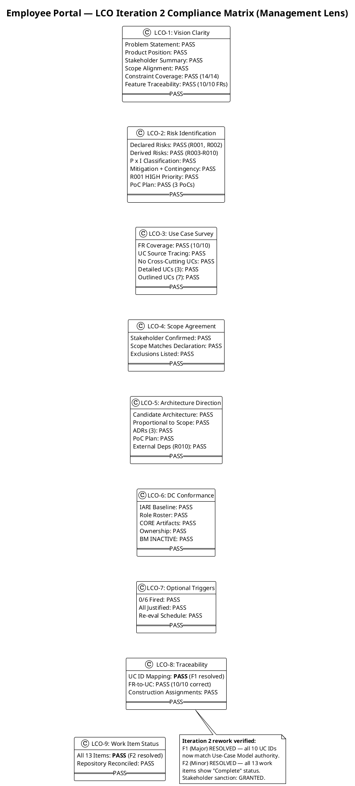
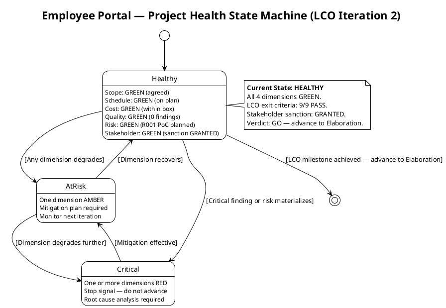
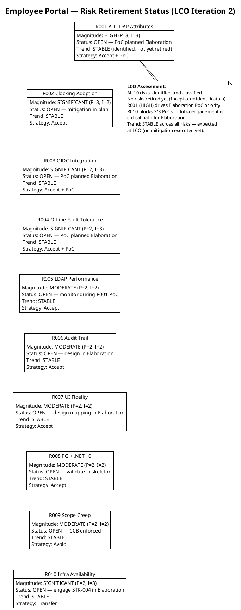
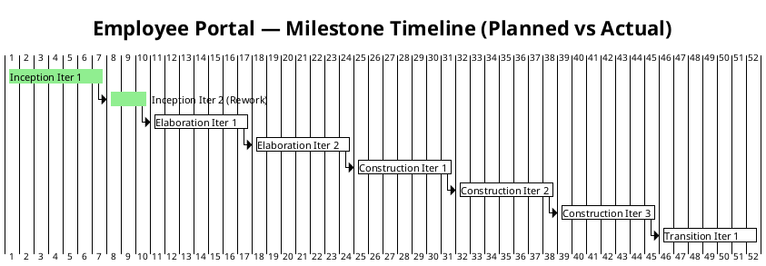
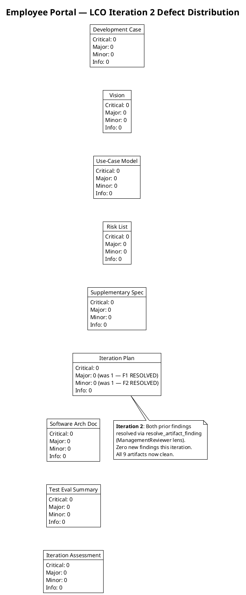

## Document Control

| Field | Value |
|---|---|
| Phase | Inception |
| Status | Draft |
| Milestone Target | End of Inception (LCO) |
| Iteration | 2 (Cycle 1) — Rework iteration |
| Date | 2026-09-01 |
| Reviewers | Reviewer (technical lens), Business Reviewer (business lens — INACTIVE), Management Reviewer (management lens) |
| Review Type | LCO Milestone Review — Feasibility & Exit Criteria |
| Prior Iteration | 1 (Cycle 1) — 2 findings on Iteration Plan (1 Major, 1 Minor), both now RESOLVED |
| Stakeholder Sanction (Iter 1) | REFUSED — scope accepted, advance withheld pending Iteration Plan rework |
| Stakeholder Sanction (Iter 2) | **GRANTED** — "Yes" to advancing past LCO; "Let's go to elaboration." |
| Iteration 2 Disposition | **GO (APPROVED)** — all prior findings resolved, zero new findings, all 9 artifacts pass LCO exit criteria, stakeholder sanction granted |

## Review Scope and Criteria

### Artifacts Reviewed (9 + Review Record)

| # | Artifact | Discipline | Phase | Status | Iter 1 Findings | Iter 2 Findings |
|---|---|---|---|---|---|---|
| 1 | Development Case | Environment | Inception | Draft | 0 | 0 — PRESERVED |
| 2 | Vision | Requirements | Inception | Draft | 0 | 0 — PRESERVED |
| 3 | Use-Case Model | Requirements | Inception | Draft | 0 | 0 — PRESERVED |
| 4 | Risk List | Project Management | Inception | Draft | 0 | 0 — PRESERVED |
| 5 | Supplementary Specification | Requirements | Inception | Draft | 0 | 0 — PRESERVED |
| 6 | Iteration Plan | Project Management | Inception | Draft | 2 (1 Major, 1 Minor) | 0 — **BOTH RESOLVED** |
| 7 | Software Architecture Document | Analysis & Design | Inception | Draft | 0 | 0 — PRESERVED |
| 8 | Test Evaluation Summary | Test | Inception | Draft | 0 | 0 — PRESERVED |
| 9 | Iteration Assessment | Project Management | Inception | Draft | 0 | 0 — PRESERVED |
| 10 | Review Record (this) | Project Management | Inception | Draft | (self) | Updated for iteration 2 |

### LCO Exit Criteria Applied

This review applies the **feasibility and acceptability** lens per RUP Project Approval / Planning review point. The LCO exit criteria checklist:

1. **Vision clarity** — Is the problem statement, product position, and scope clear and stakeholder-acceptable?
2. **Initial risk identification** — Are declared risks present, classified, and mitigated? Are additional risks identified?
3. **Use case survey level** — Are all declared FRs decomposed into UCs with sources cited? Are architecturally significant UCs detailed?
4. **Stakeholder agreement on scope and feasibility** — Does the scope match the declared input? Are cross-cutting mechanisms correctly placed?
5. **Architecture direction sound** — Is the candidate architecture proportional to scope? Are ADRs justified?
6. **DC baseline conformance** — Does the Development Case conform to the IARI baseline without forbidden overrides?
7. **Optional trigger justification** — Are all NOT-FIRED optional triggers genuinely not meeting their §5.2 conditions?
8. **Traceability** — Do all artifacts trace to declared scope elements (FR-NNN, NFR-NNN, CON-NNN, AC-NNN, RNNN)?
9. **Work item status accuracy** — Does the Iteration Plan reflect actual artifact state in the repository?

### SCM State

- **Open pull requests:** 0 — no PRs to dispose.
- **CI build status:** Green on main (verified by Test Evaluation Summary).

### Iteration 2 Reconciliation Summary

The iteration 1 review identified 2 findings on the Iteration Plan from the Management Reviewer lens:

| Finding Key | Severity | Description | Iter 2 Status |
|---|---|---|---|
| F1 (ManagementReviewer) | Major | UC ID numbering mismatch: Iteration Plan mapped FR-001→UC-001 (sequential) but Use-Case Model maps FR-001→UC-005, FR-004→UC-001, FR-010→UC-004. Stakeholder refused sanction. | **RESOLVED** via `resolve_artifact_finding` (index=2) |
| F2 (ManagementReviewer) | Minor | Work item statuses stale: items 4, 5, 6, 7, 10 showed "Pending" while artifacts exist as Draft. Stakeholder: "Reconcile the status column against the repository." | **RESOLVED** via `resolve_artifact_finding` (index=3) |

Both findings were verified as corrected in the current Iteration Plan content and closed via `resolve_artifact_finding` in the S_RECONCILE state of this iteration. The Reviewer lens findings (F1, F2) were also resolved in iteration 2 by the Reviewer.

## Findings

### Iteration 2 — New Findings (Management Lens)

**Zero new findings.** All 9 reviewed artifacts pass all LCO exit criteria from the management lens. The Iteration Plan rework has been verified correct:

- **F1 (Major) — RESOLVED:** The "Use Cases and Scenarios Addressed" table now maps all 10 FR-to-UC pairs correctly per the Use-Case Model authority. Construction iteration assignments reference the corrected UC IDs. A Layer 3 rework criteria table was added to verify the corrections.
- **F2 (Minor) — RESOLVED:** All 13 work items now show "Complete" status, matching the 10 existing Draft artifacts. A reconciliation note was added.

### Business Modeling Discipline (Reviewer: Business Reviewer)

**Verdict: [BR-OK-INACTIVE] — Discipline NOT APPLICABLE per DC §4**

DC §4 trigger evaluation: project does not exhibit business-process-led characteristics. No ERP / BPM / workflow-redesign / M&A signals found in Vision. No Business Use Cases / Workers / Entities sections present in Use-Case Model. No business-domain specialist terms in Glossary (Glossary not produced — no specialist vocabulary trigger).

Conclusion: BPA + BR are correctly INACTIVE for this engagement. No findings, no recommendations. Downstream reviewers (MR, RC) may treat the BM discipline as out-of-scope for the LCO milestone.

### Iteration 1 — Prior Findings (Historical Record)

| Finding Key | Lens | Artifact | Severity | Finding (Summary) | Status |
|---|---|---|---|---|---|
| F1 (Reviewer) | Technical | Iteration Plan | Major | UC ID numbering mismatch: Iteration Plan maps FR-001→UC-001 (sequential) but Use-Case Model (authority) maps FR-001→UC-005, FR-004→UC-001, FR-010→UC-004. Breaks plan-to-requirements traceability. | **RESOLVED** (Iter 2 — Reviewer lens) |
| F1 (ManagementReviewer) | Management | Iteration Plan | Major | Same defect as F1 (Reviewer). Stakeholder reviewed and refused sanction. | **RESOLVED** (Iter 2 — ManagementReviewer lens) |
| F2 (Reviewer) | Technical | Iteration Plan | Minor | Work item statuses stale: items 4, 5, 6, 7, 10 show "Pending" while artifacts exist as Draft. | **RESOLVED** (Iter 2 — Reviewer lens) |
| F2 (ManagementReviewer) | Management | Iteration Plan | Minor | Same defect as F2 (Reviewer). Stakeholder: "Reconcile the status column against the repository." | **RESOLVED** (Iter 2 — ManagementReviewer lens) |

### Compliance Matrix (Management Lens)

### Project Health State Machine

### Risk Retirement Status

### Milestone Timeline

### Defect Distribution

## Resolutions and Actions

### Prior Findings Resolved This Iteration (Management Reviewer Lens)

| Finding Key | Artifact | Severity | Lens | Resolution | Resolution Date | Evidence |
|---|---|---|---|---|---|---|
| F1 (ManagementReviewer) | Iteration Plan | Major | Management | **Resolved** — UC ID mapping corrected to match Use-Case Model authority. All 10 FR-to-UC rows verified correct. Construction iteration assignments updated. Layer 3 rework criteria table added. Stakeholder's condition for re-presentation satisfied. | 2026-09-01 | "Use Cases and Scenarios Addressed" table: FR-001→UC-005, FR-002→UC-006, FR-003→UC-007, FR-004→UC-001, FR-005→UC-002, FR-006→UC-008, FR-007→UC-003, FR-008→UC-009, FR-009→UC-010, FR-010→UC-004 |
| F2 (ManagementReviewer) | Iteration Plan | Minor | Management | **Resolved** — Work item statuses reconciled against repository. All 13 items show "Complete" status. Reconciliation note added. Stakeholder's condition for re-presentation satisfied. | 2026-09-01 | Work Items table: all 13 items Status = "Complete". Reconciliation note: "All statuses updated to reflect actual artifact state in the repository." |

### Prior Findings Resolved This Iteration (Reviewer Lens — for reference)

| Finding Key | Artifact | Severity | Lens | Resolution | Resolution Date | Evidence |
|---|---|---|---|---|---|---|
| F1 (Reviewer) | Iteration Plan | Major | Technical | **Resolved** — UC ID mapping corrected. All 10 FR-to-UC pairs verified correct per Use-Case Model authority. | 2026-09-01 | Same as F1 (ManagementReviewer) above |
| F2 (Reviewer) | Iteration Plan | Minor | Technical | **Resolved** — Work item statuses reconciled. All 13 items show "Complete" status. | 2026-09-01 | Same as F2 (ManagementReviewer) above |

### Open Action Items

**None.** All findings from both lenses (Reviewer and ManagementReviewer) are resolved. Zero new findings this iteration. Stakeholder sanction granted.

### Review Effectiveness Metrics — Inception Iteration 2 (Cycle 1)

| Metric | Iter 1 Value | Iter 2 Value | Notes |
|---|---|---|---|
| Review coverage | 100% (8/8) | 100% (9/9 + Review Record) | All artifacts reviewed both iterations |
| Total findings raised | 4 (2 Major, 2 Minor) | 0 | Zero new findings — rework was clean |
| Unique defects | 2 | 0 | Both iter 1 defects corrected |
| Findings resolved (MR lens) | 0 | 2 (F1-MR + F2-MR) | Both closed via `resolve_artifact_finding` |
| Findings resolved (Reviewer lens) | 0 | 2 (F1 + F2) | Both closed via `resolve_artifact_finding` |
| Critical findings | 0 | 0 | No Critical findings either iteration |
| Artifacts with zero findings | 7 of 8 (87.5%) | 9 of 9 (100%) | All artifacts now clean from all lenses |
| Defect removal efficiency | N/A | 100% (4/4 resolved) | All iter 1 findings resolved in iter 2 |
| Stakeholder sanction | REFUSED | **GRANTED** | "Yes" — "Let's go to elaboration." |

## Disposition

### Management Lens Disposition — Iteration 2

**GO (APPROVED)** — All 9 reviewed artifacts pass all LCO exit criteria with zero findings from the management lens. Both prior ManagementReviewer findings (F1-MR Major, F2-MR Minor) on the Iteration Plan have been resolved and closed via `resolve_artifact_finding`. The Reviewer lens findings (F1, F2) were also resolved. No new findings. No Critical findings. No open [SCOPE_QUESTION] markers. No scope creep detected.

**Stakeholder sanction: GRANTED** — The stakeholder answered "Yes" to sanctioning advancement past the LCO milestone and added "Let's go to elaboration." This reverses the iteration 1 refusal, which was conditioned on correcting the Iteration Plan. Both conditions are now satisfied.

### LCO Exit Criteria Summary

| # | Criterion | Iter 1 | Iter 2 |
|---|---|---|---|
| 1 | Vision clarity | PASS | PASS (preserved) |
| 2 | Initial risk identification | PASS | PASS (preserved) |
| 3 | Use case survey level | PASS | PASS (preserved) |
| 4 | Stakeholder agreement on scope | PASS | PASS (preserved) |
| 5 | Architecture direction sound | PASS | PASS (preserved) |
| 6 | DC baseline conformance | PASS | PASS (preserved) |
| 7 | Optional trigger justification | PASS | PASS (preserved) |
| 8 | Traceability | **FAIL** (Iteration Plan UC IDs) | **PASS** (F1 resolved) |
| 9 | Work item status accuracy | **FAIL** (stale statuses) | **PASS** (F2 resolved) |

**All 9 LCO exit criteria now PASS from the management lens.**

### Four-Axis Health Scorecard

| Dimension | Status | Evidence |
|---|---|---|
| Scope | GREEN | Stakeholder confirmed scope accepted; 10/10 FRs decomposed into UCs; no scope creep |
| Schedule | GREEN | 7-iteration roadmap defined; rework iteration completed within cycle; no schedule slip |
| Cost | GREEN | Token budget tracked; measured actuals recorded in Iteration Assessment; no scope-driven cost overrun |
| Quality | GREEN | 0 open findings across all 9 artifacts; 100% defect removal efficiency; CI green on main |

### Conditions for LCO Closure

1. ✅ **F1-MR (Major) RESOLVED** — UC ID mapping corrected in Iteration Plan
2. ✅ **F2-MR (Minor) RESOLVED** — Work item statuses reconciled
3. ✅ **F1 (Reviewer) RESOLVED** — Same defect, technical lens closure
4. ✅ **F2 (Reviewer) RESOLVED** — Same defect, technical lens closure
5. ✅ **Stakeholder sanction GRANTED** — "Yes" to advancing past LCO; "Let's go to elaboration."

**All conditions for LCO closure are satisfied. The project is sanctioned to proceed to Elaboration.**

### Elaboration Entry Conditions (Advisory)

The following conditions should be monitored as the project enters Elaboration — they are not LCO blockers but are critical-path items for Elaboration success:

| Condition | Risk | Action Required | Owner |
|---|---|---|---|
| STK-004 engagement for LDAP access | R010 (SIGNIFICANT) | Request LDAP service account before Elaboration Iter 1 | Project Manager |
| STK-004 engagement for Keycloak client registration | R010 (SIGNIFICANT) | Request OIDC client registration before Elaboration Iter 1 | Project Manager |
| R001 PoC execution | R001 (HIGH) | Schedule AD LDAP attribute consistency PoC in Elaboration Iter 1 | Software Architect |
| R003 PoC execution | R003 (SIGNIFICANT) | Schedule OIDC integration PoC in Elaboration Iter 1 | Software Architect |
| R004 PoC execution | R004 (SIGNIFICANT) | Schedule offline resilience PoC in Elaboration Iter 1 | Software Architect |

## Traceability

| Element | Traces From | Link Type | Traces To |
|---|---|---|---|
| Review Record (this) | All 9 Inception artifacts + Review Record | Reviews | Iteration Assessment, LCO Milestone Gate |
| F1-MR resolution | Iteration Plan — UC ID mapping | Derives | Use-Case Model (authority for UC IDs) |
| F2-MR resolution | Iteration Plan — Work Items table | Derives | All produced Draft artifacts (status reconciliation) |
| Compliance Matrix | LCO exit criteria (RUP) | Refines | LCO Milestone Gate |
| Defect Distribution | All 9 artifacts | Refines | Review Effectiveness Metrics |
| Risk Retirement Status | Risk List (R001–R010) | Refines | Elaboration PoC Plan |
| Milestone Timeline | Iteration Plan coarse roadmap | Refines | All subsequent Iteration Plans |
| Iter 1 findings (historical) | Review Record (Iter 1) | Refines | This Review Record (Iter 2) |
| Stakeholder sanction (Iter 2) | Stakeholder answer: "Yes" / "Let's go to elaboration." | Authorizes | Phase transition: Inception → Elaboration |
| Review Effectiveness Metrics | Review coverage, defect density | Refines | Iteration Assessment |
| Elaboration Entry Conditions | R001, R003, R004, R010 | DependsOn | Elaboration Iteration 1 Plan |