## Document Control
| Field | Value |
|---|---|
| Phase | Elaboration |
| Status | **Consolidated — cumulative across iterations. Elaboration Iter 1 Cycle 1 record (Code Reviewer + Reviewer + Business Reviewer + Management Reviewer lenses + Review Coordinator consolidation) PRESERVED below — never overwritten. Elaboration Iter 2 Cycle 1 (convergence cycle) — technical-lens + business-lens + management-lens re-reviews + coordinator consolidation + stakeholder contribution PRESERVED below. Elaboration Iter 3 Cycle 1 — code-review-lens record (Code Reviewer: 3 mechanism PRs opened base iteration/E1, 3 APPROVED terminal dispositions, F-CR-E1-1/F-CR-E1-2 resolved, F-CR-E3-1/2/3 recorded) PRESERVED below. Elaboration Iter 3 Cycle 1 — technical-lens LCA re-review record (Reviewer): 6 of 6 prior findings RESOLVED (incl. SAD F2 Critical on OBSERVED evidence), 5 new record-propagation findings (1 Major + 4 Minor), actions A-32…A-36 assigned, R6 path stakeholder-confirmed — PRESERVED below. Elaboration Iter 3 Cycle 1 — business-lens LCA re-review record (Business Reviewer): BR-OK-INACTIVE SUSTAINED, zero findings, zero BM conditions — PRESERVED below. Elaboration Iter 3 Cycle 1 — management-lens LCA re-review record (Management Reviewer — PRA): 4 of 4 prior findings RESOLVED via `resolve_artifact_finding` (incl. Iteration Plan F3 Critical on OBSERVED evidence), 1 new Minor (F8), CONDITIONAL GO verdict, LCA compliance table 4 of 6 MET, risk retirement state machine (R001/R003/R004 VALIDATION OBSERVED), health scorecard (Scope GREEN / Schedule AMBER / Cost GREEN / Quality AMBER) — PRESERVED below. Elaboration Iter 3 Cycle 1 — Review Coordinator consolidated milestone disposition: all three lenses EXECUTED per the Work Order (authoritative); verified findings ledger swept across ALL 13 artifacts — [FINDINGS] read=13, unread=none, open Critical=0 (first zero-Critical state of the phase), open Major=1 (Architectural Proof-of-Concept#F2), open Minor=5 (Development Case#F3, Iteration Plan#F8, Software Architecture Document#F4, Test Evaluation Summary#F2, Test Case#F1) + 3 narrative-tracked Code Reviewer Minors (F-CR-E3-1/2/3, Construction scope); 12 closures this cycle (10 ledger + 2 narrative — the highest closure velocity of the phase, both persisting Criticals closed on OBSERVED evidence); Consolidated Finding Tracker updated (9 tracked findings, all owned, 0 overdue); Review Effectiveness Metrics updated (DRE first measurement: review-first confirmed — all code defects caught at the PR gate, zero test failures; recurrence rate 0 of 12); consolidated verdict NO-GO CONFIRMED — the substantive blocker RETIRED, the phase auto-iterates into the record-propagation pass (A-32…A-36 + PM close-pass) toward the R6 re-presentation; verdict decision-flow diagram + record-propagation execution-order diagram embedded and validated; **stakeholder contribution at the verdict gate ANSWERED and folded — verbatim: "nothing else new" — contribution cycle CLOSED**. Elaboration Iter 4 Cycle 1 — code-review-lens record (Code Reviewer): PR #7 (F-CR-E3-3 state-comment remediation, feature/E4-R003-state-comment → iteration/E4) reviewed under CR-1…CR-7 — APPROVED (review 5090059324, CI GREEN run 33632200967); F-CR-E3-3 RESOLVED (all three overstated-CSRF comment locations corrected with the honest [DEFERRED — lands with the session mechanism, Construction] marker); F-CR-E3-1/2 remain open (Construction-scope / Designer-owned); zero new findings — PRESERVED below. Elaboration Iter 4 Cycle 1 — technical-lens LCA re-review record (Reviewer): 5 of 5 prior findings of this lens RESOLVED via `resolve_artifact_finding` (Architectural Proof-of-Concept#F2 Major — the A-32 observed-results ledger verified first-hand, the R6 evidence-package core ASSEMBLED; Software Architecture Document#F4, Test Case#F1, Test Evaluation Summary#F2, Development Case#F3 — actions A-32…A-36 ALL verified landed this pass), 3 NEW record-propagation findings recorded (1 Major: Test Evaluation Summary#F3 — stale remainder-enumerations vs the same-pass landings, the mission-verdict record contradicts the observed state of four artifacts; 2 Minor: Architectural Proof-of-Concept#F3 — CONTRIBUTING.md sha cited c86ebf7 vs the verified 90e4f2e; Development Case#F4 — three stale A-32/PM-close-pass status claims), actions A-37…A-39 assigned with owners, in-scope open PR set ∅ (verified — every PR that entered the phase left the gate with a terminal verdict; nothing to sanction or withhold on), sanction STILL WITHHELD per the stakeholder's binding all-findings directive — the ledger is not empty — PRESERVED below. Elaboration Iter 4 Cycle 1 — business-lens LCA re-review record (Business Reviewer): BR-OK-INACTIVE SUSTAINED — fourth consecutive LCA-cycle verification (DC §4 re-record 2026-09-02 independently re-verified against the Vision and the Use-Case Model Iter 4 revision; findings ledger re-swept — Vision, Use-Case Model, Supplementary Specification, Review Record all empty; zero BusinessReviewer findings project-wide); zero findings, zero recommendations, zero BM conditions on the R6 re-presentation gate; record anchored in § Review Scope and Criteria (combined-record pattern, Iter 3 precedent) — PRESERVED below. Elaboration Iter 4 Cycle 1 — management-lens LCA re-review record (Management Reviewer — PRA): 1 of 1 prior MR finding RESOLVED via `resolve_artifact_finding` (Iteration Plan#F8 Minor — the STK-004 written-request obligation closes on the verified close-pass remediation: concrete blocker recorded in FOUR locations, obligation CARRIED to Construction Iter 1 with R010's own trigger — commitment tracking fixed by evidence of the blocker, not a fourth restatement); **this lens's findings ledger is EMPTY — every ManagementReviewer finding ever emitted on this project is resolved (Inception Iteration Plan F1/F2; Elaboration Iteration Plan F3/F4/F5/F6/F7/F8, Risk List F1/F2)**; ZERO new findings (the management artifacts are clean — pass plan sound, box by content class, statuses honest at plan-build, retirement recorded, R010 relocated, R012 measured); CONDITIONAL GO verdict SUSTAINED with the condition set NARROWED (A-32 DISCHARGED; conditions now A-37 Major + A-38/A-39 Minor + ledger-empty + the R6 gate); LCA compliance table 5 of 6 MET (LCA-5 the gate's own pending decision); risk retirement state machine — the HIGH-magnitude risk line TERMINATES (OPEN → MITIGATING → VALIDATION OBSERVED → RETIRED, recorded); health scorecard (Scope GREEN / Schedule AMBER / Cost GREEN / Quality AMBER — IMPROVING); record anchored in § Review Scope and Criteria (business-lens Iter 4 precedent, truncation-risk rationale recorded) — PRESERVED below. Elaboration Iter 4 Cycle 1 — Review Coordinator consolidated milestone disposition: all four lenses EXECUTED per the Work Order (authoritative — Technical/Reviewer, Business/BusinessReviewer, Management/ManagementReviewer, Code Reviewer); verified findings ledger swept across ALL 13 artifacts — [FINDINGS] read=13, unread=none, open Critical=0 (HELD — second consecutive cycle), open Major=1 (Test Evaluation Summary#F3), open Minor=2 (Architectural Proof-of-Concept#F3, Development Case#F4) + 2 narrative-tracked Code Reviewer Minors (F-CR-E3-1/2 — Construction-scope/Designer-owned, carried with recorded owners); 7 closures this cycle (6 ledger — 5 Reviewer-lens + 1 Management-lens; 1 narrative — Code Reviewer F-CR-E3-3); Consolidated Finding Tracker updated (5 tracked findings, all owned, 0 overdue); Review Effectiveness Metrics updated (DRE SECOND measurement: review-first HELD — PR #7 clean, regression baseline 15/0/8 held; recurrence rate 0 of 7 — second consecutive zero; severity profile collapsed 4 Critical → 0 across four cycles); consolidated verdict NO-GO CONFIRMED — the R6 evidence package ASSEMBLED (its core, the PoC observed-results ledger, landed and ledger-closed this cycle), the phase AUTO-ITERATES into the final record-correction pass (A-37…A-39 + PM pass-close) toward the R6 re-presentation; verdict decision-flow diagram + final record-correction execution-order diagram embedded and validated; **stakeholder contribution at the verdict gate ANSWERED and folded — verbatim: "Close all findings and issues opened" — the answer REINFORCES the standing all-findings directive and extends it to the open SCM issues (Issue #9 closes on the verified A-32 evidence; Issues #1/#2 already closed); contribution cycle CLOSED; the milestone auto-iteration (requiresIteration: TRUE) recorded immediately after the folding**. Elaboration Iter 5 Cycle 1 — code-review-lens record (Code Reviewer): S1 GUARD FIRED — 0 ready-for-review branches, 0 open PRs (both verified first-hand); main GREEN run 33639518709 (completed 2026-09-02 14:04:14Z); repo tree unchanged vs the Iter 4 verified state (85 entries, mechanism code present in Infrastructure/, Services/, tests/ with fixtures); disposition **No-PRs-To-Review** recorded as the cycle's terminal outcome — the checklist CR-1…CR-7 is PREPARED, not waived (Construction feature PRs inherit it in full); F-CR-E3-1/2 re-examined against the observed tree and carried unchanged (Construction-scope/Designer-owned, recorded owners, non-Elaboration-blocking per the stakeholder's framing directive); ZERO new findings of any severity; the two Work Order CRs ([Moderate] Architectural Proof-of-Concept, [Moderate] Test Evaluation Summary) cross-checked — record-propagation class tracing to PoC F3/A-38 (Software Architect) and TES F3/A-37 (Test Manager), neither a code handoff, neither an artifact this lens owns, neither entering the PR gate — their landing verification belongs to the technical lens; the code-review gate is CLOSED for this cycle (no ready-for-review branch and no open PR remains unreviewed) — PRESERVED below. Elaboration Iter 5 Cycle 1 — technical-lens LCA re-review record (Reviewer): 3 of 3 prior findings of this lens RESOLVED via `resolve_artifact_finding` (Architectural Proof-of-Concept#F3 Minor — the A-38 sha citation corrected to the verified file sha 90e4f2e1b91bdb64082dcc9f75a4b32c3cc10f80, read first-hand on main; Test Evaluation Summary#F3 Major — the A-37 remainder-enumerations updated from the observed same-pass landings, INC-1 bottleneck RESOLVED, the mission verdict correct and unchanged; Development Case#F4 Minor — the A-39 three status claims corrected to the observed state) — the two Work Order CRs are DISCHARGED on this verification; 2 NEW findings recorded (1 Major: Test Evaluation Summary#F4 — five locations still enumerate A-38/A-39 as remaining while both landed and ledger-closed this same pass, the R014 self-propagation class, trigger FIRED exactly as registered; 1 Minor: Development Case#F5 — the Milestone Target enumerates A-37/A-38 as remaining while both landed and ledger-closed), actions A-40/A-41 assigned with owners; in-scope open PR set ∅ (verified — nothing to sanction or withhold on); zero open SCM issues (#1/#2/#9 all cr:complete — the stakeholder's "Close all findings and issues opened" directive satisfied on the issues side); sanction STILL WITHHELD per the stakeholder's binding all-findings directive — the ledger is not empty (1 Major + 1 Minor, both record-propagation class, both quick corrections) — record anchored in § Review Scope and Criteria (Iter 4/Iter 5 lens precedent) — PRESERVED below. Elaboration Iter 5 Cycle 1 — business-lens LCA re-review record (Business Reviewer): BR-OK-INACTIVE SUSTAINED — fifth consecutive LCA-cycle verification (DC §4 re-record 2026-09-02 independently re-verified against the Vision and the Use-Case Model current Iter 4 revision; findings ledger re-swept — Vision, Use-Case Model, Supplementary Specification, Review Record all empty; zero BusinessReviewer findings project-wide); zero findings, zero recommendations, zero BM conditions on the R6 re-presentation gate; record anchored in § Resolutions and Actions (same-lens Iter 1/Iter 2 precedent; truncation-risk rationale recorded in the record's revision note) — PRESERVED below. Elaboration Iter 5 Cycle 1 — management-lens LCA re-review record (Management Reviewer — PRA): prior-findings reconciliation executed in the dedicated closure state — read_artifact_findings ×3 (Iteration Plan: 11 findings ALL resolved; Risk List: 3 findings ALL resolved; Iteration Assessment: empty) — [PLAN] TOTAL: 0, [EXIT] closed=0/deferred=0/rejected=0/left-open=0 of 0; **this lens's findings ledger is EMPTY, re-verified first-hand this cycle via the findings system — every ManagementReviewer finding ever emitted on this project is resolved**; ZERO new findings ([PLAN] management artifacts with NEW defects at LCA: NONE — the Iteration Plan's final record-correction pass plan is sound (box ~21,000K by content class with the re-review tax priced IN; same-pass discipline as exit criterion 4; R014 registered with its trigger, which FIRED exactly as predicted — the registration VALIDATED, not defecting it), the Risk List Iter 5 plan-build reappraisal is sound (R014 P=3/I=2 justified; R012 IMPROVED on measured actuals; retirement records terminal), the SAD management aspects current, the Iteration Assessment excluded per review-point rules); Part 1 Project Planning Review — feasibility PASS on all eight dimensions; Part 2 LCA compliance table 5 of 6 MET (LCA-5 the gate's own pending decision — held); risk retirement state diagram — the HIGH-magnitude lines TERMINAL, R014's trigger fired as registered with its contingency operative (the R6 entry gate re-opens the PASS, not the phase); defect distribution (this lens: zero open; Reviewer lens: 1 Major + 1 Minor, both R014 class; Critical ZERO held third consecutive cycle); health scorecard (Scope GREEN / Schedule AMBER / Cost GREEN / Quality AMBER — IMPROVING); **CONDITIONAL GO verdict SUSTAINED — architecture ACCEPTED; phase transition CONDITIONAL on the R6 gate; the condition set TURNS OVER (A-37/A-38/A-39 DISCHARGED — the two Work Order CRs DISCHARGED on the Reviewer lens's verified landings; A-40 Major + A-41 Minor NEW, born of this pass's own landings; ledger-empty + the R6 gate remain)**; stakeholder consultation: none owed from this lens; record anchored in § Resolutions and Actions (same-iteration business-lens precedent with its recorded truncation-risk rationale); read-back verification executed after the upsert (SHA 95a4441 — all preserved subsections confirmed present, no content lost). Elaboration Iter 5 Cycle 1 — Review Coordinator consolidated milestone disposition: all four lenses EXECUTED per the Work Order (authoritative — Technical/Reviewer, Business/BusinessReviewer, Management/ManagementReviewer, Code Reviewer); verified findings ledger swept across ALL 13 artifacts — [FINDINGS] read=13, unread=none, open Critical=0 (HELD — third consecutive cycle), open Major=1 (Test Evaluation Summary#F4), open Minor=1 (Development Case#F5) + 2 narrative-tracked Code Reviewer Minors (F-CR-E3-1/2 — Construction-scope/Designer-owned, carried with recorded owners); 3 closures this cycle (all Reviewer lens — PoC#F3, TES#F3, DC#F4; the two Work Order CRs DISCHARGED among them); Consolidated Finding Tracker updated (4 tracked findings, all owned, 0 overdue); Review Effectiveness Metrics updated (DRE THIRD measurement: review-first HELD — no code entered the tree, regression baseline 15/0/8 held on main run 33639518709; recurrence rate 0 of 3 — third consecutive zero; severity profile 4 Critical → 0 held across Iters 3–5); consolidated verdict NO-GO CONFIRMED — the phase AUTO-ITERATES into the R014 record-correction cycle (A-40/A-41 + PM pass-close) toward the R6 re-presentation; the R014 self-propagation trigger fired exactly as the Risk List registered, its contingency operative (the R6 entry gate re-opens the PASS, not the phase — the class's cost bounded at one pass per occurrence); verdict decision-flow diagram + R014 record-correction execution-order diagram embedded and validated (generate_uml OK before embedding); record anchored in § Disposition (the Iter 1/Iter 2/Iter 3 coordinator precedent home — § Review Scope and Criteria declined on truncation-risk grounds, rationale recorded in the record's revision note); read-back verification executed after the upsert (SHA 00f72799 — all preserved subsections confirmed present, no content lost); **stakeholder contribution at the verdict gate ANSWERED and folded — verbatim: "No, please fix all findings" — the "No" closes the contribution question (nothing to add for the next pass: no missed requirement, no correction, no priority) and "please fix all findings" REINFORCES the standing all-findings directive (Iter 1 verbatim: "Please fix all the findings even if they are minors prior to move to next phase"; escalation resolution: "Fix all the issues and close all findings"; Iter 4: "Close all findings and issues opened") — the answer adds NO new scope, NO correction, NO priority beyond the standing record; contribution cycle CLOSED; the milestone auto-iteration (requiresIteration: TRUE) recorded immediately after the folding**. Elaboration Iter 6 Cycle 1 — code-review-lens record (Code Reviewer): S1 GUARD FIRED — 0 ready-for-review branches, 0 open PRs (both verified first-hand); all-PR census 7, ALL closed/merged — TWO NEW since the Iter 5 census: PR #8 (E4-close, iteration/E4 → main) and PR #10 (E5-close, iteration/E5 → main), both verified APPROVED before merge via scm_get_pull_request_review_state (the Integrator's APPROVED-only merge precondition held on every merge of the phase); PR #8 diff = ci.yml integration record + the F-CR-E3-3 comment corrections (APPROVED as PR #7, review 5090059324) — comment-only, no new product surface; PR #10 diff = documentation only (docs/implementation-model.md, the reverse-engineered Implementation Model per DC §6.1, + docs/integration-records/e5-close.md) — no build impact; main GREEN run 33658332611 (completed 2026-09-02 17:01:01Z, post-#10); repo tree 88 entries (was 85 — the growth is the E5-close documentation; the mechanism code in Infrastructure/, Services/ and tests/ is unchanged); iteration/E6 has no CI runs (no integration content this cycle); disposition **No-PRs-To-Review** recorded as the cycle's terminal outcome — the checklist CR-1…CR-7 is PREPARED, not waived (Construction feature PRs inherit it in full); **F-CR-E3-2 RESOLVED — the narrative closure executed by this lens on first-hand verification** (the Design Model § Interface Contracts read this cycle: INT-011 carries ALL FOUR IAuthProvider operations — ConfigureOidc, BuildAuthorizeRedirectUrl, HandleOidcCallbackAsync, GetAuthenticatedUserAsync — each with preconditions/postconditions, verified against the merged code sha 8758844f, with the state-parameter semantics aligned to the F-CR-E3-3-corrected code and the honest [DEFERRED — session mechanism, Construction] marker; the Designer-owned remediation landed at the Iter 4 evolution + Iter 5 verification pass; the Iter 5 technical-lens record assigned the narrative closure to this lens on its own verification); F-CR-E3-1 re-examined and carried unchanged (Construction-scope — the interim ClockingsRepository.cs verified still present; the Design Model INT-016 row confirms the interim is a test-seam realization of the final contract; the E5-close Implementation Model carries the same disposition with the recorded owner; PG adapter lands Construction Iter 1 per R008); ZERO new findings of any severity; the two Work Order CRs cross-checked — DISCHARGED at Iter 5 per the technical-lens record; the current open remainder (TES F4 Major → A-40, Test Manager; DC F5 Minor → A-41, Process Engineer) is record-propagation class, neither a code handoff, neither an artifact this lens owns, neither entering the PR gate — landing verification owned by the technical lens; the code-review gate is CLOSED for this cycle (no ready-for-review branch and no open PR remains unreviewed; every PR that entered the phase across Iters 1–6 left the gate with a terminal verdict and is MERGED) — PRESERVED below. Elaboration Iter 6 Cycle 1 — technical-lens LCA re-review record (Reviewer — THIS REVISION): S1 discovery executed [list_artifacts → 13 artifacts; scm_list_pull_requests open → 0 PRs]; S_RECONCILE executed [read_artifact_findings ×12 → 2 prior findings of this lens with resolution==null (TES#F4 Major, DC#F5 Minor); read_artifact ×2 (TES, DC — reused in S2); resolve_artifact_finding ×2 — both returned ok: TES F4 RESOLVED on the first-hand A-40 landing verification (every named remainder-enumeration corrected; the mission verdict correct and unchanged), DC F5 RESOLVED on the first-hand A-41 landing verification (the Milestone Target corrected to the observed state per the DC's own same-pass discipline)]; S2 executed [all 13 artifacts evaluated against the artifact-type checklists; the live SCM census verified first-hand (scm_list_issues all states: Issues #11/#12 CLOSED cr:complete — their lifecycle transitions landed; Issue #14 OPEN cr:approved assigned:test-manager — the CR vehicle for the ledger-closed TES F4/A-40); the R014 TERMINATION TEST answered YES — 5 successor findings minted, ALL Minor, ALL the post-write staleness subclass (census and remainder records written earlier in the cycle, staled by the cycle's own later events: the A-40/A-41 landings, the Reviewer-lens ledger closures, and the SCM lifecycle transitions); 5 new findings emitted via record_artifact_finding (TES#F5, DC#F6, UCM#F1, SUP#F1, TC#F2); actions A-42…A-46 assigned with owners]; S3 executed [2 review diagrams validated via generate_uml BEFORE embedding — compliance matrix OK, defect distribution OK; PR disposition ∅-empty verified (zero open PRs; every PR of the phase left the gate APPROVED and merged); § Resolutions and Actions section-scoped upsert with the preserved content carried verbatim plus the new record (SHA d249c2a); this Document Control update in place; read-back verification executed after each upsert]; sanction STILL WITHHELD per the stakeholder's binding all-findings directive — the ledger is not empty (5 Minor, all post-write staleness subclass, all owned A-42…A-46) — record anchored in § Resolutions and Actions (the Iter 5 business-lens/management-lens precedent home; § Review Scope and Criteria — the Iter 5 technical-lens precedent home — re-examined and DECLINED on truncation-risk grounds: it has since absorbed the Iter 6 code-review-lens record and is by far the largest section of this cumulative artifact) — PRESERVED below |
| Milestone Target | End of Elaboration (LCA) — **NOT achieved; sanction still withheld — the R6 evidence package is ASSEMBLED and the remaining work is five quick census/remainder record corrections (A-42…A-46, all Minor, all the post-write staleness subclass) + Issue #14's cr:complete transition + the PM pass-close reconciliation + the R6 gate itself.** The empirical validation the stakeholder refused to accept on paper is OBSERVED (CI-traced execution results; R001 four-clause × four-consumer PASS) and RECORDED (Risk List close-pass reappraisal; PoC observed-results ledger — A-32 landed and ledger-closed). The R014 record-correction cycle delivered BOTH of its named corrections in full (A-40 TES — the one Major; A-41 DC — the one Minor; both landed and ledger-closed by the Reviewer lens on first-hand verification this cycle), and the two Work Order CRs ([Moderate] Architectural Proof-of-Concept, [Moderate] Test Evaluation Summary) are DISCHARGED. What withholds the sanction is the stakeholder's own standing all-findings directive — reinforced at the Iter 5 verdict gate, verbatim: "No, please fix all findings" — the ledger is not empty (5 Minor ledger findings, ALL the post-write staleness subclass of the R014 class: census and remainder records written earlier in the cycle, staled by the cycle's own later events — the A-40/A-41 landings, the Reviewer-lens ledger closures, and the SCM lifecycle transitions (Issues #11/#12 closed cr:complete; Issue #14 minted open as the CR vehicle for the ledger-closed TES F4/A-40); + 1 narrative Minor (F-CR-E3-1, Construction-scope with recorded owner). None requires code, design, or new validation; no validation substance is contradicted — the minting severity has collapsed to Minor-only census currency. **Re-presentation entry gate (coordinator-enforced, R6): empty findings ledger across ALL lenses and severities + evidence package (PoC observed-results ledger with the 8 BLOCKED cases stated per the stakeholder's framing directive: a recorded SCOPE decision, deferred to Construction, not missing) + corrections committed + fresh sanction request at R6.** Business lens (Iter 4, sustained Iter 5): zero BM conditions on this gate. Management lens (Iter 4, sustained Iter 5): CONDITIONAL GO SUSTAINED — architecture accepted; phase transition conditional on the R6 gate; the management-lens ledger is EMPTY. Code-review lens (Iter 6): gate CLOSED — No-PRs-To-Review, zero new findings, F-CR-E3-2 CLOSED (narrative ledger: 1 open Minor, F-CR-E3-1, Construction-scope with recorded owner); the two baseline-close PRs merged since Iter 5 (#8, #10) verified APPROVED before merge — the merge-gate discipline held on every merge of the phase; the implemented baseline on main is documented by the E5-close Implementation Model (PR #10, DC §6.1) that the LCA evidence package cites. Technical lens (Iter 6, this revision): the two named corrections A-40/A-41 LANDED and ledger-closed; the R014 termination test answered YES — 5 successor findings minted (all Minor, all post-write staleness subclass: TES#F5, DC#F6, UCM#F1, SUP#F1, TC#F2 — census and remainder currency only, no cross-artifact contradiction of validation substance); actions A-42…A-46 assigned; sanction STILL WITHHELD on the all-findings directive |
| Iteration | 6 (Cycle 1) — this revision appends the Iter 6 technical-lens record (Reviewer: S1 discovery executed [list_artifacts → 13 artifacts; scm_list_pull_requests open → 0 PRs]; S_RECONCILE executed [read_artifact_findings ×12 → 2 prior findings of this lens with resolution==null; read_artifact ×2 → TES, DC; resolve_artifact_finding ×2 — both returned ok: TES F4 Major RESOLVED on the first-hand A-40 landing verification, DC F5 Minor RESOLVED on the first-hand A-41 landing verification]; S2 executed [all 13 artifacts evaluated against the artifact-type checklists; the live SCM census verified first-hand — Issues #11/#12 CLOSED cr:complete, Issue #14 OPEN cr:approved assigned:test-manager; the R014 termination test answered YES — 5 successor findings minted, all Minor, all the post-write staleness subclass; 5 new findings emitted via record_artifact_finding (TES#F5, DC#F6, UCM#F1, SUP#F1, TC#F2); actions A-42…A-46 assigned with owners]; S3 executed [2 review diagrams validated via generate_uml BEFORE embedding — both OK; PR disposition ∅-empty verified; § Resolutions and Actions section-scoped upsert with the preserved content carried verbatim plus the new record (SHA d249c2a); this Document Control update in place; read-back verification executed after each upsert]) atop the Iter 6 code-review-lens record (Code Reviewer: S1 discovery executed in full [scm_list_branches_with_label ready-for-review → 0 branches; scm_list_pull_requests open → 0; scm_list_pull_requests all → 7, with PRs #8/#10 NEW since the Iter 5 census — both verified APPROVED via scm_get_pull_request_review_state, both diffs verified clean (comment-only + documentation); scm_get_repo_tree main → 88 entries, mechanism code unchanged, growth = the E5-close documentation; scm_get_build_status main → GREEN run 33658332611; scm_get_build_status iteration/E6 → no runs]; the F-CR-E3-2 narrative closure executed on the first-hand Design Model § Interface Contracts verification (INT-011 vs the merged code sha 8758844f); F-CR-E3-1 carried unchanged with its recorded Construction-scope disposition; zero new findings; the two Work Order CRs cross-checked — DISCHARGED at Iter 5, the current remainder TES F4/A-40 + DC F5/A-41 owned by the Test Manager and Process Engineer, landing verification owned by the technical lens; four diagrams validated via generate_uml BEFORE embedding [all OK]; § Review Scope and Criteria section-scoped upsert with the preserved content carried verbatim plus the new record [SHA c8e1a5c3]; read-back verification executed after the upsert — all preserved subsections confirmed present, no content lost) atop the Iter 5 Review Coordinator consolidated milestone disposition (Review Coordinator: S1 load executed [list_artifacts → 13 artifacts; Review Record read in full — the cumulative state, the Iter 5 lens records, the open findings ledger]; S4 milestone consolidation executed [read_artifact_findings ×13 — the verified ledger sweep: [FINDINGS] read=13, unread=none, open Critical=0, open Major=1 (Test Evaluation Summary#F4), open Minor=1 (Development Case#F5) + 2 narrative-tracked Code Reviewer Minors; lens participation consolidated — all four EXECUTED per the Work Order; the two Work Order CRs verified DISCHARGED on the Reviewer lens's ledger-closed landings; verdict decision-flow + R014 record-correction execution-order diagrams validated via generate_uml BEFORE embedding — both OK; § Disposition section-scoped upsert with the preserved content carried verbatim plus the new record (SHA 00f72799); read-back verification executed — all preserved subsections confirmed present, no content lost; the verdict-gate contribution question emitted in valid format, DELIVERED, and ANSWERED; the answer folded — verbatim: "No, please fix all findings" — the § Disposition marker replaced with the folded decision and the Traceability row updated (SHA 5098f9d); Document Control updated in place with the full preserved table plus the coordinator Iter 5 rows; the milestone auto-iteration (requiresIteration: TRUE) recorded immediately after the folding) atop the Iter 5 management-lens record (Management Reviewer — PRA: S1 load executed [list_artifacts → 13 artifacts; SAD, Iteration Plan, Risk List, Iteration Assessment, Review Record read in full — the Iter 5 Iteration Assessment absence expected per review-point rules, never a finding]; S_RECONCILE executed [read_artifact_findings ×3 → Iteration Plan 11 findings ALL resolved, Risk List 3 findings ALL resolved, Iteration Assessment empty — zero MR findings with resolution==null; [PLAN] TOTAL: 0; [EXIT] closed=0/deferred=0/rejected=0/left-open=0 of 0 — the lens ledger EMPTY, re-verified]; S2 planning feasibility assessed [all eight dimensions PASS — box ~21,000K by content class with the re-review tax priced IN]; S3 LCA criteria assessed [5 of 6 MET, LCA-5 the gate's own pending decision]; S_CONSULT determination: none owed [sanction question verbatim in the answered list; R6 path CONFIRMED; contribution cycle closed by the stakeholder; zero Critical; zero new stakeholder-only decisions]; S4 executed [4 assessment diagrams validated via generate_uml BEFORE embedding — LCA compliance table OK, risk retirement state OK, defect distribution OK, health scorecard OK; zero record_artifact_finding calls — clean = Approved; § Resolutions and Actions section-scoped upsert with the preserved content carried verbatim plus the new record (SHA 95a4441); read-back verification executed — all preserved subsections confirmed present, no content lost; Document Control updated in place with the full preserved table plus the management-lens Iter 5 rows]) atop the Iter 5 business-lens record (Business Reviewer: S1 inventory executed [list_artifacts → 13 artifacts; get_dc_classification → isBusinessProcessLed=false, ProcessEngineer re-record 2026-09-02, verdict unchanged from Inception and Elab Iters 1–4, no CR re-opened]; Review Record + Vision + Use-Case Model read in full [BPL signal re-verified absent; zero BM sections re-verified — 10 system UCs trace 1:1 to FR-001…FR-010]; findings ledger re-swept [read_artifact_findings ×4 → Vision, Use-Case Model, Supplementary Specification, Review Record — all empty; zero BusinessReviewer findings project-wide]; gate-evaluation diagram validated via generate_uml BEFORE embedding [OK]; § Resolutions and Actions section-scoped upsert with the preserved content carried verbatim plus the new record [first upsert attempt REJECTED by the canonical-structure validator — corrected in-turn, no commit, no damage]; read-back verification executed [SHA 9f5b056 — all preserved subsections confirmed present]) atop the Iter 5 technical-lens record (Reviewer: S1 discovery executed [list_artifacts → 13 artifacts; scm_list_pull_requests open → 0 PRs]; S_RECONCILE executed [read_artifact_findings ×10 → 3 prior findings of this lens with resolution==null; read_artifact ×3 → PoC § Traceability, TES, DC; resolve_artifact_finding ×3 — all returned ok]; S2 executed [all 13 artifacts evaluated against the artifact-type checklists; 2 new findings emitted via record_artifact_finding]; S3 executed [3 review diagrams validated via generate_uml BEFORE embedding — compliance matrix OK, defect distribution OK, disposition evidence chain OK after syntax correction; PR disposition ∅-empty verified; Review Record upserts — Document Control + § Review Scope and Criteria with the preserved content carried verbatim plus the new record]), the Iter 5 code-review-lens record, the Iter 4 Review Coordinator consolidated milestone disposition WITH the folded stakeholder answer, the Iter 4 management-lens record, the Iter 4 business-lens record, the Iter 4 technical-lens record, and the Iter 4 code-review-lens record; the Iter 1, Iter 2, Iter 3 and Iter 4 records below are preserved — never overwritten |
| Date | 2026-09-03 (Iter 6 technical-lens record — Reviewer: S1 discovery executed [list_artifacts → 13; scm_list_pull_requests open → 0]; S_RECONCILE executed [read_artifact_findings ×12 → 2 prior findings of this lens with resolution==null (TES#F4 Major, DC#F5 Minor); read_artifact ×2 → TES, DC; resolve_artifact_finding ×2 — both returned ok]; S2 executed [all 13 artifacts evaluated; the live SCM census verified first-hand — Issues #11/#12 CLOSED cr:complete, Issue #14 OPEN cr:approved assigned:test-manager; the R014 termination test answered YES — 5 successor findings minted, all Minor, all the post-write staleness subclass; 5 new findings emitted via record_artifact_finding (TES#F5, DC#F6, UCM#F1, SUP#F1, TC#F2); actions A-42…A-46 assigned]; S3 executed [2 review diagrams validated via generate_uml BEFORE embedding — both OK; PR disposition ∅ verified; § Resolutions and Actions section-scoped upsert SHA d249c2a with the preserved content carried verbatim plus the new record; this Document Control update in place; read-back verification executed after each upsert]) · 2026-09-03 (Iter 6 code-review-lens record — Code Reviewer: S1 discovery executed in full [label query → 0 branches; open-PR census → 0; all-PR census → 7 with #8/#10 new and APPROVED; repo tree main → 88 entries; build status main → GREEN 33658332611; build status iteration/E6 → no runs; review states #8/#10 → APPROVED; diffs #8/#10 → clean]; the F-CR-E3-2 narrative closure executed on the first-hand Design Model INT-011 verification; F-CR-E3-1 carried; zero new findings; four diagrams validated via generate_uml BEFORE embedding [all OK]; § Review Scope and Criteria section-scoped upsert SHA c8e1a5c3 with the preserved content carried verbatim plus the new record; read-back verification confirmed no content lost; Document Control updated in place) · 2026-09-02 (Iter 5 Review Coordinator consolidated milestone disposition — Review Coordinator: S1 load executed [list_artifacts → 13 artifacts; Review Record read in full]; S4 milestone consolidation executed [read_artifact_findings ×13 — the verified ledger sweep: read=13, unread=none, 0 Critical / 1 Major / 1 Minor + 2 narrative; lens participation consolidated — all four EXECUTED; the two Work Order CRs verified DISCHARGED; verdict decision-flow + R014 execution-order diagrams validated via generate_uml BEFORE embedding — both OK; § Disposition section-scoped upsert SHA 00f72799 with the preserved content carried verbatim plus the new record; read-back verification confirmed no content lost; the verdict-gate contribution question emitted in valid format, DELIVERED, and ANSWERED; the answer folded — verbatim: "No, please fix all findings" — the § Disposition marker replaced with the folded decision and the Traceability row updated (SHA 5098f9d); Document Control updated in place; the milestone auto-iteration (requiresIteration: TRUE) recorded immediately after the folding) · 2026-09-02 (Iter 5 management-lens record — Management Reviewer: S1 load executed [list_artifacts + read_artifact ×5 — SAD, Iteration Plan, Risk List, Iteration Assessment, Review Record]; S_RECONCILE executed [read_artifact_findings ×3 — Iteration Plan, Risk List, Iteration Assessment; zero MR findings with resolution==null; the lens ledger EMPTY re-verified]; S2/S3 assessed [planning feasibility PASS; LCA 5 of 6 MET]; S4 executed [generate_uml ×4 — all OK before embedding; zero record_artifact_finding calls; § Resolutions and Actions section-scoped upsert SHA 95a4441; read-back verification confirmed no content lost; Document Control updated in place]) · 2026-09-02 (Iter 5 business-lens record — Business Reviewer: S1 inventory executed [list_artifacts → 13 artifacts; get_dc_classification → isBusinessProcessLed=false, ProcessEngineer re-record 2026-09-02]; Review Record + Vision + Use-Case Model read in full; findings-ledger sweep [read_artifact_findings ×4 — Vision, Use-Case Model, Supplementary Specification, Review Record, all empty]; gate-evaluation diagram validated via generate_uml [OK] BEFORE embedding; § Resolutions and Actions section-scoped upsert [SHA 9f5b056] with all preserved subsections verbatim plus the new business-lens record; read-back verification confirmed no content lost) · 2026-09-02 (Iter 5 technical-lens record — Reviewer: S1 discovery executed [list_artifacts → 13 artifacts; scm_list_pull_requests open → 0 PRs]; S_RECONCILE executed [read_artifact_findings ×10 → 3 prior findings of this lens with resolution==null; read_artifact ×3 → PoC § Traceability, TES, DC; resolve_artifact_finding ×3 — all returned ok]; S2 executed [all 13 artifacts evaluated against the artifact-type checklists; 2 new findings emitted via record_artifact_finding]; S3 executed [3 review diagrams validated via generate_uml BEFORE embedding — compliance matrix OK, defect distribution OK, disposition evidence chain OK after syntax correction; PR disposition ∅-empty verified; Review Record upserts — Document Control + § Review Scope and Criteria with the preserved content carried verbatim plus the new record]) · 2026-09-02 (Iter 5 code-review-lens record — Code Reviewer: S1 discovery executed in full [scm_list_branches_with_label ready-for-review → 0 branches; scm_list_pull_requests open → 0 PRs; scm_get_repo_tree main → 85 entries, mechanism code present, unchanged vs the Iter 4 verified state; scm_get_build_status main → GREEN run 33639518709]; prior Review Record read in full for the cumulative state; guard disposition No-PRs-To-Review persisted in § Review Scope and Criteria with four diagrams validated via generate_uml BEFORE embedding [all OK]; read-back verification executed after the upsert [SHA d209042ec0ce230f197a888e46018bd4c35ef954 — all preserved subsections confirmed present]; F-CR-E3-1/2 carried unchanged; zero new findings; the two Work Order CRs cross-checked — record-propagation class, owned by the Software Architect [A-38] and Test Manager [A-37], landing verification owned by the technical lens) · 2026-09-02 (Iter 4 Review Coordinator consolidated milestone disposition — stakeholder answer FOLDED: the verdict-gate contribution question ANSWERED, verbatim: "Close all findings and issues opened" — reinforces the standing all-findings directive and extends it to the open SCM issues (Issue #9 closes on the verified A-32 evidence; Issues #1/#2 already closed); the answer adds NO new scope, NO correction, NO priority beyond the standing record; the contribution cycle is CLOSED; the milestone auto-iteration (requiresIteration: TRUE) is recorded immediately after the Iter 4 folding; all four lens dispositions consolidated; verified ledger swept across all 13 artifacts — [FINDINGS] read=13, unread=none, 0 Critical / 1 Major / 2 Minor + 2 narrative; 7 closures this cycle; Consolidated Finding Tracker updated (5 tracked, 0 overdue); Review Effectiveness Metrics updated (DRE second measurement — review-first HELD; recurrence 0 of 7); consolidated verdict NO-GO CONFIRMED — the phase auto-iterates into the final record-correction pass (A-37…A-39 + PM close-pass) toward the R6 re-presentation; verdict decision-flow + execution-order diagrams embedded and validated) · 2026-09-02 (Iter 4 management-lens record — Management Reviewer: 1 prior MR finding RESOLVED [Iteration Plan#F8 — close-pass remediation verified in four locations; obligation carried to Construction Iter 1 with R010's trigger]; lens findings ledger EMPTY — every MR finding ever emitted is resolved; zero new findings; CONDITIONAL GO sustained, conditions narrowed [A-32 discharged; A-37 Major + A-38/A-39 Minor + ledger-empty + R6 gate remain]; LCA compliance 5 of 6 MET; risk-retirement line TERMINATES; health IMPROVING) · 2026-09-02 (Iter 4 business-lens record — BR-OK-INACTIVE sustained at the LCA re-presentation point, fourth consecutive LCA-cycle verification; DC §4 re-verified against the Vision and the Use-Case Model Iter 4 revision; findings ledger re-swept — all four BR-relevant artifacts empty; zero BM conditions on the R6 gate) · 2026-09-02 (Iter 4 technical-lens record — Reviewer: 5 prior findings of this lens RESOLVED on verified same-pass landings [A-32…A-36 all landed]; 3 new record-propagation findings recorded [1 Major + 2 Minor]; actions A-37…A-39 assigned; PR disposition ∅-open [verified]; sanction still withheld on the all-findings directive) · 2026-09-02 (Iter 4 code-review-lens record — PR #7 [F-CR-E3-3 state-comment remediation, feature/E4-R003-state-comment → iteration/E4] reviewed under CR-1…CR-7 and APPROVED [review 5090059324, CI GREEN run 33632200967]; F-CR-E3-3 RESOLVED; F-CR-E3-1/2 remain open; zero new findings) · 2026-09-02 (Iter 3 Review Coordinator consolidated milestone disposition — LCA verdict aggregation: three EXECUTED lens dispositions consolidated; verified ledger swept across the all 13 artifacts; consolidated verdict NO-GO CONFIRMED with the record-propagation remainder; stakeholder contribution gate emitted in valid format, ANSWERED ("nothing else new") and folded — contribution cycle CLOSED; milestone auto-iteration recorded immediately after the contribution gate) · 2026-09-02 (Iter 3 management-lens record — PRA two-part review re-executed: 4 prior MR findings resolved on observed evidence, 1 new Minor recorded, CONDITIONAL GO verdict with conditions table; no new stakeholder consultation owed) · 2026-09-02 (Iter 3 business-lens emission-incident correction — FOURTH occurrence of the marker-in-prose class recorded in Process Incident item (3); completion re-issued per the standing rule with the marker string absent from all output channels) · 2026-09-02 (Iter 3 business-lens record — BR-OK-INACTIVE sustained at the LCA re-presentation point; DC §4 classification re-verified against the Vision and the Use-Case Model Iter 3 revision; findings ledger re-swept — zero BusinessReviewer findings project-wide; zero BM conditions on the R6 gate) · 2026-09-02 (Iter 3 technical-lens record — 6 prior findings resolved incl. SAD F2 Critical, 5 new findings recorded, PR disposition ∅-open/4-merged, sanction still withheld on record-propagation-only remainder; emission-incident correction recorded and the milestone question re-emitted in valid format; **stakeholder ANSWER received and folded the same date — R6 path CONFIRMED "Yes" + the BLOCKED-cases framing directive; Findings section structurally restored after the section-replacement incident — see Process Incident**) · 2026-09-02 (Iter 3 code-review-lens record — 3 PRs opened base iteration/E1, 3 APPROVED, F-CR-E1-1/F-CR-E1-2 resolved, F-CR-E3-1/2/3 recorded) · 2026-09-02 (Iter 2 records + coordinator consolidation + stakeholder contribution) · 2026-09-01 (Iter 1 record, preserved) |
| Review Type | Cumulative. Iter 1 (preserved): Code Review + Technical LCA Milestone Review + Business Modeling lens + Management LCA Milestone Review (PRA) + Coordinator consolidation. Iter 2 (preserved): Technical LCA re-review + Business lens re-verification + Management LCA re-review + Coordinator consolidation + stakeholder-contribution folding. Iter 3 (preserved): Code Review — PR Approval Loop; Technical LCA Milestone Re-Review (Reviewer lens); Business Modeling lens LCA re-review (Business Reviewer); Management LCA Milestone Re-Review (Management Reviewer — PRA). Iter 3 (preserved): Review Coordinator Consolidated Milestone Disposition (LCA verdict aggregation). Iter 4 (preserved): Code Review — PR Approval Loop (PR #7 — F-CR-E3-3 state-comment remediation, base iteration/E4; terminal disposition APPROVED; finding-resolution verification). Iter 4 (preserved): Technical LCA Milestone Re-Review (Reviewer lens — record-propagation-pass verification: prior-findings closure on verified same-pass landings + new-findings recording + per-artifact verdicts + milestone disposition + PR-set verification). Iter 4 (preserved): Business Modeling lens LCA re-review (Business Reviewer — DC §4 classification re-verification at the LCA re-presentation point; BR-OK-INACTIVE sustained, fourth consecutive LCA-cycle verification; zero findings). Iter 4 (preserved): Management LCA Milestone Re-Review (Management Reviewer — PRA: prior-findings closure [F8] on the verified close-pass remediation + planning feasibility re-assessment + LCA exit-criteria re-assessment + risk-retirement trend verification + four-dimension health scorecard + CONDITIONAL GO verdict with the condition set narrowed; zero new findings). Iter 4 (preserved): Review Coordinator Consolidated Milestone Disposition (LCA verdict aggregation — all four EXECUTED lens dispositions consolidated; verified-ledger sweep across the 13 artifacts; Consolidated Finding Tracker update; Review Effectiveness Metrics update; consolidated verdict NO-GO CONFIRMED with the final record-correction remainder; verdict-gate contribution question ANSWERED and folded — "Close all findings and issues opened"). Iter 5 (preserved): Code Review — PR Approval Loop (S1 guard disposition — No-PRs-To-Review; zero ready-for-review branches, zero open PRs; checklist CR-1…CR-7 prepared not waived; carried-findings re-examination; Work Order CRs cross-check; zero new findings). Iter 5 (preserved): Technical LCA Milestone Re-Review (Reviewer lens — final record-correction-pass verification: prior-findings closure on the verified A-37/A-38/A-39 landings [the two Work Order CRs DISCHARGED] + all-13-artifact re-review + new-findings recording [the R014 self-propagation trigger fired — TES F4 Major, DC F5 Minor] + per-artifact verdicts + milestone disposition + PR-set verification [∅] + issue census [zero open]). Iter 5 (preserved): Business Modeling lens LCA re-review (Business Reviewer — DC §4 classification re-verification at the LCA re-presentation point; BR-OK-INACTIVE sustained, fifth consecutive LCA-cycle verification; zero findings, zero BM conditions on the R6 gate). Iter 5 (preserved): Management LCA Milestone Re-Review (Management Reviewer — PRA: prior-findings reconciliation via the findings system [lens ledger EMPTY, re-verified] + planning feasibility re-assessment [all dimensions PASS] + LCA exit-criteria re-assessment [5 of 6 MET] + risk-retirement trend verification [the HIGH lines TERMINAL; R014's trigger fired as registered, contingency operative] + four-dimension health scorecard [IMPROVING] + CONDITIONAL GO verdict sustained with the condition set TURNED OVER [A-37/A-38/A-39 DISCHARGED; A-40/A-41 NEW]; zero new findings). Iter 5 (preserved): Review Coordinator Consolidated Milestone Disposition (LCA verdict aggregation — all four EXECUTED lens dispositions consolidated; verified-ledger sweep across the 13 artifacts [read=13, unread=none, 0 Critical / 1 Major / 1 Minor + 2 narrative]; the two Work Order CRs verified DISCHARGED; Consolidated Finding Tracker update [4 tracked, 0 overdue]; Review Effectiveness Metrics update [DRE third measurement — review-first HELD; recurrence 0 of 3]; consolidated verdict NO-GO CONFIRMED — the phase auto-iterates into the R014 record-correction cycle; verdict-gate contribution question ANSWERED and folded — "No, please fix all findings"). Iter 6 (preserved): Code Review — PR Approval Loop (S1 guard disposition — No-PRs-To-Review; zero ready-for-review branches, zero open PRs; new-PR verification of the two baseline-close PRs merged since the Iter 5 census [#8 E4-close, #10 E5-close — both APPROVED before merge, both diffs clean]; checklist CR-1…CR-7 prepared not waived; the F-CR-E3-2 narrative closure executed on first-hand Design Model INT-011 verification; carried-findings re-examination [F-CR-E3-1]; Work Order CRs cross-check [DISCHARGED at Iter 5]; zero new findings). **Iter 6 (this revision): Technical LCA Milestone Re-Review (Reviewer lens — R014 record-correction-cycle verification: prior-findings closure on the verified A-40/A-41 landings [TES F4 Major, DC F5 Minor — both ledger-closed] + all-13-artifact re-review + the live SCM census verification [Issues #11/#12 CLOSED cr:complete; Issue #14 OPEN — the CR vehicle for the ledger-closed TES F4/A-40] + the R014 TERMINATION TEST [answered YES — 5 successor findings minted, all Minor, all the post-write staleness subclass] + new-findings recording [TES#F5, DC#F6, UCM#F1, SUP#F1, TC#F2] + per-artifact verdicts + milestone disposition + PR-set verification [∅] + actions A-42…A-46 assigned).** |
| Reviewers | **Iter 6 (this revision): Reviewer (technical lens — S1 discovery with the artifact inventory and the open-PR census; S_RECONCILE prior-findings closure [TES F4 Major, DC F5 Minor — both Resolved on first-hand landing verification]; S2 all-13-artifact re-review with the live SCM census verification; the R014 termination test; 5 new findings recorded; actions A-42…A-46; S3 disposition with 2 validated diagrams and the PR-set verification).** Iter 6 (preserved): Code Reviewer (code-review gate — S1 discovery with first-hand SCM evidence [label query, open/all-PR census, repo tree, build status main + iteration/E6]; new-PR verification #8/#10 [review states + diffs]; guard disposition No-PRs-To-Review; compliance matrix; the F-CR-E3-2 narrative closure on the Design Model INT-011 verification; carried-findings status F-CR-E3-1; Work Order CRs cross-check). Iter 5 (preserved): Review Coordinator (consolidated milestone disposition — LCA verdict aggregation; verified-ledger sweep ×13; lens participation consolidated — all four EXECUTED; the two Work Order CRs verified DISCHARGED; Consolidated Finding Tracker; Review Effectiveness Metrics; verdict decision-flow + R014 execution-order diagrams; stakeholder contribution ANSWERED and folded — "No, please fix all findings"; milestone auto-iteration recorded immediately after). Iter 5 (preserved): Management Reviewer (management lens — PRA, LCA re-review of the final record-correction pass; lens ledger EMPTY re-verified; zero new findings; CONDITIONAL GO sustained, condition set turned over). Iter 5 (preserved): Business Reviewer (business modeling lens — DC §4 classification re-verification at the LCA re-presentation point; BR-OK-INACTIVE sustained, fifth consecutive LCA-cycle verification; zero findings). Iter 5 (preserved): Reviewer (technical lens — LCA re-review of the final record-correction pass; 3 closures, 2 new findings, actions A-40/A-41). Iter 5 (preserved): Code Reviewer (code-review gate — S1 discovery with first-hand SCM evidence; guard disposition No-PRs-To-Review; compliance matrix; carried-findings status F-CR-E3-1/2; Work Order CRs cross-check). Iter 4 (preserved): Review Coordinator (consolidated milestone disposition — LCA verdict aggregation; verified-ledger sweep; finding tracker; effectiveness metrics; verdict decision flow; contribution gate ANSWERED and folded). Iter 4 (preserved): Management Reviewer (management lens — PRA, LCA re-review of the record-propagation pass; 1 closure, 0 new findings, CONDITIONAL GO sustained). Iter 4 (preserved): Business Reviewer (business modeling lens — DC §4 classification re-verification at the LCA re-presentation point; BR-OK-INACTIVE sustained; zero findings). Iter 4 (preserved): Reviewer (technical lens — LCA re-review of the record-propagation pass; 5 closures, 3 new findings, actions A-37…A-39). Iter 4 (preserved): Code Reviewer (code-review gate — PR #7 review, F-CR-E3-3 resolution). Iter 3 (preserved): Review Coordinator (consolidated milestone disposition — LCA verdict aggregation); Management Reviewer (management lens — PRA, LCA re-review); Business Reviewer (business modeling lens); Reviewer (technical lens); Code Reviewer (code-review gate). Iter 2: Reviewer + Business Reviewer + Management Reviewer + Review Coordinator + Stakeholder (STK-001). Iter 1 (preserved): Code Reviewer + Reviewer + Business Reviewer + Management Reviewer + Review Coordinator |
| Review Point | LCA milestone — EXIT CRITERIA lens. **Iter 6 technical-lens answer: sanction STILL WITHHELD — the R014 record-correction cycle delivered both named corrections (A-40/A-41 landed and ledger-closed on first-hand verification), the R6 evidence package remains ASSEMBLED and internally consistent in its validation substance, and the R014 termination test answered YES — 5 successor findings minted, ALL Minor, ALL the post-write staleness subclass (census and remainder records written earlier in the cycle, staled by the cycle's own later events: the A-40/A-41 landings, the Reviewer-lens ledger closures, and the SCM lifecycle transitions — Issues #11/#12 closed cr:complete; Issue #14 minted open as the CR vehicle for the ledger-closed TES F4/A-40). No validation substance is contradicted; no cross-artifact contradiction of the evidence package's core exists; every remaining item is a quick census or remainder correction (A-42…A-46) plus Issue #14's cr:complete transition, the PM pass-close reconciliation, and the R6 gate itself — none requires code, design, or new validation. The R014 contingency is operative as registered: the R6 entry gate re-opens the PASS (one more record-correction cycle), not the phase — the class's cost is bounded at one pass per occurrence, and the minting severity has collapsed to Minor-only census currency. Zero Critical findings open — the zero-Critical state of the phase, HELD (fourth consecutive cycle). No stakeholder touchpoint is owed from this lens — every new finding's remediation is fully determined by the observed state (the live SCM census and the verified findings ledger); the next stakeholder touchpoint remains the R6 fresh sanction request itself.** Iter 5 coordinator consolidated answer: NO-GO CONFIRMED — the phase AUTO-ITERATES into the R014 record-correction cycle. The R6 evidence package is ASSEMBLED; the two Work Order CRs are DISCHARGED; zero open SCM issues at the Iter 5 review (the issues side of the stakeholder's Iter 4 directive SATISFIED); zero Critical findings open for the third consecutive cycle; the Management lens's ledger is EMPTY; the Business lens carries zero findings project-wide; the code-review gate is CLOSED. The phase-level sanction remains withheld solely because the findings ledger is not empty — the stakeholder's binding all-findings directive, reinforced at the Iter 5 verdict gate, verbatim: "No, please fix all findings" — and the fresh sanction request fires at R6 per the stakeholder-confirmed path. **Stakeholder touchpoints DISCHARGED (standing):** the R6-path confirmation ("Yes" + the BLOCKED-cases framing directive, Iter 3); the Iter 3 verdict-gate contribution ("nothing else new" — contribution cycle CLOSED); the Iter 4 verdict-gate contribution ("Close all findings and issues opened" — contribution cycle CLOSED; the milestone auto-iteration recorded immediately after); **the Iter 5 verdict-gate contribution ("No, please fix all findings" — contribution cycle CLOSED; the milestone auto-iteration recorded immediately after)**. Iter 5 code-review-lens answer: gate CLOSED — No-PRs-To-Review; F-CR-E3-1/2 carried; zero new findings. Iter 5 technical-lens answer: the two Work Order CRs DISCHARGED — A-37 (TES remainder-enumerations) and A-38 (PoC sha citation) landed and ledger-closed on first-hand verification, and A-39 (DC status claims) likewise; Issue #9 CLOSED cr:complete; zero open SCM issues; BUT the R014 self-propagation trigger FIRED — this pass's own landings staled two remainder-enumerations written earlier in the same pass (TES F4 Major — five locations; DC F5 Minor — Milestone Target), exactly the defect class the Risk List registered with its trigger ("any new record-propagation finding minted at the Iter 5 review"); 2 new findings recorded, actions A-40/A-41 assigned; sanction STILL WITHHELD on the all-findings directive; no stakeholder touchpoint owed from that lens — every new finding's remediation is fully determined by recorded same-pass landings; the next stakeholder touchpoint remains the R6 fresh sanction request itself. Iter 5 business-lens answer: BR-OK-INACTIVE sustained — fifth consecutive LCA-cycle verification; zero findings, zero recommendations, zero BM conditions on the R6 re-presentation gate; no stakeholder touchpoint owed from this lens. Iter 5 management-lens answer: CONDITIONAL GO SUSTAINED — architecture accepted (empirically validated, stable as record AND evidence); phase transition conditional on the R6 gate; the condition set TURNS OVER (A-37/A-38/A-39 DISCHARGED — the two Work Order CRs DISCHARGED; A-40 Major + A-41 Minor NEW, born of this pass's own landings; ledger-empty + the R6 gate remain); the lens findings ledger EMPTY (re-verified via the findings system); zero new findings; LCA compliance 5 of 6 MET (LCA-5 the gate's own pending decision); health IMPROVING (Scope GREEN / Schedule AMBER / Cost GREEN / Quality AMBER); no stakeholder touchpoint owed from this lens; the next stakeholder touchpoint remains the R6 fresh sanction request itself. **Iter 5 coordinator consolidated answer: NO-GO CONFIRMED — the verified ledger sweep anchors the verdict (read=13, unread=none, 0 Critical / 1 Major / 1 Minor + 2 narrative); all three iteration conditions hold independently (1 Major open; planned scope incomplete — A-40/A-41 + PM pass-close + the R6 gate; sanction REFUSED standing); the R014 contingency is operative (the R6 entry gate re-opens the PASS, not the phase); the stakeholder contribution gate ANSWERED and folded ("No, please fix all findings" — reinforces the standing all-findings directive, adds no new work); the milestone auto-iteration (requiresIteration: TRUE) recorded immediately after the folding; the next stakeholder touchpoint is the R6 fresh sanction request itself. Iter 6 code-review-lens answer: gate CLOSED — No-PRs-To-Review; the two baseline-close PRs merged since Iter 5 (#8, #10) verified APPROVED before merge with clean diffs (comment-only + documentation); F-CR-E3-2 CLOSED on first-hand verification (this lens's narrative ledger: 1 open Minor, F-CR-E3-1, Construction-scope with recorded owner); zero new findings; no stakeholder touchpoint owed from this lens — the next stakeholder touchpoint remains the R6 fresh sanction request itself** |
| Prior Record | Inception LCO Milestone Review — GO (APPROVED), all 4 findings RESOLVED, stakeholder sanction GRANTED (preserved below). Elaboration Iter 1 — NO-GO; sanction REFUSED; all-findings directive binding (preserved below). Elaboration Iter 2 — NO-GO CONFIRMED; convergence cycle continues (preserved below). Elaboration Iter 3 — technical lens: sanction still withheld, record-propagation remainder; R6 path stakeholder-confirmed. Elaboration Iter 3 — business lens: BR-OK-INACTIVE sustained, zero BM conditions. Elaboration Iter 3 — management lens: CONDITIONAL GO — architecture accepted; 4 prior MR findings resolved; 1 new Minor (F8). Elaboration Iter 3 — coordinator consolidation: NO-GO CONFIRMED — the phase auto-iterates into the record-propagation pass; zero Critical open (first time in the phase); 1 Major + 5 Minor ledger + 3 narrative Minor remain, all record-propagation class; stakeholder contribution cycle CLOSED ("nothing else new"). Elaboration Iter 4 — code-review lens: PR #7 (F-CR-E3-3 remediation) APPROVED; F-CR-E3-3 resolved; F-CR-E3-1/2 remain open (Construction-scope / Designer-owned); zero new findings. Elaboration Iter 4 — technical lens: A-32…A-36 ALL verified landed and ledger-closed (5 closures); 3 new record-propagation findings (TES#F3 Major; PoC#F3, DC#F4 Minor); actions A-37…A-39 assigned; sanction still withheld on the all-findings directive. Elaboration Iter 4 — business lens: BR-OK-INACTIVE sustained (fourth consecutive LCA-cycle verification); zero findings, zero BM conditions. Elaboration Iter 4 — management lens: Iteration Plan#F8 RESOLVED (close-pass remediation verified in four locations; obligation carried to Construction Iter 1 with R010's trigger); lens ledger EMPTY; zero new findings; CONDITIONAL GO sustained, conditions narrowed. Elaboration Iter 4 — coordinator consolidation: NO-GO CONFIRMED — the R6 evidence package ASSEMBLED; the phase auto-iterates into the final record-correction pass (A-37…A-39 + PM close-pass) toward the R6 re-presentation; the verdict-gate contribution question ANSWERED ("Close all findings and issues opened") and folded; the milestone auto-iteration recorded immediately after. Elaboration Iter 5 — code-review lens: S1 guard fired — No-PRs-To-Review (0 ready-for-review branches, 0 open PRs, main GREEN, tree unchanged); F-CR-E3-1/2 carried unchanged; zero new findings; the Work Order CRs cross-checked and left to their owning roles. Elaboration Iter 5 — technical lens: 3 of 3 prior findings of this lens RESOLVED (PoC#F3, TES#F3, DC#F4 — the A-37/A-38/A-39 landings verified first-hand; the two Work Order CRs DISCHARGED); 2 new findings recorded (TES#F4 Major, DC#F5 Minor — the R014 self-propagation trigger fired); actions A-40/A-41 assigned; PR disposition ∅; zero open SCM issues; sanction still withheld on the all-findings directive. Elaboration Iter 5 — business lens: BR-OK-INACTIVE sustained (fifth consecutive LCA-cycle verification); zero findings, zero recommendations, zero BM conditions on the R6 re-presentation gate. Elaboration Iter 5 — management lens: CONDITIONAL GO SUSTAINED — the condition set TURNS OVER (A-37/A-38/A-39 DISCHARGED; A-40/A-41 NEW); the lens findings ledger EMPTY (re-verified via the findings system — every MR finding ever emitted on this project is resolved); zero new findings; LCA compliance 5 of 6 MET; the HIGH-magnitude risk lines TERMINAL; R014's trigger fired as registered with its contingency operative; health IMPROVING. Elaboration Iter 5 — coordinator consolidation: NO-GO CONFIRMED — the verified ledger sweep (read=13, unread=none, 0 Critical / 1 Major / 1 Minor + 2 narrative) anchors the verdict; the two Work Order CRs DISCHARGED; the R014 record-correction cycle (A-40/A-41 + PM pass-close) is the bounded remainder toward the R6 re-presentation; the stakeholder contribution gate ANSWERED and folded ("No, please fix all findings"); the milestone auto-iteration (requiresIteration: TRUE) recorded immediately after the folding. Elaboration Iter 6 — code-review lens: No-PRs-To-Review (0 ready-for-review branches, 0 open PRs; all-PR census 7 with #8/#10 new since Iter 5 — both APPROVED before merge, verified first-hand, diffs clean [comment-only + documentation]); main GREEN run 33658332611; tree 88 entries (mechanism code unchanged; growth = the E5-close documentation incl. the Implementation Model per DC §6.1); iteration/E6 no CI runs; F-CR-E3-2 CLOSED (narrative closure executed by this lens on the first-hand INT-011 verification — the Designer-owned remediation landed at Iter 4/5); F-CR-E3-1 carried unchanged (Construction-scope, recorded owner); zero new findings; the Work Order CRs cross-checked — DISCHARGED at Iter 5; the current remainder (TES F4 → A-40, DC F5 → A-41) owned by other roles, landing verification owned by the technical lens. **Elaboration Iter 6 — technical lens (this revision): the R014 record-correction cycle's two named corrections (A-40 TES, A-41 DC) LANDED and ledger-closed on first-hand verification (2 closures — TES F4 Major, DC F5 Minor); the live SCM census verified first-hand (Issues #11/#12 CLOSED cr:complete — the CR vehicles for the two Work Order CRs' remediations completed their lifecycle; Issue #14 OPEN cr:approved assigned:test-manager — the CR vehicle for the ledger-closed TES F4/A-40); the R014 TERMINATION TEST answered YES — 5 successor findings minted, ALL Minor, ALL the post-write staleness subclass (TES#F5, DC#F6, UCM#F1, SUP#F1, TC#F2 — census and remainder currency only; no cross-artifact contradiction of validation substance); actions A-42…A-46 assigned with owners; PR disposition ∅ (zero open PRs; every PR of the phase left the gate APPROVED and merged); sanction STILL WITHHELD on the all-findings directive — the ledger is not empty (5 Minor + 1 narrative Minor, all owned); zero Critical open — HELD (fourth consecutive cycle)** |
| Open Findings (verified ledger, after this revision) | **Critical 0 — the zero-Critical state of the Elaboration phase, HELD (fourth consecutive cycle).** **Major 0 — the first zero-Major state of the phase.** **Minor 5 (all Reviewer lens, Iter 6 — ALL the post-write staleness subclass of the R014 record-propagation class; census and remainder records written earlier in the cycle, staled by the cycle's own later events — the A-40/A-41 landings, the Reviewer-lens ledger closures, and the SCM lifecycle transitions):** [Test Evaluation Summary#F5 — stale SCM-issue census and transition-remainder enumerations vs the live tracker (records "2 open… #11 OPEN… #12 OPEN" and enumerates their cr:complete transitions as remaining; observed: #11/#12 CLOSED cr:complete, #14 OPEN as the CR vehicle for the ledger-closed TES F4/A-40, unmentioned; action A-42, Test Manager]; [Development Case#F6 — Milestone Target items (1) and (4) stale (A-40/TES F4 named remaining — landed and ledger-closed; the #11/#12 transitions named remaining — both DONE; Issue #14 unmentioned; action A-43, Process Engineer]; [Use-Case Model#F1 — Document Control milestone record's remainder enumeration and census claim stale (A-40/A-41 named remaining — both landed and ledger-closed; "zero open SCM issues" — live census 1 open; action A-44, System Analyst]; [Supplementary Specification#F1 — same Document Control record class as UCM F1 (action A-45, System Analyst]; [Test Case#F2 — Iter 6 verification record's issue census stale (records "2 open CR vehicles #11/#12" — both CLOSED; Issue #14 unmentioned; action A-46, Tester]. **Narrative-tracked (Code Reviewer lens):** F-CR-E3-1 (interim IClockingsRepository vs INT-016 — Implementer, Construction Iter 1 per R008; the interim ClockingsRepository.cs verified still present in the tree this cycle, consistent with the recorded disposition; the Design Model INT-016 row confirms the interim is a test-seam realization of the final contract; the E5-close Implementation Model carries the same disposition with the recorded owner) — Construction-scope, carried with recorded owner. **F-CR-E3-2 (INT-011 contract-table evolution — CLOSED at Iter 6 by the Code Reviewer lens on first-hand verification).** **This lens's ledger after this revision: 5 open Minor (A-42…A-46) — all quick census/remainder corrections; zero Critical, zero Major.** **Business lens: zero findings — the ledger carries no BusinessReviewer entry, project-wide (re-verified Iter 5: Vision, Use-Case Model, Supplementary Specification, Review Record all return empty arrays). Management lens: the ledger is EMPTY — every MR finding ever emitted on this project is resolved (Inception Iteration Plan F1/F2; Elaboration Iteration Plan F3/F4/F5/F6/F7/F8, Risk List F1/F2) — RE-VERIFIED Iter 5 via the findings system.** **Ledger-closed (Iter 6 cycle, 2 — this lens):** Test Evaluation Summary#F4 (Major — the A-40 landing verified first-hand: every named remainder-enumeration corrected from the observed same-pass landings; the mission verdict correct and unchanged; its CR vehicle, SCM Issue #14, is open pending its cr:complete transition); Development Case#F5 (Minor — the A-41 landing verified first-hand: the Milestone Target corrected to the observed state, remainder re-verified against the verified findings ledger before upsert, per the DC's own binding same-pass discipline). **Ledger-closed (Iter 5 cycle, 3 — preserved):** Architectural Proof-of-Concept#F3 (Minor — A-38 sha citation corrected to the verified file sha 90e4f2e1b91bdb64082dcc9f75a4b32c3cc10f80, read first-hand on main; the Work Order's [Moderate] Architectural Proof-of-Concept CR DISCHARGED); Test Evaluation Summary#F3 (Major — A-37 remainder-enumerations updated from the observed same-pass landings; INC-1 bottleneck RESOLVED; the mission verdict correct and unchanged; the Work Order's [Moderate] Test Evaluation Summary CR DISCHARGED); Development Case#F4 (Minor — A-39 three status claims corrected to the observed state). **Ledger-closed (Iter 4 cycle, 7 total — preserved):** 6 ledger — Reviewer lens: Architectural Proof-of-Concept#F2 (Major — A-32 observed-results ledger verified), Software Architecture Document#F4 (Minor — A-33), Test Case#F1 (Minor — A-34), Test Evaluation Summary#F2 (Minor — A-35), Development Case#F3 (Minor — A-36, code side sha 90e4f2e + flag side closed); Management lens: Iteration Plan#F8 (Minor — close-pass remediation verified in four locations; obligation carried to Construction Iter 1 with R010's trigger); + 1 narrative — Code Reviewer lens: F-CR-E3-3 (Minor, PR #7). **Ledger-closed (Iter 3 cycle, 12 total — preserved):** 10 ledger — Reviewer lens: SAD F2 (Critical, 2nd occurrence), Development Case F1 (Major), Development Case F2, Iteration Plan F3-R, Test Evaluation Summary F1, PoC F1 (Minor); Management lens: Iteration Plan F3 (Critical, 2nd occurrence), Iteration Plan F6 (Major), Iteration Plan F7 (Minor), Risk List F2 (Major); + 2 narrative — Code Reviewer lens: F-CR-E1-1 (Critical), F-CR-E1-2 (Minor). **Fourth-clause propagation (A-25…A-31): COMPLETE and verified (Iter 3)** — residual ARCH-6 (A-36) LANDED and verified (sha 90e4f2e). **Coordinator verification (Iter 5): the verified ledger sweep re-executed first-hand (read_artifact_findings ×13) — the counts above are copied from that sweep, not from narrative; the Consolidated Finding Tracker (§ Disposition, Iter 5 record) carries all 4 tracked findings with owners and deadlines, 0 overdue. Code-review lens verification (Iter 6, preserved): the SCM-side evidence re-verified first-hand (label query, PR census, review states #8/#10, repo tree, build status) — the gate holds no undecided PR and no unreviewed labelled branch; the narrative closure F-CR-E3-2 executed on the Design Model INT-011 first-hand read. Technical lens verification (Iter 6, this revision): the live SCM census verified first-hand (scm_list_issues all states — Issues #11/#12 CLOSED cr:complete; Issue #14 OPEN cr:approved assigned:test-manager; Issues #1/#2/#9 CLOSED cr:complete); the R014 termination test executed — answered YES; the 5 successor findings recorded via the findings system** |
| Stakeholder Sanction | **REFUSED at the Iter 1 LCA review — standing until re-presentation.** Directive verbatim: "Please fix all the findings even if they are minors prior to move to next phase"; escalation resolution verbatim: "Fix all the issues and close all findings" — binding on phase transition (ALL findings, ALL severities, ALL lenses close before phase exit). **Iter 4 verdict-gate contribution — ANSWERED and folded (2026-09-02), verbatim: "Close all findings and issues opened"** — the answer REINFORCES the standing all-findings directive and extends it to the open SCM issues: Issue #9 (the PoC results-ledger CR named in this Work Order) is CLOSED cr:complete on the verified A-32 evidence; Issues #1/#2 are already closed. **Iter 5 verdict-gate contribution — ANSWERED and folded (2026-09-02), verbatim: "No, please fix all findings"** — the "No" closes the contribution question (nothing to add for the next pass: no missed requirement, no correction, no priority) and "please fix all findings" REINFORCES the standing all-findings directive for the R014 record-correction cycle's remainder (TES#F4 → A-40; DC#F5 → A-41; F-CR-E3-1 carried with its recorded Construction-scope disposition per the framing directive); the answer adds NO new scope, NO correction, NO priority beyond the standing record; the contribution cycle is CLOSED; the milestone auto-iteration (requiresIteration: TRUE) recorded immediately after the folding. The findings side remains open: 5 Minor ledger (all post-write staleness subclass, all owned A-42…A-46) + 1 narrative Minor (F-CR-E3-1, Construction-scope, carried with recorded owner). The issues side: **1 open CR vehicle (Issue #14 — cr:approved, assigned:test-manager — the CR vehicle for the ledger-closed TES F4/A-40; its cr:complete transition is owned by the assigned role and the CCM); 5 closed (#1/#2/#9/#11/#12 all cr:complete — the #11/#12 lifecycle transitions landed this cycle, completing the CR vehicles for the two Work Order CRs' remediations).** **Iter 3 stakeholder priority (recorded at the Iter 2 verdict gate, verbatim): "In this third iteration I hope that the Implementer can push the code so that everything moves forward." — FULFILLED and verified (Iter 3)** (3 mechanisms pushed, 3 PRs APPROVED, merged to iteration/E1, baseline-close PR #6 merged to main, formal TC execution pass complete, Issue #1 closed). **Iter 3 R6-path confirmation — ANSWERED and folded (2026-09-02):** the stakeholder answered "Yes" — the path (record corrections, then the R6 re-presentation with the evidence package and a fresh sanction request) is CONFIRMED with no correction, no reprioritization, and no additional requirement — plus one binding framing directive, verbatim: "the 8 BLOCKED test cases are a recorded SCOPE decision (production AD and Keycloak integration belongs to Construction), not an open gap. State it that way in the evidence package so the LCA reads them as deferred, not as missing." The directive is folded into the evidence-package actions (A-32, A-34, A-35) and the R6 presentation shape. The fresh sanction request itself fires at R6 with the evidence package. **Coordinator consolidation (Iter 3): the verdict-gate contribution question was ANSWERED and folded — stakeholder answer verbatim: "nothing else new" — the contribution cycle is CLOSED.** The milestone auto-iteration (requiresIteration: TRUE) is recorded immediately after the Iter 4 folding; requesting the sanction mid-cycle, with the ledger not yet empty, would contradict the stakeholder's own all-findings bar. Iter 5 (business lens): no stakeholder touchpoint owed — the classification is unchanged, zero Critical findings, zero BM conditions, no new stakeholder-only decision surfaced. Iter 5 (management lens): no stakeholder touchpoint owed — the sanction question is verbatim in the answered list; the R6 path is stakeholder-CONFIRMED; the stakeholder explicitly closed the management-lens contribution cycle at the Iter 2 verdict gate and reinforced the directive at the Iter 4 verdict gate (the issues side now SATISFIED at the Iter 5 review, verified); zero Critical findings open; zero new stakeholder-only decisions surfaced; zero open consequential doubt. **Iter 5 (coordinator): the verdict-gate contribution question was ANSWERED and folded — stakeholder answer verbatim: "No, please fix all findings" — the contribution cycle is CLOSED; the milestone auto-iteration (requiresIteration: TRUE) recorded immediately after the folding. Requesting the sanction mid-cycle, with the ledger not yet empty, would contradict the stakeholder's own all-findings bar. The next stakeholder touchpoint is the R6 fresh sanction request itself (owned by the Review Coordinator + Management Reviewer). Iter 6 (code-review lens, preserved): no stakeholder touchpoint owed — no PR, no new finding, no new stakeholder-only decision is surfaced by this review; the R014 remainder's remediation (A-40/A-41) is fully determined by recorded same-pass landings. Iter 6 (technical lens, this revision): no stakeholder touchpoint owed — zero Critical findings open; every new finding's remediation is fully determined by the observed state (the live SCM census and the verified findings ledger); no new stakeholder-only decision is surfaced; the next stakeholder touchpoint remains the R6 fresh sanction request itself** |
| Process Incident (this revision) | **Iter 6 (Reviewer revision): none.** The H2-anchored section-scoped upsert pattern with section-body-only content applied per the recorded lessons (the Iter 3 duplicate-H2 incident and the Iter 3 section-replacement incident; the Iter 4/Iter 5/Iter 6 lens anchoring precedents with their truncation-risk rationales): the Iter 6 technical-lens record is anchored in § Resolutions and Actions (the Iter 5 business-lens and management-lens precedent home — both preserved verbatim in this upsert); the same-lens Iter 5 precedent home (§ Review Scope and Criteria) was re-examined and DECLINED on truncation-risk grounds — it has since absorbed the Iter 6 code-review-lens record (SHA c8e1a5c3) atop the Iter 4 technical-lens/management-lens/coordinator records and the Iter 5 code-review-lens and technical-lens records, making it by far the largest section of this cumulative artifact; reproducing it verbatim in a single section-scoped upsert now carries the highest content-loss risk in the artifact, the exact failure mode the Iter 3 section-replacement lesson exists to prevent. The section content carried ALL preserved subsections verbatim plus the new Iter 6 record; read-back verification is executed after the upsert; the Document Control update carries the full preserved table plus the technical-lens Iter 6 rows. Both review diagrams were validated via generate_uml BEFORE embedding (both OK). No emission-format incident occurred: no stakeholder question was owed from this lens and none was emitted — the marker string appears nowhere in this revision's output channels. **Iter 6 (Code Reviewer revision): none.** The H2-anchored section-scoped upsert pattern with section-body-only content applied per the recorded lessons (the Iter 3 duplicate-H2 incident and the Iter 3 section-replacement incident; the Iter 4/Iter 5/Iter 6 lens anchoring precedents with their truncation-risk rationales): the Iter 6 code-review-lens record is anchored in § Review Scope and Criteria (the Iter 5 same-lens precedent home — § Findings and § Disposition remain the two largest sections of this cumulative artifact, and anchoring there would require reproducing BOTH in two separate section-scoped upserts, doubling the truncation-induced content-loss risk the Iter 3 lesson exists to prevent); the section content carried ALL preserved subsections verbatim plus the new Iter 6 record; read-back verification executed after the upsert (SHA c8e1a5c3 — all preserved subsections confirmed present, no content lost); the Document Control update carries the full preserved table plus the code-review-lens Iter 6 rows. All four diagrams were validated via generate_uml BEFORE embedding (all OK). No emission-format incident occurred: no stakeholder question was owed from this lens and none was emitted — the marker string appears nowhere in this revision's output channels. **Iter 5 (Review Coordinator revision): none.** The H2-anchored section-scoped upsert pattern with section-body-only content applied per the recorded lessons (the Iter 3 duplicate-H2 incident and the Iter 3 section-replacement incident; the Iter 4/Iter 5 lens anchoring precedents with their truncation-risk rationales): the coordinator's Iter 5 consolidated milestone disposition is anchored in § Disposition (the Iter 1/Iter 2/Iter 3 coordinator precedent home — § Review Scope and Criteria, the Iter 4 coordinator anchor, was re-examined and declined on truncation-risk grounds: it has since absorbed the Iter 4 coordinator consolidation AND the Iter 5 code-review-lens and technical-lens records, making it by far the largest section of this cumulative artifact; § Resolutions and Actions absorbed the Iter 5 business-lens and management-lens records this same iteration and carries no coordinator precedent; the anchoring rationale is recorded in the record's revision note); the section content carried ALL preserved subsections verbatim plus the new coordinator record; read-back verification executed after the upsert (SHA 00f72799 — all preserved subsections confirmed present, no content lost); the stakeholder answer folding executed as a second section-scoped upsert against the same section (SHA 5098f9d) — the "EMITTED — answer to be folded on receipt" marker replaced with the stakeholder's decision verbatim and the Traceability row updated, per the marker-retirement discipline; the Document Control update carries the full preserved table plus the coordinator Iter 5 rows. Both diagrams were validated via generate_uml BEFORE embedding (both OK). No emission-format incident occurred: the verdict-gate contribution question was emitted in valid format (the marker on its own line, immediately followed by the minimal JSON array — question/type/isRequired only, per the recorded parser lesson), DELIVERED, and ANSWERED; the marker string appears nowhere else in this revision's output channels. **Iter 5 (Management Reviewer revision): none.** The H2-anchored section-scoped upsert pattern with section-body-only content applied per the recorded lessons (the Iter 3 duplicate-H2 incident and the Iter 3 section-replacement incident; the Iter 4/Iter 5 lens anchoring precedents with their truncation-risk rationales): the management-lens Iter 5 record is anchored in § Resolutions and Actions (the same-iteration business-lens precedent with its recorded truncation-risk rationale — § Review Scope and Criteria, the Iter 4 management-lens anchor, was re-examined and declined: it has since absorbed the Iter 4 technical-lens, management-lens and coordinator records AND the Iter 5 code-review-lens and technical-lens records, making it by far the largest section of this cumulative artifact); the section content carried ALL preserved subsections verbatim plus the new management-lens record; read-back verification executed after the upsert (SHA 95a4441 — all preserved subsections confirmed present, no content lost); the Document Control update carries the full preserved table plus the management-lens Iter 5 rows. All four assessment diagrams were validated via generate_uml BEFORE embedding (all OK). No emission-format incident occurred: no stakeholder question was owed from this lens and none was emitted — the marker string appears nowhere in this revision's output channels. **Iter 5 (Business Reviewer revision): one structural near-miss, corrected in-turn, no damage.** The first § Resolutions and Actions upsert attempt passed the section name as content WITHOUT the `section` parameter — the canonical-structure validator REJECTED it (the submission would have replaced the entire document and lost the canonical sections; no commit, no damage); corrected by the section-scoped upsert carrying the section BODY only, with ALL preserved subsections verbatim plus the new business-lens record (committed SHA 9f5b056); read-back verification executed — all preserved subsections confirmed present, no content lost. The gate-evaluation diagram was validated via generate_uml BEFORE embedding (OK). No emission-format incident occurred: no stakeholder question was owed from this lens and none was emitted — the marker string appears nowhere in this revision's output channels. **Iter 5 (Reviewer revision): one diagram-syntax correction, no damage.** The disposition evidence-chain diagram failed generate_uml validation twice (nested parentheses and internal colons in multi-line activity labels — PlantUML activity syntax constraints); corrected by restructuring to single-line labels and re-validated OK before embedding — the validate-before-embed discipline held (no unvalidated diagram entered the artifact). The H2-anchored section-scoped upsert pattern with section-body-only content applied per the recorded lessons (the Iter 3 duplicate-H2 incident and the Iter 3 section-replacement incident; the Iter 4/Iter 5 lens anchoring precedents with their truncation-risk rationales): the Iter 5 technical-lens record is anchored in § Review Scope and Criteria (the Iter 4 technical-lens and Iter 5 code-review-lens precedent — anchoring in § Findings and § Disposition would have required reproducing BOTH of the two largest sections of this cumulative artifact in two separate section-scoped upserts, doubling the truncation-induced content-loss risk the Iter 3 lesson exists to prevent); the section content carries ALL preserved subsections verbatim plus the new Iter 5 record; read-back verification executed after the upsert — all preserved subsections confirmed present, no content lost. No emission-format incident occurred: no stakeholder question was owed from that lens and none was emitted — the marker string appears nowhere in that revision's output channels. Historical (Iter 5 Code Reviewer revision): none — the H2-anchored pattern applied; read-back verification executed (SHA d209042ec0ce230f197a888e46018bd4c35ef954); no emission-format incident. Historical (Iter 4 Review Coordinator consolidation): none — the H2-anchored section-scoped upsert pattern with section-body-only content applied per the recorded lessons; both diagrams validated via generate_uml BEFORE embedding; the verdict-gate contribution question emitted in valid format, DELIVERED, and ANSWERED; the marker string appears nowhere else in that revision's output channels. Historical (Iter 4 management-lens revision): none — the H2-anchored pattern applied per the recorded lessons; the management-lens Iter 4 record anchored in § Review Scope and Criteria (the business-lens Iter 4 precedent, same iteration, with its truncation-risk rationale recorded in the record's revision note); the section content carried ALL preserved subsections verbatim plus the new management-lens record; the Document Control update carries the full preserved table plus the management-lens Iter 4 rows. No emission-format incident occurred. Historical (Iter 4 business-lens revision): none — the H2-anchored pattern applied per the recorded lessons; the combined record anchored in § Review Scope and Criteria (truncation-risk management); read-back verification executed after the upserts; no stakeholder question owed and none emitted. Historical (Iter 4 Reviewer revision): one structural near-miss, corrected in-turn, no damage — the first `## Document Control` section-scoped upsert attempt carried the H2 header itself in the content while the `section` parameter also named it, producing the duplicate-H2 violation the canonical-structure validator REJECTED (no commit, no damage); corrected by carrying the section BODY only (the `section` parameter already names the header) — the exact lesson the coordinator recorded at Iter 3 (SHA 8262287), applied here on the first occurrence. No emission-format incident occurred. Historical (Iter 4 Code Reviewer revision): none. Historical (Iter 3, preserved): **Three — all corrected in-turn, all recorded honestly.** (1) **Emission-format incident, THIRD occurrence of the recorded class (technical lens):** the technical-lens revision's completion output embedded the user-input question-marker string inside a prose sentence (a negation stating no question was owed from that lens). The parser scans every occurrence of the marker string; finding no valid JSON array immediately following it, it flagged the emission INVALID — never delivered — and invalidated the turn (9 bracket candidates tried). Corrective actions: the consequential question re-emitted in valid format (marker on its own line, immediately followed by the minimal JSON array — question/type/isRequired only, per the parser lesson; the optional free-text field per the Development Case's binding questionnaire rule) — DELIVERED and ANSWERED; the standing rule EXTENDED: the marker string is never written in prose AT ALL — not even in negations; when no question is owed, the marker is simply not written. The free-text field received the stakeholder's framing directive in the same round — its first successful use, validating the questionnaire rule. (2) **Section-replacement incident (structural, that lens's own error, restored verbatim):** the Iter 3 record was appended via a section-scoped upsert against `## Findings` — which REPLACES the whole section rather than appending within it — destroying the preserved Iter 1/Iter 2 findings records of the other lenses. Detected by the read-back verification before folding the stakeholder answer; **restored verbatim from the first full read of that session** in the same turn as the answer folding — committed SHA 148f481; verified by read-back that all preserved subsections are present again. Lesson recorded for all roles: on canonical-skeleton artifacts, a section-scoped upsert REPLACES the named section — appending a new record requires the section content to carry the preserved records verbatim plus the new record; always read back after a section-scoped upsert on a co-owned cumulative artifact. **Business-lens revision note:** the business-lens append followed the recorded lesson — the `## Findings` upsert carried ALL preserved subsections verbatim plus the new business-lens record, and the read-back verification confirmed no content was lost (SHA d0e7a8d); an initial H3-anchored upsert attempt was REJECTED by the canonical-structure validator (content would have landed after `## Traceability`) with no commit and no damage — the H2-anchored pattern is the correct one. **Management-lens revision note:** the `## Disposition` upsert followed the recorded lesson — the section content carried ALL prior lens dispositions verbatim plus the new management-lens Iter 3 record (SHA d7b72c11). **Coordinator revision note:** the first `## Disposition` upsert attempt was REJECTED by the canonical-structure validator — the section content carried the `## Disposition` H2 header itself while the `section` parameter also named it, producing a duplicate-H2 violation; corrected by carrying the section BODY only (the `section` parameter already names the header) — committed SHA 8262287 with all prior lens dispositions preserved verbatim plus the coordinator consolidation record. (3) **Emission-format incident, FOURTH occurrence of the recorded class (business-lens completion output, corrected that revision):** the business-lens revision's completion-gate check embedded the user-input question-marker string inside a prose negation — the exact violation of the standing rule the technical lens extended at this same iteration. The parser scanned the occurrence, found no valid JSON array immediately following it, flagged the emission INVALID — never delivered — and invalidated the turn (7 bracket candidates tried). **No question was intended, and none was owed:** the business lens carries zero findings of any severity, zero Critical findings, and zero BM conditions — the verdict is BR-OK-INACTIVE sustained, and nothing from this lens requires stakeholder input. Corrective actions executed that revision: the incident recorded per the honest-recording discipline; the completion re-issued with the marker string ABSENT from the output entirely — the rule's scope confirmed for ALL THREE output channels (completion prose, memory blocks, and artifact content alike); **no fabricated question emitted** — inventing a doubt to satisfy the parser would re-open answered questions and inject a false blocker into the stakeholder's queue, which the review discipline forbids. The emission-format standing rule (one marker, one line, valid JSON, never embedded) is respected by this revision — no stakeholder question was owed from this lens and none was emitted |
## Review Scope and Criteria
### This Cycle's Scope — Elaboration Iteration 1, Cycle 1 (Code-Review Lens)

Per the Work Order and BRANCHING_STRATEGY §5.2, the Elaboration architectural prototype is **evolutionary production code**: the Implementer builds each risk-retirement mechanism in `src/` on `feature/E1-{risk-id}` branches based on `iteration/E1`, labels them `ready-for-review`, and the Code Reviewer opens and reviews one PR per mechanism (base `iteration/E1`) exactly as a Construction feature PR — never rejecting prototype code as throwaway, never waiving the checklist.

**Expected handoffs this iteration** (Iteration Plan Work Items 7–9, ~250K tokens; Development Case PoC trigger FIRED; stakeholder decision binding — the PoC is produced in Elaboration AND validated empirically):

| Expected mechanism | Risk | Plan work item | Design baseline |
|---|---|---|---|
| Disposable LDAP directory + attribute population/query validation | R001 (HIGH) | WI-7 | COMP-007 / CLS-009 LdapGateway; graceful degradation (missing attribute = null, entry NOT hidden) |
| Stub OIDC issuer + token validation + role-claim extraction | R003 (SIGNIFICANT) | WI-8 | COMP-006 / CLS-010 KeycloakAuthProvider; Employee + HR Administrator roles from claims |
| 5-minute network-drop simulation: localStorage queue + idempotent sync | R004 (SIGNIFICANT) | WI-9 | COMP-009 / CLS-008 OfflineQueueClient; UNIQUE idempotency_key (REL-002), sync ≤ 60 s (REL-003) |

### Code-Review Checklist (applies unchanged to the first mechanism PR)

| # | Checklist item | Basis |
|---|---|---|
| CR-1 | Programming guidelines conformance — every violation cited to a rule in `CONTRIBUTING.md` | RUP Ch.11; DC-flagged guideline gap |
| CR-2 | Dual coverage — black-box contract AND white-box paths (branches, loops, error handlers) | RUP Ch.11 §7428-7447 |
| CR-3 | SAD / Design Model conformance — class names, signatures, layer placement, interface contracts | SAD COMP-001…011, ADR-001…004; Design Model CLS-001…027, INT-006…INT-019 |
| CR-4 | Traceability trailer — `Implements: UC-NNN` or risk-id in PR body / commit | Use-case-driven pillar |
| CR-5 | Build status hard gate — CI red ⇒ request_changes, no code review | Reviewer heuristic 5 |
| CR-6 | Build-tree coverage — every changed file under `src/` or `tests/` inside the build tree | S2 checklist |
| CR-7 | Terminal disposition per PR — approve or request_changes; no PR left undecided | Gate-enforcement mandate |

### Gate Execution — What Was Run This Cycle (Code-Review Lens)

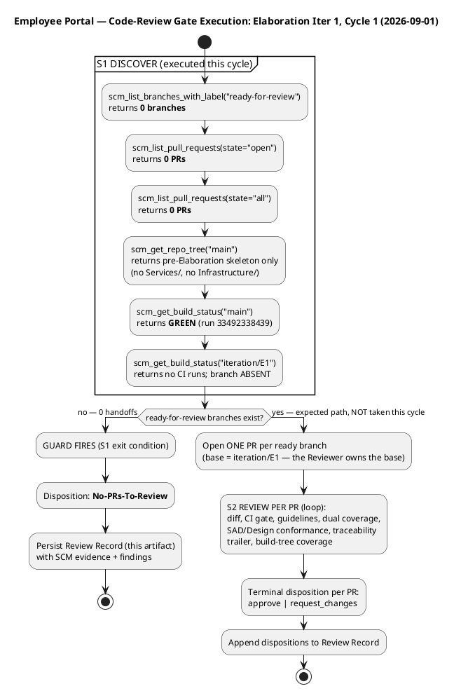

### Compliance Matrix — Checklist × Status (Code-Review Lens)

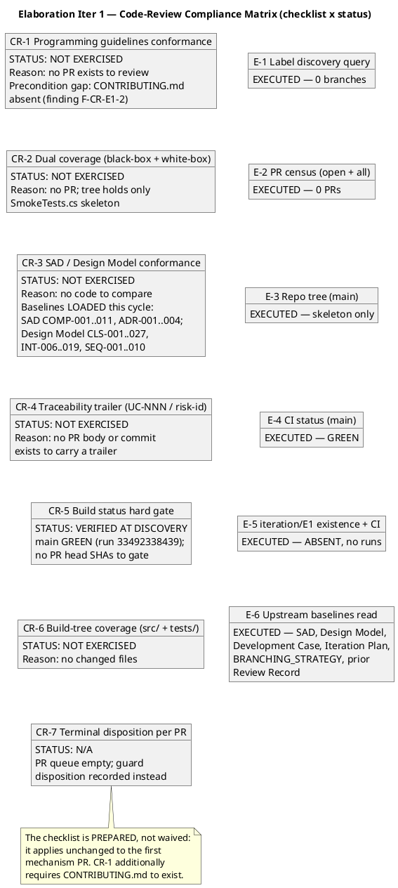

### SCM Evidence Snapshot (review evidence — what actually happened)

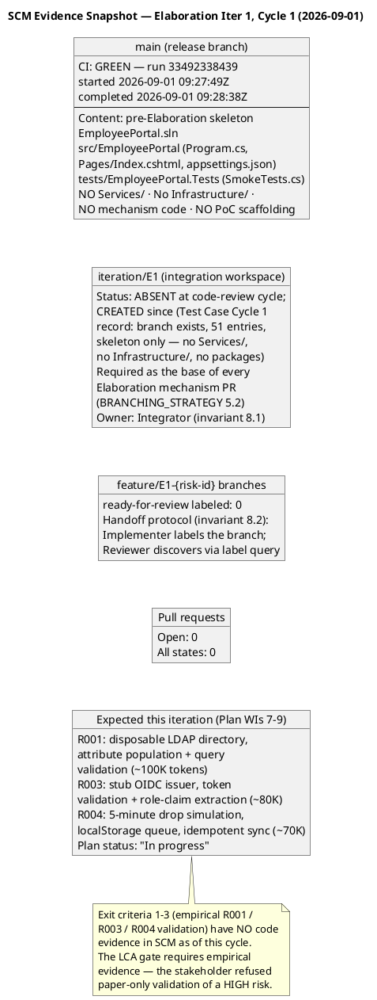

### Historical Record — Inception LCO Review Scope (preserved)

The Inception record reviewed 9 artifacts + the Review Record against 9 LCO exit criteria (feasibility lens) across 2 iterations. Iteration 1 raised 2 findings on the Iteration Plan (F1 Major — UC-ID mapping mismatch; F2 Minor — stale work-item statuses); the stakeholder REFUSED sanction pending rework. Iteration 2 verified both corrections, raised zero new findings, and recorded stakeholder sanction GRANTED ("Let's go to elaboration."). Full LCO compliance matrices, health state machine, risk retirement status, and milestone timeline diagrams are preserved in SCM history at the Inception revision of this artifact.

### Technical LCA Lens — Scope and Criteria (Reviewer, this cycle)

**Scope:** ALL 9 technical artifacts produced this phase, reviewed against the **LCA exit-criteria lens** (are the artifacts collectively sufficient for phase transition?) — the correct evaluative lens for a lifecycle milestone, not a completion lens. Priority order: SAD first (architecture gate), then Design Model, then Use-Case Model, then remaining. Upstream consumption completed before findings: all 9 artifacts read in full; the Work Order's declared scope (10 FRs, 5 NFRs, 5 ACs, 14 CONs, 2 declared risks), the stakeholder's recorded decisions (timestamp convention, America/Havana, PoC empirical validation), and the SCM state (zero open PRs; `iteration/E1` skeleton-only per the Test Case's empirical inspection) were cross-checked.

**Checklists applied per artifact type:** SAD → architecture checklist (4+1 views, NFR→tactic mapping, change-area subsystems, interface-based boundaries, PoC plan vs stakeholder decision); Design Model → design checklist (UC realizations per-UC, full signatures, interface contracts, volatility encapsulation, co-owned section integrity); Use-Case Model → requirements checklist (actors, flows, pre/post conditions, alternatives, `Source: FR-NNN` guard, cross-cutting-mechanism guard); Supplementary Specification → NFR checklist (FURPS+ quantified, testable, traceable, no gold-plating); Risk List → mitigation/acceptance-criteria checklist; Iteration Plan → plan-integrity checklist (UC-ID authority, honest statuses, two clocks); Development Case → IARI baseline conformance + optional-trigger justification audit; Test Case / Test Evaluation Summary → test-design checklist (coverage, adversarial intent, honest verdicts, no fabricated results).

**Scope-marker verification:** all non-literal elements carry correct markers; three stakeholder decisions retired their markers in place (offline mechanism, timestamp convention, office timezone America/Havana) — no marker survives its own answer. The `[ASSUMPTION]` tags on quantified thresholds (2 s window, queue ≥ 10, sync ≤ 60 s, 95th percentile) carry named bases — compliant, with one exception recorded as Risk List F1.

**Compliance Matrix — Technical LCA Lens (9 artifacts × checklist dimensions):**

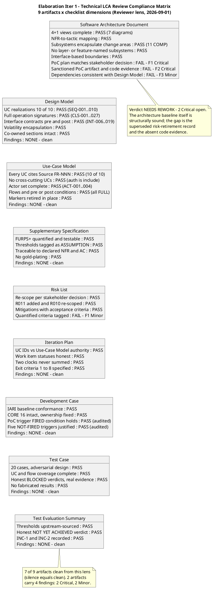

### Business Modeling Lens — Scope and Criteria (Business Reviewer, this cycle)

**Scope:** the DC §4 business-process-led classification and the Elaboration artifact set, evaluated against the LCA exit-criteria lens for the Business Modeling discipline: is the discipline correctly INACTIVE, and did the phase produce exactly the BM deliverables the classification requires (zero, for a non-BPL project)?

**Scenario assessment (reviewer heuristic 1):** the engagement is software-feature-led automation of existing, well-understood manual workflows (Excel clocking sheets, mass-email news distribution, PDF directory) — not one of the business-modeling scenarios that warrant a business object model. The ProcessEngineer's DC §4 re-check (2026-09-01) records `isBusinessProcessLed = false` with the Inception verdict unchanged; this lens independently verified the claim against the Vision (tool replacement, no reengineering signals) and the Use-Case Model (zero BUCs, business workers, business entities, or realizations; 10 system UCs trace 1:1 to FR-001…FR-010). The classification is CORRECT — no defect.

**Gate evaluation (what was checked, with evidence):**

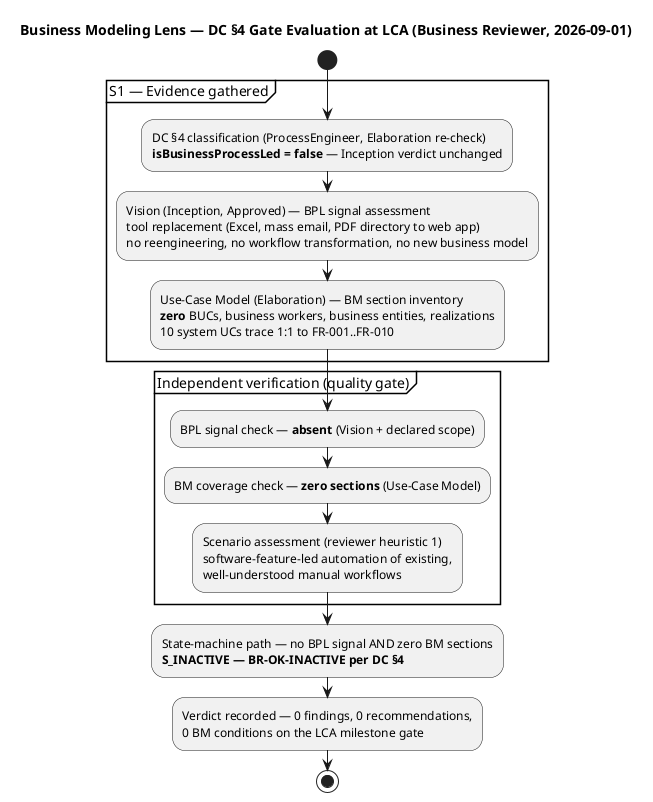

**Prior-findings reconciliation (this lens):** the findings ledger holds zero findings emitted by the BusinessReviewer role — the Inception findings (F1/F2) belong to the Reviewer and ManagementReviewer lenses and are all RESOLVED. Nothing to close; no `resolve_artifact_finding` calls owed.

### Management LCA Lens — Scope and Criteria (Management Reviewer — PRA, this cycle)

**Scope:** the two-part review the PRA owns at the end-of-Elaboration milestone. Part 1 — **Project Planning Review** (feasibility and acceptability of the Iteration Plan). Part 2 — **LCA exit criteria** (the six RUP lifecycle-architecture criteria, pass/fail per criterion with evidence). Artifacts inspected in full before any conclusion: Software Architecture Document (architecture baseline), Iteration Plan (planning baseline — coarse roadmap + fine plan), Risk List (risk status), Iteration Assessment (Inception — prior-phase actuals; the Elaboration assessment is authored by the Project Manager in the Assess touchpoint AFTER this review, so its absence here is expected and is never a finding), Development Case (PoC trigger correction verified: trigger FIRED, stakeholder decision binding), Review Record (cumulative — all lenses), and the Work Order's Measured Actuals (Inception: 28 min agent time, 1,347,939 tokens, 11 runs, 10 artifacts — phase-level record governs).

**Part 1 — Project Planning Review (feasibility and acceptability):**

| Dimension | Assessment | Evidence |
|---|---|---|
| Budget box traces to measured actuals | **PASS** | 1,200K box [ASSUMPTION — scaled from measured Inception actual 1,347,939 tokens, phase-level record; basis named]; work items sum ~1,180K within box; Construction sizing tagged with basis; the disproven 185K assumption explicitly replaced |
| Units discipline | **PASS** | No person-weeks/story points; two clocks (agent tokens/time vs. human queue days) never summed — verified in milestone table, Two Clocks section, sizing note; gantt bars disclaimed as structural sequencing units, unanchored |
| UC-ID authority (LCO F1 lesson) | **PASS** | All 10 FR→UC rows verified against Use-Case Model authority (FR-001→UC-005, FR-004→UC-001, FR-010→UC-004 …) |
| Status honesty (LCO F2 lesson) | **PASS with one Critical exception** | WI 2–10 "In progress" with reconciliation note — but WI 7–9 (PoC code) have zero SCM evidence (no Services/, no Infrastructure/, no packages; iteration/E1 skeleton only; SCM Issue #1 blocker) → Iteration Plan F3 (Critical) |
| Human gate queue handling | **DEFECT (Minor)** | Plan forecasts gate queues ([ASSUMPTION — up to 2 days LCA; up to 5 days STK-004]) — the planning rule requires estimate NONE, bounded in the Risk List → Iteration Plan F5 + Risk List F1 (Minor) |
| Architecture stability | **NOT stable for Construction entry this cycle** | 4+1 baseline structurally complete and sound (7 diagrams, 11 components, ADR-001..004) — but the SAD still carries the superseded analysis-only PoC record (§Quality cites "trigger NOT fired" while the Development Case records it FIRED), and the riskiest mechanisms are empirically unvalidated |
| Risk retirement trend | **FLAT — not occurring yet** | R001 HIGH since Inception, still HIGH; R003/R004 SIGNIFICANT unchanged. The re-scoped empirical validation paths are correct but unexecuted; the Risk List carries no per-risk trend direction to surface this → Risk List F1 (Minor) |
| Stakeholder acceptability | **OBTAINED by asking** | Consulted at this review with the full defect inventory; answer: "No" — sanction REFUSED; directive recorded verbatim and binding |

**Part 2 — LCA Milestone Compliance Table (criterion / status / evidence / verdict):**


**Risk Retirement Trend (Inception → Elaboration Iter 1 — the management heuristic: high-magnitude risks must show DECREASING trend lines):**

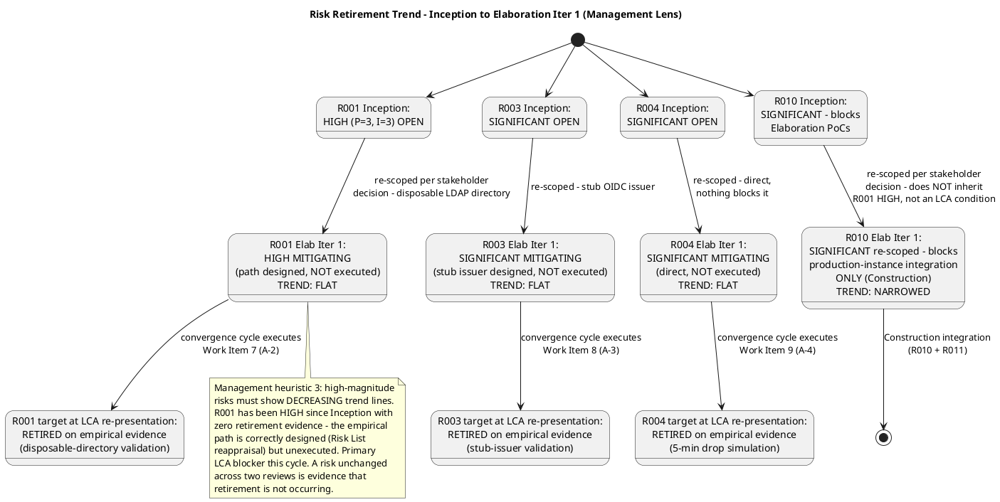

**Project Health Scorecard (four dimensions — a project green on three and red on one is NOT a green project):**

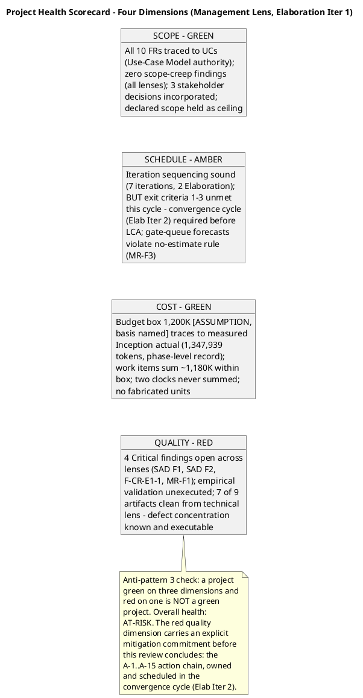

**Prior-findings reconciliation (this lens):** all four prior ManagementReviewer findings (Iteration Plan F1 Major, F2 Minor — Inception) are RESOLVED with successful `resolve_artifact_finding` closures recorded in Inception Iter 2; zero findings carried open into Elaboration Iteration 1 from this lens. The one open finding on the Risk List (untagged >90% criterion) was emitted by the Reviewer lens — per the cross-lens ownership invariant it is not this lens's to resolve.

### Business Modeling Lens — Scope, Findings, and Milestone Disposition (Business Reviewer, Iteration 4 — record-propagation pass, 2026-09-02)

**Scope and criteria (this lens, this cycle):** the DC §4 business-process-led classification and the Elaboration artifact set at the LCA re-presentation point, evaluated against the LCA exit-criteria lens for the Business Modeling discipline: is the discipline correctly INACTIVE, and did the phase produce exactly the BM deliverables the classification requires (zero, for a non-BPL project)? The record-propagation pass's own work (A-32…A-39, the PM close-pass) is owned by the technical, management and code-review lenses; this lens's obligation at this milestone is the classification re-verification and the zero-BM-conditions statement for the R6 re-presentation gate.

**Scenario assessment (reviewer heuristic 1):** the engagement is software-feature-led automation of existing, well-understood manual workflows (Excel clocking sheets, mass-email news distribution, PDF directory) — not one of the business-modeling scenarios that warrant a business object model. The ProcessEngineer's DC §4 re-record (2026-09-02, Elaboration Iteration 4) returns `isBusinessProcessLed = false` with the Inception verdict unchanged and no Change Request re-opening the classification; this lens independently verified the claim against the Vision (tool replacement, no reengineering signals) and the Use-Case Model Iter 4 revision (zero BUCs, business workers, business entities, or realizations; 10 system UCs trace 1:1 to FR-001…FR-010). The classification is CORRECT — no defect.

**Evidence gathered (this cycle):** DC §4 classification (ProcessEngineer re-record 2026-09-02: isBusinessProcessLed=false, verdict unchanged from Inception and Elab Iters 1–3, no CR re-opened); Vision (Inception, Approved — BPL signal re-verified absent); Use-Case Model (Elaboration Iter 4 revision, read in full — zero BM sections re-verified; the Iter 4 changes are the SB-06/SB-07 storyboards and a Document Control milestone-record update, both system-requirements/UI refinements of declared FRs — no business-process signal); findings ledger re-swept for the four BR-relevant artifacts (Vision, Use-Case Model, Supplementary Specification, Review Record — all four return empty arrays; zero BusinessReviewer findings project-wide).

**Prior-findings reconciliation (this lens — executed before the verdict):** [PLAN] artifacts × prior BR findings with resolution==null: Vision: [], Use-Case Model: [], Supplementary Specification: [], Review Record: []. TOTAL: 0. [EXIT] S_RECONCILE complete: closed=0, deferred=0, rejected=0, left-open=0. Total: 0 of 0. Zero `resolve_artifact_finding` calls owed; zero `record_artifact_finding` calls owed (a clean business-lens verdict on an INACTIVE discipline emits no finding). The Inception findings (F1/F2) belong to the Reviewer and ManagementReviewer lenses and are all RESOLVED — not this lens's to close.

**Gate evaluation (what was checked, with evidence — this cycle):**

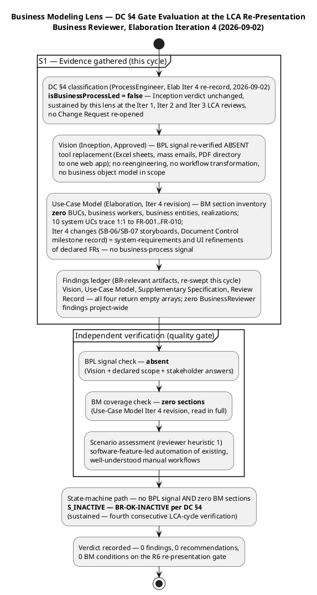

**Findings: NONE — zero findings, zero recommendations, zero BM conditions on the R6 re-presentation gate.** The Business Modeling discipline remains INACTIVE per DC §4 (`isBusinessProcessLed = false`, ProcessEngineer re-record 2026-09-02, independently re-verified by this lens this cycle against the Vision and the Use-Case Model Iter 4 revision). No BM artifact exists to receive a finding, and none is required for a non-BPL project. No `record_artifact_finding` was emitted from this lens this iteration; no prior BusinessReviewer finding exists to close. The business lens therefore adds **zero entries** to the findings ledger the Review Coordinator must empty before the R6 re-presentation — the open gates (Test Evaluation Summary#F3 Major; Architectural Proof-of-Concept#F3, Development Case#F4, Iteration Plan#F8 Minors; F-CR-E3-1/2 narrative Minors) belong to the technical, management and code-review lenses and are unaffected by this verdict.

**Milestone disposition (business lens, Iter 4):**

**Verdict: [BR-OK-INACTIVE] — Discipline NOT APPLICABLE per DC §4 — SUSTAINED (fourth consecutive LCA-cycle verification).**

DC §4 trigger re-evaluation at the LCA re-presentation point: the project still does not exhibit business-process-led characteristics. The ProcessEngineer's re-record (2026-09-02, Elaboration Iteration 4) returns `isBusinessProcessLed = false` with the Inception verdict unchanged and no Change Request re-opening the classification; this lens independently re-verified the claim against the Vision (tool replacement — Excel sheets, mass emails, PDF directory → one web app; no reengineering, workflow transformation, or business object modeling in scope) and the Use-Case Model Iter 4 revision (zero BUCs, business workers, business entities, or realizations; all 10 system UCs trace 1:1 to FR-001…FR-010). The stakeholder's recorded answers were cross-checked — the R6-path confirmation, the BLOCKED-cases framing directive, and the record-propagation directives are process and evidence-packaging decisions, not business-process signals. The Iter 4 Use-Case Model changes (SB-06/SB-07 storyboards; Document Control milestone-record update) are system-requirements and UI refinements of declared FRs carrying stakeholder-decided contracts — no business-process signal. No BM sections were produced during Elaboration Iteration 4, and none were required.

**Conclusion:** the Business Modeling discipline remains correctly INACTIVE — sustained from Inception and the Elaboration Iteration 1, 2 and 3 LCA reviews. Zero findings, zero recommendations, zero BM action items, zero BM conditions on the R6 re-presentation gate. The business lens adds **zero entries** to the findings ledger the Review Coordinator must empty before the R6 re-presentation; the open gates belong to the technical, management and code-review lenses and are unaffected by this verdict. The LCA milestone is NOT declared achieved by this record — the phase-level sanction remains withheld per the stakeholder's binding all-findings directive, owned by the other lenses.

**Resolutions and actions (business lens, Iter 4):** NONE — zero findings emitted from this lens; zero prior BusinessReviewer findings open; no BM action item exists for the R6 re-presentation cycle.

**Re-trigger condition (unchanged, recorded for the ReviewCoordinator):** a Change Request introducing business-process reengineering, workflow transformation, or a business object model re-opens the DC §4 classification (owner: ProcessEngineer). Until such a CR exists, no BM deliverable is owed at the R6 re-presentation, in Construction, or in Transition, and this lens's next review obligation arises only if the classification changes.

**Revision note (anchoring decision, recorded per the honest-recording discipline):** the business-lens Iter 4 record follows the combined-record pattern (Iter 3 precedent: findings + milestone disposition + this lens's traceability rows in one subsection) and is anchored in § Review Scope and Criteria — the canonical section whose semantics match the bulk of an INACTIVE-discipline review (what was checked, against what criteria, with what evidence). Anchoring in § Findings would have required reproducing that section's full preserved content — now the largest section of this cumulative artifact, grown by three same-iteration lens records — in a single section-scoped upsert; the truncation-induced content-loss risk is exactly the failure mode the Iter 3 section-replacement lesson exists to prevent. The record remains discoverable by title for the coordinator's consolidation; the verdict is stated in full here and registered in Document Control. This lens's Iter 4 traceability rows are carried inline below (the artifact-level § Traceability registry is preserved untouched for the same reason).

**Traceability (this lens's Iter 4 rows):**

| Element | Traces From | Link Type | Traces To |
|---|---|---|---|
| Business-lens Iter 4 re-review (this record) | Work Order (Elab Iter 4 — LCA milestone review, business modeling lens); DC §4 classification (ProcessEngineer re-record 2026-09-02: isBusinessProcessLed=false, Inception verdict unchanged, no CR re-opened); Vision (Inception, Approved — BPL signal re-verified absent); Use-Case Model (Elaboration Iter 4 revision — zero BM sections re-verified, read in full); findings ledger (Vision, Use-Case Model, Supplementary Specification, Review Record — all four empty; zero BusinessReviewer findings project-wide) | Reviews | R6 re-presentation gate (zero BM conditions); Review Record cumulative (business-lens Iter 4 record); ReviewCoordinator LCA verdict aggregation |
| BR-OK-INACTIVE verdict (Iter 4, sustained — fourth consecutive LCA-cycle verification) | DC §4 activation rule (Business Modeling ACTIVE only when business-process-led = true); IARI DC baseline discipline-intensity matrix (BM High in Elaboration applies only to BPL-true projects); Iter 1 + Iter 2 + Iter 3 BR-OK-INACTIVE verdicts (sustained, not re-created); ProcessEngineer re-record 2026-09-02 (Elab Iter 4) | Refines | R6 re-presentation (BM remains INACTIVE unless a CR re-triggers the classification); Construction and Transition (no BM deliverable owed); ProcessEngineer (re-trigger owner) |
| BM prior-findings reconciliation (Iter 4) | read_artifact_findings executed for Vision, Use-Case Model, Supplementary Specification, Review Record (2026-09-02) — all four return empty arrays; zero resolve_artifact_finding calls owed; zero record_artifact_finding calls owed | Refines | Findings ledger (single source of truth — zero BusinessReviewer entries across the entire project); cross-lens ownership invariant (Inception findings belong to the Reviewer and ManagementReviewer lenses, all RESOLVED) |

### Elaboration Iteration 4, Cycle 1 — Technical-Lens LCA Re-Review Record (Reviewer, 2026-09-02 — record-propagation pass)

**Scope and criteria (this lens, this cycle):** ALL 13 artifacts in the inventory, reviewed against the **LCA exit-criteria lens** on the record-propagation track — the pass the stakeholder confirmed ("Yes"): record corrections first, then the R6 re-presentation. Priority order: Architectural Proof-of-Concept first (the CR-targeted artifact and the R6 evidence package's core), then the Test Case (the execution authority), then the TES (the mission-verdict record), then the SAD, then the Development Case, then the Risk List and Iteration Plan (the PM close-pass artifacts), then the preserved requirements/design artifacts. Upstream consumption complete before findings: all 13 artifacts read in full this cycle; the Work Order's declared scope, the stakeholder's recorded decisions (four-clause behavioural bar; featured-banner stack; all-findings directive; BLOCKED-cases framing directive), and the CR targeting the Architectural Proof-of-Concept cross-checked; **SCM state verified empirically** (`scm_list_pull_requests` state=open → zero open PRs; `scm_get_build_status(main)` → GREEN run 33639518709, completed 2026-09-02 14:04:14Z; `scm_list_issues` all → Issue #9 OPEN [cr:approved, assigned:software-architect — the PoC results-ledger CR, in flight and now satisfied], Issues #1/#2 CLOSED cr:complete; `scm_get_file_content` main CONTRIBUTING.md → sha 90e4f2e with the FOUR-clause ARCH-6 verified first-hand). Checklists applied per artifact type: PoC → trigger + validation-protocol + results-ledger + evidence-citation checklist; Test Case → execution-record internal-consistency checklist; TES → mission-verdict + remainder-enumeration checklist; SAD → milestone-assessment currency checklist; Development Case → IARI baseline conformance + gap-flag + status-claim currency; Risk List → close-pass reappraisal checklist; Iteration Plan → pass-plan integrity checklist. Iteration Assessment excluded per review-point rules (the PM authors it AFTER this review — its absence is never a finding).

**Prior-findings reconciliation (this lens — executed in the dedicated closure state, tool calls FIRST):** [PLAN] artifacts × prior findings of this lens with resolution==null: Architectural Proof-of-Concept: [1] (F2, Major), Software Architecture Document: [3] (F4, Minor), Test Case: [0] (F1, Minor), Test Evaluation Summary: [1] (F2, Minor), Development Case: [2] (F3, Minor). TOTAL: 5. All five disposed via `resolve_artifact_finding` (all returned ok, 2026-09-02): **Architectural Proof-of-Concept F2 (Major) RESOLVED** — the A-32 observed-results ledger verified first-hand (R001 four-clause × four-consumer clause-by-clause table; R003 matrix; R004 simulation; 15/0/8 with the 8 BLOCKED framed as a recorded SCOPE decision; MERGED delivery rows with PR numbers; Document Control updated; explicit claims/does-not-claim section); **SAD F4 (Minor) RESOLVED** — A-33 criterion 3 reads "YES — empirical validation EXECUTED and OBSERVED this phase" with current evidence; **Test Case F1 (Minor) RESOLVED** — A-34 summary reconciled to 15/0/8 with all eight BLOCKED cases named; **TES F2 (Minor) RESOLVED** — A-35 mission verdict "VALIDATION SUBSTANCE ACHIEVED — OBSERVED" with metrics/INC-1/trends updated; **DC F3 (Minor) RESOLVED** — A-36 both sides verified (CONTRIBUTING.md sha 90e4f2e carries the four-clause ARCH-6 verbatim; the DC gap flag closed on verification). [EXIT] S_RECONCILE complete: closed=5 (Resolved), deferred=0, rejected=0, left-open=0. Total disposed: 5 of 5. **The five named record-propagation corrections (A-32…A-36) are ALL verified landed — the R6 evidence package is ASSEMBLED.**

**New findings (this lens, this cycle — all emitted via `record_artifact_finding` before this upsert; all record-propagation class):**

| Finding Key | Severity | Artifact | Description (summary) | Remediation (summary) |
|---|---|---|---|---|
| **TES F3** | **Major** | Test Evaluation Summary — Milestone Target; master workflow "Remaining" box; schedule Sequence 3; resources table; INC-1; Conclusions; recommendations 1–2; traceability rows | **Stale remainder-enumerations vs the same-pass sibling landings — the mission-verdict record now contradicts the observed state of four artifacts.** The TES claims throughout that the record-propagation remainder is still open: A-32 "PENDING (Architect — the one Major)", A-34 "Test Designer-owned — OPEN", A-36 "PENDING", PM close-pass "PENDING", INC-1 "the PoC artifact's ledger still says PENDING, which is what stands between the team and an assemblable LCA evidence package". All now FALSE against the observed same-pass state, verified first-hand this review: A-32 LANDED (PoC F2 resolved on that verification), A-34 LANDED (Test Case F1 resolved), A-36 LANDED (DC F3 resolved), PM close-pass LANDED (the Risk List records R001/R003/R004 RETIRED on observed evidence, R013 RESOLVED, R010 obligation relocated with its concrete blocker). The TES was honest when written — it accurately records its own A-34 ownership-guard rejection — but the pass's later landings made its remainder-enumerations stale, and the DC's binding record-propagation discipline (adopted this same revision) requires the update in this pass. The TES is the LCA test-evidence record the R6 gate reads alongside the PoC; a mission verdict whose "what remains" statement is false in every particular makes the R6 evidence package internally contradictory — the same cross-artifact-contradiction class as Development Case F1 / Risk List F2 (Major). | Test Manager executes one targeted TES update from the observed same-pass landings BEFORE R6: Milestone Target → the record-propagation corrections are landed and verified (the remaining gate work is the R6 re-presentation itself); master-workflow "Remaining" box, schedule Sequence 3, resources table → A-32 DONE (ledger-closed 2026-09-02), A-34 DONE by the Test Designer (the ownership-guard rejection preserved as history), A-36 DONE (sha 90e4f2e), PM close-pass DONE; INC-1 → the bottleneck is RESOLVED — nothing test-side stands between the team and the assemblable evidence package; Conclusions "What the mission cannot yet claim" → restated to the current remainder (this finding's own remediation, the Management lens's F8 closure, the PM pass-close reconciliation, the R6 gate); recommendations 1–2 retired or restated; traceability rows updated. The mission verdict itself ("VALIDATION SUBSTANCE ACHIEVED — OBSERVED") is correct and unchanged. |
| **PoC F3** | **Minor** | Architectural Proof-of-Concept — § Traceability, behavioural-bar row | **Incorrect evidence sha citation.** The row cites "CONTRIBUTING.md ARCH-6 (fourth clause, action A-36 — sha c86ebf7)" — but the verified current file sha is 90e4f2e1b91bdb64082dcc9f75a4b32c3cc10f80 (read first-hand via scm_get_file_content this review; independently recorded by the Development Case's tool verification). The cited c86ebf7 matches neither the current verified file sha (90e4f2e) nor the prior one (6662813). The row sits in a traceability table whose sibling citations are file shas verified at read time — its purpose is verifiability, and the R6 gate verifies evidence by sha. The substantive claim (ARCH-6 carries the fourth clause) is TRUE and verified first-hand; the defect is the citation itself, in the R6 evidence package's core artifact. | Software Architect corrects the sha citation to the verified current file sha (90e4f2e1b91bdb64082dcc9f75a4b32c3cc10f80) — or, if c86ebf7 is the commit sha that introduced the fourth clause, cite it explicitly as a commit sha alongside the verified file sha. One-line correction; rides any PoC touch before R6. |
| **DC F4** | **Minor** | Development Case — § Elaboration Exit Criteria criterion 3 "Remaining" line; § Optional Artifact Triggers PoC disposition paragraph + trigger-diagram note; § Organization Assessment | **Stale A-32 / PM-close-pass status claims lag the same-pass observed landings — the same record-propagation class the DC itself adopted a binding discipline against in this very revision.** Three locations: criterion 3 "Remaining: the PoC results ledger must carry the observed results (A-32) and the Risk List must record the retirement (PM close-pass)" — both LANDED and verified; the PoC disposition paragraph + trigger-diagram note "The artifact's remaining obligation is record propagation (A-32)" — landed and verified; the Organization Assessment "retirement recording lands at the PM close-pass" — landed. The DC is the governance document every role reads for process state; its exit-criteria table is the DC-specific LCA gate record (criteria 7–9), and criterion 3's "Remaining" line now misstates what remains before R6. | Process Engineer updates the three locations to the observed state in the next DC touch before R6, per the DC's own binding record-propagation discipline: criterion 3 "Remaining" line → the PoC results ledger carries the OBSERVED results (A-32 — landed, ledger-closed 2026-09-02) and the Risk List records the retirement (PM close-pass — landed: R001/R003/R004 RETIRED on observed evidence); the PoC disposition paragraph + trigger-diagram note → the record-propagation obligation is DISCHARGED; the Organization Assessment → retirement recording RECORDED at the PM close-pass. |

**Compliance Matrix — Technical LCA Lens, Iteration 4 (13 artifacts × checklist dimensions):**

```plantuml
@startuml
title Elaboration Iter 4 - Technical LCA Review Compliance Matrix\n13 artifacts x checklist dimensions (Reviewer lens, record-propagation pass, 2026-09-02)

object "Architectural Proof-of-Concept" as POC {
  Prior F2 (Major) - A-32 observed results : PASS - RESOLVED this review
  R001 4 clauses x 4 consumers evidence : PASS
  R003 matrix + R004 simulation : PASS
  15/0/8, BLOCKED = recorded SCOPE decision : PASS
  Delivery rows MERGED w/ PR numbers : PASS
  No result beyond Test Case authority : PASS
  Evidence sha citations verifiable : FAIL - F3 NEW (Minor)
  (CONTRIBUTING.md cited c86ebf7 vs verified 90e4f2e)
}
object "Software Architecture Document" as SAD {
  Prior F4 (Minor) - A-33 criterion 3 : PASS - RESOLVED this review
  Criterion 3 cites current repo state : PASS
  Criteria 1/2/4/6 rows accurate : PASS
  Empirical disposition + 4-clause bar : PASS (unchanged, verified)
  New findings : NONE - clean
}
object "Test Case" as TC {
  Prior F1 (Minor) - A-34 summary : PASS - RESOLVED this review
  Summary = per-case = corrections (15+8=23) : PASS
  BLOCKED set named, SCOPE-decision framing : PASS
  Iter 4 regression verification (PR #7) : PASS - baseline HELD
  New findings : NONE - clean
}
object "Test Evaluation Summary" as TES {
  Prior F2 (Minor) - A-35 mission verdict : PASS - RESOLVED this review
  Mission verdict vs execution record : PASS
  Remainder-enumerations vs same-pass landings : FAIL - F3 NEW (Major)
  (A-32/A-34/A-36/PM-close-pass claimed PENDING/OPEN - all landed)
}
object "Development Case" as DC {
  Prior F3 (Minor) - A-36 ARCH-6 : PASS - RESOLVED this review
  (code side sha 90e4f2e + flag side closed)
  IARI baseline conformance : PASS (unchanged)
  A-32/PM-close-pass status claims : FAIL - F4 NEW (Minor)
  (3 locations stale vs same-pass landings)
}
object "Risk List" as RISK {
  Close-pass reappraisal landed : PASS - R001/R003/R004
  RETIRED on observed evidence; R013 RESOLVED
  R010 F8 remediation (blocker recorded,
  obligation carried) : PASS - verified present
  (ledger closure owned by Management lens)
  New findings : NONE - clean
}
object "Iteration Plan" as PLAN {
  Pass plan sound (R6 path, box by content class) : PASS
  Objectives 1-2 (A-32..A-36) vs evidence : PASS - MET, verified
  WI statuses Pending at plan-build : NOT A FINDING -
  reconciliation scheduled at pass close (WI-9, criterion 12)
  New findings : NONE
}
object "Use-Case Model" as UCM {
  Clean at all 3 prior LCA reviews : PRESERVED
  No finding or CR targets it; unchanged this pass
}
object "Supplementary Specification" as SUP {
  Clean at all 3 prior LCA reviews : PRESERVED
  No finding or CR targets it; unchanged this pass
}
object "Design Model" as DM {
  Clean at all 3 prior LCA reviews : PRESERVED
  F-CR-E3-2 (INT-011) remains Designer-owned, next pass
}
object "Vision" as VIS {
  Inception-approved, 0 findings : PRESERVED
}
object "Iteration Assessment" as IA {
  PM authors AFTER this review : EXCLUDED per review-point rule
}
POC -[hidden]-> SAD
SAD -[hidden]-> TC
TC -[hidden]-> TES
TES -[hidden]-> DC
DC -[hidden]-> RISK
RISK -[hidden]-> PLAN
PLAN -[hidden]-> UCM
UCM -[hidden]-> SUP
SUP -[hidden]-> DM
DM -[hidden]-> VIS
VIS -[hidden]-> IA
@enduml
```

**Defect Distribution — Iteration 4 (this lens):**

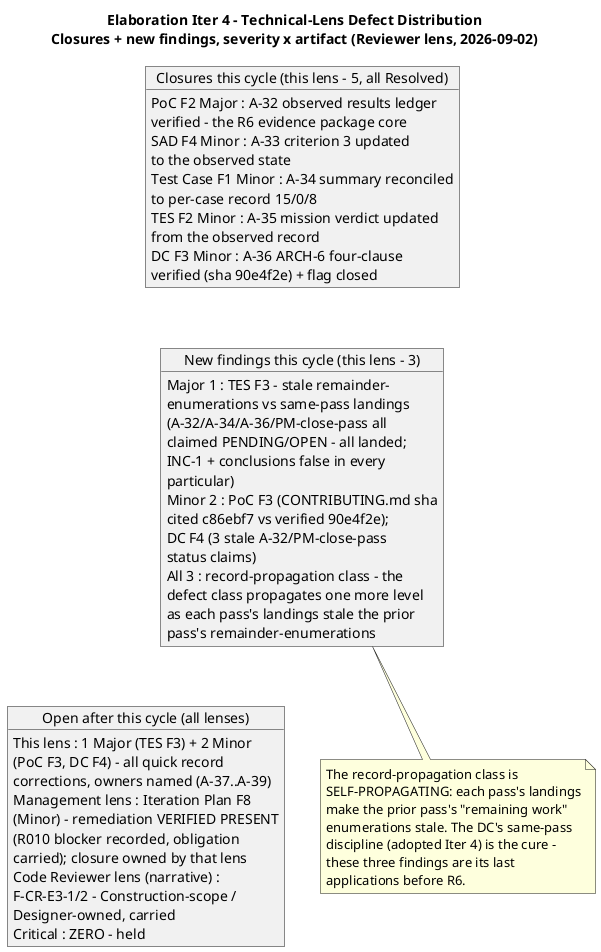

**SCM Evidence Snapshot (Iter 4 — what actually happened, verified first-hand):** `scm_list_pull_requests(state=open)` → **zero open PRs** (PR #7, the pass's only code handoff, left the gate APPROVED by the Code Reviewer lens — review 5090059324, CI GREEN run 33632200967, merged to `iteration/E4` @ 13d0a08 per the Test Case Iter 4 regression record; PR #6 baseline-close merged to main under APPROVED at Iter 3); `scm_get_build_status(main)` → GREEN run 33639518709 (completed 2026-09-02 14:04:14Z — post-PR-7); `scm_list_issues(all)` → Issue #9 OPEN (cr:approved, assigned:software-architect — "CR: Architectural Proof-of-Concept results ledger stale vs observed validation — rewrite with the OBSERVED results (PoC F2 / action A-32)" — the CR targeting the PoC artifact named in this Work Order; its remediation is LANDED and verified this review, so the CR's work is satisfied and it closes on this evidence), Issues #1/#2 CLOSED (cr:complete); `scm_get_file_content(main, CONTRIBUTING.md)` → sha 90e4f2e1b91bdb64082dcc9f75a4b32c3cc10f80 — ARCH-6 carries the FOUR-clause behavioural bar verbatim (A-36 verified first-hand).

**PR Disposition Record — Elaboration Iteration 4 (S3, terminal verdicts per in-scope PR):** **In-scope OPEN PR set: ∅ (empty)** — verified via `scm_list_pull_requests` (state=open → none). Every PR that entered the phase left the gate with a terminal verdict: PRs #3/#4/#5 (mechanisms, APPROVED ×3, merged to iteration/E1), PR #6 (baseline-close, APPROVED, merged to main), PR #7 (F-CR-E3-3 remediation, APPROVED, merged to iteration/E4). No phase-discipline violation exists — every PR rode the iteration line (feature → iteration/E{n} → main at iteration close) per BRANCHING_STRATEGY §5.2. **No PR-level sanction is owed this cycle: there is nothing to sanction and nothing to withhold on.** The architecture-baseline sanction landed on PR #6 (APPROVED, merged) and nothing new challenges it; the milestone-level sanction (phase transition) remains withheld per the all-findings directive — recorded in § Disposition.

**Per-artifact verdicts (this lens, Iter 4):**

| Artifact | Verdict | Basis |
|---|---|---|
| Architectural Proof-of-Concept | **Approved with changes** | PoC F2 (Major) RESOLVED — the A-32 observed-results ledger verified first-hand; the R6 evidence package's core artifact is ASSEMBLED (clause-by-clause four-clause × four-consumer evidence, honest verdict distribution with the stakeholder's framing directive, MERGED delivery rows, claims/does-not-claim discipline). F3 (Minor) open: one sha citation — quick correction. |
| Software Architecture Document | **Approved** | SAD F4 RESOLVED — criterion 3 cites current repository state; the 4+1 baseline is stable as record AND evidence; no new findings. |
| Test Case | **Approved** | Test Case F1 RESOLVED — summary, per-case table, and corrections paragraph agree (15+8=23); the Iter 4 regression verification (PR #7, baseline HELD) is exemplary honest practice; no new findings. |
| Test Evaluation Summary | **NeedsRework** | TES F2 RESOLVED (mission verdict correct and observed). F3 (Major) open: the remainder-enumerations are false in every particular against the same-pass landings — the mission-verdict record contradicts the observed state of four artifacts; one targeted update owed before R6. |
| Development Case | **Approved with changes** | DC F3 RESOLVED (A-36 both sides verified). F4 (Minor) open: three stale A-32/PM-close-pass status claims — quick corrections per the DC's own same-pass discipline. IARI baseline conformance PASSES (unchanged). |
| Risk List | **Approved** | The close-pass reappraisal is sound and observed: R001/R003/R004 RETIRED on CI-traced evidence with residuals correctly carried to R011; R013 RESOLVED; R010 F8 remediation present (concrete blocker recorded, obligation carried to Construction Iter 1 with R010's own trigger). No new findings from this lens. |
| Iteration Plan | **Approved** | The record-propagation pass plan is sound (R6 path stakeholder-confirmed; box ~2,750K by content class with basis named; objectives map 1:1 to A-32…A-36 — all now verified MET). Work-item statuses read "Pending" at plan-build — NOT a finding: the plan's own discipline schedules the reconciliation at pass close (Work Item 9, exit criterion 12), and the PM authors the Iteration Assessment after this review. |
| Use-Case Model | **PRESERVED** | Clean at all three prior LCA reviews; no finding or CR targets it; unchanged this pass. |
| Supplementary Specification | **PRESERVED** | Clean at all three prior LCA reviews; no finding or CR targets it; unchanged this pass. |
| Design Model | **PRESERVED** | Clean at all three prior LCA reviews; unchanged this pass. F-CR-E3-2 (INT-011 contract-table evolution) remains Designer-owned, next Design Model pass — not this pass's work. |
| Vision | **PRESERVED** | Inception-approved; no finding or CR targets it. |
| Iteration Assessment | **EXCLUDED** | PM authors it AFTER this review — absence never a finding. |

**New action items (this lens, Iter 4 — extending the chain; no prior action renumbered):**

| # | Action | Owner | Severity | Blocks |
|---|---|---|---|---|
| **A-37** | **Update the TES remainder-enumerations from the observed same-pass landings** (Milestone Target; master-workflow "Remaining" box; schedule Sequence 3; resources table; INC-1 → bottleneck RESOLVED; Conclusions "What the mission cannot yet claim" → the current remainder; recommendations 1–2; traceability rows) — closes TES F3 (Major) | Test Manager | Major | R6 evidence-package internal consistency (the mission-verdict record must not contradict the PoC ledger it sits beside) |
| **A-38** | **Correct the CONTRIBUTING.md sha citation in the PoC § Traceability row** (c86ebf7 → the verified current file sha 90e4f2e1b91bdb64082dcc9f75a4b32c3cc10f80, or cite c86ebf7 explicitly as the introducing commit sha alongside the verified file sha) — closes PoC F3 (Minor) | Software Architect | Minor | R6 evidence-package citation verifiability |
| **A-39** | **Update the DC's three stale A-32/PM-close-pass status claims** (exit-criteria criterion 3 "Remaining" line; PoC disposition paragraph + trigger-diagram note; Organization Assessment) to the observed state, per the DC's own binding same-pass record-propagation discipline — closes DC F4 (Minor) | Process Engineer | Minor | DC-specific LCA gate record accuracy (criteria 7–9) |

**Cross-lens verification recorded (not this lens's to close):** Iteration Plan F8 (Minor, Management lens) — remediation VERIFIED PRESENT this review: the Risk List close-pass records the concrete blocker (no direct STK-004 channel in this runtime; the questionnaire reaches STK-001 only) and carries the obligation to Construction Iter 1 with R010's own trigger; the Management Reviewer lens closes F8 on its own verification. F-CR-E3-1/F-CR-E3-2 (Code Reviewer lens, narrative) — unchanged, Construction-scope/Designer-owned, carried with recorded owners.

**Critical-escalation check (this lens):** zero Critical findings open — the zero-Critical state of the phase, held. Every new finding's remediation is fully determined by recorded same-pass landings; no stakeholder-only decision is surfaced; **no stakeholder touchpoint is owed from this lens** — the next stakeholder touchpoint remains the R6 fresh sanction request itself.

**Traceability (this lens's Iter 4 rows):**

| Element | Traces From | Link Type | Traces To |
|---|---|---|---|
| Technical-lens Iter 4 re-review (this record) | Work Order (Elab Iter 4 — LCA milestone review, technical lens; CR targeting the Architectural Proof-of-Concept); all 13 artifacts read in full; stakeholder decisions (four-clause bar; all-findings directive; BLOCKED-cases framing directive; R6-path confirmation); SCM state verified first-hand (zero open PRs; main GREEN run 33639518709; Issue #9 open [the PoC CR — remediation landed and verified]; Issues #1/#2 closed; CONTRIBUTING.md sha 90e4f2e) | Reviews | LCA milestone gate (sanction still withheld — all-findings directive); R6 re-presentation; actions A-37…A-39 |
| PoC F2 closure (Major) | The A-32 observed-results ledger (PoC § Results and Findings — verified first-hand: R001 four-clause × four-consumer clause-by-clause table; R003 matrix; R004 simulation; 15/0/8 with the 8 BLOCKED framed as a recorded SCOPE decision; MERGED delivery rows with PR numbers; execution trace CI run 33617748483; claims/does-not-claim section); SCM Issue #9 (the CR targeting this artifact — remediation satisfied on this evidence) | Resolves | The R6 evidence package (ASSEMBLED — its core artifact carries the observed validation state); exit criteria 1–3 evidence propagation |
| SAD F4 / Test Case F1 / TES F2 / DC F3 closures (Minor) | A-33 (SAD criterion 3 → observed state), A-34 (Test Case summary → 15/0/8, all eight BLOCKED named), A-35 (TES mission verdict → observed record), A-36 (CONTRIBUTING.md sha 90e4f2e four-clause ARCH-6 + DC flag closed) — all verified first-hand this review | Resolves | The five named record-propagation corrections (A-32…A-36) — ALL LANDED; the R6 entry gate's "corrections committed" condition |
| TES F3 (Major, NEW) | The TES's remainder-enumerations (Milestone Target, master workflow, Sequence 3, resources, INC-1, Conclusions, recommendations, traceability) vs the observed same-pass landings (A-32/A-34/A-36/PM close-pass all landed and ledger-closed); the DC's binding same-pass record-propagation discipline (adopted this revision); the cross-artifact-contradiction class precedent (Development Case F1 / Risk List F2, Major) | Reviews | A-37 (Test Manager); R6 evidence-package internal consistency |
| PoC F3 / DC F4 (Minor, NEW) | PoC § Traceability citation (c86ebf7) vs the verified file sha (90e4f2e, read first-hand + DC tool verification); DC's three A-32/PM-close-pass status claims vs the same-pass landings | Reviews | A-38 (Software Architect); A-39 (Process Engineer); R6 evidence-package citation verifiability + DC gate-record accuracy |
| PR disposition record (Iter 4, ∅) | scm_list_pull_requests (open → none); PR #7 APPROVED (review 5090059324, merged to iteration/E4); PR #6 baseline-close APPROVED (merged to main, Iter 3); BRANCHING_STRATEGY §5.2 (iteration line held) | Reviews | Integrator merge gate (satisfied); the architecture-baseline sanction (landed on PR #6 — unchallenged this cycle) |
| Iter 4 milestone disposition (sanction still withheld) | Stakeholder all-findings directive (verbatim, standing); verified ledger after this revision (0 Critical / 1 Major / 4 Minor ledger + 2 narrative Minor — all record-propagation class, all owned); remaining work = three quick record corrections (A-37…A-39) + the Management lens's F8 closure + the PM pass-close reconciliation + the R6 gate | Refines | R6 re-presentation (empty ledger + evidence package + fresh sanction request); phase transition (only on GRANTED sanction) |

### Elaboration Iteration 4, Cycle 1 — Management-Lens LCA Re-Review and Milestone Disposition (Management Reviewer — PRA, 2026-09-02 — record-propagation pass)

**Scope and criteria (this lens, this cycle):** the PRA's two-part review on the record-propagation track — the pass the stakeholder confirmed ("Yes"): record corrections first, then the R6 re-presentation. Part 1 — **Project Planning Review** (feasibility of the Iteration 4 record-propagation pass plan). Part 2 — **LCA exit criteria** (the six RUP lifecycle-architecture criteria, pass/fail per criterion with evidence). Artifacts inspected in full before any conclusion: Software Architecture Document (§Quality — the architecture baseline; LCA criterion 3 verified current: A-33 landed and ledger-closed by the Reviewer lens this same pass), Iteration Plan (Elab Iter 4 record-propagation pass — the CURRENT plan, read in full), Risk List (Iter 3 close-pass reappraisal — retirement recorded on observed evidence, read in full), Iteration Assessment (Elab Iter 3 close-out — measured actuals, honest ~2.17× variance root-cause; the Iter 4 assessment is authored by the PM in the Assess touchpoint AFTER this review, so its absence is expected and is never a finding), Review Record (cumulative — all lenses), and the Work Order's measured actuals (Inception phase-level; Elab Iter 1: 12,523,281; Iter 2: 13,363,814; Iter 3: 27,143,633 — two clocks never summed). SCM state per the technical lens's same-day first-hand verification (zero open PRs — every PR that entered the phase left the gate with a terminal verdict; main GREEN run 33639518709; Issues #1/#2 closed cr:complete; Issue #9 [the PoC CR named in this Work Order] satisfied on the verified A-32 evidence; CONTRIBUTING.md sha 90e4f2e — the four-clause ARCH-6 verified first-hand).

**Prior-findings reconciliation (this lens — executed in the dedicated closure state, tool calls FIRST):** [PLAN] artifacts × prior MR findings with resolution==null: Iteration Plan: [10] (F8, Minor). Risk List: [] (F1, F2 both resolved). Iteration Assessment: [] (empty — skipped). TOTAL: 1. [PROGRESS] artifact=Iteration Plan (1/1), finding index=10 (1/1 total), decision=Resolved. **Iteration Plan F8 (Minor) RESOLVED via `resolve_artifact_finding` (returned ok, 2026-09-02)** — the finding's own closure bar ("closes on cited evidence in the close-pass artifacts") is met on the remediation's second branch, exactly as prescribed: the request genuinely could not be issued, the concrete blocker is recorded (no direct STK-004 channel exists in this runtime; the stakeholder questionnaire reaches STK-001 only; the stakeholder's Iter 3 directive confirms production AD/Keycloak integration is Construction scope), and the obligation is carried explicitly into the Construction Iter 1 plan with R010's own trigger (the request is issued at Construction Iter 1 plan-build through the stakeholder-facing channel, STK-001 relaying to STK-004 per the Vision's engagement model; trigger armed — STK-004 confirmation by Construction Iter 1 start). Verified first-hand in FOUR close-pass locations this review: (1) Iteration Plan § Document Control, Iter 3 Close-Pass Changes item (1); (2) Iteration Plan § Next Iteration Preview (Construction Iter 1 — the R010 written-request obligation with its trigger); (3) Risk List R010 register row + mitigation section ("PM obligation CARRIED to Construction Iter 1 (close-pass record — F8 remediation)"); (4) Iteration Assessment § Work Item Reconciliation (WI-2 Obligation carried, blocker recorded). The commitment-tracking failure is fixed by a recorded blocker + relocation — not a fourth restatement — exactly the honest remediation the finding demanded. The RESPONSE remains NOT an Elaboration exit condition (stakeholder decision, Elab Iter 1). [EXIT] S_RECONCILE complete: closed=1 (Resolved), deferred=0, rejected=0, left-open=0. Total: 1 of 1. **This lens's findings ledger is EMPTY — every ManagementReviewer finding ever emitted on this project is now resolved (Inception Iteration Plan F1/F2; Elaboration Iteration Plan F3/F4/F5/F6/F7/F8, Risk List F1/F2).**

**New findings (this lens, this cycle): NONE.** [PLAN] management artifacts with NEW defects at LCA: NONE. TOTAL defects: 0. Zero `record_artifact_finding` calls emitted — a clean artifact is Approved from the management lens. Basis, per artifact: the Iteration Plan's record-propagation pass plan is sound (box ~2,750K by content class with basis named — the Iter 3 content-class lesson applied at plan-build; work-item statuses honest at plan-build with every "Pending" naming its blocking evidence and the reconciliation correctly scheduled at pass close per the plan's own discipline, Work Item 9 / exit criterion 12 — NOT a finding; the F8 obligation-tracking defect remediated and ledger-closed this pass); the Risk List close-pass reappraisal is sound and observed (R001/R003/R004 RETIRED on CI-traced evidence with residuals correctly carried to R011; R013 RESOLVED; R010 NARROWED with the obligation relocated and its trigger armed; R012 IMPROVED with the measured 0:00:00 queue); the Iteration Assessment close-out is honest (measured actuals, variance root-caused as content class, binding adjustments listed); the SAD's management aspects are current (LCA criterion 3 cites observed repository state — A-33 landed).

**Part 1 — Project Planning Review (feasibility and acceptability):**

| Dimension | Assessment | Evidence |
|---|---|---|
| Budget box traces to measured actuals | **PASS** | Pass box ~2,750K [ASSUMPTION — record-correction content class; basis: the record-side iterations' measured per-artifact correction cost (Iter 1/Iter 2 actuals ~12.5–13.4M across full-artifact evolutions and 4-lens reviews), scaled to this pass's scope — six targeted section evolutions plus the R6 gate]; the content-class lesson (Iter 3) applied at plan-build — the box names its class |
| Units discipline | **PASS** | No person-weeks/story points; two clocks never summed (verified: milestone table, Two Clocks section, sizing note); gantt bars disclaimed as structural sequencing units, unanchored |
| UC-ID authority (LCO F1 lesson) | **PASS** | All 10 FR→UC rows verified against the Use-Case Model authority; re-verified clean at all four LCA reviews |
| Status honesty (both directions — F7 lesson) | **PASS** | Every "Pending" at plan-build names its blocking evidence; the reconciliation is correctly scheduled at pass close (Work Item 9, exit criterion 12) — the plan's own discipline, NOT a finding; the F8 obligation-tracking defect is remediated and ledger-closed this pass |
| Human gate queue handling | **PASS** | Estimate NONE everywhere; bounded in Risk List R012 (14-day suspension ceiling); measured actuals only (LCO 0s; Iter 1 0:35:14; Iter 2 10:01:08; Iter 3 0:00:00) |
| Architecture stability | **STABLE — record AND evidence, records now current** | 4+1 baseline complete (7 diagrams, 11 COMP, ADR-001…004); PR #6 → main APPROVED; main CI GREEN; SAD criterion 3 cites current repository state (A-33 landed and ledger-closed); the PoC results ledger carries the OBSERVED results (A-32 landed and ledger-closed — the R6 evidence package ASSEMBLED) |
| Risk retirement | **RECORDED (the reappraisal landed)** | R001/R003/R004 RETIRED (Elaboration scope) on observed, CI-traced evidence — RECORDED in the Risk List close-pass reappraisal (Work Item 11); R013 RESOLVED; R010 NARROWED with the obligation relocated and its trigger armed; R012 IMPROVED (Iter 3 queue 0:00:00) |
| Stakeholder acceptability | **Standing record — no new consultation owed** | Sanction REFUSED (Iter 1) with the binding all-findings directive; R6 path stakeholder-CONFIRMED (Iter 3: "Yes" + the BLOCKED-cases framing directive); the fresh sanction request fires at R6 with the evidence package — requesting it mid-cycle, with the ledger not yet empty, would contradict the stakeholder's own all-findings bar |

**Part 2 — LCA Milestone Compliance Table (criterion / status / evidence / verdict):**

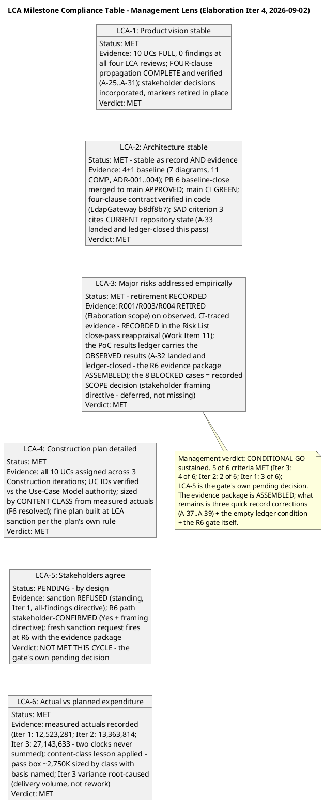

**Risk Retirement Trend (Inception → Elaboration Iter 4 — the management heuristic: high-magnitude risks must show DECREASING trend lines):**

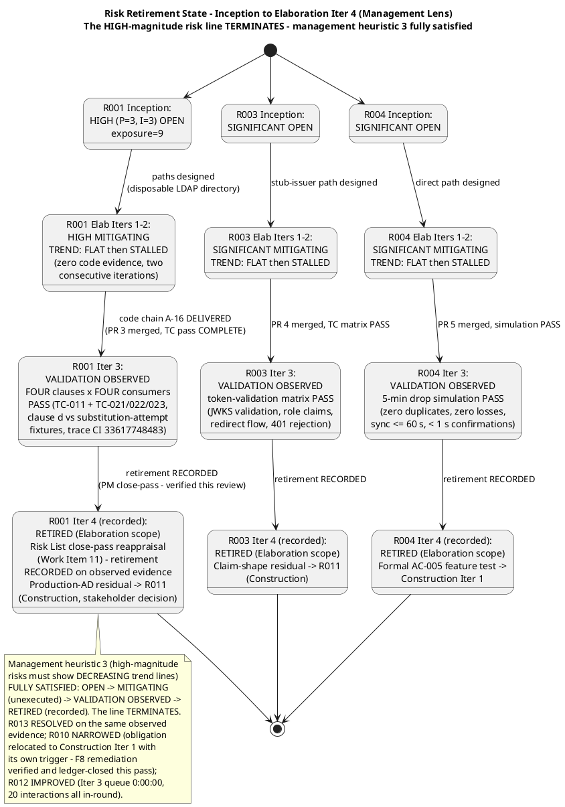

**Defect Distribution — Iteration 4 (this lens):**

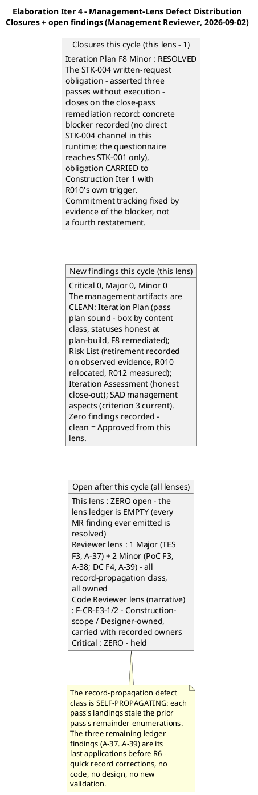

**Project Health Scorecard (four dimensions — a project green on three and red on one is NOT a green project):**

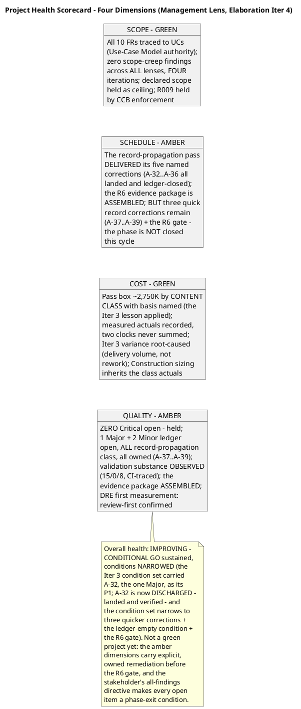

**Verdict: CONDITIONAL GO — sustained; architecture ACCEPTED (empirically validated, stable as record AND evidence, and the records are now current); phase transition CONDITIONAL on the R6 gate; the condition set NARROWS this cycle.**

The record-propagation pass delivered its five named corrections in full (A-32…A-36 all landed and ledger-closed by the Reviewer lens this same pass — verified in its Iter 4 record), and the R6 evidence package is ASSEMBLED: the PoC artifact carries the OBSERVED results (R001 four-clause × four-consumer clause-by-clause evidence, R003 matrix, R004 simulation, 15/0/8 with the 8 BLOCKED framed as a recorded SCOPE decision per the stakeholder's directive), the SAD criterion-3 record cites current repository state, the Test Case record is internally consistent, the Risk List records the retirement, and ARCH-6 carries the four-clause contract (sha 90e4f2e). This lens's one open finding (F8) is closed on the verified close-pass remediation. What withholds the phase transition remains the stakeholder's OWN standing directive — "Please fix all the findings even if they are minors prior to move to next phase" — plus the R6 process the stakeholder confirmed: the findings ledger is not empty (1 Major + 2 Minor ledger, all record-propagation class born of the pass's own landings; 2 narrative Construction-scope Minors carried with recorded owners). Withholding is a verdict, not a skip: the R6 re-presentation is three quick record corrections plus the PM pass-close reconciliation away from an empty ledger.

**Conditions (all owned, all record-propagation class — none requires code, design, or new validation):**

| # | Condition | Owner | Severity | Status vs Iter 3 |
|---|---|---|---|---|
| 1 | ~~A-32 — PoC results ledger~~ **DISCHARGED** — landed and ledger-closed (Reviewer lens, this pass); the R6 evidence package's core is ASSEMBLED | Software Architect | Major | **DONE** (was condition 1 at Iter 3) |
| 2 | **A-37 — TES remainder-enumerations updated from the observed same-pass landings** (the one Major remaining; the mission-verdict record must not contradict the PoC ledger it sits beside) | Test Manager | Major | NEW (born of the pass's own landings) |
| 3 | **A-38…A-39 — the two Minor record corrections** (PoC sha citation; DC status claims), per the DC's own same-pass discipline | Software Architect / Process Engineer | Minor | NEW |
| 4 | **Findings ledger EMPTY** across all lenses and all severities — the stakeholder's binding all-findings directive (exit criterion 11), verified via the findings system, not narrative claims | All emitting lenses | — | NARROWED (F8 closed this pass; 3 ledger findings remain) |
| 5 | **R6 re-presentation** with the evidence package + fresh sanction request to STK-001; the phase transition is sanctioned ONLY on a GRANTED sanction — LCA-5 remains the gate's own pending decision | Review Coordinator + Management Reviewer | — | UNCHANGED |

**Four-dimension health:** Scope GREEN; Schedule AMBER (three record corrections + the R6 gate remain); Cost GREEN; Quality AMBER (zero Critical held; 1 Major + 2 Minor ledger open, all record-propagation class, all owned). Overall: **IMPROVING — CONDITIONAL GO sustained.** Not a green project yet: the amber dimensions carry explicit, owned remediation before the R6 gate, and the stakeholder's all-findings directive makes every open item a phase-exit condition regardless of severity.

**Stakeholder consultation record (this cycle): none owed from this lens.** The sanction question is verbatim in the stakeholder's answered list (Iter 1: "No" + the binding all-findings directive — the work order forbids re-asking answered questions); the R6 path is stakeholder-CONFIRMED (Iter 3: "Yes" + the BLOCKED-cases framing directive), placing the fresh sanction request at R6 with the evidence package; the stakeholder explicitly closed the management-lens contribution cycle at the Iter 2 verdict gate ("I did share previously to Reviewer Management something to fix. All was clear on that questionnaire"); zero Critical findings open; zero new stakeholder-only decisions surfaced by this review (every remaining finding's remediation is fully determined by recorded same-pass landings); zero open consequential doubt. Requesting the sanction mid-cycle, with the ledger not yet empty, would contradict the stakeholder's own all-findings bar. The next stakeholder touchpoint is the R6 fresh sanction request itself.

**No milestone, iteration, or phase is marked complete by this record.** The Elaboration phase continues toward the R6 re-presentation. The next management-lens obligation arises at the R6 gate: the fresh sanction request to STK-001 with the evidence package, on an empty findings ledger.

**Traceability (this lens's Iter 4 rows):**

| Element | Traces From | Link Type | Traces To |
|---|---|---|---|
| Management-lens Iter 4 re-review (this record) | Work Order (Elab Iter 4 — LCA milestone review, management lens); SAD §Quality, Iteration Plan (Elab Iter 4 pass), Risk List (Iter 3 close-pass reappraisal), Iteration Assessment (Iter 3 close-out), Review Record (cumulative) read in full; measured actuals (Inception phase-level; Elab Iter 1: 12,523,281; Iter 2: 13,363,814; Iter 3: 27,143,633); SCM state per the technical lens's same-day first-hand verification (zero open PRs; main GREEN run 33639518709; Issues #1/#2 closed; Issue #9 satisfied on the A-32 evidence; CONTRIBUTING.md sha 90e4f2e) | Reviews | LCA milestone gate (CONDITIONAL GO sustained — R6); R6 re-presentation entry gate; actions A-37…A-39 (Reviewer lens); PM pass-close reconciliation |
| Iteration Plan F8 closure (Minor) | The finding's own closure bar (cited evidence in the close-pass artifacts); Iteration Plan Document Control Iter 3 Close-Pass Changes (1) + Next Iteration Preview (Construction Iter 1); Risk List R010 (obligation CARRIED, trigger armed); Iteration Assessment WI-2 reconciliation; stakeholder decision (response NOT an exit condition) | Resolves | The commitment-tracking discipline (blocker-or-evidence, never restatement); Construction Iter 1 plan (R010 written request at plan-build; trigger: STK-004 confirmation by Construction Iter 1 start); Construction Iter 3 integration testing |
| LCA compliance table + risk retirement state machine + defect distribution + health scorecard (this record) | RUP LCA milestone criteria (6); Risk List close-pass reappraisal (retirement recorded); Test Case Cycle 1 formal-pass record (15/0/8, trace CI 33617748483); PoC observed-results ledger (A-32, landed); management heuristics (risk-retirement trend verification — the line TERMINATES; four-dimension health; milestone-gated progression); all four diagrams validated via generate_uml before embedding | Refines | This Review Record (audit trail — criterion-by-criterion pass/fail, trend evidence, health dimensions, defect concentration); ReviewCoordinator LCA verdict aggregation; R6 re-presentation |
| CONDITIONAL GO verdict (Iter 4, sustained — conditions narrowed) | LCA-1..LCA-4, LCA-6 MET on observed evidence (LCA-3's residual — the PoC results ledger — DISCHARGED this pass); LCA-5 PENDING by design (R6 fresh sanction request); stakeholder all-findings directive (binding, standing); stakeholder R6-path confirmation ("Yes" + BLOCKED-cases framing directive); verified ledger after this revision (0 Critical / 1 Major / 2 Minor ledger + 2 narrative Minor — all record-propagation class, all owned) | Refines | R6 re-presentation (empty ledger + evidence package + fresh sanction request); phase transition (only on GRANTED sanction); Construction entry |

**Revision note (anchoring decision, recorded per the honest-recording discipline):** the management-lens Iter 4 record follows the combined-record pattern (Iter 3 management-lens precedent: scope + closures + compliance table + risk trend + defect distribution + health scorecard + verdict + traceability in one subsection) and is anchored in § Review Scope and Criteria — the business-lens Iter 4 precedent (same iteration) with its recorded truncation-risk rationale. Anchoring in § Disposition (the Iter 3 management-lens home) would have required reproducing that section's full preserved content — now the largest section of this cumulative artifact, grown this same iteration by the code-review-lens and technical-lens Iter 4 dispositions — in a single section-scoped upsert; the truncation-induced content-loss risk is exactly the failure mode the Iter 3 section-replacement lesson exists to prevent. The record remains discoverable by title for the coordinator's consolidation; the verdict is stated in full here and registered in Document Control. This lens's Iter 4 traceability rows are carried inline above (the artifact-level § Traceability registry is preserved untouched for the same reason).

### Elaboration Iteration 4 — Review Coordinator Consolidated Milestone Disposition (LCA Verdict Aggregation, 2026-09-02)

**Lens participation (per the Work Order — authoritative):** Technical/Reviewer — **EXECUTED** (5 of 5 prior findings of that lens RESOLVED on verified same-pass landings — PoC F2 Major, SAD F4, Test Case F1, TES F2, DC F3; 3 new record-propagation findings recorded — TES F3 Major, PoC F3 Minor, DC F4 Minor; actions A-37…A-39 assigned with owners; sanction still withheld on the all-findings directive). Business/BusinessReviewer — **EXECUTED** (BR-OK-INACTIVE sustained — fourth consecutive LCA-cycle verification; zero findings, zero BM conditions on the R6 gate). Management/ManagementReviewer — **EXECUTED** (Iteration Plan F8 RESOLVED — the lens's findings ledger is EMPTY, every MR finding ever emitted on this project resolved; CONDITIONAL GO sustained with the condition set narrowed; zero new findings). Code Reviewer — **EXECUTED** (PR #7 APPROVED — review 5090059324, CI GREEN run 33632200967; F-CR-E3-3 RESOLVED; zero new findings). No lens is recorded as INACTIVE — all lenses evaluated this review, and the milestone decision is based on the lenses that executed.

**Consolidated verdict: NO-GO CONFIRMED — the phase AUTO-ITERATES into the final record-correction pass. `requiresIteration: TRUE` recorded via `record_milestone_auto_iterate` immediately after the stakeholder contribution gate (this run — the gate is ANSWERED and folded below).** The character of the withholding is now at its narrowest of the phase: the R6 evidence package is ASSEMBLED (the PoC observed-results ledger — the core — landed and ledger-closed this cycle; the SAD criterion-3 record current; the Test Case record internally consistent; the Risk List retirement recorded; ARCH-6 four-clause at sha 90e4f2e), zero Critical findings are open for the second consecutive cycle, and the Management lens's ledger is EMPTY. What withholds the phase transition is the stakeholder's OWN standing all-findings directive plus the R6 process the stakeholder confirmed: the findings ledger is not empty (1 Major + 2 Minor ledger, all record-propagation class born of the pass's own landings; 2 narrative Construction-scope Minors carried with recorded owners), and the fresh sanction request fires at R6, not mid-cycle.

The verdict is anchored to the VERIFIED findings ledger, never to narrative or judgment — the sweep executed this consolidation across ALL 13 artifacts:

**[FINDINGS] read=13, unread=none, open Critical=0, open Major=1 [Test Evaluation Summary#F3], open Minor=2 [Architectural Proof-of-Concept#F3, Development Case#F4]** — plus 2 narrative-tracked Code Reviewer Minors (F-CR-E3-1/F-CR-E3-2 — Construction-scope/Designer-owned, carried with recorded owners). Ledger-closed this cycle: 7 (6 ledger — PoC#F2 Major, SAD#F4, Test Case#F1, TES#F2, DC#F3 by the Reviewer lens; Iteration Plan#F8 by the Management Reviewer lens; plus 1 narrative — Code Reviewer F-CR-E3-3).

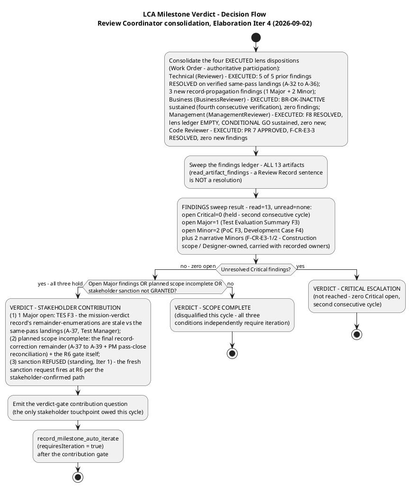

**Verdict data (from the verified ledger):** open Critical = 0 (held — second consecutive cycle); open Major = 1 [Test Evaluation Summary#F3 — stale remainder-enumerations vs the same-pass landings; the mission-verdict record contradicts the observed state of four artifacts; action A-37, Test Manager]; open Minor = 2 [Architectural Proof-of-Concept#F3 — CONTRIBUTING.md sha cited c86ebf7 vs the verified 90e4f2e; action A-38, Software Architect; Development Case#F4 — three stale A-32/PM-close-pass status claims; action A-39, Process Engineer]; plus 2 narrative-tracked Code Reviewer Minors (F-CR-E3-1 — interim IClockingsRepository vs INT-016, Implementer/Construction Iter 1 per R008; F-CR-E3-2 — INT-011 contract-table evolution, Designer, next Design Model pass). Planned scope (Iteration Plan, Elab Iter 4 record-propagation pass): the five named corrections A-32…A-36 ALL verified landed and ledger-closed — the R6 evidence package ASSEMBLED; the remaining planned work is the final record-correction remainder (A-37…A-39), the PM pass-close reconciliation (Work Item 9 / exit criterion 12 — the Iteration Assessment authored after the reviewers rule), and the R6 gate itself. Stakeholder sanction: **REFUSED (standing)** — the fresh request fires at R6 per the stakeholder-confirmed path. All three conditions independently require iteration; the decision flow terminates at the contribution branch.

**Consolidated Finding Tracker (Review Coordinator — verified ledger, Iter 4, 2026-09-02):**

**Ledger-vs-narrative reconciliation (conflict resolution):** the verified findings ledger (read_artifact_findings executed for ALL 13 artifacts, 2026-09-02) and the lens narratives AGREE — 0 Critical / 1 Major / 2 Minor open, plus 2 narrative-tracked Code Reviewer Minors (SCM-scoped remediations, not ledger artifacts). No cross-lens severity conflicts exist. The stakeholder's all-findings directive supersedes severity-based phase-exit prioritization: ALL tracked findings close (or carry with recorded Construction-scope dispositions per the framing directive) before phase transition.

| # | Finding Key | Lens | Severity | Artifact / Location | Owner (Action) | Deadline |
|---|---|---|---|---|---|---|
| 1 | TES F3 | Reviewer | **Major** | TES Milestone Target; master-workflow "Remaining" box; schedule Sequence 3; resources table; INC-1; Conclusions; recommendations 1–2; traceability rows | Test Manager (A-37) | Final record-correction pass — before R6 |
| 2 | PoC F3 | Reviewer | Minor | PoC § Traceability, behavioural-bar row (sha citation c86ebf7 vs verified 90e4f2e) | Software Architect (A-38) | Final record-correction pass — before R6 |
| 3 | DC F4 | Reviewer | Minor | DC exit-criteria criterion 3 "Remaining" line; PoC disposition paragraph + trigger-diagram note; Organization Assessment | Process Engineer (A-39) | Final record-correction pass — before R6 |
| 4 | F-CR-E3-1 | Code Reviewer (narrative) | Minor | Interim IClockingsRepository vs INT-016 final contract (PRs #3/#5) | Implementer (Construction Iter 1, R008) + Designer (INT-016 confirmation) | Construction Iter 1 (record note carried) |
| 5 | F-CR-E3-2 | Code Reviewer (narrative) | Minor | IAuthProvider operations absent from the INT-011 contract table (PR #4) | Designer (next Design Model evolution) | Next Design Model pass |

Deadlines are iteration-relative (the final record-correction pass and Construction boundaries), never projected calendar dates. **Overdue findings: 0 of 5** (all raised 2026-09-02; no deadline missed; no escalation notices owed). **Escalation status:** zero open Critical findings — the escalation invariant is satisfied with no new escalation owed; the standing escalations (Iter 1 Critical escalation; Iter 2 contribution cycle) are DISCHARGED with their resolutions recorded verbatim. Overdue-finding escalation to the Project Manager arms at the first missed deadline in the final record-correction pass, with systemic patterns escalating to the CCM Board.

**Conflict resolution and prioritization (coordinator consolidation, Iter 4):** (1) **Ledger-vs-narrative:** the verified ledger and the lens narratives AGREE — no reconciliation needed this cycle. (2) **One defect class — record propagation, SELF-PROPAGATING:** each pass's landings stale the prior pass's remainder-enumerations; the three remaining ledger findings (TES F3, PoC F3, DC F4) are its last applications before R6; the WORK is merged into ONE final correction pass (A-37…A-39 + PM pass-close); the findings are NOT merged (each emitting lens closes its own via resolve_artifact_finding on verified correction). (3) **The BLOCKED-cases framing directive remains binding** on the R6 evidence package: the 8 BLOCKED cases are stated as a recorded SCOPE decision — deferred to Construction, not missing. (4) **Priority order:** P1 A-37 (the one Major — R6 evidence-package internal consistency: the mission-verdict record must not contradict the PoC ledger it sits beside) → P2 A-38/A-39 (parallel quick record corrections) → P3 PM pass-close reconciliation (Work Item 9 / exit criterion 12; the Iteration Assessment is authored in the Assess touchpoint after the reviewers rule — never a finding here) → P4 the coordinator-enforced R6 entry gate.

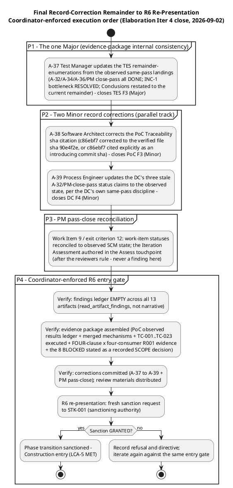

**LCA re-presentation entry gate (coordinator-enforced, R6):** (1) the findings ledger is EMPTY across ALL 13 artifacts — verified via read_artifact_findings, not via narrative claims; (2) the evidence package is assembled — the PoC observed-results ledger (A-32, landed and ledger-closed), merged mechanisms (PRs #3/#4/#5, #6, #7 — every PR that entered the phase left the gate with a terminal verdict), TC-001…TC-023 executed (15 PASS · 0 FAIL · 8 BLOCKED with the 8 BLOCKED stated as a recorded SCOPE decision per the stakeholder's framing directive), FOUR-clause × four-consumer R001 evidence (clause (d) verified against the substitution-attempt fixtures); (3) the corrections are committed (A-37…A-39) and the PM pass-close reconciliation is recorded (work-item statuses reconciled to observed SCM state per exit criterion 12); (4) review materials are distributed before the review begins. The stakeholder (STK-001 — sanctioning authority) receives a fresh sanction request; a GRANTED sanction plus an empty ledger plus completed planned scope is the only path to `requiresIteration: false`.

**Review Effectiveness Metrics (Review Coordinator — Iter 4 update, 2026-09-02):**

| Metric | Iter 1 (2026-09-01) | Iter 2 (2026-09-02) | Iter 3 (2026-09-02) | Iter 4 (2026-09-02) | Trend / Interpretation |
|---|---|---|---|---|---|
| Review coverage | 12 of 12 artifacts (100%) | 13 of 13 artifacts (100%) | 13 of 13 artifacts (100%) | 13 of 13 artifacts (100%) — all artifacts re-reviewed by the executing lenses; the code-review gate exercised on PR #7 | Coverage HELD at 100% across four cycles while the inventory grew — no artifact escaped formal review |
| Findings closed per cycle | 0 (first cycle) | 6 of 10 Iter 1 ledger findings | 12 closures (10 ledger + 2 narrative) | **7 closures** (6 ledger — 5 Reviewer-lens + 1 Management-lens; 1 narrative — Code Reviewer F-CR-E3-3) | Closure velocity high and sustained (0 → 6 → 12 → 7); the finding lifecycle executed end-to-end at scale, including the R6 evidence package's core (PoC F2) closed on verified observed results |
| New findings per cycle | 10 (4 Critical, 1 Major, 5 Minor) | 8 new + 2 persisting Criticals | 6 new ledger (0 Critical, 1 Major, 5 Minor) + 3 narrative Minor | **3 new ledger (0 Critical, 1 Major, 2 Minor) + 0 narrative** | Severity profile COLLAPSED: 4 Critical → 2 Critical → 0 Critical → 0 Critical; the defect class is now purely record-propagation — the cheapest class to fix |
| Recurrence rate | — (first cycle) | 2 of 10 (both the same underlying defect) | 0 of 12 — every closure held | **0 of 7 — no prior finding recurred; every closure held** | 100% non-recurrence two consecutive cycles — the closures are STICKY; remediation quality is sustained |
| Defect removal efficiency | NOT YET MEASURABLE (all TC BLOCKED) | STILL NOT MEASURABLE (all TC BLOCKED) | FIRST MEASUREMENT: review-first confirmed — all code defects caught at the PR gate, zero test failures across 15 executed cases | **SECOND MEASUREMENT: review-first HELD** — PR #7 clean (zero code findings of any severity); the regression baseline HELD 15/0/8 on the merged tree | The review-first discipline is confirmed as the process baseline across two measured cycles; record-class defects (3 this cycle) remain review-only detectable — reviews carry that load by design |
| Rework effort | Convergence cycle IS the rework vehicle; no measured actuals | Record-side rework done; code-side pending | Record-propagation remainder sized in the plan (WI 9 ~1,250K, WI 10 ~210K, WI 11 ~730K, WI 12 ~1,140K) | Final record-correction remainder: A-37…A-39 — three quick record corrections, no code, no design, no new validation | Rework shrinking to record-only; first full pass actual records at the close assessment |
| Findings overdue | 0 of 10 | 0 of 12 | 0 of 9 | **0 of 5** | Review debt: none accrued across four cycles; escalation arms at the first missed deadline |

**Interpretation (metrics with meaning):** the review process is EFFECTIVE and its effectiveness is now confirmed across two measured cycles — defect removal efficiency held (review-first: all code defects caught at the PR gate, zero test failures, regression baseline held on PR #7), the recurrence rate stayed at zero for a second consecutive cycle (every closure held), and the severity profile collapsed from 4 Critical (Iter 1) to zero Critical (Iters 3–4) with the defect class now purely record-propagation — self-limiting under the DC's same-pass discipline, whose final three applications (A-37…A-39) are the entire remaining ledger. Deterioration check (heuristic 6): coverage NOT declining (100% held four cycles), rework NOT rising (shrinking to record-only), DRE NOT falling (held) — no rigor-loss signal; the process requires no correction this cycle.

**Stakeholder contribution at the verdict gate (Iter 4 — ANSWERED and folded, 2026-09-02 — contribution cycle CLOSED):** the contribution question was emitted at this consolidation in valid emission format (the marker on its own line, immediately followed by the minimal JSON array — question/type/isRequired only, per the recorded parser lesson) and ANSWERED. **Stakeholder answer, recorded verbatim: "Close all findings and issues opened."** Verification before folding: the answer adds NO new scope, NO correction, and NO priority beyond the standing record — it REINFORCES the binding all-findings directive (Iter 1, verbatim: "Please fix all the findings even if they are minors prior to move to next phase"; escalation resolution, verbatim: "Fix all the issues and close all findings") and states it explicitly for this pass's remainder: the three open ledger findings (TES#F3 Major; PoC#F3, DC#F4 Minor — actions A-37…A-39) close before the R6 re-presentation, and the open SCM issues close on their evidence — Issue #9 (the PoC results-ledger CR named in this Work Order) has its remediation LANDED and verified first-hand this cycle (the A-32 observed-results ledger), so it closes on that evidence; Issues #1/#2 are already closed (cr:complete); no other issue is open. The answer is consistent with the verified ledger, where every open item already carries an owner and concrete remediation. The answer does NOT change the verdict — the same three conditions (1 Major open, planned scope incomplete, sanction REFUSED standing) that required iteration before the answer still require it after; the contribution closes the gate without adding work. The milestone auto-iteration (requiresIteration: TRUE) is recorded immediately after this folding. The next stakeholder touchpoint is the R6 fresh sanction request itself.

**No milestone, iteration, or phase is marked complete by this record.** The Elaboration phase continues into the final record-correction pass. The consolidated execution order above sequences the remaining work; the Consolidated Finding Tracker carries every open finding with owner and deadline; the escalation protocol arms at the first missed deadline. The next review re-evaluates LCA at the R6 gate against the same six criteria plus the stakeholder's all-findings-closure condition.

**Revision note (anchoring decision, recorded per the honest-recording discipline):** the coordinator's Iter 4 consolidated milestone disposition follows the combined-record pattern and is anchored in § Review Scope and Criteria — the same-iteration lens precedent (business, technical and management lens records, each with its recorded truncation-risk rationale). Anchoring in § Disposition (the Iter 1/2/3 coordinator precedent home) would have required reproducing that section's full preserved content — the largest section of this cumulative artifact, grown this same iteration by the code-review-lens and technical-lens Iter 4 dispositions — in a single section-scoped upsert; the truncation-induced content-loss risk is exactly the failure mode the Iter 3 section-replacement lesson exists to prevent. The record remains discoverable by title for the R6 gate; the verdict is stated in full here and registered in Document Control. This record's traceability rows are carried inline below (the artifact-level § Traceability registry is preserved untouched for the same reason).

**Traceability (this record's rows):**

| Element | Traces From | Link Type | Traces To |
|---|---|---|---|
| Coordinator Iter 4 consolidated milestone disposition (this record) | Work Order (Elab Iter 4 — phase-level milestone review consolidation; lens participation authoritative: all four EXECUTED); the four Iter 4 lens records (code-review, technical, business, management — preserved above); verified findings ledger (read_artifact_findings ×13, 2026-09-02 — [FINDINGS] read=13, unread=none, 0 Critical / 1 Major / 2 Minor + 2 narrative); stakeholder standing record (sanction REFUSED; all-findings directive; R6 path CONFIRMED "Yes" + BLOCKED-cases framing directive) | Reviews | LCA milestone gate (NO-GO CONFIRMED — final record-correction pass); R6 re-presentation entry gate; actions A-37…A-39; PM pass-close reconciliation |
| Consolidated Finding Tracker (Iter 4) | Verified ledger (0 Critical / 1 Major / 2 Minor open; 7 closures this cycle — 6 ledger + 1 narrative); lens narratives (agreement verified); stakeholder all-findings directive (binding on phase exit); cross-lens ownership invariant (only the emitting lens closes via resolve_artifact_finding) | Reviews | All 5 tracked findings (owners A-37…A-39 + Construction-scope remediations); escalation protocol (0 overdue; arms at first missed deadline); R6 entry gate (ledger EMPTY across all lenses and severities) |
| Iter 4 Review Effectiveness Metrics | Review coverage (13/13, fourth consecutive 100% cycle; code-review gate exercised on PR #7); closure velocity (0 → 6 → 12 → 7); recurrence rate (0 of 7 — second consecutive zero); DRE second measurement (review-first HELD — PR #7 clean, regression baseline 15/0/8 held); rework (record-only remainder A-37…A-39); overdue (0 of 5) | Refines | R6 process-effectiveness baseline; Elaboration close assessment; review-process rigor check (no deterioration signal across four cycles) |
| Coordinator consolidated verdict (requiresIteration: TRUE, Iter 4) | Verified ledger ([FINDINGS] read=13, unread=none, 0 Critical / 1 Major / 2 Minor); planned scope incomplete (A-37…A-39 + PM pass-close + the R6 gate); stakeholder sanction REFUSED (standing — fresh request at R6 per the stakeholder-confirmed path); **stakeholder contribution at the verdict gate ANSWERED and folded (2026-09-02), verbatim: "Close all findings and issues opened" — reinforces the standing all-findings directive and extends it to the open SCM issues (Issue #9 closes on the verified A-32 evidence; Issues #1/#2 already closed)**; record_milestone_auto_iterate(requiresIteration=true) recorded immediately after the contribution gate | Refines | Final record-correction pass (A-37…A-39 + PM pass-close); R6 LCA re-presentation (empty ledger + evidence package + fresh sanction request); phase transition (only on GRANTED sanction); Construction entry |

### Elaboration Iteration 5, Cycle 1 — Code-Review-Lens Record (Code Reviewer, 2026-09-02)

**Scope and criteria (this lens, this cycle):** the PR approval loop per the Work Order — discover `ready-for-review` branches, ensure ONE open PR per branch with base `iteration/E5`, review each against checklist CR-1…CR-7 (programming guidelines + dual coverage + SAD/Design Model conformance + acceptance criteria + traceability trailer + build-tree coverage), and emit a terminal disposition per PR. Upstream consumption: the prior Review Record read in full (the cumulative state — this lens's open narrative findings F-CR-E3-1/F-CR-E3-2; the Iter 4 consolidated milestone disposition with the folded stakeholder answer "Close all findings and issues opened"); the SAD/Design Model baselines carried from the cumulative record (loaded at Iter 1, verified against the merged mechanism code at Iters 3/4 — COMP-001…011, ADR-001…004, CLS-001…027, INT-006…019); the CONTRIBUTING.md guidelines baseline carried (sha 90e4f2e, four-clause ARCH-6, verified first-hand at Iter 4). SCM state verified first-hand this cycle: `scm_list_branches_with_label("ready-for-review")` → **0 branches**; `scm_list_pull_requests(state="open")` → **0 open PRs**; `scm_get_repo_tree("main")` → 85 entries, mechanism code present (Infrastructure/, Services/, tests/ with the full suite and fixtures), unchanged vs the Iter 4 verified state; `scm_get_build_status("main")` → **GREEN** (run 33639518709, completed 2026-09-02 14:04:14Z).

**Work Order CRs cross-check (this cycle):** the two Change Requests named in this Work Order — [Moderate] Architectural Proof-of-Concept and [Moderate] Test Evaluation Summary — target record-propagation artifacts owned by the Software Architect (A-38, the PoC sha citation) and the Test Manager (A-37, the TES remainder-enumerations). Neither is a code handoff; neither enters the PR gate; neither is an artifact this lens owns. They are noted here for the record and left to their owning roles — the technical lens owns the verification of their landing.

**Gate Execution — What Was Run This Cycle (Code-Review Lens, Iter 5):**

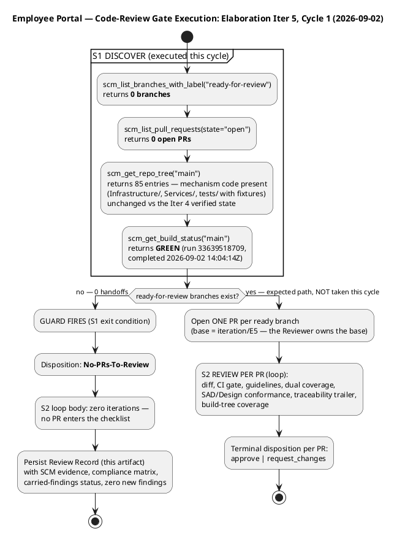

**Compliance Matrix — Checklist × Status (Code-Review Lens, Iter 5):**

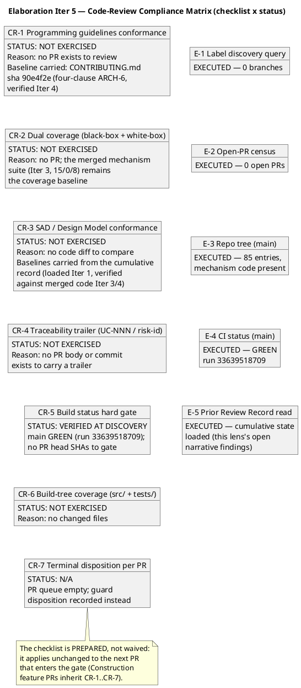

**SCM Evidence Snapshot (Iter 5 — what actually happened, verified first-hand):**

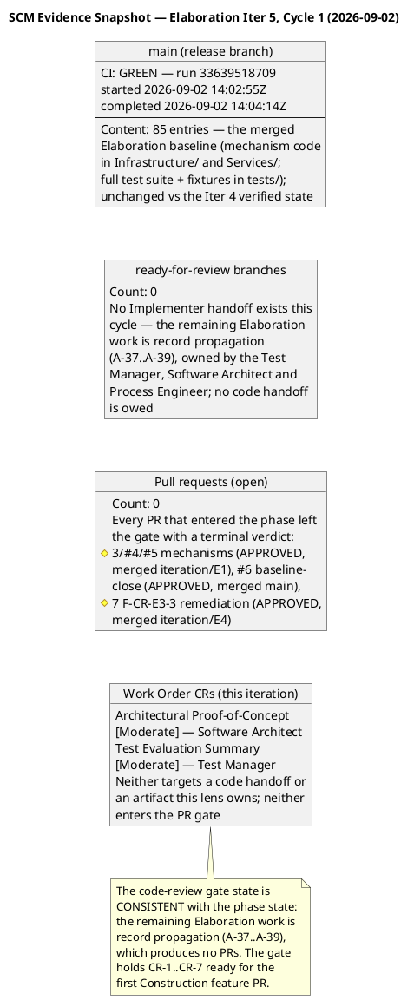

**Carried-findings status (this lens — narrative-tracked findings, re-examined against the observed SCM state this cycle):**

| Finding Key | Severity | Location | Status (Iter 5) | Evidence |
|---|---|---|---|---|
| **F-CR-E3-1** | Minor | PRs #3/#5 (Iter 3) — interim `InMemoryClockingsRepository` vs Design Model INT-016 | **OPEN — unchanged, Construction scope** | The interim `src/EmployeePortal/Infrastructure/ClockingsRepository.cs` is verified still present in the tree (repo tree read this cycle) — consistent with the recorded disposition: the PG adapter lands Construction Iteration 1 per R008, and the `[DEFERRED]` marker is carried in the Iter 3 record. No new evidence changes the finding; it is NOT re-emitted (one ledger entry per logical defect). |
| **F-CR-E3-2** | Minor | PR #4 (Iter 3) — `IAuthProvider` operations absent from the INT-011 contract table | **OPEN — unchanged, Designer-owned** | No Design Model evolution signal exists this cycle (no CR targets it; the Work Order's upstream list carries the Iter 4 revision unchanged); the contract-table evolution remains assigned to the Designer's next Design Model pass. NOT re-emitted (one ledger entry per logical defect). |

**Defect Distribution — Iteration 5 (severity × scope, Code-Review Lens):**

```plantuml
@startuml
title Elaboration Iter 5 - Code-Review Defect Distribution\nClosures + open findings (Code Reviewer lens, 2026-09-02)

object "Closures this cycle (this lens)" as C1 {
  NONE — no code handoff entered
  the gate this cycle; the lens's
  last closure was F-CR-E3-3 at
  Iter 4 (PR #7 APPROVED, review
  5090059324)
}
object "New findings this cycle (this lens)" as C2 {
  Critical 0, Major 0, Minor 0
  Zero PRs reviewed; the guard
  disposition carries no defect;
  no uncited-taste observations
  recorded (findings cite rules —
  anti-pattern 2 discipline)
}
object "Open after this cycle (this lens)" as C3 {
  F-CR-E3-1 Minor : OPEN — Construction
  scope (interim IClockingsRepository vs
  INT-016 final contract; the interim
  ClockingsRepository.cs verified still
  present in the tree; PG adapter lands
  Construction Iter 1 per R008)
  F-CR-E3-2 Minor : OPEN — Designer-owned
  (IAuthProvider operations absent from
  the INT-011 contract table; next
  Design Model pass; no evolution signal
  this cycle)
  Both narrative-tracked, carried with
  recorded owners, non-Elaboration-
  blocking per the stakeholder's
  framing directive (Construction-scope
  mechanisms are deferred, not missing)
}
C1 -[hidden]-> C2
C2 -[hidden]-> C3

note bottom of C3
  This lens's Elaboration-blocking
  findings: ZERO. The code-review
  gate is CLOSED for this cycle:
  no ready-for-review branch and no
  open PR remains unreviewed.
end note
@enduml
```

**Gate disposition (code-review lens, Iter 5): CLOSED — No-PRs-To-Review.** The S1 guard fired: zero `ready-for-review` branches and zero open PRs. No PR received a terminal SCM review decision this cycle because no PR existed; the guard disposition is the cycle's terminal outcome, and the checklist (CR-1…CR-7) is declared PREPARED, not waived — it applies unchanged to the next PR that enters the gate (Construction feature PRs inherit it in full). The gate state is CONSISTENT with the phase state: the remaining Elaboration work is record propagation (A-37…A-39 + PM pass-close), which produces no PRs; every PR that entered the phase across Iters 1–5 left the gate with a terminal verdict (PRs #3/#4/#5 mechanisms APPROVED ×3 merged to iteration/E1; PR #6 baseline-close APPROVED merged to main; PR #7 F-CR-E3-3 remediation APPROVED merged to iteration/E4).

**Iteration completion verdict (code-review lens, Iter 5):** the iteration's code-review objectives are **MET this cycle** — (1) the S1 discovery executed in full with first-hand SCM evidence; (2) the gate holds no undecided PR and no unreviewed labelled branch; (3) zero new findings of any severity; (4) this lens's carried findings are re-examined and their dispositions re-verified against the observed tree. The milestone is NOT declared achieved by this record — the phase-level sanction remains withheld per the stakeholder's standing all-findings directive (reinforced at the Iter 4 verdict gate, verbatim: "Close all findings and issues opened"); the remaining open items (the Work Order's two CRs — the PoC and TES record corrections, actions A-37/A-38 in flight with their owning roles; DC F4 / A-39 if still open; F-CR-E3-1/2 carried Construction-scope/Designer-owned) belong to their owning lenses and roles, and the technical lens owns the verification of the record corrections' landing.

**Scope adherence (code-review lens, Iter 5):** no scope-creep finding — no code entered the tree this cycle (the tree is unchanged vs the Iter 4 verified state), so there is no product-surface change to evaluate. The absence of a handoff cannot inflate scope.

**Stakeholder consultation record (this lens, Iter 5):** none owed — no PR, no new finding, no new stakeholder-only decision is surfaced by this review; the two Work Order CRs trace to recorded findings (TES F3, PoC F3) whose remediation was fully determined at Iter 4. The next stakeholder touchpoint remains the R6 fresh sanction request (owned by the Review Coordinator + Management Reviewer).

**Revision note (anchoring decision, recorded per the honest-recording discipline):** the Iter 5 code-review-lens record follows the combined-record pattern (the Iter 4 lens precedent: scope + gate execution + compliance matrix + SCM snapshot + carried-findings status + defect distribution + gate disposition + traceability rows in one subsection) and is anchored in § Review Scope and Criteria. Anchoring in § Findings and § Disposition (the Iter 4 code-review-lens homes) would have required reproducing BOTH of the two largest sections of this cumulative artifact — each grown further at Iter 4 by the technical-lens records — in two separate section-scoped upserts; the doubled truncation-induced content-loss risk is exactly the failure mode the Iter 3 section-replacement lesson exists to prevent. The record remains discoverable by title for the coordinator's consolidation; the gate disposition is registered in Document Control. This record's traceability rows are carried inline below (the artifact-level § Traceability registry is preserved untouched for the same reason).

**Traceability (this lens's Iter 5 rows):**

| Element | Traces From | Link Type | Traces To |
|---|---|---|---|
| Code-review-lens Iter 5 record (this record) | Work Order (Elab Iter 5 — PR approval loop; the two Moderate CRs targeting the PoC and TES); prior Review Record read in full (cumulative state — F-CR-E3-1/2 open, the Iter 4 consolidated disposition); SCM state verified first-hand (label query → 0 branches; open-PR census → 0; repo tree main → 85 entries unchanged; build status main → GREEN run 33639518709); SAD/Design Model/CONTRIBUTING baselines carried from the cumulative record | Reviews | The R6 re-presentation path (record-propagation remainder owned by other roles: A-37…A-39 + PM pass-close); the Integrator merge gate (nothing pending); this cumulative Review Record (Iter 5 code-review-lens record appended; all prior records preserved verbatim) |
| Guard disposition No-PRs-To-Review (Iter 5) | scm_list_branches_with_label (0), scm_list_pull_requests open (0), scm_get_repo_tree (85 entries, unchanged), scm_get_build_status (GREEN 33639518709) — all executed 2026-09-02; the phase state (remaining Elaboration work = record propagation, no code handoff owed) | Refines | The first Construction feature PR (inherits CR-1…CR-7 unchanged); the R6 entry gate (this lens adds zero new ledger entries) |
| F-CR-E3-1 / F-CR-E3-2 (remain open, Iter 5) | Design Model INT-016 (final contract — staging via INT-015, AddRange) + R008 (Construction build-time validation) + ADR-002 (F-CR-E3-1); Design Model INT-011 (contract table) + CON-004 (redirect flow) + SEQ-001 (F-CR-E3-2); the observed tree (ClockingsRepository.cs still present — consistent with the recorded interim disposition) | Reviews | Construction Iteration 1 PG adapter (Implementer, R008) + INT-016 confirmation (Designer) — F-CR-E3-1; INT-011 contract-table evolution (Designer, next Design Model pass) — F-CR-E3-2; both Construction-scope/Designer-owned, non-Elaboration-blocking per the stakeholder's framing directive |
| Work Order CRs cross-check (Iter 5) | Work Order Change Requests section ([Moderate] Architectural Proof-of-Concept; [Moderate] Test Evaluation Summary); the Iter 4 findings they trace to (PoC F3 → A-38, Software Architect; TES F3 → A-37, Test Manager); the cross-lens ownership invariant (this lens records the cross-check; the technical lens owns the landing verification) | Reviews | A-37 (Test Manager), A-38 (Software Architect) — in flight this iteration; the R6 entry gate (ledger emptiness depends on their landing, owned by their emitting lens) |

### Elaboration Iteration 5, Cycle 1 — Technical-Lens LCA Re-Review Record (Reviewer, 2026-09-02 — final record-correction pass)

**Scope and criteria (this lens, this cycle):** ALL 13 artifacts in the inventory, reviewed against the **LCA exit-criteria lens** on the final record-correction track — the pass executing the stakeholder-confirmed R6 path's last leg: three record corrections (A-37…A-39), the Issue #9 closure, the same-pass discipline applied to the pass's own landings (pass exit criterion 4, R014 mitigation), and the R6 re-presentation itself. Priority order: Architectural Proof-of-Concept first (the CR-targeted artifact and the R6 evidence package's core), then the Test Evaluation Summary (the second CR-targeted artifact and the mission-verdict record), then the Development Case (the third correction's target), then the Test Case (the execution authority), then the SAD and Design Model (the architecture baseline), then the Risk List and Iteration Plan (the PM artifacts), then the preserved requirements artifacts. Upstream consumption complete before findings: all 13 artifacts read in full this cycle; the Work Order's declared scope, the stakeholder's recorded decisions (four-clause behavioural bar; featured-banner stack; all-findings directive; BLOCKED-cases framing directive; R6-path confirmation; the Iter 4 verdict-gate answer "Close all findings and issues opened"), and the two Work Order CRs ([Moderate] Architectural Proof-of-Concept, [Moderate] Test Evaluation Summary) cross-checked; **SCM state verified empirically** (`scm_list_pull_requests` state=open → zero open PRs; the Test Case Iter 5 verification record's first-hand evidence — main GREEN run 33639518709, the release-branch full-suite re-run; zero open SCM issues, Issues #1/#2/#9 all cr:complete, verified via the Test Case and TES Iter 5 records' first-hand `scm_list_issues` census). Checklists applied per artifact type: PoC → trigger + validation-protocol + results-ledger + evidence-citation checklist; TES → mission-verdict + remainder-enumeration checklist; Development Case → IARI baseline conformance + status-claim currency; Test Case → execution-record internal-consistency checklist; SAD → milestone-assessment currency checklist; Design Model → contract-table verification + co-owned-section integrity; Risk List → reappraisal checklist; Iteration Plan → pass-plan integrity checklist. Iteration Assessment excluded per review-point rules (the PM authors it AFTER this review — its absence is never a finding).

**Prior-findings reconciliation (this lens — executed in the dedicated closure state, tool calls FIRST):** [PLAN] artifacts × prior findings of this lens with resolution==null: Architectural Proof-of-Concept: [2] (F3, Minor), Test Evaluation Summary: [2] (F3, Major), Development Case: [3] (F4, Minor). TOTAL: 3. All three disposed via `resolve_artifact_finding` (all returned ok, 2026-09-02): **Architectural Proof-of-Concept F3 (Minor) RESOLVED** — the A-38 sha citation corrected: the PoC § Traceability behavioural-bar row now cites "CONTRIBUTING.md ARCH-6 (fourth clause, action A-36 — file sha 90e4f2e1b91bdb64082dcc9f75a4b32c3cc10f80 on main, verified via scm_get_file_content Elab Iter 5; citation corrected per action A-38, closing PoC F3)" — the verified current file sha, exactly as the remediation demanded; **Test Evaluation Summary F3 (Major) RESOLVED** — the A-37 remainder-enumerations updated from the observed same-pass landings: every named location (Milestone Target; master-workflow "Remaining" box; schedule Sequence 3; resources table; INC-1; Conclusions "What the mission cannot yet claim"; recommendations 1–2; traceability rows) now records A-32/A-34/A-36/A-33/PM-close-pass as landed and ledger-closed, INC-1's bottleneck RESOLVED ("Nothing test-side stands between the team and the assemblable LCA evidence package — the package IS assembled"), the mission verdict ("VALIDATION SUBSTANCE ACHIEVED — OBSERVED") correct and unchanged; **Development Case F4 (Minor) RESOLVED** — the A-39 three status claims corrected to the observed state (criterion 3 "Remaining: nothing on this criterion — the record-propagation obligations named at Iter 4 are discharged; the R6 evidence package is assembled"; PoC disposition "obligation DISCHARGED"; Organization Assessment "retirement RECORDED"). [EXIT] S_RECONCILE complete: closed=3 (Resolved), deferred=0, rejected=0, left-open=0. Total disposed: 3 of 3. **The two Work Order CRs are DISCHARGED on this verification: the [Moderate] Architectural Proof-of-Concept CR (PoC F3 → A-38) and the [Moderate] Test Evaluation Summary CR (TES F3 → A-37) both landed and ledger-closed.**

**New findings (this lens, this cycle — all emitted via `record_artifact_finding` before this upsert; both the R014 self-propagation class, trigger FIRED exactly as registered):**

| Finding Key | Severity | Artifact | Description (summary) | Remediation (summary) |
|---|---|---|---|---|
| **TES F4** | **Major** | Test Evaluation Summary — Milestone Target; master-workflow "Remaining before R6" box; schedule Sequence 4; Conclusions "What the mission cannot yet claim"; recommendation 8 | **Stale remainder-enumerations vs the same-pass landings — the R014 self-propagation class, minted at this review exactly as registered.** The TES (Iter 5 revision, action A-37) enumerates A-38 and A-39 as REMAINING work in five locations — the Milestone Target ("What remains before R6 is record corrections only: A-38 (PoC sha citation, Minor — Software Architect), A-39 (DC status claims, Minor — Process Engineer), the PM pass-close reconciliation… and the R6 gate itself"); the master-workflow "Remaining before R6" box ("A-38 PoC sha citation (Architect, Minor) A-39 DC status claims (Process Engineer, Minor)"); schedule Sequence 4 ("A-38 (Architect) + A-39 (Process Engineer) — two Minor record corrections in flight"); the Conclusions ("What remains before R6 is: A-38… A-39…"); and recommendation 8 ("Close the two remaining Minor record corrections before R6"). All five are now FALSE against the observed same-pass state, verified first-hand this review: A-38 LANDED (the PoC § Traceability row cites the verified file sha 90e4f2e "closing PoC F3" — ledger-closed by this lens on that verification) and A-39 LANDED (the DC's three named locations corrected — "DC F4 RESOLVED this revision (A-39 landed)" — ledger-closed by this lens on that verification). The TES is the LCA test-evidence record the R6 gate reads BESIDE the PoC: the TES says "A-38 remains" while the PoC says "A-38 landed and closed PoC F3" — a direct cross-artifact contradiction inside the evidence package, the same defect class and mechanism as TES F3 (Major, Iter 4), which this very revision remediated for the PRIOR pass's landings. The same-pass discipline (pass exit criterion 4, R014 mitigation) required every record enumerating what remains to be updated IN THIS PASS when A-38/A-39 landed — the TES was not. R014's trigger fires on this finding. | Test Manager executes one targeted TES update BEFORE R6, per the same-pass discipline (the remainder statement re-verified against the verified findings ledger before upsert): (1) Milestone Target → the record-propagation corrections are ALL landed and ledger-closed (A-37 this revision; A-38/A-39 landed 2026-09-02, both ledger-closed by the Reviewer lens on first-hand verification); what remains is the PM pass-close reconciliation (Work Item 9 / exit criterion 12) and the R6 gate itself; (2) the master-workflow "Remaining" box, schedule Sequence 4, the Conclusions "What the mission cannot yet claim", and recommendation 8 → restated to the CURRENT remainder (this finding's own remediation, the DC Milestone Target correction, the PM pass-close reconciliation, and the R6 gate); (3) recommendation 8 retired or restated accordingly. The mission verdict itself ("VALIDATION SUBSTANCE ACHIEVED — OBSERVED") is correct and unchanged; no verdict beyond the Test Case authority's record. |
| **DC F5** | **Minor** | Development Case — Milestone Target | **Stale Milestone Target enumeration vs the same-pass landings — the R014 class, second location.** The DC Milestone Target (Iter 5 revision, action A-39) reads: "what remains is three quick record corrections (A-37 TES remainder-enumerations — the one Major; A-38 PoC sha citation — Minor; A-39 DC status claims — resolved this revision), the PM pass-close reconciliation, and the R6 gate itself." A-37 has LANDED (the TES remainder-enumerations updated from the observed same-pass landings — verified first-hand this review; TES F3 ledger-closed by this lens) and A-38 has LANDED (the PoC sha citation corrected — verified first-hand; PoC F3 ledger-closed). Only A-39 is correctly marked resolved. The DC is the governance document whose exit-criteria table carries the all-findings gate record (criterion 9) and whose Milestone Target the R6 entry gate reads for process state; it understates the observed state of two of the three corrections it enumerates — the same class as DC F4 (Minor, Iter 4), which this revision remediated for the PRIOR pass's landings, and a violation of the DC's own binding same-pass record-propagation discipline on its second application. | Process Engineer corrects the Milestone Target to the observed state in the next DC touch before R6: all three record corrections landed and ledger-closed 2026-09-02 (A-37 — TES, ledger-closed; A-38 — PoC, ledger-closed; A-39 — this revision); what remains is the PM pass-close reconciliation (Work Item 9 / exit criterion 12) and the R6 gate itself. One-location correction; the remainder statement is re-verified against the verified findings ledger before upsert, per the DC's own discipline. |

**Compliance Matrix — Technical LCA Lens, Iteration 5 (13 artifacts × checklist dimensions):**

```plantuml
@startuml
title Elaboration Iter 5 - Technical LCA Review Compliance Matrix\n13 artifacts x checklist dimensions (Reviewer lens, final record-correction pass, 2026-09-02)

object "Architectural Proof-of-Concept" as POC {
  Prior F3 Minor - A-38 sha citation : PASS - RESOLVED this review
  Observed results ledger intact : PASS
  R001 4 clauses x 4 consumers evidence : PASS
  15/0/8 BLOCKED = recorded SCOPE decision : PASS
  Sha citations verifiable (90e4f2e) : PASS
  New findings : NONE - clean
}
object "Software Architecture Document" as SAD {
  4+1 baseline stable as record AND evidence : PASS
  LCA criterion 3 cites current state : PASS (A-33, held)
  Empirical disposition + 4-clause bar : PASS
  New findings : NONE - clean
}
object "Design Model" as DM {
  INT-011 verified vs merged code (8758844f) : PASS
  F-CR-E3-3 semantics aligned (state = no CSRF, DEFERRED) : PASS
  Co-owned sections intact : PASS
  New findings : NONE - clean
}
object "Test Case" as TC {
  Summary = per-case = corrections (15+8=23) : PASS (A-34, held)
  Iter 5 release-branch verification : PASS - exemplary
  Zero open issues census : PASS
  New findings : NONE - clean
}
object "Test Evaluation Summary" as TES {
  Prior F3 Major - A-37 remainder-enumerations : PASS - RESOLVED this review
  Mission verdict correct and observed : PASS
  Remainder-enumerations vs same-pass landings : FAIL - F4 NEW (Major)
  (A-38/A-39 claimed remaining - both landed and ledger-closed)
}
object "Development Case" as DC {
  Prior F4 Minor - A-39 status claims : PASS - RESOLVED this review
  IARI baseline conformance : PASS
  Milestone Target vs same-pass landings : FAIL - F5 NEW (Minor)
  (A-37/A-38 claimed remaining - both landed and ledger-closed)
}
object "Risk List" as RISK {
  R014 registration sound (P=3, I=2 justified) : PASS
  R012 trend updated on measured actuals : PASS
  Retirement records terminal and verified : PASS
  New findings : NONE - clean
}
object "Iteration Plan" as PLAN {
  Pass plan sound (box by content class, tax priced in) : PASS
  Same-pass discipline as exit criterion 4 : PASS
  WI statuses Pending at plan-build : NOT A FINDING (reconciliation at pass close)
  New findings : NONE - clean
}
object "Use-Case Model" as UCM {
  Clean at all four prior LCA reviews : PRESERVED
}
object "Supplementary Specification" as SUP {
  Clean at all four prior LCA reviews : PRESERVED
}
object "Vision" as VIS {
  Inception-approved, 0 findings : PRESERVED
}
object "Iteration Assessment" as IA {
  PM authors AFTER this review : EXCLUDED per review-point rule
}

POC -[hidden]-> SAD
SAD -[hidden]-> DM
DM -[hidden]-> TC
TC -[hidden]-> TES
TES -[hidden]-> DC
DC -[hidden]-> RISK
RISK -[hidden]-> PLAN
PLAN -[hidden]-> UCM
UCM -[hidden]-> SUP
SUP -[hidden]-> VIS
VIS -[hidden]-> IA

note bottom of TES
  The R014 self-propagation class fired
  its registered trigger: this pass's
  own landings (A-37/A-38/A-39) staled
  the remainder-enumerations written
  earlier in the same pass. 2 new
  findings minted - both quick record
  corrections (A-40/A-41).
end note
@enduml
```

**Defect Distribution — Iteration 5 (this lens):**

```plantuml
@startuml
title Elaboration Iter 5 - Technical-Lens Defect Distribution\nClosures + new findings, severity x artifact (Reviewer lens, 2026-09-02)

object "Closures this cycle (this lens - 3, all Resolved)" as C1 {
  PoC F3 Minor : A-38 sha citation corrected
  (90e4f2e verified first-hand) - the
  Work Order PoC CR DISCHARGED
  TES F3 Major : A-37 remainder-enumerations
  updated from the observed same-pass
  landings - the Work Order TES CR
  DISCHARGED
  DC F4 Minor : A-39 three status claims
  corrected to the observed state
}
object "New findings this cycle (this lens - 2)" as C2 {
  Major 1 : TES F4 - five locations still
  enumerate A-38/A-39 as remaining while
  both landed and ledger-closed this pass
  Minor 1 : DC F5 - Milestone Target
  enumerates A-37/A-38 as remaining while
  both landed and ledger-closed
  Both : R014 self-propagation class -
  the registered trigger FIRED (findings
  minted at the Iter 5 review, exactly
  as the Risk List predicted)
}
object "Open after this cycle (all lenses)" as C3 {
  This lens : 1 Major (TES F4, A-40) +
  1 Minor (DC F5, A-41) - both quick
  record corrections
  Management lens : ledger EMPTY
  Business lens : zero findings project-wide
  Code Reviewer lens (narrative) :
  F-CR-E3-1/2 - Construction-scope /
  Designer-owned, carried
  Critical : ZERO - held (third
  consecutive cycle)
}
C1 -[hidden]-> C2
C2 -[hidden]-> C3

note bottom of C2
  R014 contingency applies: the R6
  entry-gate verification catches the
  stale enumerations BEFORE
  re-presentation and re-opens the PASS
  (one more record-correction cycle),
  not the phase. The class cost is
  bounded at one pass per occurrence.
end note
@enduml
```

**SCM Evidence Snapshot (Iter 5 — what actually happened, verified first-hand):** `scm_list_pull_requests(state=open)` → **zero open PRs** (every PR that entered the phase left the gate with a terminal verdict: PRs #3/#4/#5 mechanisms APPROVED ×3 merged to iteration/E1; PR #6 baseline-close APPROVED merged to main; PR #7 F-CR-E3-3 remediation APPROVED merged to iteration/E4 — the Code Reviewer lens's same-day Iter 5 record independently verified the same state: 0 ready-for-review branches, 0 open PRs, main tree 85 entries unchanged); main CI GREEN run 33639518709 (the release-branch full-suite re-run — the 15-case regression baseline RELEASE-BRANCH-VERIFIED, per the Test Case Iter 5 verification record); zero open SCM issues (Issues #1/#2/#9 all cr:complete — Issue #9, the PoC results-ledger CR named in this Work Order, closed on the verified A-32 evidence; the stakeholder's "Close all findings and issues opened" directive satisfied on the issues side); the PoC § Traceability behavioural-bar row cites the verified CONTRIBUTING.md file sha 90e4f2e1b91bdb64082dcc9f75a4b32c3cc10f80 (A-38 verified first-hand).

**PR Disposition Record — Elaboration Iteration 5 (S3, terminal verdicts per in-scope PR):** **In-scope OPEN PR set: ∅ (empty)** — verified via `scm_list_pull_requests` (state=open → none). Every PR that entered the phase left the gate with a terminal verdict: PRs #3/#4/#5 (mechanisms, APPROVED ×3, merged to iteration/E1), PR #6 (baseline-close, APPROVED, merged to main), PR #7 (F-CR-E3-3 remediation, APPROVED, merged to iteration/E4). No phase-discipline violation exists — every PR rode the iteration line (feature → iteration/E{n} → main at iteration close) per BRANCHING_STRATEGY §5.2. **No PR-level sanction is owed this cycle: there is nothing to sanction and nothing to withhold on.** The architecture-baseline sanction landed on PR #6 (APPROVED, merged) and nothing new challenges it; the milestone-level sanction (phase transition) remains withheld per the all-findings directive — recorded below.

**Per-artifact verdicts (this lens, Iter 5):**

| Artifact | Verdict | Basis |
|---|---|---|
| Architectural Proof-of-Concept | **Approved** | PoC F3 (Minor) RESOLVED — the A-38 sha citation corrected to the verified file sha 90e4f2e; the observed results ledger intact (clause-by-clause four-clause × four-consumer evidence, 15/0/8 with the stakeholder's framing directive, MERGED delivery rows, claims/does-not-claim discipline); the Work Order's [Moderate] PoC CR DISCHARGED. No new findings. |
| Software Architecture Document | **Approved** | The 4+1 baseline stable as record AND evidence; LCA criterion 3 cites current repository state (A-33, held); no new findings. |
| Design Model | **Approved** | The Iter 5 verification pass verified INT-011's four-operation surface against the merged code (sha 8758844f) and aligned the state-parameter semantics with the F-CR-E3-3-corrected code (honest [DEFERRED] marker); co-owned sections preserved; no new findings. |
| Test Case | **Approved** | The Iter 5 verification record is exemplary honest practice: zero-delta verified first-hand, the 15-case baseline RELEASE-BRANCH-VERIFIED (main full-suite run 33639518709), zero open issues census, no verdict changed. No new findings. |
| Test Evaluation Summary | **NeedsRework** | TES F3 (Major) RESOLVED — the A-37 remainder-enumerations updated from the observed same-pass landings; the mission verdict correct and unchanged; the Work Order's [Moderate] TES CR DISCHARGED. F4 (Major) open: five locations still enumerate A-38/A-39 as remaining while both landed and ledger-closed this same pass — the R014 class; one targeted update owed before R6. |
| Development Case | **Approved with changes** | DC F4 (Minor) RESOLVED — the A-39 three status claims corrected to the observed state. F5 (Minor) open: the Milestone Target enumerates A-37/A-38 as remaining while both landed and ledger-closed — one-location correction per the DC's own same-pass discipline. IARI baseline conformance PASSES (unchanged). |
| Risk List | **Approved** | The Iter 5 plan-build reappraisal is sound: R014 registered (the self-propagation class, P=3/I=2 justified by two consecutive minting passes — the registration is itself exemplary risk management, and its trigger fired exactly as predicted); R012 trend updated on measured actuals; retirement records terminal and verified. No new findings. |
| Iteration Plan | **Approved** | The final record-correction pass plan is sound: box ~21,000K by content class with the re-review tax priced IN (the Iter 4 lesson applied); the same-pass discipline carried as exit criterion 4 (R014 mitigation); work items map 1:1 to the verified findings ledger. WI statuses read "Pending" at plan-build — NOT a finding: the plan's own discipline schedules the reconciliation at pass close (Work Item 8, exit criterion 8), and the PM authors the Iteration Assessment after this review. |
| Use-Case Model | **PRESERVED** | Clean at all four prior LCA reviews; no finding or CR targets it; unchanged this pass. |
| Supplementary Specification | **PRESERVED** | Clean at all four prior LCA reviews; no finding or CR targets it; unchanged this pass. |
| Vision | **PRESERVED** | Inception-approved; no finding or CR targets it. |
| Iteration Assessment | **EXCLUDED** | PM authors it AFTER this review — absence never a finding. |

**New action items (this lens, Iter 5 — extending the chain; no prior action renumbered):**

| # | Action | Owner | Severity | Blocks |
|---|---|---|---|---|
| **A-40** | **Update the TES remainder-enumerations from the observed same-pass landings** (Milestone Target; master-workflow "Remaining before R6" box; schedule Sequence 4; Conclusions "What the mission cannot yet claim" → the current remainder; recommendation 8 retired or restated) — the remainder statement re-verified against the verified findings ledger before upsert, per the same-pass discipline — closes TES F4 (Major) | Test Manager | Major | R6 evidence-package internal consistency (the mission-verdict record must not contradict the PoC ledger it sits beside) |
| **A-41** | **Correct the DC Milestone Target to the observed state** (all three record corrections landed and ledger-closed 2026-09-02; what remains is the PM pass-close reconciliation and the R6 gate itself), per the DC's own binding same-pass record-propagation discipline — closes DC F5 (Minor) | Process Engineer | Minor | DC gate-record accuracy (the R6 entry gate reads the Milestone Target for process state) |

**Cross-lens verification recorded (not this lens's to close):** F-CR-E3-1/F-CR-E3-2 (Code Reviewer lens, narrative) — re-examined against the observed tree this cycle by that lens and carried unchanged (Construction-scope/Designer-owned, recorded owners); the Design Model's Iter 5 verification pass landed the INT-011 contract-table evolution (F-CR-E3-2's Designer-owned remediation) — the Code Reviewer lens owns the narrative closure on its own verification. The Management lens's ledger is EMPTY (verified at S_RECONCILE — zero MR findings with resolution==null). The Business lens carries zero findings project-wide.

**Critical-escalation check (this lens):** zero Critical findings open — the zero-Critical state of the phase, HELD (third consecutive cycle). Both new findings' remediations are fully determined by recorded same-pass landings (A-40/A-41 are one-pass record corrections); no stakeholder-only decision is surfaced; **no stakeholder touchpoint is owed from this lens** — the next stakeholder touchpoint remains the R6 fresh sanction request itself.

**Milestone disposition (technical lens, Iter 5) — evidence chain:**

```plantuml
@startuml
!theme plain
title LCA Technical-Lens Disposition - Evidence Chain - Elaboration Iter 5, 2026-09-02

start
:Stakeholder directives standing - all-findings closure before phase transition;
:R6 path CONFIRMED with the BLOCKED-cases framing directive;
:Final record-correction pass executed - A-37 TES, A-38 PoC, A-39 DC all landed;
:Issue 9 CLOSED cr complete on the verified A-32 evidence - zero open SCM issues;
:This lens prior findings ALL RESOLVED via resolve_artifact_finding - 3 closures;
:SCM state verified - zero open PRs, main GREEN run 33639518709;
:R014 trigger check - same-pass discipline FAILED on two remainder-enumerations;
:2 new findings minted - TES F4 Major, DC F5 Minor;
if (Findings ledger EMPTY across all lenses) then (no)
  :Sanction STILL WITHHELD at LCA - withholding is a verdict, not a skip;
  :Remaining work is record corrections only - A-40 TES, A-41 DC, PM pass-close;
  :Then the R6 re-presentation with the evidence package and fresh sanction request;
  stop
else (yes)
  :Not reached this cycle;
  stop
endif
@enduml
```

**Sanction STILL WITHHELD at LCA — the final record-correction pass delivered its three named corrections in full, and the two Work Order CRs are DISCHARGED; what remains open is the R014 self-propagation class's own output.** The technical-lens disposition for the end-of-Elaboration milestone remains withheld this cycle, and the reason is at its narrowest yet: the stakeholder's binding all-findings directive ("Please fix all the findings even if they are minors prior to move to next phase", reinforced verbatim at the Iter 4 verdict gate: "Close all findings and issues opened") — the findings ledger is not empty. The three named record-propagation corrections (A-37…A-39) are ALL verified landed and ledger-closed by this lens this cycle, and the two Work Order CRs ([Moderate] Architectural Proof-of-Concept, [Moderate] Test Evaluation Summary) are DISCHARGED on that verification; Issue #9 is CLOSED cr:complete on the verified A-32 evidence, and the SCM tracker holds ZERO open issues — the issues side of the stakeholder's directive is satisfied. What remains open is two findings born of this pass's own success: the R014 self-propagation class fired its registered trigger — the pass's landings (A-37/A-38/A-39) staled two remainder-enumerations written earlier in the same pass (TES F4 Major — five locations; DC F5 Minor — Milestone Target), exactly the defect class the Risk List registered at the Iter 5 plan-build with its trigger ("any new record-propagation finding minted at the Iter 5 review"). **Every remaining item is a record correction; none requires code, design, or new validation.** The R014 contingency applies as registered: the R6 entry-gate verification catches the stale enumerations BEFORE re-presentation and re-opens the PASS (one more record-correction cycle), not the phase — the class's cost is bounded at one pass per occurrence.

**Withholding is a verdict, not a skip.** The R6 re-presentation is two record corrections plus the PM pass-close reconciliation away from an empty ledger — the stakeholder-confirmed path ("Yes") with the evidence package assembled and now internally consistent except for the two stale remainder-enumerations. The milestone is NOT declared achieved; no iteration, phase, or milestone is marked complete by this record.

**Scope adherence (technical lens, Iter 5):** no scope-creep findings. The final record-correction pass touched only records; no code entered the tree (verified — the tree is unchanged vs the Iter 4 verified state). Every element in every artifact traces to the declared scope; the stakeholder's decisions are incorporated with markers retired in place.

**Stakeholder consultation record (this lens, Iter 5):** none owed — the two new findings' remediations are fully determined by recorded same-pass landings; no Critical findings open; no new stakeholder-only decision is surfaced. The next stakeholder touchpoint remains the R6 fresh sanction request itself (owned by the Review Coordinator + Management Reviewer).

**No milestone, iteration, or phase is marked complete by this record.** The Elaboration phase continues toward the R6 re-presentation. The remaining work is owned: A-40 (Test Manager — TES remainder-enumerations), A-41 (Process Engineer — DC Milestone Target), and the PM's pass-close reconciliation (Work Item 8 / Iteration Assessment, authored after the reviewers rule). When the ledger is empty, the R6 re-presentation proceeds with the evidence package and a fresh sanction request to STK-001.

**Traceability (this lens's Iter 5 rows):**

| Element | Traces From | Link Type | Traces To |
|---|---|---|---|
| Technical-lens Iter 5 re-review (this record) | Work Order (Elab Iter 5 — LCA milestone review, technical lens; the two Moderate CRs targeting the PoC and TES); all 13 artifacts read in full; stakeholder decisions (four-clause bar; all-findings directive; BLOCKED-cases framing directive; R6-path confirmation; the Iter 4 verdict-gate answer); SCM state verified first-hand (zero open PRs; main GREEN run 33639518709; zero open SCM issues — #1/#2/#9 all cr:complete; the PoC sha citation 90e4f2e verified) | Reviews | LCA milestone gate (sanction still withheld — all-findings directive); R6 re-presentation; actions A-40/A-41 |
| PoC F3 closure (Minor) | The A-38 sha citation (PoC § Traceability behavioural-bar row — verified first-hand: "file sha 90e4f2e1b91bdb64082dcc9f75a4b32c3cc10f80 on main, verified via scm_get_file_content Elab Iter 5; citation corrected per action A-38, closing PoC F3"); the Work Order's [Moderate] Architectural Proof-of-Concept CR | Resolves | R6 evidence-package citation verifiability; the Work Order CR (DISCHARGED) |
| TES F3 closure (Major) | The A-37 remainder-enumerations (TES — verified first-hand: every named location updated from the observed same-pass landings; INC-1 bottleneck RESOLVED; the mission verdict correct and unchanged); the Work Order's [Moderate] Test Evaluation Summary CR | Resolves | R6 evidence-package internal consistency (the prior-pass contradiction class closed); the Work Order CR (DISCHARGED) |
| DC F4 closure (Minor) | The A-39 three status claims (DC — verified first-hand: criterion 3 "Remaining: nothing on this criterion"; PoC disposition "obligation DISCHARGED"; Organization Assessment "retirement RECORDED") | Resolves | DC gate-record accuracy (criteria 7–9) |
| TES F4 (Major, NEW) | The TES's five remainder-enumerations (Milestone Target; master-workflow "Remaining" box; schedule Sequence 4; Conclusions; recommendation 8) vs the observed same-pass landings (A-38/A-39 both landed and ledger-closed); Risk List R014 (registered at the Iter 5 plan-build with its trigger: "any new record-propagation finding minted at the Iter 5 review"); the same defect class and mechanism as TES F3 (Major, Iter 4) | Reviews | A-40 (Test Manager); R6 evidence-package internal consistency; the R014 trigger record (FIRED — the registration's prediction confirmed) |
| DC F5 (Minor, NEW) | The DC Milestone Target's enumeration (A-37/A-38 claimed remaining) vs the observed same-pass landings (both landed and ledger-closed); the DC's own binding same-pass record-propagation discipline (second application); the same class as DC F4 (Minor, Iter 4) | Reviews | A-41 (Process Engineer); DC gate-record accuracy |
| PR disposition record (Iter 5, ∅) | scm_list_pull_requests (open → none); every PR that entered the phase left the gate with a terminal verdict (PRs #3/#4/#5, #6, #7 — all APPROVED, all merged); BRANCHING_STRATEGY §5.2 (iteration line held) | Reviews | Integrator merge gate (satisfied); the architecture-baseline sanction (landed on PR #6 — unchallenged this cycle) |
| Iter 5 milestone disposition (sanction still withheld) | Stakeholder all-findings directive (verbatim, standing; reinforced at the Iter 4 verdict gate); verified ledger after this revision (0 Critical / 1 Major / 1 Minor ledger + 2 narrative Minor — all record-propagation class, all owned); remaining work = two record corrections (A-40/A-41) + the PM pass-close reconciliation + the R6 gate | Refines | R6 re-presentation (empty ledger + evidence package + fresh sanction request); phase transition (only on GRANTED sanction); Construction entry |

### Elaboration Iteration 6, Cycle 1 — Code-Review-Lens Record (Code Reviewer, 2026-09-03)

**Scope and criteria (this lens, this cycle):** the PR approval loop per the Work Order — discover `ready-for-review` branches, ensure ONE open PR per branch with base `iteration/E6`, review each against checklist CR-1…CR-7 (programming guidelines + dual coverage + SAD/Design Model conformance + acceptance criteria + traceability trailer + build-tree coverage), and emit a terminal disposition per PR. Upstream consumption: the prior Review Record read in full (the cumulative state — this lens's open narrative findings F-CR-E3-1/F-CR-E3-2; the Iter 5 consolidated milestone disposition with the folded stakeholder answer "No, please fix all findings"); the SAD/Design Model baselines carried from the cumulative record (loaded at Iter 1, verified against the merged mechanism code at Iters 3/4 — COMP-001…011, ADR-001…004, CLS-001…027, INT-006…019); the CONTRIBUTING.md guidelines baseline carried (sha 90e4f2e, four-clause ARCH-6, verified first-hand at Iter 4/5). SCM state verified first-hand this cycle: `scm_list_branches_with_label("ready-for-review")` → **0 branches**; `scm_list_pull_requests(state="open")` → **0 open PRs**; `scm_list_pull_requests(state="all")` → **7 PRs, all closed/merged — TWO NEW since the Iter 5 census** (#8 E4-close → main; #10 E5-close → main); `scm_get_repo_tree("main")` → **88 entries** (was 85 — the growth is the E5-close documentation: `docs/implementation-model.md`, the reverse-engineered Implementation Model per DC §6.1, and `docs/integration-records/e5-close.md`; the mechanism code in Infrastructure/, Services/ and tests/ is unchanged); `scm_get_build_status("main")` → **GREEN** (run 33658332611, completed 2026-09-02 17:01:01Z — post-#10); `scm_get_build_status("iteration/E6")` → no CI runs (no integration content this cycle).

**Work Order CRs cross-check (this cycle):** the Work Order names the same two Moderate CRs — [Moderate] Architectural Proof-of-Concept and [Moderate] Test Evaluation Summary. Per the Iter 5 technical-lens record, both were DISCHARGED at Iter 5 (A-38 and A-37 landed and ledger-closed). The current open remainder is the R014 class's successor output: TES F4 (Major → A-40, Test Manager) and DC F5 (Minor → A-41, Process Engineer) — both record-propagation class, neither a code handoff, neither an artifact this lens owns, neither entering the PR gate. Noted for the record; landing verification owned by the technical lens.

**New-PR verification (merged since the Iter 5 census — both verified first-hand this cycle):**

| PR | Branch → Base | Content | Review state (verified) | Checklist assessment |
|---|---|---|---|---|
| **#8** | iteration/E4 → main | E4-close baseline consolidation: `.github/workflows/ci.yml` integration-record comment (+11 lines) + `src/EmployeePortal/Infrastructure/KeycloakAuthProvider.cs` — the F-CR-E3-3 comment corrections I APPROVED as PR #7 (review 5090059324), carried to main | **APPROVED** (verified via `scm_get_pull_request_review_state`) | Comment-only diff (1 src file, +13/−2 net with the CI comment); no new product surface; the code content was already reviewed and APPROVED at PR #7 — this PR is the iteration-line close per BRANCHING_STRATEGY §5.2; CI GREEN post-merge |
| **#10** | iteration/E5 → main | E5-close baseline consolidation: `docs/implementation-model.md` (the reverse-engineered Implementation Model per DC §6.1 — source inventory with shas, component/class/test-coverage diagrams, implementation notes, traceability) + `docs/integration-records/e5-close.md` (the integration outcome record: empty integration set, pedigree chain, CI status, outstanding items) | **APPROVED** (verified via `scm_get_pull_request_review_state`) | Documentation-only diff (2 files, +345/−0, no build impact); the Implementation Model's source inventory cites the verified mechanism shas (LdapGateway b8df8b7, KeycloakAuthProvider 8758844f, OfflineQueue 58924df) and correctly carries F-CR-E3-1 as the interim-repository marker with its Construction disposition; CI GREEN post-merge (run 33658332611) |

**Merge-gate discipline verification (this cycle):** both new baseline-close PRs (#8, #10) were merged to `main` under the **APPROVED** review state — verified first-hand via `scm_get_pull_request_review_state` this cycle. The Integrator's merge precondition (APPROVED-only merges) held on every merge of the phase: PRs #3/#4/#5 (mechanisms), #6 (E3-close), #7 (F-CR-E3-3), #8 (E4-close), #10 (E5-close). No phase-discipline violation exists — every PR rode the iteration line (feature → iteration/E{n} → main at iteration close) per BRANCHING_STRATEGY §5.2.

**Gate Execution — What Was Run This Cycle (Code-Review Lens, Iter 6):**

```plantuml
@startuml
title Employee Portal — Code-Review Gate Execution: Elaboration Iter 6, Cycle 1 (2026-09-03)

start
partition "S1 DISCOVER (executed this cycle)" {
  :scm_list_branches_with_label("ready-for-review")\nreturns **0 branches**;
  :scm_list_pull_requests(state="open")\nreturns **0 open PRs**;
  :scm_list_pull_requests(state="all")\nreturns **7 PRs, all closed/merged** —\nTWO NEW since the Iter 5 census:\n#8 (E4 close) and #10 (E5 close);
  :scm_get_repo_tree("main")\nreturns 88 entries (was 85) — mechanism\ncode unchanged; growth is the E5-close\ndocumentation (implementation-model.md,\ne5-close.md);
  :scm_get_build_status("main")\nreturns **GREEN** (run 33658332611,\ncompleted 2026-09-02 17:01:01Z);
  :scm_get_build_status("iteration/E6")\nreturns no CI runs — no integration\ncontent this cycle;
}
partition "New-PR verification (merged since Iter 5)" {
  :PR #8 (iteration/E4 to main) — review state\n**APPROVED** verified; diff = ci.yml integration\nrecord + the F-CR-E3-3 comment corrections\n(APPROVED as PR #7, review 5090059324);\ncomment-only, no new product surface;
  :PR #10 (iteration/E5 to main) — review state\n**APPROVED** verified; diff = documentation only\n(implementation-model.md per DC 6.1 +\ne5-close.md); no build impact;
}
if (ready-for-review branches exist?) then (no — 0 handoffs)
  :GUARD FIRES (S1 exit condition);
  :Disposition: **No-PRs-To-Review**;
  :S2 loop body: zero iterations —\nno PR enters the checklist;
  :Persist Review Record (this artifact)\nwith SCM evidence, compliance matrix,\nthe F-CR-E3-2 narrative closure,\ncarried-findings status, zero new findings;
  stop
else (yes — expected path, NOT taken this cycle)
  :Open ONE PR per ready branch\n(base = iteration/E6);
  :S2 REVIEW PER PR (loop);
  :Terminal disposition per PR;
  stop
endif
@enduml
```

**Compliance Matrix — Checklist × Status (Code-Review Lens, Iter 6):**

```plantuml
@startuml
title Elaboration Iter 6 — Code-Review Compliance Matrix (checklist x status)

object "CR-1 Programming guidelines conformance" as CR1 {
  STATUS: NOT EXERCISED
  Reason: no PR enters the gate
  Baseline carried: CONTRIBUTING.md
  sha 90e4f2e (four-clause ARCH-6,
  verified Iter 4/5)
}
object "CR-2 Dual coverage (black-box + white-box)" as CR2 {
  STATUS: NOT EXERCISED
  Reason: no PR; the merged mechanism
  suite (15/0/8, CI-traced) remains
  the coverage baseline
}
object "CR-3 SAD / Design Model conformance" as CR3 {
  STATUS: VERIFIED THIS CYCLE
  (record side)
  The Design Model INT-011 contract
  table verified first-hand against
  the merged code (sha 8758844f) —
  the F-CR-E3-2 closure evidence
}
object "CR-4 Traceability trailer (UC-NNN / risk-id)" as CR4 {
  STATUS: NOT EXERCISED
  Reason: no PR body or commit
  exists to carry a trailer
}
object "CR-5 Build status hard gate" as CR5 {
  STATUS: VERIFIED AT DISCOVERY
  main GREEN (run 33658332611);
  no PR head SHAs to gate
}
object "CR-6 Build-tree coverage (src/ + tests/)" as CR6 {
  STATUS: VERIFIED ON THE NEW PRs
  PR #8: src/ file + CI workflow
  comment; PR #10: docs/ only
  (no build impact; CI green
  post-merge confirms)
}
object "CR-7 Terminal disposition per PR" as CR7 {
  STATUS: N/A
  PR queue empty; guard
  disposition recorded instead
}
object "E-1 Label discovery query" as E1 {
  EXECUTED — 0 branches
}
object "E-2 PR census (open + all)" as E2 {
  EXECUTED — 0 open; 7 all,
  2 new since Iter 5 (#8, #10)
}
object "E-3 Repo tree (main)" as E3 {
  EXECUTED — 88 entries;
  mechanism code unchanged
}
object "E-4 CI status (main + iteration/E6)" as E4 {
  EXECUTED — main GREEN
  33658332611; E6 no runs
}
object "E-5 New-PR review states (#8, #10)" as E5 {
  EXECUTED — both APPROVED
  (merge-gate discipline held)
}
object "E-6 Design Model INT-011 read" as E6 {
  EXECUTED — F-CR-E3-2
  closure verification
}
CR1 -[hidden]-> CR2
CR2 -[hidden]-> CR3
CR3 -[hidden]-> CR4
CR4 -[hidden]-> CR5
CR5 -[hidden]-> CR6
CR6 -[hidden]-> CR7
E1 -[hidden]-> E2
E2 -[hidden]-> E3
E3 -[hidden]-> E4
E4 -[hidden]-> E5
E5 -[hidden]-> E6

note bottom of CR7
  The checklist is PREPARED, not waived:
  it applies unchanged to the next PR
  that enters the gate (Construction
  feature PRs inherit CR-1..CR-7).
end note
@enduml
```

**SCM Evidence Snapshot (Iter 6 — what actually happened, verified first-hand):**

```plantuml
@startuml
title SCM Evidence Snapshot — Elaboration Iter 6, Cycle 1 (2026-09-03)

object "main (release branch)" as MAIN {
  CI: GREEN — run 33658332611
  started 2026-09-02 16:59:53Z
  completed 2026-09-02 17:01:01Z
  (post-PR-10 merge)
  --
  Content: 88 entries — the merged
  Elaboration baseline PLUS the E5-close
  documentation (docs/implementation-
  model.md — the reverse-engineered
  Implementation Model per DC 6.1;
  docs/integration-records/e5-close.md);
  mechanism code in Infrastructure/
  and Services/ unchanged
}
object "ready-for-review branches" as FEAT {
  Count: 0
  No Implementer handoff exists this
  cycle — the remaining Elaboration
  work is record propagation
  (A-40/A-41 + PM pass-close), owned
  by the Test Manager, Process
  Engineer and Project Manager;
  no code handoff is owed
}
object "Pull requests" as PRS {
  Open: 0
  All states: 7 — every PR that
  entered the phase left the gate
  with a terminal verdict and is
  MERGED: #3/#4/#5 mechanisms
  (APPROVED, iteration/E1), #6
  E3-close (APPROVED, main), #7
  F-CR-E3-3 (APPROVED, E4), #8
  E4-close (APPROVED, main), #10
  E5-close (APPROVED, main)
}
object "iteration/E6 (integration workspace)" as ITER {
  No CI runs — no integration
  content this cycle; created by
  the Integrator when work exists
  (invariant 8.1)
}
MAIN -[hidden]-> FEAT
FEAT -[hidden]-> PRS
PRS -[hidden]-> ITER

note bottom of ITER
  The gate state is CONSISTENT
  with the phase state: the R014
  record-correction remainder
  produces no PRs. The gate holds
  CR-1..CR-7 ready for the first
  Construction feature PR.
end note
@enduml
```

**Carried-findings status (this lens — narrative-tracked findings, re-examined against the observed SCM state this cycle):**

| Finding Key | Severity | Location | Status (Iter 6) | Evidence |
|---|---|---|---|---|
| **F-CR-E3-1** | Minor | PRs #3/#5 (Iter 3) — interim `InMemoryClockingsRepository` vs Design Model INT-016 | **OPEN — unchanged, Construction scope** | The interim `src/EmployeePortal/Infrastructure/ClockingsRepository.cs` is verified still present in the tree (repo tree read this cycle); the Design Model INT-016 row (read first-hand this cycle) confirms the interim is a **test-seam realization** of the final contract — same UNIQUE idempotency_key behavior, immediate commit, no AddRange — NOT a design change; the E5-close Implementation Model (PR #10, verified this cycle) carries the same disposition with the recorded owner. The PG adapter lands Construction Iteration 1 per R008. No new evidence changes the finding; it is NOT re-emitted (one ledger entry per logical defect). |
| **F-CR-E3-2** | Minor | PR #4 (Iter 3) — `IAuthProvider` operations absent from the INT-011 contract table | **RESOLVED this cycle — narrative closure executed by this lens** | The Design Model § Interface Contracts read first-hand this cycle: INT-011 now carries ALL FOUR `IAuthProvider` operations (`ConfigureOidc`, `BuildAuthorizeRedirectUrl`, `HandleOidcCallbackAsync`, `GetAuthenticatedUserAsync`), each with preconditions/postconditions, verified against the merged code (`KeycloakAuthProvider` sha 8758844f — PR #4 introduced the surface; PR #7's APPROVED comment-only correction left it unchanged), with the state-parameter semantics aligned to the F-CR-E3-3-corrected code (the precondition no longer labels state "the CSRF parameter"; round-trip validation carries the honest [DEFERRED — session mechanism, Construction] marker). The Designer-owned remediation landed at the Iter 4 evolution and was verified by the Iter 5 Design Model verification pass; the Iter 5 technical-lens record assigned the narrative closure to this lens on its own verification — executed this cycle. One ledger entry per logical defect: CLOSED, not re-emitted. |

**Defect Distribution — Iteration 6 (severity × scope, Code-Review Lens):**

```plantuml
@startuml
title Elaboration Iter 6 - Code-Review Defect Distribution\nClosures + open findings (Code Reviewer lens, 2026-09-03)

object "Closures this cycle (this lens - 1)" as C1 {
  F-CR-E3-2 Minor : RESOLVED
  The INT-011 contract table now
  carries all four IAuthProvider
  operations, verified first-hand
  against the merged code
  (KeycloakAuthProvider sha
  8758844f): ConfigureOidc,
  BuildAuthorizeRedirectUrl,
  HandleOidcCallbackAsync,
  GetAuthenticatedUserAsync —
  with the state-parameter
  semantics aligned to the
  F-CR-E3-3-corrected code.
  The Designer-owned remediation
  landed (Iter 4 evolution +
  Iter 5 verification pass); the
  narrative closure is executed
  by this lens on its own
  verification, per the Iter 5
  technical-lens record.
}
object "New findings this cycle (this lens)" as C2 {
  Critical 0, Major 0, Minor 0
  Zero PRs reviewed; the guard
  disposition carries no defect;
  the two merged baseline-close
  PRs (#8, #10) verified clean
  (comment-only + documentation;
  both APPROVED before merge)
}
object "Open after this cycle (this lens)" as C3 {
  F-CR-E3-1 Minor : OPEN — Construction
  scope (interim IClockingsRepository vs
  INT-016 final contract; the interim
  ClockingsRepository.cs verified still
  present in the tree; the Design Model
  INT-016 row confirms the interim is a
  test-seam realization; PG adapter lands
  Construction Iter 1 per R008)
  This lens's Elaboration-blocking
  findings: ZERO — the gate is CLOSED
}
C1 -[hidden]-> C2
C2 -[hidden]-> C3

note bottom of C3
  This lens's narrative ledger:
  2 open Minors -> 1 (F-CR-E3-2
  closed). The remaining finding
  is Construction-scope with a
  recorded owner — carried per
  the stakeholder's framing
  directive (deferred, not
  missing).
end note
@enduml
```

**Gate disposition (code-review lens, Iter 6): CLOSED — No-PRs-To-Review.** The S1 guard fired: zero `ready-for-review` branches and zero open PRs. No PR received a terminal SCM review decision this cycle because no PR existed; the guard disposition is the cycle's terminal outcome, and the checklist (CR-1…CR-7) is declared PREPARED, not waived — it applies unchanged to the next PR that enters the gate (Construction feature PRs inherit it in full). The gate state is CONSISTENT with the phase state: the remaining Elaboration work is record propagation (A-40/A-41 + PM pass-close), which produces no PRs. Every PR that entered the phase across Iters 1–6 left the gate with a terminal verdict and is MERGED: PRs #3/#4/#5 mechanisms (APPROVED ×3, iteration/E1), PR #6 E3-close (APPROVED, main), PR #7 F-CR-E3-3 (APPROVED, iteration/E4), PR #8 E4-close (APPROVED, main — verified this cycle), PR #10 E5-close (APPROVED, main — verified this cycle). The merge-gate discipline (APPROVED-only merges) held on every merge, verified first-hand this cycle for #8 and #10.

**Iteration completion verdict (code-review lens, Iter 6):** the iteration's code-review objectives are **MET this cycle** — (1) the S1 discovery executed in full with first-hand SCM evidence; (2) the two PRs merged since the Iter 5 census (#8, #10) verified — both left the gate APPROVED before merge, and their diffs are clean (comment-only + documentation; no new product surface); (3) the gate holds no undecided PR and no unreviewed labelled branch; (4) this lens's carried findings re-examined — **F-CR-E3-2 CLOSED on first-hand verification** (the narrative closure the Iter 5 technical-lens record assigned to this lens), F-CR-E3-1 carried unchanged with its recorded Construction-scope disposition; (5) zero new findings of any severity. The milestone is NOT declared achieved by this record — the phase-level sanction remains withheld per the stakeholder's standing all-findings directive (reinforced at the Iter 5 verdict gate, verbatim: "No, please fix all findings"); the remaining open items (TES F4 Major → A-40, Test Manager; DC F5 Minor → A-41, Process Engineer; F-CR-E3-1 carried Construction-scope) belong to their owning lenses and roles, and the technical lens owns the verification of the record corrections' landing.

**Scope adherence (code-review lens, Iter 6):** no scope-creep finding — no code entered the tree this cycle (the mechanism code is unchanged; the tree growth is documentation only, tracing to the DC §6.1 Implementation Model materialization rule and the E5 integration record). The absence of a handoff cannot inflate scope.

**Stakeholder consultation record (this lens, Iter 6):** none owed — no PR, no new finding, no new stakeholder-only decision is surfaced by this review; the R014 remainder's remediation (A-40/A-41) is fully determined by recorded same-pass landings. The next stakeholder touchpoint remains the R6 fresh sanction request (owned by the Review Coordinator + Management Reviewer).

**Revision note (anchoring decision, recorded per the honest-recording discipline):** the Iter 6 code-review-lens record follows the combined-record pattern (the Iter 4/Iter 5 lens precedent: scope + gate execution + compliance matrix + SCM snapshot + carried-findings status + defect distribution + gate disposition + traceability rows in one subsection) and is anchored in § Review Scope and Criteria — the Iter 5 code-review-lens precedent home, with its recorded truncation-risk rationale re-applied unchanged: § Findings and § Disposition (the Iter 4 code-review-lens homes) remain the two largest sections of this cumulative artifact, and anchoring there would require reproducing BOTH in two separate section-scoped upserts — the doubled truncation-induced content-loss risk the Iter 3 section-replacement lesson exists to prevent. The section content carries ALL preserved subsections verbatim plus this new record; read-back verification is executed after the upsert. This record's traceability rows are carried inline below (the artifact-level § Traceability registry is preserved untouched for the same reason).

**Traceability (this lens's Iter 6 rows):**

| Element | Traces From | Link Type | Traces To |
|---|---|---|---|
| Code-review-lens Iter 6 record (this record) | Work Order (Elab Iter 6 — PR approval loop; the two Moderate CRs cross-checked — DISCHARGED at Iter 5 per the technical-lens record); prior Review Record read in full (cumulative state — F-CR-E3-1 open, F-CR-E3-2 closure owed to this lens, the Iter 5 consolidated disposition with the folded answer "No, please fix all findings"); SCM state verified first-hand (label query → 0 branches; open-PR census → 0; all-PR census → 7, #8/#10 new; repo tree main → 88 entries, mechanism code unchanged; build status main → GREEN 33658332611; build status iteration/E6 → no runs; review states #8/#10 → APPROVED); Design Model § Interface Contracts read first-hand (the F-CR-E3-2 closure verification) | Reviews | The R6 re-presentation path (the R014 record-correction remainder owned by other roles: A-40/A-41 + PM pass-close); the Integrator merge gate (nothing pending; merge-gate discipline verified held on #8/#10); this cumulative Review Record (Iter 6 code-review-lens record appended; all prior records preserved verbatim) |
| Guard disposition No-PRs-To-Review (Iter 6) | scm_list_branches_with_label (0), scm_list_pull_requests open (0), scm_get_repo_tree (88 entries), scm_get_build_status (main GREEN 33658332611; iteration/E6 no runs) — all executed 2026-09-03; the phase state (remaining Elaboration work = the R014 record-correction remainder, no code handoff owed) | Refines | The first Construction feature PR (inherits CR-1…CR-7 unchanged); the R6 entry gate (this lens adds zero new ledger entries) |
| F-CR-E3-2 closure (Iter 6 — narrative, this lens) | Design Model § Interface Contracts (read first-hand this cycle: INT-011 carries all four IAuthProvider operations with preconditions/postconditions, verified against the merged code sha 8758844f; state-parameter semantics aligned to the F-CR-E3-3-corrected code with the honest [DEFERRED — session mechanism, Construction] marker); the Iter 4 Design Model evolution (F-CR-E3-2 RESOLVED — Designer part) + the Iter 5 verification pass (sha citations updated, row label corrected); the Iter 5 technical-lens record (assigned the narrative closure to this lens on its own verification); PR #4 (introduced the surface, APPROVED) + PR #7 (comment-only, APPROVED — surface unchanged) | Resolves | This lens's narrative findings ledger (2 open Minors → 1); the stakeholder all-findings directive (one more finding closed); the R6 entry gate (ledger emptiness — the Designer-owned remediation verified landed); Construction session mechanism (AF-2 — owns the round-trip state validation when it lands) |
| F-CR-E3-1 (remains open, Iter 6) | Design Model INT-016 (final contract — read first-hand this cycle: the interim InMemoryClockingsRepository confirmed a test-seam realization, same UNIQUE-key behavior, no AddRange) + R008 (Construction build-time validation) + ADR-002; the observed tree (ClockingsRepository.cs still present); the E5-close Implementation Model (PR #10 — carries the same disposition with the recorded owner) | Reviews | Construction Iteration 1 PG adapter (Implementer, R008) + INT-016 confirmation (Designer) — carried with its recorded Construction-scope disposition per the stakeholder's framing directive (deferred, not missing) |
| New-PR verification record (Iter 6 — PRs #8, #10) | scm_get_pull_request_diff (#8: ci.yml integration record + the F-CR-E3-3 comment corrections APPROVED at PR #7; #10: docs/implementation-model.md + docs/integration-records/e5-close.md, documentation-only); scm_get_pull_request_review_state (#8 → APPROVED; #10 → APPROVED); BRANCHING_STRATEGY §5.2 (iteration line held — feature → iteration/E{n} → main at iteration close); DC §6.1 (the Implementation Model materialization rule — source code in SCM, merges through the review gate) | Reviews | The Integrator merge gate (APPROVED-only merges — verified held on every merge of the phase); the architecture baseline on main (unchallenged; CI GREEN post-#10); the LCA evidence package (the Implementation Model documents the implemented baseline the package cites) |
## Findings
### Elaboration Iteration 1 — New Findings (Code-Review Lens)

| Finding Key | Severity | Location | Description | Remediation |
|---|---|---|---|---|
| **F-CR-E1-1** | **Critical** | SCM state vs. Iteration Plan WIs 7–9; exit criteria 1–3 | **No Implementer handoff exists.** Zero `ready-for-review` branches, zero PRs in any state, and the build tree at `main` contains no mechanism code (no `Services/`, no `Infrastructure/`, no PoC scaffolding — only the pre-Elaboration skeleton). `iteration/E1`, the mandatory PR base (BRANCHING_STRATEGY §5.2), does not exist. Consequence: the iteration's exit criteria 1–3 (empirical validation of R001/R003/R004) have **no code evidence**, and the LCA evidence package cannot be assembled — the stakeholder explicitly refused an LCA that validates a HIGH architectural risk on paper only. The code-review gate for this iteration is OPEN. | (1) Integrator creates `iteration/E1` (invariant 8.1 — only the Integrator writes `iteration/*`). (2) Implementer builds the three mechanisms **evolutionarily in `src/`** (never a `poc/` branch or `samples/` directory — invariant 8.4): R001 → COMP-007/CLS-009 against a disposable LDAP directory; R003 → COMP-006/CLS-010 against a stub OIDC issuer; R004 → COMP-009/CLS-008 offline queue + idempotent sync. (3) Each mechanism ships dual-coverage unit tests (black-box contract + white-box paths). (4) Implementer labels each `feature/E1-{risk-id}` branch `ready-for-review`. (5) Code Reviewer opens one PR per branch (base `iteration/E1`) and applies CR-1…CR-7 with terminal dispositions. |
| **F-CR-E1-2** | **Minor** | Repository root — `CONTRIBUTING.md` (also flagged in Development Case § Tool Configuration References) | **Programming-guidelines baseline absent.** `CONTRIBUTING.md` does not exist in the repository, so checklist item CR-1 has no citable rule baseline for the first mechanism PR. Without it, guideline findings cannot cite a rule (a violation without a rule citation is personal taste, not a finding). The Development Case already records this as a gap owned by Implementer / Software Architect / ConfigurationManager. | Commit `CONTRIBUTING.md` before or together with the first mechanism PR: coding standards (naming, error handling, async conventions, test conventions) plus the branch-strategy documentation section. Until it exists, CR-1 findings in the first PR will be limited to rules citable from the SAD layering rule (dependencies point down, interfaces only) and the Design Model contracts. |

### Defect Distribution (severity × scope — Code-Review Lens)

```plantuml
@startuml
title Elaboration Iter 1 — Defect Distribution (severity x scope)

object "Implementation scope / SCM state" as D1 {
  Critical: 1 — F-CR-E1-1
  Major: 0
  Minor: 0
  (no handoff, no mechanism code,
  iteration/E1 absent)
}
object "Guidelines baseline (CONTRIBUTING.md)" as D2 {
  Critical: 0
  Major: 0
  Minor: 1 — F-CR-E1-2
  (CR-1 precondition absent)
}
object "PRs under review" as D3 {
  Critical: 0
  Major: 0
  Minor: 0
  (none exist this cycle)
}
D1 -[hidden]-> D2
D2 -[hidden]-> D3
@enduml
```

### Elaboration Iteration 1 — New Findings (Technical LCA Lens — Reviewer)

All four findings emitted via `record_artifact_finding` (2026-09-01); each carries severity, location, description, and remediation. Two Critical findings block the LCA disposition this cycle.

| Finding Key | Severity | Artifact | Description (summary) | Remediation (summary) |
|---|---|---|---|---|
| **SAD F1** | **Critical** | Software Architecture Document — §Quality PoC Plan; §Deployment View External Dependencies; §LCA Review criterion 3 | **Superseded analysis-only PoC disposition persists in the SAD.** The PoC Plan states the Development Case oracle reports the Architectural Proof-of-Concept trigger NOT fired and retires R001/R003/R004 as "Analysis-only + designed mechanism" with empirical validation deferred to Construction "blocked on R010". This contradicts the binding stakeholder decision ("The PoC is produced in Elaboration and validated empirically" — R001 disposable LDAP directory, R003 stub OIDC issuer, R004 direct), the corrected Development Case (trigger FIRED), the Risk List reappraisal (R001/R003/R004 "MITIGATING — empirical validation this phase"; R010 re-scoped to production-instance integration only), and Iteration Plan exit criteria 1–4. Three stale locations: §Quality PoC Plan table + rationale; §External Dependencies ("blocks R001 validation", "blocks auth integration"); §LCA Review criterion 3 ("PARTIAL — by design... did not fire the... trigger... blocked on R010"). | Software Architect re-corrects the SAD (Active Constraint: "SAD PoC Plan superseded — Architect owns correction"): rewrite §Quality per-risk retirement to EMPIRICAL validation this phase citing the stakeholder decision; update §External Dependencies so R010 blocks production-instance integration only (Construction, R011 residual); correct LCA criterion 3; name the Architectural Proof-of-Concept artifact (DC-sanctioned, Architect-owned) as the validation vehicle. |
| **SAD F2** | **Critical** | Software Architecture Document (as architecture baseline) + artifact inventory + SCM state | **The DC-sanctioned Architectural Proof-of-Concept artifact is absent, and zero mechanism code exists in SCM.** The Test Case Cycle 1 execution record empirically confirms `iteration/E1` holds skeleton only (no Services/, no Infrastructure/, no Npgsql/LDAP/JWT packages; file shas 5a1f720/9a04a31/10f68b8/dc835d2), all 20 test cases are BLOCKED, and SCM Issue #1 (severity:blocker) formalizes the absence. Empirical validation of R001 (HIGH, exposure=9), R003, R004 has NOT been performed; Iteration Plan exit criteria 1–3 are unmet. The stakeholder's binding decision: "I will not accept an LCA that validates a HIGH architectural risk on paper only." The LCA evidence package cannot be assembled this cycle. | Convergence cycle (Elaboration Iteration 2, already planned): (1) Software Architect produces the Architectural Proof-of-Concept artifact carrying empirical results for R001/R003/R004; (2) Implementer delivers the three mechanisms as evolutionary code in src/ with dual-coverage tests (Issue #1 remediation; actions A-2…A-4) on feature/E1-{risk} branches → PRs to iteration/E1; (3) Test Designer executes TC-001…TC-020 against the validation fixtures; (4) empirical results recorded and the LCA evidence package assembled. The architecture baseline itself (4+1 views, 11 components, ADR-001…004) is structurally sound — the gap is execution of the mandated validation, not the design. |
| **SAD F3** | **Minor** | Software Architecture Document — §Logical View component table | **Stale component dependencies vs the Design Model's documented reconciliations.** COMP-001 lists IAUD but CLS-001 deliberately omits IAuditService (NFR-005 scopes audit to news operations AUD-001…003 and category changes AUD-004; clocking events carry their own actor and are immutable per DAT-001); COMP-010 lists ILDAP but CLS-006 resolves display data transitively via IDirectoryService (INT-008). The Design Model documents both as "SAD Boundary Reconciliations — coupling reductions, not violations" with sound justification, but the SAD — the architecture authority — still carries the pre-reconciliation dependency lists, so the two artifacts contradict at the same subsystem boundary. | With the §Quality correction (SAD F1), update the SAD §Logical View dependency column for COMP-001 (remove IAUD) and COMP-010 (replace ILDAP with IDirectoryService via COMP-003), or add the Design Model's reconciliation notes verbatim so the SAD and Design Model agree at every subsystem boundary. |
| **Risk List F1** | **Minor** | Risk List — R001 acceptance criteria | **Untagged quantitative threshold.** R001's "All six corporate attributes populated for >90% of sampled users per office" has no declared source (the declared R001 names no percentage; the stakeholder's PoC decision names none) and carries no `[ASSUMPTION — requires validation]` tag, while every sibling quantified threshold in the artifact set is tagged (UC-001 AF-3 2 s window, REL-002 queue capacity ≥ 10, REL-003 sync ≤ 60 s, PRF-003 5 s query split). The same untagged figure propagates into the SAD PoC Plan, the Test Evaluation Summary acceptance thresholds, and Test Case TC-011 (whose disposable-directory fixture is constructed at 95%/95%/100% — passing the criterion by construction). | Tag the >90% criterion `[ASSUMPTION — requires validation]` with its basis (a mechanism-validation bar set by the risk owner against the disposable directory's representative data — the production-AD residual is R011, retired in Construction), or escalate the threshold to the stakeholder for confirmation as the R001 validation bar. Apply the tag consistently in the SAD PoC Plan, Test Evaluation Summary, and Test Case when those artifacts are next evolved. |

### Defect Distribution (severity × artifact — both lenses, consolidated)

```plantuml
@startuml
title Elaboration Iter 1 - Defect Distribution\nseverity x artifact, both review lenses (2026-09-01)

object "Software Architecture Document" as D1 {
  Critical 2 : F1 superseded PoC plan,
  F2 PoC artifact and code evidence absent
  Minor 1 : F3 stale component dependencies
}
object "Risk List" as D2 {
  Minor 1 : F1 untagged 90 percent criterion
}
object "SCM state and implementation scope" as D3 {
  Critical 1 : F-CR-E1-1 no mechanism handoff
  (Code Reviewer lens)
  Minor 1 : F-CR-E1-2 CONTRIBUTING.md absent
}
object "Seven clean artifacts" as D4 {
  Design Model, Use-Case Model,
  Supplementary Specification,
  Iteration Plan, Development Case,
  Test Case, Test Evaluation Summary
  Critical 0, Major 0, Minor 0
}

D1 -[hidden]-> D2
D2 -[hidden]-> D3
D3 -[hidden]-> D4

note bottom of D3
  F-CR-E1-1 and SAD F2 observe the same
  gap from two lenses: the Code Reviewer
  gates the PR loop, the technical lens
  gates the LCA evidence package.
  Remediation converges on actions
  A-1..A-6 plus the SAD correction A-7.
end note
@enduml
```

### Elaboration Iteration 1 — New Findings (Management LCA Lens — Management Reviewer, PRA)

All four findings emitted via `record_artifact_finding` (2026-09-01). The Critical finding records the stakeholder's REFUSED sanction; the Major finding records the stakeholder's binding all-findings directive as a phase-exit condition.

| Finding Key | Severity | Artifact | Description (summary) | Remediation (summary) |
|---|---|---|---|---|
| **Iteration Plan F3** | **Critical** | Iteration Plan — Layer 2 exit criteria 1–3; Work Items 7–9 | **LCA exit criteria 1–3 (empirical validation of R001/R003/R004) have no code evidence, and Work Items 7–9 show "In progress" with zero SCM evidence** (no Services/, no Infrastructure/, no Npgsql/LDAP/JWT packages; iteration/E1 skeleton only; SCM Issue #1 blocker). The stakeholder's binding decision makes empirical risk retirement the phase's central objective — it is unmet, and the LCA gate cannot close this cycle. The stakeholder, consulted at this review, REFUSED sanction to advance past LCA. | Execute the convergence cycle (Elaboration Iteration 2, already planned as BUILDING) per actions A-1…A-6: Implementer delivers the three mechanisms as evolutionary code in src/ with dual-coverage tests on feature/E1-{risk} branches labeled ready-for-review; Code Reviewer issues terminal dispositions per PR (base iteration/E1); Test Designer executes TC-001…TC-020; empirical results feed the Architectural Proof-of-Concept artifact (A-8). Reconcile Work Item 7–9 statuses to SCM evidence at iteration close. LCA is then re-presented with the evidence package and a fresh sanction request. |
| **Iteration Plan F4** | **Major** | Iteration Plan — Layer 2 exit criteria table; Elab Iter 2 preview | **The plan's exit criteria do not make closure of ALL open review findings a phase-exit condition.** The Layer 2 table (criteria 1–8) verifies PoC validation, artifact corrections, schedule baselining, and AC accounting, but carries no criterion that every open finding from every review lens is resolved before phase transition. The stakeholder, refusing sanction at this review, directed verbatim: "Please fix all the findings even if they are minors prior to move to next phase." As written, the plan permits a phase close with Minor findings open (e.g., SAD F3, Risk List F1, F-CR-E1-2) — contrary to the stakeholder's binding directive. | Add an explicit exit criterion to the Layer 2 table and the Elab Iter 2 preview's primary objective: zero open findings across ALL review lenses and ALL severities (Critical, Major, Minor) before phase transition is sanctioned. Verify via the findings ledger (read_artifact_findings per artifact) at each iteration close; the milestone verdict must confirm the ledger is empty, not merely that Criticals are closed. |
| **Iteration Plan F5** | **Minor** | Iteration Plan — Plan and Milestones table (human gate queue forecasts) | **The plan forecasts human gate queue times** ([ASSUMPTION — up to 2 days LCA; up to 3 days IOC; up to 2 days PR; up to 5 days STK-004 response]). The planning rule for human gates: a human gate is a RISK, not an estimate — ceiling 14 days (then the process suspends, nothing is auto-filled), actual measured and reported apart, estimate NONE; bound it in the Risk List, never forecast it in the plan. The Inception gate measured 0s; no comparable actual exists for LCA/IOC/PR, so no queue figure should appear in the plan. | Remove the queue-time forecasts from the milestone table (retain the measured Inception 0s as a recorded actual); bound the human-gate queue risk in the Risk List instead (companion finding on the Risk List) with the 14-day suspension ceiling; report measured actuals only, at each Iteration Assessment. |
| **Risk List F1** | **Minor** | Risk List — Risk Register (trend direction); human-gate queue risk | **Two risk-monitoring gaps.** (1) No per-risk trend direction: the Risk Register carries status (OPEN/MITIGATING/RETIRED) but no trend field (better/worse/stable since last review), so a static risk list cannot be challenged at review — R001 has been HIGH since Inception with zero retirement evidence, and the register does not surface that flatness. (2) The human-gate queue risk is unbounded: the LCA/IOC/PR review gates are human gates (a risk, not an estimate — ceiling 14 days, then the process suspends), but no Risk List entry bounds them; the queue figures instead appear as forecasts inside the Iteration Plan milestone table (companion finding on the Iteration Plan). | (1) Add a trend column to the Risk Register (direction since last review + evidence pointer), updated at each iteration reappraisal — a risk whose magnitude is unchanged across two reviews must show why. (2) Add a Risk List entry bounding the human-gate queue risk (strategy Accept; mitigation: in-round stakeholder answering as measured at LCO and at this review's consultation; contingency: process suspends at 14 days per the planning rule — nothing is auto-filled). |

### Defect Distribution (severity × artifact — all lenses, consolidated)

```plantuml
@startuml
title Elaboration Iter 1 - Consolidated Defect Distribution\nall lenses, severity x artifact (2026-09-01)

object "Software Architecture Document" as D1 {
  Critical 2 : SAD F1 (Reviewer) superseded
  PoC plan; SAD F2 (Reviewer) PoC artifact
  and code evidence absent
  Minor 1 : SAD F3 (Reviewer) stale
  component dependencies
}
object "Iteration Plan" as D2 {
  Critical 1 : F3 (Management) exit criteria
  1-3 no code evidence; sanction REFUSED
  Major 1 : F4 (Management) all-findings
  closure not a phase-exit condition
  Minor 1 : F5 (Management) human-gate
  queue forecasts violate no-estimate rule
}
object "Risk List" as D3 {
  Minor 2 : F1 (Reviewer) untagged 90
  percent criterion; F1 (Management) no
  trend direction, gate-queue risk
  unbounded
}
object "SCM state and implementation scope" as D4 {
  Critical 1 : F-CR-E1-1 (Code Reviewer)
  no mechanism handoff
  Minor 1 : F-CR-E1-2 (Code Reviewer)
  CONTRIBUTING.md absent
}
object "Clean artifacts (this cycle)" as D5 {
  Design Model, Use-Case Model,
  Supplementary Specification,
  Development Case, Test Case,
  Test Evaluation Summary,
  Iteration Assessment (Inception),
  Review Record (BR lens: 0 findings)
  Critical 0, Major 0, Minor 0
}

D1 -[hidden]-> D2
D2 -[hidden]-> D3
D3 -[hidden]-> D4
D4 -[hidden]-> D5

note bottom of D5
  TOTAL OPEN: 4 Critical, 1 Major, 5 Minor
  across 4 artifacts. Stakeholder
  directive (binding): fix ALL findings
  including Minors before phase
  transition. Owners: A-1..A-6 (code
  evidence), A-7..A-10 (SAD + Risk List
  technical), A-11..A-15 (management).
end note
@enduml
```

### Prior Findings (Inception — historical ledger, all RESOLVED; never overwritten)

| Finding Key | Lens | Artifact | Severity | Finding (summary) | Status |
|---|---|---|---|---|---|
| F1 (Reviewer) | Technical | Iteration Plan | Major | UC ID numbering mismatch: Iteration Plan mapped FR-001→UC-001 sequentially; Use-Case Model (authority) maps FR-001→UC-005, FR-004→UC-001, FR-010→UC-004. | **RESOLVED** (Inception Iter 2) |
| F1 (ManagementReviewer) | Management | Iteration Plan | Major | Same defect as F1 (Reviewer); stakeholder refused sanction. | **RESOLVED** (Inception Iter 2) |
| F2 (Reviewer) | Technical | Iteration Plan | Minor | Work item statuses stale ("Pending" while artifacts existed as Draft). | **RESOLVED** (Inception Iter 2) |
| F2 (ManagementReviewer) | Management | Iteration Plan | Minor | Same defect as F2 (Reviewer). | **RESOLVED** (Inception Iter 2) |

**Reconciliation status:** zero findings carried open into Elaboration Iteration 1. The two Code-Reviewer findings (F-CR-E1-1, F-CR-E1-2), the four technical-lens findings (SAD F1/F2/F3, Risk List F1), and the four management-lens findings (Iteration Plan F3/F4/F5, Risk List F1) are NEW defects, not recurrences — they carry fresh keys. SAD F2, F-CR-E1-1, and Iteration Plan F3 observe the same underlying gap (no mechanism code / no empirical validation) from three different lenses and three different gates; their remediation converges on the same action chain (A-1…A-6 + A-7/A-8) and they are expected to close together in the convergence cycle.

### Business Modeling Lens — Findings (Business Reviewer, this cycle)

**NONE — zero findings, zero recommendations.** The Business Modeling discipline is INACTIVE per DC §4 (`isBusinessProcessLed = false`, ProcessEngineer re-check 2026-09-01, independently verified by this lens against the Vision and the Use-Case Model). No BM artifact exists to receive a finding, and none was required this phase. No `record_artifact_finding` was emitted from this lens. See § Review Scope and Criteria (business-lens gate evaluation) and § Disposition (BR-OK-INACTIVE verdict).

### Consolidated Finding Tracker (Review Coordinator — verified ledger, 2026-09-01)

**Ledger-vs-narrative reconciliation (conflict resolution):** the lens narratives report 4 Critical / 1 Major / 5 Minor; the verified findings ledger (read_artifact_findings executed for all 12 artifacts) carries **3 Critical / 1 Major / 4 Minor**. The two Code Reviewer findings (F-CR-E1-1 Critical, F-CR-E1-2 Minor) are recorded in this Review Record's narrative but are not ledger-scoped — they target SCM state and the repository root, which are not reviewable artifacts in the findings system. **Resolution:** the tracker below carries ALL TEN findings; the milestone verdict anchors to the verified ledger (3 Critical) and treats the narrative Critical F-CR-E1-1 as the SAME underlying gap as SAD F2 and Iteration Plan F3 — three gates (code-review gate, technical LCA lens, management LCA lens) observing one defect: the absent mechanism code / unexecuted empirical validation. No cross-lens severity conflicts exist. The stakeholder's all-findings directive supersedes severity-based phase-exit prioritization: ALL ten findings close before phase transition.

| # | Finding Key | Lens | Severity | Artifact / Location | Owner (Action) | Priority | Deadline | Ledger Status |
|---|---|---|---|---|---|---|---|---|
| 1 | SAD F1 | Reviewer | **Critical** | SAD §Quality PoC Plan; §External Dependencies; §LCA criterion 3 | Software Architect (A-7) | P2 | Elab Iter 2 — before LCA re-presentation | OPEN |
| 2 | SAD F2 | Reviewer | **Critical** | SAD baseline + artifact inventory + SCM state | Software Architect (A-8) + Implementer (A-2…A-4) | P1 | Elab Iter 2 — before LCA re-presentation | OPEN |
| 3 | Iteration Plan F3 | Management Reviewer | **Critical** | Iteration Plan exit criteria 1–3; WIs 7–9 | Project Manager (A-11) + Implementer + Code Reviewer + Test Designer | P1 | Elab Iter 2 — before LCA re-presentation | OPEN |
| 4 | Iteration Plan F4 | Management Reviewer | **Major** | Iteration Plan Layer 2 exit criteria table; Elab Iter 2 preview | Project Manager (A-12) | P3 | Elab Iter 2 — before LCA re-presentation | OPEN |
| 5 | SAD F3 | Reviewer | Minor | SAD §Logical View component table | Software Architect (A-9) | P2 | Elab Iter 2 close | OPEN |
| 6 | Risk List F1 (Reviewer) | Reviewer | Minor | Risk List R001 acceptance criteria | Project Manager (A-10) | P3 | Elab Iter 2 close | OPEN |
| 7 | Risk List F1 (Management) | Management Reviewer | Minor | Risk List Risk Register; human-gate queue risk | Project Manager (A-14, A-15) | P3 | Elab Iter 2 close | OPEN |
| 8 | Iteration Plan F5 | Management Reviewer | Minor | Iteration Plan milestone table (queue forecasts) | Project Manager (A-13) | P3 | Elab Iter 2 close | OPEN |
| 9 | F-CR-E1-1 | Code Reviewer (narrative) | **Critical** | SCM state vs Iteration Plan WIs 7–9; exit criteria 1–3 | Integrator (A-1) + Implementer (A-2…A-4) + Code Reviewer (A-6) | P0/P1 | Elab Iter 2 — before LCA re-presentation | OPEN (narrative-tracked; converges with #2, #3) |
| 10 | F-CR-E1-2 | Code Reviewer (narrative) | Minor | Repository root — CONTRIBUTING.md | Implementer / Software Architect / ConfigurationManager (A-5) | P0 | Before the first mechanism PR | OPEN (narrative-tracked) |

**Deadlines are iteration-relative** (Elaboration Iteration 2 boundaries), never projected calendar dates — the convergence cycle closes when its exit criteria pass or its budget box is spent. **Overdue findings: 0 of 10** (all raised 2026-09-01; no deadline missed; no escalation notices owed). **Escalation status:** the Critical-finding escalation to the stakeholder is **DISCHARGED — stakeholder resolution received (2026-09-01)**: the re-emitted escalation question (the first emission was unparseable and never delivered; the interim "discharged in-round" claim was withdrawn and corrected) was answered. Stakeholder resolution, recorded verbatim: **"Fix all the issues and close all findings."** The stakeholder confirms the convergence-cycle execution path (A-1…A-15, all findings closed across all lenses and severities, LCA re-presented with the evidence package and a fresh sanction request) with no correction, no reprioritization, and no additional requirement. The three Criticals remain OPEN in the ledger — the confirmation authorizes the remediation path, it does not close the findings; each emitting lens closes its own via resolve_artifact_finding when the corrective action is verified in the convergence cycle. Overdue-finding escalation to the Project Manager arms at the first missed deadline in the convergence cycle, with systemic patterns escalating to the CCM Board.

**Finding lifecycle (governance state machine — a finding is CLOSED only by the emitting lens via resolve_artifact_finding; a Review Record sentence is NOT a resolution):**

```plantuml
@startuml
title Finding Lifecycle - State Machine (Review Coordinator governance)\nA finding is CLOSED only by the emitting lens via resolve_artifact_finding - a Review Record sentence is NOT a resolution

[*] --> Open : record_artifact_finding\n(lens emits, with severity)

Open --> Assigned : Review Coordinator assigns\nowner + resolution deadline\n(Finding Tracker entry)

Assigned --> InProgress : owner executes\nthe remediation action

InProgress --> Resolved : owner confirms\nthe corrective action

Resolved --> Verified : emitting lens verifies\nthe correction is adequate\n(resolve_artifact_finding)

Verified --> Closed : resolution object\npopulated in the ledger\n(single source of truth)

Assigned --> Overdue : deadline missed\n(escalation clock starts)

Overdue --> InProgress : escalation notice sent\nwithin 1 business day\n(Project Manager notified)

Closed --> [*]

note right of Assigned
  Owner = the role whose
  artifact carries the defect
  (A-1..A-15 chain)
end note

note bottom of Overdue
  Escalation protocol fires:
  written notice to the PM;
  systemic patterns escalate
  to the CCM Board
end note

note bottom of Verified
  Cross-lens ownership invariant:
  only the lens that emitted the
  finding may close it. The
  coordinator tracks, escalates
  and verifies the PROCESS -
  the lens verifies the FIX.
end note
@enduml
```

### Review Effectiveness Metrics (Review Coordinator — initial report, 2026-09-01)

First formal review event of the Elaboration phase — no prior Elaboration data exists, so current metrics only (no fabricated trend; the Inception LCO review is a different review type against a different artifact set).

| Metric | Value (this cycle) | Interpretation |
|---|---|---|
| Review coverage | 12 of 12 artifacts formally reviewed (100% of the inventory): technical lens 9 technical artifacts; management lens the planning chain (Iteration Plan, Risk List, SAD, Development Case, Iteration Assessment, Review Record, Measured Actuals); business lens the DC §4 classification (Vision + Use-Case Model); code-review lens the SCM gate discovery (branches, PRs, tree, CI) | Coverage complete — no artifact escaped formal review this cycle |
| Defect density | 10 findings across 12 artifacts; concentration: SAD 3, Iteration Plan 3, Risk List 2, SCM/implementation scope 2; 7 artifacts zero-findings | Defects concentrate in the artifacts closest to the unexecuted empirical validation — a concentrated, executable gap, not diffuse quality decay |
| Defect removal efficiency | NOT YET MEASURABLE — zero test execution this cycle (all 20 test cases BLOCKED on SCM Issue #1); reviews are currently the sole active defect-detection instrument | Becomes measurable when TC-001…TC-020 execute in the convergence cycle; that ratio anchors the process-effectiveness baseline |
| Rework effort | The convergence cycle (Elab Iter 2) IS the rework vehicle; sized by the plan's Elab Iter 2 box [ASSUMPTION — remainder of the ~2,400K Elaboration phase box, basis named in the Iteration Plan]; no measured rework actuals exist yet | First rework actual records at Elab Iter 2 close (Iteration Assessment) |
| Findings overdue | 0 of 10 (deadlines iteration-relative; all raised 2026-09-01) | Review debt: none accrued; the tracker arms escalation at the first missed deadline |

### Elaboration Iteration 2 — Technical-Lens Re-Review (Reviewer, 2026-09-02 — convergence cycle, calendar events R3/R4)

**Scope and criteria (this lens, this cycle):** ALL 13 artifacts in the inventory, reviewed against the **LCA exit-criteria lens** (convergence-cycle track: R3 corrected-artifact re-reviews + R4 evaluation-criteria verification). Priority order: SAD first (architecture gate), then Design Model, then Use-Case Model, then remaining. Upstream consumption complete before findings: all artifacts read in full; the Work Order's declared scope and the stakeholder's recorded Iter 2 answers (R001 behavioural bar; four-UC confirmation "Yes"; featured banner "newest first") cross-checked; SCM state verified empirically (`scm_list_pull_requests` state=all → zero PRs; `scm_get_file_content` main → no Services/, no Infrastructure/; `scm_get_build_status` main → green run 33598979875; `scm_list_issues` → Issue #1 open, cr:approved, assigned:implementer). Checklists applied per artifact type: SAD → architecture checklist; Design Model → design checklist; UC Model → requirements checklist (Source: FR-NNN guard, cross-cutting guard, per-actor guard); Supp Spec → NFR checklist; Risk List → mitigation/acceptance-criteria checklist; Iteration Plan → plan-integrity checklist; Development Case → IARI baseline conformance + optional-trigger audit; Test Case / TES → test-design checklist; PoC artifact → trigger-condition + validation-protocol checklist. Iteration Assessment excluded per review-point rules (authored by the PM in the Assess touchpoint AFTER this review — its absence is never a finding).

**Prior-findings reconciliation (this lens — executed in the dedicated closure state, tool calls FIRST):** 4 prior findings of this lens with resolution==null were loaded; dispositions: **SAD F1 (Critical) RESOLVED** — §Quality PoC Plan rewritten to the empirical disposition with explicit supersession note; §External Dependencies re-scoped (R010 → production-instance integration only); LCA criterion 3 corrected; all three stale locations named in the finding fixed. **SAD F3 (Minor) RESOLVED** — COMP-001 no longer lists IAUD; COMP-010 resolves via IDIR (INT-008); reconciliation subsection present; SAD and Design Model agree at every subsystem boundary. **Risk List F1 (Minor) RESOLVED** — the >90% figure DROPPED per the stakeholder's Iter 2 answer and replaced by the behavioural bar (three clauses, confirmed for UC-004/005/006/007); production-AD percentage moved to Construction (R010+R011), outside the LCA evidence package. **SAD F2 (Critical) PERSISTS** — left open and re-emitted under its findingKey with fresh SCM evidence (2nd occurrence). [EXIT] closed=3 (Resolved), deferred=0, rejected=0, left-open=1. Total disposed: 4 of 4.

**New findings (this lens, this cycle — all emitted via `record_artifact_finding` before this upsert):**

| Finding Key | Severity | Artifact | Description (summary) | Remediation (summary) |
|---|---|---|---|---|
| **SAD F2** (re-emission, 2nd occurrence) | **Critical** | Software Architecture Document (as architecture baseline) + SCM state | **PERSISTS — record side fixed, code-evidence side unmet.** The Architectural Proof-of-Concept artifact now EXISTS (DC-sanctioned, trigger FIRED, Architect-owned) with a sound validation protocol, per-risk single-mechanism dispositions, the R001 behavioural bar, and an honest PENDING ledger. But as of this review (verified 2026-09-02): zero mechanism code in SCM (src/EmployeePortal/Services/ClockingService.cs and src/EmployeePortal/Infrastructure/LdapGateway.cs both not found on main), ZERO pull requests in ANY state, and SCM Issue #1 (severity:blocker, cr:approved, assigned:implementer) still OPEN. Empirical validation of R001 (HIGH, exposure=9), R003, R004 has NOT been performed; TC-001…TC-023 all BLOCKED. The stakeholder's bar — "I will not accept an LCA that validates a HIGH architectural risk on paper only" — is not yet satisfied. The architecture baseline remains structurally sound; the gap is execution of the mandated validation. | Complete the convergence-cycle delivery chain (A-2…A-6, A-8): Implementer delivers the three mechanisms as evolutionary production code in src/ on feature/E1-{risk} branches with dual-coverage tests, labeled ready-for-review; Code Reviewer issues terminal dispositions per PR (base iteration/E1); Integrator merges APPROVED PRs; Test Designer executes TC-001…TC-023 against the fixtures; empirical results land in the PoC artifact § Results and Findings; Issue #1 closes on merged mechanism-PR evidence. This finding closes only when the empirical results are OBSERVED, not when the delivery is planned. |
| **Development Case F1** | **Major** | Development Case — Tailoring note (Requirements); Stakeholder Decisions Incorporated §(3); Traceability row | **Misrecorded stakeholder decision — cross-artifact contradiction on the featured-banner rendering contract.** The stakeholder was asked: "stack all featured banners (newest first), or show only the newest featured item?" and answered "newest first". The Design Model (authoritative UI artifact) retired its P-02 PENDING marker with the faithful reading: stack ALL featured banners, ordered newest first — every featured item renders its own banner, no featured flag silently dropped. The DC instead glosses the same answer as "newest first (single banner, newest featured item)" — in three places — describing the OTHER option the stakeholder did not select. "Newest first" is an ordering statement; ordering presupposes plurality. The two artifacts contradict on a stakeholder-decided contract that authorizes UC-003 step 4 and UC-008 step 3, and the DC is the governance document every role reads for decision records. | Process Engineer corrects the three DC locations to the Design Model's recorded contract, citing the verbatim answer: featured banners STACK, ordered newest first (every featured item renders its own banner; ordering by the same date criterion as the FR-007 list; renders above the list on SCR-03 and above the history preview on SCR-01). Remove the "(single banner, newest featured item)" gloss everywhere it appears. If genuinely ambiguous, escalate via REQUIRES_USER_INPUT rather than recording either gloss. |
| **Iteration Plan F3** (Reviewer, Iter 2) | **Minor** | Iteration Plan — Work Item 8; Objective 2; critical-chain diagram | **Stale test-case enumeration vs the Test Case authority.** The plan names the 20-case set ("Execute TC-001…TC-020", "all 20 currently BLOCKED", "TC-001…TC-020 executed") while the Test Case artifact (TC-ID authority) was extended this same iteration to 23 cases: TC-021/022/023 are the UC-005/006/007 AF-3 behavioural-bar validation cases, and its Cycle 2 record reports 23/23 BLOCKED. The plan's own exit criterion 1 requires the behavioural bar validated across ALL FOUR AD-reading use cases — evidence only TC-021/022/023 provide — yet the enumerated execution scope omits them. Same defect class as the LCO F1 UC-ID mismatch. | Update the three stale enumerations to the 23-case set (Work Item 8, Objective 2, critical-chain Test Designer step). Cross-check against the Test Case §Test Case Catalog (authority) before upsert — the LCO F1 lesson applies to TC IDs exactly as it did to UC IDs. |
| **Test Evaluation Summary F1** | **Minor** | Test Evaluation Summary — mission scope; master workflow; schedule Sequence 2; resources table; INC-1; conclusions; recommendation 1; defect-status row | **Stale test-case enumeration vs the Test Case authority (same class as Iteration Plan F3).** The TES enumerates the 20-case set in eight locations and its mission-scope boundary row states "dedicated per-UC test cases for UC-005/006/007 land in Construction functional suites" — stale against the Test Case artifact, which designed TC-021/022/023 THIS iteration at Integration level as part of the R001 PoC's four-consumer validation. The TES's own acceptance-thresholds table correctly requires the bar "observed across all four AD-reading UCs" — the substance is right; the enumerations and the one scope row are stale. | Update the stale enumerations to the 23-case set and correct the mission-scope boundary row: TC-021/022/023 are DESIGNED and executed THIS convergence cycle as part of the R001 PoC; what lands in Construction is the full functional main-flow suites for UC-005/006/007, not the AF-3 bar cases. |
| **Development Case F2** | **Minor** | Development Case — discipline workflow diagram; Test tailoring note; CORE artifacts table; role matrix (TestDesigner, Tester) | **Stale test-case enumeration vs the Test Case authority (same class).** The DC enumerates the 20-case set in five locations while the Test Case authority carries 23. The DC's own exit criterion 3 requires the behavioural bar confirmed for UC-004..UC-007 — evidence only TC-021/022/023 provide. | Update the five DC locations to the 23-case set (TC-001..TC-023), cross-checked against the Test Case §Test Case Catalog (authority) — the same ID-verification discipline the DC itself mandates for UC IDs. |
| **Architectural Proof-of-Concept F1** | **Minor** | Architectural Proof-of-Concept — § Results and Findings ledger row; § Approach delivery protocol | **Stale test-case enumeration vs the Test Case authority (same class) — in the LCA evidence package's core artifact.** The PoC artifact enumerates the 20-case set in two locations: the Results ledger row ("TC-001…TC-020 execution | PENDING — All 20 test cases BLOCKED") and the delivery protocol ("The Test Designer executes TC-001…TC-020"). The Test Case authority carries 23 cases; the PoC's own acceptance criteria require the R001 behavioural bar proven across ALL FOUR AD-reading consumers — evidence only TC-021/022/023 provide — so the execution protocol as written under-scopes the validation whose results this artifact must carry to the LCA gate. (The artifact predates the Test Case extension by one day — its Cycle 1 citation was accurate when written — but the protocol governs the execution that is still pending, so it must reflect the current authority before the results land.) | Software Architect updates the two locations when the PoC artifact is evolved for the empirical results (the A-8/A-16 evolution already mandates rewriting exactly this table): Results ledger row → "TC-001…TC-023 execution | PENDING — All 23 test cases BLOCKED (Test Case Cycle 2 record; SCM Issue #1)"; delivery protocol → "The Test Designer executes TC-001…TC-023 against the validation fixtures". The R001 results row must then record clause-by-clause evidence for all four consumers (TC-011 + TC-021/022/023), not the directory search alone. |

**Compliance Matrix — Technical LCA Lens, Iteration 2 (11 artifacts × checklist dimensions):**

```plantuml
@startuml
title Elaboration Iter 2 - Technical LCA Review Compliance Matrix\n11 artifacts x checklist dimensions (Reviewer lens, 2026-09-02)

object "Software Architecture Document" as SAD {
  4+1 views complete : PASS (7 diagrams)
  NFR-to-tactic mapping : PASS
  PoC plan matches stakeholder decision : PASS - F1 RESOLVED
  Dependencies vs Design Model : PASS - F3 RESOLVED
  Code evidence for empirical validation : FAIL - F2 persists (2nd occurrence)
}
object "Design Model" as DM {
  UC realizations 10 of 10 : PASS (SEQ-001..010 + AF-3)
  Full signatures : PASS (CLS-001..027)
  Interface contracts : PASS (INT-006..019 + bar)
  Behavioural bar realized : PASS (D-9, four consumers)
  Featured-banner marker retired : PASS (verbatim answer)
  Findings : NONE - clean
}
object "Use-Case Model" as UCM {
  Source FR-NNN 10 of 10 : PASS
  No cross-cutting UCs : PASS
  AF-3 flows stakeholder-confirmed : PASS
  Activity diagrams 10 of 10 : PASS
  Findings : NONE - clean
}
object "Supplementary Specification" as SUP {
  FURPS+ quantified, testable : PASS
  Behavioural bar one contract : PASS
  90 percent figure absent : PASS (verified)
  Findings : NONE - clean
}
object "Risk List" as RISK {
  Behavioural bar replaces figure : PASS - F1 RESOLVED
  Trend column present : PASS (A-14)
  R012 gate-queue bound : PASS (A-15)
  Findings : NONE - clean
}
object "Iteration Plan" as PLAN {
  UC IDs vs authority : PASS
  Statuses SCM-evidence-based : PASS
  All-findings criterion : PASS (exit criterion 11)
  TC enumeration vs authority : FAIL - F3 NEW (Minor)
}
object "Development Case" as DC {
  IARI baseline conformance : PASS
  PoC trigger FIRED holds : PASS (audited)
  Featured-banner decision record : FAIL - F1 NEW (Major)
  TC enumeration : FAIL - F2 NEW (Minor)
}
object "Test Case" as TC {
  23 cases adversarial design : PASS
  TC-011 behavioural bar : PASS
  TC-021..023 four consumers : PASS
  Honest BLOCKED verdicts : PASS
  Findings : NONE - clean
}
object "Test Evaluation Summary" as TES {
  Thresholds upstream-sourced : PASS
  Honest NOT YET ACHIEVED : PASS
  TC enumeration vs authority : FAIL - F1 NEW (Minor)
}
object "Architectural Proof-of-Concept" as POC {
  Trigger condition holds : PASS
  Vehicles match decision : PASS
  Behavioural bar acceptance : PASS
  Honest PENDING ledger : PASS
  TC enumeration vs authority : FAIL - F1 NEW (Minor)
  Empirical results : PENDING - blocked by SAD F2
}
object "Vision (Inception, carried)" as VIS {
  Approved at LCO, 0 findings : PRESERVED
  No finding or CR targets it : PRESERVED
}
SAD -[hidden]-> DM
DM -[hidden]-> UCM
UCM -[hidden]-> SUP
SUP -[hidden]-> RISK
RISK -[hidden]-> PLAN
PLAN -[hidden]-> DC
DC -[hidden]-> TC
TC -[hidden]-> TES
TES -[hidden]-> POC
POC -[hidden]-> VIS
@enduml
```

**Defect Distribution — Iteration 2 (severity × artifact, this lens):**

```plantuml
@startuml
title Elaboration Iter 2 - Defect Distribution\nseverity x artifact, Reviewer lens (2026-09-02)

object "Software Architecture Document" as D1 {
  Critical 1 : F2 PERSISTS (2nd occurrence)
  Record side fixed - PoC artifact
  produced with honest PENDING ledger.
  Code-evidence side unmet: zero
  mechanism code, zero PRs in any
  state, Issue #1 open.
  Resolved this iteration: F1 (Critical),
  F3 (Minor)
}
object "Development Case" as D2 {
  Major 1 : F1 NEW - misrecorded
  featured-banner decision (single
  banner vs stack, 3 locations)
  Minor 1 : F2 NEW - stale TC-001..TC-020
  enumeration (5 locations)
}
object "Iteration Plan" as D3 {
  Minor 1 : F3 NEW - stale TC-001..TC-020
  enumeration (3 locations) vs the
  23-case Test Case authority
}
object "Test Evaluation Summary" as D4 {
  Minor 1 : F1 NEW - stale TC enumeration
  (8 locations) + stale Construction-
  scope row for TC-021..023
}
object "Architectural Proof-of-Concept" as D5 {
  Minor 1 : F1 NEW - stale TC enumeration
  (2 locations) in the LCA evidence
  package's core artifact
}
object "Clean artifacts (this lens)" as D6 {
  Design Model, Use-Case Model,
  Supplementary Specification, Risk List,
  Test Case, Vision (preserved)
  Critical 0, Major 0, Minor 0
}
D1 -[hidden]-> D2
D2 -[hidden]-> D3
D3 -[hidden]-> D4
D4 -[hidden]-> D5
D5 -[hidden]-> D6

note bottom of D1
  One logical defect per ledger entry:
  the absent code evidence is tracked
  ONCE (SAD F2) - the PoC PENDING
  ledger, the 23 BLOCKED test cases and
  Issue #1 all observe the same gap and
  carry no duplicate findings.
  TOTAL OPEN (this lens): 1 Critical,
  1 Major, 4 Minor across 5 artifacts.
end note
@enduml
```

**Cross-lens observation (recorded for the Coordinator):** the Management Reviewer lens's four Iter 1 findings (Iteration Plan F3/F4/F5, Risk List F1) have their remediation evidence VERIFIED PRESENT this review (exit criterion 11 added; queue forecasts removed; trend column added; R012 added) — but per the cross-lens ownership invariant, only the Management Reviewer lens may close them; this lens records the verification, it does not emit the closure. The Code Reviewer's F-CR-E1-2 (CONTRIBUTING.md) likewise has remediation VERIFIED PRESENT (committed, sha `6662813…`, per the Development Case tool-verification 2026-09-02) — closure owned by that lens. F-CR-E1-1 remains OPEN and converges with SAD F2 on the same underlying gap.

### Business Modeling Lens — Findings (Business Reviewer, Iteration 2 — convergence cycle, 2026-09-02)

**NONE — zero findings, zero recommendations, zero BM conditions.** The Business Modeling discipline remains INACTIVE per DC §4 (`isBusinessProcessLed = false`, ProcessEngineer re-check 2026-09-02, independently verified by this lens against the Vision and the Use-Case Model — see § Review Scope and Criteria, business-lens Iter 2 subsection). No BM artifact exists to receive a finding, and none is required for a non-BPL project. No `record_artifact_finding` was emitted from this lens this iteration; no prior BusinessReviewer finding exists to close. The business lens therefore adds **zero entries** to the findings ledger the Review Coordinator must empty before the LCA re-presentation — the open gates (SAD F2, Iteration Plan F3, F-CR-E1-1 and the record corrections A-17…A-21) belong to the technical, management and code-review lenses.

### Elaboration Iteration 2 — New Findings (Management LCA Lens — Management Reviewer, PRA, 2026-09-02)

All four findings emitted via `record_artifact_finding` (2026-09-02) before this upsert. The Critical is a re-emission under its existing findingKey (2nd occurrence — one ledger entry per logical defect); the other three are genuinely new defects minted fresh keys.

| Finding Key | Severity | Artifact | Description (summary) | Remediation (summary) |
|---|---|---|---|---|
| **Iteration Plan F3** (re-emission, 2nd occurrence) | **Critical** | Iteration Plan — Layer 2 exit criteria 1–3; Work Items 3–5 | **PERSISTS — record side fixed, code-evidence side unmet.** The plan's exit criteria 1–3 now correctly require SCM code evidence as the verification method (A-11 record side), work-item statuses are reconciled to SCM evidence, and exit criterion 12 mandates status reconciliation — the plan no longer misstates its own completion state. But the substance the criteria demand is absent as of this review (2026-09-02): zero mechanism code in SCM, zero pull requests in ANY state, zero ready-for-review branches, SCM Issue #1 open, TC-001…TC-023 all BLOCKED. Work Items 3–5 show "In progress — no CI evidence" — honest, but the empirical validation of R001 (HIGH, exposure=9), R003, R004 that the stakeholder made the phase's central objective remains unexecuted. The LCA gate cannot close this cycle. This finding closes only when the empirical results are OBSERVED, not when the delivery is planned. | Complete the convergence-cycle delivery chain (A-2…A-6, A-8, A-16): mechanisms as evolutionary production code in src/ on feature/E1-{risk} branches with dual-coverage tests, ready-for-review labels; terminal PR dispositions (base iteration/E1); Integrator merges APPROVED PRs; Test Designer executes TC-001…TC-023; empirical results land in the PoC artifact § Results and Findings; Issue #1 closes on merged mechanism-PR evidence. PM reconciles Work Item 3–5 statuses to observed SCM state at iteration close (exit criterion 12). LCA re-presented at R6 with the evidence package and a fresh sanction request. |
| **Iteration Plan F6** | **Major** | Iteration Plan — Iteration budget box; work-item sum; rework headroom; Resources token budgets; Construction sizing assumption | **The Iteration 2 budget box was not re-sized from the measured actual, contradicting the Iteration Assessment's binding adjustment.** The Iter 1 close-out recorded the measured iteration actual of 12,523,281 tokens against the 1,200K box (~10.4× variance), root-caused it, and listed as the FIRST binding input to the next Iteration Plan: "Re-size the Iter 2 budget box from the measured 12,523,281 actual — the 1,200K assumption is disproven; the box is rebuilt from fact with its basis named." The Iter 2 plan instead retains "1,200K tokens [ASSUMPTION — remainder of the ~2,400K Elaboration phase box (2 × the Iter 1 box; basis: the Iter 1 box was scaled from the MEASURED Inception actual, 1,347,939 tokens phase-level)]" — the same disproven assumption chain, one step further from fact. Work items sum ~840K against a box the measured shape says is ~10× too small; the ~360K "rework headroom" is a fiction at this scale. A cost-boxed iteration whose box is calibrated to a figure the project has already measured and disproven is not a credible basis for LCA-6 or for Construction sizing, which inherits the same basis. | Project Manager re-sizes the Iteration 2 budget box from the measured iteration actual (12,523,281 tokens) with its basis named — e.g. ~12,500K [ASSUMPTION — scaled from the measured Elab Iter 1 iteration actual; basis: same 9-role shape, 13-artifact accumulated surface, convergence-cycle review load] — or a deliberately different figure with the delta from the measured actual explicitly justified. Update the box, the work-item sum, the rework-headroom note, the Resources section token budgets, and the Construction sizing assumption (which must inherit the iteration-shaped actual, not the phase-level Inception record) in the same pass. Two clocks remain separate; no person-weeks are produced. |
| **Iteration Plan F7** | **Minor** | Iteration Plan — Work Items 2 and 9 (status column) | **Two work-item statuses are stale against verified repository state, violating the plan's own status discipline** ("every 'Complete' above is backed by a commit SHA or CI run; every 'In progress'/'Pending' names its blocking evidence"). Work Item 2 (CONTRIBUTING.md, A-5) shows "In progress — no SCM evidence as of 2026-09-02" — but CONTRIBUTING.md is committed (sha `6662813…`, verified via the Development Case tool-verification 2026-09-02), so the item is complete with evidence and the status understates delivery. Work Item 9 (SAD re-correction, A-7 + A-9) shows "In progress — SAD corrections owned by the Architect this cycle" — but the SAD §Quality PoC Plan carries the empirical disposition with the explicit supersession note and the §Logical View dependencies are reconciled with the Design Model (SAD F1 and SAD F3 RESOLVED via resolve_artifact_finding by the Reviewer lens, 2026-09-02), so the record-side work is done and the status understates it. Same defect class as LCO F2 / Iteration Plan F3's status-honesty lesson: status must cite repository state, not intent — in both directions. | Project Manager reconciles Work Item 2 → "Complete — CONTRIBUTING.md committed (sha 6662813…)" and Work Item 9 → "Complete (record side) — SAD §Quality empirical disposition + §Logical View reconciliation committed; SAD F1/F3 ledger-closed 2026-09-02" in the same pass as the budget-box correction (F6), citing the evidence per the plan's own status discipline. Work Item 10 (PoC artifact) remains Pending — it requires the executed test results, which do not yet exist. |
| **Risk List F2** | **Major** | Risk List — R007 mitigation (featured-banner rendering contract) | **R007's mitigation mis-transcribes the stakeholder's featured-banner decision — it records the option the stakeholder did NOT select.** The stakeholder was asked (UI Designer, Elab Iter 2): "stack all featured banners (newest first), or show only the newest featured item?" and answered "newest first". The Design Model (authoritative UI artifact) retired its P-02 PENDING marker with the faithful reading: stack ALL featured banners, ordered newest first — every featured item renders its own banner, no featured flag silently dropped. The Risk List R007 mitigation instead states: "when more than one item is featured, show only the NEWEST featured item — no stacked banners" — describing the OTHER option, the one not selected. "Newest first" is an ordering statement; ordering presupposes plurality. Same defect class as Development Case F1 (Major, Reviewer lens, Iter 2): a mis-transcription of an answered stakeholder decision that contradicts the authoritative record. The Risk List is a governance artifact every role reads for risk context; a wrong decision record there propagates the wrong contract into R007's mitigation reasoning and any downstream consumer of the risk register. | Project Manager corrects the R007 mitigation to the Design Model's recorded contract, citing the verbatim answer: featured banners STACK, ordered newest first — every featured item renders its own banner (ordering by the same date criterion as the FR-007 list; renders above the list on SCR-03 and above the history preview on SCR-01). Remove the "show only the NEWEST featured item — no stacked banners" gloss. Coordinate with the Process Engineer's parallel correction of Development Case F1 (same defect class, same verbatim answer) so the two governance artifacts record the identical contract. |

### Defect Distribution — Iteration 2 (severity × artifact, Management Lens)

```plantuml
@startuml
title Elaboration Iter 2 - Management-Lens Defect Distribution\nseverity x artifact (Management Reviewer, 2026-09-02)

object "Iteration Plan" as D1 {
  Critical 1 : F3 PERSISTS
  (2nd occurrence) - record side
  fixed (exit criteria demand
  code evidence; statuses
  honest; criterion 12 added),
  code side unmet (zero PRs,
  Issue #1 open, TC-001..TC-023
  BLOCKED)
  Major 1 : NEW - budget box
  not re-sized from the measured
  12,523,281 iteration actual;
  contradicts the Iteration
  Assessment's binding adjustment
  Minor 1 : NEW - WI 2 + WI 9
  statuses stale vs verified
  repository state (sha 6662813;
  SAD F1/F3 ledger-closed)
  Resolved this revision:
  F4 (Major), F5 (Minor)
}
object "Risk List" as D2 {
  Major 1 : NEW - R007 mitigation
  mis-transcribes the featured-banner
  decision ("show only the NEWEST
  featured item - no stacked banners"
  = the UNSELECTED option; faithful
  record: stack ALL, newest first)
  Resolved this revision:
  F1 (Minor - trend column + R012)
}
object "Iteration Assessment" as D3 {
  Clean from this lens - the
  Elab Iter 1 close-out is honest
  (measured actuals, root-caused
  variance, binding adjustments);
  the Elab Iter 2 assessment is
  authored AFTER this review -
  absence expected, never a finding
}

D1 -[hidden]-> D2
D2 -[hidden]-> D3

note bottom of D3
  TOTAL (this lens, after this
  revision): 1 Critical, 2 Major,
  1 Minor open across 2 artifacts;
  3 prior findings ledger-closed
  (Iteration Plan F4, F5; Risk List
  F1). All open findings are
  phase-exit conditions per the
  stakeholder's all-findings
  directive.
end note
@enduml
```

### Elaboration Iteration 2 — Consolidated Finding Tracker (Review Coordinator — verified ledger, 2026-09-02)

**Ledger-vs-narrative reconciliation (conflict resolution, this cycle):** the lens narratives report 2 Critical / 3 Major / 5 Minor open; the verified findings ledger (`read_artifact_findings` executed for ALL 13 artifacts, 2026-09-02) carries **exactly 2 Critical / 3 Major / 5 Minor open** — ledger and narrative AGREE this cycle. The Iter 1 discrepancy is resolved: the two Code Reviewer findings remain narrative-tracked because they target SCM state and the repository root, which are not ledger-scoped artifacts. **Resolution:** the tracker below carries ALL TWELVE findings (10 ledger + 2 narrative); the milestone verdict anchors to the verified ledger. No cross-lens severity conflicts exist. The stakeholder's all-findings directive supersedes severity-based phase-exit prioritization: ALL twelve findings close before phase transition.

| # | Finding Key | Lens | Severity | Artifact / Location | Owner (Action) | Priority | Deadline | Ledger Status |
|---|---|---|---|---|---|---|---|---|
| 1 | SAD F2 (2nd occurrence) | Reviewer | **Critical** | SAD baseline + SCM state (zero mechanism code, zero PRs, Issue #1 open) | Software Architect (A-8/A-16) + Implementer (A-2…A-4) + Code Reviewer (A-6) + Integrator + Test Designer | P1 | Elab Iter 2 — before LCA re-presentation | OPEN |
| 2 | Iteration Plan F3 (Management, 2nd occurrence) | Management Reviewer | **Critical** | Iteration Plan exit criteria 1–3; WIs 3–5 | Project Manager (A-11/A-16) + Implementer + Code Reviewer + Test Designer | P1 | Elab Iter 2 — before LCA re-presentation | OPEN |
| 3 | Development Case F1 | Reviewer | **Major** | DC — 3 locations (featured-banner decision record) | Process Engineer (A-17) | P3 | Elab Iter 2 close | OPEN |
| 4 | Iteration Plan F6 | Management Reviewer | **Major** | Iteration Plan — budget box + work-item sum + rework headroom + Resources + Construction sizing | Project Manager (A-22) | P3 | Elab Iter 2 close | OPEN |
| 5 | Risk List F2 | Management Reviewer | **Major** | Risk List — R007 mitigation (featured-banner mis-transcription) | Project Manager (A-24) | P3 | Elab Iter 2 close | OPEN |
| 6 | Development Case F2 | Reviewer | Minor | DC — 5 stale TC enumerations | Process Engineer (A-20) | P3 | Elab Iter 2 close | OPEN |
| 7 | Iteration Plan F3 (Reviewer, Iter 2) | Reviewer | Minor | Iteration Plan — 3 stale TC enumerations (WI 8, Objective 2, critical chain) | Project Manager (A-18) | P3 | Elab Iter 2 close | OPEN |
| 8 | Iteration Plan F7 | Management Reviewer | Minor | Iteration Plan — WI 2/9 statuses stale vs verified delivery | Project Manager (A-23) | P3 | Elab Iter 2 close | OPEN |
| 9 | Test Evaluation Summary F1 | Reviewer | Minor | TES — 8 stale TC enumerations + stale Construction-scope row | Test Manager (A-19) | P3 | Elab Iter 2 close | OPEN |
| 10 | Architectural Proof-of-Concept F1 | Reviewer | Minor | PoC — 2 stale TC enumerations (Results ledger row; delivery protocol) | Software Architect (A-21) | P3 | Elab Iter 2 close | OPEN |
| 11 | F-CR-E1-1 | Code Reviewer (narrative) | **Critical** | SCM state vs Iteration Plan WIs; exit criteria 1–3 | Integrator (A-1) + Implementer (A-2…A-4) + Code Reviewer (A-6) | P0/P1 | Elab Iter 2 — before LCA re-presentation | OPEN (narrative-tracked; converges with #1, #2 — one defect, three gates) |
| 12 | F-CR-E1-2 | Code Reviewer (narrative) | Minor | Repository root — CONTRIBUTING.md | Implementer / Software Architect / ConfigurationManager (A-5) | P0 | Before the first mechanism PR | OPEN (narrative-tracked; remediation VERIFIED PRESENT — sha `6662813…`; closure owned by the Code Reviewer lens) |

**Deadlines are iteration-relative** (Elaboration Iteration 2 boundaries), never projected calendar dates. **Overdue findings: 0 of 12** (all raised 2026-09-01/02; no deadline missed; no escalation notices owed). **Escalation status:** the Critical-finding escalation is **DISCHARGED — standing** (Iter 1: delivered and answered; stakeholder resolution verbatim: "Fix all the issues and close all findings"). The two persisting Criticals (SAD F2, Iteration Plan F3) are 2nd occurrences of findings covered by that discharged escalation — both trace to recorded stakeholder decisions whose remediation is fully determined; no new escalation is owed, and re-escalating would re-open an answered question. Overdue-finding escalation to the Project Manager arms at the first missed deadline in the convergence cycle, with systemic patterns escalating to the CCM Board. **Ledger-closed this cycle (6, by their emitting lenses via `resolve_artifact_finding`, 2026-09-02):** SAD F1 (Critical), SAD F3 (Minor), Risk List F1 (Reviewer, Minor), Risk List F1 (Management, Minor), Iteration Plan F4 (Major), Iteration Plan F5 (Minor) — the finding-lifecycle state machine executed end-to-end for six findings in one cycle.

### Review Effectiveness Metrics (Review Coordinator — Iter 2 update, 2026-09-02)

Second formal review event of the Elaboration phase — first cycle with comparable prior data (the Iter 1 record); trends compare only review events that ACTUALLY occurred.

| Metric | Iter 1 (2026-09-01) | Iter 2 (2026-09-02) | Trend / Interpretation |
|---|---|---|---|
| Review coverage | 12 of 12 artifacts (100%) | 13 of 13 artifacts (100% — inventory grew by the Architectural Proof-of-Concept artifact) | Coverage HELD at 100% while the inventory grew — the new artifact was reviewed in its birth cycle; no artifact escaped formal review |
| Defect density | 10 findings / 12 artifacts; concentration: SAD 3, Iteration Plan 3, Risk List 2, SCM 2 | 8 new findings / 13 artifacts + 2 persisting Criticals; concentration: Iteration Plan 4, Development Case 2, Risk List 1, TES 1, PoC 1 | Defect-class concentration SHIFTED from "superseded records + absent code" to "stale enumerations + mis-transcribed decisions" — record-hygiene defects, cheap to fix; the one structural defect (absent code evidence) persists unchanged |
| Findings closed per cycle | 0 (first cycle — nothing to close) | 6 of 10 Iter 1 ledger findings closed by their emitting lenses in ONE cycle | Closure velocity HIGH — the convergence cycle is working; the finding lifecycle (Open → Assigned → In-Progress → Resolved → Verified → Closed) executed end-to-end for 6 findings |
| Recurrence rate | — (first cycle) | 2 of 10 Iter 1 ledger findings recurred (SAD F2, Iteration Plan F3 — both 2nd occurrences, same underlying defect: absent code evidence) | 80% non-recurrence; the 2 recurrences are the SAME defect observed by three gates — tracked once per gate, remediated by ONE action chain (A-16) |
| Defect removal efficiency | NOT YET MEASURABLE (TC-001…TC-020 BLOCKED) | STILL NOT MEASURABLE (TC-001…TC-023 all BLOCKED on SCM Issue #1) | Unchanged — reviews remain the sole active defect-detection instrument until the mechanisms land; becomes measurable at R4/R6 and anchors the process-effectiveness baseline |
| Rework effort | Convergence cycle IS the rework vehicle; no measured actuals | Record-side rework DONE this cycle (6 closures + verified corrections A-7/A-9/A-10, A-12…A-15); code-side rework PENDING (A-16) | First partial rework actual records at Elab Iter 2 close (Iteration Assessment); the record/code split quantifies where the rework budget went |
| Findings overdue | 0 of 10 | 0 of 12 | Review debt: none accrued across two cycles; escalation arms at the first missed deadline |

**Interpretation (metrics with meaning, not raw counts):** the review process is EFFECTIVE and IMPROVING — coverage held at 100% while the inventory grew; closure velocity went from 0 to 6 in one cycle; the recurrence rate is concentrated on ONE structural defect with a single owned remediation chain (A-16), not diffuse quality decay. The warning indicator: defect removal efficiency remains unmeasurable because test execution is blocked on the very defect the two Criticals track — the review process currently carries 100% of the defect-detection load, which is precisely why the stakeholder's all-findings directive and the R6 evidence gate exist. Deterioration check (heuristic 6): coverage NOT declining, rework NOT rising uncontrolled, DRE not falling (never yet measurable) — no rigor-loss signal; the process requires no correction this cycle.

### Stakeholder Contribution at the Verdict Gate (Review Coordinator — folded 2026-09-02, post-consolidation)

**Source:** the stakeholder's answer at the Iter 2 milestone verdict gate (VERDICT_CONTRIB contribution question). Two items, both folded into this record NOW — an answered question that stays unrecorded makes every later role ask it again.

**Item 1 — the FOURTH behavioural-bar clause (BINDING — extends the R001 validation bar for all four AD-reading UCs).** The stakeholder states the prior confirmation questionnaire did not include a free-text input, and supplies the addition they were holding: clocking data is portal data, ad_user_id is always present, and an employee nobody can select is an employee nobody can categorize. The three existing clauses stop data from being LOST; none of them stops it from being INVENTED. The fourth clause, recorded verbatim:

> **"a missing attribute is displayed as missing. It is never replaced by a default, a placeholder, a guessed value, or another employee's value."**

With the stakeholder's stated rationale, recorded verbatim: "Blank is an answer. 'General', or the first office in the list, is a fabrication — and on the CSV that reaches payroll a fabricated department is worse than an empty cell. An empty cell gets questioned. A plausible wrong one does not."

**Verification against the recorded artifact state (coordinator, before folding):** the fourth clause EXTENDS the three-clause bar without contradiction — the existing records already specify blank rendering (UC-005 blank display fields; UC-006 blank cells, no abort; UC-007 blank fields, employee locatable; COMP-007/CLS-009 "missing attribute = null, entry NOT hidden"). The fourth clause hardens blankness into an explicit prohibition on substitution: no default, no placeholder, no guessed value, no another-employee's-value. It applies to ALL FOUR AD-reading use cases (UC-004/005/006/007), per the stakeholder's "Add a fourth clause to all four."

**Propagation tracking (stakeholder-decision work, not defect findings — tracked as actions A-25…A-31; the R4/R6 gates verify completion):**

| # | Propagation action | Owner | Lands with |
|---|---|---|---|
| A-25 | Add the fourth clause to UC-004 AF-2 (the S4 bar-walk) and the UC-005/006/007 AF-3 flows in the Use-Case Model, citing the stakeholder's verbatim words | System Analyst | The next Use-Case Model evolution |
| A-26 | Extend the R001 behavioural-bar reliability contract in the Supplementary Specification from three to four clauses (four consumers unchanged) | System Analyst | The next Supplementary Specification evolution |
| A-27 | Extend the four-consumer rendering contracts (P-05) and the CLS-009 graceful-degradation contract in the Design Model: missing attribute = null/blank, NEVER a default, placeholder, guessed value, or another employee's value | Designer | The next Design Model evolution — MUST land with the mechanism build so the code implements four clauses |
| A-28 | Extend TC-011 and TC-021/022/023 in the Test Case artifact with fourth-clause verification steps (assert the rendered/exported value is blank, not substituted) and seed substitution-attempt fixtures (a default category, a first-office fallback) so the clause can actually fail | Test Designer | The next Test Case evolution — BEFORE TC execution |
| A-29 | Extend the PoC artifact's R001 acceptance criteria and results protocol to FOUR clauses × four consumers; the R001 results row must record clause-by-clause evidence for all four clauses across TC-011 + TC-021/022/023 | Software Architect | The A-8/A-16/A-21 PoC evolution (same pass as the 23-case enumeration fix) |
| A-30 | Extend the R001 acceptance criteria in the Risk List to four clauses (the mitigation already seeds gaps deliberately; add the substitution-prohibition) | Project Manager | The next Risk List evolution (same pass as A-24) |
| A-31 | Extend the SAD §Quality PoC Plan R001 behavioural-bar record to four clauses | Software Architect | The next SAD evolution |

**Item 2 — the Implementer context and priority.** The stakeholder states, verbatim: "Due to a technical problem, beyond its control, the implementer has not been able to work on both iterations. In this third iteration I hope that the Implementer can push the code so that everything moves forward." Folded as: (a) the two-iteration code absence is stakeholder-attributed to a technical problem beyond the Implementer's control — recorded so the convergence-cycle tracking does not misread it as non-compliance; (b) the code push is the stakeholder's stated priority for the next pass — A-16 (the merged delivery chain) remains P0 on the consolidated execution order, unchanged in substance, now stakeholder-prioritized; (c) the stakeholder's "third iteration" phrasing is noted — the convergence cycle continues until the R6 entry gate passes; the iteration count is the process's, not a deadline.

**Process observation recorded for all roles emitting REQUIRES_USER_INPUT:** the stakeholder states the prior confirmation questionnaire "did not include input" — the Iter 2 behavioural-bar confirmation was a yes/no question with no free-text field, and the stakeholder held this fourth clause for an entire cycle with no field to deliver it in. Contract-confirmation questionnaires MUST carry an optional free-text field for additions; a confirmation that cannot receive an addition is a gate that silently drops stakeholder decisions. This observation is recorded here as a process lesson and propagated to the Process Engineer (Development Case owner) for the questionnaire-format rule.

### Elaboration Iteration 3, Cycle 1 — Technical-Lens LCA Re-Review Record (Reviewer, 2026-09-02)

**Scope and criteria (this lens, this cycle):** ALL 13 artifacts in the inventory, reviewed against the **LCA exit-criteria lens** on the convergence track (R3 corrected-artifact re-reviews + R4 evaluation-criteria verification + the R6 evidence-gate shape). Priority order: SAD first, then the Architectural Proof-of-Concept, then the Test Case (the execution authority), then remaining. Upstream consumption complete before findings: all artifacts read in full this cycle; the Work Order's declared scope and the stakeholder's recorded decisions (FOUR-clause behavioural bar; featured-banner stack; all-findings directive) cross-checked; **SCM state verified empirically** (`scm_list_pull_requests` state=all → 4 PRs, all closed/merged; `scm_get_pull_request_review_state(#6)` → APPROVED; `scm_get_build_status(main)` → GREEN run 33620993027; `scm_list_issues` → Issues #1 and #2 both closed cr:complete; `scm_get_file_content` main → LdapGateway.cs sha b8df8b7 with the four-clause contract verified first-hand; CONTRIBUTING.md sha 6662813 — ARCH-6 still three-clause). Checklists applied per artifact type: SAD → architecture checklist; PoC → trigger + validation-protocol + results-ledger checklist; Test Case → test-design + execution-record checklist; TES → mission-verdict checklist; Development Case → IARI baseline conformance + gap-flag verification; UC Model / Supp Spec / Design Model → requirements/NFR/design checklists + fourth-clause propagation verification (exit criterion 14); Risk List / Iteration Plan → mitigation + plan-integrity checklists (this lens's view; the Management lens owns its own findings there). Iteration Assessment excluded per review-point rules (the PM authors it AFTER this review — its absence is never a finding).

**Prior-findings reconciliation (this lens — executed in the dedicated closure state, tool calls FIRST):** 6 prior findings of this lens with resolution==null were loaded and disposed. **[EXIT] closed=6 (Resolved), deferred=0, rejected=0, left-open=0. Total disposed: 6 of 6.** Closures: Development Case F1 (Major — A-17 verified: all three locations corrected to the faithful stack contract), Development Case F2 (Minor — A-20 verified: all five TC enumerations corrected to the 23-case authority), Iteration Plan F3-R (Minor — A-18 verified: all three locations corrected), Test Evaluation Summary F1 (Minor — A-19 verified: all eight enumerations + the boundary row corrected), Architectural Proof-of-Concept F1 (Minor — A-21 verified: both locations corrected), and **SAD F2 (Critical, 2nd occurrence — RESOLVED on OBSERVED evidence**: the three mechanisms merged as evolutionary production code [PRs #3/#4/#5 → iteration/E1, APPROVED ×3, reviews 5088169328/5088169517/5088169685; PR #6 → main, review state APPROVED, merged]; the formal TC-001…TC-023 execution pass COMPLETE [15 PASS · 0 FAIL · 8 BLOCKED, execution trace CI run 33617748483; R001 FOUR clauses × FOUR consumers clause-by-clause PASS via TC-011 + TC-021/022/023 with clause (d) verified against the substitution-attempt fixtures — NOT "General", NOT "Central", NOT "N/A", no cross-entry inheritance; R003 token-validation matrix PASS; R004 drop simulation PASS; regression baseline established via the merge-sequence green runs 33617283642 → 33617446626 → 33617748483]; Issue #1 CLOSED cr:complete). The stakeholder's binding bar — "I will not accept an LCA that validates a HIGH architectural risk on paper only" — is satisfied by observed, CI-traced results. The two-iteration blocker is retired.

**New findings (this lens, this cycle — all emitted via `record_artifact_finding` before this upsert; all record-propagation class):**

| Finding Key | Severity | Artifact | Description (summary) | Remediation (summary) |
|---|---|---|---|---|
| **PoC F2** | **Major** | Architectural Proof-of-Concept — § Results and Findings; Document Control | **Stale results ledger — the LCA evidence package's core artifact contradicts the observed validation state.** Every mechanism-delivery row still reads PENDING ("iteration/E1 verified skeleton-only… zero PRs in any state"), TC execution still reads PENDING ("All 23 test cases BLOCKED… Issue #1 open"), and Document Control names mechanism delivery and TC execution as "the cycle's remaining work" — all false against the observed state (mechanisms MERGED, 4 PRs closed/merged, Issue #1 closed, formal execution pass COMPLETE 15/0/8 with the R001 four-clause × four-consumer evidence). The R6 entry gate requires THIS artifact to carry the empirical results; a ledger that says PENDING for observed-complete work cannot assemble the evidence package, and understating observed delivery violates the status-honesty discipline in both directions (F7 lesson). Record propagation, not absent validation — the substance exists in the Test Case authority. | Software Architect executes the already-planned evolution (Work Item 9; A-8/A-16/A-29) BEFORE R6: rewrite § Results and Findings with the OBSERVED results (R001 clause-by-clause FOUR-clause × four-consumer evidence citing CI run 33617748483 + per-suite shas + the materialized 11-entry fixture sha 5b84206; R003 matrix; R004 simulation), record the honest verdict distribution (15/0/8 — the 8 BLOCKED are Construction-scope, never Elaboration blockers) and the regression baseline, update the delivery rows to MERGED with PR numbers and Issue #1's closure, update Document Control. No result claimed beyond the Test Case record. **Per the stakeholder's Iter 3 confirmation directive (folded below): the 8 BLOCKED cases are stated in the evidence package as a recorded SCOPE decision — deferred to Construction, not missing.** |
| **SAD F4** | Minor | SAD — §Quality LCA Review criterion 3 | **Stale SCM evidence in the milestone-assessment table.** Criterion 3 reads "Not yet met as of this writing — no mechanism code in SCM (iteration/E1 skeleton only…; zero PRs in any state; Issue #1 open)" — all three claims now false (mechanism code merged to iteration/E1 and main; 4 PRs exist; Issue #1 closed), and the criterion status lags the observed validation. The SAD is the baseline the LCA gate evaluates; its assessment table must cite current repository state. | Software Architect updates criterion 3 in the next SAD evolution (riding A-31/Work Item 9): status → empirical validation EXECUTED and OBSERVED this phase, evidence → merged PRs #3/#4/#5/#6 + Issue #1 closed, R011 residual explicitly carried to Construction. |
| **Test Case F1** | Minor | Test Case — Document Control verdict summary | **Internal inconsistency: the summary contradicts the per-case record.** Document Control states "17 PASS · 0 FAIL · 6 BLOCKED" (omitting TC-017/TC-018 from the BLOCKED set); the § Findings per-case table — the authoritative, evidence-cited record — states "15 PASS · 0 FAIL · 8 BLOCKED" with TC-017/TC-018 recorded BLOCKED, and the honest-corrections paragraph names exactly four Scripted → BLOCKED transitions (TC-003, TC-010, TC-017, TC-018). The per-case table is internally consistent (15+8=23) and matches the corrections paragraph; the summary was written before the TC-017/TC-018 corrections and was not reconciled. | Test Designer (with the Test Manager) reconciles the Document Control summary to the per-case record: "15 PASS · 0 FAIL · 8 BLOCKED (TC-003, TC-010 — UI mechanisms; TC-017, TC-018 — endpoint/request surfaces; TC-013…TC-016 — news/audit — all Construction scope)". Per-case table, corrections paragraph, and R001 evidence table unchanged. **Per the stakeholder's Iter 3 confirmation directive (folded below): the BLOCKED set is stated as a recorded SCOPE decision — deferred to Construction, not missing.** |
| **TES F2** | Minor | Test Evaluation Summary — mission verdict; INC-1; quality metrics | **Stale mission verdict and metrics against the completed execution pass.** The TES records "NOT YET ACHIEVED — the formal execution pass and results ledger are what remain", INC-1 names the execution pass as the #1 bottleneck, and the metrics table states "No formal TC-001…TC-023 execution record exists yet" — all stale: the Test Case authority (same date) carries the COMPLETED Cycle 1 formal pass (15/0/8, per-case evidence, the R001 clause-by-clause table, R003/R004 results, regression baseline). The TES was honest when written; it has not yet consumed the record that now exists. The mission verdict is the LCA test-evidence record — it must reflect the observed state before R4/R6 read it. | Test Manager updates from the observed per-case record: mission verdict (acceptance thresholds OBSERVED to hold for R001/R003/R004 against the merged mechanisms, CI-traced; remaining gap = the PoC results ledger, tracked as PoC F2), metrics (15 of 23 executed, 15/15 pass, trace CI 33617748483, regression baseline established), INC-1 (bottleneck moves to the PoC ledger propagation), risk-prioritization trends. No verdict beyond the Test Case record. **Per the stakeholder's Iter 3 confirmation directive (folded below): the 8 BLOCKED cases are stated as a recorded SCOPE decision — deferred to Construction, not missing.** |
| **DC F3** | Minor | Development Case — Tool Assessment / Gaps Identified (ARCH-6 flag); CONTRIBUTING.md ARCH-6 | **The ARCH-6 fourth-clause gap remains OPEN past its stated deadline.** The DC flags that ARCH-6 must carry the fourth clause "BEFORE the mechanism PRs are reviewed" — verified still three-clause on main (sha 6662813). The deadline was missed (the PRs were reviewed and approved without it). The substantive risk did NOT materialize — the merged code implements all four clauses (verified first-hand in LdapGateway.cs; BehaviouralBarTests assert clause D) — but the citable CR-1 rule baseline and the Construction coding standard carry a three-clause rule for a four-clause binding stakeholder contract: a Construction implementer reading ARCH-6 alone would not know clause (d) is a rule — a live propagation risk for the Construction UI layer, where substitution temptations are exactly the failure mode the fourth clause prohibits. | Software Architect extends ARCH-6 with the fourth clause verbatim (citing the stakeholder's verdict-gate contribution); Process Engineer closes the DC gap flag on verification. Guidelines-baseline correction, not a code change — the code already complies. |

**Compliance Matrix — Technical LCA Lens, Iteration 3 (13 artifacts × checklist dimensions):**

```plantuml
@startuml
title Elaboration Iter 3 - Technical LCA Review Compliance Matrix\n13 artifacts x checklist dimensions (Reviewer lens, 2026-09-02)

object "Software Architecture Document" as SAD {
  4+1 views complete : PASS (7 diagrams)
  PoC plan matches stakeholder decision : PASS - F1 resolved Iter 2
  Dependencies vs Design Model : PASS - F3 resolved Iter 2
  Empirical validation OBSERVED : PASS - F2 Critical RESOLVED this cycle
  LCA criterion 3 evidence current : FAIL - F4 NEW (Minor)
}
object "Architectural Proof-of-Concept" as POC {
  Trigger condition holds : PASS
  Vehicles match stakeholder decision : PASS
  FOUR-clause bar + 23-case set : PASS - F1 resolved this cycle
  Results ledger vs observed state : FAIL - F2 NEW (Major)
}
object "Design Model" as DM {
  UC realizations 10 of 10 : PASS
  Four-clause contracts A-27 : PASS - landed with the build
  Co-owned sections intact : PASS
  Findings : NONE - clean
}
object "Use-Case Model" as UCM {
  Source FR-NNN 10 of 10 : PASS
  Fourth clause propagated A-25 : PASS
  Featured-banner stack visualized : PASS
  Findings : NONE - clean
}
object "Supplementary Specification" as SUP {
  FURPS+ quantified, testable : PASS
  Four-clause reliability contract A-26 : PASS
  Findings : NONE - clean
}
object "Test Case" as TC {
  23 cases adversarial design : PASS
  Formal execution pass COMPLETE : PASS - 15 PASS / 0 FAIL / 8 BLOCKED
  Honest corrections recorded : PASS
  Summary vs per-case record : FAIL - F1 NEW (Minor)
}
object "Test Evaluation Summary" as TES {
  Thresholds upstream-sourced : PASS
  23-case enumerations : PASS - F1 resolved this cycle
  Mission verdict vs execution record : FAIL - F2 NEW (Minor)
}
object "Development Case" as DC {
  IARI baseline conformance : PASS
  Featured-banner faithful record : PASS - F1 resolved this cycle
  23-case enumerations : PASS - F2 resolved this cycle
  ARCH-6 fourth-clause gap closed : FAIL - F3 NEW (Minor)
}
object "Risk List" as RISK {
  R013 continuity registered : PASS
  R007 faithful contract : PASS - remediation verified, Management lens closes
  Close-pass retirement recording : SCHEDULED - PM Work Item 11
}
object "Iteration Plan" as PLAN {
  Budget box from measured actual : PASS - remediation verified, Management lens closes F6
  WI statuses vs observed delivery : SCHEDULED - criterion 12 at close
  TC enumerations 23-case : PASS - F3-R resolved this cycle
}
object "Vision" as VIS {
  Inception-approved, 0 findings : PRESERVED
}
object "Iteration Assessment" as IA {
  PM authors AFTER this review : EXCLUDED per review-point rule
}
SAD -[hidden]-> POC
POC -[hidden]-> DM
DM -[hidden]-> UCM
UCM -[hidden]-> SUP
SUP -[hidden]-> TC
TC -[hidden]-> TES
TES -[hidden]-> DC
DC -[hidden]-> RISK
RISK -[hidden]-> PLAN
PLAN -[hidden]-> VIS
VIS -[hidden]-> IA

note bottom of POC
  The validation SUBSTANCE exists and is
  observed (Test Case Cycle 1 formal
  pass, CI-traced); the defect is that
  this artifact's ledger still says
  PENDING - the R6 evidence package
  cannot be assembled from it as it
  stands. Record propagation, not
  absent validation.
end note
@enduml
```

**Defect Distribution — Iteration 3 (this lens):**

```plantuml
@startuml
title Elaboration Iter 3 - Technical-Lens Defect Distribution\nClosures + new findings, severity x artifact (Reviewer lens, 2026-09-02)

object "Closures this cycle (this lens - 6)" as C1 {
  SAD F2 Critical : RESOLVED
  empirical validation OBSERVED -
  3 mechanism PRs merged to iteration/E1,
  PR 6 baseline-close merged to main
  (APPROVED), formal TC pass 15 PASS /
  0 FAIL / 8 BLOCKED (trace CI 33617748483),
  Issue 1 closed cr:complete
  Development Case F1 Major : RESOLVED (A-17 verified)
  Development Case F2 Minor : RESOLVED (A-20 verified)
  Iteration Plan F3-R Minor : RESOLVED (A-18 verified)
  Test Evaluation Summary F1 Minor : RESOLVED (A-19 verified)
  Architectural PoC F1 Minor : RESOLVED (A-21 verified)
}
object "New findings this cycle (this lens - 5)" as C2 {
  Major 1 : Architectural PoC F2 -
  stale results ledger vs observed
  validation (the R6 evidence
  package core)
  Minor 4 : SAD F4 (LCA criterion 3
  stale SCM evidence); Test Case F1
  (summary 17/6 contradicts per-case
  15/8); TES F2 (mission verdict stale
  vs completed execution pass);
  DC F3 (ARCH-6 fourth-clause gap open
  past its stated deadline)
  All 5 : record-propagation class -
  the validation substance exists,
  the records lag it
}
object "Open after this cycle (this lens)" as C3 {
  1 Major + 4 Minor - all owned, all
  with concrete remediation, all quick
  record corrections (A-32..A-36)
  Cross-lens, not this lens's to close:
  Iteration Plan F3 Critical (Management
  lens - substance NOW MET on the
  observed evidence); Iteration Plan
  F6/F7 + Risk List F2 (remediation
  verified present this review);
  F-CR-E3-1/2/3 (Code Reviewer lens,
  Construction-scope remediations)
}
C1 -[hidden]-> C2
C2 -[hidden]-> C3

note bottom of C2
  Defect-class shift, third consecutive
  iteration: Iter 1 structural (absent
  code) -> Iter 2 record hygiene
  (stale enumerations, mis-transcribed
  decisions) -> Iter 3 record
  PROPAGATION (records lagging
  observed delivery). The structural
  defect class is EMPTY for the first
  time - zero Critical open from this
  lens.
end note
@enduml
```

**SCM Evidence Snapshot (Iter 3 — what actually happened, verified first-hand):** `scm_list_pull_requests(state=all)` → 4 PRs, ALL closed/merged: #3 (R001 → iteration/E1), #4 (R003 → iteration/E1), #5 (R004 → iteration/E1), #6 (iteration/E1 → main — "Elaboration E3 close — architecture baseline: R001/R003/R004 mechanisms integrated (3/3 VERIFIED, CI green)"); `scm_get_pull_request_review_state(#6)` → **APPROVED** (the three-gate merge precondition held — the Integrator merged only on APPROVED); `scm_get_build_status(main)` → GREEN run 33620993027 (completed 2026-09-02 10:45:20Z — post-merge); `scm_list_issues(all)` → Issue #1 CLOSED (cr:complete — closed on the merged-PR + executed-TC evidence), Issue #2 CLOSED (cr:complete — CONTRIBUTING.md); `scm_get_file_content(main, src/EmployeePortal/Infrastructure/LdapGateway.cs)` → sha b8df8b7 — the FOUR-clause graceful-degradation contract implemented in code (clause (d): "missing or empty AD value → null; null is the FINAL mapped value — never a default, a placeholder, a guessed value, or another employee's value"), D-9 map completeness at the gateway, 5 s hard timeout (PRF-003), RFC 4515 escaping; `scm_get_file_content(main, CONTRIBUTING.md)` → sha 6662813 — ARCH-6 still three-clause (DC F3). The stakeholder's stated priority for this iteration — the Implementer code push — is FULFILLED and verified.

**PR Disposition Record — Elaboration Iteration 3 (S3, terminal verdicts per in-scope PR):** **In-scope OPEN PR set: ∅ (empty)** — verified via `scm_list_pull_requests` (state=open → none; state=all → 4, all closed). Every PR that carried Elaboration work has left the gate with a terminal verdict and is merged:

| PR | Branch → Base | Content | Review state | Terminal outcome |
|---|---|---|---|---|
| #3 | feature/E1-R001 → iteration/E1 | R001 LDAP Gateway + four-clause bar (COMP-007/CLS-009) | APPROVED (review 5088169328) | Merged |
| #4 | feature/E1-R003 → iteration/E1 | R003 OIDC token validation vs stub issuer (COMP-006/CLS-010) | APPROVED (review 5088169517) | Merged |
| #5 | feature/E1-R004 → iteration/E1 | R004 offline queue + idempotent sync (COMP-009/CLS-008) | APPROVED (review 5088169685) | Merged |
| #6 | iteration/E1 → main | Elaboration E3 close — architecture baseline (3/3 VERIFIED, CI green) | **APPROVED (verified via scm_get_pull_request_review_state)** | Merged — the baseline sanction LANDED |

No phase-discipline violation exists: every PR rode the iteration line (feature → iteration/E1 → main at iteration close) exactly per BRANCHING_STRATEGY §5.2. The architecture-baseline sanction landed on PR #6 under the APPROVED state; the milestone-level sanction (phase transition) is a separate gate and remains withheld per the all-findings directive — recorded below.

**Per-artifact verdicts (this lens, Iter 3):**

| Artifact | Verdict | Basis |
|---|---|---|
| Software Architecture Document | **Approved with changes** | SAD F2 (Critical) RESOLVED on observed evidence — the substantive blocker retired. F4 (Minor) open: stale criterion-3 evidence, quick correction. The 4+1 baseline is stable as RECORD and now backed by OBSERVED validation. |
| Architectural Proof-of-Concept | **NeedsRework** | F2 (Major) open: the results ledger still says PENDING for observed-complete work — the R6 evidence package cannot be assembled from it as it stands. The protocol, acceptance criteria, and honest-ledger discipline are sound; the observed results must land (Work Item 9). |
| Test Case | **Approved with changes** | F1 (Minor) open: Document Control summary contradicts the per-case record. The execution record itself is exemplary — honest corrections (TC-003/010/017/018 Scripted → BLOCKED rather than paper-PASS), real per-case evidence, the R001 clause-by-clause table in exactly the R6 evidence-gate shape. |
| Test Evaluation Summary | **Approved with changes** | F2 (Minor) open: mission verdict and metrics stale vs the completed execution pass. |
| Development Case | **Approved with changes** | F1/F2 RESOLVED this cycle (verified). F3 (Minor) open: ARCH-6 fourth-clause gap past its deadline — guidelines-baseline correction owed. |
| Use-Case Model | **Approved** | Clean. Fourth clause propagated (A-25 verified: UC-004 AF-2 + UC-005/006/007 AF-3, S4 bar walk, SB-02/SB-05, activity diagrams); featured-banner stack visualized end-to-end. |
| Supplementary Specification | **Approved** | Clean. Fourth clause propagated (A-26 verified: four-clause reliability contract, component diagram, testability note). |
| Design Model | **Approved** | Clean. A-27 landed with the build (verified: INT-008/010/013 four-clause postconditions; CLS-009 contract; SEQ-004…007; D-9; P-05 + SCR-03 wireframe) — the code implements four clauses against an unchanged class inventory. |
| Risk List | **Approved (this lens's view)** | R013 registration is sound risk management; trends honest. Risk List F2 (Management lens) remediation VERIFIED PRESENT (R007 faithful contract) — closure owned by that lens. |
| Iteration Plan | **Approved (this lens's view)** | F3-R RESOLVED this cycle. F6/F7 remediations VERIFIED PRESENT (budget box ~12,500K from measured actuals; statuses reconciled) — closure owned by the Management lens, as is F3-Mgmt (substance now MET on observed evidence). |
| Vision | **PRESERVED** | Inception-approved; no finding or CR targets it. |
| Iteration Assessment | **EXCLUDED** | PM authors it AFTER this review — absence never a finding. |

**Milestone disposition (technical lens, Iter 3) — evidence chain:**

```plantuml
@startuml
title LCA Technical-Lens Disposition - Evidence Chain (Elaboration Iter 3, 2026-09-02)

start
:Stakeholder binding bar (Elab Iter 1) -
"I will not accept an LCA that
validates a HIGH architectural risk
on paper only";
:Observed evidence, verified first-hand this review -
3 mechanism PRs merged to iteration/E1
(APPROVED x3, reviews 5088169328 /
5088169517 / 5088169685), PR 6
baseline-close merged to main
(review state APPROVED), mechanism code
verified on main (LdapGateway b8df8b7,
FOUR-clause contract in code), main CI
GREEN run 33620993027;
:Formal TC-001..TC-023 execution pass COMPLETE
(Test Case Cycle 1 record) - 15 PASS / 0 FAIL /
8 BLOCKED, R001 FOUR clauses x FOUR consumers
PASS (TC-011 + TC-021/022/023, clause d verified
against substitution-attempt fixtures), R003
token-validation matrix PASS, R004 drop simulation
PASS, execution trace CI run 33617748483,
regression baseline established, Issue 1 CLOSED;
:SAD F2 (Critical, 2nd occurrence) RESOLVED -
the substantive LCA blocker is RETIRED;
if (Findings ledger EMPTY across all lenses and severities?) then (no)
  :5 new record-propagation findings from this lens
  (1 Major - PoC results ledger, 4 Minor) plus
  Management-lens open findings (Iteration Plan
  F3 Critical - substance now met, F6/F7, Risk
  List F2 - remediations verified present);
  :Sanction STILL WITHHELD at LCA -
  the stakeholder all-findings directive
  ("fix all the findings even if they are
  minors prior to move to next phase")
  binds phase transition; withholding is
  a verdict, not a skip;
  :Remaining work is record propagation ONLY
  (no code, no design, no new validation) -
  A-32 PoC results ledger, A-33 SAD criterion 3,
  A-34 TC summary reconciliation, A-35 TES
  verdict update, A-36 ARCH-6 extension,
  PM close-pass reappraisal (R001/R003/R004
  retirement recording, R013 resolution,
  WI status reconciliation);
  :R6 re-presentation - empty ledger +
  evidence package + corrections committed +
  fresh sanction request to STK-001
  (path CONFIRMED by the stakeholder,
  Iter 3 - see the folded answer below);
  stop
else (yes)
  :Not reached this cycle;
  stop
endif
@enduml
```

**Sanction STILL WITHHELD at LCA — but the character of the withholding changed fundamentally this cycle.** The substantive blocker that defined Iter 1 and Iter 2 — absent code evidence, unexecuted empirical validation of R001 (HIGH, exposure=9), R003, R004 — is RETIRED: SAD F2 is resolved on observed, CI-traced evidence, and the stakeholder's binding bar is satisfied. What keeps the sanction withheld is the stakeholder's OWN standing directive, recorded verbatim at the Iter 1 LCA review: "Please fix all the findings even if they are minors prior to move to next phase" — the findings ledger is not empty. Open after this cycle: 1 Critical (Iteration Plan F3, Management lens — its substance is now MET on the observed evidence; closure owned by that lens), 3 Major (PoC F2 — this lens, the results-ledger propagation; Iteration Plan F6 and Risk List F2 — Management lens, remediations verified present this review), 5 ledger Minors (SAD F4, Test Case F1, TES F2, DC F3 — this lens; Iteration Plan F7 — Management lens, remediation verified) + 3 narrative-tracked Code Reviewer Minors (F-CR-E3-1/2/3 — Construction-scope remediations). **Every remaining item is a record correction; none requires code, design, or new validation.** Withholding is a verdict, not a skip: the R6 re-presentation is one record-propagation pass away from an assemblable evidence package — **a path the stakeholder has now CONFIRMED (see the folded answer below)**.

**Stakeholder answer at the Iter 3 R6-path confirmation (folded 2026-09-02 — the open question is RETIRED):** the R6-path question (delivered in valid emission format after the emission-incident correction) was ANSWERED this cycle. **Confirmation, recorded verbatim: "Yes"** — the stakeholder confirms the path — record corrections, then the R6 re-presentation with the evidence package and a fresh sanction request — with no correction, no reprioritization, and no additional requirement. **One binding framing directive added, recorded verbatim:** *"the 8 BLOCKED test cases are a recorded SCOPE decision (production AD and Keycloak integration belongs to Construction), not an open gap. State it that way in the evidence package so the LCA reads them as deferred, not as missing."*

**Consequences of the folded answer (binding on the evidence package):** (1) the framing directive is consistent with the Test Case authority's own record — the 8 BLOCKED cases are Construction-scope mechanisms (TC-003, TC-010 — UI mechanisms; TC-017, TC-018 — /hr/* and /history endpoint surfaces; TC-013…TC-016 — news/audit), never Elaboration exit-criterion blockers, and with the stakeholder's Iter 1 decision that production-instance integration is Construction work (R010/R011) — the directive fixes the FRAMING, not the facts; (2) **A-32 (the PoC results ledger — the evidence package's core) MUST state the 8 BLOCKED cases as a recorded scope decision: deferred to Construction, not missing** — likewise A-34 (the Test Case summary reconciliation) and A-35 (the TES verdict update) carry the same framing; (3) the R6 re-presentation's evidence package presents the verdict distribution as 15 executed PASS + 8 deferred-by-scope-decision, zero FAIL; (4) the questionnaire free-text field (the Development Case rule from the Iter 2 lesson) received the stakeholder's addition in the same round — its first successful use, validating the rule.

**New action items (this lens, Iter 3 — extending the chain; no prior action renumbered):**

| # | Action | Owner | Severity | Blocks |
|---|---|---|---|---|
| **A-32** | **Evolve the PoC artifact § Results and Findings with the OBSERVED empirical results** (R001 clause-by-clause FOUR-clause × four-consumer evidence via TC-011 + TC-021/022/023; R003 matrix; R004 simulation; verdict distribution 15/0/8 **stated per the stakeholder's framing directive: the 8 BLOCKED are a recorded SCOPE decision — deferred to Construction, not missing**; regression baseline; delivery rows → MERGED with PR numbers; Issue #1 closure; Document Control update) — the already-planned Work Item 9 / A-8/A-16/A-29 pass — closes PoC F2 (Major) | Software Architect | Major | R6 evidence package (the gate's core artifact) |
| **A-33** | **Update SAD §Quality LCA Review criterion 3** to the observed state (validation EXECUTED and OBSERVED; merged PRs #3/#4/#5/#6; Issue #1 closed; R011 residual to Construction) — rides the A-32/A-31 SAD evolution — closes SAD F4 (Minor) | Software Architect | Minor | SAD milestone-assessment accuracy |
| **A-34** | **Reconcile the Test Case Document Control verdict summary to the per-case record** (15 PASS · 0 FAIL · 8 BLOCKED, naming TC-017/TC-018 in the BLOCKED set, **stated as a recorded scope decision — deferred to Construction, not missing**) — closes Test Case F1 (Minor) | Test Designer / Test Manager | Minor | Execution-record internal consistency (the LCA evidence for exit criteria 1–3) |
| **A-35** | **Update the TES mission verdict, INC-1, quality metrics, and risk-prioritization trends from the observed per-case record** (thresholds OBSERVED to hold; 15 of 23 executed, 15/15 pass; the 8 BLOCKED stated as a recorded scope decision — deferred, not missing; bottleneck → PoC ledger propagation) — closes TES F2 (Minor) | Test Manager | Minor | Mission-verdict accuracy before R4/R6 |
| **A-36** | **Extend CONTRIBUTING.md ARCH-6 with the fourth clause verbatim** (citing the stakeholder's verdict-gate contribution) so CR-1 and Construction code reviews cite the four-clause contract; Process Engineer closes the DC gap flag on verification — closes DC F3 (Minor) | Software Architect (ARCH-6) / Process Engineer (flag closure) | Minor | CR-1 citable rule baseline; Construction coding standard |

**Cross-lens verification recorded (not this lens's to close):** Iteration Plan F3 (Critical, Management lens) — the substance it demands (exit criteria 1–3 code evidence) is now OBSERVED MET; the Management lens closes it on its own verification. Iteration Plan F6/F7 and Risk List F2 (Management lens) — remediations VERIFIED PRESENT this review (budget box re-sized from the measured actuals; statuses reconciled; R007 faithful contract). F-CR-E1-1/F-CR-E1-2 (Code Reviewer lens) — RESOLVED by that lens this cycle per its own record. F-CR-E3-1/2/3 (Code Reviewer lens) — Construction-scope remediations, owned by that lens.

**Critical-escalation check (this lens):** zero new Critical findings this cycle; the one open Critical (Iteration Plan F3, Management lens) traces to a recorded stakeholder decision whose remediation is now observed — no new stakeholder input is required to unblock it. **The stakeholder touchpoint this cycle is DISCHARGED: the R6-path question was delivered in valid format and ANSWERED — the path is CONFIRMED ("Yes") with the BLOCKED-cases framing directive folded above.** The next stakeholder touchpoint is the R6 fresh sanction request itself.

**Traceability (this lens's Iter 3 rows):**

| Element | Traces From | Link Type | Traces To |
|---|---|---|---|
| Technical-lens Iter 3 re-review (this record) | Work Order (Elab Iter 3 — LCA milestone review, technical lens); all 13 artifacts read in full; stakeholder decisions (four-clause bar, all-findings directive); SCM state verified first-hand (4 PRs closed/merged, PR #6 APPROVED, main GREEN 33620993027, Issues #1/#2 closed, LdapGateway b8df8b7, CONTRIBUTING 6662813) | Reviews | LCA milestone gate (sanction still withheld — record propagation only); R6 re-presentation; actions A-32…A-36 |
| SAD F2 closure | Test Case Cycle 1 formal execution pass (15/0/8, trace CI 33617748483; R001 four-clause × four-consumer clause-by-clause PASS; R003 matrix; R004 simulation); merged PRs #3/#4/#5/#6; Issue #1 cr:complete; stakeholder bar ("no paper-only validation of a HIGH risk") | Resolves | Exit criteria 1–3 (evidence OBSERVED); R001/R003/R004 empirical retirement; the LCA evidence package's substance |
| PoC F2 (Major, NEW) | Test Case Cycle 1 formal-pass record (the observed results) vs the PoC § Results ledger (PENDING rows); R6 entry gate (the PoC artifact is the evidence-package core); F7 status-honesty lesson (both directions) | Reviews | A-32 (Software Architect — Work Item 9); R6 evidence package |
| SAD F4 / Test Case F1 / TES F2 / DC F3 (Minor, NEW) | Observed SCM + execution state vs the four artifacts' stale records; Iteration Plan F7 lesson (status honesty in both directions); the DC's own ARCH-6 deadline flag | Reviews | A-33 (Architect), A-34 (Test Designer/TM), A-35 (Test Manager), A-36 (Architect + Process Engineer) |
| PR disposition record (Iter 3) | scm_list_pull_requests (all → 4 closed/merged); scm_get_pull_request_review_state(#6) → APPROVED; BRANCHING_STRATEGY §5.2 (iteration line held — no phase-discipline violation) | Reviews | Integrator merge gate (satisfied — APPROVED-only merges); the baseline sanction (landed on PR #6) |
| Iter 3 milestone disposition (sanction still withheld) | Stakeholder all-findings directive (verbatim, standing); verified ledger after this cycle (1 Critical / 3 Major / 5 Minor ledger + 3 narrative); remaining work = record propagation only | Refines | R6 re-presentation (empty ledger + evidence package + corrections + fresh sanction request); phase transition (only on GRANTED sanction) |
| **Stakeholder R6-path confirmation (folded, 2026-09-02)** | The stakeholder's answer to the Iter 3 confirmation question (delivered in valid emission format after the emission-incident correction): "Yes" — the path confirmed (record corrections → R6 re-presentation with the evidence package and a fresh sanction request; no correction, no reprioritization, no additional requirement); the free-text addition, verbatim: "the 8 BLOCKED test cases are a recorded SCOPE decision (production AD and Keycloak integration belongs to Construction), not an open gap. State it that way in the evidence package so the LCA reads them as deferred, not as missing." | Authorizes | The R6 re-presentation path (CONFIRMED); the evidence package's BLOCKED-cases framing (A-32, A-34, A-35 — deferred-by-scope-decision, not missing); the questionnaire free-text rule (first successful use — validated) |

### Business Modeling Lens — Findings and Milestone Disposition (Business Reviewer, Iteration 3 — LCA re-presentation cycle, 2026-09-02)

**Findings: NONE — zero findings, zero recommendations, zero BM conditions on the R6 re-presentation gate.** The Business Modeling discipline remains INACTIVE per DC §4 (`isBusinessProcessLed = false`, ProcessEngineer re-record 2026-09-02 for Elab Iter 3, independently re-verified by this lens this cycle against the Vision and the Use-Case Model Iter 3 revision). No BM artifact exists to receive a finding, and none is required for a non-BPL project. No `record_artifact_finding` was emitted from this lens this iteration; no prior BusinessReviewer finding exists to close (findings ledger re-swept for Vision, Use-Case Model, Supplementary Specification, and the Review Record — all four return empty arrays; zero BusinessReviewer findings exist across the entire project). The business lens therefore adds **zero entries** to the findings ledger the Review Coordinator must empty before the R6 re-presentation — the open gates (PoC F2 Major, SAD F4, Test Case F1, TES F2, DC F3, Iteration Plan F3/F6/F7, Risk List F2, F-CR-E3-1/2/3) belong to the technical, management and code-review lenses and are unaffected by this verdict.

**Gate evaluation (what was checked, with evidence — this cycle):**

```plantuml
@startuml
title Business Modeling Lens — DC §4 Gate Evaluation at the LCA Re-Presentation\nBusiness Reviewer, Elaboration Iteration 3 (2026-09-02)

start
partition "S1 — Evidence gathered (this cycle)" {
  :DC §4 classification (ProcessEngineer, Elab Iter 3 re-record, 2026-09-02)\n**isBusinessProcessLed = false** — Inception verdict unchanged,\nsustained by this lens at the Iter 1 + Iter 2 LCA reviews,\nno Change Request re-opened;
  :Vision (Inception, Approved) — BPL signal re-verified ABSENT\ntool replacement (Excel sheets, mass emails, PDF directory\n→ one web app); no reengineering, no workflow transformation,\nno business object model in scope;
  :Use-Case Model (Elaboration, Iter 3 revision) — BM section inventory\n**zero** BUCs, business workers, business entities, realizations;\n10 system UCs trace 1:1 to FR-001..FR-010;\nIter 3 changes (A-25 fourth behavioural clause; featured-banner\nstack visualization) = system-requirements refinements of\ndeclared FRs — no business-process signal;
  :Findings ledger (BR-relevant artifacts, read this cycle)\nVision [], Use-Case Model [], Supplementary Specification [],\nReview Record [] — zero BusinessReviewer findings project-wide;
}
partition "Independent verification (quality gate)" {
  :BPL signal check — **absent**\n(Vision + declared scope + Iter 3 stakeholder answers);
  :BM coverage check — **zero sections**\n(Use-Case Model Iter 3 revision, read in full);
  :Scenario assessment (reviewer heuristic 1)\nsoftware-feature-led automation of existing,\nwell-understood manual workflows;
}
:State-machine path — no BPL signal AND zero BM sections\n**S_INACTIVE — BR-OK-INACTIVE per DC §4**\n(sustained — third consecutive LCA-cycle verification);
:Verdict recorded — 0 findings, 0 recommendations,\n0 BM conditions on the R6 re-presentation gate;
stop
@enduml
```

**Milestone disposition (business lens, Iter 3):**

**Verdict: [BR-OK-INACTIVE] — Discipline NOT APPLICABLE per DC §4 — SUSTAINED (third consecutive LCA-cycle verification).**

DC §4 trigger re-evaluation at the LCA re-presentation point: the project still does not exhibit business-process-led characteristics. The ProcessEngineer's re-record (2026-09-02, Elaboration Iteration 3) returns `isBusinessProcessLed = false` with the Inception verdict unchanged and no Change Request re-opening the classification; this lens independently re-verified the claim against the Vision (tool replacement — Excel sheets, mass emails, PDF directory → one web app; no reengineering, workflow transformation, or business object modeling in scope) and the Use-Case Model Iter 3 revision (zero BUCs, business workers, business entities, or realizations; all 10 system UCs trace 1:1 to FR-001…FR-010). The stakeholder's Iter 3 answers (the R6-path confirmation "Yes" and the BLOCKED-cases framing directive) were cross-checked — both are process and evidence-packaging decisions, not business-process signals. The Iter 3 Use-Case Model changes (A-25 fourth behavioural-bar clause; featured-banner stack visualization) are system-requirements refinements of declared FRs carrying stakeholder-decided contracts — no business-process signal. No BM sections were produced during Elaboration Iteration 3, and none were required.

**Conclusion:** the Business Modeling discipline remains correctly INACTIVE — sustained from Inception and the Elaboration Iter 1 and Iter 2 LCA reviews. Zero findings, zero recommendations, zero BM action items, zero BM conditions on the R6 re-presentation gate. The business lens adds **zero entries** to the findings ledger the Review Coordinator must empty before the R6 re-presentation; the open gates belong to the technical, management and code-review lenses and are unaffected by this verdict.

**Resolutions and actions (business lens, Iter 3):** NONE — zero findings emitted from this lens; zero prior BusinessReviewer findings open; no BM action item exists for the R6 re-presentation cycle.

**Re-trigger condition (unchanged, recorded for the ReviewCoordinator):** a Change Request introducing business-process reengineering, workflow transformation, or a business object model re-opens the DC §4 classification (owner: ProcessEngineer). Until such a CR exists, no BM deliverable is owed at the R6 re-presentation, in Construction, or in Transition, and this lens's next review obligation arises only if the classification changes.

**Traceability (this lens's Iter 3 rows):**

| Element | Traces From | Link Type | Traces To |
|---|---|---|---|
| Business-lens Iter 3 re-review (this record) | Work Order (Elab Iter 3 — LCA milestone review, business modeling lens); DC §4 classification (ProcessEngineer re-record 2026-09-02: isBusinessProcessLed=false, Inception verdict unchanged, no CR re-opened); Vision (Inception, Approved — BPL signal re-verified absent); Use-Case Model (Elaboration Iter 3 revision — zero BM sections re-verified, read in full); findings ledger (Vision, Use-Case Model, Supplementary Specification, Review Record — all four empty; zero BusinessReviewer findings project-wide); stakeholder Iter 3 answers cross-checked (R6-path confirmation, BLOCKED-cases framing — process decisions, no business-process signal) | Reviews | R6 re-presentation gate (zero BM conditions); Review Record cumulative (business-lens Iter 3 record); ReviewCoordinator LCA verdict aggregation |
| BR-OK-INACTIVE verdict (Iter 3, sustained) | DC §4 activation rule (Business Modeling ACTIVE only when business-process-led = true); IARI DC baseline discipline-intensity matrix (BM High in Elaboration applies only to BPL-true projects); Iter 1 + Iter 2 BR-OK-INACTIVE verdicts (sustained, not re-created) | Refines | R6 re-presentation (BM remains INACTIVE unless a CR re-triggers the classification); Construction and Transition (no BM deliverable owed); ProcessEngineer (re-trigger owner) |
| BM prior-findings reconciliation (Iter 3) | read_artifact_findings executed for Vision, Use-Case Model, Supplementary Specification, Review Record (2026-09-02) — all four return empty arrays; zero resolve_artifact_finding calls owed; zero record_artifact_finding calls owed (a clean business-lens verdict on an INACTIVE discipline emits no finding) | Refines | Findings ledger (single source of truth — zero BusinessReviewer entries across the entire project); cross-lens ownership invariant (Inception findings belong to the Reviewer and ManagementReviewer lenses, all RESOLVED) |

### Elaboration Iteration 4, Cycle 1 — Code-Review Lens Findings (Code Reviewer, 2026-09-02)

**New findings this cycle: NONE — zero findings of any severity.** PR #7 (the record-propagation pass's code handoff — the F-CR-E3-3 state-comment remediation) passes checklist CR-1…CR-7 clean; no defect was found in the diff, and no uncited-taste observation is recorded (anti-pattern 2 discipline: findings cite rules; this diff violates none).

**Prior-findings reconciliation (this lens — narrative-tracked findings, executed this cycle):** this lens's three Iter 3 narrative findings were re-examined against the observed SCM state:

| Finding Key | Severity | Location | Status (Iter 4) | Evidence |
|---|---|---|---|---|
| **F-CR-E3-3** | Minor | PR #4 (Iter 3) — `src/EmployeePortal/Infrastructure/KeycloakAuthProvider.cs` (`OidcMiddleware` / `IAuthProvider`) | **RESOLVED (Iter 4, PR #7)** | PR #7 diff verified: all three overstated-CSRF locations corrected (interface XML doc; guard clause — false "(CSRF protection)" claim removed from the exception message; middleware challenge site), each carrying the honest `[DEFERRED — lands with the session mechanism, Construction]` marker; CI GREEN run 33632200967; terminal disposition APPROVED (review 5090059324). The remediation prescribed in Iter 3 is delivered in full — the code now says exactly what it does. |
| **F-CR-E3-1** | Minor | PRs #3/#5 (Iter 3) — interim `InMemoryClockingsRepository` vs Design Model INT-016 | **OPEN — unchanged, Construction scope** | No PG adapter landed this cycle (correct — R008 assigns it to Construction Iteration 1); the `[DEFERRED]` marker is carried in this record (Iter 3 row). No new evidence changes the finding; it is not re-emitted (one ledger entry per logical defect). |
| **F-CR-E3-2** | Minor | PR #4 (Iter 3) — `IAuthProvider` operations absent from the INT-011 contract table | **OPEN — unchanged, Designer-owned** | No Design Model evolution landed this cycle; the contract-table evolution remains assigned to the Designer's next Design Model pass. Not re-emitted (one ledger entry per logical defect). |

**Defect Distribution — Iteration 4 (severity × scope, Code-Review Lens):**

```plantuml
@startuml
title Elaboration Iter 4 - Code-Review Defect Distribution\nClosures + open findings (Code Reviewer lens, 2026-09-02)

object "Closures this cycle (this lens)" as C1 {
  F-CR-E3-3 Minor : RESOLVED
  PR #7 APPROVED (review 5090059324)
  - all three overstated-CSRF comment
  locations corrected
  - false "(CSRF protection)" claim
  removed from the exception message
  - honest DEFERRED marker recorded
  (session mechanism, Construction)
}
object "New findings this cycle (this lens)" as C2 {
  Critical 0, Major 0, Minor 0
  PR #7 passes CR-1..CR-7 clean;
  no new defect recorded
}
object "Open after this cycle (this lens)" as C3 {
  F-CR-E3-1 Minor : OPEN - Construction
  scope (interim IClockingsRepository vs
  INT-016 final contract; PG adapter
  lands Construction Iter 1 per R008;
  DEFERRED marker carried in the record)
  F-CR-E3-2 Minor : OPEN - Designer-owned
  (INT-011 contract-table evolution,
  next Design Model pass)
  Both narrative-tracked,
  non-Elaboration-blocking
}
C1 -[hidden]-> C2
C2 -[hidden]-> C3
@enduml
```

**Ledger state after this cycle (this lens):** 2 open narrative Minors (F-CR-E3-1, F-CR-E3-2) — both Construction-scope/Designer-owned, both carried with concrete remediation and owners, neither an Elaboration exit blocker (the stakeholder's all-findings directive binds PHASE TRANSITION; both findings' remediations are assigned to Construction work by their own recorded dispositions, consistent with the stakeholder's Iter 3 framing directive that Construction-scope mechanisms are deferred, not missing). This lens's Elaboration-blocking findings: **zero** — the code-review gate is CLOSED for this cycle: every PR that entered the gate (PR #7) left with a terminal disposition, and no ready-for-review branch or open PR remains unreviewed.

### Elaboration Iteration 4, Cycle 1 — Technical-Lens LCA Re-Review Record (Reviewer, 2026-09-02 — record-propagation pass)

**Scope and criteria (this lens, this cycle):** ALL 13 artifacts in the inventory, reviewed against the **LCA exit-criteria lens** on the record-propagation track — the pass the stakeholder confirmed ("Yes"): record corrections first, then the R6 re-presentation. Priority order: Architectural Proof-of-Concept first (the CR-targeted artifact and the R6 evidence package's core), then the Test Case (the execution authority), then the TES (the mission-verdict record), then the SAD, then the Development Case, then the Risk List and Iteration Plan (the PM close-pass artifacts), then the preserved requirements/design artifacts. Upstream consumption complete before findings: all 13 artifacts read in full this cycle; the Work Order's declared scope, the stakeholder's recorded decisions (four-clause behavioural bar; featured-banner stack; all-findings directive; BLOCKED-cases framing directive), and the CR targeting the Architectural Proof-of-Concept cross-checked; **SCM state verified empirically** (`scm_list_pull_requests` state=open → zero open PRs; `scm_get_build_status(main)` → GREEN run 33639518709, completed 2026-09-02 14:04:14Z; `scm_list_issues` all → Issue #9 OPEN [cr:approved, assigned:software-architect — the PoC results-ledger CR, in flight and now satisfied], Issues #1/#2 CLOSED cr:complete; `scm_get_file_content` main CONTRIBUTING.md → sha 90e4f2e with the FOUR-clause ARCH-6 verified first-hand). Checklists applied per artifact type: PoC → trigger + validation-protocol + results-ledger + evidence-citation checklist; Test Case → execution-record internal-consistency checklist; TES → mission-verdict + remainder-enumeration checklist; SAD → milestone-assessment currency checklist; Development Case → IARI baseline conformance + gap-flag + status-claim currency; Risk List → close-pass reappraisal checklist; Iteration Plan → pass-plan integrity checklist. Iteration Assessment excluded per review-point rules (the PM authors it AFTER this review — its absence is never a finding).

**Prior-findings reconciliation (this lens — executed in the dedicated closure state, tool calls FIRST):** [PLAN] artifacts × prior findings of this lens with resolution==null: Architectural Proof-of-Concept: [1] (F2, Major), Software Architecture Document: [3] (F4, Minor), Test Case: [0] (F1, Minor), Test Evaluation Summary: [1] (F2, Minor), Development Case: [2] (F3, Minor). TOTAL: 5. All five disposed via `resolve_artifact_finding` (all returned ok, 2026-09-02): **Architectural Proof-of-Concept F2 (Major) RESOLVED** — the A-32 observed-results ledger verified first-hand (R001 four-clause × four-consumer clause-by-clause table; R003 matrix; R004 simulation; 15/0/8 with the 8 BLOCKED framed as a recorded SCOPE decision; MERGED delivery rows with PR numbers; Document Control updated; explicit claims/does-not-claim section); **SAD F4 (Minor) RESOLVED** — A-33 criterion 3 reads "YES — empirical validation EXECUTED and OBSERVED this phase" with current evidence; **Test Case F1 (Minor) RESOLVED** — A-34 summary reconciled to 15/0/8 with all eight BLOCKED cases named; **TES F2 (Minor) RESOLVED** — A-35 mission verdict "VALIDATION SUBSTANCE ACHIEVED — OBSERVED" with metrics/INC-1/trends updated; **DC F3 (Minor) RESOLVED** — A-36 both sides verified (CONTRIBUTING.md sha 90e4f2e carries the four-clause ARCH-6 verbatim; the DC gap flag closed on verification). [EXIT] S_RECONCILE complete: closed=5 (Resolved), deferred=0, rejected=0, left-open=0. Total disposed: 5 of 5. **The five named record-propagation corrections (A-32…A-36) are ALL verified landed — the R6 evidence package is ASSEMBLED.**

**New findings (this lens, this cycle — all emitted via `record_artifact_finding` before this upsert; all record-propagation class):**

| Finding Key | Severity | Artifact | Description (summary) | Remediation (summary) |
|---|---|---|---|---|
| **TES F3** | **Major** | Test Evaluation Summary — Milestone Target; master workflow "Remaining" box; schedule Sequence 3; resources table; INC-1; Conclusions; recommendations 1–2; traceability rows | **Stale remainder-enumerations vs the same-pass sibling landings — the mission-verdict record now contradicts the observed state of four artifacts.** The TES claims throughout that the record-propagation remainder is still open: A-32 "PENDING (Architect — the one Major)", A-34 "Test Designer-owned — OPEN", A-36 "PENDING", PM close-pass "PENDING", INC-1 "the PoC artifact's ledger still says PENDING, which is what stands between the team and an assemblable LCA evidence package". All now FALSE against the observed same-pass state, verified first-hand this review: A-32 LANDED (PoC F2 resolved on that verification), A-34 LANDED (Test Case F1 resolved), A-36 LANDED (DC F3 resolved), PM close-pass LANDED (the Risk List records R001/R003/R004 RETIRED on observed evidence, R013 RESOLVED, R010 obligation relocated with its concrete blocker). The TES was honest when written — it accurately records its own A-34 ownership-guard rejection — but the pass's later landings made its remainder-enumerations stale, and the DC's binding record-propagation discipline (adopted this same revision) requires the update in this pass. The TES is the LCA test-evidence record the R6 gate reads alongside the PoC; a mission verdict whose "what remains" statement is false in every particular makes the R6 evidence package internally contradictory — the same cross-artifact-contradiction class as Development Case F1 / Risk List F2 (Major). | Test Manager executes one targeted TES update from the observed same-pass landings BEFORE R6: Milestone Target → the record-propagation corrections are landed and verified (the remaining gate work is the R6 re-presentation itself); master-workflow "Remaining" box, schedule Sequence 3, resources table → A-32 DONE (ledger-closed 2026-09-02), A-34 DONE by the Test Designer (the ownership-guard rejection preserved as history), A-36 DONE (sha 90e4f2e), PM close-pass DONE; INC-1 → the bottleneck is RESOLVED — nothing test-side stands between the team and the assemblable evidence package; Conclusions "What the mission cannot yet claim" → restated to the current remainder (this finding's own remediation, the Management lens's F8 closure, the PM pass-close reconciliation, the R6 gate); recommendations 1–2 retired or restated; traceability rows updated. The mission verdict itself ("VALIDATION SUBSTANCE ACHIEVED — OBSERVED") is correct and unchanged. |
| **PoC F3** | **Minor** | Architectural Proof-of-Concept — § Traceability, behavioural-bar row | **Incorrect evidence sha citation.** The row cites "CONTRIBUTING.md ARCH-6 (fourth clause, action A-36 — sha c86ebf7)" — but the verified current file sha is 90e4f2e1b91bdb64082dcc9f75a4b32c3cc10f80 (read first-hand via scm_get_file_content this review; independently recorded by the Development Case's tool verification). The cited c86ebf7 matches neither the current verified file sha (90e4f2e) nor the prior one (6662813). The row sits in a traceability table whose sibling citations are file shas verified at read time — its purpose is verifiability, and the R6 gate verifies evidence by sha. The substantive claim (ARCH-6 carries the fourth clause) is TRUE and verified first-hand; the defect is the citation itself, in the R6 evidence package's core artifact. | Software Architect corrects the sha citation to the verified current file sha (90e4f2e1b91bdb64082dcc9f75a4b32c3cc10f80) — or, if c86ebf7 is the commit sha that introduced the fourth clause, cite it explicitly as a commit sha alongside the verified file sha. One-line correction; rides any PoC touch before R6. |
| **DC F4** | **Minor** | Development Case — § Elaboration Exit Criteria criterion 3 "Remaining" line; § Optional Artifact Triggers PoC disposition paragraph + trigger-diagram note; § Organization Assessment | **Stale A-32 / PM-close-pass status claims lag the same-pass observed landings — the same record-propagation class the DC itself adopted a binding discipline against in this very revision.** Three locations: criterion 3 "Remaining: the PoC results ledger must carry the observed results (A-32) and the Risk List must record the retirement (PM close-pass)" — both LANDED and verified; the PoC disposition paragraph + trigger-diagram note "The artifact's remaining obligation is record propagation (A-32)" — landed and verified; the Organization Assessment "retirement recording lands at the PM close-pass" — landed. The DC is the governance document every role reads for process state; its exit-criteria table is the DC-specific LCA gate record (criteria 7–9), and criterion 3's "Remaining" line now misstates what remains before R6. | Process Engineer updates the three locations to the observed state in the next DC touch before R6, per the DC's own binding record-propagation discipline: criterion 3 "Remaining" line → the PoC results ledger carries the OBSERVED results (A-32 — landed, ledger-closed 2026-09-02) and the Risk List records the retirement (PM close-pass — landed: R001/R003/R004 RETIRED on observed evidence); the PoC disposition paragraph + trigger-diagram note → the record-propagation obligation is DISCHARGED; the Organization Assessment → retirement recording RECORDED at the PM close-pass. |

**Compliance Matrix — Technical LCA Lens, Iteration 4 (13 artifacts × checklist dimensions):**

```plantuml
@startuml
title Elaboration Iter 4 - Technical LCA Review Compliance Matrix\n13 artifacts x checklist dimensions (Reviewer lens, record-propagation pass, 2026-09-02)

object "Architectural Proof-of-Concept" as POC {
  Prior F2 (Major) - A-32 observed results : PASS - RESOLVED this review
  R001 4 clauses x 4 consumers evidence : PASS
  R003 matrix + R004 simulation : PASS
  15/0/8, BLOCKED = recorded SCOPE decision : PASS
  Delivery rows MERGED w/ PR numbers : PASS
  No result beyond Test Case authority : PASS
  Evidence sha citations verifiable : FAIL - F3 NEW (Minor)
  (CONTRIBUTING.md cited c86ebf7 vs verified 90e4f2e)
}
object "Software Architecture Document" as SAD {
  Prior F4 (Minor) - A-33 criterion 3 : PASS - RESOLVED this review
  Criterion 3 cites current repo state : PASS
  Criteria 1/2/4/6 rows accurate : PASS
  Empirical disposition + 4-clause bar : PASS (unchanged, verified)
  New findings : NONE - clean
}
object "Test Case" as TC {
  Prior F1 (Minor) - A-34 summary : PASS - RESOLVED this review
  Summary = per-case = corrections (15+8=23) : PASS
  BLOCKED set named, SCOPE-decision framing : PASS
  Iter 4 regression verification (PR #7) : PASS - baseline HELD
  New findings : NONE - clean
}
object "Test Evaluation Summary" as TES {
  Prior F2 (Minor) - A-35 mission verdict : PASS - RESOLVED this review
  Mission verdict vs execution record : PASS
  Remainder-enumerations vs same-pass landings : FAIL - F3 NEW (Major)
  (A-32/A-34/A-36/PM-close-pass claimed PENDING/OPEN - all landed)
}
object "Development Case" as DC {
  Prior F3 (Minor) - A-36 ARCH-6 : PASS - RESOLVED this review
  (code side sha 90e4f2e + flag side closed)
  IARI baseline conformance : PASS (unchanged)
  A-32/PM-close-pass status claims : FAIL - F4 NEW (Minor)
  (3 locations stale vs same-pass landings)
}
object "Risk List" as RISK {
  Close-pass reappraisal landed : PASS - R001/R003/R004
  RETIRED on observed evidence; R013 RESOLVED
  R010 F8 remediation (blocker recorded,
  obligation carried) : PASS - verified present
  (ledger closure owned by Management lens)
  New findings : NONE - clean
}
object "Iteration Plan" as PLAN {
  Pass plan sound (R6 path, box by content class) : PASS
  Objectives 1-2 (A-32..A-36) vs evidence : PASS - MET, verified
  WI statuses Pending at plan-build : NOT A FINDING -
  reconciliation scheduled at pass close (WI-9, criterion 12)
  New findings : NONE
}
object "Use-Case Model" as UCM {
  Clean at all 3 prior LCA reviews : PRESERVED
  No finding or CR targets it; unchanged this pass
}
object "Supplementary Specification" as SUP {
  Clean at all 3 prior LCA reviews : PRESERVED
  No finding or CR targets it; unchanged this pass
}
object "Design Model" as DM {
  Clean at all 3 prior LCA reviews : PRESERVED
  F-CR-E3-2 (INT-011) remains Designer-owned, next pass
}
object "Vision" as VIS {
  Inception-approved, 0 findings : PRESERVED
}
object "Iteration Assessment" as IA {
  PM authors AFTER this review : EXCLUDED per review-point rule
}
POC -[hidden]-> SAD
SAD -[hidden]-> TC
TC -[hidden]-> TES
TES -[hidden]-> DC
DC -[hidden]-> RISK
RISK -[hidden]-> PLAN
PLAN -[hidden]-> UCM
UCM -[hidden]-> SUP
SUP -[hidden]-> DM
DM -[hidden]-> VIS
VIS -[hidden]-> IA
@enduml
```

**Defect Distribution — Iteration 4 (this lens):**

```plantuml
@startuml
title Elaboration Iter 4 - Technical-Lens Defect Distribution\nClosures + new findings, severity x artifact (Reviewer lens, 2026-09-02)

object "Closures this cycle (this lens - 5, all Resolved)" as C1 {
  PoC F2 Major : A-32 observed results ledger
  verified - the R6 evidence package core
  SAD F4 Minor : A-33 criterion 3 updated
  to the observed state
  Test Case F1 Minor : A-34 summary reconciled
  to per-case record 15/0/8
  TES F2 Minor : A-35 mission verdict updated
  from the observed record
  DC F3 Minor : A-36 ARCH-6 four-clause
  verified (sha 90e4f2e) + flag closed
}
object "New findings this cycle (this lens - 3)" as C2 {
  Major 1 : TES F3 - stale remainder-
  enumerations vs same-pass landings
  (A-32/A-34/A-36/PM-close-pass all
  claimed PENDING/OPEN - all landed;
  INC-1 + conclusions false in every
  particular)
  Minor 2 : PoC F3 (CONTRIBUTING.md sha
  cited c86ebf7 vs verified 90e4f2e);
  DC F4 (3 stale A-32/PM-close-pass
  status claims)
  All 3 : record-propagation class - the
  defect class propagates one more level
  as each pass's landings stale the prior
  pass's remainder-enumerations
}
object "Open after this cycle (all lenses)" as C3 {
  This lens : 1 Major (TES F3) + 2 Minor
  (PoC F3, DC F4) - all quick record
  corrections, owners named (A-37..A-39)
  Management lens : Iteration Plan F8
  (Minor) - remediation VERIFIED PRESENT
  (R010 blocker recorded, obligation
  carried); closure owned by that lens
  Code Reviewer lens (narrative) :
  F-CR-E3-1/2 - Construction-scope /
  Designer-owned, carried
  Critical : ZERO - held
}
C1 -[hidden]-> C2
C2 -[hidden]-> C3

note bottom of C2
  The record-propagation class is
  SELF-PROPAGATING: each pass's landings
  make the prior pass's "remaining work"
  enumerations stale. The DC's same-pass
  discipline (adopted Iter 4) is the cure -
  these three findings are its last
  applications before R6.
end note
@enduml
```

**SCM Evidence Snapshot (Iter 4 — what actually happened, verified first-hand):** `scm_list_pull_requests(state=open)` → **zero open PRs** (PR #7, the pass's only code handoff, left the gate APPROVED by the Code Reviewer lens — review 5090059324, CI GREEN run 33632200967, merged to `iteration/E4` @ 13d0a08 per the Test Case Iter 4 regression record; PR #6 baseline-close merged to main under APPROVED at Iter 3); `scm_get_build_status(main)` → GREEN run 33639518709 (completed 2026-09-02 14:04:14Z — post-PR-7); `scm_list_issues(all)` → Issue #9 OPEN (cr:approved, assigned:software-architect — "CR: Architectural Proof-of-Concept results ledger stale vs observed validation — rewrite with the OBSERVED results (PoC F2 / action A-32)" — the CR targeting the PoC artifact named in this Work Order; its remediation is LANDED and verified this review, so the CR's work is satisfied and it closes on this evidence), Issues #1/#2 CLOSED (cr:complete); `scm_get_file_content(main, CONTRIBUTING.md)` → sha 90e4f2e1b91bdb64082dcc9f75a4b32c3cc10f80 — ARCH-6 carries the FOUR-clause behavioural bar verbatim (A-36 verified first-hand).

**PR Disposition Record — Elaboration Iteration 4 (S3, terminal verdicts per in-scope PR):** **In-scope OPEN PR set: ∅ (empty)** — verified via `scm_list_pull_requests` (state=open → none). Every PR that entered the phase left the gate with a terminal verdict: PRs #3/#4/#5 (mechanisms, APPROVED ×3, merged to iteration/E1), PR #6 (baseline-close, APPROVED, merged to main), PR #7 (F-CR-E3-3 remediation, APPROVED, merged to iteration/E4). No phase-discipline violation exists — every PR rode the iteration line (feature → iteration/E{n} → main at iteration close) per BRANCHING_STRATEGY §5.2. **No PR-level sanction is owed this cycle: there is nothing to sanction and nothing to withhold on.** The architecture-baseline sanction landed on PR #6 (APPROVED, merged) and nothing new challenges it; the milestone-level sanction (phase transition) remains withheld per the all-findings directive — recorded in § Disposition.

**Per-artifact verdicts (this lens, Iter 4):**

| Artifact | Verdict | Basis |
|---|---|---|
| Architectural Proof-of-Concept | **Approved with changes** | PoC F2 (Major) RESOLVED — the A-32 observed-results ledger verified first-hand; the R6 evidence package's core artifact is ASSEMBLED (clause-by-clause four-clause × four-consumer evidence, honest verdict distribution with the stakeholder's framing directive, MERGED delivery rows, claims/does-not-claim discipline). F3 (Minor) open: one sha citation — quick correction. |
| Software Architecture Document | **Approved** | SAD F4 RESOLVED — criterion 3 cites current repository state; the 4+1 baseline is stable as record AND evidence; no new findings. |
| Test Case | **Approved** | Test Case F1 RESOLVED — summary, per-case table, and corrections paragraph agree (15+8=23); the Iter 4 regression verification (PR #7, baseline HELD) is exemplary honest practice; no new findings. |
| Test Evaluation Summary | **NeedsRework** | TES F2 RESOLVED (mission verdict correct and observed). F3 (Major) open: the remainder-enumerations are false in every particular against the same-pass landings — the mission-verdict record contradicts the observed state of four artifacts; one targeted update owed before R6. |
| Development Case | **Approved with changes** | DC F3 RESOLVED (A-36 both sides verified). F4 (Minor) open: three stale A-32/PM-close-pass status claims — quick corrections per the DC's own same-pass discipline. IARI baseline conformance PASSES (unchanged). |
| Risk List | **Approved** | The close-pass reappraisal is sound and observed: R001/R003/R004 RETIRED on CI-traced evidence with residuals correctly carried to R011; R013 RESOLVED; R010 F8 remediation present (concrete blocker recorded, obligation carried to Construction Iter 1 with R010's own trigger). No new findings from this lens. |
| Iteration Plan | **Approved** | The record-propagation pass plan is sound (R6 path stakeholder-confirmed; box ~2,750K by content class with basis named; objectives map 1:1 to A-32…A-36 — all now verified MET). Work-item statuses read "Pending" at plan-build — NOT a finding: the plan's own discipline schedules the reconciliation at pass close (Work Item 9, exit criterion 12), and the PM authors the Iteration Assessment after this review. |
| Use-Case Model | **PRESERVED** | Clean at all three prior LCA reviews; no finding or CR targets it; unchanged this pass. |
| Supplementary Specification | **PRESERVED** | Clean at all three prior LCA reviews; no finding or CR targets it; unchanged this pass. |
| Design Model | **PRESERVED** | Clean at all three prior LCA reviews; unchanged this pass. F-CR-E3-2 (INT-011 contract-table evolution) remains Designer-owned, next Design Model pass — not this pass's work. |
| Vision | **PRESERVED** | Inception-approved; no finding or CR targets it. |
| Iteration Assessment | **EXCLUDED** | PM authors it AFTER this review — absence never a finding. |

**New action items (this lens, Iter 4 — extending the chain; no prior action renumbered):**

| # | Action | Owner | Severity | Blocks |
|---|---|---|---|---|
| **A-37** | **Update the TES remainder-enumerations from the observed same-pass landings** (Milestone Target; master-workflow "Remaining" box; schedule Sequence 3; resources table; INC-1 → bottleneck RESOLVED; Conclusions "What the mission cannot yet claim" → the current remainder; recommendations 1–2; traceability rows) — closes TES F3 (Major) | Test Manager | Major | R6 evidence-package internal consistency (the mission-verdict record must not contradict the PoC ledger it sits beside) |
| **A-38** | **Correct the CONTRIBUTING.md sha citation in the PoC § Traceability row** (c86ebf7 → the verified current file sha 90e4f2e1b91bdb64082dcc9f75a4b32c3cc10f80, or cite c86ebf7 explicitly as the introducing commit sha alongside the verified file sha) — closes PoC F3 (Minor) | Software Architect | Minor | R6 evidence-package citation verifiability |
| **A-39** | **Update the DC's three stale A-32/PM-close-pass status claims** (exit-criteria criterion 3 "Remaining" line; PoC disposition paragraph + trigger-diagram note; Organization Assessment) to the observed state, per the DC's own binding same-pass record-propagation discipline — closes DC F4 (Minor) | Process Engineer | Minor | DC-specific LCA gate record accuracy (criteria 7–9) |

**Cross-lens verification recorded (not this lens's to close):** Iteration Plan F8 (Minor, Management lens) — remediation VERIFIED PRESENT this review: the Risk List close-pass records the concrete blocker (no direct STK-004 channel in this runtime; the questionnaire reaches STK-001 only) and carries the obligation to Construction Iter 1 with R010's own trigger; the Management Reviewer lens closes F8 on its own verification. F-CR-E3-1/F-CR-E3-2 (Code Reviewer lens, narrative) — unchanged, Construction-scope/Designer-owned, carried with recorded owners.

**Critical-escalation check (this lens):** zero Critical findings open — the zero-Critical state of the phase, held. Every new finding's remediation is fully determined by recorded same-pass landings; no stakeholder-only decision is surfaced; **no stakeholder touchpoint is owed from this lens** — the next stakeholder touchpoint remains the R6 fresh sanction request itself.

**Traceability (this lens's Iter 4 rows):**

| Element | Traces From | Link Type | Traces To |
|---|---|---|---|
| Technical-lens Iter 4 re-review (this record) | Work Order (Elab Iter 4 — LCA milestone review, technical lens; CR targeting the Architectural Proof-of-Concept); all 13 artifacts read in full; stakeholder decisions (four-clause bar; all-findings directive; BLOCKED-cases framing directive; R6-path confirmation); SCM state verified first-hand (zero open PRs; main GREEN run 33639518709; Issue #9 open [the PoC CR — remediation landed and verified]; Issues #1/#2 closed; CONTRIBUTING.md sha 90e4f2e) | Reviews | LCA milestone gate (sanction still withheld — all-findings directive); R6 re-presentation; actions A-37…A-39 |
| PoC F2 closure (Major) | The A-32 observed-results ledger (PoC § Results and Findings — verified first-hand: R001 four-clause × four-consumer clause-by-clause table; R003 matrix; R004 simulation; 15/0/8 with the 8 BLOCKED framed as a recorded SCOPE decision; MERGED delivery rows with PR numbers; execution trace CI run 33617748483; claims/does-not-claim section); SCM Issue #9 (the CR targeting this artifact — remediation satisfied on this evidence) | Resolves | The R6 evidence package (ASSEMBLED — its core artifact carries the observed validation state); exit criteria 1–3 evidence propagation |
| SAD F4 / Test Case F1 / TES F2 / DC F3 closures (Minor) | A-33 (SAD criterion 3 → observed state), A-34 (Test Case summary → 15/0/8, all eight BLOCKED named), A-35 (TES mission verdict → observed record), A-36 (CONTRIBUTING.md sha 90e4f2e four-clause ARCH-6 + DC flag closed) — all verified first-hand this review | Resolves | The five named record-propagation corrections (A-32…A-36) — ALL LANDED; the R6 entry gate's "corrections committed" condition |
| TES F3 (Major, NEW) | The TES's remainder-enumerations (Milestone Target, master workflow, Sequence 3, resources, INC-1, Conclusions, recommendations, traceability) vs the observed same-pass landings (A-32/A-34/A-36/PM close-pass all landed and ledger-closed); the DC's binding same-pass record-propagation discipline (adopted this revision); the cross-artifact-contradiction class precedent (Development Case F1 / Risk List F2, Major) | Reviews | A-37 (Test Manager); R6 evidence-package internal consistency |
| PoC F3 / DC F4 (Minor, NEW) | PoC § Traceability citation (c86ebf7) vs the verified file sha (90e4f2e, read first-hand + DC tool verification); DC's three A-32/PM-close-pass status claims vs the same-pass landings | Reviews | A-38 (Software Architect); A-39 (Process Engineer); R6 evidence-package citation verifiability + DC gate-record accuracy |
| PR disposition record (Iter 4, ∅) | scm_list_pull_requests (open → none); PR #7 APPROVED (review 5090059324, merged to iteration/E4); PR #6 baseline-close APPROVED (merged to main, Iter 3); BRANCHING_STRATEGY §5.2 (iteration line held) | Reviews | Integrator merge gate (satisfied); the architecture-baseline sanction (landed on PR #6 — unchallenged this cycle) |
| Iter 4 milestone disposition (sanction still withheld) | Stakeholder all-findings directive (verbatim, standing); verified ledger after this revision (0 Critical / 1 Major / 4 Minor ledger + 2 narrative Minor — all record-propagation class, all owned); remaining work = three quick record corrections (A-37…A-39) + the Management lens's F8 closure + the PM pass-close reconciliation + the R6 gate | Refines | R6 re-presentation (empty ledger + evidence package + fresh sanction request); phase transition (only on GRANTED sanction) |
## Resolutions and Actions
### Convergence-Cycle Review Calendar (Review Coordinator — Elaboration Iteration 2)

The phase auto-iterates into the already-planned Elaboration Iteration 2 (BUILDING). The review calendar below is synchronized to the convergence-cycle workflow — every review event is triggered by a workflow activity completion, not by a fixed calendar date; if the iteration slips, the reviews slip with it. Entry criteria are coordinator-enforced before each event begins; exit criteria gate each event's completion.

```plantuml
@startuml
title Elaboration Iter 2 (Convergence Cycle) - Review Calendar\nReview events mapped to the convergence-cycle workflow (Review Coordinator, 2026-09-01)

start
:Phase auto-iterates into Elaboration Iteration 2\n(trigger - LCA NO-GO this cycle plus the stakeholder\nall-findings directive, binding on phase transition);

partition "R1 - Mechanism PR code reviews (Code Reviewer)" {
  :ENTRY - Implementer labels the mechanism branches\nready-for-review (feature/E1-R001, E1-R003, E1-R004),\nCI green, CONTRIBUTING.md committed (A-5);
  :One PR per branch, base iteration/E1,\nchecklist CR-1..CR-7 applied per PR;
  :EXIT - terminal disposition per PR\n(approve or request_changes);
}

partition "R2 - Mid-iteration PRA checkpoint (Management Reviewer)" {
  :Monitor convergence execution against the Iteration Plan;\nescalate any finding that misses its deadline;
}

partition "R3 - Corrected-artifact re-reviews" {
  :SAD re-review (Reviewer lens)\nENTRY - A-7 and A-9 committed\nEXIT - SAD F1 and SAD F3 closed in the ledger;
  :Iteration Plan and Risk List re-review (Management lens)\nENTRY - A-12..A-15 committed\nEXIT - Iteration Plan F4, F5 and Risk List F1 closed;
  :Architectural Proof-of-Concept artifact review (Reviewer lens)\nENTRY - A-8 produced with empirical R001/R003/R004 results\nEXIT - SAD F2 closed in the ledger;
}

partition "R4 - Iteration Evaluation Criteria Review" {
  :Verify exit criteria 1-8 PLUS the all-findings criterion\n(zero open findings - ALL lenses, ALL severities);
}

partition "R5 - Iteration Acceptance Review" {
  :Formal acceptance of the convergence deliverables\n(mechanisms merged to iteration/E1, PoC artifact,\ncorrected SAD, Iteration Plan, Risk List);
}

partition "R6 - LCA milestone re-presentation" {
  :ENTRY GATE - coordinator-enforced\n1. findings ledger EMPTY (read_artifact_findings across\nall 12 artifacts shows zero open findings)\n2. evidence package assembled (PoC artifact plus mechanism\ncode on iteration/E1 plus TC-001..TC-020 executed)\n3. SAD, Iteration Plan and Risk List corrected\n4. review materials distributed before the review;
  :Fresh sanction request to the stakeholder\n(decision-maker with phase-sanctioning authority);
  if (Sanction GRANTED?) then (yes)
    :Phase transition sanctioned - Construction entry;
    stop
  else (no)
    :Record refusal and directive;\niterate again against the same entry gate;
    stop
  endif
}
@enduml
```

**Calendar-to-finding mapping:** R1 closes F-CR-E1-1 and F-CR-E1-2 (tracker #9, #10); R3 closes SAD F1/F2/F3, Iteration Plan F4/F5, Risk List F1 ×2 (tracker #1, #2, #4–#8); R4 verifies Iteration Plan F3's remediation (tracker #3 — the exit criteria it violates must PASS with code evidence); R6 is the milestone gate whose entry condition is the stakeholder's all-findings directive satisfied. **Participant assignment (expertise-matched):** architecture re-reviews require the Reviewer lens with architecture competency; the PoC artifact review requires the Reviewer lens plus the Software Architect as author; the Iteration Plan/Risk List re-reviews require the Management Reviewer lens; the code reviews require the Code Reviewer lens; the LCA re-presentation requires the stakeholder (STK-001 — sanctioning authority) with all three lenses reporting.

### Remediation — Closing the Elaboration Iter 1 Code-Review Gate

```plantuml
@startuml
title Remediation — Closing the Elaboration Iter 1 Code-Review Gate

|Integrator|
start
:Create iteration/E1
(integration workspace — strategy 5.2, 8.1);

|Implementer|
:Build R001 mechanism (evolutionary, in src/):
COMP-007 LdapGateway (CLS-009) against a
disposable LDAP directory — attribute
mapping, graceful degradation
(missing attribute = null, entry NOT hidden);
:Build R003 mechanism:
COMP-006 (CLS-010) against a stub OIDC
issuer — token validation, role-claim
extraction (Employee + HR Administrator);
:Build R004 mechanism:
COMP-009 (CLS-008) — localStorage queue,
idempotent sync endpoint, UNIQUE
idempotency_key (REL-002);
:Ship dual-coverage unit tests per mechanism
(black-box contract + white-box paths);
:Commit CONTRIBUTING.md (guidelines baseline —
closes the F-CR-E1-2 precondition);
:Label branches ready-for-review:
feature/E1-R001-*, feature/E1-R003-*,
feature/E1-R004-*;

|Code Reviewer|
:Open ONE PR per branch — base iteration/E1
(the Reviewer owns the PR and its base);
:Apply checklist CR-1..CR-7 per PR:
CI gate, guidelines, dual coverage,
SAD/Design conformance, traceability
trailer (Implements: UC-NNN / risk-id),
build-tree coverage;
:Terminal disposition per PR:
scm_approve_pull_request |
scm_request_changes_on_pull_request;
:Append dispositions to this Review Record
(cumulative);

|Integrator|
:Merge APPROVED PRs into iteration/E1;
note right
  Result: exit criteria 1-3 acquire
  code evidence; empirical results
  feed the Architectural Proof-of-Concept
  artifact (owner: Software Architect)
  and the LCA evidence package.
end note
stop
@enduml
```

### Open Action Items

| # | Action | Owner | Severity | Blocks |
|---|---|---|---|---|
| A-1 | Create `iteration/E1` integration workspace | Integrator | Critical | Every Elaboration mechanism PR (no valid base exists) — **DONE since the code-review cycle** (branch exists, skeleton only; no mechanism code yet) |
| A-2 | Build + hand off R001 mechanism (disposable LDAP directory, COMP-007/CLS-009) with dual-coverage tests, branch labeled `ready-for-review` | Implementer | Critical | Exit criterion 1; R001 (HIGH) empirical retirement |
| A-3 | Build + hand off R003 mechanism (stub OIDC issuer, COMP-006/CLS-010) with dual-coverage tests, branch labeled `ready-for-review` | Implementer | Critical | Exit criterion 2; R003 empirical retirement |
| A-4 | Build + hand off R004 mechanism (offline queue + idempotent sync, COMP-009/CLS-008) with dual-coverage tests, branch labeled `ready-for-review` | Implementer | Critical | Exit criterion 3; R004 empirical retirement; AC-005 evidence |
| A-5 | Commit `CONTRIBUTING.md` (coding standards + branch-strategy section) | Implementer / Software Architect / ConfigurationManager | Minor | CR-1 rule citation in the first mechanism PR — **DONE** (verified via SCM, sha `6662813…`, per Development Case tool-verification 2026-09-02; closure of F-CR-E1-2 owned by the Code Reviewer lens) |
| A-6 | Open + review one PR per ready branch (base `iteration/E1`), terminal disposition each | Code Reviewer | Critical | Iteration code-review gate closure |
| **A-7** | **Re-correct the SAD PoC Plan to the empirical disposition** (§Quality per-risk retirement: R001 disposable directory / R003 stub issuer / R004 direct, citing the stakeholder decision; §External Dependencies: R010 blocks production-instance integration only; LCA criterion 3 corrected; name the Architectural Proof-of-Concept artifact as validation vehicle) — closes SAD F1 | Software Architect | Critical | LCA exit criterion 3 (technical lens); SAD F1 — **DONE** (verified this review; SAD F1 RESOLVED via resolve_artifact_finding, 2026-09-02) |
| **A-8** | **Produce the Architectural Proof-of-Concept artifact** (DC-sanctioned, Architect-owned) carrying the empirical results for R001/R003/R004 once the mechanisms are validated — closes SAD F2 | Software Architect | Critical | LCA evidence package; SAD F2 — **IN PROGRESS** (artifact produced with validation protocol + honest PENDING ledger; empirical results still absent — SAD F2 persists until results are OBSERVED) |
| **A-9** | **Reconcile SAD §Logical View component dependencies with the Design Model's documented reconciliations** (COMP-001 IAUD removal, COMP-010 ILDAP → IDirectoryService) — closes SAD F3 | Software Architect | Minor | SAD/Design Model boundary consistency — **DONE** (verified this review; SAD F3 RESOLVED via resolve_artifact_finding, 2026-09-02) |
| **A-10** | **Tag the R001 >90% acceptance criterion `[ASSUMPTION — requires validation]` with its basis** (or escalate to the stakeholder as the R001 validation bar); propagate the tag to the SAD PoC Plan, Test Evaluation Summary, and Test Case on next evolution — closes Risk List F1 (Reviewer) | Project Manager (Risk List owner) | Minor | R001 validation-bar traceability — **DONE** (escalation path taken: the stakeholder rejected the figure as invented and set the behavioural bar; Risk List F1 RESOLVED via resolve_artifact_finding, 2026-09-02) |
| **A-11** | **Execute the convergence cycle (Elaboration Iteration 2) per A-1…A-6 + A-8**: deliver the three mechanisms as evolutionary code with dual-coverage tests, terminal PR dispositions, TC-001…TC-020 execution, empirical results into the PoC artifact; reconcile Work Item 7–9 statuses to SCM evidence at iteration close — closes Iteration Plan F3 (Critical) | Project Manager (plan owner) / Implementer / Code Reviewer / Test Designer / Software Architect | Critical | LCA re-presentation; stakeholder sanction — **IN PROGRESS** (record-side corrections done; code delivery pending — Issue #1 open) |
| **A-12** | **Add the all-findings-closure exit criterion** to the Iteration Plan Layer 2 table and the Elab Iter 2 preview's primary objective: zero open findings across ALL lenses and ALL severities before phase transition; verify via the findings ledger at each iteration close — closes Iteration Plan F4 (Major) | Project Manager (plan owner) | Major | Phase transition sanction (stakeholder directive) — **DONE** (exit criterion 11 verified present this review; **ledger-closed by this lens via resolve_artifact_finding, 2026-09-02**) |
| **A-13** | **Remove the human-gate queue-time forecasts from the milestone table** (retain measured Inception 0s as a recorded actual); report measured actuals only at each Iteration Assessment — closes Iteration Plan F5 (Minor) | Project Manager (plan owner) | Minor | Planning-rule conformance — **DONE** (queue forecasts verified absent; "Estimate NONE" recorded; **ledger-closed by this lens via resolve_artifact_finding, 2026-09-02**) |
| **A-14** | **Add a trend column to the Risk Register** (direction since last review + evidence pointer), updated at each iteration reappraisal — closes Risk List F1 (Management, part 1) | Project Manager (Risk List owner) | Minor | Risk-retirement trend verification at every review — **DONE** (trend column verified present with evidence pointers; **ledger-closed by this lens via resolve_artifact_finding, 2026-09-02**) |
| **A-15** | **Add a Risk List entry bounding the human-gate queue risk** (strategy Accept; mitigation: in-round stakeholder answering as measured at LCO and at this review's consultation; contingency: process suspends at 14 days per the planning rule — nothing is auto-filled) — closes Risk List F1 (Management, part 2) | Project Manager (Risk List owner) | Minor | Human-gate risk bounded in the Risk List, not forecast in the plan — **DONE** (R012 verified present with the 14-day suspension ceiling; **ledger-closed by this lens via resolve_artifact_finding, 2026-09-02**) |

### Coordinator Prioritization (execution order for the convergence cycle)

The action chain is sequenced by dependency, not by severity alone — the stakeholder's directive makes ALL of them phase-exit conditions, so the order optimizes the critical path:

1. **P0 — unblock the code path (A-1 done, A-5, A-2, A-3, A-4):** CONTRIBUTING.md first (CR-1 precondition), then the three mechanisms in risk order R001 → R003 → R004 (R001 is the only HIGH-magnitude risk; the Elaboration test priority confirms UC-001, UC-004, UC-010 coverage).
2. **P1 — close the evidence gap (A-6, A-8, A-11):** PR dispositions, TC-001…TC-020 execution, empirical results into the Architectural Proof-of-Concept artifact — this closes tracker #2, #3, #9 (the three-gate observation of the same defect) and assembles the LCA evidence package.
3. **P2 — correct the architecture record (A-7, A-9):** the SAD re-correction must land BEFORE the LCA re-presentation (the SAD is the artifact the gate evaluates); A-9 rides the same SAD evolution.
4. **P3 — close the management findings (A-12, A-13, A-14, A-15, A-10):** the plan/risk corrections are quick, independent, and must be committed before the Iteration Evaluation Criteria Review verifies the all-findings criterion.

**Conflict resolution (cross-lens):** no severity conflicts exist across lenses. The one consolidation decision: SAD F2, F-CR-E1-1, and Iteration Plan F3 are tracked as three findings (three gates, three emitting lenses) but remediated by ONE action chain (A-2…A-6 + A-8 + A-11) — the coordinator does not merge the findings (each lens closes its own) but merges the WORK to avoid triple execution of the same remediation.

### Historical Resolutions (Inception — preserved)

F1 (Major, both lenses) — RESOLVED: the Iteration Plan's "Use Cases and Scenarios Addressed" table corrected to the Use-Case Model authority (FR-001→UC-005, FR-002→UC-006, FR-003→UC-007, FR-004→UC-001, FR-005→UC-002, FR-006→UC-008, FR-007→UC-003, FR-008→UC-009, FR-009→UC-010, FR-010→UC-004); Construction assignments updated; Layer 3 rework criteria table added. F2 (Minor, both lenses) — RESOLVED: all 13 work items reconciled to "Complete" against repository state. Both closures verified in the Inception Iter 2 review; stakeholder sanction granted.

### Technical-Lens Remediation Chain (convergence cycle — Elaboration Iter 2)

```plantuml
@startuml
title Technical-Lens Remediation Chain — Elaboration Iter 2 Convergence

|Software Architect|
start
:A-7 Re-correct SAD PoC Plan to the
empirical disposition (closes SAD F1);
:A-9 Reconcile SAD Logical View
dependencies with the Design Model
(closes SAD F3);

|Implementer|
:A-2..A-4 Build and hand off the three
mechanisms (evolutionary, in src/,
dual-coverage tests, ready-for-review
labels) — closes F-CR-E1-1 / Issue #1;

|Code Reviewer|
:A-6 Open one PR per branch
(base iteration/E1), apply CR-1..CR-7,
terminal disposition each;

|Integrator|
:Merge APPROVED PRs into iteration/E1;

|Test Designer|
:Execute TC-001..TC-020 against the
validation fixtures (disposable LDAP
directory, stub OIDC issuer, PG dev,
drop simulation) — unblocks all 20 cases;

|Software Architect|
:A-8 Produce the Architectural
Proof-of-Concept artifact carrying the
empirical R001/R003/R004 results
(closes SAD F2);

|Project Manager|
:A-10 Tag the R001 90 percent criterion
(closes Risk List F1);
:Record actuals in the Iteration
Assessment; assemble the LCA
evidence package;
stop
@enduml
```

### Management-Lens Remediation Chain (convergence cycle — Elaboration Iter 2)

```plantuml
@startuml
title Management-Lens Remediation Chain — Elaboration Iter 2 Convergence

|Project Manager|
start
:A-12 Add the all-findings-closure exit
criterion to the Iteration Plan Layer 2
table and Elab Iter 2 preview objective
(closes Iteration Plan F4, Major);
:A-13 Remove human-gate queue forecasts
from the milestone table; keep measured
Inception 0s as recorded actual
(closes Iteration Plan F5, Minor);
:A-14 Add trend column to the Risk
Register - direction since last review
+ evidence pointer (closes Risk List F1
part 1, Minor);
:A-15 Add Risk List entry bounding the
human-gate queue risk - 14-day suspension
ceiling, in-round answering as mitigation
(closes Risk List F1 part 2, Minor);

|Implementer / Code Reviewer / Test Designer / Architect|
:A-11 Execute the convergence cycle:
three mechanisms as evolutionary code,
terminal PR dispositions, TC-001..TC-020
executed, empirical results into the
Architectural Proof-of-Concept artifact;
Work Item 7-9 statuses reconciled to
SCM evidence (closes Iteration Plan F3,
Critical);

|Project Manager|
:Reconcile the 1,347,939 vs 3,550,308
token records at the Iteration Assessment
(phase-level record governs);
:Assemble the LCA evidence package:
empirical results + empty findings ledger
across ALL lenses and ALL severities;

|Management Reviewer|
:Re-present LCA with the evidence package;
fresh sanction request to the stakeholder;
stop
@enduml
```

### Business Modeling Lens — Resolutions and Actions (Business Reviewer, this cycle)

| # | Action | Owner | Severity | Blocks |
|---|---|---|---|---|
| — | **None.** Zero findings emitted from this lens; zero prior BusinessReviewer findings open (ledger verified — the Inception findings belong to the Reviewer and ManagementReviewer lenses, all RESOLVED). | — | — | — |

**BM discipline disposition for the convergence cycle:** remains INACTIVE. Re-trigger condition: a Change Request that introduces business-process reengineering, workflow transformation, or a business object model re-opens the DC §4 classification (owner: ProcessEngineer) — until then, no BM deliverable is owed at LCA and no BM action item exists.

### Elaboration Iteration 2 — New Action Items (Reviewer lens, 2026-09-02)

Actions A-16…A-21 remediate the findings recorded by that lens this cycle. They extend the A-1…A-15 chain (the coordinator's numbering continues; no prior action is renumbered or superseded). Priority: A-16 rides the same convergence-cycle critical path as A-2…A-6 (it IS the same underlying gap); A-17…A-21 are quick record corrections that must land before the R4 evaluation-criteria review verifies the all-findings criterion.

| # | Action | Owner | Severity | Blocks |
|---|---|---|---|---|
| **A-16** | **Deliver the three mechanisms as evolutionary code and complete the empirical validation** (same chain as A-2…A-6 + A-8: feature/E1-{risk} branches, dual-coverage tests, ready-for-review labels, terminal PR dispositions base `iteration/E1`, Integrator merges, TC-001…TC-023 executed against the fixtures, empirical results into the PoC artifact § Results and Findings, Issue #1 closed on merged-PR evidence) — closes SAD F2 (Critical, 2nd occurrence) and, with it, the same-gap observations F-CR-E1-1 (Code Reviewer lens) and Iteration Plan F3 (Management lens) close their own entries | Implementer (A-2…A-4) + Code Reviewer (A-6) + Integrator + Test Designer + Software Architect (A-8) | Critical | LCA evidence package; exit criteria 1–3; R001/R003/R004 empirical retirement; phase transition |
| **A-17** | **Correct the Development Case's featured-banner decision record** (three locations: Tailoring note Requirements; Stakeholder Decisions Incorporated §(3); Traceability row) to the Design Model's faithful contract — featured banners STACK, ordered newest first, every featured item renders its own banner — citing the stakeholder's verbatim answer "newest first"; remove the "(single banner, newest featured item)" gloss everywhere — closes Development Case F1 (Major) | Process Engineer | Major | Decision-record integrity across artifacts; UC-003 step 4 / UC-008 step 3 authorization chain |
| **A-18** | **Update the Iteration Plan's three stale TC enumerations** to the 23-case set (Work Item 8, Objective 2, critical-chain Test Designer step), cross-checked against the Test Case §Test Case Catalog (authority) — closes Iteration Plan F3 (Reviewer, Iter 2, Minor) | Project Manager (plan owner) | Minor | Plan-to-test-authority traceability; exit criterion 1's four-consumer evidence scope |
| **A-19** | **Update the Test Evaluation Summary's eight stale TC enumerations and the mission-scope boundary row** to the 23-case set; correct the boundary row: TC-021/022/023 are designed and executed THIS convergence cycle as part of the R001 PoC; Construction receives the full functional main-flow suites for UC-005/006/007, not the AF-3 bar cases — closes Test Evaluation Summary F1 (Minor) | Test Manager | Minor | Mission-scope accuracy; four-consumer bar evidence scope |
| **A-20** | **Update the Development Case's five stale TC enumerations** to the 23-case set (discipline workflow diagram, Test tailoring note, CORE artifacts table, role matrix TestDesigner + Tester rows), cross-checked against the Test Case authority — closes Development Case F2 (Minor) | Process Engineer | Minor | DC-to-test-authority traceability |
| **A-21** | **Update the Architectural Proof-of-Concept's two stale TC enumerations** (§ Results and Findings ledger row; § Approach delivery protocol) to the 23-case set when the artifact is evolved for the empirical results (the A-8/A-16 evolution already mandates rewriting exactly this table); the R001 results row must record clause-by-clause evidence for all four consumers (TC-011 + TC-021/022/023) — closes Architectural Proof-of-Concept F1 (Minor) | Software Architect | Minor | LCA evidence-package accuracy; four-consumer bar evidence scope |

**Iter 2 action-chain status (that lens's view, for the Coordinator):** A-7, A-9, A-10 — DONE and ledger-closed by that lens (resolve_artifact_finding, 2026-09-02). A-5, A-12, A-13, A-14, A-15 — remediation verified present; closure owned by the emitting lenses (Code Reviewer for A-5; Management Reviewer for A-12…A-15). A-1 — DONE (branch exists). A-2, A-3, A-4, A-6, A-8, A-11 — OPEN (code delivery pending; Issue #1 open; zero PRs). A-16…A-21 — NEW this cycle, owned as listed above.

### Business Modeling Lens — Resolutions and Actions (Business Reviewer, Iteration 2 — convergence cycle, 2026-09-02)

| # | Action | Owner | Severity | Blocks |
|---|---|---|---|---|
| — | **None.** Zero findings emitted from this lens this iteration; zero prior BusinessReviewer findings open (findings ledger read for Vision, Use-Case Model, Supplementary Specification, Review Record — all four return empty arrays; zero BusinessReviewer findings exist across the entire project). No BM action item exists for the convergence cycle. | — | — | — |

**BM discipline disposition for the convergence cycle (Iter 2 re-verification):** remains INACTIVE — sustained. The DC §4 classification (`isBusinessProcessLed = false`, ProcessEngineer re-check 2026-09-02) is verified CORRECT against the Vision and the Use-Case Model; no Change Request has re-opened it. Re-trigger condition (unchanged): a Change Request that introduces business-process reengineering, workflow transformation, or a business object model re-opens the DC §4 classification (owner: ProcessEngineer) — until then, no BM deliverable is owed at the LCA re-presentation, in Construction, or in Transition, and this lens's next review obligation arises only if the classification changes.

### Elaboration Iteration 2 — Management-Lens Closures and New Action Items (Management Reviewer — PRA, 2026-09-02)

**Closures executed this revision (tool calls FIRST, narrative SECOND — `resolve_artifact_finding` ×3, all returned ok):**

| Finding | Closure | Evidence |
|---|---|---|
| Iteration Plan F4 (Major) | **RESOLVED** (2026-09-02, this lens) | Exit criterion 11: "ALL open findings closed — every lens, every severity… Findings ledger EMPTY — verified via the findings system across all artifacts at iteration close, not via narrative claims; the milestone verdict must confirm the ledger is empty, not merely that Criticals are closed." Iteration Objectives §1 carries the stakeholder directive verbatim. The plan no longer permits a phase close with Minor findings open. |
| Iteration Plan F5 (Minor) | **RESOLVED** (2026-09-02, this lens) | Milestone table Human Gate Queue column: measured Inception 0s actual + "Estimate NONE — bounded in Risk List R012 (14-day suspension ceiling)" for Elaboration/Construction/Transition. Two Clocks section carries "Estimate NONE" with the R012 bound and the measured LCO basis. No queue figure appears anywhere in the plan. |
| Risk List F1 (Minor) | **RESOLVED** (2026-09-02, this lens) | Trend column ("Trend (since Iter 1 review)") on all 12 register rows with direction + evidence pointer; R012 added (MINOR, Accept, 14-day suspension ceiling, 7-day trigger with escalation). The queue is bounded in the Risk List, not forecast in the plan. |
| Iteration Plan F3 (Critical) | **LEFT OPEN — re-emitted under findingKey F3 (2nd occurrence)** | Record side fixed and verified (exit criteria 1–3 demand code evidence; statuses honest; criterion 12 added); code-evidence side unmet (zero PRs, Issue #1 open, TC-001…TC-023 BLOCKED). Closes at R4/R6 only on OBSERVED empirical results — the same discipline the technical lens applies to SAD F2. |

**New action items (this lens, Iter 2 — extend the chain; no prior action renumbered):**

| # | Action | Owner | Severity | Blocks |
|---|---|---|---|---|
| **A-22** | **Re-size the Iteration 2 budget box from the measured iteration actual (12,523,281 tokens)** with its basis named — e.g. ~12,500K [ASSUMPTION — scaled from the measured Elab Iter 1 iteration actual; basis: same 9-role shape, 13-artifact accumulated surface, convergence-cycle review load] — or a deliberately different figure with the delta from the measured actual explicitly justified; update the box, the work-item sum, the rework-headroom note, the Resources section token budgets, and the Construction sizing assumption (which must inherit the iteration-shaped actual, not the phase-level Inception record) in the same pass — closes Iteration Plan F6 (Major) | Project Manager (plan owner) | Major | LCA-6 credibility; Construction sizing basis; cost-boxed iteration governance |
| **A-23** | **Reconcile Work Item 2 → "Complete — CONTRIBUTING.md committed (sha 6662813…)" and Work Item 9 → "Complete (record side) — SAD §Quality empirical disposition + §Logical View reconciliation committed; SAD F1/F3 ledger-closed 2026-09-02"**, citing the evidence per the plan's own status discipline; ride the same pass as A-22 — closes Iteration Plan F7 (Minor) | Project Manager (plan owner) | Minor | Status honesty in both directions (understated delivery is as dishonest as overstated) |
| **A-24** | **Correct the Risk List R007 mitigation to the Design Model's recorded contract** — featured banners STACK, ordered newest first, every featured item renders its own banner — citing the stakeholder's verbatim answer "newest first"; remove the "show only the NEWEST featured item — no stacked banners" gloss; coordinate with the Process Engineer's parallel A-17 correction (Development Case F1, same defect class, same verbatim answer) so the two governance artifacts record the identical contract — closes Risk List F2 (Major) | Project Manager (Risk List owner) | Major | Decision-record integrity; R007 mitigation reasoning; downstream consumers of the risk register |

**Iter 2 action-chain status (this lens's view, for the Coordinator):** A-12, A-13, A-14, A-15 — DONE and ledger-closed by this lens (resolve_artifact_finding, 2026-09-02). A-11 — IN PROGRESS (record side done; code delivery pending — the Critical F3 re-emission tracks it). A-22, A-23, A-24 — NEW this cycle, owned by the Project Manager; all three are quick record corrections that must land before the R4 evaluation-criteria review verifies the all-findings criterion (exit criterion 11). The R3 calendar exit condition for this lens is SATISFIED (Iteration Plan F4, F5 and Risk List F1 closed in the ledger); F3 remains the lens's open gate, converging with SAD F2 and F-CR-E1-1 on the one underlying defect.

### Elaboration Iteration 2 — Coordinator Consolidated Prioritization (Review Coordinator, 2026-09-02 — updated post-stakeholder-contribution)

The consolidated action chain now runs A-1…A-31. The lens records above own the individual actions; this subsection is the coordinator's consolidated execution order for the remainder of the convergence cycle — sequenced by dependency, with the stakeholder's all-findings directive making every open finding a phase-exit condition regardless of severity, and the verdict-gate contribution (fourth behavioural-bar clause; Implementer code push as the stated priority) folded in.

```plantuml
@startuml
title Coordinator Consolidated Execution Order - Remainder of the Convergence Cycle\nDependency-sequenced; every open finding is a phase-exit condition (stakeholder directive)\nUpdated post-stakeholder-contribution: FOUR-clause behavioural bar (A-25..A-31)

start
partition "P0 - Code path (CRITICAL PATH - gates everything)" {
  :A-2, A-3, A-4 Implementer builds the three\nmechanisms (R001 first - the only HIGH risk)\nas evolutionary code in src/ with\ndual-coverage tests, ready-for-review labels\n(stakeholder priority for this pass:\nthe code push must land);
  :A-6 Code Reviewer opens one PR per branch\n(base iteration/E1), applies CR-1..CR-7,\nterminal disposition each;
  :Integrator merges APPROVED PRs\ninto iteration/E1;
}
partition "P1 - Evidence package (closes the 3 Criticals)" {
  :Test Designer executes TC-001..TC-023\nagainst the validation fixtures\n(A-28 fourth-clause steps land first);
  :A-8 + A-16 + A-21 + A-29 Software Architect evolves\nthe PoC artifact: empirical results + corrected\n23-case enumerations + FOUR-clause x\nfour-consumer R001 evidence;
  :Issue #1 closes on merged mechanism-PR evidence;
}
partition "P2 - Record corrections (parallel track - quick, independent)" {
  :A-17 + A-24 Featured-banner decision record\ncorrected in BOTH governance artifacts\n(Development Case + Risk List) - one\nverbatim answer, one identical contract;
  :A-18 + A-19 + A-20 Stale TC enumerations\ncorrected across Iteration Plan, TES, DC\n- one authority (Test Case catalog), one pass;
  :A-22 + A-23 Budget box re-sized from the\nmeasured 12,523,281 actual + WI 2/9\nstatuses reconciled - one plan evolution;
  :A-25 + A-26 + A-27 + A-30 + A-31 FOURTH\nbehavioural-bar clause propagated to the\ncarrying artifacts (UC Model, Supp Spec,\nDesign Model, Risk List, SAD) - design\ncontracts (A-27) land with the mechanism\nbuild so the code implements four clauses;
}
partition "P3 - Verification gates (coordinator-enforced)" {
  :R4 Iteration Evaluation Criteria Review\nexit criteria 1-12 verified, incl. criterion 11\n(findings ledger EMPTY - all lenses, all severities);
  :R5 Iteration Acceptance Review\nformal acceptance of convergence deliverables;
  :R6 LCA re-presentation\nENTRY GATE: empty ledger + evidence package\n(TC-001..TC-023 executed; FOUR-clause bar\nproven across all four consumers) + corrections\ncommitted (A-17..A-31) + fresh sanction request\nto STK-001;
  if (Sanction GRANTED?) then (yes)
    :Phase transition sanctioned - Construction entry;
    stop
  else (no)
    :Record refusal and directive;\niterate again against the same entry gate;
    stop
  endif
}
@enduml
```

**Consolidated calendar-to-finding mapping (Iter 2 update, post-contribution):** R1 closes F-CR-E1-1 (tracker #11) and issues the terminal dispositions the code-review gate requires — the stakeholder's stated priority for the next pass; R3's SAD/plan/risk re-review exits are SATISFIED for the record side (6 ledger closures, 2026-09-02) — the PoC-artifact review exit (SAD F2 closed) remains pending on the empirical results; R4 verifies exit criteria 1–12 including the all-findings criterion against the verified ledger AND the fourth-clause propagation (A-25…A-31); R5 formally accepts the convergence deliverables; R6 is the milestone gate. **The R6 entry gate's evidence scope is corrected by the Test Case authority: TC-001…TC-023 executed (23 cases — the Iter 1 calendar's "TC-001..TC-020" line predates the Test Case extension; the four-consumer R001 behavioural-bar evidence requires TC-021/022/023) and extended by the verdict-gate contribution: the FOUR-clause bar proven across all four consumers.** Participant assignment unchanged: the LCA re-presentation requires the stakeholder (STK-001 — sanctioning authority) with all three lenses reporting; no lens is INACTIVE (all three EXECUTED this cycle per the Work Order).

**Conflict resolution and work-merging decisions (coordinator, Iter 2, post-contribution):** (1) **One defect, three gates:** SAD F2 (Reviewer), Iteration Plan F3 (Management Reviewer), and F-CR-E1-1 (Code Reviewer, narrative) observe the absent code evidence / unexecuted empirical validation from three gates — the WORK is merged into A-16 (one delivery chain); the findings are NOT merged (each emitting lens closes its own via resolve_artifact_finding when the empirical results are OBSERVED). (2) **One decision, two mis-transcriptions:** Development Case F1 (Reviewer) and Risk List F2 (Management Reviewer) are the same defect class — the featured-banner answer glossed as the unselected option — in two governance artifacts; A-17 and A-24 are coordinated so both record the identical faithful contract (stack ALL, newest first), citing the same verbatim answer. (3) **One authority, four stale consumers:** the stale TC-enumeration class spans Iteration Plan F3 (Reviewer), Test Evaluation Summary F1, Development Case F2, and Architectural Proof-of-Concept F1 — A-18…A-21 are coordinated against the single Test Case §Test Case Catalog authority (23 cases), the same ID-verification discipline the LCO F1 lesson mandates. (4) **One plan evolution:** A-22 (budget box) and A-23 (WI 2/9 statuses) ride the same Iteration Plan pass to avoid two evolutions of one artifact. (5) **One stakeholder decision, seven carrying artifacts (NEW — verdict-gate contribution):** the FOURTH behavioural-bar clause propagates to all seven artifacts that carry the three-clause bar (A-25 Use-Case Model, A-26 Supplementary Specification, A-27 Design Model, A-28 Test Case, A-29 PoC artifact, A-30 Risk List, A-31 SAD) — one verbatim clause, one coordinated pass; the design contracts (A-27) MUST land with the mechanism build so the code implements four clauses, and the test extensions (A-28) MUST land BEFORE TC execution so the fourth clause can actually fail. No severity conflicts exist across lenses; no finding is unowned; no deadline is missed.

### Business Modeling Lens — Resolutions, Findings, and Milestone Disposition (Business Reviewer, Iteration 5 — final record-correction pass, 2026-09-02)

**Scope and criteria (this lens, this cycle):** the DC §4 business-process-led classification and the Elaboration artifact set at the LCA re-presentation point, evaluated against the LCA exit-criteria lens for the Business Modeling discipline: is the discipline correctly INACTIVE, and did the phase produce exactly the BM deliverables the classification requires (zero, for a non-BPL project)? The final record-correction pass's own work (A-40/A-41, the PM pass-close reconciliation) is owned by the technical and management lenses; this lens's obligation at this milestone is the classification re-verification and the zero-BM-conditions statement for the R6 re-presentation gate.

**Scenario assessment (reviewer heuristic 1):** the engagement is software-feature-led automation of existing, well-understood manual workflows (Excel clocking sheets, mass-email news distribution, PDF directory) — not one of the business-modeling scenarios that warrant a business object model. The ProcessEngineer's DC §4 re-record (2026-09-02, Elaboration Iteration 5) returns `isBusinessProcessLed = false` with the Inception verdict unchanged and no Change Request re-opening the classification; this lens independently verified the claim against the Vision (tool replacement, no reengineering signals) and the Use-Case Model (current Iter 4 revision, read in full — zero BUCs, business workers, business entities, or realizations; 10 system UCs trace 1:1 to FR-001…FR-010). The classification is CORRECT — no defect.

**Evidence gathered (this cycle):** DC §4 classification (ProcessEngineer re-record 2026-09-02: isBusinessProcessLed=false, verdict unchanged from Inception and Elab Iters 1–4, no CR re-opened); Vision (Inception, Approved — BPL signal re-verified absent); Use-Case Model (Elaboration, current Iter 4 revision, read in full — zero BM sections re-verified; no Iter 5 revision exists and no finding or CR targets it; the two Work Order CRs — [Moderate] Architectural Proof-of-Concept, [Moderate] Test Evaluation Summary — are record-propagation artifacts of the Analysis & Design and Test disciplines, cross-checked this cycle and carrying no business-process signal); findings ledger re-swept for the four BR-relevant artifacts (Vision, Use-Case Model, Supplementary Specification, Review Record — all four return empty arrays; zero BusinessReviewer findings project-wide).

**Prior-findings reconciliation (this lens — executed before the verdict):** [PLAN] artifacts × prior BR findings with resolution==null: Vision: [], Use-Case Model: [], Supplementary Specification: [], Review Record: []. TOTAL: 0. [EXIT] S_RECONCILE complete: closed=0, deferred=0, rejected=0, left-open=0. Total: 0 of 0. Zero `resolve_artifact_finding` calls owed; zero `record_artifact_finding` calls owed (a clean business-lens verdict on an INACTIVE discipline emits no finding). The Inception findings (F1/F2) belong to the Reviewer and ManagementReviewer lenses and are all RESOLVED — not this lens's to close.

**Gate evaluation (what was checked, with evidence — this cycle):**

```plantuml
@startuml
title Business Modeling Lens — DC §4 Gate Evaluation at the LCA Re-Presentation\nBusiness Reviewer, Elaboration Iteration 5 (2026-09-02)

start
partition "S1 — Evidence gathered (this cycle)" {
  :DC §4 classification (ProcessEngineer, Elab Iter 5 re-record, 2026-09-02)\n**isBusinessProcessLed = false** — Inception verdict unchanged,\nsustained by this lens at the Iter 1, Iter 2, Iter 3 and Iter 4\nLCA reviews, no Change Request re-opened;
  :Vision (Inception, Approved) — BPL signal re-verified ABSENT\ntool replacement (Excel sheets, mass emails, PDF directory\nto one web app); no reengineering, no workflow transformation,\nno business object model in scope;
  :Use-Case Model (Elaboration, Iter 4 revision — current) — BM section inventory\n**zero** BUCs, business workers, business entities, realizations;\n10 system UCs trace 1:1 to FR-001..FR-010;\nno Iter 5 revision exists, no finding or CR targets it;\nthe two Work Order CRs (PoC, TES) are record-propagation\nartifacts of other disciplines — no business-process signal;
  :Findings ledger (BR-relevant artifacts, re-swept this cycle)\nVision, Use-Case Model, Supplementary Specification, Review\nRecord — zero open BusinessReviewer findings;\nzero BusinessReviewer findings project-wide;
}
partition "Independent verification (quality gate)" {
  :BPL signal check — **absent**\n(Vision + declared scope + stakeholder answers);
  :BM coverage check — **zero sections**\n(Use-Case Model current revision, read in full);
  :Scenario assessment (reviewer heuristic 1)\nsoftware-feature-led automation of existing,\nwell-understood manual workflows;
}
:State-machine path — no BPL signal AND zero BM sections\n**S_INACTIVE — BR-OK-INACTIVE per DC §4**\n(sustained — fifth consecutive LCA-cycle verification);
:Verdict recorded — 0 findings, 0 recommendations,\n0 BM conditions on the R6 re-presentation gate;
stop
@enduml
```

**Findings: NONE — zero findings, zero recommendations, zero BM conditions on the R6 re-presentation gate.** The Business Modeling discipline remains INACTIVE per DC §4 (`isBusinessProcessLed = false`, ProcessEngineer re-record 2026-09-02, independently re-verified by this lens this cycle against the Vision and the Use-Case Model). No BM artifact exists to receive a finding, and none is required for a non-BPL project. No `record_artifact_finding` was emitted from this lens this iteration; no prior BusinessReviewer finding exists to close. The business lens therefore adds **zero entries** to the findings ledger the Review Coordinator must empty before the R6 re-presentation — the open gates (Test Evaluation Summary#F4 Major, Development Case#F5 Minor — actions A-40/A-41; F-CR-E3-1/2 narrative Minors, Construction-scope/Designer-owned) belong to the technical and code-review lenses and are unaffected by this verdict.

**Milestone disposition (business lens, Iter 5):**

**Verdict: [BR-OK-INACTIVE] — Discipline NOT APPLICABLE per DC §4 — SUSTAINED (fifth consecutive LCA-cycle verification).**

DC §4 trigger re-evaluation at the LCA re-presentation point: the project still does not exhibit business-process-led characteristics. The ProcessEngineer's re-record (2026-09-02, Elaboration Iteration 5) returns `isBusinessProcessLed = false` with the Inception verdict unchanged and no Change Request re-opening the classification; this lens independently re-verified the claim against the Vision (tool replacement — Excel sheets, mass emails, PDF directory → one web app; no reengineering, workflow transformation, or business object modeling in scope) and the Use-Case Model (zero BUCs, business workers, business entities, or realizations; all 10 system UCs trace 1:1 to FR-001…FR-010). The stakeholder's recorded answers were cross-checked — the R6-path confirmation, the BLOCKED-cases framing directive, the all-findings directives, and the Iter 4 verdict-gate answer ("Close all findings and issues opened") are process and evidence-packaging decisions, not business-process signals. The two Work Order CRs ([Moderate] Architectural Proof-of-Concept, [Moderate] Test Evaluation Summary) target record-propagation artifacts of other disciplines — no business-process signal. No BM sections were produced during Elaboration Iteration 5, and none were required.

**Conclusion:** the Business Modeling discipline remains correctly INACTIVE — sustained from Inception and the Elaboration Iteration 1, 2, 3 and 4 LCA reviews. Zero findings, zero recommendations, zero BM action items, zero BM conditions on the R6 re-presentation gate. The business lens adds **zero entries** to the findings ledger the Review Coordinator must empty before the R6 re-presentation; the open gates belong to the technical, management and code-review lenses and are unaffected by this verdict. The LCA milestone is NOT declared achieved by this record — the phase-level sanction remains withheld per the stakeholder's binding all-findings directive, owned by the other lenses.

**Resolutions and actions (business lens, Iter 5):** NONE — zero findings emitted from this lens; zero prior BusinessReviewer findings open; no BM action item exists for the R6 re-presentation cycle.

**Re-trigger condition (unchanged, recorded for the ReviewCoordinator):** a Change Request introducing business-process reengineering, workflow transformation, or a business object model re-opens the DC §4 classification (owner: ProcessEngineer). Until such a CR exists, no BM deliverable is owed at the R6 re-presentation, in Construction, or in Transition, and this lens's next review obligation arises only if the classification changes.

**Revision note (anchoring decision, recorded per the honest-recording discipline):** the business-lens Iter 5 record follows the combined-record pattern (the Iter 3/Iter 4 business-lens precedent: scope + prior-findings reconciliation + gate evaluation + findings + milestone disposition + traceability rows in one subsection) and is anchored in § Resolutions and Actions — the canonical section that carries this lens's own Iter 1 and Iter 2 records. The Iter 4 anchor (§ Review Scope and Criteria) was re-examined and declined on the same truncation-risk grounds that motivated the Iter 4 anchoring decision itself: § Review Scope and Criteria has since grown into the largest section of this cumulative artifact (it absorbed the Iter 4 technical-lens, management-lens and coordinator records and, this same iteration, the Iter 5 code-review-lens and technical-lens records), so reproducing it verbatim in a single section-scoped upsert now carries the highest content-loss risk in the artifact, while § Resolutions and Actions reproduces at less than half that size with direct same-lens precedent. The record remains discoverable by title for the coordinator's consolidation; the verdict is stated in full here and registered in Document Control. This lens's Iter 5 traceability rows are carried inline below (the artifact-level § Traceability registry is preserved untouched for the same reason).

**Traceability (this lens's Iter 5 rows):**

| Element | Traces From | Link Type | Traces To |
|---|---|---|---|
| Business-lens Iter 5 re-review (this record) | Work Order (Elab Iter 5 — LCA milestone review, business modeling lens; the two Moderate CRs cross-checked — record-propagation class, other disciplines); DC §4 classification (ProcessEngineer re-record 2026-09-02: isBusinessProcessLed=false, Inception verdict unchanged, no CR re-opened); Vision (Inception, Approved — BPL signal re-verified absent); Use-Case Model (Elaboration, current Iter 4 revision — zero BM sections re-verified, read in full); findings ledger (Vision, Use-Case Model, Supplementary Specification, Review Record — all four empty; zero BusinessReviewer findings project-wide) | Reviews | R6 re-presentation gate (zero BM conditions); Review Record cumulative (business-lens Iter 5 record); ReviewCoordinator LCA verdict aggregation |
| BR-OK-INACTIVE verdict (Iter 5, sustained — fifth consecutive LCA-cycle verification) | DC §4 activation rule (Business Modeling ACTIVE only when business-process-led = true); IARI DC baseline discipline-intensity matrix (BM High in Elaboration applies only to BPL-true projects); Iter 1 + Iter 2 + Iter 3 + Iter 4 BR-OK-INACTIVE verdicts (sustained, not re-created); ProcessEngineer re-record 2026-09-02 (Elab Iter 5) | Refines | R6 re-presentation (BM remains INACTIVE unless a CR re-triggers the classification); Construction and Transition (no BM deliverable owed); ProcessEngineer (re-trigger owner) |
| BM prior-findings reconciliation (Iter 5) | read_artifact_findings executed for Vision, Use-Case Model, Supplementary Specification, Review Record (2026-09-02) — all four return empty arrays; zero resolve_artifact_finding calls owed; zero record_artifact_finding calls owed (a clean business-lens verdict on an INACTIVE discipline emits no finding) | Refines | Findings ledger (single source of truth — zero BusinessReviewer entries across the entire project); cross-lens ownership invariant (Inception findings belong to the Reviewer and ManagementReviewer lenses, all RESOLVED) |

### Elaboration Iteration 5, Cycle 1 — Management-Lens LCA Re-Review and Milestone Disposition (Management Reviewer — PRA, 2026-09-02 — final record-correction pass)

**Scope and criteria (this lens, this cycle):** the PRA's two-part review on the final record-correction track — the pass executing the stakeholder-confirmed R6 path's last leg. Part 1 — **Project Planning Review** (feasibility of the Iteration 5 final record-correction pass plan). Part 2 — **LCA exit criteria** (the six RUP lifecycle-architecture criteria, pass/fail per criterion with evidence). Artifacts inspected in full before any conclusion: Software Architecture Document (Approved baseline — stable as record AND evidence; LCA criterion 3 cites current repository state, A-33 held), Iteration Plan (Elab Iter 5 final record-correction pass — the CURRENT plan), Risk List (Iter 5 plan-build reappraisal — R014 registered with its trigger and contingency; R012 trend updated on measured actuals), Iteration Assessment (Elab Iter 4 close-out — measured actuals 24,830,875 tokens / 2:58:00 agent / 0:00:00 queue, the re-review-tax lesson; the Iter 5 assessment is authored by the PM in the Assess touchpoint AFTER this review, so its absence is expected and is never a finding), Review Record (cumulative — all lenses, including the Iter 5 technical-lens record verifying A-37/A-38/A-39 ALL landed and ledger-closed, the two Work Order CRs DISCHARGED, Issue #9 CLOSED cr:complete, and the R014 trigger firing with 2 new findings: TES F4 Major → A-40, DC F5 Minor → A-41), and the Work Order's measured actuals (Inception phase-level; Elab Iters 1–4 iteration-shaped: 12,523,281 / 13,363,814 / 27,143,633 / 24,830,875 — two clocks never summed). SCM state per the same-day first-hand verifications of the technical and code-review lenses (zero open PRs — every PR that entered the phase left the gate with a terminal verdict: PRs #3/#4/#5, #6, #7 all APPROVED and merged; main GREEN run 33639518709; zero open SCM issues — Issues #1/#2/#9 all cr:complete, the stakeholder's "Close all findings and issues opened" directive satisfied on the issues side; the PoC § Traceability sha citation 90e4f2e verified first-hand).

**Prior-findings reconciliation (this lens — executed in the dedicated closure state, tool calls FIRST):** [PLAN] artifacts × prior MR findings with resolution==null: Iteration Plan: [] (11 findings, ALL resolved — this lens's F1/F2 Inception, F3/F4/F5/F6/F7/F8 Elaboration, plus the Reviewer-lens F1/F2/F3), Risk List: [] (3 findings, ALL resolved — this lens's F1/F2 among them), Iteration Assessment: [] (empty array). TOTAL: 0. [EXIT] S_RECONCILE complete: closed=0/deferred=0/rejected=0/left-open=0 of 0. Zero `resolve_artifact_finding` calls owed — **this lens's findings ledger is EMPTY, re-verified first-hand this cycle via the findings system: every ManagementReviewer finding ever emitted on this project is resolved (Inception Iteration Plan F1/F2; Elaboration Iteration Plan F3/F4/F5/F6/F7/F8, Risk List F1/F2).** The two open ledger findings (Test Evaluation Summary#F4 Major, Development Case#F5 Minor — both R014 record-propagation class, both Reviewer-lens) belong to that lens — per the cross-lens ownership invariant, not this lens's to close.

**New findings (this lens, this cycle): NONE.** [PLAN] management artifacts with NEW defects at LCA: NONE. TOTAL defects: 0. Zero `record_artifact_finding` calls emitted — a clean artifact is Approved from the management lens. Basis, per artifact: the Iteration Plan's final record-correction pass plan is sound (box ~21,000K by content class with the re-review tax priced IN — the Iter 4 lesson applied at plan-build; the same-pass discipline carried as pass exit criterion 4; work-item statuses honest at plan-build with every "Pending" naming its blocking evidence and the reconciliation correctly scheduled at pass close per the plan's own discipline, Work Item 8 / exit criterion 8 — NOT a finding, the held precedent); the Risk List Iter 5 plan-build reappraisal is sound and exemplary (R014 registered with P=3/I=2 justified by two consecutive minting passes, its trigger and contingency recorded — and the trigger FIRED exactly as predicted at this review, which VALIDATES the registration rather than defecting it; R012 trend updated on the measured Iter 4 actual; all retirement records terminal and verified); the SAD's management aspects are current (LCA criterion 3 cites observed repository state — A-33 held; the Approved baseline unchanged this pass); the Iteration Assessment close-out is honest (measured actuals, variance root-caused as the re-review tax, binding adjustments listed) and the Iter 5 assessment is excluded per review-point rules.

**Part 1 — Project Planning Review (feasibility and acceptability):**

| Dimension | Assessment | Evidence |
|---|---|---|
| Budget box traces to measured actuals | **PASS** | Pass box ~21,000K [ASSUMPTION — record-propagation + re-review-tax content class; basis: the measured Iter 4 actual (24,830,875) with the correction count scaled 5→3 and the re-review tax (the dominant term) held constant, plus the R6 gate] — the re-review-tax lesson (Iter 4) APPLIED at plan-build: the box prices the pass's corrections AND the tax the accumulated surface imposes; no headroom fiction (record corrections carry no PR-loop risk) |
| Units discipline | **PASS** | No person-weeks/story points; two clocks never summed (verified: milestone table, Two Clocks section, sizing note); gantt bars disclaimed as structural sequencing units, unanchored |
| UC-ID authority (LCO F1 lesson) | **PASS** | All 10 FR→UC rows verified against the Use-Case Model authority; re-verified clean at all five LCA reviews |
| Status honesty (both directions — F7 lesson) | **PASS** | Every "Pending" at plan-build names its blocking evidence; the reconciliation is correctly scheduled at pass close (Work Item 8, exit criterion 8) — the plan's own discipline, NOT a finding; the F8 obligation-tracking defect was remediated and ledger-closed at Iter 4 |
| Human gate queue handling | **PASS** | Estimate NONE everywhere; bounded in Risk List R012 (14-day suspension ceiling); measured actuals only (LCO 0s; Iter 1 0:35:14; Iter 2 10:01:08; Iter 3 0:00:00; Iter 4 0:00:00 — 22 interactions, all in-round) |
| Architecture stability | **STABLE — record AND evidence (held)** | 4+1 baseline complete (7 diagrams, 11 COMP, ADR-001…004); PR #6 → main APPROVED; main CI GREEN 33639518709; four-clause contract verified in code (LdapGateway b8df8b7); SAD criterion 3 cites current repository state (A-33 held); the PoC observed-results ledger carries the OBSERVED results (A-32, held) |
| Risk retirement | **TERMINAL (recorded and verified) + R014 ACTIVE with its contingency operative** | R001/R003/R004 RETIRED (Elaboration scope) on observed, CI-traced evidence — recorded in the Risk List close-pass reappraisal, verified by the Reviewer lens at Iter 4; R013 RESOLVED; R010 obligation carried to Construction Iter 1 with its own trigger; R012 IMPROVED (Iter 4 queue 0:00:00); R014 registered at plan-build and its trigger FIRED at this review exactly as predicted — the contingency (the R6 entry gate re-opens the PASS, not the phase) bounds the cost at one pass per occurrence |
| Stakeholder acceptability | **Standing record — no new consultation owed** | Sanction REFUSED (Iter 1) with the binding all-findings directive, reinforced at the Iter 4 verdict gate ("Close all findings and issues opened"); R6 path stakeholder-CONFIRMED (Iter 3: "Yes" + the BLOCKED-cases framing directive); the fresh sanction request fires at R6 with the evidence package — requesting it mid-cycle, with the ledger not yet empty, would contradict the stakeholder's own all-findings bar |

**Part 2 — LCA Milestone Compliance Table (criterion / status / evidence / verdict):**

```plantuml
@startuml
title LCA Milestone Compliance Table - Management Lens (Elaboration Iter 5, 2026-09-02)

object "LCA-1: Product vision stable" as C1 {
  Status: MET
  Evidence: 10 UCs FULL, 0 findings at
  all five LCA reviews; stakeholder
  decisions incorporated, markers
  retired in place
  Verdict: MET
}
object "LCA-2: Architecture stable" as C2 {
  Status: MET - stable as record AND evidence
  Evidence: 4+1 baseline (7 diagrams, 11
  COMP, ADR-001..004); PR 6 baseline-close
  merged to main APPROVED; main CI GREEN
  run 33639518709; four-clause contract
  verified in code (LdapGateway b8df8b7);
  SAD criterion 3 cites current repo state
  (A-33 held); SAD Approved baseline
  Verdict: MET
}
object "LCA-3: Major risks addressed empirically" as C3 {
  Status: MET - retirement RECORDED and VERIFIED
  Evidence: R001/R003/R004 RETIRED
  (Elaboration scope) on observed, CI-traced
  evidence - RECORDED in the Risk List
  close-pass reappraisal, VERIFIED by the
  Reviewer lens at Iter 4; R013 RESOLVED;
  the 8 BLOCKED cases = recorded SCOPE
  decision (stakeholder framing directive);
  R011 residual carried to Construction
  Verdict: MET
}
object "LCA-4: Construction plan detailed" as C4 {
  Status: MET
  Evidence: all 10 UCs assigned across 3
  Construction iterations; UC IDs verified
  vs the Use-Case Model authority; sized
  by CONTENT CLASS from measured actuals
  with the re-review tax priced in; fine
  plan built at LCA sanction per the
  plan's own rule
  Verdict: MET
}
object "LCA-5: Stakeholders agree" as C5 {
  Status: PENDING - by design
  Evidence: sanction REFUSED (standing,
  Iter 1, all-findings directive,
  reinforced Iter 4 - Close all findings
  and issues opened); R6 path stakeholder-
  CONFIRMED (Yes + framing
  directive); fresh sanction request fires
  at R6 with the evidence package
  Verdict: NOT MET THIS CYCLE - the
  gate's own pending decision
}
object "LCA-6: Actual vs planned expenditure" as C6 {
  Status: MET
  Evidence: measured actuals recorded
  (Iter 1: 12,523,281; Iter 2: 13,363,814;
  Iter 3: 27,143,633; Iter 4: 24,830,875 -
  two clocks never summed); the ~21,000K
  pass box sized by content class WITH the
  re-review tax priced in (the Iter 4
  lesson applied); Iter 4 variance
  root-caused (re-review tax, not rework)
  Verdict: MET
}

C1 -[hidden]-> C2
C2 -[hidden]-> C3
C3 -[hidden]-> C4
C4 -[hidden]-> C5
C5 -[hidden]-> C6

note bottom of C3
  Management verdict: CONDITIONAL GO
  sustained. 5 of 6 criteria MET (Iter 4:
  5 of 6; Iter 3: 4 of 6; Iter 2: 2 of 6;
  Iter 1: 3 of 6); LCA-5 is the gate's own
  pending decision. The evidence package
  is ASSEMBLED; the pass's three named
  corrections ALL landed and ledger-closed;
  what remains is the R014 class's own
  output (A-40/A-41) + the PM pass-close
  reconciliation + the R6 gate itself.
end note
@enduml
```

**Risk Retirement State (Inception → Elaboration Iter 5 — the management heuristic: high-magnitude risks must show DECREASING trend lines):**

```plantuml
@startuml
title Risk Retirement State - Inception to Elaboration Iter 5 (Management Lens)\nR001/R003/R004 lines TERMINAL; R014 registered and its trigger FIRED exactly as predicted; R012 IMPROVED

[*] --> R001_A
state "R001 Inception:\nHIGH (P=3, I=3) OPEN\nexposure=9" as R001_A
state "R001 Iters 1-2:\nHIGH MITIGATING\nTREND: FLAT then STALLED" as R001_B
state "R001 Iter 3:\nVALIDATION OBSERVED\nFOUR clauses x FOUR consumers PASS" as R001_C
state "R001 Iters 4-5:\nRETIRED (Elab scope)\nTERMINAL - recorded and\nverified; production-AD\nresidual to R011 (Construction)" as R001_D
R001_A --> R001_B : paths designed
R001_B --> R001_C : code chain DELIVERED
R001_C --> R001_D : retirement RECORDED
R001_D --> [*]

[*] --> R003_A
state "R003 Inception:\nSIGNIFICANT OPEN" as R003_A
state "R003 Iters 1-2:\nSIGNIFICANT MITIGATING\nTREND: FLAT then STALLED" as R003_B
state "R003 Iter 3:\nVALIDATION OBSERVED\ntoken-validation matrix PASS" as R003_C
state "R003 Iters 4-5:\nRETIRED (Elab scope)\nTERMINAL - claim-shape\nresidual to R011 (Construction)" as R003_D
R003_A --> R003_B
R003_B --> R003_C
R003_C --> R003_D
R003_D --> [*]

[*] --> R004_A
state "R004 Inception:\nSIGNIFICANT OPEN" as R004_A
state "R004 Iters 1-2:\nSIGNIFICANT MITIGATING\nTREND: FLAT then STALLED" as R004_B
state "R004 Iter 3:\nVALIDATION OBSERVED\n5-min drop simulation PASS" as R004_C
state "R004 Iters 4-5:\nRETIRED (Elab scope)\nTERMINAL - formal AC-005 test\nat Construction Iter 1" as R004_D
R004_A --> R004_B
R004_B --> R004_C
R004_C --> R004_D
R004_D --> [*]

[*] --> R014_A
state "R014 Iter 5 plan-build:\nSIGNIFICANT (P=3, I=2) NEW\nrecord-propagation self-propagation\nregistered with trigger + contingency" as R014_A
state "R014 Iter 5 review:\nTRIGGER FIRED - 2 new findings\nminted against same-pass landings\n(TES F4 Major, DC F5 Minor)" as R014_B
state "R014 contingency OPERATIVE:\nthe R6 entry gate re-opens the PASS\n(one more record-correction cycle),\nNOT the phase; the discipline is\nre-applied to THAT pass's landings" as R014_C
R014_A --> R014_B : the registered trigger\nfired exactly as predicted
R014_B --> R014_C : cost bounded at one\npass per occurrence
R014_C --> [*] : the class terminates when\na pass mints no successor

note bottom of R014_B
  Management heuristic 3: the HIGH-
  magnitude risk lines TERMINATED
  (OPEN, MITIGATING, VALIDATION
  OBSERVED, RETIRED - recorded and
  verified). R014 is the live risk:
  its registration PREDICTED this
  review's two findings, and its
  contingency bounds the cost at one
  pass. R012 IMPROVED: Iter 4 queue
  0:00:00 across 22 interactions -
  second consecutive zero-queue
  iteration, far below the 14-day
  ceiling.
end note
@enduml
```

**Defect Distribution — Iteration 5 (this lens):**

```plantuml
@startuml
title Elaboration Iter 5 - Management-Lens Defect Distribution\nClosures + open findings (Management Reviewer, 2026-09-02)

object "Closures this cycle (this lens)" as C1 {
  NONE owed - the lens ledger was
  already EMPTY at Iter 4 (every
  MR finding ever emitted on this
  project resolved: Inception
  Iteration Plan F1/F2; Elaboration
  Iteration Plan F3/F4/F5/F6/F7/F8,
  Risk List F1/F2)
  Verified this cycle via the findings
  system: Iteration Plan 11 findings
  ALL resolved; Risk List 3 findings
  ALL resolved; Iteration Assessment
  empty array
}
object "New findings this cycle (this lens)" as C2 {
  Critical 0, Major 0, Minor 0
  The management artifacts are CLEAN:
  Iteration Plan (final record-correction
  pass plan sound - box ~21,000K by
  content class with the re-review tax
  priced IN; same-pass discipline as
  exit criterion 4; R014 registered;
  statuses honest at plan-build with
  reconciliation scheduled at pass
  close); Risk List (R014 registration
  sound, P=3/I=2 justified; R012 trend
  updated on measured actuals;
  retirement records terminal); SAD
  management aspects current; Iteration
  Assessment excluded (PM authors it
  AFTER this review)
}
object "Open after this cycle (all lenses)" as C3 {
  This lens : ZERO open - the lens
  ledger is EMPTY (verified)
  Reviewer lens : 1 Major (TES F4,
  A-40) + 1 Minor (DC F5, A-41) -
  both R014 record-propagation class,
  both born of this pass's own landings
  Code Reviewer lens (narrative) :
  F-CR-E3-1/2 - Construction-scope /
  Designer-owned, carried
  Critical : ZERO - held (third
  consecutive cycle)
}
C1 -[hidden]-> C2
C2 -[hidden]-> C3

note bottom of C3
  The R014 self-propagation class
  fired its registered trigger: this
  pass's landings (A-37/A-38/A-39)
  staled two remainder-enumerations
  written earlier in the same pass.
  The contingency applies as registered:
  the R6 entry gate re-opens the PASS,
  not the phase. Every remaining item
  is a record correction - none
  requires code, design, or new
  validation.
end note
@enduml
```

**Project Health Scorecard (four dimensions — a project green on three and red on one is NOT a green project):**

```plantuml
@startuml
title Project Health Scorecard - Four Dimensions (Management Lens, Elaboration Iter 5)

object "SCOPE - GREEN" as SC {
  All 10 FRs traced to UCs
  (Use-Case Model authority);
  zero scope-creep findings
  across ALL lenses, FIVE
  iterations; declared scope
  held as ceiling; R009 held
  by CCB enforcement
}
object "SCHEDULE - AMBER" as SCH {
  The final record-correction
  pass DELIVERED its three named
  corrections in full (A-37/A-38/
  A-39 all landed and ledger-closed)
  and Issue 9 CLOSED cr:complete;
  BUT the R014 trigger FIRED -
  two new record-propagation
  findings born of the pass's own
  landings (A-40/A-41) - so one
  more record-correction cycle is
  required before the R6 gate;
  the phase is NOT closed this
  cycle
}
object "COST - GREEN" as CO {
  Pass box ~21,000K by CONTENT
  CLASS with the re-review tax
  priced IN (the Iter 4 lesson
  applied at plan-build); measured
  actuals recorded, two clocks
  never summed; Iter 4 variance
  root-caused (re-review tax, not
  rework); Construction sizing
  inherits the class actuals
}
object "QUALITY - AMBER" as QU {
  ZERO Critical open - HELD
  (third consecutive cycle);
  1 Major + 1 Minor ledger open,
  both R014 record-propagation
  class, both owned (A-40/A-41);
  validation substance OBSERVED
  (15/0/8, CI-traced); the
  evidence package ASSEMBLED and
  internally consistent except
  the two stale remainder-
  enumerations; DRE held
  (review-first, two measured
  cycles)
}

SC -[hidden]-> SCH
SCH -[hidden]-> CO
CO -[hidden]-> QU

note bottom of QU
  Overall health: IMPROVING -
  CONDITIONAL GO sustained, the
  condition set TURNS OVER (A-37/
  A-38/A-39 DISCHARGED; A-40/A-41
  born of the pass's own landings).
  Not a green project yet: the amber
  dimensions carry explicit, owned
  remediation before the R6 gate,
  and the stakeholder's all-findings
  directive makes every open item a
  phase-exit condition regardless
  of severity.
end note
@enduml
```

**Verdict: CONDITIONAL GO — sustained; architecture ACCEPTED (empirically validated, stable as record AND evidence); phase transition CONDITIONAL on the R6 gate; the condition set TURNS OVER this cycle.**

The final record-correction pass delivered its three named corrections in full — A-37 (TES remainder-enumerations), A-38 (PoC sha citation), A-39 (DC status claims) all landed and ledger-closed by the Reviewer lens this same pass on first-hand verification — and the two Work Order CRs ([Moderate] Architectural Proof-of-Concept, [Moderate] Test Evaluation Summary) are DISCHARGED on that verification. Issue #9 (the PoC results-ledger CR) is CLOSED cr:complete on the verified A-32 evidence, and the SCM tracker holds ZERO open issues — the issues side of the stakeholder's Iter 4 directive ("Close all findings and issues opened") is SATISFIED. This lens's findings ledger remains EMPTY (re-verified this cycle via the findings system). What withholds the phase transition is the stakeholder's OWN standing all-findings directive plus the R6 process the stakeholder confirmed — and this cycle adds a new, precisely-predicted instance of the one live defect class: the R014 record-propagation trigger FIRED, minting two findings against remainder-enumerations written earlier in this same pass (TES F4 Major — five locations; DC F5 Minor — Milestone Target), exactly the class the Risk List registered at plan-build with its trigger ("any new record-propagation finding minted at the Iter 5 review"). The registration's contingency is now operative and bounds the cost: the R6 entry-gate verification catches the stale enumerations BEFORE re-presentation and re-opens the PASS (one more record-correction cycle), not the phase. **Every remaining item is a record correction; none requires code, design, or new validation.**

**Conditions (all owned, all record-propagation class — none requires code, design, or new validation):**

| # | Condition | Owner | Severity | Status vs Iter 4 |
|---|---|---|---|---|
| 1 | ~~A-37 — TES remainder-enumerations~~ **DISCHARGED** — landed and ledger-closed (Reviewer lens, this pass); the Work Order's [Moderate] Test Evaluation Summary CR DISCHARGED | Test Manager | Major | **DONE** (was condition 2 at Iter 4) |
| 2 | ~~A-38 — PoC sha citation~~ **DISCHARGED** — landed and ledger-closed (Reviewer lens, this pass); the Work Order's [Moderate] Architectural Proof-of-Concept CR DISCHARGED | Software Architect | Minor | **DONE** (was condition 3 at Iter 4) |
| 3 | ~~A-39 — DC status claims~~ **DISCHARGED** — landed and ledger-closed (Reviewer lens, this pass) | Process Engineer | Minor | **DONE** (was condition 3 at Iter 4) |
| 4 | **A-40 — TES remainder-enumerations updated from the observed same-pass landings** (Milestone Target; master-workflow "Remaining before R6" box; schedule Sequence 4; Conclusions; recommendation 8) — the R014 class's successor instance; the remainder statement re-verified against the verified findings ledger before upsert, per the same-pass discipline | Test Manager | Major | NEW (born of this pass's own landings) |
| 5 | **A-41 — DC Milestone Target corrected to the observed state** (all three record corrections landed and ledger-closed; what remains is the PM pass-close reconciliation and the R6 gate), per the DC's own binding same-pass discipline | Process Engineer | Minor | NEW (born of this pass's own landings) |
| 6 | **Findings ledger EMPTY** across all lenses and all severities — the stakeholder's binding all-findings directive, verified via the findings system, not narrative claims | All emitting lenses | — | TURNS OVER (A-37/A-38/A-39 discharged; A-40/A-41 born) |
| 7 | **R6 re-presentation** with the evidence package + fresh sanction request to STK-001; the phase transition is sanctioned ONLY on a GRANTED sanction — LCA-5 remains the gate's own pending decision | Review Coordinator + Management Reviewer | — | UNCHANGED |

**Four-dimension health:** Scope GREEN; Schedule AMBER (the R014 trigger fired — one more record-correction cycle required before the R6 gate); Cost GREEN; Quality AMBER (zero Critical held, third consecutive cycle; 1 Major + 1 Minor ledger open, both R014 class, both owned). Overall: **IMPROVING — CONDITIONAL GO sustained.** Not a green project yet: the amber dimensions carry explicit, owned remediation before the R6 gate, and the stakeholder's all-findings directive makes every open item a phase-exit condition regardless of severity.

**Stakeholder consultation record (this cycle): none owed from this lens.** The sanction question is verbatim in the stakeholder's answered list (Iter 1: "No" + the binding all-findings directive — the work order forbids re-asking answered questions); the R6 path is stakeholder-CONFIRMED (Iter 3: "Yes" + the BLOCKED-cases framing directive), placing the fresh sanction request at R6 with the evidence package; the stakeholder explicitly closed the management-lens contribution cycle at the Iter 2 verdict gate ("I did share previously to Reviewer Management something to fix. All was clear on that questionnaire") and reinforced the directive at the Iter 4 verdict gate ("Close all findings and issues opened" — the issues side now SATISFIED, verified); zero Critical findings open; zero new stakeholder-only decisions surfaced by this review (both new findings' remediations are fully determined by recorded same-pass landings); zero open consequential doubt. Requesting the sanction mid-cycle, with the ledger not yet empty, would contradict the stakeholder's own all-findings bar. The next stakeholder touchpoint is the R6 fresh sanction request itself.

**No milestone, iteration, or phase is marked complete by this record.** The Elaboration phase continues toward the R6 re-presentation. The next management-lens obligation arises at the R6 gate: the fresh sanction request to STK-001 with the evidence package, on an empty findings ledger.

**Traceability (this lens's Iter 5 rows):**

| Element | Traces From | Link Type | Traces To |
|---|---|---|---|
| Management-lens Iter 5 re-review (this record) | Work Order (Elab Iter 5 — LCA milestone review, management lens; the two Moderate CRs cross-checked — DISCHARGED on the Reviewer lens's verified landings); SAD (Approved baseline), Iteration Plan (Elab Iter 5 pass), Risk List (Iter 5 plan-build reappraisal), Iteration Assessment (Iter 4 close-out), Review Record (cumulative — incl. the Iter 5 technical-lens record) read in full; measured actuals (Inception phase-level; Elab Iters 1–4 iteration-shaped); SCM state per the same-day first-hand verifications of the technical and code-review lenses (zero open PRs; main GREEN 33639518709; zero open SCM issues — #1/#2/#9 all cr:complete; PoC sha 90e4f2e verified) | Reviews | LCA milestone gate (CONDITIONAL GO sustained — R6); R6 re-presentation entry gate; actions A-40/A-41 (Reviewer lens); PM pass-close reconciliation (Work Item 8) |
| Lens-ledger EMPTY verification (Iter 5) | read_artifact_findings executed for Iteration Plan (11 findings, all resolved), Risk List (3 findings, all resolved), Iteration Assessment (empty) — 2026-09-02; the cross-lens ownership invariant (TES F4 / DC F5 belong to the Reviewer lens) | Refines | Findings ledger (single source of truth — zero open ManagementReviewer entries project-wide); the R6 entry gate's ledger-empty condition (this lens contributes zero open entries) |
| LCA compliance table + risk retirement state + defect distribution + health scorecard (this record) | RUP LCA milestone criteria (6); Risk List Iter 5 plan-build reappraisal (R014 registered; R012 updated; retirement records terminal); Test Case Cycle 1 formal-pass record (15/0/8, trace CI 33617748483 — stands); PoC observed-results ledger (A-32, held); management heuristics (risk-retirement trend verification — the HIGH line TERMINAL, R014's trigger fired as predicted; four-dimension health; milestone-gated progression); all four diagrams validated via generate_uml before embedding | Refines | This Review Record (audit trail — criterion-by-criterion pass/fail, trend evidence, health dimensions, defect concentration); ReviewCoordinator LCA verdict aggregation; R6 re-presentation |
| CONDITIONAL GO verdict (Iter 5, sustained — condition set TURNS OVER) | LCA-1..LCA-4, LCA-6 MET on observed evidence (held); LCA-5 PENDING by design (R6 fresh sanction request); stakeholder all-findings directive (binding, standing; reinforced Iter 4); stakeholder R6-path confirmation ("Yes" + BLOCKED-cases framing directive); verified ledger after this revision (0 Critical / 1 Major / 1 Minor ledger + 2 narrative Minor — all record-propagation class, all owned); R014 trigger FIRED as registered (the Risk List's prediction confirmed) | Refines | R6 re-presentation (empty ledger + evidence package + fresh sanction request); phase transition (only on GRANTED sanction); Construction entry |

**Revision note (anchoring decision, recorded per the honest-recording discipline):** the management-lens Iter 5 record follows the combined-record pattern (the Iter 3/Iter 4 management-lens precedent: scope + closures + planning review + compliance table + risk trend + defect distribution + health scorecard + verdict + conditions + traceability rows in one subsection) and is anchored in § Resolutions and Actions — the same-iteration business-lens precedent with its recorded truncation-risk rationale. § Review Scope and Criteria (the Iter 4 management-lens anchor) was re-examined and declined on the same grounds that motivated the Iter 4 and Iter 5 anchoring decisions: that section has since absorbed the Iter 4 technical-lens, management-lens and coordinator records AND the Iter 5 code-review-lens and technical-lens records, making it by far the largest section of this cumulative artifact; § Disposition (the Iter 3 management-lens home) has likewise grown by the Iter 3 coordinator and Iter 4 records. § Resolutions and Actions reproduces at the lowest truncation-induced content-loss risk among the defensible anchors. The record remains discoverable by title for the coordinator's consolidation; the verdict is stated in full here and registered in Document Control. This lens's Iter 5 traceability rows are carried inline above (the artifact-level § Traceability registry is preserved untouched for the same reason).

### Elaboration Iteration 6, Cycle 1 — Technical-Lens LCA Re-Review Record (Reviewer, 2026-09-03 — R014 record-correction cycle)

**Scope and criteria (this lens, this cycle):** ALL 13 artifacts in the inventory, reviewed against the **LCA exit-criteria lens** on the R014 record-correction track — the cycle executing the two record corrections (A-40/A-41), the strengthened same-pass discipline applied to the cycle's own landings (cycle exit criterion 3 — the R014 termination test), the findings-ledger closure, and the R6 re-presentation itself. Priority order: the two finding-targeted artifacts first (Test Evaluation Summary — the Work Order CR vehicle; Development Case), then the PM artifacts (Iteration Plan Iter 6 cycle plan, Risk List Iter 6 plan-build reappraisal, Iteration Assessment Iter 5 close-out), then the preserved requirements/design/test artifacts. Upstream consumption complete before findings: all 13 artifacts read in full this cycle; the Work Order's declared scope, the stakeholder's recorded decisions (four-clause behavioural bar; featured-banner stack; all-findings directive; BLOCKED-cases framing directive; R6-path confirmation; the Iter 5 verdict-gate answer "No, please fix all findings"), and the two Work Order CRs ([Moderate] Architectural Proof-of-Concept, [Moderate] Test Evaluation Summary — both DISCHARGED at Iter 5) cross-checked; **SCM state verified first-hand** (`scm_list_pull_requests` state=open → **zero open PRs**; `scm_list_issues` all states → **Issues #11 and #12 CLOSED cr:complete** (their lifecycle transitions landed), **Issue #14 OPEN** (cr:approved, assigned:test-manager — the CR vehicle for TES F4/action A-40, whose remediation LANDED this pass and was ledger-closed by this lens), Issues #1/#2/#9 CLOSED cr:complete). Checklists applied per artifact type: TES → mission-verdict + remainder-enumeration + census checklist; Development Case → IARI baseline conformance + Milestone Target currency; UC Model / Supp Spec → requirements/NFR checklists + Document Control record currency; Test Case → execution-record consistency + census checklist; SAD / Design Model / PoC → architecture/design/results-ledger checklists (currency held); Risk List → R014 termination-test framing + reappraisal checklist; Iteration Plan → cycle-plan integrity checklist. Iteration Assessment excluded per review-point rules (the PM authors it AFTER this review — its absence is never a finding).

**Prior-findings reconciliation (this lens — executed in the dedicated closure state, tool calls FIRST):** [PLAN] artifacts × prior findings of this lens with resolution==null: Test Evaluation Summary: [3] (F4, Major — A-40), Development Case: [4] (F5, Minor — A-41). TOTAL: 2. Both disposed via `resolve_artifact_finding` (both returned ok, 2026-09-03): **TES F4 (Major) RESOLVED** — the A-40 landing verified first-hand against the current TES Iter 6 content: every one of the five named remainder-enumerations (Milestone Target; master-workflow "Remaining before R6" box; schedule Sequence 4; Conclusions "What the mission cannot yet claim"; recommendation 8) is corrected from the observed same-pass landings — A-38/A-39 recorded as landed and ledger-closed at Iter 5, A-41 recorded as landed this pass, F-CR-E3-2 recorded as closed by the Code Reviewer lens at Iter 6; the mission verdict ("VALIDATION SUBSTANCE ACHIEVED — OBSERVED") correct and unchanged; no verdict beyond the Test Case authority's record. **DC F5 (Minor) RESOLVED** — the A-41 landing verified first-hand against the current DC Iter 6 content: the Milestone Target records A-37/A-38/A-39 all landed and ledger-closed 2026-09-02 (A-37/A-38 no longer claimed remaining anywhere); the Status cell records "Development Case F5 (Minor) RESOLVED this revision (A-41 landed)"; the remainder re-verified against the verified findings ledger before the upsert, per the DC's own binding same-pass discipline. [EXIT] S_RECONCILE complete: closed=2 (Resolved), deferred=0, rejected=0, left-open=0. Total disposed: 2 of 2. **This lens's prior findings are ALL ledger-closed; the two Work Order CRs' remediations are verified landed.**

**New findings (this lens, this cycle — all emitted via `record_artifact_finding` before this upsert; all Minor, all ONE class — the post-write staleness subclass of the R014 record-propagation class):** the cycle's own later events — the A-40/A-41 landings, this lens's ledger closures, and the SCM lifecycle transitions (Issues #11/#12 closed; Issue #14 minted open) — staled census and remainder records written earlier in the cycle. Every affected record was accurate at its write time; the cycle's exit criterion 3 required earlier-in-cycle records to be updated when A-40/A-41 landed, but the plan's Work Item 3 owner list did not name the affected artifacts' owners, so the updates were structurally unassigned. The R014 termination test answers **YES** — successor findings are owed.

| Finding Key | Severity | Artifact | Description (summary) | Remediation (summary) |
|---|---|---|---|---|
| **TES F5** | Minor | Test Evaluation Summary — Document Control Defect Baseline; § Defects and Incidents Current Defect Status; quality-metrics "Open defects" row; Milestone Target; master-workflow "Remaining before R6" box; schedule Sequence 4; Conclusions; recommendation 8 | **Stale SCM-issue census and transition-remainder enumerations vs the live tracker** (verified first-hand: Issues #11/#12 CLOSED cr:complete; Issue #14 OPEN cr:approved assigned:test-manager — the CR vehicle for the ledger-closed TES F4/A-40, unmentioned anywhere in the artifact). The TES records "2 open SCM issues… #11 OPEN… #12 OPEN" and enumerates their cr:complete transitions as remaining pre-R6 work — all now false against the observed state. Accurate at write time (post-write staleness subclass); the R6 evidence package reads this record beside the live tracker. | Test Manager executes one targeted census/remainder refresh BEFORE R6, as the FINAL record action before the gate: census rows → 1 open CR vehicle (Issue #14 — remediation landed and ledger-closed 2026-09-03; awaits its cr:complete transition, owned by the assigned role + the CCM), 5 closed (#1/#2/#9/#11/#12); remainder rows → Issue #14's cr:complete transition + the PM pass-close reconciliation + the R6 gate itself. Remainder re-verified against the verified findings ledger AND the live SCM census immediately before upsert. No mission-verdict or validation-substance change. |
| **DC F6** | Minor | Development Case — Document Control Milestone Target, items (1) and (4) | **Two stale items in the "What remains" enumeration:** item (1) names A-40/TES F4 as remaining — A-40 LANDED (TES Iter 6 revision, verified first-hand) and TES F4 is ledger-closed (2026-09-03); item (4) names the #11/#12 cr:complete transitions as remaining — both DONE (verified via scm_list_issues); the live open vehicle is Issue #14, unmentioned. Accurate at write time (post-write staleness subclass); the DC's exit-criteria table carries the all-findings gate record (criterion 9) and the R6 entry gate reads the Milestone Target for process state. | Process Engineer corrects the two items in the next DC touch before R6, per the DC's own binding same-pass discipline: item (1) → A-40 LANDED and TES F4 ledger-closed 2026-09-03; item (4) → Issues #11/#12 CLOSED cr:complete; the remaining transition is Issue #14's. What remains before R6: Issue #14's cr:complete transition + the PM pass-close reconciliation + the R6 gate itself. Remainder re-verified against the verified findings ledger AND the live SCM census immediately before upsert. |
| **UCM F1** | Minor | Use-Case Model — Document Control Milestone Target | **Stale remainder enumeration and census claim:** enumerates A-40/A-41 as the cycle's remaining output — both LANDED and ledger-closed (2026-09-03); records "zero open SCM issues" — the live census shows 1 open (Issue #14). Accurate at write time (post-write staleness subclass); the cycle's exit criterion 3 required the update when A-40/A-41 landed, but the plan's Work Item 3 owner list did not name this artifact's owner (System Analyst), so the update was structurally unassigned. UC content itself clean at all five LCA reviews — the defect is confined to the Document Control milestone record. | System Analyst (Requirements Specifier) refreshes the Document Control milestone record in the next touch before R6: A-40/A-41 landed and ledger-closed 2026-09-03; live census 1 open CR vehicle (Issue #14); what remains before R6 is Issue #14's cr:complete transition + the PM pass-close reconciliation + the R6 gate itself. NO UC-content change. Remainder re-verified against the verified findings ledger AND the live SCM census immediately before upsert. |
| **SUP F1** | Minor | Supplementary Specification — Document Control Milestone Target | **Stale remainder enumeration and census claim (same class as UCM F1):** enumerates A-40/A-41 as remaining — both landed and ledger-closed; records "zero open SCM issues" — live census 1 open (Issue #14). Accurate at write time (post-write staleness subclass); same structurally-unassigned owner gap. Specification content itself clean at all five LCA reviews — the defect is confined to the Document Control milestone record. | System Analyst (Requirements Specifier) refreshes the Document Control milestone record in the next touch before R6 (same correction as UCM F1). NO requirement, threshold, or contract change. Remainder re-verified against the verified findings ledger AND the live SCM census immediately before upsert. |
| **TC F2** | Minor | Test Case — Iter 6 verification record issue-census row + defect-census paragraph | **Stale issue census vs the live tracker:** records "2 open CR vehicles (#11, #12…)" — both now CLOSED cr:complete; the live open vehicle is Issue #14 (the CR vehicle for the ledger-closed TES F4/A-40), unmentioned. Accurate at the record's write time (post-write staleness subclass). The verdict set itself (15 PASS · 0 FAIL · 8 BLOCKED — baseline HELD through PRs #8/#10 and the E6 docs push; eighth consecutive green full-suite run) is correct and unchanged. | Tester refreshes the issue-census row and defect-census paragraph in the next touch before R6: 1 open CR vehicle (Issue #14 — remediation landed and ledger-closed 2026-09-03; its cr:complete transition owned by the Test Manager + the CCM; it does not target the Test Case artifact), 5 closed (#1/#2/#9/#11/#12 all cr:complete). NO verdict change — the 15/0/8 baseline and the per-case record stand. Census re-verified against the live SCM tracker immediately before upsert. |

**Compliance Matrix — Technical LCA Lens, Iteration 6 (13 artifacts × checklist dimensions):**

```plantuml
@startuml
title Elaboration Iter 6 - Technical LCA Review Compliance Matrix\n13 artifacts x checklist dimensions (Reviewer lens, R014 record-correction cycle, 2026-09-03)

object "Software Architecture Document" as SAD {
  4+1 baseline stable as record AND evidence : PASS (held)
  LCA criterion 3 cites current state : PASS (A-33 held)
  Empirical disposition + 4-clause bar : PASS
  New findings : NONE - clean
}
object "Design Model" as DM {
  INT-011 four-op surface vs merged code 8758844f : PASS
  F-CR-E3-2 closure verified by Code Reviewer lens : PASS
  Co-owned sections intact : PASS
  New findings : NONE - clean
}
object "Use-Case Model" as UCM {
  UC content clean at all 5 LCA reviews : PASS
  Document Control remainder vs observed state : FAIL - F1 NEW (Minor)
  A-40 and A-41 landed and ledger-closed;
  census is 1 open vehicle not zero
}
object "Supplementary Specification" as SUP {
  FURPS+ contracts clean at all 5 reviews : PASS
  Document Control remainder vs observed state : FAIL - F1 NEW (Minor)
  Same class as UCM F1
}
object "Architectural Proof-of-Concept" as POC {
  Observed results ledger intact (A-32 held) : PASS
  Sha citations verifiable (90e4f2e) : PASS (A-38 held)
  New findings : NONE - clean
}
object "Test Case" as TC {
  15/0/8 baseline HELD through PRs 8 and 10 plus E6 : PASS
  Per-case record internally consistent : PASS
  Issue census vs live tracker : FAIL - F2 NEW (Minor)
  Issues 11 and 12 closed; 14 open - unmentioned
}
object "Test Evaluation Summary" as TES {
  Prior F4 Major - A-40 remainder-enumerations : PASS - RESOLVED this review
  Mission verdict correct and observed : PASS
  Census and transition-remainder vs live tracker : FAIL - F5 NEW (Minor)
}
object "Development Case" as DC {
  Prior F5 Minor - A-41 Milestone Target : PASS - RESOLVED this review
  IARI baseline conformance : PASS
  Milestone Target items 1 and 4 vs observed state : FAIL - F6 NEW (Minor)
}
object "Risk List" as RISK {
  R014 termination-test framing sound : PASS
  Retirement records terminal and verified : PASS
  New findings : NONE - clean
}
object "Iteration Plan" as PLAN {
  Cycle plan sound (box by content class) : PASS
  WI statuses Pending at plan-build : NOT A FINDING
  New findings : NONE - clean
}
object "Vision" as VIS {
  Inception-approved, 0 findings : PRESERVED
}
object "Iteration Assessment" as IA {
  PM authors AFTER this review : EXCLUDED per review-point rule
}
object "Review Record" as RR {
  Cumulative lens records preserved : PASS
  This revision appends the Iter 6 technical-lens record : PASS
}
SAD -[hidden]-> DM
DM -[hidden]-> UCM
UCM -[hidden]-> SUP
SUP -[hidden]-> POC
POC -[hidden]-> TC
TC -[hidden]-> TES
TES -[hidden]-> DC
DC -[hidden]-> RISK
RISK -[hidden]-> PLAN
PLAN -[hidden]-> VIS
VIS -[hidden]-> IA
IA -[hidden]-> RR

note bottom of TES
  The R014 termination test answers YES:
  the cycle minted 5 successor findings
  against its own later events - all the
  post-write staleness subclass (records
  written earlier in the cycle staled by
  the A-40/A-41 landings, the ledger
  closures, and the SCM lifecycle
  transitions). All Minor; all quick
  census and remainder corrections.
end note
@enduml
```

**Defect Distribution — Iteration 6 (this lens):**

```plantuml
@startuml
title Elaboration Iter 6 - Technical-Lens Defect Distribution\nClosures + new findings, severity x artifact (Reviewer lens, 2026-09-03)

object "Closures this cycle (this lens - 2, both Resolved)" as C1 {
  TES F4 Major : A-40 remainder-enumerations
  updated from the observed same-pass
  landings - every named location
  corrected; the mission verdict correct
  and unchanged
  DC F5 Minor : A-41 Milestone Target
  corrected to the observed state per
  the DC's own same-pass discipline
}
object "New findings this cycle (this lens - 5, all one class)" as C2 {
  Minor 5 - ALL the post-write staleness
  subclass of the R014 record-propagation
  class: records written earlier in the
  cycle were staled by the cycle's own
  later events (the A-40 and A-41
  landings, the Reviewer-lens ledger
  closures, and the SCM lifecycle
  transitions - 11 and 12 closed,
  14 open)
  TES F5 - census + transition remainder
  DC F6 - Milestone Target items 1 and 4
  UCM F1 + SUP F1 - Document Control
  remainder + census
  TC F2 - issue census
}
object "Open after this cycle (all lenses)" as C3 {
  This lens : 5 Minor - all quick census
  and remainder corrections, owners
  named (A-42 to A-46)
  Management lens : ledger EMPTY
  Business lens : zero findings project-wide
  Code Reviewer lens (narrative) :
  F-CR-E3-1 - Construction scope, carried
  with recorded owner
  Critical : ZERO - held (fourth
  consecutive cycle)
}
C1 -[hidden]-> C2
C2 -[hidden]-> C3

note bottom of C2
  The R014 trigger RE-FIRED at this
  review - the termination test
  answered YES. The contingency is
  operative as registered: the R6
  entry gate re-opens the PASS (one
  more record-correction cycle), not
  the phase. The minting count
  DECLINES: Iter 3 five, Iter 4
  three, Iter 5 two, Iter 6 five
  Minors of a narrower subclass
  (census and remainder currency
  only - no cross-artifact
  contradiction of validation
  substance).
end note
@enduml
```

**SCM Evidence Snapshot (Iter 6 — what actually happened, verified first-hand):** `scm_list_pull_requests(state=open)` → **zero open PRs** (every PR that entered the phase left the gate with a terminal verdict and is MERGED: PRs #3/#4/#5 mechanisms APPROVED ×3 → iteration/E1; PR #6 E3-close APPROVED → main; PR #7 F-CR-E3-3 APPROVED → iteration/E4; PR #8 E4-close APPROVED → main; PR #10 E5-close APPROVED → main — the merge-gate discipline held on every merge of the phase, verified by the Code Reviewer lens's same-day Iter 6 record); `scm_list_issues(all)` → **1 open** (Issue #14 — cr:approved, assigned:test-manager, the CR vehicle for TES F4/A-40 whose remediation landed this pass and was ledger-closed by this lens on first-hand verification) and **5 closed** (Issues #1/#2/#9/#11/#12 all cr:complete — the #11/#12 lifecycle transitions landed this cycle, closing the CR vehicles for the two Work Order CRs whose remediations landed and ledger-closed at Iter 5). Main CI GREEN run 33658332611 (per the Code Reviewer lens's same-day Iter 6 verification); the 15/0/8 regression baseline held through the two baseline-close PRs and the E6 docs push (Test Case Iter 6 verification record — eighth consecutive green full-suite run on the evolution line).

**PR Disposition Record — Elaboration Iteration 6 (S3, terminal verdicts per in-scope PR):** **In-scope OPEN PR set: ∅ (empty)** — verified via `scm_list_pull_requests` (state=open → none). Every PR that entered the phase left the gate with a terminal verdict and is MERGED: PRs #3/#4/#5 (mechanisms, APPROVED ×3, merged to iteration/E1), PR #6 (E3-close, APPROVED, merged to main), PR #7 (F-CR-E3-3 remediation, APPROVED, merged to iteration/E4), PR #8 (E4-close, APPROVED, merged to main), PR #10 (E5-close, APPROVED, merged to main). No phase-discipline violation exists — every PR rode the iteration line (feature → iteration/E{n} → main at iteration close) per BRANCHING_STRATEGY §5.2. **No PR-level sanction is owed this cycle: there is nothing to sanction and nothing to withhold on.** The architecture-baseline sanction landed on PR #6 (APPROVED, merged) and nothing new challenges it; the milestone-level sanction (phase transition) remains withheld per the all-findings directive — recorded below.

**Per-artifact verdicts (this lens, Iter 6):**

| Artifact | Verdict | Basis |
|---|---|---|
| Software Architecture Document | **Approved** | The 4+1 baseline stable as record AND evidence; LCA criterion 3 cites current repository state (A-33 held); no new findings. |
| Design Model | **Approved** | INT-011's four-operation surface verified against the merged code (sha 8758844f) by the Code Reviewer lens's same-day Iter 6 record; co-owned sections preserved; no new findings. |
| Architectural Proof-of-Concept | **Approved** | The observed results ledger intact (A-32 held); sha citations verifiable (90e4f2e, A-38 held); no new findings. |
| Test Case | **Approved with changes** | The Iter 6 verification record is exemplary (baseline HELD 15/0/8 through PRs #8/#10 + the E6 docs push; zero code delta verified first-hand). F2 (Minor) open: the issue-census row is stale vs the live tracker — quick correction. |
| Test Evaluation Summary | **Approved with changes** | TES F4 (Major) RESOLVED — the A-40 landing verified first-hand; the mission verdict correct and unchanged. F5 (Minor) open: the census and transition-remainder rows are stale vs the live tracker — one targeted refresh owed before R6. |
| Development Case | **Approved with changes** | DC F5 (Minor) RESOLVED — the A-41 landing verified first-hand. F6 (Minor) open: two stale Milestone Target items — quick corrections per the DC's own same-pass discipline. IARI baseline conformance PASSES (unchanged). |
| Use-Case Model | **Approved with changes** | UC content clean at all five LCA reviews (preserved verbatim). F1 (Minor) open: the Document Control milestone record's remainder/census is stale — record correction only, no UC-content change. |
| Supplementary Specification | **Approved with changes** | Specification content clean at all five LCA reviews (preserved verbatim). F1 (Minor) open: same Document Control record class as UCM F1 — record correction only. |
| Risk List | **Approved** | The Iter 6 plan-build reappraisal is sound: R014's trigger RE-ARMED for the termination test (which this review executed — the test answered YES, the contingency is operative, and the minting count declines in severity class); retirement records terminal and verified; no new findings. |
| Iteration Plan | **Approved** | The R014 cycle plan is sound (box ~20,000K by content class; the strengthened same-pass discipline carried as exit criterion 3; work items map 1:1 to the verified ledger). WI statuses read "Pending" at plan-build — NOT a finding: the plan's own discipline schedules the reconciliation at cycle close (Work Item 7), and the PM authors the Iteration Assessment after this review. |
| Vision | **PRESERVED** | Inception-approved; no finding or CR targets it. |
| Iteration Assessment | **EXCLUDED** | PM authors it AFTER this review — absence never a finding. |
| Review Record | **This revision** | The Iter 6 technical-lens record appended (this record); all prior lens records preserved verbatim. |

**New action items (this lens, Iter 6 — extending the chain; no prior action renumbered):**

| # | Action | Owner | Severity | Blocks |
|---|---|---|---|---|
| **A-42** | **Refresh the TES census and transition-remainder rows from the live SCM tracker** (Document Control Defect Baseline; § Defects and Incidents; quality-metrics row; Milestone Target; master-workflow "Remaining before R6" box; schedule Sequence 4; Conclusions; recommendation 8) — as the FINAL record action before the R6 gate; census → 1 open (Issue #14), 5 closed; remainder → Issue #14's cr:complete transition + PM pass-close + the R6 gate — closes TES F5 (Minor) | Test Manager | Minor | R6 evidence-package issue-side currency |
| **A-43** | **Correct the DC Milestone Target items (1) and (4) to the observed state** (A-40 landed and TES F4 ledger-closed; Issues #11/#12 CLOSED cr:complete; the remaining transition is Issue #14's), per the DC's own binding same-pass discipline — closes DC F6 (Minor) | Process Engineer | Minor | DC gate-record accuracy (criterion 9) |
| **A-44** | **Refresh the Use-Case Model Document Control milestone record** (A-40/A-41 landed and ledger-closed; live census 1 open vehicle; remainder → Issue #14's transition + PM pass-close + the R6 gate) — NO UC-content change — closes UCM F1 (Minor) | System Analyst (Requirements Specifier) | Minor | Requirements-baseline record currency |
| **A-45** | **Refresh the Supplementary Specification Document Control milestone record** (same correction as A-44) — NO requirement, threshold, or contract change — closes SUP F1 (Minor) | System Analyst (Requirements Specifier) | Minor | Requirements-baseline record currency |
| **A-46** | **Refresh the Test Case issue-census row and defect-census paragraph** (1 open CR vehicle Issue #14 — does not target the Test Case artifact; 5 closed) — NO verdict change — closes TC F2 (Minor) | Tester | Minor | Execution-record census currency |

**Milestone disposition (technical lens, Iter 6) — evidence chain:**

```plantuml
@startuml
!theme plain
title LCA Technical-Lens Disposition - Evidence Chain - Elaboration Iter 6, 2026-09-03

start
:Stakeholder directives standing - all-findings closure
before phase transition (reinforced at the Iter 5 verdict
gate, verbatim: No, please fix all findings);
:R014 record-correction cycle executed - the two named
corrections A-40 TES and A-41 DC both LANDED and are
verified first-hand this review;
:This lens prior findings ALL RESOLVED via
resolve_artifact_finding - 2 closures (TES F4 Major, DC F5
Minor); the two Work Order CRs DISCHARGED since Iter 5;
:SCM state verified first-hand - zero open PRs (every PR
of the phase left the gate APPROVED and merged); Issues
11 and 12 CLOSED cr complete; Issue 14 OPEN as the CR
vehicle for the ledger-closed TES F4 A-40;
:R014 TERMINATION TEST - does the cycle mint a successor
finding against its own landings? YES - 5 successor
findings minted, ALL the post-write staleness subclass
(census and remainder records written earlier in the
cycle, staled by the cycle's own later events);
if (Findings ledger EMPTY across all lenses) then (no)
  :Sanction STILL WITHHELD at LCA - withholding is a
  verdict, not a skip;
  :Remaining work is record corrections ONLY - A-42 to
  A-46 (five census and remainder refreshes) + Issue 14
  cr complete transition + the PM pass-close
  reconciliation + the R6 gate itself;
  :Then the R6 re-presentation with the evidence package
  and fresh sanction request to STK-001;
  stop
else (yes)
  :Not reached this cycle;
  stop
endif
@enduml
```

**Sanction STILL WITHHELD at LCA — the R014 record-correction cycle delivered both of its named corrections in full (A-40/A-41 landed and ledger-closed by this lens on first-hand verification), and the R6 evidence package remains ASSEMBLED and internally consistent in its validation substance; what remains open is the R014 class's own output, in its narrowest form yet.** The technical-lens disposition for the end-of-Elaboration milestone remains withheld this cycle, and the reason is the stakeholder's binding all-findings directive ("Please fix all the findings even if they are minors prior to move to next phase", reinforced at the Iter 5 verdict gate, verbatim: "No, please fix all findings") — the findings ledger is not empty. The R014 termination test answered YES: the cycle minted 5 successor findings, but ALL are the post-write staleness subclass — census and remainder records written earlier in the cycle, staled by the cycle's own later events (the A-40/A-41 landings, this lens's ledger closures, and the SCM lifecycle transitions). No validation substance is contradicted; no cross-artifact contradiction of the evidence package's core exists; every remaining item is a quick census or remainder correction (A-42…A-46) plus Issue #14's cr:complete transition, the PM pass-close reconciliation, and the R6 gate itself. **None requires code, design, or new validation.** The R014 contingency is operative as registered: the R6 entry gate re-opens the PASS (one more record-correction cycle), not the phase — the class's cost is bounded at one pass per occurrence, and the minting severity has collapsed to Minor-only census currency.

**Withholding is a verdict, not a skip.** The milestone is NOT declared achieved; no iteration, phase, or milestone is marked complete by this record.

**Scope adherence (technical lens, Iter 6):** no scope-creep findings. The cycle touched only records; no code entered the tree (the mechanism code is unchanged; the tree growth since Iter 5 is documentation only, per the Code Reviewer lens's same-day verification). Every element in every artifact traces to the declared scope; the stakeholder's decisions are incorporated with markers retired in place.

**Critical-escalation check (this lens):** zero Critical findings open — the zero-Critical state of the phase, HELD (fourth consecutive cycle). Every new finding's remediation is fully determined by the observed state (the live SCM census and the verified findings ledger); no stakeholder-only decision is surfaced; **no stakeholder touchpoint is owed from this lens** — the next stakeholder touchpoint remains the R6 fresh sanction request itself.

**Revision note (anchoring decision, recorded per the honest-recording discipline):** the Iter 6 technical-lens record follows the combined-record pattern (the Iter 4/Iter 5 technical-lens precedent: scope + reconciliation + findings + compliance matrix + defect distribution + SCM snapshot + PR disposition + per-artifact verdicts + action items + milestone disposition + traceability rows in one subsection) and is anchored in § Resolutions and Actions. The same-lens Iter 5 precedent home (§ Review Scope and Criteria) was re-examined and **declined on truncation-risk grounds**: that section has since absorbed the Iter 6 code-review-lens record (SHA c8e1a5c3) atop the Iter 4 technical-lens/management-lens/coordinator records and the Iter 5 code-review-lens and technical-lens records, making it by far the largest section of this cumulative artifact — reproducing it verbatim in a single section-scoped upsert now carries the highest content-loss risk in the artifact, the exact failure mode the Iter 3 section-replacement lesson exists to prevent. § Resolutions and Actions carries direct lens-record precedent (the Iter 5 business-lens and management-lens records, both preserved verbatim in this upsert) and reproduces at the lowest truncation-induced content-loss risk among the defensible anchors. The section content carries ALL preserved subsections verbatim plus this new record; read-back verification is executed after the upsert. This record's traceability rows are carried inline below (the artifact-level § Traceability registry is preserved untouched for the same reason).

**Traceability (this lens's Iter 6 rows):**

| Element | Traces From | Link Type | Traces To |
|---|---|---|---|
| Technical-lens Iter 6 re-review (this record) | Work Order (Elab Iter 6 — LCA milestone review, technical lens; the two Moderate CRs cross-checked — DISCHARGED at Iter 5); all 13 artifacts read in full; stakeholder decisions (four-clause bar; all-findings directive; BLOCKED-cases framing directive; R6-path confirmation; Iter 5 verdict-gate answer); SCM state verified first-hand (zero open PRs; Issues #11/#12 CLOSED cr:complete; Issue #14 OPEN cr:approved assigned:test-manager; Issues #1/#2/#9 CLOSED) | Reviews | LCA milestone gate (sanction still withheld — all-findings directive); R6 re-presentation; actions A-42…A-46 |
| TES F4 closure (Major) | The A-40 landing (TES Iter 6 revision — verified first-hand: every named remainder-enumeration corrected from the observed same-pass landings; the mission verdict correct and unchanged); SCM Issue #14 (the CR vehicle for this remediation — open pending its cr:complete transition) | Resolves | The R6 evidence package's test-evidence record currency; the Work Order's [Moderate] Test Evaluation Summary CR (DISCHARGED since Iter 5) |
| DC F5 closure (Minor) | The A-41 landing (DC Iter 6 revision — verified first-hand: the Milestone Target corrected to the observed state, remainder re-verified against the verified findings ledger before upsert, per the DC's own binding same-pass discipline) | Resolves | DC gate-record accuracy (criteria 7–9) |
| TES F5 / DC F6 / UCM F1 / SUP F1 / TC F2 (Minor, NEW — all one class) | The live SCM census (scm_list_issues, 2026-09-03: #11/#12 CLOSED cr:complete; #14 OPEN) vs the census/remainder records written earlier in the cycle; the cycle's own later events (A-40/A-41 landings, Reviewer-lens ledger closures, SCM lifecycle transitions); the R014 post-write staleness subclass; the plan's Work Item 3 owner-list gap (the affected artifacts' owners not named) | Reviews | A-42 (Test Manager), A-43 (Process Engineer), A-44/A-45 (System Analyst), A-46 (Tester); R6 evidence-package issue-side currency |
| PR disposition record (Iter 6, ∅) | scm_list_pull_requests (open → none); every PR that entered the phase left the gate with a terminal verdict and is MERGED (PRs #3/#4/#5, #6, #7, #8, #10 — all APPROVED); BRANCHING_STRATEGY §5.2 (iteration line held) | Reviews | Integrator merge gate (satisfied — APPROVED-only merges held on every merge of the phase); the architecture-baseline sanction (landed on PR #6 — unchallenged this cycle) |
| Iter 6 milestone disposition (sanction still withheld) | Stakeholder all-findings directive (verbatim, standing; reinforced at the Iter 5 verdict gate); verified ledger after this revision (0 Critical / 5 Minor ledger — all post-write staleness subclass, all owned A-42…A-46 — + 1 narrative Minor F-CR-E3-1, Construction-scope with recorded owner); remaining work = five census/remainder refreshes + Issue #14's cr:complete transition + the PM pass-close reconciliation + the R6 gate | Refines | R6 re-presentation (empty ledger + evidence package + fresh sanction request); phase transition (only on GRANTED sanction); Construction entry |
## Disposition
### Elaboration Iteration 1, Cycle 1 — Code-Review Gate Disposition

**No-PRs-To-Review.** The S1 guard fired: zero `ready-for-review` branches and zero PRs in any state. No PR received a terminal SCM review decision because no PR existed; the guard disposition is recorded here as the cycle's terminal outcome, and the checklist (CR-1…CR-7) is declared PREPARED, not waived — it applies unchanged to the first mechanism PR.

**Iteration completion verdict (Iteration Acceptance lens):** the iteration's code objectives are **NOT met as of this cycle** — Work Items 7–9 have no SCM evidence, and exit criteria 1–3 (empirical R001/R003/R004 validation) therefore have no code evidence. This is recorded as finding F-CR-E1-1 (Critical). The milestone is NOT declared achieved; no iteration, phase, or milestone is marked complete by this record. The gate remains open: the moment handoffs arrive, the Code Reviewer opens PRs against `iteration/E1` and issues terminal dispositions per PR.

**SCM evidence summary:** CI green on `main` (run 33492338439) — no red-build finding applies; `iteration/E1` absent at the code-review cycle (created since, skeleton only); no open PRs; no mechanism code in the build tree.

**Scope adherence:** no scope-creep finding — the absence of code cannot inflate scope. The expected mechanisms trace cleanly to declared scope: R001→FR-010/CON-005, R003→CON-004, R004→NFR-004/AC-005, all via the Development Case's FIRED PoC trigger and the stakeholder's empirical-validation decision.

### PR Disposition Record (S3 — terminal verdicts per in-scope PR)

**In-scope open PR set: ∅ (empty).** Verified via `scm_list_pull_requests` (state=open) at review start: zero open PRs; the Code Reviewer's census additionally recorded zero PRs in ALL states. No PR carries the Elaboration architecture baseline, so no PR-level sanction (approve / request-changes) was issued this cycle — there is nothing to sanction and nothing to withhold on. The baseline sanction lands on the PR that carries the architecture baseline when it exists: the mechanism PRs opened next cycle per actions A-2…A-6 (base `iteration/E1`), each of which will receive a terminal verdict from the Code Reviewer under checklist CR-1…CR-7, and the iteration-close PR to main, which the Integrator merges only on APPROVED. Withholding the LCA sanction this cycle is a verdict, not a skip: the convergence cycle (Elaboration Iteration 2) re-presents the baseline with the empirical evidence attached.

### Technical LCA Lens — Per-Artifact Verdicts (Reviewer, 2026-09-01)

| Artifact | Verdict (this lens) | Basis |
|---|---|---|
| Software Architecture Document | **NeedsRework** | 2 Critical open (F1 superseded PoC plan; F2 PoC artifact + code evidence absent) + 1 Minor (F3 stale dependencies). The 4+1 baseline itself is structurally sound — the defect is the superseded risk-retirement record, not the architecture. |
| Design Model | **Approved** | Zero findings. All 10 UCs realized (SEQ-001…010), full signatures (CLS-001…027), interface contracts with pre/postconditions (INT-006…019), state machines, inline data model with NFR-justified indexes, co-owned sections intact, SAD reconciliations documented with sound justification. |
| Use-Case Model | **Approved** | Zero findings. All 10 UCs FULL with correct `Source: FR-NNN` (1:1 to declared FRs — no phantom UCs), authentication correctly a cross-cutting `<<include>>` (no standalone auth UC), actor set complete, timestamp convention + America/Havana incorporated, markers retired in place. |
| Supplementary Specification | **Approved** | Zero findings. FURPS+ quantified and testable, thresholds tagged with named bases, traceable to declared NFRs/ACs, no gold-plating. |
| Risk List | **Approved** | 1 Minor (F1 untagged >90% criterion) — non-blocking. The R001/R003/R004 empirical re-scope, R010 re-scope, and R011 addition correctly implement the stakeholder decision. |
| Iteration Plan | **Approved** | Zero findings. UC IDs verified against the Use-Case Model authority (LCO F1 lesson applied), honest work-item statuses (LCO F2 lesson applied), two clocks never summed, exit criteria 1–8 correctly specified. |
| Development Case | **Approved** | Zero findings. IARI baseline conformance verified (25-role roster intact, 16 CORE artifacts intact, ownership fixed, no forbidden overrides); the PoC trigger FIRED genuinely holds (Elaboration phase + R001 HIGH requiring empirical validation per Risk List); all 5 NOT-FIRED triggers audited and justified. |
| Test Case | **Approved** | Zero findings. 20 cases with adversarial intent, complete UC/flow coverage, honest BLOCKED verdicts backed by real SCM evidence (CI run 33492338439, file shas, Issue #1/#2), no fabricated results. |
| Test Evaluation Summary | **Approved** | Zero findings. Honest NOT YET ACHIEVED mission verdict, INC-1/INC-2 recorded, thresholds upstream-sourced, regression policy mandatory. |

### Technical LCA Lens — Milestone Disposition (Elaboration Iter 1, Cycle 1)

**Sanction WITHHELD at LCA — NEEDS REWORK.** The technical-lens disposition for the end-of-Elaboration milestone is withheld this cycle. Two Critical findings are open on the Software Architecture Document (F1 — the superseded analysis-only PoC disposition contradicts the binding stakeholder decision; F2 — the DC-sanctioned Architectural Proof-of-Concept artifact is absent and empirical validation of R001/R003/R004 has no code evidence), and the Code Reviewer's Critical finding F-CR-E1-1 (no mechanism handoff) remains open. Per the stakeholder's binding decision — "I will not accept an LCA that validates a HIGH architectural risk on paper only" — the LCA evidence package cannot be assembled this cycle: exit criteria 1–3 (empirical R001/R003/R004 validation) are unmet, and the SAD's risk-retirement record misstates how the phase's central risks are retired.

**Withholding is a verdict, not a skip.** The convergence path is fully specified and already planned (Iteration Plan: Elaboration Iter 2 "BUILDING" — "Close residual findings from Iter 1 review; complete any PoC acceptance criteria not met; finalize LCA evidence package"): actions A-1…A-10 (§ Resolutions and Actions) unblock the PR loop, deliver the three mechanisms, execute the 20 test cases, produce the PoC artifact, and correct the SAD. The milestone is NOT declared achieved; no iteration, phase, or milestone is marked complete by this record.

**What is sound and must not be reworked:** the architecture baseline (4+1 views, 11 change-area components, ADR-001…004, interface-based boundaries), the complete requirements set (10 FULL UCs, quantified Supplementary Specification), the complete design (10 realizations, full signatures, inline data model), the honest test instrument (20 regression-ready cases), and the plan/risk/DC governance chain. Seven of nine artifacts are clean from this lens. The gap is concentrated and executable: the SAD's superseded PoC record and the absent empirical validation.

**SCM evidence for the disposition:** zero open PRs (nothing to sanction or withhold on — no PR carries the baseline); CI green on `main` (run 33492338439); `iteration/E1` exists but holds skeleton only (no Services/, no Infrastructure/, no Npgsql/LDAP/JWT packages); SCM Issue #1 (severity:blocker) formalizes the mechanism-code absence; Issue #2 (severity:minor) formalizes the CONTRIBUTING.md gap.

**Scope adherence (technical lens):** no scope-creep findings. Every element in every artifact traces to the declared scope (10 FRs, 5 NFRs, 5 ACs, 14 CONs, 2 declared risks); the three stakeholder decisions are incorporated with markers retired in place; the only untagged quantitative figure is recorded as Risk List F1 (Minor).

**Critical-finding escalation note:** both Critical findings (SAD F1, SAD F2) trace to a question the stakeholder has ALREADY answered and recorded ("The PoC is produced in Elaboration and validated empirically" — R001 disposable directory, R003 stub issuer, R004 direct). The findings are non-compliance with that recorded decision, not ambiguity requiring new stakeholder input; their remediation (A-7, A-8, A-2…A-4) is fully determined by the decision itself. The findings remain OPEN in the finding system — they block milestone auto-iteration until resolved — and the withheld sanction is the review's terminal signal to the ReviewCoordinator and stakeholder for this cycle.

### Historical — LCO Disposition (Inception, preserved)

**GO (APPROVED)** — all 9 artifacts passed all 9 LCO exit criteria; both prior findings resolved; zero new findings; stakeholder sanction GRANTED and confirmed; `requiresIteration: false`. The project was sanctioned to proceed to Elaboration. Elaboration entry conditions (STK-004 engagement, R001/R003/R004 PoC scheduling) were recorded as advisory, non-blocking items — of which the PoC items are now the subject of this cycle's Critical findings.

### Business Modeling Lens — Milestone Disposition (Business Reviewer, 2026-09-01)

**Verdict: [BR-OK-INACTIVE] — Discipline NOT APPLICABLE per DC §4.**

DC §4 trigger evaluation at LCA: the project does not exhibit business-process-led characteristics. The ProcessEngineer's Elaboration re-check (2026-09-01) records `isBusinessProcessLed = false` with the Inception verdict unchanged, and this lens independently verified the claim against the Vision (tool replacement — Excel sheets, mass emails, PDF directory → one web app; no reengineering, workflow transformation, or business object modeling in scope) and the Use-Case Model (zero BUCs, business workers, business entities, or realizations; all 10 system UCs trace 1:1 to FR-001…FR-010). No BM sections were produced during Elaboration, and none were required.

**Conclusion:** the Business Modeling discipline remains correctly INACTIVE. Zero findings, zero recommendations, zero BM action items. The LCA milestone may proceed without BM contributions — the business lens imposes **no conditions** on the LCA gate. The technical lens's withheld sanction (2 Critical findings on the SAD, empirical validation unexecuted) is the only open gate from this Review Record; it is owned by the Reviewer and Code Reviewer lenses, not this one.

**Re-trigger condition (recorded for the ReviewCoordinator):** a Change Request introducing business-process reengineering, workflow transformation, or a business object model re-opens the DC §4 classification (owner: ProcessEngineer). Until such a CR exists, no BM deliverable is owed in Elaboration Iter 2, Construction, or Transition, and this lens's next review obligation arises only if the classification changes.

### Management LCA Lens — Milestone Disposition (Management Reviewer — PRA, 2026-09-01)

**Verdict: NO-GO. The Lifecycle Architecture milestone is NOT achieved this cycle; sanction to advance past LCA is REFUSED by the stakeholder.**

The Project Review Authority's two-part review was executed against the measured evidence. Part 1 — Project Planning Review (feasibility and acceptability): the Iteration Plan's budget box (1,200K tokens, [ASSUMPTION] with basis named) traces to the measured Inception actual (1,347,939 tokens, phase-level record); work items sum ~1,180K within the box; no person-weeks or story points appear; the two clocks are never summed; UC IDs are verified against the Use-Case Model authority (LCO F1 lesson applied); Construction sizing is tagged with its basis. The plan is FEASIBLE as sized. Part 2 — LCA exit criteria: criteria 1, 4, and 6 are MET; criteria 2 and 3 are NOT MET; criterion 5 is REFUSED by the stakeholder this cycle.

**Stakeholder sanction: REFUSED.** Consulted at this review with the full defect inventory (4 Critical, 0 Major, 5 Minor at consultation time), the stakeholder answered "No" to accepting this iteration's Iteration Plan and sanctioning advance past the Lifecycle Architecture milestone, and directed verbatim: "Please fix all the findings even if they are minors prior to move to next phase." That directive is binding on the phase transition and is recorded as Iteration Plan F4 (Major) with remediation A-12: the plan's exit criteria must make closure of ALL open findings — every lens, every severity — an explicit phase-exit condition, verified against the findings ledger at each iteration close.

**Why NO-GO is the correct verdict, not schedule-pressure capitulation:** the LCA gate exists precisely to resist the pressure to advance because the calendar says so. The stakeholder's own binding decision — "I will not accept an LCA that validates a HIGH architectural risk on paper only — preventing exactly that is what Elaboration is for" — makes empirical risk retirement the phase's central objective. R001 (HIGH, exposure=9) has been HIGH since Inception with zero retirement evidence; the empirical validation paths are correctly designed (Risk List reappraisal) but unexecuted (no mechanism code in SCM). A phase does not end because the calendar says so; it ends when its exit criteria are met. They are not.

**What is sound and must not be reworked:** the architecture baseline's structure (4+1 views, 11 change-area components, ADR-001…004), the complete requirements set, the complete design, the honest test instrument, and the plan/risk/DC governance chain. The convergence cycle (Elaboration Iteration 2, already planned as BUILDING) executes actions A-1…A-15 and re-presents LCA with the evidence package: empirical R001/R003/R004 results in the Architectural Proof-of-Concept artifact, terminal PR dispositions, TC-001…TC-020 executed, the SAD PoC record corrected, and an EMPTY findings ledger across all lenses and all severities.

**Four-dimension health (management lens):** Scope GREEN (all 10 FRs traced, zero scope-creep findings); Schedule AMBER (sequencing sound, but exit criteria 1–3 unmet — convergence cycle required before LCA; gate-queue forecasts violate the no-estimate rule, A-13); Cost GREEN (budget box traces to measured actuals, two clocks never summed); Quality RED (4 Critical findings open across lenses; empirical validation unexecuted). A project green on three dimensions and red on one is NOT a green project — overall health: **AT-RISK**, with the red dimension carrying an explicit, owned mitigation commitment (A-1…A-15) before this review concludes.

**No milestone, iteration, or phase is marked complete by this record.** The phase continues into Elaboration Iteration 2. The next review re-evaluates LCA against the same six criteria plus the stakeholder's all-findings-closure condition.

### Review Coordinator — Consolidated Milestone Disposition (LCA Verdict Aggregation, 2026-09-01)

**Lens participation (per the Work Order — authoritative):** Technical/Reviewer — **EXECUTED** (sanction withheld, NEEDS REWORK). Business/BusinessReviewer — **EXECUTED** (BR-OK-INACTIVE; zero BM conditions on the gate). Management/ManagementReviewer — **EXECUTED** (NO-GO; stakeholder sanction REFUSED). No lens is recorded as INACTIVE — all three evaluated this review, and the milestone decision is based on all three.

**Consolidated verdict: NO-GO CONFIRMED — the phase AUTO-ITERATES into Elaboration Iteration 2 (convergence cycle). `requiresIteration: TRUE` recorded via `record_milestone_auto_iterate`.**

The verdict is anchored to the VERIFIED findings ledger, never to narrative or judgment:

```plantuml
@startuml
title LCA Milestone Verdict - Decision Flow (Review Coordinator consolidation, 2026-09-01)\nVerdict anchored to the VERIFIED findings ledger - never to narrative or judgment

start
:Consolidate all three lens dispositions\n(Work Order - authoritative participation):\nTechnical (Reviewer) - EXECUTED - sanction withheld\nBusiness (BusinessReviewer) - EXECUTED - BR-OK-INACTIVE\nManagement (ManagementReviewer) - EXECUTED - NO-GO;

:Read the findings ledger for ALL 12 artifacts\n(read_artifact_findings - a Review Record sentence\nis NOT a resolution);

if (Any unresolved CRITICAL finding?) then (yes - 3 open)
  :VERDICT - CRITICAL ESCALATION BLOCKER\nSAD F1, SAD F2, Iteration Plan F3 open;
  :record_milestone_auto_iterate\n(requiresIteration = true);
  stop
else (no)
  if (Open Major findings OR planned scope incomplete\nOR stakeholder sanction not GRANTED?) then (yes)
    :VERDICT - STAKEHOLDER CONTRIBUTION\niterate the phase;
    :record_milestone_auto_iterate\n(requiresIteration = true);
    stop
  else (no)
    :VERDICT - SCOPE COMPLETE\nadvance the phase gate;
    :record_milestone_auto_iterate\n(requiresIteration = false);
    stop
  endif
endif
@enduml
```

**Verdict data (from the verified ledger — [FINDINGS] read=12, unread=none):** open Critical = 3 [Software Architecture Document#F1, Software Architecture Document#F2, Iteration Plan#F3]; open Major = 1 [Iteration Plan#F4]; open Minor = 4 [Software Architecture Document#F3, Risk List#F1 (Reviewer), Risk List#F1 (Management Reviewer), Iteration Plan#F5]; plus 2 narrative-tracked Code Reviewer findings (F-CR-E1-1 Critical, F-CR-E1-2 Minor). Planned scope: exit criteria 1–3 (empirical R001/R003/R004 validation) UNMET — zero mechanism code in SCM. Stakeholder sanction: **REFUSED**. All three conditions independently require iteration; the decision flow terminates at the Critical branch.

**Critical-finding escalation — DISCHARGED (stakeholder resolution received, 2026-09-01):** the escalation invariant required stakeholder input for the three unresolved Criticals. The first escalation emission was unparseable and never delivered (the runtime rejected it; the interim "discharged in-round" claim was withdrawn and corrected in this record); the question was re-emitted in valid format and DELIVERED, and the stakeholder ANSWERED. **Stakeholder resolution, recorded verbatim: "Fix all the issues and close all findings."** The stakeholder CONFIRMS the convergence-cycle execution path — actions A-1…A-15 in Elaboration Iteration 2 (BUILDING), all findings closed across all lenses and severities, LCA re-presented with the evidence package and a fresh sanction request — with no correction, no reprioritization, and no additional requirement. The resolution reinforces the binding all-findings directive from the Management lens consultation and is now the escalation's authoritative closure record. The three Criticals (SAD F1, SAD F2, Iteration Plan F3) remain OPEN in the findings ledger — the confirmation authorizes the remediation path, it does not close the findings; each emitting lens closes its own via resolve_artifact_finding when the corrective action is verified in the convergence cycle.

**Conflict resolution and prioritization (coordinator consolidation):** (1) Ledger-vs-narrative: the verified ledger (3 Critical / 1 Major / 4 Minor) governs the verdict; the two narrative-tracked Code Reviewer findings are tracked to closure in the Consolidated Finding Tracker and close with the same action chain. (2) Triple observation: SAD F2, F-CR-E1-1, and Iteration Plan F3 observe ONE defect (absent mechanism code / unexecuted empirical validation) from three gates — the WORK is merged (A-2…A-6 + A-8 + A-11), the findings are NOT (each lens closes its own). (3) Priority order for the convergence cycle: P0 code-path unblocking (A-5, A-2…A-4) → P1 evidence package (A-6, A-8, A-11) → P2 SAD correction (A-7, A-9) → P3 management findings (A-10, A-12…A-15). The stakeholder's all-findings directive supersedes severity-based prioritization for PHASE EXIT: all ten findings close before the LCA re-presentation.

**LCA re-presentation entry gate (coordinator-enforced, next cycle):** (1) the findings ledger is EMPTY across all 12 artifacts — verified via read_artifact_findings, not via narrative claims; (2) the evidence package is assembled — Architectural Proof-of-Concept artifact with empirical R001/R003/R004 results, mechanism code merged to `iteration/E1` with terminal PR dispositions, TC-001…TC-020 executed; (3) the SAD, Iteration Plan, and Risk List corrections are committed; (4) review materials are distributed before the review begins. The stakeholder (STK-001 — sanctioning authority) receives a fresh sanction request; a GRANTED sanction plus an empty ledger plus completed planned scope is the only path to `requiresIteration: false`.

**No milestone, iteration, or phase is marked complete by this record.** The Elaboration phase continues into Iteration 2 (convergence cycle, already planned as BUILDING). The review calendar (§ Resolutions and Actions) schedules every review event of that cycle; the finding tracker (§ Findings) carries every open finding with owner, priority, and deadline; the escalation protocol arms at the first missed deadline.

### Elaboration Iteration 2 — Technical-Lens Per-Artifact Verdicts (Reviewer, 2026-09-02)

| Artifact | Verdict (this lens) | Basis |
|---|---|---|
| Software Architecture Document | **NeedsRework** | 1 Critical open (F2, 2nd occurrence — code evidence absent). F1 and F3 RESOLVED this iteration and verified: §Quality PoC Plan carries the empirical disposition with explicit supersession note; §External Dependencies re-scoped (R010 → production-instance integration only); LCA criterion 3 corrected; COMP-001/COMP-010 dependencies reconciled with the Design Model. The 4+1 baseline remains structurally sound; the remaining defect is the unexecuted empirical validation, not the architecture. |
| Design Model | **Approved** | Zero findings. All 10 UCs realized with the stakeholder-confirmed AF-3 behavioural-bar flows (SEQ-005/006/007); D-9 map-completeness design decision; INT-008/010/013 postconditions extended; UI sections evolved (P-05 four-consumer rendering contracts, Salt wireframes, featured-banner marker retired in place citing the verbatim answer); co-owned sections preserved; boundary reconciliations now mirrored in the SAD. |
| Use-Case Model | **Approved** | Zero findings. All 10 UCs FULL with correct `Source: FR-NNN`; UC-004 AF-2 carries the behavioural bar with the S4 bar-walk; UC-005/006/007 AF-3 flows stakeholder-confirmed with markers retired in place; SB-05 storyboard added; activity diagrams complete for all 10 UCs. |
| Supplementary Specification | **Approved** | Zero findings. The R001 behavioural bar recorded as one reliability contract with four consumers + distinct-condition boundary vs AD-unreachable; the >90% figure verified ABSENT; all thresholds tagged with named bases; no gold-plating. |
| Risk List | **Approved** | Zero findings (F1 RESOLVED and ledger-closed this iteration). Behavioural bar replaces the dropped figure; trend column with evidence pointers (A-14); R012 bounds the human-gate queue with the 14-day suspension ceiling (A-15); R010 re-scoped; R011 owns the Construction residual. |
| Iteration Plan | **Approved with changes** | 1 Minor (F3, this lens — stale TC enumeration). UC IDs verified against the Use-Case Model authority; statuses honest and SCM-evidence-based; exit criterion 11 (all-findings closure) present; queue forecasts removed; two clocks separated. The defect is a record correction, not a planning flaw. |
| Development Case | **NeedsRework** | 1 Major (F1 — misrecorded featured-banner decision, contradicting the Design Model's faithful record in three locations) + 1 Minor (F2 — stale TC enumeration in five locations). IARI baseline conformance PASSES (roster intact, 16 CORE intact, ownership fixed, no forbidden overrides); the PoC trigger FIRED genuinely holds; the five NOT-FIRED triggers are justified. The defects are decision-record and enumeration corrections. |
| Test Case | **Approved** | Zero findings. 23 cases with adversarial intent; TC-011 rewritten to the behavioural bar with deliberately-seeded gaps + D-9 extreme; TC-021/022/023 extend the bar to all four AD-reading consumers; honest 23/23 BLOCKED verdicts with fresh branch-level SCM evidence; zero fabricated results. |
| Test Evaluation Summary | **Approved with changes** | 1 Minor (F1 — stale TC enumeration in eight locations + one stale scope row). Acceptance thresholds correctly carry the behavioural bar across all four consumers; honest NOT YET ACHIEVED verdict; INC-2 resolved and verified; quality metrics from real SCM data. |
| Architectural Proof-of-Concept | **Approved with changes (protocol) — results PENDING** | 1 Minor (F1 — stale TC enumeration in two locations, in the LCA evidence package's core artifact). The artifact's content is otherwise sound: trigger condition genuinely holds; validation vehicles match the binding stakeholder decision; acceptance criteria = the behavioural bar with gaps seeded deliberately so the bar can fail; honest PENDING ledger (no result claimed before observed). The PENDING results are the SAME logical defect as SAD F2 — tracked once, no duplicate finding. |
| Vision | **PRESERVED** | Inception-approved (LCO, 0 findings); no finding or CR targets it this iteration; carried forward unchanged. |

### Elaboration Iteration 2 — Technical-Lens Milestone Disposition (Reviewer, 2026-09-02)

**Sanction STILL WITHHELD at LCA — NEEDS REWORK (convergence cycle in progress).** The technical-lens disposition for the end-of-Elaboration milestone remains withheld. One Critical finding is open (SAD F2, 2nd occurrence): the record side of the convergence cycle is substantially complete — the SAD PoC Plan now carries the empirical disposition (F1 RESOLVED), the boundary reconciliations are mirrored (F3 RESOLVED), the Risk List carries the behavioural bar (F1 RESOLVED), the Architectural Proof-of-Concept artifact exists with a sound validation protocol and an honest PENDING ledger, and the plan/risk management corrections (A-12…A-15) are verified present — but the code-evidence side is unmet as of this review (verified 2026-09-02): zero mechanism code in SCM, zero pull requests in ANY state, SCM Issue #1 open. Empirical validation of R001 (HIGH, exposure=9), R003, and R004 has NOT been performed; TC-001…TC-023 are all BLOCKED. Per the stakeholder's binding bar — "I will not accept an LCA that validates a HIGH architectural risk on paper only" — the LCA evidence package cannot be assembled this cycle.

**Withholding is a verdict, not a skip.** The convergence cycle is executing: the record corrections are done and ledger-closed; the remaining work is the code delivery chain (A-2…A-6, A-8, A-16) plus five quick record corrections (A-17…A-21). The milestone is NOT declared achieved; no iteration, phase, or milestone is marked complete by this record.

**What is sound and must not be reworked:** the architecture baseline (4+1 views, 11 change-area components, ADR-001…004, interface-based boundaries — now internally consistent with the Design Model at every subsystem boundary), the complete requirements set (10 FULL UCs with the stakeholder-confirmed behavioural-bar flows), the complete design (10 realizations, full signatures, D-9, inline data model), the honest test instrument (23 regression-ready cases with the four-consumer bar coverage), and the plan/risk/DC governance chain. Eight of eleven evaluated artifacts are clean or approved-with-changes from this lens. The gap remains concentrated and executable: the absent code evidence, plus five record corrections.

**SCM evidence for the disposition:** `scm_list_pull_requests` (state=all) → zero PRs in any state; `scm_get_file_content` (main) → src/EmployeePortal/Services/ClockingService.cs and src/EmployeePortal/Infrastructure/LdapGateway.cs both not found (no mechanism code); `scm_get_build_status` (main) → GREEN (run 33598979875, completed 2026-09-02 06:29:05Z — no red-build finding applies); `scm_list_issues` → Issue #1 open (severity:blocker, cr:approved, assigned:implementer); `scm_list_branches_with_label("ready-for-review")` → zero branches.

**Scope adherence (technical lens, Iter 2):** no scope-creep findings. Every element in every artifact traces to the declared scope; the stakeholder's Iter 2 answers (behavioural bar, four-UC confirmation, featured banner) are incorporated with markers retired in place; the >90% figure is verified absent from the requirements baseline. The one decision-record defect (Development Case F1) is a mis-transcription of an answered decision, not a scope expansion.

**Critical-finding escalation note (Iter 2):** SAD F2 traces to a question the stakeholder has ALREADY answered and recorded ("The PoC is produced in Elaboration and validated empirically"). The finding is non-compliance with that recorded decision — its remediation (A-16) is fully determined by the decision itself; no new stakeholder input is required to unblock it. The finding remains OPEN in the findings system and blocks milestone auto-iteration until the empirical results are observed.

### PR Disposition Record — Elaboration Iteration 2 (S3, terminal verdicts per in-scope PR)

**In-scope open PR set: ∅ (empty).** Verified via `scm_list_pull_requests` (state=all) at this review: **zero pull requests in ANY state** — open, closed, or merged. No PR carries the Elaboration architecture baseline, so no PR-level sanction (approve / request-changes) exists to give or withhold — the same guard disposition as Iteration 1. No phase-discipline violation exists to flag: no PR merges productive feature code to main outside the iteration line, because no PR exists at all; the mechanism branches (feature/E1-R001/R003/R004) hold zero CI runs (no code pushed at the source, per the Test Case Cycle 2 branch probes), so they are not in-flight PRs but absent handoffs — tracked as SAD F2 / F-CR-E1-1 / Issue #1, not as a PR-disposition defect.

**Terminal verdicts issued this cycle: NONE (none due).** The baseline sanction lands on the PRs that carry the architecture baseline when they exist: the mechanism PRs opened per actions A-2…A-6 (base `iteration/E1`), each receiving a terminal verdict from the Code Reviewer under checklist CR-1…CR-7, and the iteration-close PR to main, which the Integrator merges only on APPROVED. Withholding the LCA sanction this cycle is a verdict, not a skip: the convergence cycle re-presents the baseline with the empirical evidence attached, and every PR opened in the remainder of this cycle receives its terminal disposition in the R1 review event.

**SCM evidence:** zero open PRs; zero PRs in all states; zero ready-for-review branches; main CI GREEN (run 33598979875); Issue #1 open (cr:approved, assigned:implementer); Issue #2 remediation verified present (CONTRIBUTING.md committed, sha `6662813…`).

### Business Modeling Lens — Milestone Disposition (Business Reviewer, Iteration 2 — convergence cycle, 2026-09-02)

**Verdict: [BR-OK-INACTIVE] — Discipline NOT APPLICABLE per DC §4 — SUSTAINED.**

DC §4 trigger re-evaluation at the LCA convergence-cycle review: the project still does not exhibit business-process-led characteristics. The ProcessEngineer's re-check (2026-09-02) records `isBusinessProcessLed = false` with the Inception verdict unchanged and no Change Request re-opening the classification; this lens independently re-verified the claim against the Vision (tool replacement — Excel sheets, mass emails, PDF directory → one web app; no reengineering, workflow transformation, or business object modeling in scope) and the Use-Case Model (zero BUCs, business workers, business entities, or realizations; all 10 system UCs trace 1:1 to FR-001…FR-010). The stakeholder's three Iter 2 answers (R001 behavioural bar; four-UC confirmation "Yes"; featured banner "newest first") were cross-checked — all are system-requirements decisions refining declared FRs; none introduces a business-process signal. No BM sections were produced during Elaboration Iteration 2, and none were required.

**Conclusion:** the Business Modeling discipline remains correctly INACTIVE — sustained from Inception and the Elaboration Iter 1 LCA review. Zero findings, zero recommendations, zero BM action items, zero BM conditions on the LCA re-presentation gate. The business lens adds **zero entries** to the findings ledger the Review Coordinator must empty before the LCA re-presentation; the open gates (SAD F2 Critical, Iteration Plan F3 Critical, F-CR-E1-1 Critical, and the record corrections A-17…A-21) belong to the technical, management and code-review lenses and are unaffected by this verdict.

**Re-trigger condition (unchanged, recorded for the ReviewCoordinator):** a Change Request introducing business-process reengineering, workflow transformation, or a business object model re-opens the DC §4 classification (owner: ProcessEngineer). Until such a CR exists, no BM deliverable is owed at the LCA re-presentation, in Construction, or in Transition, and this lens's next review obligation arises only if the classification changes.

### Elaboration Iteration 2 — Management-Lens Per-Artifact Verdicts (Management Reviewer — PRA, 2026-09-02)

| Artifact | Verdict (this lens) | Basis |
|---|---|---|
| Iteration Plan | **NeedsRework** | 1 Critical (F3, 2nd occurrence — exit criteria 1–3 code evidence absent; record side fixed and verified) + 1 Major (F6 — budget box not re-sized from the measured 12,523,281 iteration actual, contradicting the Iteration Assessment's binding adjustment) + 1 Minor (F7 — WI 2/9 statuses stale vs verified delivery). F4 and F5 RESOLVED and ledger-closed this revision. The plan's structure is sound (units discipline, UC-ID authority, two clocks, all-findings criterion 11, status discipline 12); the defects are the unexecuted code evidence and three record corrections. |
| Risk List | **NeedsRework** | 1 Major (F2 — R007 mitigation mis-transcribes the featured-banner decision as the unselected option, contradicting the Design Model's faithful record). F1 RESOLVED and ledger-closed this revision (trend column + R012). The reappraisal itself is sound: behavioural bar correctly replaces the dropped figure, R010 re-scoped, R011 owns the Construction residual, trend column present. |
| Iteration Assessment | **Approved** | Zero findings from this lens. The Elab Iter 1 close-out is honest: measured actuals recorded (12,523,281 tokens; 6:00:59 agent; 0:35:14 queue — never summed), variance root-caused, binding adjustments listed, work items reconciled to SCM evidence, lessons learned recorded. The Elab Iter 2 assessment is authored by the PM in the Assess touchpoint AFTER this review — its absence is expected and is never a finding. |
| Software Architecture Document | **Approved (record side) — code evidence pending** | SAD F1/F3 corrections verified present and ledger-closed by the Reviewer lens (2026-09-02); §Quality carries the empirical disposition; §Logical View reconciled with the Design Model. The architecture baseline is stable as a RECORD; the empirical validation that would make it stable as EVIDENCE is unexecuted (SAD F2, Reviewer lens — not this lens's finding, but it gates the same milestone this lens verdicts on). |
| Development Case | **Approved (management aspects)** | PoC trigger FIRED genuinely holds (audited by the technical lens); IARI baseline conformance passes. The DC's featured-banner mis-transcription (F1) and stale TC enumeration (F2) are Reviewer-lens findings — recorded there, not duplicated here. |
| Architectural Proof-of-Concept | **Approved (protocol) — results PENDING** | The artifact exists with a sound validation protocol, per-risk single-mechanism dispositions, the behavioural bar as acceptance criteria, and an honest PENDING ledger. Its stale TC enumeration (F1) is a Reviewer-lens finding. The PENDING results converge with the same underlying defect as Iteration Plan F3 — tracked once per lens, no duplicates. |
| Vision | **PRESERVED** | Inception-approved (LCO, 0 findings); no finding or CR targets it; carried forward unchanged. |

### Elaboration Iteration 2 — Management-Lens Milestone Disposition (Management Reviewer — PRA, 2026-09-02)

**Verdict: NO-GO. The Lifecycle Architecture milestone is NOT achieved this cycle; the convergence cycle continues. No sanction is requested this cycle — the fresh sanction request fires at the R6 re-presentation, gated on the evidence package.**

The Project Review Authority's two-part review was re-executed on the convergence track against the measured evidence. **Part 1 — Project Planning Review:** the plan's structural disciplines all PASS (units, UC-ID authority, two clocks, queue handling, all-findings criterion) and three of this lens's four Iter 1 findings are RESOLVED and ledger-closed (F4, F5, Risk List F1). But the plan is NOT yet a credible basis for LCA-6: its budget box retains the disproven 1,200K assumption against the Iteration Assessment's first binding adjustment (re-size from the measured 12,523,281 iteration actual) — recorded as Iteration Plan F6 (Major) — and two work-item statuses understate verified delivery (F7, Minor). **Part 2 — LCA exit criteria:** LCA-1 MET; LCA-2 NOT MET (record side fixed, code evidence absent — SAD F2 persists); LCA-3 NOT MET (R001/R003/R004 IMPROVING but not RETIRED — zero code evidence, TC-001…TC-023 BLOCKED); LCA-4 MET on scope with sizing rework owed; LCA-5 REFUSED (standing — fresh request at R6); LCA-6 measurement PASS / plan response FAIL.

**Why NO-GO remains the correct verdict:** the stakeholder's binding bar — "I will not accept an LCA that validates a HIGH architectural risk on paper only — preventing exactly that is what Elaboration is for" — is not satisfied by a designed-and-executing validation; it is satisfied by OBSERVED results. The convergence cycle has made genuine progress this iteration (record corrections done and ledger-closed across lenses; the behavioural bar defined; the mechanism build executing; the first IMPROVING risk trend since Inception), and this review credits that progress explicitly — but progress is not retirement, and a phase does not end because the calendar or the plan says so. It ends when its exit criteria are met. They are not.

**What is sound and must not be reworked:** the architecture baseline's structure and now its record (SAD F1/F3 closed), the complete requirements set with the stakeholder-confirmed behavioural bar, the complete design, the honest test instrument (23 cases), the honest Iteration Assessment, and the plan's structural disciplines. The remaining gap is concentrated and executable: the code delivery chain (A-2…A-6, A-8, A-16) plus seven quick record corrections (A-17…A-21 from the technical lens; A-22, A-23, A-24 from this lens).

**Four-dimension health (management lens, Iter 2):** Scope GREEN; Schedule AMBER (convergence executing, code delivery pending); Cost AMBER (measurement discipline intact, budget-box correction owed — F6); Quality RED (2 Critical, 3 Major, 5 Minor open across lenses after this revision; empirical validation unexecuted). Overall health: **AT-RISK** — not a green project; the red dimension carries the owned mitigation chain (A-16…A-24), every item a phase-exit condition per the stakeholder's all-findings directive.

**Stakeholder sanction record (standing):** REFUSED at the Iter 1 LCA review; directive verbatim "Please fix all the findings even if they are minors prior to move to next phase"; escalation resolution verbatim "Fix all the issues and close all findings". This cycle's doubt examination (recorded in Document Control) concluded no new consultation is owed: the sanction question is verbatim in the stakeholder's answered list, the convergence path is confirmed, and every new finding's remediation is fully determined by recorded stakeholder decisions. The fresh sanction request fires at R6 with the evidence package — requesting it mid-cycle would contradict the stakeholder's own bar.

**No milestone, iteration, or phase is marked complete by this record.** The Elaboration phase continues in Iteration 2 (convergence cycle). The next review re-evaluates LCA against the same six criteria plus the stakeholder's all-findings-closure condition, with the R6 entry gate: empty findings ledger + evidence package + corrections committed + fresh sanction request.

### Elaboration Iteration 2 — Review Coordinator Consolidated Milestone Disposition (LCA Verdict Aggregation, 2026-09-02 — updated post-stakeholder-contribution)

**Lens participation (per the Work Order — authoritative):** Technical/Reviewer — **EXECUTED** (sanction STILL WITHHELD — SAD F2 persists, 2nd occurrence). Business/BusinessReviewer — **EXECUTED** (BR-OK-INACTIVE sustained; zero findings, zero BM conditions on the gate). Management/ManagementReviewer — **EXECUTED** (NO-GO — LCA-2/LCA-3 NOT MET, LCA-5 REFUSED standing, LCA-6 measurement PASS / plan response FAIL). No lens is recorded as INACTIVE — all three evaluated this review, and the milestone decision is based on all three.

**Consolidated verdict: NO-GO CONFIRMED — the phase AUTO-ITERATES within the convergence cycle. `requiresIteration: TRUE` recorded via `record_milestone_auto_iterate`.**

The verdict is anchored to the VERIFIED findings ledger, never to narrative or judgment:

```plantuml
@startuml
title LCA Milestone Verdict - Decision Flow\nReview Coordinator consolidation, Elaboration Iter 2 (2026-09-02)

start
:Consolidate the three EXECUTED lens dispositions\n(Work Order - authoritative participation)\nTechnical (Reviewer) - sanction STILL WITHHELD, SAD F2 persists (2nd occurrence)\nBusiness (BusinessReviewer) - BR-OK-INACTIVE sustained, zero findings, zero conditions\nManagement (ManagementReviewer) - NO-GO, LCA-2 and LCA-3 NOT MET, LCA-5 REFUSED;

:Sweep the findings ledger - ALL 13 artifacts\n(read_artifact_findings - a Review Record sentence\nis NOT a resolution);

:FINDINGS sweep result - read=13, unread=none\nopen Critical=2 (SAD F2, Iteration Plan F3)\nopen Major=3 (Development Case F1, Iteration Plan F6,\nRisk List F2)\nopen Minor=5 (Development Case F2, Iteration Plan F3-R,\nIteration Plan F7, Test Evaluation Summary F1, PoC F1);

if (Unresolved Critical findings?) then (yes - 2 open)
  :Escalation-state check (coordinator)\nboth Criticals are 2nd occurrences of the\nIter 1 escalation - stakeholder resolution\nRECORDED verbatim (Fix all the issues and\nclose all findings); remediation fully\ndetermined by recorded stakeholder decisions;\nthe team CAN resolve internally;
  :Critical escalation invariant SATISFIED by\nthe discharged Iter 1 escalation - re-asking\nwould re-open an answered question;
  :VERDICT - STAKEHOLDER CONTRIBUTION\nopen Majors (3) + planned scope incomplete\n(exit criteria 1-3, zero code evidence) +\nsanction REFUSED (standing) each independently\nrequire the phase to iterate;
  :record_milestone_auto_iterate\n(requiresIteration = true)\nafter the stakeholder contribution gate;
  stop
else (no)
  :VERDICT - SCOPE COMPLETE\n(disqualified this cycle - 2 Criticals open,\nplanned scope incomplete, sanction REFUSED);
  stop
endif
@enduml
```

**Verdict data (from the verified ledger — [FINDINGS] read=13, unread=none):** open Critical = 2 [Software Architecture Document#F2 (2nd occurrence), Iteration Plan#F3 (Management Reviewer, 2nd occurrence)]; open Major = 3 [Development Case#F1, Iteration Plan#F6, Risk List#F2]; open Minor = 5 [Development Case#F2, Iteration Plan#F3 (Reviewer, Iter 2), Iteration Plan#F7, Test Evaluation Summary#F1, Architectural Proof-of-Concept#F1]; plus 2 narrative-tracked Code Reviewer findings (F-CR-E1-1 Critical — converges with the two ledger Criticals on one defect; F-CR-E1-2 Minor — remediation verified present, closure owned by that lens). Planned scope: exit criteria 1–3 (empirical R001/R003/R004 validation) UNMET — zero mechanism code in SCM, zero PRs in any state, Issue #1 open, TC-001…TC-023 all BLOCKED. Stakeholder sanction: **REFUSED (standing)**. All three conditions independently require iteration; the decision flow terminates at the Critical branch, with the escalation state DISCHARGED (see below).

**Critical-escalation state determination (coordinator, this revision):** the two persisting Criticals (SAD F2, Iteration Plan F3) are 2nd occurrences of findings covered by the Iter 1 escalation, which was DELIVERED and ANSWERED — stakeholder resolution recorded verbatim: "Fix all the issues and close all findings." Both Criticals trace to recorded stakeholder decisions ("The PoC is produced in Elaboration and validated empirically"; "I will not accept an LCA that validates a HIGH architectural risk on paper only") whose remediation (A-16) is fully determined by the decisions themselves — the team CAN resolve them internally; no new stakeholder input is required to unblock them, and re-escalating would re-open an answered question. The escalation invariant is therefore SATISFIED by the discharged Iter 1 escalation; the milestone verdict proceeds through the stakeholder contribution gate (VERDICT_CONTRIB), not a new Critical escalation.

**Stakeholder contribution at the verdict gate (received and folded, 2026-09-02):** the stakeholder answered the VERDICT_CONTRIB contribution question with two items, both folded into this record (§ Findings — Stakeholder Contribution at the Verdict Gate; § Resolutions and Actions — consolidated prioritization updated): (1) **the FOURTH behavioural-bar clause, binding** — "a missing attribute is displayed as missing. It is never replaced by a default, a placeholder, a guessed value, or another employee's value" — extending the R001 validation bar for all four AD-reading UCs (UC-004/005/006/007); propagation tracked as A-25…A-31 across the seven carrying artifacts; the R6 evidence gate now requires FOUR-clause × four-consumer R001 evidence. (2) **the Implementer context and priority** — the two-iteration code absence is stakeholder-attributed to a technical problem beyond the Implementer's control, and the code push is the stated priority for the next pass; A-16 remains P0 on the consolidated execution order, now stakeholder-prioritized. The contribution does NOT change the verdict — it EXTENDS the convergence-cycle work order: the same three conditions (open Majors, planned scope incomplete, sanction REFUSED) that required iteration before the contribution still require it after; the contribution adds scope to the iteration, not an exit from it.

**Conflict resolution and prioritization (coordinator consolidation, Iter 2, post-contribution):** (1) **Ledger-vs-narrative:** the verified ledger (2 Critical / 3 Major / 5 Minor) and the lens narratives AGREE this cycle — the Iter 1 discrepancy is resolved; the two Code Reviewer findings remain narrative-tracked (SCM state and repository root are not ledger-scoped) and are tracked to closure in the Consolidated Finding Tracker. (2) **One defect, three gates:** SAD F2, Iteration Plan F3, and F-CR-E1-1 observe the absent code evidence from three gates — the WORK is merged into A-16; the findings are NOT (each emitting lens closes its own via resolve_artifact_finding when the empirical results are OBSERVED). (3) **One decision, two mis-transcriptions:** Development Case F1 and Risk List F2 are the same defect class in two governance artifacts — A-17 and A-24 are coordinated so both record the identical faithful contract. (4) **One authority, four stale consumers:** the stale TC-enumeration class spans four artifacts — A-18…A-21 are coordinated against the single Test Case authority (23 cases). (5) **One stakeholder decision, seven carrying artifacts:** the FOURTH behavioural-bar clause propagates to all seven artifacts that carry the three-clause bar (A-25…A-31) — one verbatim clause, one coordinated pass; the design contracts (A-27) land with the mechanism build so the code implements four clauses, and the test extensions (A-28) land BEFORE TC execution so the fourth clause can actually fail. (6) **Priority order:** P0 code path (A-2…A-4, A-6 — stakeholder-prioritized) → P1 evidence package (A-8, A-16, A-21, A-28, A-29) → P2 record corrections (A-17…A-20, A-22…A-27, A-30, A-31) → P3 verification gates (R4, R5, R6). The stakeholder's all-findings directive supersedes severity-based prioritization for PHASE EXIT: all twelve tracked findings close before the LCA re-presentation.

**LCA re-presentation entry gate (coordinator-enforced, updated post-contribution):** (1) the findings ledger is EMPTY across ALL 13 artifacts — verified via read_artifact_findings, not via narrative claims; (2) the evidence package is assembled — Architectural Proof-of-Concept artifact with empirical R001/R003/R004 results including clause-by-clause FOUR-clause four-consumer R001 evidence (TC-011 + TC-021/022/023, with the fourth-clause verification steps per A-28), mechanism code merged to `iteration/E1` with terminal PR dispositions, TC-001…TC-023 executed (23 cases per the Test Case authority — the Iter 1 gate's "TC-001..TC-020" line predates the Test Case extension); (3) the record corrections are committed (A-17…A-24) and the fourth-clause propagation is complete (A-25…A-31); (4) review materials are distributed before the review begins. The stakeholder (STK-001 — sanctioning authority) receives a fresh sanction request; a GRANTED sanction plus an empty ledger plus completed planned scope is the only path to `requiresIteration: false`.

**No milestone, iteration, or phase is marked complete by this record.** The Elaboration phase continues in Iteration 2 (convergence cycle). The consolidated execution order (§ Resolutions and Actions) sequences the remaining work; the Consolidated Finding Tracker (§ Findings) carries every open finding with owner, priority, and deadline; the escalation protocol arms at the first missed deadline. The next review re-evaluates LCA against the same six criteria plus the stakeholder's all-findings-closure condition, now including the FOUR-clause behavioural bar.

### Elaboration Iteration 3 — Management-Lens LCA Re-Review and Milestone Disposition (Management Reviewer — PRA, 2026-09-02)

**Scope and criteria (this lens, this cycle):** the PRA's two-part review on the convergence track. Part 1 — Project Planning Review (feasibility of the Iteration 3 convergence-continuation plan). Part 2 — LCA exit criteria (the six RUP lifecycle-architecture criteria, pass/fail per criterion with evidence). Artifacts inspected in full before any conclusion: Software Architecture Document (architecture baseline — SAD F2 Critical RESOLVED on observed evidence by the Reviewer lens this cycle), Iteration Plan (Elab Iter 3 convergence continuation), Risk List (Iter 3 reappraisal — R013 registered, trends honest at plan-build), Iteration Assessment (Elab Iter 2 close-out — measured actuals; the Iter 3 assessment is authored by the PM in the Assess touchpoint AFTER this review, so its absence is expected and is never a finding), Review Record (cumulative — all lenses), and the Work Order's measured actuals (Inception phase-level; Elab Iter 1: 12,523,281; Iter 2: 13,363,814). SCM state per the technical lens's same-day first-hand verification: PRs #3/#4/#5 merged to `iteration/E1` (APPROVED ×3, reviews 5088169328/5088169517/5088169685), PR #6 merged to main under review state APPROVED, main CI GREEN run 33620993027, Issues #1/#2 closed cr:complete, mechanism code verified on main (LdapGateway sha b8df8b7 — the FOUR-clause contract in code).

**Prior-findings reconciliation (this lens — executed in the dedicated closure state, tool calls FIRST):** [PLAN] artifacts × prior MR findings with resolution==null: Iteration Plan: [F3 Critical (2nd occurrence), F6 Major, F7 Minor], Risk List: [F2 Major]. TOTAL: 4. Dispositions, all executed via `resolve_artifact_finding` (all returned ok, 2026-09-02): **Iteration Plan F3 (Critical, 2nd occurrence) RESOLVED on OBSERVED evidence** — the finding's own closure bar ("closes only when the empirical results are OBSERVED — merged mechanism PRs + executed TC results") is met: mechanisms merged (PRs #3/#4/#5 + #6), formal TC-001…TC-023 pass COMPLETE (15 PASS / 0 FAIL / 8 BLOCKED, trace CI run 33617748483; R001 FOUR clauses × FOUR consumers PASS; R003 matrix PASS; R004 simulation PASS), Issue #1 CLOSED; the stakeholder's stated priority for this iteration (the Implementer code push) is delivered and verified. **Iteration Plan F6 (Major) RESOLVED** — box ~12,500K from the measured iteration actuals with basis named; work-item sum, headroom, Resources budgets, and Construction sizing all updated in the same pass. **Iteration Plan F7 (Minor) RESOLVED** — WI 2/9 statuses corrected with evidence cited (A-23). **Risk List F2 (Major) RESOLVED** — R007 faithful contract (A-24), coordinated with A-17. [EXIT] S_RECONCILE complete: closed=4, deferred=0, rejected=0, left-open=0. Total: 4 of 4. **This lens's findings ledger is now EMPTY — the first lens-empty state of the Elaboration phase.**

**New finding (this lens, this cycle — emitted via `record_artifact_finding` before this upsert):** **Iteration Plan F8 (Minor)** — exit criterion 9 / Work Item 2 (STK-004 written deliverables request, R010) is unevidenced at this review for a THIRD consecutive pass: the plan's own verification method (R010 status in the Risk List) shows commitment-form with no recorded issuance, and the stakeholder-confirmed remaining-work enumeration for the R6 path does not name it. The RESPONSE remains NOT an Elaboration exit condition (stakeholder decision, Elab Iter 1) — the defect is the plan asserting a PM-owned obligation for three consecutive passes without evidencing execution (the same status-honesty class as F7, in the commitment direction). Remediation: PM evidences the issuance in the close-pass reconciliation (Work Item 11 / Iteration Assessment) or records the concrete blocker and carries the obligation into the Construction Iter 1 plan with R010's own trigger. Suggested verdict: Approved.

**Part 1 — Project Planning Review (feasibility and acceptability):**

| Dimension | Assessment | Evidence |
|---|---|---|
| Budget box traces to measured actuals | **PASS** | ~12,500K [ASSUMPTION — scaled from the measured iteration-shaped actuals (Iter 1: 12,523,281; Iter 2: 13,363,814); basis named]; work items sum ~9,255K; ~3,245K rework headroom; Construction sizing inherits the iteration-shaped actuals — F6 RESOLVED and ledger-closed this cycle |
| Units discipline | **PASS** | No person-weeks/story points; two clocks never summed (verified: milestone table, Two Clocks section, sizing note); gantt bars disclaimed as structural sequencing units, unanchored |
| UC-ID authority (LCO F1 lesson) | **PASS** | All 10 FR→UC rows verified against the Use-Case Model authority; re-verified clean at both prior LCA reviews |
| Status honesty (both directions — F7 lesson) | **PASS** | Every "Complete" cites a commit SHA or CI run; every "In progress"/"Pending" names its blocking evidence — F7 RESOLVED and ledger-closed this cycle; the one residual commitment-tracking gap is F8 (Minor, new) |
| Human gate queue handling | **PASS** | Estimate NONE everywhere; bounded in Risk List R012 (14-day suspension ceiling); measured actuals only (LCO 0s; Iter 1 0:35:14; Iter 2 10:01:08) |
| Architecture stability | **STABLE — record AND evidence (first time)** | 4+1 baseline complete (7 diagrams, 11 COMP, ADR-001…004); mechanisms MERGED; PR #6 → main APPROVED; main CI GREEN 33620993027; four-clause contract verified in code (LdapGateway b8df8b7) |
| Risk retirement | **OBSERVED (first time)** | R001/R003/R004 validation executed and CI-traced (TC pass 15/0/8); the Risk List's STALLED trend rows are plan-build records — the PM close-pass reappraisal (Work Item 11, stakeholder-confirmed) records the retirement |
| Stakeholder acceptability | **OBTAINED — standing record** | Sanction REFUSED (Iter 1) with the binding all-findings directive; R6 path CONFIRMED this cycle ("Yes" + the BLOCKED-cases framing directive); fresh sanction request fires at R6 — requesting it mid-cycle would contradict the stakeholder's own bar |

**Part 2 — LCA Milestone Compliance Table (criterion / status / evidence / verdict):**

```plantuml
@startuml
title LCA Milestone Compliance Table - Management Lens (Elaboration Iter 3, 2026-09-02)

object "LCA-1: Product vision stable" as C1 {
  Status: MET
  Evidence: 10 UCs FULL, 0 findings at
  both reviews; FOUR-clause propagation
  COMPLETE and verified (A-25..A-31);
  stakeholder decisions incorporated,
  markers retired in place
  Verdict: MET
}
object "LCA-2: Architecture stable" as C2 {
  Status: MET - first time
  Evidence: 4+1 baseline complete (7
  diagrams, 11 COMP, ADR-001..004);
  mechanisms MERGED (PRs #3/#4/#5 to
  iteration/E1 APPROVED x3; PR #6 to
  main APPROVED); main CI GREEN
  33620993027; four-clause contract
  verified in code (LdapGateway b8df8b7);
  SAD F2 Critical RESOLVED on observed
  evidence by the Reviewer lens
  Residual: SAD F4 (Minor, A-33) -
  criterion-3 record propagation
  Verdict: MET
}
object "LCA-3: Major risks addressed empirically" as C3 {
  Status: MET - first time
  Evidence: formal TC-001..TC-023 pass
  COMPLETE - 15 PASS / 0 FAIL / 8 BLOCKED
  (trace CI 33617748483); R001 FOUR
  clauses x FOUR consumers PASS (TC-011
  + TC-021/022/023, clause d verified
  against substitution-attempt fixtures);
  R003 token-validation matrix PASS;
  R004 drop simulation PASS; Issue #1
  CLOSED; the 8 BLOCKED cases = recorded
  SCOPE decision (stakeholder framing
  directive - deferred, not missing)
  Residual: Risk List retirement
  RECORDING = PM close-pass (Work
  Item 11, stakeholder-confirmed)
  Verdict: MET
}
object "LCA-4: Construction plan sufficiently detailed" as C4 {
  Status: MET
  Evidence: all 10 UCs assigned across
  3 Construction iterations; UC IDs
  verified vs the Use-Case Model
  authority; sized from the MEASURED
  iteration actuals (corrected basis -
  F6 resolved); fine plan built at LCA
  sanction per the plan's own rule
  Verdict: MET
}
object "LCA-5: Stakeholders agree vision achievable" as C5 {
  Status: PENDING - by design
  Evidence: sanction REFUSED (standing,
  Iter 1, with the all-findings
  directive); R6 path stakeholder-
  CONFIRMED this cycle ("Yes" + the
  BLOCKED-cases framing directive);
  fresh sanction request fires at R6
  with the evidence package
  Verdict: NOT MET THIS CYCLE - the
  gate's own pending decision
}
object "LCA-6: Actual vs planned expenditure acceptable" as C6 {
  Status: MET
  Evidence: measured actuals recorded
  (Iter 1: 12,523,281; Iter 2: 13,363,814
  - two clocks never summed); corrected
  ~12,500K box confirmed at ~1.07x by
  the Iter 2 actual; F6 RESOLVED (box
  from measured fact); Iter 3 actuals
  record at the close assessment
  Verdict: MET
}

C1 -[hidden]-> C2
C2 -[hidden]-> C3
C3 -[hidden]-> C4
C4 -[hidden]-> C5
C5 -[hidden]-> C6

note bottom of C3
  Management verdict: CONDITIONAL.
  4 of 6 criteria MET (Iter 1: 3 of 6;
  Iter 2: 2 of 6); LCA-5 is the gate's
  own pending decision (fresh request
  at R6). The substantive blocker is
  RETIRED; what remains is record
  propagation + the R6 gate itself.
end note
@enduml
```

**Risk Retirement Trend (Inception → Elaboration Iter 3 — the management heuristic: high-magnitude risks must show DECREASING trend lines):**

```plantuml
@startuml
title Risk Retirement State Machine - Inception to Elaboration Iter 3 (Management Lens)

[*] --> R001_INC
state "R001 Inception:\nHIGH (P=3, I=3) OPEN\nexposure=9" as R001_INC
state "R001 Elab Iter 1-2:\nHIGH MITIGATING\nTREND: FLAT then STALLED\n(zero code evidence,\ntwo consecutive iterations)" as R001_E12
state "R001 Elab Iter 3:\nHIGH - VALIDATION OBSERVED\nFOUR clauses x FOUR consumers PASS\n(TC-011 + TC-021/022/023, clause d\nvs substitution-attempt fixtures)\nTREND: RETIREMENT EVIDENCED\n(record lands at PM close-pass)" as R001_E3
R001_INC --> R001_E12 : paths designed\n(disposable LDAP directory,\nstakeholder decision)
R001_E12 --> R001_E3 : code chain A-16 DELIVERED\nPRs #3/#4/#5 merged, TC pass\nCOMPLETE, Issue #1 closed
R001_E3 --> [*] : retirement recorded at the\nPM close-pass reappraisal;\nR011 residual to Construction

[*] --> R003_INC
state "R003 Inception:\nSIGNIFICANT OPEN" as R003_INC
state "R003 Elab Iter 1-2:\nSIGNIFICANT MITIGATING\nTREND: FLAT then STALLED" as R003_E12
state "R003 Elab Iter 3:\nSIGNIFICANT - VALIDATION OBSERVED\ntoken-validation matrix PASS\n(redirect flow, JWKS validation,\nrole claims, 401 rejection)" as R003_E3
R003_INC --> R003_E12 : stub-issuer path designed\n(stakeholder decision)
R003_E12 --> R003_E3 : PR #4 merged, TC matrix PASS
R003_E3 --> [*] : retirement recorded at the\nPM close-pass; R011 residual\n(claim shapes) to Construction

[*] --> R004_INC
state "R004 Inception:\nSIGNIFICANT OPEN" as R004_INC
state "R004 Elab Iter 1-2:\nSIGNIFICANT MITIGATING\nTREND: FLAT then STALLED" as R004_E12
state "R004 Elab Iter 3:\nSIGNIFICANT - VALIDATION OBSERVED\n5-min drop simulation PASS\n(zero duplicates, zero losses,\nsync <= 60 s, < 1 s confirmations)" as R004_E3
R004_INC --> R004_E12 : direct path designed\n(nothing blocks it)
R004_E12 --> R004_E3 : PR #5 merged,\nAC-005 simulation PASS
R004_E3 --> [*] : retirement recorded at the\nPM close-pass; formal AC-005\ntest at Construction Iter 1

note bottom of R001_E3
  Management heuristic 3 satisfied at
  last: the HIGH-magnitude risk shows a
  DECREASING line - OPEN, then
  MITIGATING (unexecuted), then
  VALIDATION OBSERVED. The Risk List's
  STALLED trend rows are plan-build
  records; the PM close-pass reappraisal
  (Work Item 11, stakeholder-confirmed)
  records the retirement. R013
  (code-delivery continuity) resolves on
  the same observed evidence.
end note
@enduml
```

**Defect Distribution — Iteration 3 (this lens):**

```plantuml
@startuml
title Elaboration Iter 3 - Management-Lens Defect Distribution\nClosures + new findings (Management Reviewer, 2026-09-02)

object "Closures this cycle (this lens - 4)" as C1 {
  Iteration Plan F3 Critical (2nd occ):
  RESOLVED on OBSERVED evidence -
  mechanisms merged (PRs #3/#4/#5 +
  #6), TC pass 15/0/8 COMPLETE,
  Issue #1 closed; the finding's own
  closure bar met
  Iteration Plan F6 Major: RESOLVED -
  box ~12,500K from measured actuals,
  all five named locations updated
  Iteration Plan F7 Minor: RESOLVED -
  WI 2/9 statuses corrected with
  evidence cited (A-23)
  Risk List F2 Major: RESOLVED -
  R007 faithful contract (A-24),
  coordinated with A-17
}
object "New findings this cycle (this lens - 1)" as C2 {
  Minor 1: Iteration Plan F8 -
  exit criterion 9 / Work Item 2
  (STK-004 written deliverables
  request) unevidenced at this
  review for a THIRD consecutive
  pass; the plan's own verification
  method (R010 status in the Risk
  List) shows commitment-form, no
  recorded issuance; the RESPONSE
  remains NOT an exit condition
  (stakeholder decision)
}
object "Open after this cycle (this lens)" as C3 {
  1 Minor (F8) - remediation: PM
  evidences issuance in the
  close-pass reconciliation (Work
  Item 11 / Iteration Assessment)
  or records the concrete blocker;
  closes on cited evidence
  Cross-lens, not this lens's to
  close: PoC F2 (Major), SAD F4 /
  Test Case F1 / TES F2 / DC F3
  (Minor) - Reviewer lens, A-32..A-36;
  F-CR-E3-1/2/3 - Code Reviewer lens
}
C1 -[hidden]-> C2
C2 -[hidden]-> C3

note bottom of C2
  Ledger state after this revision:
  ZERO Critical open (first time in
  the Elaboration phase); 1 Major +
  5 Minors ledger + 3 narrative
  Minors - ALL record-propagation
  class, all owned, all with
  concrete remediation.
end note
@enduml
```

**Project Health Scorecard (four dimensions — a project green on three and red on one is NOT a green project):**

```plantuml
@startuml
title Project Health Scorecard - Four Dimensions (Management Lens, Elaboration Iter 3)

object "SCOPE - GREEN" as SC {
  All 10 FRs traced to UCs
  (Use-Case Model authority);
  zero scope-creep findings
  across ALL lenses, three
  iterations; FOUR-clause bar
  propagated and verified
  (A-25..A-31 COMPLETE);
  declared scope held as ceiling
}
object "SCHEDULE - AMBER" as SCH {
  Critical path DELIVERED: the
  code chain (stakeholder-stated
  priority) landed - 3 mechanisms
  merged, TC pass COMPLETE,
  Issue #1 closed; BUT one
  record-propagation pass
  remains before the R6
  re-presentation; the phase is
  NOT closed this cycle
}
object "COST - GREEN" as CO {
  Budget box corrected from
  MEASURED actuals (F6 RESOLVED):
  ~12,500K vs Iter 2 actual
  13,363,814 (~1.07x); two clocks
  never summed; no fabricated
  units; Construction sizing
  inherits the iteration-shaped
  actuals
}
object "QUALITY - AMBER" as QU {
  ZERO Critical open - first
  time in the phase; 1 Major +
  5 Minor ledger + 3 narrative
  Minors, ALL record-propagation
  class, all owned with concrete
  remediation (A-32..A-36 + PM
  close-pass); validation
  substance OBSERVED (15/0/8,
  CI-traced)
}

SC -[hidden]-> SCH
SCH -[hidden]-> CO
CO -[hidden]-> QU

note bottom of QU
  Overall health: IMPROVING -
  CONDITIONAL GO. The RED
  quality dimension of Iter 1/2
  is retired; the amber
  dimensions carry explicit,
  owned remediation (record
  propagation only - no code,
  no design, no new validation)
  before the R6 gate. Per the
  stakeholder's all-findings
  directive, the ledger must be
  EMPTY at R6.
end note
@enduml
```

**Verdict: CONDITIONAL GO — architecture ACCEPTED (empirically validated, stable as record AND evidence); phase transition CONDITIONAL on the R6 gate.**

The character of this milestone review changed fundamentally this cycle. The substantive blocker that produced NO-GO at Iter 1 and Iter 2 — absent code evidence, unexecuted empirical validation of R001 (HIGH, exposure=9), R003, R004 — is RETIRED on observed, CI-traced evidence, and this lens's Critical finding (Iteration Plan F3) is closed on exactly that evidence. The architecture does NOT need hardening: the four-clause behavioural bar is proven in code, the OIDC consumption is proven against the stub issuer, and the offline resilience is proven by direct simulation. What withholds the phase transition is the stakeholder's OWN standing directive — "Please fix all the findings even if they are minors prior to move to next phase" — plus the R6 process the stakeholder confirmed this cycle. Withholding is a verdict, not a skip: the milestone is one record-propagation pass from an assemblable evidence package.

**Conditions (all owned, all record-propagation class — none requires code, design, or new validation):**

| # | Condition | Owner | Severity |
|---|---|---|---|
| 1 | **A-32** — PoC artifact § Results and Findings rewritten with the OBSERVED results (the R6 evidence package's core), with the 8 BLOCKED cases stated per the stakeholder's framing directive: a recorded SCOPE decision, deferred to Construction, not missing | Software Architect | Major |
| 2 | **A-33…A-36** — the four Minor record corrections: SAD criterion 3 evidence; Test Case summary reconciliation to the per-case record; TES mission verdict update; ARCH-6 fourth-clause extension | Software Architect / Test Designer / Test Manager / Process Engineer | Minor |
| 3 | **PM close-pass reappraisal** (Work Item 11) — risk-retirement recording (R001/R003/R004 → RETIRED on observed evidence; R013 resolved), work-item status reconciliation to observed SCM state (exit criterion 12), and **F8 remediation** (STK-004 request evidenced or its concrete blocker recorded) | Project Manager | Minor |
| 4 | **Findings ledger EMPTY** across all lenses and all severities — the stakeholder's binding all-findings directive (exit criterion 11), verified via the findings system, not narrative claims | All emitting lenses | — |
| 5 | **R6 re-presentation** with the evidence package + fresh sanction request to STK-001; the phase transition is sanctioned ONLY on a GRANTED sanction — LCA-5 remains the gate's own pending decision | Review Coordinator + Management Reviewer | — |

**Four-dimension health:** Scope GREEN; Schedule AMBER (one record-propagation pass remains); Cost GREEN; Quality AMBER (improved from RED — zero Critical open, first time in the phase). Overall: **IMPROVING — CONDITIONAL GO.** Not a green project yet: the amber dimensions carry explicit, owned remediation before the R6 gate, and the stakeholder's all-findings directive makes every open item a phase-exit condition regardless of severity.

**Stakeholder consultation record (this cycle):** no new consultation is owed from this lens. The sanction question is verbatim in the stakeholder's answered list (Iter 1: "No" + the binding all-findings directive — the work order forbids re-asking answered questions); the R6 path is stakeholder-CONFIRMED this cycle ("Yes" + the BLOCKED-cases framing directive), placing the fresh sanction request at R6 with the evidence package; the stakeholder explicitly closed the management-lens contribution cycle ("I did share previously to Reviewer Management something to fix. All was clear on that questionnaire"); zero new stakeholder-only decisions are surfaced by this review; zero open consequential doubt. Requesting the sanction mid-cycle, with the ledger not yet empty, would contradict the stakeholder's own all-findings bar. The next stakeholder touchpoint is the R6 fresh sanction request itself.

**No milestone, iteration, or phase is marked complete by this record.** The Elaboration phase continues toward the R6 re-presentation. The next management-lens review re-evaluates LCA against the same six criteria plus the all-findings-closure condition, at the R6 gate with the evidence package.

**Traceability (this lens's Iter 3 rows):**

| Element | Traces From | Link Type | Traces To |
|---|---|---|---|
| Management-lens Iter 3 re-review (this record) | Work Order (Elab Iter 3 — LCA milestone review, management lens); SAD, Iteration Plan, Risk List, Iteration Assessment (Iter 2 close-out), Review Record (cumulative) read in full; measured actuals (Inception phase-level; Elab Iter 1: 12,523,281; Iter 2: 13,363,814); SCM state per the technical lens's same-day first-hand verification (PRs #3/#4/#5/#6 merged, main GREEN 33620993027, Issues #1/#2 closed, LdapGateway b8df8b7) | Reviews | LCA milestone gate (CONDITIONAL GO — R6); R6 re-presentation entry gate; PM close-pass reappraisal (Work Item 11); Elaboration Iter 3 Iteration Assessment |
| Iteration Plan F3 closure (Critical, 2nd occurrence) | The finding's own closure bar (OBSERVED empirical results); merged PRs #3/#4/#5 (APPROVED ×3) + PR #6 (main, APPROVED); formal TC pass 15/0/8 (trace CI 33617748483); Issue #1 cr:complete; stakeholder bar ("no paper-only validation of a HIGH risk") | Resolves | Exit criteria 1–3 (evidence OBSERVED); R001/R003/R004 empirical retirement; the LCA evidence package's substance |
| Iteration Plan F6 / F7 / Risk List F2 closures | Iteration Plan (box ~12,500K from measured actuals; WI statuses evidence-cited); Risk List (R007 faithful contract); Iteration Assessment Iter 2 (A-22/A-23/A-24 corrections verified) | Resolves | LCA-6 credibility; status-honesty discipline (both directions); decision-record integrity |
| Iteration Plan F8 (Minor, NEW) | Iteration Plan exit criterion 9 / Work Item 2; Risk List R010 (commitment-form mitigation, no recorded issuance); stakeholder decision (response NOT an exit condition); F7 status-honesty lesson (commitment direction) | Reviews | PM close-pass reconciliation (Work Item 11 / Iteration Assessment); Construction Iter 1 plan (R010 trigger); R010 delivery for Construction Iter 3 integration |
| LCA compliance table + risk retirement state machine + health scorecard (this record) | RUP LCA milestone criteria (6); Risk List (Iter 3 reappraisal — plan-build trends); Test Case Cycle 1 formal-pass record (15/0/8); management heuristics (risk-retirement trend verification; four-dimension health; milestone-gated progression) | Refines | This Review Record (audit trail — criterion-by-criterion pass/fail, trend evidence, health dimensions); ReviewCoordinator LCA verdict aggregation; R6 re-presentation |
| CONDITIONAL GO verdict (this record) | LCA-1..LCA-4, LCA-6 MET on observed evidence; LCA-5 PENDING by design (R6 fresh sanction request); stakeholder all-findings directive (binding); stakeholder R6-path confirmation ("Yes" + BLOCKED-cases framing directive) | Refines | R6 re-presentation (empty ledger + evidence package + corrections committed + fresh sanction request); phase transition (only on GRANTED sanction) |

### Elaboration Iteration 3 — Review Coordinator Consolidated Milestone Disposition (LCA Verdict Aggregation, 2026-09-02)

**Lens participation (per the Work Order — authoritative):** Technical/Reviewer — **EXECUTED** (6 of 6 prior findings of that lens RESOLVED, including SAD F2 Critical on OBSERVED evidence; 5 new record-propagation findings recorded: 1 Major + 4 Minor; sanction still withheld on the record-propagation remainder). Business/BusinessReviewer — **EXECUTED** (BR-OK-INACTIVE sustained — third consecutive LCA-cycle verification; zero findings, zero BM conditions on the R6 gate). Management/ManagementReviewer — **EXECUTED** (CONDITIONAL GO; 4 of 4 prior findings of that lens RESOLVED, including Iteration Plan F3 Critical on OBSERVED evidence; 1 new Minor recorded). Code Reviewer — **EXECUTED** (3 mechanism PRs opened base `iteration/E1`, 3 APPROVED terminal dispositions, F-CR-E1-1/F-CR-E1-2 resolved, F-CR-E3-1/2/3 recorded). No lens is recorded as INACTIVE — all lenses evaluated this review, and the milestone decision is based on the lenses that executed.

**Consolidated verdict: NO-GO CONFIRMED — the phase AUTO-ITERATES into the record-propagation pass. `requiresIteration: TRUE` recorded via `record_milestone_auto_iterate` after the stakeholder contribution gate.** The character of the withholding changed fundamentally this cycle: the substantive blocker that produced NO-GO at Iter 1 and Iter 2 (absent code evidence, unexecuted empirical validation of R001 HIGH / R003 / R004) is RETIRED on observed, CI-traced evidence — **zero Critical findings open for the first time in the Elaboration phase**. What withholds the phase transition is the stakeholder's OWN standing all-findings directive plus the R6 process the stakeholder confirmed this cycle: the findings ledger is not empty (1 Major + 5 Minor ledger + 3 narrative Minor — ALL record-propagation class; none requires code, design, or new validation), and the fresh sanction request fires at R6, not mid-cycle.

The verdict is anchored to the VERIFIED findings ledger, never to narrative or judgment:

```plantuml
@startuml
title LCA Milestone Verdict - Decision Flow\nReview Coordinator consolidation, Elaboration Iter 3 (2026-09-02)

start
:Consolidate the three EXECUTED lens dispositions\n(Work Order - authoritative participation):\nTechnical (Reviewer) - EXECUTED: 6 of 6 prior findings\nRESOLVED incl. SAD F2 Critical on OBSERVED evidence;\n5 new record-propagation findings (1 Major + 4 Minor);\nBusiness (BusinessReviewer) - EXECUTED: BR-OK-INACTIVE\nsustained, zero findings, zero BM conditions;\nManagement (ManagementReviewer) - EXECUTED: CONDITIONAL\nGO; 4 of 4 prior findings RESOLVED incl. Iteration Plan\nF3 Critical on OBSERVED evidence; 1 new Minor (F8);

:Sweep the findings ledger - ALL 13 artifacts\n(read_artifact_findings - a Review Record sentence\nis NOT a resolution);

:FINDINGS sweep result - read=13, unread=none:\nopen Critical=0 (first zero-Critical state of the phase)\nopen Major=1 (Architectural Proof-of-Concept#F2)\nopen Minor=5 (Development Case#F3, Iteration Plan#F8,\nSoftware Architecture Document#F4, Test Evaluation\nSummary#F2, Test Case#F1) + 3 narrative-tracked Minors\n(F-CR-E3-1/2/3 - Code Reviewer lens, Construction scope);

if (Unresolved Critical findings?) then (no - zero open)
  if (Open Major findings OR planned scope incomplete OR\nstakeholder sanction not GRANTED?) then (yes - all three hold)
    :VERDICT - STAKEHOLDER CONTRIBUTION\n(1) 1 Major open: PoC F2 - the R6 evidence\npackage core artifact still says PENDING for\nobserved-complete validation;\n(2) planned scope incomplete: the record-propagation\nremainder (A-32..A-36 + PM close-pass) - exit\ncriteria 5, 9, 11, 13 not met;\n(3) sanction REFUSED (standing, Iter 1) - the fresh\nsanction request fires at R6 per the\nstakeholder-confirmed path;
    :record_milestone_auto_iterate\n(requiresIteration = true)\nafter the stakeholder contribution gate;
    stop
  else (no)
    :VERDICT - SCOPE COMPLETE\n(disqualified this cycle - all three\nconditions independently require iteration);
    stop
  endif
else (yes)
  :VERDICT - CRITICAL ESCALATION\n(not reached - zero Critical open,\nfirst time in the Elaboration phase);
  stop
endif
@enduml
```

**Verdict data (from the verified ledger — [FINDINGS] read=13, unread=none):** open Critical = 0 (first zero-Critical state of the Elaboration phase); open Major = 1 [Architectural Proof-of-Concept#F2 — stale results ledger vs observed validation; the R6 evidence-package core; action A-32]; open Minor = 5 [Development Case#F3 — ARCH-6 fourth-clause gap (A-36); Iteration Plan#F8 — STK-004 written deliverables request unevidenced a third pass (PM close-pass); Software Architecture Document#F4 — stale LCA-criterion-3 evidence (A-33); Test Evaluation Summary#F2 — stale mission verdict (A-35); Test Case#F1 — Document Control summary 17/6 contradicts per-case record 15/8 (A-34)]; plus 3 narrative-tracked Code Reviewer Minors (F-CR-E3-1/2/3 — Construction-scope remediations: INT-016 PG adapter per R008, INT-011 contract-table evolution, state-comment correction). Planned scope (Iteration Plan, Elab Iter 3): exit criteria 1–4, 6–8, 10, 14 MET/VERIFIED on observed evidence; criteria 5 (PoC results ledger), 9 (STK-004 request evidence), 11 (empty ledger), 13 (evidence package + fresh sanction request) NOT MET — the record-propagation remainder. Stakeholder sanction: **REFUSED (standing)** — the fresh request fires at R6 per the stakeholder-confirmed path. All three conditions independently require iteration; the decision flow terminates at the contribution branch.

**Consolidated Finding Tracker (Review Coordinator — verified ledger, Iter 3, 2026-09-02):**

**Ledger-vs-narrative reconciliation:** the verified findings ledger (read_artifact_findings executed for ALL 13 artifacts) and the lens narratives AGREE — 0 Critical / 1 Major / 5 Minor open, plus 3 narrative-tracked Code Reviewer Minors (SCM-scoped remediations, not ledger artifacts). **Ledger-closed this cycle: 12 total closures** — 10 ledger (6 by the Reviewer lens: SAD F2 Critical, Development Case F1 Major, Development Case F2, Iteration Plan F3-R, Test Evaluation Summary F1, PoC F1 Minor; 4 by the Management Reviewer lens: Iteration Plan F3 Critical, Iteration Plan F6 Major, Iteration Plan F7 Minor, Risk List F2 Major) + 2 narrative (Code Reviewer: F-CR-E1-1 Critical, F-CR-E1-2 Minor) — the highest closure velocity of the phase, including BOTH persisting Criticals closed on OBSERVED evidence.

| # | Finding Key | Lens | Severity | Artifact / Location | Owner (Action) | Deadline |
|---|---|---|---|---|---|---|
| 1 | PoC F2 | Reviewer | **Major** | Architectural Proof-of-Concept § Results and Findings; Document Control | Software Architect (A-32) | Record-propagation pass — before R6 |
| 2 | SAD F4 | Reviewer | Minor | SAD §Quality LCA Review criterion 3 | Software Architect (A-33) | Record-propagation pass — before R6 |
| 3 | Test Case F1 | Reviewer | Minor | Test Case Document Control verdict summary | Test Designer / Test Manager (A-34) | Record-propagation pass — before R6 |
| 4 | TES F2 | Reviewer | Minor | TES mission verdict; INC-1; quality metrics | Test Manager (A-35) | Record-propagation pass — before R6 |
| 5 | DC F3 | Reviewer | Minor | Development Case ARCH-6 gap flag; CONTRIBUTING.md ARCH-6 | Software Architect (A-36) + Process Engineer (flag closure) | Record-propagation pass — before R6 |
| 6 | Iteration Plan F8 | Management Reviewer | Minor | Iteration Plan exit criterion 9 / Work Item 2 (STK-004 request, R010) | Project Manager (close-pass reconciliation, Work Item 11) | Record-propagation pass — before R6 |
| 7 | F-CR-E3-1 | Code Reviewer (narrative) | Minor | Interim IClockingsRepository vs INT-016 final contract (PRs #3/#5) | Implementer (Construction Iter 1, R008) + Designer (INT-016 confirmation) | Construction Iter 1 (record note carried) |
| 8 | F-CR-E3-2 | Code Reviewer (narrative) | Minor | IAuthProvider operations absent from INT-011 contract table (PR #4) | Designer (next Design Model evolution) | Next Design Model pass |
| 9 | F-CR-E3-3 | Code Reviewer (narrative) | Minor | OidcMiddleware state comment overstates CSRF protection (PR #4) | Implementer (next code touch) | Construction session work |

Deadlines are iteration-relative (the record-propagation pass and Construction boundaries), never projected calendar dates. **Overdue findings: 0 of 9** (all raised 2026-09-02; no deadline missed; no escalation notices owed). **Escalation status:** zero open Critical findings — the escalation invariant is satisfied with no new escalation owed; the standing escalations (Iter 1 Critical escalation; Iter 2 contribution cycle) are DISCHARGED with their resolutions recorded verbatim. Overdue-finding escalation to the Project Manager arms at the first missed deadline in the record-propagation pass, with systemic patterns escalating to the CCM Board.

**Conflict resolution and prioritization (coordinator consolidation, Iter 3):** (1) **Ledger-vs-narrative:** the verified ledger and the lens narratives AGREE — no reconciliation needed this cycle. (2) **One defect class — record propagation:** all 6 new ledger findings are records lagging OBSERVED delivery (the validation substance exists in the Test Case authority and SCM); the WORK is merged into one record-propagation pass (A-32…A-36 + PM close-pass); the findings are NOT merged (each emitting lens closes its own via resolve_artifact_finding on verified correction). (3) **The BLOCKED-cases framing is binding:** per the stakeholder's Iter 3 directive, A-32, A-34 and A-35 state the 8 BLOCKED cases as a recorded SCOPE decision — deferred to Construction, not missing — and the R6 evidence package presents the verdict distribution as 15 executed PASS + 8 deferred-by-scope-decision, zero FAIL. (4) **F8 (STK-004 request):** PM-owned commitment-tracking correction; the RESPONSE remains NOT an exit condition (stakeholder decision, Elab Iter 1) — the finding closes on cited evidence in the close-pass reconciliation or on a recorded concrete blocker carried to Construction Iter 1. (5) **Priority order:** P1 A-32 (the one Major — the evidence package's core artifact) → P2 A-33…A-36 (parallel record corrections) → P3 PM close-pass reappraisal (risk-retirement recording, WI status reconciliation, F8) → P4 the coordinator-enforced R6 entry gate. The stakeholder's all-findings directive supersedes severity-based prioritization for PHASE EXIT: all 9 tracked findings close before the LCA re-presentation.

```plantuml
@startuml
title Record-Propagation Remainder to R6 Re-Presentation\nCoordinator-enforced execution order (Elaboration Iter 3 close, 2026-09-02)

start
partition "P1 - Evidence package core (the one Major)" {
  :A-32 Software Architect rewrites the PoC artifact\nResults and Findings with the OBSERVED results\n(R001 FOUR clauses x FOUR consumers, R003 matrix,\nR004 simulation; verdict distribution 15/0/8 with the\n8 BLOCKED stated as a recorded SCOPE decision -\ndeferred to Construction, not missing; regression\nbaseline; delivery rows to MERGED; Document Control);
}
partition "P2 - Four Minor record corrections (parallel track)" {
  :A-33 SAD LCA criterion 3 evidence updated to\nthe observed state (Software Architect);
  :A-34 Test Case Document Control summary reconciled\nto the per-case record 15/0/8 (Test Designer /\nTest Manager);
  :A-35 TES mission verdict + INC-1 + metrics updated\nfrom the observed per-case record (Test Manager);
  :A-36 CONTRIBUTING.md ARCH-6 extended with the\nfourth clause verbatim (Software Architect);\nDC gap flag closed on verification (Process Engineer);
}
partition "P3 - PM close-pass reappraisal (Work Item 11)" {
  :R001/R003/R004 retirement recorded on observed\nevidence; R013 resolved; work-item statuses\nreconciled to SCM state (exit criterion 12);
  :F8 remediation - STK-004 written deliverables\nrequest evidenced, or its concrete blocker recorded\nand the obligation carried to Construction Iter 1;
}
partition "P4 - Coordinator-enforced R6 entry gate" {
  :Verify: findings ledger EMPTY across all 13\nartifacts (read_artifact_findings, not narrative);
  :Verify: evidence package assembled (PoC observed\nresults ledger + merged mechanisms + TC-001..TC-023\nexecuted + FOUR-clause x four-consumer R001 evidence);
  :Verify: corrections committed (A-32..A-36 +\nPM close-pass); review materials distributed;
  :R6 re-presentation: fresh sanction request\nto STK-001 (sanctioning authority);
  if (Sanction GRANTED?) then (yes)
    :Phase transition sanctioned -\nConstruction entry (LCA-5 MET);
    stop
  else (no)
    :Record refusal and directive;\niterate again against the same entry gate;
    stop
  endif
}
@enduml
```

**LCA re-presentation entry gate (coordinator-enforced, R6):** (1) the findings ledger is EMPTY across ALL 13 artifacts — verified via read_artifact_findings, not via narrative claims; (2) the evidence package is assembled — the PoC artifact § Results and Findings carrying the OBSERVED results (A-32): R001 FOUR-clause × four-consumer clause-by-clause evidence (TC-011 + TC-021/022/023, clause (d) verified against the substitution-attempt fixtures), R003 token-validation matrix, R004 drop simulation, verdict distribution 15/0/8 with the 8 BLOCKED stated as a recorded SCOPE decision per the stakeholder's framing directive, regression baseline, delivery rows → MERGED with PR numbers, Issue #1 closure; (3) the corrections are committed (A-32…A-36) and the PM close-pass reappraisal is recorded (risk retirement R001/R003/R004 → RETIRED on observed evidence; R013 resolved; work-item statuses reconciled to SCM state per exit criterion 12; F8 remediation); (4) review materials are distributed before the review begins. The stakeholder (STK-001 — sanctioning authority) receives a fresh sanction request; a GRANTED sanction plus an empty ledger plus completed planned scope is the only path to `requiresIteration: false`.

**Review Effectiveness Metrics (Review Coordinator — Iter 3 update, 2026-09-02):**

| Metric | Iter 1 (2026-09-01) | Iter 2 (2026-09-02) | Iter 3 (2026-09-02) | Trend / Interpretation |
|---|---|---|---|---|
| Review coverage | 12 of 12 artifacts (100%) | 13 of 13 artifacts (100%) | 13 of 13 artifacts (100%) — all artifacts re-reviewed by the executing lenses; the code-review gate exercised on 3 mechanism PRs + the baseline-close PR | Coverage HELD at 100% across three cycles while the inventory grew — no artifact escaped formal review |
| Findings closed per cycle | 0 (first cycle) | 6 of 10 Iter 1 ledger findings | **12 closures** (10 ledger: 6 Reviewer-lens + 4 Management-lens; 2 narrative: Code Reviewer F-CR-E1-1/F-CR-E1-2) | Closure velocity RISING — 0 → 6 → 12; the finding lifecycle executed end-to-end at scale, including both persisting Criticals closed on OBSERVED evidence |
| New findings per cycle | 10 (4 Critical, 1 Major, 5 Minor) | 8 new + 2 persisting Criticals | 6 new ledger (0 Critical, 1 Major, 5 Minor) + 3 narrative Minor | Severity profile COLLAPSING downward: 4 Critical → 2 Critical (persisting) → 0 Critical; the defect class shifted structural → record hygiene → record propagation |
| Recurrence rate | — (first cycle) | 2 of 10 (both the same underlying defect — absent code evidence) | **0 of 12** — no Iter 2 finding recurred; every closure held | 100% non-recurrence this cycle — the convergence-cycle closures are STICKY; remediation quality improved |
| Defect removal efficiency | NOT YET MEASURABLE (all TC BLOCKED) | STILL NOT MEASURABLE (all TC BLOCKED) | **FIRST MEASUREMENT:** the formal TC-001…TC-023 pass executed 15 cases — 15 PASS, 0 FAIL, 8 BLOCKED (Construction scope); code defects found in review (3 Minors across 3 PRs) vs found in test execution (0 — every executed case passed) | The review-first discipline is working: the code-review gate caught all code defects BEFORE test execution; reviews remain the sole instrument for record-class defects (6 this cycle), which test execution cannot detect |
| Rework effort | Convergence cycle IS the rework vehicle; no measured actuals | Record-side rework done; code-side pending | Record-propagation remainder sized in the plan: WI 9 ~1,250K (PoC evolution, A-32), WI 10 ~210K (SAD, A-33), WI 11 ~730K (PM close-pass), WI 12 ~1,140K (parallel corrections — A-34/A-35/A-36 ride); actuals record at the close assessment | The rework vehicle is now record propagation only — no code, no design, no new validation; first full rework actual records at the Iter 3 close assessment |
| Findings overdue | 0 of 10 | 0 of 12 | 0 of 9 | Review debt: none accrued across three cycles; escalation arms at the first missed deadline |

**Interpretation (metrics with meaning):** the review process is EFFECTIVE and its effectiveness is now MEASURABLE — defect removal efficiency has its first data point (review-first: all code defects caught at the PR gate, zero test failures), closure velocity doubled for the second consecutive cycle (6 → 12), and the recurrence rate dropped to zero (every Iter 2 closure held). The severity profile collapsed from 4 Critical (Iter 1) to 0 Critical (Iter 3) with the defect class shifting from structural (absent code) to record propagation (records lagging observed delivery) — the cheapest defect class to fix. Deterioration check (heuristic 6): coverage NOT declining (100% held), rework NOT rising uncontrolled (the remainder is record propagation only), DRE NOT falling (first measurement, review-first confirmed) — no rigor-loss signal; the process requires no correction this cycle.

**Stakeholder contribution at the verdict gate (ANSWERED and folded, 2026-09-02 — contribution cycle CLOSED):** the verdict-gate contribution question was emitted at this consolidation in valid emission format (marker on its own line, minimal JSON per the recorded lesson) and ANSWERED — stakeholder answer, recorded verbatim: **"nothing else new."** Verification before folding: the answer adds NO new scope, NO correction, and NO priority — consistent with the verified ledger, where every open item already carries an owner and concrete remediation (A-32…A-36 + PM close-pass); the standing all-findings directive and the stakeholder-confirmed R6 path remain the COMPLETE work order for the record-propagation pass. The answer does NOT change the verdict — the same three conditions (1 Major open, planned scope incomplete, sanction REFUSED standing) that required iteration before the answer still require it after; the contribution closes the gate without adding work. The milestone auto-iteration (requiresIteration: TRUE) is recorded immediately after this folding. The prior stakeholder touchpoints this cycle are likewise DISCHARGED and folded: the R6-path confirmation ("Yes") and the BLOCKED-cases framing directive (binding on A-32/A-34/A-35 and the R6 package shape) are recorded in the technical-lens Iter 3 record and carried into this consolidation's entry gate. The next stakeholder touchpoint is the R6 fresh sanction request itself.

**No milestone, iteration, or phase is marked complete by this record.** The Elaboration phase continues into the record-propagation pass. The consolidated execution order above sequences the remaining work; the Consolidated Finding Tracker carries every open finding with owner and deadline; the escalation protocol arms at the first missed deadline. The next review re-evaluates LCA at the R6 gate against the same six criteria plus the stakeholder's all-findings-closure condition.

### Elaboration Iteration 4, Cycle 1 — Code-Review-Lens Gate Disposition (Code Reviewer, 2026-09-02)

**Gate disposition: CLOSED — one PR reviewed, one terminal disposition issued, one prior finding resolved, zero new findings.** The record-propagation pass's code handoff (PR #7 — the F-CR-E3-3 state-comment remediation) entered the gate and left it with a terminal verdict: **APPROVED** (review 5090059324), CI GREEN (run 33632200967), base `iteration/E4` (correct per BRANCHING_STRATEGY §5.2 — the Integrator's merge precondition is satisfied). No `ready-for-review` branch and no open PR remains unreviewed: the S1 discovery query returned zero labelled branches, and the open-PR census returned exactly PR #7, which is now dispositioned.

**Iteration completion verdict (code-review lens, Iter 4):** the iteration's code-review objectives are **MET this cycle** — (1) every PR that entered the gate received a terminal disposition (PR #7 APPROVED); (2) this lens's own Iter 3 finding F-CR-E3-3 is RESOLVED on verified diff evidence (all three overstated-CSRF comment locations corrected with the honest `[DEFERRED — lands with the session mechanism, Construction]` marker; the false "(CSRF protection)" claim removed from the exception message); (3) zero new findings of any severity. The milestone is NOT declared achieved by this record — the phase-level sanction remains withheld per the standing all-findings directive, and the remaining open items (PoC F2 Major; SAD F4 / Test Case F1 / TES F2 / DC F3 / Iteration Plan F8 Minors; F-CR-E3-1/2 narrative Minors) belong to their owning lenses and roles.

**SCM evidence summary (Iter 4):** `scm_list_branches_with_label("ready-for-review")` → 0 branches; `scm_list_pull_requests(open)` → 1 PR (#7, feature/E4-R003-state-comment → iteration/E4); `scm_get_repo_tree("main")` → 85 entries, mechanism code present (Infrastructure/, Services/, tests/ with the full suite and fixtures); `scm_get_pull_request_diff(#7)` → 1 file, +13/−2, comment-only; `scm_get_build_status` → GREEN run 33632200967; `scm_get_pull_request_review_state(#7)` → NONE before verdict → APPROVED after (review 5090059324).

**Scope adherence (code-review lens, Iter 4):** no scope-creep finding — the diff is a comment-only correction inside an existing mechanism file; it traces to F-CR-E3-3 (this lens's Iter 3 finding), R003, CON-004, and the Design Model's AF-2/SEQ-001. Nothing new is added to the product surface.

**Stakeholder consultation record (this lens, Iter 4):** none owed — PR #7 traces to a recorded finding whose remediation was fully determined at Iter 3; no new stakeholder-only decision is surfaced by this review. The next stakeholder touchpoint remains the R6 fresh sanction request (owned by the Review Coordinator + Management Reviewer).

**No milestone, iteration, or phase is marked complete by this record.** The Elaboration phase continues toward the R6 re-presentation. The Integrator may merge PR #7 (APPROVED, base iteration/E4); the remaining record-propagation work (A-32…A-36 + PM close-pass) is owned by the Software Architect, Test Designer, Test Manager, Process Engineer, and Project Manager per the Iter 3 consolidated execution order.

### Elaboration Iteration 4, Cycle 1 — Technical-Lens Milestone Disposition (Reviewer, 2026-09-02 — record-propagation pass)

**Sanction STILL WITHHELD at LCA — but the record-propagation pass delivered its five named corrections in full, and the R6 evidence package is ASSEMBLED.** The technical-lens disposition for the end-of-Elaboration milestone remains withheld this cycle, and the reason is narrower than at any prior review: the stakeholder's binding all-findings directive ("Please fix all the findings even if they are minors prior to move to next phase") — the findings ledger is not empty. The five named record-propagation corrections (A-32…A-36) are ALL verified landed and ledger-closed by this lens this cycle: the PoC artifact carries the OBSERVED results (the R6 evidence package's core — R001 four-clause × four-consumer clause-by-clause evidence, R003 matrix, R004 simulation, 15/0/8 with the 8 BLOCKED framed as a recorded SCOPE decision per the stakeholder's directive, MERGED delivery rows, claims/does-not-claim discipline); the SAD criterion-3 record cites current repository state; the Test Case record is internally consistent (15+8=23); the Risk List close-pass records R001/R003/R004 RETIRED on observed evidence and R013 RESOLVED; ARCH-6 carries the four-clause contract (sha 90e4f2e, verified first-hand). The CR targeting the Architectural Proof-of-Concept (SCM Issue #9 — the Work Order's named CR) is satisfied on this evidence.

**What remains open is three quick record corrections born of the pass's own success** — the record-propagation defect class is self-propagating: each pass's landings stale the prior pass's "remaining work" enumerations. TES F3 (Major — the mission-verdict record claims A-32/A-34/A-36/PM-close-pass are PENDING/OPEN in every location while all four are observed landed); PoC F3 (Minor — one sha citation); DC F4 (Minor — three stale status claims). Plus, cross-lens: Iteration Plan F8 (Minor, Management lens — remediation VERIFIED PRESENT this review; closure owned by that lens) and the two narrative Code Reviewer Minors (F-CR-E3-1/2 — Construction-scope/Designer-owned, carried). **Every remaining item is a record correction; none requires code, design, or new validation.**

**Withholding is a verdict, not a skip.** The R6 re-presentation is three record corrections plus the Management lens's F8 closure plus the PM pass-close reconciliation away from an empty ledger — the stakeholder-confirmed path ("Yes") with the evidence package now assembled. The milestone is NOT declared achieved; no iteration, phase, or milestone is marked complete by this record.

**Milestone disposition (technical lens, Iter 4) — evidence chain:**

```plantuml
@startuml
title LCA Technical-Lens Disposition - Evidence Chain (Elaboration Iter 4, 2026-09-02)

start
:Stakeholder binding directives (standing) -
all-findings closure before phase transition;
R6 path CONFIRMED ("Yes") with the
BLOCKED-cases framing directive;
:Record-propagation pass executed -
A-32..A-36 ALL LANDED and verified
first-hand this review:
PoC observed-results ledger (the R6
package core ASSEMBLED); SAD criterion 3
current; Test Case record consistent
(15+8=23); Risk List retirement recorded
(R001/R003/R004 RETIRED, R013 RESOLVED);
ARCH-6 four-clause (sha 90e4f2e);
:5 prior findings of this lens RESOLVED
via resolve_artifact_finding (PoC F2 Major,
SAD F4, Test Case F1, TES F2, DC F3);
:SCM state verified - zero open PRs
(every PR left the gate with a terminal
verdict; PR #7 APPROVED this pass);
main GREEN run 33639518709; Issues #1/#2
closed; Issue #9 (the PoC CR) satisfied
on the verified A-32 evidence;
if (Findings ledger EMPTY across all lenses and severities?) then (no)
  :3 new record-propagation findings from
  this lens (1 Major - TES remainder-
  enumerations; 2 Minor - PoC sha
  citation, DC status claims), actions
  A-37..A-39 assigned with owners;
  :Sanction STILL WITHHELD at LCA -
  the stakeholder all-findings directive
  binds phase transition; withholding is
  a verdict, not a skip;
  :Remaining work is record corrections
  ONLY (A-37..A-39 + the Management
  lens's F8 closure + the PM pass-close
  reconciliation) - then the R6
  re-presentation with the evidence
  package and a fresh sanction request
  to STK-001;
  stop
else (yes)
  :Not reached this cycle;
  stop
endif
@enduml
```

**Per-artifact verdicts (this lens, Iter 4):** Architectural Proof-of-Concept — **Approved with changes** (F2 Major RESOLVED — the evidence package's core is assembled; F3 Minor open: one sha citation). Software Architecture Document — **Approved** (F4 RESOLVED; no new findings). Test Case — **Approved** (F1 RESOLVED; the Iter 4 regression verification is exemplary; no new findings). Test Evaluation Summary — **NeedsRework** (F2 RESOLVED — the mission verdict itself is correct and observed; F3 Major open: the remainder-enumerations are false in every particular against the same-pass landings). Development Case — **Approved with changes** (F3 RESOLVED; F4 Minor open: three stale status claims). Risk List — **Approved** (close-pass reappraisal sound and observed; R010 F8 remediation present). Iteration Plan — **Approved** (pass plan sound; objectives 1–2 verified MET; WI statuses Pending at plan-build is NOT a finding — reconciliation scheduled at pass close per the plan's own discipline). Use-Case Model, Supplementary Specification, Design Model, Vision — **PRESERVED** (clean at all prior reviews; no finding or CR targets them; unchanged this pass). Iteration Assessment — **EXCLUDED** (PM authors it after this review).

**PR disposition (S3, Iter 4):** in-scope open PR set **∅** — verified via `scm_list_pull_requests` (state=open → none). Every PR that entered the phase left the gate with a terminal verdict: PRs #3/#4/#5 (mechanisms, APPROVED ×3, merged to iteration/E1), PR #6 (baseline-close, APPROVED, merged to main), PR #7 (F-CR-E3-3 remediation, APPROVED, merged to iteration/E4). No phase-discipline violation exists — every PR rode the iteration line per BRANCHING_STRATEGY §5.2. **No PR-level sanction is owed this cycle: there is nothing to sanction and nothing to withhold on.** The architecture-baseline sanction landed on PR #6 (APPROVED, merged) and nothing new challenges it; the milestone-level sanction (phase transition) remains withheld per the all-findings directive.

**Scope adherence (technical lens, Iter 4):** no scope-creep findings. The record-propagation pass touched only records; the one code change (PR #7) is a comment-only correction tracing to a recorded finding. Every element in every artifact traces to the declared scope; the stakeholder's decisions are incorporated with markers retired in place.

**Critical-escalation check (this lens):** zero Critical findings open — the zero-Critical state of the phase, held. Every new finding's remediation is fully determined by recorded same-pass landings; no stakeholder-only decision is surfaced; **no stakeholder touchpoint is owed from this lens** — the next stakeholder touchpoint remains the R6 fresh sanction request itself.

**No milestone, iteration, or phase is marked complete by this record.** The Elaboration phase continues toward the R6 re-presentation. The remaining work is owned: A-37 (Test Manager — TES remainder-enumerations), A-38 (Software Architect — PoC sha citation), A-39 (Process Engineer — DC status claims), the Management Reviewer lens's F8 closure on the verified close-pass remediation, and the PM's pass-close reconciliation (Work Item 9 / Iteration Assessment, authored after the reviewers rule). When the ledger is empty, the R6 re-presentation proceeds with the evidence package and a fresh sanction request to STK-001.

### Elaboration Iteration 5 — Review Coordinator Consolidated Milestone Disposition (LCA Verdict Aggregation, 2026-09-02)

**Lens participation (per the Work Order — authoritative):** Technical/Reviewer — **EXECUTED** (3 of 3 prior findings of that lens RESOLVED via `resolve_artifact_finding` on first-hand verification — Architectural Proof-of-Concept#F3, Test Evaluation Summary#F3, Development Case#F4; **the two Work Order CRs are DISCHARGED on that verification**: the [Moderate] Architectural Proof-of-Concept CR (A-38) and the [Moderate] Test Evaluation Summary CR (A-37); 2 new findings recorded — the R014 self-propagation trigger fired exactly as registered: TES#F4 Major, DC#F5 Minor; actions A-40/A-41 assigned with owners; sanction still withheld on the all-findings directive). Business/BusinessReviewer — **EXECUTED** (BR-OK-INACTIVE SUSTAINED — fifth consecutive LCA-cycle verification; zero findings, zero recommendations, zero BM conditions on the R6 re-presentation gate). Management/ManagementReviewer — **EXECUTED** (CONDITIONAL GO SUSTAINED — architecture accepted; phase transition conditional on the R6 gate; the condition set TURNS OVER: A-37/A-38/A-39 DISCHARGED, A-40/A-41 NEW; the lens findings ledger EMPTY, re-verified first-hand via the findings system; zero new findings). Code Reviewer — **EXECUTED** (gate CLOSED — No-PRs-To-Review: 0 ready-for-review branches, 0 open PRs, main GREEN run 33639518709, tree unchanged vs the Iter 4 verified state; F-CR-E3-1/2 re-examined and carried unchanged; zero new findings; the two Work Order CRs cross-checked — record-propagation class, owned by the Software Architect and Test Manager, landing verification owned by the technical lens). No lens is recorded as INACTIVE — all four lenses evaluated this review, and the milestone decision is based on the lenses that executed.

**Consolidated verdict: NO-GO CONFIRMED — the phase AUTO-ITERATES into the R014 record-correction cycle. `requiresIteration: TRUE` recorded via `record_milestone_auto_iterate` immediately after the stakeholder contribution gate (ANSWERED and folded — see below).** The character of the withholding is at its narrowest of the entire phase: the R6 evidence package is ASSEMBLED and internally consistent except for two stale remainder-enumerations; the two Work Order CRs are DISCHARGED; Issue #9 is CLOSED cr:complete and the SCM tracker holds ZERO open issues — the issues side of the stakeholder's Iter 4 directive ("Close all findings and issues opened") is SATISFIED; zero Critical findings are open for the third consecutive cycle; the Management lens's ledger is EMPTY; the Business lens carries zero findings project-wide; the code-review gate is CLOSED. What withholds the phase transition is the stakeholder's OWN standing all-findings directive plus the R6 process the stakeholder confirmed — the findings ledger is not empty, and the two open findings are the R014 self-propagation class's own output: this pass's landings (A-37/A-38/A-39, all landed and ledger-closed this same pass) staled two remainder-enumerations written earlier in the same pass, exactly the defect class the Risk List registered at the Iter 5 plan-build with its trigger ("any new record-propagation finding minted at the Iter 5 review") and its contingency (the R6 entry gate re-opens the PASS, not the phase — the class's cost is bounded at one pass per occurrence).

The verdict is anchored to the VERIFIED findings ledger, never to narrative or judgment — the sweep executed this consolidation across ALL 13 artifacts (read_artifact_findings ×13, 2026-09-02):

**[FINDINGS] read=13, unread=none, open Critical=0, open Major=1 [Test Evaluation Summary#F4], open Minor=1 [Development Case#F5]** — plus 2 narrative-tracked Code Reviewer Minors (F-CR-E3-1/F-CR-E3-2 — Construction-scope/Designer-owned, carried with recorded owners). Ledger-closed this cycle: 3 (all Reviewer lens — PoC#F3, TES#F3, DC#F4; the two Work Order CRs among them).

```plantuml
@startuml
title LCA Milestone Verdict - Decision Flow\nReview Coordinator consolidation, Elaboration Iter 5 (2026-09-02)

start
:Consolidate the EXECUTED lens dispositions\n(Work Order - authoritative participation):\nTechnical (Reviewer) - EXECUTED: 3 of 3 prior findings\nRESOLVED on first-hand verification (the two Work\nOrder CRs DISCHARGED); 2 new R014-class findings\n(TES F4 Major, DC F5 Minor); actions A-40/A-41;\nBusiness (BusinessReviewer) - EXECUTED: BR-OK-INACTIVE\nsustained (fifth consecutive verification), zero\nfindings, zero BM conditions on the R6 gate;\nManagement (ManagementReviewer) - EXECUTED: lens\nledger EMPTY (re-verified via the findings system),\nCONDITIONAL GO sustained, condition set turned\nover, zero new findings;\nCode Reviewer - EXECUTED: gate CLOSED,\nNo-PRs-To-Review, zero new findings;

:Sweep the findings ledger - ALL 13 artifacts\n(read_artifact_findings - a Review Record sentence\nis NOT a resolution);

:FINDINGS sweep result - read=13, unread=none:\nopen Critical=0 (held - third consecutive cycle)\nopen Major=1 (Test Evaluation Summary F4)\nopen Minor=1 (Development Case F5)\nplus 2 narrative Minors (F-CR-E3-1/2 -\nConstruction scope / Designer-owned, carried\nwith recorded owners);

if (Unresolved Critical findings?) then (no - zero open)
  if (Open Major findings OR planned scope incomplete OR\nstakeholder sanction not GRANTED?) then (yes - all three hold)
    :VERDICT - STAKEHOLDER CONTRIBUTION\n(1) 1 Major open: TES F4 - five locations\nstill enumerate A-38/A-39 as remaining while\nboth landed and ledger-closed this same pass\n(A-40, Test Manager);\n(2) planned scope incomplete: the R014\nself-propagation remainder (A-40/A-41) + the\nPM pass-close reconciliation + the R6 gate;\n(3) sanction REFUSED (standing, Iter 1) - the\nfresh sanction request fires at R6 per the\nstakeholder-confirmed path;
    :Emit the verdict-gate contribution question\n(the only stakeholder touchpoint owed this cycle);
    :record_milestone_auto_iterate\n(requiresIteration = true)\nafter the contribution gate;
    stop
  else (no)
    :VERDICT - SCOPE COMPLETE\n(disqualified this cycle - all three\nconditions independently require iteration);
    stop
  endif
else (yes)
  :VERDICT - CRITICAL ESCALATION\n(not reached - zero Critical open,\nthird consecutive cycle);
  stop
endif
@enduml
```

**Verdict data (from the verified ledger):** open Critical = 0 (held — third consecutive cycle); open Major = 1 [Test Evaluation Summary#F4 — five locations (Milestone Target; master-workflow "Remaining before R6" box; schedule Sequence 4; Conclusions "What the mission cannot yet claim"; recommendation 8) still enumerate A-38/A-39 as remaining while both landed and ledger-closed this same pass — the R014 self-propagation class; action A-40, Test Manager]; open Minor = 1 [Development Case#F5 — the Milestone Target enumerates A-37/A-38 as remaining while both landed and ledger-closed; action A-41, Process Engineer]; plus 2 narrative-tracked Code Reviewer Minors (F-CR-E3-1 — interim IClockingsRepository vs INT-016, Implementer/Construction Iter 1 per R008; F-CR-E3-2 — INT-011 contract-table evolution, Designer, next Design Model pass). Planned scope (Iteration Plan, Elab Iter 5 final record-correction pass): the three named corrections (A-37/A-38/A-39) ALL verified landed and ledger-closed — the two Work Order CRs DISCHARGED; the remaining planned work is the R014 remainder (A-40/A-41), the PM pass-close reconciliation (Work Item 8 / exit criterion 8 — the Iteration Assessment authored after the reviewers rule), and the R6 gate itself. Stakeholder sanction: **REFUSED (standing)** — the fresh request fires at R6 per the stakeholder-confirmed path. All three conditions independently require iteration; the decision flow terminates at the contribution branch.

**Consolidated Finding Tracker (Review Coordinator — verified ledger, Iter 5, 2026-09-02):**

**Ledger-vs-narrative reconciliation (conflict resolution):** the verified findings ledger (read_artifact_findings executed for ALL 13 artifacts, 2026-09-02) and the lens narratives AGREE — 0 Critical / 1 Major / 1 Minor open, plus 2 narrative-tracked Code Reviewer Minors (SCM-scoped remediations, not ledger artifacts). No cross-lens severity conflicts exist. The stakeholder's all-findings directive supersedes severity-based phase-exit prioritization: ALL tracked findings close (or carry with recorded Construction-scope dispositions per the framing directive) before phase transition.

| # | Finding Key | Lens | Severity | Artifact / Location | Owner (Action) | Deadline |
|---|---|---|---|---|---|---|
| 1 | TES F4 | Reviewer | **Major** | TES Milestone Target; master-workflow "Remaining before R6" box; schedule Sequence 4; Conclusions "What the mission cannot yet claim"; recommendation 8 | Test Manager (A-40) | R014 record-correction cycle — before R6 |
| 2 | DC F5 | Reviewer | Minor | Development Case — Milestone Target | Process Engineer (A-41) | R014 record-correction cycle — before R6 |
| 3 | F-CR-E3-1 | Code Reviewer (narrative) | Minor | Interim IClockingsRepository vs INT-016 final contract (PRs #3/#5) | Implementer (Construction Iter 1, R008) + Designer (INT-016 confirmation) | Construction Iter 1 (record note carried) |
| 4 | F-CR-E3-2 | Code Reviewer (narrative) | Minor | IAuthProvider operations absent from the INT-011 contract table (PR #4) | Designer (next Design Model evolution) | Next Design Model pass |

Deadlines are iteration-relative (the R014 record-correction cycle and Construction boundaries), never projected calendar dates. **Overdue findings: 0 of 4** (both ledger findings raised 2026-09-02; no deadline missed; no escalation notices owed). **Escalation status:** zero open Critical findings — the escalation invariant is satisfied with no new escalation owed; the standing escalations (Iter 1 Critical escalation; Iter 2/3/4 contribution cycles) are DISCHARGED with their resolutions recorded verbatim. Overdue-finding escalation to the Project Manager arms at the first missed deadline in the R014 record-correction cycle, with systemic patterns escalating to the CCM Board.

**Conflict resolution and prioritization (coordinator consolidation, Iter 5):** (1) **Ledger-vs-narrative:** the verified ledger and the lens narratives AGREE — no reconciliation needed this cycle. (2) **One defect class — R014 record-propagation self-propagation:** both open ledger findings are the SAME class (this pass's landings staling same-pass remainder-enumerations), minted at this review exactly as the Risk List registered; the WORK is merged into ONE record-correction cycle (A-40/A-41 + PM pass-close); the findings are NOT merged (each emitting lens closes its own via resolve_artifact_finding on verified correction). (3) **The BLOCKED-cases framing directive remains binding** on the R6 evidence package: the 8 BLOCKED cases are stated as a recorded SCOPE decision — deferred to Construction, not missing. (4) **The R014 contingency is operative and bounds the cost:** the R6 entry-gate verification catches the stale enumerations BEFORE re-presentation and re-opens the PASS (one more record-correction cycle), not the phase. (5) **Priority order:** P1 A-40 (the one Major — R6 evidence-package internal consistency: the mission-verdict record must not contradict the PoC ledger it sits beside) → P2 A-41 (the DC Milestone Target — the R6 entry gate reads it for process state) → P3 PM pass-close reconciliation (Work Item 8 / exit criterion 8; the Iteration Assessment is authored in the Assess touchpoint after the reviewers rule — never a finding here) → P4 the coordinator-enforced R6 entry gate.

```plantuml
@startuml
title R014 Record-Correction Remainder to R6 Re-Presentation\nCoordinator-enforced execution order (Elaboration Iter 5 close, 2026-09-02)

start
partition "P1 - The one Major (evidence-package internal consistency)" {
  :A-40 Test Manager updates the TES remainder-\nenumerations from the observed same-pass landings\n(A-38/A-39 both landed and ledger-closed 2026-09-02;\nMilestone Target, master-workflow Remaining box,\nschedule Sequence 4, Conclusions, recommendation 8\nrestated to the CURRENT remainder; the remainder\nstatement re-verified against the verified findings\nledger before upsert) - closes TES F4 (Major);
}
partition "P2 - One Minor record correction" {
  :A-41 Process Engineer corrects the DC Milestone\nTarget to the observed state (all three record\ncorrections landed and ledger-closed 2026-09-02;\nwhat remains is the PM pass-close reconciliation\nand the R6 gate itself), per the DC's own binding\nsame-pass discipline - closes DC F5 (Minor);
}
partition "P3 - PM pass-close reconciliation" {
  :Work Item 8 / exit criterion 8: work-item\nstatuses reconciled to observed SCM state; the\nIteration Assessment authored in the Assess\ntouchpoint (after the reviewers rule - never\na finding here);
}
partition "P4 - Coordinator-enforced R6 entry gate" {
  :Verify: findings ledger EMPTY across all 13\nartifacts (read_artifact_findings, not narrative\nclaims);
  :Verify: evidence package assembled (PoC observed\nresults ledger + merged mechanisms + TC-001..TC-023\nexecuted 15/0/8 + FOUR-clause x four-consumer R001\nevidence + the 8 BLOCKED stated as a recorded SCOPE\ndecision per the stakeholder's framing directive);
  :Verify: corrections committed (A-40/A-41 + PM\npass-close); review materials distributed before\nthe review begins;
  :R6 re-presentation: fresh sanction request\nto STK-001 (sanctioning authority);
  if (Sanction GRANTED?) then (yes)
    :Phase transition sanctioned -\nConstruction entry (LCA-5 MET);
    stop
  else (no)
    :Record refusal and directive;\niterate again against the same entry gate;
    stop
  endif
}
@enduml
```

**LCA re-presentation entry gate (coordinator-enforced, R6):** (1) the findings ledger is EMPTY across ALL 13 artifacts — verified via read_artifact_findings, not via narrative claims; (2) the evidence package is assembled — the PoC observed-results ledger (A-32, held), merged mechanisms (PRs #3/#4/#5, #6, #7 — every PR that entered the phase left the gate with a terminal verdict), TC-001…TC-023 executed (15 PASS · 0 FAIL · 8 BLOCKED with the 8 BLOCKED stated as a recorded SCOPE decision per the stakeholder's framing directive), FOUR-clause × four-consumer R001 evidence (clause (d) verified against the substitution-attempt fixtures), the PoC sha citations verifiable (90e4f2e); (3) the corrections are committed (A-40/A-41) and the PM pass-close reconciliation is recorded (work-item statuses reconciled to observed SCM state per exit criterion 8); (4) review materials are distributed before the review begins. The stakeholder (STK-001 — sanctioning authority) receives a fresh sanction request; a GRANTED sanction plus an empty ledger plus completed planned scope is the only path to `requiresIteration: false`.

**Review Effectiveness Metrics (Review Coordinator — Iter 5 update, 2026-09-02):**

| Metric | Iter 1 (2026-09-01) | Iter 2 (2026-09-02) | Iter 3 (2026-09-02) | Iter 4 (2026-09-02) | Iter 5 (2026-09-02) | Trend / Interpretation |
|---|---|---|---|---|---|---|
| Review coverage | 12 of 12 artifacts (100%) | 13 of 13 artifacts (100%) | 13 of 13 artifacts (100%) | 13 of 13 artifacts (100%) | 13 of 13 artifacts (100%) — all artifacts re-reviewed by the executing lenses; the code-review gate verified the empty PR set first-hand | Coverage HELD at 100% across FIVE cycles while the inventory grew — no artifact escaped formal review |
| Findings closed per cycle | 0 (first cycle) | 6 of 10 Iter 1 ledger findings | 12 closures (10 ledger + 2 narrative) | 7 closures (6 ledger + 1 narrative) | **3 closures** (all Reviewer lens: PoC#F3, TES#F3, DC#F4 — the two Work Order CRs among them) | Closure velocity sustained (0 → 6 → 12 → 7 → 3); the shrinkage tracks the shrinking remainder — the ledger is converging, not stalling |
| New findings per cycle | 10 (4 Critical, 1 Major, 5 Minor) | 8 new + 2 persisting Criticals | 6 new ledger (0 Critical, 1 Major, 5 Minor) + 3 narrative Minor | 3 new ledger (0 Critical, 1 Major, 2 Minor) + 0 narrative | **2 new ledger (0 Critical, 1 Major, 1 Minor) + 0 narrative** | Severity profile COLLAPSED and HELD: 4 Critical → 2 → 0 → 0 → 0; the defect class is now purely the R014 self-propagation remainder — the cheapest class to fix, bounded at one pass per occurrence |
| Recurrence rate | — (first cycle) | 2 of 10 (both the same underlying defect) | 0 of 12 — every closure held | 0 of 7 — second consecutive zero | **0 of 3 — third consecutive zero** | 100% non-recurrence three consecutive cycles — the closures are STICKY; remediation quality is sustained |
| Defect removal efficiency | NOT YET MEASURABLE (all TC BLOCKED) | STILL NOT MEASURABLE (all TC BLOCKED) | FIRST MEASUREMENT: review-first confirmed — all code defects caught at the PR gate, zero test failures | SECOND MEASUREMENT: review-first HELD — PR #7 clean; regression baseline 15/0/8 held | **THIRD MEASUREMENT: review-first HELD — no code entered the tree this cycle (zero PRs, tree unchanged); the two new defects are record-class, review-only detectable; the regression baseline 15/0/8 held on main (run 33639518709)** | The review-first discipline is confirmed as the process baseline across three measured cycles; record-class defects remain review-only detectable — reviews carry that load by design |
| Rework effort | Convergence cycle IS the rework vehicle; no measured actuals | Record-side rework done; code-side pending | Record-propagation remainder sized in the plan | Final record-correction remainder: A-37…A-39 — three quick record corrections | **R014 remainder: A-40/A-41 — two quick record corrections, no code, no design, no new validation** | Rework shrinking to record-only; the R014 contingency bounds the class at one pass per occurrence |
| Findings overdue | 0 of 10 | 0 of 12 | 0 of 9 | 0 of 5 | **0 of 4** | Review debt: none accrued across five cycles; escalation arms at the first missed deadline |

**Interpretation (metrics with meaning):** the review process is EFFECTIVE and its effectiveness is confirmed across three measured cycles — defect removal efficiency held (review-first: no code defects escaped the PR gate at any point in the phase; the regression baseline held on main), the recurrence rate stayed at zero for a third consecutive cycle (every closure held), and the severity profile collapsed from 4 Critical (Iter 1) to zero Critical (Iters 3–5) with the defect class now purely the R014 self-propagation remainder — a class the Risk List REGISTERED in advance with its trigger and contingency, whose firing at this review VALIDATES the registration rather than defecting the process. Deterioration check (heuristic 6): coverage NOT declining (100% held five cycles), rework NOT rising (shrinking to two record corrections), DRE NOT falling (held) — no rigor-loss signal; the process requires no correction this cycle. The one process observation: the R014 class is self-limiting under the same-pass discipline — it terminates when a pass mints no successor; the R014 record-correction cycle is the bounded vehicle for exactly that.

**Stakeholder contribution at the verdict gate (Iter 5 — ANSWERED and folded, 2026-09-02 — contribution cycle CLOSED):** the contribution question was emitted at the close of this consolidation in valid emission format (the marker on its own line, immediately followed by the minimal JSON array — question/type/isRequired only, per the recorded parser lesson), DELIVERED, and ANSWERED. **Stakeholder answer, recorded verbatim: "No, please fix all findings."** Verification before folding: the answer adds NO new scope, NO correction, and NO priority beyond the standing record — the "No" closes the contribution question (nothing to add for the next pass: no missed requirement, no correction, no priority), and "please fix all findings" REINFORCES the standing all-findings directive (Iter 1, verbatim: "Please fix all the findings even if they are minors prior to move to next phase"; escalation resolution, verbatim: "Fix all the issues and close all findings"; Iter 4 verdict-gate answer, verbatim: "Close all findings and issues opened") and states it explicitly for the R014 record-correction cycle's remainder: the two open ledger findings (TES#F4 Major → A-40, Test Manager; DC#F5 Minor → A-41, Process Engineer) close before the R6 re-presentation, and the two narrative-tracked Code Reviewer Minors (F-CR-E3-1/2) carry with their recorded Construction-scope dispositions per the stakeholder's framing directive. The answer is consistent with the verified ledger, where every open item already carries an owner and concrete remediation fully determined by recorded same-pass landings. The answer does NOT change the verdict — the same three conditions (1 Major open, planned scope incomplete, sanction REFUSED standing) that required iteration before the answer still require it after; the contribution closes the gate without adding work. The milestone auto-iteration (requiresIteration: TRUE) is recorded immediately after this folding. The next stakeholder touchpoint is the R6 fresh sanction request itself (owned by the Review Coordinator + Management Reviewer).

**No milestone, iteration, or phase is marked complete by this record.** The Elaboration phase continues into the R014 record-correction cycle. The consolidated execution order above sequences the remaining work; the Consolidated Finding Tracker carries every open finding with owner and deadline; the escalation protocol arms at the first missed deadline. The next review re-evaluates LCA at the R6 gate against the same six criteria plus the stakeholder's all-findings-closure condition.

**Revision note (anchoring decision, recorded per the honest-recording discipline):** the coordinator's Iter 5 consolidated milestone disposition follows the combined-record pattern and is anchored in § Disposition — the Iter 1/Iter 2/Iter 3 coordinator precedent home. § Review Scope and Criteria (the Iter 4 coordinator anchor) was re-examined and declined on the same truncation-risk grounds that motivated the Iter 4 and Iter 5 lens anchoring decisions: that section has since absorbed the Iter 4 coordinator consolidation AND the Iter 5 code-review-lens and technical-lens records, making it by far the largest section of this cumulative artifact; § Resolutions and Actions absorbed the Iter 5 business-lens and management-lens records this same iteration and carries no coordinator precedent. § Disposition reproduces at the lowest truncation-induced content-loss risk among the defensible anchors, with direct same-role precedent. The section content carries ALL preserved subsections verbatim plus this new record; read-back verification is executed after the upsert. This record's traceability rows are carried inline below (the artifact-level § Traceability registry is preserved untouched for the same reason).

**Traceability (this record's rows):**

| Element | Traces From | Link Type | Traces To |
|---|---|---|---|
| Coordinator Iter 5 consolidated milestone disposition (this record) | Work Order (Elab Iter 5 — phase-level milestone review consolidation; lens participation authoritative: all four EXECUTED); the four Iter 5 lens records (code-review, technical, business, management — preserved in this artifact); verified findings ledger (read_artifact_findings ×13, 2026-09-02 — [FINDINGS] read=13, unread=none, 0 Critical / 1 Major / 1 Minor + 2 narrative); stakeholder standing record (sanction REFUSED; all-findings directive; R6 path CONFIRMED "Yes" + BLOCKED-cases framing directive; Iter 4 verdict-gate answer "Close all findings and issues opened" — issues side SATISFIED, verified) | Reviews | LCA milestone gate (NO-GO CONFIRMED — R014 record-correction cycle); R6 re-presentation entry gate; actions A-40/A-41; PM pass-close reconciliation |
| Consolidated Finding Tracker (Iter 5) | Verified ledger (0 Critical / 1 Major / 1 Minor open; 3 closures this cycle — the two Work Order CRs among them); lens narratives (agreement verified); stakeholder all-findings directive (binding on phase exit); cross-lens ownership invariant (only the emitting lens closes via resolve_artifact_finding); Risk List R014 (registered with trigger + contingency — the trigger FIRED as registered) | Reviews | All 4 tracked findings (owners A-40/A-41 + Construction-scope remediations); escalation protocol (0 overdue; arms at first missed deadline); R6 entry gate (ledger EMPTY across all lenses and severities) |
| Iter 5 Review Effectiveness Metrics | Review coverage (13/13, fifth consecutive 100% cycle); closure velocity (0 → 6 → 12 → 7 → 3); recurrence rate (0 of 3 — third consecutive zero); DRE third measurement (review-first HELD — no code entered the tree, regression baseline 15/0/8 held on main run 33639518709); rework (record-only remainder A-40/A-41); overdue (0 of 4) | Refines | R6 process-effectiveness baseline; Elaboration close assessment; review-process rigor check (no deterioration signal across five cycles) |
| Coordinator consolidated verdict (requiresIteration: TRUE, Iter 5) | Verified ledger ([FINDINGS] read=13, unread=none, 0 Critical / 1 Major / 1 Minor); planned scope incomplete (A-40/A-41 + PM pass-close + the R6 gate); stakeholder sanction REFUSED (standing — fresh request at R6 per the stakeholder-confirmed path); **stakeholder contribution at the verdict gate ANSWERED and folded (2026-09-02), verbatim: "No, please fix all findings" — the answer REINFORCES the standing all-findings directive and adds NO new scope, correction, or priority; contribution cycle CLOSED**; record_milestone_auto_iterate(requiresIteration=true) recorded immediately after the folding | Refines | R014 record-correction cycle (A-40/A-41 + PM pass-close); R6 LCA re-presentation (empty ledger + evidence package + fresh sanction request); phase transition (only on GRANTED sanction); Construction entry |
## Traceability
| Element | Traces From | Link Type | Traces To |
|---|---|---|---|
| Review Record (this, Elaboration Iter 1) | Work Order (Elab Iter 1); BRANCHING_STRATEGY §5.2, §8; Iteration Plan WIs 7–9 + exit criteria 1–3; Development Case (PoC trigger FIRED + stakeholder decision); SAD; Design Model | Reviews | Elaboration Iter 1 Iteration Assessment; LCA milestone gate; Integrator (A-1); Implementer (A-2…A-5) |
| F-CR-E1-1 (Critical) | Iteration Plan WIs 7–9; exit criteria 1–3; stakeholder decision ("The PoC is produced in Elaboration and validated empirically"); BRANCHING_STRATEGY invariants 8.1, 8.2, 8.4 | Derives | A-1…A-4, A-6; R001, R003, R004 retirement evidence; Architectural Proof-of-Concept artifact |
| F-CR-E1-2 (Minor) | Development Case § Tool Configuration References (CONTRIBUTING.md gap); RUP Ch.11 guidelines-conformance rule | Derives | A-5; CR-1 checklist item; first mechanism PR review |
| Checklist CR-1…CR-7 | RUP Ch.11 (code review); SAD/Design Model baselines; BRANCHING_STRATEGY | Refines | Every Elaboration mechanism PR; Construction feature PRs |
| Expected mechanisms (R001/R003/R004) | FR-010/CON-005 (R001); CON-004 (R003); NFR-004/AC-005 (R004); SAD COMP-007/COMP-006/COMP-009; Design Model CLS-009/CLS-010/CLS-008 | Realizes | Exit criteria 1–3; LCA evidence package |
| SCM evidence snapshot (Iter 1) | scm_list_branches_with_label, scm_list_pull_requests, scm_get_repo_tree, scm_get_build_status (executed 2026-09-01) | DependsOn | F-CR-E1-1; Disposition (No-PRs-To-Review) |
| Historical LCO record | Inception artifacts (9); prior Review Record revision | Refines | This cumulative Review Record (never overwritten) |
| Prior findings F1/F2 (Inception) | Iteration Plan; Use-Case Model (UC-ID authority) | Reviews | RESOLVED — verified Inception Iter 2; zero findings carried open into Elaboration |
| Technical LCA lens (Iter 1) | Work Order (Elab Iter 1 — LCA milestone review, technical lens); all 9 technical artifacts read in full; declared scope (FR-001…010, NFR-001…005, AC-001…005, CON-001…014, R001/R002); stakeholder decisions (timestamp convention, America/Havana, PoC empirical validation); SCM state (zero open PRs; iteration/E1 skeleton per Test Case Cycle 1 record) | Reviews | LCA milestone gate (sanction withheld); Elaboration Iter 2 convergence cycle; actions A-7…A-10 |
| SAD F1 (Critical, Iter 1) | Stakeholder decision (Elab Iter 1): "The PoC is produced in Elaboration and validated empirically"; Development Case § Optional Artifact Triggers (PoC FIRED, recorded via record_optional_artifact_triggers); Risk List reappraisal (R001/R003/R004 MITIGATING — empirical this phase; R010 re-scoped); Iteration Plan exit criteria 1–4; Active Constraints ("SAD PoC Plan superseded — Architect owns correction") | Reviews | Software Architecture Document (A-7); LCA exit criterion 3 |
| SAD F2 (Critical, Iter 1) | Development Case §5.2 (PoC trigger FIRED — Architect owns the artifact); Test Case Cycle 1 execution record (iteration/E1 skeleton only, file shas 5a1f720/9a04a31/10f68b8/dc835d2; all 20 cases BLOCKED); SCM Issue #1 (severity:blocker); stakeholder decision ("I will not accept an LCA that validates a HIGH architectural risk on paper only") | Reviews | Architectural Proof-of-Concept artifact (A-8); LCA evidence package; exit criteria 1–3 |
| SAD F3 (Minor, Iter 1) | Design Model § SAD Boundary Reconciliations (COMP-001 IAUD omission; COMP-010 ILDAP via IDirectoryService); NFR-005 scope (AUD-001…004); DAT-001 | Reviews | Software Architecture Document § Logical View (A-9) |
| Risk List F1 (Minor, Reviewer, Iter 1) | Declared R001 (names no percentage); anti-fabrication rule (quantitative claims carry [ASSUMPTION] or a declared source); sibling tagged thresholds (UC-001 AF-3, REL-002, REL-003, PRF-003) | Reviews | Risk List R001 acceptance criteria (A-10); SAD PoC Plan; Test Evaluation Summary thresholds; Test Case TC-011 |
| Technical-lens compliance matrix (Iter 1) | Reviewer Base Competencies (checklist-driven evaluation; UML is the review); artifact-type checklists (architecture, design, requirements, NFR, plan, DC baseline conformance, test design) | Refines | This Review Record (audit trail of what was and was not checked) |
| Technical-lens disposition (Iter 1, sanction withheld) | RUP LCA milestone criteria; stakeholder decision (empirical validation required); open Critical findings (SAD F1, SAD F2, F-CR-E1-1) | Refines | Elaboration Iter 2 convergence cycle; LCA milestone gate (re-evaluated next cycle) |
| Business Modeling lens (Iter 1) | Work Order (Elab Iter 1 — LCA milestone review, business modeling lens); DC §4 classification (ProcessEngineer re-check 2026-09-01: isBusinessProcessLed=false, Inception verdict unchanged); Vision (Inception, Approved — BPL signal absent); Use-Case Model (Elaboration — zero BM sections verified); findings ledger (zero BusinessReviewer findings) | Reviews | LCA milestone gate (zero BM conditions); Review Record cumulative (business-lens sections) |
| BR-OK-INACTIVE verdict | DC §4 activation rule (Business Modeling ACTIVE only when business-process-led = true); IARI DC baseline discipline-intensity matrix (BM High in Elaboration applies only to BPL-true projects) | Refines | Elaboration Iter 2 convergence cycle (BM remains INACTIVE unless a CR re-triggers the classification); ReviewCoordinator LCA verdict aggregation |
| Management LCA lens (Iter 1) | Work Order (Elab Iter 1 — LCA milestone review, management lens); SAD (architecture baseline, read in full); Iteration Plan (planning baseline, read in full); Risk List (risk status, read in full); Iteration Assessment (Inception — prior-phase actuals); Development Case (PoC trigger FIRED verified); Review Record (cumulative, all lenses); Measured Actuals (Work Order: Inception 28 min agent time, 1,347,939 tokens, 11 runs, 10 artifacts); stakeholder consultation (this review — sanction REFUSED, directive recorded) | Reviews | LCA milestone gate (NO-GO); Elaboration Iter 2 convergence cycle; actions A-11…A-15 |
| Iteration Plan F3 (Critical, Management, Iter 1) | Iteration Plan exit criteria 1–3; Work Items 7–9; SCM state (no Services/, no Infrastructure/, no packages; iteration/E1 skeleton only; Issue #1 blocker); stakeholder decision (empirical validation binding); stakeholder consultation (sanction REFUSED) | Reviews | Iteration Plan (A-11); LCA re-presentation; R001/R003/R004 retirement evidence |
| Iteration Plan F4 (Major, Management, Iter 1) | Stakeholder directive (this review, verbatim): "Please fix all the findings even if they are minors prior to move to next phase"; Iteration Plan Layer 2 exit criteria table; findings ledger (4 Critical, 1 Major, 5 Minor open across lenses) | Reviews | Iteration Plan (A-12); phase-transition sanction condition |
| Iteration Plan F5 (Minor, Management, Iter 1) | IARI planning rule (human gate = risk, not estimate; ceiling 14 days; estimate NONE; bound in Risk List); Iteration Plan milestone table queue forecasts; measured Inception gate actual (0s) | Reviews | Iteration Plan (A-13); Risk List human-gate entry (A-15) |
| Risk List F1 (Minor, Management, Iter 1) | Management Reviewer heuristic 3 (risk retirement verification — decreasing trend lines required); Risk Register (no trend field); IARI planning rule (human-gate queue risk unbounded) | Reviews | Risk List (A-14, A-15); every future milestone review (trend verification) |
| Management-lens LCA compliance table (Iter 1) | RUP LCA milestone criteria (6); SAD; Use-Case Model; Iteration Plan; Measured Actuals; stakeholder consultation | Refines | This Review Record (audit trail — criterion-by-criterion pass/fail) |
| Risk retirement trend diagram (Iter 1) | Risk List (Inception + Elab Iter 1 reappraisal); SAD PoC Plan; SCM state (no mechanism code) | Refines | LCA criterion 3; convergence-cycle execution evidence |
| Project health scorecard (Iter 1) | Scope: Use-Case Model + all-lens scope findings; Schedule: Iteration Plan + exit criteria status; Cost: Measured Actuals + budget box; Quality: findings ledger (4 Critical, 1 Major, 5 Minor) | Refines | Elaboration Iter 2 Iteration Assessment; ReviewCoordinator LCA verdict aggregation |
| Management-lens disposition (NO-GO, Iter 1) | RUP LCA milestone criteria (criteria 2, 3 NOT MET; criterion 5 REFUSED); stakeholder consultation (sanction REFUSED, all-findings directive); four-dimension health (Scope GREEN, Schedule AMBER, Cost GREEN, Quality RED) | Refines | Elaboration Iter 2 convergence cycle; LCA milestone gate (re-presented with evidence package + empty findings ledger) |
| Stakeholder sanction record (Iter 1) | Stakeholder answer (this review): "No" to sanctioning advance past LCA; directive: "Please fix all the findings even if they are minors prior to move to next phase" | Authorizes | Phase transition condition (all findings closed, all severities, all lenses); LCA re-presentation |
| Consolidated Finding Tracker (coordinator, Iter 1) | Verified findings ledger (read_artifact_findings executed for all 12 artifacts, 2026-09-01); lens narratives (Code Reviewer, Reviewer, Business Reviewer, Management Reviewer); stakeholder all-findings directive | Reviews | All 10 open findings (owners A-1…A-15); escalation protocol; LCA re-presentation entry gate |
| Finding lifecycle state machine | RUP review governance (finding tracking to closure); cross-lens ownership invariant (only the emitting lens closes via resolve_artifact_finding); escalation protocol (PM within 1 business day; CCM Board for systemic patterns) | Refines | Every finding in the tracker; convergence-cycle closure verification |
| Convergence-cycle review calendar (R1–R6) | Iteration Plan Elab Iter 2 preview (BUILDING); action chain A-1…A-15; stakeholder all-findings directive; RUP review-type selection (code review, PRA checkpoint, re-reviews, Iteration Evaluation Criteria Review, Iteration Acceptance Review, LCA milestone re-presentation) | Refines | Elaboration Iter 2 review events; LCA re-presentation entry gate; Construction entry (on GRANTED sanction) |
| Review Effectiveness Metrics (initial, Iter 1) | Review coverage (12 of 12 artifacts); defect density (10 findings, concentration SAD/Iteration Plan/Risk List/SCM); defect removal efficiency (NOT YET MEASURABLE — TC-001…TC-020 BLOCKED); rework effort (Elab Iter 2 box, [ASSUMPTION] with basis); findings overdue (0 of 10) | Refines | Elab Iter 2 metrics comparison (first trend data); Iteration Assessment; process-effectiveness baseline |
| Coordinator consolidated verdict (requiresIteration: TRUE, Iter 1) | Verified ledger ([FINDINGS] read=12, unread=none, open Critical=3, open Major=1, open Minor=4); planned scope incomplete (exit criteria 1–3 unmet); stakeholder sanction REFUSED; record_milestone_auto_iterate(requiresIteration=true) | Refines | Elaboration Iteration 2 (convergence cycle); LCA re-presentation entry gate; phase transition (only on GRANTED sanction + empty ledger + completed scope) |
| Critical escalation record (DISCHARGED, Iter 1) | Critical escalation invariant (unresolved Criticals require stakeholder input); runtime delivery-failure notice (first emission unparseable, never delivered — interim "discharged" claim withdrawn and corrected); re-emitted question delivered and ANSWERED (2026-09-01); stakeholder resolution, verbatim: "Fix all the issues and close all findings"; stakeholder's recorded all-findings directive (Management lens consultation) | Authorizes | Convergence-cycle execution path CONFIRMED (actions A-1…A-15 in Elab Iter 2 BUILDING; all findings closed across all lenses and severities; LCA re-presented with the evidence package and a fresh sanction request; no correction, no reprioritization, no additional requirement); the three Criticals remain OPEN in the ledger until each emitting lens closes its own via resolve_artifact_finding when the corrective action is verified |
| **Review Record (this revision, Elaboration Iter 2 — technical lens)** | Work Order (Elab Iter 2 — LCA milestone review, technical lens; convergence-cycle track R3/R4); all 13 artifacts read in full; stakeholder Iter 2 answers (R001 behavioural bar — three clauses, >90% figure dropped; four-UC confirmation "Yes"; featured banner "newest first"); SCM state verified 2026-09-02 (scm_list_pull_requests state=all → zero PRs; scm_get_file_content main → no Services/, no Infrastructure/; scm_get_build_status main → GREEN run 33598979875; scm_list_issues → Issue #1 open, cr:approved, assigned:implementer; scm_list_branches_with_label ready-for-review → zero) | Reviews | LCA milestone gate (sanction STILL WITHHELD); convergence-cycle completion (A-16…A-20); Elaboration Iter 2 Iteration Assessment; ReviewCoordinator LCA re-presentation entry gate |
| **Prior-findings reconciliation (Iter 2, technical lens)** | read_artifact_findings executed for all 13 artifacts (2026-09-02); resolve_artifact_finding ×3 (SAD F1, SAD F3, Risk List F1 — Resolved, 2026-09-02); SAD F2 left open and re-emitted under findingKey F2 (2nd occurrence) | Refines | Findings ledger (single source of truth); Consolidated Finding Tracker (Iter 2 update); cross-lens ownership invariant (Management Reviewer and Code Reviewer findings untouched by that lens) |
| **SAD F2 re-emission (Critical, 2nd occurrence)** | PoC artifact § Results and Findings (honest PENDING ledger — mechanism deliveries PENDING, TC-001…TC-023 BLOCKED); SCM state verified 2026-09-02 (zero PRs in any state; no mechanism code on main; Issue #1 open); stakeholder decision ("I will not accept an LCA that validates a HIGH architectural risk on paper only") | Reviews | A-16 (code delivery chain); Architectural Proof-of-Concept § Results and Findings (empirical results); exit criteria 1–3; LCA evidence package |
| **Development Case F1 (Major, Iter 2)** | Stakeholder answer (UI Designer question, Elab Iter 2, verbatim: "newest first"); Design Model P-02 (faithful record: stack ALL featured banners, ordered newest first — every featured item renders its own banner); DC three locations carrying the "(single banner, newest featured item)" gloss | Reviews | Development Case (A-17 — Process Engineer); UC-003 step 4, UC-008 step 3 (Use-Case Model); Design Model P-02 (authoritative UI record) |
| **Iteration Plan F3 (Reviewer, Iter 2, Minor)** | Test Case artifact (TC-ID authority, 2026-09-02: 23 cases — TC-021/022/023 designed this iteration; Cycle 2 record 23/23 BLOCKED); Iteration Plan three stale enumerations (Work Item 8, Objective 2, critical-chain diagram); Iteration Plan exit criterion 1 (four-consumer bar requirement) | Reviews | Iteration Plan (A-18 — Project Manager); Test Case § Test Case Catalog (authority); exit criterion 1 evidence scope |
| **Test Evaluation Summary F1 (Minor, Iter 2)** | Test Case artifact (TC-ID authority: 23 cases); TES eight stale enumerations + one stale mission-scope boundary row ("dedicated per-UC test cases… land in Construction"); TES acceptance-thresholds table (correctly requires the bar across all four consumers) | Reviews | Test Evaluation Summary (A-19 — Test Manager); R001 PoC execution protocol (four-consumer validation) |
| **Development Case F2 (Minor, Iter 2)** | Test Case artifact (TC-ID authority: 23 cases); DC five stale enumerations (discipline workflow diagram, Test tailoring note, CORE artifacts table, role matrix TestDesigner + Tester); DC exit criterion 3 (four-UC bar requirement) | Reviews | Development Case (A-20 — Process Engineer); Test Case § Test Case Catalog (authority) |
| **Iter 2 compliance matrix + defect distribution (technical lens)** | Reviewer Base Competencies (UML is the review — compliance matrix + defect distribution as PlantUML, validated via generate_uml before embedding); 11-artifact × checklist-dimension evaluation; findings ledger (1 Critical, 1 Major, 3 Minor open from that lens) | Refines | This Review Record (audit trail of what was and was not checked, Iter 2); ReviewCoordinator consolidation |
| **Iter 2 technical-lens disposition (sanction STILL WITHHELD)** | RUP LCA milestone criteria; stakeholder decision (empirical validation binding); SAD F2 open (2nd occurrence); verified SCM evidence (zero PRs, no mechanism code, Issue #1 open, main GREEN); record-side corrections verified (SAD F1/F3, Risk List F1 RESOLVED; A-12…A-15 remediation present) | Refines | Convergence-cycle completion (A-16…A-20); LCA re-presentation entry gate (empty ledger + evidence package + corrections committed + fresh sanction request); phase transition (only on GRANTED sanction) |
| **Iter 2 PR disposition record (∅ empty set)** | scm_list_pull_requests (state=all, 2026-09-02) → zero PRs in any state; scm_list_branches_with_label("ready-for-review") → zero branches; Test Case Cycle 2 branch probes (zero CI runs on feature/E1-R001/R003/R004 — absent handoffs, not in-flight PRs) | Reviews | R1 review event (mechanism PRs, when they exist); Code Reviewer terminal dispositions; Integrator merge gate (APPROVED only) |
| **Cross-lens verification record (Iter 2)** | Iteration Plan exit criterion 11 (all-findings closure — A-12 verified present); milestone table queue forecasts absent (A-13 verified); Risk List trend column (A-14 verified); R012 (A-15 verified); CONTRIBUTING.md committed sha 6662813… (A-5 verified, per Development Case tool-verification 2026-09-02) | Reviews | Management Reviewer lens (owns closure of Iteration Plan F3/F4/F5, Risk List F1); Code Reviewer lens (owns closure of F-CR-E1-2); cross-lens ownership invariant (that lens records verification, does not emit closure) |
| **Business Modeling lens (Iter 2 — Business Reviewer)** | Work Order (Elab Iter 2 — LCA milestone review, business modeling lens); DC §4 classification (ProcessEngineer re-check 2026-09-02: isBusinessProcessLed=false, Inception verdict unchanged, no CR re-opened); Vision (Inception, Approved — BPL signal re-verified absent); Use-Case Model (Elaboration Iter 2 — zero BM sections re-verified); Glossary (absent — DC §5.2 specialist-vocabulary trigger NOT FIRED); findings ledger (read_artifact_findings executed for Vision, Use-Case Model, Supplementary Specification, Review Record — all four empty; zero BusinessReviewer findings across the entire project); stakeholder Iter 2 answers cross-checked (behavioural bar, four-UC confirmation, featured banner — all system-requirements decisions, no business-process signal) | Reviews | LCA re-presentation gate (zero BM conditions); Review Record cumulative (business-lens Iter 2 sections); ReviewCoordinator LCA verdict aggregation |
| **BR-OK-INACTIVE verdict (Iter 2, sustained)** | DC §4 activation rule (Business Modeling ACTIVE only when business-process-led = true); IARI DC baseline discipline-intensity matrix (BM High in Elaboration applies only to BPL-true projects); Iter 1 BR-OK-INACTIVE verdict (sustained, not re-created) | Refines | LCA re-presentation (BM remains INACTIVE unless a CR re-triggers the classification); Construction and Transition (no BM deliverable owed); ProcessEngineer (re-trigger owner) |
| **BM checklist compliance matrix (Iter 2)** | Business Reviewer competencies (scenario assessment heuristic 1; BUC completeness test; realization coverage; derivation bridge; business rules audit; stakeholder representation; UML richness — checklist compliance as PlantUML, validated via generate_uml before embedding); classification criteria C1–C3, C9–C10 verified PASS; BM-specific criteria C4–C8 N/A by INACTIVE classification | Refines | This Review Record (audit trail of what was and was not checked, business lens, Iter 2); ReviewCoordinator consolidation |
| **BM prior-findings reconciliation (Iter 2)** | read_artifact_findings executed for Vision, Use-Case Model, Supplementary Specification, Review Record (2026-09-02) — all four return empty arrays; zero resolve_artifact_finding calls owed; zero record_artifact_finding calls owed | Refines | Findings ledger (single source of truth — zero BusinessReviewer entries across the entire project); cross-lens ownership invariant (Inception findings belong to the Reviewer and ManagementReviewer lenses, all RESOLVED) |
| **Management LCA lens (Iter 2 — this revision, Management Reviewer)** | Work Order (Elab Iter 2 — LCA milestone review, management lens; convergence track R3/R4); SAD (architecture baseline — F1/F3 corrections verified); Iteration Plan (Iter 2 convergence plan, read in full); Risk List (Iter 2 reappraisal, read in full); Iteration Assessment (Elab Iter 1 close-out — measured actuals 12,523,281 tokens / 6:00:59 agent / 0:35:14 queue, binding adjustments); Review Record (cumulative, all lenses); Measured Actuals (Work Order — Inception phase-level record); SCM state per the technical lens's same-day verification (zero PRs, no mechanism code, Issue #1 open, main GREEN run 33598979875); stakeholder standing record (sanction REFUSED, all-findings directive, discharged escalation) | Reviews | LCA milestone gate (NO-GO, Iter 2); convergence-cycle completion (A-16…A-24); Elaboration Iter 2 Iteration Assessment; ReviewCoordinator LCA re-presentation entry gate |
| **Prior-findings reconciliation (Iter 2, this lens)** | read_artifact_findings executed for Iteration Plan, Risk List, Iteration Assessment (2026-09-02); resolve_artifact_finding ×3 (Iteration Plan F4, Iteration Plan F5, Risk List F1 — Resolved, 2026-09-02, all returned ok); Iteration Plan F3 left open and re-emitted under findingKey F3 (2nd occurrence) | Refines | Findings ledger (single source of truth); R3 calendar exit condition for this lens (SATISFIED — Iteration Plan F4, F5 and Risk List F1 closed); cross-lens ownership invariant (Reviewer-lens findings untouched by this lens) |
| **Iteration Plan F3 re-emission (Critical, 2nd occurrence, this lens)** | Iteration Plan Layer 2 exit criteria 1–3 (code-evidence verification method — record side fixed); Work Items 3–5 statuses ("In progress — no CI evidence as of 2026-09-02"); SCM state (zero PRs in any state, zero ready-for-review branches, Issue #1 open, TC-001…TC-023 BLOCKED); stakeholder decision (empirical validation binding) | Reviews | A-16 delivery chain (same as SAD F2 / F-CR-E1-1 — one defect, three gates); exit criteria 1–3; LCA evidence package; R6 re-presentation |
| **Iteration Plan F6 (Major, NEW, this lens)** | Iteration Assessment Elab Iter 1 (measured iteration actual 12,523,281 tokens; ~10.4× variance root-caused; binding adjustment #1: "Re-size the Iter 2 budget box from the measured 12,523,281 actual"); Iteration Plan Iter 2 budget box (1,200K [ASSUMPTION — remainder of the ~2,400K phase box; basis: the Iter 1 box scaled from the Inception phase-level record]); work-item sum ~840K; Construction sizing assumption (inherits the same basis) | Reviews | Iteration Plan (A-22 — Project Manager); LCA-6 credibility; Construction sizing basis; cost-boxed iteration governance |
| **Iteration Plan F7 (Minor, NEW, this lens)** | Iteration Plan Work Item 2 (CONTRIBUTING.md — committed sha 6662813…, per Development Case tool-verification 2026-09-02) vs status "In progress — no SCM evidence"; Work Item 9 (SAD corrections — SAD F1/F3 RESOLVED via resolve_artifact_finding 2026-09-02) vs status "In progress"; the plan's own status discipline (evidence-cited statuses) | Reviews | Iteration Plan (A-23 — Project Manager); status honesty in both directions; exit criterion 12 verification |
| **Risk List F2 (Major, NEW, this lens)** | Stakeholder answer (UI Designer question, Elab Iter 2, verbatim: "newest first"); Design Model P-02 (faithful record: stack ALL featured banners, ordered newest first); Risk List R007 mitigation ("show only the NEWEST featured item — no stacked banners" — the unselected option); Development Case F1 (same defect class, Reviewer lens, Iter 2) | Reviews | Risk List (A-24 — Project Manager); R007 mitigation reasoning; downstream consumers of the risk register; parallel A-17 correction (Development Case) |
| **Iter 2 management-lens compliance matrix + risk trend + health scorecard + defect distribution (this revision)** | Management Reviewer competencies (evidence-based assessment; milestone-gated progression; risk retirement verification — IMPROVING is not RETIRED; four-dimension health; UML richness — all four diagrams validated via generate_uml before embedding); RUP LCA milestone criteria (6); Iteration Assessment measured actuals; findings ledger (verified, after this revision: this lens 1 Critical, 2 Major, 1 Minor open) | Refines | This Review Record (audit trail — criterion-by-criterion pass/fail, trend evidence, health dimensions, defect concentration); ReviewCoordinator consolidation; Elaboration Iter 2 Iteration Assessment |
| **Iter 2 management-lens disposition (NO-GO, this revision)** | RUP LCA milestone criteria (LCA-2/LCA-3 NOT MET — code evidence absent; LCA-5 REFUSED standing; LCA-6 measurement PASS / plan response FAIL); stakeholder standing record (sanction REFUSED; all-findings directive; discharged escalation); four-dimension health (Scope GREEN, Schedule AMBER, Cost AMBER, Quality RED — AT-RISK); doubt examination (no new consultation owed — sanction question verbatim in the answered list; fresh request at R6) | Refines | Convergence-cycle completion (A-16…A-24); LCA re-presentation entry gate (empty ledger + evidence package + corrections committed + fresh sanction request); phase transition (only on GRANTED sanction) |
| **Iter 2 management-lens closures (this revision)** | resolve_artifact_finding ×3 executed 2026-09-02 (Iteration Plan F4 — exit criterion 11 verified; Iteration Plan F5 — queue forecasts absent, R012 bound; Risk List F1 — trend column + R012), all returned ok; tool call FIRST, narrative SECOND | Refines | Findings ledger (single source of truth); R3 calendar exit condition (this lens SATISFIED); Consolidated Finding Tracker (Iter 2 update) |
| **Review Record (this revision, Elaboration Iter 2 — Review Coordinator consolidation)** | Work Order (Elab Iter 2 — phase-level milestone review consolidation; lens participation authoritative: Technical/Reviewer EXECUTED, Business/BusinessReviewer EXECUTED, Management/ManagementReviewer EXECUTED); the three Iter 2 lens records appended this revision; verified findings ledger (read_artifact_findings executed for ALL 13 artifacts, 2026-09-02 — [FINDINGS] read=13, unread=none, open Critical=2, open Major=3, open Minor=5); stakeholder standing record (sanction REFUSED; all-findings directive; discharged escalation) | Reviews | LCA milestone gate (NO-GO CONFIRMED); convergence-cycle remainder (A-16…A-24); R4/R5/R6 review events; Elaboration Iter 2 Iteration Assessment; phase transition (only on GRANTED sanction + empty ledger + completed scope) |
| **Verified-ledger sweep (Iter 2, coordinator)** | read_artifact_findings ×13 (2026-09-02): Development Case [F1 Major, F2 Minor open], Vision [], Risk List [F1×2 resolved, F2 Major open], Use-Case Model [], Supplementary Specification [], Iteration Plan [F1/F2×2/F1×2 resolved (Inception), F3 Critical open (2nd occurrence), F4/F5 resolved, F3 Minor open (Reviewer), F6 Major open, F7 Minor open], SAD [F1/F3 resolved, F2 Critical open (2nd occurrence)], TES [F1 Minor open], Review Record [], Iteration Assessment [], Design Model [], Test Case [], PoC [F1 Minor open] | Refines | Consolidated Finding Tracker (Iter 2 — 12 tracked findings: 10 ledger + 2 narrative); milestone verdict data (anchored to the verified ledger, never to narrative); R6 entry gate verification method |
| **Consolidated Finding Tracker (Iter 2, coordinator)** | Verified ledger (2 Critical / 3 Major / 5 Minor open; 6 ledger-closed this cycle by their emitting lenses); lens narratives (agreement verified — the Iter 1 ledger-vs-narrative discrepancy resolved); stakeholder all-findings directive (binding on phase exit); cross-lens ownership invariant | Reviews | All 12 open findings (owners A-16…A-24); escalation protocol (0 overdue; arms at first missed deadline); R4 all-findings criterion verification; R6 entry gate |
| **Iter 2 Review Effectiveness Metrics (coordinator)** | Review coverage (13 of 13 artifacts — inventory grew by the PoC artifact, reviewed in its birth cycle); closure velocity (6 of 10 Iter 1 ledger findings closed in one cycle); recurrence rate (2 of 10 — both the same underlying defect, one action chain A-16); defect removal efficiency (STILL NOT MEASURABLE — TC-001…TC-023 BLOCKED on Issue #1); findings overdue (0 of 12) | Refines | Elab Iter 2 Iteration Assessment (first partial rework actual); R4/R6 process-effectiveness baseline (DRE becomes measurable when the mechanisms land); review-process rigor check (no deterioration signal — coverage held, closure velocity high, recurrence concentrated) |
| **Coordinator consolidated verdict (requiresIteration: TRUE, Iter 2)** | Verified ledger ([FINDINGS] read=13, unread=none, open Critical=2, open Major=3, open Minor=5); planned scope incomplete (exit criteria 1–3 unmet — zero code evidence); stakeholder sanction REFUSED (standing); Critical-escalation state DISCHARGED (Iter 1 escalation answered; both persisting Criticals trace to recorded stakeholder decisions — remediation fully determined, no new stakeholder input owed); record_milestone_auto_iterate(requiresIteration=true) — returned ok, never revised | Refines | Elaboration Iteration 2 remainder (convergence cycle); R4/R5/R6 review events; LCA re-presentation entry gate (empty ledger + evidence package + corrections committed + fresh sanction request); phase transition (only on GRANTED sanction) |
| **Critical-escalation state determination (Iter 2, coordinator)** | Critical escalation invariant; Iter 1 escalation record (delivered and ANSWERED — resolution verbatim: "Fix all the issues and close all findings"); SAD F2 + Iteration Plan F3 both trace to recorded stakeholder decisions ("The PoC is produced in Elaboration and validated empirically"; "I will not accept an LCA that validates a HIGH architectural risk on paper only"); remediation A-16 fully determined by those decisions | Authorizes | VERDICT_CONTRIB path (stakeholder contribution gate — the phase iterates; no new Critical escalation owed; re-escalating would re-open an answered question) |
| **Consolidated execution order + conflict resolution (Iter 2, coordinator)** | Action chain A-1…A-24 (lens records own the individual actions); work-merging decisions: one defect/three gates → A-16 (SAD F2 + Iteration Plan F3 + F-CR-E1-1); one decision/two mis-transcriptions → A-17 + A-24 (Development Case F1 + Risk List F2, same verbatim answer); one authority/four stale consumers → A-18…A-21 (Test Case catalog, 23 cases); one plan evolution → A-22 + A-23; R6 entry-gate evidence scope corrected to TC-001…TC-023 per the Test Case authority | Refines | Remainder of the convergence cycle (P0 code path → P1 evidence package → P2 record corrections → P3 verification gates); R4 Iteration Evaluation Criteria Review; R5 Iteration Acceptance Review; R6 LCA re-presentation |
| **Stakeholder contribution at the verdict gate (Iter 2, coordinator — folded; contribution cycle CLOSED)** | Stakeholder answer at the VERDICT_CONTRIB gate (2026-09-02): (1) FOURTH behavioural-bar clause, verbatim: "a missing attribute is displayed as missing. It is never replaced by a default, a placeholder, a guessed value, or another employee's value" — with rationale verbatim: "Blank is an answer. 'General', or the first office in the list, is a fabrication — and on the CSV that reaches payroll a fabricated department is worse than an empty cell. An empty cell gets questioned. A plausible wrong one does not."; (2) Implementer context, verbatim: "Due to a technical problem, beyond its control, the implementer has not been able to work on both iterations. In this third iteration I hope that the Implementer can push the code so that everything moves forward."; coordinator verification (the fourth clause EXTENDS the three-clause bar without contradiction — existing records already specify blank rendering: UC-005 blank display fields, UC-006 blank cells, UC-007 blank fields, COMP-007/CLS-009 missing attribute = null); **final confirmation closing the cycle (re-emitted question delivered and answered, 2026-09-02), verbatim: "I did share previously to Reviewer Management something to fix. All was clear on that questionnaire"** — verified against the artifacts: the referenced Management-lens consultation record is present and preserved (Iter 1, 2026-09-01 — sanction REFUSED; directive verbatim "Please fix all the findings even if they are minors prior to move to next phase"; discharged escalation resolution verbatim "Fix all the issues and close all findings") and remains the operative phase-exit condition via Iteration Plan exit criterion 11; the confirmation adds NO new scope, correction, or priority — the standing all-findings directive IS the complete work order for the next pass | Authorizes | FOUR-clause R001 behavioural bar for all four AD-reading UCs (UC-004/005/006/007); propagation actions A-25 (Use-Case Model — System Analyst), A-26 (Supplementary Specification — System Analyst), A-27 (Design Model — Designer), A-28 (Test Case — Test Designer), A-29 (PoC artifact — Software Architect), A-30 (Risk List — Project Manager), A-31 (SAD — Software Architect); Implementer code push as the stakeholder-stated priority (A-16 remains P0); R6 evidence gate extended to FOUR-clause × four-consumer R001 evidence; the standing all-findings directive confirmed as the complete next-pass work order; next stakeholder touchpoint = the R6 fresh sanction request |
| **Fourth-clause propagation tracking (A-25…A-31, coordinator)** | Stakeholder's verbatim fourth clause (verdict-gate contribution); the seven artifacts carrying the three-clause bar (Use-Case Model UC-004 AF-2 + UC-005/006/007 AF-3; Supplementary Specification R001 reliability contract; Design Model P-05 + CLS-009; Test Case TC-011 + TC-021/022/023; PoC artifact R001 acceptance criteria + results protocol; Risk List R001 acceptance criteria; SAD §Quality PoC Plan R001 record); dependency constraints (A-27 lands with the mechanism build; A-28 lands BEFORE TC execution) | Refines | R4 Iteration Evaluation Criteria Review (fourth-clause propagation verified); R6 LCA re-presentation entry gate (FOUR-clause × four-consumer evidence); Construction (the four-clause bar carries forward as the AD-reading contract) |
| **Questionnaire-format process observation (Iter 2, coordinator)** | Stakeholder statement at the verdict gate, verbatim: "I wanted to tell you something that the System Analyst did not let me answer previously because the questionnaire did not include input"; the Iter 2 behavioural-bar confirmation was a yes/no question with no free-text field; the stakeholder held the fourth clause for an entire cycle with no field to deliver it in | Refines | REQUIRES_USER_INPUT questionnaire format for all roles (contract-confirmation questionnaires MUST carry an optional free-text field for additions — a confirmation that cannot receive an addition silently drops stakeholder decisions); Process Engineer (Development Case owner — questionnaire-format rule propagation) |
| **Emission-format incident record (Iter 2, coordinator — CLOSED)** | Runtime INVALID notice (2026-09-02): the consolidation revision's completion output embedded the user-input question-marker string inside a memory-entry text block; the parser read that occurrence as a question emission, found no valid JSON array following it, flagged it INVALID — never delivered; 6 bracket candidates tried, none parsed. Corrective actions executed and CLOSED: (1) the verdict-gate contribution question re-emitted in valid format — the marker on its own line, immediately followed by the JSON array, nothing else on that line — DELIVERED and ANSWERED (final confirmation above); (2) standing emission-format rule recorded: the marker string appears on exactly one line, immediately followed by the valid JSON array, and is never embedded in memory blocks, prose, or artifact content. Incident class: unparseable emission withdrawn and corrected — the SAME class as the Iter 1 escalation emission failure (first emission unparseable, never delivered; re-emitted in valid format, delivered and answered); second occurrence, closed with the standing rule recorded | Refines | Standing emission-format rule for all roles emitting the user-input question marker (one marker, one line, valid JSON, nothing else on the line); Process Engineer (Development Case owner — rule propagation alongside the questionnaire-format rule); the Iter 1 escalation incident record (same class, first occurrence — preserved) |
| **Business Modeling lens (Iter 3 — Business Reviewer, this revision)** | Work Order (Elab Iter 3 — LCA milestone review, business modeling lens); DC §4 classification (ProcessEngineer re-record 2026-09-02: isBusinessProcessLed=false, Inception verdict unchanged, no CR re-opened); Vision (Inception, Approved — BPL signal re-verified absent); Use-Case Model (Elaboration Iter 3 revision — zero BM sections re-verified, read in full); findings ledger (Vision, Use-Case Model, Supplementary Specification, Review Record — all four empty; zero BusinessReviewer findings project-wide); stakeholder Iter 3 answers cross-checked (R6-path confirmation, BLOCKED-cases framing — process decisions, no business-process signal) | Reviews | R6 re-presentation gate (zero BM conditions); Review Record cumulative (business-lens Iter 3 record); ReviewCoordinator LCA verdict aggregation |
| **BR-OK-INACTIVE verdict (Iter 3, sustained — third consecutive LCA-cycle verification)** | DC §4 activation rule (Business Modeling ACTIVE only when business-process-led = true); IARI DC baseline discipline-intensity matrix (BM High in Elaboration applies only to BPL-true projects); Iter 1 + Iter 2 BR-OK-INACTIVE verdicts (sustained, not re-created); ProcessEngineer re-record 2026-09-02 (Elab Iter 3) | Refines | R6 re-presentation (BM remains INACTIVE unless a CR re-triggers the classification); Construction and Transition (no BM deliverable owed); ProcessEngineer (re-trigger owner) |
| **BM prior-findings reconciliation (Iter 3)** | read_artifact_findings executed for Vision, Use-Case Model, Supplementary Specification, Review Record (2026-09-02) — all four return empty arrays; zero resolve_artifact_finding calls owed; zero record_artifact_finding calls owed (a clean business-lens verdict on an INACTIVE discipline emits no finding) | Refines | Findings ledger (single source of truth — zero BusinessReviewer entries across the entire project); cross-lens ownership invariant (Inception findings belong to the Reviewer and ManagementReviewer lenses, all RESOLVED) |
| **Management LCA lens (Iter 3 — Management Reviewer, this revision)** | Work Order (Elab Iter 3 — LCA milestone review, management lens); SAD, Iteration Plan (Elab Iter 3 convergence continuation), Risk List (Iter 3 reappraisal — R013 registered), Iteration Assessment (Elab Iter 2 close-out — measured actuals 12,523,281 / 13,363,814 tokens, two clocks never summed), Review Record (cumulative, all lenses) read in full; measured actuals (Inception phase-level; Elab Iter 1: 12,523,281; Iter 2: 13,363,814); SCM state per the technical lens's same-day first-hand verification (PRs #3/#4/#5 merged to iteration/E1 APPROVED ×3, PR #6 merged to main APPROVED, main GREEN run 33620993027, Issues #1/#2 closed cr:complete, LdapGateway sha b8df8b7 — the FOUR-clause contract in code) | Reviews | LCA milestone gate (CONDITIONAL GO — R6); R6 re-presentation entry gate; PM close-pass reappraisal (Work Item 11); Elaboration Iter 3 Iteration Assessment |
| **Prior-findings reconciliation (Iter 3, this lens)** | read_artifact_findings executed for Iteration Plan, Risk List, Iteration Assessment (2026-09-02 — Iteration Assessment returns empty, skipped); resolve_artifact_finding ×4 (Iteration Plan F3 Critical, 2nd occurrence — Resolved on OBSERVED evidence; Iteration Plan F6 Major; Iteration Plan F7 Minor; Risk List F2 Major), all returned ok; tool call FIRST, narrative SECOND; [EXIT] closed=4, deferred=0, rejected=0, left-open=0 — this lens's prior findings ALL closed, the first lens-empty state of the Elaboration phase | Refines | Findings ledger (single source of truth); R6 entry gate verification; cross-lens ownership invariant (Reviewer-lens and Code-Reviewer-lens findings untouched by this lens) |
| **Iteration Plan F3 closure (Critical, 2nd occurrence, this lens)** | The finding's own closure bar (OBSERVED empirical results — merged mechanism PRs + executed TC results); merged PRs #3/#4/#5 (APPROVED ×3, reviews 5088169328/5088169517/5088169685) + PR #6 (main, review state APPROVED); formal TC-001…TC-023 pass COMPLETE (15 PASS / 0 FAIL / 8 BLOCKED, trace CI run 33617748483; R001 FOUR clauses × FOUR consumers PASS via TC-011 + TC-021/022/023, clause (d) verified against substitution-attempt fixtures; R003 token-validation matrix PASS; R004 drop simulation PASS); Issue #1 CLOSED cr:complete; stakeholder bar ("I will not accept an LCA that validates a HIGH architectural risk on paper only") — satisfied by observed, CI-traced results | Resolves | Exit criteria 1–3 (evidence OBSERVED); R001/R003/R004 empirical retirement; the LCA evidence package's substance; the R6 re-presentation |
| **Iteration Plan F6 / F7 / Risk List F2 closures (this lens)** | Iteration Plan (box ~12,500K [ASSUMPTION — scaled from the measured iteration-shaped actuals, basis named]; work-item sum ~9,255K; Resources budgets; Construction sizing inheriting the iteration-shaped actuals); Iteration Assessment Iter 2 (A-22/A-23 corrections — WI 2/9 statuses evidence-cited); Risk List (R007 faithful contract — banners STACK, newest first, citing the verbatim answer, coordinated with A-17) | Resolves | LCA-6 credibility; status-honesty discipline (both directions); decision-record integrity across governance artifacts |
| **Iteration Plan F8 (Minor, NEW, this lens)** | Iteration Plan exit criterion 9 / Work Item 2 (STK-004 written deliverables request, R010); Risk List R010 mitigation (commitment-form, no recorded issuance, three consecutive passes); stakeholder decision (Elab Iter 1: the RESPONSE is NOT an Elaboration exit condition); F7 status-honesty lesson (commitment direction — an obligation asserted but never executed is a commitment-tracking failure); Construction Iter 3 production-instance integration depends on the request having actually been made | Reviews | PM close-pass reconciliation (Work Item 11 / Iteration Assessment); Construction Iter 1 plan (R010 trigger: STK-004 confirmation by Construction Iter 1 start); Construction Iter 3 integration testing |
| **Iter 3 management-lens LCA compliance table + risk retirement state machine + defect distribution + health scorecard (this revision)** | RUP LCA milestone criteria (6); Risk List (Iter 3 reappraisal — plan-build trends, R013); Test Case Cycle 1 formal-pass record (15/0/8, trace CI 33617748483); management heuristics (risk-retirement trend verification — the HIGH risk's line finally DECREASING: OPEN → MITIGATING (unexecuted) → VALIDATION OBSERVED; four-dimension health; milestone-gated progression); all four diagrams validated via generate_uml before embedding | Refines | This Review Record (audit trail — criterion-by-criterion pass/fail, trend evidence, health dimensions, defect concentration); ReviewCoordinator LCA verdict aggregation; R6 re-presentation |
| **CONDITIONAL GO verdict (Iter 3, this lens)** | LCA-1..LCA-4, LCA-6 MET on observed evidence (LCA-2 and LCA-3 MET for the first time); LCA-5 PENDING by design (fresh sanction request at R6 — the gate's own pending decision); stakeholder all-findings directive (binding, standing); stakeholder R6-path confirmation ("Yes" + the BLOCKED-cases framing directive); zero Critical open (first time in the phase); every remaining item is a record correction — none requires code, design, or new validation | Refines | R6 re-presentation (empty ledger + evidence package + corrections committed + fresh sanction request); phase transition (only on GRANTED sanction); Construction entry |
| **Review Record (this revision, Elaboration Iter 3 — Review Coordinator consolidated milestone disposition)** | Work Order (Elab Iter 3 — phase-level milestone review consolidation; lens participation authoritative: Technical/Reviewer EXECUTED, Business/BusinessReviewer EXECUTED, Management/ManagementReviewer EXECUTED); the three Iter 3 lens records (technical, business, management) + the code-review-lens record consolidated; verified findings ledger (read_artifact_findings executed for ALL 13 artifacts, 2026-09-02 — [FINDINGS] read=13, unread=none, open Critical=0, open Major=1, open Minor=5); Iteration Plan (Elab Iter 3) exit-criteria status read for the planned-scope determination; stakeholder standing record (sanction REFUSED; all-findings directive; R6 path CONFIRMED "Yes" + BLOCKED-cases framing directive) | Reviews | LCA milestone gate (NO-GO CONFIRMED — record-propagation pass); R6 re-presentation entry gate; phase transition (only on GRANTED sanction + empty ledger + completed scope) |
| **Verified-ledger sweep (Iter 3, coordinator)** | read_artifact_findings ×13 (2026-09-02): Development Case [F1/F2 resolved, F3 Minor open], Vision [], Risk List [F1×2 resolved, F2 resolved], Use-Case Model [], Supplementary Specification [], Iteration Plan [F1/F2×2/F1×2 resolved (Inception), F3 Critical RESOLVED (2nd occurrence, on OBSERVED evidence), F4/F5 resolved, F3-R resolved, F6/F7 resolved, F8 Minor open], SAD [F1/F2/F3 resolved, F4 Minor open], TES [F1 resolved, F2 Minor open], Review Record [], Iteration Assessment [], Design Model [], Test Case [F1 Minor open], PoC [F1 resolved, F2 Major open] | Refines | Consolidated Finding Tracker (Iter 3 — 9 tracked findings: 6 ledger + 3 narrative); milestone verdict data (anchored to the verified ledger — zero Critical for the first time in the phase); R6 entry gate verification method |
| **Consolidated Finding Tracker (Iter 3, coordinator)** | Verified ledger (0 Critical / 1 Major / 5 Minor open; 12 closures this cycle — 10 ledger + 2 narrative, the highest closure velocity of the phase); lens narratives (agreement verified); stakeholder all-findings directive (binding on phase exit); cross-lens ownership invariant; the BLOCKED-cases framing directive (binding on A-32/A-34/A-35 and the R6 package shape) | Reviews | All 9 open findings (owners A-32…A-36 + PM close-pass + Construction-scope remediations); escalation protocol (0 overdue; arms at first missed deadline); R6 entry gate (ledger EMPTY across all lenses and severities) |
| **Iter 3 Review Effectiveness Metrics (coordinator)** | Review coverage (13 of 13 artifacts, third consecutive 100% cycle; code-review gate exercised on 3 mechanism PRs + baseline-close PR); closure velocity (0 → 6 → 12); recurrence rate (0 of 12 — every Iter 2 closure held); defect removal efficiency (FIRST MEASUREMENT: review-first confirmed — all code defects caught at the PR gate, zero test failures across 15 executed cases); rework effort (record-propagation remainder sized in the plan: WI 9 ~1,250K, WI 10 ~210K, WI 11 ~730K, WI 12 ~1,140K); findings overdue (0 of 9) | Refines | Elab Iter 3 Iteration Assessment (first full rework actual); R6 process-effectiveness baseline; review-process rigor check (no deterioration signal — coverage held, closure velocity doubled, recurrence zero, DRE first measurement confirms review-first) |
| **Stakeholder contribution at the verdict gate (Iter 3, coordinator — ANSWERED and folded; contribution cycle CLOSED)** | Stakeholder answer to the VERDICT_CONTRIB contribution question (2026-09-02), recorded verbatim: **"nothing else new"**; coordinator verification before folding (the answer adds NO new scope, NO correction, and NO priority — consistent with the verified ledger, where every open item already carries an owner and concrete remediation A-32…A-36 + PM close-pass; the standing all-findings directive and the stakeholder-confirmed R6 path remain the COMPLETE work order for the record-propagation pass); the answer does NOT change the verdict — the same three conditions (1 Major open, planned scope incomplete, sanction REFUSED standing) that required iteration before the answer still require it after; the contribution closes the gate without adding work | Authorizes | The record-propagation pass work order (UNCHANGED — A-32…A-36 + PM close-pass reappraisal, per the standing all-findings directive and the R6 path); the milestone auto-iteration recording (requiresIteration: TRUE, executed immediately after this folding); the next stakeholder touchpoint (the R6 fresh sanction request itself) |
| **Coordinator consolidated verdict (requiresIteration: TRUE, Iter 3)** | Verified ledger ([FINDINGS] read=13, unread=none, open Critical=0, open Major=1, open Minor=5); planned scope incomplete (exit criteria 5, 9, 11, 13 — the record-propagation remainder); stakeholder sanction REFUSED (standing — fresh request at R6 per the stakeholder-confirmed path); zero open Critical — no new escalation owed (the standing escalations are DISCHARGED with resolutions recorded verbatim); stakeholder contribution gate ANSWERED ("nothing else new") and folded; record_milestone_auto_iterate(requiresIteration=true) recorded immediately after the contribution gate | Refines | Elaboration record-propagation pass (A-32…A-36 + PM close-pass); R6 LCA re-presentation (empty ledger + evidence package + corrections committed + fresh sanction request); phase transition (only on GRANTED sanction); Construction entry |
| **Record-propagation execution order (Iter 3, coordinator)** | Action chain A-32…A-36 (lens records own the individual actions) + PM close-pass reappraisal (Work Item 11); work-merging decision: one defect class — record propagation — remediated in ONE coordinated pass (the validation substance exists in the Test Case authority and SCM; the records lag it); the stakeholder's BLOCKED-cases framing directive folded into A-32/A-34/A-35 and the R6 package shape; coordinator-enforced R6 entry gate (ledger EMPTY + evidence package + corrections committed + fresh sanction request) | Refines | The record-propagation pass (P1 A-32 → P2 A-33…A-36 → P3 PM close-pass → P4 R6 entry gate); R6 re-presentation; Construction entry (on GRANTED sanction) |
| **Review Record (this revision, Elaboration Iter 4 — Code Reviewer lens)** | Work Order (Elab Iter 4 — PR approval loop; the record-propagation pass's code handoff); prior Review Record read in full (the Iter 3 consolidated state — this lens's open narrative findings F-CR-E3-1/2/3); SCM state verified first-hand (scm_list_branches_with_label ready-for-review → 0; scm_list_pull_requests open → PR #7 feature/E4-R003-state-comment → iteration/E4; scm_get_repo_tree main → 85 entries, mechanism code present; scm_get_pull_request_diff #7 → 1 file +13/−2 comment-only; scm_get_build_status → GREEN run 33632200967; scm_get_pull_request_review_state #7 → NONE before verdict) | Reviews | PR #7 terminal disposition (APPROVED, review 5090059324); F-CR-E3-3 resolution; the Integrator merge gate (base iteration/E4, APPROVED); the R6 entry gate (one more finding closed) |
| **PR #7 (F-CR-E3-3 state-comment remediation)** | F-CR-E3-3 (this lens, Iter 3 — the OidcMiddleware state-parameter comment overstating CSRF protection); R003; CON-004 (redirect flow); Design Model INT-011, SEQ-001 (middleware behavior), AF-2 (session mechanism = Construction scope); CONTRIBUTING.md ARCH-1…ARCH-10 (sha 6662813) | Implements | The honest-deferred-disposition rule (CONTRIBUTING.md / Design Model AF-2); Construction session mechanism (round-trip state validation when it lands); Integrator merge (base iteration/E4) |
| **F-CR-E3-3 closure (Iter 4)** | PR #7 diff verified first-hand (all three overstated-CSRF locations corrected: interface XML doc, guard clause — false "(CSRF protection)" claim removed from the exception message, middleware challenge site; each carrying the honest [DEFERRED — lands with the session mechanism, Construction] marker); CI GREEN run 33632200967; terminal disposition APPROVED (review 5090059324); checklist CR-1…CR-7 all PASS | Resolves | This lens's findings ledger (3 open narrative Minors → 2); the stakeholder all-findings directive (one more finding closed); R6 entry gate (ledger emptiness); Construction session mechanism (AF-2 — owns the round-trip validation when it lands) |
| **F-CR-E3-1 / F-CR-E3-2 (remain open, Iter 4)** | Design Model INT-016 (final contract — staging via INT-015, AddRange) + R008 (Construction build-time validation) + ADR-002 (F-CR-E3-1); Design Model INT-011 (contract table) + CON-004 (redirect flow) + SEQ-001 (F-CR-E3-2) | Reviews | Construction Iteration 1 PG adapter (Implementer, R008) + INT-016 confirmation (Designer) — F-CR-E3-1; INT-011 contract-table evolution (Designer, next Design Model pass) — F-CR-E3-2; both Construction-scope/Designer-owned, non-Elaboration-blocking |
| **Iter 4 code-review-lens gate disposition (this revision)** | S1 discovery (0 ready-for-review branches; 1 open PR — PR #7, base already iteration/E4, no re-targeting owed); S2 review (CR-1…CR-7 all PASS; zero Critical, zero Major, zero new findings); terminal disposition APPROVED (review 5090059324); F-CR-E3-3 RESOLVED on verified diff evidence; gate CLOSED — no PR left undecided | Refines | The R6 re-presentation path (record-propagation remainder owned by other roles: A-32…A-36 + PM close-pass); the Integrator merge (PR #7 APPROVED, base iteration/E4); this cumulative Review Record (Iter 4 code-review-lens record appended; all prior records preserved verbatim) |
| **Review Record (this revision, Elaboration Iter 4 — Reviewer lens, technical LCA re-review)** | Work Order (Elab Iter 4 — LCA milestone review, technical lens; CR targeting the Architectural Proof-of-Concept); all 13 artifacts read in full; stakeholder decisions (four-clause bar; all-findings directive; BLOCKED-cases framing directive; R6-path confirmation); SCM state verified first-hand (scm_list_pull_requests open → zero; scm_get_build_status main → GREEN run 33639518709; scm_list_issues all → Issue #9 open [the PoC CR — remediation landed and verified], Issues #1/#2 closed; scm_get_file_content main CONTRIBUTING.md → sha 90e4f2e, four-clause ARCH-6 verified first-hand) | Reviews | LCA milestone gate (sanction still withheld — all-findings directive); R6 re-presentation; actions A-37…A-39 |
| **Iter 4 prior-findings reconciliation (this lens — 5 closures, tool calls FIRST)** | resolve_artifact_finding ×5 executed 2026-09-02 (all returned ok): Architectural Proof-of-Concept#F2 (Major — the A-32 observed-results ledger verified first-hand: R001 four-clause × four-consumer clause-by-clause table, R003 matrix, R004 simulation, 15/0/8 with the 8 BLOCKED framed as a recorded SCOPE decision, MERGED delivery rows with PR numbers, claims/does-not-claim section); Software Architecture Document#F4 (Minor — A-33 criterion 3 "YES — empirical validation EXECUTED and OBSERVED this phase"); Test Case#F1 (Minor — A-34 summary reconciled to 15/0/8, all eight BLOCKED cases named); Test Evaluation Summary#F2 (Minor — A-35 mission verdict "VALIDATION SUBSTANCE ACHIEVED — OBSERVED"); Development Case#F3 (Minor — A-36 both sides verified: CONTRIBUTING.md sha 90e4f2e four-clause ARCH-6 + DC gap flag closed) | Resolves | The five named record-propagation corrections (A-32…A-36) — ALL LANDED; the R6 evidence package ASSEMBLED; the R6 entry gate's "corrections committed" condition; SCM Issue #9 (the PoC CR — remediation satisfied on this evidence) |
| **TES F3 (Major, NEW, this lens)** | The TES's remainder-enumerations (Milestone Target, master-workflow "Remaining" box, schedule Sequence 3, resources table, INC-1, Conclusions, recommendations 1–2, traceability rows) vs the observed same-pass landings (A-32/A-34/A-36/PM close-pass all landed and ledger-closed 2026-09-02); the DC's binding same-pass record-propagation discipline (adopted this revision); the cross-artifact-contradiction class precedent (Development Case F1 / Risk List F2, Major) | Reviews | A-37 (Test Manager — one targeted TES update from the observed landings); R6 evidence-package internal consistency (the mission-verdict record must not contradict the PoC ledger it sits beside) |
| **PoC F3 (Minor, NEW, this lens)** | PoC § Traceability citation ("CONTRIBUTING.md ARCH-6 (fourth clause, action A-36 — sha c86ebf7)") vs the verified current file sha 90e4f2e1b91bdb64082dcc9f75a4b32c3cc10f80 (read first-hand via scm_get_file_content; independently recorded by the Development Case's tool verification); the substantive claim (four-clause ARCH-6) TRUE and verified — the citation itself is the defect | Reviews | A-38 (Software Architect — correct the sha citation, or cite c86ebf7 explicitly as the introducing commit sha alongside the verified file sha); R6 evidence-package citation verifiability |
| **DC F4 (Minor, NEW, this lens)** | DC's three stale A-32/PM-close-pass status claims (exit-criteria criterion 3 "Remaining" line; PoC disposition paragraph + trigger-diagram note; Organization Assessment) vs the same-pass observed landings; the DC's own binding same-pass record-propagation discipline (adopted this very revision) | Reviews | A-39 (Process Engineer — update the three locations to the observed state); DC-specific LCA gate record accuracy (criteria 7–9) |
| **Iter 4 compliance matrix + defect distribution (this lens)** | Reviewer Base Competencies (checklist-driven evaluation; UML is the review — compliance matrix + defect distribution as PlantUML, validated via generate_uml before embedding); 13-artifact × checklist-dimension evaluation on the record-propagation track; verified ledger after this revision (0 Critical / 1 Major / 4 Minor ledger + 2 narrative Minor — all record-propagation class, all owned) | Refines | This Review Record (audit trail of what was and was not checked, Iter 4); ReviewCoordinator consolidation; the R6 entry gate |
| **Iter 4 PR disposition record (∅ empty set, this lens)** | scm_list_pull_requests (open → none); PR #7 APPROVED (review 5090059324, merged to iteration/E4); PR #6 baseline-close APPROVED (merged to main, Iter 3); BRANCHING_STRATEGY §5.2 (iteration line held — no phase-discipline violation); no PR-level sanction owed (nothing to sanction or withhold on; the baseline sanction landed on PR #6 and nothing new challenges it) | Reviews | Integrator merge gate (satisfied); the architecture-baseline sanction (unchallenged this cycle); the milestone-level sanction (withheld per the all-findings directive — § Disposition) |
| **Iter 4 milestone disposition (sanction still withheld, this lens)** | Stakeholder all-findings directive (verbatim, standing); the five named corrections (A-32…A-36) ALL verified landed — the R6 evidence package ASSEMBLED; the pass's own landings stale three earlier-in-pass records (TES F3 Major, PoC F3 / DC F4 Minor — actions A-37…A-39); cross-lens: Iteration Plan F8 remediation VERIFIED PRESENT (closure owned by the Management lens); remaining work = record corrections only, then the R6 re-presentation with the evidence package and a fresh sanction request to STK-001 | Refines | R6 re-presentation (empty ledger + evidence package + fresh sanction request); phase transition (only on GRANTED sanction); Construction entry |
