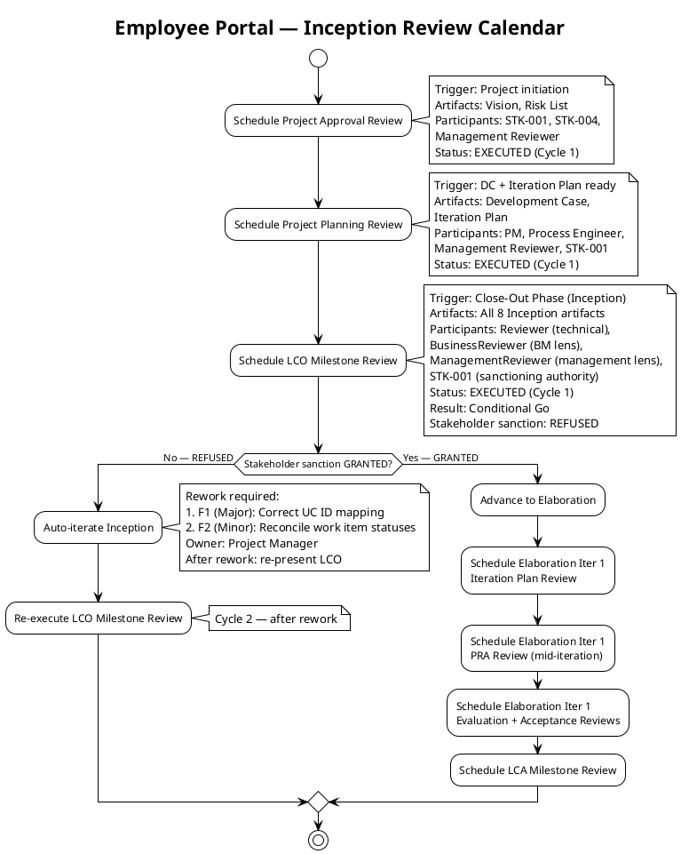
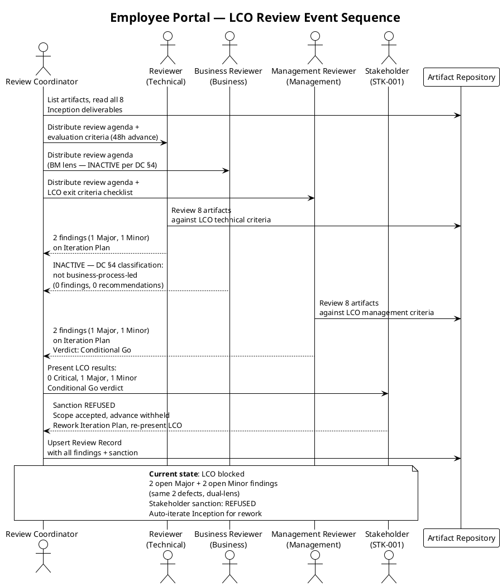
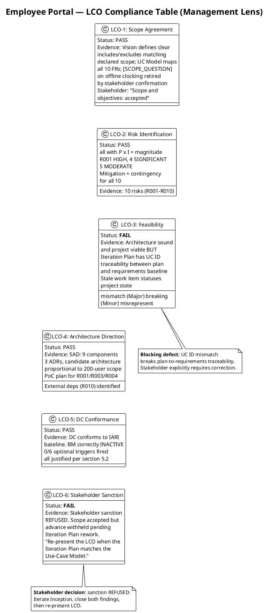
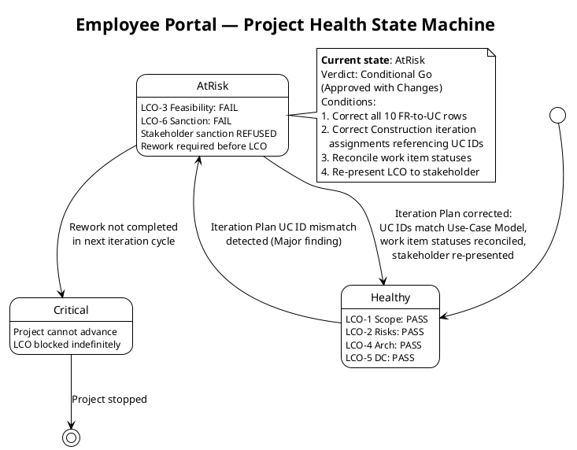
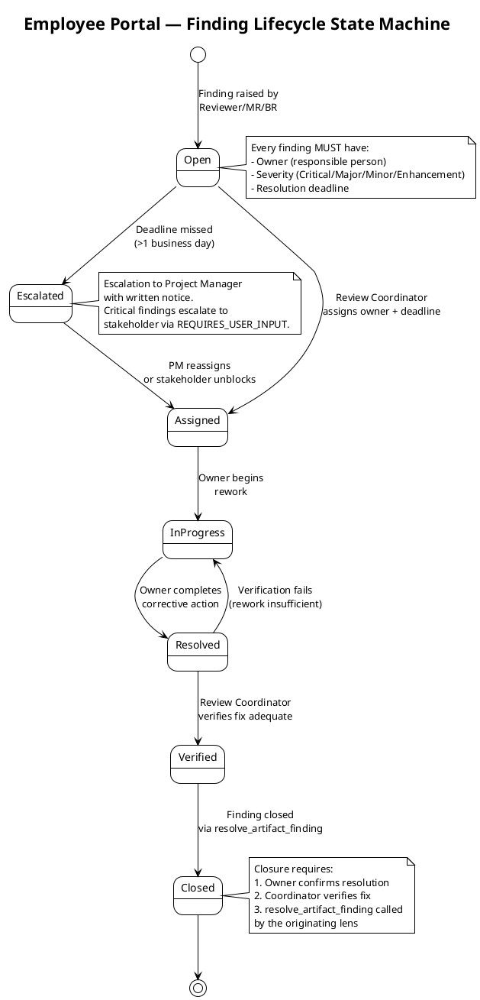
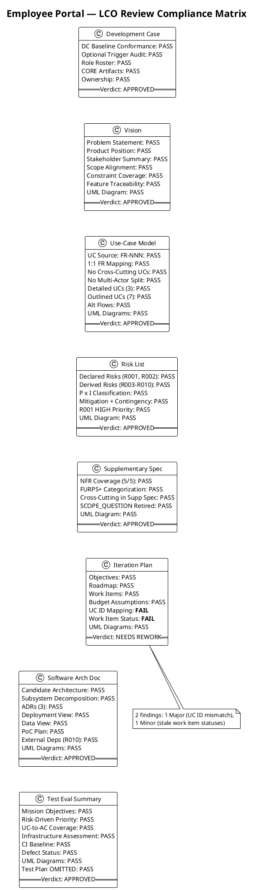
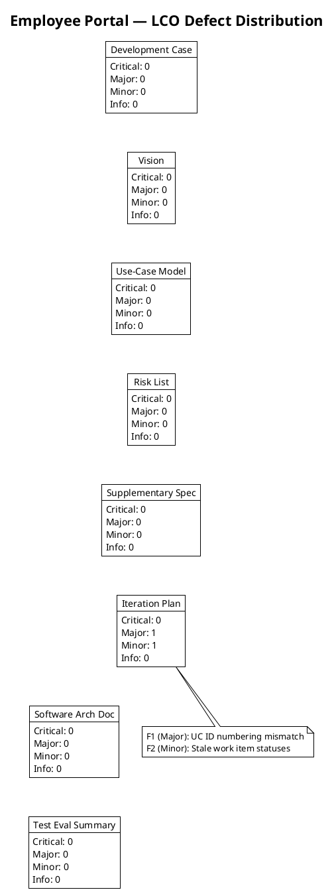

## Document Control

| Field | Value |
|---|---|
| Phase | Inception |
| Status | Draft |
| Milestone Target | End of Inception (LCO) |
| Iteration | 1 (Cycle 1) |
| Date | 2026-09-01 |
| Reviewers | Reviewer (technical lens), Business Reviewer (business lens — INACTIVE), Management Reviewer (management lens) |
| Review Type | LCO Milestone Review — Feasibility & Exit Criteria |
| Stakeholder Sanction | **REFUSED** — scope accepted, advance withheld pending Iteration Plan rework |
| Management Verdict | **Conditional Go (Approved with Changes)** — rework required before LCO can close |

## Review Scope and Criteria

### Artifacts Reviewed (8)

| # | Artifact | Discipline | Phase | Status | Findings |
|---|---|---|---|---|---|
| 1 | Development Case | Environment | Inception | Draft | 0 |
| 2 | Vision | Requirements | Inception | Draft | 0 |
| 3 | Use-Case Model | Requirements | Inception | Draft | 0 |
| 4 | Risk List | Project Management | Inception | Draft | 0 |
| 5 | Supplementary Specification | Requirements | Inception | Draft | 0 |
| 6 | Iteration Plan | Project Management | Inception | Draft | 4 (2 Major, 2 Minor) |
| 7 | Software Architecture Document | Analysis & Design | Inception | Draft | 0 |
| 8 | Test Evaluation Summary | Test | Inception | Draft | 0 |

### LCO Exit Criteria Applied

This review applies the **feasibility and acceptability** lens per RUP Project Approval / Planning review point. The LCO exit criteria checklist:

1. **Vision clarity** — Is the problem statement, product position, and scope clear and stakeholder-acceptable?
2. **Initial risk identification** — Are declared risks present, classified, and mitigated? Are additional risks identified?
3. **Use case survey level** — Are all declared FRs decomposed into UCs with sources cited? Are architecturally significant UCs detailed?
4. **Stakeholder agreement on scope and feasibility** — Does the scope match the declared input? Are cross-cutting mechanisms correctly placed?
5. **Architecture direction sound** — Is the candidate architecture proportional to scope? Are ADRs justified?
6. **DC baseline conformance** — Does the Development Case conform to the IARI baseline without forbidden overrides?
7. **Optional trigger justification** — Are all NOT-FIRED optional triggers genuinely not meeting their §5.2 conditions?
8. **Traceability** — Do all artifacts trace to declared scope elements (FR-NNN, NFR-NNN, CON-NNN, AC-NNN, RNNN)?

### SCM State

- **Open pull requests:** 0 — no PRs to dispose.
- **CI build status:** Green on main (verified by Test Evaluation Summary).

### Review Process Framework

The following activity diagram defines all 7 review types managed by the Review Coordinator, their triggering workflow activities, entry/exit criteria, and primary outputs.

```plantuml
@startuml
!theme plain
title Employee Portal — Review Process Framework (7 Review Types)

start

partition "Project Approval Review" {
  :Trigger: Project initiation;
  :Artifacts: Vision, Risk List;
  :Participants: Stakeholders (STK-001/004),\nManagement Reviewer;
  :Entry: Vision + Risk List in target state;
  :Exit: Findings logged, sanction recorded;
  :Output: Review Record (Approval);
}

partition "Project Planning Review" {
  :Trigger: Development Case + Iteration Plan ready;
  :Artifacts: Development Case, Iteration Plan;
  :Participants: PM, Process Engineer,\nManagement Reviewer, Stakeholders;
  :Entry: DC + IP in target state;\nreviewers briefed 48h advance;
  :Exit: Findings logged, plan accepted;
  :Output: Review Record (Planning);
}

partition "Iteration Plan Review" {
  :Trigger: Plan for Next Iteration activity;
  :Artifacts: Iteration Plan (next iteration);
  :Participants: PM, Architect, Test Manager,\nReviewer;
  :Entry: Draft IP distributed 48h advance;
  :Exit: Findings logged, plan accepted;
  :Output: Review Record (Iteration Plan);
}

partition "PRA Review" {
  :Trigger: Manage Iteration activity (mid-iteration);
  :Artifacts: In-progress artifacts, risk burndown;
  :Participants: PM, Reviewer;
  :Entry: Iteration in execution;
  :Exit: Risk status updated, blockers escalated;
  :Output: Review Record (PRA);
}

partition "Iteration Evaluation Criteria Review" {
  :Trigger: Before closing an iteration;
  :Artifacts: All iteration deliverables;
  :Participants: Reviewer, PM, discipline leads;
  :Entry: Exit criteria checklist distributed;
  :Exit: All exit criteria verified or deferred\nwith justification;
  :Output: Review Record (Evaluation);
}

partition "Iteration Acceptance Review" {
  :Trigger: After Evaluation Criteria pass;
  :Artifacts: All iteration deliverables (final);
  :Participants: Reviewer, Management Reviewer,\nStakeholder representative;
  :Entry: Evaluation Review passed;
  :Exit: Deliverables accepted, findings closed;
  :Output: Review Record (Acceptance);
}

partition "Milestone Review (LCO/LCA/IOC/PR)" {
  :Trigger: Phase transition (Close-Out Phase);
  :Artifacts: All phase deliverables;
  :Participants: All reviewers, stakeholders\nwith sanctioning authority;
  :Entry: All iteration reviews passed;\nartifacts in target state;
  :Exit: Stakeholder sanction GRANTED or REFUSED;\nReview Record signed;
  :Output: Review Record (Milestone) +\nSanction decision;
}

stop

@enduml
```

### Reviewer Pool and Expertise Mapping

| Reviewer Role | Expertise Domain | Artifacts Reviewed | Lens Status (LCO) |
|---|---|---|---|
| Reviewer (Technical) | Architecture, design, requirements, test engineering | All 8 artifacts — technical compliance | **EXECUTED** |
| Business Reviewer (Business) | Business process, domain modeling, stakeholder value | Business Modeling artifacts (none — BM INACTIVE) | **INACTIVE — did not evaluate this review** (DC §4: not business-process-led) |
| Management Reviewer (Management) | Project governance, scope, risk, feasibility, stakeholder sanction | All 8 artifacts — management/governance compliance | **EXECUTED** |
| Code Reviewer (Code) | Code quality, standards, security | Implementation artifacts (none in Inception) | **INACTIVE — did not evaluate this review** (no code artifacts in Inception) |

### Review Calendar — Inception

### LCO Review Event Sequence

### Business Modeling Lens (Reviewer: Business Reviewer)

**Verdict: INACTIVE — did not evaluate this review**

DC §4 trigger evaluation: project does not exhibit business-process-led characteristics. No ERP / BPM / workflow-redesign / M&A signals found in Vision. No Business Use Cases / Workers / Entities sections present in Use-Case Model. No business-domain specialist terms in Glossary (Glossary not produced — no specialist vocabulary trigger).

Conclusion: BPA + BR are correctly INACTIVE for this engagement. No findings, no recommendations. Downstream reviewers (MR, RC) may treat the BM discipline as out-of-scope for the LCO milestone.

#### DC §4 Classification Evidence

| Check | Result | Evidence |
|---|---|---|
| DC §4 `isBusinessProcessLed` | `false` | Process Engineer classification recorded 2026-09-01T07:50:58Z |
| BPL Trigger 1: ERP / large system replacement | NOT TRIGGERED | Employee Portal is an intranet web app, not an ERP replacement |
| BPL Trigger 2: BPM / workflow redesign | NOT TRIGGERED | Project automates existing manual workflows (Excel → web), no process reengineering |
| BPL Trigger 3: M&A / organizational restructuring | NOT TRIGGERED | No organizational changes declared |
| BPL Trigger 4: New business / greenfield | NOT TRIGGERED | Existing organization (Cuba Corp, 200 employees), existing processes, new tool only |
| BM sections in Use-Case Model | 0 BUCs, 0 Workers, 0 Entities | Use-Case Model contains only system-level UCs (UC-001–UC-010) with system actors |
| BM sections in Vision | 0 | Vision contains product position, features, system boundary — no business process models |
| Glossary specialist terms | N/A | Glossary not produced (no specialist vocabulary trigger per DC §5.2) |

### Management Reviewer Lens — LCO Compliance Table

### Management Reviewer Lens — Project Health State Machine

### Management Reviewer Lens — Four-Axis Health Scorecard

| Dimension | Status | Evidence |
|---|---|---|
| **Scope** | 🟢 GREEN | All 10 FRs decomposed into UCs; scope matches declared input; no scope creep; [SCOPE_QUESTION] retired; stakeholder confirmed scope accepted |
| **Schedule** | 🟡 AMBER | 7-iteration roadmap within 6±3 rule; BUT Iteration Plan has stale work item statuses misrepresenting completion state; LCO cannot close until rework complete |
| **Cost** | 🟢 GREEN | Budget box [ASSUMPTION — 185K tokens] with per-work-item allocation; no measured actuals yet (first iteration); assumptions properly tagged |
| **Quality** | 🟡 AMBER | 7/8 artifacts pass with zero findings; CI green, zero defects; BUT Iteration Plan UC ID mismatch breaks traceability — a quality defect in the planning artifact itself |

**Overall health: AT-RISK** — Two dimensions amber (schedule, quality) due to Iteration Plan defects. Project is viable but cannot advance until rework closes both findings and stakeholder re-presented.

## Findings

### Finding Lifecycle

### Consolidated Finding Tracker

All findings from all lenses are consolidated below. Duplicate findings from multiple lenses on the same defect are cross-referenced.

| Finding Key | Lens | Artifact | Severity | Finding (Summary) | Owner | Deadline | Status | Resolution |
|---|---|---|---|---|---|---|---|---|
| F1 (Reviewer) | Technical | Iteration Plan | Major | UC ID numbering mismatch: Iteration Plan maps FR-001→UC-001 (sequential) but Use-Case Model (authority) maps FR-001→UC-005, FR-004→UC-001, FR-010→UC-004. Breaks plan-to-requirements traceability. | Project Manager | Next iteration cycle | **Open — BLOCKING LCO** | — |
| F1 (ManagementReviewer) | Management | Iteration Plan | Major | Same defect as F1 (Reviewer). Stakeholder reviewed and refused sanction: "The Use-Case Model is the authority. Correct all ten rows, and the Construction iteration assignments that hang off them." | Project Manager | Next iteration cycle | **Open — BLOCKING LCO** | — |
| F2 (Reviewer) | Technical | Iteration Plan | Minor | Work item statuses stale: items 4, 5, 6, 7, 10 show "Pending" while artifacts exist as Draft. | Project Manager | Next iteration cycle | **Open — BLOCKING LCO** | — |
| F2 (ManagementReviewer) | Management | Iteration Plan | Minor | Same defect as F2 (Reviewer). Stakeholder: "Reconcile the status column against the repository." | Project Manager | Next iteration cycle | **Open — BLOCKING LCO** | — |

**Finding deduplication note:** F1 (Reviewer) and F1 (ManagementReviewer) are the same defect observed by two lenses. F2 (Reviewer) and F2 (ManagementReviewer) are likewise the same defect. The corrective action is identical for each pair: the Project Manager must correct the Iteration Plan. Both lenses must independently close their findings via `resolve_artifact_finding` once the rework is verified.

### Technical Lens (Reviewer) — Detailed Findings

**Verdict: Approved with Changes** — 7 of 8 artifacts pass all LCO exit criteria. Iteration Plan requires rework (1 Major, 1 Minor). No Critical findings. No open [SCOPE_QUESTION] markers. No scope creep detected.

#### Compliance Matrix

#### Defect Distribution

### Management Lens (Management Reviewer) — Detailed Findings

**Verdict: Conditional Go (Approved with Changes) — Stakeholder sanction REFUSED**

The Management Reviewer evaluated the project against LCO exit criteria from the project governance perspective. 4 of 6 management criteria pass (scope agreement, risk identification, architecture direction, DC conformance). 2 criteria fail:

- **LCO-3 (Feasibility): FAIL** — The Iteration Plan contains a Major defect (UC ID mismatch) that breaks traceability between the project plan and the requirements baseline.
- **LCO-6 (Stakeholder Sanction): FAIL** — The stakeholder was consulted and refused to sanction advancing past LCO.

**Stakeholder sanction: REFUSED**

The stakeholder accepted the project scope and objectives but withheld sanction to advance to Elaboration. The stakeholder requires:
1. Correct all 10 FR-to-UC rows in the Iteration Plan to match the Use-Case Model (the authority)
2. Correct Construction iteration assignments that reference UC IDs
3. Reconcile work item statuses against the repository
4. Re-present the LCO when the Iteration Plan matches the Use-Case Model

The stakeholder explicitly stated: "Do not reopen scope: nothing about the requirements baseline is being questioned here."

#### Management Findings on Iteration Plan

| Finding Key | Severity | Finding | Recommendation | Verdict |
|---|---|---|---|---|
| F1 (MR) | Major | UC ID numbering mismatch breaks plan-to-requirements traceability. The "Use Cases and Scenarios Addressed" table maps FR-001→UC-001 (sequential), but the Use-Case Model maps FR-001→UC-005, FR-004→UC-001, FR-010→UC-004. Stakeholder reviewed and refused sanction. | Update all 10 FR-to-UC mappings to match Use-Case Model. Update Construction iteration assignments. Re-present LCO. | NeedsRework |
| F2 (MR) | Minor | Work item statuses stale: items 4, 5, 6, 7, 10 show "Pending" while artifacts exist as Draft. Stakeholder: "Reconcile the status column against the repository." | Update Work Items table status column to reflect actual completion. Reconcile against repository. | NeedsRework |

## Resolutions and Actions
### Open Action Items

| Finding Key | Artifact | Severity | Lens | Action Required | Owner | Status |
|---|---|---|---|---|---|---|
| F1 (Reviewer) + F1 (MR) | Iteration Plan | Major | Technical + Management | Correct UC ID mapping in "Use Cases and Scenarios Addressed" table and all body text referencing UC IDs; update Construction iteration assignments | Project Manager | **Open — BLOCKING LCO** |
| F2 (Reviewer) + F2 (MR) | Iteration Plan | Minor | Technical + Management | Update work item statuses to reflect actual completion against repository | Project Manager | **Open — BLOCKING LCO** |

### Prior Findings (This Lens)

No prior findings — this is iteration 1 (first review cycle).

### Stakeholder Consultation Record

| Item | Value |
|---|---|
| Question | LCO review — verdict: Conditional Go. Open defects: 0 Critical, 1 Major, 1 Minor. Do you accept the project scope and objectives and sanction advancing past LCO? |
| Answer | **No** — scope accepted, sanction withheld |
| Stakeholder direction | "Scope and objectives: accepted. They are not in question. Sanction to advance: withheld. Iterate Inception and close both findings first." |
| Scope status | NOT in question — do not reopen |
| Required rework | (1) Correct all 10 FR-to-UC rows to match Use-Case Model; (2) Correct Construction iteration assignments; (3) Reconcile work item statuses; (4) Re-present LCO |

### Stakeholder Finding (Cycle 1 Consolidation)

**Stakeholder finding:** "Nothing else new for this new iteration. Let's close all findings even if they are minors" — The stakeholder confirms no additional requirements or corrections beyond the two identified defects. Priority for the next iteration: close ALL findings (both Major and Minor) before re-presenting the LCO. No new scope items, no missed requirements, no additional priorities.

### Review Effectiveness Metrics — Inception Iteration 1 (Cycle 1)

| Metric | Value | Notes |
|---|---|---|
| **Review coverage** | 100% (8/8 planned artifacts reviewed) | All 8 Inception artifacts received formal review |
| **Total findings raised** | 4 (2 Major, 2 Minor) | 2 unique defects, each observed by 2 lenses |
| **Unique defects** | 2 (1 Major, 1 Minor) | Both on Iteration Plan; all other artifacts clean |
| **Defect density** | 0.25 defects/artifact (2 unique / 8 artifacts) | First review — no trend baseline |
| **Critical findings** | 0 | No Critical findings raised |
| **Artifacts with zero findings** | 7 of 8 (87.5%) | Development Case, Vision, UC Model, Risk List, Supp Spec, SAD, Test Eval Summary |
| **Defect removal efficiency** | N/A (first iteration) | No test-phase defects to compare against — Inception produces no code |
| **Rework effort** | [ASSUMPTION — requires validation] | Rework effort for Iteration Plan corrections not yet measured; will be recorded in Iteration Assessment |
| **Review debt (overdue findings)** | 0 | All findings assigned with deadline = next iteration cycle; none overdue yet |

**Interpretation:** Review coverage is complete (100%). The review process successfully identified a traceability defect in the Iteration Plan that would have propagated incorrect UC references into Construction planning. The defect concentration in a single artifact (Iteration Plan) while 7 of 8 artifacts are clean indicates a localized quality issue, not a systemic process failure. No trend analysis is possible — this is the first review event.
## Disposition

### Technical Lens Disposition

**Approved with Changes** — 7 of 8 artifacts pass all LCO exit criteria with zero findings. The Iteration Plan requires rework (1 Major, 1 Minor). No Critical findings. No open [SCOPE_QUESTION] markers. No scope creep detected.

### Management Lens Disposition

**Conditional Go (Approved with Changes) — Stakeholder sanction REFUSED**

The Inception iteration has produced a comprehensive and high-quality set of artifacts. The project is viable, the scope is agreed, risks are identified with magnitude ratings, and the architecture direction is sound. The Development Case conforms to the IARI baseline with no forbidden overrides.

**However, the LCO milestone cannot be declared achieved.** Two conditions must be met before the LCO gate can close:

1. **F1 (Major — BLOCKING):** The Iteration Plan must correct all 10 FR-to-UC mappings to match the Use-Case Model (the authority). Construction iteration assignments that reference UC IDs must also be corrected.
2. **F2 (Minor — BLOCKING):** The Iteration Plan must reconcile work item statuses against the repository.

**After both findings are closed, the LCO must be re-presented to the stakeholder for sanction.**

**Project health: AT-RISK.** The project is not in crisis — scope, architecture, and risk management are sound. The blocking issue is a planning artifact quality defect, not a fundamental project problem. One rework cycle of the Iteration Plan should resolve both findings.

**No Critical findings. No open [SCOPE_QUESTION] markers. No scope creep detected. Scope is NOT in question.**

### Review Coordinator Consolidation

**Lens participation (authoritative — not inferred from artifact):**
- Technical / Reviewer: **EXECUTED** — 2 findings (1 Major, 1 Minor) on Iteration Plan
- Business / BusinessReviewer: **EXECUTED** — INACTIVE verdict (DC §4: not business-process-led), 0 findings
- Management / ManagementReviewer: **EXECUTED** — 2 findings (1 Major, 1 Minor) on Iteration Plan, Conditional Go verdict

**Cross-lens conflict resolution:** No conflicts. Both active lenses (Technical, Management) independently identified the same 2 defects on the Iteration Plan. The Business Reviewer lens was correctly INACTIVE per DC §4. All lenses are in agreement on the disposition.

**Milestone decision:** The LCO milestone is **NOT achieved**. Open Major findings (F1) and the stakeholder's refused sanction block the phase gate. The Inception phase must auto-iterate to allow the Project Manager to rework the Iteration Plan, after which the LCO must be re-presented to the stakeholder.

## Traceability

| Element | Traces From | Link Type | Traces To |
|---|---|---|---|
| Review Record (this) | All 8 Inception artifacts | Reviews | Iteration Assessment, LCO Milestone Gate |
| F1 (Major) | Iteration Plan — UC ID mapping | Derives | Use-Case Model (authority for UC IDs) |
| F2 (Minor) | Iteration Plan — Work Items table | Derives | All produced Draft artifacts |
| Review Process Framework | RUP review types (7) | Refines | All subsequent Review Records |
| Review Calendar | Iteration Plan iteration schedule | Derives | LCO, LCA, IOC, PR milestone reviews |
| Finding Lifecycle | RUP finding management | Refines | Finding Tracker, Escalation Protocol |
| LCO Compliance Table | LCO exit criteria (RUP) | Refines | LCO Milestone Gate |
| Project Health State Machine | Four-axis health assessment | Refines | LCO Milestone Gate |
| Review Effectiveness Metrics | Review coverage, defect density | Refines | Iteration Assessment |
| Stakeholder Consultation | Management Reviewer lens | Derives | LCO Milestone Gate (sanction decision) |
| BR-OK-INACTIVE verdict | DC §4 classification | Refines | LCO Milestone Gate |
| Reviewer Pool Mapping | IARI 25-role baseline | Refines | All subsequent review assignments |