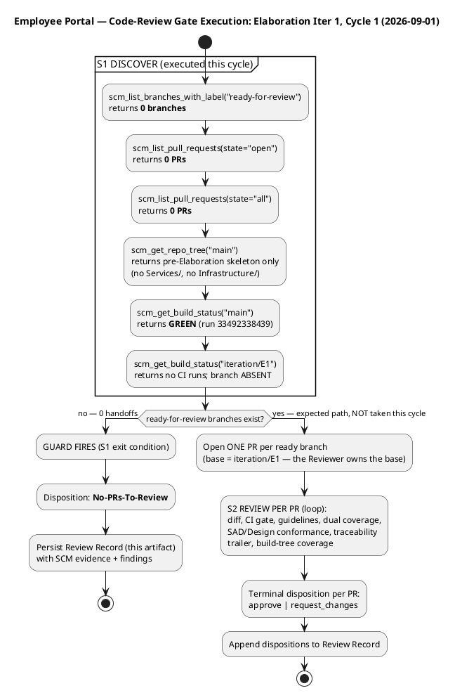
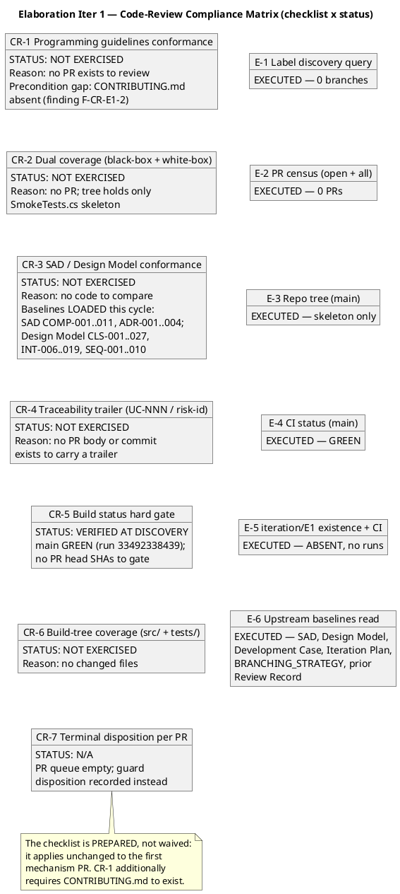
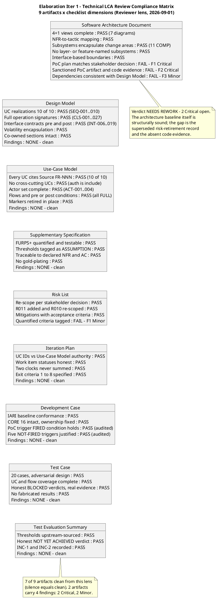
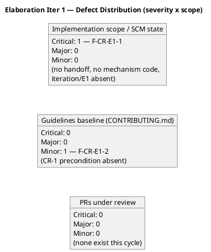

## Document Control
| Field | Value |
|---|---|
| Phase | Elaboration |
| Status | Draft — Elaboration Iter 1 CUMULATIVE review record: code-review gate (Code Reviewer lens) + technical LCA milestone review (Reviewer lens) |
| Milestone Target | End of Elaboration (LCA) — NOT yet achieved |
| Iteration | 1 (Cycle 1) |
| Date | 2026-09-01 |
| Review Type | Cumulative — Code Review (PR Approval Loop, Implementation discipline) + Technical LCA Milestone Review (architecture / design / requirements / test artifacts, exit-criteria lens) |
| Reviewers | Code Reviewer (Implementation discipline) — code-review gate sections; Reviewer (technical lens) — LCA milestone sections |
| Review Point | LCA milestone — EXIT CRITERIA lens: do the artifacts collectively satisfy the conditions for phase transition? Technical-lens answer this cycle: NO — 2 Critical findings open; empirical risk retirement unexecuted |
| Prior Record | Inception LCO Milestone Review (2 iterations) — GO (APPROVED), all 4 findings RESOLVED, stakeholder sanction GRANTED. Historical record preserved below; prior findings never overwritten. |
| Cycle Dispositions | Code-review gate: **No-PRs-To-Review** (S1 guard fired — zero ready-for-review branches, zero PRs, iteration/E1 absent at that cycle; branch since created, skeleton only). Technical LCA lens: **NEEDS REWORK — sanction withheld** (2 Critical findings on the SAD; empirical validation of R001/R003/R004 has no code evidence) |
| Open Findings (this cycle) | Technical lens: 2 Critical (SAD F1 — superseded PoC plan; SAD F2 — PoC artifact + code evidence absent), 2 Minor (SAD F3 — stale component dependencies; Risk List F1 — untagged >90% criterion). Code Reviewer lens: 1 Critical (F-CR-E1-1 — no mechanism handoff), 1 Minor (F-CR-E1-2 — CONTRIBUTING.md absent) |
## Review Scope and Criteria
### This Cycle's Scope — Elaboration Iteration 1, Cycle 1 (Code-Review Lens)

Per the Work Order and BRANCHING_STRATEGY §5.2, the Elaboration architectural prototype is **evolutionary production code**: the Implementer builds each risk-retirement mechanism in `src/` on `feature/E1-{risk-id}` branches based on `iteration/E1`, labels them `ready-for-review`, and the Code Reviewer opens and reviews one PR per mechanism (base `iteration/E1`) exactly as a Construction feature PR — never rejecting prototype code as throwaway, never waiving the checklist.

**Expected handoffs this iteration** (Iteration Plan Work Items 7–9, ~250K tokens; Development Case PoC trigger FIRED; stakeholder decision binding — the PoC is produced in Elaboration AND validated empirically):

| Expected mechanism | Risk | Plan work item | Design baseline |
|---|---|---|---|
| Disposable LDAP directory + attribute population/query validation | R001 (HIGH) | WI-7 | COMP-007 / CLS-009 LdapGateway; graceful degradation (missing attribute = null, entry NOT hidden) |
| Stub OIDC issuer + token validation + role-claim extraction | R003 (SIGNIFICANT) | WI-8 | COMP-006 / CLS-010 KeycloakAuthProvider; Employee + HR Administrator roles from claims |
| 5-minute network-drop simulation: localStorage queue + idempotent sync | R004 (SIGNIFICANT) | WI-9 | COMP-009 / CLS-008 OfflineQueueClient; UNIQUE idempotency_key (REL-002), sync ≤ 60 s (REL-003) |

### Code-Review Checklist (applies unchanged to the first mechanism PR)

| # | Checklist item | Basis |
|---|---|---|
| CR-1 | Programming guidelines conformance — every violation cited to a rule in `CONTRIBUTING.md` | RUP Ch.11; DC-flagged guideline gap |
| CR-2 | Dual coverage — black-box contract AND white-box paths (branches, loops, error handlers) | RUP Ch.11 §7428-7447 |
| CR-3 | SAD / Design Model conformance — class names, signatures, layer placement, interface contracts | SAD COMP-001…011, ADR-001…004; Design Model CLS-001…027, INT-006…019 |
| CR-4 | Traceability trailer — `Implements: UC-NNN` or risk-id in PR body / commit | Use-case-driven pillar |
| CR-5 | Build status hard gate — CI red ⇒ request_changes, no code review | Reviewer heuristic 5 |
| CR-6 | Build-tree coverage — every changed file under `src/` or `tests/` inside the build tree | S2 checklist |
| CR-7 | Terminal disposition per PR — approve or request_changes; no PR left undecided | Gate-enforcement mandate |

### Gate Execution — What Was Run This Cycle (Code-Review Lens)



### Compliance Matrix — Checklist × Status (Code-Review Lens)



### SCM Evidence Snapshot (review evidence — what actually happened)


### Historical Record — Inception LCO Review Scope (preserved)

The Inception record reviewed 9 artifacts + the Review Record against 9 LCO exit criteria (feasibility lens) across 2 iterations. Iteration 1 raised 2 findings on the Iteration Plan (F1 Major — UC-ID mapping mismatch; F2 Minor — stale work-item statuses); the stakeholder REFUSED sanction pending rework. Iteration 2 verified both corrections, raised zero new findings, and recorded stakeholder sanction GRANTED ("Let's go to elaboration."). Full LCO compliance matrices, health state machine, risk retirement status, and milestone timeline diagrams are preserved in SCM history at the Inception revision of this artifact.

### Technical LCA Lens — Scope and Criteria (Reviewer, this cycle)

**Scope:** ALL 9 technical artifacts produced this phase, reviewed against the **LCA exit-criteria lens** (are the artifacts collectively sufficient for phase transition?) — the correct evaluative lens for a lifecycle milestone, not a completion lens. Priority order: SAD first (architecture gate), then Design Model, then Use-Case Model, then remaining. Upstream consumption completed before findings: all 9 artifacts read in full; the Work Order's declared scope (10 FRs, 5 NFRs, 5 ACs, 14 CONs, 2 declared risks), the stakeholder's recorded decisions (timestamp convention, America/Havana, PoC empirical validation), and the SCM state (zero open PRs; `iteration/E1` skeleton-only per the Test Case's empirical inspection) were cross-checked.

**Checklists applied per artifact type:** SAD → architecture checklist (4+1 views, NFR→tactic mapping, change-area subsystems, interface-based boundaries, PoC plan vs stakeholder decision); Design Model → design checklist (UC realizations per-UC, full signatures, interface contracts, volatility encapsulation, co-owned section integrity); Use-Case Model → requirements checklist (actors, flows, pre/post conditions, alternatives, `Source: FR-NNN` guard, cross-cutting-mechanism guard); Supplementary Specification → NFR checklist (FURPS+ quantified, testable, traceable, no gold-plating); Risk List → mitigation/acceptance-criteria checklist; Iteration Plan → plan-integrity checklist (UC-ID authority, honest statuses, two clocks); Development Case → IARI baseline conformance + optional-trigger justification audit; Test Case / Test Evaluation Summary → test-design checklist (coverage, adversarial intent, honest verdicts, no fabricated results).

**Scope-marker verification:** all non-literal elements carry correct markers; three stakeholder decisions retired their markers in place (offline mechanism, timestamp convention, office timezone America/Havana) — no marker survives its own answer. The `[ASSUMPTION]` tags on quantified thresholds (2 s window, queue ≥ 10, sync ≤ 60 s, 95th percentile) carry named bases — compliant, with one exception recorded as Risk List F1.

**Compliance Matrix — Technical LCA Lens (9 artifacts × checklist dimensions):**


## Findings

### Elaboration Iteration 1 — New Findings (Code-Review Lens)

| Finding Key | Severity | Location | Description | Remediation |
|---|---|---|---|---|
| **F-CR-E1-1** | **Critical** | SCM state vs. Iteration Plan WIs 7–9; exit criteria 1–3 | **No Implementer handoff exists.** Zero `ready-for-review` branches, zero PRs in any state, and the build tree at `main` contains no mechanism code (no `Services/`, no `Infrastructure/`, no PoC scaffolding — only the pre-Elaboration skeleton). `iteration/E1`, the mandatory PR base (BRANCHING_STRATEGY §5.2), does not exist. Consequence: the iteration's exit criteria 1–3 (empirical validation of R001/R003/R004) have **no code evidence**, and the LCA evidence package cannot be assembled — the stakeholder explicitly refused an LCA that validates a HIGH architectural risk on paper only. The code-review gate for this iteration is OPEN. | (1) Integrator creates `iteration/E1` (invariant 8.1 — only the Integrator writes `iteration/*`). (2) Implementer builds the three mechanisms **evolutionarily in `src/`** (never a `poc/` branch or `samples/` directory — invariant 8.4): R001 → COMP-007/CLS-009 against a disposable LDAP directory; R003 → COMP-006/CLS-010 against a stub OIDC issuer; R004 → COMP-009/CLS-008 offline queue + idempotent sync. (3) Each mechanism ships dual-coverage unit tests (black-box contract + white-box paths). (4) Implementer labels each `feature/E1-{risk-id}` branch `ready-for-review`. (5) Code Reviewer opens one PR per branch (base `iteration/E1`) and applies CR-1…CR-7 with terminal dispositions. |
| **F-CR-E1-2** | **Minor** | Repository root — `CONTRIBUTING.md` (also flagged in Development Case § Tool Configuration References) | **Programming-guidelines baseline absent.** `CONTRIBUTING.md` does not exist in the repository, so checklist item CR-1 has no citable rule baseline for the first mechanism PR. Without it, guideline findings cannot cite a rule (a violation without a rule citation is personal taste, not a finding). The Development Case already records this as a gap owned by Implementer / Software Architect / ConfigurationManager. | Commit `CONTRIBUTING.md` before or together with the first mechanism PR: coding standards (naming, error handling, async conventions, test conventions) plus the branch-strategy documentation section. Until it exists, CR-1 findings in the first PR will be limited to rules citable from the SAD layering rule (dependencies point down, interfaces only) and the Design Model contracts. |

### Defect Distribution (severity × scope)



### Prior Findings (Inception — historical ledger, all RESOLVED; never overwritten)

| Finding Key | Lens | Artifact | Severity | Finding (summary) | Status |
|---|---|---|---|---|---|
| F1 (Reviewer) | Technical | Iteration Plan | Major | UC ID numbering mismatch: Iteration Plan mapped FR-001→UC-001 sequentially; Use-Case Model (authority) maps FR-001→UC-005, FR-004→UC-001, FR-010→UC-004. | **RESOLVED** (Inception Iter 2) |
| F1 (ManagementReviewer) | Management | Iteration Plan | Major | Same defect as F1 (Reviewer); stakeholder refused sanction. | **RESOLVED** (Inception Iter 2) |
| F2 (Reviewer) | Technical | Iteration Plan | Minor | Work item statuses stale ("Pending" while artifacts existed as Draft). | **RESOLVED** (Inception Iter 2) |
| F2 (ManagementReviewer) | Management | Iteration Plan | Minor | Same defect as F2 (Reviewer). | **RESOLVED** (Inception Iter 2) |

**Reconciliation status:** zero findings carried open into Elaboration Iteration 1. The two findings raised this cycle (F-CR-E1-1, F-CR-E1-2) are NEW defects in the implementation scope, not recurrences of Inception findings — they carry fresh keys.

## Resolutions and Actions

### Remediation — Closing the Elaboration Iter 1 Code-Review Gate

```plantuml
@startuml
title Remediation — Closing the Elaboration Iter 1 Code-Review Gate

|Integrator|
start
:Create iteration/E1
(integration workspace — strategy 5.2, 8.1);

|Implementer|
:Build R001 mechanism (evolutionary, in src/):
COMP-007 LdapGateway (CLS-009) against a
disposable LDAP directory — attribute
mapping, graceful degradation
(missing attribute = null, entry NOT hidden);
:Build R003 mechanism:
COMP-006 (CLS-010) against a stub OIDC
issuer — token validation, role-claim
extraction (Employee + HR Administrator);
:Build R004 mechanism:
COMP-009 (CLS-008) — localStorage queue,
idempotent sync endpoint, UNIQUE
idempotency_key (REL-002);
:Ship dual-coverage unit tests per mechanism
(black-box contract + white-box paths);
:Commit CONTRIBUTING.md (guidelines baseline —
closes the F-CR-E1-2 precondition);
:Label branches ready-for-review:
feature/E1-R001-*, feature/E1-R003-*,
feature/E1-R004-*;

|Code Reviewer|
:Open ONE PR per branch — base iteration/E1
(the Reviewer owns the PR and its base);
:Apply checklist CR-1..CR-7 per PR:
CI gate, guidelines, dual coverage,
SAD/Design conformance, traceability
trailer (Implements: UC-NNN / risk-id),
build-tree coverage;
:Terminal disposition per PR:
scm_approve_pull_request |
scm_request_changes_on_pull_request;
:Append dispositions to this Review Record
(cumulative);

|Integrator|
:Merge APPROVED PRs into iteration/E1;
note right
  Result: exit criteria 1-3 acquire
  code evidence; empirical results
  feed the Architectural Proof-of-Concept
  artifact (owner: Software Architect)
  and the LCA evidence package.
end note
stop
@enduml
```

### Open Action Items

| # | Action | Owner | Severity | Blocks |
|---|---|---|---|---|
| A-1 | Create `iteration/E1` integration workspace | Integrator | Critical | Every Elaboration mechanism PR (no valid base exists) |
| A-2 | Build + hand off R001 mechanism (disposable LDAP directory, COMP-007/CLS-009) with dual-coverage tests, branch labeled `ready-for-review` | Implementer | Critical | Exit criterion 1; R001 (HIGH) empirical retirement |
| A-3 | Build + hand off R003 mechanism (stub OIDC issuer, COMP-006/CLS-010) with dual-coverage tests, branch labeled `ready-for-review` | Implementer | Critical | Exit criterion 2; R003 empirical retirement |
| A-4 | Build + hand off R004 mechanism (offline queue + idempotent sync, COMP-009/CLS-008) with dual-coverage tests, branch labeled `ready-for-review` | Implementer | Critical | Exit criterion 3; R004 empirical retirement; AC-005 evidence |
| A-5 | Commit `CONTRIBUTING.md` (coding standards + branch-strategy section) | Implementer / Software Architect / ConfigurationManager | Minor | CR-1 rule citation in the first mechanism PR |
| A-6 | Open + review one PR per ready branch (base `iteration/E1`), terminal disposition each | Code Reviewer | Critical | Iteration code-review gate closure |

### Historical Resolutions (Inception — preserved)

F1 (Major, both lenses) — RESOLVED: the Iteration Plan's "Use Cases and Scenarios Addressed" table corrected to the Use-Case Model authority (FR-001→UC-005, FR-002→UC-006, FR-003→UC-007, FR-004→UC-001, FR-005→UC-002, FR-006→UC-008, FR-007→UC-003, FR-008→UC-009, FR-009→UC-010, FR-010→UC-004); Construction assignments updated; Layer 3 rework criteria table added. F2 (Minor, both lenses) — RESOLVED: all 13 work items reconciled to "Complete" against repository state. Both closures verified in the Inception Iter 2 review; stakeholder sanction granted.

## Disposition

### Elaboration Iteration 1, Cycle 1 — Code-Review Gate Disposition

**No-PRs-To-Review.** The S1 guard fired: zero `ready-for-review` branches and zero PRs in any state. No PR received a terminal SCM review decision because no PR existed; the guard disposition is recorded here as the cycle's terminal outcome, and the checklist (CR-1…CR-7) is declared PREPARED, not waived — it applies unchanged to the first mechanism PR.

**Iteration completion verdict (Iteration Acceptance lens):** the iteration's code objectives are **NOT met as of this cycle** — Work Items 7–9 have no SCM evidence, and exit criteria 1–3 (empirical R001/R003/R004 validation) therefore have no code evidence. This is recorded as finding F-CR-E1-1 (Critical). The milestone is NOT declared achieved; no iteration, phase, or milestone is marked complete by this record. The gate remains open: the moment handoffs arrive, the Code Reviewer opens PRs against `iteration/E1` and issues terminal dispositions per PR.

**SCM evidence summary:** CI green on `main` (run 33492338439) — no red-build finding applies; `iteration/E1` absent; no open PRs; no mechanism code in the build tree.

**Scope adherence:** no scope-creep finding — the absence of code cannot inflate scope. The expected mechanisms trace cleanly to declared scope: R001→FR-010/CON-005, R003→CON-004, R004→NFR-004/AC-005, all via the Development Case's FIRED PoC trigger and the stakeholder's empirical-validation decision.

### Historical — LCO Disposition (Inception, preserved)

**GO (APPROVED)** — all 9 artifacts passed all 9 LCO exit criteria; both prior findings resolved; zero new findings; stakeholder sanction GRANTED and confirmed; `requiresIteration: false`. The project was sanctioned to proceed to Elaboration. Elaboration entry conditions (STK-004 engagement, R001/R003/R004 PoC scheduling) were recorded as advisory, non-blocking items — of which the PoC items are now the subject of this cycle's Critical finding.

## Traceability

| Element | Traces From | Link Type | Traces To |
|---|---|---|---|
| Review Record (this, Elaboration Iter 1) | Work Order (Elab Iter 1); BRANCHING_STRATEGY §5.2, §8; Iteration Plan WIs 7–9 + exit criteria 1–3; Development Case (PoC trigger FIRED + stakeholder decision); SAD; Design Model | Reviews | Elaboration Iter 1 Iteration Assessment; LCA milestone gate; Integrator (A-1); Implementer (A-2…A-5) |
| F-CR-E1-1 (Critical) | Iteration Plan WIs 7–9; exit criteria 1–3; stakeholder decision ("The PoC is produced in Elaboration and validated empirically"); BRANCHING_STRATEGY invariants 8.1, 8.2, 8.4 | Derives | A-1…A-4, A-6; R001, R003, R004 retirement evidence; Architectural Proof-of-Concept artifact |
| F-CR-E1-2 (Minor) | Development Case § Tool Configuration References (CONTRIBUTING.md gap); RUP Ch.11 guidelines-conformance rule | Derives | A-5; CR-1 checklist item; first mechanism PR review |
| Checklist CR-1…CR-7 | RUP Ch.11 (code review); SAD/Design Model baselines; BRANCHING_STRATEGY | Refines | Every Elaboration mechanism PR; Construction feature PRs |
| Expected mechanisms (R001/R003/R004) | FR-010/CON-005 (R001); CON-004 (R003); NFR-004/AC-005 (R004); SAD COMP-007/COMP-006/COMP-009; Design Model CLS-009/CLS-010/CLS-008 | Realizes | Exit criteria 1–3; LCA evidence package |
| SCM evidence snapshot | scm_list_branches_with_label, scm_list_pull_requests, scm_get_repo_tree, scm_get_build_status (executed 2026-09-01) | DependsOn | F-CR-E1-1; Disposition (No-PRs-To-Review) |
| Historical LCO record | Inception artifacts (9); prior Review Record revision | Refines | This cumulative Review Record (never overwritten) |
| Prior findings F1/F2 (Inception) | Iteration Plan; Use-Case Model (UC-ID authority) | Reviews | RESOLVED — verified Inception Iter 2; zero findings carried open into Elaboration |