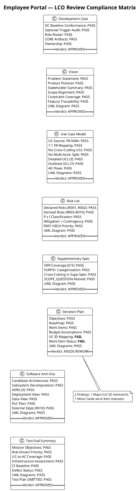
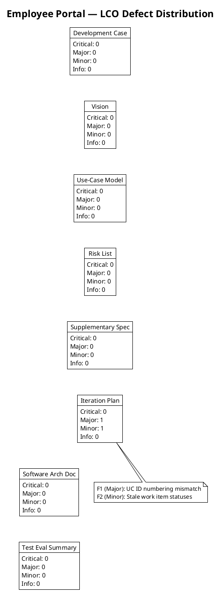

## Document Control

| Field | Value |
|---|---|
| Phase | Inception |
| Status | Draft |
| Milestone Target | End of Inception (LCO) |
| Iteration | 1 (Cycle 1) |
| Date | 2026-09-01 |
| Reviewer | Reviewer (technical lens) |
| Review Type | LCO Milestone Review — Feasibility & Exit Criteria |

## Review Scope and Criteria

### Artifacts Reviewed (8)

| # | Artifact | Discipline | Phase | Status |
|---|---|---|---|---|
| 1 | Development Case | Environment | Inception | Draft |
| 2 | Vision | Requirements | Inception | Draft |
| 3 | Use-Case Model | Requirements | Inception | Draft |
| 4 | Risk List | Project Management | Inception | Draft |
| 5 | Supplementary Specification | Requirements | Inception | Draft |
| 6 | Iteration Plan | Project Management | Inception | Draft |
| 7 | Software Architecture Document | Analysis & Design | Inception | Draft |
| 8 | Test Evaluation Summary | Test | Inception | Draft |

### LCO Exit Criteria Applied

This review applies the **feasibility and acceptability** lens per RUP Project Approval / Planning review point. The LCO exit criteria checklist:

1. **Vision clarity** — Is the problem statement, product position, and scope clear and stakeholder-acceptable?
2. **Initial risk identification** — Are declared risks present, classified, and mitigated? Are additional risks identified?
3. **Use case survey level** — Are all declared FRs decomposed into UCs with sources cited? Are architecturally significant UCs detailed?
4. **Stakeholder agreement on scope and feasibility** — Does the scope match the declared input? Are cross-cutting mechanisms correctly placed?
5. **Architecture direction sound** — Is the candidate architecture proportional to scope? Are ADRs justified?
6. **DC baseline conformance** — Does the Development Case conform to the IARI baseline without forbidden overrides?
7. **Optional trigger justification** — Are all NOT-FIRED optional triggers genuinely not meeting their §5.2 conditions?
8. **Traceability** — Do all artifacts trace to declared scope elements (FR-NNN, NFR-NNN, CON-NNN, AC-NNN, RNNN)?

### SCM State

- **Open pull requests:** 0 — no PRs to dispose.
- **CI build status:** Green on main (verified by Test Evaluation Summary).

## Findings

### Finding Summary

| Finding Key | Artifact | Severity | Description | Verdict |
|---|---|---|---|---|
| F1 | Iteration Plan | Major | UC ID numbering inconsistency — Iteration Plan uses sequential FR=UC mapping that contradicts the Use-Case Model's authority | NeedsRework |
| F2 | Iteration Plan | Minor | Work item statuses stale — 5 items show "Pending" for artifacts already produced as Draft | NeedsRework |

### F1 — Iteration Plan: UC ID Numbering Inconsistency (Major)

**Location:** "Use Cases and Scenarios Addressed" table, Iteration Plan.

**Description:** The table maps FR-001→UC-001, FR-002→UC-002, FR-003→UC-003, etc. (sequential FR=UC numbering). The Use-Case Model — the authority for UC IDs — maps UC-001→FR-004 (Clock In/Out), UC-002→FR-005 (View Own Clocking History), UC-003→FR-007 (Browse News), UC-004→FR-010 (Search Employee Directory), UC-005→FR-001 (Review Employee Clockings), etc. The SAD, Vision system boundary diagram, and Test Evaluation Summary ALL follow the UC Model's numbering. The Iteration Plan is the sole outlier. Downstream consumers reading the Iteration Plan will reference incorrect UC IDs, breaking traceability.

**Remediation:** Update the "Use Cases and Scenarios Addressed" table to use the correct UC IDs from the Use-Case Model: FR-001→UC-005, FR-002→UC-006, FR-003→UC-007, FR-004→UC-001, FR-005→UC-002, FR-006→UC-008, FR-007→UC-003, FR-008→UC-009, FR-009→UC-010, FR-010→UC-004. Also update any other references to UC IDs in the Iteration Plan body text.

### F2 — Iteration Plan: Stale Work Item Statuses (Minor)

**Location:** "Work Items — Inception Iteration 1" table, Iteration Plan.

**Description:** Work Items 4 (Vision), 5 (Use-Case Model), 6 (Supplementary Specification), 7 (SAD), 10 (Test strategy) all show status "Pending" — but these artifacts have all been produced as Draft. The work item status column does not reflect actual completion state at the time of LCO review.

**Remediation:** Update the Work Items table status column to reflect actual completion: Work Items 4, 5, 6, 7, 10 → "Complete" (Draft produced); Work Item 8 → update based on actual Design Model status; Work Item 9 → update based on actual project skeleton status; Work Item 11 → update based on actual repository configuration status.

### Artifacts with No Findings (6 of 8)

| Artifact | Checklist Result | Notes |
|---|---|---|
| Development Case | All criteria PASS | DC baseline conformance verified: 25 roles, 16 CORE artifacts, 0 optional triggers (all NOT-FIRED justified), no forbidden overrides |
| Vision | All criteria PASS | Scope alignment, stakeholder coverage, constraint coverage, feature traceability, UML system boundary diagram |
| Use-Case Model | All criteria PASS | 10 UCs with Source: FR-NNN, 1:1 mapping, no cross-cutting UCs, no multi-actor split, 3 detailed + 7 outlined, alt flows specified |
| Risk List | All criteria PASS | R001/R002 declared risks present; R003–R010 derived risks legitimate; all classified with mitigation + contingency |
| Supplementary Specification | All criteria PASS | 5 NFRs in FURPS+ categories; cross-cutting mechanisms in Supp Spec not UCs; [SCOPE_QUESTION] retired with stakeholder confirmation |
| Software Architecture Document | All criteria PASS | Layered monolith proportional to scope; 9 components with interfaces; 3 ADRs; deployment + data views; PoC plan for Elaboration |
| Test Evaluation Summary | All criteria PASS | Mission achieved; risk-driven priority; UC-to-AC coverage 5/5; CI baseline green; [OMITTED: Test Plan] correctly declared |

## Compliance Matrix

## Defect Distribution

## Resolutions and Actions

### Open Action Items

| Finding Key | Artifact | Severity | Action Required | Owner | Status |
|---|---|---|---|---|---|
| F1 | Iteration Plan | Major | Correct UC ID mapping in "Use Cases and Scenarios Addressed" table and body text | Project Manager | Open |
| F2 | Iteration Plan | Minor | Update work item statuses to reflect actual completion | Project Manager | Open |

### Prior Findings (This Lens)

No prior findings — this is iteration 1 (first review cycle).

## Disposition

**Overall LCO Disposition: Approved with Changes**

The Inception iteration has produced a comprehensive and high-quality set of artifacts. 7 of 8 artifacts pass all LCO exit criteria with zero findings. The Development Case conforms to the IARI baseline with no forbidden overrides. The Use-Case Model correctly decomposes all 10 declared FRs with proper source citations and no cross-cutting UCs. The candidate architecture is proportional to scope. The Risk List is thorough with appropriate mitigation plans. The Supplementary Specification correctly places cross-cutting mechanisms and has retired the [SCOPE_QUESTION] with the stakeholder's confirmation.

The single artifact requiring rework is the Iteration Plan, which has a Major finding (UC ID numbering inconsistency that breaks traceability) and a Minor finding (stale work item statuses). Neither is a Critical LCO blocker — the project is feasible and the scope is viable. The Iteration Plan should be corrected before the LCO milestone is declared achieved.

**No Critical findings. No open [SCOPE_QUESTION] markers. No scope creep detected.**

## Traceability

| Element | Traces From | Link Type | Traces To |
|---|---|---|---|
| Review Record (this) | All 8 Inception artifacts | Reviews | Iteration Assessment, LCO Milestone Gate |
| F1 (Major) | Iteration Plan — UC ID mapping | Derives | Use-Case Model (authority for UC IDs) |
| F2 (Minor) | Iteration Plan — Work Items table | Derives | All produced Draft artifacts |
| DC Conformance Check | IARI DC Baseline | Refines | Development Case artifact |
| Optional Trigger Audit | DC §5.2 conditions | Refines | Development Case — Optional Artifacts table |
| UC Source Verification | FR-001–FR-010 (declared) | Tests | Use-Case Model — UC-001–UC-010 |
| Cross-Cutting Check | Scope Guard Rule 7 | Tests | Use-Case Model, Supplementary Specification |
| Scope Adherence | Declared Scope (Work Order) | Tests | All 8 artifacts |