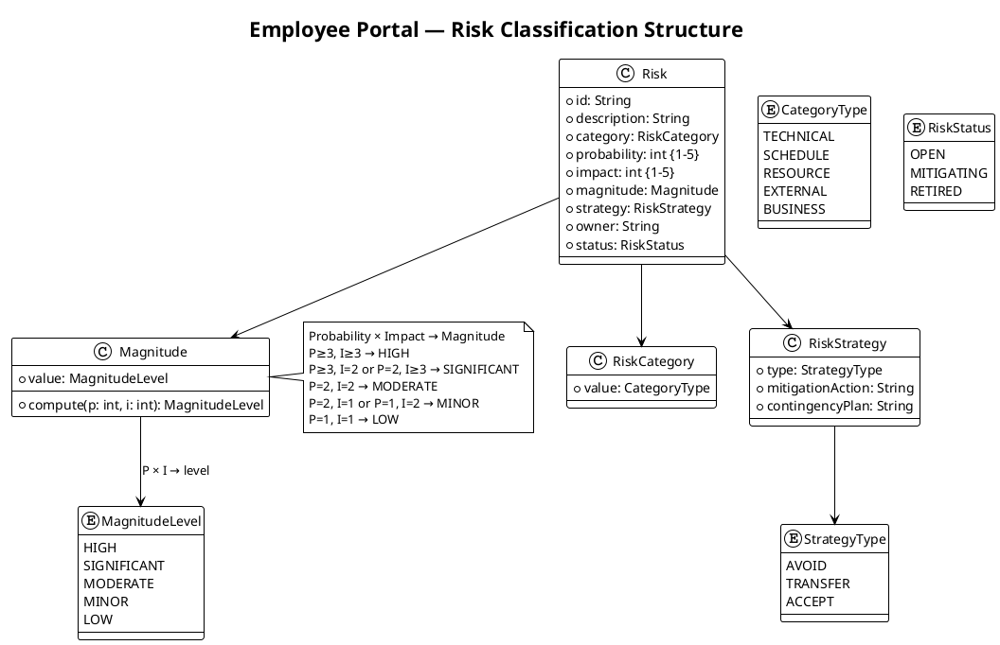

## Document Control

| Field | Value |
|---|---|
| Phase | Inception |
| Status | Draft |
| Milestone Target | End of Inception (LCO) |
| Iteration | 1 (Cycle 1) |
| Date | 2026-09-01 |

## Risk Classification

Risks are classified by **Probability (P) × Impact (I) = Magnitude**. Probability and impact are scored on a 1–5 scale. The magnitude level determines prioritization and drives iteration sequencing.

| P range | I range | Magnitude | Action |
|---|---|---|---|
| P ≥ 3, I ≥ 3 | — | HIGH | Must be confronted in current or next iteration; mitigation active |
| P ≥ 3, I = 2 | or P = 2, I ≥ 3 | SIGNIFICANT | Mitigation plan required; monitor each iteration |
| P = 2, I = 2 | — | MODERATE | Mitigation plan recommended; review each iteration |
| P = 2, I = 1 | or P = 1, I = 2 | MINOR | Monitor; contingency noted |
| P = 1, I = 1 | — | LOW | Accept; log only |

**Strategy types:** Avoid (eliminate threat), Transfer (shift to third party), Accept (acknowledge with mitigation + contingency).

## Risk Register

| ID | Description | Category | P | I | Magnitude | Strategy | Owner | Status |
|---|---|---|---|---|---|---|---|---|
| R001 | Active Directory integration: LDAP attributes (job title, extension) may not be populated consistently across the 3 offices. If not tested early, the directory shows gaps. | TECHNICAL | 3 | 3 | HIGH | Accept | Software Architect | OPEN |
| R002 | Digital clocking adoption: some employees may keep using Excel out of habit if the change is not communicated well. | BUSINESS | 3 | 2 | SIGNIFICANT | Accept | Project Manager | OPEN |
| R003 | OIDC integration with Keycloak: token validation, role mapping from claims, and redirect flow may have configuration nuances that delay the auth layer. | TECHNICAL | 2 | 3 | SIGNIFICANT | Accept | Software Architect | OPEN |
| R004 | Offline fault tolerance (NFR-004, AC-005): system must tolerate 5-minute network drops and sync data once connectivity is restored. This is non-trivial for a web application on a single server. | TECHNICAL | 2 | 3 | SIGNIFICANT | Accept | Software Architect | OPEN |
| R005 | LDAP query performance: on-demand directory search against AD for 200 employees may exceed the 3-second page load requirement (NFR-001) if AD response is slow or queries are unoptimized. | TECHNICAL | 2 | 2 | MODERATE | Accept | Software Architect | OPEN |
| R006 | Audit trail completeness: NFR-005 requires mandatory traceability of all news publish/edit/unpublish actions and worker category changes. If the audit mechanism is not designed early, retrofitting it is costly. | TECHNICAL | 2 | 2 | MODERATE | Accept | Designer | OPEN |
| R007 | UI design fidelity (CON-011): the mandatory custom design must be implemented faithfully in Razor Pages. Razor Pages' server-rendered model may constrain some design interactions. | TECHNICAL | 2 | 2 | MODERATE | Accept | UI Designer | OPEN |
| R008 | PostgreSQL + .NET 10 compatibility: Npgsql driver maturity for .NET 10 and EF Core compatibility may have edge cases on a cutting-edge framework version. | TECHNICAL | 2 | 2 | MODERATE | Accept | Implementer | OPEN |
| R009 | Scope creep: stakeholders may request additional features (vacation management, push notifications, mobile app) during iteration reviews. | BUSINESS | 2 | 2 | MODERATE | Avoid | Project Manager | OPEN |
| R010 | Infrastructure team availability (STK-004): the Infra team has high influence but low interest in portal features. Delays in their support for AD/LDAP access or Keycloak client registration could block development. | EXTERNAL | 2 | 3 | SIGNIFICANT | Transfer | Project Manager | OPEN |

## Risk Mitigation and Contingency

### R001 — AD LDAP Attribute Consistency (HIGH)

| Attribute | Value |
|---|---|
| Declared as | R001 (P=3, I=3, exposure=9) |
| Strategy | Accept |
| Mitigation | Schedule an Architectural Proof-of-Concept in Elaboration Iteration 1 to query AD over LDAP from each of the 3 offices and verify that job title, department, office, email, and extension attributes are populated. Identify which attributes are missing and define fallback display behavior (e.g., "Not available" for empty fields). |
| Contingency | If attributes are inconsistent, implement graceful degradation: display available fields, omit empty ones, and log a warning. Coordinate with STK-004 (Infrastructure Team) to populate missing AD attributes. If Infra cannot populate them, negotiate with STK-001 (HR Director) to reduce the directory display scope to only reliably-populated fields. |
| Trigger | PoC reveals any attribute missing for >10% of users in any office. |
| Affected alternatives | FR-010 (directory search), AC-003 (find colleague in <10 seconds) |

### R002 — Clocking Adoption Resistance (SIGNIFICANT)

| Attribute | Value |
|---|---|
| Declared as | R002 (P=3, I=2, exposure=6) |
| Strategy | Accept |
| Mitigation | Design the clock-in/out flow (FR-004) to be the simplest possible interaction — one button on the main screen. Ensure the UI design (CON-011) makes clocking visually prominent. Plan a communication strategy for STK-001 (HR Director) to announce the portal and retire the Excel sheet. Include AC-004 (80% adoption, no prior training) as an explicit Construction iteration acceptance test. |
| Contingency | If adoption is below 80% after 3 months, STK-001 issues a formal policy change requiring portal-based clocking. Excel sheets are removed from the shared drive. |
| Trigger | Adoption tracking shows <60% usage after first month post-launch. |
| Affected alternatives | BG-003 (80% adoption), AC-004 (80% clocking with no training) |

### R003 — OIDC/Keycloak Integration Complexity (SIGNIFICANT)

| Attribute | Value |
|---|---|
| Strategy | Accept |
| Mitigation | Architect drafts the OIDC client registration requirements early in Elaboration. Validate the token validation flow and role-claim mapping against the existing Keycloak instance. CON-004 limits scope to client registration — no Keycloak infrastructure work. |
| Contingency | If OIDC integration proves more complex than expected, fall back to a simpler authentication approach (e.g., header-based auth via a reverse proxy) as an interim measure, with OIDC completed in a later Construction iteration. |
| Trigger | Elaboration SAD review reveals unresolved OIDC configuration questions. |
| Affected alternatives | FR-004 (clock in/out requires auth), all HR functions (role-based access) |

### R004 — Offline Fault Tolerance (SIGNIFICANT)

| Attribute | Value |
|---|---|
| Strategy | Accept |
| Mitigation | Architect must address NFR-004/AC-005 in the SAD: define what "tolerates temporary network disruptions" means for a server-side web app. Likely approach: client-side resilience (browser retry on transient failure) + server-side idempotent clocking endpoint (prevent duplicate submissions on reconnect). The portal itself is on the corporate network — the "network drop" scenario is between client browser and portal server. |
| Contingency | If full offline sync is infeasible for a web app, negotiate with STK-001 to redefine AC-005 as "system recovers gracefully from a 5-minute network drop without data loss" (idempotent retry rather than full offline operation). |
| Trigger | Architect determines that client-side offline storage is required but infeasible within Razor Pages constraints. |
| Affected alternatives | NFR-004, AC-005, FR-004 (clocking reliability) |

### R005 — LDAP Query Performance (MODERATE)

| Attribute | Value |
|---|---|
| Strategy | Accept |
| Mitigation | Architect specifies LDAP query optimization in the SAD: cache directory search results with a short TTL (e.g., 60 seconds), limit result sets, and index searchable attributes in AD if possible (coordinate with STK-004). |
| Contingency | If AD queries exceed 3 seconds, implement a lightweight in-memory cache refreshed on a timer, accepting a staleness window of up to 5 minutes for directory data. |
| Trigger | Performance test shows directory search >2 seconds for typical queries. |
| Affected alternatives | NFR-001 (page load <3s), FR-010, AC-003 |

### R006 — Audit Trail Completeness (MODERATE)

| Attribute | Value |
|---|---|
| Strategy | Accept |
| Mitigation | Designer includes an audit logging mechanism in the Design Model from Elaboration onward. Every news operation (publish, edit, unpublish) and worker category change writes an audit record (actor, action, timestamp, entity ID, before/after for category). CON-012 (no hard delete) ensures news records persist for audit. |
| Contingency | If audit mechanism is delayed, implement a database trigger-based audit as a fallback — less flexible but guarantees capture. |
| Trigger | Design Model review reveals no audit entity or audit logging sequence. |
| Affected alternatives | NFR-005, FR-006, FR-008, FR-009, FR-003 |

### R007 — UI Design Fidelity in Razor Pages (MODERATE)

| Attribute | Value |
|---|---|
| Strategy | Accept |
| Mitigation | UI Designer maps the mandatory design (CON-011) to Razor Pages components early in Elaboration. Identify any design elements that require client-side JavaScript and plan minimal JS additions within the Razor Pages framework. |
| Contingency | If specific design elements cannot be rendered faithfully in Razor Pages, negotiate with STK-001 for minor visual adjustments that preserve the design's intent and usability. |
| Trigger | UI Designer identifies >3 design elements incompatible with server-rendered Razor Pages. |
| Affected alternatives | CON-011, all user-facing FRs |

### R008 — PostgreSQL + .NET 10 Compatibility (MODERATE)

| Attribute | Value |
|---|---|
| Strategy | Accept |
| Mitigation | Implementer validates Npgsql and EF Core PostgreSQL provider compatibility with .NET 10 during project skeleton setup in Inception/Elaboration. Run a basic CRUD test against PostgreSQL early. |
| Contingency | If compatibility issues arise, pin to the latest stable .NET version that has full Npgsql support, documenting the version decision. |
| Trigger | Build fails or runtime errors occur during database connection setup. |
| Affected alternatives | CON-001, CON-003 |

### R009 — Scope Creep (MODERATE)

| Attribute | Value |
|---|---|
| Strategy | Avoid |
| Mitigation | Enforce the Declared Scope as the ceiling. All change requests go through the Change Control Board (CCM). The Iteration Plan explicitly lists which FRs are in scope. Stakeholder requests for excluded features (vacation, push notifications, mobile app, payroll integration) are logged as Change Requests, not silently added. |
| Contingency | If a critical missing requirement is identified, escalate as `[SCOPE_QUESTION]` for stakeholder decision — never silently expand scope. |
| Trigger | Stakeholder requests a feature outside the Declared Scope during an iteration review. |
| Affected alternatives | All declared scope items |

### R010 — Infrastructure Team Availability (SIGNIFICANT)

| Attribute | Value |
|---|---|
| Strategy | Transfer |
| Mitigation | Engage STK-004 (Infrastructure Team) early in Elaboration to request: (1) LDAP read access to AD for the portal service account, (2) Keycloak client registration for the portal, (3) Windows Server provisioning. Document these as external dependencies in the SAD. Set explicit deadlines for Infra deliverables aligned to Elaboration exit. |
| Contingency | If Infra cannot provide access by Elaboration exit, use a mock LDAP directory and mock OIDC provider for development, with integration deferred to early Construction. This introduces integration risk but unblocks development. |
| Trigger | Infra has not confirmed LDAP access or Keycloak client registration by end of Elaboration Iteration 1. |
| Affected alternatives | FR-010 (directory), FR-004 (auth), CON-004, CON-005, CON-008 |

## Traceability

| Element | Traces From | Link Type | Traces To |
|---|---|---|---|
| R001 | Declared risk R001 | Refines | Architectural Proof-of-Concept (Elaboration candidate), FR-010, AC-003 |
| R002 | Declared risk R002 | Refines | BG-003, AC-004, FR-004 |
| R003 | CON-004 (Keycloak OIDC) | Derives | FR-004, all HR functions (role-based access) |
| R004 | NFR-004, AC-005 | Derives | FR-004, NFR-004 |
| R005 | NFR-001, FR-010, CON-005 | Derives | AC-003 |
| R006 | NFR-005, FR-006, FR-008, FR-009, FR-003 | Derives | Design Model (audit entity) |
| R007 | CON-011 | Derives | All user-facing FRs |
| R008 | CON-001, CON-003 | Derives | Implementation Model (project skeleton) |
| R009 | Declared scope exclusions | Derives | All declared scope items |
| R010 | STK-004, CON-004, CON-005, CON-008 | Derives | FR-010, FR-004 |