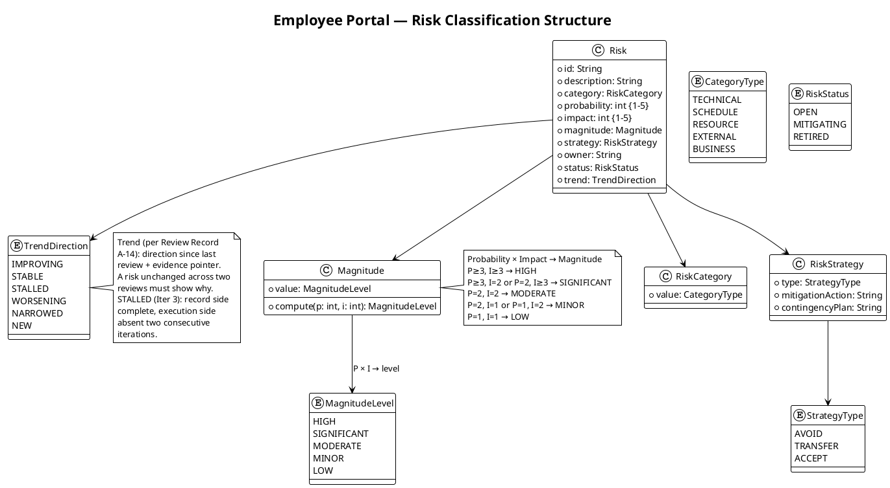

# Risk List

## Document Control
| Field | Value |
|---|---|
| Phase | Elaboration |
| Status | Draft — Elaboration Iteration 5 close-pass reappraisal (PM); evolved from the Iter 5 plan-build reappraisal, not recreated |
| Milestone Target | End of Elaboration (LCA) — NOT yet achieved; the R6 re-presentation at the R014 record-correction cycle close is the next gate |
| Iteration | 5 (Cycle 1) — close-pass reappraisal |
| Date | 2026-09-02 |
| Prior Version | Elaboration Iteration 5 plan-build reappraisal (2026-09-02); Iter 3 close-pass reappraisal; Iter 3 plan-build reappraisal; Iter 2 close-pass reappraisal; Iter 1 reappraisal; Inception (Approved at LCO — 0 findings); EVOLVED, not recreated |
| Iter 5 Close-Pass Changes | **R014 TRIGGER FIRED — recorded (the registration VALIDATED).** The trigger registered at the Iter 5 plan-build ("any new record-propagation finding minted at the Iter 5 review") fired exactly as predicted: 2 findings minted against this pass's OWN landings (TES F4 Major → A-40, Test Manager; DC F5 Minor → A-41, Process Engineer) while A-38 and A-39 landed and ledger-closed the same pass. The pre-recorded contingency is now OPERATIVE: the R6 entry-gate verification caught the stale enumerations BEFORE re-presentation and re-opens the PASS (one more record-correction cycle), NOT the phase — the class's cost is bounded at one pass per occurrence. The mitigation is RE-APPLIED to the R014 cycle's own landings (A-40/A-41), strengthened per the Iter 5 lesson: the remainder statement is re-verified against the verified findings ledger BEFORE every upsert. Minting count DECLINING across the three fired passes (Iter 3: 5; Iter 4: 3; Iter 5: 2) — the class is converging. **R012 trend updated:** Iter 5 measured queue 0:00:00 across 22 interactions — THIRD consecutive zero-queue iteration; cumulative actuals: LCO 0s; Iter 1 0:35:14; Iter 2 10:01:08; Iter 3 0:00:00; Iter 4 0:00:00; Iter 5 0:00:00 — far below the 14-day suspension ceiling. **All other rows:** terminal (R001/R003/R004 RETIRED, R013 RESOLVED — verified by the Reviewer lens at Iter 4, held at Iter 5) or stable with no new evidence; no retirement or escalation changes this reappraisal |
| Iter 5 Plan-Build Changes (preserved) | **R014 REGISTERED — record-propagation self-propagation (SCHEDULE, SIGNIFICANT, P=3, I=2, Accept, owner PM).** The defect class minted new findings in TWO consecutive passes (Iter 3: 5; Iter 4: 3 — all citing same-pass landings), and under the stakeholder's binding all-findings directive every minted finding blocks the R6 gate: the class can delay the phase close one pass per occurrence if not terminated. Mitigation: the same-pass discipline (DC, adopted Iter 4) applied to the pass's OWN landings — carried as Iter 5 pass exit criterion 4 (Iteration Plan Work Item 4). Contingency: the R6 entry-gate verification (findings system, all 13 artifacts) catches a stale enumeration BEFORE re-presentation and re-opens the PASS, not the phase. Trigger: any new record-propagation finding minted at the Iter 5 review. **R012 trend updated:** Iter 4 measured queue 0:00:00 across 22 interactions (the heaviest interaction load of the phase) — second consecutive zero-queue iteration; cumulative actuals: LCO 0s; Iter 1 0:35:14; Iter 2 10:01:08; Iter 3 0:00:00; Iter 4 0:00:00 — far below the 14-day suspension ceiling. **All other rows:** terminal (R001/R003/R004 RETIRED, R013 RESOLVED — verified by the Reviewer lens at Iter 4: "the close-pass reappraisal is sound and observed") or stable with no new evidence; no retirement or escalation changes this reappraisal |
| Iter 3 Close-Pass Changes (preserved) | **Risk retirement RECORDED on observed evidence:** R001 → **RETIRED (Elaboration scope)** — FOUR clauses × FOUR consumers PASS (TC-011 + TC-021/022/023; clause (d) verified against substitution-attempt fixtures; trace CI 33617748483); R003 → **RETIRED** — token-validation matrix PASS; R004 → **RETIRED** — 5-minute drop simulation PASS; R013 → **RESOLVED** — the code chain landed (PRs #3/#4/#5 merged to iteration/E1, PR #6 baseline-close to main APPROVED, Issue #1 CLOSED cr:complete). Production-instance residuals carried to R011 (Construction — stakeholder decision: outside the LCA evidence package). **R010 PM obligation (Iteration Plan F8 remediation):** the written deliverables request is NOT issued — the concrete blocker is recorded (no direct STK-004 channel exists in this runtime; the stakeholder questionnaire reaches STK-001 only; the stakeholder's Iter 3 directive confirms production AD/Keycloak integration is Construction scope); the obligation is CARRIED to the Construction Iter 1 plan with R010's own trigger. The RESPONSE remains NOT an Elaboration exit condition (stakeholder decision, Elab Iter 1). **R012 measured:** Iter 3 queue 0:00:00 across 20 interactions, all answered in-round — the Iter 2 process-defect growth did not recur |
| Iter 3 Plan-Build Changes (preserved) | R013 registered (code-delivery continuity — a blocker recurring two consecutive iterations without a register entry is a risk-management failure); trends updated honestly (STALLED at plan-build); R010 mitigation updated (PM obligation Iter 3) |
| Iter 2 Corrections (preserved) | Risk List F2 (A-24) corrected — R007 faithful featured-banner contract (banners STACK, newest first); A-30 applied — R001 acceptance criteria extended to the FOUR-clause behavioural bar |
## Risk Classification

Risks are classified by **Probability (P) × Impact (I) = Magnitude**. Probability and impact are scored on a 1–5 scale. The magnitude level determines prioritization and drives iteration sequencing.

| P range | I range | Magnitude | Action |
|---|---|---|---|
| P ≥ 3, I ≥ 3 | — | HIGH | Must be confronted in current or next iteration; mitigation active |
| P ≥ 3, I = 2 | or P = 2, I ≥ 3 | SIGNIFICANT | Mitigation plan required; monitor each iteration |
| P = 2, I = 2 | — | MODERATE | Mitigation plan recommended; review each iteration |
| P = 2, I = 1 | or P = 1, I = 2 | MINOR | Monitor; contingency noted |
| P = 1, I = 1 | — | LOW | Accept; log only |

**Strategy types:** Avoid (eliminate threat), Transfer (shift to third party), Accept (acknowledge with mitigation + contingency).



## Risk Register
| ID | Description | Category | P | I | Magnitude | Strategy | Owner | Status | Trend (since Iter 5 plan-build) |
|---|---|---|---|---|---|---|---|---|---|
| R001 | Active Directory integration: LDAP attributes (job title, extension) may not be populated consistently across the 3 offices. If not tested early, the directory shows gaps. | TECHNICAL | 3 | 3 | HIGH | Accept | Software Architect | **RETIRED (Elaboration scope) — recorded at the Iter 3 close pass (Work Item 11)** | **RETIRED ON OBSERVED EVIDENCE — VERIFIED at Iter 4, HELD at Iter 5** (Reviewer lens: "the close-pass reappraisal is sound and observed") — FOUR clauses × FOUR consumers PASS (TC-011 + TC-021/022/023; clause (d) verified against substitution-attempt fixtures — NOT "General", NOT "Central", NOT "N/A", no cross-entry inheritance; trace CI 33617748483); PR #3 merged to iteration/E1 (APPROVED, review 5088169328); LdapGateway sha b8df8b7; Issue #1 CLOSED cr:complete. Production-AD data-quality residual → R011 (Construction, stakeholder decision — outside the LCA evidence package) |
| R002 | Digital clocking adoption: some employees may keep using Excel out of habit if the change is not communicated well. | BUSINESS | 3 | 2 | SIGNIFICANT | Accept | Project Manager | OPEN — Construction/Transition | STABLE — no new evidence; adoption unmeasurable until deployment (BG-003) |
| R003 | OIDC integration with Keycloak: token validation, role mapping from claims, and redirect flow may have configuration nuances that delay the auth layer. | TECHNICAL | 2 | 3 | SIGNIFICANT | Accept | Software Architect | **RETIRED (Elaboration scope) — recorded at the Iter 3 close pass** | **RETIRED ON OBSERVED EVIDENCE — VERIFIED at Iter 4, HELD at Iter 5** — token-validation matrix PASS (RS256 via issuer JWKS with kid matching, exp/iss/aud/sub enforced, roles extracted verbatim, failing states rejected at the request boundary — 401); PR #4 merged (APPROVED, review 5088169517). Production claim shapes → R011 (Construction) |
| R004 | Offline fault tolerance (NFR-004, AC-005): system must tolerate 5-minute network drops and sync data once connectivity is restored. Non-trivial for a web application on a single server. | TECHNICAL | 2 | 3 | SIGNIFICANT | Accept | Software Architect | **RETIRED (Elaboration scope) — recorded at the Iter 3 close pass** | **RETIRED ON OBSERVED EVIDENCE — VERIFIED at Iter 4, HELD at Iter 5** — 5-minute drop simulation PASS (zero duplicates — double replay AND mixed online+queued; zero losses; sync ≤ 60 s; confirmations < 1 s; recorded-order preservation); PR #5 merged (APPROVED, review 5088169685). Formal AC-005 feature test at Construction Iter 1; PG engine semantics R008 |
| R005 | LDAP query performance: on-demand directory search against AD for 200 employees may exceed the 3-second page load requirement (NFR-001) if AD response is slow or queries are unoptimized. | TECHNICAL | 2 | 2 | MODERATE | Accept | Software Architect | OPEN — production-AD measurement at Construction Iter 3 | STABLE — the merged gateway carries the 5 s hard timeout (PRF-003), RFC 4515 escaping, and D-9 map completeness; production-AD query performance measured at Construction Iter 3 (R010/R011) |
| R006 | Audit trail completeness: NFR-005 requires mandatory traceability of all news publish/edit/unpublish actions and worker category changes. If the audit mechanism is not designed early, retrofitting it is costly. | TECHNICAL | 2 | 2 | MODERATE | Accept | Designer | OPEN — Design Model this phase | STABLE — audit mechanism designed in the Design Model (zero findings at all five LCA technical reviews); news/audit cases TC-013…TC-016 BLOCKED — recorded scope decision (Construction, deferred not missing) |
| R007 | UI design fidelity (CON-011): the mandatory custom design must be implemented faithfully in Razor Pages. Server-rendered model may constrain some design interactions. | TECHNICAL | 2 | 2 | MODERATE | Accept | UI Designer | OPEN — design mapping this phase | STABLE — CON-011 mapped to Razor Pages (Design Model UI sections, zero findings); featured-banner contract settled (banners STACK, newest first — faithful record, F2 corrected at the Iter 2 close pass); TC-003/TC-010 BLOCKED — recorded scope decision (Construction UI mechanisms) |
| R008 | PostgreSQL + .NET 10 compatibility: Npgsql driver maturity for .NET 10 and EF Core compatibility may have edge cases on a cutting-edge framework version. | TECHNICAL | 2 | 2 | MODERATE | Accept | Implementer | OPEN — build-time validation Construction Iter 1 | STABLE — the interim in-memory seam carried Elaboration (F-CR-E3-1, UNIQUE idempotency_key contract enforced and validated); PG adapter (CLS-011/012) + engine semantics land Construction Iter 1 |
| R009 | Scope creep: stakeholders may request additional features (vacation management, push notifications, mobile app) during iteration reviews. | BUSINESS | 2 | 2 | MODERATE | Avoid | Project Manager | OPEN — CCB enforced | STABLE — zero scope-creep findings across all review lenses, five iterations (Review Record) |
| R010 | Infrastructure team deliverables (STK-004): LDAP service account, Keycloak client registration, Windows Server provisioning. **Re-scoped (Elab Iter 1):** blocks production-instance integration only — NOT Elaboration exit. | EXTERNAL | 2 | 3 | SIGNIFICANT | Transfer | Project Manager | OPEN — Construction integration; **PM obligation CARRIED to Construction Iter 1 (close-pass record — F8 remediation, RESOLVED and ledger-closed by the Management lens at Iter 4)** | STABLE — the written request is NOT issued; the concrete blocker is recorded (no direct STK-004 channel in this runtime — the questionnaire reaches STK-001 only; the stakeholder's Iter 3 directive confirms production AD/Keycloak integration is Construction scope); the obligation is carried to the Construction Iter 1 plan with R010's own trigger (STK-004 confirmation by Construction Iter 1 start). The RESPONSE remains NOT an Elaboration exit condition (stakeholder decision) |
| R011 | Validation-environment fidelity: the disposable LDAP directory and stub OIDC issuer used for Elaboration empirical validation may differ from the production instances (attribute schemas, claim shapes, Keycloak configuration). | TECHNICAL | 2 | 2 | MODERATE | Accept | Software Architect | OPEN — Construction | STABLE — owns BOTH production residuals from the retired risks: the real-AD data-quality percentage (from R001) AND the production claim shapes (from R003); fixtures retained as reusable Construction test fixtures; explicitly OUTSIDE the LCA evidence package per the stakeholder's Iter 2 answer |
| R012 | Human-gate queue: the LCA/IOC/PR milestone sanction gates and stakeholder consultation rounds depend on a human deciding when to sit down. A gate is a RISK, not an estimate — the plan quotes no queue figure (A-13); the queue is bounded HERE. | SCHEDULE | 1 | 2 | MINOR | Accept | Project Manager | OPEN — bounded, monitored each gate | **IMPROVED — THIRD consecutive zero-queue iteration** — measured Iter 5 queue 0:00:00 across 22 interactions, ALL answered in-round; the emission-format standing rule held under load. Cumulative actuals: LCO 0s; Iter 1 0:35:14; Iter 2 10:01:08; Iter 3 0:00:00; Iter 4 0:00:00; Iter 5 0:00:00 — far below the 14-day suspension ceiling |
| R013 | Code-delivery continuity: the convergence critical path (A-16) runs through the Implementer, and no mechanism code had landed for TWO consecutive iterations. The stakeholder attributes the absence to a technical problem beyond the Implementer's control and states the code push as the priority for Iter 3. | RESOURCE | 2 | 3 | SIGNIFICANT | Accept | Project Manager | **RESOLVED — Iter 3 close pass** | **RESOLVED ON OBSERVED EVIDENCE — VERIFIED at Iter 4, HELD at Iter 5** — the stakeholder-stated priority FULFILLED and verified: 3 mechanisms merged (PRs #3/#4/#5, APPROVED ×3), baseline-close PR #6 merged to main (APPROVED), formal TC pass COMPLETE (15/0/8, trace CI 33617748483), Issue #1 CLOSED cr:complete; the contingency (phase cannot close without code) was never triggered |
| **R014** | **Record-propagation self-propagation (registered Iter 5 plan-build):** the record-propagation defect class is SELF-PROPAGATING — each pass's landings stale the prior pass's "remaining work" enumerations, and the review that verifies the landings mints new findings against the stale siblings. It minted findings in THREE consecutive passes (Iter 3: 5; Iter 4: 3; Iter 5: 2 — all citing same-pass landings), and under the stakeholder's binding all-findings directive every minted finding blocks the R6 gate: the class can delay the phase close by one pass per occurrence if not terminated. | SCHEDULE | 3 | 2 | **SIGNIFICANT** | Accept | Project Manager | **OPEN — MITIGATING (trigger FIRED at the Iter 5 review; contingency OPERATIVE — the R6 entry gate re-opens the PASS, not the phase; the mitigation is RE-APPLIED to the R014 cycle's own landings A-40/A-41)** | **TRIGGER FIRED — exactly as registered (recorded at this close pass): 2 findings minted against this pass's OWN landings (TES F4 Major, DC F5 Minor) while A-38 and A-39 landed and ledger-closed the same pass — the registration's prediction confirmed, VALIDATING the registration rather than defecting it. Minting count DECLINING (Iter 3: 5; Iter 4: 3; Iter 5: 2) — the class is converging. The strengthened mitigation: the remainder statement is re-verified against the verified findings ledger BEFORE every upsert (the Iter 5 lesson — the discipline was carried and still failed on two locations)** |

### Elaboration Iter 3 Close-Pass Reappraisal — Risk Retirement Recording (preserved)

```plantuml
@startuml
!theme plain
title Employee Portal — Elaboration Iter 3 Close-Pass Risk Reappraisal
Retirement recorded on OBSERVED evidence (PM, Work Item 11)

class "R001 AD LDAP Attributes
HIGH (P=3, I=3) RETIRED (Elab scope)" as R001 {
  Retired on: formal TC pass 15/0/8
  (trace CI 33617748483)
  Evidence: FOUR clauses x FOUR
  consumers PASS - TC-011 +
  TC-021/022/023, clause (d)
  verified against substitution-
  attempt fixtures (NOT General,
  NOT Central, NOT N/A, no
  cross-entry inheritance)
  Mechanism: PR 3 merged to
  iteration/E1 (APPROVED, review
  5088169328); LdapGateway b8df8b7
  Residual: production-AD data
  quality -> R011 (Construction,
  stakeholder decision - outside
  the LCA evidence package)
}

class "R003 OIDC Integration
SIGNIFICANT (P=2, I=3) RETIRED (Elab scope)" as R003 {
  Retired on: token-validation
  matrix PASS - RS256 via issuer
  JWKS with kid matching, exp/iss/
  aud/sub enforced, roles extracted
  verbatim, failing states rejected
  at the request boundary (401)
  Mechanism: PR 4 merged (APPROVED,
  review 5088169517)
  Residual: production claim
  shapes -> R011 (Construction)
}

class "R004 Offline Fault Tolerance
SIGNIFICANT (P=2, I=3) RETIRED (Elab scope)" as R004 {
  Retired on: 5-min drop simulation
  PASS - zero duplicates (double
  replay AND mixed online+queued),
  zero losses, sync <= 60 s,
  confirmations < 1 s, recorded-
  order preservation (AC-005)
  Mechanism: PR 5 merged (APPROVED,
  review 5088169685)
  Follow-on: formal AC-005 feature
  test at Construction Iter 1;
  PG engine semantics R008
}

class "R013 Code-Delivery Continuity
SIGNIFICANT (P=2, I=3) RESOLVED" as R013 {
  Resolved on: the stakeholder-stated
  priority FULFILLED - 3 mechanisms
  merged (PRs 3/4/5), baseline-close
  PR 6 merged to main (APPROVED),
  formal TC pass COMPLETE, Issue 1
  CLOSED cr:complete
  The two-iteration absence did not
  recur; the contingency (phase
  cannot close without code) was
  never triggered
}

class "R010 STK-004 Deliverables
SIGNIFICANT (P=2, I=3) TRANSFER" as R010 {
  Blocks: production-instance
  integration ONLY (Construction)
  PM obligation (close-pass record,
  F8 remediation): the written
  request is NOT issued - concrete
  blocker: no direct STK-004 channel
  in this runtime (the questionnaire
  reaches STK-001 only), and the
  stakeholder's Iter 3 directive
  confirms production AD/Keycloak
  integration is Construction scope
  Obligation CARRIED to the
  Construction Iter 1 plan with
  R010's own trigger (STK-004
  confirmation by Construction
  Iter 1 start). Response NOT an
  exit condition (stakeholder)
}

class "R012 Human-Gate Queue
MINOR (P=1, I=2) ACCEPT" as R012 {
  Measured: LCO 0 s; Iter 1 0:35:14;
  Iter 2 10:01:08; Iter 3 0:00:00
  (20 interactions, ALL in-round -
  the Iter 2 process-defect growth
  did not recur)
  Contingency: suspends at 14 days
}

R013 ..> R001 : unblocked the validation
R013 ..> R003 : unblocked the validation
R013 ..> R004 : unblocked the validation
R001 ..> R011 : residual carried
R003 ..> R011 : residual carried
R010 ..> R011 : production instances close the gap
R004 -[hidden]-> R010
R010 -[hidden]-> R012
R012 -[hidden]-> R013

note bottom of R013
  Close-pass reappraisal (Work Item 11,
  stakeholder-confirmed): retirement is
  recorded ONLY on observed evidence -
  the formal TC pass is CI-traced, and
  the 8 BLOCKED cases are a recorded
  SCOPE decision (deferred to
  Construction, not missing) per the
  stakeholder's framing directive.
end note
@enduml
```

### Elaboration Iter 5 Plan-Build Reappraisal — R014 Registration and R012 Trend Update (preserved)

```plantuml
@startuml
!theme plain
title Employee Portal — Elaboration Iter 5 Plan-Build Risk Reappraisal (PM)
R014 registered (record-propagation self-propagation); R012 trend updated; all other rows terminal or stable

[*] --> Landing
state "A landing occurs in a pass
(e.g. A-37 lands: the TES remainder-
enumerations updated from the observed
same-pass state)" as Landing
state "Sibling records written EARLIER in
the same pass still enumerate the
landing as PENDING or OPEN" as Stale
state "The review verifies the landing AND
reads the stale siblings -> a NEW
record-propagation finding is minted
(Iter 3: 5 minted; Iter 4: 3 minted -
all citing same-pass landings)" as Minted
state "R6 entry gate BLOCKED: the ledger is
not empty - the stakeholder's binding
all-findings directive makes every new
finding a phase-exit condition" as Blocked

Landing --> Stale : records lag landings
(the class's mechanism)
Stale --> Minted : cross-artifact contradiction
(the DC F1 / Risk List F2 class)
Minted --> Blocked

state "R014 MITIGATION - the SAME-PASS discipline
(DC, adopted Iter 4) applied to the pass's OWN
landings: when A-37..A-39 land, EVERY record
enumerating what remains is updated IN THAT
PASS - carried as Iter 5 pass exit criterion 4
(Work Item 4, ~800K)" as Cure
Blocked --> Cure : R014 CONTINGENCY: the R6 entry-gate
verification (findings system, all 13
artifacts) catches a stale enumeration
BEFORE re-presentation - it re-opens
the PASS, not the phase
Cure --> [*] : the class terminates at R6 -
the pass mints no successor finding

note right of Minted
  R014 (NEW): SIGNIFICANT
  P=3 (occurred two consecutive
  passes), I=2 (delays the phase
  close by one pass each time; no
  code, design, or validation
  impact). Owner: Project Manager.
  Strategy: Accept. Trigger: any
  new record-propagation finding
  minted at the Iter 5 review.
end note

note bottom of Cure
  Same reappraisal, R012 trend update:
  Iter 4 measured 0:00:00 across 22
  interactions (the heaviest load of
  the phase) - second consecutive
  zero-queue iteration. Cumulative:
  LCO 0s; Iter 1 0:35:14; Iter 2
  10:01:08; Iter 3 0:00:00; Iter 4
  0:00:00 - far below the 14-day
  suspension ceiling. All other
  register rows: terminal (R001/R003/
  R004 RETIRED, R013 RESOLVED) or
  stable with no new evidence.
end note
@enduml
```

### Elaboration Iter 5 Close-Pass Reappraisal — R014 Trigger Firing Recorded; Contingency Operative (new)

```plantuml
@startuml
!theme plain
title Employee Portal — Elaboration Iter 5 Close-Pass Risk Reappraisal (PM)
R014 trigger FIRED - recorded; contingency operative; R012 trend updated; all other rows terminal or stable

[*] --> R014A
state "R014 at the Iter 5 plan-build
OPEN - MITIGATING; the same-pass
discipline carried as pass exit
criterion 4; trigger armed" as R014A
state "R014 at the Iter 5 review
TRIGGER FIRED - 2 findings minted
(TES F4 Major, DC F5 Minor) against
this pass's OWN landings, while A-38
and A-39 landed and ledger-closed
the same pass - exactly as registered" as R014B
state "R014 at close - THIS REAPPRAISAL
OPEN - MITIGATING, contingency
OPERATIVE; the mitigation re-applies
to the R014 cycle's own landings
(A-40/A-41); minting count
DECLINING - Iter 3 five, Iter 4
three, Iter 5 two" as R014C
R014A --> R014B : trigger fired exactly
as the registration predicted
R014B --> R014C : close-pass recording
R014C --> [*] : terminates when a pass
mints no successor finding

note bottom of R014C
  R014 contingency (pre-recorded, now
  operative) - the R6 entry-gate
  verification catches a stale
  enumeration BEFORE re-presentation
  and re-opens the PASS (one more
  record-correction cycle), NOT the
  phase; cost bounded at one pass per
  occurrence.
  R012 trend updated this close -
  measured Iter 5 queue 0:00:00 across
  22 interactions, ALL in-round; THIRD
  consecutive zero-queue iteration;
  cumulative - LCO 0s; Iter 1 0:35:14;
  Iter 2 10:01:08; Iter 3 0:00:00;
  Iter 4 0:00:00; Iter 5 0:00:00 - far
  below the 14-day suspension ceiling.
  All other register rows - terminal
  (R001/R003/R004 RETIRED, R013
  RESOLVED - verified at Iter 4, held
  at Iter 5) or stable with no new
  evidence; no retirement or
  escalation changes this reappraisal.
end note
@enduml
```

> The Iter 3 plan-build reappraisal diagram (validation paths, R013 registration, STALLED trends) is preserved in SCM history at the plan-build revision — the close-pass record above supersedes the trend states it carried, per the reappraisal discipline (updated every iteration). The Iter 5 plan-build reappraisal supersedes the Iter 3 close-pass trend states in the register table the same way; the Iter 5 close-pass reappraisal above supersedes the plan-build trend states; the retirement records themselves are terminal and unchanged.
## Risk Mitigation and Contingency
### R001 — AD LDAP Attribute Consistency (HIGH) — RETIRED (Elaboration scope), recorded at the Iter 3 close pass

| Attribute | Value |
|---|---|
| Declared as | R001 (P=3, I=3, exposure=9) |
| Strategy | Accept |
| Mitigation (Elab Iter 3 close — EXECUTED and OBSERVED) | **Empirical validation EXECUTED this phase, against the FOUR-clause BEHAVIOURAL bar:** the disposable LDAP directory was stood up (not the production AD — no STK-004 dependency), populated with representative entries per office **with attribute gaps AND substitution-attempt fixtures seeded deliberately**, and queried over LDAP v3 through COMP-007. The four behavioural clauses are PROVEN for ALL FOUR AD-reading use cases — UC-004 (directory search, FR-010), UC-005 (HR clocking review, FR-001), UC-006 (CSV export, FR-002), UC-007 (worker category assignment, FR-003) — per the stakeholder's Iter 2 confirmation ("Yes") and the verdict-gate fourth clause ("Add a fourth clause to all four"). **Execution evidence (observed):** PR #3 merged to `iteration/E1` (APPROVED, review 5088169328); LdapGateway.cs sha b8df8b7 — the four-clause graceful-degradation contract in code; formal TC pass 15 PASS / 0 FAIL / 8 BLOCKED (trace CI 33617748483); clause-by-clause evidence via TC-011 + TC-021/022/023 with clause (d) verified against the substitution-attempt fixtures (NOT "General", NOT "Central", NOT "N/A", no cross-entry inheritance); Issue #1 CLOSED cr:complete. |
| Acceptance criteria (behavioural — stakeholder answers, Elab Iter 2 + verdict gate) | (1) Every employee is rendered whether or not their attributes are complete. (2) A missing attribute never removes someone from search results. (3) A missing attribute never raises an error. (4) **A missing attribute is displayed as missing. It is never replaced by a default, a placeholder, a guessed value, or another employee's value** (verdict-gate contribution, verbatim; rationale verbatim: "Blank is an answer. 'General', or the first office in the list, is a fabrication — and on the CSV that reaches payroll a fabricated department is worse than an empty cell. An empty cell gets questioned. A plausible wrong one does not."). **All four clauses PROVEN to hold — observed, clause-by-clause, four consumers.** Dropped: the ">90% of sampled users per office" figure — invented, no declared source; it measured our own seeded test data and could not fail, so it proved nothing. The production-AD data-quality percentage is a Construction activity (R010 + R011), explicitly OUTSIDE the LCA evidence package. |
| Contingency | **Not triggered — the behavioural bar held on every clause and every consumer.** The contingency path (fix the graceful-degradation path in COMP-007 before the LCA re-presentation) is preserved for Construction: if production AD reveals a behavioural failure at integration (R011 trigger), the fix is contained to COMP-007/CLS-009 (High-volatility encapsulation by design). Production-AD attribute population is STK-004's domain (CON-007): coordinate via R010 in Construction; if production attributes remain unpopulated, negotiate with STK-001 (HR Director) to reduce the directory display scope to reliably-populated fields. |
| Trigger | PoC reveals a missing attribute that hides an entry, removes someone from search results, raises an error, or substitutes a default, placeholder, guessed value, or another employee's value — **not observed; the risk is RETIRED in Elaboration scope. The production residual is owned by R011 (Construction).** |
| Affected alternatives | FR-010, FR-001, FR-002, FR-003 (all four AD-reading use cases), AC-003 (find colleague in <10 seconds) |

### R002 — Clocking Adoption Resistance (SIGNIFICANT)

| Attribute | Value |
|---|---|
| Declared as | R002 (P=3, I=2, exposure=6) |
| Strategy | Accept |
| Mitigation | Design the clock-in/out flow (FR-004) to be the simplest possible interaction — one button on the main screen. Ensure the UI design (CON-011) makes clocking visually prominent. Plan a communication strategy for STK-001 (HR Director) to announce the portal and retire the Excel sheet. Include AC-004 (80% adoption, no prior training) as an explicit Construction iteration acceptance test. |
| Contingency | If adoption is below 80% after 3 months, STK-001 issues a formal policy change requiring portal-based clocking. Excel sheets are removed from the shared drive. |
| Trigger | Adoption tracking shows <60% usage after first month post-launch. |
| Affected alternatives | BG-003 (80% adoption), AC-004 (80% clocking with no training) |

### R003 — OIDC/Keycloak Integration Complexity (SIGNIFICANT) — RETIRED (Elaboration scope), recorded at the Iter 3 close pass

| Attribute | Value |
|---|---|
| Strategy | Accept |
| Mitigation (Elab Iter 3 close — EXECUTED and OBSERVED) | **Empirical validation EXECUTED this phase, per stakeholder decision:** the portal's OIDC consumption was validated against a **stub issuer** — not a real Keycloak realm (CON-004). Wiring AD into Keycloak is infrastructure work outside this project's boundary; what the PoC had to prove is that the portal consumes and validates an OIDC token correctly and extracts roles from claims. **Execution evidence (observed):** PR #4 merged to `iteration/E1` (APPROVED, review 5088169517); the token-validation matrix PASS — RS256 signatures validated via the issuer's JWKS with kid matching, exp/iss/aud/sub enforced, Employee + HR Administrator roles extracted verbatim (never invented — test-asserted), every failing state rejected at the request boundary (401, next not invoked); the stub issuer mints every failing state per the stakeholder's mock decision. |
| Acceptance criteria | Token validation succeeds; Employee and HR Administrator roles correctly extracted from claims (SEC-006); redirect flow completes — **ALL OBSERVED PASS.** |
| Contingency | **Not triggered.** Recorded for Construction: production claim shapes may differ from the stub issuer's (R011) — COMP-006/CLS-010 is the High-volatility encapsulation, so the adjustment is contained; the fallback (header-based auth via a reverse proxy) remains available if production OIDC consumption proves more complex at integration. |
| Trigger | Stub-issuer validation reveals unresolved token-validation or claim-mapping defects — **not observed.** |
| Affected alternatives | FR-004 (clock in/out requires auth), all HR functions (role-based access) |

### R004 — Offline Fault Tolerance (SIGNIFICANT) — RETIRED (Elaboration scope), recorded at the Iter 3 close pass

| Attribute | Value |
|---|---|
| Strategy | Accept |
| Mitigation (Elab Iter 3 close — EXECUTED and OBSERVED) | **Empirical validation EXECUTED this phase, direct — nothing blocked it:** the 5-minute network drop was simulated (AC-005), a clocking event queued in localStorage, connectivity restored, and sync verified via the idempotent endpoint (ADR-003). **Execution evidence (observed):** PR #5 merged to `iteration/E1` (APPROVED, review 5088169685); the drop simulation PASS — zero duplicates (double replay AND mixed online+queued), zero losses, sync ≤ 60 s after restore (REL-003), confirmations < 1 s on BOTH paths (PRF-002), recorded-order preservation; DAT-001 press-time capture never rewritten. Scope note (F-CR-E3-1): validated at the interim repository seam (UNIQUE idempotency_key contract, ARCH-7); PostgreSQL engine semantics (ON CONFLICT DO NOTHING, append-only REVOKE) land Construction Iteration 1 (R008). |
| Acceptance criteria | Queued event syncs on reconnect with zero duplicates (idempotency key) and zero losses; confirmation < 1 s on both paths (PRF-002); sync ≤ 60 s after restore (REL-003) — **ALL OBSERVED PASS.** |
| Contingency | **Not triggered.** The formal AC-005 feature test executes at Construction Iter 1 against the running UC-001 feature; the Razor-Pages redefinition fallback ("system recovers gracefully from a 5-minute network drop without data loss") remains recorded if full offline sync proves infeasible at feature level. |
| Trigger | Validation shows queued events lost or duplicated on reconnect — **not observed.** |
| Affected alternatives | NFR-004, AC-005, FR-004 (clocking reliability) |

### R005 — LDAP Query Performance (MODERATE)

| Attribute | Value |
|---|---|
| Strategy | Accept |
| Mitigation | Architect specifies LDAP query optimization in the SAD: cache directory search results with a short TTL (e.g., 60 seconds), limit result sets, and index searchable attributes in AD if possible (coordinate with STK-004). Measured during R001 empirical validation this phase — **executed: the merged gateway carries the 5 s hard timeout (PRF-003), RFC 4515 escaping, and D-9 map completeness; production-AD query performance is measured at Construction Iter 3 (R010/R011).** |
| Contingency | If AD queries exceed 3 seconds, implement a lightweight in-memory cache refreshed on a timer, accepting a staleness window of up to 5 minutes for directory data. |
| Trigger | Performance test shows directory search >2 seconds for typical queries. |
| Affected alternatives | NFR-001 (page load <3s), FR-010, AC-003 |

### R006 — Audit Trail Completeness (MODERATE)

| Attribute | Value |
|---|---|
| Strategy | Accept |
| Mitigation | Designer includes an audit logging mechanism in the Design Model from Elaboration onward. Every news operation (publish, edit, unpublish) and worker category change writes an audit record (actor, action, timestamp, entity ID, before/after for category). CON-012 (no hard delete) ensures news records persist for audit. Audit writes are atomic with the state change (DAT-002). |
| Contingency | If audit mechanism is delayed, implement a database trigger-based audit as a fallback — less flexible but guarantees capture. |
| Trigger | Design Model review reveals no audit entity or audit logging sequence. |
| Affected alternatives | NFR-005, FR-006, FR-008, FR-009, FR-003 |

### R007 — UI Design Fidelity in Razor Pages (MODERATE)

| Attribute | Value |
|---|---|
| Strategy | Accept |
| Mitigation | UI Designer maps the mandatory design (CON-011) to Razor Pages components early in Elaboration. Identify any design elements that require client-side JavaScript and plan minimal JS additions within the Razor Pages framework. Featured-banner rendering contract settled by the stakeholder (Iter 2, verbatim answer: "newest first"): **featured banners STACK, ordered newest first — every featured item renders its own banner, no featured flag silently dropped**; ordering by the same date criterion as the FR-007 list; renders above the list on SCR-03 and above the history preview on SCR-01 (Design Model P-02 — the authoritative UI record). **[Corrected at the Iter 2 close pass — Risk List F2, action A-24: the prior text recorded the UNSELECTED option ("show only the NEWEST featured item — no stacked banners"); "newest first" is an ordering statement, and ordering presupposes plurality. Coordinated with the Process Engineer's parallel A-17 correction (Development Case F1) so both governance artifacts record the identical contract.]** |
| Contingency | If specific design elements cannot be rendered faithfully in Razor Pages, negotiate with STK-001 for minor visual adjustments that preserve the design's intent and usability. |
| Trigger | UI Designer identifies >3 design elements incompatible with server-rendered Razor Pages. |
| Affected alternatives | CON-011, all user-facing FRs |

### R008 — PostgreSQL + .NET 10 Compatibility (MODERATE)

| Attribute | Value |
|---|---|
| Strategy | Accept |
| Mitigation | Implementer validates Npgsql and EF Core PostgreSQL provider compatibility with .NET 10 during project skeleton evolution. Run a basic CRUD test against PostgreSQL early — **Construction Iteration 1 (the interim in-memory seam carried Elaboration: the UNIQUE idempotency_key contract was validated at the repository seam; F-CR-E3-1 carries the [DEFERRED] marker for the PG adapter per INT-016).** |
| Contingency | If compatibility issues arise, pin to the latest stable .NET version that has full Npgsql support, documenting the version decision. |
| Trigger | Build fails or runtime errors occur during database connection setup. |
| Affected alternatives | CON-001, CON-003 |

### R009 — Scope Creep (MODERATE)

| Attribute | Value |
|---|---|
| Strategy | Avoid |
| Mitigation | Enforce the Declared Scope as the ceiling. All change requests go through the Change Control Board (CCM). The Iteration Plan explicitly lists which FRs are in scope. Stakeholder requests for excluded features (vacation, push notifications, mobile app, payroll integration) are logged as Change Requests, not silently added. |
| Contingency | If a critical missing requirement is identified, escalate as `[SCOPE_QUESTION]` for stakeholder decision — never silently expand scope. |
| Trigger | Stakeholder requests a feature outside the Declared Scope during an iteration review. |
| Affected alternatives | All declared scope items |

### R010 — Infrastructure Team Deliverables (SIGNIFICANT — re-scoped; PM obligation relocated at the Iter 3 close pass)

| Attribute | Value |
|---|---|
| Strategy | Transfer |
| Mitigation (Elab Iter 3 close — F8 remediation) | **What STK-004 genuinely blocks is integration with the specific production instances** — the LDAP service account, the Keycloak client registration, and Windows Server provisioning. That is a separate risk and a smaller one: it does NOT inherit R001's HIGH, it does NOT block Elaboration exit, and it goes to Construction. **PM obligation (close-pass record — Iteration Plan F8 remediation, RESOLVED and ledger-closed by the Management lens at Iter 4):** the written deliverables request is NOT issued after three passes — the concrete blocker is recorded: **no direct STK-004 channel exists in this runtime (the stakeholder questionnaire reaches STK-001 only), and the stakeholder's Iter 3 directive confirms production AD/Keycloak integration is Construction scope.** The obligation is CARRIED to the Construction Iter 1 plan with R010's own trigger: the request is issued at Construction Iter 1 plan-build through the stakeholder-facing channel (STK-001 relays to STK-004 per the Vision's engagement model), and the trigger arms — STK-004 confirmation by Construction Iter 1 start. The RESPONSE remains NOT a condition of Elaboration exit (stakeholder decision, Elab Iter 1). |
| Contingency | If Infra cannot provide access by early Construction, development continues against the disposable directory and stub issuer (validated in Elaboration — R001/R003 now RETIRED on that evidence), with production-instance integration deferred within Construction — the Elaboration baseline is not invalidated. |
| Trigger | STK-004 has not confirmed the LDAP service account or Keycloak client registration by the start of Construction Iter 1 — **armed for Construction Iter 1.** |
| Affected alternatives | FR-010 (directory), FR-004 (auth), CON-004, CON-005, CON-008 |

### R011 — Validation-Environment Fidelity (MODERATE — new Iter 1)

| Attribute | Value |
|---|---|
| Strategy | Accept |
| Mitigation | Record the deltas between the Elaboration validation environment and the production instances: the disposable LDAP directory's attribute schema vs production AD's actual population; the stub issuer's claim shape vs the real Keycloak realm's. The R001/R003 acceptance criteria were defined against the validation environment — and were PROVEN there (both risks retired); the residual (does production match it?) is retired by Construction integration testing once STK-004 delivers (R010). Keep the disposable directory and stub issuer as reusable test fixtures for Construction. **Home of the production-AD data-quality percentage (stakeholder, Iter 2):** measuring how many real-AD attributes are populated is a Construction data-quality activity executed once STK-004 delivers — it is NOT evidence of anything while we are the ones writing the validation data, and it stays OUT of the LCA evidence package. |
| Contingency | If production instances differ materially at Construction integration, adjust COMP-007 query filters / COMP-006 claim mapping — both are High-volatility encapsulations by design (SAD Volatility Analysis), so the change is contained to one component each. |
| Trigger | Construction integration test reveals attribute or claim shapes that differ from the Elaboration validation fixtures. |
| Affected alternatives | R001, R003, R010 |

### R012 — Human-Gate Queue (MINOR — new Iter 2)

| Attribute | Value |
|---|---|
| Strategy | Accept |
| Mitigation | A human gate is a RISK, not an estimate: the Iteration Plan quotes NO queue figure for the LCA/IOC/PR gates (action A-13 — the queue forecasts were removed from the milestone table); the queue is bounded HERE. Mitigation is in-round stakeholder answering, as measured at LCO (queue 0s — recorded actual), at the Iter 1 LCA consultation (0:35:14 — answered in-round: sanction refused, directive given), at the Iter 2 verdict gate (10:01:08 across 21 interactions — recorded actual; growth traced to PROCESS defects, not stakeholder availability), at Iter 3 (0:00:00 across 20 interactions — ALL answered in-round; the process-defect growth did not recur), and at Iter 4 (0:00:00 across 22 interactions — the heaviest interaction load of the phase, ALL answered in-round; the emission-format standing rule held under load; second consecutive zero-queue iteration). Each gate's measured queue is reported as an actual in the Iteration Assessment — never forecast in the plan. |
| Contingency | The process SUSPENDS at 14 days of queue per the planning rule — nothing is auto-filled, no decision is fabricated; the suspension is reported to the Review Coordinator and the stakeholder, and the phase waits. |
| Trigger | A gate question or sanction request remains unanswered past 7 days (half the suspension ceiling) — escalation notice issued to the Project Manager and Review Coordinator. |
| Affected alternatives | LCA, IOC, PR milestone gates; every stakeholder-question round; phase-transition sanction |

### R013 — Code-Delivery Continuity (SIGNIFICANT — new Iter 3; RESOLVED at the Iter 3 close pass)

| Attribute | Value |
|---|---|
| Strategy | Accept |
| Mitigation (Elab Iter 3 close — RESOLVED) | The convergence critical path (A-16) ran through the Implementer — and **DELIVERED**: the three mechanisms (R001 disposable LDAP directory + FOUR-clause bar, R003 stub OIDC issuer, R004 offline queue + idempotent sync) as evolutionary code in `src/` on `feature/E1-{risk}` branches with dual-coverage tests, `ready-for-review` labels, terminal PR dispositions (base `iteration/E1`, APPROVED ×3 — reviews 5088169328/5088169517/5088169685), Integrator merges, TC-001…TC-023 executed (15/0/8, trace CI 33617748483), empirical results observed, Issue #1 CLOSED cr:complete. The stakeholder-stated priority — verbatim: "In this third iteration I hope that the Implementer can push the code so that everything moves forward." — is FULFILLED and verified. |
| Contingency | **Not triggered — the code landed.** The contingency record (the phase cannot close without code; no evidence fabricated; the process suspends per the planning rule) is preserved in SCM history for any future recurrence. |
| Trigger | Zero `ready-for-review` branches at the mid-cycle checkpoint — **not observed; the risk is RESOLVED.** |
| Affected alternatives | R001, R003, R004 (empirical retirement — DELIVERED); Iteration Plan exit criteria 1–3, 5, 13; the R6 LCA entry gate |

### R014 — Record-Propagation Self-Propagation (SIGNIFICANT — NEW, Iter 5 plan-build)

| Attribute | Value |
|---|---|
| Strategy | Accept |
| Mitigation (Iter 5 plan-build — ACTIVE, carried as Iter 5 pass exit criterion 4) | **The same-pass discipline (DC, adopted Iter 4) applied to the pass's OWN landings:** when A-37…A-39 land in the final record-correction pass, EVERY record that enumerates what remains — including any record written earlier in that same pass — is updated IN THAT PASS, before the review reads it. The class's mechanism is known and verified: a landing occurs (e.g. A-32 at Iter 4), sibling records written earlier in the same pass still enumerate the landing as PENDING/OPEN, and the review that verifies the landing mints a new finding against the stale sibling (Iter 3: 5 minted; Iter 4: 3 minted — all citing same-pass landings). The mitigation is a discipline, not a deliverable: it is carried as Iter 5 pass exit criterion 4 (Iteration Plan Work Item 4, ~800K) and applies to every landing owner in the pass. |
| Contingency | The R6 entry-gate verification (findings system, all 13 artifacts — never narrative claims) catches a stale enumeration BEFORE the re-presentation: the gate re-opens the PASS (one more record-correction cycle), not the phase — the phase-level sanction remains withheld either way per the all-findings directive, and no code, design, or validation is invalidated. The class's cost is bounded at one pass per occurrence. |
| Trigger | Any new record-propagation finding minted at the Iter 5 review — i.e. the same-pass discipline failed on some landing. If the trigger fires, the finding is remediated in the next pass and the discipline is re-applied to THAT pass's own landings; if it does not fire, the class terminates at R6. |
| Affected alternatives | The R6 LCA entry gate (ledger-empty condition); the stakeholder's binding all-findings directive (every minted finding is a phase-exit condition); Iteration Plan pass exit criteria 4 and 6; the phase-close schedule |
## Traceability
| Element | Traces From | Link Type | Traces To |
|---|---|---|---|
| R001 | Declared risk R001; stakeholder Iter 2 answer (behavioural bar, dropped percentage, four-UC confirmation); stakeholder verdict-gate contribution (fourth clause, verbatim) | Refines | Architectural PoC (convergence cycle — disposable LDAP directory, action A-2), UC-004, UC-005, UC-006, UC-007, FR-010, FR-001, FR-002, FR-003, AC-003 |
| R002 | Declared risk R002 | Refines | BG-003, AC-004, FR-004 |
| R003 | CON-004 (Keycloak OIDC) | Derives | Architectural PoC (convergence cycle — stub OIDC issuer, action A-3), FR-004, all HR functions |
| R004 | NFR-004, AC-005 | Derives | Architectural PoC (convergence cycle — direct, action A-4), FR-004, NFR-004 |
| R005 | NFR-001, FR-010, CON-005 | Derives | AC-003, R001 validation activity |
| R006 | NFR-005, FR-006, FR-008, FR-009, FR-003 | Derives | Design Model (audit entity) |
| R007 | CON-011; stakeholder Iter 2 answer (featured banner: newest first — faithful contract: banners STACK, newest first, per Design Model P-02) | Derives | All user-facing FRs; UC-003 step 4, UC-008 step 3 |
| R008 | CON-001, CON-003 | Derives | Implementation Model (project skeleton) |
| R009 | Declared scope exclusions | Derives | All declared scope items |
| R010 | STK-004, CON-004, CON-005, CON-008; stakeholder decision (R010 blocks production-instance integration only; response NOT an Elaboration exit condition) | Derives | Construction integration testing, FR-010, FR-004; Iteration Plan Work Item 2 (PM written request, Iter 3 obligation — RESOLVED and ledger-closed by the Management lens at Iter 4) |
| R011 | Stakeholder decision (Elab Iter 1 — validation paths); stakeholder Iter 2 answer (percentage home) | Derives | R001, R003, R010, Construction integration testing, Construction AD data-quality measurement |
| R012 | Review Record Iteration Plan F5 / Risk List F1 (Management) — human gate = risk, not estimate; 14-day suspension ceiling; measured queue actuals (LCO 0s; Iter 1 0:35:14; Iter 2 10:01:08 / 21 interactions; Iter 3 0:00:00 / 20 interactions; Iter 4 0:00:00 / 22 interactions — the heaviest load of the phase, second consecutive zero-queue iteration) | Derives | LCA, IOC, PR milestone gates; Iteration Plan milestone table (no queue forecasts — A-13); Iteration Assessment (measured queue actuals) |
| R013 | SCM state verified at Iter 3 plan-build (iteration/E1 no CI runs; main GREEN run 33598979875; zero ready-for-review branches; zero PRs in any state; Issue #1 open); stakeholder verdict-gate contribution (Implementer context, verbatim: "Due to a technical problem, beyond its control, the implementer has not been able to work on both iterations. In this third iteration I hope that the Implementer can push the code so that everything moves forward."); Review Record SAD F2 / Iteration Plan F3 / F-CR-E1-1 (one defect, three gates) | Derives | R001, R003, R004 (blocks empirical retirement); Iteration Plan exit criteria 1–3, 5, 13; A-16 delivery chain; R6 LCA entry gate |
| **R014** | **Review Record Iter 4 technical-lens record (3 new record-propagation findings — TES F3 Major, PoC F3, DC F4 Minor — ALL citing same-pass landings A-32/A-34/A-36/PM close-pass); Review Record Iter 3 technical-lens record (5 record-propagation findings, same class); Iteration Assessment Iter 4 (the self-propagation lesson + the same-pass discipline as the cure); the DC's binding same-pass record-propagation discipline (adopted Iter 4); stakeholder all-findings directive (binding — every minted finding is a phase-exit condition); the R013 registration precedent (a blocker recurring two consecutive passes without a register entry is a risk-management failure)** | **Derives** | **The R6 LCA entry gate (ledger-empty condition); Iteration Plan Iter 5 pass exit criterion 4 (same-pass discipline — Work Item 4); the phase-close schedule; every future close-pass in Construction and Transition** |
| R001 behavioural bar (FOUR clauses) | Stakeholder Iter 2 answer: "the bar is behavioural, not statistical" — three clauses, confirmed for all four AD-reading UCs ("Yes"); stakeholder verdict-gate contribution, verbatim: "a missing attribute is displayed as missing. It is never replaced by a default, a placeholder, a guessed value, or another employee's value" (action A-30, applied at the Iter 2 close pass) | Authorizes | R001 acceptance criteria (this artifact); Test Case TC-011 + TC-021/022/023 fixtures (gaps + substitution attempts seeded deliberately, A-28); SAD PoC Plan (A-31); Test Evaluation Summary thresholds; Iteration Plan exit criterion 1 |
| R001/R003/R004 re-scoping | Stakeholder decision (Elab Iter 1): "The PoC is produced in Elaboration and validated empirically" | Authorizes | Elaboration Iteration Plan (PoC work items), SAD PoC Plan (Architect to correct) |
| Trend column (A-14) | Review Record Risk List F1 (Management, part 1) — risk-retirement trend verification; Iter 3 honest reappraisal (IMPROVING → STALLED for R001/R003/R004: record side complete, execution side absent two consecutive iterations); Iter 5 plan-build reappraisal (R014 registered; R012 IMPROVED on the measured Iter 4 actual; all other rows terminal or stable) | Refines | Every future milestone review (trend verification); Iteration Assessments |
| R007 correction (F2, A-24) | Review Record Risk List F2 (Major, Management Reviewer lens, Iter 2); stakeholder verbatim answer "newest first"; Design Model P-02 (authoritative UI record) | Reviews | Development Case F1 parallel correction (A-17, Process Engineer); UC-003 step 4 / UC-008 step 3 authorization chain |
