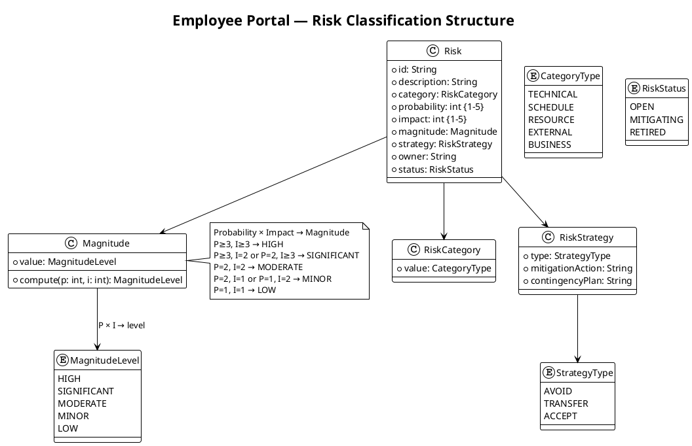
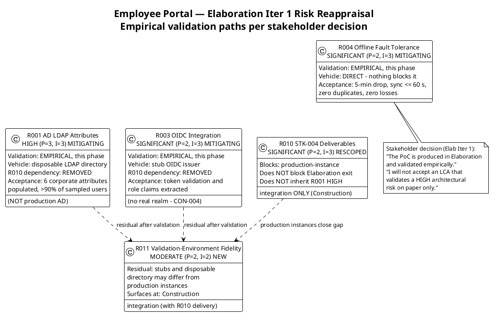

## Document Control

| Field | Value |
|---|---|
| Phase | Elaboration |
| Status | Draft — Elaboration Iter 1 reappraisal |
| Milestone Target | End of Elaboration (LCA) |
| Iteration | 1 (Cycle 1) |
| Date | 2026-09-01 |
| Prior Version | Inception (Approved at LCO — 0 findings); EVOLVED, not recreated |
| Elaboration Changes | R001/R003/R004 re-scoped to EMPIRICAL validation in Elaboration per stakeholder decision (disposable LDAP directory / stub OIDC issuer / direct); R010 re-scoped — blocks production-instance integration only, does NOT block Elaboration exit, does NOT inherit R001's HIGH; R011 (validation-environment fidelity) added; mitigation actions updated with acceptance criteria |

## Risk Classification

Risks are classified by **Probability (P) × Impact (I) = Magnitude**. Probability and impact are scored on a 1–5 scale. The magnitude level determines prioritization and drives iteration sequencing.

| P range | I range | Magnitude | Action |
|---|---|---|---|
| P ≥ 3, I ≥ 3 | — | HIGH | Must be confronted in current or next iteration; mitigation active |
| P ≥ 3, I = 2 | or P = 2, I ≥ 3 | SIGNIFICANT | Mitigation plan required; monitor each iteration |
| P = 2, I = 2 | — | MODERATE | Mitigation plan recommended; review each iteration |
| P = 2, I = 1 | or P = 1, I = 2 | MINOR | Monitor; contingency noted |
| P = 1, I = 1 | — | LOW | Accept; log only |

**Strategy types:** Avoid (eliminate threat), Transfer (shift to third party), Accept (acknowledge with mitigation + contingency).

## Risk Register

| ID | Description | Category | P | I | Magnitude | Strategy | Owner | Status |
|---|---|---|---|---|---|---|---|---|
| R001 | Active Directory integration: LDAP attributes (job title, extension) may not be populated consistently across the 3 offices. If not tested early, the directory shows gaps. | TECHNICAL | 3 | 3 | HIGH | Accept | Software Architect | MITIGATING — empirical validation this phase |
| R002 | Digital clocking adoption: some employees may keep using Excel out of habit if the change is not communicated well. | BUSINESS | 3 | 2 | SIGNIFICANT | Accept | Project Manager | OPEN — Construction/Transition |
| R003 | OIDC integration with Keycloak: token validation, role mapping from claims, and redirect flow may have configuration nuances that delay the auth layer. | TECHNICAL | 2 | 3 | SIGNIFICANT | Accept | Software Architect | MITIGATING — empirical validation this phase |
| R004 | Offline fault tolerance (NFR-004, AC-005): system must tolerate 5-minute network drops and sync data once connectivity is restored. Non-trivial for a web application on a single server. | TECHNICAL | 2 | 3 | SIGNIFICANT | Accept | Software Architect | MITIGATING — empirical validation this phase |
| R005 | LDAP query performance: on-demand directory search against AD for 200 employees may exceed the 3-second page load requirement (NFR-001) if AD response is slow or queries are unoptimized. | TECHNICAL | 2 | 2 | MODERATE | Accept | Software Architect | OPEN — measured during R001 validation |
| R006 | Audit trail completeness: NFR-005 requires mandatory traceability of all news publish/edit/unpublish actions and worker category changes. If the audit mechanism is not designed early, retrofitting it is costly. | TECHNICAL | 2 | 2 | MODERATE | Accept | Designer | OPEN — Design Model this phase |
| R007 | UI design fidelity (CON-011): the mandatory custom design must be implemented faithfully in Razor Pages. Server-rendered model may constrain some design interactions. | TECHNICAL | 2 | 2 | MODERATE | Accept | UI Designer | OPEN — design mapping this phase |
| R008 | PostgreSQL + .NET 10 compatibility: Npgsql driver maturity for .NET 10 and EF Core compatibility may have edge cases on a cutting-edge framework version. | TECHNICAL | 2 | 2 | MODERATE | Accept | Implementer | OPEN — build-time validation |
| R009 | Scope creep: stakeholders may request additional features (vacation management, push notifications, mobile app) during iteration reviews. | BUSINESS | 2 | 2 | MODERATE | Avoid | Project Manager | OPEN — CCB enforced |
| R010 | Infrastructure team deliverables (STK-004): LDAP service account, Keycloak client registration, Windows Server provisioning. **Re-scoped (Elab Iter 1):** blocks production-instance integration only — NOT Elaboration exit. | EXTERNAL | 2 | 3 | SIGNIFICANT | Transfer | Project Manager | OPEN — Construction integration |
| R011 | Validation-environment fidelity: the disposable LDAP directory and stub OIDC issuer used for Elaboration empirical validation may differ from the production instances (attribute schemas, claim shapes, Keycloak configuration). | TECHNICAL | 2 | 2 | MODERATE | Accept | Software Architect | OPEN — new this iteration |

### Elaboration Iter 1 Reappraisal — Validation Paths

## Risk Mitigation and Contingency

### R001 — AD LDAP Attribute Consistency (HIGH)

| Attribute | Value |
|---|---|
| Declared as | R001 (P=3, I=3, exposure=9) |
| Strategy | Accept |
| Mitigation (Elab Iter 1, updated) | **Empirical validation this phase, per stakeholder decision:** stand up a **disposable LDAP directory** (not the production AD — no STK-004 dependency), populate it with representative entries per office, and query it over LDAP v3 through COMP-007. Verify that job title, department, office, email, and extension attributes are populated and mapped. The PoC is produced in Elaboration and validated empirically — an LCA that validates a HIGH risk on paper only will not be accepted. |
| Acceptance criteria | All six corporate attributes populated for >90% of sampled users per office; missing attributes display blank without hiding the entry (UC-004 AF-2 graceful degradation verified). |
| Contingency | If attributes are inconsistent in the disposable directory's representative data, implement graceful degradation: display available fields, omit empty ones, log a warning. Coordinate with STK-004 (Infrastructure Team) to populate missing AD attributes in production. If Infra cannot populate them, negotiate with STK-001 (HR Director) to reduce the directory display scope to only reliably-populated fields. |
| Trigger | PoC reveals any attribute missing for >10% of users in any office. |
| Affected alternatives | FR-010 (directory search), AC-003 (find colleague in <10 seconds) |

### R002 — Clocking Adoption Resistance (SIGNIFICANT)

| Attribute | Value |
|---|---|
| Declared as | R002 (P=3, I=2, exposure=6) |
| Strategy | Accept |
| Mitigation | Design the clock-in/out flow (FR-004) to be the simplest possible interaction — one button on the main screen. Ensure the UI design (CON-011) makes clocking visually prominent. Plan a communication strategy for STK-001 (HR Director) to announce the portal and retire the Excel sheet. Include AC-004 (80% adoption, no prior training) as an explicit Construction iteration acceptance test. |
| Contingency | If adoption is below 80% after 3 months, STK-001 issues a formal policy change requiring portal-based clocking. Excel sheets are removed from the shared drive. |
| Trigger | Adoption tracking shows <60% usage after first month post-launch. |
| Affected alternatives | BG-003 (80% adoption), AC-004 (80% clocking with no training) |

### R003 — OIDC/Keycloak Integration Complexity (SIGNIFICANT)

| Attribute | Value |
|---|---|
| Strategy | Accept |
| Mitigation (Elab Iter 1, updated) | **Empirical validation this phase, per stakeholder decision:** validate the portal's OIDC consumption against a **stub issuer** — not a real Keycloak realm. Wiring AD into Keycloak is infrastructure work outside this project's boundary (CON-004); what the PoC must prove is that the portal consumes and validates an OIDC token correctly and extracts roles from claims. Do not wait on STK-004 for this and do not build it against a real realm. |
| Acceptance criteria | Token validation succeeds; Employee and HR Administrator roles correctly extracted from claims (SEC-006); redirect flow completes. |
| Contingency | If OIDC consumption proves more complex than expected, fall back to a simpler authentication approach (e.g., header-based auth via a reverse proxy) as an interim measure, with OIDC completed in a later Construction iteration. |
| Trigger | Stub-issuer validation reveals unresolved token-validation or claim-mapping defects. |
| Affected alternatives | FR-004 (clock in/out requires auth), all HR functions (role-based access) |

### R004 — Offline Fault Tolerance (SIGNIFICANT)

| Attribute | Value |
|---|---|
| Strategy | Accept |
| Mitigation (Elab Iter 1, updated) | **Empirical validation this phase, direct — nothing blocks it:** simulate a 5-minute network drop (AC-005), queue a clocking event in localStorage, reconnect, and verify sync via the idempotent endpoint (ADR-003). The stakeholder confirmed R004 was never blocked by R010. |
| Acceptance criteria | Queued event syncs on reconnect with zero duplicates (idempotency key) and zero losses; confirmation < 1 s on both paths (PRF-002); sync ≤ 60 s after restore (REL-003). |
| Contingency | If full offline sync is infeasible within Razor Pages constraints, negotiate with STK-001 to redefine AC-005 as "system recovers gracefully from a 5-minute network drop without data loss" (idempotent retry rather than full offline operation). |
| Trigger | Validation shows queued events lost or duplicated on reconnect. |
| Affected alternatives | NFR-004, AC-005, FR-004 (clocking reliability) |

### R005 — LDAP Query Performance (MODERATE)

| Attribute | Value |
|---|---|
| Strategy | Accept |
| Mitigation | Architect specifies LDAP query optimization in the SAD: cache directory search results with a short TTL (e.g., 60 seconds), limit result sets, and index searchable attributes in AD if possible (coordinate with STK-004). Measured during R001 empirical validation this phase. |
| Contingency | If AD queries exceed 3 seconds, implement a lightweight in-memory cache refreshed on a timer, accepting a staleness window of up to 5 minutes for directory data. |
| Trigger | Performance test shows directory search >2 seconds for typical queries. |
| Affected alternatives | NFR-001 (page load <3s), FR-010, AC-003 |

### R006 — Audit Trail Completeness (MODERATE)

| Attribute | Value |
|---|---|
| Strategy | Accept |
| Mitigation | Designer includes an audit logging mechanism in the Design Model from Elaboration onward. Every news operation (publish, edit, unpublish) and worker category change writes an audit record (actor, action, timestamp, entity ID, before/after for category). CON-012 (no hard delete) ensures news records persist for audit. Audit writes are atomic with the state change (DAT-002). |
| Contingency | If audit mechanism is delayed, implement a database trigger-based audit as a fallback — less flexible but guarantees capture. |
| Trigger | Design Model review reveals no audit entity or audit logging sequence. |
| Affected alternatives | NFR-005, FR-006, FR-008, FR-009, FR-003 |

### R007 — UI Design Fidelity in Razor Pages (MODERATE)

| Attribute | Value |
|---|---|
| Strategy | Accept |
| Mitigation | UI Designer maps the mandatory design (CON-011) to Razor Pages components early in Elaboration. Identify any design elements that require client-side JavaScript and plan minimal JS additions within the Razor Pages framework. |
| Contingency | If specific design elements cannot be rendered faithfully in Razor Pages, negotiate with STK-001 for minor visual adjustments that preserve the design's intent and usability. |
| Trigger | UI Designer identifies >3 design elements incompatible with server-rendered Razor Pages. |
| Affected alternatives | CON-011, all user-facing FRs |

### R008 — PostgreSQL + .NET 10 Compatibility (MODERATE)

| Attribute | Value |
|---|---|
| Strategy | Accept |
| Mitigation | Implementer validates Npgsql and EF Core PostgreSQL provider compatibility with .NET 10 during project skeleton evolution. Run a basic CRUD test against PostgreSQL early. |
| Contingency | If compatibility issues arise, pin to the latest stable .NET version that has full Npgsql support, documenting the version decision. |
| Trigger | Build fails or runtime errors occur during database connection setup. |
| Affected alternatives | CON-001, CON-003 |

### R009 — Scope Creep (MODERATE)

| Attribute | Value |
|---|---|
| Strategy | Avoid |
| Mitigation | Enforce the Declared Scope as the ceiling. All change requests go through the Change Control Board (CCM). The Iteration Plan explicitly lists which FRs are in scope. Stakeholder requests for excluded features (vacation, push notifications, mobile app, payroll integration) are logged as Change Requests, not silently added. |
| Contingency | If a critical missing requirement is identified, escalate as `[SCOPE_QUESTION]` for stakeholder decision — never silently expand scope. |
| Trigger | Stakeholder requests a feature outside the Declared Scope during an iteration review. |
| Affected alternatives | All declared scope items |

### R010 — Infrastructure Team Deliverables (SIGNIFICANT — re-scoped)

| Attribute | Value |
|---|---|
| Strategy | Transfer |
| Mitigation (Elab Iter 1, re-scoped) | **What STK-004 genuinely blocks is integration with the specific production instances** — the LDAP service account, the Keycloak client registration, and Windows Server provisioning. That is a separate risk and a smaller one: it does NOT inherit R001's HIGH, it does NOT block Elaboration exit, and it goes to Construction. Engage STK-004 with a written request early in Elaboration (PM owns the engagement); document deliverables as external dependencies in the SAD; align delivery dates to early Construction integration testing. |
| Contingency | If Infra cannot provide access by early Construction, development continues against the disposable directory and stub issuer (already validated in Elaboration), with production-instance integration deferred within Construction — the Elaboration baseline is not invalidated. |
| Trigger | STK-004 has not confirmed the LDAP service account or Keycloak client registration by the start of Construction Iter 1. |
| Affected alternatives | FR-010 (directory), FR-004 (auth), CON-004, CON-005, CON-008 |

### R011 — Validation-Environment Fidelity (MODERATE — new)

| Attribute | Value |
|---|---|
| Strategy | Accept |
| Mitigation | Record the deltas between the Elaboration validation environment and the production instances: the disposable LDAP directory's attribute schema vs production AD's actual population; the stub issuer's claim shape vs the real Keycloak realm's. The R001/R003 acceptance criteria are defined against the validation environment; the residual (does production match it?) is retired by Construction integration testing once STK-004 delivers (R010). Keep the disposable directory and stub issuer as reusable test fixtures for Construction. |
| Contingency | If production instances differ materially at Construction integration, adjust COMP-007 query filters / COMP-006 claim mapping — both are High-volatility encapsulations by design (SAD Volatility Analysis), so the change is contained to one component each. |
| Trigger | Construction integration test reveals attribute or claim shapes that differ from the Elaboration validation fixtures. |
| Affected alternatives | R001, R003, R010 |

## Traceability

| Element | Traces From | Link Type | Traces To |
|---|---|---|---|
| R001 | Declared risk R001 | Refines | Architectural PoC (Elaboration Iter 1 — disposable LDAP directory), FR-010, AC-003 |
| R002 | Declared risk R002 | Refines | BG-003, AC-004, FR-004 |
| R003 | CON-004 (Keycloak OIDC) | Derives | Architectural PoC (Elaboration Iter 1 — stub OIDC issuer), FR-004, all HR functions |
| R004 | NFR-004, AC-005 | Derives | Architectural PoC (Elaboration Iter 1 — direct), FR-004, NFR-004 |
| R005 | NFR-001, FR-010, CON-005 | Derives | AC-003, R001 validation activity |
| R006 | NFR-005, FR-006, FR-008, FR-009, FR-003 | Derives | Design Model (audit entity) |
| R007 | CON-011 | Derives | All user-facing FRs |
| R008 | CON-001, CON-003 | Derives | Implementation Model (project skeleton) |
| R009 | Declared scope exclusions | Derives | All declared scope items |
| R010 | STK-004, CON-004, CON-005, CON-008 | Derives | Construction integration testing, FR-010, FR-004 |
| R011 | Stakeholder decision (Elab Iter 1 — validation paths) | Derives | R001, R003, R010, Construction integration testing |
| R001/R003/R004 re-scoping | Stakeholder decision (Elab Iter 1): "The PoC is produced in Elaboration and validated empirically" | Authorizes | Elaboration Iteration Plan (PoC work items), SAD PoC Plan (Architect to correct) |