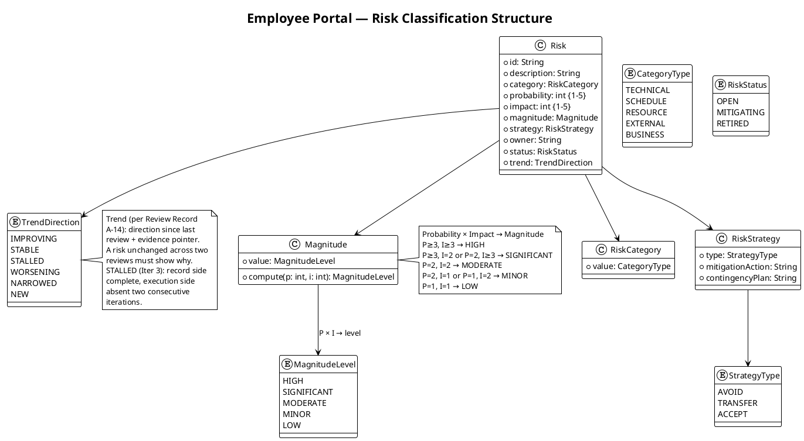
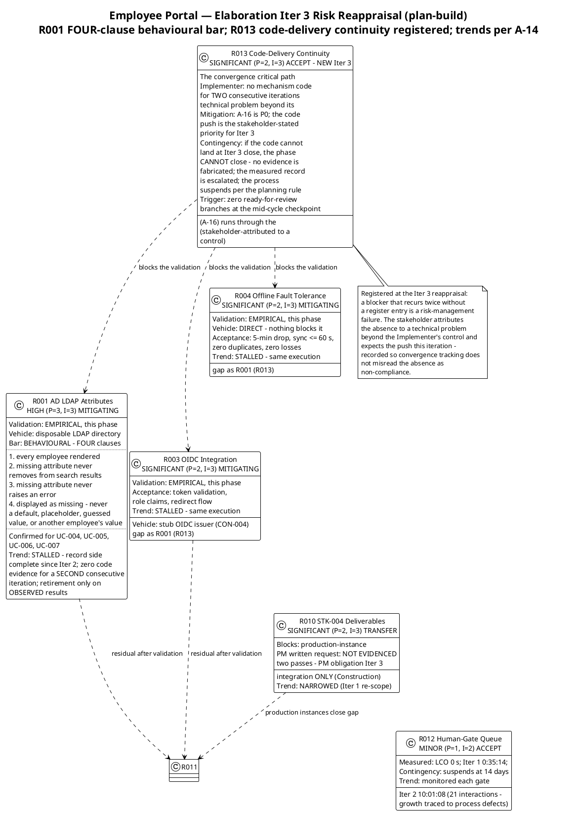

# Risk List

## Document Control
| Field | Value |
|---|---|
| Phase | Elaboration |
| Status | Draft — Elaboration Iteration 3 reappraisal (convergence continuation); evolved from the Iter 2 close-pass reappraisal, not recreated |
| Milestone Target | End of Elaboration (LCA) — NOT yet achieved |
| Iteration | 3 (Cycle 1) |
| Date | 2026-09-02 |
| Prior Version | Elaboration Iter 2 reappraisal (close-pass corrections 2026-09-02); Elaboration Iter 1 reappraisal (2026-09-01); Inception (Approved at LCO — 0 findings); EVOLVED, not recreated |
| Iter 2 Corrections (preserved) | **Risk List F2 (Major, action A-24) corrected:** the R007 mitigation mis-transcription ("show only the NEWEST featured item — no stacked banners" — the UNSELECTED option) replaced with the Design Model's faithful contract — featured banners STACK, ordered newest first, every featured item renders its own banner — citing the stakeholder's verbatim answer "newest first". **Action A-30 applied:** R001 acceptance criteria extended to the FOUR-clause behavioural bar per the stakeholder's verdict-gate contribution, verbatim: "a missing attribute is displayed as missing. It is never replaced by a default, a placeholder, a guessed value, or another employee's value." |
| Iter 3 Changes | **R013 (code-delivery continuity) registered** — the convergence critical path (A-16) runs through the Implementer, and no mechanism code has landed for TWO consecutive iterations (stakeholder-attributed to a technical problem beyond the Implementer's control; the code push is the stakeholder-stated priority for Iter 3). A blocker that recurs twice without a register entry is a risk-management failure. **Trends updated honestly:** R001/R003/R004 move from IMPROVING to **STALLED** — the record side (bar defined, paths designed, fixtures specified) has been complete since Iter 2; the execution side produced zero code evidence for a second consecutive iteration. IMPROVING was the Iter 2 verdict; with the record side unchanged and the evidence side still absent, the honest direction is STALLED. **R010 mitigation updated:** the PM-owned written deliverables request is unevidenced two passes — an explicit PM obligation for Iter 3 (response remains NOT an Elaboration exit condition, per the stakeholder decision) |

## Risk Classification

Risks are classified by **Probability (P) × Impact (I) = Magnitude**. Probability and impact are scored on a 1–5 scale. The magnitude level determines prioritization and drives iteration sequencing.

| P range | I range | Magnitude | Action |
|---|---|---|---|
| P ≥ 3, I ≥ 3 | — | HIGH | Must be confronted in current or next iteration; mitigation active |
| P ≥ 3, I = 2 | or P = 2, I ≥ 3 | SIGNIFICANT | Mitigation plan required; monitor each iteration |
| P = 2, I = 2 | — | MODERATE | Mitigation plan recommended; review each iteration |
| P = 2, I = 1 | or P = 1, I = 2 | MINOR | Monitor; contingency noted |
| P = 1, I = 1 | — | LOW | Accept; log only |

**Strategy types:** Avoid (eliminate threat), Transfer (shift to third party), Accept (acknowledge with mitigation + contingency).

## Risk Register
| ID | Description | Category | P | I | Magnitude | Strategy | Owner | Status | Trend (since Iter 2 review) |
|---|---|---|---|---|---|---|---|---|---|
| R001 | Active Directory integration: LDAP attributes (job title, extension) may not be populated consistently across the 3 offices. If not tested early, the directory shows gaps. | TECHNICAL | 3 | 3 | HIGH | Accept | Software Architect | MITIGATING — empirical validation this phase (convergence cycle, action A-2) | **STALLED** — record side complete since Iter 2 (FOUR-clause bar defined, fixtures specified, TC-011 + TC-021/022/023 designed); execution side: ZERO code evidence for a SECOND consecutive iteration (iteration/E1 has no CI runs as of plan-build 2026-09-02). IMPROVING was the Iter 2 verdict; with the record side unchanged and the evidence side still absent, the honest direction is STALLED. Retirement only on OBSERVED results |
| R002 | Digital clocking adoption: some employees may keep using Excel out of habit if the change is not communicated well. | BUSINESS | 3 | 2 | SIGNIFICANT | Accept | Project Manager | OPEN — Construction/Transition | STABLE — no new evidence; adoption unmeasurable until deployment (BG-003) |
| R003 | OIDC integration with Keycloak: token validation, role mapping from claims, and redirect flow may have configuration nuances that delay the auth layer. | TECHNICAL | 2 | 3 | SIGNIFICANT | Accept | Software Architect | MITIGATING — empirical validation this phase (convergence cycle, action A-3) | **STALLED** — same execution gap as R001 (R013): stub-issuer path confirmed since Iter 1, zero code evidence two consecutive iterations |
| R004 | Offline fault tolerance (NFR-004, AC-005): system must tolerate 5-minute network drops and sync data once connectivity is restored. Non-trivial for a web application on a single server. | TECHNICAL | 2 | 3 | SIGNIFICANT | Accept | Software Architect | MITIGATING — empirical validation this phase (convergence cycle, action A-4) | **STALLED** — same execution gap as R001 (R013): direct path confirmed since Iter 1, zero code evidence two consecutive iterations |
| R005 | LDAP query performance: on-demand directory search against AD for 200 employees may exceed the 3-second page load requirement (NFR-001) if AD response is slow or queries are unoptimized. | TECHNICAL | 2 | 2 | MODERATE | Accept | Software Architect | OPEN — measured during R001 validation | STABLE — measurement pending R001 mechanism execution (blocked with R001) |
| R006 | Audit trail completeness: NFR-005 requires mandatory traceability of all news publish/edit/unpublish actions and worker category changes. If the audit mechanism is not designed early, retrofitting it is costly. | TECHNICAL | 2 | 2 | MODERATE | Accept | Designer | OPEN — Design Model this phase | **IMPROVING** — audit mechanism designed in the Design Model (zero findings at both LCA technical reviews; Review Record per-artifact verdict: Design Model Approved) |
| R007 | UI design fidelity (CON-011): the mandatory custom design must be implemented faithfully in Razor Pages. Server-rendered model may constrain some design interactions. | TECHNICAL | 2 | 2 | MODERATE | Accept | UI Designer | OPEN — design mapping this phase | **IMPROVING** — CON-011 mapped to Razor Pages (Design Model UI sections, zero findings); featured-banner rendering contract settled by stakeholder (Iter 2: banners STACK, newest first — faithful record; Risk List F2 corrected at the Iter 2 close pass) |
| R008 | PostgreSQL + .NET 10 compatibility: Npgsql driver maturity for .NET 10 and EF Core compatibility may have edge cases on a cutting-edge framework version. | TECHNICAL | 2 | 2 | MODERATE | Accept | Implementer | OPEN — build-time validation | STABLE — validated when the mechanism code builds against PostgreSQL (blocked with the code chain, R013) |
| R009 | Scope creep: stakeholders may request additional features (vacation management, push notifications, mobile app) during iteration reviews. | BUSINESS | 2 | 2 | MODERATE | Avoid | Project Manager | OPEN — CCB enforced | STABLE — zero scope-creep findings across all review lenses, both iterations (Review Record) |
| R010 | Infrastructure team deliverables (STK-004): LDAP service account, Keycloak client registration, Windows Server provisioning. **Re-scoped (Elab Iter 1):** blocks production-instance integration only — NOT Elaboration exit. | EXTERNAL | 2 | 3 | SIGNIFICANT | Transfer | Project Manager | OPEN — Construction integration | **NARROWED** (Iter 1 re-scope, unchanged); **PM mitigation obligation OPEN** — the written deliverables request is unevidenced two passes (Iteration Plan exit criterion 9); PM-owned obligation Iter 3; the RESPONSE remains NOT an Elaboration exit condition (stakeholder decision) |
| R011 | Validation-environment fidelity: the disposable LDAP directory and stub OIDC issuer used for Elaboration empirical validation may differ from the production instances (attribute schemas, claim shapes, Keycloak configuration). | TECHNICAL | 2 | 2 | MODERATE | Accept | Software Architect | OPEN — new Iter 1 | STABLE — owns the production-AD data-quality percentage (Construction, with R010); explicitly OUTSIDE the LCA evidence package per the stakeholder's Iter 2 answer |
| R012 | Human-gate queue: the LCA/IOC/PR milestone sanction gates and stakeholder consultation rounds depend on a human deciding when to sit down. A gate is a RISK, not an estimate — the plan quotes no queue figure (A-13); the queue is bounded HERE. | SCHEDULE | 1 | 2 | MINOR | Accept | Project Manager | OPEN — bounded, monitored each gate | STABLE — measured actuals: LCO 0s; Iter 1 0:35:14; Iter 2 10:01:08 across 21 interactions (growth traced to process defects, not stakeholder availability; far below the 14-day suspension ceiling) |
| R013 | Code-delivery continuity: the convergence critical path (A-16) runs through the Implementer, and no mechanism code has landed for TWO consecutive iterations — zero ready-for-review branches, zero PRs in any state, `iteration/E1` with no CI runs, SCM Issue #1 open. The stakeholder attributes the absence to a technical problem beyond the Implementer's control and states the code push as the priority for Iter 3. | RESOURCE | 2 | 3 | SIGNIFICANT | Accept | Project Manager | MITIGATING — A-16 is P0 this iteration | **NEW** — registered at the Iter 3 reappraisal: a blocker that recurs twice without a register entry is a risk-management failure. Blocks R001/R003/R004 empirical retirement, exit criteria 1–3, and the R6 entry gate |

### Elaboration Iter 3 Reappraisal — Validation Paths and Trend Evidence

## Risk Mitigation and Contingency
### R001 — AD LDAP Attribute Consistency (HIGH)

| Attribute | Value |
|---|---|
| Declared as | R001 (P=3, I=3, exposure=9) |
| Strategy | Accept |
| Mitigation (Elab Iter 3, executing — carried two iterations) | **Empirical validation this phase, against the FOUR-clause BEHAVIOURAL bar:** stand up a **disposable LDAP directory** (not the production AD — no STK-004 dependency), populate it with representative entries per office **with attribute gaps AND substitution-attempt fixtures seeded deliberately**, and query it over LDAP v3 through COMP-007. Prove the four behavioural clauses hold: (1) every employee is rendered whether or not their attributes are complete; (2) a missing attribute never removes someone from search results; (3) a missing attribute never raises an error; (4) a missing attribute is displayed as missing — never replaced by a default, a placeholder, a guessed value, or another employee's value. The bar is confirmed for ALL FOUR AD-reading use cases — UC-004 (directory search, FR-010), UC-005 (HR clocking review, FR-001), UC-006 (CSV export, FR-002), UC-007 (worker category assignment, FR-003) — per the stakeholder's Iter 2 confirmation ("Yes") and the verdict-gate addition ("Add a fourth clause to all four"). **Execution status:** the mechanism build is the stakeholder-stated priority for Iter 3 (A-16, P0; Risk List R013) — carried two iterations with zero code evidence. |
| Acceptance criteria (behavioural — stakeholder answers, Elab Iter 2 + verdict gate) | (1) Every employee is rendered whether or not their attributes are complete. (2) A missing attribute never removes someone from search results. (3) A missing attribute never raises an error. (4) **A missing attribute is displayed as missing. It is never replaced by a default, a placeholder, a guessed value, or another employee's value** (verdict-gate contribution, verbatim; rationale verbatim: "Blank is an answer. 'General', or the first office in the list, is a fabrication — and on the CSV that reaches payroll a fabricated department is worse than an empty cell. An empty cell gets questioned. A plausible wrong one does not."). Gaps seeded deliberately in the disposable directory — including substitution-attempt fixtures (a default category, a first-office fallback) so the fourth clause can actually fail; all four clauses proven to hold. **Dropped:** the ">90% of sampled users per office" figure — invented, no declared source; it measured our own seeded test data and could not fail, so it proved nothing. The production-AD data-quality percentage is a Construction activity (R010 + R011), explicitly OUTSIDE the LCA evidence package. |
| Contingency | If the behavioural bar fails (an entry hidden, a search-result removal, an error raised, or a missing attribute substituted), fix the graceful-degradation path in COMP-007 (missing attribute = null, entry NOT hidden, no substitution) before the LCA re-presentation. Production-AD attribute population is STK-004's domain (CON-007): coordinate via R010 in Construction; if production attributes remain unpopulated, negotiate with STK-001 (HR Director) to reduce the directory display scope to reliably-populated fields. |
| Trigger | PoC reveals a missing attribute that hides an entry, removes someone from search results, raises an error, or substitutes a default, placeholder, guessed value, or another employee's value for a missing attribute (behavioural failure — replaces the percentage-based trigger). |
| Affected alternatives | FR-010, FR-001, FR-002, FR-003 (all four AD-reading use cases), AC-003 (find colleague in <10 seconds) |

### R002 — Clocking Adoption Resistance (SIGNIFICANT)

| Attribute | Value |
|---|---|
| Declared as | R002 (P=3, I=2, exposure=6) |
| Strategy | Accept |
| Mitigation | Design the clock-in/out flow (FR-004) to be the simplest possible interaction — one button on the main screen. Ensure the UI design (CON-011) makes clocking visually prominent. Plan a communication strategy for STK-001 (HR Director) to announce the portal and retire the Excel sheet. Include AC-004 (80% adoption, no prior training) as an explicit Construction iteration acceptance test. |
| Contingency | If adoption is below 80% after 3 months, STK-001 issues a formal policy change requiring portal-based clocking. Excel sheets are removed from the shared drive. |
| Trigger | Adoption tracking shows <60% usage after first month post-launch. |
| Affected alternatives | BG-003 (80% adoption), AC-004 (80% clocking with no training) |

### R003 — OIDC/Keycloak Integration Complexity (SIGNIFICANT)

| Attribute | Value |
|---|---|
| Strategy | Accept |
| Mitigation (Elab Iter 3, executing — carried two iterations) | **Empirical validation this phase, per stakeholder decision:** validate the portal's OIDC consumption against a **stub issuer** — not a real Keycloak realm. Wiring AD into Keycloak is infrastructure work outside this project's boundary (CON-004); what the PoC must prove is that the portal consumes and validates an OIDC token correctly and extracts roles from claims. Do not wait on STK-004 for this and do not build it against a real realm. **Execution status:** the mechanism build is the stakeholder-stated priority for Iter 3 (A-16, P0; Risk List R013) — carried two iterations with zero code evidence. |
| Acceptance criteria | Token validation succeeds; Employee and HR Administrator roles correctly extracted from claims (SEC-006); redirect flow completes. |
| Contingency | If OIDC consumption proves more complex than expected, fall back to a simpler authentication approach (e.g., header-based auth via a reverse proxy) as an interim measure, with OIDC completed in a later Construction iteration. |
| Trigger | Stub-issuer validation reveals unresolved token-validation or claim-mapping defects. |
| Affected alternatives | FR-004 (clock in/out requires auth), all HR functions (role-based access) |

### R004 — Offline Fault Tolerance (SIGNIFICANT)

| Attribute | Value |
|---|---|
| Strategy | Accept |
| Mitigation (Elab Iter 3, executing — carried two iterations) | **Empirical validation this phase, direct — nothing blocks it:** simulate a 5-minute network drop (AC-005), queue a clocking event in localStorage, reconnect, and verify sync via the idempotent endpoint (ADR-003). The stakeholder confirmed R004 was never blocked by R010. **Execution status:** the mechanism build is the stakeholder-stated priority for Iter 3 (A-16, P0; Risk List R013) — carried two iterations with zero code evidence. |
| Acceptance criteria | Queued event syncs on reconnect with zero duplicates (idempotency key) and zero losses; confirmation < 1 s on both paths (PRF-002); sync ≤ 60 s after restore (REL-003). |
| Contingency | If full offline sync is infeasible within Razor Pages constraints, negotiate with STK-001 to redefine AC-005 as "system recovers gracefully from a 5-minute network drop without data loss" (idempotent retry rather than full offline operation). |
| Trigger | Validation shows queued events lost or duplicated on reconnect. |
| Affected alternatives | NFR-004, AC-005, FR-004 (clocking reliability) |

### R005 — LDAP Query Performance (MODERATE)

| Attribute | Value |
|---|---|
| Strategy | Accept |
| Mitigation | Architect specifies LDAP query optimization in the SAD: cache directory search results with a short TTL (e.g., 60 seconds), limit result sets, and index searchable attributes in AD if possible (coordinate with STK-004). Measured during R001 empirical validation this phase. |
| Contingency | If AD queries exceed 3 seconds, implement a lightweight in-memory cache refreshed on a timer, accepting a staleness window of up to 5 minutes for directory data. |
| Trigger | Performance test shows directory search >2 seconds for typical queries. |
| Affected alternatives | NFR-001 (page load <3s), FR-010, AC-003 |

### R006 — Audit Trail Completeness (MODERATE)

| Attribute | Value |
|---|---|
| Strategy | Accept |
| Mitigation | Designer includes an audit logging mechanism in the Design Model from Elaboration onward. Every news operation (publish, edit, unpublish) and worker category change writes an audit record (actor, action, timestamp, entity ID, before/after for category). CON-012 (no hard delete) ensures news records persist for audit. Audit writes are atomic with the state change (DAT-002). |
| Contingency | If audit mechanism is delayed, implement a database trigger-based audit as a fallback — less flexible but guarantees capture. |
| Trigger | Design Model review reveals no audit entity or audit logging sequence. |
| Affected alternatives | NFR-005, FR-006, FR-008, FR-009, FR-003 |

### R007 — UI Design Fidelity in Razor Pages (MODERATE)

| Attribute | Value |
|---|---|
| Strategy | Accept |
| Mitigation | UI Designer maps the mandatory design (CON-011) to Razor Pages components early in Elaboration. Identify any design elements that require client-side JavaScript and plan minimal JS additions within the Razor Pages framework. Featured-banner rendering contract settled by the stakeholder (Iter 2, verbatim answer: "newest first"): **featured banners STACK, ordered newest first — every featured item renders its own banner, no featured flag silently dropped**; ordering by the same date criterion as the FR-007 list; renders above the list on SCR-03 and above the history preview on SCR-01 (Design Model P-02 — the authoritative UI record). **[Corrected at the Iter 2 close pass — Risk List F2, action A-24: the prior text recorded the UNSELECTED option ("show only the NEWEST featured item — no stacked banners"); "newest first" is an ordering statement, and ordering presupposes plurality. Coordinated with the Process Engineer's parallel A-17 correction (Development Case F1) so both governance artifacts record the identical contract.]** |
| Contingency | If specific design elements cannot be rendered faithfully in Razor Pages, negotiate with STK-001 for minor visual adjustments that preserve the design's intent and usability. |
| Trigger | UI Designer identifies >3 design elements incompatible with server-rendered Razor Pages. |
| Affected alternatives | CON-011, all user-facing FRs |

### R008 — PostgreSQL + .NET 10 Compatibility (MODERATE)

| Attribute | Value |
|---|---|
| Strategy | Accept |
| Mitigation | Implementer validates Npgsql and EF Core PostgreSQL provider compatibility with .NET 10 during project skeleton evolution. Run a basic CRUD test against PostgreSQL early. |
| Contingency | If compatibility issues arise, pin to the latest stable .NET version that has full Npgsql support, documenting the version decision. |
| Trigger | Build fails or runtime errors occur during database connection setup. |
| Affected alternatives | CON-001, CON-003 |

### R009 — Scope Creep (MODERATE)

| Attribute | Value |
|---|---|
| Strategy | Avoid |
| Mitigation | Enforce the Declared Scope as the ceiling. All change requests go through the Change Control Board (CCM). The Iteration Plan explicitly lists which FRs are in scope. Stakeholder requests for excluded features (vacation, push notifications, mobile app, payroll integration) are logged as Change Requests, not silently added. |
| Contingency | If a critical missing requirement is identified, escalate as `[SCOPE_QUESTION]` for stakeholder decision — never silently expand scope. |
| Trigger | Stakeholder requests a feature outside the Declared Scope during an iteration review. |
| Affected alternatives | All declared scope items |

### R010 — Infrastructure Team Deliverables (SIGNIFICANT — re-scoped)

| Attribute | Value |
|---|---|
| Strategy | Transfer |
| Mitigation (Elab Iter 3, PM obligation updated) | **What STK-004 genuinely blocks is integration with the specific production instances** — the LDAP service account, the Keycloak client registration, and Windows Server provisioning. That is a separate risk and a smaller one: it does NOT inherit R001's HIGH, it does NOT block Elaboration exit, and it goes to Construction. Engage STK-004 with a written request early in Elaboration (PM owns the engagement); document deliverables as external dependencies in the SAD; align delivery dates to early Construction integration testing. **PM obligation (Iter 3):** the written deliverables request is unevidenced two passes (Iteration Plan exit criterion 9, Work Item 2) — it is issued THIS iteration; the RESPONSE remains NOT a condition of Elaboration exit (stakeholder decision). |
| Contingency | If Infra cannot provide access by early Construction, development continues against the disposable directory and stub issuer (already validated in Elaboration), with production-instance integration deferred within Construction — the Elaboration baseline is not invalidated. |
| Trigger | STK-004 has not confirmed the LDAP service account or Keycloak client registration by the start of Construction Iter 1. |
| Affected alternatives | FR-010 (directory), FR-004 (auth), CON-004, CON-005, CON-008 |

### R011 — Validation-Environment Fidelity (MODERATE — new Iter 1)

| Attribute | Value |
|---|---|
| Strategy | Accept |
| Mitigation | Record the deltas between the Elaboration validation environment and the production instances: the disposable LDAP directory's attribute schema vs production AD's actual population; the stub issuer's claim shape vs the real Keycloak realm's. The R001/R003 acceptance criteria are defined against the validation environment; the residual (does production match it?) is retired by Construction integration testing once STK-004 delivers (R010). Keep the disposable directory and stub issuer as reusable test fixtures for Construction. **Home of the production-AD data-quality percentage (stakeholder, Iter 2):** measuring how many real-AD attributes are populated is a Construction data-quality activity executed once STK-004 delivers — it is NOT evidence of anything while we are the ones writing the validation data, and it stays OUT of the LCA evidence package. |
| Contingency | If production instances differ materially at Construction integration, adjust COMP-007 query filters / COMP-006 claim mapping — both are High-volatility encapsulations by design (SAD Volatility Analysis), so the change is contained to one component each. |
| Trigger | Construction integration test reveals attribute or claim shapes that differ from the Elaboration validation fixtures. |
| Affected alternatives | R001, R003, R010 |

### R012 — Human-Gate Queue (MINOR — new Iter 2)

| Attribute | Value |
|---|---|
| Strategy | Accept |
| Mitigation | A human gate is a RISK, not an estimate: the Iteration Plan quotes NO queue figure for the LCA/IOC/PR gates (action A-13 — the queue forecasts were removed from the milestone table); the queue is bounded HERE. Mitigation is in-round stakeholder answering, as measured at LCO (queue 0s — recorded actual), at the Iter 1 LCA consultation (0:35:14 — answered in-round: sanction refused, directive given), and at the Iter 2 verdict gate (queue 10:01:08 across 21 interactions — recorded actual; the growth vs Iter 1 traces to PROCESS defects — an unparseable emission re-emitted and the contribution-cycle re-emission — not to stakeholder availability). Each gate's measured queue is reported as an actual in the Iteration Assessment — never forecast in the plan. |
| Contingency | The process SUSPENDS at 14 days of queue per the planning rule — nothing is auto-filled, no decision is fabricated; the suspension is reported to the Review Coordinator and the stakeholder, and the phase waits. |
| Trigger | A gate question or sanction request remains unanswered past 7 days (half the suspension ceiling) — escalation notice issued to the Project Manager and Review Coordinator. |
| Affected alternatives | LCA, IOC, PR milestone gates; every REQUIRES_USER_INPUT round; phase-transition sanction |

### R013 — Code-Delivery Continuity (SIGNIFICANT — new Iter 3)

| Attribute | Value |
|---|---|
| Strategy | Accept |
| Mitigation | The convergence critical path (A-16) runs through the Implementer: the three mechanisms (R001 disposable LDAP directory + FOUR-clause bar, R003 stub OIDC issuer, R004 offline queue + idempotent sync) as evolutionary code in `src/` on `feature/E1-{risk}` branches with dual-coverage tests, `ready-for-review` labels, terminal PR dispositions (base `iteration/E1`), Integrator merges, TC-001…TC-023 executed, empirical results into the PoC artifact. **A-16 is P0 this iteration** — the stakeholder-stated priority, verbatim: "In this third iteration I hope that the Implementer can push the code so that everything moves forward." The two-iteration absence is stakeholder-attributed to a technical problem beyond the Implementer's control — recorded so convergence tracking does not misread the absence as non-compliance. Supporting preconditions are ALL closed (CONTRIBUTING.md sha 6662813…; `iteration/E1` exists; 23 test cases designed; fixtures specified with deliberately-seeded gaps and substitution attempts; CI gate green on main) — the chain is unblocked end-to-end. |
| Contingency | If the code cannot land at Iter 3 close, the phase CANNOT close: no evidence is fabricated, the measured record is escalated to the Review Coordinator and the stakeholder at the R6 gate, and the process suspends per the planning rule — nothing is auto-filled. The convergence cycle iterates again against the same entry gate. |
| Trigger | Zero `ready-for-review` branches at the mid-cycle checkpoint of Iter 3 — escalation notice to the Project Manager and Review Coordinator; the R6 re-presentation is withheld (the entry gate cannot pass without code evidence). |
| Affected alternatives | R001, R003, R004 (empirical retirement); Iteration Plan exit criteria 1–3, 5, 13; SAD F2 / Iteration Plan F3 / F-CR-E1-1 (one defect, three gates); the R6 LCA entry gate |

## Traceability
| Element | Traces From | Link Type | Traces To |
|---|---|---|---|
| R001 | Declared risk R001; stakeholder Iter 2 answer (behavioural bar, dropped percentage, four-UC confirmation); stakeholder verdict-gate contribution (fourth clause, verbatim) | Refines | Architectural PoC (convergence cycle — disposable LDAP directory, action A-2), UC-004, UC-005, UC-006, UC-007, FR-010, FR-001, FR-002, FR-003, AC-003 |
| R002 | Declared risk R002 | Refines | BG-003, AC-004, FR-004 |
| R003 | CON-004 (Keycloak OIDC) | Derives | Architectural PoC (convergence cycle — stub OIDC issuer, action A-3), FR-004, all HR functions |
| R004 | NFR-004, AC-005 | Derives | Architectural PoC (convergence cycle — direct, action A-4), FR-004, NFR-004 |
| R005 | NFR-001, FR-010, CON-005 | Derives | AC-003, R001 validation activity |
| R006 | NFR-005, FR-006, FR-008, FR-009, FR-003 | Derives | Design Model (audit entity) |
| R007 | CON-011; stakeholder Iter 2 answer (featured banner: newest first — faithful contract: banners STACK, newest first, per Design Model P-02) | Derives | All user-facing FRs; UC-003 step 4, UC-008 step 3 |
| R008 | CON-001, CON-003 | Derives | Implementation Model (project skeleton) |
| R009 | Declared scope exclusions | Derives | All declared scope items |
| R010 | STK-004, CON-004, CON-005, CON-008; stakeholder decision (R010 blocks production-instance integration only; response NOT an Elaboration exit condition) | Derives | Construction integration testing, FR-010, FR-004; Iteration Plan Work Item 2 (PM written request, Iter 3 obligation) |
| R011 | Stakeholder decision (Elab Iter 1 — validation paths); stakeholder Iter 2 answer (percentage home) | Derives | R001, R003, R010, Construction integration testing, Construction AD data-quality measurement |
| R012 | Review Record Iteration Plan F5 / Risk List F1 (Management) — human gate = risk, not estimate; 14-day suspension ceiling; measured queue actuals (LCO 0s; Iter 1 0:35:14; Iter 2 10:01:08 / 21 interactions) | Derives | LCA, IOC, PR milestone gates; Iteration Plan milestone table (no queue forecasts — A-13); Iteration Assessment (measured queue actuals) |
| R013 | SCM state verified at Iter 3 plan-build (iteration/E1 no CI runs; main GREEN run 33598979875; zero ready-for-review branches; zero PRs in any state; Issue #1 open); stakeholder verdict-gate contribution (Implementer context, verbatim: "Due to a technical problem, beyond its control, the implementer has not been able to work on both iterations. In this third iteration I hope that the Implementer can push the code so that everything moves forward."); Review Record SAD F2 / Iteration Plan F3 / F-CR-E1-1 (one defect, three gates) | Derives | R001, R003, R004 (blocks empirical retirement); Iteration Plan exit criteria 1–3, 5, 13; A-16 delivery chain; R6 LCA entry gate |
| R001 behavioural bar (FOUR clauses) | Stakeholder Iter 2 answer: "the bar is behavioural, not statistical" — three clauses, confirmed for all four AD-reading UCs ("Yes"); stakeholder verdict-gate contribution, verbatim: "a missing attribute is displayed as missing. It is never replaced by a default, a placeholder, a guessed value, or another employee's value" (action A-30, applied at the Iter 2 close pass) | Authorizes | R001 acceptance criteria (this artifact); Test Case TC-011 + TC-021/022/023 fixtures (gaps + substitution attempts seeded deliberately, A-28); SAD PoC Plan (A-31); Test Evaluation Summary thresholds; Iteration Plan exit criterion 1 |
| R001/R003/R004 re-scoping | Stakeholder decision (Elab Iter 1): "The PoC is produced in Elaboration and validated empirically" | Authorizes | Elaboration Iteration Plan (PoC work items), SAD PoC Plan (Architect to correct) |
| Trend column (A-14) | Review Record Risk List F1 (Management, part 1) — risk-retirement trend verification; Iter 3 honest reappraisal (IMPROVING → STALLED for R001/R003/R004: record side complete, execution side absent two consecutive iterations) | Refines | Every future milestone review (trend verification); Iteration Assessments |
| R007 correction (F2, A-24) | Review Record Risk List F2 (Major, Management Reviewer lens, Iter 2); stakeholder verbatim answer "newest first"; Design Model P-02 (authoritative UI record) | Reviews | Development Case F1 parallel correction (A-17, Process Engineer); UC-003 step 4 / UC-008 step 3 authorization chain |