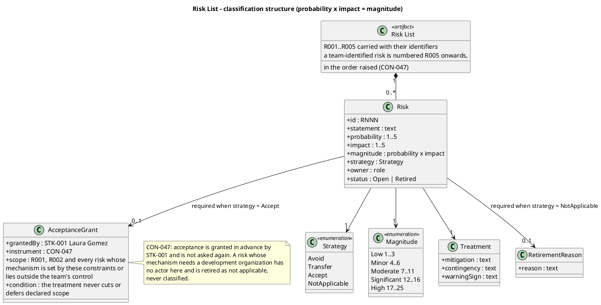

## Document Control

- Phase: Inception
- Status: Draft — under review for the end-of-Inception milestone
- Milestone Target: end-of-Inception (NOT YET ACHIEVED)
- Iteration: 1, Cycle 1
- Owner: ProjectManager
- Last updated: 2026-09-28

## Risk Classification

Magnitude is probability x impact, on a 1-5 scale for each factor. The bands are contiguous: every product from 1 to 25 falls in exactly one band.

| Magnitude band | Product range | Consequence for treatment |
|---|---|---|
| High | 17-25 | Not acceptable without a stakeholder grant. Avoidance or transfer only. |
| Significant | 12-16 | Not acceptable without a stakeholder grant. Avoidance or transfer only. |
| Moderate | 7-11 | Acceptable with a defined mitigation and contingency. |
| Minor | 4-6 | Acceptable with a defined mitigation and contingency. |
| Low | 1-3 | Acceptable; monitoring only. |

```plantuml
@startuml
title Risk List - classification structure (probability x impact = magnitude)
skinparam classAttributeIconSize 0

class "Risk List" as RL <<artifact>> {
  R001..R005 carried with their identifiers
  a team-identified risk is numbered R005 onwards,
  in the order raised (CON-047)
}

class "Risk" as RISK {
  + id : RNNN
  + statement : text
  + probability : 1..5
  + impact : 1..5
  + magnitude : probability x impact
  + strategy : Strategy
  + owner : role
  + status : Open | Retired
}

class "Strategy" as STRAT <<enumeration>> {
  Avoid
  Transfer
  Accept
  NotApplicable
}

class "Magnitude" as MAG <<enumeration>> {
  Low 1..3
  Minor 4..6
  Moderate 7..11
  Significant 12..16
  High 17..25
}

class "Treatment" as TREAT {
  + mitigation : text
  + contingency : text
  + warningSign : text
}

class "AcceptanceGrant" as GRANT {
  + grantedBy : STK-001 Laura Gomez
  + instrument : CON-047
  + scope : R001, R002 and every risk whose
    mechanism is set by these constraints or
    lies outside the team's control
  + condition : the treatment never cuts or
    defers declared scope
}

class "RetirementReason" as RET {
  + reason : text
}

RL "1" *-- "0..*" RISK
RISK --> "1" STRAT
RISK --> "1" MAG
RISK --> "1" TREAT
RISK --> "0..1" GRANT : required when strategy = Accept
RISK --> "0..1" RET : required when strategy = NotApplicable

note right of GRANT
  CON-047: acceptance is granted in advance by
  STK-001 and is not asked again. A risk whose
  mechanism needs a development organization has
  no actor here and is retired as not applicable,
  never classified.
end note
@enduml
```

### Acceptance authority

Acceptance of a High or Significant risk is the stakeholder's decision, not the ProjectManager's. For this project that decision is already made and recorded: **CON-047** grants acceptance in advance, by **STK-001 Laura Gómez (project sponsor)**, for R001, R002 and every risk the team identifies whose mechanism is set by the declared constraints or lies outside the team's control and that cannot be transferred — on the condition that the treatment never cuts or defers declared scope. The grant is not re-asked.

**The grant has a boundary, and it is the mechanism that draws it.** A risk is inside the grant when its mechanism is set by the declared constraints or lies outside the team's control. A risk whose mechanism is inside the team's control — one the team could avoid or transfer by its own action — is outside the grant, and if it reaches High or Significant magnitude its acceptance is the stakeholder's to grant and is asked in the round it was raised.

| Risk | Mechanism | Inside the CON-047 grant? |
|---|---|---|
| R001 | Employee habits and HR policy — the stakeholders | Yes |
| R002 | Employees forgetting to clock out — the stakeholders | Yes |
| R003 | Availability of STK-002 — a stakeholder | Yes |
| R004 | How AD attributes are filled across 3 offices — Infrastructure's data, which the portal cannot change (CON-011) | Yes |
| R005 | The absence of an automated visual check — the team could add one | **No** |

R005 is therefore **not** covered by the advance grant. It is Significant, so its acceptance is the stakeholder's to grant, and it is asked this round. Until answered, R005 stays **Open** and is not accepted.

### Risks retired as not applicable

A risk whose mechanism names an actor that does not exist in this project is retired, not classified. The mechanism of a development-organization risk — staffing levels, skills gaps, team morale, friction between people, attrition, onboarding — names human developers. This project executes with LLM agents and has exactly one human, the stakeholder. No such risk was identified this iteration; the rule is recorded so that a later iteration applies it rather than classifying a risk with no actor.

### Risks not registered

The availability, configuration and ownership of Keycloak and Active Directory are not risks of this project and are not registered (CON-047, CON-038). They are Infrastructure's, and the team's obligation is that every use case works correctly against the stand-ins it controls.

## Risk Register

| ID | Statement | P | I | Magnitude | Strategy | Owner | Status |
|---|---|---|---|---|---|---|---|
| R001 | Adoption risk: employees keep their Excel and mass-email habits, the 80% target is missed, and the Excel-elimination goal fails with it. | 3 | 4 | 12 (Significant) | Accept — CON-047 grant | ProjectManager | Open |
| R002 | Data-quality risk: missing clock-outs produce incomplete days that HR must resolve manually outside the portal, consuming the very HR time the project is meant to save. | 4 | 3 | 12 (Significant) | Accept — CON-047 grant | ProjectManager | Open |
| R003 | People risk: engineering clarification depends on a single named person, who is not building the system. | 3 | 3 | 9 (Moderate) | Accept — CON-047 grant | ProjectManager | Open |
| R004 | Active Directory integration: the LDAP attributes the directory reads may not be filled consistently across the 3 offices (job title, extension). If not tested early the directory shows gaps. | 3 | 3 | 9 (Moderate) | Accept — CON-047 grant | SoftwareArchitect | Open |
| R005 | The mandatory UI design reference `docs/inputs/employee-portal-design.html` (CON-041) is authoritative for the visual layer, but no automated check compares the implemented pages against it. A page can drift from the reference and pass every functional test, because no test asserts the visual layer. | 3 | 4 | 12 (Significant) | Accept — **PENDING stakeholder grant** | UserInterfaceDesigner | Open |

R001, R002, R003 and R004 are carried with their declared identifiers and magnitudes, not renumbered and not reclassified. R005 is the one risk the team identified this iteration; it is numbered in the same series, in the order raised, and carries the same fields (CON-047).

### Why R005 is registered and not retired

R005's mechanism names no development organization: it is a verification gap in the team's own work, and the actor is the UserInterfaceDesigner. It is therefore classified rather than retired. It is registered rather than left implicit because the design reference is mandatory and authoritative (CON-041) while the Development Case records that no lint configuration and no CI workflow file exist yet — so at this moment nothing in the toolchain would catch a drift.

### Why R005 is Significant

CON-041 makes the design reference a declared **MUST** — the portal MUST implement it, and it is authoritative for the visual layer, not only for its structure. A systematic drift from it is therefore a failure against a declared mandatory constraint, not a cosmetic defect: impact 4. Probability is 3, because no automated check exists and no lint configuration or CI workflow file exists yet to catch a drift. 3 x 4 = 12, Significant.

## Risk Mitigation and Contingency

| ID | Mitigation | Contingency | Warning sign |
|---|---|---|---|
| R001 | The portal is the only place a new clocking can be recorded once live (BG-002), and the clocking page is the landing page for the employee. Adoption is measured against BG-003 — 80% of the 200 employees actively using the portal within three months of go-live — and AC-005 (80% complete at least one clocking with no prior training) is verified before go-live. | If adoption falls short of BG-003, the remedy is another iteration of adoption work, not a cut to declared scope. The measurement is reported to STK-001, who owns the policy response. | Fewer than 80% of employees have completed a clocking within the first month after go-live. |
| R002 | UC-005 gives HR an in-portal correction and insertion path with an audit entry (who, when, previous value, reason), so the manual work happens where the portal can see it and the affected employee-day exports with Corrected = Y (CON-008). The export still carries the incomplete row rather than dropping it (CON-015), so the incident stays visible to the people who fix it. | If missing clock-outs exceed what HR can absorb, the remedy is another iteration, not a cut to declared scope. CON-013 keeps the correction HR-only; no self-service correction screen is added without a Change Request. | The share of exported employee-days carrying Corrected = Y rises rather than falls after go-live. |
| R003 | Engineering questions are batched and put to STK-002 in writing, so one exchange answers several questions rather than one. The Development Case records that the team works against stand-ins it controls (CON-038), which removes the real Keycloak and the real AD from the team's critical path and therefore removes most of the questions that would have needed STK-002. | If STK-002 is unavailable and a question blocks work, the blocked work item is deferred to the next iteration and the iteration closes on its remaining objectives. The remedy is another iteration (CON-047), never a cut to declared scope. | A work item is blocked on an engineering question for longer than one iteration. |
| R004 | The test LDAP directory stand-in carries the declared attributes including entries whose job title or extension is empty (CON-038), so the empty-attribute path is exercised from the first directory-dependent use case rather than discovered late. UC-004 alternative flow A4 and UC-011 both handle an empty attribute by writing the field blank and still returning the row. | If the real AD turns out to be less filled than the stand-in, the directory shows blanks for those employees. That is a data condition in AD, which Infrastructure will not modify (CON-011) and which the portal cannot fix; the remedy is another iteration, and the finding is reported to STK-001 and STK-003. | The human validation of the real AD (CON-038) reports attributes empty that the stand-in carries populated. |
| R005 | The design reference is committed to the repository and authoritative (CON-041), and the UserInterfaceDesigner reviews each implemented page against it before the page is considered done. The reference is the single source for the visual layer, so a reviewer has one document to compare against rather than an opinion. | If a page is found to have drifted, the page is corrected in the next iteration against the committed reference. The remedy is another iteration, not a cut to declared scope. | A page is accepted without a recorded comparison against the design reference. |

**R005's treatment is not yet authorised.** The mitigation above uses only declared means and cuts no declared scope, but the risk is Significant and its mechanism is inside the team's control, so the CON-047 grant does not reach it. The alternative treatment — adding a visual-regression check to CI — would avoid the risk but introduces tooling not declared in the 47 constraints, which is a scope decision. Both options are put to STK-001 this round; until answered, R005 stays Open and unaccepted.

No mitigation above cuts or defers declared scope, which is the condition CON-047 attaches to the grant.

## Traceability

| Element | Traces From | Link Type | Traces To |
|---|---|---|---|
| R001 | BG-003, AC-005 | DependsOn | Iteration Plan, CON-047 |
| R002 | CON-013, CON-015, NFR-002 | DependsOn | Iteration Plan, CON-047 |
| R003 | STK-002 | DependsOn | Iteration Plan, CON-047 |
| R004 | CON-003, CON-038 | DependsOn | Iteration Plan, CON-047 |
| R005 | CON-041, CON-036 | DependsOn | Iteration Plan |

Every risk carries a downstream link to the Iteration Plan, because the plan is where a risk is confronted: the roadmap names the iteration that retires or reduces it. R001-R004 also carry CON-047, the advance grant by STK-001 that permits their acceptance, since each one's mechanism is set by the declared constraints or lies outside the team's control. R005 carries no such link: its mechanism is inside the team's control, the grant does not reach it, and its acceptance is the stakeholder's to grant.
