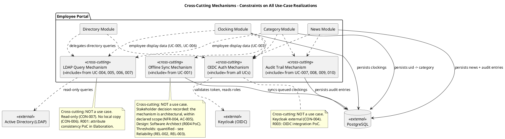

## Document Control

| Field | Value |
|---|---|
| Phase | Elaboration |
| Status | Draft |
| Milestone Target | End of Elaboration |
| Iteration | 1 (Cycle 1) |
| Elaboration Changes | Offline clocking [SCOPE_QUESTION] RETIRED — stakeholder decision recorded (Reliability); Data Integrity section added (DAT-001, DAT-002 — implied NFRs); SEC-006/SEC-007 added (role enforcement, own-data-only access — forced by full UC specifications); INT-005 (CSV download) added; Offline Sync Mechanism added to cross-cutting mechanisms diagram; thresholds marked for Requirements Specifier quantification. **RS Iter 1 additions:** Performance and Reliability thresholds quantified with testable criteria (PRF-001/002/003, REL-001/002/003 — per the recorded stakeholder decision delegating threshold quantification to RS); SYNC mechanism note updated to reference quantified thresholds. **RS Iter 1 post-answer:** timestamp [SCOPE_QUESTION] RETIRED — stakeholder decision recorded: store UTC, display office local timezone, export ISO-8601 with explicit offset, payroll day = local calendar day; stakeholder correction applied — the declared input names no office locations (Havana/Madrid framing withdrawn); all 3 offices share one timezone. **RS Iter 1 final:** office local timezone [SCOPE_QUESTION] RETIRED — stakeholder decision recorded: America/Havana, an IANA identifier, not a fixed offset (Cuba observes DST; a hardcoded UTC-5 would silently shift every payroll day boundary when the clocks change) |

## Functionality

### Security

| ID | Requirement | Source | Volatility |
|---|---|---|---|
| SEC-001 | OIDC authentication via existing Keycloak — portal is a client only; no deployment or realm design | CON-004 | Low |
| SEC-002 | Role-based access control: Employee role (clocking, news browse, directory search) vs HR Administrator role (clocking review, export, category assignment, news management) — roles read from Keycloak claims | CON-004, FR-004 | Low |
| SEC-003 | No anonymous access — all pages require authentication | CON-009 | Low |
| SEC-004 | Internal corporate network only — no external access | CON-009 | Low |
| SEC-005 | No writing back to Active Directory — all AD access is read-only | CON-007 | Low |
| SEC-006 | HR-only use cases (UC-005–UC-010) enforce the HR Administrator role from Keycloak claims; a session holding only the Employee role is rejected from those functions | CON-004, FR-001, FR-002, FR-003, FR-006, FR-008, FR-009 | Low |
| SEC-007 | An employee can access only their own clocking history (UC-002); access to another employee's clocking data requires the HR Administrator role (UC-005) | FR-005, FR-001 | Low |

### Licensing

| ID | Requirement | Source | Volatility |
|---|---|---|---|
| LIC-001 | All infrastructure is open-source or already owned (.NET 10, PostgreSQL, Keycloak) — no additional licensing required | CON-001, CON-003, CON-004 | Low |

### Audit (Cross-Cutting Mechanism — NOT a Use Case)

| ID | Requirement | Source | Volatility |
|---|---|---|---|
| AUD-001 | News publication audited: author + timestamp recorded | NFR-005, FR-006 | Low |
| AUD-002 | News edit audited: editor + timestamp recorded for every edit version | NFR-005, FR-008 | Low |
| AUD-003 | News unpublish audited: actor + timestamp recorded | NFR-005, FR-009 | Low |
| AUD-004 | Worker category change audited: actor + timestamp + old value + new value recorded | NFR-005, FR-003 | Low |
| AUD-005 | Employee directory fields are read-only from AD — no audit needed for directory data | NFR-005 | Low |

**Note:** Audit is a cross-cutting mechanism implemented via `<<include>>` from UC-007, UC-008, UC-009, UC-010. It is NOT a standalone use case.

### Data Integrity (implied NFRs — what stakeholders would reject even if functional requirements were met)

| ID | Requirement | Source | Volatility |
|---|---|---|---|
| DAT-001 | Clocking timestamps are recorded by the system at the moment of the button press; the employee never enters or edits a time | FR-004 | Low |
| DAT-002 | Audit entries are append-only — no portal function modifies or deletes an audit entry (a mutable trail would not satisfy NFR-005's mandatory traceability) | NFR-005 | Low |

## Usability

| ID | Requirement | Source | Volatility |
|---|---|---|---|
| USA-001 | Custom UI design (docs/inputs/employee-portal-design.html) is mandatory and authoritative for the UI visual layer | CON-011 | Low |
| USA-002 | Employee can clock in/out without help from HR or development team | AC-001 | Low |
| USA-003 | Employee finds colleague's phone/email in under 10 seconds | AC-003 | Low |
| USA-004 | 80% of employees complete at least one clocking with no prior training | AC-004 | Low |
| USA-005 | HR Administrator can publish a news item without technical assistance | AC-002 | Low |
| USA-006 | Compatible with current Chrome and Edge browsers | CON-010 | Low |
| USA-007 | Responsive web design (no native mobile app) — works on corporate browsers including mobile viewport | Scope Statement | Low |

## Reliability

| ID | Requirement | Source | Volatility |
|---|---|---|---|
| REL-001 | System available during extended working hours: Monday–Friday 7:00–19:00. 24/7 not required. | NFR-003 | Low |
| REL-002 | Fault tolerance within corporate network: system tolerates temporary network disruptions and recovers/syncs data once connectivity is restored | NFR-004 | Medium |
| REL-003 | If network drops for 5 minutes, data syncs once connectivity is restored | AC-005 | Medium |
| REL-004 | Backup and server crash recovery are Infrastructure's responsibility, not a portal requirement | CON-014 | Low |

**Stakeholder decision recorded (Elaboration — [SCOPE_QUESTION] retired):** The offline clocking persistence mechanism is **architectural and within declared scope**. The stakeholder was asked whether NFR-004 and AC-005 (system tolerates a 5-minute network drop; data syncs once connectivity is restored) are met by an architect-owned local-queuing mechanism, and answered **"Yes"**. Division of responsibility: the Software Architect designs the mechanism (Offline Sync Mechanism, R004 PoC in Elaboration Iteration 1); the Requirements Specifier quantifies the thresholds (max queue size, sync timeout, conflict policy); the Use-Case Model captures the observable behavior in UC-001 AF-1. No open question remains on this item.

### Quantified Thresholds (Requirements Specifier, Elaboration Iter 1 — per the recorded stakeholder decision delegating threshold quantification to this role)

| ID | Quantified Threshold | Testable Criteria | Basis |
|---|---|---|---|
| REL-001 | Availability window Mon–Fri 7:00–19:00; during the window the portal serves PRF-001 page loads and PRF-002 clocking responses | During the declared window, pages load and clocking responds per PRF-001/PRF-002; outside the window no availability commitment is made | NFR-003 (declared window); no availability percentage declared — none invented (gold-plating guard) |
| REL-002 | Offline tolerance: network disruptions of at least 5 minutes are tolerated; per-client queue capacity ≥ 10 clocking events per employee browser; queued events are never lost; idempotent conflict policy — an exact duplicate (same employee, same event type, same recorded timestamp) is rejected, never duplicated; events ordered by recorded timestamp, not arrival order | Simulate a 5-minute outage: events queue locally with confirmation shown from queued data; after restore, all queued events are persisted with zero duplicates and zero losses | AC-005 (declared 5 min); queue capacity [ASSUMPTION — requires validation] — at most 2 transitions per employee per workday (FR-004 in/out), so 10 events covers 5 full workdays of total outage; conflict policy per DAT-001 |
| REL-003 | Sync completion: all queued events persisted ≤ 60 seconds after connectivity is restored | After restore, measure time from reconnection to full persistence of the queued set: ≤ 60 s | [ASSUMPTION — requires validation] — worst case 200 employees × 1 queued event each (STK-003 population), small records, restored corporate LAN |
| Timestamp convention | Clocking timestamps are stored in UTC, displayed in the office local timezone (America/Havana, IANA), and exported in ISO-8601 with an explicit offset; the payroll day is the local calendar day, never the server's. All 3 offices share this one timezone (stakeholder-confirmed). | Verify a recorded event end-to-end: stored value is UTC; displayed value is America/Havana local time (DST-aware); exported value carries the explicit offset in force at the event time; month-boundary grouping follows the local calendar day in America/Havana | DAT-001; stakeholder decisions (Elaboration Iter 1): convention + office local zone America/Havana (IANA identifier) |

**Stakeholder decision recorded (Elaboration Iter 1 — timestamp [SCOPE_QUESTION] retired):** The timezone convention for clocking timestamps is decided: **store every clocking timestamp in UTC, display it in the office local timezone, and export ISO-8601 with an explicit offset. The payroll day is the local calendar day, never the server's.** The stakeholder also corrected the record: the declared input names no office locations — the Havana/Madrid framing in the earlier question was invented, not declared — and **all 3 offices are in the same timezone**. The prior working assumption (portal server timezone everywhere) is withdrawn: it only works while there is one timezone and breaks silently the day there isn't. No open question remains on the convention itself.

**Stakeholder decision recorded (Elaboration Iter 1 — office local timezone [SCOPE_QUESTION] retired):** The office local timezone is **America/Havana**. The stakeholder specified an IANA identifier, not a fixed offset — Cuba observes DST, so a hardcoded UTC-5 would be wrong for part of the year and would silently shift every payroll day boundary when the clocks change. The zone completes the decided convention (store UTC, display office local, export ISO-8601 with explicit offset, payroll day = local calendar day); all 3 offices share this one timezone (stakeholder-confirmed). The exported offset is the one in force at each event's time per the IANA zone database. No open question remains on the timestamp convention.

## Performance

| ID | Requirement | Source | Volatility |
|---|---|---|---|
| PRF-001 | Pages must load in under 3 seconds on the corporate network | NFR-001 | Low |
| PRF-002 | Clock in/out operation must respond in under 1 second | NFR-002 | Low |
| PRF-003 | Directory search returns results fast enough for AC-003 (under 10 seconds total including user interaction) | AC-003, FR-010 | Medium |

**Note:** The Requirements Specifier quantifies exact LDAP query timeout thresholds in Elaboration. R001 (LDAP attribute inconsistency) may affect perceived performance if fallback strategies are needed; R005 (LDAP performance) is monitored during the R001 PoC. No further performance targets are declared — inventing ones would be gold-plating.

### Quantified Thresholds (Requirements Specifier, Elaboration Iter 1)

| ID | Quantified Threshold | Testable Criteria | Basis |
|---|---|---|---|
| PRF-001 | Page load < 3 s at the 95th percentile under normal working-hours load (Mon–Fri 7:00–19:00, the REL-001 window) on the corporate network | Automated timing of page loads during the REL-001 window: ≥ 95% of loads complete in < 3 s | NFR-001 (declared 3 s); percentile basis [ASSUMPTION — requires validation] — standard intranet measurement; no load model was declared |
| PRF-002 | Clock in/out confirmation displayed < 1 s from button press — on BOTH the online path and the offline-queued path (UC-001 AF-1) | Measure button-press → confirmation latency with the portal reachable and with the portal server unreachable; both < 1 s | NFR-002 (declared 1 s); the offline path is included because the confirmation is shown from queued data (UC-001 step 8) |
| PRF-003 | Directory search: LDAP query hard timeout of 5 s; end-to-end search (criteria entry → results displayed) ≤ 10 s | Simulated search: LDAP query aborts at 5 s and UC-004 AF-3 "Directory temporarily unavailable" is shown; a typical search completes end-to-end ≤ 10 s | AC-003 (declared 10 s total); the 5 s query split [ASSUMPTION — requires validation] — leaves ≥ 5 s of the AC-003 budget for typing and rendering |

## Supportability

| ID | Requirement | Source | Volatility |
|---|---|---|---|
| SUP-001 | Backend: .NET 10 with REST API — standard framework, maintainable by .NET developers | CON-001 | Low |
| SUP-002 | Frontend: Razor Pages — server-rendered, no SPA complexity | CON-002 | Low |
| SUP-003 | Database: PostgreSQL — standard relational database | CON-003 | Low |
| SUP-004 | Worker category list is externally configured (not managed in the portal) — changes to categories do not require code deployment | CON-013 | Medium |
| SUP-005 | No local copy of employee data — no sync job, no reconciliation, no conflict resolution to maintain | CON-006 | Low |

## Design Constraints

| ID | Constraint | Source |
|---|---|---|
| DC-001 | Backend: .NET 10 with REST API | CON-001 |
| DC-002 | Frontend: Razor Pages (intranet, no SPA) | CON-002 |
| DC-003 | Database: PostgreSQL | CON-003 |
| DC-004 | Hosting: internal Windows Server (no cloud) | CON-008 |
| DC-005 | Keycloak is external — portal is OIDC client only, no deployment/provisioning/realm design | CON-004 |
| DC-006 | AD data read via LDAP on demand — no local copy, no sync | CON-005, CON-006 |
| DC-007 | No write-back to AD | CON-007 |
| DC-008 | Custom UI design is mandatory and authoritative | CON-011 |
| DC-009 | No hard delete of news items — unpublish only | CON-012 |
| DC-010 | Worker category list is fixed, externally configured | CON-013 |

## Interfaces

| ID | Interface | Type | Direction | Source |
|---|---|---|---|---|
| INT-001 | Keycloak OIDC | Authentication/Authorization | Portal → Keycloak (outbound) | CON-004 |
| INT-002 | Active Directory LDAP | Directory query (read-only) | Portal → AD (outbound) | CON-005 |
| INT-003 | PostgreSQL | Data persistence | Portal → PostgreSQL (outbound) | CON-003 |
| INT-004 | Chrome / Edge browsers | User interface | Browser → Portal (inbound) | CON-010 |
| INT-005 | CSV report file download | Data export (monthly clocking report) | Portal → HR Administrator (outbound) | FR-002 |

## Applicable Standards

| ID | Standard | Source | Applicability |
|---|---|---|---|
| STD-001 | OIDC (OpenID Connect) protocol | CON-004 | Authentication interface with Keycloak |
| STD-002 | LDAP v3 | CON-005 | Directory queries to Active Directory |
| STD-003 | CSV format | FR-002 | Clocking report export |
| STD-004 | REST API conventions | CON-001 | Backend API design |
| STD-005 | HTML5 / CSS3 / JavaScript (Razor Pages) | CON-002, CON-010 | Frontend rendering |

## Cross-Cutting Mechanisms Diagram

## Traceability

| Element | Traces From | Link Type | Traces To |
|---|---|---|---|
| SEC-001 | CON-004 | Refines | All UCs (<<include>>) |
| SEC-002 | CON-004, FR-004 | Refines | UC-001–UC-010 |
| SEC-005 | CON-007 | Refines | UC-004, UC-005, UC-006, UC-007 |
| SEC-006 | CON-004, FR-001, FR-002, FR-003, FR-006, FR-008, FR-009 | Refines | UC-005, UC-006, UC-007, UC-008, UC-009, UC-010 |
| SEC-007 | FR-005, FR-001 | Refines | UC-002, UC-005 |
| AUD-001 | NFR-005, FR-006 | Refines | UC-008 |
| AUD-002 | NFR-005, FR-008 | Refines | UC-009 |
| AUD-003 | NFR-005, FR-009 | Refines | UC-010 |
| AUD-004 | NFR-005, FR-003 | Refines | UC-007 |
| DAT-001 | FR-004 | Refines | UC-001 |
| DAT-002 | NFR-005 | Refines | UC-007, UC-008, UC-009, UC-010 |
| USA-001 | CON-011 | Refines | All UCs |
| USA-002 | AC-001 | Refines | UC-001 |
| USA-003 | AC-003 | Refines | UC-004 |
| USA-004 | AC-004 | Refines | UC-001 |
| USA-005 | AC-002 | Refines | UC-008 |
| REL-001 | NFR-003 | Refines | (All UCs) |
| REL-002 | NFR-004 | Refines | UC-001 (Offline Sync Mechanism — Architect, R004 PoC) |
| REL-003 | AC-005 | Refines | UC-001 AF-1 (Offline Sync Mechanism — Architect, R004 PoC) |
| REL-002/REL-003 decision | NFR-004, AC-005 + stakeholder answer "Yes" (Elaboration) | Authorizes | Offline Sync Mechanism design (Software Architect) |
| PRF-001 | NFR-001 | Refines | (All UCs) |
| PRF-002 | NFR-002 | Refines | UC-001 |
| PRF-003 | AC-003, FR-010 | Refines | UC-004 |
| PRF-001 quantification | NFR-001 | Refines | All UCs (page loads, REL-001 window) |
| PRF-002 quantification | NFR-002 | Refines | UC-001 (online path + AF-1 offline path) |
| PRF-003 quantification | AC-003, FR-010 | Refines | UC-004 (AF-3 LDAP timeout) |
| REL-002 quantification | NFR-004, AC-005, DAT-001 | Refines | UC-001 AF-1 (Offline Sync Mechanism — Architect, R004 PoC) |
| REL-003 quantification | AC-005 | Refines | UC-001 AF-1 |
| Timestamp convention (stakeholder decision) | DAT-001 + stakeholder answer (Elaboration Iter 1): store UTC, display office local timezone, export ISO-8601 with explicit offset, payroll day = local calendar day | Authorizes | UC-001 timestamp convention; UC-006 CSV column set (event_timestamp) |
| Office local timezone (stakeholder decision) | Stakeholder answer (Elaboration Iter 1): "America/Havana" — an IANA identifier, not a fixed offset; Cuba observes DST, so a hardcoded UTC-5 would silently shift every payroll day boundary when the clocks change | Authorizes | UC-001 timestamp convention; UC-006 event_timestamp column (DST-aware offset per IANA zone database) |
| DC-001 | CON-001 | Refines | (Architecture) |
| DC-002 | CON-002 | Refines | (Architecture) |
| DC-003 | CON-003 | Refines | (Architecture) |
| DC-005 | CON-004 | Refines | (Architecture) |
| DC-006 | CON-005, CON-006 | Refines | UC-004, UC-005, UC-006, UC-007 |
| INT-001 | CON-004 | Refines | (Architecture) |
| INT-002 | CON-005 | Refines | UC-004, UC-005, UC-006, UC-007 |
| INT-005 | FR-002 | Refines | UC-006 |