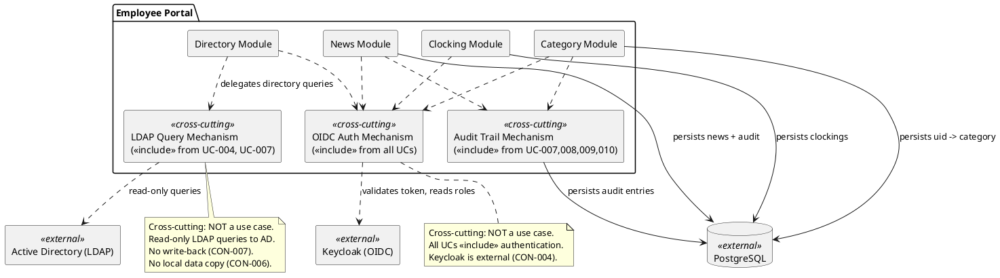

## Document Control

| Field | Value |
|---|---|
| Phase | Inception |
| Status | Draft |
| Milestone Target | End of Inception |
| Iteration | 1 (Cycle 1) |

## Functionality

### Security

| ID | Requirement | Source | Volatility |
|---|---|---|---|
| SEC-001 | OIDC authentication via existing Keycloak — portal is a client only; no deployment or realm design | CON-004 | Low |
| SEC-002 | Role-based access control: Employee role (clocking, news browse, directory search) vs HR Administrator role (clocking review, export, category assignment, news management) — roles read from Keycloak claims | CON-004, FR-004 | Low |
| SEC-003 | No anonymous access — all pages require authentication | CON-009 | Low |
| SEC-004 | Internal corporate network only — no external access | CON-009 | Low |
| SEC-005 | No writing back to Active Directory — all AD access is read-only | CON-007 | Low |

### Licensing

| ID | Requirement | Source | Volatility |
|---|---|---|---|
| LIC-001 | All infrastructure is open-source or already owned (.NET 10, PostgreSQL, Keycloak) — no additional licensing required | CON-001, CON-003, CON-004 | Low |

### Audit (Cross-Cutting Mechanism — NOT a Use Case)

| ID | Requirement | Source | Volatility |
|---|---|---|---|
| AUD-001 | News publication audited: author + timestamp recorded | NFR-005, FR-006 | Low |
| AUD-002 | News edit audited: editor + timestamp recorded for every edit version | NFR-005, FR-008 | Low |
| AUD-003 | News unpublish audited: actor + timestamp recorded | NFR-005, FR-009 | Low |
| AUD-004 | Worker category change audited: actor + timestamp + old value + new value recorded | NFR-005, FR-003 | Low |
| AUD-005 | Employee directory fields are read-only from AD — no audit needed for directory data | NFR-005 | Low |

**Note:** Audit is a cross-cutting mechanism implemented via `<<include>>` from UC-007, UC-008, UC-009, UC-010. It is NOT a standalone use case.

## Usability

| ID | Requirement | Source | Volatility |
|---|---|---|---|
| USA-001 | Custom UI design (docs/inputs/employee-portal-design.html) is mandatory and authoritative for the UI visual layer | CON-011 | Low |
| USA-002 | Employee can clock in/out without help from HR or development team | AC-001 | Low |
| USA-003 | Employee finds colleague's phone/email in under 10 seconds | AC-003 | Low |
| USA-004 | 80% of employees complete at least one clocking with no prior training | AC-004 | Low |
| USA-005 | HR Administrator can publish a news item without technical assistance | AC-002 | Low |
| USA-006 | Compatible with current Chrome and Edge browsers | CON-010 | Low |
| USA-007 | Responsive web design (no native mobile app) — works on corporate browsers including mobile viewport | Scope Statement | Low |

## Reliability

| ID | Requirement | Source | Volatility |
|---|---|---|---|
| REL-001 | System available during extended working hours: Monday–Friday 7:00–19:00. 24/7 not required. | NFR-003 | Low |
| REL-002 | Fault tolerance within corporate network: system tolerates temporary network disruptions and recovers/syncs data once connectivity is restored | NFR-004 | Medium |
| REL-003 | If network drops for 5 minutes, data syncs once connectivity is restored | AC-005 | Medium |
| REL-004 | Backup and server crash recovery are Infrastructure's responsibility, not a portal requirement | CON-014 | Low |

**Architectural note — offline clocking persistence (NFR-004, AC-005):** The scope of fault tolerance is declared: the system must tolerate 5-minute network disruptions and sync data once connectivity is restored. The implementation mechanism (local queuing strategy, sync conflict resolution, persistence layer for offline clockings) is an architectural concern for the Software Architect to resolve in Elaboration — confirmed by the stakeholder as an architectural decision, not a missing scope item. The Requirements Specifier will quantify thresholds (max queue size, sync timeout, conflict policy) in Elaboration.

## Performance

| ID | Requirement | Source | Volatility |
|---|---|---|---|
| PRF-001 | Pages must load in under 3 seconds on the corporate network | NFR-001 | Low |
| PRF-002 | Clock in/out operation must respond in under 1 second | NFR-002 | Low |
| PRF-003 | Directory search returns results fast enough for AC-003 (under 10 seconds total including user interaction) | AC-003, FR-010 | Medium |

**Note:** RS will quantify exact LDAP query timeout thresholds in Elaboration. R001 (LDAP attribute inconsistency) may affect perceived performance if fallback strategies are needed.

## Supportability

| ID | Requirement | Source | Volatility |
|---|---|---|---|
| SUP-001 | Backend: .NET 10 with REST API — standard framework, maintainable by .NET developers | CON-001 | Low |
| SUP-002 | Frontend: Razor Pages — server-rendered, no SPA complexity | CON-002 | Low |
| SUP-003 | Database: PostgreSQL — standard relational database | CON-003 | Low |
| SUP-004 | Worker category list is externally configured (not managed in the portal) — changes to categories do not require code deployment | CON-013 | Medium |
| SUP-005 | No local copy of employee data — no sync job, no reconciliation, no conflict resolution to maintain | CON-006 | Low |

## Design Constraints

| ID | Constraint | Source |
|---|---|---|
| DC-001 | Backend: .NET 10 with REST API | CON-001 |
| DC-002 | Frontend: Razor Pages (intranet, no SPA) | CON-002 |
| DC-003 | Database: PostgreSQL | CON-003 |
| DC-004 | Hosting: internal Windows Server (no cloud) | CON-008 |
| DC-005 | Keycloak is external — portal is OIDC client only, no deployment/provisioning/realm design | CON-004 |
| DC-006 | AD data read via LDAP on demand — no local copy, no sync | CON-005, CON-006 |
| DC-007 | No write-back to AD | CON-007 |
| DC-008 | Custom UI design is mandatory and authoritative | CON-011 |
| DC-009 | No hard delete of news items — unpublish only | CON-012 |
| DC-010 | Worker category list is fixed, externally configured | CON-013 |

## Interfaces

| ID | Interface | Type | Direction | Source |
|---|---|---|---|---|
| INT-001 | Keycloak OIDC | Authentication/Authorization | Portal → Keycloak (outbound) | CON-004 |
| INT-002 | Active Directory LDAP | Directory query (read-only) | Portal → AD (outbound) | CON-005 |
| INT-003 | PostgreSQL | Data persistence | Portal → PostgreSQL (outbound) | CON-003 |
| INT-004 | Chrome / Edge browsers | User interface | Browser → Portal (inbound) | CON-010 |

## Applicable Standards

| ID | Standard | Source | Applicability |
|---|---|---|---|
| STD-001 | OIDC (OpenID Connect) protocol | CON-004 | Authentication interface with Keycloak |
| STD-002 | LDAP v3 | CON-005 | Directory queries to Active Directory |
| STD-003 | CSV format | FR-002 | Clocking report export |
| STD-004 | REST API conventions | CON-001 | Backend API design |
| STD-005 | HTML5 / CSS3 / JavaScript (Razor Pages) | CON-002, CON-010 | Frontend rendering |

## Cross-Cutting Mechanisms Diagram

## Traceability

| Element | Traces From | Link Type | Traces To |
|---|---|---|---|
| SEC-001 | CON-004 | Refines | All UCs (<<include>>) |
| SEC-002 | CON-004, FR-004 | Refines | UC-001–UC-010 |
| SEC-005 | CON-007 | Refines | UC-004, UC-007 |
| AUD-001 | NFR-005, FR-006 | Refines | UC-008 |
| AUD-002 | NFR-005, FR-008 | Refines | UC-009 |
| AUD-003 | NFR-005, FR-009 | Refines | UC-010 |
| AUD-004 | NFR-005, FR-003 | Refines | UC-007 |
| USA-001 | CON-011 | Refines | All UCs |
| USA-002 | AC-001 | Refines | UC-001 |
| USA-003 | AC-003 | Refines | UC-004 |
| USA-004 | AC-004 | Refines | UC-001 |
| USA-005 | AC-002 | Refines | UC-008 |
| REL-001 | NFR-003 | Refines | (All UCs) |
| REL-002 | NFR-004 | Refines | UC-001 (architectural mechanism — Architect, Elaboration) |
| REL-003 | AC-005 | Refines | UC-001 (architectural mechanism — Architect, Elaboration) |
| PRF-001 | NFR-001 | Refines | (All UCs) |
| PRF-002 | NFR-002 | Refines | UC-001 |
| PRF-003 | AC-003, FR-010 | Refines | UC-004 |
| DC-001 | CON-001 | Refines | (Architecture) |
| DC-002 | CON-002 | Refines | (Architecture) |
| DC-003 | CON-003 | Refines | (Architecture) |
| DC-005 | CON-004 | Refines | (Architecture) |
| DC-006 | CON-005, CON-006 | Refines | UC-004, UC-007 |
| INT-001 | CON-004 | Refines | (Architecture) |
| INT-002 | CON-005 | Refines | UC-004, UC-007 |