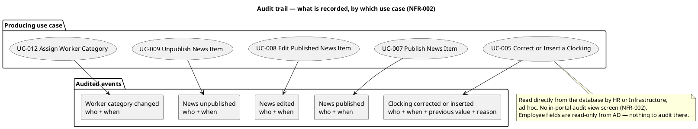

## Document Control
- Phase: Inception
- Status: Draft — under review for the end-of-Inception milestone
- Milestone Target: end-of-Inception (NOT YET ACHIEVED)
- Iteration: 1, Cycle 1
- Owner: RequirementsSpecifier (Development Case §Roles and Ownership — fixed primary owner); produced by SystemAnalyst this iteration per the Work Order
- Last updated: 2026-09-28
## Functionality
### Cross-cutting mechanisms — specified here, never as use cases

These mechanisms deliver no observable value to an actor on their own. They are not use cases; each is included by the use cases that depend on it.

```plantuml
@startuml
title Cross-cutting mechanisms — specified here, included by the use cases (never UCs)

skinparam componentStyle rectangle

package "Supplementary Specification — cross-cutting mechanisms" {
  component "MECH-01 OIDC login via Keycloak\nCON-001, CON-031, CON-033" as M1
  component "MECH-02 LDAP read of directory attributes\nCON-003, CON-011" as M2
  component "MECH-03 Audit trail write\nNFR-002" as M3
  component "MECH-04 Idempotency key on clocking POST\nCON-044" as M4
  component "MECH-05 Client-side clocking retry\nNFR-006, CON-045" as M5
}

package "Use cases that include them" {
  usecase "UC-001 Record Clocking" as UC001
  usecase "UC-002 View Own Clocking History" as UC002
  usecase "UC-003 View All Employee Clockings" as UC003
  usecase "UC-004 Export Monthly Clocking Report" as UC004
  usecase "UC-005 Correct or Insert a Clocking" as UC005
  usecase "UC-006 Read News" as UC006
  usecase "UC-007 Publish News Item" as UC007
  usecase "UC-008 Edit Published News Item" as UC008
  usecase "UC-009 Unpublish News Item" as UC009
  usecase "UC-010 Feature News Item" as UC010
  usecase "UC-011 Search Employee Directory" as UC011
  usecase "UC-012 Assign Worker Category" as UC012
}

UC001 ..> M1 : <<include>>
UC002 ..> M1 : <<include>>
UC003 ..> M1 : <<include>>
UC004 ..> M1 : <<include>>
UC005 ..> M1 : <<include>>
UC006 ..> M1 : <<include>>
UC007 ..> M1 : <<include>>
UC008 ..> M1 : <<include>>
UC009 ..> M1 : <<include>>
UC010 ..> M1 : <<include>>
UC011 ..> M1 : <<include>>
UC012 ..> M1 : <<include>>

UC003 ..> M2 : <<include>>
UC004 ..> M2 : <<include>>
UC011 ..> M2 : <<include>>
UC012 ..> M2 : <<include>>

UC005 ..> M3 : <<include>>
UC007 ..> M3 : <<include>>
UC008 ..> M3 : <<include>>
UC009 ..> M3 : <<include>>
UC012 ..> M3 : <<include>>

UC001 ..> M4 : <<include>>
UC001 ..> M5 : <<include>>

note bottom of M1
  Keycloak is an external system consumed as an OIDC
  client (CON-031) and an intra-network node (CON-032).
  It is not an actor and not a use case.
end note

note bottom of M2
  Employee data has exactly one home (CON-003, CON-004).
  Any use case that must show who an employee is reads
  AD — the clocking report and the CSV export included,
  because FullName is a declared export column (CON-007).
end note
@enduml
```

| ID | Mechanism | Declared by | Included by | Specification |
|---|---|---|---|---|
| MECH-01 | OIDC login via Keycloak; roles read from token claims | CON-001, CON-031, CON-033 | All twelve use cases | The portal is an OIDC client only: register a client, redirect for login, validate the token, read roles from its claims. Nothing more. Keycloak is already running and maintained separately — not deployed, not provisioned, not designed by this project. The OIDC client is already registered and its credentials are with the development team (CON-002). |
| MECH-02 | LDAP read of directory attributes | CON-003, CON-011 | UC-003, UC-004, UC-011, UC-012 | Employee directory data (name, job title, department, office, email, extension) is read from Active Directory over LDAP and is READ-ONLY. No edit form, no local copy, no write-back. Infrastructure will not modify AD; the portal works with AD as it stands. The read is not confined to the directory feature: UC-003 shows the name behind each clocking and UC-004 writes the declared FullName column (CON-007), and neither can take that name from a local copy, because there is none (CON-003). An AD attribute that is empty is written blank; the row is still produced (R004). |
| MECH-03 | Audit trail write | NFR-002 | UC-005, UC-007, UC-008, UC-009, UC-012 | Mandatory traceability, written for compliance and read directly from the database. See Reliability below. |
| MECH-04 | Idempotency key on the clocking POST | CON-044 | UC-001 | Duplicate clocking submissions are rejected by an idempotency key. |
| MECH-05 | Client-side retry of the clocking POST | NFR-006, CON-045 | UC-001 | The clocking page holds the press in the browser (localStorage) and retries its POST for up to 5 minutes. One action, one queue, one entity — nothing to reconcile, no conflict resolution to write. Applies to clocking only. |

### Authorization

Two levels only, from Active Directory group membership (CON-033). Members of the HR AD group publish, edit and unpublish news and manage worker categories; everybody else is an employee with read access to the directory and the news, plus their own clockings. There is no role matrix, no permission screen and no per-category rule. Worker category is descriptive and drives no access decision (CON-024).

### Business rules

| ID | Rule |
|---|---|
| CON-012 | All three offices are in the same timezone (Europe/Madrid). There is no multi-timezone case and no normalisation to design. |
| CON-013 | Only HR corrects or inserts a clocking. There is no self-service correction screen for the employee; an employee who forgets to clock out asks HR. |
| CON-014 | Clocking records are immutable: the original record is never overwritten in place and never deleted. |
| CON-015 | A day whose clock-out is missing exports with ClockOut and HoursWorked empty — a zero would falsely state the employee worked no hours; empty states the value is unknown. The row is still exported, because dropping it would hide the incident from the people who fix it. |
| CON-016 | A clocking pair never crosses midnight. A pair belongs to one calendar date and every export row is keyed by that date. A clocking still open at midnight is an incomplete day. |
| CON-017 | At most one clocking pair per employee per calendar day. |
| CON-018 | One export row per employee per day that has at least one clocking. A day with no clocking — weekend, holiday, sick day, day before joining — produces no row: the portal records clockings, not absences. |
| CON-019 | News featuring is a manual flag HR sets, when publishing or when editing — never automatic. There are no criteria, no dates and no rules that promote a news item by themselves. |
| CON-020 | At most one news item is featured at any moment: featuring one un-features the previous one. This is an invariant of the system, not a convention of the screen — it must hold wherever the change comes from, not only in the form HR happens to use. HR can un-feature the current one and leave none, and then the banner simply does not appear. |
| CON-021 | Unpublishing the featured news item un-features it too: the banner disappears and no other item is promoted to take its place. If HR wants a banner they flag one. |
| CON-022 | Unpublishing a news item hides it and never deletes it — deleting would destroy the audit trail. |
| CON-023 | News categories are General, HR, IT and Events. |
| CON-024 | Worker category is descriptive: it does NOT drive access control. It is used in exactly two places — as a column of the directory that also filters it, and as a column of the CSV export. Nowhere else. |
| CON-025 | A worker has at most one category and it may be empty. An employee with no category assigned still appears in the directory and in the export, with that field blank. No default value is invented for it. |
| CON-026 | Worker categories are a CLOSED list of exactly four values, fixed for this project: Full-time, Part-time, Contractor, Intern. Not configurable; no screen to create or rename them; no fifth value without a Change Request. |
| CON-027 | The directory shows corporate data only — no private personal information. |
| CON-043 | The recorded clocking time is the moment the employee pressed the button, not the time the server received it — otherwise the audit trail records something that did not happen. The server accepts the timestamp the client sends. |
| CON-045 | The clocking retry is one action, one queue, one entity: two clocking presses by the same employee cannot conflict with anything, so there is nothing to reconcile and no conflict resolution to write. This is not the synchronisation the scope excludes — that forbids synchronising copies of employee data, not retrying one POST. |
| CON-046 | Beyond 5 minutes of network outage the employee reports the clocking to HR. |

**CON-015 scope of "outside the portal" — stakeholder decision, 2026-09-28.** HR corrects or inserts a clocking **inside** the portal, as an HR-only use case (UC-005). That is what the `Corrected` column (CON-008) and the audit entry (who, when, previous value, reason — NFR-002) record, and the original record is never overwritten or deleted (CON-014). "Outside the portal" in CON-015 refers only to HR chasing the employee about the missing clock-out, not to entering the correction. Without this decision CON-008 and NFR-002 would have no in-portal source.

### Licensing

No third-party licence is declared. The stack is .NET 10 (CON-028), Razor Pages (CON-029) and PostgreSQL 18 (CON-030), all on the internal Windows Server estate. Keycloak and Active Directory are existing corporate systems, not licensed by this project (CON-031).

### Security

FURPS+ Functionality includes security. The declared security posture is deliberately minimal and is fully fixed by declared constraints — nothing is added here.

| Concern | Requirement | Declared by |
|---|---|---|
| Authentication | Corporate credentials via Active Directory, through Keycloak (OIDC). The portal is an OIDC client only: register a client, redirect for login, validate the token, read roles from its claims. Nothing more. | CON-001, CON-031 |
| Authorization | Two levels only, from Active Directory group membership: members of the HR AD group publish, edit and unpublish news and manage worker categories; everybody else is an employee with read access to the directory and the news, plus their own clockings. | CON-033 |
| No permission model beyond the two levels | No role matrix, no permission administration screen, no rule that reads the worker category to decide what somebody may do. Worker category is descriptive and drives no access decision. | CON-024, CON-033 |
| Network exposure | The portal is accessible only from the internal corporate network. No access from outside the corporate network. | CON-034 |
| Credential handling | The OIDC client and the LDAP connection are configured with placeholder values (issuer, client id, client secret, LDAP host, bind account, base DN), held in configuration and never in code; Infrastructure puts the real values in at deployment. | CON-038 |
| Directory write protection | Employee data is read-only from AD. No write-back, no edit form, no local copy. Infrastructure will not modify AD; the portal works with AD as it stands. | CON-003, CON-011 |
| Data minimisation | The only local data about a person is the AD-user-id-to-category link — two columns and nothing else. The directory shows corporate data only, no private personal information. | CON-004, CON-027 |
| Audit | Mandatory traceability for news publication, edits and unpublishing, for any change to a worker's category, and for every clocking HR corrects or inserts. | NFR-002 |
| CI credential boundary | CI never holds production data or credentials, and never deploys. | CON-036 |

**Not declared, and not added here:** no encryption-at-rest requirement, no password or session policy, no session-timeout value, no penetration-test requirement, and no security logging beyond the audit trail of NFR-002. None is declared and none is invented. [RECOMMENDATION — requires CR] if the stakeholder wants any of them.

### Quality attributes — declared and traced to use cases

Every attribute below cites a declared identifier; none is invented. CON-034 (internal corporate network only) constrains all twelve use cases and is not drawn as twelve edges.

```plantuml
@startuml
title Declared quality attributes and the use cases they constrain

skinparam componentStyle rectangle

package "Performance" {
  component "NFR-003 page load < 3s\nAC-001 full page load" as Q1
  component "NFR-004 clocking < 1s" as Q2
  component "NFR-001 200 employees — no archive screen" as Q3
}

package "Reliability" {
  component "NFR-005 Mon-Fri 07:00-19:00" as Q4
  component "NFR-006 5-minute clocking retry\nAC-006" as Q5
  component "NFR-002 audit trail" as Q6
}

package "Usability" {
  component "NFR-007 no-connection message" as Q7
  component "CON-035 Chrome and Edge" as Q8
  component "CON-041 mandatory UI design" as Q9
  component "AC-004 find colleague < 10s" as Q10
  component "AC-005 clocking with no training\nAC-002" as Q11
  component "AC-003 publish without assistance" as Q12
}

package "Functionality" {
  component "CON-033 two-level authorization" as Q13
  component "CON-007 / CON-008 CSV format" as Q14
  component "CON-026 closed category list" as Q15
}

package "Use cases" {
  usecase "UC-001 Record Clocking" as UC001
  usecase "UC-002 View Own Clocking History" as UC002
  usecase "UC-003 View All Employee Clockings" as UC003
  usecase "UC-004 Export Monthly Clocking Report" as UC004
  usecase "UC-005 Correct or Insert a Clocking" as UC005
  usecase "UC-006 Read News" as UC006
  usecase "UC-007 Publish News Item" as UC007
  usecase "UC-008 Edit Published News Item" as UC008
  usecase "UC-009 Unpublish News Item" as UC009
  usecase "UC-010 Feature News Item" as UC010
  usecase "UC-011 Search Employee Directory" as UC011
  usecase "UC-012 Assign Worker Category" as UC012
}

Q1 --> UC001
Q1 --> UC006
Q1 --> UC011
Q2 --> UC001
Q3 --> UC006
Q4 --> UC001
Q5 --> UC001
Q6 --> UC005
Q6 --> UC007
Q6 --> UC008
Q6 --> UC009
Q6 --> UC012
Q7 --> UC006
Q7 --> UC011
Q8 --> UC001
Q8 --> UC006
Q8 --> UC011
Q9 --> UC001
Q9 --> UC006
Q9 --> UC011
Q10 --> UC011
Q11 --> UC001
Q12 --> UC007
Q13 --> UC003
Q13 --> UC004
Q13 --> UC005
Q13 --> UC007
Q13 --> UC008
Q13 --> UC009
Q13 --> UC010
Q13 --> UC012
Q14 --> UC004
Q15 --> UC011
Q15 --> UC012

note bottom
  CON-034 (internal corporate network only) constrains all twelve
  use cases and is not drawn as twelve edges.
  Every attribute cites a declared identifier; none is invented.
end note
@enduml
```

## Usability

| ID | Requirement | Declared by |
|---|---|---|
| NFR-007 | The directory and the news require the network and show a 'no connection' message when it is unavailable. Nothing is copied locally, so there is nothing to cache and nothing to sync. | NFR-007 |
| — | The UI visual layer is fixed: `docs/inputs/employee-portal-design.html` is mandatory and authoritative, committed to the repository with the project inputs. The portal MUST implement it. | CON-041 |
| — | Compatible with the corporate browsers: current Chrome and Edge. | CON-035 |
| — | The portal is responsive web only — it adapts to the browser. There is no native mobile app. | Scope statement |
| AC-004 | Any employee finds a colleague's phone/email in under 10 seconds. | AC-004 |
| AC-005 | 80% of employees complete at least one clocking with no prior training. | AC-005 |

## Reliability
| ID | Requirement | Declared by |
|---|---|---|
| NFR-002 | Mandatory audit trail, written for compliance and read directly from the database: who publishes each news item, who edits it and who unpublishes it (author + timestamp in every case); any change to a worker's category; and every clocking HR corrects or inserts (who, when, previous value, reason). Employee fields are read-only from AD, so there is nothing to audit there. No external compliance regime applies and no retention period is mandated — HR or Infrastructure read the audit ad hoc when needed. There is no in-portal audit view screen. | NFR-002 |
| NFR-005 | The portal must be available during extended working hours, Monday to Friday 07:00-19:00, with fault tolerance within the corporate network. 24/7 availability is not required. | NFR-005 |
| NFR-006 | A clocking made while the corporate network is down for up to 5 minutes is not lost. The clocking page holds the press in the browser (localStorage) and retries its POST for up to 5 minutes. This applies to clocking only. | NFR-006 |
| CON-042 | Backups: the Infrastructure team's existing server-backup practice already covers this PostgreSQL instance in restorable form, confirmed in writing with a verified restore test. No backup design, no backup tooling and no restore procedure is part of this project. | CON-042 |

**Availability window — declared consequence.** NFR-005 declares the availability window as Monday to Friday 07:00-19:00 and states that 24/7 availability is not required. A clocking attempted outside that window is therefore not covered by the availability requirement; CON-046's path applies — the employee reports the clocking to HR. The window is the stakeholder's declared choice and is not widened here.

### Audit trail coverage

```plantuml
@startuml
title Audit trail — what is recorded, by which use case (NFR-002)

skinparam componentStyle rectangle

package "Audited events" {
  component "News published\nwho + when" as A1
  component "News edited\nwho + when" as A2
  component "News unpublished\nwho + when" as A3
  component "Worker category changed\nwho + when" as A4
  component "Clocking corrected or inserted\nwho + when + previous value + reason" as A5
}

package "Producing use case" {
  usecase "UC-007 Publish News Item" as UC007
  usecase "UC-008 Edit Published News Item" as UC008
  usecase "UC-009 Unpublish News Item" as UC009
  usecase "UC-012 Assign Worker Category" as UC012
  usecase "UC-005 Correct or Insert a Clocking" as UC005
}

UC007 --> A1
UC008 --> A2
UC009 --> A3
UC012 --> A4
UC005 --> A5

note bottom
  Read directly from the database by HR or Infrastructure,
  ad hoc. No in-portal audit view screen (NFR-002).
  Employee fields are read-only from AD — nothing to audit there.
end note
@enduml
```

## Performance

| ID | Requirement | Declared by |
|---|---|---|
| NFR-003 | The page must load in under 3 seconds on the corporate network. | NFR-003 |
| NFR-004 | The clock in/out operation must respond in under 1 second. | NFR-004 |
| AC-001 | The full page load as the employee experiences it — from the browser's request to the page displayed and usable, including the clocking page's script. Server response time is the engineering target that makes it achievable, not a substitute for it. | AC-001 |
| NFR-001 | The stakeholder addressed volume only in the context of news: 200 employees is small enough that news need no archive screen — newest-first listing plus the category filter is enough. No general scalability target was declared for the portal. | NFR-001 |

The RequirementsSpecifier quantifies the thresholds and the measurement conditions in Elaboration. No throughput, concurrency or resource-usage target was declared, and none is invented here.

## Supportability

| Concern | Requirement | Declared by |
|---|---|---|
| Deployment target | A .NET application on the internal Windows Server estate that Infrastructure already runs. Infrastructure has accepted operating the portal on that basis. | CON-010 |
| Post-launch operations | Infrastructure operates the portal in production once it is live — deployment, monitoring and patching — exactly as they already operate AD and Keycloak. The development team hands over at the end of Transition and does not run it afterwards. | CON-039 |
| CI | The repository lives on the hosted SCM provider this workspace is configured with; build and test run on that provider's hosted CI. 'No cloud' and 'internal network only' govern the portal at runtime, not the development toolchain. CI never holds production data or credentials, and never deploys: Infrastructure does. | CON-036 |
| Data migration | There is none. The portal starts empty and records clockings from go-live onwards. The historical Excel sheets stay on the shared drive as a read-only archive and are not imported. | CON-040 |
| Configurability | The OIDC client and the LDAP connection are configured with placeholder values (issuer, client id, client secret, LDAP host, bind account, base DN), held in configuration and never in code; Infrastructure puts the real values in at deployment. | CON-038 |
| Worker-category configurability | The category list is a CLOSED list of four values, fixed for this project. Not configurable; no screen to create or rename them; no fifth value without a Change Request. | CON-026 |
| Token spend | There is no budget or cap on token spend for this project, and none is to be set by the team. Each iteration's measured spend is recorded and used to forecast the next; declared scope is never cut or deferred to fit an estimate. | CON-037 |

## Design Constraints

| ID | Category | Constraint |
|---|---|---|
| CON-001 | Technical | Authentication uses corporate credentials via Active Directory, through Keycloak (OIDC). |
| CON-002 | Technical | The portal's OIDC client is already registered in Keycloak and its credentials are with the development team. Login can be tested from day one — no request to raise, no queue, no gate. |
| CON-003 | Architectural | Employee directory data is read from Active Directory over LDAP and is READ-ONLY in the portal. No edit form and no local copy. |
| CON-004 | Architectural | Worker category is stored as a link — AD user id → category — never as a duplicate of the employee. The local table holds two columns and nothing else. No synchronisation, no reconciliation, no conflict to resolve. |
| CON-005 | Technical | EmployeeId in the CSV export is the AD sAMAccountName — the only identifier guaranteed populated and unique in all three offices. Read from the authenticated session and written as-is. No mapping table. |
| CON-006 | Technical | Clockings are stored in UTC and displayed in Europe/Madrid. |
| CON-007 | Technical | CSV export columns, in this exact order: EmployeeId, FullName, WorkerCategory, Date, ClockIn, ClockOut, HoursWorked, Corrected. |
| CON-008 | Technical | CSV export value formats: Date in ISO 8601 (2026-06-22); ClockIn and ClockOut as 24-hour HH:mm with no seconds (08:02, 17:03); HoursWorked in decimal hours with two decimals (8.25), computed from the recorded clocking times — not from the minute-rounded values shown — and empty when the clock-out is missing; Corrected is Y when HR corrected or inserted any clocking of that day, N otherwise. |
| CON-009 | Environmental | The portal is an internal web application accessed from the corporate browser. |
| CON-010 | Environmental | Deployment target: a .NET application on the internal Windows Server estate that Infrastructure already runs. |
| CON-011 | Operational | Infrastructure will not modify Active Directory. The portal must work with AD as it stands. |
| CON-028 | Technical | Backend: .NET 10 with a REST API. |
| CON-029 | Technical | Frontend: Razor Pages (intranet, no SPA needed). 'No SPA' means no client-side framework and no client-side router — it does not mean no JavaScript. A page-level script on an already-rendered page is Razor Pages as normal, and the clocking page needs one. |
| CON-030 | Technical | Database: PostgreSQL 18 — the latest stable major at project start. The patch level floats; the major is pinned. Infrastructure installs it on the same Windows Server estate they already operate. |
| CON-031 | Technical | Keycloak is already running and maintained separately — it is NOT part of this project. Do not deploy it, provision it, design its infrastructure or plan work for it. The portal is an OIDC client only. |
| CON-032 | Architectural | Keycloak runs INSIDE the corporate network — the company's internal identity provider, deployed on the internal estate Infrastructure operates alongside Active Directory. External to this project is not the same as external to the network: the OIDC redirect is an intra-network call, nothing about login crosses the corporate boundary, and login keeps working with no internet link. A deployment view that puts Keycloak in a cloud node contradicts this and is wrong. |
| CON-033 | BusinessRule | Authorization has two levels, from Active Directory group membership: members of the HR AD group publish, edit and unpublish news and manage worker categories; everybody else is an employee with read access to the directory and the news, plus their own clockings. |
| CON-034 | Environmental | The portal is accessible only from the internal corporate network. No access from outside the corporate network. |
| CON-035 | Environmental | Compatible with the corporate browsers: current Chrome and Edge. |
| CON-036 | Operational | CI runs on the hosted SCM provider's hosted CI. |
| CON-037 | Operational | No budget or cap on token spend; none is to be set by the team. |
| CON-038 | Operational | The team works with Keycloak and AD against stand-ins, never against the real ones. Placeholder configuration values, never in code. Validation against the real Keycloak and the real AD is done by people (Infrastructure, with HR) and is not team work to plan. |
| CON-039 | Operational | Infrastructure operates the portal in production once it is live. |
| CON-040 | Operational | Data migration: there is none. |
| CON-041 | Architectural | The custom design at `docs/inputs/employee-portal-design.html` is MANDATORY and authoritative for the UI visual layer. |
| CON-042 | Operational | Backups: the Infrastructure team's existing server-backup practice covers this PostgreSQL instance. |
| CON-044 | Technical | Duplicate clocking submissions are rejected by an idempotency key. |
| CON-047 | Operational | Risk acceptance is granted in advance by Laura Gómez (project sponsor) and is not asked again. |

## Interfaces

| Interface | Direction | Counterpart | Specification |
|---|---|---|---|
| OIDC login | Outbound, intra-network | Keycloak | Redirect for login, validate the token, read roles from its claims (CON-001, CON-031). The OIDC client is already registered (CON-002). The redirect is an intra-network call; login keeps working with no internet link (CON-032). |
| LDAP directory read | Outbound, intra-network | Active Directory | Read name, job title, department, office, email, extension (CON-003). Read-only; no write-back (CON-011). |
| Corporate browser | Inbound | Employee, HR Administrator | Current Chrome and Edge (CON-035). Internal corporate network only (CON-034). |
| CSV file download | Outbound | HR Administrator's browser | Eight columns in the declared order with the declared value formats (CON-007, CON-008). |
| PostgreSQL | Outbound | PostgreSQL 18 on the internal Windows Server estate | Clockings, news items, the AD-user-id-to-category link (two columns, CON-004) and audit entries. |

## Applicable Standards

| Standard | Applies to | Declared by |
|---|---|---|
| OIDC | Authentication against Keycloak | CON-001, CON-031 |
| LDAP | Directory read against Active Directory | CON-003 |
| ISO 8601 | Date format in the CSV export (2026-06-22) | CON-008 |
| CSV | Monthly clocking report | FR-003, CON-007 |
| Europe/Madrid | Clocking display and export timezone | CON-006, CON-012 |

No external compliance regime applies and no retention period is mandated (NFR-002).

## Traceability
| Element | Traces From | Link Type | Traces To |
|---|---|---|---|
| Supplementary Specification §Functionality — MECH-01 OIDC login | CON-001, CON-002, CON-031, CON-032, CON-033 | Refines | UC-001, UC-002, UC-003, UC-004, UC-005, UC-006, UC-007, UC-008, UC-009, UC-010, UC-011, UC-012 |
| Supplementary Specification §Functionality — MECH-02 LDAP read | CON-003, CON-011 | Refines | UC-003, UC-004, UC-011, UC-012 |
| Supplementary Specification §Functionality — MECH-03 Audit trail write | NFR-002 | Refines | UC-005, UC-007, UC-008, UC-009, UC-012 |
| Supplementary Specification §Functionality — MECH-04 Idempotency key | CON-044 | Refines | UC-001 |
| Supplementary Specification §Functionality — MECH-05 Client-side retry | NFR-006, CON-045, CON-046 | Refines | UC-001 |
| Supplementary Specification §Functionality — business rules | CON-012, CON-013, CON-014, CON-015, CON-016, CON-017, CON-018, CON-019, CON-020, CON-021, CON-022, CON-023, CON-024, CON-025, CON-026, CON-027, CON-043, CON-045, CON-046 | Refines | Use-Case Model |
| Supplementary Specification §Usability | NFR-007, CON-035, CON-041, AC-004, AC-005 | Refines | UC-006, UC-011 |
| Supplementary Specification §Reliability | NFR-002, NFR-005, NFR-006, CON-042 | Refines | UC-001, UC-005, UC-007, UC-008, UC-009, UC-012 |
| Supplementary Specification §Performance | NFR-001, NFR-003, NFR-004, AC-001 | Refines | UC-001, UC-006 |
| Supplementary Specification §Supportability | CON-010, CON-026, CON-036, CON-037, CON-038, CON-039, CON-040 | Refines | Software Architecture Document |
| Supplementary Specification §Design Constraints | CON-001, CON-002, CON-003, CON-004, CON-005, CON-006, CON-007, CON-008, CON-009, CON-010, CON-011, CON-028, CON-029, CON-030, CON-031, CON-032, CON-033, CON-034, CON-035, CON-036, CON-037, CON-038, CON-039, CON-040, CON-041, CON-042, CON-044, CON-047 | Refines | Software Architecture Document |
| Supplementary Specification §Interfaces | CON-001, CON-003, CON-005, CON-007, CON-008, CON-034, CON-035 | Refines | Software Architecture Document |
| Supplementary Specification §Applicable Standards | CON-001, CON-003, CON-006, CON-007, CON-008, CON-012, NFR-002 | Refines | Software Architecture Document |

